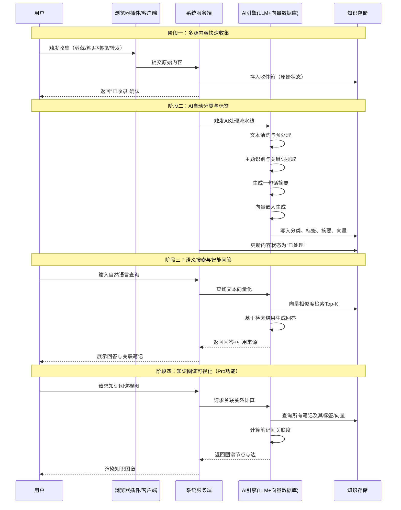
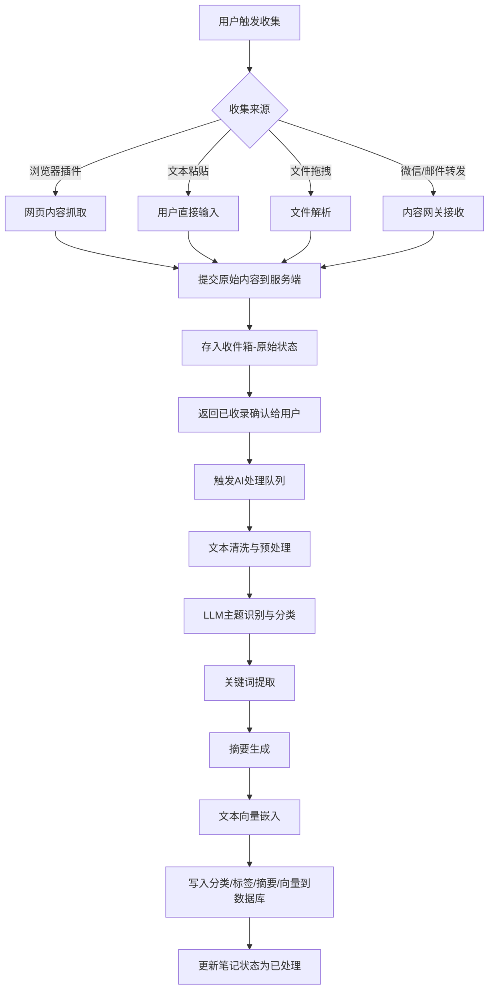
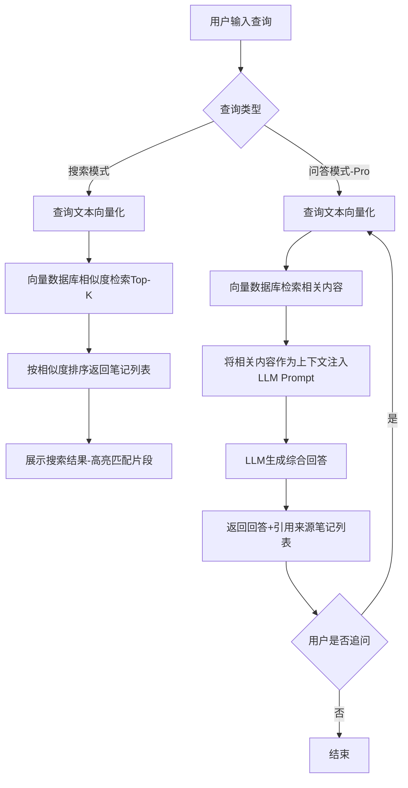
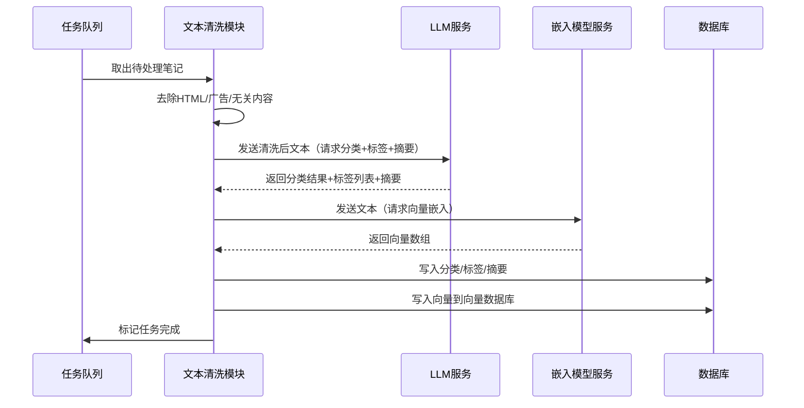
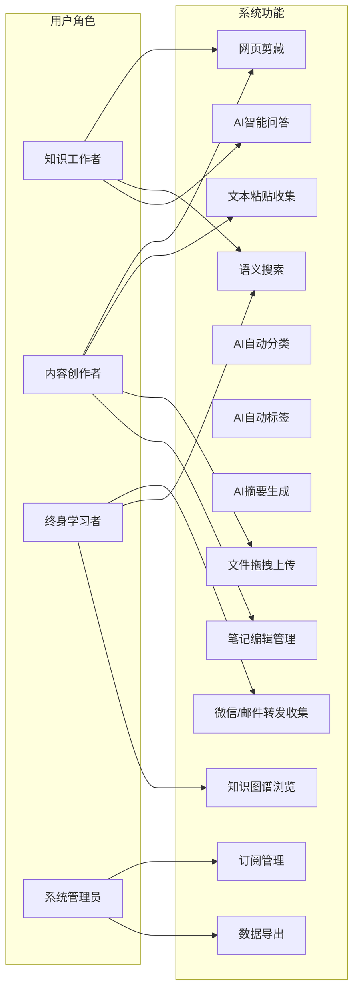
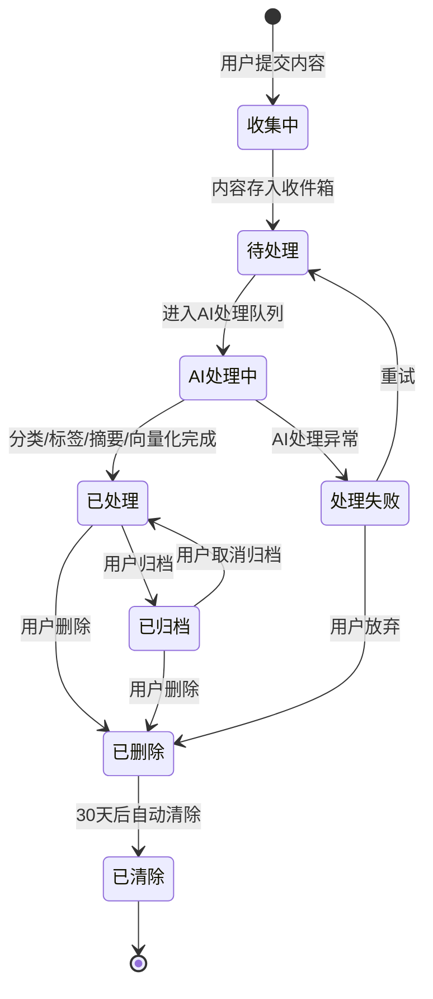

# AI个人知识碎片整理助手 - 用户需求说明书（URS）

# 1.需求概述

## 1.1 需求介绍

AI个人知识碎片整理助手是一款面向知识工作者的AI驱动型个人知识管理工具。产品定位为"知识碎片的中转站和索引器"，不替代Notion/Obsidian等重型笔记工具，而是专注于解决"收藏即遗忘"的普遍痛点——用户每天收藏大量网页、文章、笔记，但绝大多数收藏后再也不看。

本系统通过AI自动化能力，实现碎片知识从"收集→分类→检索→复用"的全链路智能化，让每一条收藏都能被找到、被利用、被连接。

### 1.1.1 所属领域

- 个人效率工具 / 知识管理
- AI应用 / 智能文本处理
- 终身学习 / 内容消费辅助

## 1.2 需求目标

1. **解决"收藏即遗忘"问题**：通过AI自动分类与标签，让用户无需手动整理即可将碎片内容归入对应知识分类，降低知识管理门槛。
2. **实现碎片知识的可发现性**：通过语义搜索与智能问答，让用户能用自然语言从知识库中检索到相关内容，而非依赖关键词精确匹配。
3. **降低知识收集摩擦**：提供多源快速收集通道（网页剪藏、文本粘贴、文件拖拽、微信/邮件转发），让收集动作在3秒内完成。
4. **构建个人知识图谱**：通过AI关联分析，将碎片知识连接成网络，帮助用户发现知识之间的隐含关系。
5. **MVP快速验证**：在12-14天内完成核心功能开发，验证"AI驱动的个人知识碎片管理"这一产品假设。

## 1.3 系统使用角色

| 角色 | 描述 | 典型场景 |
| --- | --- | --- |
| 知识工作者 | 研究员、分析师、咨询顾问 | 收集行业报告、研究论文、市场数据，需要快速检索和关联分析 |
| 内容创作者 | 博主、作者、自媒体运营 | 积累写作素材、灵感片段、参考资料，需要按主题组织和复用 |
| 终身学习者 | 日常收藏大量文章/笔记的学习型用户 | 收藏教程、笔记、视频摘要，需要系统化管理学习资源 |
| 系统管理员 | 平台运营人员 | 管理用户账户、监控系统运行、处理付费订阅 |

## 1.4 业务流程图

# 2.功能原型

| 原型名称 | 原型链接 | 对应端 | 备注 |
| --- | --- | --- | --- |
| AI个人知识碎片整理助手-Web端 | 需求方提供 | WEB端 | 主工作台，含收件箱、知识库、搜索、图谱等核心模块 |
| AI个人知识碎片整理助手-浏览器插件 | 需求方提供 | WEB端 | 网页剪藏插件，Chrome/Edge/Firefox扩展 |
| AI个人知识碎片整理助手-移动端 | 需求方提供 | APP端 | iOS/Android客户端，支持微信/邮件转发收集（Pro版多端同步） |

# 3.需求清单

## 3.1 Web端-主工作台

| 模块 | 一级功能 | 二级功能 | 功能描述 | 备注 |
| --- | --- | --- | --- | --- |
| 收件箱 | 内容收集 | 文本粘贴收集 | 用户可在收件箱页面直接粘贴文本内容，系统自动创建一条新笔记并进入AI处理流程 | |
| 收件箱 | 内容收集 | 文件拖拽上传 | 用户可将文件（PDF/Word/TXT/Markdown/图片OCR）拖拽到收件箱区域，系统解析文件内容并创建笔记 | 支持批量拖拽 |
| 收件箱 | 内容收集 | 微信/邮件转发接收 | 系统提供专属接收邮箱和微信转发入口，用户将内容转发后系统自动接收并创建笔记 | Pro功能，需绑定账号 |
| 收件箱 | 内容管理 | 收件箱列表展示 | 展示所有待处理和已处理的笔记列表，支持按时间、状态筛选 | 显示标题、摘要、标签、处理状态 |
| 收件箱 | 内容管理 | 笔记详情查看 | 点击笔记可查看全文内容、AI生成的分类、标签、摘要，以及关联笔记推荐 | |
| 收件箱 | 内容管理 | 笔记手动编辑 | 用户可手动修改标题、内容、标签、分类，AI处理结果可被用户覆盖 | |
| 收件箱 | 内容管理 | 笔记删除与归档 | 用户可删除不需要的笔记，或归档暂时不用但未来可能参考的笔记 | 删除进入回收站，30天后自动清除 |
| 知识库 | 分类浏览 | 按分类浏览笔记 | 用户可按AI自动生成的知识分类（如"技术""商业""设计"等）浏览笔记列表 | 支持查看分类下的笔记数量和子分类 |
| 知识库 | 分类浏览 | 按标签筛选笔记 | 用户可点击标签快速筛选出所有含该标签的笔记 | 支持多标签组合筛选 |
| 知识库 | 分类管理 | 自定义分类 | 用户可创建、重命名、删除自定义分类，将笔记从AI分类移动到自定义分类 | |
| 知识库 | 分类管理 | 自定义标签 | 用户可创建自定义标签并手动添加到笔记上，与AI自动标签共存 | |
| 知识库 | 批量操作 | 批量移动/标签 | 用户可勾选多条笔记，批量移动到指定分类或批量添加/移除标签 | |
| 搜索与问答 | 语义搜索 | 自然语言搜索 | 用户在搜索框输入自然语言问题（如"关于远程办公效率的内容"），系统从知识库中检索语义相关的笔记并排序展示 | 基于向量相似度，不依赖关键词精确匹配 |
| 搜索与问答 | 语义搜索 | 搜索高亮与预览 | 搜索结果展示笔记标题、摘要，并高亮匹配内容片段，用户可快速判断相关性 | |
| 搜索与问答 | 智能问答 | AI问答生成 | 用户提问后，AI基于知识库中的相关内容生成一段综合回答，并标注引用来源（关联的笔记列表） | Pro功能 |
| 搜索与问答 | 智能问答 | 追问与多轮对话 | 用户可基于上一轮回答继续追问，AI结合上下文和知识库给出更深入的回答 | Pro功能 |
| 搜索与问答 | 搜索筛选 | 按范围搜索 | 用户可指定搜索范围（全库/某分类/某标签/某时间段），缩小检索范围 | |
| 知识图谱（Pro） | 图谱可视化 | 全局知识图谱 | 以节点-边的图形化方式展示所有笔记之间的关联关系，节点大小反映关联度，点击节点可跳转到笔记详情 | Pro功能 |
| 知识图谱（Pro） | 图谱可视化 | 局部关联图谱 | 选中某条笔记后，展示与该笔记关联度最高的N条笔记及其关系链路 | Pro功能 |
| 知识图谱（Pro） | 图谱交互 | 图谱缩放与筛选 | 用户可缩放图谱、按分类/标签筛选显示的节点范围 | Pro功能 |
| 个人账户 | 账户管理 | 注册与登录 | 支持邮箱注册、微信扫码登录、第三方OAuth登录 | |
| 个人账户 | 账户管理 | 订阅管理 | 用户可查看当前订阅版本（免费版/Pro版），升级/降级/续费操作 | 对接支付系统 |
| 个人账户 | 账户管理 | 用量查看 | 用户可查看当前笔记数量、已用存储空间等用量信息 | 免费版显示100条限额进度 |
| 个人账户 | 设置 | 通知偏好设置 | 用户可设置AI处理完成通知、新关联发现通知等推送偏好 | |
| 个人账户 | 设置 | 数据导出 | 用户可将全部笔记导出为JSON/Markdown/CSV格式 | Pro功能 |

## 3.2 浏览器插件端

| 模块 | 一级功能 | 二级功能 | 功能描述 | 备注 |
| --- | --- | --- | --- | --- |
| 网页剪藏 | 一键剪藏 | 网页全文剪藏 | 用户在浏览器中点击插件图标，一键将当前网页标题、正文、来源URL剪藏到收件箱 | |
| 网页剪藏 | 一键剪藏 | 选中内容剪藏 | 用户选中网页中的部分内容后点击插件，仅剪藏选中的文本片段 | |
| 网页剪藏 | 剪藏选项 | 剪藏前预览与编辑 | 剪藏前弹出预览窗口，用户可修改标题、添加备注、选择分类后再确认剪藏 | |
| 网页剪藏 | 剪藏选项 | 自动剪藏（静默） | 用户可在设置中开启自动剪藏模式，点击后直接进入收件箱不弹预览 | |
| 插件账户 | 账号绑定 | 登录状态同步 | 插件需与Web端账户绑定，剪藏内容自动归属到对应用户的知识库 | |
| 插件账户 | 剪藏历史 | 查看最近剪藏 | 插件弹窗中展示最近5条剪藏记录及其AI处理状态 | |

## 3.3 移动端-APP端

| 模块 | 一级功能 | 二级功能 | 功能描述 | 备注 |
| --- | --- | --- | --- | --- |
| 移动端收集 | 文本收集 | 快捷文本输入 | 打开APP后可快速输入一段文本并保存为笔记 | |
| 移动端收集 | 文件收集 | 系统分享接入 | 在其他APP（如微信、邮件、浏览器）中通过系统"分享"功能，将内容直接发送到本APP收件箱 | iOS/Android系统级分享 |
| 移动端收集 | 多媒体收集 | 图片OCR收集 | 拍摄或选择图片，系统通过OCR提取文字内容后创建笔记 | |
| 移动端浏览 | 知识库浏览 | 列表浏览 | 浏览所有笔记列表，支持按分类/标签筛选 | |
| 移动端浏览 | 搜索 | 语义搜索 | 在APP中使用自然语言搜索知识库内容 | |
| 移动端同步 | 数据同步 | 多端实时同步 | 移动端与Web端数据实时同步，任一端修改后其他端自动更新 | Pro功能 |

## 3.4 后台服务

| 模块 | 一级功能 | 二级功能 | 功能描述 | 备注 |
| --- | --- | --- | --- | --- |
| AI处理引擎 | 内容处理 | 文本清洗与预处理 | 接收原始内容后去除HTML标签、广告内容、无关信息，提取纯净文本 | 系统自动执行 |
| AI处理引擎 | 内容处理 | 主题识别与分类 | 调用LLM对文本进行主题分析，自动归入预定义分类体系 | 分类体系可由管理员配置 |
| AI处理引擎 | 内容处理 | 关键词提取 | 从文本中提取3-8个关键词作为标签 | |
| AI处理引擎 | 内容处理 | 摘要生成 | 为每条笔记生成不超过100字的一句话摘要 | |
| AI处理引擎 | 向量化 | 文本向量嵌入 | 将笔记文本转化为向量表示，存入向量数据库用于语义搜索 | 使用开源嵌入模型 |
| AI处理引擎 | 语义检索 | 查询向量化与匹配 | 将用户查询文本向量化后，在向量数据库中进行相似度检索，返回Top-K结果 | |
| AI处理引擎 | 智能问答 | 基于知识库的问答生成 | 将检索到的相关内容作为上下文，调用LLM生成针对用户问题的综合回答 | Pro功能 |
| AI处理引擎 | 关联计算 | 笔记关联度计算 | 定期计算笔记之间的向量相似度，建立关联关系用于知识图谱展示 | Pro功能，异步批量计算 |
| 业务服务 | 用户管理 | 用户注册与认证 | 支持邮箱注册、OAuth登录、微信登录，管理JWT令牌 | |
| 业务服务 | 用户管理 | 订阅与权限控制 | 根据用户订阅版本（免费版/Pro版）控制功能权限和用量限制 | 对接支付网关 |
| 业务服务 | 内容管理 | 笔记CRUD | 提供笔记的创建、读取、更新、删除、归档API | |
| 业务服务 | 内容管理 | 分类与标签管理 | 提供分类和标签的CRUD、笔记-标签关联管理API | |
| 业务服务 | 内容管理 | 内容接收网关 | 处理来自浏览器插件、微信转发、邮件转发的内容接入请求 | |
| 业务服务 | 任务调度 | AI处理队列 | 管理AI处理任务的异步队列，支持重试、优先级、并发控制 | |
| 系统管理 | 监控 | 系统运行监控 | 监控API响应时间、AI处理队列积压量、存储用量等核心指标 | |
| 系统管理 | 配置 | AI模型配置 | 配置LLM和嵌入模型的API密钥、模型版本、调用参数 | |
| 系统管理 | 配置 | 分类体系配置 | 管理员可配置系统默认分类体系（增删改分类节点） | |

# 4.非功能需求

## 4.1 使用界面需求

| 编号 | 需求描述 |
| --- | --- |
| UI-01 | Web端采用响应式设计，适配1024px~2560px宽度的桌面浏览器屏幕 |
| UI-02 | 主色调采用深色/浅色主题切换，默认浅色主题 |
| UI-03 | 收件箱页面支持列表视图和卡片视图两种模式切换 |
| UI-04 | 知识图谱使用Canvas/SVG渲染，支持流畅的拖拽、缩放交互（60fps） |
| UI-05 | 关键操作（剪藏、搜索、AI处理）需提供加载状态反馈和成功/失败提示 |
| UI-06 | 界面文案支持中文（简体），未来可扩展英文 |

## 4.2 软硬件环境需求

| 编号 | 环境 | 需求描述 |
| --- | --- | --- |
| ENV-01 | 客户端-Web | 支持Chrome 90+、Firefox 88+、Edge 90+、Safari 14+ |
| ENV-02 | 客户端-插件 | 支持Chrome、Firefox、Edge浏览器扩展 |
| ENV-03 | 客户端-移动端 | iOS 14+、Android 10+ |
| ENV-04 | 服务端 | Linux（Ubuntu 20.04+/CentOS 7+），Docker容器化部署 |
| ENV-05 | 服务端依赖 | PostgreSQL 14+、Redis 6+、向量数据库（Milvus/Qdrant/Weaviate）、对象存储（MinIO/S3） |
| ENV-06 | AI依赖 | LLM API（OpenAI GPT-4/国产大模型API）、文本嵌入API |

## 4.3 性能需求

| 编号 | 指标 | 要求 |
| --- | --- | --- |
| PERF-01 | 内容收集响应 | 从用户提交到返回"已收录"确认 ≤ 2秒 |
| PERF-02 | AI处理延迟 | 从内容进入收件箱到AI处理完成（分类+标签+摘要+向量化）≤ 30秒（MVP阶段），≤ 10秒（正式版） |
| PERF-03 | 语义搜索响应 | 从用户发起搜索到返回结果 ≤ 3秒（10万条笔记规模内） |
| PERF-04 | AI问答响应 | 从用户提问到开始流式输出回答 ≤ 5秒（Pro功能） |
| PERF-05 | 并发用户数 | MVP阶段支持100并发用户，正式版支持1000并发用户 |
| PERF-06 | 存储规模 | 单用户知识库支持10万条笔记（Pro版），向量数据库支持百万级向量检索 |
| PERF-07 | 数据同步 | 多端同步延迟 ≤ 5秒（Pro功能） |
| PERF-08 | 知识图谱渲染 | 1000节点规模的图谱首次渲染 ≤ 3秒，交互操作帧率 ≥ 30fps |

## 4.4 约束性需求

1. **免费版功能约束**：免费版用户最多存储100条笔记，仅支持基础分类浏览和关键词搜索，不支持AI问答、知识图谱、API接入、多端同步功能。
2. **数据隐私约束**：用户笔记内容属于个人隐私数据，系统不得将用户内容用于模型训练或向第三方共享。所有AI处理应在安全隔离环境中进行。
3. **AI模型约束**：MVP阶段通过调用第三方LLM API（如OpenAI/国产大模型）实现AI能力，不自建模型。需设计模型抽象层以便后续切换模型供应商。
4. **浏览器插件约束**：插件需遵循各浏览器扩展商店的审核规范，不得请求超出功能需要的浏览器权限。
5. **系统需要后台服务支撑**：是。系统需要后台服务来支撑AI处理队列、内容接收网关、语义检索、用户认证、订阅管理等功能。

# 5.接口需求

## 5.1 硬件接口需求

不涉及硬件接口需求。本产品为纯软件系统，无硬件设备对接要求。

## 5.2 软件接口需求

| 模块 | 接口名称 | 输入 | 输出 | 功能描述 |
| --- | --- | --- | --- | --- |
| 浏览器插件 | 网页内容抓取接口 | 当前网页URL、DOM结构、用户选中文本 | 清洗后的网页标题+正文+元数据 | 插件从浏览器获取网页内容并提交到服务端 |
| 移动端 | 系统分享接口（Share Intent） | 其他APP分享的文本/图片/文件 | 笔记创建结果 | 通过iOS Share Extension / Android Share Intent接收外部内容 |
| 内容接收 | 邮件接收接口（IMAP/SMTP） | 用户转发到专属邮箱的邮件内容 | 解析后的文本内容 | 系统监听专属邮箱，解析邮件正文和附件并创建笔记 |
| 内容接收 | 微信转发接口 | 用户通过微信公众号/小程序转发的内容 | 笔记创建结果 | 通过微信公众号模板消息或小程序分享接口接收内容 |
| AI引擎 | LLM文本分析接口 | 待处理文本 | 分类、标签、摘要 | 调用LLM API对笔记内容进行主题识别、关键词提取、摘要生成 |
| AI引擎 | 文本嵌入接口 | 待嵌入文本 | 向量数组（如1536维） | 调用嵌入模型API将文本转化为向量表示 |
| AI引擎 | LLM问答生成接口 | 用户问题 + 检索到的相关笔记内容 | 综合回答文本 | 将知识库相关内容作为上下文，调用LLM生成针对用户问题的回答 |
| 向量数据库 | 向量存储接口 | 笔记ID + 向量数组 | 写入确认 | 将笔记的向量表示存入向量数据库 |
| 向量数据库 | 向量检索接口 | 查询向量 + Top-K参数 | Top-K相似笔记ID列表+相似度分数 | 在向量数据库中进行近似最近邻检索 |
| 支付系统 | 订阅支付接口 | 用户ID + 订阅方案 | 支付结果+订单信息 | 对接微信/支付宝支付完成Pro版订阅付费 |
| 第三方登录 | OAuth登录接口 | 第三方授权码 | 用户信息+访问令牌 | 支持微信、GitHub等第三方OAuth登录 |

## 5.4 通讯接口需求

不涉及特殊通讯接口需求。系统采用标准HTTPS REST API进行前后端通讯，WebSocket用于多端实时同步（Pro功能）。

# 6.附录

## 流程图

### 内容收集与AI处理流程

### 语义搜索与智能问答流程

## 时序图

### AI处理流水线时序

## （用户与系统交互）用例图

## （系统）状态图

### 笔记生命周期状态图

