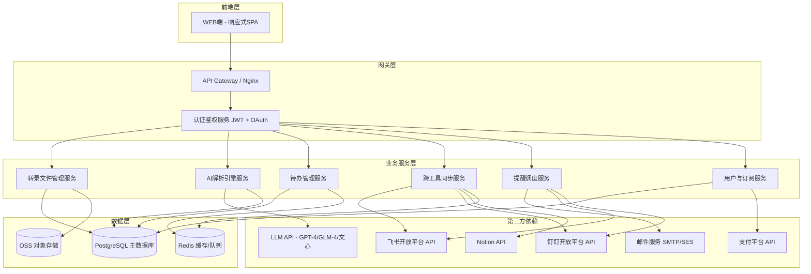
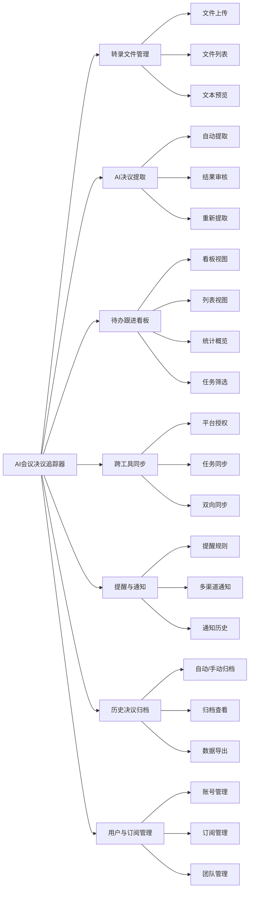
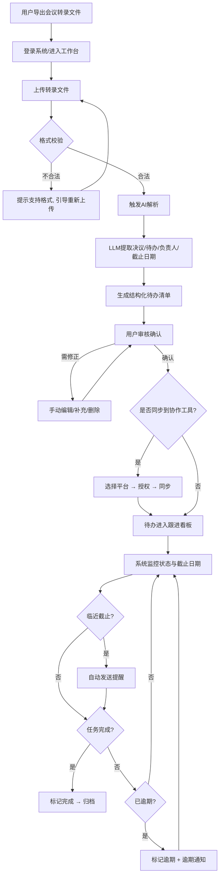
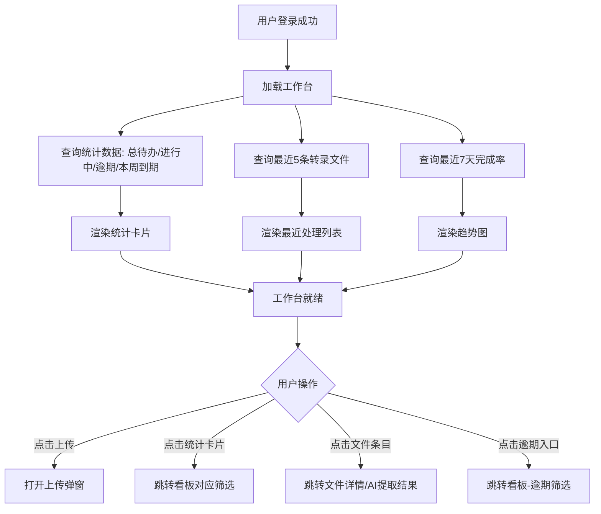
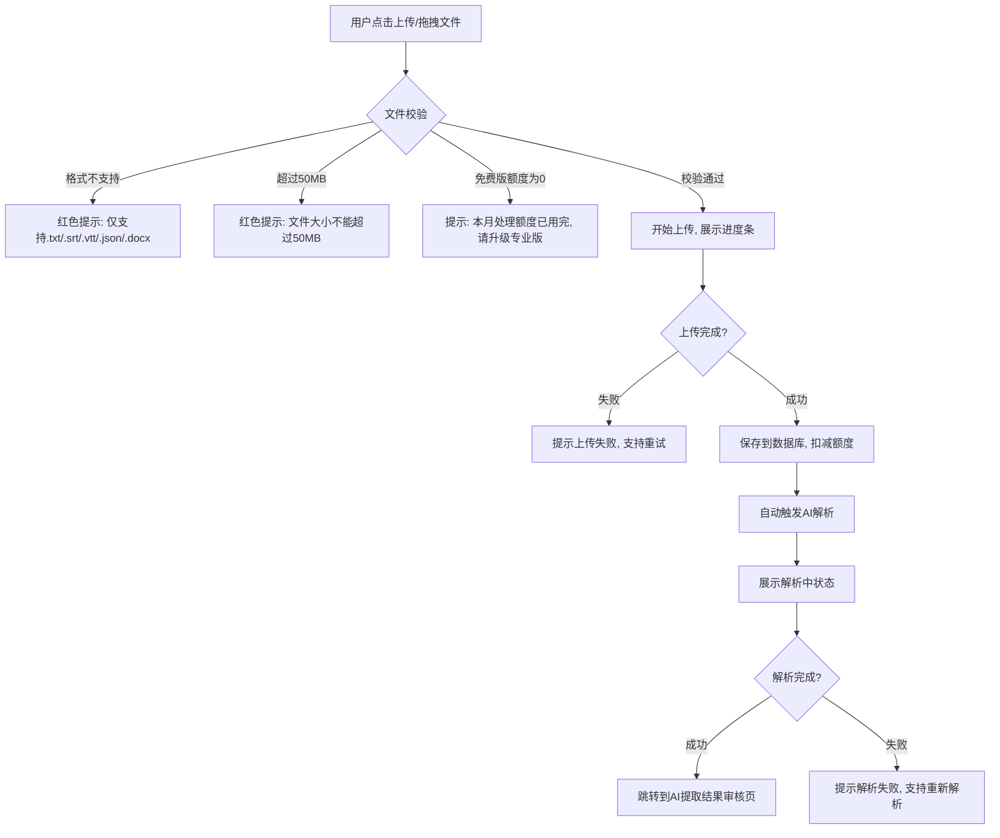
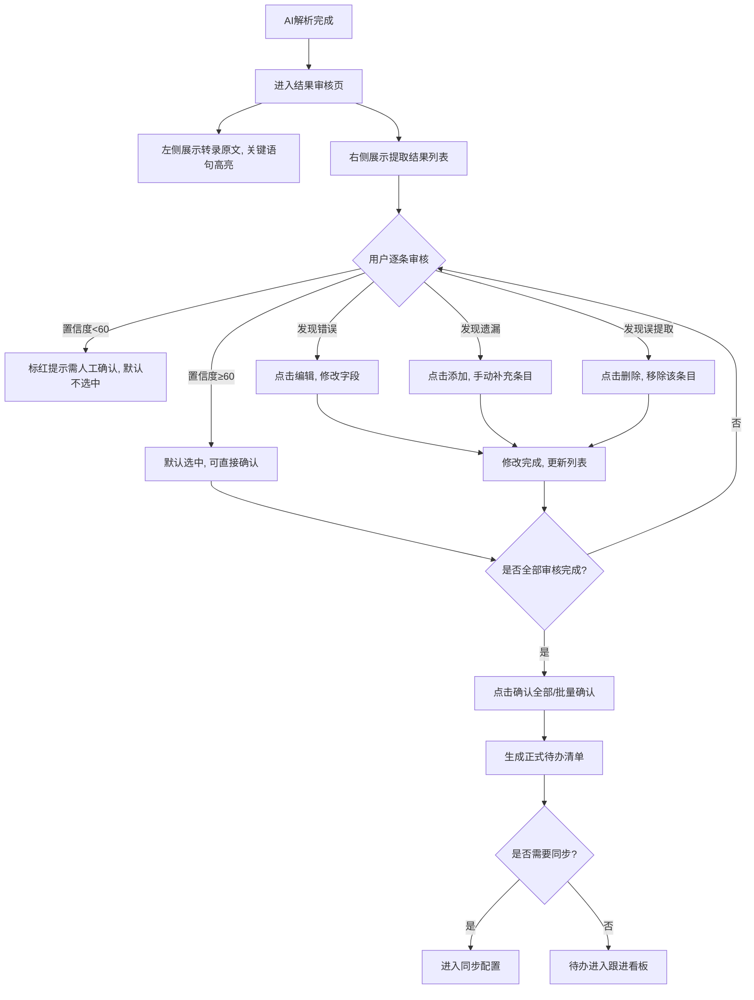
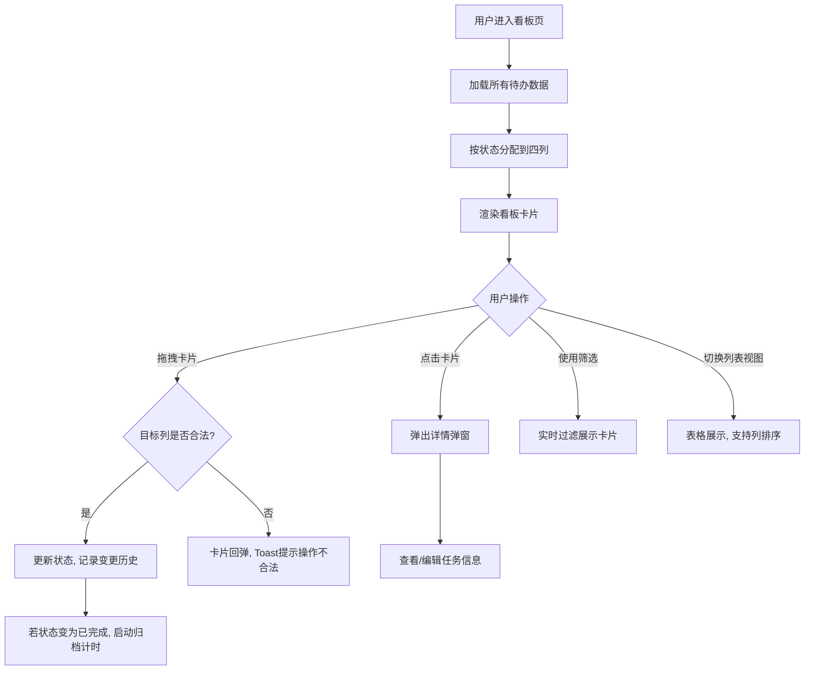
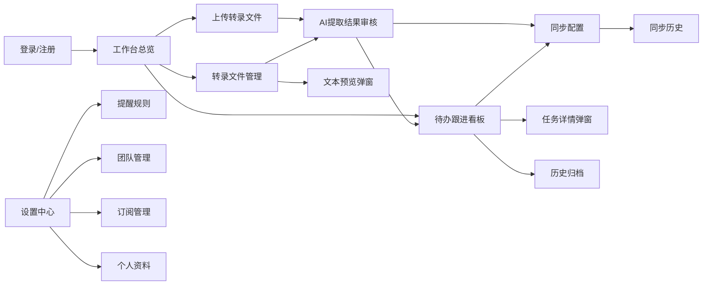
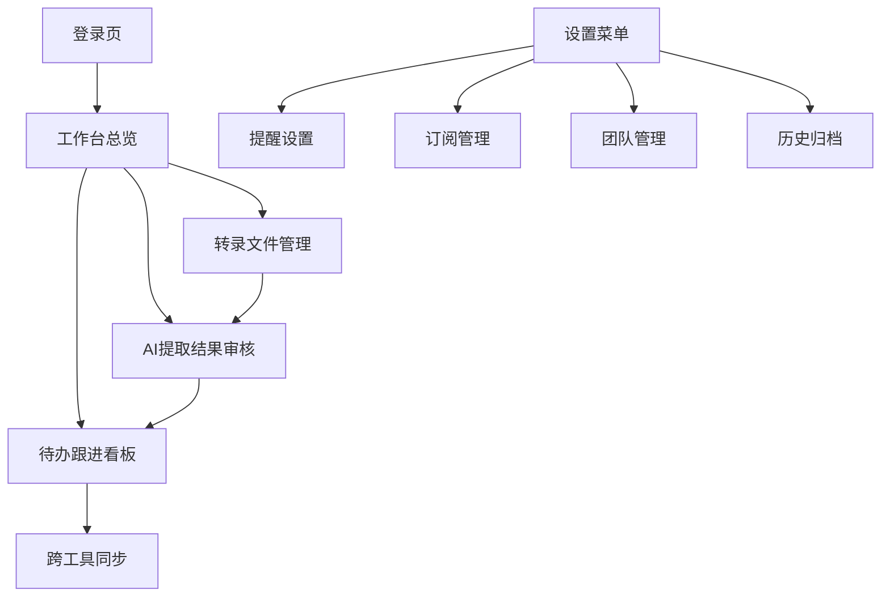

# AI会议决议追踪器 — 产品需求文档（PRD）

> 版本：v1.0.0  
> 创建日期：2026-06-29  
> 文档状态：待审核  
> 关联需求：《AI会议决议追踪器 — 用户需求说明书（URS）》v1.0.0

---

## 变更历史

| 版本号 | 变更日期 | 变更内容 | 变更人 | 审核人 |
| --- | --- | --- | --- | --- |
| V1.0 | 2026-06-29 | 初始版本创建 | 产品文档结对写作专家 | 阶段一产品落地页文档总编辑 |

---

# 1 概述

## 1.1 需求背景

远程/混合办公模式全面普及后，团队会议频率显著增加。据调研数据，平均每位知识工作者每周参加 6-10 次会议，但超过 70% 的会议决议在执行阶段丢失——"会上讨论热烈、会后无人跟进"成为团队协作的普遍痛点。

现有会议工具（飞书妙记、钉钉闪记、腾讯会议等）已能很好地解决"录音转文字"的问题，但在"决议→待办→跟进→闭环"这条链路上存在明显断裂：
- 会议纪要工具只做总结，不做追踪
- 协作工具（飞书/钉钉/Notion）能管理任务，但无法自动从会议中生成任务
- 人工搬运会议决议到任务系统耗时且容易遗漏

AI会议决议追踪器正是切入这一空白：不做转录、不做纪要，只做"决议提取→待办追踪→到期提醒"的闭环，并打通主流协作平台实现无缝衔接。

## 1.2 名词解释

| **名词** | **说明** |
| --- | --- |
| 转录文件 | 由飞书妙记、钉钉闪记、腾讯会议等工具导出的会议录音转文字文件，支持 .txt / .srt / .vtt / .json / .docx 格式 |
| 决议事项 | 会议中明确达成的决定，如"采用方案A"、"预算批准XX万"等 |
| 待办任务 | 会议中产生的需要后续执行的行动项，包含任务描述、负责人、截止日期 |
| 置信度 | AI 提取结果的可信度评分（0-100），低于阈值（默认60）的条目需人工确认 |
| 跟进看板 | 以待办事项为卡片、以状态为列的可视化面板，支持拖拽变更状态 |
| 跨工具同步 | 将本系统待办推送到飞书/钉钉/Notion等协作平台，并保持双向状态一致 |
| 决议归档 | 已完成/已逾期的任务超过保留期后自动转入历史库，支持检索和导出 |

## 1.3 产品介绍

AI会议决议追踪器是一款面向远程/混合办公团队的效率工具，核心价值是将会议转录文件中的决议和待办自动提取为结构化清单，并通过可视化看板追踪执行状态、到期自动提醒，支持一键同步到飞书/钉钉/Notion等主流协作平台，实现"会议决议→待办执行→闭环追踪"的全链路管理。

### 1.3.1 范围说明

| 项 | 内容 |
| --- | --- |
| 包含功能 | 转录文件管理、AI决议提取、待办跟进看板、跨工具同步、提醒通知、历史归档、用户与订阅管理 |
| 不包含功能 | 会议录音转文字（由第三方工具完成）、会议纪要/摘要生成、即时通讯、项目管理（仅追踪不做管理） |

**目标用户：**
- 每周参加多次团队会议/站会的远程办公团队和项目经理
- 会议决议经常"说了没人跟"、需要反复确认进度的小团队
- 需要清晰会议 action item 记录的自由职业者/咨询顾问

**产品核心价值：**
1. **省时**：AI 自动提取，省去人工整理会议决议的时间
2. **不漏**：结构化追踪 + 到期提醒，确保每条决议都有人跟
3. **无缝**：一键同步到已有协作工具，无需改变团队工作习惯
4. **低成本**：MVP 10 天交付，免费版即可满足个人基本需求

---

# 2 产品设计

## 2.1 系统架构图

## 2.2 业务模块图

## 2.3 主业务流程

## 2.4 功能图/列表

| 功能模块 | 功能名称 | 优先级 | 功能描述 |
| --- | --- | --- | --- |
| 转录文件管理 | 单文件上传 | P0 | 上传单个转录文件（.txt/.srt/.vtt/.json/.docx），自动识别编码与格式 |
| 转录文件管理 | 批量上传 | P1 | 一次选择多个文件批量上传，按队列依次处理（专业版） |
| 转录文件管理 | 文件列表浏览 | P0 | 展示所有已上传文件，含文件名、上传时间、会议时间、处理状态 |
| 转录文件管理 | 文件搜索与筛选 | P1 | 按文件名、会议日期、处理状态筛选搜索 |
| 转录文件管理 | 文件删除 | P1 | 删除不需要的转录文件及关联待办，需二次确认 |
| 转录文件管理 | 转录文本预览 | P1 | 查看原始转录文本，支持关键词高亮 |
| AI决议提取 | 决议事项识别 | P0 | AI自动识别会议中的决议事项，标注内容、相关人、上下文 |
| AI决议提取 | 待办任务提取 | P0 | AI提取待办任务含动作描述、负责人、截止日期 |
| AI决议提取 | 负责人识别 | P0 | 从对话上下文推断待办负责人（语义线索识别） |
| AI决议提取 | 截止日期推断 | P0 | 将相对时间表达（"下周五前"）转换为具体日期 |
| AI决议提取 | 结构化清单展示 | P0 | 表格/列表展示提取结果，含标题、类型、描述、负责人、截止日期、置信度 |
| AI决议提取 | 结果手动编辑 | P0 | 修改AI提取结果中的任何字段 |
| AI决议提取 | 手动添加条目 | P1 | 用户手动添加AI遗漏的决议或待办 |
| AI决议提取 | 删除误提取条目 | P0 | 删除AI误提取的条目 |
| AI决议提取 | 批量确认 | P0 | 一键确认所有/批量选择后的提取结果 |
| AI决议提取 | 重新提取 | P2 | 手动触发重新AI提取（消耗当月额度） |
| 待办跟进看板 | 四状态看板 | P0 | 待开始/进行中/已完成/已逾期 四列看板 |
| 待办跟进看板 | 拖拽状态变更 | P0 | 拖拽卡片在列间移动，自动更新状态 |
| 待办跟进看板 | 卡片详情 | P0 | 点击卡片查看完整信息含状态变更历史 |
| 待办跟进看板 | 按负责人筛选 | P1 | 快速查看特定人员待办 |
| 待办跟进看板 | 按状态/来源/日期筛选 | P1 | 多维度组合筛选 |
| 待办跟进看板 | 列表视图 | P1 | 表格形式展示，支持列排序 |
| 待办跟进看板 | 统计概览面板 | P1 | 总待办数、各状态数量、本周到期数、逾期数、完成率趋势 |
| 跨工具同步 | OAuth授权管理 | P1 | 授权对接飞书/钉钉/Notion，集中管理授权状态 |
| 跨工具同步 | 选择同步目标 | P1 | 选择待办同步到指定平台的指定项目/看板 |
| 跨工具同步 | 批量同步 | P1 | 一次性将多条待办同步到目标平台 |
| 跨工具同步 | 同步状态反馈 | P1 | 展示同步结果（成功/失败/跳过），失败时提供重试 |
| 跨工具同步 | 双向状态同步 | P1 | 目标平台任务状态变更自动回写本系统 |
| 跨工具同步 | 同步历史记录 | P2 | 展示所有同步操作历史 |
| 提醒与通知 | 提醒规则配置 | P1 | 配置截止前几天提醒、逾期后每天提醒、提醒方式 |
| 提醒与通知 | 按任务自定义提醒 | P2 | 针对单个任务自定义提醒时间和方式 |
| 提醒与通知 | 站内消息通知 | P0 | 系统内通知列表，未读红点提示 |
| 提醒与通知 | 邮件通知 | P1 | 发送提醒邮件，含任务详情和操作链接 |
| 提醒与通知 | Webhook通知 | P2 | 通过飞书/钉钉Webhook发送群聊提醒 |
| 提醒与通知 | 通知历史记录 | P2 | 已发送通知记录，支持筛选 |
| 历史决议归档 | 自动归档 | P2 | 已完成/逾期任务超保留期后自动归档（专业版） |
| 历史决议归档 | 手动归档 | P2 | 手动将指定会议或任务归档 |
| 历史决议归档 | 归档列表查看 | P2 | 按会议、时间、负责人检索已归档决议 |
| 历史决议归档 | 归档恢复 | P2 | 将归档条目恢复到当前看板 |
| 历史决议归档 | 导出报告 | P2 | 导出归档数据为Excel/CSV |
| 用户与订阅管理 | 注册与登录 | P0 | 邮箱/手机号注册，微信/飞书第三方登录 |
| 用户与订阅管理 | 个人资料管理 | P1 | 修改头像、昵称、邮箱、手机号 |
| 用户与订阅管理 | 订阅版本查看 | P0 | 展示当前版本、剩余额度、到期时间 |
| 用户与订阅管理 | 升级/续费 | P0 | 升级专业版或续费，支持微信/支付宝 |
| 用户与订阅管理 | 团队成员邀请 | P1 | 邀请成员加入，分配角色（专业版） |
| 用户与订阅管理 | 权限管理 | P1 | 管理成员权限（专业版） |

## 2.5 你的产品有哪些端

| 序号 | 端名称 | 端类型 | 目标用户 | 说明 |
| --- | --- | --- | --- | --- |
| 1 | AI会议决议追踪器 WEB端 | WEB端 | 个人用户/专业用户/团队管理员 | 主交互界面，支持转录上传、AI提取审核、待办看板、同步管理、提醒设置等全部功能 |

> 注：后台服务（AI解析引擎、同步服务、提醒调度服务）为纯服务端组件，无独立用户界面，不列为独立端。

---

# 3 产品功能

## 3.1 WEB端功能

### 3.1.1 工作台总览（Dashboard）

**功能描述：**
用户登录后的首页，提供核心数据概览和快捷操作入口，让用户一眼掌握当前待办全局。

| 项 | 内容 |
| --- | --- |
| 优先级 | P0 |
| 依赖需求 | 无 |
| 前置条件 | 用户已登录 |

**功能要点：**
1. **统计卡片**：展示总待办数、进行中、已逾期、本周到期 四个关键指标
2. **快捷操作**：上传转录文件（主入口）、查看看板、管理同步
3. **最近处理**：最近 5 条上传的转录文件及其处理状态
4. **待办趋势**：最近 7 天待办完成率趋势折线图
5. **逾期预警**：已逾期任务快速入口，直接跳转看板筛选视图

**详细流程：**

**验收标准：**
- [ ] 统计卡片数据实时更新，与看板数据一致
- [ ] 最近处理列表展示文件名、上传时间、状态标签（解析中/待审核/已完成）
- [ ] 趋势图展示最近7天每日完成数
- [ ] 空状态时展示引导："上传第一份会议转录开始体验"
- [ ] 页面加载时间 ≤ 2秒

**主要原型：**
[工作台总览原型](assets/prototypes/web/dashboard-widget.html)

---

### 3.1.2 转录文件上传

**功能描述：**
用户上传会议转录文件到系统，系统自动校验格式并触发 AI 解析。

| 项 | 内容 |
| --- | --- |
| 优先级 | P0 |
| 依赖需求 | 无 |
| 前置条件 | 用户已登录；免费版需有剩余额度 |

**功能要点：**
1. **拖拽上传区域**：支持拖拽文件到指定区域或点击选择文件
2. **格式支持**：.txt / .srt / .vtt / .json / .docx
3. **文件大小限制**：单文件 ≤ 50MB
4. **格式校验**：上传时即时校验，不合法文件红色标记并提示原因
5. **上传进度**：展示上传进度条和文件处理状态
6. **批量上传**（专业版）：支持同时选择多个文件，队列式处理
7. **额度提示**：免费版显示剩余上传次数

**详细流程：**

**业务规则：**
1. 免费版每月限 10 次上传处理，每月1日零点重置
2. 专业版不限次数
3. 同一文件重复上传（MD5相同）提示"该文件已存在"
4. 上传成功后自动触发AI解析，无需用户手动操作

**验收标准：**
- [ ] 拖拽和点击上传均可用
- [ ] 不支持格式文件上传时即时提示
- [ ] 上传进度条实时更新
- [ ] 上传完成后自动进入AI解析流程
- [ ] 免费版额度用完时提示升级
- [ ] 批量上传时按队列依次处理，展示各文件状态

**主要原型：**
[转录文件上传原型](assets/prototypes/web/upload-widget.html)

---

### 3.1.3 转录文件管理

**功能描述：**
管理所有已上传的转录文件，支持浏览、搜索、预览和删除。

| 项 | 内容 |
| --- | --- |
| 优先级 | P0 |
| 依赖需求 | 转录文件上传 |
| 前置条件 | 用户已登录，已有上传文件 |

**功能要点：**
1. **文件列表**：表格形式展示，列含：文件名、会议时间、上传时间、处理状态、操作
2. **状态标签**：解析中（蓝色旋转）/ 待审核（橙色）/ 已完成（绿色）/ 解析失败（红色）
3. **搜索**：支持文件名关键词搜索
4. **筛选**：按处理状态、会议日期范围筛选
5. **排序**：按上传时间、会议时间排序
6. **文本预览**：点击文件名弹出原始转录文本预览，支持关键词高亮
7. **删除**：需二次确认弹窗，同时删除关联的待办清单

**验收标准：**
- [ ] 文件列表分页展示，每页 20 条
- [ ] 搜索和筛选实时生效，无需刷新页面
- [ ] 点击文件名弹出文本预览弹窗
- [ ] 删除操作需二次确认，确认后异步删除
- [ ] 空列表展示引导性空状态

---

### 3.1.4 AI决议提取 — 结果审核

**功能描述：**
展示 AI 从转录文本中提取的决议事项和待办任务，供用户审核、编辑和确认。这是产品的核心功能。

| 项 | 内容 |
| --- | --- |
| 优先级 | P0 |
| 依赖需求 | 转录文件上传与AI解析 |
| 前置条件 | 转录文件已成功解析 |

**功能要点：**
1. **左侧：转录原文** — 展示原始转录文本，AI提取的关键语句高亮标注
2. **右侧：提取结果清单** — 结构化列表，每条包含：
   - 标题（AI生成）
   - 类型标签：决议（蓝色）/ 待办（绿色）
   - 描述
   - 负责人（从上下文推断）
   - 截止日期（相对时间已转换为具体日期）
   - 置信度评分（0-100，低于60标红需人工确认）
3. **编辑功能**：点击条目展开编辑面板，可修改所有字段
4. **手动添加**：顶部"添加条目"按钮，弹出表单添加自定义条目
5. **删除条目**：每条右侧删除按钮，删除误提取条目
6. **批量操作**：全选 / 反选 / 批量确认
7. **一键确认**：底部"确认全部"按钮，批量确认所有提取结果
8. **重新提取**：顶部"重新提取"按钮（消耗额度）

**详细流程：**

**业务规则：**
1. 每条提取结果的置信度由 AI 模型输出，低于 60 分的默认不勾选
2. 确认后不可再修改，需通过看板中的编辑功能变更
3. "决议"类型确认后直接进入归档，不进入看板追踪
4. "待办"类型确认后进入看板，初始状态为"待开始"
5. 重新提取会覆盖当前审核结果（未确认的条目丢失）

**验收标准：**
- [ ] 左右分栏布局，左侧原文与右侧提取结果联动（点击结果条目，左侧对应原文滚动到高亮位置）
- [ ] 置信度低于60的条目红色标记且默认不勾选
- [ ] 编辑面板可修改标题、描述、负责人、截止日期、类型
- [ ] 手动添加条目的表单包含必填字段：标题、类型、描述
- [ ] 批量确认时仅确认已勾选的条目
- [ ] 确认后待办立即出现在看板中

**主要原型：**
[AI提取结果审核原型](assets/prototypes/web/extraction-review-widget.html)

---

### 3.1.5 待办跟进看板

**功能描述：**
以看板形式展示所有已确认的待办事项，按"待开始→进行中→已完成/已逾期"四状态分列展示，支持拖拽变更状态和多维度筛选。

| 项 | 内容 |
| --- | --- |
| 优先级 | P0 |
| 依赖需求 | AI决议提取结果确认 |
| 前置条件 | 已有确认的待办事项 |

**功能要点：**
1. **四列看板**：待开始 / 进行中 / 已完成 / 已逾期，每列顶部显示该列任务数
2. **任务卡片**：展示标题、负责人头像、截止日期、来源会议名称、置信度标记
3. **拖拽变更**：拖拽卡片到不同列自动更新状态，拖入"已完成"列弹出完成确认
4. **卡片详情弹窗**：点击卡片展开详情，含完整描述、状态变更历史时间线、来源会议链接
5. **筛选工具栏**：按负责人、状态、来源会议、截止日期范围组合筛选
6. **列表视图切换**：顶部切换按钮，在看板视图和表格列表视图间切换
7. **统计概览**：看板顶部展示：总待办数、各状态数量、本周到期数、已逾期数
8. **逾期标红**：已逾期卡片红色边框，截止日期距今≤1天的卡片橙色标记

**详细流程：**

**业务规则：**
1. 合法状态变更路径：待开始→进行中、进行中→已完成、进行中→已逾期（系统自动）、待开始→已逾期（系统自动）、已逾期→进行中、已逾期→已完成、已完成→待开始（重新打开）
2. 系统每日0点扫描截止日期，自动将超过截止日期的未完成任务标记为"已逾期"
3. 拖拽到"已完成"列时弹出确认："确认将此任务标记为已完成？"
4. 筛选条件可叠加，多个条件取交集

**验收标准：**
- [ ] 看板四列正确展示，每列卡片数与顶部统计一致
- [ ] 拖拽操作流畅，拖拽过程有视觉反馈（列高亮）
- [ ] 卡片详情弹窗展示完整信息和状态变更时间线
- [ ] 筛选实时生效，结果准确
- [ ] 看板/列表视图切换不丢失筛选条件
- [ ] 逾期任务红色标记正确
- [ ] 500条待办以内页面加载 ≤ 2秒

**主要原型：**
[待办跟进看板原型](assets/prototypes/web/kanban-widget.html)

---

### 3.1.6 跨工具同步管理

**功能描述：**
管理飞书/钉钉/Notion等平台的 OAuth 授权，配置待办事项的同步目标和策略。

| 项 | 内容 |
| --- | --- |
| 优先级 | P1 |
| 依赖需求 | 待办跟进看板 |
| 前置条件 | 用户已登录，专业版订阅 |

**功能要点：**
1. **平台授权卡片**：飞书/钉钉/Notion 三个平台卡片，展示授权状态（已授权✅/未授权⚪/已过期⚠️）
2. **授权操作**：点击"授权"跳转 OAuth 流程，已授权的可"取消授权"或"重新授权"
3. **同步配置**：选择目标平台的指定项目/看板/数据库
4. **批量同步**：从看板中选择多条待办，一键同步到目标平台
5. **同步结果反馈**：展示每条同步的成功/失败/跳过状态，失败项提供重试
6. **同步历史**：展示所有同步操作记录，含时间、平台、条目数、结果

**验收标准：**
- [ ] 三个平台授权卡片状态正确展示
- [ ] OAuth 授权流程可正常完成
- [ ] 批量同步结果实时反馈
- [ ] 同步失败时给出明确错误原因和重试按钮
- [ ] 同步历史按时间倒序展示

---

### 3.1.7 提醒与通知

**功能描述：**
配置提醒规则，系统自动在截止日期前发送提醒通知，支持站内消息、邮件、Webhook 三种渠道。

| 项 | 内容 |
| --- | --- |
| 优先级 | P1 |
| 依赖需求 | 待办跟进看板 |
| 前置条件 | 用户已登录，有待办事项 |

**功能要点：**
1. **全局提醒规则**：
   - 截止前几天提醒（默认1天，可配置0-7天）
   - 逾期后每天提醒（可开关）
   - 提醒渠道选择：站内消息（默认开启）/ 邮件 / Webhook
2. **任务级提醒覆盖**：针对单个任务自定义提醒时间和方式
3. **站内通知中心**：右上角铃铛图标，点击展开通知列表，未读红点
4. **邮件通知**：发送格式化提醒邮件，含任务详情和"查看详情"链接
5. **Webhook通知**：支持配置飞书/钉钉群机器人 Webhook URL，推送群消息
6. **通知历史**：查看已发送的所有通知记录

**验收标准：**
- [ ] 全局提醒规则配置后对新创建的待办立即生效
- [ ] 站内通知实时推送（WebSocket）
- [ ] 邮件通知在设定时间 ±5分钟内送达
- [ ] Webhook 消息格式正确，可在飞书/钉钉群正常展示
- [ ] 通知历史支持按时间、任务、接收人筛选

---

### 3.1.8 历史决议归档

**功能描述：**
管理已完成/已逾期任务的历史数据，支持自动归档、手动归档、归档检索和数据导出。

| 项 | 内容 |
| --- | --- |
| 优先级 | P2 |
| 依赖需求 | 待办跟进看板 |
| 前置条件 | 专业版订阅；有待归档的任务 |

**功能要点：**
1. **自动归档**：已完成/已逾期任务超过保留期（默认30天）后自动转入归档库
2. **手动归档**：用户可从看板中手动将任务归档
3. **归档列表**：展示所有已归档决议和待办，支持按来源会议、时间范围、负责人检索
4. **归档详情**：查看归档任务的完整信息，含原始会议链接、处理过程、状态变更历史
5. **恢复操作**：将归档任务恢复到当前看板（状态重置为"待开始"）
6. **导出报告**：将归档数据导出为 Excel/CSV，用于复盘和汇报

**验收标准：**
- [ ] 自动归档按保留期正确执行
- [ ] 归档列表检索结果准确
- [ ] 恢复后任务立即出现在看板"待开始"列
- [ ] 导出文件格式正确，数据完整
- [ ] 免费版不可用归档功能，展示升级提示

---

### 3.1.9 用户与订阅管理

**功能描述：**
用户注册登录、个人资料管理、订阅版本管理、团队成员与权限管理。

| 项 | 内容 |
| --- | --- |
| 优先级 | P0 |
| 依赖需求 | 无 |
| 前置条件 | 无 |

**功能要点：**
1. **注册登录**：
   - 邮箱 + 密码注册，邮箱验证
   - 手机号 + 验证码注册
   - 微信 / 飞书第三方 OAuth 登录
2. **个人资料**：修改头像、昵称、邮箱、手机号
3. **订阅管理**：
   - 展示当前版本（免费版/专业版）、剩余额度、到期时间
   - 免费版：每月10次处理额度
   - 专业版：¥29/月，不限次数 + 全部高级功能
   - 升级/续费，支持微信/支付宝支付
4. **团队管理**（专业版）：
   - 邀请成员（邮箱/链接邀请）
   - 角色分配：管理员 / 成员
   - 权限管理：上传权限、同步权限、全局看板查看权限

**验收标准：**
- [ ] 邮箱注册流程完整：注册 → 验证邮件 → 激活
- [ ] 第三方登录 OAuth 流程正常
- [ ] 免费版额度用完时正确限制上传
- [ ] 支付流程完整：选择方案 → 支付 → 开通
- [ ] 团队成员邀请链接有效
- [ ] 权限控制正确：无权限操作不可见

---

# 4 产品原型

## 4.1 页面跳转逻辑图

## 4.2 全站点原型设计

### 4.2.1 AI会议决议追踪器 WEB端

**页面清单：**

| 序号 | 页面名称 | 所属模块 | 页面描述 | 关键元素 |
| --- | --- | --- | --- | --- |
| 1 | 登录页 | 用户管理 | 用户登录/注册入口 | 登录表单、第三方登录按钮、注册入口 |
| 2 | 工作台总览 | 全局 | 登录后首页，数据概览 | 统计卡片、快捷操作、最近处理列表、趋势图 |
| 3 | 转录文件管理 | 文件管理 | 文件列表、上传、搜索 | 上传按钮、文件表格、搜索框、筛选器、状态标签 |
| 4 | AI提取结果审核 | AI提取 | 审核AI提取的决议和待办 | 左侧原文预览、右侧提取结果列表、编辑面板、确认按钮 |
| 5 | 待办跟进看板 | 看板 | 四列看板视图 | 四列卡片看板、筛选工具栏、拖拽交互、统计概览 |
| 6 | 跨工具同步 | 同步管理 | 平台授权与同步配置 | 平台授权卡片、同步目标选择、同步结果列表 |
| 7 | 提醒设置 | 提醒通知 | 配置提醒规则 | 提醒规则表单、通知渠道选择、测试按钮 |
| 8 | 历史归档 | 归档管理 | 已归档决议查看 | 归档列表、搜索筛选、导出按钮、恢复按钮 |
| 9 | 订阅管理 | 用户管理 | 查看/管理订阅 | 版本对比卡片、当前版本信息、升级按钮 |
| 10 | 团队管理 | 用户管理 | 团队成员与权限 | 成员列表、邀请按钮、角色分配、权限开关 |

**交互说明：**

- 页面跳转关系：

- 全局交互：
  1. 左侧固定导航栏，当前页面高亮
  2. 顶部栏含全局搜索、通知铃铛（未读红点）、用户头像下拉菜单
  3. 所有操作在 500ms 内给出加载状态或结果反馈（Toast / Spinner）
  4. 弹窗类操作（删除确认、编辑面板）使用侧边抽屉或模态弹窗
  5. 看板页拖拽卡片时有列高亮反馈，放置时播放轻微动画

- 异常状态处理：
  1. 空数据态：展示引导性插图和操作引导文案
  2. 加载态：骨架屏（Skeleton）占位
  3. 错误态：展示错误信息 + 重试按钮
  4. 网络断开：顶部横幅提示

**产品原型：**

[🖥️ 打开WEB端全站点原型](assets/prototypes/web-full-prototype.html)

---

# 5 数据需求

## 5.1 核心数据模型

### 5.1.1 转录文件（transcript）

| **字段** | **是否必填** | **描述** | **数据类型** |
| --- | --- | --- | --- |
| id | 是 | 文件唯一标识 | UUID |
| user_id | 是 | 所属用户ID | UUID |
| file_name | 是 | 文件名 | string |
| file_size | 是 | 文件大小（字节） | number |
| file_format | 是 | 文件格式（txt/srt/vtt/json/docx） | string |
| storage_url | 是 | 对象存储地址 | string |
| meeting_date | 否 | 会议日期（从文件名或内容推断） | datetime |
| process_status | 是 | 处理状态（pending/processing/done/failed） | string |
| ai_result | 否 | AI提取结果JSON | json |
| created_at | 是 | 上传时间 | datetime |
| updated_at | 是 | 更新时间 | datetime |

### 5.1.2 待办事项（todo_item）

| **字段** | **是否必填** | **描述** | **数据类型** |
| --- | --- | --- | --- |
| id | 是 | 待办唯一标识 | UUID |
| user_id | 是 | 所属用户ID | UUID |
| transcript_id | 是 | 来源转录文件ID | UUID |
| type | 是 | 类型（decision/todo） | string |
| title | 是 | 标题 | string |
| description | 否 | 详细描述 | string |
| assignee | 否 | 负责人姓名 | string |
| assignee_email | 否 | 负责人邮箱 | string |
| due_date | 否 | 截止日期 | datetime |
| status | 是 | 状态（pending/in_progress/done/overdue） | string |
| confidence | 是 | AI置信度（0-100） | number |
| source_context | 否 | 原文中的上下文片段 | string |
| is_archived | 是 | 是否已归档 | boolean |
| created_at | 是 | 创建时间 | datetime |
| updated_at | 是 | 更新时间 | datetime |

### 5.1.3 同步记录（sync_record）

| **字段** | **是否必填** | **描述** | **数据类型** |
| --- | --- | --- | --- |
| id | 是 | 记录唯一标识 | UUID |
| user_id | 是 | 所属用户ID | UUID |
| platform | 是 | 目标平台（feishu/dingtalk/notion） | string |
| todo_item_ids | 是 | 同步的待办ID列表 | json array |
| sync_status | 是 | 同步状态（success/partial/failed） | string |
| result_detail | 否 | 每条同步结果详情 | json |
| created_at | 是 | 同步时间 | datetime |

### 5.1.4 平台授权（platform_auth）

| **字段** | **是否必填** | **描述** | **数据类型** |
| --- | --- | --- | --- |
| id | 是 | 记录唯一标识 | UUID |
| user_id | 是 | 所属用户ID | UUID |
| platform | 是 | 平台名称 | string |
| access_token | 是 | 加密后的访问令牌 | string |
| refresh_token | 是 | 加密后的刷新令牌 | string |
| token_expires_at | 是 | 令牌过期时间 | datetime |
| status | 是 | 授权状态（active/expired/revoked） | string |
| created_at | 是 | 授权时间 | datetime |

## 5.2 统计数据

1. 统计每日/周/月的会议处理次数、提取决议数、待办完成率（P1）
2. 统计各平台同步成功率和同步条目数（P2）
3. 统计用户活跃度：日活、周活、月活（P2）

## 5.3 埋点需求

| 页面 | 事件 | 采集字段 | 说明 |
| --- | --- | --- | --- |
| 工作台 | page_view | user_id, timestamp | 工作台访问量 |
| 工作台 | click_upload | user_id, source | 上传按钮点击来源 |
| 文件管理 | upload_file | user_id, file_format, file_size | 文件上传 |
| AI提取 | review_result | user_id, transcript_id, action_count | 审核操作次数 |
| AI提取 | confirm_all | user_id, transcript_id, item_count | 批量确认 |
| AI提取 | edit_item | user_id, item_id, field_changed | 编辑字段 |
| 看板 | drag_status | user_id, todo_id, from_status, to_status | 拖拽变更状态 |
| 看板 | filter | user_id, filter_type, filter_value | 筛选操作 |
| 同步 | sync_todo | user_id, platform, item_count, result | 同步操作 |
| 登录 | login | user_id, method (email/phone/oauth) | 登录方式 |
| 订阅 | upgrade | user_id, from_plan, to_plan, payment_method | 升级付费 |

---

# 6 非功能需求

## 6.1 性能需求

**6.1.1 延迟**

| 编号 | 项目 | 最大延迟 | 平均延迟 | 优先级 | 备注 |
| --- | --- | --- | --- | --- | --- |
| 0001 | 页面加载（500条待办以内） | < 2秒 | < 1秒 | 高 | 首屏加载 |
| 0002 | AI解析（30分钟以内会议） | < 30秒 | < 15秒 | 高 | LLM调用耗时 |
| 0003 | 单条任务同步到目标平台 | < 5秒 | < 2秒 | 高 | API调用 |
| 0004 | 文件上传（50MB以内） | < 10秒 | < 5秒 | 中 | 网络依赖 |
| 0005 | 看板拖拽操作反馈 | < 500ms | < 200ms | 高 | 前端交互 |
| 0006 | 搜索/筛选响应 | < 1秒 | < 0.5秒 | 中 | 含后端查询 |

**6.1.2 吞吐量**

| 编号 | 项目 | 吞吐量 | 备注 |
| --- | --- | --- | --- |
| 0001 | AI解析请求 | 每分钟 50 次 | MVP阶段 |
| 0002 | 文件上传 | 每分钟 100 次 | MVP阶段 |
| 0003 | 看板数据查询 | 每分钟 1000 次 | 含缓存 |

**6.1.3 容量**

| 编号 | 项目 | 容量 | 备注 |
| --- | --- | --- | --- |
| 0001 | 系统用户数 | ≤ 10,000 | MVP阶段 |
| 0002 | 并发用户数 | ≤ 100 | MVP阶段 |
| 0003 | 单用户待办数 | ≤ 5,000 | 含已归档 |
| 0004 | 单文件大小 | ≤ 50MB | 最大2小时转录 |

## 6.2 安全需求

| 编号 | 项目 |
| --- | --- |
| 0001 | 所有数据传输使用 HTTPS 加密 |
| 0002 | 用户密码使用 bcrypt 加密存储，不可逆 |
| 0003 | OAuth 令牌使用 AES-256 加密存储 |
| 0004 | 用户会议转录内容不得用于 AI 模型训练 |
| 0005 | 用户数据隔离，每个用户只能访问自己的数据 |
| 0006 | API 接口使用 JWT 鉴权，Token 有效期 2 小时 |
| 0007 | 文件上传校验文件类型和大小，防止恶意文件 |
| 0008 | 敏感操作（删除、同步）记录操作日志 |

## 6.3 可靠性

| 编号 | 项目 | 值 |
| --- | --- | --- |
| 0001 | 系统可用性 | ≥ 99.5% |
| 0002 | 平均正常运行时间 | 180天 |
| 0003 | 平均故障恢复时间 | < 30分钟 |
| 0004 | 数据备份频率 | 每日全量 + 每小时增量 |

## 6.4 可连续性

| 编号 | 项目 |
| --- | --- |
| 0001 | 系统 7 × 24 全天候运行 |
| 0002 | LLM API 故障时自动切换到备用模型（最多3个模型轮转） |
| 0003 | 第三方平台 API 故障时，同步操作进入重试队列，最长重试 24 小时 |

## 6.5 可恢复性

| 编号 | 项目 |
| --- | --- |
| 0001 | 数据库每日全量备份，保留 30 天 |
| 0002 | 重大故障在 1-3 小时内恢复服务 |
| 0003 | 历史数据在 24-72 小时内恢复 |

## 6.6 兼容性

| 编号 | 要求 | 备注 |
| --- | --- | --- |
| 0001 | Chrome >= 90 | 主要支持 |
| 0002 | Firefox >= 90 | 支持 |
| 0003 | Edge >= 90 | 支持 |
| 0004 | Safari >= 15 | 支持 |
| 0005 | 桌面分辨率 >= 1280px | 最小宽度 |
| 0006 | 推荐分辨率 1920×1080 | 最佳体验 |

## 6.7 易用性

| 编号 | 要求 | 备注 |
| --- | --- | --- |
| 0001 | 核心操作路径不超过3步 | 上传→审核→确认 |
| 0002 | 普通用户无需培训即可使用核心功能 | 首次使用引导 |
| 0003 | 所有操作 500ms 内给出反馈 | Toast / Spinner / 骨架屏 |
| 0004 | 空状态有引导性提示 | 引导用户上传第一个文件 |
| 0005 | 关键操作有二次确认 | 删除、批量操作 |

---

# 7 总结

## 7.1 上线计划

| 阶段 | 时间 | 内容 | 负责人 |
| --- | --- | --- | --- |
| 开发阶段 | 第1-7天 | 核心功能开发：文件上传、AI提取、看板、提醒 | 开发团队 |
| 联调阶段 | 第8天 | 前后端联调、第三方平台对接 | 开发团队 |
| 测试阶段 | 第9天 | 功能测试、兼容性测试、性能测试 | QA团队 |
| 灰度阶段 | 第10天 | 邀请 10-20 名种子用户内测 | 产品团队 |
| 正式上线 | 第11天 | 全量开放免费版 | 产品+运营团队 |

## 7.2 后续迭代规划

- **V1.1**（上线后2周）：根据种子用户反馈优化 AI 提取准确率，调整 Prompt
- **V1.2**（上线后1月）：增加移动端 H5 适配，支持手机上查看看板和接收提醒
- **V1.3**（上线后2月）：支持更多协作平台同步（Jira、Asana、Trello）
- **V2.0**（上线后3月）：AI 智能分析功能——团队执行力分析、会议效率报告
- **V2.1**（上线后4月）：暗色模式、国际化（英文支持）

## 7.3 参考文档

- 《AI会议决议追踪器 — 用户需求说明书（URS）》v1.0.0
- [WEB端全站点原型](assets/prototypes/web-full-prototype.html)
- 飞书开放平台 API 文档：https://open.feishu.cn/document/
- 钉钉开放平台 API 文档：https://open.dingtalk.com/document/
- Notion API 文档：https://developers.notion.com/
