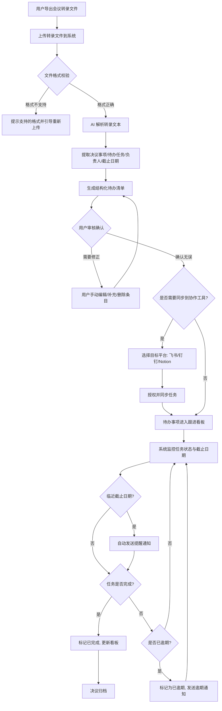
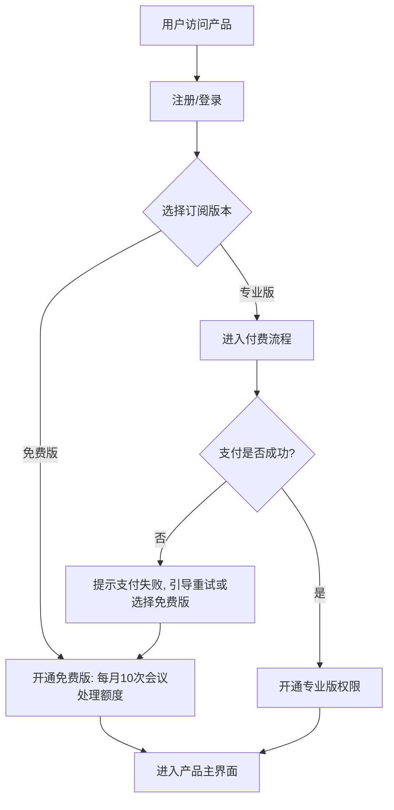
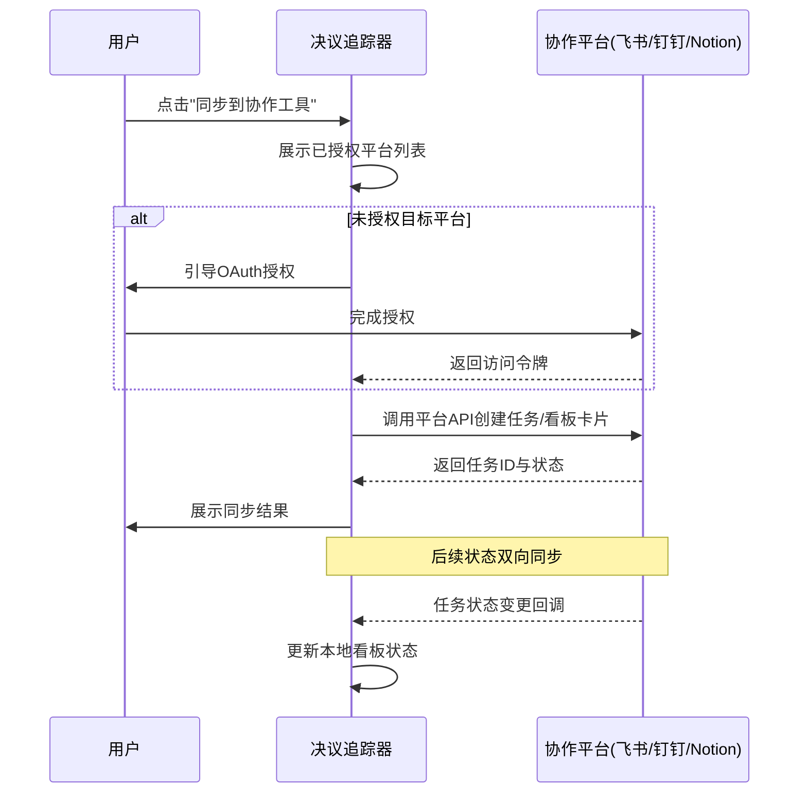
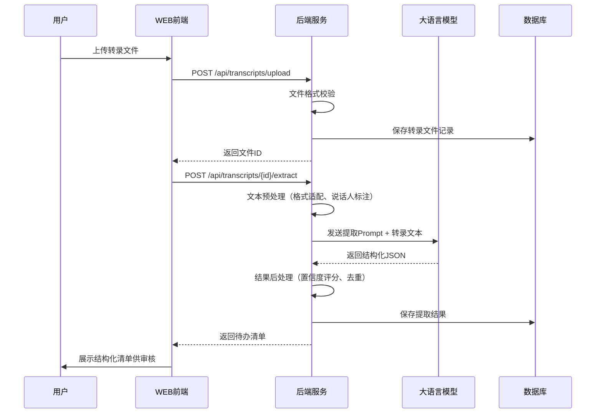
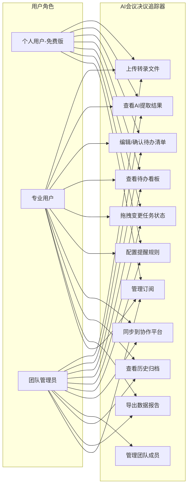
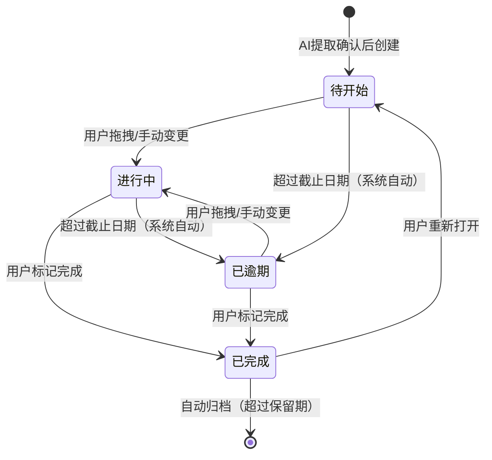

# AI会议决议追踪器 — 用户需求说明书（URS）

> 版本：v1.0.0  
> 创建日期：2026-06-29  
> 文档状态：待审核

---

# 1. 需求概述

## 1.1 需求介绍

AI会议决议追踪器是一款面向远程/混合办公团队的效率工具，聚焦"会议决议→待办追踪→到期提醒"的闭环场景。产品不做会议纪要或转录工具，而是对接主流会议工具（飞书妙记、钉钉闪记、腾讯会议等）已有的转录文件，利用 AI 大语言模型自动识别并提取会议中的决议事项、待办任务、负责人和截止日期，生成结构化待办清单，并支持一键同步到飞书、钉钉、Notion 等协作平台进行后续跟进与提醒。

### 1.1.1 所属领域

效率工具 / 企业管理软件 / AI 办公辅助

## 1.2 需求目标

1. **解决"会后无人跟"痛点**：将会议转录文本自动转化为结构化、可追踪的待办清单，消除"会上讨论热烈、会后无人跟进"的普遍问题。
2. **打通决议到执行的闭环**：通过跨工具同步（飞书/钉钉/Notion），让决议直接落入团队已有的协作流程，无需二次搬运。
3. **自动化提醒与追踪**：通过看板展示任务状态，并在截止日期前自动发送提醒通知，减少人工反复确认进度的成本。
4. **低成本快速上手**：MVP 在 10 天内可交付，用户无需改变现有会议习惯，只需导出已有转录文件即可使用。

## 1.3 系统使用角色

| 角色 | 说明 |
|------|------|
| 个人用户（免费版） | 每月不超过 10 次会议记录处理需求的个人用户，使用基础 AI 提取功能，无需跨工具同步 |
| 专业用户（专业版） | 需要无限次处理、跨工具同步、多人协作、历史归档的团队用户，按月付费 |
| 团队管理员 | 在专业版中管理团队成员、分配权限、查看团队整体决议执行情况的负责人 |
| 系统管理员 | 负责系统配置、AI 模型参数管理、用户数据统计的后台管理人员 |

## 1.4 业务流程图

### 1.4.1 核心业务流程：从转录文本到决议追踪

### 1.4.2 用户注册与订阅流程

### 1.4.3 跨工具同步流程

# 2. 功能原型

| 原型名称 | 原型链接 | 对应端 | 备注 |
| --- | --- | --- | --- |
| AI会议决议追踪器-WEB端 | 见配套 HTML 原型文件 | WEB端 | 主要交互界面，支持转录上传、AI提取结果审核、待办看板、同步管理 |
| AI会议决议追踪器-后台服务 | 无独立原型 | 后台服务 | AI解析引擎、同步服务、提醒调度、用户订阅管理 |

# 3. 需求清单

## 3.1 AI会议决议追踪器-WEB端

### 3.1.1 转录文件管理

| 模块 | 一级功能 | 二级功能 | 功能描述 | 备注 |
| --- | --- | --- | --- | --- |
| 转录文件管理 | 上传转录文件 | 单文件上传 | 用户可上传单个会议转录文件（支持 .txt, .srt, .vtt, .json, .docx 格式），系统自动识别文件编码与格式 | 免费版每月限10次，专业版不限 |
| 转录文件管理 | 上传转录文件 | 批量上传 | 支持一次选择多个转录文件批量上传，系统按队列依次处理 | 专业版功能 |
| 转录文件管理 | 上传转录文件 | 文件格式校验 | 上传时自动校验文件格式是否在支持列表内，不合法的文件拒绝上传并提示支持的格式 | |
| 转录文件管理 | 文件列表 | 文件浏览 | 展示用户所有已上传的转录文件列表，包括文件名、上传时间、会议时间、处理状态 | |
| 转录文件管理 | 文件列表 | 文件搜索 | 支持按文件名、会议日期、处理状态进行筛选和搜索 | |
| 转录文件管理 | 文件列表 | 文件删除 | 用户可删除不再需要的转录文件及其关联的待办清单，删除前需二次确认 | |
| 转录文件管理 | 文件详情 | 转录文本预览 | 点击文件可查看原始转录文本内容，支持关键词高亮显示 | |

### 3.1.2 AI决议提取

| 模块 | 一级功能 | 二级功能 | 功能描述 | 备注 |
| --- | --- | --- | --- | --- |
| AI决议提取 | 自动提取 | 决议事项识别 | AI 自动从转录文本中识别明确的决议事项（如"决定采用方案A"、"同意预算XX万"等），标注决议内容、相关人、上下文 | 核心功能，P0 |
| AI决议提取 | 自动提取 | 待办任务提取 | AI 自动提取会议中产生的待办任务（含动作描述、负责人、截止日期），生成结构化条目 | 核心功能，P0 |
| AI决议提取 | 自动提取 | 负责人识别 | AI 从对话上下文中推断待办任务的负责人（通过"你来负责"、"@某人"等语义线索） | |
| AI决议提取 | 自动提取 | 截止日期推断 | AI 从对话上下文中推断截止日期（如"下周五前"、"月底前"等相对时间表达转换为具体日期） | |
| AI决议提取 | 结果审核 | 结构化清单展示 | 以表格/列表形式展示AI提取结果，每条包含：标题、类型（决议/待办）、描述、负责人、截止日期、置信度 | |
| AI决议提取 | 结果审核 | 手动编辑 | 用户可修改AI提取结果中的任何字段：标题、描述、负责人、截止日期等 | |
| AI决议提取 | 结果审核 | 手动添加 | 用户可手动添加AI遗漏的决议或待办条目 | |
| AI决议提取 | 结果审核 | 删除条目 | 用户可删除AI误提取的条目 | |
| AI决议提取 | 结果审核 | 批量确认 | 用户一键确认所有AI提取结果，或批量选择后确认 | |
| AI决议提取 | 重新提取 | 手动触发重新提取 | 对已处理的转录文件，用户可手动触发重新进行AI提取（适用于调整提取参数后重新解析） | 重新提取消耗当月额度 |

### 3.1.3 待办事项跟进看板

| 模块 | 一级功能 | 二级功能 | 功能描述 | 备注 |
| --- | --- | --- | --- | --- |
| 待办跟进看板 | 看板视图 | 四状态看板 | 以看板形式展示所有待办事项，分为四个状态列：待开始、进行中、已完成、已逾期 | 核心功能，P0 |
| 待办跟进看板 | 看板视图 | 拖拽状态变更 | 用户可通过拖拽卡片在看板列间移动，自动更新任务状态 | |
| 待办跟进看板 | 看板视图 | 卡片详情 | 点击看板卡片可查看任务详情：标题、描述、来源会议、负责人、截止日期、状态变更历史 | |
| 待办跟进看板 | 任务筛选 | 按负责人筛选 | 看板支持按负责人筛选，快速查看特定人员的待办 | |
| 待办跟进看板 | 任务筛选 | 按状态筛选 | 支持按单一状态或多状态组合筛选 | |
| 待办跟进看板 | 任务筛选 | 按来源会议筛选 | 支持按来源会议筛选，查看某次会议产生的所有待办 | |
| 待办跟进看板 | 任务筛选 | 按截止日期范围筛选 | 支持按截止日期范围筛选（如本周到期、本月到期、已逾期） | |
| 待办跟进看板 | 列表视图 | 表格展示 | 提供列表视图，以表格形式展示所有待办事项，支持按列排序 | |
| 待办跟进看板 | 统计概览 | 数据面板 | 在看板顶部展示统计信息：总待办数、各状态数量、本周到期数、已逾期数、完成率趋势 | |

### 3.1.4 跨工具同步

| 模块 | 一级功能 | 二级功能 | 功能描述 | 备注 |
| --- | --- | --- | --- | --- |
| 跨工具同步 | 平台授权 | OAuth授权管理 | 用户可授权系统对接飞书、钉钉、Notion等平台，授权信息集中管理 | 专业版功能 |
| 跨工具同步 | 平台授权 | 授权状态查看 | 展示各平台授权状态（已授权/未授权/已过期），支持重新授权或取消授权 | |
| 跨工具同步 | 任务同步 | 选择同步目标 | 用户可选择将待办事项同步到指定平台的指定项目/看板/任务列表 | 专业版功能 |
| 跨工具同步 | 任务同步 | 批量同步 | 支持一次性将多条待办同步到目标平台 | |
| 跨工具同步 | 任务同步 | 同步状态反馈 | 同步完成后展示同步结果（成功/失败/跳过），失败时给出原因和重试选项 | |
| 跨工具同步 | 双向同步 | 状态回写 | 目标平台的任务状态变更自动回写到本系统看板，保持双向一致 | |
| 跨工具同步 | 同步记录 | 同步历史 | 展示所有同步操作的历史记录，包括同步时间、目标平台、同步条目数、结果 | |

### 3.1.5 提醒与通知

| 模块 | 一级功能 | 二级功能 | 功能描述 | 备注 |
| --- | --- | --- | --- | --- |
| 提醒与通知 | 提醒设置 | 提醒规则配置 | 用户可配置提醒规则：截止日期前几天提醒（默认1天）、逾期后每天提醒、提醒方式（站内消息/邮件/飞书webhook等） | |
| 提醒与通知 | 提醒设置 | 按任务设置提醒 | 支持针对单个任务自定义提醒时间和提醒方式 | |
| 提醒与通知 | 通知发送 | 站内消息 | 系统内展示通知列表，未读通知有红点提示 | |
| 提醒与通知 | 通知发送 | 邮件通知 | 通过邮件发送提醒通知，包含任务详情和操作链接 | |
| 提醒与通知 | 通知发送 | Webhook通知 | 支持通过飞书/钉钉 Webhook 发送提醒消息到群聊 | |
| 提醒与通知 | 通知记录 | 通知历史 | 展示所有已发送的通知记录，支持按时间、任务、接收人筛选 | |

### 3.1.6 历史决议归档

| 模块 | 一级功能 | 二级功能 | 功能描述 | 备注 |
| --- | --- | --- | --- | --- |
| 历史决议归档 | 归档管理 | 自动归档 | 已完成或已逾期的任务在超过保留期（默认30天）后自动归档到历史库 | 专业版功能 |
| 历史决议归档 | 归档管理 | 手动归档 | 用户可手动将指定会议或任务归档 | |
| 历史决议归档 | 归档查看 | 归档列表 | 展示所有已归档的决议和待办，支持按会议、时间、负责人检索 | |
| 历史决议归档 | 归档查看 | 归档恢复 | 可将归档条目恢复到当前看板中 | |
| 历史决议归档 | 数据导出 | 导出报告 | 支持将归档数据导出为 Excel/CSV 格式，用于复盘和汇报 | |

### 3.1.7 用户与订阅管理

| 模块 | 一级功能 | 二级功能 | 功能描述 | 备注 |
| --- | --- | --- | --- | --- |
| 用户与订阅管理 | 账号管理 | 注册与登录 | 支持邮箱注册、手机号注册，以及微信/飞书第三方登录 | |
| 用户与订阅管理 | 账号管理 | 个人资料 | 用户可修改头像、昵称、邮箱、手机号等个人信息 | |
| 用户与订阅管理 | 订阅管理 | 版本查看 | 展示当前订阅版本（免费版/专业版）、剩余处理额度、到期时间 | |
| 用户与订阅管理 | 订阅管理 | 升级/续费 | 用户可升级到专业版或续费，支持微信/支付宝支付 | |
| 用户与订阅管理 | 团队管理 | 成员邀请 | 专业版用户可邀请团队成员加入，分配角色（管理员/成员） | 专业版功能 |
| 用户与订阅管理 | 团队管理 | 权限管理 | 管理员可管理成员权限（如是否允许上传、同步、查看全局看板等） | |

## 3.2 AI会议决议追踪器-后台服务

### 3.2.1 AI解析引擎

| 模块 | 一级功能 | 二级功能 | 功能描述 | 备注 |
| --- | --- | --- | --- | --- |
| AI解析引擎 | 文本预处理 | 格式适配 | 将不同来源（飞书妙记、钉钉闪记、腾讯会议等）的转录文件统一转换为内部标准格式 | |
| AI解析引擎 | 文本预处理 | 说话人识别 | 从转录文本中识别不同说话人，为后续负责人识别提供基础 | |
| AI解析引擎 | LLM调用 | 决议提取Prompt | 调用大语言模型，使用专用 Prompt 提取决议事项和待办任务 | |
| AI解析引擎 | LLM调用 | 结构化输出 | 将LLM输出解析为结构化JSON，包含标题、类型、描述、负责人、截止日期、置信度等字段 | |
| AI解析引擎 | 结果优化 | 置信度评分 | 对每条提取结果进行置信度评分，低于阈值的标记为"待人工确认" | |
| AI解析引擎 | 结果优化 | 去重合并 | 对重复或高度相似的提取结果进行去重合并 | |

### 3.2.2 同步服务

| 模块 | 一级功能 | 二级功能 | 功能描述 | 备注 |
| --- | --- | --- | --- | --- |
| 同步服务 | 平台适配器 | 飞书适配器 | 对接飞书开放平台 API，实现任务创建、状态更新、回调监听 | |
| 同步服务 | 平台适配器 | 钉钉适配器 | 对接钉钉开放平台 API，实现任务创建、状态更新、回调监听 | |
| 同步服务 | 平台适配器 | Notion适配器 | 对接 Notion API，实现数据库条目创建、属性更新 | |
| 同步服务 | 令牌管理 | OAuth令牌刷新 | 自动刷新即将过期的 OAuth 令牌，保证同步链路不中断 | |
| 同步服务 | 令牌管理 | 令牌安全存储 | 对 OAuth 令牌进行加密存储，防止泄露 | |

### 3.2.3 提醒调度服务

| 模块 | 一级功能 | 二级功能 | 功能描述 | 备注 |
| --- | --- | --- | --- | --- |
| 提醒调度服务 | 定时任务 | 截止日期扫描 | 定时扫描所有未完成待办的截止日期，触发提醒逻辑 | |
| 提醒调度服务 | 定时任务 | 逾期检测 | 定时检测已超过截止日期但未完成的任务，标记为逾期并触发通知 | |
| 提醒调度服务 | 通知投递 | 邮件投递 | 通过邮件服务发送提醒邮件 | |
| 提醒调度服务 | 通知投递 | Webhook投递 | 通过飞书/钉钉 Webhook 发送群消息提醒 | |

# 4. 非功能需求

## 4.1 使用界面需求

| 需求项 | 说明 |
|--------|------|
| 响应式布局 | WEB端需适配 1280px 及以上桌面分辨率，不要求移动端适配 |
| 操作反馈 | 所有用户操作（上传、确认、同步、删除等）需在 500ms 内给出加载状态或结果反馈 |
| 空状态设计 | 列表/看板无数据时需展示引导性空状态（如"上传第一份会议转录开始体验"） |
| 暗色模式 | MVP 阶段不要求，后续版本考虑 |

## 4.2 软硬件环境需求

| 需求项 | 说明 |
|--------|------|
| 服务端 | 云端部署（推荐阿里云/腾讯云），需支持容器化部署 |
| 数据库 | 关系型数据库（PostgreSQL/MySQL）存储用户数据、待办数据；可选 Redis 做缓存和任务队列 |
| AI模型 | 对接主流大语言模型 API（如 OpenAI GPT-4、智谱 GLM-4、百度文心等），需支持多模型切换 |
| 客户端浏览器 | 支持 Chrome 90+、Firefox 90+、Edge 90+、Safari 15+ |

## 4.3 性能需求

| 需求项 | 指标 |
|--------|------|
| 转录文件处理时间 | 单次AI解析（30分钟以内会议转录）应在 30 秒内完成 |
| 看板加载时间 | 500 条待办以内的看板页面加载时间 ≤ 2 秒 |
| 同步响应时间 | 单条任务同步到目标平台的响应时间 ≤ 5 秒 |
| 并发支持 | MVP 阶段支持 100 并发用户，专业版上线后扩展到 1000 并发 |
| 文件上传限制 | 单文件大小不超过 50MB，支持最大 2 小时会议转录 |

## 4.4 约束性需求

1. **不做会议转录**：系统不自行提供会议录音转文字功能，仅处理用户已有的转录文件。
2. **不做会议纪要生成**：系统不生成会议摘要或纪要，仅聚焦决议和待办的提取与追踪。
3. **必须支持主流转录格式**：至少支持飞书妙记、钉钉闪记、腾讯会议三种主流工具的导出格式。
4. **系统需要后台服务支撑**：AI 解析引擎、同步服务、提醒调度均需后台服务持续运行。
5. **数据安全**：用户的会议转录内容属于敏感数据，传输需加密（HTTPS），存储需脱敏处理，不得用于模型训练。
6. **免费版额度限制**：免费版每月处理次数上限为 10 次，达到上限后需升级或等待次月重置。

# 5. 接口需求

## 5.1 硬件接口需求

本系统为纯软件 Web 应用，不涉及硬件接口需求。

## 5.2 软件接口需求

| 模块 | 接口名称 | 输入 | 输出 | 功能描述 |
| --- | --- | --- | --- | --- |
| AI解析引擎 | 大语言模型API | 转录文本 + 提取Prompt | 结构化JSON（决议/待办列表） | 调用 LLM 进行决议和待办的智能提取 |
| AI解析引擎 | 对象存储API | 转录文件二进制数据 | 文件URL | 存储用户上传的转录文件 |
| 同步服务 | 飞书开放平台API | OAuth令牌 + 任务数据 | 任务创建结果/状态变更回调 | 实现待办到飞书任务的双向同步 |
| 同步服务 | 钉钉开放平台API | OAuth令牌 + 任务数据 | 任务创建结果/状态变更回调 | 实现待办到钉钉待办的双向同步 |
| 同步服务 | Notion API | Integration Token + 页面数据 | 数据库条目创建/更新结果 | 实现待办到 Notion 数据库的同步 |
| 提醒调度 | 邮件服务API（SMTP/SES） | 收件人 + 邮件内容 | 发送结果 | 发送提醒邮件 |
| 提醒调度 | 飞书/钉钉 Webhook | 消息内容 + Webhook URL | 发送结果 | 发送群聊提醒消息 |
| 用户与订阅 | 支付平台API | 订单信息 + 支付金额 | 支付结果回调 | 处理专业版订阅付费 |
| 用户与订阅 | 第三方登录API（微信/飞书） | OAuth授权码 | 用户身份信息 | 支持第三方快捷登录 |

## 5.4 通讯接口需求

本系统为 Web 应用，所有通讯均通过 HTTPS 协议进行，不涉及硬件通讯接口需求。前后端采用 RESTful API 通讯，WebSocket 用于实时通知推送（可选）。

# 6. 附录

## 流程图

### 转录文件处理流程

## 时序图

### AI提取决议的交互时序

## （用户与系统交互）用例图

## （系统）状态图

### 待办任务状态流转

