# AI合同风险条款审查助手 — 产品需求文档（PRD）

> **文档属性**
> - 产品名称：AI合同风险条款审查助手
> - 文档版本：V1.0
> - 编写日期：2026-06-29
> - 文档状态：初稿

## 变更历史

| 版本号 | 变更日期 | 变更内容 | 变更人 | 审核人 |
| --- | --- | --- | --- | --- |
| V1.0 | 2026-06-29 | 初始版本创建 | 产品文档结对写作专家 | 领域专家A |

---

# 1 概述

## 1.1 需求背景

随着小微经济蓬勃发展，个体工商户和小微企业主在日常经营中需要频繁签署各类商业合同——商铺租赁、供应商合作、加盟协议、劳动用工等。然而，这些合同往往包含大量法律术语和专业条款，小商户因缺乏法律知识，常常在不知情的情况下签署含有违约金陷阱、自动续约、竞业限制、单方解约、赔偿上限不合理等风险条款的合同，导致经济损失。

传统解决方案是聘请律师审查合同，但律师审查费用高昂（500～2000元/份），周期长（3～7个工作日），难以满足小商户高频、低价、即时的合同审查需求。据调查，超过70%的小商户在签署合同时从未寻求过专业法律审查。

本产品通过AI技术，以极低的价格（¥19/份）在数分钟内为用户提供合同风险扫描结果，包括风险条款高亮标注、通俗白话解读、协商话术模板以及整体风险评分报告，让小商户"看得懂合同、谈得下条款、避得开风险"。

**业务价值**：
- 将合同审查成本从500～2000元降至19元，降低99%
- 将审查周期从3～7天缩短至5分钟内
- 覆盖传统法律服务无法触达的小商户长尾市场

## 1.2 名词解释

| 名词 | 说明 |
| --- | --- |
| 小商户用户 | 使用本产品进行合同风险审查的个体工商户和小微企业主 |
| 订阅用户 | 购买了月度订阅套餐的高级用户，享有不限份数审查、历史记录等权益 |
| 风险条款 | 合同中可能对用户造成不利影响的条款，包括违约金、自动续约、竞业限制、单方解约、赔偿上限等 |
| 风险评分 | 0～100分的综合评分，分数越高风险越大。低风险(0-30)、中风险(31-60)、高风险(61-100) |
| 白话解读 | 将专业法律条款翻译为通俗易懂的日常语言，使无法律背景的用户也能理解 |
| 协商话术 | 为用户提供的可直接复制使用的合同条款协商修改建议文本 |
| OCR | 光学字符识别（Optical Character Recognition），将图片中的文字转换为可编辑文本 |
| LLM | 大语言模型（Large Language Model），用于合同风险分析和解读生成的AI引擎 |
| MVP | 最小可行产品（Minimum Viable Product），以最小功能集验证产品核心价值 |

## 1.3 产品介绍

本产品是一款面向个体工商户和小微企业主的AI驱动合同风险识别与解读工具。

**目标用户**：
- 个体工商户：餐饮店主、零售商铺老板、服务业经营者
- 小微企业主：小型连锁加盟商、供应商合作方
- 典型画像：餐饮店主老王，需签署商铺续租合同，看不懂违约金条款，希望快速知道是否有坑

**使用场景**：
- 签署商铺租赁/续租合同前，检查是否存在违约金过高、自动续约等陷阱
- 签署供应商合作协议前，识别赔偿上限不合理、单方解约等风险
- 签署加盟协议前，审查竞业限制、品牌使用费等关键条款
- 日常经营中频繁签署各类商业合同的快速风险筛查

**核心价值**：
- 看得懂：AI将法律术语翻译为白话，消除理解壁垒
- 谈得下：提供协商话术模板，降低沟通心理门槛
- 避得开：风险评分+同类基准对比，快速判断合同整体风险水平

### 1.3.1 范围说明

| 项 | 内容 |
| --- | --- |
| 包含功能 | 用户注册登录（手机号+验证码）、服务条款确认、按份付费（¥19/份）、合同上传（PDF/图片/Word）、AI风险条款识别与评分、白话解读生成、协商话术生成、风险报告查看与导出（PDF）、审查完成通知、管理后台（用户管理、订单管理） |
| 不包含功能 | 订阅套餐（¥79/月，P1后续迭代）、合同模板库（P1）、团队协作（P1）、完整历史管理（P1）、微信授权登录（P1）、合同原文高亮定位（P1）、Word报告导出（P1）、法律咨询对话、诉讼辅助、通用法律AI平台功能 |

---

# 2 产品设计

## 2.1 系统架构图

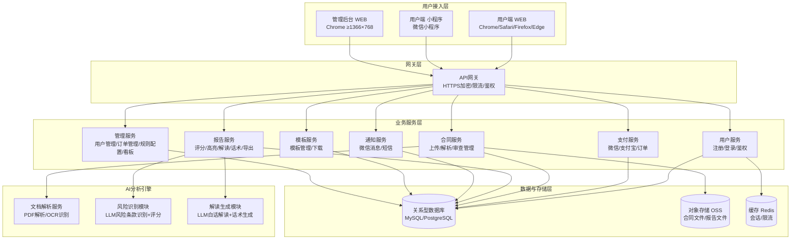

## 2.2 业务模块图

```mermaid
flowchart TD
    Product[AI合同风险条款审查助手] --> M1[账户模块]
    Product --> M2[支付模块]
    Product --> M3[合同模块]
    Product --> M4[报告模块]
    Product --> M5[消息模块]
    Product --> M6[模板库模块]
    Product --> M7[管理后台模块]

    M1 --> M1A[手机号注册/登录]
    M1 --> M1B[服务条款确认]
    M1 --> M1C[个人信息管理]

    M2 --> M2A[按份付费 ¥19/份]
    M2 --> M2B[订阅购买 ¥79/月]
    M2 --> M2C[订单管理]

    M3 --> M3A[多格式上传 PDF/图片/Word]
    M3 --> M3B[审查状态跟踪]
    M3 --> M3C[审查历史]

    M4 --> M4A[风险评分 0-100]
    M4 --> M4B[风险条款高亮列表]
    M4 --> M4C[白话解读+AI标识]
    M4 --> M4D[协商话术+AI标识]
    M4 --> M4E[报告导出 PDF]

    M5 --> M5A[审查完成通知]
    M5 --> M5B[订阅到期提醒]

    M6 --> M6A[模板分类浏览]
    M6 --> M6B[模板预览/下载]

    M7 --> M7A[用户管理]
    M7 --> M7B[订单管理]
    M7 --> M7C[模板管理]
    M7 --> M7D[风险规则配置]
    M7 --> M7E[数据看板]
```

## 2.3 主业务流程

### 2.3.1 合同审查主流程

```mermaid
flowchart TD
    Start([用户打开应用]) --> Login{是否已登录?}
    Login -->|否| Reg[手机号注册/登录]
    Login -->|是| Disclaimer{是否已确认免责声明?}
    Reg --> Disclaimer
    Disclaimer -->|否| Confirm[强制弹窗:服务性质声明+免责声明<br/>勾选"我已阅读并同意"]
    Confirm --> CheckQuota
    Disclaimer -->|是| CheckQuota{是否有可用审查次数?}
    CheckQuota -->|否| Pay[购买审查次数 ¥19/份]
    CheckQuota -->|是| Upload[上传合同文件 PDF/图片/Word]
    Pay --> Upload
    Upload --> Validate{格式/大小校验}
    Validate -->|不通过| FixTip[提示格式不符或超限]
    FixTip --> Upload
    Validate -->|通过| Deduct[扣减审查次数]
    Deduct --> Parse[文档解析与OCR识别]
    Parse --> AIAnalysis[AI风险条款识别与评分]
    AIAnalysis --> GenReport[生成审查报告<br/>含报告级+条款级AI标识]
    GenReport --> Notify[推送审查完成通知]
    Notify --> ViewReport[用户查看报告]
    ViewReport --> Export{是否导出?}
    Export -->|是| Download[下载PDF报告]
    Export -->|否| End1([结束])
    Download --> End1
```

### 2.3.2 报告查看流程

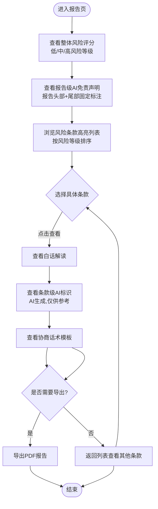

## 2.4 功能图/列表

### 小商户端功能列表

| 功能模块 | 功能名称 | 优先级 | 功能描述 |
| --- | --- | --- | --- |
| 账户模块 | 手机号注册 | P0 | 通过手机号+验证码完成账号注册 |
| 账户模块 | 手机号登录 | P0 | 通过手机号+验证码登录系统 |
| 账户模块 | 微信授权登录 | P1 | 小程序端支持微信一键授权登录 |
| 账户模块 | 免责声明确认 | P0 | 注册/首次登录强制弹窗确认服务性质声明和免责声明 |
| 账户模块 | 修改昵称 | P2 | 用户可修改个人显示昵称 |
| 支付模块 | 按份付费购买 | P0 | ¥19/份购买合同审查服务 |
| 支付模块 | 月度订阅开通 | P1 | ¥79/月订阅套餐，不限份数审查 |
| 支付模块 | 续费与自动续费 | P1 | 订阅到期提醒+手动/自动续费 |
| 支付模块 | 订单列表查看 | P1 | 查看历史支付订单及状态 |
| 支付模块 | 申请退款 | P2 | 未处理订单可申请退款 |
| 合同模块 | 多格式上传 | P0 | 支持PDF/JPG/PNG/DOCX格式上传 |
| 合同模块 | 拍照上传 | P1 | 小程序端直接拍照上传纸质合同 |
| 合同模块 | 大小页数限制 | P0 | 单文件≤50MB、≤100页 |
| 合同模块 | 上传进度展示 | P1 | 上传过程显示进度条 |
| 合同模块 | 审查状态跟踪 | P0 | 查看合同审查状态（待解析/解析中/AI分析中/已完成） |
| 合同模块 | 重新审查 | P2 | 对已完成合同发起重新审查 |
| 报告模块 | 整体风险评分 | P0 | 0～100分展示+风险等级标注 |
| 报告模块 | 报告级AI标识 | P0 | 报告头部和尾部固定标注"AI生成，仅供参考" |
| 报告模块 | 同类基准对比 | P1 | 与同类合同平均基准分对比 |
| 报告模块 | 风险条款列表 | P0 | 列表展示所有风险条款，按风险等级排序 |
| 报告模块 | 原文高亮定位 | P1 | 在合同原文中高亮标注风险位置 |
| 报告模块 | 风险等级标识 | P0 | 高/中/低+红/黄/蓝颜色区分 |
| 报告模块 | 风险类型标注 | P0 | 标注违约金/自动续约/竞业限制/单方解约/赔偿上限等类型 |
| 报告模块 | 白话解读 | P0 | 通俗化解读每条风险条款 |
| 报告模块 | 条款级AI标识 | P0 | 每条解读和话术旁标注"AI生成，仅供参考" |
| 报告模块 | 风险后果说明 | P1 | 说明条款若不修改可能造成的影响 |
| 报告模块 | 协商话术模板 | P0 | 为每条风险条款生成可直接使用的协商话术 |
| 报告模块 | 话术一键复制 | P1 | 一键复制话术到剪贴板 |
| 报告模块 | 修改建议 | P1 | 提供具体的修改建议文本 |
| 报告模块 | PDF报告导出 | P0 | 完整报告导出为PDF |
| 报告模块 | Word报告导出 | P1 | 完整报告导出为Word |
| 报告模块 | 报告详情查看 | P0 | 查看完整报告详情 |
| 合同模块 | 审查历史列表 | P1 | 展示历史审查记录（订阅用户） |
| 合同模块 | 历史报告回看 | P1 | 回看已完成报告详情（订阅用户） |
| 模板库模块 | 模板分类检索 | P1 | 按合同类型分类浏览模板（订阅用户） |
| 模板库模块 | 模板搜索 | P2 | 关键词搜索模板 |
| 模板库模块 | 模板预览 | P1 | 在线预览模板内容（订阅用户） |
| 模板库模块 | 模板下载 | P2 | 下载模板Word文档（订阅用户） |
| 消息模块 | 审查完成通知 | P0 | 审查完成后推送通知 |
| 消息模块 | 订阅到期提醒 | P1 | 到期前3天、1天推送续费提醒 |
| 消息模块 | 审查进度通知 | P2 | 推送关键进度节点通知 |

### 管理后台功能列表

| 功能模块 | 功能名称 | 优先级 | 功能描述 |
| --- | --- | --- | --- |
| 用户管理 | 用户列表查看 | P0 | 查看所有注册用户基本信息 |
| 用户管理 | 用户搜索筛选 | P1 | 按手机号/昵称/注册时间筛选 |
| 用户管理 | 账号封禁/解封 | P1 | 对违规用户封禁或解封 |
| 用户管理 | 订阅状态查看 | P1 | 查看用户订阅状态与消费记录 |
| 订单管理 | 订单信息查询 | P0 | 查看所有支付订单详情 |
| 订单管理 | 订单筛选导出 | P1 | 按条件筛选并导出Excel |
| 订单管理 | 退款审核处理 | P1 | 审核和处理退款申请 |
| 模板管理 | 模板信息查看 | P1 | 查看模板名称/类型/下载量 |
| 模板管理 | 模板上传发布 | P1 | 上传新模板并发布 |
| 模板管理 | 模板编辑下架 | P1 | 编辑或下架模板 |
| 模板管理 | 模板删除 | P2 | 删除不使用的模板 |
| 风险规则 | 风险类型管理 | P1 | 管理风险条款类型定义 |
| 风险规则 | 风险关键词管理 | P1 | 维护识别关键词和模式规则 |
| 风险规则 | 评分权重配置 | P2 | 调整各风险类型评分权重 |
| 风险规则 | 话术模板管理 | P1 | 维护协商话术模板 |
| 数据看板 | 审查数据统计 | P1 | 统计审查数量趋势 |
| 数据看板 | 收入数据统计 | P1 | 统计收入趋势 |
| 数据看板 | 用户活跃度统计 | P2 | 日活/月活/付费转化率 |

## 2.5 你的产品有哪些端

| 序号 | 端名称 | 端类型 | 目标用户 | 说明 |
| --- | --- | --- | --- | --- |
| 1 | 用户端 WEB | WEB端 | 小商户用户 | 面向小商户的合同上传、报告查看、支付购买等核心功能页面，需适配移动端浏览器 |
| 2 | 用户端 小程序 | 小程序端 | 小商户用户 | 面向小商户的移动端入口，支持拍照上传合同、微信消息通知 |
| 3 | 管理后台 | WEB端 | 系统管理员/运营人员 | 面向运营人员的运营后台，含用户管理、订单管理、模板管理、风险规则配置、数据看板 |

---

# 3 产品功能

## 3.1 用户端 WEB 功能

### 3.1.1 用户注册与登录

功能描述：
用户通过手机号+验证码完成账号注册和登录。WEB端同时支持已注册用户的手机号验证码快速登录。

优先级与依赖说明：

| 项 | 内容 |
| --- | --- |
| 优先级 | P0 |
| 依赖需求 | 无 |
| 前置条件 | 用户首次访问系统，未处于登录状态 |

### 3.1.2 用户注册与登录—详细流程

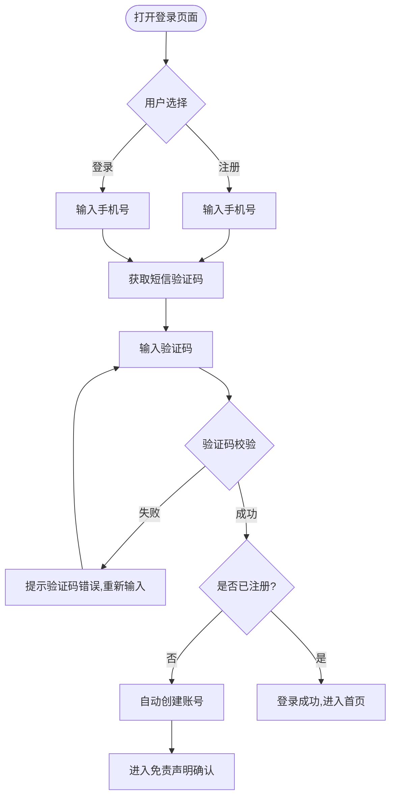

业务规则说明：
1. 手机号格式校验：11位中国大陆手机号，不支持座机号
2. 验证码6位数字，有效期5分钟，同一手机号60秒内不可重复发送
3. 同一手机号每日最多发送10条验证码短信
4. 新用户注册后自动跳转至免责声明确认页，未确认前不可使用核心功能
5. 登录态有效期7天，到期后需重新登录

### 3.1.3 用户注册与登录—主要原型

[登录注册表单原型](assets/prototypes/web-user/login-register-widget.html)

验收标准说明：
- [ ] 正常流程：用户输入有效手机号，获取验证码并输入正确验证码，成功登录/注册
- [ ] 异常流程：手机号格式错误时提示"请输入正确的手机号"；验证码错误时提示"验证码错误或已过期"；超过发送限制时提示"今日发送次数已达上限"
- [ ] 性能要求：验证码发送接口响应时间≤2秒，登录接口响应时间≤1秒

### 3.1.4 免责声明确认

功能描述：
用户注册/首次登录时，系统强制弹窗展示服务性质声明和免责声明，用户必须勾选"我已阅读并同意"后方可继续使用。此功能对应需求文档4.5法律合规第1层免责要求。

优先级与依赖说明：

| 项 | 内容 |
| --- | --- |
| 优先级 | P0 |
| 依赖需求 | 用户注册与登录 |
| 前置条件 | 用户首次登录或尚未确认免责声明 |

### 3.1.5 免责声明确认—详细流程

```mermaid
flowchart TD
    A([登录成功后]) --> B{是否已确认免责声明?}
    B -->|是| C[进入首页]
    B -->|否| D[弹出免责声明弹窗]
    D --> E[展示服务性质声明内容]
    E --> F[展示免责声明内容]
    F --> G[展示隐私政策链接]
    G --> H{用户勾选"我已阅读并同意"}
    H -->|否| I[确认按钮置灰不可点击]
    I --> H
    H -->|是| J[确认按钮可点击]
    J --> K[点击确认]
    K --> L[记录确认状态+时间戳]
    L --> C
```

业务规则说明：
1. 免责声明内容须包含：本服务为AI辅助合同风险识别工具，不属于法律咨询服务；审查结果不构成法律意见，不能替代执业律师的专业判断
2. 用户必须主动勾选确认，不可默认勾选
3. 确认状态持久化存储，用户后续登录不再弹窗
4. 弹窗底部提供《服务条款》和《隐私政策》链接
5. 引用《生成式人工智能服务管理暂行办法》相关条款说明AI生成内容标识规则

### 3.1.6 免责声明确认—主要原型

[免责声明弹窗原型](assets/prototypes/web-user/disclaimer-widget.html)

验收标准说明：
- [ ] 正常流程：用户首次登录后弹窗展示，勾选同意后可点击进入首页
- [ ] 异常流程：未勾选时确认按钮不可点击；点击链接可打开服务条款/隐私政策详情
- [ ] 性能要求：弹窗加载时间≤500ms

### 3.1.7 按份付费购买

功能描述：
用户按¥19/份购买合同审查服务。支持微信支付和支付宝两种支付方式。支付成功后获得1次合同审查机会。

优先级与依赖说明：

| 项 | 内容 |
| --- | --- |
| 优先级 | P0 |
| 依赖需求 | 用户注册与登录、免责声明确认 |
| 前置条件 | 用户已登录且已确认免责声明 |

### 3.1.8 按份付费购买—详细流程

```mermaid
flowchart TD
    A([用户点击"购买审查次数"]) --> B[显示购买页面]
    B --> C[显示价格:¥19/份]
    C --> D[选择购买份数]
    D --> E[选择支付方式]
    E --> F{微信支付还是支付宝?}
    F -->|微信| G[生成微信支付二维码/调起微信支付]
    F -->|支付宝| H[生成支付宝付款码/调起支付宝]
    G --> I[用户完成支付]
    H --> I
    I --> J[支付回调:更新订单状态]
    J --> K{支付成功?}
    K -->|否| L[提示支付失败,可重试]
    K -->|是| M[增加审查次数]
    M --> N[提示购买成功,引导上传合同]
```

业务规则说明：
1. 支持微信支付和支付宝两种支付方式
2. 支付超时时间15分钟，超时自动关闭订单
3. 支付成功后即时增加审查次数，无延迟
4. 支付失败不扣减次数，用户可重新发起支付
5. 每份合同对应1次审查机会，审查失败（系统原因）自动退还次数

### 3.1.9 按份付费购买—主要原型

[支付购买页面原型](assets/prototypes/web-user/payment-widget.html)

验收标准说明：
- [ ] 正常流程：用户选择份数，选择支付方式，成功支付后审查次数增加
- [ ] 异常流程：支付超时提示重新支付；支付失败显示失败原因并允许重试
- [ ] 性能要求：支付订单创建接口响应时间≤2秒

### 3.1.10 合同上传

功能描述：
用户上传合同文件进行风险审查，支持PDF、JPG、PNG、DOCX四种格式。上传前进行格式和大小校验，上传成功后自动触发审查流程。

优先级与依赖说明：

| 项 | 内容 |
| --- | --- |
| 优先级 | P0 |
| 依赖需求 | 按份付费购买（需有可用审查次数） |
| 前置条件 | 用户有至少1次可用审查次数 |

### 3.1.11 合同上传—详细流程

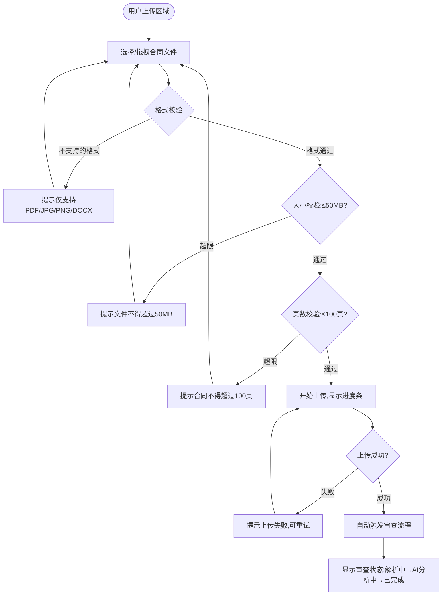

业务规则说明：
1. 支持格式：PDF（.pdf）、JPG（.jpg/.jpeg）、PNG（.png）、Word（.docx）
2. 单文件大小限制：50MB
3. 单文件页数限制：100页（PDF和DOCX检查页数，图片默认1页）
4. 支持拖拽上传和点击选择文件两种方式
5. 上传成功后自动扣减1次审查次数并开始审查
6. 审查过程中用户可留在当前页面查看实时状态

### 3.1.12 合同上传—主要原型

[合同上传组件原型](assets/prototypes/web-user/contract-upload-widget.html)

验收标准说明：
- [ ] 正常流程：用户上传符合要求的文件，显示上传进度，上传成功后自动开始审查
- [ ] 异常流程：格式不符提示"仅支持PDF/JPG/PNG/DOCX格式"；超过50MB提示"文件大小不得超过50MB"；超过100页提示"合同不得超过100页"
- [ ] 性能要求：50MB文件在4G网络下上传时间≤120秒

### 3.1.13 审查状态跟踪

功能描述：
用户可查看当前合同的审查状态，包括待解析、解析中、AI分析中、已完成四个阶段，每个阶段有对应的进度提示。

优先级与依赖说明：

| 项 | 内容 |
| --- | --- |
| 优先级 | P0 |
| 依赖需求 | 合同上传 |
| 前置条件 | 合同文件已上传成功 |

### 3.1.14 审查状态跟踪—详细流程

```mermaid
flowchart TD
    A([查看审查状态]) --> B{当前状态}
    B -->|待解析| C[显示:文件已接收,等待解析]
    B -->|解析中| D[显示:正在解析文档内容...]
    B -->|AI分析中| E[显示:AI正在识别风险条款...]
    B -->|已完成| F[显示:审查完成,查看报告]
    B -->|分析失败| G[显示:分析失败,系统重试中...]
    F --> H[点击"查看报告"]
    H --> I[进入报告详情页]
```

业务规则说明：
1. 状态流转：待解析 → 解析中 → AI分析中 → 已完成（或分析失败）
2. 解析中阶段预计耗时≤60秒，AI分析中阶段预计耗时≤180秒
3. 分析失败时系统自动重试最多3次，重试间隔30秒
4. 3次重试均失败后标记为"待人工处理"，同时通知管理员
5. 页面每5秒轮询一次状态更新

### 3.1.15 风险评分展示

功能描述：
报告页面顶部以0～100分展示合同整体风险水平，分数越高风险越大。同时标注风险等级（低风险0-30绿色/中风险31-60黄色/高风险61-100红色），并在报告头部和尾部固定标注"本报告由AI生成，仅供参考，不构成法律建议"。

优先级与依赖说明：

| 项 | 内容 |
| --- | --- |
| 优先级 | P0 |
| 依赖需求 | AI风险分析完成 |
| 前置条件 | 审查任务状态为"已完成" |

### 3.1.16 风险评分展示—详细流程

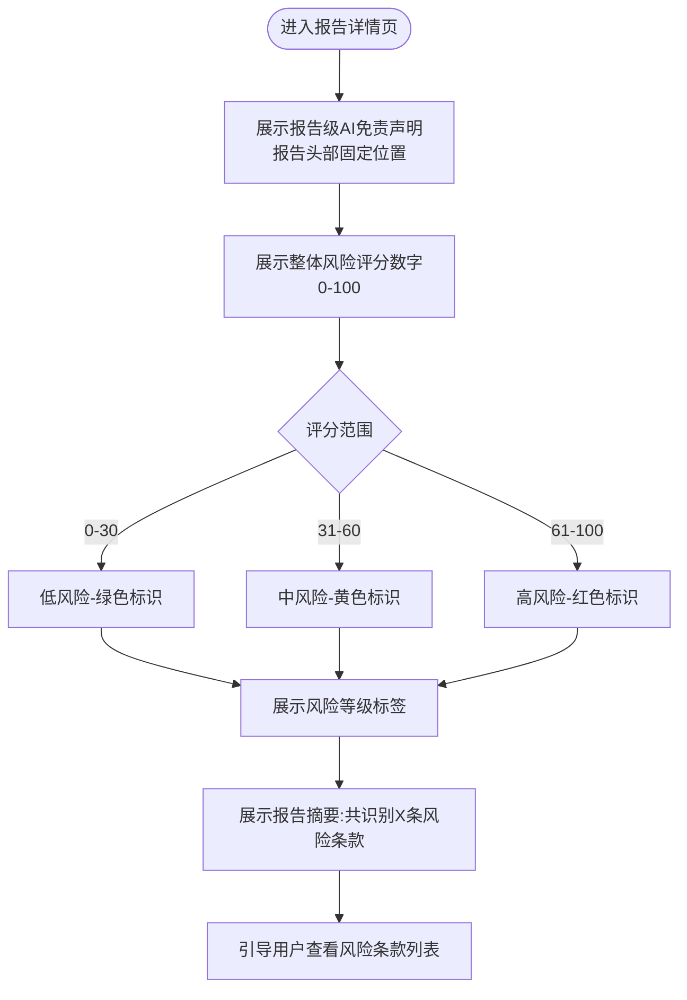

业务规则说明：
1. 风险评分0～100分，分数越高风险越大
2. 低风险(0-30)：绿色标识，合同整体风险可控
3. 中风险(31-60)：黄色标识，存在需关注的风险条款
4. 高风险(61-100)：红色标识，强烈建议咨询专业律师
5. 报告头部和尾部固定位置显示"本报告由AI生成，仅供参考，不构成法律建议。重要合同请咨询专业律师。"
6. 评分旁标注"评分基于AI模型分析，可能存在偏差，不作为最终决策依据"

### 3.1.17 风险评分展示—主要原型

[风险评分展示原型](assets/prototypes/web-user/risk-score-widget.html)

验收标准说明：
- [ ] 正常流程：报告页正确显示风险评分、等级颜色标识、AI免责声明
- [ ] 异常流程：评分为0时显示"未识别到明显风险条款"；评分为100时显示"风险极高，强烈建议咨询律师"
- [ ] 性能要求：报告详情页加载时间≤2秒

### 3.1.18 风险条款列表与白话解读

功能描述：
以列表形式展示所有识别出的风险条款，每条标注风险类型（违约金/自动续约/竞业限制/单方解约/赔偿上限等）和风险等级（高/中/低，红/黄/蓝颜色区分）。点击某条可查看通俗白话解读、风险后果说明和修改建议。每条解读旁标注"AI生成，仅供参考"。

优先级与依赖说明：

| 项 | 内容 |
| --- | --- |
| 优先级 | P0 |
| 依赖需求 | 风险评分展示 |
| 前置条件 | 审查任务状态为"已完成" |

### 3.1.19 风险条款列表与白话解读—详细流程

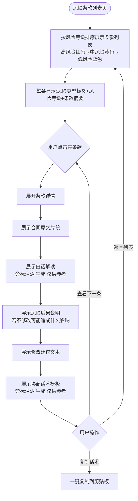

业务规则说明：
1. 风险类型包括但不限于：违约金、自动续约、竞业限制、单方解约、赔偿上限、免责条款、知识产权、保密义务
2. 风险等级颜色：高风险红色(#E53E3E)、中风险黄色(#ECC94B)、低风险蓝色(#4299E1)
3. 条款列表默认按风险等级从高到低排序
4. 每条白话解读使用通俗日常语言，避免法律术语
5. 每条解读和话术旁必须标注"AI生成，仅供参考"标识
6. 协商话术支持一键复制到剪贴板
7. 点击"复制"后显示Toast提示"已复制到剪贴板"

### 3.1.20 风险条款列表与白话解读—主要原型

[风险条款列表原型](assets/prototypes/web-user/risk-clauses-widget.html)

验收标准说明：
- [ ] 正常流程：条款列表正确展示风险类型、等级颜色、白话解读、协商话术；点击复制成功
- [ ] 异常流程：AI未识别到风险条款时显示"未发现明显风险条款，但建议仍需仔细阅读"
- [ ] 性能要求：条款列表加载时间≤1.5秒；单条展开详情响应时间≤500ms

### 3.1.21 报告导出PDF

功能描述：
将完整的风险审查报告（含评分、条款列表、白话解读、协商话术、AI免责声明）导出为PDF文件供用户下载保存。

优先级与依赖说明：

| 项 | 内容 |
| --- | --- |
| 优先级 | P0 |
| 依赖需求 | 风险审查报告已生成 |
| 前置条件 | 审查任务状态为"已完成" |

### 3.1.22 报告导出PDF—详细流程

```mermaid
flowchart TD
    A([报告详情页]) --> B[点击"导出PDF"]
    B --> C[后端渲染PDF文件]
    C --> D{渲染成功?}
    D -->|否| E[提示导出失败,请重试]
    D -->|是| F[触发浏览器下载]
    F --> G[文件名:合同风险报告_合同名_日期.pdf]
```

业务规则说明：
1. PDF报告包含完整的报告级和条款级AI免责声明
2. 文件名格式：合同风险报告_合同名称_YYYYMMDD.pdf
3. PDF报告排版包含：封面页（含评分和等级）、风险条款列表页、每条条款的原文+解读+话术、总结页
4. 报告页眉/页脚固定标注AI生成声明
5. 导出超时时间30秒，超时提示重试

### 3.1.23 报告导出PDF—主要原型

[报告导出按钮原型](assets/prototypes/web-user/report-export-widget.html)

验收标准说明：
- [ ] 正常流程：点击导出按钮后成功下载PDF文件，内容完整
- [ ] 异常流程：导出失败时显示错误提示并允许重试
- [ ] 性能要求：PDF文件生成时间≤15秒

### 3.1.24 审查完成通知

功能描述：
合同审查完成后，系统通过站内消息、短信或微信模板消息推送通知提醒用户查看报告。

优先级与依赖说明：

| 项 | 内容 |
| --- | --- |
| 优先级 | P0 |
| 依赖需求 | 风险审查报告已生成 |
| 前置条件 | 用户已开启通知权限 |

### 3.1.25 消息通知中心

功能描述：
用户可在消息中心查看所有历史通知消息，包括审查完成通知、订阅到期提醒、系统公告等。

优先级与依赖说明：

| 项 | 内容 |
| --- | --- |
| 优先级 | P0（审查完成通知）/ P1（其他通知） |
| 依赖需求 | 无 |
| 前置条件 | 用户已登录 |

### 3.1.26 消息通知中心—主要原型

[消息通知中心原型](assets/prototypes/web-user/notification-widget.html)

验收标准说明：
- [ ] 正常流程：消息列表按时间倒序展示；未读消息有红点标记；点击消息标记已读
- [ ] 异常流程：无消息时显示空状态引导
- [ ] 性能要求：消息列表加载时间≤1秒

---

## 3.2 用户端 小程序 功能

小程序端复用WEB端核心功能（注册登录、免责声明、支付、上传、报告查看），同时增加拍照上传和微信授权登录等移动端专属功能。

### 3.2.1 微信授权登录

功能描述：
小程序端支持微信一键授权登录，用户无需手动输入手机号即可快速登录。首次授权时需绑定手机号。

优先级与依赖说明：

| 项 | 内容 |
| --- | --- |
| 优先级 | P1 |
| 依赖需求 | 手机号绑定（首次授权） |
| 前置条件 | 用户在微信环境中打开小程序 |

### 3.2.2 拍照上传

功能描述：
小程序端支持直接调用手机摄像头拍照上传纸质合同图片，系统自动进行OCR识别后进入审查流程。

优先级与依赖说明：

| 项 | 内容 |
| --- | --- |
| 优先级 | P1 |
| 依赖需求 | 合同上传基础功能 |
| 前置条件 | 用户有可用审查次数；小程序已获取摄像头权限 |

### 3.2.3 拍照上传—详细流程

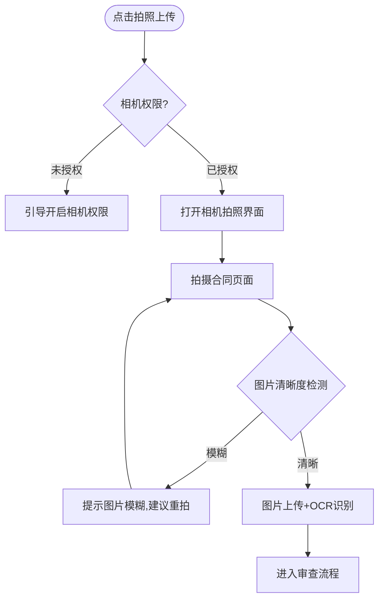

### 3.2.4 拍照上传—主要原型

[拍照上传原型](assets/prototypes/miniapp/camera-upload-widget.html)

验收标准说明：
- [ ] 正常流程：拍照后图片上传成功并进入OCR识别
- [ ] 异常流程：未授权相机权限时引导开启；图片模糊时提示重拍

---

## 3.3 管理后台功能

### 3.3.1 数据看板

功能描述：
管理后台首页展示核心运营数据，包括审查数量统计（日/周/月）、收入数据统计（按份付费收入、订阅收入、总收入趋势）、用户活跃度（日活/月活、新增用户数、付费转化率）。

优先级与依赖说明：

| 项 | 内容 |
| --- | --- |
| 优先级 | P1 |
| 依赖需求 | 用户管理、订单管理基础数据 |
| 前置条件 | 管理员已登录 |

### 3.3.2 数据看板—详细流程

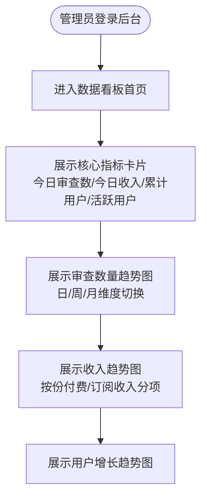

### 3.3.3 数据看板—主要原型

[数据看板原型](assets/prototypes/admin/dashboard-widget.html)

验收标准说明：
- [ ] 正常流程：数据看板正确展示各项指标和趋势图；支持日/周/月维度切换
- [ ] 异常流程：无数据时显示空状态"暂无数据"

### 3.3.4 风险规则配置

功能描述：
管理员可管理风险条款类型定义、维护各类风险的识别关键词和模式规则、调整各风险类型在整体评分中的权重占比、维护协商话术模板。

优先级与依赖说明：

| 项 | 内容 |
| --- | --- |
| 优先级 | P1 |
| 依赖需求 | 无 |
| 前置条件 | 管理员已登录且有规则配置权限 |

### 3.3.5 风险规则配置—主要原型

[风险规则配置原型](assets/prototypes/admin/risk-rules-widget.html)

验收标准说明：
- [ ] 正常流程：管理员可增删改风险类型；可编辑关键词和权重；修改后实时生效
- [ ] 异常流程：删除正在使用的风险类型时提示"该类型下有X条关联规则，确认删除？"

---

# 4 产品原型

## 4.1 页面跳转逻辑图

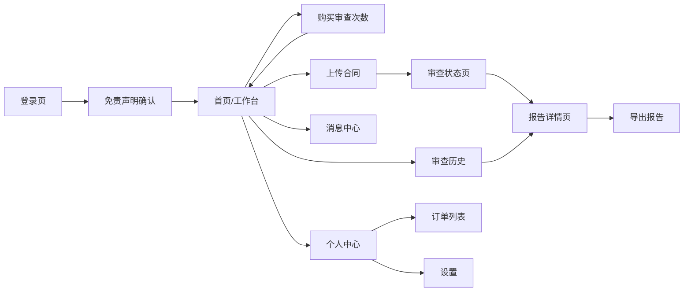

## 4.2 全站点原型设计

### 4.2.1 用户端 WEB

**页面清单：**

| 序号 | 页面名称 | 所属模块 | 页面描述 | 关键元素 |
| --- | --- | --- | --- | --- |
| 1 | 登录/注册页 | 账户 | 手机号+验证码登录注册 | 手机号输入框、验证码输入框、发送验证码按钮、登录按钮 |
| 2 | 免责声明确认页 | 账户 | 首次登录强制确认服务声明 | 声明内容区、勾选框、确认按钮、服务条款链接 |
| 3 | 首页/工作台 | 主功能 | 核心操作入口 | 上传合同入口、剩余次数、快速开始按钮、最近审查记录 |
| 4 | 购买审查次数页 | 支付 | 选择份数和支付方式 | 份数选择、价格展示、微信/支付宝选择、支付按钮 |
| 5 | 上传合同页 | 合同 | 拖拽或点击上传合同文件 | 拖拽上传区域、文件格式提示、进度条 |
| 6 | 审查状态页 | 合同 | 实时查看审查进度 | 状态步骤条、进度提示、等待时间预估 |
| 7 | 报告详情页 | 报告 | 查看完整审查报告 | 风险评分、风险等级、条款列表、解读区、话术区、导出按钮 |
| 8 | 消息中心页 | 消息 | 查看所有通知消息 | 消息列表、未读标记、消息详情 |
| 9 | 审查历史页 | 合同 | 历史审查记录列表 | 记录列表、时间筛选、状态标签 |
| 10 | 个人中心页 | 账户 | 个人信息和设置 | 昵称、手机号、订单记录、退出登录 |
| 11 | 订单列表页 | 支付 | 历史支付订单 | 订单列表、状态筛选、金额展示 |

**交互说明：**
- 页面跳转关系：
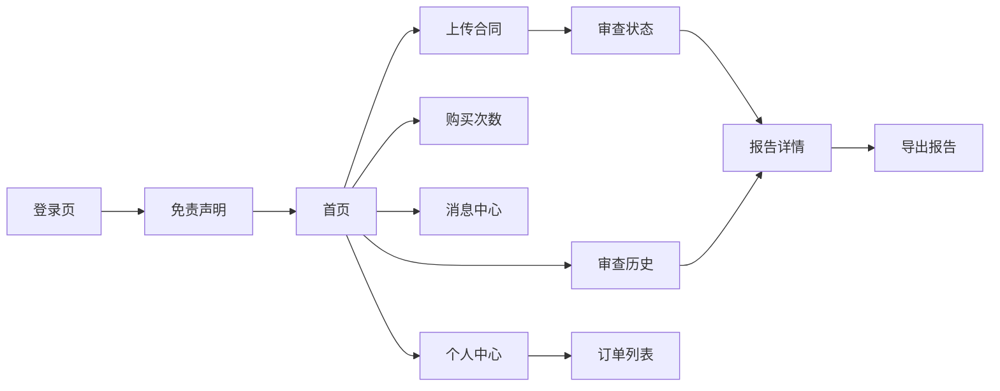
- 特殊交互：
  1. 首页上传区域支持拖拽上传，拖入文件时高亮边框
  2. 审查状态页每5秒轮询更新，状态切换有过渡动画
  3. 报告详情页条款列表支持折叠展开，展开时有平滑过渡
  4. 复制话术后显示Toast提示"已复制到剪贴板"，2秒自动消失
  5. 空数据态：无审查记录时显示引导插画+上传按钮

**产品原型：**

[🖥️ 打开用户端WEB全站点原型](assets/prototypes/web-user-prototype.html)

### 4.2.2 用户端 小程序

**页面清单：**

| 序号 | 页面名称 | 所属模块 | 页面描述 | 关键元素 |
| --- | --- | --- | --- | --- |
| 1 | 登录页 | 账户 | 微信一键授权登录+手机号绑定 | 微信登录按钮、手机号绑定 |
| 2 | 首页 | 主功能 | 核心操作入口 | 拍照上传、相册选择、剩余次数 |
| 3 | 上传合同页 | 合同 | 拍照/相册上传+进度 | 拍照按钮、相册入口、进度条 |
| 4 | 审查状态页 | 合同 | 实时审查进度 | 步骤条、进度提示 |
| 5 | 报告详情页 | 报告 | 审查报告查看 | 评分、条款列表、解读、话术 |
| 6 | 购买次数页 | 支付 | 微信支付购买 | 份数选择、微信支付 |
| 7 | 消息中心 | 消息 | 服务通知列表 | 消息列表 |
| 8 | 个人中心 | 账户 | 个人信息和设置 | 头像、昵称、订单、退出 |

**交互说明：**
- 页面跳转关系：
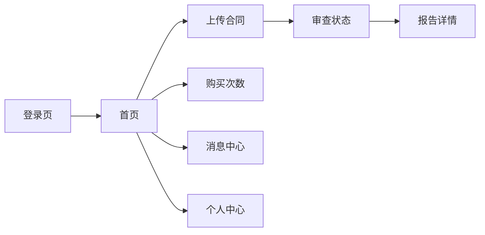
- 特殊交互：
  1. 拍照上传时调用摄像头，支持自动对焦和闪光灯
  2. 首页下拉刷新获取最新审查状态
  3. 小程序端使用微信支付直接调起付款
  4. 底部Tab栏：首页、消息、我的

**产品原型：**

[📱 打开用户端小程序全站点原型](assets/prototypes/miniapp-prototype.html)

### 4.2.3 管理后台

**页面清单：**

| 序号 | 页面名称 | 所属模块 | 页面描述 | 关键元素 |
| --- | --- | --- | --- | --- |
| 1 | 数据看板 | 看板 | 核心运营数据总览 | 指标卡片、趋势图、饼图 |
| 2 | 用户列表 | 用户管理 | 注册用户管理 | 表格、搜索框、筛选器、操作列 |
| 3 | 用户详情 | 用户管理 | 单个用户详细信息 | 基本信息、消费记录、审查历史 |
| 4 | 订单列表 | 订单管理 | 支付订单管理 | 表格、日期筛选、状态筛选、导出按钮 |
| 5 | 退款处理 | 订单管理 | 退款申请审核 | 退款列表、审核操作、退款详情 |
| 6 | 模板列表 | 模板管理 | 合同模板管理 | 模板列表、分类筛选、发布/下架操作 |
| 7 | 模板编辑 | 模板管理 | 模板内容编辑 | 富文本编辑器、分类选择、发布按钮 |
| 8 | 风险规则配置 | 风险规则 | 风险类型和关键词管理 | 类型列表、关键词编辑、权重调整 |
| 9 | 话术模板管理 | 风险规则 | 协商话术模板维护 | 话术列表、编辑区、预览 |
| 10 | 系统设置 | 系统 | 系统参数配置 | 基础设置、通知设置、AI参数 |

**交互说明：**
- 页面跳转关系：
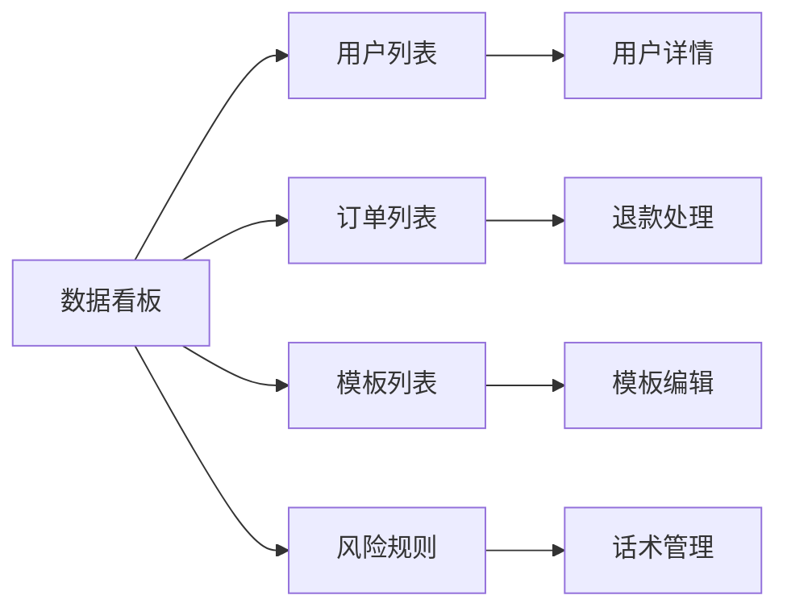
- 特殊交互：
  1. 侧边导航栏支持折叠展开
  2. 表格支持排序、分页、批量操作
  3. 数据看板图表支持日/周/月维度切换
  4. 模板编辑器支持富文本格式（加粗、列表、表格等）
  5. 操作确认弹窗：封禁用户、删除模板等危险操作需二次确认

**产品原型：**

[🖥️ 打开管理后台全站点原型](assets/prototypes/admin-prototype.html)

---

# 5 数据需求

## 5.1 数据使用规格

### 用户表

| 字段 | 是否必填 | 描述 | 数据类型 |
| --- | --- | --- | --- |
| id | 是 | 用户唯一标识 | UUID |
| phone | 是 | 手机号（加密存储） | 字符串 |
| nickname | 否 | 用户昵称 | 字符串 |
| disclaimer_confirmed | 是 | 是否已确认免责声明 | 布尔 |
| disclaimer_confirmed_at | 否 | 免责声明确认时间 | 时间戳 |
| user_type | 是 | 用户类型（按份/订阅） | 枚举 |
| subscription_expire_at | 否 | 订阅到期时间 | 时间戳 |
| review_quota | 是 | 剩余审查次数 | 整数 |
| created_at | 是 | 注册时间 | 时间戳 |
| updated_at | 是 | 最后更新时间 | 时间戳 |
| status | 是 | 账号状态（正常/封禁） | 枚举 |

### 合同审查任务表

| 字段 | 是否必填 | 描述 | 数据类型 |
| --- | --- | --- | --- |
| id | 是 | 任务唯一标识 | UUID |
| user_id | 是 | 关联用户ID | UUID |
| file_name | 是 | 上传文件名 | 字符串 |
| file_url | 是 | 文件存储地址 | 字符串 |
| file_size | 是 | 文件大小（字节） | 整数 |
| file_type | 是 | 文件类型（pdf/jpg/png/docx） | 枚举 |
| page_count | 否 | 文件页数 | 整数 |
| status | 是 | 审查状态 | 枚举 |
| contract_type | 否 | 合同类型（租赁/供应/加盟等） | 枚举 |
| parsed_text | 否 | 解析后的文本内容 | 文本 |
| risk_score | 否 | 风险评分（0-100） | 整数 |
| risk_level | 否 | 风险等级（低/中/高） | 枚举 |
| risk_clauses_count | 否 | 识别到的风险条款数量 | 整数 |
| report_url | 否 | 生成的报告文件地址 | 字符串 |
| created_at | 是 | 创建时间 | 时间戳 |
| completed_at | 否 | 完成时间 | 时间戳 |

### 风险条款表

| 字段 | 是否必填 | 描述 | 数据类型 |
| --- | --- | --- | --- |
| id | 是 | 条款唯一标识 | UUID |
| task_id | 是 | 关联审查任务ID | UUID |
| clause_type | 是 | 风险类型（违约金/自动续约/竞业限制等） | 枚举 |
| risk_level | 是 | 风险等级（高/中/低） | 枚举 |
| original_text | 是 | 合同原文片段 | 文本 |
| page_number | 否 | 所在页码 | 整数 |
| plain_explanation | 是 | 白话解读 | 文本 |
| risk_consequence | 否 | 风险后果说明 | 文本 |
| modification_suggestion | 否 | 修改建议 | 文本 |
| negotiation_script | 是 | 协商话术模板 | 文本 |
| created_at | 是 | 创建时间 | 时间戳 |

### 订单表

| 字段 | 是否必填 | 描述 | 数据类型 |
| --- | --- | --- | --- |
| id | 是 | 订单唯一标识 | UUID |
| user_id | 是 | 关联用户ID | UUID |
| order_type | 是 | 订单类型（按份/订阅） | 枚举 |
| amount | 是 | 订单金额（分） | 整数 |
| payment_method | 是 | 支付方式（微信/支付宝） | 枚举 |
| payment_status | 是 | 支付状态（待支付/已支付/已退款） | 枚举 |
| review_count | 是 | 购买审查次数 | 整数 |
| paid_at | 否 | 支付时间 | 时间戳 |
| refund_at | 否 | 退款时间 | 时间戳 |
| created_at | 是 | 创建时间 | 时间戳 |

## 5.2 统计数据

1. 统计每日/每周/每月的合同审查数量、完成数量、失败数量（P1）
2. 统计按份付费收入、订阅收入、总收入趋势（P1）
3. 统计日活/月活用户数、新增用户数、付费转化率（P2）
4. 统计各类风险条款出现频率TOP10（P1）
5. 统计合同类型分布（租赁/供应/加盟/其他）（P1）

## 5.3 埋点需求

| 页面 | 事件 | 采集字段 | 说明 |
| --- | --- | --- | --- |
| 登录页 | page_view | page, timestamp | 登录页访问量 |
| 登录页 | send_sms_code | phone_prefix, result | 验证码发送情况 |
| 登录页 | login_success | user_id, login_type | 登录成功统计 |
| 首页 | page_view | user_id, quota | 首页访问量 |
| 首页 | click_upload | user_id | 点击上传入口 |
| 上传页 | file_upload | user_id, file_type, file_size, result | 文件上传情况 |
| 审查状态页 | status_change | task_id, from_status, to_status | 状态流转追踪 |
| 报告页 | page_view | user_id, task_id, risk_score, risk_level | 报告查看统计 |
| 报告页 | copy_script | user_id, clause_id | 话术复制统计 |
| 报告页 | export_report | user_id, task_id, export_type | 报告导出统计 |
| 购买页 | create_order | user_id, order_type, amount | 订单创建统计 |
| 购买页 | pay_success | user_id, order_id, amount | 支付成功统计 |

---

# 6 非功能需求

## 6.1 性能需求

**6.1.1 延迟**

| 编号 | 项目 | 最大延迟 | 平均延迟 | 优先级 | 备注 |
| --- | --- | --- | --- | --- | --- |
| 0001 | 登录/注册接口 | <1秒 | <0.5秒 | 高 | |
| 0002 | 验证码发送 | <2秒 | <1秒 | 高 | |
| 0003 | 文件上传（50MB） | <120秒 | <60秒 | 高 | 4G网络环境 |
| 0004 | 文档解析 | <60秒 | <30秒 | 高 | |
| 0005 | AI风险分析 | <180秒 | <90秒 | 高 | 单份≤5000字合同 |
| 0006 | 报告生成总耗时 | <5分钟 | <3分钟 | 高 | 含解析+AI分析 |
| 0007 | 页面首屏加载 | <3秒 | <1.5秒 | 高 | 4G网络 |
| 0008 | PDF报告导出 | <15秒 | <8秒 | 中 | |

**6.1.2 吞吐量**

| 编号 | 项 | 吞吐量 | 备注 |
| --- | --- | --- | --- |
| 0001 | 并发合同审查任务 | ≥50份同时处理 | |
| 0002 | 文件上传并发 | ≥100个/分钟 | |
| 0003 | 验证码发送 | ≥200条/分钟 | |

**6.1.3 容量**

| 编号 | 项 | 容量 | 备注 |
| --- | --- | --- | --- |
| 0001 | 系统注册用户数 | ≤1,000,000 | |
| 0002 | 单用户合同存储上限 | 1GB（订阅）/ 100MB（按份） | |
| 0003 | 合同文件保留期限 | 账号存续期间+注销后30天 | |

## 6.2 安全需求

| 编号 | 项（系统数据/处理过程） |
| --- | --- |
| 0001 | 用户上传的合同文件必须加密存储（AES-256），仅用户本人和系统分析进程可访问 |
| 0002 | 用户手机号等敏感信息加密存储，不可明文保存 |
| 0003 | API调用全程使用HTTPS加密传输 |
| 0004 | AI模型供应商承诺不使用用户输入数据进行模型训练 |
| 0005 | 用户注销账号后30天内删除所有合同文件和个人数据 |
| 0006 | 管理后台操作需记录审计日志，保留180天 |
| 0007 | 支付回调需验签，防止伪造支付成功通知 |

## 6.3 可靠性

| 编号 | 项 | 值 |
| --- | --- | --- |
| 0001 | 系统月可用性 | ≥99.5% |
| 0002 | AI服务月可用性 | ≥99.5%（需有备用模型切换方案） |
| 0003 | 平均故障恢复时间（MTTR） | ≤30分钟 |
| 0004 | AI分析失败自动重试次数 | 最多3次 |

## 6.4 可连续性

| 编号 | 项 |
| --- | --- |
| Conti.1 | 系统需7×24小时全天候运行 |
| Conti.2 | AI模型需配置主模型+备用模型双通道，主模型不可用时自动切换 |
| Conti.3 | 支付服务需支持降级处理，支付回调延迟不影响审查流程 |

## 6.5 可恢复性

| 编号 | 项 |
| --- | --- |
| Recov.1 | 每日全量数据备份，保留30天 |
| Recov.2 | 每小时增量备份业务数据 |
| Recov.3 | 重大故障需在1～3小时恢复服务可用性 |
| Recov.4 | 合同文件支持从OSS恢复，数据库支持72小时内数据恢复 |

## 6.6 兼容性

| 编号 | 要求 | 备注 |
| --- | --- | --- |
| 0001 | WEB端：Chrome≥90，Firefox≥88，Safari≥14，Edge≥90 | |
| 0002 | 小程序端：微信基础库≥2.20.0 | |
| 0003 | 管理后台：Chrome浏览器，分辨率≥1366×768 | |
| 0004 | 移动端适配主流分辨率：375×667，390×844，414×896 | |

## 6.7 易用性

| 编号 | 要求 | 备注 |
| --- | --- | --- |
| 0001 | 核心操作路径（上传→查看报告）不超过3步 | |
| 0002 | 普通用户无需培训即可使用核心功能 | |
| 0003 | 系统提示语、解读内容使用通俗易懂的日常语言 | |
| 0004 | 界面风格简洁直观、亲和力强，避免严肃冷色调 | |
| 0005 | 报告页面支持字号调节（小/中/大三档） | |
| 0006 | 空状态页面展示引导文案和操作入口 | |

## 6.8 法律合规需求

本产品涉及AI生成法律相关内容，须严格遵循以下6层免责框架：

| 层次 | 位置 | 要求 |
| --- | --- | --- |
| 1. 服务性质声明 | 注册/首次登录强制弹窗 | 用户必须勾选确认：本服务为AI辅助工具，不提供法律咨询或法律意见 |
| 2. 报告级标识 | 每份报告头部+尾部 | 固定标注："本报告由AI生成，仅供参考，不构成法律建议" |
| 3. 条款级标识 | 每条风险解读旁 | 标注："AI生成，仅供参考" |
| 4. 数据与隐私声明 | 隐私政策页 | 明确存储期限、使用范围、删除权利 |
| 5. 责任限制条款 | 服务条款页 | AI可能不准确；赔偿上限为已付服务费 |
| 6. 合规性引用 | 隐私政策/服务条款 | 引用《生成式人工智能服务管理暂行办法》 |

---

# 7 总结

## 7.1 上线计划

| 阶段 | 时间 | 内容 | 负责人 |
| --- | --- | --- | --- |
| 开发阶段 | 2026-07-01 ~ 2026-07-10 | MVP核心功能开发（账户+支付+上传+审查+报告） | 开发团队 |
| 测试阶段 | 2026-07-11 ~ 2026-07-13 | 功能测试、AI准确性测试、性能测试 | 测试团队 |
| 灰度阶段 | 2026-07-14 ~ 2026-07-16 | 灰度10%用户，验证稳定性和AI准确率 | 运营团队 |
| 全量上线 | 2026-07-17 | 全量开放 | 全体团队 |

## 7.2 后续迭代规划

- V1.1（上线后2周）：订阅套餐（¥79/月）、微信授权登录、合同模板库、审查历史记录
- V1.2（上线后1个月）：Word报告导出、合同原文高亮定位、团队协作功能、风险后果说明
- V1.3（上线后2个月）：同类合同基准对比、话术一键复制、审查进度通知、模板搜索
- V2.0（上线后3个月）：多语言合同支持（中英对照）、批量审查功能、API开放平台

## 7.3 参考文档

- 《AI合同风险条款审查助手 — 用户需求说明书（URS）》V2.0
- 《生成式人工智能服务管理暂行办法》（2023年8月15日起施行）
- 微信小程序开发文档：https://developers.weixin.qq.com/miniprogram/dev/framework/
- 微信支付接入文档：https://pay.weixin.qq.com/wiki/doc/apiv3/
- 支付宝开放平台文档：https://opendocs.alipay.com/
