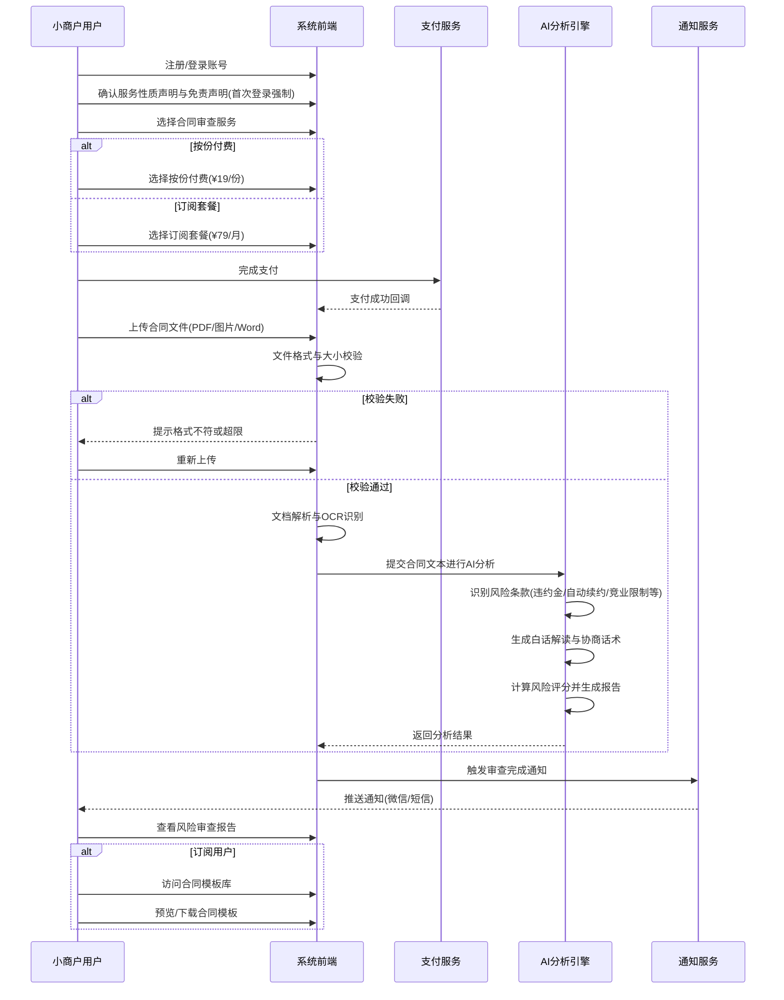
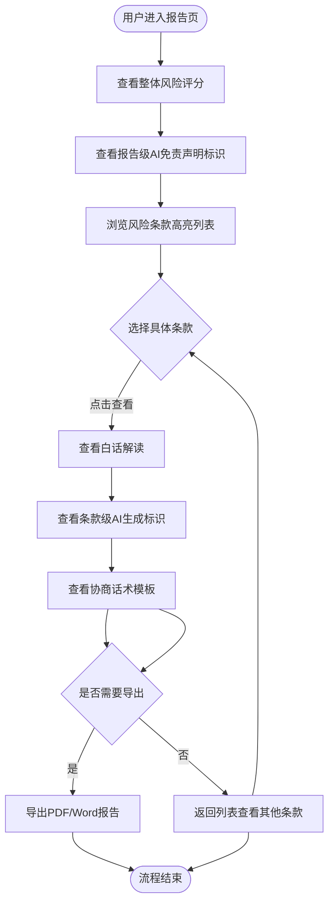
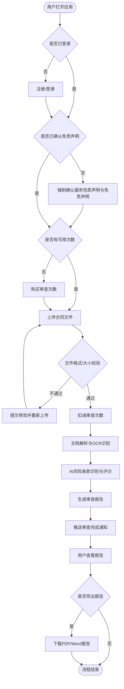
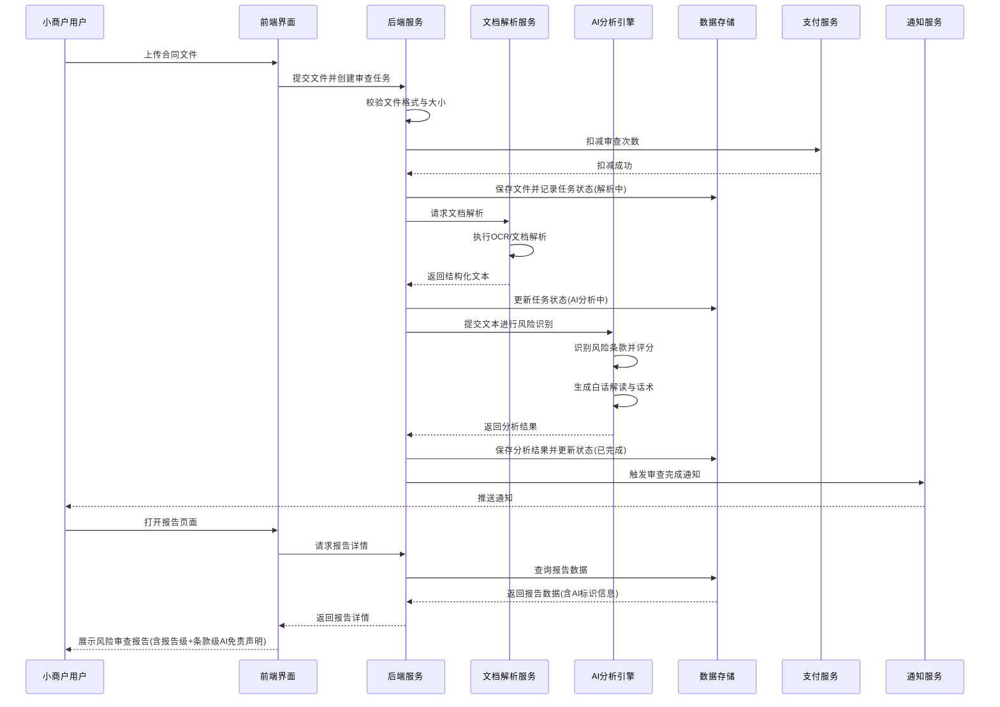
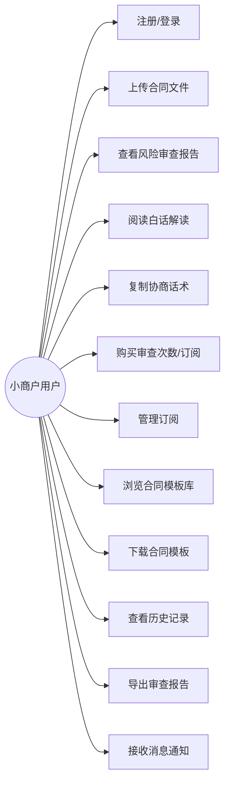
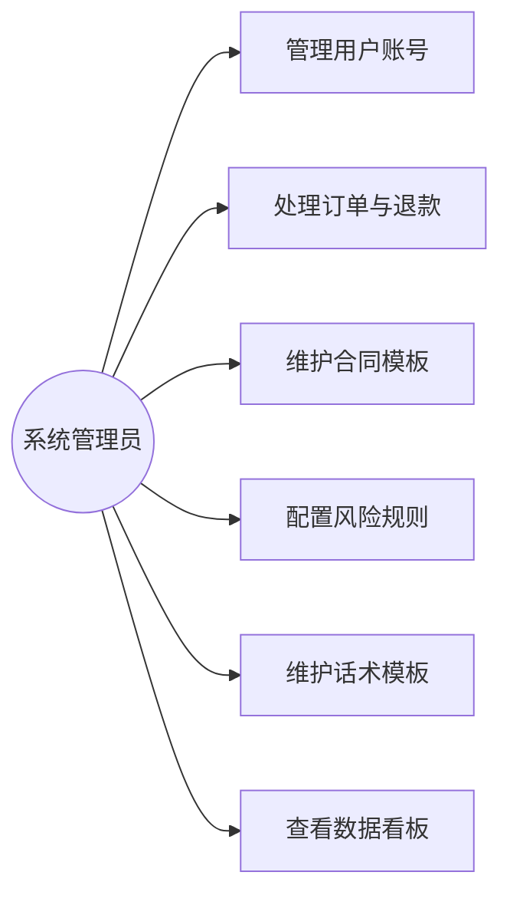
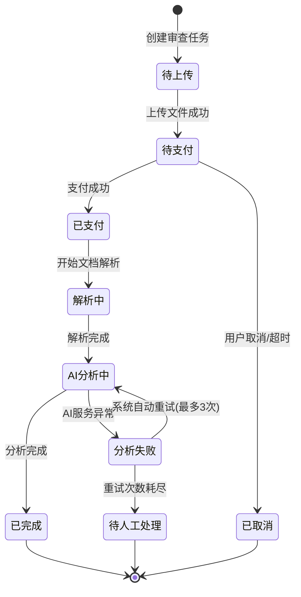

# 1. 需求概述

## 1.1 需求介绍

AI合同风险条款审查助手（以下简称"本产品"）是一款面向个体工商户和小微企业主的AI驱动合同风险识别与解读工具。小商户在签署商铺租赁、供应商合作、加盟协议等合同时，常因不理解法律条款而遭受损失，而传统律师审查服务价格高昂（500～2000元/份）、周期长（3～7个工作日），难以满足小商户高频、低价的合同审查需求。

本产品通过AI技术，帮助用户以极低的价格（¥19/份按份付费，后续将推出¥79/月订阅套餐）在数分钟内获得合同风险扫描结果，包括风险条款高亮标注、通俗白话解读、协商话术模板以及整体风险评分报告，让小商户"看得懂合同、谈得下条款、避得开风险"。

### 1.1.1 所属领域

法律科技（LegalTech） / 小商户经营服务

## 1.2 需求目标

1. **降低合同审查门槛**：让小商户以不到传统律师费用1/25的价格获得合同风险审查服务
2. **提升风险识别效率**：用户上传合同后，系统在5分钟内完成风险条款扫描与解读
3. **消除法律术语壁垒**：将专业法律条款翻译为通俗易懂的白话，使无法律背景的用户也能理解
4. **赋能协商谈判能力**：为每个风险条款提供可直接使用的协商话术模板，降低用户与合同对方沟通的心理门槛
5. **建立风险基准参照**：通过合同整体风险评分及与同类合同基准的对比，帮助用户快速判断合同整体风险水平

### 1.2.1 系统使用角色

| 角色 | 说明 | 典型用户画像 |
| --- | --- | --- |
| 小商户用户 | 使用产品进行合同风险审查的个体工商户和小微企业主 | 餐饮店主老王，需签署商铺续租合同，看不懂违约金条款，希望快速知道是否有坑 |
| 订阅用户 | 购买了月度订阅套餐的高级用户，享有不限份数审查、历史记录、团队协作、模板库等权益 | 连锁奶茶店主张女士，每月需审查多份供应商合同，需要历史对比和团队共享 |
| 系统管理员 | 负责后台运营管理的工作人员 | 运营人员小李，负责管理用户、处理订单、维护合同模板库和风险规则配置 |

## 1.3 业务流程图

### 1.3.1 合同审查主流程

### 1.3.2 审查报告查看流程

# 2. 功能原型

| 原型名称 | 原型链接 | 对应端 | 备注 |
| --- | --- | --- | --- |
| AI合同风险审查助手-用户端 | 详见配套UI原型文件 | WEB端 | 面向小商户的合同上传、报告查看、模板库浏览等核心功能页面 |
| AI合同风险审查助手-小程序端 | 详见配套UI原型文件 | 小程序端 | 面向小商户的移动端入口，支持拍照上传合同、微信消息通知 |
| AI合同风险审查助手-管理后台 | 详见配套UI原型文件 | WEB端 | 面向系统管理员的运营后台，含用户管理、订单管理、模板管理等 |

# 3. 需求清单

## 3.1 小商户端

| 模块 | 一级功能 | 二级功能 | 功能描述 | 备注 |
| --- | --- | --- | --- | --- |
| 账户模块 | 用户注册 | 手机号注册 | 用户通过手机号+验证码完成账号注册 | P0，MVP必需 |
| 账户模块 | 用户登录 | 手机号登录 | 用户通过手机号+验证码登录系统 | P0，MVP必需 |
| 账户模块 | 用户登录 | 微信授权登录 | 小程序端支持微信一键授权登录 | P1，小程序端 |
| 账户模块 | 服务条款确认 | 注册时强制确认免责声明 | 用户注册/首次登录时强制弹窗展示服务性质声明和免责声明，必须勾选"我已阅读并同意"方可继续使用（对应4.5第1层免责要求） | P0，MVP必需 |
| 账户模块 | 个人信息管理 | 修改昵称 | 用户可修改个人显示昵称 | P2 |
| 账户模块 | 个人信息管理 | 修改手机号 | 用户可更换绑定手机号 | P2 |
| 支付模块 | 按份付费 | 单次购买 | 用户按¥19/份购买合同审查服务，每次上传一份合同扣减一次 | P0，MVP必需 |
| 支付模块 | 订阅购买 | 月度订阅开通 | 用户以¥79/月购买订阅套餐，享受不限份数审查+历史记录+团队协作+模板库权益 | P1，MVP后迭代 |
| 支付模块 | 订阅购买 | 续费与自动续费 | 订阅到期前提醒续费，支持手动续费和自动续费开关 | P1 |
| 支付模块 | 订单管理 | 订单列表查看 | 用户可查看历史支付订单及状态 | P1 |
| 支付模块 | 订单管理 | 申请退款 | 用户对未处理的订单可申请退款 | P2 |
| 支付模块 | 权益查看 | 剩余次数查看 | 按份用户查看剩余审查次数 | P1 |
| 合同模块 | 合同上传 | 多格式上传 | 支持上传PDF、JPG、PNG、DOCX格式的合同文件 | P0，MVP必需 |
| 合同模块 | 合同上传 | 拍照上传 | 小程序端支持直接拍照上传纸质合同图片 | P1，小程序端 |
| 合同模块 | 合同上传 | 大小与页数限制 | 单文件最大50MB、最多100页，超限给予明确提示 | P0，MVP必需 |
| 合同模块 | 合同上传 | 上传进度展示 | 上传过程中显示进度条和预计等待时间 | P1 |
| 合同模块 | 审查管理 | 审查状态跟踪 | 用户可查看当前合同的审查状态（待解析/解析中/AI分析中/已完成） | P0，MVP必需 |
| 合同模块 | 审查管理 | 重新审查 | 对已完成的合同可发起重新审查（消耗审查次数） | P2 |
| 报告模块 | 风险评分 | 整体风险评分展示 | 以0～100分展示合同整体风险水平，分数越高风险越大 | P0，MVP必需 |
| 报告模块 | 风险评分 | 风险等级标注 | 根据评分标注风险等级：低风险(0-30)/中风险(31-60)/高风险(61-100) | P0，MVP必需 |
| 报告模块 | 风险评分 | 报告级AI标识 | 每份报告头部和尾部固定位置标注"本报告由AI生成，仅供参考，不构成法律建议"（对应4.5第2层免责要求） | P0，MVP必需 |
| 报告模块 | 风险评分 | 同类合同基准对比 | 将本合同评分与同类合同（租赁/供应/加盟）的平均基准分进行对比 | P1 |
| 报告模块 | 条款高亮 | 风险条款列表展示 | 以列表形式展示所有识别出的风险条款，按风险等级排序 | P0，MVP必需 |
| 报告模块 | 条款高亮 | 原文高亮定位 | 在合同原文中高亮标注风险条款位置，支持点击跳转定位 | P1 |
| 报告模块 | 条款高亮 | 风险等级标识 | 每个风险条款标注风险等级（高/中/低），并以颜色区分（红/黄/蓝） | P0，MVP必需 |
| 报告模块 | 风险类型标注 | 风险类型分类 | 标注每条风险条款的类型：违约金、自动续约、竞业限制、单方解约、赔偿上限等 | P0，MVP必需 |
| 报告模块 | 白话解读 | 通俗化解读展示 | 对每条风险条款生成通俗易懂的白话解读，避免法律术语 | P0，MVP必需 |
| 报告模块 | 白话解读 | 条款级AI标识 | 每条风险条款解读和话术旁标注"AI生成，仅供参考"标识（对应4.5第3层免责要求） | P0，MVP必需 |
| 报告模块 | 白话解读 | 风险后果说明 | 说明该条款若不做修改可能对用户造成的具体影响 | P1 |
| 报告模块 | 协商话术 | 话术模板生成 | 为每条风险条款生成可直接复制使用的协商话术模板 | P0，MVP必需 |
| 报告模块 | 协商话术 | 话术一键复制 | 用户可一键复制协商话术到剪贴板，方便在微信等工具中使用 | P1 |
| 报告模块 | 协商话术 | 修改建议提供 | 对每个风险条款提供具体的修改建议文本 | P1 |
| 报告模块 | 报告导出 | PDF报告导出 | 将完整风险审查报告导出为PDF文件 | P0，MVP必需 |
| 报告模块 | 报告导出 | Word报告导出 | 将完整风险审查报告导出为Word文档 | P1 |
| 报告模块 | 报告查看 | 报告详情页查看 | 用户可查看完整报告详情，包括评分、条款列表、解读内容 | P0，MVP必需 |
| 合同模块 | 历史记录 | 审查历史列表 | 展示用户所有历史合同审查记录，支持按时间、类型筛选 | P1，订阅用户权益 |
| 合同模块 | 历史记录 | 历史报告回看 | 用户可随时回看已完成的审查报告详情 | P1，订阅用户权益 |
| 模板库模块 | 模板浏览 | 模板分类检索 | 按合同类型（租赁/供应/加盟/劳动等）分类浏览标准合同模板 | P1，订阅用户权益 |
| 模板库模块 | 模板浏览 | 模板搜索 | 支持按关键词搜索合同模板 | P2 |
| 模板库模块 | 模板使用 | 模板预览 | 在线预览合同模板内容 | P1，订阅用户权益 |
| 模板库模块 | 模板使用 | 模板下载 | 下载合同模板为Word文档供本地编辑使用 | P2，订阅用户权益 |
| 消息模块 | 消息通知 | 审查完成通知 | 合同审查完成后推送通知提醒用户查看报告 | P0，MVP必需 |
| 消息模块 | 消息通知 | 订阅到期提醒 | 订阅到期前3天、1天推送续费提醒 | P1 |
| 消息模块 | 消息通知 | 审查进度通知 | 审查过程中推送关键进度节点通知（已开始/分析中/即将完成） | P2 |

## 3.2 管理后台

| 模块 | 一级功能 | 二级功能 | 功能描述 | 备注 |
| --- | --- | --- | --- | --- |
| 用户管理模块 | 用户列表 | 用户信息查看 | 查看所有注册用户的基本信息、注册时间、最近登录时间 | P0 |
| 用户管理模块 | 用户列表 | 用户搜索筛选 | 按手机号、昵称、注册时间等条件搜索和筛选用户 | P1 |
| 用户管理模块 | 用户操作 | 账号封禁/解封 | 对违规用户进行封禁或解封操作 | P1 |
| 用户管理模块 | 订阅管理 | 订阅状态查看 | 查看用户的订阅状态、到期时间、消费记录 | P1 |
| 订单管理模块 | 订单列表 | 订单信息查询 | 查看所有支付订单的详细信息（金额、状态、时间、用户） | P0 |
| 订单管理模块 | 订单列表 | 订单筛选导出 | 按时间范围、支付状态、金额范围筛选订单并导出Excel | P1 |
| 订单管理模块 | 退款处理 | 退款审核与处理 | 对用户申请的退款进行审核和处理 | P1 |
| 模板管理模块 | 模板列表 | 模板信息查看 | 查看所有合同模板的名称、类型、上传时间、下载量 | P1 |
| 模板管理模块 | 模板维护 | 模板上传发布 | 上传新的合同模板并设置分类标签后发布 | P1 |
| 模板管理模块 | 模板维护 | 模板编辑下架 | 编辑已有模板内容或将模板下架 | P1 |
| 模板管理模块 | 模板维护 | 模板删除 | 删除不再使用的合同模板 | P2 |
| 风险规则配置模块 | 风险类型管理 | 风险类型增删改 | 管理风险条款类型（违约金、自动续约、竞业限制等）的定义和描述 | P1 |
| 风险规则配置模块 | 风险关键词管理 | 风险关键词维护 | 维护各类风险条款的识别关键词和模式规则 | P1 |
| 风险规则配置模块 | 评分规则管理 | 评分权重配置 | 调整各风险类型在整体评分中的权重占比 | P2 |
| 风险规则配置模块 | 话术模板管理 | 协商话术模板维护 | 维护和更新各类风险条款对应的协商话术模板 | P1 |
| 数据看板模块 | 核心指标 | 审查数据统计 | 统计每日/每周/每月的合同审查数量、完成数量 | P1 |
| 数据看板模块 | 核心指标 | 收入数据统计 | 统计按份付费收入、订阅收入、总收入趋势 | P1 |
| 数据看板模块 | 用户指标 | 用户活跃度统计 | 统计日活/月活用户数、新增用户数、付费转化率 | P2 |

# 4. 非功能需求

## 4.1 使用界面需求

| 需求项 | 需求描述 |
| --- | --- |
| 界面风格 | 简洁直观、亲和力强，避免法律行业常见的严肃冷色调，使用户感到轻松可信 |
| 操作路径 | 核心操作（上传合同→查看报告）不超过3步，降低用户学习成本 |
| 语言风格 | 系统提示语、解读内容均使用通俗易懂的日常语言，避免法律术语堆砌 |
| 移动端适配 | 用户端WEB页面需适配移动端浏览器，小程序端需适配主流手机屏幕尺寸 |
| 无障碍 | 报告页面支持字号调节（小/中/大三档），方便不同年龄段用户阅读 |
| 空状态引导 | 用户首次进入无数据页面时，展示引导文案和操作入口（如"上传第一份合同开始审查"） |

## 4.2 软硬件环境需求

| 需求项 | 需求描述 |
| --- | --- |
| 服务端部署 | 云端部署（推荐阿里云/腾讯云），需支持弹性扩缩容 |
| 用户端-WEB | 支持Chrome、Safari、Firefox、Edge等主流浏览器最新两个大版本 |
| 用户端-小程序 | 支持微信小程序平台，基础库版本≥2.20.0 |
| 管理后台 | 支持Chrome浏览器，分辨率≥1366×768 |
| 文件存储 | 使用对象存储服务（OSS）存放用户上传的合同文件和生成的报告 |
| 数据库 | 使用关系型数据库（MySQL/PostgreSQL）存储业务数据 |
| AI服务 | 对接大语言模型API进行合同风险分析，具体选型需满足以下约束条件（见4.6 AI模型选型约束） |

## 4.3 性能需求

| 需求项 | 指标要求 |
| --- | --- |
| 合同文档解析时间 | 单份合同（≤50页）解析完成时间 ≤ 60秒 |
| AI风险分析时间 | 单份合同AI分析完成时间 ≤ 180秒 |
| 报告生成总时间 | 从上传到报告可查看，总耗时 ≤ 5分钟 |
| 页面加载时间 | 主要页面首屏加载时间 ≤ 3秒（4G网络环境） |
| 文件上传速度 | 支持断点续传，50MB文件在4G网络下上传时间 ≤ 120秒 |
| 并发处理能力 | 系统支持同时处理 ≥ 50份合同的审查任务 |
| 系统可用性 | 系统月可用性 ≥ 99.5% |
| 数据存储容量 | 单用户合同文件存储上限为1GB（订阅用户）/ 100MB（按份用户） |

## 4.4 约束性需求

1. **本产品不提供法律咨询或法律意见**，AI生成的所有内容仅为风险提醒和参考建议，不能替代专业律师的法律意见。系统需在显著位置标注免责声明（详见4.5法律合规与免责需求）。
2. **不做通用法律AI平台**，仅聚焦"小商户合同风险条款识别+白话解读+协商话术"的垂直场景，不支持法律咨询对话、诉讼辅助等功能。
3. **支付渠道**：必须对接微信支付和支付宝两种主流支付方式。
4. **用户隐私保护**：用户上传的合同文件属于敏感数据，系统须保证合同内容不被泄露、不用于其他用途。用户注销账号后，应在30天内删除其所有合同文件和个人数据。
5. **合同文本存储安全**：用户上传的合同文件须加密存储，仅用户本人和系统分析进程可访问。
6. **本产品需要后台服务支撑**，包括AI分析引擎、文档解析服务、支付处理服务、通知推送服务等。

## 4.5 法律合规与免责需求

本产品涉及AI生成法律相关内容，须在以下6个层次构建完整的免责条款框架：

| 层次 | 免责位置 | 具体要求 |
| --- | --- | --- |
| 1. 服务性质声明 | 用户注册/首次登录时 | 强制弹窗展示服务性质声明，用户必须勾选"我已阅读并同意"方可继续使用。声明内容须明确：本服务为AI辅助工具，不提供法律咨询或法律意见，审查结果仅供参考，不能替代专业律师的法律意见。 |
| 2. 报告级标识 | 每份审查报告顶部/底部固定位置 | 每份报告须在醒目位置（报告头部和尾部）固定标注："本报告由AI生成，仅供参考，不构成法律建议。重要合同请咨询专业律师。" |
| 3. 条款级标识 | 每条风险条款解读区域 | 每条风险条款的白话解读和协商话术旁须标注："AI生成，仅供参考"标识，提醒用户该解读可能存在偏差。 |
| 4. 数据与隐私声明 | 隐私政策页面、注册确认页 | 明确说明：合同文件存储期限（账号存续期间+注销后30天）、使用范围（仅用于本合同风险审查，不用于其他用途）、用户删除权利（用户可随时删除已上传的合同文件和审查记录）。 |
| 5. 责任限制条款 | 服务条款页面、报告页 | 明确说明：AI分析结果可能存在遗漏或误判，平台不对因使用本服务产生的任何直接或间接损失承担赔偿责任；因AI误判导致的用户损失，平台赔偿责任不超过用户就该合同已支付的服务费用。 |
| 6. 合规性引用 | 隐私政策页面、服务条款 | 引用《生成式人工智能服务管理暂行办法》相关条款，说明本服务遵循该办法的规定，对AI生成内容进行标识，并承担相应的信息服务管理责任。 |

## 4.6 AI模型选型约束

本产品不锁定具体AI模型供应商，但选型须满足以下7项约束条件：

| 约束项 | 约束要求 | 说明 |
| --- | --- | --- |
| 1. 中文法律文本理解能力 | 模型须具备优秀的中文法律文本理解和分析能力 | 能准确识别合同中的法律术语、条款结构和风险点 |
| 2. 上下文窗口 | ≥ 32K tokens | 支持完整合同文本（最长50页约4万字）一次性输入分析 |
| 3. 响应延迟 | ≤ 30秒（5000字合同） | 单份合同完整分析（含风险识别+解读生成）响应时间不超过30秒 |
| 4. 单次调用成本 | ¥3～5以内（单份合同完整分析） | 包含风险识别、条款解读、话术生成的完整分析链路成本 |
| 5. 数据安全 | 用户数据不用于模型训练，传输全程加密 | 供应商须承诺用户上传的合同文本不用于模型训练或任何其他用途；API调用须使用HTTPS加密传输 |
| 6. 可用性 | ≥ 99.5%（月度SLA） | AI服务月度可用性不低于99.5%，需有备用模型切换方案 |
| 7. 可替换性 | 系统须抽象LLM调用层 | 系统架构须将LLM调用抽象为独立接口层，支持在不同模型供应商间无缝切换，不绑定单一供应商 |

# 5. 接口需求

## 5.2 软件接口需求

| 模块 | 接口名称 | 输入 | 输出 | 功能描述 |
| --- | --- | --- | --- | --- |
| 合同模块 | 文档解析接口 | 原始合同文件（PDF/图片/DOCX） | 结构化合同文本（含页码、段落信息） | 将用户上传的合同文件解析为可分析的纯文本，支持OCR图片文字识别 |
| 报告模块 | AI风险识别接口 | 结构化合同文本 | 风险条款列表（含条款位置、类型、风险等级、评分） | 调用大语言模型API对合同文本进行风险条款识别和评分 |
| 报告模块 | AI解读生成接口 | 风险条款上下文文本 | 白话解读文本、协商话术模板、修改建议 | 调用大语言模型API为每个风险条款生成通俗解读和协商话术 |
| 报告模块 | 同类合同基准查询接口 | 合同类型（租赁/供应/加盟） | 同类合同风险评分基准值（平均分、中位数） | 查询已积累的同类型合同风险评分基准数据用于对比 |
| 支付模块 | 支付下单接口 | 订单金额、支付方式、商品类型 | 支付链接/支付参数、订单号 | 创建支付订单并返回支付调起参数 |
| 支付模块 | 支付回调接口 | 第三方支付平台回调数据（订单号、支付状态） | 回调处理结果（成功/失败） | 接收微信支付/支付宝的支付结果通知并更新订单状态 |
| 支付模块 | 退款接口 | 退款订单号、退款金额、退款原因 | 退款处理结果 | 向第三方支付平台发起退款请求 |
| 消息模块 | 微信消息推送接口 | 消息内容、目标用户OpenID | 推送结果（成功/失败） | 通过微信模板消息/订阅消息推送审查完成等通知 |
| 消息模块 | 短信发送接口 | 手机号码、短信内容模板、模板参数 | 发送结果（成功/失败） | 通过短信服务商API发送通知短信 |
| 报告模块 | 报告导出接口 | 审查报告数据（评分、条款、解读） | PDF/Word格式文件流 | 将风险审查报告数据渲染为PDF或Word格式文件供用户下载 |
| 模板库模块 | 模板文件下载接口 | 模板文件ID | 模板文件流（DOCX格式） | 提供合同模板文件的下载服务 |

# 6. 附录

## 流程图

### 合同审查完整业务流程

## 时序图

### 合同审查核心时序

## （用户与系统交互）用例图

### 小商户用户用例

### 系统管理员用例

## （系统）状态图

### 合同审查任务状态流转

