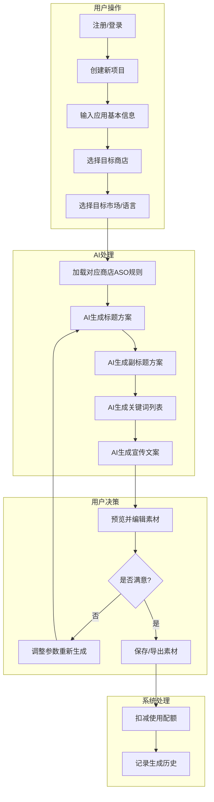
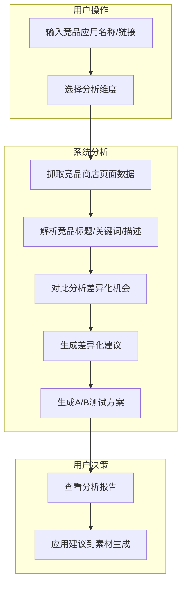
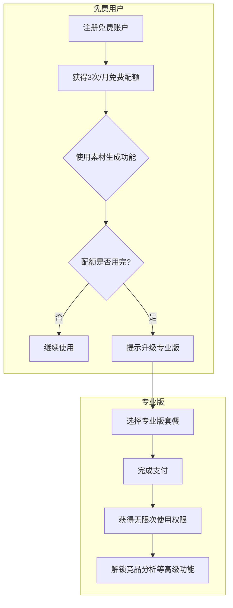
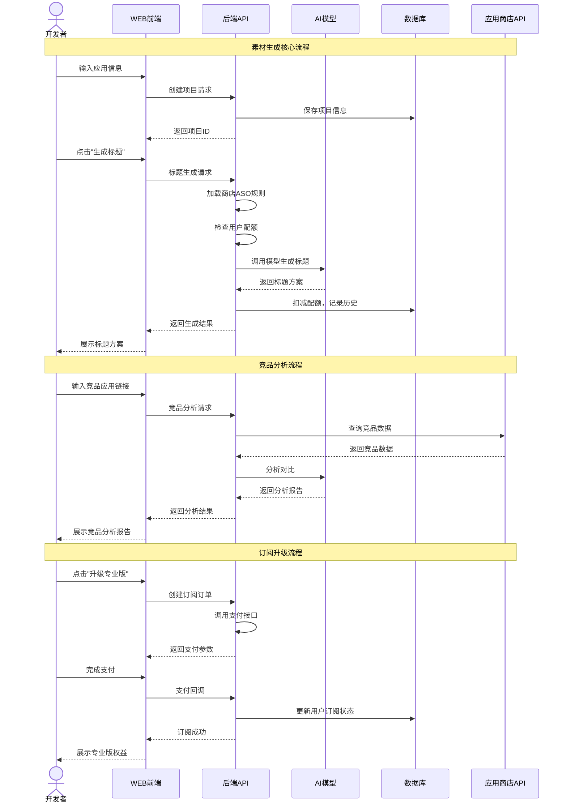
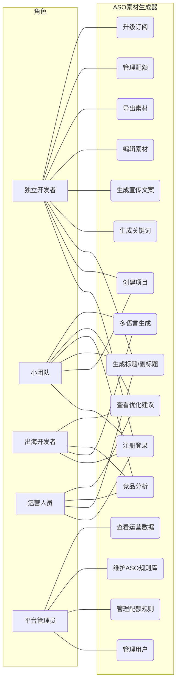
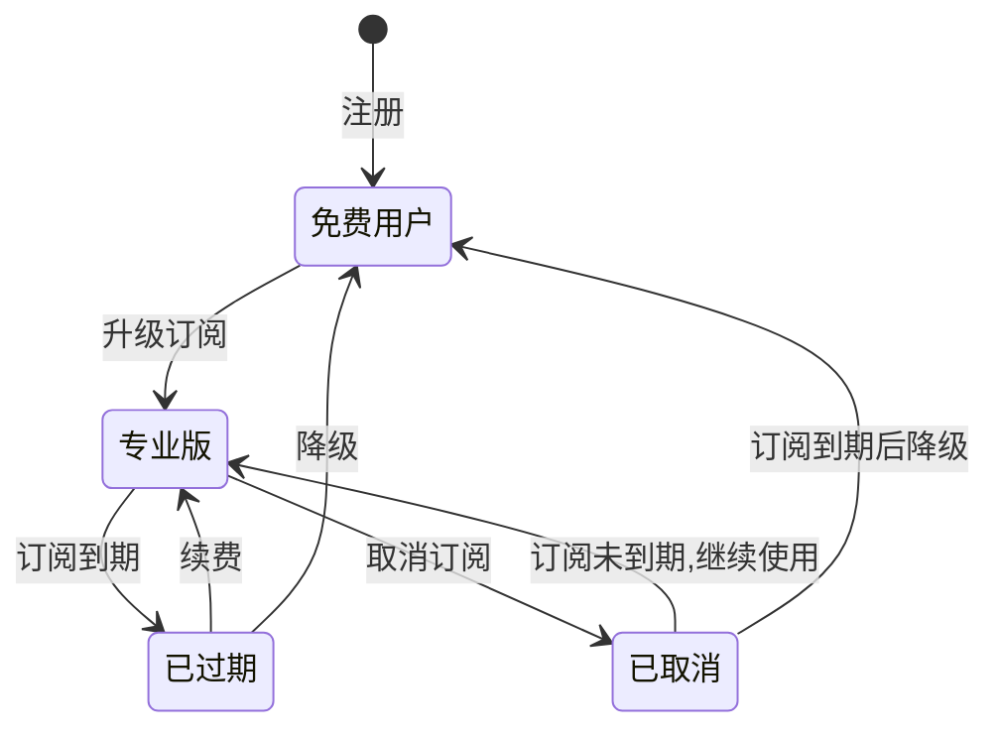
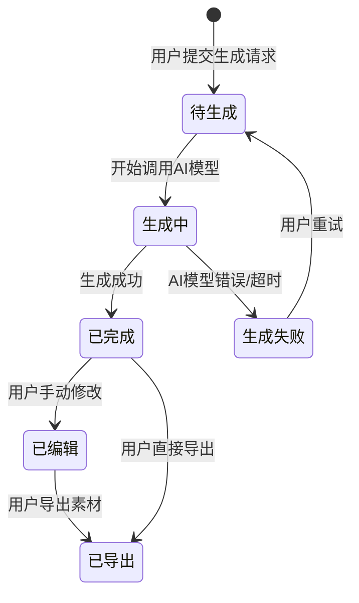
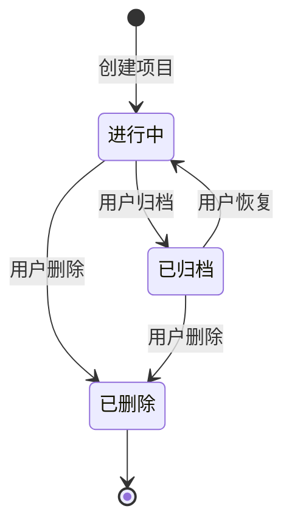

# AI应用商店ASO素材生成器 - 用户需求说明书

# 1.需求概述

AI应用商店ASO素材生成器是一款面向应用开发者的智能化工具，利用AI技术帮助开发者快速生成符合各应用商店ASO（App Store Optimization）规则的标题、副标题、关键词、宣传文案等素材，并提供竞品对比分析和差异化优化建议，助力应用提升搜索排名和下载转化率。

## 1.1 需求介绍

AI应用商店ASO素材生成器旨在解决应用开发者在应用商店上架和优化过程中面临的三大痛点：
1. ASO规则复杂多变——不同商店（Apple App Store、Google Play、华为应用市场等）有不同的标题字数限制、关键词规则、描述格式要求，开发者难以逐一掌握
2. 多语言素材制作成本高——出海应用需要针对多个市场准备本地化素材，翻译+本地化成本高昂
3. 缺乏数据化优化依据——竞品用什么关键词、如何差异化定位，开发者缺少系统化的分析工具

### 1.1.1 所属领域

应用营销科技（App MarTech）、ASO优化、AI内容生成

### 1.1.2 核心价值

- 对独立开发者：零ASO经验也能生成专业级商店素材，节省研究规则的时间
- 对小团队：一人完成多市场多语言的素材制作，替代外包翻译+文案工作
- 对出海开发者：内置各市场ASO规则，一键生成本地化素材，降低出海门槛
- 对产品本身：以"应用商店页面素材"垂直场景为核心差异化，构建规则知识库壁垒

## 1.2 需求目标

### 1.2.1 第一期目标（MVP，约7天）

完成核心素材生成功能：

- WEB端用户界面（SaaS工具）
- AI生成标题、副标题、关键词（支持Apple App Store和Google Play）
- AI生成宣传文案（短描述/长描述/特性列表）
- 基础多语言支持（中文、英语、日语、韩语）
- 免费版配额管理（3次/月）
- 基础用户认证

### 1.2.2 第二期目标

增强分析和优化能力：

- 竞品对比分析功能
- 差异化定位建议
- A/B测试方案建议
- 扩展更多应用商店支持（华为、小米、OPPO等国内市场）
- 专业版订阅付费（¥29/月）
- 生成历史记录和管理

### 1.2.3 第三期目标

数据驱动优化：

- 商店排名数据追踪
- 关键词效果分析
- 下载转化漏斗分析
- 团队协作功能
- API开放接口

## 1.3 系统使用角色

1. **独立开发者**: 个人开发应用并上架商店，需要快速生成ASO素材，对ASO规则了解有限
2. **小型开发团队**: 2-10人的团队，产品出海时需要多语言素材，缺乏专职ASO人员
3. **出海应用开发者**: 面向海外市场发布应用，需要针对不同市场定制本地化素材
4. **应用运营人员**: 负责已上架应用的ASO优化，需要持续迭代素材并分析效果
5. **平台运营方**: 管理平台的用户、配额、订阅、AI模型调用等后台运营工作

## 1.4 业务流程图

### 1.4.1 核心素材生成流程

### 1.4.2 竞品分析与优化流程

### 1.4.3 订阅与付费流程

# 2.功能原型

| 原型名称 | 原型链接 | 对应端 | 备注 |
| --- | --- | --- | --- |
| ASO素材生成工具 | 需求方提供 | WEB端 | MVP核心功能 |
| 运营管理后台 | 需求方提供 | WEB端 | 用户与配额管理 |

# 3.需求清单

## 3.1 ASO素材生成工具-WEB端

| 模块 | 一级功能 | 二级功能 | 功能描述 | 优先级 | 备注 |
| --- | --- | --- | --- | --- | --- |
| 用户认证 | 注册登录 | 邮箱注册 | 支持邮箱+密码注册账户 | P0 | |
| | | 第三方登录 | 支持GitHub、Google账号OAuth登录 | P1 | |
| | | 登录状态管理 | Token认证，自动续期，安全退出 | P0 | |
| 项目管理 | 创建项目 | 基本信息录入 | 输入应用名称、类别、核心功能描述、目标用户 | P0 | |
| | | 商店选择 | 选择目标应用商店（Apple App Store/Google Play） | P0 | |
| | | 市场选择 | 选择目标市场和语言（中/英/日/韩） | P0 | |
| | 项目管理 | 项目列表 | 查看已创建的所有项目，支持搜索和筛选 | P0 | |
| | | 项目编辑 | 修改项目基本信息和目标设置 | P0 | |
| | | 项目删除 | 删除不再需要的项目 | P1 | |
| 标题生成 | AI生成标题 | 规则校验 | 按所选商店规则校验标题字数（如Apple 30字符、Google 50字符） | P0 | |
| | | 多方案生成 | 一次生成3-5个标题方案供用户选择 | P0 | |
| | | 关键词融入 | 自动将核心关键词融入标题 | P0 | |
| | 标题编辑 | 手动编辑 | 对AI生成的标题进行手动修改 | P0 | |
| | | 实时字数统计 | 显示当前标题字数和剩余可用字符 | P0 | |
| | | 规则合规提示 | 实时提示是否符合商店规则 | P0 | |
| 副标题生成 | AI生成副标题 | 规则校验 | 按所选商店规则校验副标题字数 | P0 | Apple副标题30字符 |
| | | 补充说明 | 生成对标题的补充说明，突出核心卖点 | P0 | |
| | 副标题编辑 | 手动编辑 | 对AI生成的副标题进行手动修改 | P0 | |
| | | 实时字数统计 | 显示当前副标题字数 | P0 | |
| 关键词生成 | AI生成关键词 | 关键词推荐 | 基于应用描述和类别推荐相关关键词 | P0 | |
| | | 竞争度评估 | 标注关键词的竞争热度（高/中/低） | P1 | |
| | | 字符数管理 | Apple关键词100字符限制管理，支持逗号分隔 | P0 | |
| | 关键词管理 | 关键词添加/删除 | 手动添加或删除关键词 | P0 | |
| | | 关键词排序 | 按重要性排序关键词 | P1 | |
| | | 关键词复制 | 一键复制关键词列表 | P0 | |
| 宣传文案生成 | 短描述生成 | 规则适配 | Google Play短描述80字符限制 | P0 | |
| | | 卖点提炼 | 从应用功能中提炼核心卖点 | P0 | |
| | 长描述生成 | 结构化描述 | 生成包含功能介绍、使用场景、亮点的结构化长描述 | P0 | |
| | | HTML格式支持 | Google Play支持HTML标签（加粗、换行等） | P1 | |
| | | 字数管理 | Apple描述4000字符限制管理 | P0 | |
| | 特性列表生成 | 特性提炼 | 自动生成应用核心特性列表 | P0 | |
| | | 格式化输出 | 按各商店格式要求输出特性列表 | P0 | |
| | 文案编辑 | 手动编辑 | 对所有文案内容进行手动修改 | P0 | |
| | | 多版本管理 | 保存同一文案的多个版本 | P1 | |
| 竞品对比分析 | 竞品录入 | 竞品搜索 | 输入竞品应用名称或App Store链接 | P1 | 第二期 |
| | | 竞品添加 | 添加最多5个竞品进行对比 | P1 | 第二期 |
| | 分析报告 | 关键词对比 | 对比自身与竞品的关键词覆盖情况 | P1 | 第二期 |
| | | 标题策略分析 | 分析竞品标题的命名策略 | P1 | 第二期 |
| | | 描述结构对比 | 对比竞品描述的结构和重点 | P1 | 第二期 |
| | 优化建议 | 差异化建议 | 基于竞品分析给出差异化定位建议 | P1 | 第二期 |
| | | A/B测试建议 | 推荐可用于A/B测试的素材变体方案 | P1 | 第二期 |
| 多语言支持 | 语言切换 | 界面语言 | 切换工具界面语言（中/英） | P0 | |
| | | 生成语言 | 选择素材生成的目标语言 | P0 | |
| | 翻译适配 | 本地化生成 | 直接生成目标语言素材而非翻译 | P0 | |
| | | 文化适配 | 根据目标市场文化习惯调整表达方式 | P1 | |
| 导出与分享 | 素材导出 | 一键复制 | 逐项复制标题/副标题/关键词/文案 | P0 | |
| | | 批量导出 | 导出所有素材为文本文件或CSV | P0 | |
| | | 分享链接 | 生成可分享的素材预览链接 | P2 | |
| 配额管理 | 配额显示 | 剩余配额 | 显示当月剩余免费使用次数 | P0 | |
| | | 配额说明 | 说明免费配额规则和重置时间 | P0 | |
| | 升级提示 | 升级引导 | 配额用尽时引导升级专业版 | P0 | |
| | | 专业版介绍 | 展示专业版权益和价格（¥29/月） | P0 | |
| 个人中心 | 账户信息 | 资料管理 | 修改邮箱、密码等个人信息 | P0 | |
| | | 订阅状态 | 查看当前订阅类型和到期时间 | P0 | |
| | 使用记录 | 生成历史 | 查看历史生成记录，支持重新编辑 | P1 | |
| | | 使用统计 | 查看本月使用次数统计 | P0 | |

## 3.2 运营管理后台-WEB端

| 模块 | 一级功能 | 二级功能 | 功能描述 | 优先级 | 备注 |
| --- | --- | --- | --- | --- | --- |
| 用户管理 | 用户列表 | 用户查询 | 查询所有注册用户，支持按邮箱、注册时间筛选 | P0 | |
| | | 用户详情 | 查看用户详细信息、使用记录、订阅状态 | P0 | |
| | | 用户封禁 | 对违规用户进行封禁处理 | P1 | |
| 配额管理 | 配额规则 | 免费配额设置 | 设置免费用户每月使用次数（默认3次） | P0 | |
| | | 配额重置 | 手动重置用户配额 | P1 | |
| | 配额监控 | 使用统计 | 统计全平台配额使用情况 | P0 | |
| | | 异常监控 | 监控异常高频使用行为 | P1 | |
| 订阅管理 | 订阅计划 | 套餐配置 | 配置专业版价格和权益（¥29/月） | P0 | |
| | | 订单查询 | 查看所有订阅订单和支付记录 | P0 | |
| | | 退款处理 | 处理用户退款请求 | P1 | |
| 内容管理 | ASO规则库 | 规则维护 | 维护各应用商店的ASO规则（字数限制、格式要求等） | P0 | |
| | | 规则更新 | 当商店规则变更时及时更新 | P0 | |
| | AI模型管理 | 模型配置 | 配置AI生成使用的模型参数 | P0 | |
| | | 提示词管理 | 管理各类素材生成的Prompt模板 | P0 | |
| 数据统计 | 运营数据 | 用户增长 | 统计注册用户数、活跃用户数、转化率 | P0 | |
| | | 收入统计 | 统计订阅收入、付费转化率 | P0 | |
| | | 功能使用 | 统计各功能模块的使用频次 | P1 | |
| 系统管理 | 系统配置 | 参数设置 | 配置系统运行参数（AI调用限额、并发数等） | P0 | |
| | | 公告管理 | 发布系统公告和维护通知 | P1 | |

# 4.非功能需求

## 4.1 使用界面需求

| 需求项 | 详细描述 | 备注 |
| --- | --- | --- |
| 设计风格 | 简洁专业的SaaS工具风格，以效率为导向，减少视觉干扰 | P0 |
| 主色调 | 使用蓝色系（#2563EB）作为主色，传达专业、可信赖感 | P0 |
| 响应式设计 | 适配桌面端（1280px+）和平板端（768px+），移动端为辅助查看 | P0 |
| 交互体验 | AI生成过程展示进度，避免用户长时间等待无反馈 | P0 |
| 暗黑模式 | 支持暗黑模式切换，适合长时间使用 | P2 |

## 4.2 软硬件环境需求

| 需求项 | 详细描述 | 备注 |
| --- | --- | --- |
| 客户端环境 | 现代浏览器：Chrome 90+、Firefox 88+、Safari 14+、Edge 90+ | P0 |
| 后端环境 | 云服务部署（阿里云/腾讯云），容器化部署 | P0 |
| AI模型 | 接入主流大语言模型API（如OpenAI GPT、Claude等） | P0 |
| 数据库 | 关系型数据库（MySQL/PostgreSQL）+ 缓存（Redis） | P0 |

## 4.3 性能需求

| 需求项 | 详细描述 | 备注 |
| --- | --- | --- |
| 页面加载 | 首屏加载 < 2秒 | P0 |
| AI生成响应 | 标题/关键词生成 < 5秒，长文案生成 < 10秒 | P0 |
| 并发支持 | 支持100用户同时在线使用 | P0 |
| 系统可用性 | 99.5%可用性（月度） | P0 |
| 数据存储 | 用户数据加密存储，定期备份 | P0 |

## 4.4 约束性需求

| 需求项 | 详细描述 | 备注 |
| --- | --- | --- |
| AI模型调用 | 不自行训练模型，调用第三方大语言模型API | P0 |
| 数据安全 | 用户应用信息不用于模型训练，严格保密 | P0 |
| 内容合规 | AI生成内容需过滤敏感词、违规内容 | P0 |
| 免费配额 | 免费用户每月3次生成机会，不可累积 | P0 |
| 后台服务 | 是，需要后台服务来支撑AI调用、用户管理、配额管理等功能 | P0 |
| 支付渠道 | 支持微信支付、支付宝（国内用户），Stripe（海外用户） | P1 |

# 5.接口需求

## 5.1 硬件接口需求

本产品为纯SaaS Web应用，无特殊硬件接口需求。

## 5.2 软件接口需求

| 模块 | 接口名称 | 输入 | 输出 | 功能描述 |
| --- | --- | --- | --- | --- |
| 用户认证 | 用户注册 | 邮箱、密码 | 注册结果 | 创建新用户账户 |
| | 用户登录 | 邮箱、密码 | Token、用户信息 | 用户身份认证 |
| | OAuth登录 | 第三方Code | Token、用户信息 | GitHub/Google第三方登录 |
| 项目管理 | 创建项目 | 应用信息、商店、市场 | 项目ID | 创建ASO优化项目 |
| | 项目列表 | 用户ID、筛选条件 | 项目列表 | 获取用户的项目列表 |
| | 更新项目 | 项目ID、更新数据 | 更新结果 | 修改项目信息 |
| | 删除项目 | 项目ID | 删除结果 | 删除指定项目 |
| AI生成服务 | 标题生成 | 应用信息、商店规则、语言 | 标题方案列表 | AI生成应用标题 |
| | 副标题生成 | 应用信息、标题、商店规则 | 副标题方案列表 | AI生成应用副标题 |
| | 关键词生成 | 应用信息、类别、语言 | 关键词列表 | AI生成ASO关键词 |
| | 短描述生成 | 应用信息、卖点 | 短描述文案 | AI生成短描述 |
| | 长描述生成 | 应用信息、功能列表 | 长描述文案 | AI生成长描述 |
| | 特性列表生成 | 应用信息 | 特性列表 | AI生成特性列表 |
| 竞品分析 | 竞品搜索 | 应用名称/链接 | 竞品信息 | 搜索竞品应用信息 |
| | 竞品分析 | 自身应用、竞品列表 | 分析报告 | 生成竞品对比分析 |
| | 优化建议 | 分析结果 | 差异化建议 | 生成差异化定位建议 |
| 配额服务 | 配额查询 | 用户ID | 配额信息 | 查询用户剩余配额 |
| | 配额扣减 | 用户ID、使用类型 | 扣减结果 | 使用生成服务时扣减配额 |
| | 配额重置 | 定时任务 | 重置结果 | 每月自动重置免费配额 |
| 支付服务 | 创建订阅 | 用户ID、套餐类型 | 支付参数 | 创建专业版订阅订单 |
| | 支付回调 | 支付结果 | 确认信息 | 处理支付结果通知 |
| | 订阅状态 | 用户ID | 订阅信息 | 查询用户订阅状态 |
| AI模型网关 | 模型调用 | Prompt、参数 | 生成结果 | 调用大语言模型API生成内容 |
| | 模型健康检查 | - | 模型状态 | 监控AI模型服务可用性 |

## 5.4 通讯接口需求

| 模块 | 接口名称 | 输入 | 输出 | 功能描述 |
| --- | --- | --- | --- | --- |
| 邮件服务 | 注册验证邮件 | 邮箱、验证码 | 发送结果 | 发送注册验证邮件 |
| | 密码重置邮件 | 邮箱、重置链接 | 发送结果 | 发送密码重置邮件 |
| | 配额提醒邮件 | 邮箱、配额信息 | 发送结果 | 配额即将用尽时提醒 |
| 第三方登录 | GitHub OAuth | OAuth Code | 用户信息 | GitHub账号授权登录 |
| | Google OAuth | OAuth Code | 用户信息 | Google账号授权登录 |
| 商店数据接口 | App Store查询 | App ID/Bundle ID | 应用信息 | 查询Apple App Store应用数据 |
| | Google Play查询 | Package Name | 应用信息 | 查询Google Play应用数据 |

# 6. 附录

## 流程图

详见1.4章节业务流程图

## 时序图

## （用户与系统交互）用例图

## （系统）状态图

### 用户订阅状态图

### 素材生成任务状态图

### 项目状态图

---
**文档说明**: 本需求说明书基于"优特云-用户语言"模板规范编写，涵盖需求概述、功能原型、需求清单、非功能需求、接口需求和附录六大部分，可作为后续产品设计和开发的依据。MVP聚焦核心素材生成功能，预计7天完成开发。
