# AI应用商店ASO素材生成器 - 产品需求文档（PRD）

| 版本号 | 变更日期 | 变更内容 | 变更人 | 审核人 |
| --- | --- | --- | --- | --- |
| V1.0 | 2026-06-29 | 基于用户需求说明书创建产品需求文档与配套HTML原型 | 产品文档结对写作专家 | 待评审 |

---

# 1 概述

## 1.1 需求背景

应用开发者在应用上架、改版和出海过程中，需要持续准备符合不同应用商店规则的标题、副标题、关键词、短描述、长描述和特性列表。Apple App Store、Google Play、华为应用市场、小米应用商店等平台对字符数、描述格式、关键词字段、敏感内容和本地化表达均有差异，独立开发者和小团队通常缺少专职ASO人员，导致素材制作依赖手工研究规则、通用AI问答或外包文案，存在效率低、合规性不可控、多语言成本高和缺少竞品依据的问题。

AI应用商店ASO素材生成器定位为面向独立开发者、小型开发团队、出海应用开发者和应用运营人员的垂直SaaS工具。产品通过内置平台ASO规则库、LLM文案生成能力、多语言本地化生成、规则校验和竞品对比建议，帮助用户快速产出可直接用于应用商店页面的素材，并通过免费版与专业版订阅形成轻量商业闭环。

本期MVP以7天交付为约束，优先完成“输入应用信息 → 选择商店与语言 → AI生成ASO素材 → 规则校验 → 编辑保存/导出”的核心闭环；竞品分析、A/B测试建议、国内应用市场扩展和专业版付费能力作为第二期增强能力预留完整产品设计。

## 1.2 名词解释

| 名词 | 说明 |
| --- | --- |
| ASO | App Store Optimization，应用商店优化，通过标题、关键词、描述、截图等素材提升应用在商店内的搜索曝光和下载转化。 |
| 应用商店素材 | 应用上架或优化时填写在商店页面中的文本内容，包括标题、副标题、关键词、短描述、长描述、特性列表等。 |
| 标题 | 应用在商店展示和搜索索引中使用的名称字段，不同商店有不同字符限制。 |
| 副标题 | Apple App Store等平台用于补充应用标题和卖点的字段。 |
| 关键词 | Apple App Store关键词字段或其他平台搜索优化中的目标词集合。 |
| 短描述 | Google Play等平台在列表或首屏展示的简短介绍文案。 |
| 长描述 | 应用详情页中的完整介绍文案，用于说明功能、价值、场景和亮点。 |
| LLM | Large Language Model，大语言模型，用于根据输入信息生成标题、关键词、宣传文案和分析建议。 |
| 模型网关 | 产品内部统一管理大语言模型调用、提示词模板、限流、审计、成本统计和异常降级的服务层。 |
| 本地化生成 | 不以逐字翻译为目标，而是根据目标语言和市场文化习惯直接生成适合当地用户理解的文案。 |
| 竞品分析 | 对同类应用的标题、关键词、描述结构和卖点表达进行对比，形成差异化建议。 |
| A/B测试建议 | 为同一素材提供多个可测试版本，帮助用户验证不同标题、关键词或文案方向的效果。 |
| 免费版配额 | 免费用户每月可使用的生成次数，本产品MVP默认3次/月，不累积至下月。 |
| 专业版 | 付费订阅方案，定价¥29/月，提供更高生成配额、竞品分析、多语言和历史版本等能力。 |

## 1.3 产品介绍

AI应用商店ASO素材生成器是一个浏览器端SaaS产品，由“ASO素材生成工具WEB端”和“运营管理后台WEB端”两个端组成。用户端服务开发者和运营人员，支持创建应用项目、录入应用信息、选择目标商店和语言、生成并编辑标题/副标题/关键词/宣传文案、查看规则校验结果、保存历史版本、导出素材和升级订阅。运营后台服务平台运营方，支持用户管理、配额规则、订阅订单、ASO规则库、AI模型与提示词模板、运营数据等配置和管理。

### 1.3.1 范围说明

| 项 | 内容 |
| --- | --- |
| 包含功能 | 用户注册登录、项目管理、商店与语言选择、标题生成、副标题生成、关键词生成、短描述生成、长描述生成、特性列表生成、素材编辑、规则校验、保存历史、复制/导出、免费配额展示、升级引导、运营后台用户管理、配额管理、ASO规则库维护、AI模型与提示词管理、运营统计。 |
| 第二期包含功能 | 竞品录入与搜索、竞品关键词和标题策略对比、差异化建议、A/B测试建议、华为/小米/OPPO等国内应用商店规则扩展、专业版订阅支付、更多历史版本能力。 |
| 不包含功能 | 应用商店自动提交上架、应用截图/视频素材生成、应用排名实时追踪、下载转化漏斗分析、团队协作、开放API、自动爬取所有商店排名数据、移动端APP。 |
| MVP端范围 | ASO素材生成工具WEB端、运营管理后台WEB端。 |
| 商业模式范围 | 免费版每月3次生成；专业版¥29/月的权益展示和升级引导，完整支付闭环可在第二期接入。 |

---

# 2 产品设计

## 2.1 系统架构图

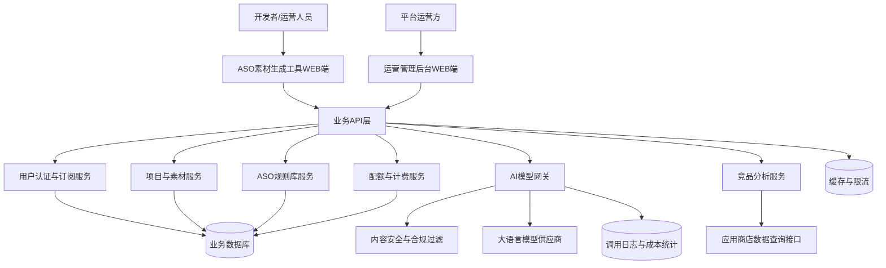

架构设计原则：

1. WEB端仅负责交互、表单校验、结果展示和本地编辑，不直接调用大语言模型。
2. 所有AI生成请求统一经过模型网关，以便进行提示词模板管理、模型路由、内容安全、成本统计、限流和异常降级。
3. ASO规则库独立维护，生成前用于提示词约束，生成后用于规则校验。
4. 用户配额在生成请求前进行预校验，在生成成功后扣减；生成失败或超时不扣减用户配额。
5. 竞品分析服务与应用商店数据查询接口隔离，避免竞品数据异常影响核心素材生成闭环。

## 2.2 业务模块图

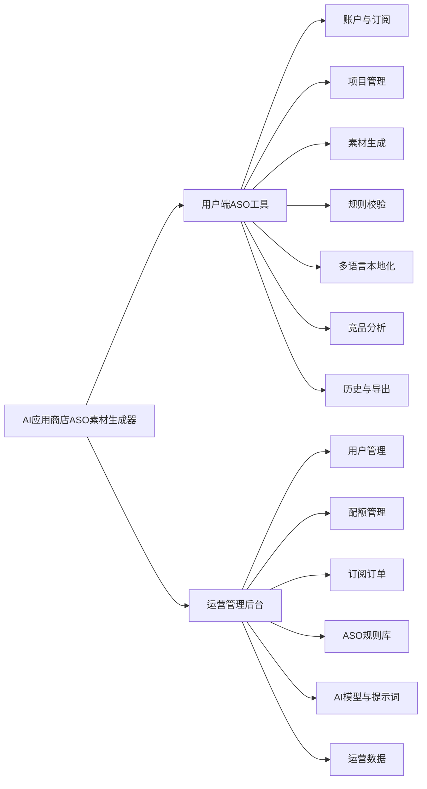

## 2.3 主业务流程

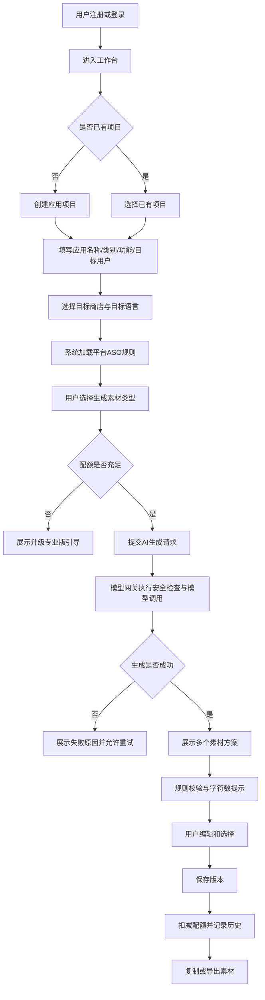

## 2.4 功能图/列表

| 功能模块 | 功能名称 | 优先级 | 功能描述 |
| --- | --- | --- | --- |
| 账户与认证 | 邮箱注册登录 | P0 | 支持邮箱、密码完成注册登录，保障用户生成记录和配额归属。 |
| 账户与认证 | 第三方登录 | P1 | 支持GitHub、Google账号快捷登录。 |
| 项目管理 | 创建应用项目 | P0 | 录入应用名称、类别、核心功能、目标用户、主要卖点和竞品信息。 |
| 项目管理 | 项目列表与编辑 | P0 | 查看、搜索、编辑、归档应用项目。 |
| 规则适配 | 目标商店选择 | P0 | 支持Apple App Store、Google Play，第二期扩展华为、小米、OPPO等。 |
| 规则适配 | 字符限制校验 | P0 | 对标题、副标题、关键词、短描述和长描述进行实时字符统计和合规提示。 |
| 素材生成 | 标题/副标题生成 | P0 | 一次生成3-5个候选方案，融合核心关键词和商店规则。 |
| 素材生成 | 关键词生成 | P0 | 推荐关键词并管理Apple关键词100字符限制。 |
| 素材生成 | 宣传文案生成 | P0 | 生成短描述、长描述和特性列表，适配不同商店格式。 |
| 多语言 | 目标语言生成 | P0 | 支持中文、英语、日语、韩语素材生成。 |
| 多语言 | 文化表达适配 | P1 | 根据目标市场语言习惯调整表达，而非直接翻译。 |
| 结果管理 | 编辑与保存版本 | P0 | 用户可手动编辑AI生成结果，并保存为历史版本。 |
| 结果管理 | 复制与导出 | P0 | 支持逐项复制和批量导出TXT/CSV。 |
| 竞品分析 | 竞品录入与对比 | P1 | 输入竞品名称或商店链接，对比标题、关键词、描述结构。 |
| 竞品分析 | 差异化与A/B建议 | P1 | 根据竞品差异生成定位建议和可测试素材变体。 |
| 配额订阅 | 免费配额 | P0 | 免费用户每月3次生成，展示剩余次数和重置时间。 |
| 配额订阅 | 专业版升级 | P0 | 展示¥29/月专业版权益，引导升级。 |
| 运营后台 | 用户与配额管理 | P0 | 查看用户、订阅状态、使用记录，配置免费配额规则。 |
| 运营后台 | ASO规则库维护 | P0 | 维护各商店字符限制、格式要求和规则说明。 |
| 运营后台 | AI模型与提示词管理 | P0 | 配置生成模型、提示词模板、安全策略、调用超时和成本阈值。 |

## 2.5 你的产品有哪些端

| 序号 | 端名称 | 端类型 | 目标用户 | 说明 |
| --- | --- | --- | --- | --- |
| 1 | ASO素材生成工具WEB端 | WEB端 | 独立开发者、小型开发团队、出海应用开发者、应用运营人员 | 用户在浏览器中创建项目、生成素材、编辑结果、导出文案和查看订阅配额。 |
| 2 | 运营管理后台WEB端 | WEB端 | 平台运营方、管理员 | 管理用户、配额、订阅订单、ASO规则库、AI模型与提示词模板、运营数据。 |

---

# 3 产品功能

## 3.1 ASO素材生成工具WEB端功能

### 3.1.1 用户注册与登录

用户通过邮箱和密码注册账户，登录后进入工作台。系统需要记录用户身份、订阅状态、免费配额、生成历史和项目数据。第三方登录作为增强能力支持GitHub和Google账号。

| 项 | 内容 |
| --- | --- |
| 优先级 | P0（邮箱注册登录、登录状态管理）；P1（第三方登录） |
| 依赖需求 | 用户身份管理、配额管理、生成历史归属 |
| 前置条件 | 用户访问WEB端；邮箱格式有效；密码满足安全规则 |

### 3.1.2 用户注册与登录—详细流程

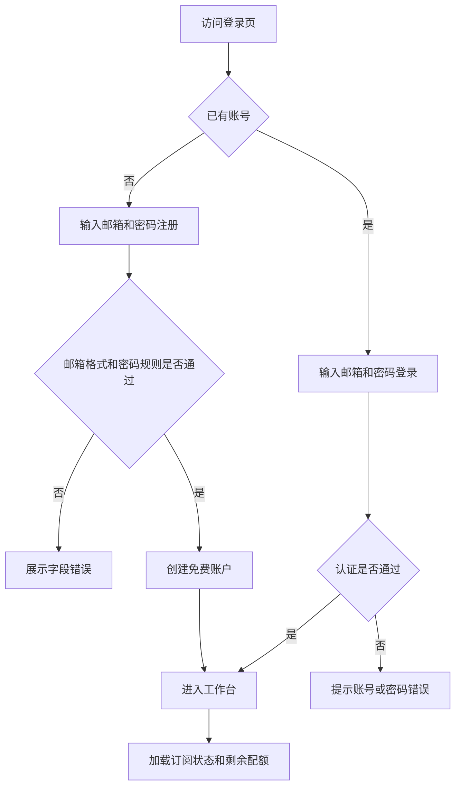

业务规则说明：

1. 新注册用户默认获得免费版身份和每月3次生成配额。
2. 登录会话需要支持自动续期和安全退出。
3. 未登录用户可以查看产品介绍页，但不能发起素材生成。
4. 连续多次登录失败需要触发频率限制和安全提示。

### 3.1.3 项目管理

项目是用户生成ASO素材的基本工作单元。用户创建项目时录入应用名称、应用类别、核心功能、目标用户、主要卖点、已有关键词和可选竞品信息。项目信息作为后续AI生成和竞品分析的主要上下文。

| 项 | 内容 |
| --- | --- |
| 优先级 | P0 |
| 依赖需求 | 用户登录、素材生成、历史版本 |
| 前置条件 | 用户已登录 |

### 3.1.4 项目管理—详细流程

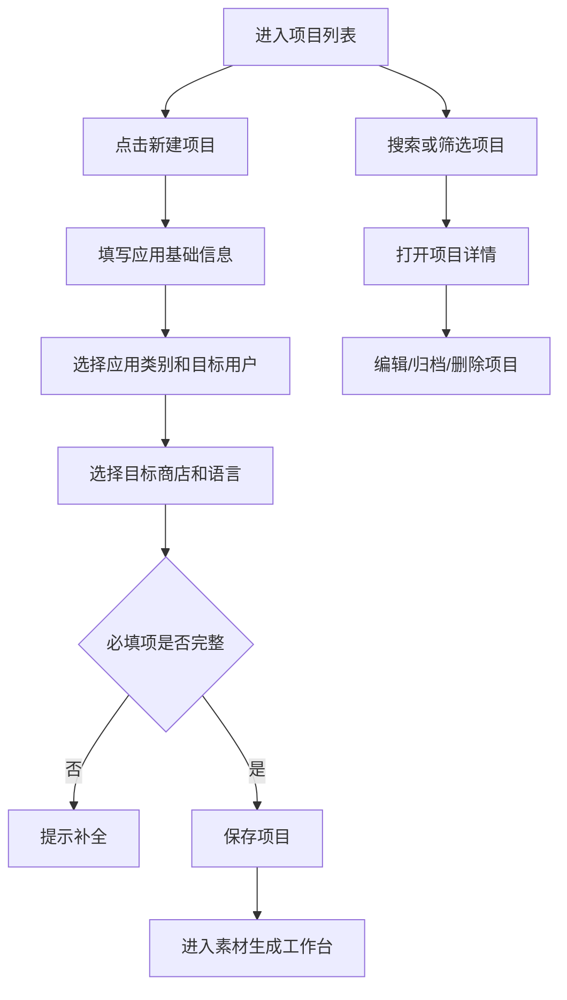

业务规则说明：

1. 应用名称、应用类别、核心功能、目标商店和目标语言为必填项。
2. 同一用户可创建多个项目，项目之间素材历史和配额扣减记录相互独立。
3. 删除项目前需要二次确认；删除后项目不可在普通列表中恢复。
4. MVP可提供“归档”替代物理删除，降低误删风险。

### 3.1.5 ASO素材生成—主要原型

[打开素材生成工作台Widget原型](assets/prototypes/aso-web/素材生成工作台-widget.html)

验收标准说明：

- [ ] 正常流程：用户填写应用信息、选择商店和语言后，点击生成按钮，系统返回标题、副标题、关键词和宣传文案候选结果。
- [ ] 规则校验：结果展示字符数、剩余字符、平台限制和合规状态，不合规内容需要明确标红或提示修改原因。
- [ ] 编辑保存：用户可手动编辑生成结果并保存为一个历史版本。
- [ ] 配额扣减：生成成功后扣减一次配额；生成失败、超时或被内容安全拦截不扣减。
- [ ] 性能要求：标题和关键词生成平均响应不超过5秒，长描述生成平均响应不超过10秒。

### 3.1.6 标题与副标题生成

标题与副标题生成用于帮助用户快速产出符合平台限制且具备搜索价值的应用名称表达。系统需要根据应用名称、功能描述、核心关键词、应用类别、目标商店和目标语言生成3-5个候选方案，并说明每个方案的关键词覆盖和卖点方向。

| 项 | 内容 |
| --- | --- |
| 优先级 | P0 |
| 依赖需求 | 项目信息、ASO规则库、模型网关、配额服务 |
| 前置条件 | 用户已创建项目且配额充足 |

### 3.1.7 标题与副标题生成—详细流程

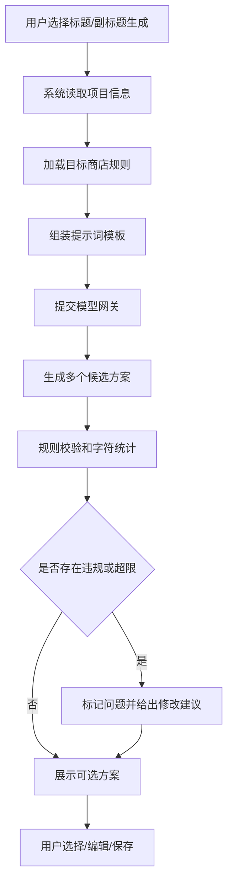

业务规则说明：

1. Apple App Store标题按30字符限制进行校验，副标题按30字符限制进行校验。
2. Google Play标题按平台规则库当前配置限制校验，MVP默认支持标题和短描述约束。
3. 候选方案不得重复输出同一标题，仅大小写差异视为重复。
4. 不允许承诺商店排名、下载量、收益等无法保证的结果。
5. 输出内容需要避免侵权、敏感词、误导性医疗/金融承诺等高风险表达。

验收标准说明：

- [ ] 一次生成至少3个标题候选方案。
- [ ] 每个标题方案显示字符数和合规状态。
- [ ] 副标题能够补充标题未覆盖的核心卖点。
- [ ] 用户可以复制单个标题或保存选中的标题方案。

### 3.1.8 关键词生成与管理

关键词生成用于帮助用户发现与应用功能、目标用户和商店搜索意图相关的词组。系统需要推荐关键词，支持手动添加、删除、排序和一键复制。Apple关键词字段需要以逗号分隔并控制在100字符以内。

| 项 | 内容 |
| --- | --- |
| 优先级 | P0（推荐、添加、删除、复制、字符限制）；P1（竞争度评估、排序建议） |
| 依赖需求 | 项目信息、商店规则、模型网关 |
| 前置条件 | 用户已选择目标商店和语言 |

### 3.1.9 关键词生成与管理—详细流程

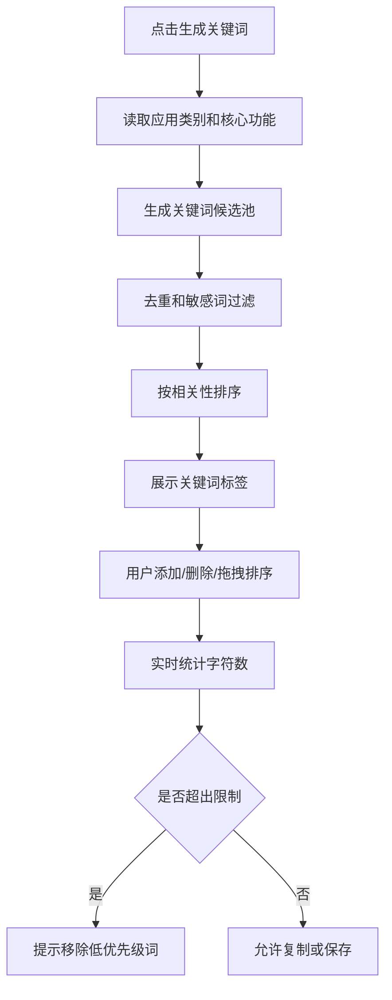

业务规则说明：

1. 关键词推荐优先覆盖应用核心功能、目标用户、使用场景和品类词。
2. 同义词、大小写变化和单复数变化需要尽量合并，避免浪费字符空间。
3. Apple关键词列表使用英文逗号分隔，系统展示已用字符数和剩余字符数。
4. 竞争度评估在MVP可使用高/中/低标签，数据不足时以AI判断和规则说明为准，不展示虚构精确搜索量。

验收标准说明：

- [ ] 系统可生成不少于10个关键词候选。
- [ ] 用户删除关键词后字符统计即时更新。
- [ ] 超过平台限制时复制按钮仍可使用，但需要明确提示“不建议直接提交”。
- [ ] 关键词列表可保存到当前项目历史版本。

### 3.1.10 宣传文案生成

宣传文案生成覆盖短描述、长描述和特性列表。系统需要根据商店规则、目标语言、应用功能、卖点和目标用户生成结构化文案，并支持用户编辑和多版本保存。

| 项 | 内容 |
| --- | --- |
| 优先级 | P0（短描述、长描述、特性列表、编辑）；P1（HTML格式、多版本对比） |
| 依赖需求 | 项目信息、ASO规则库、模型网关、内容安全 |
| 前置条件 | 用户已创建项目并选择目标商店和语言 |

### 3.1.11 宣传文案生成—详细流程

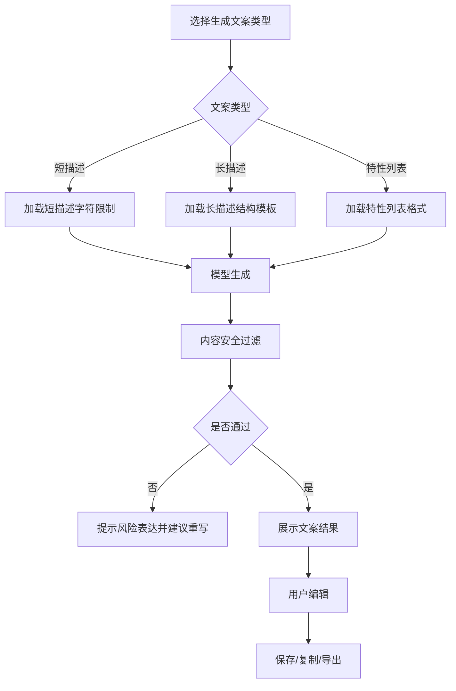

业务规则说明：

1. 短描述强调一句话价值表达，需要控制在目标平台字符限制内。
2. 长描述采用“核心价值—主要功能—适用场景—亮点总结—行动引导”的结构。
3. 特性列表需要保持短句表达，避免使用无法验证的绝对化用语。
4. Google Play长描述可预留HTML格式能力，但MVP默认输出纯文本，避免用户误提交不支持的标签。

验收标准说明：

- [ ] 用户可分别生成短描述、长描述和特性列表。
- [ ] 短描述展示字符数并提示是否符合Google Play短描述限制。
- [ ] 长描述包含清晰段落结构，不输出空泛占位符。
- [ ] 生成内容不包含敏感词、误导性承诺或明显侵权表述。

### 3.1.12 多语言本地化生成

多语言能力支持中文、英语、日语、韩语四种目标语言。产品不提供逐字翻译功能，而是基于应用信息、目标市场和ASO规则直接生成符合当地表达习惯的素材。

| 项 | 内容 |
| --- | --- |
| 优先级 | P0（四种语言生成）；P1（文化表达适配说明） |
| 依赖需求 | 模型网关、提示词模板、语言配置 |
| 前置条件 | 用户选择目标语言 |

业务规则说明：

1. 用户在同一项目下可为不同语言分别保存素材版本。
2. 目标语言切换后，需要提示用户当前结果不会自动覆盖，需要点击生成或另存版本。
3. 系统需要避免把品牌名、专有名词和应用名错误翻译。
4. 对日语、韩语等字符统计方式需要按平台规则库配置执行，不直接等同于英文字母长度。

验收标准说明：

- [ ] 用户可选择中文、英语、日语、韩语任一目标语言生成素材。
- [ ] 不同语言结果可分别保存并在历史记录中区分。
- [ ] 生成结果符合目标语言基本语法和商店页面表达习惯。

### 3.1.13 竞品对比分析

竞品对比分析帮助用户理解同类应用的标题策略、关键词覆盖、描述结构和差异化机会。用户可以输入竞品应用名称、App Store链接或Google Play链接，系统最多支持添加5个竞品进行对比，并生成差异化建议和A/B测试方向。

| 项 | 内容 |
| --- | --- |
| 优先级 | P1 |
| 依赖需求 | 竞品数据查询接口、模型网关、项目信息 |
| 前置条件 | 用户已有项目；专业版或试用权益可用 |

### 3.1.14 竞品对比分析—详细流程

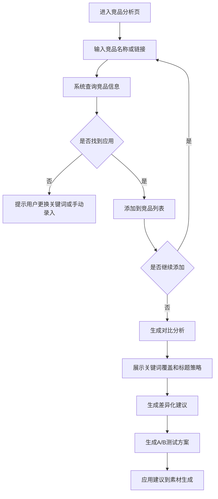

业务规则说明：

1. 每个项目最多添加5个竞品，超过上限需要提示用户删除后再添加。
2. 竞品数据仅用于生成分析建议，不在用户间共享具体项目策略。
3. 当第三方商店数据不可用时，允许用户手动录入竞品标题、关键词和描述。
4. 竞品建议不得贬低竞品或生成侵权性表达，应聚焦自身定位和差异化。

### 3.1.15 竞品对比分析—主要原型

[打开竞品对比分析Widget原型](assets/prototypes/aso-web/竞品对比分析-widget.html)

验收标准说明：

- [ ] 用户可添加、查看和移除竞品。
- [ ] 系统展示关键词覆盖、标题策略、描述结构和差异化机会。
- [ ] 系统输出至少2个可执行A/B测试方向。
- [ ] 当竞品查询失败时，用户可选择手动录入竞品素材。

### 3.1.16 历史记录与导出

用户生成的素材需要形成历史记录，便于后续查看、恢复、复制和导出。历史记录应包含生成时间、项目、目标商店、目标语言、素材类型、生成版本和用户编辑后的最终内容。

| 项 | 内容 |
| --- | --- |
| 优先级 | P0（保存、复制、批量导出）；P1（恢复编辑、多版本比较） |
| 依赖需求 | 项目管理、素材生成、用户账户 |
| 前置条件 | 用户已生成并保存素材 |

业务规则说明：

1. 用户点击保存版本后，系统记录AI原始结果和用户最终编辑结果。
2. 导出格式MVP支持TXT和CSV，字段包括素材类型、内容、字符数、语言、商店、生成时间。
3. 用户复制单项内容不需要保存版本；批量导出前建议提示保存当前结果。
4. 免费用户和专业版用户均可查看自己的历史记录，专业版可保留更长历史周期。

验收标准说明：

- [ ] 用户可查看当前项目的生成历史。
- [ ] 用户可一键复制任一素材内容。
- [ ] 用户可导出当前项目全部素材为CSV文件。
- [ ] 历史记录只展示当前登录用户有权限访问的数据。

### 3.1.17 配额与订阅升级

系统通过免费版和专业版建立轻量商业模式。免费版默认每月3次生成机会，不累积至下月；专业版定价¥29/月，提供更高生成配额、竞品分析、多语言本地化、历史版本等权益。

| 项 | 内容 |
| --- | --- |
| 优先级 | P0（配额展示、超限提示、升级引导）；P1（支付闭环） |
| 依赖需求 | 用户账户、配额服务、订阅服务 |
| 前置条件 | 用户已登录 |

业务规则说明：

1. 配额在工作台、生成按钮附近和个人中心均需要明确展示。
2. 用户剩余配额为0时，生成按钮变为“升级专业版”或展示升级弹窗。
3. 免费配额每月重置，不可累积。
4. 生成失败、内容安全拦截、模型超时不扣减配额。
5. 专业版权益需要以清晰对比表展示，避免夸大“无限”使用；可使用“高配额/公平使用”表述。

验收标准说明：

- [ ] 免费用户可看到剩余配额和下次重置时间。
- [ ] 配额不足时不能继续发起生成请求。
- [ ] 升级页面明确展示¥29/月价格和专业版权益。

## 3.2 运营管理后台WEB端功能

### 3.2.1 用户管理

运营人员可查看平台用户列表、用户详情、订阅状态、配额使用、生成记录和异常使用状态。对明显违规或异常高频用户，可进行限制或封禁处理。

| 项 | 内容 |
| --- | --- |
| 优先级 | P0（查询、详情）；P1（封禁、异常处理） |
| 依赖需求 | 用户账户、生成日志、订阅服务 |
| 前置条件 | 管理员已登录运营后台 |

### 3.2.2 用户管理—详细流程

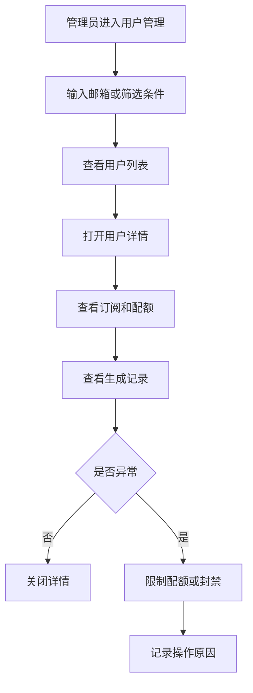

业务规则说明：

1. 后台操作需要记录操作者、时间、对象和原因。
2. 管理员不能查看用户敏感认证凭据或原始密码。
3. 用户应用信息和生成内容属于用户数据，后台仅在排障和合规处理时按权限查看。

### 3.2.3 配额管理

运营人员可配置免费用户每月生成次数、专业版公平使用阈值、配额重置周期和异常高频策略。系统需要统计全平台配额消耗情况。

| 项 | 内容 |
| --- | --- |
| 优先级 | P0 |
| 依赖需求 | 配额服务、订阅服务、生成日志 |
| 前置条件 | 管理员已登录 |

业务规则说明：

1. 免费用户默认每月3次生成，该值可在后台调整但调整后仅影响下一周期或新用户，避免当前用户体验突然变化。
2. 管理员手动重置用户配额需要填写原因。
3. 配额统计应区分成功生成、失败请求、内容安全拦截和超时。

验收标准说明：

- [ ] 管理员可查看免费配额规则。
- [ ] 管理员可查看平台每日生成次数和失败率。
- [ ] 修改配额规则后，新规则可在用户端展示。

### 3.2.4 ASO规则库维护

ASO规则库维护不同应用商店的标题、副标题、关键词、短描述、长描述、格式和敏感规则。该规则库同时用于AI生成前约束和生成后校验。

| 项 | 内容 |
| --- | --- |
| 优先级 | P0 |
| 依赖需求 | 素材生成、规则校验、提示词模板 |
| 前置条件 | 管理员已登录 |

业务规则说明：

1. 每条规则需要记录平台、字段、限制类型、限制值、说明、版本和生效状态。
2. 规则更新后，应对新生成请求立即生效，历史版本不自动重写。
3. 当规则值不确定时，不允许填写虚构精确值，应标记为待确认并在用户端隐藏该规则校验。

验收标准说明：

- [ ] 管理员可新增、编辑、停用商店规则。
- [ ] 用户端校验结果与后台规则保持一致。
- [ ] 规则变更记录可追踪。

### 3.2.5 AI模型与提示词管理

运营人员可配置不同素材类型的提示词模板、默认模型、调用超时、重试策略、内容安全策略、成本阈值和模型降级策略。该功能不暴露具体实现细节给普通用户，但需要保障生成质量、成本可控和安全合规。

| 项 | 内容 |
| --- | --- |
| 优先级 | P0 |
| 依赖需求 | 模型网关、内容安全、成本统计、生成服务 |
| 前置条件 | 管理员已登录 |

业务规则说明：

1. 模型选择分为“高质量模型”和“经济模型”两类产品配置，免费版默认使用经济模型，专业版优先使用高质量模型。
2. 高质量模型用于长描述、本地化、竞品分析和差异化建议等复杂任务；经济模型用于短标题、关键词候选、格式转换等轻量任务。
3. 所有模型调用必须经过内容安全检查，输入和输出均需过滤敏感、违法、侵权、误导性承诺和恶意内容。
4. 模型调用需要设置超时阈值：标题/关键词目标5秒内，长描述目标10秒内；超时后给出可重试提示，不扣减配额。
5. 模型网关需要记录调用类型、耗时、成功失败、输入输出字符量、费用估算和用户维度统计，用于成本监控，不记录明文敏感凭据。
6. 对重复项目上下文、固定规则库和稳定提示词可使用缓存策略降低成本和延迟；缓存不得跨用户泄露项目内容。
7. 系统需要按用户、IP、账号状态和订阅等级进行限流，防止滥用和成本失控。
8. 用户提交的应用信息、竞品策略和生成内容不得用于模型训练；如第三方模型供应商提供数据保留配置，应选择符合隐私承诺的配置。
9. 模型网关应支持供应商异常时的降级策略：可切换备用模型、提示稍后重试或返回已保存历史版本，不生成低质量误导内容。
10. 所有模型能力描述在用户端需要使用“辅助生成”“建议”“候选方案”等表述，不承诺提升排名或下载量。

验收标准说明：

- [ ] 管理员可按素材类型维护提示词模板。
- [ ] 管理员可查看模型调用成功率、平均耗时和费用估算。
- [ ] 内容安全拦截时，用户端展示明确但不暴露风险规则细节的提示。
- [ ] 模型服务失败不扣减用户生成配额。

### 3.2.6 订阅订单管理

运营人员可查看专业版订阅订单、支付渠道、订阅状态、退款状态和用户权益生效情况。MVP先完成订单展示和权益配置设计，支付渠道在第二期接入。

| 项 | 内容 |
| --- | --- |
| 优先级 | P1 |
| 依赖需求 | 用户账户、订阅服务、支付接口 |
| 前置条件 | 管理员已登录 |

业务规则说明：

1. 支付渠道支持微信支付、支付宝和Stripe，按用户所在地区展示可用渠道。
2. 订单状态包括待支付、已支付、已取消、退款中、已退款、支付失败。
3. 订阅到期后自动降级为免费版，保留历史数据但限制继续生成。

验收标准说明：

- [ ] 管理员可按邮箱、订单号、状态筛选订单。
- [ ] 管理员可查看订单对应的订阅权益生效状态。
- [ ] 退款中订单不应立即删除用户历史记录。

### 3.2.7 运营数据统计

运营数据用于评估产品增长、功能使用、付费转化和模型成本。后台需要展示注册用户、活跃用户、生成次数、素材类型分布、付费转化率、收入和AI调用成功率。

| 项 | 内容 |
| --- | --- |
| 优先级 | P0（核心指标）；P1（细分漏斗） |
| 依赖需求 | 用户日志、生成日志、订阅订单、模型调用日志 |
| 前置条件 | 管理员已登录 |

验收标准说明：

- [ ] 后台首页展示注册用户、付费转化、本月收入、AI调用成功率。
- [ ] 支持按日查看素材生成类型分布。
- [ ] 支持查看免费用户配额耗尽后的升级点击率。

---

# 4 产品原型

## 4.1 页面跳转逻辑图

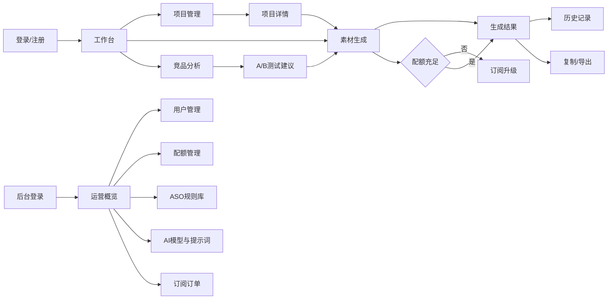

## 4.2 全站点原型设计

### 4.2.1 ASO素材生成工具WEB端

**页面清单：**

| 序号 | 页面名称 | 所属模块 | 页面描述 | 关键元素 |
| --- | --- | --- | --- | --- |
| 1 | 工作台 | 首页概览 | 展示产品核心价值、配额、本月项目和最近项目 | 开始生成按钮、竞品分析入口、统计卡片、最近项目表格 |
| 2 | 项目管理 | 项目管理 | 管理应用项目列表 | 项目表格、搜索筛选、编辑按钮、归档入口 |
| 3 | 素材生成 | 核心生成 | 输入应用信息并生成ASO素材 | 应用信息表单、商店选择、语言选择、生成按钮、结果卡片、规则校验 |
| 4 | 竞品分析 | 高级分析 | 查看竞品策略和差异化建议 | 竞品表格、关键词覆盖、差异化建议、A/B测试按钮 |
| 5 | 生成历史 | 历史版本 | 查看和恢复历史生成结果 | 时间、项目、素材类型、语言、恢复按钮 |
| 6 | 订阅与配额 | 商业化 | 展示免费版和专业版权益 | 价格卡片、权益说明、升级按钮 |

**交互说明：**

- 页面跳转关系：

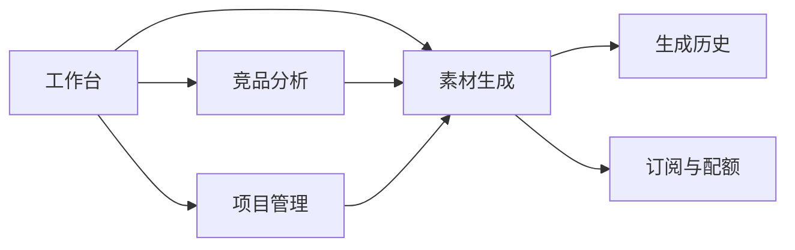

- 特殊交互：
  1. 左侧导航点击后切换主内容区，不刷新页面。
  2. 素材生成页点击“生成素材”后展示结果与规则校验区域。
  3. 配额不足时从生成页引导至订阅与配额页。
  4. 结果卡片支持复制、保存版本和导出。
  5. 空数据状态显示“创建第一个项目”引导。
  6. 生成中状态显示进度提示，避免用户误以为系统卡死。

**产品原型：**

[打开ASO素材生成工具WEB端全站点原型](assets/prototypes/aso-web-prototype.html)

### 4.2.2 运营管理后台WEB端

**页面清单：**

| 序号 | 页面名称 | 所属模块 | 页面描述 | 关键元素 |
| --- | --- | --- | --- | --- |
| 1 | 运营概览 | 数据统计 | 查看平台核心运营指标 | 注册用户、付费转化、本月收入、AI调用成功率、功能使用趋势 |
| 2 | 用户管理 | 用户管理 | 查询用户、查看订阅和配额状态 | 用户表格、方案、使用次数、状态、详情按钮 |
| 3 | 配额管理 | 配额规则 | 配置免费配额和专业版公平使用阈值 | 免费次数输入、重置周期、超限策略、保存按钮 |
| 4 | ASO规则库 | 内容规则 | 维护应用商店字段限制 | 平台、标题限制、关键词限制、描述限制、更新时间 |
| 5 | AI模型与提示词 | AI运营 | 管理模型、提示词、安全和成本策略 | 默认模型、超时配置、Prompt模板、发布按钮 |
| 6 | 订阅订单 | 商业管理 | 查看支付和退款订单 | 订单号、用户、金额、渠道、状态 |

**交互说明：**

- 页面跳转关系：

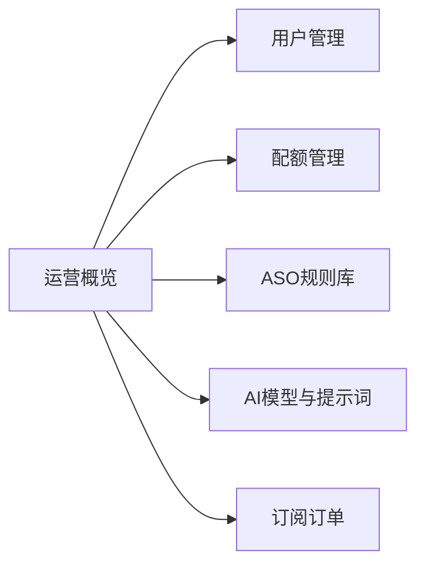

- 特殊交互：
  1. 左侧菜单点击后切换后台页面。
  2. 配额规则保存后，新规则进入待生效或立即生效状态，由后台提示说明。
  3. ASO规则库修改后，用户端生成校验使用最新启用规则。
  4. AI提示词模板发布前需要做基础格式校验，避免空模板影响生成。
  5. 订单退款中状态需要以醒目标签提示，防止误判为已退款。

**产品原型：**

[打开运营管理后台WEB端全站点原型](assets/prototypes/admin-web-prototype.html)

---

# 5 数据需求（如有）

## 5.1 数据使用规格

| 字段 | 是否必填 | 描述 | 数据类型 |
| --- | --- | --- | --- |
| user_id | 是 | 用户唯一标识 | 字符串 |
| email | 是 | 用户邮箱 | 字符串 |
| subscription_plan | 是 | 当前订阅方案：free/pro | 字符串 |
| monthly_quota_total | 是 | 当月可用生成次数 | 数字 |
| monthly_quota_used | 是 | 当月已成功生成次数 | 数字 |
| project_id | 是 | 应用项目唯一标识 | 字符串 |
| app_name | 是 | 应用名称 | 字符串 |
| app_category | 是 | 应用类别 | 字符串 |
| app_description | 是 | 应用核心功能和卖点描述 | 字符串 |
| target_store | 是 | 目标应用商店 | 字符串 |
| target_language | 是 | 目标生成语言 | 字符串 |
| target_market | 否 | 目标国家或地区 | 字符串 |
| core_keywords | 否 | 用户输入的核心关键词 | 字符串数组 |
| material_type | 是 | 素材类型：title/subtitle/keywords/short_description/long_description/features | 字符串 |
| generated_content | 是 | AI生成内容 | 字符串 |
| edited_content | 否 | 用户编辑后的内容 | 字符串 |
| char_count | 是 | 内容字符数 | 数字 |
| rule_status | 是 | 规则校验状态：passed/warning/failed | 字符串 |
| generation_status | 是 | 生成状态：pending/running/succeeded/failed/blocked | 字符串 |
| model_route | 否 | 模型路由类型：quality/economy/fallback | 字符串 |
| generation_latency_ms | 否 | 生成耗时毫秒数 | 数字 |
| estimated_cost | 否 | 模型调用费用估算 | 数字 |
| competitor_id | 否 | 竞品记录唯一标识 | 字符串 |
| competitor_name | 否 | 竞品应用名称 | 字符串 |
| competitor_store_url | 否 | 竞品应用商店链接 | 字符串 |
| order_id | 否 | 订阅订单号 | 字符串 |
| payment_channel | 否 | 支付渠道 | 字符串 |
| order_status | 否 | 订单状态 | 字符串 |

## 5.2 统计数据

1. 用户增长数据：注册用户数、活跃用户数、免费用户数、专业版用户数，按日和按月统计。（P0）
2. 生成使用数据：生成次数、成功率、失败率、超时率、内容安全拦截率，按素材类型和目标语言统计。（P0）
3. 配额数据：免费配额消耗率、配额耗尽用户数、配额耗尽后的升级点击率。（P0）
4. 商业数据：订阅订单数、支付成功率、退款率、MRR、本月收入、付费转化率。（P1）
5. AI成本数据：模型调用次数、平均耗时、费用估算、单位成功生成成本、不同模型路由占比。（P0）
6. 功能使用数据：项目创建数、导出次数、历史版本保存次数、竞品分析使用次数、A/B测试建议生成次数。（P1）

## 5.3 埋点需求

| 页面 | 事件 | 采集字段 | 说明 |
| --- | --- | --- | --- |
| 登录/注册页 | register_success | user_id, register_method, timestamp | 统计注册转化。 |
| 工作台 | click_create_project | user_id, source, timestamp | 统计项目创建入口使用。 |
| 项目管理 | project_created | user_id, project_id, target_store, target_language | 统计项目创建行为。 |
| 素材生成页 | generation_started | user_id, project_id, material_type, target_store, target_language, plan | 统计生成发起行为。 |
| 素材生成页 | generation_succeeded | user_id, project_id, material_type, latency_ms, model_route, char_count | 统计生成成功和性能。 |
| 素材生成页 | generation_failed | user_id, project_id, material_type, fail_reason, latency_ms | 分析失败原因。 |
| 素材生成页 | rule_warning_shown | project_id, material_type, rule_type, target_store | 统计规则超限或警告。 |
| 素材生成页 | material_copied | user_id, project_id, material_type | 统计复制行为。 |
| 素材生成页 | material_exported | user_id, project_id, export_format | 统计导出行为。 |
| 竞品分析页 | competitor_added | user_id, project_id, source_type | 统计竞品添加。 |
| 竞品分析页 | ab_suggestion_generated | user_id, project_id, competitor_count | 统计A/B建议使用。 |
| 订阅页 | upgrade_clicked | user_id, current_plan, entry_page | 统计升级意向。 |
| 订阅页 | payment_succeeded | user_id, order_id, amount, channel | 统计支付成功。 |
| 后台 | admin_rule_updated | admin_id, store, field, rule_id | 记录规则维护行为。 |
| 后台 | prompt_template_published | admin_id, material_type, template_version | 记录提示词模板发布。 |

---

# 6 非功能需求

## 6.1 性能需求

### 6.1.1 延迟

| 编号 | 项目 | 最大延迟 | 平均延迟 | 优先级 | 备注 |
| --- | --- | --- | --- | --- | --- |
| PER-001 | 工作台首屏加载 | < 3秒 | < 2秒 | P0 | 桌面端宽带网络环境。 |
| PER-002 | 项目列表查询 | < 2秒 | < 1秒 | P0 | 100个项目以内。 |
| PER-003 | 标题/副标题生成 | < 8秒 | < 5秒 | P0 | 不含用户网络异常。 |
| PER-004 | 关键词生成 | < 8秒 | < 5秒 | P0 | 生成不少于10个候选词。 |
| PER-005 | 短描述生成 | < 8秒 | < 5秒 | P0 | 单语言单平台。 |
| PER-006 | 长描述生成 | < 15秒 | < 10秒 | P0 | 结构化长文案。 |
| PER-007 | 竞品分析报告生成 | < 30秒 | < 20秒 | P1 | 3个竞品以内。 |
| PER-008 | 导出CSV | < 3秒 | < 1秒 | P0 | 单项目历史版本。 |

### 6.1.2 吞吐量

| 编号 | 项 | 吞吐量 | 备注 |
| --- | --- | --- | --- |
| THR-001 | 用户登录认证 | 每分钟500次 | MVP规模。 |
| THR-002 | 素材生成请求 | 每分钟100次 | 需按订阅等级限流。 |
| THR-003 | 后台规则查询 | 每分钟1000次 | 可使用缓存。 |
| THR-004 | 历史记录查询 | 每分钟300次 | 用户维度隔离。 |
| THR-005 | 竞品分析请求 | 每分钟30次 | 第二期能力，成本更高。 |

### 6.1.3 容量

| 编号 | 项 | 容量 | 备注 |
| --- | --- | --- | --- |
| CAP-001 | 注册用户数 | 支持100,000用户 | MVP后可扩展。 |
| CAP-002 | 同时在线用户数 | 支持100用户同时在线 | MVP目标。 |
| CAP-003 | 单用户项目数 | 免费版20个，专业版200个 | 可按商业策略调整。 |
| CAP-004 | 单项目历史版本 | 免费版最近30条，专业版最近1000条 | 历史保留策略可后台配置。 |
| CAP-005 | 竞品数量 | 单项目最多5个 | 第二期。 |

## 6.2 安全需求

| 编号 | 项（系统数据 / 处理过程） |
| --- | --- |
| SEC-001 | 用户未登录时，系统必须拒绝创建项目、生成素材、查看历史记录和导出素材。 |
| SEC-002 | 用户只能访问本人创建的项目、素材历史和订阅信息。 |
| SEC-003 | 管理后台必须要求管理员身份认证，并限制普通用户访问后台接口。 |
| SEC-004 | 用户密码必须加密存储，不允许明文存储或在后台展示。 |
| SEC-005 | 用户应用信息、竞品策略和生成内容不得用于模型训练，不得跨用户复用明文内容。 |
| SEC-006 | 模型网关必须对输入和输出进行内容安全检查，拦截违法、侵权、敏感、仇恨、成人、恶意和误导性内容。 |
| SEC-007 | 系统不得向用户展示第三方模型供应商密钥、内部提示词密钥、支付密钥等敏感凭据。 |
| SEC-008 | 后台关键操作必须记录审计日志，包括规则修改、配额重置、封禁用户、提示词发布。 |
| SEC-009 | 导出文件仅包含当前用户有权限访问的数据。 |
| SEC-010 | 需要针对高频生成、异常注册和批量导出进行风控限流。 |

## 6.3 可靠性

| 编号 | 项 | 值 |
| --- | --- | --- |
| REL-001 | 系统月度可用性 | ≥99.5% |
| REL-002 | AI生成服务成功率 | ≥98%（不含内容安全拦截） |
| REL-003 | 配额扣减准确率 | 100%，不得出现失败扣减或重复扣减 |
| REL-004 | 数据备份 | 每日全量备份，每小时增量备份 |
| REL-005 | 故障恢复时间 | 核心生成服务2小时内恢复 |
| REL-006 | 模型服务异常处理 | 支持超时、重试、备用模型或友好失败提示 |

## 6.4 可连续性

| 编号 | 项 |
| --- | --- |
| CON-001 | 系统需要支持7×24小时访问，计划维护需提前在用户端和后台公告。 |
| CON-002 | 当AI模型供应商不可用时，系统需要提示用户稍后重试，并保留用户已填写表单内容。 |
| CON-003 | 当竞品数据接口不可用时，不影响核心素材生成功能。 |
| CON-004 | 当支付渠道不可用时，不影响已订阅用户继续使用有效权益。 |

## 6.5 可恢复性

| 编号 | 项 |
| --- | --- |
| REC-001 | 用户项目、历史版本、订阅状态和配额记录需要定期备份，支持按用户或项目维度恢复。 |
| REC-002 | 生成过程中页面刷新或网络中断时，已填写的表单内容应尽量保留在本地或草稿状态。 |
| REC-003 | 配额扣减与生成记录需要使用一致性机制，生成成功但保存失败时应可补偿恢复。 |
| REC-004 | 后台规则或提示词模板误发布时，应支持回滚到上一版本。 |

## 6.6 兼容性

| 编号 | 要求 | 备注 |
| --- | --- | --- |
| COM-001 | 兼容Chrome 90+、Firefox 88+、Safari 14+、Edge 90+ | P0 |
| COM-002 | 支持桌面端1280px及以上分辨率完整使用 | P0 |
| COM-003 | 支持平板端768px及以上分辨率基础使用 | P0 |
| COM-004 | 手机端支持查看历史和复制内容，复杂生成流程以桌面端为主 | P1 |
| COM-005 | 导出CSV应兼容Excel、Numbers和常见表格工具 | P0 |

## 6.7 易用性

| 编号 | 要求 | 备注 |
| --- | --- | --- |
| USE-001 | 首次用户从创建项目到完成首次素材生成不超过3个主要步骤 | P0 |
| USE-002 | 所有生成结果必须展示字符数和合规状态，减少用户自行查规则成本 | P0 |
| USE-003 | AI生成过程必须有加载状态和预计等待说明 | P0 |
| USE-004 | 生成失败必须展示可理解原因和下一步操作 | P0 |
| USE-005 | 用户可在结果页直接编辑和复制，不需要跳转到其他页面 | P0 |
| USE-006 | 专业版升级提示不得遮挡已生成结果，避免影响免费用户体验 | P1 |
| USE-007 | 后台规则配置需要有字段说明和示例，降低误配置风险 | P0 |

---

# 7 总结

## 7.1 上线计划

| 阶段 | 时间 | 内容 | 负责人 |
| --- | --- | --- | --- |
| MVP开发阶段 | 第1-5天 | 完成用户认证、项目管理、标题/关键词/宣传文案生成、规则校验、配额展示、基础后台规则维护 | 产品/研发 |
| 测试阶段 | 第6天 | 完成功能测试、规则校验测试、模型生成质量抽检、配额扣减一致性测试、浏览器兼容测试 | 产品/测试 |
| 灰度阶段 | 第7天 | 邀请小范围独立开发者试用，验证首次生成流程、字符规则、文案质量和升级引导 | 产品/运营 |
| 第二期迭代 | MVP后2-3周 | 增加竞品分析、A/B测试建议、国内应用市场规则、订阅支付闭环 | 产品/研发/运营 |

## 7.2 后续迭代规划

- V1.1：完善竞品对比分析，支持最多5个竞品，生成差异化建议和A/B测试方案。
- V1.2：接入专业版订阅支付，支持微信支付、支付宝和Stripe，完善订单与退款管理。
- V1.3：扩展华为、小米、OPPO等国内应用市场规则，支持更多字段校验。
- V1.4：增强多语言本地化能力，增加目标市场表达建议和专有名词保护。
- V1.5：增加关键词效果追踪、商店排名数据、下载转化分析和团队协作能力。
- V2.0：开放API能力，为开发团队或ASO服务商提供批量生成和系统集成能力。

## 7.3 参考文档

- [AI应用商店ASO素材生成器-用户需求说明书](AI应用商店ASO素材生成器-用户需求说明书.md)
- [素材生成工作台Widget原型](assets/prototypes/aso-web/素材生成工作台-widget.html)
- [竞品对比分析Widget原型](assets/prototypes/aso-web/竞品对比分析-widget.html)
- [ASO素材生成工具WEB端全站点原型](assets/prototypes/aso-web-prototype.html)
- [运营管理后台WEB端全站点原型](assets/prototypes/admin-web-prototype.html)
