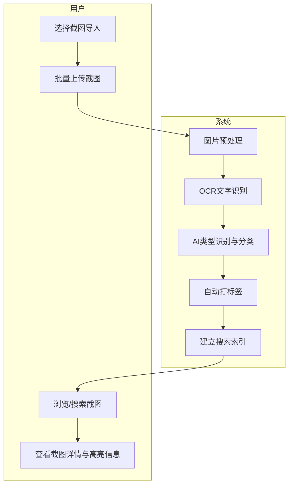
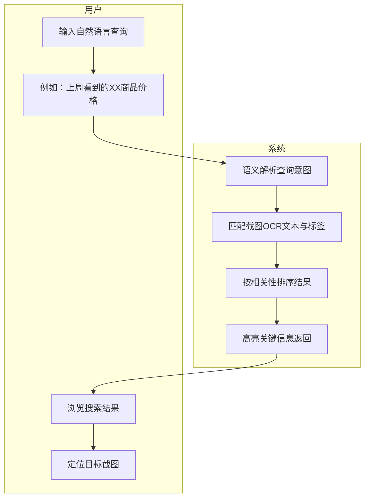
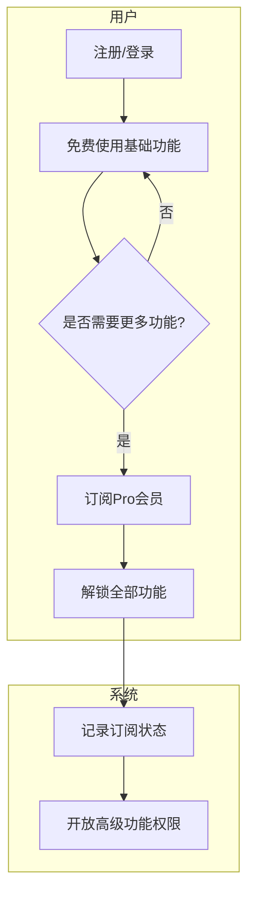
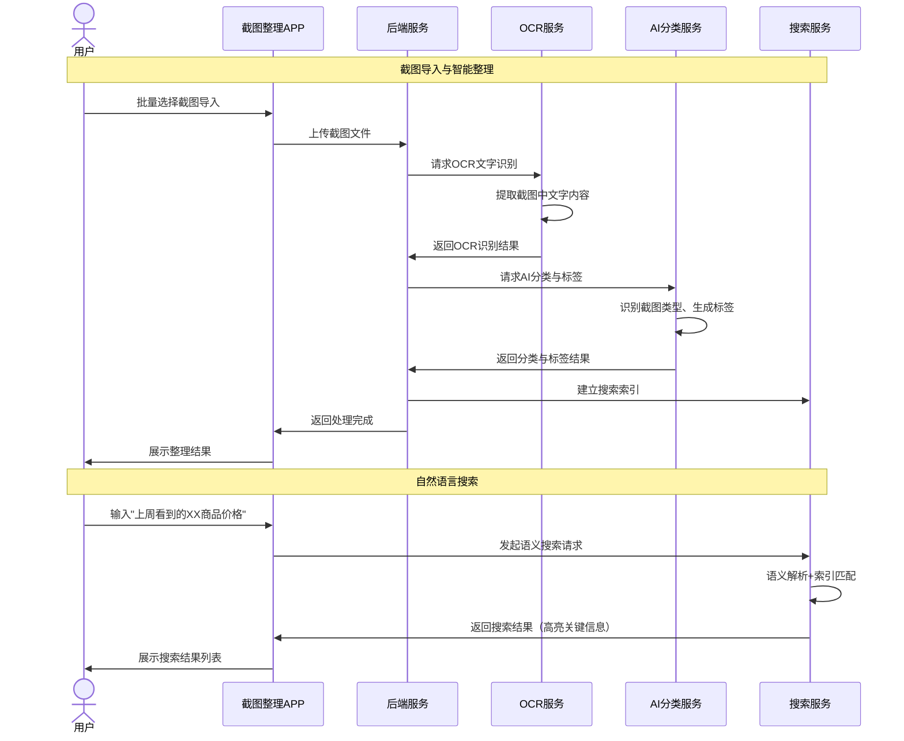
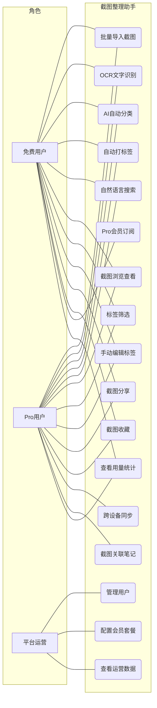
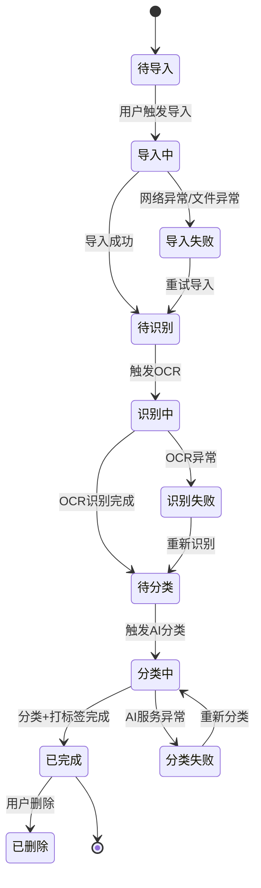
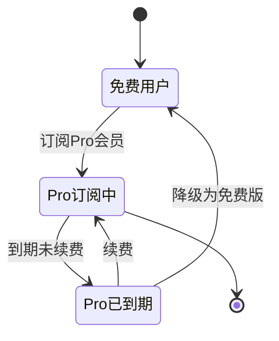

# AI截图知识整理助手 - 用户需求说明书

# 1.需求概述

AI截图知识整理助手是一款面向个人用户的效率工具型移动应用，以截图智能整理为核心，通过OCR文字识别与AI语义分类技术，帮助用户将手机和电脑中大量堆积的截图转化为可检索、可分类、可利用的结构化知识资产。产品定位为系统相册与重型笔记工具之间的轻量桥梁，聚焦"截图OCR识别+AI智能分类+语义搜索"这一高频场景。

## 1.1 需求介绍

现代人日均产生10-50张截图，涵盖聊天记录、商品页、代码片段、文章段落、价格信息、地址导航等多种类型。然而绝大多数截图堆积在相册中无法检索，"截图即遗忘"成为普遍痛点。现有系统相册仅提供基于时间、地点的基础搜索，不具备对截图内容的语义理解与智能分类能力。

AI截图知识整理助手旨在解决以下三大痛点：
1. 截图数量庞大但无法有效检索，关键信息沉没在相册中
2. 截图类型多样但缺乏自动分类，用户需要手动整理耗时耗力
3. 截图中的关键信息（价格、地址、代码等）无法被快速定位和提取

### 1.1.1 所属领域

效率工具、知识管理、AI应用

### 1.1.2 核心价值

- 对个人用户：将无序截图转化为可按语义检索的知识库，告别"截图即遗忘"
- 对知识工作者：快速回溯截图中关键信息（价格、地址、代码、聊天要点），提升信息回收效率
- 对学习型用户：截图自动归类成知识卡片，辅助学习复盘与积累

## 1.2 需求目标

### 1.2.1 第一期目标（MVP）

完成核心截图整理功能：

- 移动端APP（iOS + Android）
- 截图批量导入与OCR识别
- AI自动分类与标签
- 自然语言搜索
- 截图查看器

### 1.2.2 第二期目标

增强用户体验与商业化：

- 跨设备同步（手机+电脑）
- 截图关联笔记功能
- 高级AI分类模型
- 会员订阅体系

## 1.3 系统使用角色

1. **普通用户（免费版）**: 使用截图整理功能的个人用户，每月可整理200张截图，使用基础分类功能
2. **Pro用户（付费版）**: 订阅Pro会员的用户，不限截图数量，享受高级AI分类、跨设备同步、截图关联笔记等增值功能
3. **平台运营方**: 负责平台内容审核、用户管理、会员运营管理

## 1.4 业务流程图

### 1.4.1 截图导入与智能整理核心流程

### 1.4.2 自然语言搜索流程

### 1.4.3 用户订阅与会员管理流程

# 2.功能原型

| 原型名称 | 原型链接 | 对应端 | 备注 |
| --- | --- | --- | --- |
| 截图整理主界面 | 需求方提供 | APP端 | MVP |
| 截图导入与分类界面 | 需求方提供 | APP端 | MVP |
| 搜索结果与详情界面 | 需求方提供 | APP端 | MVP |
| 个人中心与会员管理界面 | 需求方提供 | APP端 | MVP |
| 运营管理后台 | 需求方提供 | WEB端 | MVP |

# 3.需求清单

## 3.1 截图整理助手-APP端

| 模块 | 一级功能 | 二级功能 | 功能描述 | 优先级 | 备注 |
| --- | --- | --- | --- | --- | --- |
| 截图导入 | 批量导入 | 相册选择导入 | 从手机相册中批量选择截图进行导入 | P0 | |
| | | 拍照导入 | 直接拍摄屏幕/纸质文档等方式导入截图 | P1 | |
| | | 分享导入 | 通过系统分享菜单从其他App直接导入截图 | P1 | |
| | 导入管理 | 导入进度展示 | 展示批量导入的进度条和预估剩余时间 | P0 | |
| | | 导入失败重试 | 对导入失败的截图支持一键重试 | P0 | |
| | | 重复截图检测 | 自动检测并提示已存在的重复截图 | P1 | |
| OCR识别 | 文字识别 | 截图文本提取 | 对导入截图进行OCR识别，提取图中所有文字内容 | P0 | |
| | | 多场景识别 | 支持识别聊天记录、网页、商品页、代码、发票、地址等多种截图场景 | P0 | |
| | | 识别结果校对 | 用户可手动校对和修正OCR识别结果 | P1 | |
| | 识别管理 | 识别状态追踪 | 展示每张截图的OCR识别状态（待识别/识别中/已完成/失败） | P0 | |
| | | 批量重新识别 | 对识别失败的截图支持批量重新识别 | P1 | |
| AI分类 | 自动分类 | 截图类型识别 | AI自动识别截图类型（聊天截图/商品页/代码/文章/地址/价格/票据等） | P0 | |
| | | 主题自动归类 | 按主题（如"购物"、"工作"、"学习"、"生活"等）自动归类截图 | P0 | |
| | 标签管理 | 自动打标签 | AI根据截图内容自动生成标签（如"Python代码"、"外卖价格"等） | P0 | |
| | | 手动编辑标签 | 用户可手动添加、修改、删除截图标签 | P0 | |
| | | 标签筛选浏览 | 通过标签筛选和浏览同类截图 | P0 | |
| 搜索 | 自然语言搜索 | 语义搜索 | 支持自然语言描述进行搜索（如"上周看到的XX商品价格"） | P0 | |
| | | 关键词搜索 | 支持按OCR文本关键词进行搜索 | P0 | |
| | | 时间范围搜索 | 支持按截图时间范围筛选搜索结果 | P0 | |
| | 搜索结果 | 结果高亮展示 | 在搜索结果中高亮匹配的关键信息 | P0 | |
| | | 按相关性排序 | 搜索结果按相关性智能排序 | P0 | |
| | | 搜索历史 | 记录和展示用户的搜索历史，支持快速重复搜索 | P1 | |
| 截图浏览 | 截图列表 | 分类浏览 | 按AI分类的主题/类型浏览截图列表 | P0 | |
| | | 时间线浏览 | 按时间线展示所有截图 | P0 | |
| | | 收藏管理 | 支持收藏重要截图，快速访问 | P1 | |
| 截图详情 | 信息展示 | 原图查看 | 支持原图高清查看、缩放、滑动浏览 | P0 | |
| | | OCR文本展示 | 展示截图的OCR识别文本，高亮关键信息 | P0 | |
| | | 分类标签展示 | 展示AI分类结果和自动标签 | P0 | |
| | 截图操作 | 截图分享 | 支持将截图或识别文本分享到其他应用 | P1 | |
| | | 截图删除 | 支持删除不需要的截图（仅删除应用内记录） | P0 | |
| | | 截图复制 | 支持复制OCR识别的文本内容 | P1 | |
| 个人中心 | 账户管理 | 注册/登录 | 支持手机号、微信等方式注册登录 | P0 | |
| | | 个人信息管理 | 管理用户基本信息和头像 | P1 | |
| | 会员管理 | 用量统计 | 展示本月已使用截图整理数量和剩余额度 | P0 | |
| | | Pro会员订阅 | 支持订阅Pro会员，解锁全部功能 | P0 | |
| | | 订阅状态管理 | 查看订阅状态、到期时间、续费管理 | P0 | |
| | 数据统计 | 整理数据概览 | 展示累计整理截图数、分类分布、常用标签等统计 | P1 | |

## 3.2 运营管理后台-WEB端

| 模块 | 一级功能 | 二级功能 | 功能描述 | 优先级 | 备注 |
| --- | --- | --- | --- | --- | --- |
| 用户管理 | 用户列表 | 用户查询 | 查询和查看所有注册用户信息 | P0 | |
| | | 用户详情 | 查看用户使用情况、订阅状态、截图整理量 | P0 | |
| | 用户运营 | 用户状态管理 | 管理用户账号状态（正常/禁用） | P0 | |
| 会员管理 | 订阅管理 | 订阅记录查询 | 查看Pro会员订阅记录和续费历史 | P0 | |
| | | 套餐配置 | 配置免费版和Pro版的功能权限和额度 | P0 | |
| 数据统计 | 运营数据 | 用户增长统计 | 查看用户注册、活跃、付费等数据趋势 | P0 | |
| | | 截图整理统计 | 查看平台截图整理总量、类型分布、OCR识别率等 | P1 | |
| | | 收入统计 | 查看Pro会员订阅收入数据 | P0 | |
| 系统管理 | OCR服务管理 | 服务状态监控 | 监控OCR识别服务的可用性和识别质量 | P1 | |
| | AI分类管理 | 分类模型配置 | 管理AI分类模型的分类类别和标签规则 | P1 | |

# 4.非功能需求

## 4.1 使用界面需求

| 需求项 | 详细描述 | 备注 |
| --- | --- | --- |
| 设计风格 | 简洁清爽、信息层次分明，突出截图内容本身 | P0 |
| 交互体验 | 批量操作流畅，导入和搜索过程有明确进度反馈 | P0 |
| 响应式设计 | 适配主流手机屏幕尺寸（iOS + Android） | P0 |
| 暗色模式 | 支持系统暗色模式适配 | P2 |
| 空状态设计 | 主要页面设计引导性空状态（如首次导入引导） | P1 |

## 4.2 软硬件环境需求

| 需求项 | 详细描述 | 备注 |
| --- | --- | --- |
| 移动端环境 | 支持iOS 14.0及以上、Android 8.0及以上 | P0 |
| 后端环境 | 云服务部署，需支持OCR服务和AI推理服务 | P0 |
| 网络环境 | 支持4G/5G/WiFi网络环境，弱网下支持断点续传 | P0 |
| 存储空间 | 应用本地缓存可控，支持设置存储上限 | P1 |

## 4.3 性能需求

| 需求项 | 详细描述 | 备注 |
| --- | --- | --- |
| 单张OCR识别 | 单张截图OCR识别响应时间 < 3秒 | P0 |
| 批量导入 | 支持一次导入100张截图，整体处理时间 < 10分钟 | P0 |
| 搜索响应 | 自然语言搜索响应时间 < 2秒 | P0 |
| AI分类 | 单张截图AI分类响应时间 < 2秒 | P0 |
| 图片加载 | 截图列表缩略图加载时间 < 1秒 | P0 |
| 系统容量 | 支持10万注册用户，1万日活用户 | P0 |

## 4.4 约束性需求

| 需求项 | 详细描述 | 备注 |
| --- | --- | --- |
| 数据隐私 | 用户截图数据加密存储，OCR处理后用户可选择仅保留文本索引 | P0 |
| 内容安全 | OCR识别内容需经过内容安全检测，过滤违规内容 | P0 |
| 免费额度 | 免费版每月限制整理200张截图，超额后提示升级Pro | P0 |
| Pro功能边界 | 跨设备同步和截图关联笔记为Pro专属功能，免费版不可用 | P0 |
| 后台服务 | 是，需要后台服务来支撑OCR识别、AI分类、搜索索引等功能 | P0 |
| 不做通用相册 | 产品定位为截图专属整理工具，不做通用相册管理功能 | P0 |

# 5.接口需求

## 5.1 硬件接口需求

| 模块 | 接口名称 | 输入 | 输出 | 功能描述 |
| --- | --- | --- | --- | --- |
| 图片采集 | 摄像头调用 | 拍照指令 | 图片数据 | 支持通过摄像头直接拍摄截图导入 |
| | 相册访问 | 相册读取指令 | 图片列表 | 访问用户设备相册，读取截图文件 |

## 5.2 软件接口需求

| 模块 | 接口名称 | 输入 | 输出 | 功能描述 |
| --- | --- | --- | --- | --- |
| 用户服务 | 用户注册/登录 | 手机号/微信Code | 用户信息、Token | 用户注册和登录认证 |
| | 用户信息查询 | 用户ID | 用户详情 | 获取用户信息和订阅状态 |
| | 会员订阅 | 套餐ID、支付凭证 | 订阅结果 | 处理Pro会员订阅和续费 |
| 截图服务 | 截图上传 | 图片文件 | 截图ID | 上传截图到服务端 |
| | 截图列表 | 分类/标签/分页参数 | 截图列表 | 获取截图列表（支持分类、标签筛选） |
| | 截图详情 | 截图ID | 原图、OCR文本、分类标签 | 获取截图详细信息 |
| | 截图删除 | 截图ID | 删除结果 | 删除指定截图 |
| | 截图收藏 | 截图ID、操作类型 | 操作结果 | 收藏/取消收藏截图 |
| OCR服务 | 文字识别 | 图片数据 | OCR文本结果 | 对截图进行OCR文字识别 |
| | 批量识别 | 图片列表 | 批量识别结果 | 批量对多张截图进行OCR识别 |
| AI分类服务 | 类型识别 | 图片数据+OCR文本 | 截图类型（聊天/商品/代码等） | AI识别截图所属类型 |
| | 自动标签 | 图片数据+OCR文本 | 标签列表 | AI根据内容自动生成标签 |
| | 主题归类 | 截图数据 | 主题分类结果 | AI按主题自动归类截图 |
| 搜索服务 | 自然语言搜索 | 自然语言查询+筛选条件 | 搜索结果列表 | 语义搜索匹配的截图 |
| | 关键词搜索 | 关键词+时间范围 | 搜索结果列表 | 按OCR文本关键词搜索截图 |
| | 搜索历史 | 用户ID | 历史记录列表 | 获取用户搜索历史 |
| 数据统计服务 | 用量统计 | 用户ID、时间范围 | 使用量数据 | 统计用户本月截图整理用量 |
| | 整理数据概览 | 用户ID | 统计数据 | 统计用户累计整理数据和分类分布 |

## 5.4 通讯接口需求

| 模块 | 接口名称 | 输入 | 输出 | 功能描述 |
| --- | --- | --- | --- | --- |
| 消息推送 | 处理完成通知 | 处理结果、用户设备Token | 推送结果 | 截图处理完成后推送通知给用户 |
| | 会员到期提醒 | 订阅到期信息、用户设备Token | 推送结果 | Pro会员到期前推送续费提醒 |
| 第三方服务 | 微信登录接口 | 微信授权Code | 用户OpenID、UnionID | 通过微信OAuth获取用户身份信息 |
| | 支付接口 | 订单信息 | 支付凭证 | 处理Pro会员订阅支付 |

# 6. 附录

## 流程图

详见1.4章节业务流程图。

## 时序图

## （用户与系统交互）用例图

## （系统）状态图

### 截图处理状态图

### 用户订阅状态图

---
**文档说明**: 本文档为AI截图知识整理助手的用户需求说明书（URS），基于"优特云-用户语言"五层架构思想编写，涵盖需求概述、功能原型、需求清单、非功能需求、接口需求及附录六大章节，可作为后续产品设计和开发的依据。
