# AI模拟面试与话术优化助手 - 产品需求文档（PRD）

**文档版本**：V1.0  
**创建日期**：2026-06-29  
**产品名称**：AI模拟面试与话术优化助手  
**文档状态**：初稿

---

## 变更历史

| 版本号 | 变更日期 | 变更内容 | 变更人 | 审核人 |
| --- | --- | --- | --- | --- |
| V1.0 | 2026-06-29 | 初始版本创建 | 产品文档结对写作专家 | - |

---

# 1 概述

## 1.1 需求背景

每年有超过1000万高校毕业生进入求职市场，叠加跳槽、转行人群，面试准备已成为刚需场景。然而，求职者面临三大核心痛点：

1. **面试教练成本高**：请专业面试教练单次费用¥200-500，多数求职者无法承担高频练习
2. **练习缺乏反馈**：自行准备面试缺乏结构化评分和专业反馈，不知道"哪里不好"和"怎么改"
3. **面试场景难模拟**：不同岗位、不同阶段的面试风格差异大，难以获得针对性的模拟练习

AI模拟面试与话术优化助手以"低成本、高频次、专业反馈"为核心价值，通过AI驱动的真实面试模拟、多维度结构化评分、个性化话术优化建议，帮助求职者系统性提升面试表现。

## 1.2 名词解释

| **名词** | **说明** |
| --- | --- |
| JD | Job Description，岗位描述，包含职位名称、公司、职责要求、技能要求等信息 |
| 模拟面试 | AI根据岗位JD模拟真实面试流程，按阶段出题，用户作答后获取评分和反馈 |
| 结构化评分 | 从回答流畅度、逻辑结构、关键信息覆盖、STAR法则运用、专业深度等多维度对回答进行量化评分 |
| STAR法则 | Situation-Task-Action-Result，行为面试中推荐使用的回答结构框架 |
| 参考话术 | AI为每道面试题目生成的高质量参考回答，供用户学习借鉴 |
| 专项练习 | 按岗位类型和面试阶段从题库中选取单题进行针对性练习 |
| 全真模拟 | 完整模拟多阶段面试流程（技术面+产品面+HR面等） |
| 表现趋势 | 基于用户历次练习数据，展示各维度得分的变化趋势 |
| Pro版 | 付费订阅用户，享受不限次数面试、深度评分、参考话术、趋势报告等权益 |
| LLM | 大语言模型（Large Language Model），用于AI面试问答、评分和话术生成 |
| ASR | 自动语音识别（Automatic Speech Recognition），用于语音转文字 |

## 1.3 产品介绍

### 1.3.1 范围说明

| 项 | 内容 |
| --- | --- |
| 包含功能 | 求职者端（小程序/H5）：手机号登录、微信一键登录、个人信息管理、上传JD创建面试、AI解析JD、面试方案生成、全真模拟/单阶段练习模式、文字作答、语音作答（MVP延后）、单题即时评分反馈、面试总结报告（综合评分+分维度评价+逐题回顾+参考话术+改进建议）、专项练习题库浏览与练习、表现趋势图、练习统计、订阅管理（免费版/Pro版）、消息通知；运营管理后台：用户管理、订阅管理、题库管理（题目增删改查+批量导入+上下架）、内容审核（JD解析配置+话术库维护）、数据运营（核心指标看板+用户增长+收入统计+练习数据分析）、AI模型管理（Prompt配置+LLM模型选择+Token监控）、系统管理（权限+配置） |
| 不包含功能 | 求职信息平台（不提供职位发布/搜索）、通用AI对话工具、对接招聘平台API、简历优化功能（V2）、视频面试模拟（V2）、真人面试教练对接（V3） |

**产品核心价值：**

AI模拟面试与话术优化助手是面向求职者的AI驱动面试练习工具，以"让每一次面试练习都有专业反馈"为核心价值，通过AI模拟真实面试流程、多维度结构化评分、个性化话术优化建议，为求职者提供低成本、高频次的面试提升方案。

**目标用户：**
- **核心用户**：正在求职的应届生和职场人（22-35岁为主），需要高频面试练习但无法承担面试教练费用
- **潜在用户**：准备跳槽的在职者，希望针对性提升特定岗位面试表现
- **扩展用户**：需要练习特定面试类型的求职者（技术面/产品面/行为面/HR面）

**使用场景：**
- 场景1：应届毕业生明天有一场产品经理面试，上传JD后进行全真模拟面试，获取AI评分和参考话术
- 场景2：在职开发者准备跳槽大厂，针对目标岗位JD进行技术面模拟练习，重点强化STAR法则表达
- 场景3：求职者想了解自己在面试中的薄弱环节，通过表现趋势图发现逻辑结构得分持续偏低，针对性练习
- 场景4：求职者每天利用碎片时间在专项练习题库中练习1-2道面试题，保持面试状态

---

# 2 产品设计

## 2.1 系统架构图

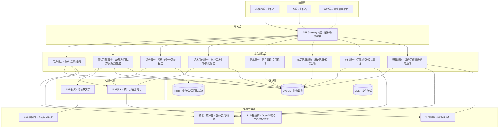

## 2.2 业务模块图

```mermaid
flowchart TD
    ROOT[AI模拟面试与话术优化助手] --> MOD1[用户账户模块]
    ROOT --> MOD2[模拟面试模块]
    ROOT --> MOD3[专项练习模块]
    ROOT --> MOD4[表现趋势模块]
    ROOT --> MOD5[订阅管理模块]
    ROOT --> MOD6[运营管理模块]
    
    MOD1 --> M1A[手机号登录]
    MOD1 --> M1B[微信一键登录]
    MOD1 --> M1C[个人信息管理]
    MOD1 --> M1D[求职意向设置]
    
    MOD2 --> M2A[上传JD创建面试]
    MOD2 --> M2B[AI解析JD]
    MOD2 --> M2C[面试方案生成]
    MOD2 --> M2D[面试模式选择]
    MOD2 --> M2E[逐题问答]
    MOD2 --> M2F[单题即时评分]
    MOD2 --> M2G[面试总结报告]
    
    MOD3 --> M3A[题库浏览]
    MOD3 --> M3B[单题练习]
    MOD3 --> M3C[连续练习模式]
    MOD3 --> M3D[练习记录]
    
    MOD4 --> M4A[各维度得分趋势图]
    MOD4 --> M4B[综合得分趋势]
    MOD4 --> M4C[薄弱项分析]
    MOD4 --> M4D[练习统计]
    
    MOD5 --> M5A[套餐信息展示]
    MOD5 --> M5B[Pro权益介绍]
    MOD5 --> M5C[订阅支付]
    MOD5 --> M5D[自动续费管理]
    
    MOD6 --> M6A[用户管理]
    MOD6 --> M6B[题库管理]
    MOD6 --> M6C[内容审核]
    MOD6 --> M6D[数据运营]
    MOD6 --> M6E[AI模型管理]
    MOD6 --> M6F[系统管理]
```

## 2.3 主业务流程

### 2.3.1 模拟面试核心业务流程

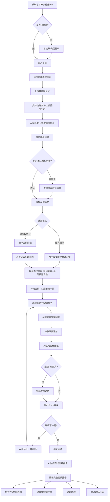

### 2.3.2 专项练习业务流程

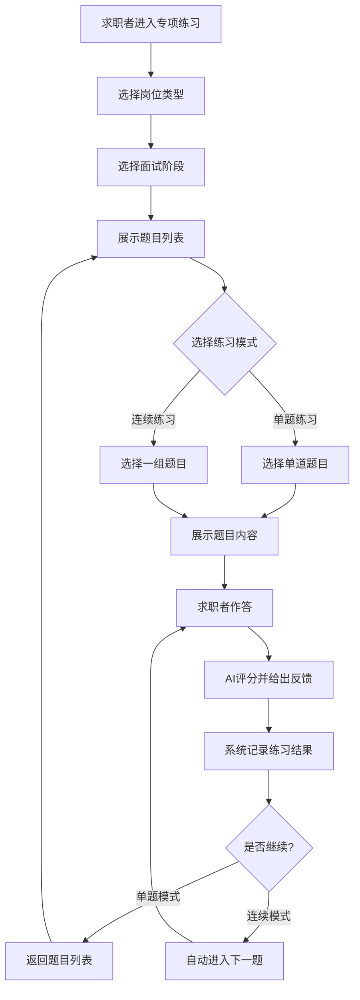

### 2.3.3 表现趋势追踪流程

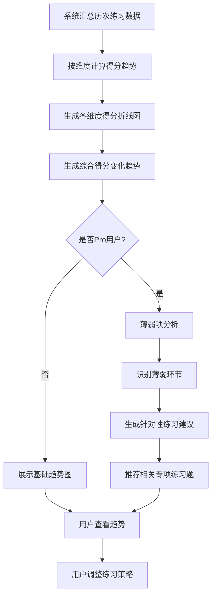

## 2.4 功能图/列表

### 2.4.1 求职者端（小程序端/H5端）功能列表

| 功能模块 | 功能名称 | 优先级 | 功能描述 |
| --- | --- | --- | --- |
| 用户账户 | 手机号登录 | P0 | 通过手机号+验证码完成注册与登录 |
| 用户账户 | 微信一键登录 | P0 | 微信小程序授权一键登录 |
| 用户账户 | 基本信息维护 | P1 | 管理头像、昵称、求职意向岗位等个人信息 |
| 用户账户 | 求职意向设置 | P1 | 设置目标岗位类型、期望行业、期望城市，用于智能推荐 |
| 模拟面试 | 上传岗位JD | P0 | 支持粘贴JD文本、上传JD图片或PDF，系统自动解析 |
| 模拟面试 | JD解析确认 | P0 | 展示AI解析的岗位关键信息，用户可确认或修正 |
| 模拟面试 | 面试方案生成 | P0 | AI基于JD生成面试方案，确定面试阶段和题目数量 |
| 模拟面试 | 面试模式选择 | P0 | 全真模拟（完整多阶段）或单阶段练习 |
| 模拟面试 | AI逐题提问 | P0 | AI按面试阶段逐一展示面试题目 |
| 模拟面试 | 文字作答 | P0 | 用户通过文字输入方式回答问题 |
| 模拟面试 | 语音作答 | P1 | 用户语音录入，系统自动转文字后评估（MVP可延后） |
| 模拟面试 | 单题即时反馈 | P0 | 提交回答后AI即时给出多维度评分和优化建议 |
| 模拟面试 | 题目追问 | P2 | AI根据用户回答进行追问，模拟真实面试深入提问 |
| 模拟面试 | 结束面试 | P0 | 用户主动结束或完成全部题目后自动结束 |
| 模拟面试 | 综合评分 | P0 | 本次面试整体评分，含各维度雷达图 |
| 模拟面试 | 分维度详细评价 | P0 | 流畅度、逻辑结构、信息覆盖、STAR法则、专业深度逐一评价 |
| 模拟面试 | 逐题回顾 | P0 | 回顾每道题目、原始回答、评分及优化建议 |
| 模拟面试 | 参考话术 | P0 | 为每道题目提供高质量参考回答话术（Pro功能） |
| 模拟面试 | 改进建议总结 | P0 | 总结核心改进方向和具体行动建议 |
| 专项练习 | 按岗位类型分类 | P0 | 按开发/产品/设计/运营/销售等浏览专项题库 |
| 专项练习 | 按面试阶段分类 | P0 | 按技术面/产品面/HR面/行为面等筛选题目 |
| 专项练习 | 题目难度标记 | P1 | 每道题目标注难度等级（初级/中级/高级） |
| 专项练习 | 单题练习 | P0 | 选择单道题目练习，获取AI评分和反馈 |
| 专项练习 | 连续练习模式 | P1 | 选择一组题目连续练习，模拟某阶段面试流程 |
| 专项练习 | 历史练习列表 | P1 | 查看历次专项练习记录 |
| 表现趋势 | 各维度得分趋势图 | P0 | 折线图展示各维度历次得分变化（Pro功能） |
| 表现趋势 | 综合得分趋势 | P0 | 综合面试得分变化趋势（Pro功能） |
| 表现趋势 | 薄弱项分析 | P1 | 基于历史数据识别薄弱环节，给出练习建议（Pro功能） |
| 表现趋势 | 练习次数统计 | P1 | 统计累计面试次数、专项练习次数、总答题数 |
| 表现趋势 | 进步里程碑 | P2 | 展示关键指标进步里程碑 |
| 订阅管理 | 套餐信息展示 | P0 | 展示当前套餐类型、剩余次数、到期时间 |
| 订阅管理 | 使用量查看 | P0 | 查看今日已使用模拟面试次数 |
| 订阅管理 | Pro权益介绍 | P0 | 展示Pro版全部权益 |
| 订阅管理 | 订阅支付 | P0 | 微信支付完成Pro订阅（¥49/月） |
| 订阅管理 | 自动续费管理 | P1 | 管理自动续费开关 |
| 消息通知 | 练习提醒 | P2 | 推送面试练习提醒 |
| 消息通知 | 订阅到期提醒 | P1 | Pro到期前提醒续费 |

### 2.4.2 运营管理后台（WEB端）功能列表

| 功能模块 | 功能名称 | 优先级 | 功能描述 |
| --- | --- | --- | --- |
| 用户管理 | 用户查询 | P0 | 查看注册用户列表，支持按手机号、昵称、注册时间查询 |
| 用户管理 | 用户详情 | P0 | 查看用户详细信息、订阅状态、练习记录、使用频次 |
| 用户管理 | 订阅记录查询 | P0 | 查询用户的订阅、续费、退款记录 |
| 用户管理 | 手动调整订阅 | P1 | 运营手动为用户延长/调整订阅 |
| 题库管理 | 题目列表 | P0 | 查看管理所有题目，按岗位类型、面试阶段、难度筛选 |
| 题库管理 | 添加/编辑题目 | P0 | 手动添加或编辑面试题目 |
| 题库管理 | 批量导入题目 | P1 | 通过Excel/CSV模板批量导入 |
| 题库管理 | 题目上下架 | P0 | 控制题目的启用/禁用状态 |
| 题库管理 | 题目覆盖率统计 | P1 | 统计各岗位类型和面试阶段的题目覆盖数量 |
| 题库管理 | 高频题目分析 | P2 | 分析被AI选用频率最高的题目 |
| 内容审核 | JD解析模板配置 | P1 | 配置JD解析的提取规则和关键词权重 |
| 内容审核 | 参考话术库维护 | P1 | 维护各岗位、各阶段的高质量参考话术库 |
| 数据运营 | 核心指标看板 | P0 | DAU、新增用户、模拟面试次数、付费转化率 |
| 数据运营 | 用户增长趋势 | P0 | 用户注册量、活跃度、付费用户增长趋势 |
| 数据运营 | 收入统计 | P0 | 订阅收入、续费率、ARPU等指标 |
| 数据运营 | 面试完成度分析 | P1 | 分析用户面试完成率、中途放弃率 |
| 数据运营 | 用户得分分布 | P1 | 分析用户各评分维度得分分布 |
| AI模型管理 | 评分Prompt配置 | P0 | 配置和迭代AI评分Prompt模板 |
| AI模型管理 | 话术生成Prompt配置 | P1 | 配置参考话术生成Prompt模板 |
| AI模型管理 | LLM模型选择 | P0 | 选择管理底层LLM模型提供商及版本 |
| AI模型管理 | Token用量监控 | P1 | 监控AI调用的Token消耗和成本 |
| 系统管理 | 管理员角色管理 | P0 | 管理后台管理员角色和权限分配 |
| 系统管理 | 免费版额度配置 | P0 | 配置免费版每日模拟面试次数限制 |
| 系统管理 | Pro版定价配置 | P1 | 配置Pro版订阅价格和相关参数 |

## 2.5 你的产品有哪些端

| 序号 | 端名称 | 端类型 | 目标用户 | 说明 |
| --- | --- | --- | --- | --- |
| 1 | 求职者端-小程序端 | 小程序端 | 求职者（应届生/在职者） | 微信小程序，MVP阶段优先上线，覆盖核心面试模拟与练习功能 |
| 2 | 求职者端-H5端 | H5端 | 求职者（应届生/在职者） | H5网页版，作为小程序补充渠道，支持非微信环境访问 |
| 3 | 运营管理后台 | WEB端 | 平台运营人员 | Web后台，管理用户、题库、内容审核、数据运营、AI模型、系统配置 |

---

# 3 产品功能

## 3.1 求职者端-小程序端功能

### 3.1.1 用户登录（手机号/微信）

**功能描述：**
支持用户通过手机号+验证码或微信小程序授权一键登录，降低注册门槛，快速进入面试练习。

| 项 | 内容 |
| --- | --- |
| 优先级 | P0 |
| 依赖需求 | URS-001, URS-002 |
| 前置条件 | 用户已安装微信客户端（微信7.0及以上版本） |

#### 3.1.1.1 详细流程

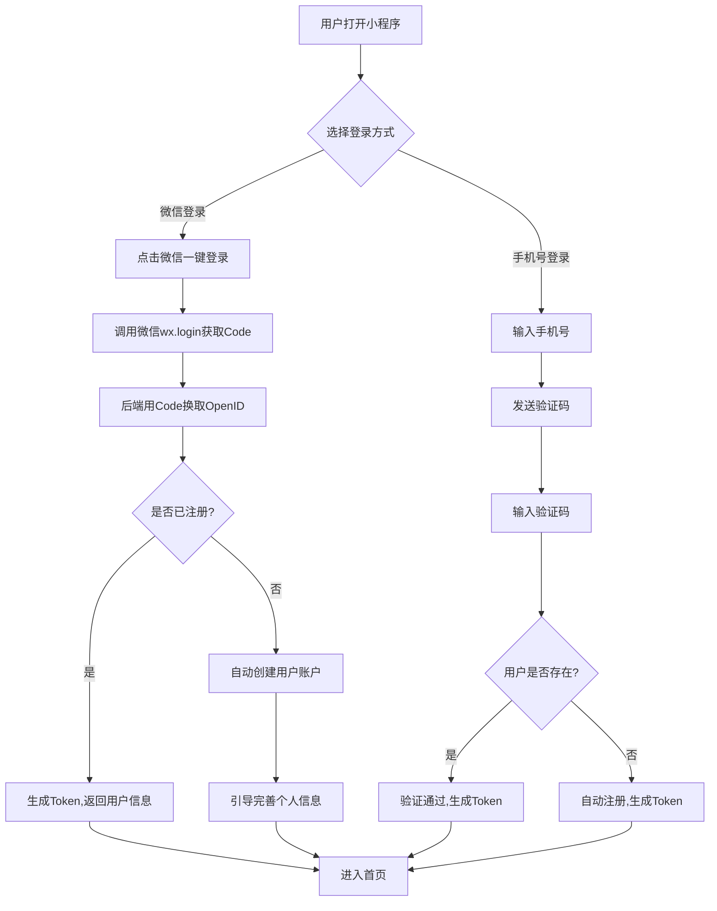

**业务规则说明：**
1. 微信登录优先使用一键授权，获取用户OpenID作为唯一标识
2. 手机号登录：中国大陆11位手机号，验证码6位数字，有效期5分钟，60秒内不可重复发送
3. 新用户自动创建账户，默认免费版
4. Token有效期7天，过期自动跳转登录页
5. 登录接口响应时间 < 500ms

#### 3.1.1.2 主要原型

[用户登录原型](assets/prototypes/c-end-miniapp-prototype.html)

**验收标准：**
- [ ] 正常流程：微信一键登录后1秒内进入首页
- [ ] 手机号流程：输入手机号→获取验证码→验证通过→进入首页
- [ ] 异常流程：验证码错误时即时提示，过期验证码不可使用
- [ ] 新用户自动注册，默认免费版状态

---

### 3.1.2 上传JD创建面试

**功能描述：**
用户通过粘贴JD文本、上传JD图片或PDF文件的方式提交目标岗位描述，系统AI自动解析提取岗位关键信息（职位名称、公司、核心要求、技能关键词等），用户确认或修正后创建面试练习。

| 项 | 内容 |
| --- | --- |
| 优先级 | P0 |
| 依赖需求 | URS-005, URS-006 |
| 前置条件 | 用户已登录 |

#### 3.1.2.1 详细流程

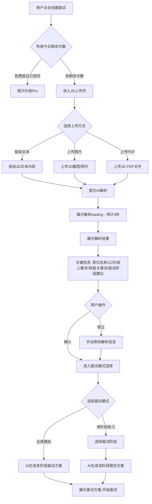

**业务规则说明：**
1. JD文本长度限制：最少50字，最多5000字
2. 图片/PDF文件大小限制：单文件不超过10MB
3. 图片支持JPG/PNG格式，PDF支持单页和多页
4. JD解析时间 < 3秒，超时展示重试按钮
5. 解析结果包括：职位名称、公司名称、岗位类型（开发/产品/设计/运营/销售等）、核心要求、技能关键词列表、建议面试阶段
6. 用户可手动修改任何解析字段
7. 免费版每日1次完整模拟面试，专项练习不限
8. 上传的JD信息仅用于当次面试，不存储原文

#### 3.1.2.2 主要原型

[上传JD创建面试原型](assets/prototypes/c-end-miniapp-prototype.html)

**验收标准：**
- [ ] 正常流程：粘贴JD文本→3秒内解析完成→确认→选择模式→开始面试
- [ ] 图片/PDF上传：支持拍照和相册选择，OCR解析准确
- [ ] 异常流程：JD内容过短时提示，解析失败时提供重试
- [ ] 免费版限制：第2次创建面试时提示升级Pro
- [ ] 性能要求：JD文本解析 < 3秒，图片/PDF解析 < 5秒

---

### 3.1.3 模拟面试进行（逐题问答与即时反馈）

**功能描述：**
用户进入模拟面试后，AI按面试阶段逐一展示题目，用户通过文字（或语音）作答，提交后AI即时给出多维度评分（流畅度、逻辑结构、关键信息覆盖、STAR法则、专业深度）和优化建议，Pro用户还可查看参考话术。

| 项 | 内容 |
| --- | --- |
| 优先级 | P0 |
| 依赖需求 | URS-009 ~ URS-019 |
| 前置条件 | 已完成JD上传和面试方案生成 |

#### 3.1.3.1 详细流程

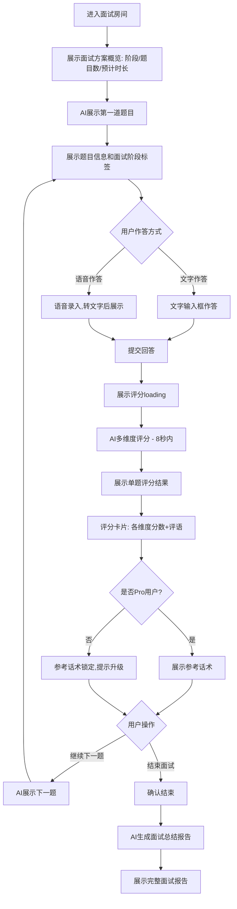

**业务规则说明：**
1. 面试题目按阶段顺序展示，每阶段题目数量由面试方案决定（通常技术面3-5题、产品面2-3题、HR面2-3题）
2. 单题评分维度：回答流畅度（0-100）、逻辑结构（0-100）、关键信息覆盖（0-100）、STAR法则运用（0-100）、专业深度（0-100）
3. 评分响应时间 < 8秒
4. 每道题目提交后即时展示评分和建议，用户可查看后再进入下一题
5. 参考话术为Pro专属功能，免费用户展示话术概要但隐藏完整内容
6. 用户可随时点击"结束面试"主动结束，系统仍生成已答题部分的报告
7. 面试过程中如退出小程序，面试状态保留30分钟，可恢复
8. 追问功能（P2）：AI可根据用户回答进行1-2次追问，模拟真实面试

#### 3.1.3.2 主要原型

[模拟面试原型](assets/prototypes/c-end-miniapp-prototype.html)

**验收标准：**
- [ ] 正常流程：逐题展示→作答→即时评分→下一题→结束→生成报告
- [ ] 评分准确：各维度评分合理，评语有针对性
- [ ] 参考话术：Pro用户可见完整话术，免费用户可见概要
- [ ] 异常流程：网络中断时自动保存已答题内容，恢复后可继续
- [ ] 性能要求：评分响应 < 8秒，面试报告生成 < 10秒

---

### 3.1.4 面试总结报告

**功能描述：**
面试结束后，AI生成完整的面试总结报告，包含综合评分、各维度雷达图、分维度详细评价、逐题回顾（含原始回答和评分）、改进建议总结，Pro用户还可查看每道题的参考话术。

| 项 | 内容 |
| --- | --- |
| 优先级 | P0 |
| 依赖需求 | URS-015 ~ URS-019 |
| 前置条件 | 面试已结束 |

#### 3.1.4.1 详细流程

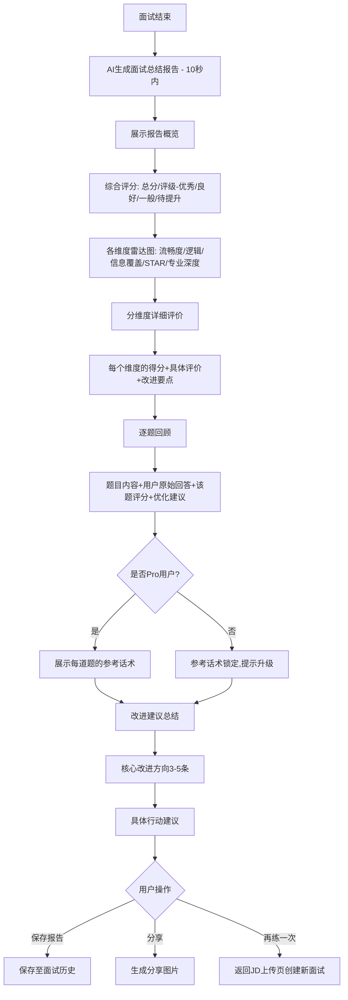

**业务规则说明：**
1. 综合评分 = 各维度加权平均（流畅度15% + 逻辑结构25% + 信息覆盖25% + STAR法则20% + 专业深度15%）
2. 评级标准：90+优秀、80-89良好、60-79一般、60以下待提升
3. 报告生成时间 < 10秒
4. 历史报告永久保存，可随时回看
5. 报告支持生成长图分享至微信

#### 3.1.4.2 主要原型

[面试总结报告原型](assets/prototypes/c-end-miniapp-prototype.html)

**验收标准：**
- [ ] 正常流程：面试结束后10秒内生成报告，各模块信息完整
- [ ] 雷达图：正确展示5个维度的得分，图形直观
- [ ] 逐题回顾：每道题的题目、回答、评分、建议均可查看
- [ ] 参考话术：Pro用户可见，免费用户提示升级
- [ ] 性能要求：报告生成 < 10秒

---

### 3.1.5 专项练习

**功能描述：**
按岗位类型（开发/产品/设计/运营/销售等）和面试阶段（技术面/产品面/HR面/行为面）提供专项练习题库，用户可选择单题练习或连续练习模式，作答后获取AI评分和反馈。

| 项 | 内容 |
| --- | --- |
| 优先级 | P0 |
| 依赖需求 | URS-020 ~ URS-025 |
| 前置条件 | 用户已登录 |

#### 3.1.5.1 详细流程

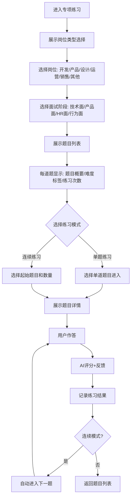

**业务规则说明：**
1. 专项练习不限次数（免费版和Pro版均可无限练习）
2. 题目难度分三级：初级（入门级）、中级（进阶）、高级（专家级）
3. 题目列表按推荐顺序排列，未练习的优先展示
4. 已练习的题目显示历史最佳得分
5. 连续练习模式默认5题一组，可自定义3-10题
6. 练习结果计入表现趋势数据

#### 3.1.5.2 主要原型

[专项练习原型](assets/prototypes/c-end-miniapp-prototype.html)

**验收标准：**
- [ ] 正常流程：选择岗位→选择阶段→浏览题目→选择模式→作答→评分
- [ ] 题目列表：正确展示难度标签和练习状态
- [ ] 连续练习：5题一组流畅切换，结束后展示本组总结
- [ ] 性能要求：题目列表加载 < 1秒

---

### 3.1.6 表现趋势

**功能描述：**
基于用户历次练习数据，以折线图展示各评分维度的得分变化趋势和综合得分趋势，Pro用户还享有薄弱项分析和针对性练习建议。

| 项 | 内容 |
| --- | --- |
| 优先级 | P0（基础趋势）、P1（薄弱项分析） |
| 依赖需求 | URS-026 ~ URS-030 |
| 前置条件 | 用户至少有1次面试或练习记录 |

#### 3.1.6.1 详细流程

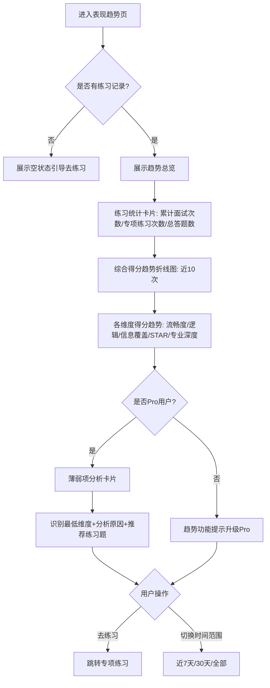

**业务规则说明：**
1. 基础趋势图（综合得分）免费用户可见，各维度详细趋势为Pro功能
2. 趋势图最多展示近30次练习数据，支持时间范围切换
3. 薄弱项分析基于最近10次练习数据，识别得分最低的2个维度
4. 进步里程碑：关键指标首次突破阈值时展示成就卡片

#### 3.1.6.2 主要原型

[表现趋势原型](assets/prototypes/c-end-miniapp-prototype.html)

**验收标准：**
- [ ] 正常流程：趋势图正确展示历次得分变化
- [ ] 薄弱项分析：Pro用户可见，分析结果合理
- [ ] 空状态：无记录时展示引导文案和练习入口
- [ ] 性能要求：趋势数据加载 < 1秒

---

### 3.1.7 订阅管理

**功能描述：**
展示用户当前套餐信息（免费版/Pro版）、使用量，介绍Pro版权益，支持微信支付订阅Pro版（¥49/月），管理自动续费。

| 项 | 内容 |
| --- | --- |
| 优先级 | P0 |
| 依赖需求 | URS-031 ~ URS-035 |
| 前置条件 | 用户已登录 |

#### 3.1.7.1 详细流程

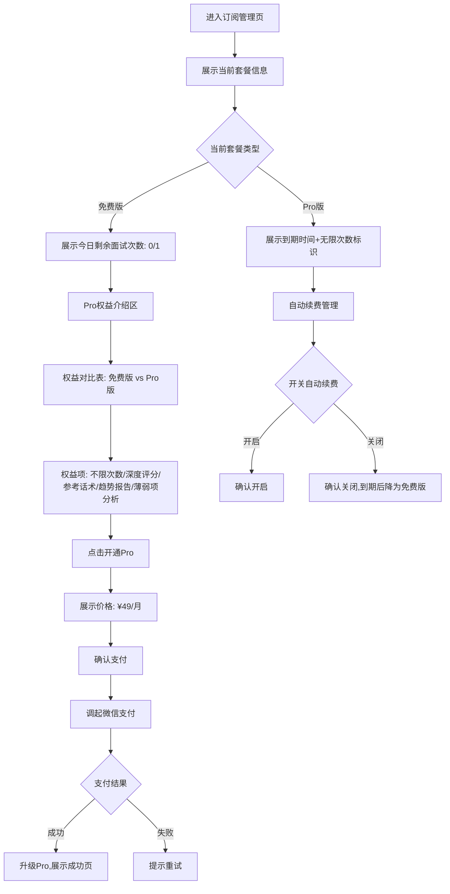

**业务规则说明：**
1. 免费版每日1次完整模拟面试（0点重置），专项练习不限
2. Pro版¥49/月，支持微信支付
3. 自动续费默认开启，用户可随时关闭
4. Pro到期未续费自动降为免费版，历史数据保留
5. 到期后7天宽限期内续费可恢复Pro状态

#### 3.1.7.2 主要原型

[订阅管理原型](assets/prototypes/c-end-miniapp-prototype.html)

**验收标准：**
- [ ] 正常流程：查看套餐→了解权益→支付→升级成功
- [ ] 支付流程：微信支付调起正常，支付成功后实时更新状态
- [ ] 到期处理：Pro到期后自动降为免费版，提示续费

---

### 3.1.8 个人中心

**功能描述：**
用户管理个人信息、查看面试历史、练习记录、订阅状态，管理设置。

| 项 | 内容 |
| --- | --- |
| 优先级 | P0 |
| 依赖需求 | URS-003, URS-004 |
| 前置条件 | 用户已登录 |

#### 3.1.8.1 详细流程

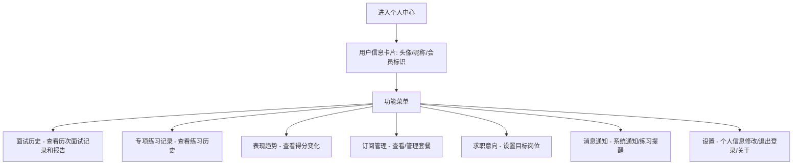

**业务规则说明：**
1. 个人中心展示会员状态标识（Pro用户显示Pro徽章）
2. 面试历史按时间倒序，展示日期、岗位、综合评分
3. 消息通知支持红点提示未读数

#### 3.1.8.2 主要原型

[个人中心原型](assets/prototypes/c-end-miniapp-prototype.html)

**验收标准：**
- [ ] 正常流程：个人信息正确展示，各菜单入口跳转正常
- [ ] 面试历史：列表正确展示，可点击查看详细报告

---

## 3.2 求职者端-H5端功能

H5端功能与小程序端基本一致，核心差异如下：

| 项 | 小程序端 | H5端 |
| --- | --- | --- |
| 登录方式 | 微信授权登录+手机号登录 | 手机号+验证码登录（或微信H5授权） |
| 分享能力 | 微信分享 | 链接分享（浏览器/社交媒体） |
| 支付能力 | 微信支付JSAPI | 微信H5支付 |
| 推送能力 | 微信订阅消息 | 短信通知 |

其余功能模块（JD上传面试、模拟面试、专项练习、表现趋势、订阅管理、个人中心）与小程序端功能描述一致，此处不再赘述。

---

## 3.3 运营管理后台功能

### 3.3.1 数据运营大盘

**功能描述：**
展示平台核心运营指标，包括DAU、新增用户、模拟面试次数、付费转化率、用户增长趋势、收入统计等。

| 项 | 内容 |
| --- | --- |
| 优先级 | P0 |
| 依赖需求 | URS-后台数据运营 |
| 前置条件 | 运营人员已登录管理后台 |

#### 3.3.1.1 详细流程

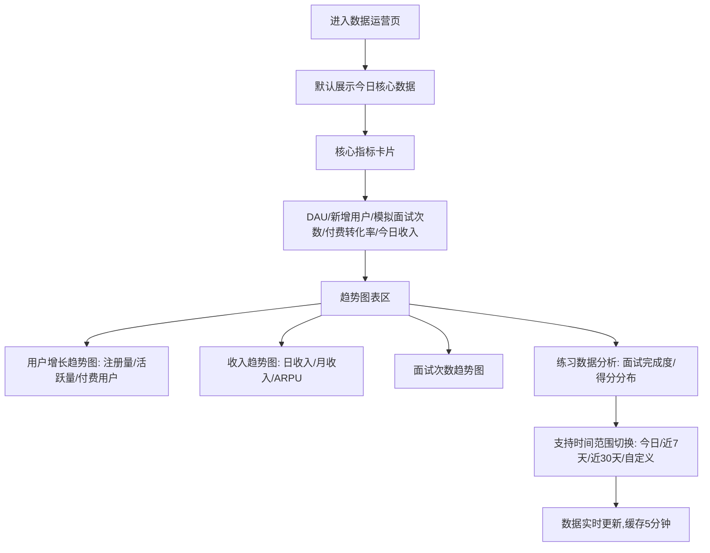

**业务规则说明：**
1. 核心指标每小时更新，趋势图数据实时
2. 付费转化率 = 今日新增Pro用户 / 今日活跃用户 × 100%
3. 数据缓存5分钟，支持手动刷新
4. 支持数据导出Excel（P2）

#### 3.3.1.2 主要原型

[数据运营大盘原型](assets/prototypes/admin-web-prototype.html)

**验收标准：**
- [ ] 正常流程：核心指标正确计算，趋势图正常渲染
- [ ] 时间切换：切换时间范围后数据正确更新
- [ ] 性能要求：页面加载 < 2秒

---

### 3.3.2 题库管理

**功能描述：**
管理平台专项练习题库，支持题目的增删改查、批量导入、上下架管理，以及题目覆盖率统计。

| 项 | 内容 |
| --- | --- |
| 优先级 | P0 |
| 依赖需求 | URS-后台题库管理 |
| 前置条件 | 运营人员已登录管理后台 |

#### 3.3.2.1 详细流程

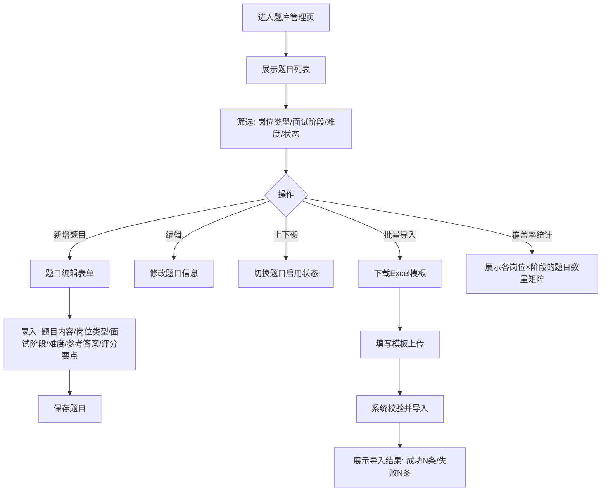

**业务规则说明：**
1. 题目为必填项：题目内容、岗位类型、面试阶段、难度
2. 参考答案和评分要点为选填，AI面试时可作为参考
3. 批量导入支持Excel/CSV，单次最多500条
4. 已上架题目不可删除，仅可下架
5. 题目覆盖率矩阵：行=岗位类型，列=面试阶段，单元格=题目数量

#### 3.3.2.2 主要原型

[题库管理原型](assets/prototypes/admin-web-prototype.html)

**验收标准：**
- [ ] 正常流程：题目增删改查正常，筛选功能正常
- [ ] 批量导入：模板下载→填写→上传→校验→导入成功
- [ ] 覆盖率统计：矩阵展示正确

---

### 3.3.3 AI模型管理

**功能描述：**
管理AI面试相关的大模型配置，包括评分Prompt模板、话术生成Prompt模板、LLM模型选择和Token用量监控。

| 项 | 内容 |
| --- | --- |
| 优先级 | P0（评分Prompt+LLM选择）、P1（话术Prompt+Token监控） |
| 依赖需求 | URS-后台AI模型管理 |
| 前置条件 | 运营人员已登录管理后台 |

#### 3.3.3.1 详细流程

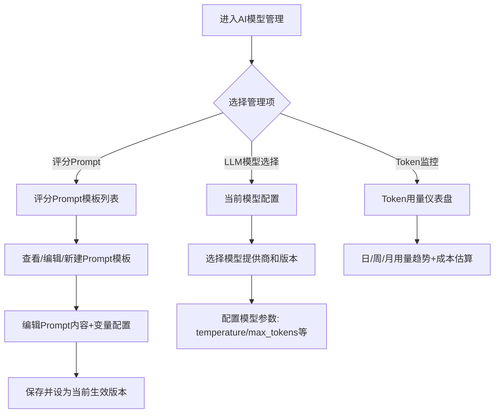

**业务规则说明：**
1. Prompt模板支持变量占位符（如{user_answer}、{question}、{jd_info}）
2. Prompt修改后需手动发布生效，保留历史版本可回滚
3. LLM模型支持切换提供商（OpenAI/文心一言/通义千问等）
4. Token用量按日统计，设置用量预警阈值

#### 3.3.3.2 主要原型

[AI模型管理原型](assets/prototypes/admin-web-prototype.html)

**验收标准：**
- [ ] 正常流程：Prompt编辑保存后即时生效
- [ ] 模型切换：切换LLM提供商后AI服务正常
- [ ] Token监控：用量数据准确，预警功能正常

---

# 4 产品原型

## 4.1 页面跳转逻辑图

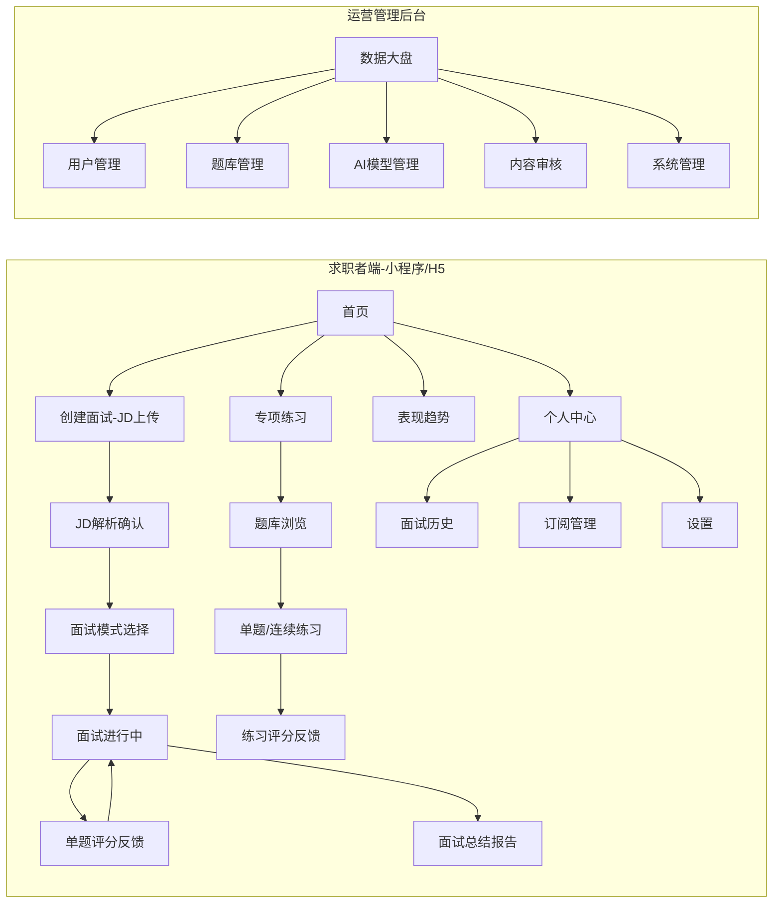

## 4.2 全站点原型设计

### 4.2.1 求职者端-小程序端

**页面清单：**

| 序号 | 页面名称 | 所属模块 | 页面描述 | 关键元素 |
| --- | --- | --- | --- | --- |
| 1 | 登录页 | 用户账户 | 微信一键登录和手机号登录入口 | 登录按钮、手机号输入框、验证码 |
| 2 | 首页 | 核心入口 | 创建面试入口、专项练习入口、今日数据概览 | 功能入口卡片、使用统计、快速开始按钮 |
| 3 | 上传JD页 | 模拟面试 | 粘贴文本/上传图片/PDF上传JD | 文本输入框、上传按钮、解析进度 |
| 4 | JD解析确认页 | 模拟面试 | 展示AI解析的岗位信息，用户确认或修正 | 解析结果卡片、编辑入口、确认按钮 |
| 5 | 面试方案页 | 模拟面试 | 展示面试方案，选择面试模式 | 阶段列表、题目数量、模式选择 |
| 6 | 面试进行中页 | 模拟面试 | AI逐题提问，用户作答 | 题目展示、作答区域、进度指示、提交按钮 |
| 7 | 单题评分页 | 模拟面试 | 展示单题多维度评分和建议 | 评分卡片、维度分数、评语、参考话术 |
| 8 | 面试报告页 | 模拟面试 | 完整面试总结报告 | 综合评分、雷达图、逐题回顾、改进建议 |
| 9 | 专项练习-题库浏览页 | 专项练习 | 按岗位类型和面试阶段浏览题目 | 筛选器、题目列表、难度标签 |
| 10 | 专项练习-答题页 | 专项练习 | 单题练习作答和评分 | 题目详情、作答区、评分结果 |
| 11 | 表现趋势页 | 表现趋势 | 各维度得分趋势图和练习统计 | 折线图、统计卡片、薄弱项分析 |
| 12 | 个人中心页 | 用户账户 | 个人信息、功能菜单 | 用户信息卡片、菜单列表 |
| 13 | 订阅管理页 | 订阅管理 | 套餐信息、Pro权益、支付 | 套餐卡片、权益对比、支付按钮 |

**交互说明：**
- 页面跳转关系：
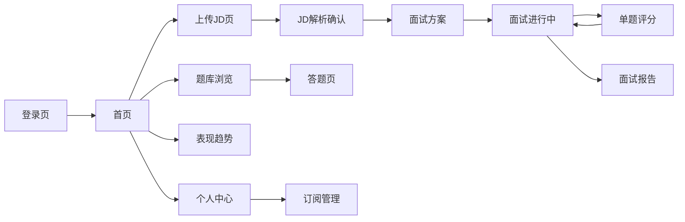
- 特殊交互：
  1. 面试进行中：题目切换使用滑动动画，模拟对话感
  2. 评分加载：使用渐进式展示，先出总分再出各维度
  3. 雷达图：交互式，点击维度可查看详细评价
  4. 空状态：无面试记录时展示引导创建插画
  5. 加载态：AI处理中展示品牌化loading动画
  6. 语音作答：录音波形实时展示

**产品原型：**

[📱 打开求职者端小程序全站点原型](assets/prototypes/c-end-miniapp-prototype.html)

### 4.2.2 求职者端-H5端

H5端页面清单与小程序端基本一致，主要差异在登录页（手机号+验证码登录为主）。

**产品原型：**

[📱 打开求职者端H5全站点原型](assets/prototypes/c-end-h5-prototype.html)

### 4.2.3 运营管理后台

**页面清单：**

| 序号 | 页面名称 | 所属模块 | 页面描述 | 关键元素 |
| --- | --- | --- | --- | --- |
| 1 | 数据大盘页 | 数据运营 | 核心运营指标和趋势图 | 指标卡片、趋势图表、排行榜 |
| 2 | 用户列表页 | 用户管理 | 注册用户列表，搜索筛选 | 用户表格、搜索框、分页 |
| 3 | 用户详情页 | 用户管理 | 用户完整信息和操作日志 | 基本信息、订阅状态、练习记录 |
| 4 | 题库管理页 | 题库管理 | 题目列表管理，增删改查 | 题目表格、筛选器、操作按钮 |
| 5 | 题目编辑页 | 题库管理 | 添加/编辑面试题目 | 表单编辑器、难度选择 |
| 6 | AI模型管理页 | AI模型管理 | Prompt配置、模型选择、Token监控 | Prompt编辑器、模型选择器、用量图表 |
| 7 | 系统设置页 | 系统管理 | 免费版额度、Pro定价、角色权限 | 配置表单、角色列表 |

**产品原型：**

[🖥️ 打开运营管理后台全站点原型](assets/prototypes/admin-web-prototype.html)

---

# 5 数据需求

## 5.1 数据使用规格

### 5.1.1 用户表（user）

| **字段** | **是否必填** | **描述** | **数据类型** |
| --- | --- | --- | --- |
| id | 是 | 用户唯一标识 | 字符串(UUID) |
| openid | 否 | 微信OpenID | 字符串 |
| nickname | 否 | 用户昵称 | 字符串 |
| avatar_url | 否 | 头像URL | 字符串 |
| phone | 否 | 手机号 | 字符串 |
| target_position | 否 | 求职意向岗位类型 | 字符串 |
| target_industry | 否 | 期望行业 | 字符串 |
| target_city | 否 | 期望城市 | 字符串 |
| subscription_type | 是 | 订阅类型：free/pro | 字符串 |
| subscription_expire_at | 否 | 订阅到期时间 | 日期时间 |
| auto_renew | 是 | 是否自动续费 | 布尔 |
| status | 是 | 账户状态：active/disabled | 字符串 |
| created_at | 是 | 注册时间 | 日期时间 |
| updated_at | 是 | 更新时间 | 日期时间 |

### 5.1.2 面试会话表（interview_session）

| **字段** | **是否必填** | **描述** | **数据类型** |
| --- | --- | --- | --- |
| id | 是 | 面试会话唯一标识 | 字符串(UUID) |
| user_id | 是 | 用户ID | 字符串(UUID) |
| jd_raw_text | 否 | JD原始文本（不持久化，仅当次使用） | 字符串 |
| jd_parsed_info | 是 | JD解析后的结构化岗位信息 | JSON |
| interview_mode | 是 | 面试模式：full_simulation/single_stage | 字符串 |
| stage_plan | 是 | 面试阶段计划 | JSON |
| status | 是 | 状态：jd_parsing/confirmed/in_progress/completed/abandoned | 字符串 |
| overall_score | 否 | 综合评分 | 数字 |
| dimension_scores | 否 | 各维度评分 | JSON |
| report | 否 | 面试总结报告 | JSON |
| created_at | 是 | 创建时间 | 日期时间 |
| completed_at | 否 | 完成时间 | 日期时间 |

### 5.1.3 面试回答记录表（interview_answer）

| **字段** | **是否必填** | **描述** | **数据类型** |
| --- | --- | --- | --- |
| id | 是 | 回答记录唯一标识 | 字符串(UUID) |
| session_id | 是 | 所属面试会话ID | 字符串(UUID) |
| user_id | 是 | 用户ID | 字符串(UUID) |
| stage | 是 | 面试阶段 | 字符串 |
| question | 是 | 面试题目内容 | 字符串 |
| user_answer | 是 | 用户回答内容 | 字符串 |
| answer_type | 是 | 作答方式：text/voice | 字符串 |
| dimension_scores | 否 | 各维度评分 | JSON |
| feedback | 否 | 优化建议 | 字符串 |
| reference_answer | 否 | 参考话术 | 字符串 |
| score | 否 | 该题综合得分 | 数字 |
| created_at | 是 | 作答时间 | 日期时间 |

### 5.1.4 题库表（question_bank）

| **字段** | **是否必填** | **描述** | **数据类型** |
| --- | --- | --- | --- |
| id | 是 | 题目唯一标识 | 字符串(UUID) |
| content | 是 | 题目内容 | 字符串 |
| position_type | 是 | 岗位类型：dev/product/design/ops/sales/other | 字符串 |
| interview_stage | 是 | 面试阶段：tech/product/hr/behavior | 字符串 |
| difficulty | 是 | 难度：beginner/intermediate/advanced | 字符串 |
| reference_answer | 否 | 参考答案 | 字符串 |
| scoring_points | 否 | 评分要点 | JSON |
| practice_count | 是 | 累计练习次数 | 数字 |
| avg_score | 否 | 用户平均得分 | 数字 |
| status | 是 | 状态：active/inactive | 字符串 |
| created_at | 是 | 创建时间 | 日期时间 |
| updated_at | 是 | 更新时间 | 日期时间 |

### 5.1.5 练习记录表（practice_record）

| **字段** | **是否必填** | **描述** | **数据类型** |
| --- | --- | --- | --- |
| id | 是 | 记录唯一标识 | 字符串(UUID) |
| user_id | 是 | 用户ID | 字符串(UUID) |
| question_id | 是 | 题目ID | 字符串(UUID) |
| practice_type | 是 | 练习类型：single/continuous/interview | 字符串 |
| session_id | 否 | 关联面试会话ID（面试内练习时） | 字符串(UUID) |
| user_answer | 是 | 用户回答 | 字符串 |
| dimension_scores | 否 | 各维度评分 | JSON |
| feedback | 否 | 优化建议 | 字符串 |
| score | 否 | 综合得分 | 数字 |
| created_at | 是 | 练习时间 | 日期时间 |

## 5.2 统计数据

1. 统计每日模拟面试次数、完成率、平均综合得分，按日维度统计（P0）
2. 统计每日新增用户数、DAU、付费转化率，按日维度统计（P0）
3. 统计每日订阅收入、续费率、ARPU，按日维度统计（P0）
4. 统计各评分维度的用户得分分布，按维度、按周维度统计（P1）
5. 统计专项练习各岗位类型的练习量和平均得分，按岗位、按日维度统计（P1）

## 5.3 埋点需求

| 页面 | 事件 | 采集字段 | 说明 |
| --- | --- | --- | --- |
| 首页 | page_view | user_id, subscription_type | 首页曝光 |
| 首页 | create_interview_click | user_id | 创建面试入口点击 |
| JD上传 | jd_submit | user_id, upload_type(text/image/pdf), jd_length | JD提交解析 |
| JD解析 | jd_parsed | user_id, position_type, parse_duration | JD解析完成 |
| 面试开始 | interview_start | user_id, session_id, mode, stage_count | 面试开始 |
| 面试答题 | answer_submit | user_id, session_id, question_index, answer_type, answer_length | 提交回答 |
| 面试评分 | score_show | user_id, session_id, overall_score, dimension_scores | 评分展示 |
| 面试结束 | interview_end | user_id, session_id, total_questions, completion_rate | 面试结束 |
| 面试报告 | report_view | user_id, session_id, overall_score | 报告查看 |
| 专项练习 | practice_start | user_id, position_type, stage, practice_mode | 练习开始 |
| 专项练习 | practice_complete | user_id, question_id, score | 练习完成 |
| 表现趋势 | trend_view | user_id, subscription_type | 趋势页查看 |
| 订阅页 | subscription_view | user_id, current_type | 订阅页曝光 |
| 订阅页 | subscribe_click | user_id, target_plan | 点击订阅 |
| 全局 | upgrade_prompt_show | user_id, trigger_feature | Pro升级提示展示 |
| 全局 | upgrade_prompt_click | user_id, trigger_feature | Pro升级提示点击 |

---

# 6 非功能需求

## 6.1 性能需求

**6.1.1 延迟**

| 编号 | 项目 | 最大延迟 | 平均延迟 | 优先级 | 备注 |
| --- | --- | --- | --- | --- | --- |
| 0001 | 主要页面首屏加载 | < 2秒 | < 1.5秒 | 高 | 含小程序和H5 |
| 0002 | JD文本解析 | < 3秒 | < 2秒 | 高 |  |
| 0003 | JD图片/PDF解析 | < 5秒 | < 3秒 | 高 | 含OCR |
| 0004 | 面试方案及首题生成 | < 5秒 | < 3秒 | 高 |  |
| 0005 | 单题评分与反馈 | < 8秒 | < 5秒 | 高 |  |
| 0006 | 面试总结报告生成 | < 10秒 | < 7秒 | 高 |  |
| 0007 | 语音转文字（1分钟内） | < 3秒 | < 2秒 | 中 |  |
| 0008 | 趋势数据加载 | < 1秒 | < 0.5秒 | 中 |  |

**6.1.2 吞吐量**

| 编号 | 项 | 吞吐量 | 备注 |
| --- | --- | --- | --- |
| 0001 | 模拟面试并发 | 500用户同时 |  |
| 0002 | AI评分请求 | 每秒100次 |  |
| 0003 | JD解析请求 | 每秒50次 |  |

**6.1.3 容量**

| 编号 | 项 | 容量 | 备注 |
| --- | --- | --- | --- |
| 0001 | 系统注册用户数 | <= 100,000 | MVP阶段 |
| 0002 | 日活用户数 | >= 10,000 | MVP阶段 |
| 0003 | 面试会话记录数 | <= 500,000 |  |
| 0004 | 题库题目数量 | <= 10,000 |  |

## 6.2 安全需求

| 编号 | 项（系统数据 / 处理过程） |
| --- | --- |
| 0001 | 用户个人信息（手机号、求职意向）加密存储（AES-256） |
| 0002 | 不保存用户语音原始数据，仅保留转写文本 |
| 0003 | 用户上传的JD信息仅用于当次面试，不向第三方泄露 |
| 0004 | API接口校验用户身份，防止越权访问 |
| 0005 | 所有AI生成内容经过内容安全过滤，不生成歧视、违法等不当内容 |
| 0006 | 支付使用微信支付官方SDK，不保存支付敏感信息 |
| 0007 | 所有API通信使用HTTPS加密传输 |
| 0008 | 防止SQL注入、XSS攻击等常见Web安全威胁 |

## 6.3 可靠性

| 编号 | 项 | 值 |
| --- | --- | --- |
| 0001 | 核心服务正常运行概率 | 99.9% |
| 0002 | 平均正常运行时间 | 约365天 |
| 0003 | 平均故障恢复时间 | < 30分钟 |

## 6.4 可连续性

| 编号 | 项 |
| --- | --- |
| Conti.1 | 系统需要 7 × 24 全天候运行 |
| Conti.2 | 计划内维护窗口：每月一次，凌晨2:00-4:00，提前24小时通知 |
| Conti.3 | 数据库采用主从架构，支持自动故障切换 |

## 6.5 可恢复性

| 编号 | 项 |
| --- | --- |
| Recov.1 | 数据库每日全量备份，保留30天；每小时增量备份 |
| Recov.2 | 面试进行中如异常退出，状态保留30分钟可恢复 |
| Recov.3 | 重大故障在1-3小时内恢复服务 |

## 6.6 兼容性

| 编号 | 要求 | 备注 |
| --- | --- | --- |
| 0001 | 小程序：微信7.0及以上版本 |  |
| 0002 | H5：兼容Chrome、Safari、微信内置浏览器最近2个大版本 |  |
| 0003 | 管理后台：Chrome >= 90，Firefox >= 88，Edge >= 90 |  |
| 0004 | 移动端适配主流分辨率：375×667，390×844，414×896 |  |
| 0005 | 管理后台适配分辨率：1920×1080，1440×900 |  |

## 6.7 易用性

| 编号 | 要求 | 备注 |
| --- | --- | --- |
| 0001 | 核心操作路径（创建面试→开始面试）不超过3步 |  |
| 0002 | 普通用户无需培训即可使用核心功能 |  |
| 0003 | 面试界面模拟真实面试对话感，问题展示清晰 |  |
| 0004 | 评分结果使用雷达图、柱状图等可视化方式呈现 |  |
| 0005 | 空状态、加载态、错误态均有友好提示和引导操作 |  |
| 0006 | 设计风格简洁专业、鼓励性强，降低面试焦虑感 |  |

---

# 7 总结

## 7.1 上线计划

| 阶段 | 时间 | 内容 | 负责人 |
| --- | --- | --- | --- |
| 开发阶段 | 2026-07-01 ~ 2026-07-07 | 核心功能开发（JD解析+面试引擎+评分+话术+记录） | 开发团队 |
| 测试阶段 | 2026-07-08 ~ 2026-07-10 | 功能测试、AI评分一致性测试、性能测试 | 测试团队 |
| 灰度阶段 | 2026-07-11 ~ 2026-07-13 | 灰度10%用户，验证核心流程 | 运营团队 |
| 全量上线 | 2026-07-14 | 全量开放 | 全团队 |

## 7.2 后续迭代规划

- **V1.1**：语音作答功能（ASR集成）、连续练习模式优化、进步里程碑系统
- **V1.2**：AI追问功能（模拟真实面试深入提问）、面试报告分享长图、练习提醒推送
- **V1.3**：简历优化辅助功能、真人面试教练对接、企业版（HR面试评估工具）
- **V2.0**：视频面试模拟（AI分析表情和肢体语言）、多语言面试支持

## 7.3 参考文档

- [需求文档.md](./需求文档.md) - 用户需求规格说明书
- 微信开放平台文档：https://developers.weixin.qq.com/miniprogram/dev/framework/
- 微信支付文档：https://pay.weixin.qq.com/wiki/doc/apiv3/index.shtml

---

**文档说明**：本产品需求文档基于"优特云-用户语言"五层架构模板规范编写，以上游URS需求文档为依据，覆盖产品设计、功能描述、数据需求、非功能需求、上线计划等核心章节，可作为后续开发、测试、运营的依据。文档中所有原型文件均为独立HTML文件，可直接在浏览器中打开预览。
