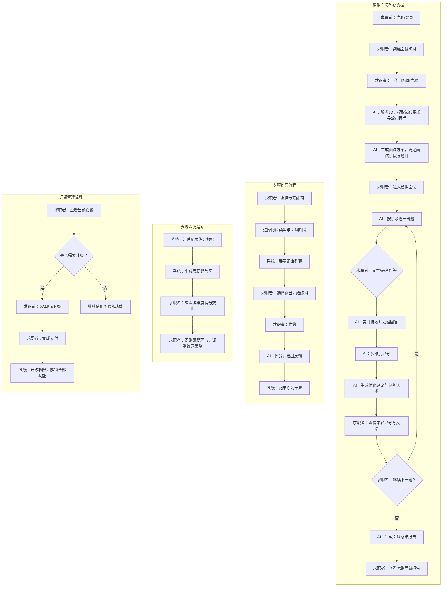
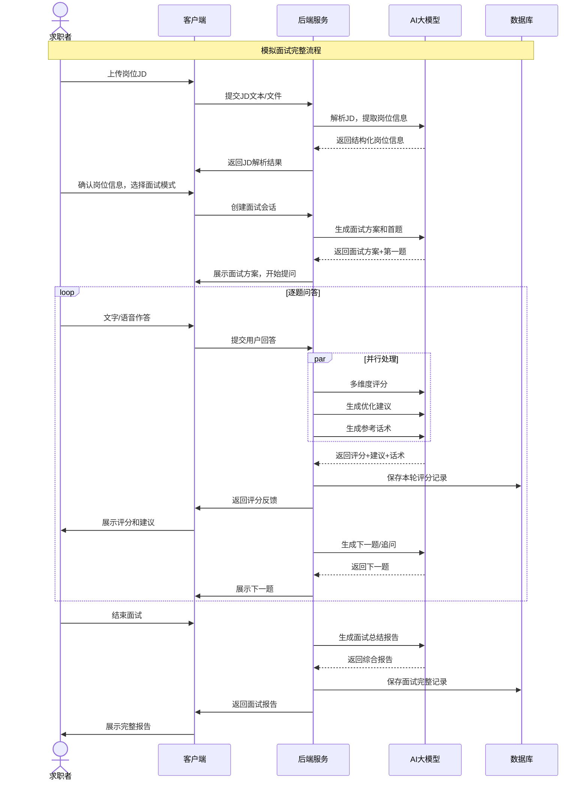
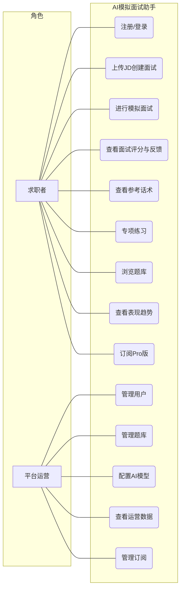
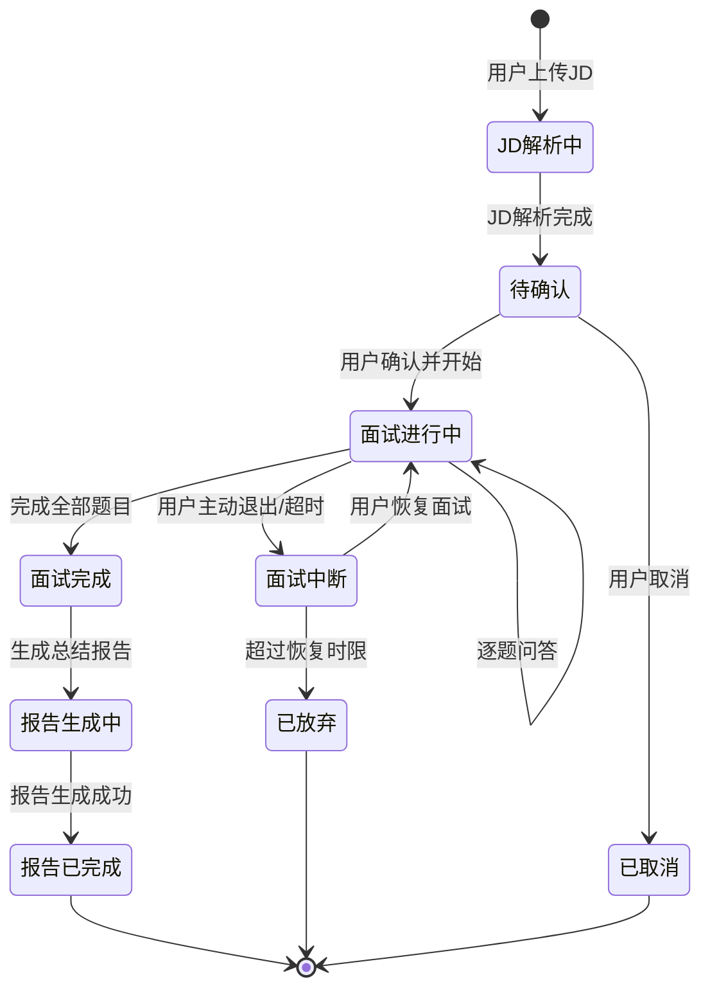
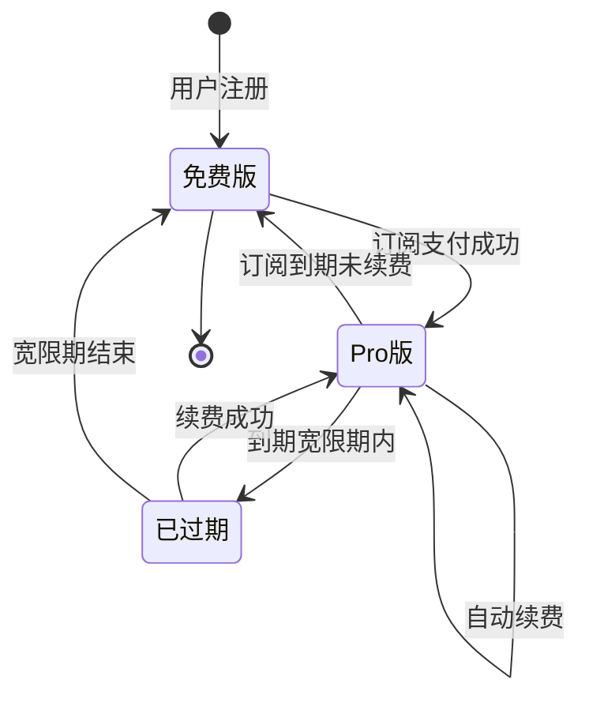

# AI模拟面试与话术优化助手V1.0 - 用户需求规格说明书

# 1.需求概述

## 1.1 需求介绍

AI模拟面试与话术优化助手是一款面向求职者的AI驱动面试练习工具，通过解析目标岗位JD（Job Description），模拟真实面试流程，按技术面/产品面/HR面等不同阶段进行提问，并对用户的文字或语音回答从多维度进行结构化评分，提供具体优化建议和参考话术，帮助求职者以低成本、高频次的方式系统性提升面试表现。

### 1.1.1 所属领域

在线教育科技、人力资源服务、AI应用

## 1.2 需求目标

- 为求职者提供基于真实岗位JD的AI模拟面试体验，覆盖技术面/产品面/HR面等多阶段面试场景
- 通过多维度结构化评分（流畅度、逻辑结构、关键信息覆盖、STAR法则等），帮助用户精准定位回答短板
- 提供针对性的优化建议和参考话术，让用户知道"怎么改"而不只是"哪里不好"
- 按岗位类型和面试阶段提供专项练习题库，支持用户有针对性地强化薄弱环节
- 记录每次练习的表现趋势，让用户直观看到自己的进步轨迹
- 以远低于人工面试教练（¥200-500/次）的成本，提供可高频使用的AI面试练习方案

## 1.3 系统使用角色

本系统主要服务于两类用户角色：
1. **求职者（C端用户）**：正在求职的应届生和职场人，准备跳槽的在职者，需要针对特定岗位练习面试的求职者
2. **平台运营方**：负责平台内容管理、题库维护、用户管理、订阅管理和数据运营的后台管理人员

## 1.4 业务流程图

# 2.功能原型

| 原型名称 | 原型链接 | 对应端 | 备注 |
| --- | --- | --- | --- |
| 求职者端小程序原型 |  | 小程序端 | V1.0 MVP |
| 求职者端H5页面原型 |  | WEB端 | V1.0 MVP，嵌入小程序或独立访问 |
| 运营管理后台Web原型 |  | WEB端 | V1.0 MVP |

# 3.需求清单

## 3.1 求职者端-小程序端

| 序号 | 功能模块 | 一级功能 | 二级功能 | 功能描述 | 优先级 | 备注 |
| --- | --- | --- | --- | --- | --- | --- |
| 1 | 用户账户 | 注册/登录 | 手机号登录 | 用户通过手机号+验证码完成注册与登录 | P0 | |
| 2 | | | 微信一键登录 | 支持微信小程序授权一键登录 | P0 | |
| 3 | | 个人信息管理 | 基本信息维护 | 管理头像、昵称、求职意向岗位等个人信息 | P1 | |
| 4 | | | 求职意向设置 | 设置目标岗位类型、期望行业、期望城市等，用于智能推荐 | P1 | |
| 5 | 模拟面试 | 创建面试 | 上传岗位JD | 支持粘贴JD文本、上传JD图片或PDF文件，系统自动解析岗位信息 | P0 | |
| 6 | | | JD解析确认 | 展示AI解析出的岗位关键信息（职位名称、公司、核心要求、技能关键词等），用户可确认或修正 | P0 | |
| 7 | | | 面试方案生成 | AI基于JD生成面试方案，确定面试阶段（技术面/产品面/HR面等）和各阶段题目数量 | P0 | |
| 8 | | | 面试模式选择 | 用户可选择"全真模拟"（完整多阶段）或"单阶段练习"（仅练某个阶段） | P0 | |
| 9 | | 面试进行 | AI逐题提问 | AI按面试阶段逐一展示面试题目，支持文字展示 | P0 | |
| 10 | | | 文字作答 | 用户通过文字输入方式回答问题 | P0 | |
| 11 | | | 语音作答 | 用户通过语音录入方式回答问题，系统自动转文字后进行评估 | P1 | MVP可延后 |
| 12 | | | 单题即时反馈 | 用户提交回答后，AI即时给出该题的多维度评分和优化建议 | P0 | |
| 13 | | | 题目追问 | AI可根据用户回答进行追问，模拟真实面试中的深入提问场景 | P2 | |
| 14 | | | 结束面试 | 用户可主动结束面试，或完成全部题目后自动结束 | P0 | |
| 15 | | 面试报告 | 综合评分 | 本次面试的整体评分，含各维度雷达图 | P0 | |
| 16 | | | 分维度详细评价 | 从回答流畅度、逻辑结构、关键信息覆盖、STAR法则运用、专业深度等维度逐一评价 | P0 | |
| 17 | | | 逐题回顾 | 回顾每道题目、用户原始回答、评分及优化建议 | P0 | |
| 18 | | | 参考话术 | 为每道题目提供高质量的参考回答话术 | P0 | Pro功能 |
| 19 | | | 改进建议总结 | 总结本次面试的核心改进方向和具体行动建议 | P0 | |
| 20 | 专项练习 | 题库浏览 | 按岗位类型分类 | 按开发/产品/设计/运营/销售等岗位类型浏览专项题库 | P0 | |
| 21 | | | 按面试阶段分类 | 按技术面/产品面/HR面/行为面等阶段筛选题目 | P0 | |
| 22 | | | 题目难度标记 | 每道题目标注难度等级（初级/中级/高级） | P1 | |
| 23 | | 专项练习 | 单题练习 | 选择单道题目进行练习，作答后获取AI评分和反馈 | P0 | |
| 24 | | | 连续练习模式 | 选择一组题目进行连续练习，模拟某一阶段的面试流程 | P1 | |
| 25 | | 练习记录 | 历史练习列表 | 查看历次专项练习的记录，包含题目、得分、时间 | P1 | |
| 26 | 表现趋势 | 趋势总览 | 各维度得分趋势图 | 以折线图展示用户在流畅度、逻辑、信息覆盖、STAR法则等维度的历次得分变化 | P0 | Pro功能 |
| 27 | | | 综合得分趋势 | 展示综合面试得分的变化趋势 | P0 | Pro功能 |
| 28 | | | 薄弱项分析 | 基于历史数据识别用户的薄弱环节，给出针对性练习建议 | P1 | Pro功能 |
| 29 | | 练习统计 | 练习次数统计 | 统计累计面试次数、专项练习次数、总答题数 | P1 | |
| 30 | | | 进步里程碑 | 展示用户在关键指标上的进步里程碑（如"逻辑结构得分首次超过80分"） | P2 | |
| 31 | 订阅管理 | 当前套餐 | 套餐信息展示 | 展示当前套餐类型（免费版/Pro版）、剩余使用次数、到期时间等 | P0 | |
| 32 | | | 使用量查看 | 查看今日已使用模拟面试次数（免费版每日1次） | P0 | |
| 33 | | 升级Pro | Pro权益介绍 | 展示Pro版全部权益：不限次数、深度评分、话术优化、趋势报告等 | P0 | |
| 34 | | | 订阅支付 | 支持微信支付完成Pro订阅（¥49/月） | P0 | |
| 35 | | | 自动续费管理 | 管理自动续费开关 | P1 | |
| 36 | 消息通知 | 系统通知 | 练习提醒 | 推送面试练习提醒，鼓励用户保持练习频率 | P2 | |
| 37 | | | 订阅到期提醒 | Pro到期前提醒续费 | P1 | |

## 3.2 求职者端-WEB端（H5）

| 序号 | 功能模块 | 一级功能 | 二级功能 | 功能描述 | 优先级 | 备注 |
| --- | --- | --- | --- | --- | --- | --- |
| 1 | 全部功能 | 同小程序端 | 同小程序端 | H5页面承载与小程序端相同的核心功能，支持在浏览器中独立访问或嵌入使用 | P1 | 作为小程序端的补充入口 |

## 3.3 运营管理后台-WEB端

| 序号 | 功能模块 | 一级功能 | 二级功能 | 功能描述 | 优先级 | 备注 |
| --- | --- | --- | --- | --- | --- | --- |
| 1 | 用户管理 | 用户列表 | 用户查询 | 查看平台注册用户列表，支持按手机号、昵称、注册时间等条件查询 | P0 | |
| 2 | | | 用户详情 | 查看用户详细信息、订阅状态、练习记录、使用频次等 | P0 | |
| 3 | | 订阅管理 | 订阅记录查询 | 查询用户的订阅、续费、退款记录 | P0 | |
| 4 | | | 手动调整订阅 | 运营可手动为用户延长/调整订阅（处理客诉等场景） | P1 | |
| 5 | 题库管理 | 题目管理 | 题目列表 | 查看和管理题库中的所有题目，支持按岗位类型、面试阶段、难度筛选 | P0 | |
| 6 | | | 添加/编辑题目 | 手动添加或编辑面试题目，设置岗位类型、面试阶段、难度、参考答案等 | P0 | |
| 7 | | | 批量导入题目 | 支持通过Excel/CSV模板批量导入题目 | P1 | |
| 8 | | | 题目上下架 | 控制题目的启用/禁用状态 | P0 | |
| 9 | | 题库统计 | 题目覆盖率统计 | 统计各岗位类型和面试阶段的题目覆盖数量 | P1 | |
| 10 | | | 高频题目分析 | 分析被AI选用频率最高的题目 | P2 | |
| 11 | 内容审核 | JD解析管理 | 解析模板配置 | 配置JD解析的提取规则和关键词权重 | P1 | |
| 12 | | 话术库管理 | 参考话术维护 | 维护各岗位、各阶段的高质量参考话术库 | P1 | |
| 13 | 数据运营 | 数据大盘 | 核心指标看板 | 展示DAU、新增用户、模拟面试次数、付费转化率等核心运营指标 | P0 | |
| 14 | | | 用户增长趋势 | 展示用户注册量、活跃度、付费用户的增长趋势 | P0 | |
| 15 | | | 收入统计 | 展示订阅收入、续费率、ARPU等收入相关指标 | P0 | |
| 16 | | 练习数据分析 | 面试完成度分析 | 分析用户面试完成率、中途放弃率等 | P1 | |
| 17 | | | 用户得分分布 | 分析用户在各评分维度的得分分布情况 | P1 | |
| 18 | AI模型管理 | Prompt管理 | 评分Prompt配置 | 配置和迭代AI评分使用的Prompt模板 | P0 | |
| 19 | | | 话术生成Prompt配置 | 配置和迭代参考话术生成使用的Prompt模板 | P1 | |
| 20 | | 模型配置 | LLM模型选择 | 选择和管理底层LLM模型提供商及模型版本 | P0 | |
| 21 | | | Token用量监控 | 监控AI调用的Token消耗情况和成本 | P1 | |
| 22 | 系统管理 | 权限管理 | 管理员角色管理 | 管理后台管理员角色和权限分配 | P0 | |
| 23 | | 系统配置 | 免费版额度配置 | 配置免费版用户每日模拟面试次数限制 | P0 | |
| 24 | | | Pro版定价配置 | 配置Pro版订阅价格和相关参数 | P1 | |

# 4.非功能需求

## 4.1 使用界面需求

| 需求项 | 详细描述 | 备注 |
| --- | --- | --- |
| 设计风格 | 简洁专业、鼓励性强，降低用户面试焦虑感 | P0 |
| 主色调 | 使用沉稳蓝色系为主色调，搭配活力色作为强调色，传递专业与信任感 | P0 |
| 面试界面 | 模拟面试过程中，界面需模拟真实面试的对话感，问题展示清晰，作答区域突出 | P0 |
| 评分展示 | 评分结果使用雷达图、柱状图等可视化方式呈现，直观易懂 | P0 |
| 响应式设计 | 小程序端适配主流手机屏幕尺寸 | P0 |
| 空状态设计 | 无练习记录、无面试历史等空状态页面需包含引导性文案和操作入口 | P1 |

## 4.2 软硬件环境需求

| 需求项 | 详细描述 | 备注 |
| --- | --- | --- |
| 客户端环境 | 微信小程序（iOS/Android），H5浏览器（主流现代浏览器） | P0 |
| 后端环境 | 云端部署，需支持LLM API调用 | P0 |
| LLM服务 | 接入主流大语言模型API（如OpenAI/文心一言/通义千问等） | P0 |
| 语音识别 | 如需语音作答功能，需接入语音转文字服务（如微信同声传译插件或第三方ASR） | P1 |
| 数据库 | 支持结构化数据存储（用户信息、练习记录、评分数据等） | P0 |
| 文件存储 | 支持JD文件（图片/PDF）的上传与存储 | P0 |

## 4.3 性能需求

| 需求项 | 详细描述 | 备注 |
| --- | --- | --- |
| AI题目生成 | 面试方案及首题生成时间 < 5秒 | P0 |
| AI评分响应 | 单题评分与反馈生成时间 < 8秒 | P0 |
| 面试报告生成 | 完整面试报告生成时间 < 10秒 | P0 |
| JD解析 | JD文本解析完成时间 < 3秒 | P0 |
| 页面加载 | 主要页面加载时间 < 2秒 | P0 |
| 并发支持 | 支持至少500用户同时进行模拟面试 | P1 |
| 语音转文字 | 语音转文字延迟 < 3秒（1分钟以内语音） | P1 |

## 4.4 约束性需求

| 需求项 | 详细描述 | 备注 |
| --- | --- | --- |
| 免费版限制 | 免费版用户每天仅可进行1次完整模拟面试，专项练习不限次数 | P0 |
| Pro版权益 | Pro版用户享受不限面试次数、深度评分、参考话术、趋势报告等权益 | P0 |
| 定价约束 | Pro版定价¥49/月，初期不实施其他价位 | P0 |
| AI评分一致性 | 相同质量的回答在不同时间获取的评分偏差应控制在合理范围内（±10%以内） | P0 |
| 内容安全 | 所有AI生成的内容需经过内容安全过滤，不得生成涉及歧视、违法等不当内容 | P0 |
| 数据安全 | 用户个人信息加密存储，不保存用户语音原始数据（仅保留转写文本） | P0 |
| 隐私保护 | 用户上传的JD信息仅用于当次面试，不用于其他用途或向第三方泄露 | P0 |
| 后台服务 | 是，需要后端服务支撑AI调用、用户管理、数据存储等功能 | P0 |
| 不实现范围 | 不提供求职信息平台功能、不做通用AI对话工具、不对接招聘平台API | P0 |

# 5.接口需求

## 5.1 硬件接口需求

本产品不涉及硬件接口需求。

## 5.2 软件接口需求

| 模块 | 接口名称 | 输入 | 输出 | 功能描述 |
| --- | --- | --- | --- | --- |
| 用户认证 | 手机号登录 | 手机号、验证码 | Token、用户信息 | 用户注册/登录认证 |
| | 微信登录 | 微信授权Code | Token、用户信息 | 微信小程序授权登录 |
| | 用户信息更新 | 用户资料数据 | 更新结果 | 更新用户个人信息 |
| JD解析服务 | JD文本解析 | JD文本内容 | 结构化岗位信息（职位名、公司、要求、技能关键词等） | 解析JD文本，提取岗位关键信息 |
| | JD图片/PDF解析 | JD图片或PDF文件 | 结构化岗位信息 | 通过OCR识别并解析图片/PDF中的JD内容 |
| 面试引擎 | 面试方案生成 | 结构化岗位信息、面试模式选择 | 面试方案（阶段列表、各阶段题目规划） | 根据JD生成个性化面试方案 |
| | 面试题目生成 | 岗位信息、当前阶段、题目上下文 | 面试题目 | AI按阶段生成面试题目 |
| | 追问生成 | 用户回答内容、当前题目上下文 | 追问问题 | AI根据用户回答进行追问 |
| 评分服务 | 单题评分 | 用户回答、题目信息、评分维度配置 | 各维度评分及评语 | 对用户单题回答进行多维度评分 |
| | 面试总结评分 | 全部题目评分数据 | 综合评分报告 | 汇总生成面试整体评价报告 |
| 话术优化 | 参考话术生成 | 题目信息、岗位要求、用户回答 | 参考话术文本 | 为题目生成高质量参考回答话术 |
| | 优化建议生成 | 用户回答、评分结果 | 优化建议文本 | 针对用户回答的具体改进建议 |
| 题库服务 | 题目列表查询 | 岗位类型、面试阶段、难度、分页参数 | 题目列表 | 查询专项练习题库 |
| | 题目详情 | 题目ID | 题目详情 | 获取单道题目详情 |
| 练习记录 | 记录保存 | 练习数据（题目、回答、评分） | 保存结果 | 保存每次练习的完整记录 |
| | 历史记录查询 | 用户ID、时间范围、类型、分页 | 练习记录列表 | 查询历史练习记录 |
| 趋势分析 | 趋势数据查询 | 用户ID、维度、时间范围 | 趋势数据 | 获取用户各维度得分的趋势数据 |
| | 薄弱项分析 | 用户ID、历史数据 | 薄弱项报告 | 分析用户薄弱环节并给出建议 |
| 支付服务 | 创建订阅订单 | 用户ID、套餐类型 | 支付参数 | 创建Pro订阅支付订单 |
| | 支付回调 | 支付结果通知 | 确认响应 | 处理支付结果，更新订阅状态 |
| | 订阅状态查询 | 用户ID | 订阅信息 | 查询用户当前订阅状态 |
| LLM网关 | 大模型调用 | Prompt、上下文参数 | 模型生成文本 | 统一的LLM调用接口，支持多模型切换 |

## 5.4 通讯接口需求

| 模块 | 接口名称 | 输入 | 输出 | 功能描述 |
| --- | --- | --- | --- | --- |
| 消息推送 | 微信订阅消息 | 消息模板ID、用户OpenID、模板数据 | 推送结果 | 通过微信订阅消息推送练习提醒、订阅到期通知等 |
| | 站内通知 | 通知内容、目标用户 | 推送结果 | 系统内消息通知 |
| 语音通讯 | 语音转文字 | 语音音频数据 | 转写文本 | 语音作答场景下的语音识别服务调用 |

# 6. 附录

## 流程图

详见1.4章节业务流程图。

## 时序图

## （用户与系统交互）用例图

## （系统）状态图

### 面试会话状态图

### 用户订阅状态图

