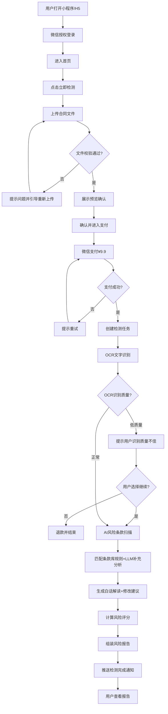
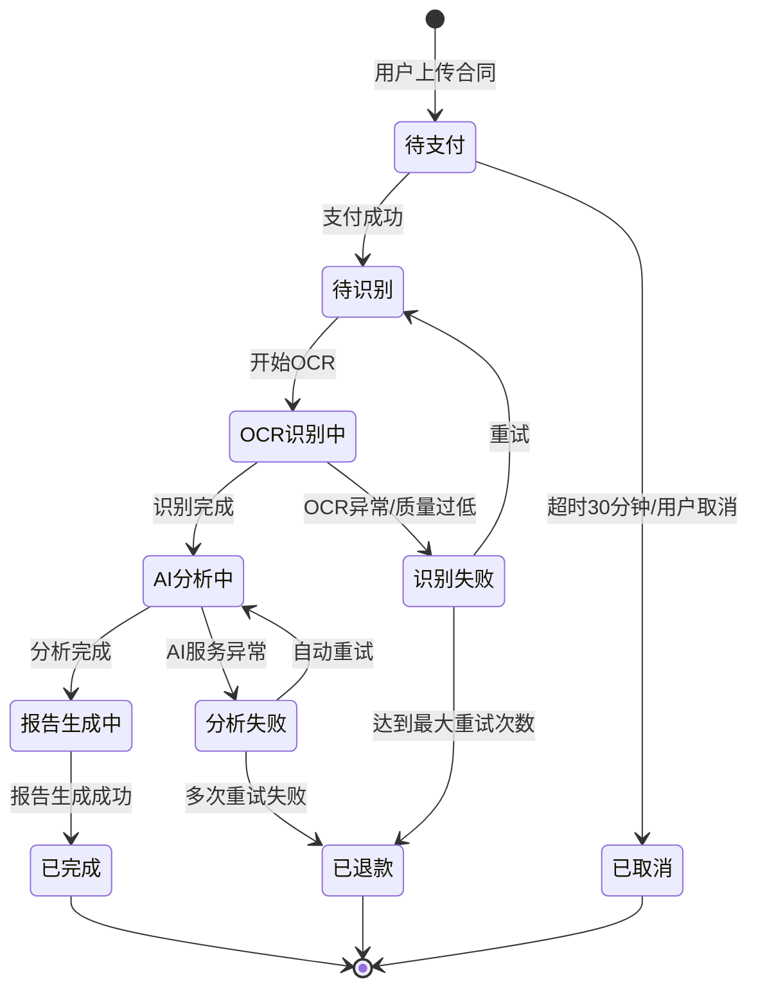

# AI租房合同风险检测助手 - 产品需求文档（PRD）

> 版本：V1.1 MVP（领域专家评审修订版）  
> 编写日期：2026-06-29  
> 修订日期：2026-06-29  
> 产品名称：AI租房合同风险检测助手  
> 产品定位：面向C端租房用户的AI合同风险检测工具（小程序/H5）  
> 关联需求文档：《AI租房合同风险检测助手 - 用户需求说明书》  
> 评审状态：✅ 领域专家评审通过（评分算法权重、AI幻觉控制、OCR预检阈值已确认）  

---

# 1. 产品概述

## 1.1 产品定位

AI租房合同风险检测助手是一款面向C端租房用户（尤其是首次租房的年轻租客）的智能合同审查工具。通过OCR文字识别+大语言模型技术，实现"拍照上传→AI自动扫描→风险标注→白话解读→修改建议→风险评分报告"的端到端检测链路，将传统律师审查合同500-2000元的成本降至¥9.9/份。

### 与 SKI-75 的差异定位

| 维度 | SKI-75（AI合同风险条款审查助手） | 本产品 |
|------|----------------------------------|--------|
| 目标用户 | B端小商户 | C端个人租客 |
| 合同类型 | 租赁/供应/加盟等商业合同 | 个人租房合同 |
| 定价策略 | 企业级定价 | ¥9.9/份（C端友好价） |
| 场景深度 | 通用商业合同 | 租房垂直场景专属风险条款库 |

## 1.2 核心价值主张

- **看得懂**：法律术语→白话解读，"这条对你意味着什么"
- **谈得拢**：提供可直接用于与房东/中介协商的修改话术
- **签得放心**：风险评分+签约前建议清单，签约前心中有数
- **花得少**：¥9.9/份，律师审查费用的1/50

## 1.3 MVP 范围界定

### 本期（MVP）包含

- **用户端小程序/H5**：合同上传 → OCR识别 → AI风险检测 → 支付 → 风险报告查看
- **运营管理后台（WEB端）**：数据概览、订单管理、条款库管理、用户管理

### 本期不包含（列入第二期）

- 月卡会员体系
- 合同模板库
- 历史记录与对比
- 人工律师快速咨询
- 城市级条款基准对比

---

# 2. 产品目标

## 2.1 MVP 成功指标

| 指标 | 目标值 | 说明 |
|------|--------|------|
| 单份合同检测时长 | < 60秒 | 含OCR+AI分析+报告生成 |
| 风险条款识别准确率 | > 85% | 基于运营人工抽检 |
| 用户付费转化率 | > 30% | 上传→支付转化 |
| 日检测量（上线30天） | ≥ 200份/天 | 自然流量 |
| 页面首屏加载 | < 2秒 | 95分位 |

## 2.2 分期规划

### 第一期（MVP，约10天）
核心检测链路闭环，验证商业模式。

### 第二期
- 月卡会员体系（¥29/月）
- 历史记录与合同对比
- 合同模板库
- 律师快速咨询对接
- 城市基准数据对比

### 第三期
- 租房全流程服务（看房→签约→入住→退租）
- 房东/中介端合规工具
- 租房平台API对接

---

# 3. 用户角色

## 3.1 普通用户（C端租客）

| 属性 | 描述 |
|------|------|
| 典型画像 | 应届毕业生、城市打工者、首次租房者 |
| 核心诉求 | 看懂合同风险、获取修改建议、避免被坑 |
| 付费意愿 | 单次≤¥10，对价格敏感 |
| 使用场景 | 签约前，拿到合同文本后（纸质拍照或电子版上传） |

## 3.2 平台运营人员

| 属性 | 描述 |
|------|------|
| 典型画像 | 运营团队成员，具备基础法律或房产知识 |
| 核心诉求 | 管理条款库、查看运营数据、处理异常订单 |
| 使用场景 | 日常运营、条款规则维护、用户投诉处理 |

---

# 4. 功能设计

## 4.1 用户端（小程序/H5）

### 4.1.1 首页

#### 功能说明
首页承担产品价值传递和检测入口引导的双重作用。

#### 页面元素

| 区域 | 元素 | 说明 |
|------|------|------|
| 顶部 | 产品Logo + 名称 | "AI租房合同风险检测助手" |
| 核心区 | 主视觉Banner | 传递"安全感、专业、值得信赖" |
| 核心区 | "立即检测"主按钮 | 醒目CTA按钮，跳转上传页 |
| 说明区 | 四步流程图 | 上传→识别→分析→报告，配图标 |
| 信任区 | 数据背书 | 已检测合同数、避免风险案例数（运营可配置） |
| 底部 | 免责声明入口 | "检测结果仅供参考，不构成法律意见" |

#### 交互规则
- 点击"立即检测"→跳转合同上传页
- 数据背书数据由运营后台配置，非硬编码

### 4.1.2 合同上传页

#### 功能说明
提供三种上传方式：拍照上传、相册选择、文件上传。

#### 上传方式

| 方式 | 支持格式 | 限制 | 优先级 |
|------|----------|------|--------|
| 拍照上传 | 图片（JPG/PNG） | 单页拍摄，支持多页连续拍 | P0 |
| 相册选择 | 图片（JPG/PNG） | 支持多选，最多20张 | P0 |
| 文件上传 | PDF/Word | 单文件≤20MB | P0 |

#### 上传校验规则

| 校验项 | 规则 | 失败提示 |
|--------|------|----------|
| 文件格式 | 仅接受 JPG/PNG/PDF/DOC/DOCX | "暂不支持该格式，请上传JPG/PNG/PDF/Word文件" |
| 文件大小 | 图片≤10MB，文档≤20MB | "文件过大，请压缩后重试" |
| 文件可读性 | OCR预检置信度分档处理（见下方规则） | 根据置信度档位给出不同提示 |

**OCR预检置信度分档处理规则：**

| 置信度档位 | 处理方式 | 用户提示 |
|-----------|---------|---------|
| ≥85% | 直接进入检测流程 | 无特殊提示 |
| 80-85% | 允许进入，加提示 | "识别质量一般，可能影响检测准确性，是否继续？" |
| 70-80% | 允许用户选择继续 | "合同内容清晰度较低，检测结果可能不准确。建议重新拍摄。如继续，部分条款可能无法识别。" |
| <70% | 拒绝进入检测 | "合同内容不够清晰，无法进行有效检测。请重新拍摄或上传更清晰的合同图片。" |
| 页数限制 | ≤30页 | "合同页数超出限制（最多30页）" |

#### 交互规则
- 上传完成后展示预览页，用户确认后进入支付
- 上传失败时保留已上传内容，提示重新上传问题页

### 4.1.3 支付页

#### 功能说明
展示价格信息，调用微信支付完成付款。

#### 页面元素

| 元素 | 说明 |
|------|------|
| 合同预览 | 展示合同名称/页数 |
| 价格信息 | "单次检测 ¥9.9" |
| 权益提示 | "开通月卡¥29/月，不限次数检测"（第二期上线后展示） |
| 支付方式 | 微信支付（默认） |
| 确认按钮 | "确认支付 ¥9.9" |

#### 交互规则
- 支付成功 → 自动进入检测流程，展示检测进度页
- 支付失败 → 提示"支付未完成"，保留订单30分钟，可重试
- 支付超时（30分钟未支付）→ 订单自动关闭，提示重新上传

### 4.1.4 检测进度页

#### 功能说明
展示检测实时进度，降低用户等待焦虑。

#### 进度阶段

| 阶段 | 动画/文案 | 预计时长 |
|------|-----------|----------|
| 上传完成 | "合同已收到，准备开始检测..." | 1-2秒 |
| OCR识别 | "正在识别合同文字..." | 5-15秒 |
| 风险扫描 | "AI正在逐条扫描条款..." | 20-40秒 |
| 报告生成 | "正在生成风险报告..." | 3-5秒 |
| 完成 | "检测完成！查看报告" | — |

#### 交互规则
- 每个阶段配进度条+动画
- 支持后台检测，用户可离开页面，完成后通过微信服务通知推送
- 检测失败时提示"检测异常，请联系客服或重新检测"，自动发起退款

### 4.1.5 风险报告页（核心页面）

#### 功能说明
展示合同整体风险评估结果和逐条风险条款详情。

#### 页面结构

**A. 整体评估区**

| 元素 | 说明 |
|------|------|
| 风险评分 | 百分制评分（如 75分），颜色随等级变化 |
| 风险等级 | 根据评分划分为：安全(≥85)/低风险(70-84)/中风险(50-69)/高风险(<50) |
| 签约建议 | "建议签约"/"谨慎签约"/"不建议签约" |
| 风险概览图 | 高危/中危/低危条款数量分布（环形图） |

**B. 风险条款详情区**

每条风险条款展示：

| 元素 | 说明 |
|------|------|
| 风险等级标签 | 高危（红色 #EF4444）/ 中危（橙色 #F97316）/ 低危（黄色 #EAB308） |
| 条款标题 | 如"押金退还条件"、"自动续约条款" |
| 原文摘录 | 合同中的原始条款文字，高亮标出 |
| 白话解读 | "这条对你意味着什么：..." 通俗语言解释 |
| 法条引用 | 引用的法律法规依据（如《民法典》第XXX条） |
| 置信度标注 | AI判断的置信度（如"置信度 92%"），低置信度时标注"建议咨询专业人士" |
| 修改建议 | "建议将XX修改为XX"，可直接复制用于协商 |

**C. 签约前建议清单**

| 元素 | 说明 |
|------|------|
| 行动清单 | 基于检测结果生成的可操作建议列表 |
| 优先级标注 | 按风险等级排序，高危优先 |
| 分享/导出 | 支持生成长图分享或导出PDF |

#### ⭐ 风险评分算法设计（PRD阶段明确）

**评分规则：**

```
总分 = 100 - Σ(风险条款扣分)

风险条款扣分 = 基础分 × 权重系数

基础分规则：
- 高危条款：20分/条
- 中危条款：8分/条
- 低危条款：3分/条

权重系数（基于条款类型）：
- 押金相关：1.25（涉及资金安全，权重最高）
- 违约金相关：1.05
- 续约/退租：1.0
- 维修责任：0.9
- 转租限制：0.8
- 其他：0.7

评分下限：0分（不出现负分）
```

**风险等级划分：**

| 评分区间 | 风险等级 | 签约建议 |
|----------|----------|----------|
| 85-100 | 安全 | 建议签约 |
| 70-84 | 低风险 | 建议签约，注意关注中低危条款 |
| 50-69 | 中风险 | 谨慎签约，建议先与房东协商修改高危条款 |
| 0-49 | 高风险 | 不建议签约，存在多项严重风险条款 |

**城市基准数据来源（列入第二期）：**
- MVP阶段：评分不依赖城市基准，仅基于条款库规则判定
- 第二期：运营后台维护各城市/各类型租房合同的常见条款基准数据，评分时加入"偏离基准"维度

#### ⭐ AI 幻觉控制机制（PRD阶段明确）

| 控制手段 | 说明 |
|----------|------|
| 法条引用强制 | AI生成的每条解读必须附带所引用的法律法规条文编号，无法引用时标注"无对应法条" |
| 置信度标注 | 每条风险识别结果附带置信度百分比，采用三级分级策略：<br>• **≥75%**：正常展示，标注置信度百分比<br>• **60-75%**：降级标注，显示"AI判断置信度中等，建议核实后采纳"<br>• **<60%**：仅标注"AI判断置信度较低，强烈建议咨询专业人士" |
| 原文锚定 | 白话解读必须关联合同原文片段，用户可查看AI解读对应的原始条款 |
| 免责声明 | 报告顶部和底部均展示"本报告中AI生成的解读和建议仅供参考，不构成法律意见。重要事项请咨询专业律师。" |
| AI内容标记 | 所有AI生成内容（解读、建议）均标注"AI生成"角标 |
| 条款库兜底 | 优先匹配运营维护的条款库规则，条款库未覆盖的场景才走LLM自由生成 |

### 4.1.6 个人中心

#### 功能说明
用户账号管理和订单记录。

#### 功能列表

| 功能 | 说明 | 优先级 |
|------|------|--------|
| 微信一键登录 | 通过微信OAuth授权登录 | P0 |
| 手机号绑定 | 绑定手机号接收报告通知 | P1 |
| 消费记录 | 查看历史支付记录 | P0 |
| 检测报告列表 | 查看已完成的检测报告 | P0 |
| 报告详情回看 | 重新查看历史报告 | P0 |
| 常见问题 | FAQ展示 | P1 |
| 意见反馈 | 提交反馈 | P2 |
| 联系客服 | 在线客服入口 | P2 |

## 4.2 运营管理后台（WEB端）

### 4.2.1 数据概览

#### 功能说明
运营人员查看平台核心运营数据。

#### 数据指标

| 指标 | 说明 |
|------|------|
| 今日新增用户 | 今日新注册用户数 |
| 今日检测次数 | 今日完成的检测数 |
| 今日收入 | 今日支付金额 |
| 累计用户数 | 平台总注册用户 |
| 累计检测数 | 平台总检测合同数 |
| 近7天/30天趋势图 | 核心指标趋势折线图 |
| 风险条款分布 | 近期检测中各类风险条款占比 |

### 4.2.2 订单管理

#### 功能说明
查看和管理所有检测订单。

#### 功能列表

| 功能 | 说明 |
|------|------|
| 订单列表 | 查询所有订单，支持时间/用户/状态筛选 |
| 订单详情 | 查看订单支付状态、关联检测报告 |
| 退款处理 | 对异常订单进行退款操作 |

#### 订单状态

| 状态 | 说明 |
|------|------|
| 待支付 | 用户已创建订单，尚未支付 |
| 已支付 | 支付成功，等待检测 |
| 检测中 | 正在进行OCR/AI分析 |
| 检测完成 | 报告已生成 |
| 检测异常 | 检测过程出错 |
| 已退款 | 已退款 |
| 已取消 | 用户取消或超时关闭 |

### 4.2.3 条款库管理（核心）

#### 功能说明
管理AI识别风险条款的规则库，是AI检测质量的核心。

#### 规则数据结构

| 字段 | 类型 | 说明 |
|------|------|------|
| 规则ID | string | 唯一标识 |
| 规则名称 | string | 如"押金不退条件" |
| 条款类型 | enum | 押金/违约金/维修责任/续约退租/转租限制/其他 |
| 风险等级 | enum | 高危/中危/低危 |
| 识别关键词 | array | 触发该规则的关键词/句式列表 |
| 识别描述 | text | AI匹配该条款时的判定标准说明 |
| 白话解读模板 | text | 通俗解读的话术模板 |
| 修改建议模板 | text | 推荐的修改建议话术 |
| 关联法条 | array | 引用的法律法规条文编号 |
| 权重系数 | number | 评分时的权重系数（默认按条款类型） |
| 状态 | enum | 启用/停用 |
| 创建时间 | datetime | 创建时间 |
| 更新时间 | datetime | 最后更新时间 |

#### 功能操作

| 功能 | 说明 |
|------|------|
| 规则列表 | 查看所有规则，支持按类型/等级/状态筛选 |
| 新增规则 | 创建新的风险条款识别规则 |
| 编辑规则 | 修改已有规则的各项配置 |
| 停用/启用 | 切换规则状态 |
| 删除规则 | 删除过时或错误的规则（软删除） |

### 4.2.4 用户管理

| 功能 | 说明 |
|------|------|
| 用户列表 | 查看所有注册用户 |
| 用户详情 | 查看用户基本信息、检测历史、消费记录 |
| 用户封禁 | 对违规用户进行封禁 |

### 4.2.5 报告管理

| 功能 | 说明 |
|------|------|
| 报告列表 | 查看所有已生成的风险检测报告 |
| 报告详情 | 查看报告完整内容 |
| 报告申诉处理 | 处理用户对检测结果的申诉 |

### 4.2.6 系统管理

| 功能 | 说明 |
|------|------|
| 管理员账号管理 | 管理后台账号和权限 |
| 价格配置 | 配置单次检测价格 |
| 支付配置 | 配置微信支付渠道参数 |
| 操作日志 | 管理员关键操作审计日志 |

---

# 5. 业务流程

## 5.1 核心检测流程



## 5.2 检测任务状态流转



---

# 6. UI原型

## 6.1 原型清单

| 原型 | 文件 | 说明 |
|------|------|------|
| 用户端小程序/H5 | `UI原型-用户端.html` | 包含首页、上传、支付、检测进度、风险报告、个人中心等核心页面 |
| 运营管理后台 | `UI原型-运营后台.html` | 包含数据概览、订单管理、条款库管理、用户管理等模块 |

## 6.2 设计规范

### 色彩系统

| 用途 | 色值 | 说明 |
|------|------|------|
| 主色 | #2563EB | 信任蓝，传递专业感 |
| 辅色 | #10B981 | 安全绿，传递安全感 |
| 高危 | #EF4444 | 红色 |
| 中危 | #F97316 | 橙色 |
| 低危 | #EAB308 | 黄色 |
| 安全 | #22C55E | 绿色 |
| 背景 | #F8FAFC | 浅灰白 |
| 文字主色 | #1E293B | 深色 |
| 文字辅色 | #64748B | 中灰 |

### 设计原则

1. **安全感优先**：风险等级使用颜色+图标+文字三重标注，确保信息传达无歧义
2. **层次分明**：报告页突出风险评分和等级，条款详情折叠展开
3. **温度感**：在白话解读区域使用温暖色调和图标，降低用户面对风险条款时的焦虑
4. **响应式**：用户端适配320px-428px宽度，后台适配≥1280px

---

# 7. 非功能需求

## 7.1 性能需求

| 指标 | 要求 |
|------|------|
| 页面首屏加载 | < 2秒（95分位） |
| OCR识别 | 单页 < 5秒 |
| 完整检测（10页以内） | < 60秒 |
| 报告渲染 | < 3秒 |
| 并发能力 | 支持100份合同同时在线检测 |
| 系统容量 | 支持10万注册用户，1万日活 |

## 7.2 安全与合规

| 要求 | 说明 |
|------|------|
| 法律免责声明 | 产品必须明确声明"检测结果仅供参考，不构成法律意见" |
| 数据安全 | 用户上传合同加密存储，用户可随时删除 |
| 支付安全 | 使用微信支付官方SDK，不保存敏感支付信息 |
| 隐私保护 | 遵守《个人信息保护法》，不将合同数据用于训练模型 |
| AI内容标记 | AI生成内容需标注"AI生成内容" |

## 7.3 兼容性

| 端 | 要求 |
|-----|------|
| 用户端 | 微信小程序（主推）+ H5，微信7.0+ |
| 后台 | Chrome/Edge/Safari/Firefox 最新两个大版本 |

---

# 8. 接口需求

## 8.1 核心接口清单

| 模块 | 接口 | 说明 |
|------|------|------|
| 用户认证 | 微信登录 | OAuth授权获取用户信息 |
| 文件服务 | 文件上传/下载/删除 | 合同文件管理 |
| OCR服务 | 文字识别/表格识别 | 合同文字提取 |
| AI分析 | 风险条款识别/白话解读/修改建议/风险评分 | 核心AI能力 |
| 支付服务 | 创建订单/支付回调/状态查询/退款 | 微信支付 |
| 通知服务 | 微信模板消息 | 检测完成通知 |
| 运营后台 | 数据统计/条款库管理/订单管理/用户管理 | 后台API |

---

# 9. 数据模型（核心实体）

## 9.1 用户（User）

| 字段 | 类型 | 说明 |
|------|------|------|
| id | string | 用户ID |
| openid | string | 微信OpenID |
| unionid | string | 微信UnionID |
| nickname | string | 昵称 |
| avatar | string | 头像URL |
| phone | string | 手机号（可选） |
| created_at | datetime | 注册时间 |
| status | enum | 正常/封禁 |

## 9.2 订单（Order）

| 字段 | 类型 | 说明 |
|------|------|------|
| id | string | 订单ID |
| user_id | string | 用户ID |
| amount | number | 支付金额（分） |
| status | enum | 待支付/已支付/检测中/检测完成/检测异常/已退款/已取消 |
| payment_id | string | 微信支付订单号 |
| report_id | string | 关联报告ID |
| created_at | datetime | 创建时间 |
| paid_at | datetime | 支付时间 |

## 9.3 检测任务（DetectionTask）

| 字段 | 类型 | 说明 |
|------|------|------|
| id | string | 任务ID |
| order_id | string | 关联订单ID |
| user_id | string | 用户ID |
| file_urls | array | 上传文件URL列表 |
| ocr_text | text | OCR识别全文 |
| status | enum | 待识别/OCR识别中/AI分析中/报告生成中/已完成/识别失败/分析失败 |
| retry_count | number | 重试次数 |
| created_at | datetime | 创建时间 |
| completed_at | datetime | 完成时间 |

## 9.4 风险报告（RiskReport）

| 字段 | 类型 | 说明 |
|------|------|------|
| id | string | 报告ID |
| task_id | string | 关联任务ID |
| score | number | 风险评分（0-100） |
| risk_level | enum | 安全/低风险/中风险/高风险 |
| suggestion | enum | 建议签约/谨慎签约/不建议签约 |
| risk_items | json | 风险条款列表（含原文、解读、建议、等级、置信度、法条引用） |
| checklist | json | 签约前建议清单 |
| created_at | datetime | 生成时间 |

## 9.5 条款库规则（RiskRule）

| 字段 | 类型 | 说明 |
|------|------|------|
| id | string | 规则ID |
| name | string | 规则名称 |
| category | enum | 押金/违约金/维修责任/续约退租/转租限制/其他 |
| risk_level | enum | 高危/中危/低危 |
| keywords | array | 识别关键词 |
| description | text | 识别标准说明 |
| interpretation | text | 白话解读模板 |
| suggestion | text | 修改建议模板 |
| legal_refs | array | 关联法条 |
| weight | number | 权重系数 |
| status | enum | 启用/停用 |
| created_at | datetime | 创建时间 |
| updated_at | datetime | 更新时间 |

---

# 10. 开放问题与决策记录

| 编号 | 问题 | 建议方案 | 状态 |
|------|------|----------|------|
| Q1 | 风险评分算法的权重分配是否合理？ | 见4.1.5节评分规则，押金1.25/违约金1.05 | ✅ 已确认（领域专家评审通过） |
| Q2 | 城市基准数据在MVP阶段是否需要？ | MVP不依赖城市基准，第二期引入 | ✅ 已确认 |
| Q3 | AI幻觉控制的具体实现方案？ | 见4.1.5节控制机制，75%主阈值+三级分级策略 | ✅ 已确认（领域专家评审通过） |
| Q4 | OCR识别质量阈值如何设定？ | 80%主阈值+四档分档处理策略 | ✅ 已确认（领域专家评审通过） |

---

# 11. 附录

## 11.1 风险条款类型示例（条款库初始规则示例）

| 条款类型 | 风险等级 | 典型风险场景 |
|----------|----------|--------------|
| 押金退还 | 高危 | "合同期满房屋设施无损后30个工作日内退还押金"（延迟退还）；"押金不予退还"的条件过于宽泛 |
| 违约金 | 高危 | "提前退租需支付3个月租金作为违约金"（过高违约金） |
| 自动续约 | 中危 | "合同到期未书面通知不续约则自动续约一年"（静默续约陷阱） |
| 维修责任 | 中危 | "房屋内一切设施维修由承租方负责"（维修责任全部转嫁） |
| 转租限制 | 低危 | "严禁转租"（合法但需告知用户） |
| 涨租条款 | 中危 | "房东有权根据市场情况调整租金"（无约束涨租权） |
| 检查权 | 低危 | "房东有权随时进入房屋检查"（无提前通知要求） |
| 免责条款 | 高危 | "因房屋质量问题造成承租方损失，出租方不承担责任"（完全免责） |

## 11.2 关联文档

- 需求文档：《AI租房合同风险检测助手 - 用户需求说明书》
- UI原型（用户端）：`UI原型-用户端.html`
- UI原型（运营后台）：`UI原型-运营后台.html`

---

**文档说明**：本PRD基于"优特云-用户语言"五层架构模板规范编写，聚焦MVP核心链路"上传→识别→报告"的产品设计。会员体系、律师咨询、城市基准对比等功能列入第二期。文档可作为开发、测试、验收的依据。
