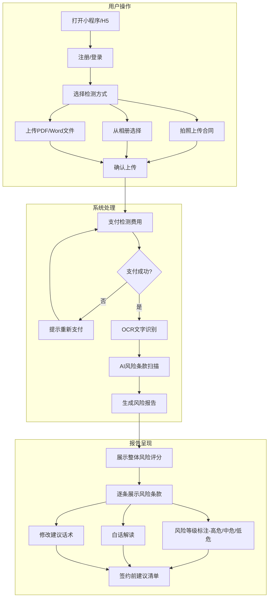
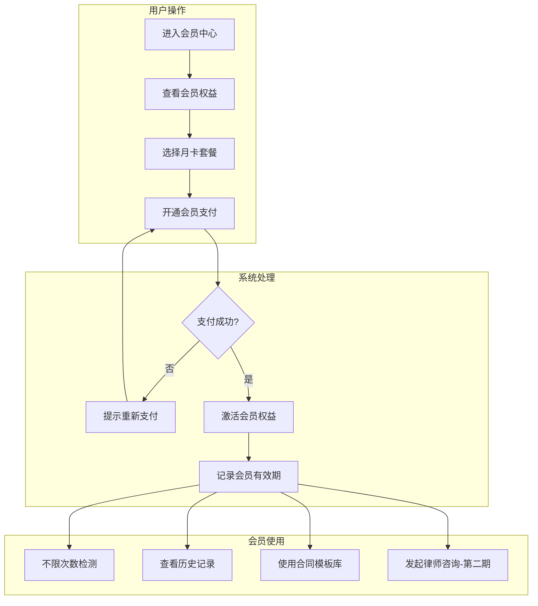
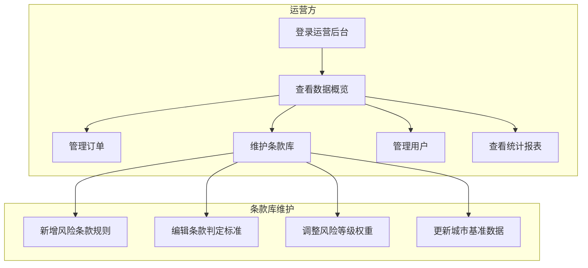
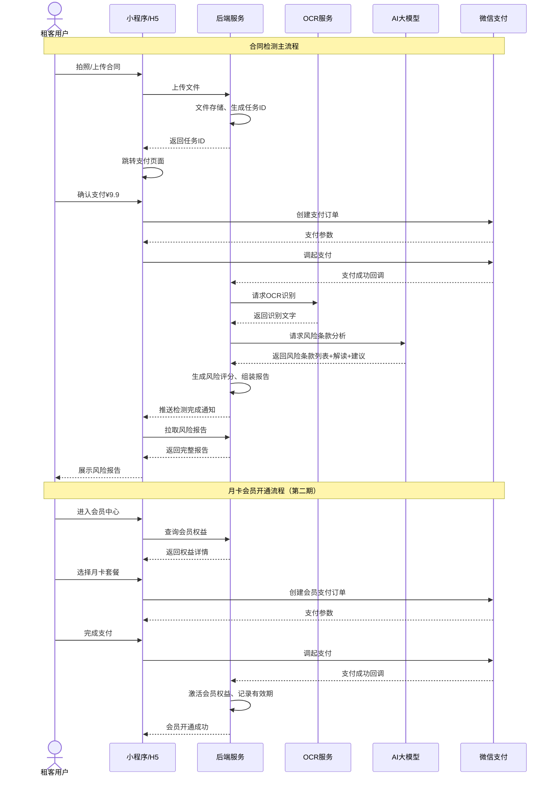
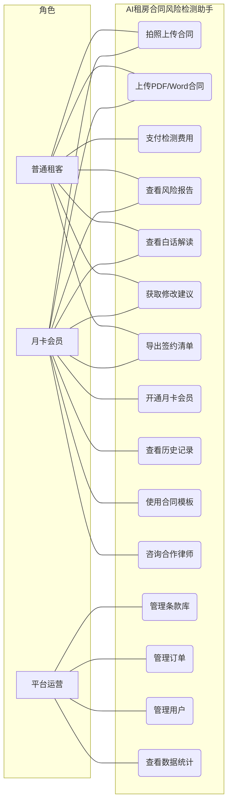
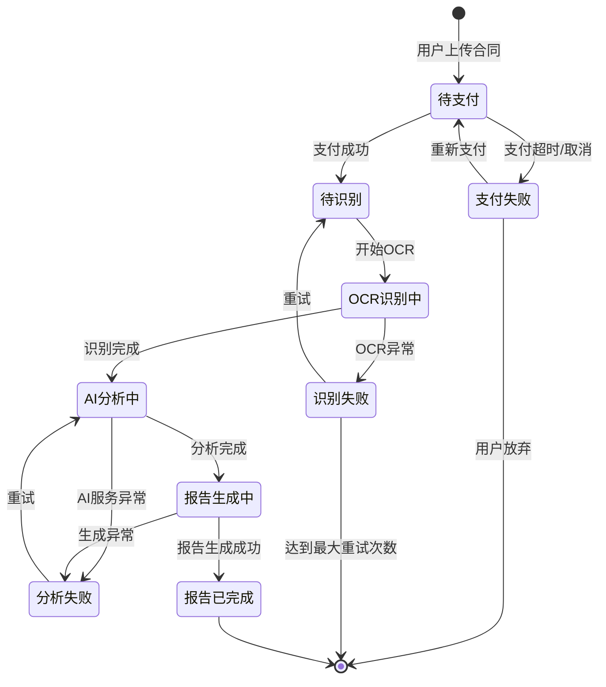
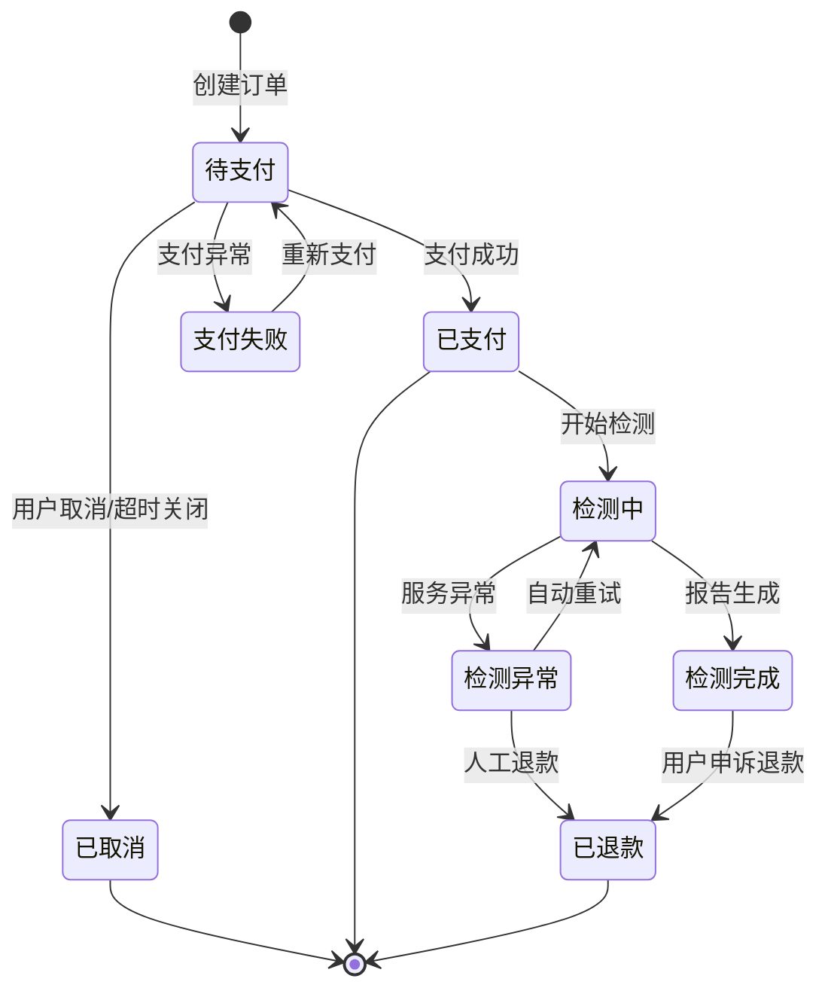
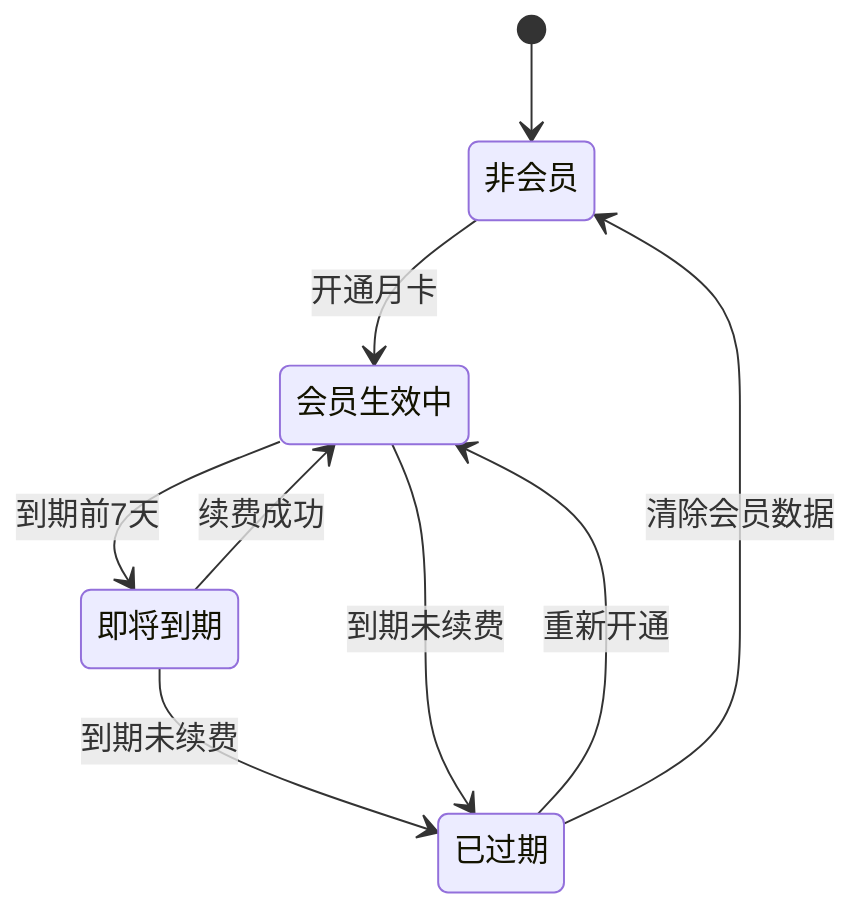

# AI租房合同风险检测助手 - 用户需求说明书

# 1.需求概述

AI租房合同风险检测助手是一款面向C端租房用户的智能合同审查工具，通过OCR文字识别与大语言模型技术，帮助用户在签约前快速识别租房合同中的风险条款，以通俗易懂的语言解读法律术语，并提供可操作的修改建议，让非法律专业的租客也能"看得懂、谈得拢、签得放心"。

## 1.1 需求介绍

每年有数百万年轻人首次踏入租房市场，面对房东或中介提供的租房合同，往往因缺乏法律知识和审查经验而处于信息弱势地位。常见的痛点包括：

1. **看不懂法律术语**：合同中的"不可抗力""违约金""自动续约"等法律条款对非专业人士而言晦涩难懂
2. **识别不出风险条款**：押金不退条件、高额违约金、维修责任转嫁、转租禁止等不公平条款容易被忽视
3. **请律师成本高**：请律师审查一份合同需500-2000元，对普通租客而言性价比过低
4. **缺乏谈判参考**：即使感觉到某些条款不合理，也不知道如何与房东/中介协商修改

AI租房合同风险检测助手通过"拍照上传→AI自动扫描→风险标注→白话解读→修改建议"的极简流程，将合同审查成本从数百元降至10元以内，让每一个租客都能拥有"随身法律顾问"。

### 1.1.1 所属领域

法律科技（Legal Tech）、住房租赁、消费者保护

### 1.1.2 核心价值

- **对租客用户**：以极低成本（¥9.9/份）获得专业级合同风险审查，避免被不公平条款"坑害"，保护自身合法权益
- **对月卡用户**：不限次数检测+历史记录+合同模板库+律师快速咨询，适合频繁换租或从事转租业务的用户
- **对平台**：通过按次付费+会员订阅的双轨商业模式获取收入，积累租房合同风险条款数据库形成壁垒

### 1.1.3 与同类产品差异说明

本产品与已有的"AI合同风险条款审查助手（SKI-75）"定位不同：
- SKI-75面向B端小商户（租赁/供应/加盟合同），本产品面向C端个人租客
- 本产品聚焦"租房合同"单一垂直场景，风险条款库更精准
- 定价策略面向个人用户（¥9.9/份 vs 企业级定价）

## 1.2 需求目标

### 1.2.1 第一期目标（MVP，约10天）

完成核心检测功能：

- 用户端小程序/H5（合同上传+OCR识别+AI风险检测+报告查看+支付）
- 运营管理后台-WEB端（订单管理+条款库管理+基础数据统计）

### 1.2.2 第二期目标

扩展用户功能与运营能力：

- 月卡会员体系
- 合同模板库
- 历史记录与对比
- 人工律师快速咨询对接
- 城市级条款基准对比

### 1.2.3 第三期目标

生态化运营：

- 租房全流程服务（看房清单→合同检测→入住交接→退租维权指引）
- 房东/中介端（合规合同生成、信用评级）
- 与租房平台API对接

## 1.3 系统使用角色

1. **普通用户（租客）**：首次租房或经常租房的个人用户，上传合同进行单次风险检测，按次付费
2. **月卡会员用户**：高频租房用户或从事转租业务者，享受不限次检测、历史记录、模板库、律师咨询等权益
3. **平台运营方**：负责条款库维护、订单管理、用户管理、数据统计、内容审核
4. **合作律师（第二期）**：接收用户律师咨询请求，提供专业法律意见

## 1.4 业务流程图

### 1.4.1 核心检测业务流程

### 1.4.2 会员订阅业务流程

### 1.4.3 运营管理业务流程

# 2.功能原型

| 原型名称 | 原型链接 | 对应端 | 备注 |
| --- | --- | --- | --- |
| 用户端小程序/H5 | 待PRD阶段产出 | 小程序端/H5端 | V1.0 MVP |
| 运营管理后台 | 待PRD阶段产出 | WEB端 | V1.0 MVP |

# 3.需求清单

## 3.1 用户端-小程序/H5端

| 模块 | 一级功能 | 二级功能 | 功能描述 | 优先级 | 备注 |
| --- | --- | --- | --- | --- | --- |
| 首页 | 入口展示 | 产品价值说明 | 以简明图文介绍产品核心价值：拍照即检测、AI识别风险、白话解读条款 | P0 | |
| | | 快速开始检测入口 | 醒目的"立即检测"按钮，引导用户上传合同 | P0 | |
| | | 检测流程说明 | 用步骤图展示"上传→识别→分析→报告"四步流程 | P1 | |
| | | 用户案例展示 | 展示已检测合同数量、避免的风险案例数等信任背书数据 | P1 | |
| 合同上传 | 文件上传 | 拍照上传 | 调用摄像头拍摄合同页面，支持多页连续拍摄 | P0 | |
| | | 相册选择 | 从手机相册选择合同照片（支持多选） | P0 | |
| | | 文件上传 | 支持上传PDF、Word格式的电子版合同 | P0 | |
| | | 文件预览 | 上传后展示文件预览，确认内容清晰可读 | P1 | |
| | | 上传校验 | 检查文件完整性、可读性，提示模糊/缺页等问题 | P0 | |
| 支付 | 按次付费 | 单次检测支付 | 展示¥9.9/次的价格，调用微信支付完成付款 | P0 | |
| | 会员开通 | 月卡支付 | 展示¥29/月会员权益，调用微信支付完成订阅 | P1 | 第二期 |
| | | 支付结果 | 展示支付成功/失败结果，失败时引导重试 | P0 | |
| | 会员权益 | 会员状态展示 | 展示会员有效期、剩余权益、使用次数统计 | P1 | 第二期 |
| AI检测 | OCR识别 | 文字提取 | 将上传的合同图片/PDF转换为结构化文字内容 | P0 | |
| | | 识别质量提示 | 识别完成后告知用户识别成功率，低质量时提示重新上传 | P0 | |
| | 风险扫描 | 风险条款识别 | AI逐条扫描合同内容，识别押金、违约金、维修责任、续约等风险条款 | P0 | |
| | | 风险等级标注 | 对每个识别出的风险条款标注等级：高危（红色）/中危（橙色）/低危（黄色） | P0 | |
| | | 条款定位 | 在原文中高亮标出风险条款所在位置 | P0 | |
| 风险报告 | 整体评估 | 风险评分 | 以百分制分数展示合同整体风险水平（如：75分-中等风险） | P0 | |
| | | 风险概览 | 以图表形式展示高危/中危/低危条款数量分布 | P0 | |
| | | 签约建议 | 给出"建议签约""谨慎签约""不建议签约"的整体结论 | P0 | |
| | 条款详情 | 风险条款列表 | 逐条展示每个风险条款的原文摘录 | P0 | |
| | | 白话解读 | 对每个风险条款以通俗语言解释"这条对你意味着什么" | P0 | |
| | | 修改建议 | 提供具体的修改话术（如"建议将XX条款修改为XX"），方便用户与房东协商 | P0 | |
| | | 法条引用 | 展示该条款涉及的法律法规依据（如《民法典》相关条款） | P1 | |
| | 签约清单 | 签约前建议清单 | 基于检测结果生成可操作的签约前行动清单 | P0 | |
| | | 清单分享/导出 | 支持将清单以图片或PDF形式分享给朋友或导出保存 | P1 | |
| | | 城市基准对比 | 对比同城市/同类型租房合同的常见条款基准（第二期） | P2 | 第二期 |
| 历史记录 | 检测记录 | 历史报告列表 | 展示用户过往的检测记录，按时间排序 | P1 | 第二期/会员功能 |
| | | 报告详情回看 | 支持回看历史报告的完整内容 | P1 | 第二期/会员功能 |
| | | 合同对比 | 支持对比同一房源不同版本的合同差异 | P2 | 第二期 |
| 合同模板 | 模板浏览 | 标准合同模板 | 提供住建部门推荐的标准租房合同模板 | P1 | 第二期/会员功能 |
| | | 模板下载 | 支持下载模板用于线下签约参考 | P1 | 第二期/会员功能 |
| 个人中心 | 账号管理 | 微信一键登录 | 通过微信授权快速登录 | P0 | |
| | | 手机号绑定 | 绑定手机号用于接收报告通知 | P1 | |
| | | 个人信息 | 管理昵称、头像等基本信息 | P2 | |
| | 订单管理 | 消费记录 | 查看历史支付记录和检测次数 | P0 | |
| | | 发票申请 | 支持申请电子发票 | P2 | |
| | 消息通知 | 检测进度通知 | 检测完成时通过微信服务通知推送结果 | P1 | |
| | | 会员到期提醒 | 会员即将到期时提醒续费 | P2 | 第二期 |
| | 帮助支持 | 常见问题 | 展示FAQ和使用指南 | P1 | |
| | | 意见反馈 | 用户可提交使用反馈和问题 | P2 | |
| | | 联系客服 | 提供在线客服入口 | P2 | |

## 3.2 运营管理后台-WEB端

| 模块 | 一级功能 | 二级功能 | 功能描述 | 优先级 | 备注 |
| --- | --- | --- | --- | --- | --- |
| 数据概览 | 核心指标 | 今日数据 | 展示今日新增用户、检测次数、收入金额等核心数据 | P0 | |
| | | 趋势图表 | 展示近7天/30天的关键指标趋势 | P1 | |
| | | 风险分布 | 展示近期检测合同中各类风险条款的分布情况 | P1 | |
| 订单管理 | 订单查询 | 订单列表 | 查询所有检测订单，支持按时间、用户、状态筛选 | P0 | |
| | | 订单详情 | 查看订单详细信息，包括支付状态、关联报告 | P0 | |
| | | 退款处理 | 对异常订单进行退款操作 | P1 | |
| 会员管理 | 会员列表 | 会员查询 | 查询所有会员用户，展示会员状态、到期时间 | P1 | 第二期 |
| | | 会员权益调整 | 手动调整会员权益（如延期、补偿） | P1 | 第二期 |
| 用户管理 | 用户列表 | 用户查询 | 查询所有注册用户，展示基本信息和使用记录 | P0 | |
| | | 用户详情 | 查看用户详细信息、检测历史、消费记录 | P0 | |
| | | 用户封禁 | 对违规用户进行封禁处理 | P1 | |
| 条款库管理 | 风险条款规则 | 规则列表 | 查看当前所有风险条款识别规则 | P0 | |
| | | 新增规则 | 新增风险条款识别规则（如"自动续约条款"的识别条件和风险等级） | P0 | |
| | | 编辑规则 | 修改已有规则的识别条件、风险等级、解读话术、修改建议 | P0 | |
| | | 删除/停用规则 | 对过时或错误的规则进行删除或停用 | P1 | |
| | 城市基准数据 | 基准数据维护 | 维护各城市不同类型租房合同的条款基准数据 | P2 | 第二期 |
| 报告管理 | 报告查询 | 报告列表 | 查询所有已生成的风险检测报告 | P0 | |
| | | 报告详情 | 查看报告完整内容，包括原文、识别结果、评分 | P0 | |
| | | 报告申诉处理 | 处理用户对检测结果的申诉 | P1 | |
| 内容管理 | 公告管理 | 公告发布 | 发布平台公告、活动信息 | P1 | |
| | | FAQ管理 | 维护常见问题与解答 | P1 | |
| 系统管理 | 账号管理 | 管理员账号 | 管理运营后台的管理员账号和权限 | P0 | |
| | | 操作日志 | 记录管理员的关键操作日志 | P1 | |
| | 系统配置 | 价格配置 | 配置单次检测价格、会员价格 | P0 | |
| | | 支付配置 | 配置支付渠道参数 | P0 | |

# 4.非功能需求

## 4.1 使用界面需求

| 需求项 | 详细描述 | 备注 |
| --- | --- | --- |
| 设计风格 | 以"安全感""专业""值得信赖"为核心调性，采用蓝绿色系传递法律专业感，辅以温暖色调降低用户焦虑 | P0 |
| 主色调 | 主色#2563EB（信任蓝），辅助色#10B981（安全绿），警示色按风险等级（红#EF4444/橙#F97316/黄#EAB308） | P0 |
| 信息层次 | 风险报告必须突出风险等级，使用颜色+图标+文字三重标注，确保用户一眼识别高危条款 | P0 |
| 响应式设计 | 小程序/H5端适配主流手机屏幕（320px-428px宽度），后台适配1280px及以上屏幕 | P0 |
| 加载体验 | 检测过程展示进度动画（"正在识别文字""正在分析条款""正在生成报告"），降低等待焦虑 | P1 |
| 无障碍 | 关键信息不仅依赖颜色区分，同时使用图标和文字说明，照顾色弱用户 | P1 |

## 4.2 软硬件环境需求

| 需求项 | 详细描述 | 备注 |
| --- | --- | --- |
| 客户端环境（用户端） | 微信小程序（主推），同时支持H5（覆盖非微信场景） | P0 |
| 微信版本 | 微信7.0及以上版本 | P0 |
| 客户端环境（后台） | 主流浏览器：Chrome、Edge、Safari、Firefox最新两个大版本 | P0 |
| 后端环境 | 云服务部署，支持弹性扩缩容 | P0 |
| OCR服务 | 接入成熟的OCR文字识别服务（如腾讯云OCR、百度云OCR） | P0 |
| LLM服务 | 接入大语言模型服务用于风险条款识别与白话解读 | P0 |

## 4.3 性能需求

| 需求项 | 详细描述 | 备注 |
| --- | --- | --- |
| 页面加载 | 95%的页面首屏加载 < 2秒 | P0 |
| OCR识别 | 单页合同OCR识别 < 5秒 | P0 |
| AI检测 | 单份合同（10页以内）完整检测 < 60秒 | P0 |
| 报告生成 | 检测报告渲染完成 < 3秒 | P0 |
| 并发能力 | 支持同时100份合同在线检测 | P0 |
| 系统容量 | 支持10万注册用户，1万日活 | P1 |

## 4.4 约束性需求

| 需求项 | 详细描述 | 备注 |
| --- | --- | --- |
| 法律免责声明 | 产品必须明确声明"检测结果仅供参考，不构成法律意见"，不替代专业律师服务 | P0 |
| 数据安全 | 用户上传的合同文件属于敏感信息，必须加密存储，用户可随时删除自己的数据 | P0 |
| 支付渠道 | 必须使用微信支付官方SDK，平台不保存用户敏感支付信息 | P0 |
| 隐私保护 | 严格遵守《个人信息保护法》，不将用户合同数据用于训练模型或第三方共享 | P0 |
| AI生成内容 | AI生成的解读和建议需标注"AI生成内容"，提示用户核实重要信息 | P0 |
| 后台服务 | 是，需要后台服务来支撑OCR识别、AI分析、支付、用户管理等核心功能 | P0 |
| 内容审核 | 后台需具备条款库内容审核能力，确保AI识别规则的准确性和合规性 | P0 |

# 5.接口需求

## 5.2 软件接口需求

| 模块 | 接口名称 | 输入 | 输出 | 功能描述 |
| --- | --- | --- | --- | --- |
| 用户认证 | 微信登录 | 微信Code | 用户信息、Token | 通过微信OAuth获取用户信息完成登录 |
| | 手机号绑定 | 微信手机号授权/验证码 | 绑定结果 | 绑定用户手机号 |
| 文件服务 | 文件上传 | 合同文件（图片/PDF/Word） | 文件URL、文件ID | 上传合同文件到云端存储 |
| | 文件下载 | 文件ID | 文件流 | 下载合同文件或报告 |
| | 文件删除 | 文件ID | 删除结果 | 用户删除自己的合同文件 |
| OCR服务 | 文字识别 | 图片/PDF文件 | 识别文字、置信度、坐标 | 将合同图片/PDF转换为结构化文字 |
| | 表格识别 | 含表格的图片 | 表格结构化数据 | 识别合同中的表格内容 |
| AI分析服务 | 风险条款识别 | 合同全文文字 | 风险条款列表、条款位置、风险等级 | AI扫描合同识别风险条款 |
| | 白话解读生成 | 风险条款原文 | 通俗解读文本 | 将法律术语翻译为通俗语言 |
| | 修改建议生成 | 风险条款及上下文 | 修改建议话术 | 生成可直接用于协商的修改建议 |
| | 风险评分 | 风险条款列表及等级 | 综合评分、风险等级分布 | 计算合同整体风险评分 |
| 支付服务 | 创建支付订单 | 订单信息、金额 | 支付参数 | 创建微信支付订单 |
| | 支付回调 | 支付结果通知 | 回调确认 | 处理微信支付结果通知 |
| | 支付状态查询 | 订单ID | 支付状态 | 查询订单支付状态 |
| | 退款 | 订单ID、退款金额 | 退款结果 | 对异常订单进行退款 |
| 会员服务 | 会员开通 | 用户ID、套餐类型 | 开通结果 | 开通月卡会员 |
| | 会员状态查询 | 用户ID | 会员信息、到期时间 | 查询用户会员状态 |
| | 权益校验 | 用户ID、功能标识 | 是否有权限 | 校验用户是否享有某项功能权限 |
| 通知服务 | 微信模板消息 | 用户OpenID、消息模板 | 发送结果 | 向用户推送检测完成、会员到期等通知 |
| 运营后台 | 数据统计 | 时间范围、筛选条件 | 统计数据 | 提供运营数据查询接口 |
| | 条款库管理 | 规则数据 | 管理结果 | 条款库规则的增删改查 |
| | 订单管理 | 查询条件、操作指令 | 订单数据、操作结果 | 订单查询与处理 |
| | 用户管理 | 查询条件、操作指令 | 用户数据、操作结果 | 用户查询与管理 |

# 6. 附录

## 流程图

详见1.4章节业务流程图

## 时序图

## （用户与系统交互）用例图

## （系统）状态图

### 检测任务生命周期状态图

### 订单生命周期状态图

### 会员状态图

---
**文档说明**: 本需求说明书基于"优特云-用户语言"五层架构模板规范编写，聚焦C端租客在租房签约场景下的合同风险审查需求，涵盖MVP核心功能和二期扩展规划，可作为后续PRD编写、产品设计、开发测试的依据。
