# 个人项目成本核算器V1.0 - 产品需求文档（PRD）

---

## 变更历史

| 版本号 | 变更日期 | 变更内容 | 变更人 | 审核人 |
| --- | --- | --- | --- | --- |
| V1.0 | 2026-06-29 | 初始版本创建 | 产品文档结对写作专家 | 阶段一产品落地页文档总编辑 |

---

# 1 概述

## 1.1 需求背景

随着"副业经济"和"数字游民"趋势的持续增长，2026年独立开发者、自由职业者及小型工作室群体规模日益壮大。这一群体面临一个普遍痛点：**不清楚自己每个项目的真实时薪和利润**。

现有市场上的解决方案存在明显断层：
- **时间追踪工具**（如Toggl、Clockify）：仅关注"时间花了多少"，不做成本核算
- **财务软件**（如QuickBooks）：功能过于重量级，不适合个人/小团队使用
- **项目管理工具**（如Jira、Asana）：聚焦任务管理，缺乏收益维度分析

**业务价值**：本产品填补"轻量级项目成本核算"的市场空白，帮助用户从"时间记录"升级到"时间价值分析"，做出更明智的接单决策。

**预期目标**：
- MVP阶段（V1.0）：7-10天完成核心功能开发，覆盖计时、成本核算、基础报表
- 上线3个月内获取1000+活跃用户
- Pro版转化率达到5%以上

## 1.2 名词解释

| **名词** | **说明** |
| --- | --- |
| 毛利润 | 项目总收入减去所有可记录成本（外包费、工具费等），不含时间成本 |
| 实际时薪 | 毛利润 ÷ 总投入工时，反映用户每小时真实收益 |
| 利润率 | 毛利润 ÷ 总收入 × 100%，反映项目盈利水平 |
| 活跃项目 | 状态为"进行中"或"已暂停"的项目，免费版限制3个 |
| 成本项 | 为项目发生的各类支出，如外包费、软件订阅费、差旅费等 |
| 工时记录 | 一条时间记录，包含起止时间、时长、关联项目、任务类型 |
| 云同步 | Pro功能，将本地数据同步至云端，支持多设备访问 |

## 1.3 产品介绍

个人项目成本核算器是一款面向独立开发者、自由职业者及小型工作室的轻量效率工具，以"项目"为核心维度，帮助用户追踪工作时长、核算项目成本与收益，清晰掌握每个项目的真实回报率。

产品核心理念：**"时间值多少钱"**——不仅仅是记录时间，而是将时间投入与收入挂钩，让每一分钟的付出都有清晰的价值回报。

### 1.3.1 范围说明

| 项 | 内容 |
| --- | --- |
| 包含功能 | 账户与订阅管理、项目管理（创建/编辑/删除/筛选）、计时器（内置计时/手动补录）、成本核算（毛利润/实际时薪/利润率/成本构成）、报表与可视化（项目报表/汇总报表/多项目对比/数据导出）、客户管理（Pro）、数据与同步（本地存储/云同步/多币种） |
| 不包含功能 | 团队协作功能（多人共享项目）、发票管理、税务计算、移动端APP（V1.1规划） |

---

# 2 产品设计

## 2.1 系统架构图

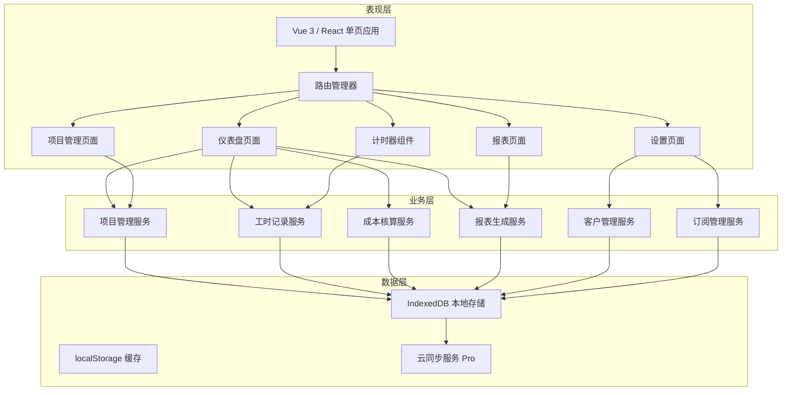
```mermaid
graph TD
    subgraph 表现层
        A[Vue 3 / React 单页应用]
        A --> B[路由管理器]
        B --> C[仪表盘页面]
        B --> D[项目管理页面]
        B --> E[计时器组件]
        B --> F[报表页面]
        B --> G[设置页面]
    end

    subgraph 业务层
        H[项目管理服务]
        I[工时记录服务]
        J[成本核算服务]
        K[报表生成服务]
        L[客户管理服务]
        M[订阅管理服务]
    end

    subgraph 数据层
        N[IndexedDB 本地存储]
        O[localStorage 缓存]
        P[云同步服务 Pro]
    end

    C --> H
    C --> I
    C --> J
    C --> K
    D --> H
    E --> I
    F --> K
    G --> L
    G --> M

    H --> N
    I --> N
    J --> N
    K --> N
    L --> N
    M --> N
    N --> P
```

## 2.2 业务模块图

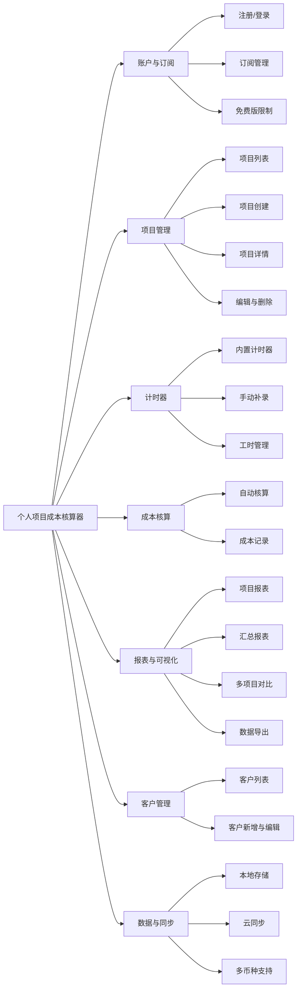
```mermaid
flowchart LR
    Core[个人项目成本核算器] --> M1[账户与订阅]
    Core --> M2[项目管理]
    Core --> M3[计时器]
    Core --> M4[成本核算]
    Core --> M5[报表与可视化]
    Core --> M6[客户管理]
    Core --> M7[数据与同步]

    M1 --> M1a[注册/登录]
    M1 --> M1b[订阅管理]
    M1 --> M1c[免费版限制]

    M2 --> M2a[项目列表]
    M2 --> M2b[项目创建]
    M2 --> M2c[项目详情]
    M2 --> M2d[编辑与删除]

    M3 --> M3a[内置计时器]
    M3 --> M3b[手动补录]
    M3 --> M3c[工时管理]

    M4 --> M4a[自动核算]
    M4 --> M4b[成本记录]

    M5 --> M5a[项目报表]
    M5 --> M5b[汇总报表]
    M5 --> M5c[多项目对比]
    M5 --> M5d[数据导出]

    M6 --> M6a[客户列表]
    M6 --> M6b[客户新增与编辑]

    M7 --> M7a[本地存储]
    M7 --> M7b[云同步]
    M7 --> M7c[多币种支持]
```

## 2.3 主业务流程

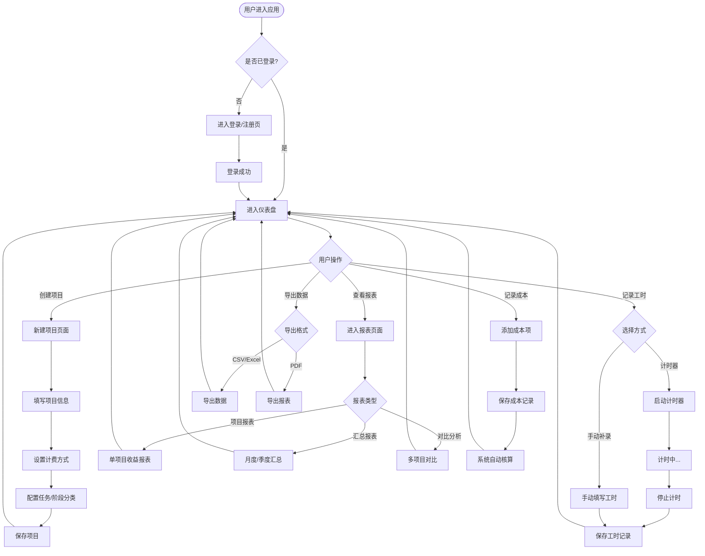
```mermaid
flowchart TD
    Start([用户进入应用]) --> Login{是否已登录?}
    Login -->|否| LoginPage[进入登录/注册页]
    LoginPage --> LoginSuccess[登录成功]
    Login -->|是| Dashboard[进入仪表盘]

    LoginSuccess --> Dashboard

    Dashboard --> Action{用户操作}
    Action -->|创建项目| CreateProject[新建项目页面]
    CreateProject --> FillProjectInfo[填写项目信息]
    FillProjectInfo --> SetBilling[设置计费方式]
    SetBilling --> ConfigTasks[配置任务/阶段分类]
    ConfigTasks --> SaveProject[保存项目]
    SaveProject --> Dashboard

    Action -->|记录工时| TimeEntry{选择方式}
    TimeEntry -->|计时器| StartTimer[启动计时器]
    StartTimer --> TimerRunning[计时中...]
    TimerRunning --> StopTimer[停止计时]
    StopTimer --> SaveTimeRecord[保存工时记录]
    SaveTimeRecord --> Dashboard

    TimeEntry -->|手动补录| ManualEntry[手动填写工时]
    ManualEntry --> SaveTimeRecord

    Action -->|查看报表| ViewReport[进入报表页面]
    ViewReport --> ReportType{报表类型}
    ReportType -->|项目报表| ProjectReport[单项目收益报表]
    ReportType -->|汇总报表| SummaryReport[月度/季度汇总]
    ReportType -->|对比分析| CompareReport[多项目对比]
    ProjectReport --> Dashboard
    SummaryReport --> Dashboard
    CompareReport --> Dashboard

    Action -->|记录成本| AddCost[添加成本项]
    AddCost --> SaveCost[保存成本记录]
    SaveCost --> AutoCalc[系统自动核算]
    AutoCalc --> Dashboard

    Action -->|导出数据| Export{导出格式}
    Export -->|CSV/Excel| ExportCSV[导出数据]
    Export -->|PDF| ExportPDF[导出报表]
    ExportCSV --> Dashboard
    ExportPDF --> Dashboard
```

## 2.4 功能图/列表

| 功能模块 | 功能名称 | 优先级 | 功能描述 |
| --- | --- | --- | --- |
| 账户与订阅 | 注册/登录 | P0 | 支持邮箱注册、第三方登录（微信/GitHub） |
| 账户与订阅 | 个人信息管理 | P0 | 管理头像、昵称、默认货币、时区等 |
| 账户与订阅 | 订阅计划查看 | P0 | 展示当前订阅状态、剩余活跃项目数 |
| 账户与订阅 | 订阅升级/续费 | P0 | 支持升级为Pro版，集成支付功能 |
| 账户与订阅 | 免费版限制提示 | P0 | 活跃项目超过3个时提示升级 |
| 项目管理 | 项目总览 | P0 | 卡片/列表形式展示所有项目 |
| 项目管理 | 项目筛选与搜索 | P0 | 按状态、客户、时间筛选，关键词搜索 |
| 项目管理 | 项目排序 | P1 | 按创建时间、利润率、总收入等排序 |
| 项目管理 | 新建项目 | P0 | 填写项目信息，选择计费方式 |
| 项目管理 | 任务/阶段分类配置 | P0 | 为项目配置任务类型或阶段 |
| 项目管理 | 项目预算设置 | P1 | 可选设置预算工时或金额（Pro） |
| 项目管理 | 项目概况 | P0 | 展示项目核心指标 |
| 项目管理 | 工时记录管理 | P0 | 查看、编辑、删除项目工时记录 |
| 项目管理 | 项目状态管理 | P0 | 标记项目为进行中/已完成/已暂停 |
| 项目管理 | 编辑项目信息 | P0 | 修改项目各项信息 |
| 项目管理 | 删除项目 | P0 | 删除项目及关联数据，需二次确认 |
| 计时器 | 启动计时 | P0 | 选择项目和任务后一键启动 |
| 计时器 | 暂停/恢复计时 | P0 | 暂停不计工时，可随时恢复 |
| 计时器 | 停止计时 | P0 | 停止并保存工时记录 |
| 计时器 | 多项目切换 | P1 | 快速切换项目，自动停止当前计时 |
| 计时器 | 手动添加工时 | P0 | 选择项目和日期，填写起止时间 |
| 计时器 | 批量补录 | P1 | 一次性补录多条工时记录 |
| 计时器 | 导入工时 | P1 | 从CSV导入历史工时（Pro） |
| 计时器 | 工时列表 | P0 | 时间线/列表形式展示工时记录 |
| 计时器 | 编辑工时 | P0 | 修改工时记录信息 |
| 计时器 | 删除工时 | P0 | 删除工时记录，需二次确认 |
| 成本核算 | 毛利润计算 | P0 | 自动计算项目毛利润 |
| 成本核算 | 实际时薪计算 | P0 | 毛利润÷总工时=实际时薪 |
| 成本核算 | 成本构成分析 | P0 | 按类型拆分成本，展示饼图 |
| 成本核算 | 利润率计算 | P0 | 毛利润÷总收入×100% |
| 成本核算 | 添加成本项 | P0 | 为项目添加各类成本记录 |
| 成本核算 | 成本分类管理 | P1 | 预设常用分类，支持自定义 |
| 成本核算 | 定期成本自动计入 | P1 | 周期性成本自动分摊（Pro） |
| 报表与可视化 | 单项目收益报表 | P0 | 展示单个项目详细数据 |
| 报表与可视化 | 工时趋势图 | P0 | 折线图/柱状图展示工时趋势 |
| 报表与可视化 | 任务类型分布 | P0 | 饼图展示工时分配比例 |
| 报表与可视化 | 月度收入汇总 | P0 | 汇总当月所有项目数据 |
| 报表与可视化 | 季度收入汇总 | P0 | 汇总当季数据，支持同比/环比 |
| 报表与可视化 | 年度总览 | P1 | 全年收入趋势、项目排名（Pro） |
| 报表与可视化 | 项目回报率对比 | P0 | 柱状图/雷达图对比多项目 |
| 报表与可视化 | 项目排行榜 | P1 | 按多维度对项目排名 |
| 报表与可视化 | 时间维度对比 | P1 | 对比同一项目不同月份表现（Pro） |
| 报表与可视化 | 导出报表 | P1 | 导出为PDF格式（Pro） |
| 报表与可视化 | 导出数据 | P1 | 导出为CSV/Excel格式（Pro） |
| 客户管理 | 客户信息管理 | P1 | 管理客户基本信息（Pro） |
| 客户管理 | 客户维度汇总 | P1 | 按客户汇总项目数据（Pro） |
| 客户管理 | 添加客户 | P1 | 新建或关联已有客户（Pro） |
| 客户管理 | 编辑客户信息 | P1 | 修改客户信息（Pro） |
| 数据与同步 | 数据持久化 | P0 | 本地存储，无需后端服务 |
| 数据与同步 | 本地数据备份 | P0 | 导出为JSON文件备份 |
| 数据与同步 | 本地数据恢复 | P0 | 从JSON备份文件恢复 |
| 数据与同步 | 开启云同步 | P1 | 数据同步至云端（Pro） |
| 数据与同步 | 同步状态显示 | P1 | 显示同步状态，支持手动同步（Pro） |
| 数据与同步 | 冲突处理 | P1 | 多设备冲突时提示选择版本（Pro） |
| 数据与同步 | 货币设置 | P1 | 设置项目货币类型（Pro） |
| 数据与同步 | 多币种报表 | P1 | 报表展示不同币种数据（Pro） |

## 2.5 你的产品有哪些端

| 序号 | 端名称 | 端类型 | 目标用户 | 说明 |
| --- | --- | --- | --- | --- |
| 1 | 个人项目成本核算器-Web端 | WEB端 | 独立开发者/自由职业者/小型工作室 | MVP版本，浏览器使用，核心功能完整 |
| 2 | 个人项目成本核算器-移动端 | APP端 | 同上 | V1.1后续版本，移动端补充 |

---

# 3 产品功能

## 3.1 Web端功能

### 3.1.1 账户管理

#### 3.1.1.1 注册/登录

**功能描述**

用户通过邮箱注册账号，或使用微信/GitHub第三方账号快捷登录。注册后可使用全部功能（免费版限制内）。

| 项 | 内容 |
| --- | --- |
| 优先级 | P0 |
| 依赖需求 | 无 |
| 前置条件 | 无 |

**详细流程**

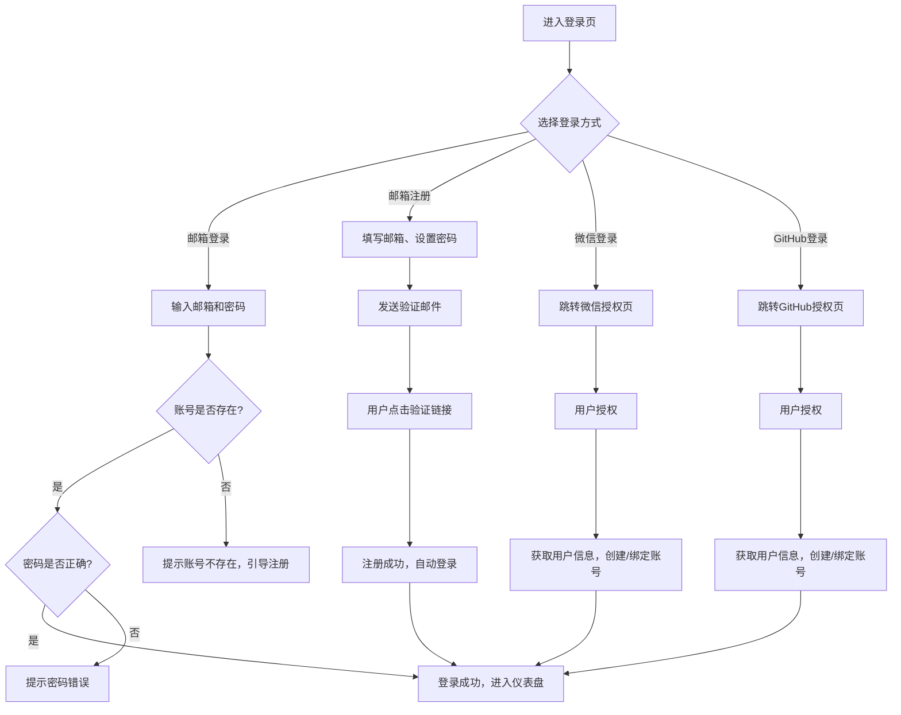
```mermaid
flowchart TD
    A[进入登录页] --> B{选择登录方式}
    B -->|邮箱登录| C[输入邮箱和密码]
    C --> D{账号是否存在?}
    D -->|是| E{密码是否正确?}
    E -->|是| F[登录成功，进入仪表盘]
    E -->|否| G[提示密码错误]
    D -->|否| H[提示账号不存在，引导注册]
    B -->|邮箱注册| I[填写邮箱、设置密码]
    I --> J[发送验证邮件]
    J --> K[用户点击验证链接]
    K --> L[注册成功，自动登录]
    L --> F
    B -->|微信登录| M[跳转微信授权页]
    M --> N[用户授权]
    N --> O[获取用户信息，创建/绑定账号]
    O --> F
    B -->|GitHub登录| P[跳转GitHub授权页]
    P --> Q[用户授权]
    Q --> R[获取用户信息，创建/绑定账号]
    R --> F
```

**业务规则说明**

1. 邮箱注册时需验证邮箱格式，密码需满足8位以上、包含字母和数字
2. 第三方登录首次使用时自动创建账号，后续登录自动绑定
3. 登录状态有效期为7天，到期需重新登录
4. 连续5次密码错误锁定账号15分钟

**验收标准**

- [ ] 正常流程：用户使用正确的邮箱和密码可成功登录
- [ ] 正常流程：新用户可通过邮箱注册并完成验证
- [ ] 正常流程：微信/GitHub授权后可自动登录
- [ ] 异常流程：密码错误时显示明确提示
- [ ] 异常流程：邮箱未验证时限制部分功能

#### 3.1.1.2 个人信息管理

**功能描述**

用户可管理头像、昵称、默认货币、时区等个人偏好设置。

| 项 | 内容 |
| --- | --- |
| 优先级 | P0 |
| 依赖需求 | 注册/登录 |
| 前置条件 | 用户已登录 |

**详细流程**

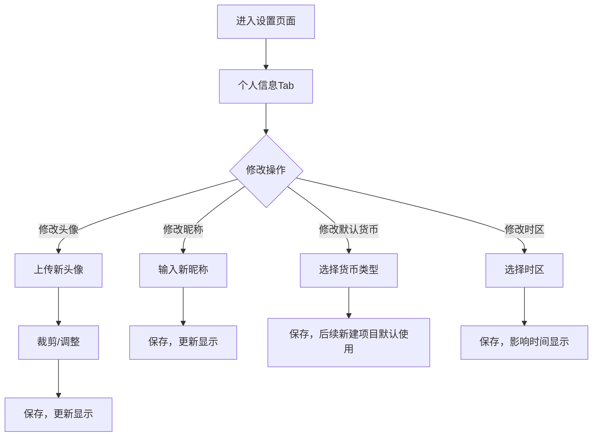
```mermaid
flowchart TD
    A[进入设置页面] --> B[个人信息Tab]
    B --> C{修改操作}
    C -->|修改头像| D[上传新头像]
    D --> E[裁剪/调整]
    E --> F[保存，更新显示]
    C -->|修改昵称| G[输入新昵称]
    G --> H[保存，更新显示]
    C -->|修改默认货币| I[选择货币类型]
    I --> J[保存，后续新建项目默认使用]
    C -->|修改时区| K[选择时区]
    K --> L[保存，影响时间显示]
```

**业务规则说明**

1. 头像支持JPG/PNG格式，最大2MB，建议尺寸200×200px
2. 昵称长度2-20个字符，支持中英文
3. 默认货币影响新建项目时的货币选择，已有项目不受影响
4. 时区影响工时记录的时间显示，修改后已有记录按新时区显示

**验收标准**

- [ ] 正常流程：用户可成功修改头像、昵称、默认货币、时区
- [ ] 异常流程：上传超大头像时提示文件大小限制
- [ ] 性能要求：修改后页面实时更新，无需刷新

#### 3.1.1.3 订阅计划查看

**功能描述**

展示当前订阅状态（免费版/Pro版），显示剩余活跃项目数/总项目数，以及Pro版功能列表。

| 项 | 内容 |
| --- | --- |
| 优先级 | P0 |
| 依赖需求 | 注册/登录 |
| 前置条件 | 用户已登录 |

**详细流程**

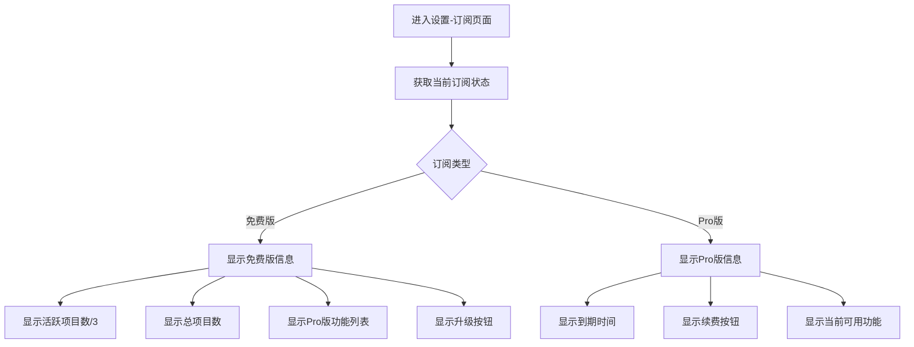
```mermaid
flowchart TD
    A[进入设置-订阅页面] --> B[获取当前订阅状态]
    B --> C{订阅类型}
    C -->|免费版| D[显示免费版信息]
    D --> D1[显示活跃项目数/3]
    D --> D2[显示总项目数]
    D --> D3[显示Pro版功能列表]
    D --> D4[显示升级按钮]
    C -->|Pro版| E[显示Pro版信息]
    E --> E1[显示到期时间]
    E --> E2[显示续费按钮]
    E --> E3[显示当前可用功能]
```

**业务规则说明**

1. 免费版活跃项目上限3个（已完成项目不计入）
2. Pro版无活跃项目限制
3. 订阅到期前7天、3天、1天发送提醒通知

**验收标准**

- [ ] 正常流程：正确显示当前订阅状态和项目使用情况
- [ ] 正常流程：免费版用户看到升级引导
- [ ] 正常流程：Pro版用户看到到期时间和续费入口

#### 3.1.1.4 订阅升级/续费

**功能描述**

支持用户升级为Pro版（¥19/月或¥168/年），集成支付功能，支持微信支付、支付宝。

| 项 | 内容 |
| --- | --- |
| 优先级 | P0 |
| 依赖需求 | 订阅计划查看 |
| 前置条件 | 用户已登录，当前为免费版或Pro版即将到期 |

**详细流程**

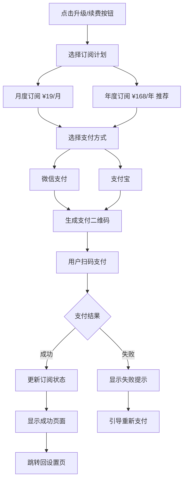
```mermaid
flowchart TD
    A[点击升级/续费按钮] --> B[选择订阅计划]
    B --> B1[月度订阅 ¥19/月]
    B --> B2[年度订阅 ¥168/年 推荐]
    B1 --> C[选择支付方式]
    B2 --> C
    C --> C1[微信支付]
    C --> C2[支付宝]
    C1 --> D[生成支付二维码]
    C2 --> D
    D --> E[用户扫码支付]
    E --> F{支付结果}
    F -->|成功| G[更新订阅状态]
    G --> H[显示成功页面]
    H --> I[跳转回设置页]
    F -->|失败| J[显示失败提示]
    J --> K[引导重新支付]
```

**业务规则说明**

1. 年度订阅享受约27%折扣（相当于¥14/月）
2. 支付成功后立即生效，Pro功能即刻解锁
3. 订阅到期未续费自动降级为免费版
4. 降级时已有项目数据保留，但无法新建第4个项目

**验收标准**

- [ ] 正常流程：用户成功完成支付并解锁Pro功能
- [ ] 异常流程：支付失败时有明确提示和重试引导
- [ ] 正常流程：Pro版到期后正确降级为免费版

#### 3.1.1.5 免费版限制提示

**功能描述**

当活跃项目达到3个上限时，用户尝试创建新项目时提示升级，引导至订阅页面。

| 项 | 内容 |
| --- | --- |
| 优先级 | P0 |
| 依赖需求 | 订阅管理 |
| 前置条件 | 用户为免费版且活跃项目已达上限 |

**详细流程**

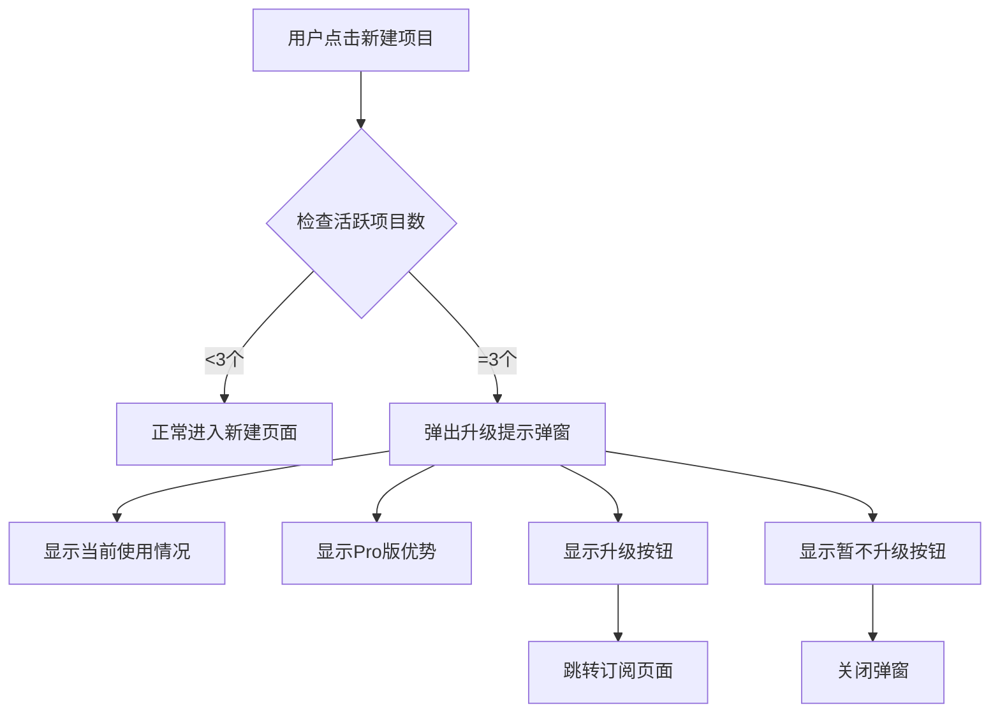
```mermaid
flowchart TD
    A[用户点击新建项目] --> B{检查活跃项目数}
    B -->|<3个| C[正常进入新建页面]
    B -->|=3个| D[弹出升级提示弹窗]
    D --> D1[显示当前使用情况]
    D --> D2[显示Pro版优势]
    D --> D3[显示升级按钮]
    D --> D4[显示暂不升级按钮]
    D3 --> E[跳转订阅页面]
    D4 --> F[关闭弹窗]
```

**业务规则说明**

1. 已完成的项目不计入活跃项目数
2. 提示应友好，强调Pro版价值而非限制
3. 用户可选择"暂不升级"，但每次新建都会提示

**验收标准**

- [ ] 正常流程：达到上限时正确弹出升级提示
- [ ] 正常流程：点击升级后跳转订阅页面
- [ ] 异常流程：用户关闭弹窗后可继续使用其他功能

### 3.1.2 项目管理

#### 3.1.2.1 项目总览

**功能描述**

以卡片或列表形式展示所有项目，包括项目名称、客户、状态、进度、毛利润等关键信息。

| 项 | 内容 |
| --- | --- |
| 优先级 | P0 |
| 依赖需求 | 无 |
| 前置条件 | 用户已登录 |

**详细流程**

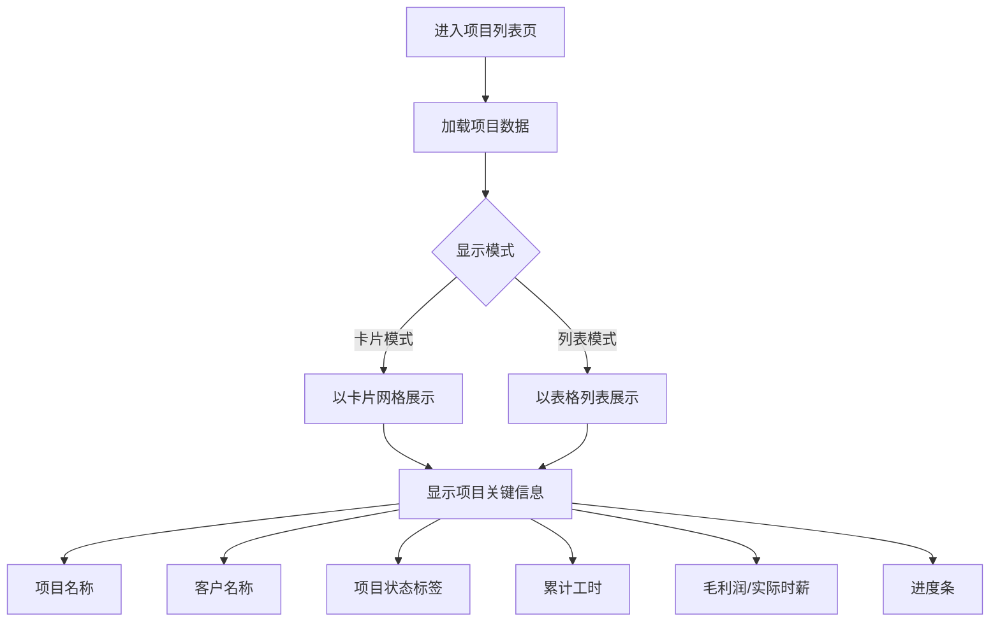
```mermaid
flowchart TD
    A[进入项目列表页] --> B[加载项目数据]
    B --> C{显示模式}
    C -->|卡片模式| D[以卡片网格展示]
    C -->|列表模式| E[以表格列表展示]
    D --> F[显示项目关键信息]
    E --> F
    F --> F1[项目名称]
    F --> F2[客户名称]
    F --> F3[项目状态标签]
    F --> F4[累计工时]
    F --> F5[毛利润/实际时薪]
    F --> F6[进度条]
```

**业务规则说明**

1. 默认按最近活跃时间排序
2. 卡片模式每行显示3-4个项目（响应式）
3. 列表模式显示更多信息列
4. 空状态显示引导创建项目的入口

**验收标准**

- [ ] 正常流程：正确显示所有项目及其关键信息
- [ ] 正常流程：卡片/列表模式切换流畅
- [ ] 正常流程：空状态正确显示引导信息

#### 3.1.2.2 项目筛选与搜索

**功能描述**

支持按项目状态（进行中/已完成/已暂停）、客户、时间范围筛选，支持关键词搜索。

| 项 | 内容 |
| --- | --- |
| 优先级 | P0 |
| 依赖需求 | 项目总览 |
| 前置条件 | 用户已登录，有项目数据 |

**详细流程**

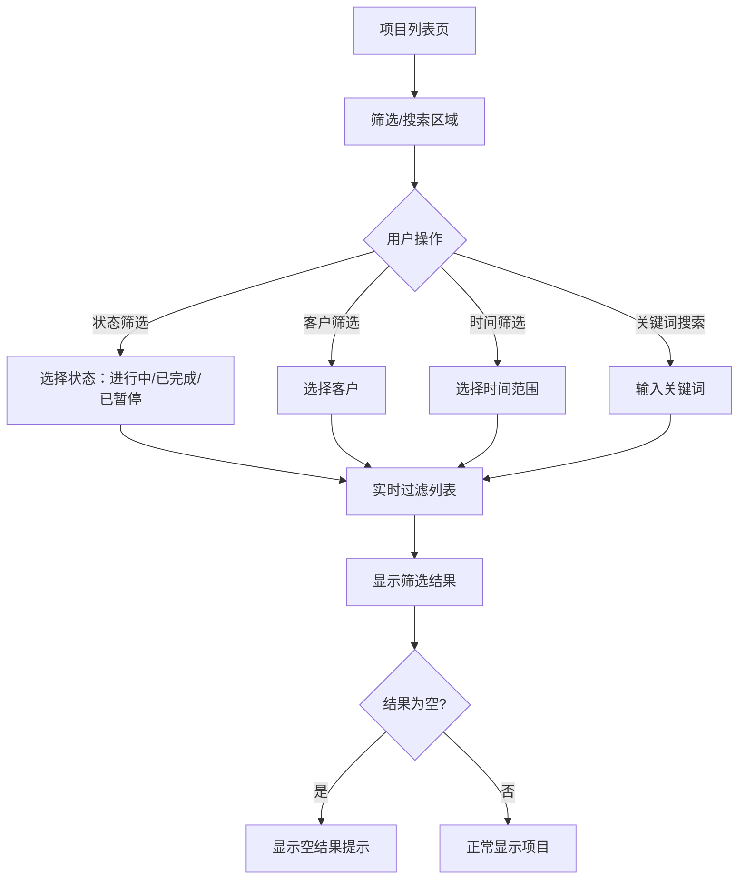
```mermaid
flowchart TD
    A[项目列表页] --> B[筛选/搜索区域]
    B --> C{用户操作}
    C -->|状态筛选| D[选择状态：进行中/已完成/已暂停]
    C -->|客户筛选| E[选择客户]
    C -->|时间筛选| F[选择时间范围]
    C -->|关键词搜索| G[输入关键词]
    D --> H[实时过滤列表]
    E --> H
    F --> H
    G --> H
    H --> I[显示筛选结果]
    I --> J{结果为空?}
    J -->|是| K[显示空结果提示]
    J -->|否| L[正常显示项目]
```

**业务规则说明**

1. 多个筛选条件可组合使用（AND关系）
2. 关键词搜索匹配项目名称、描述、客户名称
3. 筛选状态可在URL中保持，支持分享带筛选条件的链接

**验收标准**

- [ ] 正常流程：各筛选条件单独使用正确
- [ ] 正常流程：多条件组合筛选正确
- [ ] 正常流程：搜索关键词实时过滤
- [ ] 正常流程：清除筛选后恢复全部数据

#### 3.1.2.3 项目排序

**功能描述**

支持按创建时间、最近活跃、利润率、总收入等维度排序。

| 项 | 内容 |
| --- | --- |
| 优先级 | P1 |
| 依赖需求 | 项目总览 |
| 前置条件 | 用户已登录，有项目数据 |

**业务规则说明**

1. 默认按最近活跃时间降序
2. 点击表头可切换排序字段和方向
3. 排序状态在筛选条件下保持

**验收标准**

- [ ] 正常流程：各排序维度正确
- [ ] 正常流程：升降序切换正确

#### 3.1.2.4 新建项目

**功能描述**

填写项目名称、描述、客户信息，选择计费方式（时薪/项目总价），设置金额。

| 项 | 内容 |
| --- | --- |
| 优先级 | P0 |
| 依赖需求 | 无 |
| 前置条件 | 用户已登录，活跃项目未达上限（免费版） |

**详细流程**

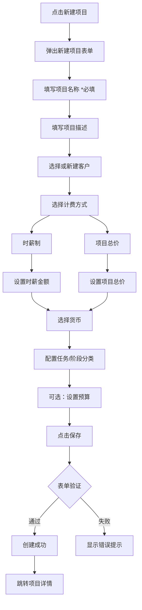
```mermaid
flowchart TD
    A[点击新建项目] --> B[弹出新建项目表单]
    B --> C[填写项目名称 *必填]
    C --> D[填写项目描述]
    D --> E[选择或新建客户]
    E --> F[选择计费方式]
    F --> F1[时薪制]
    F --> F2[项目总价]
    F1 --> G1[设置时薪金额]
    F2 --> G2[设置项目总价]
    G1 --> H[选择货币]
    G2 --> H
    H --> I[配置任务/阶段分类]
    I --> J[可选：设置预算]
    J --> K[点击保存]
    K --> L{表单验证}
    L -->|通过| M[创建成功]
    M --> N[跳转项目详情]
    L -->|失败| O[显示错误提示]
```

**业务规则说明**

1. 项目名称为必填项，最长50个字符
2. 客户可新建或从已有客户选择（Pro功能）
3. 任务分类可预设，也可后续编辑
4. 免费版用户预算设置功能不可用

**验收标准**

- [ ] 正常流程：填写必填项后可成功创建项目
- [ ] 正常流程：时薪制和项目总价两种计费方式正确
- [ ] 异常流程：必填项为空时提示
- [ ] 异常流程：免费版达到上限时无法创建

#### 3.1.2.5 任务/阶段分类配置

**功能描述**

为项目配置任务类型（如开发、设计、沟通、测试等）或阶段（如需求、开发、交付），便于工时分类统计。

| 项 | 内容 |
| --- | --- |
| 优先级 | P0 |
| 依赖需求 | 新建项目 |
| 前置条件 | 项目已创建 |

**业务规则说明**

1. 系统预设常用任务类型：开发、设计、沟通、测试、文档、运维
2. 用户可自定义任务类型，支持添加、编辑、删除、排序
3. 已有工时记录关联的任务类型不可删除（可标记为停用）

**验收标准**

- [ ] 正常流程：可添加自定义任务类型
- [ ] 正常流程：预设任务类型正确显示
- [ ] 异常流程：删除已使用的任务类型时提示

#### 3.1.2.6 项目预算设置

**功能描述**

可选设置项目预算工时或预算金额，超出时预警提示。

| 项 | 内容 |
| --- | --- |
| 优先级 | P1（Pro功能） |
| 依赖需求 | 新建项目 |
| 前置条件 | 用户为Pro版 |

**业务规则说明**

1. 预算类型：工时预算（小时）或金额预算
2. 预警阈值：80%、100%两级
3. 超出预算时，项目卡片显示红色警示

**验收标准**

- [ ] 正常流程：设置预算后正确显示预算进度
- [ ] 正常流程：达到80%和100%时触发预警
- [ ] 异常流程：免费版访问时显示升级提示

#### 3.1.2.7 项目概况

**功能描述**

展示项目基本信息、累计工时、总收入、毛利润、实际时薪、成本构成等核心指标。

| 项 | 内容 |
| --- | --- |
| 优先级 | P0 |
| 依赖需求 | 项目已创建，有工时和成本数据 |
| 前置条件 | 用户进入项目详情页 |

**详细流程**

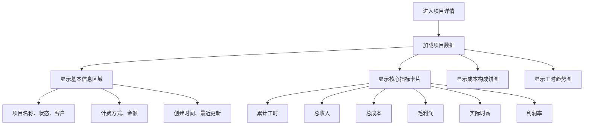
```mermaid
flowchart TD
    A[进入项目详情] --> B[加载项目数据]
    B --> C[显示基本信息区域]
    C --> C1[项目名称、状态、客户]
    C --> C2[计费方式、金额]
    C --> C3[创建时间、最近更新]
    B --> D[显示核心指标卡片]
    D --> D1[累计工时]
    D --> D2[总收入]
    D --> D3[总成本]
    D --> D4[毛利润]
    D --> D5[实际时薪]
    D --> D6[利润率]
    B --> E[显示成本构成饼图]
    B --> F[显示工时趋势图]
```

**业务规则说明**

1. 核心指标实时更新（工时/成本变化后自动重算）
2. 毛利润 = 总收入 - 总成本
3. 实际时薪 = 毛利润 ÷ 总工时
4. 利润率 = 毛利润 ÷ 总收入 × 100%

**验收标准**

- [ ] 正常流程：所有指标正确计算并显示
- [ ] 正常流程：数据变化后指标实时更新
- [ ] 正常流程：无数据时显示空状态

#### 3.1.2.8 工时记录管理

**功能描述**

查看该项目所有工时记录，支持按日期、任务类型筛选，支持编辑和删除。

| 项 | 内容 |
| --- | --- |
| 优先级 | P0 |
| 依赖需求 | 项目已创建，有工时记录 |
| 前置条件 | 用户进入项目详情页 |

**业务规则说明**

1. 默认按时间倒序显示
2. 支持按日期范围、任务类型筛选
3. 编辑和删除操作需二次确认

**验收标准**

- [ ] 正常流程：正确显示项目所有工时记录
- [ ] 正常流程：筛选功能正常工作
- [ ] 正常流程：编辑和删除操作正确执行

#### 3.1.2.9 项目状态管理

**功能描述**

支持将项目标记为进行中/已完成/已暂停，已完成项目不再占用免费版活跃项目名额。

| 项 | 内容 |
| --- | --- |
| 优先级 | P0 |
| 依赖需求 | 项目已创建 |
| 前置条件 | 用户进入项目详情或列表 |

**详细流程**

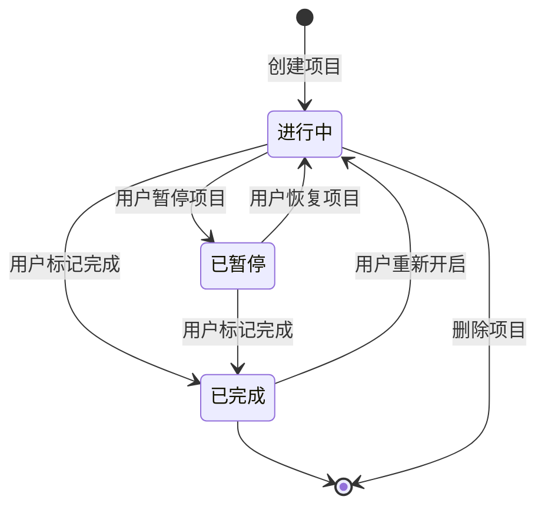
```mermaid
stateDiagram-v2
    [*] --> 进行中: 创建项目
    进行中 --> 已暂停: 用户暂停项目
    进行中 --> 已完成: 用户标记完成
    已暂停 --> 进行中: 用户恢复项目
    已暂停 --> 已完成: 用户标记完成
    已完成 --> 进行中: 用户重新开启
    已完成 --> [*]
    进行中 --> [*]: 删除项目
```

**业务规则说明**

1. 新建项目默认为"进行中"状态
2. 只有"进行中"状态的项目可以记录工时
3. 免费版：已完成项目不计入活跃项目数

**验收标准**

- [ ] 正常流程：项目状态正确切换
- [ ] 正常流程：已完成项目释放活跃名额
- [ ] 异常流程：已暂停项目不能记录工时

#### 3.1.2.10 编辑项目信息

**功能描述**

修改项目名称、描述、客户、计费方式、金额等信息。

| 项 | 内容 |
| --- | --- |
| 优先级 | P0 |
| 依赖需求 | 项目已创建 |
| 前置条件 | 用户进入项目详情页 |

**业务规则说明**

1. 修改计费方式后，已有工时按新方式重新计算收入
2. 修改金额不影响历史记录，只影响未来计算

**验收标准**

- [ ] 正常流程：修改后信息正确更新
- [ ] 正常流程：修改计费方式后指标重算

#### 3.1.2.11 删除项目

**功能描述**

删除项目及其所有关联工时记录，操作前需二次确认。

| 项 | 内容 |
| --- | --- |
| 优先级 | P0 |
| 依赖需求 | 项目已创建 |
| 前置条件 | 用户进入项目详情页 |

**详细流程**

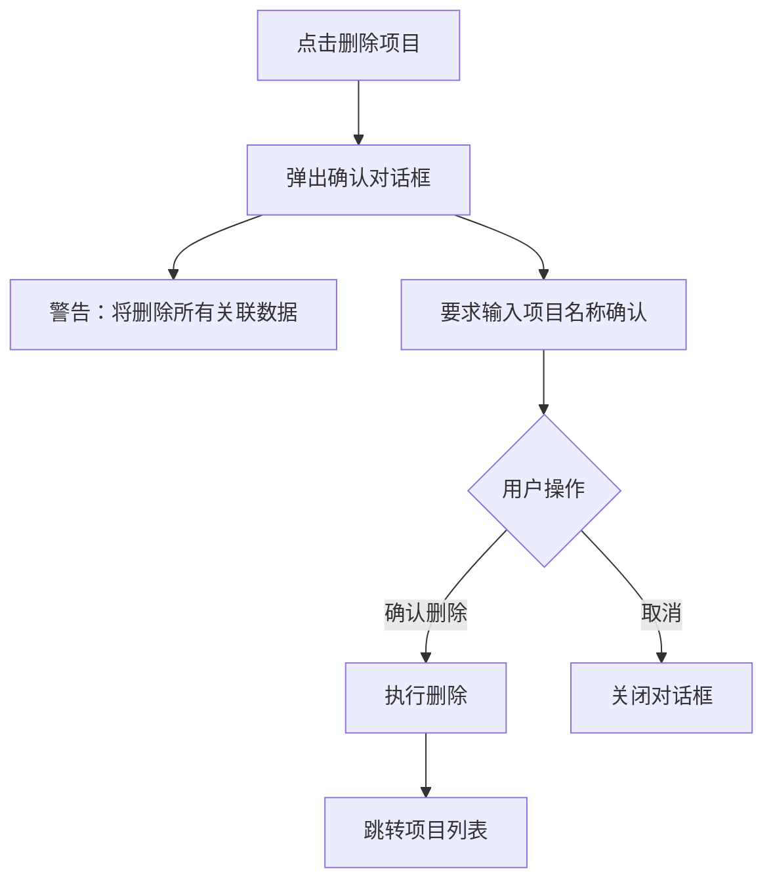
```mermaid
flowchart TD
    A[点击删除项目] --> B[弹出确认对话框]
    B --> B1[警告：将删除所有关联数据]
    B --> B2[要求输入项目名称确认]
    B2 --> C{用户操作}
    C -->|确认删除| D[执行删除]
    D --> E[跳转项目列表]
    C -->|取消| F[关闭对话框]
```

**业务规则说明**

1. 删除操作不可恢复
2. 需输入项目名称进行二次确认
3. 正在进行中的计时器关联的项目不能删除

**验收标准**

- [ ] 正常流程：确认后项目及其数据完全删除
- [ ] 异常流程：取消后无任何变化
- [ ] 异常流程：计时中的项目无法删除

### 3.1.3 计时器

#### 3.1.3.1 启动计时

**功能描述**

选择当前项目与任务类型后，一键启动计时器，实时显示已用时间。

| 项 | 内容 |
| --- | --- |
| 优先级 | P0 |
| 依赖需求 | 项目已创建 |
| 前置条件 | 用户已登录，有进行中的项目 |

**详细流程**

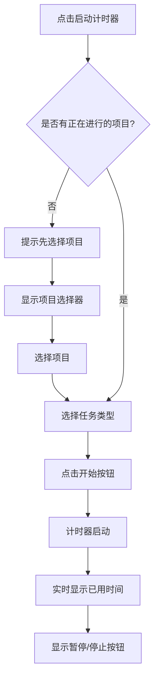
```mermaid
flowchart TD
    A[点击启动计时器] --> B{是否有正在进行的项目?}
    B -->|否| C[提示先选择项目]
    C --> D[显示项目选择器]
    D --> E[选择项目]
    E --> F[选择任务类型]
    B -->|是| F
    F --> G[点击开始按钮]
    G --> H[计时器启动]
    H --> I[实时显示已用时间]
    I --> J[显示暂停/停止按钮]
```

**业务规则说明**

1. 同一时间只能有一个计时器在运行
2. 计时器精度为秒级
3. 页面关闭/标签切换不影响计时（使用Page Visibility API）
4. 计时数据实时保存到本地存储

**验收标准**

- [ ] 正常流程：选择项目和任务后成功启动计时
- [ ] 正常流程：时间显示准确，秒级精度
- [ ] 正常流程：切换标签页后计时继续
- [ ] 异常流程：未选择项目时提示

#### 3.1.3.2 暂停/恢复计时

**功能描述**

支持暂停计时（如午休），暂停期间不计入工时，可随时恢复。

| 项 | 内容 |
| --- | --- |
| 优先级 | P0 |
| 依赖需求 | 计时器正在运行 |
| 前置条件 | 计时器已启动 |

**业务规则说明**

1. 暂停时显示已暂停状态和已暂停时长
2. 可多次暂停/恢复
3. 最终保存时扣除所有暂停时长

**验收标准**

- [ ] 正常流程：暂停后时间停止计算
- [ ] 正常流程：恢复后继续计时
- [ ] 正常流程：最终记录扣除暂停时间

#### 3.1.3.3 停止计时

**功能描述**

停止计时器，自动将计时时长保存为一条工时记录，可补充备注。

| 项 | 内容 |
| --- | --- |
| 优先级 | P0 |
| 依赖需求 | 计时器正在运行或已暂停 |
| 前置条件 | 计时器已启动 |

**详细流程**

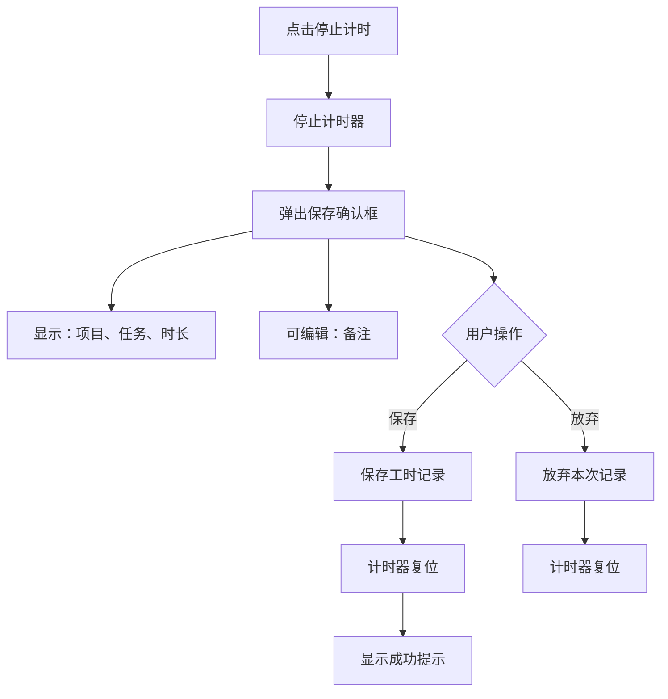
```mermaid
flowchart TD
    A[点击停止计时] --> B[停止计时器]
    B --> C[弹出保存确认框]
    C --> C1[显示：项目、任务、时长]
    C --> C2[可编辑：备注]
    C --> D{用户操作}
    D -->|保存| E[保存工时记录]
    E --> F[计时器复位]
    F --> G[显示成功提示]
    D -->|放弃| H[放弃本次记录]
    H --> I[计时器复位]
```

**业务规则说明**

1. 可选择保存或放弃本次记录
2. 保存后可添加备注（可选）
3. 放弃操作需二次确认

**验收标准**

- [ ] 正常流程：停止后正确保存工时记录
- [ ] 正常流程：可选择添加备注
- [ ] 正常流程：放弃后不保存记录

#### 3.1.3.4 多项目切换

**功能描述**

计时过程中可快速切换到其他项目/任务（自动停止当前计时）。

| 项 | 内容 |
| --- | --- |
| 优先级 | P1 |
| 依赖需求 | 计时器正在运行 |
| 前置条件 | 有多个项目 |

**业务规则说明**

1. 切换时自动保存当前记录
2. 快速切换到上一次的项目/任务
3. 支持从项目列表快速选择

**验收标准**

- [ ] 正常流程：切换时自动保存当前记录
- [ ] 正常流程：快速切换功能正常

#### 3.1.3.5 手动添加工时

**功能描述**

选择项目和日期，填写起止时间或时长，选择任务类型，填写备注。

| 项 | 内容 |
| --- | --- |
| 优先级 | P0 |
| 依赖需求 | 项目已创建 |
| 前置条件 | 用户已登录 |

**详细流程**

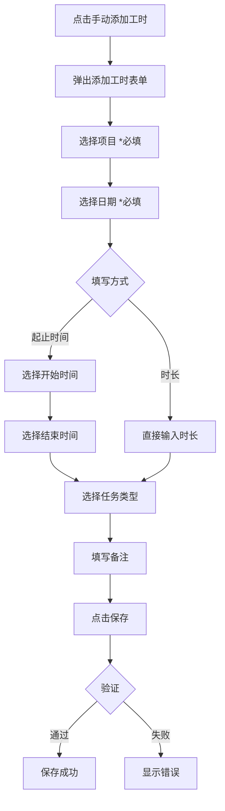
```mermaid
flowchart TD
    A[点击手动添加工时] --> B[弹出添加工时表单]
    B --> C[选择项目 *必填]
    C --> D[选择日期 *必填]
    D --> E{填写方式}
    E -->|起止时间| F1[选择开始时间]
    F1 --> F2[选择结束时间]
    E -->|时长| G[直接输入时长]
    F2 --> H[选择任务类型]
    G --> H
    H --> I[填写备注]
    I --> J[点击保存]
    J --> K{验证}
    K -->|通过| L[保存成功]
    K -->|失败| M[显示错误]
```

**业务规则说明**

1. 结束时间必须晚于开始时间
2. 单日工时不超过24小时
3. 支持跨天工时记录

**验收标准**

- [ ] 正常流程：正确添加工时记录
- [ ] 异常流程：时间逻辑错误时提示

#### 3.1.3.6 批量补录

**功能描述**

支持一次性补录多条工时记录（如补录上周遗漏的工时）。

| 项 | 内容 |
| --- | --- |
| 优先级 | P1 |
| 依赖需求 | 手动添加工时 |
| 前置条件 | 用户已登录 |

**业务规则说明**

1. 支持添加多条记录后一次性保存
2. 每条记录可设置不同项目、任务、时间
3. 支持从模板快速添加（重复昨日记录等）

**验收标准**

- [ ] 正常流程：批量添加多条记录并保存
- [ ] 正常流程：部分失败时提示哪些成功/失败

#### 3.1.3.7 导入工时

**功能描述**

支持从CSV文件导入历史工时数据，适配其他工具的导出格式。

| 项 | 内容 |
| --- | --- |
| 优先级 | P1（Pro功能） |
| 依赖需求 | 手动添加工时 |
| 前置条件 | 用户为Pro版 |

**业务规则说明**

1. 支持标准CSV格式
2. 支持Toggl、Clockify导出格式自动识别
3. 导入前预览，可跳过异常记录

**验收标准**

- [ ] 正常流程：成功导入CSV文件
- [ ] 异常流程：格式错误时提示并显示预览

#### 3.1.3.8 工时列表

**功能描述**

以时间线或列表形式展示所有工时记录，包括项目、任务类型、起止时间、时长、备注。

| 项 | 内容 |
| --- | --- |
| 优先级 | P0 |
| 依赖需求 | 有工时记录 |
| 前置条件 | 用户已登录 |

**业务规则说明**

1. 默认按日期倒序显示
2. 时间线模式按日期分组
3. 列表模式支持排序和筛选

**验收标准**

- [ ] 正常流程：正确显示所有工时记录
- [ ] 正常流程：两种显示模式切换正常

#### 3.1.3.9 编辑工时

**功能描述**

修改工时记录的起止时间、任务类型、备注等信息。

| 项 | 内容 |
| --- | --- |
| 优先级 | P0 |
| 依赖需求 | 有工时记录 |
| 前置条件 | 用户已登录 |

**验收标准**

- [ ] 正常流程：修改后数据正确更新
- [ ] 正常流程：修改后相关指标重算

#### 3.1.3.10 删除工时

**功能描述**

删除工时记录，操作前需二次确认。

| 项 | 内容 |
| --- | --- |
| 优先级 | P0 |
| 依赖需求 | 有工时记录 |
| 前置条件 | 用户已登录 |

**验收标准**

- [ ] 正常流程：确认后工时记录删除
- [ ] 正常流程：删除后相关指标重算

### 3.1.4 成本核算

#### 3.1.4.1 毛利润计算

**功能描述**

项目总收入（项目总价或时薪×工时）减去可记录成本（如外包费用、软件订阅、硬件摊销等），自动计算毛利润。

| 项 | 内容 |
| --- | --- |
| 优先级 | P0 |
| 依赖需求 | 项目已创建，有工时和成本数据 |
| 前置条件 | 系统自动计算 |

**业务规则说明**

1. 时薪制：总收入 = 时薪 × 总工时
2. 项目总价：总收入 = 项目固定金额
3. 毛利润 = 总收入 - 总成本
4. 计算结果实时更新

**验收标准**

- [ ] 正常流程：两种计费方式下计算正确
- [ ] 正常流程：数据变化后自动重算

#### 3.1.4.2 实际时薪计算

**功能描述**

项目毛利润 ÷ 总投入工时 = 实际时薪，帮助用户了解每小时真实收益。

| 项 | 内容 |
| --- | --- |
| 优先级 | P0 |
| 依赖需求 | 毛利润计算 |
| 前置条件 | 系统自动计算 |

**业务规则说明**

1. 实际时薪 = 毛利润 ÷ 总工时
2. 总工时为0时显示为"暂无数据"
3. 保留两位小数

**验收标准**

- [ ] 正常流程：计算结果正确
- [ ] 异常流程：工时为0时正确显示

#### 3.1.4.3 成本构成分析

**功能描述**

将成本按类型（时间成本、外包成本、工具成本等）拆分，展示成本构成饼图。

| 项 | 内容 |
| --- | --- |
| 优先级 | P0 |
| 依赖需求 | 有成本记录 |
| 前置条件 | 用户查看项目详情 |

**业务规则说明**

1. 时间成本 = 总工时 × 用户设定的期望时薪
2. 其他成本从成本记录中汇总
3. 饼图支持点击查看详情

**验收标准**

- [ ] 正常流程：饼图正确显示各成本占比
- [ ] 正常流程：点击饼图显示详情

#### 3.1.4.4 利润率计算

**功能描述**

毛利润 ÷ 总收入 × 100% = 利润率，直观展示项目盈利水平。

| 项 | 内容 |
| --- | --- |
| 优先级 | P0 |
| 依赖需求 | 毛利润计算 |
| 前置条件 | 系统自动计算 |

**业务规则说明**

1. 利润率 = 毛利润 ÷ 总收入 × 100%
2. 总收入为0时显示为"暂无数据"
3. 用颜色区分正负（绿色/红色）

**验收标准**

- [ ] 正常流程：计算结果正确
- [ ] 正常流程：颜色正确区分盈亏

#### 3.1.4.5 添加成本项

**功能描述**

为项目添加各类成本记录（外包费、软件费、差旅费等），支持金额、日期、备注。

| 项 | 内容 |
| --- | --- |
| 优先级 | P0 |
| 依赖需求 | 项目已创建 |
| 前置条件 | 用户进入项目详情 |

**业务规则说明**

1. 成本分类：外包、工具、硬件、差旅、其他
2. 日期默认为当天
3. 支持批量添加

**验收标准**

- [ ] 正常流程：成功添加成本记录
- [ ] 正常流程：添加后毛利润自动重算

#### 3.1.4.6 成本分类管理

**功能描述**

预设常用成本分类（外包、工具、硬件、差旅等），支持自定义分类。

| 项 | 内容 |
| --- | --- |
| 优先级 | P1 |
| 依赖需求 | 添加成本项 |
| 前置条件 | 用户已登录 |

**验收标准**

- [ ] 正常流程：预设分类正确显示
- [ ] 正常流程：可添加自定义分类

#### 3.1.4.7 定期成本自动计入

**功能描述**

设置周期性成本（如月度软件订阅费），系统自动按期分摊计入项目。

| 项 | 内容 |
| --- | --- |
| 优先级 | P1（Pro功能） |
| 依赖需求 | 添加成本项 |
| 前置条件 | 用户为Pro版 |

**业务规则说明**

1. 周期：周、月、季度、年
2. 自动按周期生成成本记录
3. 可设置开始和结束日期

**验收标准**

- [ ] 正常流程：周期性成本按时生成
- [ ] 正常流程：可停止周期性成本

### 3.1.5 报表与可视化

#### 3.1.5.1 单项目收益报表

**功能描述**

展示单个项目的工时分布、成本构成、毛利润、实际时薪、利润率等详细数据。

| 项 | 内容 |
| --- | --- |
| 优先级 | P0 |
| 依赖需求 | 项目有工时和成本数据 |
| 前置条件 | 用户进入报表页面 |

**业务规则说明**

1. 报表包含：核心指标、工时趋势、成本构成、任务分布
2. 支持时间范围筛选
3. 数据可导出（Pro）

**验收标准**

- [ ] 正常流程：报表数据正确显示
- [ ] 正常流程：图表交互正常

#### 3.1.5.2 工时趋势图

**功能描述**

以折线图/柱状图展示项目每日/每周/每月工时变化趋势。

| 项 | 内容 |
| --- | --- |
| 优先级 | P0 |
| 依赖需求 | 项目有工时数据 |
| 前置条件 | 用户查看报表 |

**业务规则说明**

1. 支持日/周/月三种粒度
2. 支持时间范围选择
3. 图表支持hover查看详情

**验收标准**

- [ ] 正常流程：趋势图正确显示
- [ ] 正常流程：切换粒度后数据正确

#### 3.1.5.3 任务类型分布

**功能描述**

以饼图展示项目工时在各任务类型上的分配比例。

| 项 | 内容 |
| --- | --- |
| 优先级 | P0 |
| 依赖需求 | 项目有工时数据 |
| 前置条件 | 用户查看报表 |

**验收标准**

- [ ] 正常流程：饼图正确显示各类型占比
- [ ] 正常流程：点击显示详情

#### 3.1.5.4 月度收入汇总

**功能描述**

汇总当月所有项目的收入、工时、利润数据。

| 项 | 内容 |
| --- | --- |
| 优先级 | P0 |
| 依赖需求 | 有多个项目数据 |
| 前置条件 | 用户进入汇总报表 |

**业务规则说明**

1. 汇总维度：按项目、按客户
2. 显示：总收入、总工时、总利润、平均时薪
3. 支持切换月份

**验收标准**

- [ ] 正常流程：汇总数据正确
- [ ] 正常流程：切换月份正确

#### 3.1.5.5 季度收入汇总

**功能描述**

汇总当季所有项目的收入、工时、利润数据，支持同比/环比分析。

| 项 | 内容 |
| --- | --- |
| 优先级 | P0 |
| 依赖需求 | 有多个项目数据 |
| 前置条件 | 用户进入汇总报表 |

**验收标准**

- [ ] 正常流程：季度汇总正确
- [ ] 正常流程：同比/环比计算正确

#### 3.1.5.6 年度总览

**功能描述**

全年收入趋势、最佳/最差项目排名、总工时统计。

| 项 | 内容 |
| --- | --- |
| 优先级 | P1（Pro功能） |
| 依赖需求 | 有全年数据 |
| 前置条件 | 用户为Pro版 |

**验收标准**

- [ ] 正常流程：年度数据正确显示
- [ ] 正常流程：排名正确

#### 3.1.5.7 项目回报率对比

**功能描述**

以柱状图/雷达图对比多个项目的利润率、实际时薪、总工时。

| 项 | 内容 |
| --- | --- |
| 优先级 | P0 |
| 依赖需求 | 有多个项目 |
| 前置条件 | 用户进入对比页面 |

**业务规则说明**

1. 支持选择2-10个项目对比
2. 对比维度：利润率、实际时薪、总工时、总收入
3. 支持柱状图和雷达图两种展示

**验收标准**

- [ ] 正常流程：对比图表正确显示
- [ ] 正常流程：选择不同项目后更新

#### 3.1.5.8 项目排行榜

**功能描述**

按利润率/实际时薪/总收入等维度对项目进行排名。

| 项 | 内容 |
| --- | --- |
| 优先级 | P1 |
| 依赖需求 | 有多个项目 |
| 前置条件 | 用户查看报表 |

**验收标准**

- [ ] 正常流程：各维度排名正确
- [ ] 正常流程：切换维度后排名更新

#### 3.1.5.9 时间维度对比

**功能描述**

对比同一项目在不同月份的表现，观察项目盈利趋势。

| 项 | 内容 |
| --- | --- |
| 优先级 | P1（Pro功能） |
| 依赖需求 | 项目有多月数据 |
| 前置条件 | 用户为Pro版 |

**验收标准**

- [ ] 正常流程：时间对比图表正确
- [ ] 正常流程：趋势显示清晰

#### 3.1.5.10 导出报表

**功能描述**

支持将报表导出为PDF格式，便于分享和存档。

| 项 | 内容 |
| --- | --- |
| 优先级 | P1（Pro功能） |
| 依赖需求 | 报表已生成 |
| 前置条件 | 用户为Pro版 |

**验收标准**

- [ ] 正常流程：成功导出PDF
- [ ] 正常流程：PDF内容完整

#### 3.1.5.11 导出数据

**功能描述**

支持将工时数据、成本数据导出为CSV/Excel格式。

| 项 | 内容 |
| --- | --- |
| 优先级 | P1（Pro功能） |
| 依赖需求 | 有数据 |
| 前置条件 | 用户为Pro版 |

**验收标准**

- [ ] 正常流程：成功导出CSV/Excel
- [ ] 正常流程：数据格式正确

### 3.1.6 客户管理

#### 3.1.6.1 客户信息管理

**功能描述**

管理所有客户的基本信息（名称、联系方式、备注），查看每个客户关联的项目列表。

| 项 | 内容 |
| --- | --- |
| 优先级 | P1（Pro功能） |
| 依赖需求 | 有客户数据 |
| 前置条件 | 用户为Pro版 |

**验收标准**

- [ ] 正常流程：客户列表正确显示
- [ ] 正常流程：可查看关联项目

#### 3.1.6.2 客户维度汇总

**功能描述**

按客户维度汇总项目数量、总收入、总工时、平均利润率。

| 项 | 内容 |
| --- | --- |
| 优先级 | P1（Pro功能） |
| 依赖需求 | 有客户数据 |
| 前置条件 | 用户为Pro版 |

**验收标准**

- [ ] 正常流程：汇总数据正确

#### 3.1.6.3 添加客户

**功能描述**

在创建项目时新建客户或关联已有客户。

| 项 | 内容 |
| --- | --- |
| 优先级 | P1（Pro功能） |
| 依赖需求 | 无 |
| 前置条件 | 用户为Pro版 |

**验收标准**

- [ ] 正常流程：可新建客户
- [ ] 正常流程：可关联已有客户

#### 3.1.6.4 编辑客户信息

**功能描述**

修改客户名称、联系方式等信息。

| 项 | 内容 |
| --- | --- |
| 优先级 | P1（Pro功能） |
| 依赖需求 | 有客户数据 |
| 前置条件 | 用户为Pro版 |

**验收标准**

- [ ] 正常流程：修改后信息正确更新

### 3.1.7 数据与同步

#### 3.1.7.1 数据持久化

**功能描述**

所有数据默认保存在本地浏览器（IndexedDB/localStorage），无需后端服务。

| 项 | 内容 |
| --- | --- |
| 优先级 | P0 |
| 依赖需求 | 无 |
| 前置条件 | 浏览器支持IndexedDB |

**业务规则说明**

1. 使用IndexedDB存储结构化数据
2. 存储空间≥50MB
3. 数据加密存储（可选）

**验收标准**

- [ ] 正常流程：数据正确保存到本地
- [ ] 正常流程：刷新后数据保留

#### 3.1.7.2 本地数据备份

**功能描述**

支持手动将全部数据导出为JSON文件进行备份。

| 项 | 内容 |
| --- | --- |
| 优先级 | P0 |
| 依赖需求 | 有数据 |
| 前置条件 | 用户已登录 |

**验收标准**

- [ ] 正常流程：成功导出JSON备份
- [ ] 正常流程：备份文件内容完整

#### 3.1.7.3 本地数据恢复

**功能描述**

支持从JSON备份文件恢复数据。

| 项 | 内容 |
| --- | --- |
| 优先级 | P0 |
| 依赖需求 | 有备份文件 |
| 前置条件 | 用户已登录 |

**业务规则说明**

1. 恢复前提示将覆盖现有数据
2. 支持备份文件校验
3. 可选择合并或覆盖

**验收标准**

- [ ] 正常流程：成功恢复数据
- [ ] 异常流程：文件格式错误时提示

#### 3.1.7.4 开启云同步

**功能描述**

注册/登录后可开启云同步，数据自动同步至云端，支持多设备访问。

| 项 | 内容 |
| --- | --- |
| 优先级 | P1（Pro功能） |
| 依赖需求 | 注册/登录 |
| 前置条件 | 用户为Pro版 |

**业务规则说明**

1. 端到端加密
2. 增量同步
3. 冲突检测和提示

**验收标准**

- [ ] 正常流程：开启后数据自动同步
- [ ] 正常流程：多设备数据一致

#### 3.1.7.5 同步状态显示

**功能描述**

显示当前数据同步状态（已同步/同步中/同步失败），支持手动触发同步。

| 项 | 内容 |
| --- | --- |
| 优先级 | P1（Pro功能） |
| 依赖需求 | 开启云同步 |
| 前置条件 | 用户为Pro版 |

**验收标准**

- [ ] 正常流程：状态显示正确
- [ ] 正常流程：手动同步功能正常

#### 3.1.7.6 冲突处理

**功能描述**

当多设备数据冲突时，提示用户选择保留哪个版本。

| 项 | 内容 |
| --- | --- |
| 优先级 | P1（Pro功能） |
| 依赖需求 | 开启云同步 |
| 前置条件 | 发生数据冲突 |

**业务规则说明**

1. 显示冲突详情（时间、修改内容）
2. 支持逐条选择
3. 支持批量选择（全部本地/全部云端）

**验收标准**

- [ ] 正常流程：冲突正确检测并提示
- [ ] 正常流程：用户选择后正确合并

#### 3.1.7.7 货币设置

**功能描述**

设置项目使用的货币类型（CNY/USD/EUR等），支持汇率配置。

| 项 | 内容 |
| --- | --- |
| 优先级 | P1（Pro功能） |
| 依赖需求 | 项目已创建 |
| 前置条件 | 用户为Pro版 |

**业务规则说明**

1. 支持货币：CNY、USD、EUR、GBP、JPY等
2. 汇率可手动设置或自动获取
3. 每个项目可独立设置货币

**验收标准**

- [ ] 正常流程：可设置项目货币
- [ ] 正常流程：汇率转换正确

#### 3.1.7.8 多币种报表

**功能描述**

报表中展示不同币种的项目数据，支持统一转换为默认货币显示。

| 项 | 内容 |
| --- | --- |
| 优先级 | P1（Pro功能） |
| 依赖需求 | 有多币种数据 |
| 前置条件 | 用户为Pro版 |

**验收标准**

- [ ] 正常流程：多币种数据正确显示
- [ ] 正常流程：转换后汇总正确

---

# 4 产品原型

## 4.1 页面跳转逻辑图

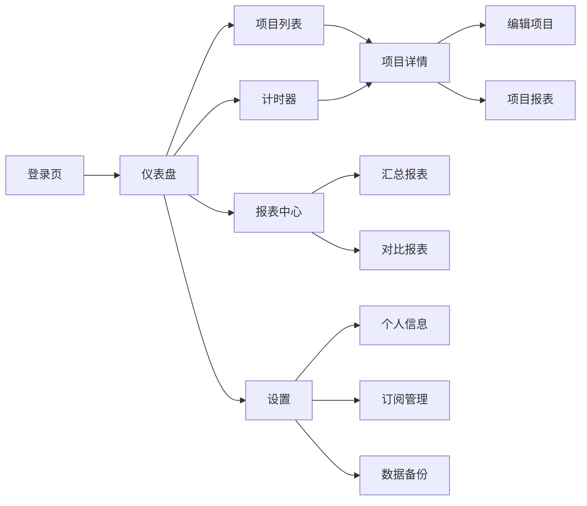
```mermaid
flowchart LR
    Login[登录页] --> Dashboard[仪表盘]
    Dashboard --> Projects[项目列表]
    Projects --> ProjectDetail[项目详情]
    ProjectDetail --> EditProject[编辑项目]
    ProjectDetail --> Report[项目报表]
    Dashboard --> Timer[计时器]
    Timer --> ProjectDetail
    Dashboard --> Reports[报表中心]
    Reports --> SummaryReport[汇总报表]
    Reports --> CompareReport[对比报表]
    Dashboard --> Settings[设置]
    Settings --> Profile[个人信息]
    Settings --> Subscription[订阅管理]
    Settings --> DataBackup[数据备份]
```

## 4.2 全站点原型设计

### 4.2.1 Web端（MVP版本）

**页面清单：**

| 序号 | 页面名称 | 所属模块 | 页面描述 | 关键元素 |
| --- | --- | --- | --- | --- |
| 1 | 仪表盘 | 核心 | 总览所有项目状态、核心指标、快速操作入口 | 指标卡片、项目列表、快捷按钮、工时趋势 |
| 2 | 项目列表 | 项目管理 | 展示所有项目，支持筛选搜索排序 | 筛选栏、项目卡片/列表、新建按钮 |
| 3 | 新建项目 | 项目管理 | 创建新项目的表单 | 表单、客户选择、任务分类配置 |
| 4 | 项目详情 | 项目管理 | 单个项目的完整信息和操作 | 项目信息、指标、工时列表、成本列表、操作按钮 |
| 5 | 计时器 | 计时器 | 独立计时器页面，支持快速操作 | 计时器显示、项目选择、任务选择、控制按钮 |
| 6 | 工时管理 | 计时器 | 所有工时记录列表 | 时间线/列表视图、筛选、编辑删除 |
| 7 | 报表中心 | 报表 | 汇总报表和多项目对比 | 汇总卡片、趋势图、对比图 |
| 8 | 项目报表 | 报表 | 单个项目详细报表 | 指标、图表、数据表格 |
| 9 | 客户管理 | 客户管理 | 客户列表和管理（Pro） | 客户列表、汇总信息 |
| 10 | 设置 | 设置 | 个人设置和数据管理 | 个人信息、订阅、数据备份恢复 |

**交互说明：**

- 页面跳转关系：见上方流程图
- 特殊交互：
  1. 全局计时器悬浮窗：在任何页面都可看到计时状态，可快速暂停/停止
  2. 项目卡片hover显示更多操作（编辑、暂停、完成）
  3. 图表hover显示具体数值
  4. 空状态：新用户引导页，包含示例项目快速体验入口
  5. 深色模式切换：右上角主题切换按钮
  6. 快捷键：空格启停计时器、N新建项目、ESC关闭弹窗

**产品原型：**

[🖥️ 打开Web端全站点原型](UI-个人项目成本核算器-Web端原型.html)

---

# 5 数据需求

## 5.1 数据使用规格

### 项目数据

| **字段** | **是否必填** | **描述** | **数据类型** |
| --- | --- | --- | --- |
| id | 是 | 项目唯一标识 | UUID |
| name | 是 | 项目名称，最长50字符 | String |
| description | 否 | 项目描述 | String |
| client_id | 否 | 关联客户ID | UUID |
| billing_type | 是 | 计费方式：hourly/fixed | Enum |
| rate | 否 | 时薪或项目总价 | Number |
| currency | 是 | 货币类型 | String |
| status | 是 | 状态：active/paused/completed | Enum |
| task_types | 是 | 任务类型配置 | Array |
| budget_hours | 否 | 预算工时 | Number |
| budget_amount | 否 | 预算金额 | Number |
| created_at | 是 | 创建时间 | DateTime |
| updated_at | 是 | 更新时间 | DateTime |

### 工时记录数据

| **字段** | **是否必填** | **描述** | **数据类型** |
| --- | --- | --- | --- |
| id | 是 | 记录唯一标识 | UUID |
| project_id | 是 | 关联项目ID | UUID |
| task_type | 是 | 任务类型 | String |
| start_time | 是 | 开始时间 | DateTime |
| end_time | 是 | 结束时间 | DateTime |
| duration | 是 | 时长（秒） | Number |
| note | 否 | 备注 | String |
| source | 是 | 来源：timer/manual/import | Enum |
| created_at | 是 | 创建时间 | DateTime |

### 成本记录数据

| **字段** | **是否必填** | **描述** | **数据类型** |
| --- | --- | --- | --- |
| id | 是 | 记录唯一标识 | UUID |
| project_id | 是 | 关联项目ID | UUID |
| category | 是 | 成本分类 | String |
| amount | 是 | 金额 | Number |
| currency | 是 | 货币 | String |
| date | 是 | 发生日期 | Date |
| note | 否 | 备注 | String |
| is_recurring | 否 | 是否周期性 | Boolean |
| recurring_period | 否 | 周期：weekly/monthly/quarterly/yearly | Enum |
| created_at | 是 | 创建时间 | DateTime |

### 客户数据

| **字段** | **是否必填** | **描述** | **数据类型** |
| --- | --- | --- | --- |
| id | 是 | 客户唯一标识 | UUID |
| name | 是 | 客户名称 | String |
| contact | 否 | 联系方式 | String |
| email | 否 | 邮箱 | String |
| note | 否 | 备注 | String |
| created_at | 是 | 创建时间 | DateTime |

### 用户数据

| **字段** | **是否必填** | **描述** | **数据类型** |
| --- | --- | --- | --- |
| id | 是 | 用户唯一标识 | UUID |
| email | 是 | 邮箱 | String |
| nickname | 否 | 昵称 | String |
| avatar_url | 否 | 头像URL | String |
| default_currency | 是 | 默认货币 | String |
| timezone | 是 | 时区 | String |
| subscription_type | 是 | 订阅类型：free/pro_monthly/pro_yearly | Enum |
| subscription_expire_at | 否 | 订阅到期时间 | DateTime |
| created_at | 是 | 创建时间 | DateTime |

## 5.2 统计数据

1. 按项目统计：累计工时、总收入、总成本、毛利润、实际时薪、利润率
2. 按时间统计：每日/每周/每月工时、收入、利润
3. 按客户统计：项目数、总收入、总工时、平均利润率
4. 按任务类型统计：各类型工时占比

## 5.3 埋点需求

| 页面 | 事件 | 采集字段 | 说明 |
| --- | --- | --- | --- |
| 全局 | 应用启动 | user_id, timestamp, subscription_type | 用户打开应用 |
| 仪表盘 | 查看仪表盘 | user_id, active_projects_count | 进入仪表盘 |
| 项目列表 | 创建项目 | user_id, billing_type, has_budget | 创建新项目 |
| 项目列表 | 筛选项目 | user_id, filter_type, filter_value | 使用筛选功能 |
| 计时器 | 启动计时 | user_id, project_id, task_type | 开始计时 |
| 计时器 | 停止计时 | user_id, duration, project_id | 停止计时并保存 |
| 报表 | 查看报表 | user_id, report_type, project_id | 查看报表 |
| 设置 | 升级订阅 | user_id, plan_type | 尝试升级Pro |
| 设置 | 导出数据 | user_id, export_type, data_size | 导出数据 |

---

# 6 非功能需求

## 6.1 性能需求

**6.1.1 延迟**

| 编号 | 项目 | 最大延迟 | 平均延迟 | 优先级 | 备注 |
| --- | --- | --- | --- | --- | --- |
| 0001 | 页面首屏加载 | <2.0秒 | <1.5秒 | 高 | 无网络依赖，离线可用 |
| 0002 | 计时器更新 | <0.1秒 | <0.05秒 | 高 | 实时显示 |
| 0003 | 数据查询/筛选 | <0.5秒 | <0.3秒 | 高 | 支持1000+项目 |
| 0004 | 报表图表渲染 | <1.0秒 | <0.6秒 | 高 | 50个项目规模 |
| 0005 | 数据导出 | <3.0秒 | <2.0秒 | 中 | 10000条记录 |

**6.1.2 吞吐量**

| 编号 | 项 | 吞吐量 | 备注 |
| --- | --- | --- | --- |
| 0001 | 本地数据写入 | 每秒100次 | IndexedDB |
| 0002 | 云同步上传 | 每分钟10次 | Pro功能 |

**6.1.3 容量**

| 编号 | 项 | 容量 | 备注 |
| --- | --- | --- | --- |
| 0001 | 本地存储 | ≤50MB | IndexedDB |
| 0002 | 支持项目数 | ≥1000个 | Pro版无限制 |
| 0003 | 支持工时记录 | ≥10000条 | - |

## 6.2 安全需求

| 编号 | 项（系统数据 / 处理过程） |
| --- | --- |
| 0001 | 用户密码必须使用bcrypt加密存储，不得明文保存 |
| 0002 | 本地数据可选AES-256加密存储 |
| 0003 | 云同步采用端到端加密，平台无法查看用户财务数据 |
| 0004 | OAuth令牌安全存储，定期刷新 |
| 0005 | API接口使用JWT认证，有效期7天 |

## 6.3 可靠性

| 编号 | 项 | 值 |
| --- | --- | --- |
| 0001 | 本地数据存储可靠性 | 99.999%（浏览器存储） |
| 0002 | 云同步服务可用性（Pro） | 99.9% |
| 0003 | 数据备份恢复成功率 | ≥99.9% |

## 6.4 可连续性

| 编号 | 项 |
| --- | --- |
| 0001 | 核心功能（计时、记录、核算）离线完全可用 |
| 0002 | 云同步断网后可自动恢复同步 |
| 0003 | 浏览器崩溃后可从本地存储恢复数据 |

## 6.5 可恢复性

| 编号 | 项 |
| --- | --- |
| 0001 | 支持从JSON备份文件恢复全部数据 |
| 0002 | 云同步支持增量恢复，减少数据丢失风险 |
| 0003 | 数据恢复操作前自动创建当前状态备份 |

## 6.6 兼容性

| 编号 | 要求 | 备注 |
| --- | --- | --- |
| 0001 | Chrome >=90 | 主要支持 |
| 0002 | Firefox >=90 | 主要支持 |
| 0003 | Safari >=15 | 主要支持 |
| 0004 | Edge >=90 | 主要支持 |
| 0005 | 桌面端分辨率 >=1280px | 响应式设计 |
| 0006 | 平板端分辨率 768px-1279px | 响应式适配 |

## 6.7 易用性

| 编号 | 要求 | 备注 |
| --- | --- | --- |
| 0001 | 核心操作路径不超过3步 | 如：启动计时=选项目→选任务→开始 |
| 0002 | 新用户无需培训即可使用核心功能 | 提供引导教程 |
| 0003 | 支持键盘快捷键操作 | 提升效率 |
| 0004 | 空状态有明确引导 | 新用户引导页 |

---

# 7 总结

## 7.1 上线计划

| 阶段 | 时间 | 内容 | 负责人 |
| --- | --- | --- | --- |
| 开发阶段 | 2026-07-01 ~ 2026-07-07 | 核心功能开发（计时、项目、成本核算） | 开发团队 |
| 测试阶段 | 2026-07-08 ~ 2026-07-10 | 功能测试、性能测试、兼容性测试 | 测试团队 |
| 灰度阶段 | 2026-07-11 ~ 2026-07-14 | 灰度10%用户，验证稳定性 | 运营团队 |
| 全量上线 | 2026-07-15 | 全量开放给所有用户 | 全体 |

## 7.2 后续迭代规划

- **V1.1**（2026年Q3）：移动端APP（iOS/Android），支持离线计时和基础报表
- **V1.2**（2026年Q4）：团队协作功能，支持多人共享项目
- **V1.3**（2027年Q1）：发票管理、税务计算等财务功能
- **V2.0**（2027年Q2）：AI辅助分析，智能定价建议

## 7.3 参考文档

- 用户需求规格说明书（URS）：URS-个人项目成本核算器V1.0
- 竞品分析：Toggl、Clockify、Harvest、QuickBooks
- 设计规范：Material Design 3、Ant Design 5
