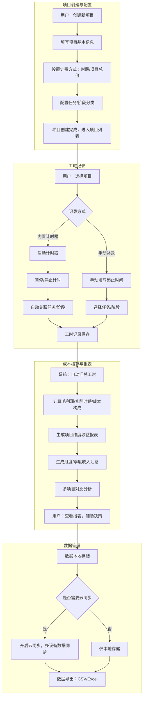
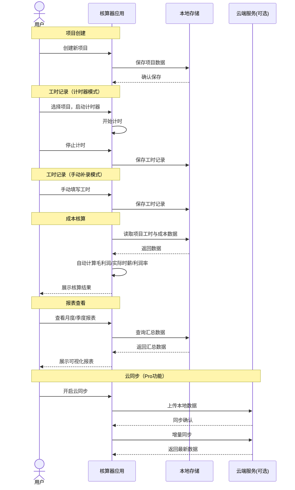
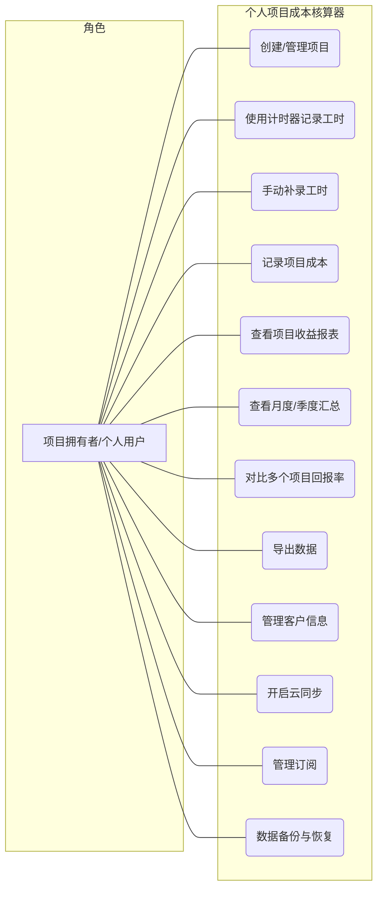
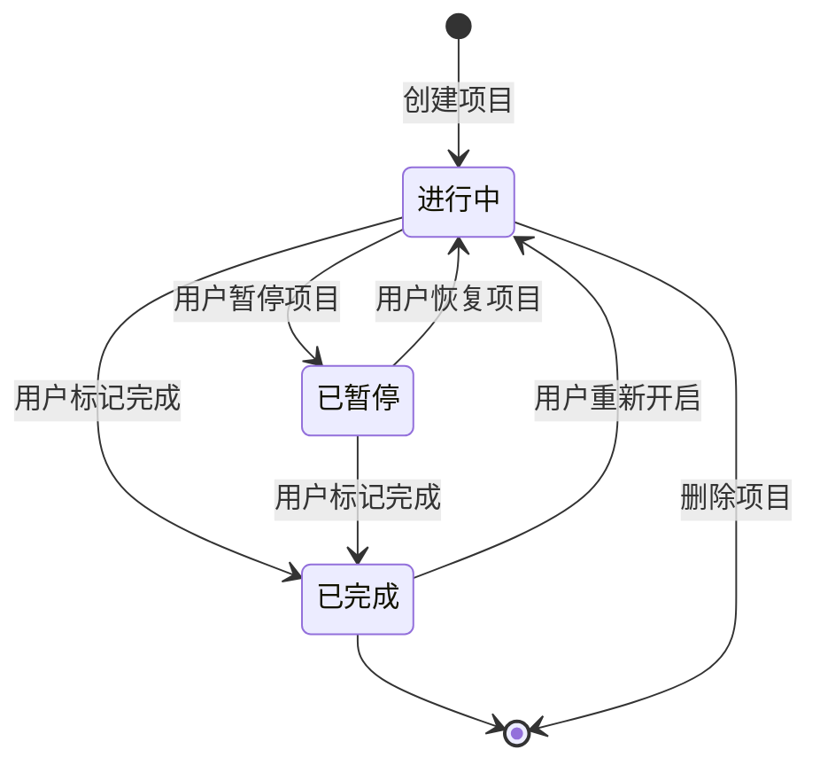
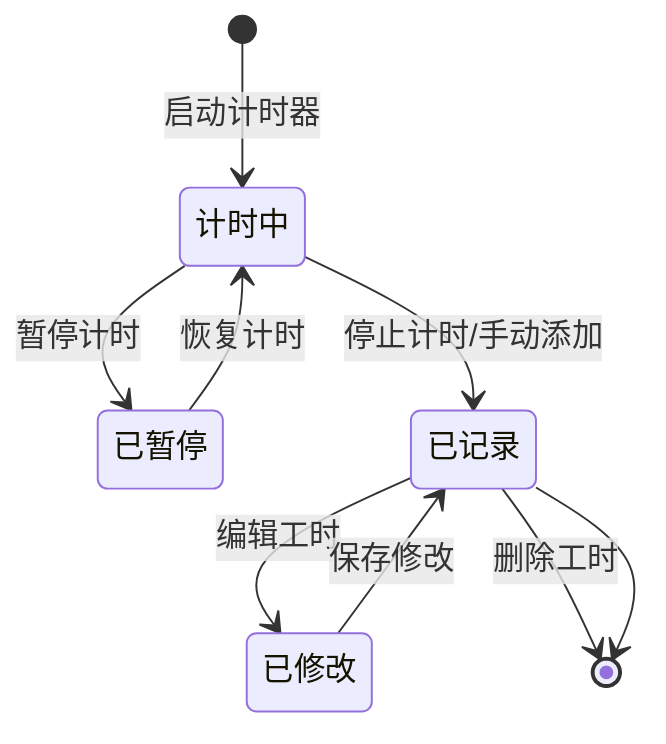
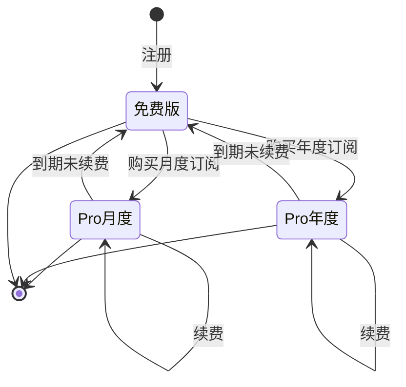

# 个人项目成本核算器V1.0 - 用户需求规格说明书

# 1.需求概述

## 1.1 需求介绍

个人项目成本核算器是一款面向独立开发者、自由职业者及小型工作室的轻量效率工具，帮助用户以"项目"为维度，追踪工作时长、核算项目成本与收益，从而清晰掌握每个项目的真实回报率。区别于传统时间记录工具（如 Toggl、Clockify）仅关注"时间花了多少"，本产品聚焦于"时间值多少钱"——将时间投入与收入挂钩，帮助用户做出更明智的接单决策。

### 1.1.1 所属领域

效率工具、个人财务管理、自由职业者/独立开发者工具

## 1.2 需求目标

- 帮助用户按项目记录工作时长，支持内置计时器与手动补录，并可按任务或阶段分类
- 支持按时间或项目维度自动核算毛利润、实际时薪、成本构成等核心指标
- 提供可视化项目收益报表，支持月度/季度收入汇总，直观对比不同项目的真实回报率
- 以本地存储为主，可选云同步，实现零后端依赖的轻量化MVP
- 提供免费版与Pro版两种模式，满足从轻度到专业的不同需求层级

## 1.3 系统使用角色

本系统面向单一核心角色：

1. **项目拥有者（个人用户）**: 独立开发者、自由职业者、小型工作室成员或个人创业者，通过本工具管理自己的项目时间投入与收益核算。用户同时是计时者、成本核算者和报表查看者。

## 1.4 业务流程图

# 2.功能原型

## 2.1 原型清单

| 原型名称 | 原型链接 | 对应端 | 备注 |
| --- | --- | --- | --- |
| 个人项目成本核算器-Web端原型 |  | WEB端 | V1.0 MVP版本 |
| 个人项目成本核算器-移动端原型 |  | APP端 | V1.1 后续版本 |

# 3.需求清单

## 3.1 个人项目成本核算器-WEB端

| 序号 | 功能模块 | 一级功能 | 二级功能 | 功能描述 | 优先级 | 备注 |
| --- | --- | --- | --- | --- | --- | --- |
| 1 | 账户与订阅 | 账户管理 | 注册/登录 | 支持邮箱注册、第三方登录（微信/GitHub），创建个人账户 | 1 | |
| 2 | | | 个人信息管理 | 管理头像、昵称、默认货币、时区等个人偏好设置 | 1 | |
| 3 | | 订阅管理 | 订阅计划查看 | 展示当前订阅状态（免费版/Pro版），显示剩余活跃项目数/总项目数 | 1 | |
| 4 | | | 订阅升级/续费 | 支持升级为Pro版（¥19/月或¥168/年），集成支付功能 | 1 | |
| 5 | | | 免费版限制提示 | 当活跃项目超过3个时，提示升级并引导至订阅页面 | 1 | |
| 6 | 项目管理 | 项目列表 | 项目总览 | 以卡片或列表形式展示所有项目，包括项目名称、客户、状态、进度、毛利润等关键信息 | 1 | |
| 7 | | | 项目筛选与搜索 | 支持按项目状态（进行中/已完成/已暂停）、客户、时间范围筛选，支持关键词搜索 | 1 | |
| 8 | | | 项目排序 | 支持按创建时间、最近活跃、利润率、总收入等维度排序 | 2 | |
| 9 | | 项目创建 | 新建项目 | 填写项目名称、描述、客户信息，选择计费方式（时薪/项目总价），设置金额 | 1 | |
| 10 | | | 任务/阶段分类配置 | 为项目配置任务类型（如开发、设计、沟通、测试等）或阶段（如需求、开发、交付），便于工时分类统计 | 1 | |
| 11 | | | 项目预算设置 | 可选设置项目预算工时或预算金额，超出时预警提示 | 2 | Pro功能 |
| 12 | | 项目详情 | 项目概况 | 展示项目基本信息、累计工时、总收入、毛利润、实际时薪、成本构成等核心指标 | 1 | |
| 13 | | | 工时记录管理 | 查看该项目所有工时记录，支持按日期、任务类型筛选，支持编辑和删除 | 1 | |
| 14 | | | 项目状态管理 | 支持将项目标记为进行中/已完成/已暂停，已完成项目不再占用免费版活跃项目名额 | 1 | |
| 15 | | 项目编辑与删除 | 编辑项目信息 | 修改项目名称、描述、客户、计费方式、金额等信息 | 1 | |
| 16 | | | 删除项目 | 删除项目及其所有关联工时记录，操作前需二次确认 | 1 | |
| 17 | 计时器 | 内置计时器 | 启动计时 | 选择当前项目与任务类型后，一键启动计时器，实时显示已用时间 | 1 | |
| 18 | | | 暂停/恢复计时 | 支持暂停计时（如午休），暂停期间不计入工时，可随时恢复 | 1 | |
| 19 | | | 停止计时 | 停止计时器，自动将计时时长保存为一条工时记录，可补充备注 | 1 | |
| 20 | | | 多项目切换 | 计时过程中可快速切换到其他项目/任务（自动停止当前计时） | 2 | |
| 21 | | 手动补录 | 手动添加工时 | 选择项目和日期，填写起止时间或时长，选择任务类型，填写备注 | 1 | |
| 22 | | | 批量补录 | 支持一次性补录多条工时记录（如补录上周遗漏的工时） | 2 | |
| 23 | | | 导入工时 | 支持从CSV文件导入历史工时数据，适配其他工具的导出格式 | 2 | Pro功能 |
| 24 | | 工时记录管理 | 工时列表 | 以时间线或列表形式展示所有工时记录，包括项目、任务类型、起止时间、时长、备注 | 1 | |
| 25 | | | 编辑工时 | 修改工时记录的起止时间、任务类型、备注等信息 | 1 | |
| 26 | | | 删除工时 | 删除工时记录，操作前需二次确认 | 1 | |
| 27 | 成本核算 | 自动核算 | 毛利润计算 | 项目总收入（项目总价或时薪×工时）减去可记录成本（如外包费用、软件订阅、硬件摊销等），自动计算毛利润 | 1 | |
| 28 | | | 实际时薪计算 | 项目毛利润 ÷ 总投入工时 = 实际时薪，帮助用户了解每小时真实收益 | 1 | |
| 29 | | | 成本构成分析 | 将成本按类型（时间成本、外包成本、工具成本等）拆分，展示成本构成饼图 | 1 | |
| 30 | | | 利润率计算 | 毛利润 ÷ 总收入 × 100% = 利润率，直观展示项目盈利水平 | 1 | |
| 31 | | 成本记录 | 添加成本项 | 为项目添加各类成本记录（外包费、软件费、差旅费等），支持金额、日期、备注 | 1 | |
| 32 | | | 成本分类管理 | 预设常用成本分类（外包、工具、硬件、差旅等），支持自定义分类 | 2 | |
| 33 | | | 定期成本自动计入 | 设置周期性成本（如月度软件订阅费），系统自动按期分摊计入项目 | 2 | Pro功能 |
| 34 | 报表与可视化 | 项目报表 | 单项目收益报表 | 展示单个项目的工时分布、成本构成、毛利润、实际时薪、利润率等详细数据 | 1 | |
| 35 | | | 工时趋势图 | 以折线图/柱状图展示项目每日/每周/每月工时变化趋势 | 1 | |
| 36 | | | 任务类型分布 | 以饼图展示项目工时在各任务类型上的分配比例 | 1 | |
| 37 | | 汇总报表 | 月度收入汇总 | 汇总当月所有项目的收入、工时、利润数据 | 1 | |
| 38 | | | 季度收入汇总 | 汇总当季所有项目的收入、工时、利润数据，支持同比/环比分析 | 1 | |
| 39 | | | 年度总览 | 全年收入趋势、最佳/最差项目排名、总工时统计 | 2 | Pro功能 |
| 40 | | 多项目对比 | 项目回报率对比 | 以柱状图/雷达图对比多个项目的利润率、实际时薪、总工时 | 1 | |
| 41 | | | 项目排行榜 | 按利润率/实际时薪/总收入等维度对项目进行排名 | 2 | |
| 42 | | | 时间维度对比 | 对比同一项目在不同月份的表现，观察项目盈利趋势 | 2 | Pro功能 |
| 43 | | 数据导出 | 导出报表 | 支持将报表导出为PDF格式，便于分享和存档 | 2 | Pro功能 |
| 44 | | | 导出数据 | 支持将工时数据、成本数据导出为CSV/Excel格式 | 2 | Pro功能 |
| 45 | 客户管理 | 客户列表 | 客户信息管理 | 管理所有客户的基本信息（名称、联系方式、备注），查看每个客户关联的项目列表 | 2 | Pro功能 |
| 46 | | | 客户维度汇总 | 按客户维度汇总项目数量、总收入、总工时、平均利润率 | 2 | Pro功能 |
| 47 | | 客户新增与编辑 | 添加客户 | 在创建项目时新建客户或关联已有客户 | 2 | Pro功能 |
| 48 | | | 编辑客户信息 | 修改客户名称、联系方式等信息 | 2 | Pro功能 |
| 49 | 数据与同步 | 本地存储 | 数据持久化 | 所有数据默认保存在本地浏览器（IndexedDB/localStorage），无需后端服务 | 1 | |
| 50 | | | 本地数据备份 | 支持手动将全部数据导出为JSON文件进行备份 | 1 | |
| 51 | | | 本地数据恢复 | 支持从JSON备份文件恢复数据 | 1 | |
| 52 | | 云同步 | 开启云同步 | 注册/登录后可开启云同步，数据自动同步至云端，支持多设备访问 | 2 | Pro功能 |
| 53 | | | 同步状态显示 | 显示当前数据同步状态（已同步/同步中/同步失败），支持手动触发同步 | 2 | Pro功能 |
| 54 | | | 冲突处理 | 当多设备数据冲突时，提示用户选择保留哪个版本 | 2 | Pro功能 |
| 55 | | 多币种支持 | 货币设置 | 设置项目使用的货币类型（CNY/USD/EUR等），支持汇率配置 | 2 | Pro功能 |
| 56 | | | 多币种报表 | 报表中展示不同币种的项目数据，支持统一转换为默认货币显示 | 2 | Pro功能 |

# 4.非功能需求

## 4.1 使用界面需求

| 需求项 | 详细描述 | 备注 |
| --- | --- | --- |
| 设计风格 | 简洁、专业、数据驱动的仪表盘风格，强调信息密度与可读性的平衡 | P0 |
| 主色调 | 使用沉稳的蓝色系（#2563EB）作为主色，配合绿色（盈利）/红色（亏损）辅助色 | P0 |
| 数据可视化 | 图表交互流畅，支持hover查看数据详情，支持时间范围缩放 | P0 |
| 响应式设计 | 适配桌面端（1280px+）、平板端（768px-1279px），移动端在后续版本支持 | P0 |
| 深色模式 | 支持浅色/深色主题切换，满足长时间使用场景 | P1 |
| 快捷键 | 支持常用快捷键（如空格启停计时器、N新建项目等），提升效率 | P2 |
| 空状态 | 新建用户引导页，包含示例项目快速体验入口 | P1 |

## 4.2 软硬件环境需求

| 需求项 | 详细描述 | 备注 |
| --- | --- | --- |
| 浏览器支持 | Chrome 90+、Firefox 90+、Safari 15+、Edge 90+ | P0 |
| 运行环境 | 纯前端应用（静态部署），可选云同步服务 | P0 |
| 本地存储 | 需要浏览器支持IndexedDB（≥50MB存储空间） | P0 |
| 网络要求 | 基础功能无需联网，云同步功能需网络连接 | P0 |

## 4.3 性能需求

| 需求项 | 详细描述 | 备注 |
| --- | --- | --- |
| 页面加载 | 首屏加载 < 2.0秒（无网络依赖，离线可用） | P0 |
| 计时器精度 | 计时器精度达秒级，后台标签页切换不影响计时准确性 | P0 |
| 数据查询 | 本地数据查询/筛选响应 < 0.5秒（支持1000+项目、10000+工时记录） | P0 |
| 报表渲染 | 图表渲染 < 1.0秒（50个项目规模） | P0 |
| 数据导出 | 10000条记录导出 < 3.0秒 | P1 |
| 数据同步 | 云同步增量同步 < 5.0秒（良好网络环境下） | P1 |

## 4.4 约束性需求

| 需求项 | 详细描述 | 备注 |
| --- | --- | --- |
| 数据存储 | MVP阶段以本地存储为核心，不强制依赖后端服务 | P0 |
| 免费版限制 | 免费版最多3个活跃项目（已完成项目不计入），基础统计功能可用 | P0 |
| Pro版功能边界 | Pro版包含：无限项目、高级报表、客户管理、数据导出、多币种、云同步 | P0 |
| 隐私保护 | 用户数据默认本地存储，云同步采用端到端加密，平台不查看用户财务数据 | P0 |
| 离线可用 | 核心功能（计时、记录、核算、报表）在无网络环境下完全可用 | P0 |
| 后台服务 | 是，云同步功能需要后端服务支撑；但MVP核心功能无后端依赖 | P0 |
| 技术选型 | 前端推荐Vue 3 / React + 本地存储方案（IndexedDB），可选云同步后端 | P1 |

# 5.接口需求

## 5.1 硬件接口需求

本系统为纯软件应用，不涉及硬件接口需求。

## 5.2 软件接口需求

| 模块 | 接口名称 | 输入 | 输出 | 功能描述 |
| --- | --- | --- | --- | --- |
| 用户认证 | 邮箱注册/登录 | 邮箱、密码 | Token、用户信息 | 用户注册与登录 |
| | 第三方登录 | OAuth授权码 | Token、用户信息 | 支持微信/GitHub第三方登录 |
| 项目服务 | 创建项目 | 项目数据 | 项目ID | 创建新项目 |
| | 项目列表 | 筛选条件、分页 | 项目列表 | 获取项目列表 |
| | 项目详情 | 项目ID | 项目详情 | 获取单个项目详情 |
| | 更新项目 | 项目ID、更新数据 | 更新结果 | 更新项目信息 |
| | 删除项目 | 项目ID | 删除结果 | 删除项目及关联数据 |
| 工时服务 | 启动计时器 | 项目ID、任务类型 | 计时器ID、开始时间 | 启动内置计时器 |
| | 停止计时器 | 计时器ID | 工时记录 | 停止计时并保存工时记录 |
| | 手动添加工时 | 项目ID、起止时间、任务类型 | 工时记录ID | 手动添加/补录工时 |
| | 工时列表 | 项目ID、时间范围、筛选条件 | 工时记录列表 | 获取工时记录列表 |
| | 更新工时 | 工时ID、更新数据 | 更新结果 | 修改工时记录 |
| | 删除工时 | 工时ID | 删除结果 | 删除工时记录 |
| 成本服务 | 添加成本项 | 项目ID、金额、分类、日期 | 成本ID | 为项目添加成本记录 |
| | 成本列表 | 项目ID、筛选条件 | 成本记录列表 | 获取成本记录列表 |
| | 核算结果 | 项目ID | 核算数据 | 计算毛利润、实际时薪、利润率等 |
| 报表服务 | 项目收益报表 | 项目ID | 报表数据 | 获取单项目详细报表 |
| | 月度汇总 | 年月 | 汇总数据 | 获取月度收入汇总 |
| | 季度汇总 | 季度 | 汇总数据 | 获取季度收入汇总 |
| | 多项目对比 | 项目ID列表 | 对比数据 | 多项目回报率对比 |
| 数据同步 | 数据上传 | 增量数据 | 同步结果 | 将本地数据同步至云端 |
| | 数据下载 | 时间戳 | 增量数据 | 从云端拉取最新数据 |
| | 冲突检测 | 本地版本、云端版本 | 冲突列表 | 检测数据冲突 |
| 数据导出 | 导出CSV | 数据类型、时间范围 | CSV文件 | 导出工时/成本数据 |
| | 导出PDF | 报表类型、时间范围 | PDF文件 | 导出报表为PDF |
| 支付服务 | 创建订阅 | 订阅计划 | 支付参数 | 发起Pro版订阅支付 |
| | 支付回调 | 支付结果 | 确认信息 | 处理支付结果，更新订阅状态 |

## 5.4 通讯接口需求

| 模块 | 接口名称 | 输入 | 输出 | 功能描述 |
| --- | --- | --- | --- | --- |
| 云同步通讯 | WebSocket长连接 | 同步事件 | 同步确认 | 实时数据同步，多设备即时更新 |
| | HTTP增量同步 | 时间戳、增量数据 | 同步结果 | 离线恢复后的增量同步 |
| 消息通知 | 浏览器通知 | 通知内容 | 推送结果 | 计时提醒、预算预警等本地通知 |
| 第三方通讯 | OAuth授权 | 授权请求 | 授权码 | 微信/GitHub等第三方登录授权 |
| | 支付通知 | 支付事件 | 通知确认 | 订阅到期、支付成功等通知 |

# 6. 附录

## 流程图

详见1.4章节业务流程图。

## 时序图

## （用户与系统交互）用例图

## （系统）状态图

### 项目生命周期状态图

### 工时记录状态图

### 订阅状态图

