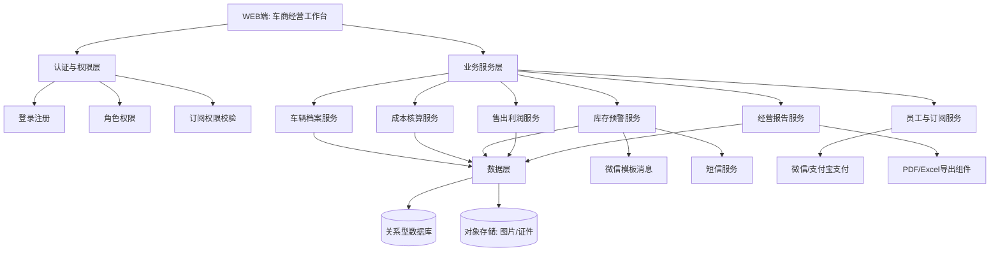
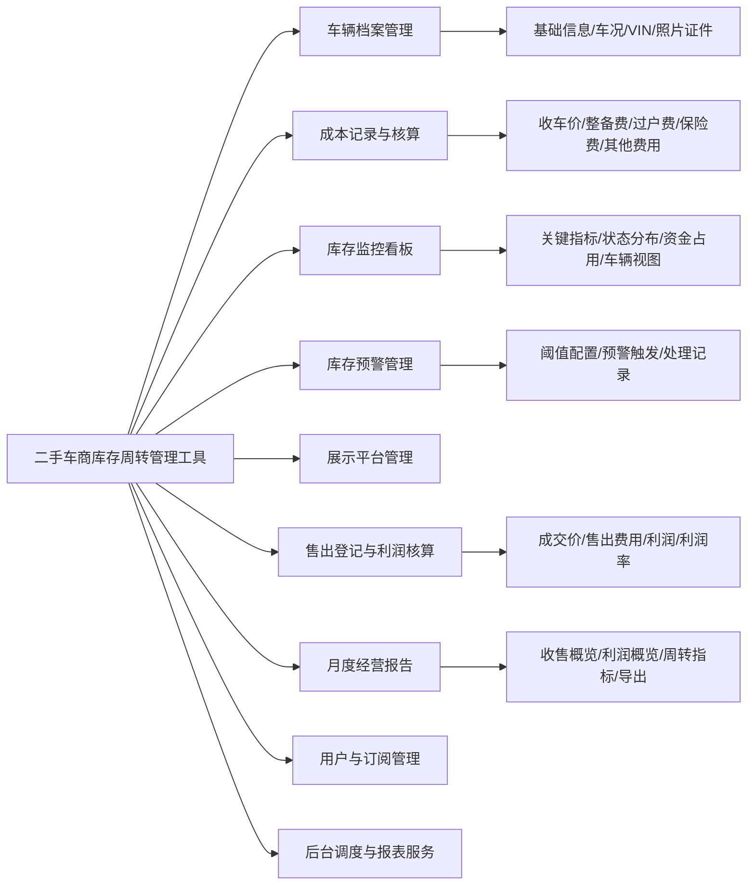
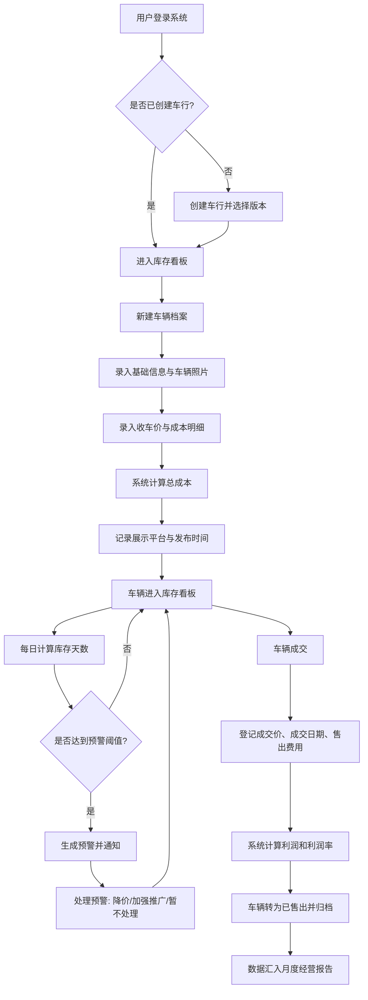
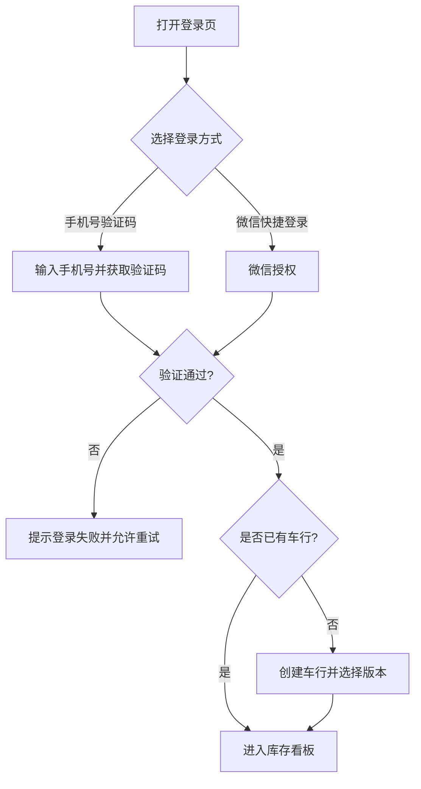
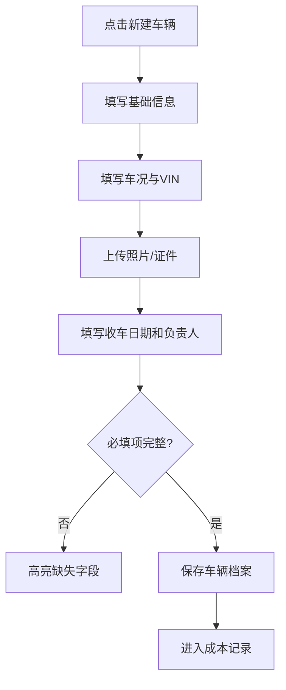
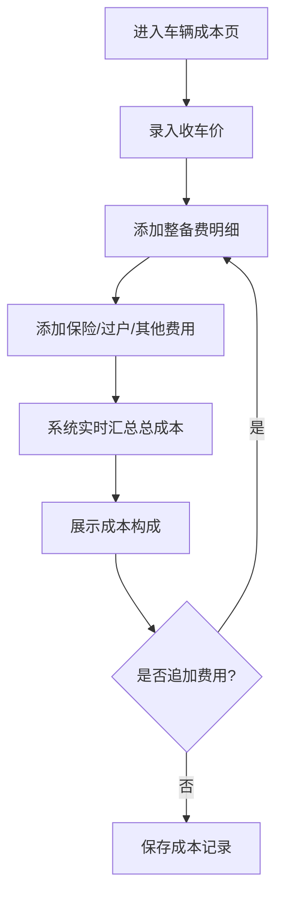
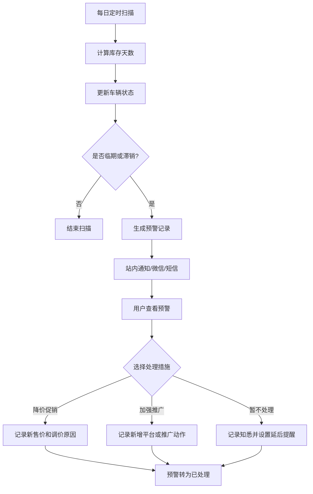
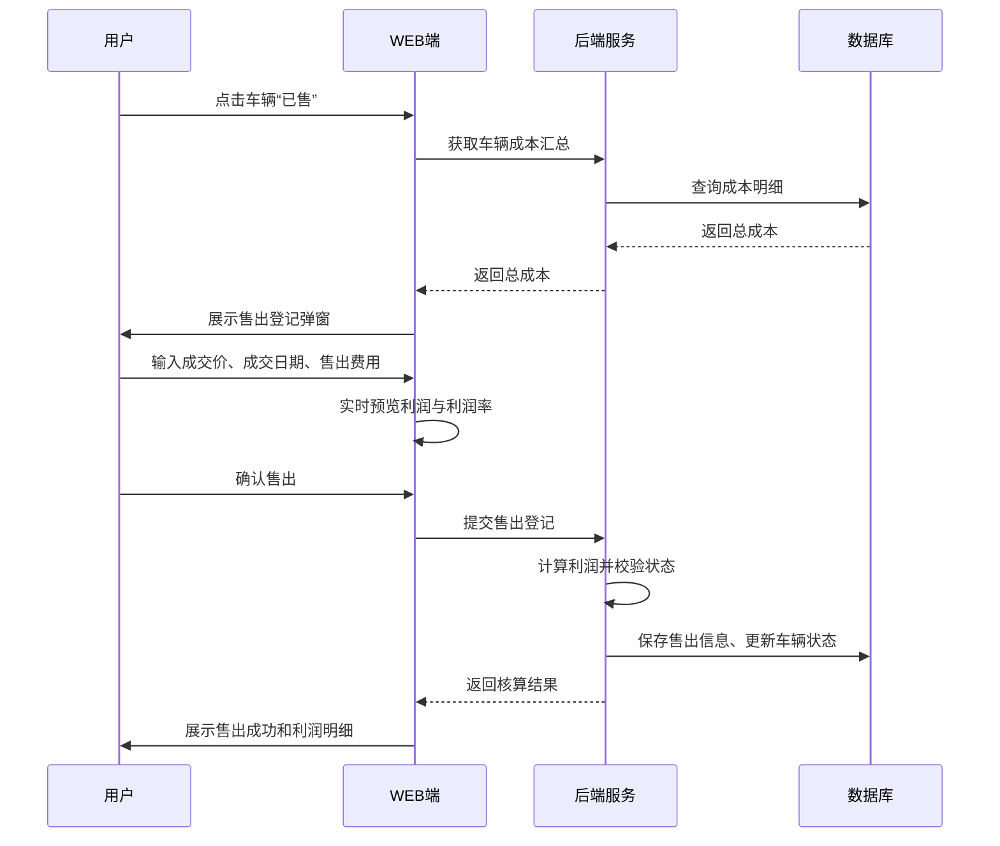
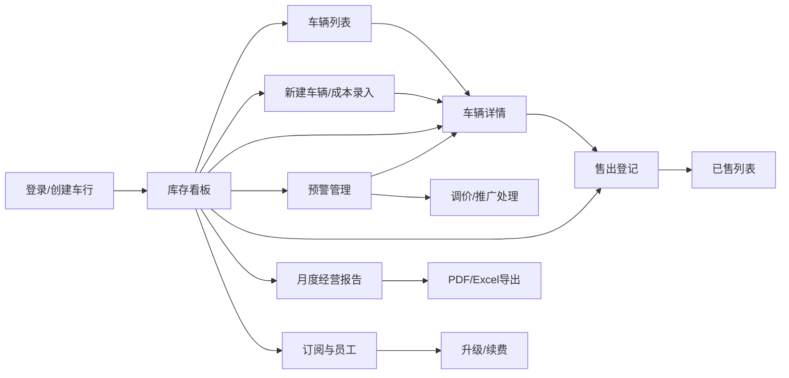

# 二手车商库存周转管理工具 — 产品需求文档（PRD）

> 版本：V1.0  
> 日期：2026-06-29  
> 文档类型：产品需求文档（Product Requirements Document）  
> 需求来源：`需求文档.md`（用户需求说明书 URS）  
> 产品阶段：MVP 产品设计  

---

## 变更历史

| 版本号 | 变更日期 | 变更内容 | 变更人 | 审核人 |
| --- | --- | --- | --- | --- |
| V1.0 | 2026-06-29 | 基于 URS 创建二手车商库存周转管理工具 PRD，补充产品设计、功能流程、数据需求、非功能需求与原型链接 | 产品文档结对写作专家 | 阶段一产品落地页文档总编辑 |

---

# 1 概述

## 1.1 需求背景

独立二手车商通常以 1-20 人小团队经营，车辆收购、整备、挂售、调价、售出和利润复盘大量依赖 Excel、纸笔或聊天记录。该方式存在三类突出问题：

1. **单车利润不清**：收车价、整备费、保险费、过户费、停车费、平台服务费分散记录，售出后难以及时确认单车真实利润。
2. **库存周转不透明**：车行老板很难一眼看出哪些车已压库过久、资金主要占用在哪些车辆上、滞销率是否上升。
3. **经营复盘滞后**：月度收车、售出、利润、毛利率、平均周转天数等指标需要人工汇总，决策反馈慢。

本产品面向中小型二手车商，提供轻量化 Web 工具，以“车辆建档—成本归集—库存监控—预警处理—售出核算—经营报告”为核心闭环，帮助车商用低学习成本掌握单车利润和库存周转效率。

## 1.2 名词解释

| 名词 | 说明 |
| --- | --- |
| 车辆档案 | 系统中一辆二手车的完整业务记录，包括基础信息、照片证件、成本、展示平台、库存状态、售出信息和历史操作记录。 |
| 收车价 | 车商收购车辆时支付的车辆采购成本，是单车总成本的基础项。 |
| 整备费 | 车辆收购后为达到销售状态而产生的维修、美容、配件、检测等费用。 |
| 总成本 | 单车经营成本汇总，计算公式为：收车价 + 整备费 + 保险费 + 过户费 + 其他费用。 |
| 售出费用 | 车辆成交后发生的中介费、平台服务费、过户代办费等与售出直接相关的费用。 |
| 单车利润 | 单车成交后产生的毛利润，计算公式为：成交价 - 总成本 - 售出费用。 |
| 利润率 | 单车利润占总成本比例，计算公式为：单车利润 / 总成本 × 100%。 |
| 库存天数 | 车辆自收车日期起至当前日期或成交日期的天数。 |
| 新鲜车辆 | 库存天数 0-15 天的车辆，默认使用绿色状态标识。 |
| 正常车辆 | 库存天数 16-45 天的车辆，默认使用黄色状态标识。 |
| 临期车辆 | 库存天数 46-60 天的车辆，默认使用橙色状态标识。 |
| 滞销车辆 | 库存天数超过 60 天的车辆，默认使用红色状态标识并触发预警。 |
| 滞销率 | 滞销车辆数 / 当前库存车辆总数 × 100%。 |
| 库存周转率 | 指定周期内售出车辆数 / 平均库存车辆数，用于衡量库存流转效率。 |
| 资金占用 | 当前库存车辆总成本金额，代表车商被库存占用的经营资金。 |

## 1.3 产品介绍

二手车商库存周转管理工具是一款面向中小型二手车商的 Web SaaS 产品。产品不面向外部买家展示车辆，不提供撮合交易，不做自动估价，而是服务车商内部经营管理。

### 1.3.1 目标用户

| 用户角色 | 典型诉求 |
| --- | --- |
| 车行老板 | 掌握每辆车赚多少钱、哪些库存压钱、月度经营结果是否健康，并管理员工权限和订阅版本。 |
| 销售经理 | 负责车辆建档、成本记录、库存跟进、预警处理和售出登记，需要高效管理全部在售车辆。 |
| 销售员 | 查看自己负责车辆的库存状态、展示平台和售出登记入口，协助更新跟进信息。 |
| 系统管理员 | 维护订阅、支付、预警调度、报表生成等后台服务。 |

### 1.3.2 产品价值

1. **用单车视角核算利润**：每辆车从收购到售出形成独立成本账本。
2. **用库存视角管理资金占用**：库存看板突出库存天数、状态分布和滞销车辆。
3. **用预警机制推动周转**：临期、滞销车辆自动进入处理列表，减少人工漏看。
4. **用报告支持经营复盘**：按月汇总收车、售出、利润、周转和资金占用指标。
5. **用轻量订阅降低使用门槛**：免费版支持 20 台库存，车商版 ¥49/月开放完整能力。

### 1.3.3 范围说明

| 项 | 内容 |
| --- | --- |
| 包含功能 | 账号登录、车辆档案、成本记录、库存看板、库存预警、展示平台记录、售出登记、利润核算、月度经营报告、导出、订阅管理、员工与权限管理。 |
| 不包含功能 | 面向买家的车辆交易平台、在线购车支付、第三方 ERP/DMS 对接、自动市场定价建议、金融贷款审批、保险报价、线索获客投放系统。 |
| MVP 重点 | 车辆档案 + 成本核算 + 库存天数预警 + 售出利润核算 + 月度报告。 |
| 商业版本 | 免费版：最多 20 台库存、基础档案；车商版：不限库存、利润核算、周转预警、经营报告、多员工协作。 |

---

# 2 产品设计

## 2.1 系统架构图

## 2.2 业务模块图

## 2.3 主业务流程

## 2.4 功能图/列表

| 功能模块 | 功能名称 | 优先级 | 功能描述 |
| --- | --- | --- | --- |
| 账号与车行 | 注册登录 | P0 | 支持手机号注册登录、微信快捷登录，首次登录创建车行。 |
| 账号与车行 | 角色权限 | P1 | 支持老板、销售经理、销售员角色，按角色控制价格、利润、员工管理等权限。 |
| 车辆档案 | 新建车辆档案 | P0 | 录入品牌车型、年份、里程、车况、VIN、照片、证件等信息。 |
| 车辆档案 | 车辆列表与搜索 | P0 | 按品牌、状态、库存天数、价格区间、展示平台筛选车辆。 |
| 成本核算 | 成本明细记录 | P0 | 记录收车价、整备费、保险费、过户费、其他费用。 |
| 成本核算 | 总成本自动汇总 | P0 | 自动计算并展示单车总成本和成本构成。 |
| 库存看板 | 经营指标卡片 | P0 | 展示总库存、本月新增、本月售出、资金占用、平均库存天数、滞销率。 |
| 库存看板 | 车辆卡片/列表 | P0 | 展示库存车辆、库存天数、状态标签和快捷操作入口。 |
| 库存预警 | 状态自动标记 | P0 | 根据库存天数标记新鲜、正常、临期、滞销。 |
| 库存预警 | 滞销预警处理 | P0 | 超过 60 天默认触发预警，支持记录降价、加强推广、暂不处理。 |
| 展示平台 | 平台发布记录 | P1 | 记录懂车帝、汽车之家、闲鱼、58 同城等平台发布时间、链接、状态和咨询量。 |
| 售出核算 | 售出登记 | P0 | 登记成交价、成交日期、买方信息、售出费用。 |
| 售出核算 | 利润核算 | P0 | 自动计算单车利润、利润率，并进入已售列表。 |
| 经营报告 | 月度报告生成 | P0 | 自动/手动生成月度收车、售出、利润、周转、资金占用报告。 |
| 经营报告 | 报告导出 | P1 | 支持 PDF、Excel 导出。 |
| 订阅管理 | 免费版限制 | P0 | 免费版最多管理 20 台库存，超出引导升级。 |
| 订阅管理 | 车商版付费 | P1 | 支持 ¥49/月车商版订阅、续费和到期提醒。 |

## 2.5 你的产品有哪些端

| 序号 | 端名称 | 端类型 | 目标用户 | 说明 |
| --- | --- | --- | --- | --- |
| 1 | 车商经营WEB端 | WEB端 | 车行老板、销售经理、销售员 | 本次 MVP 的主要使用端，覆盖车辆建档、库存看板、预警、售出、报告、员工与订阅管理。 |
| 2 | 后台服务端 | 后台服务 | 系统管理员/自动任务 | 无独立界面原型，承载预警扫描、报告生成、订阅校验、通知投递等自动化能力。 |

---

# 3 产品功能

## 3.1 车商经营WEB端功能

### 3.1.1 账号登录与车行初始化

**功能描述**  
用户通过手机号验证码或微信快捷登录进入系统。首次登录时创建车行，填写车行名称、所在城市、联系人、联系电话，并选择免费版或车商版。系统根据订阅版本控制库存上限和功能开放范围。

| 项 | 内容 |
| --- | --- |
| 优先级 | P0 |
| 依赖需求 | URS 3.1.8 用户与订阅管理 |
| 前置条件 | 用户具备可接收验证码的手机号或微信授权身份。 |

**详细流程**

**业务规则与验收标准**

| 类型 | 规则/标准 |
| --- | --- |
| 正常流程 | 用户完成登录后进入库存看板；首次登录必须先创建车行。 |
| 异常流程 | 验证码错误、微信授权失败时展示明确原因，不创建登录态。 |
| 权限规则 | 免费版默认仅老板单账号；车商版可邀请员工。 |
| 验收标准 | 登录成功率、失败提示、创建车行、版本识别均可在测试环境验证。 |

### 3.1.2 车辆档案管理

**功能描述**  
支持新建、编辑、查看、搜索、筛选、删除/归档车辆档案。车辆档案是单车经营闭环的基础数据，必须包含车辆基础信息、车况信息、VIN、照片证件、负责人和收车日期。

| 项 | 内容 |
| --- | --- |
| 优先级 | P0 |
| 依赖需求 | URS 3.1.1 车辆档案管理 |
| 前置条件 | 用户已登录并具备车辆管理权限；免费版库存未超过 20 台。 |

**详细流程**

**字段要求**

| 字段 | 必填 | 规则 |
| --- | --- | --- |
| 品牌/车型 | 是 | 支持级联选择，也允许手动补充。 |
| 年份 | 是 | 年份范围不晚于当前年份 + 1。 |
| 表显里程 | 是 | 非负数字，单位公里。 |
| VIN | 否 | 填写时校验 17 位字符规则，同车行内不允许重复。 |
| 车况评级 | 是 | 优质、良好、一般、较差。 |
| 收车日期 | 是 | 不晚于当前日期。 |
| 车辆照片 | 否 | 支持 JPG/PNG，单张不超过 10MB，最多 20 张。 |

**验收标准**

- 能创建一条完整车辆档案并在库存看板出现。
- 支持按品牌车型、VIN、车牌号、库存状态搜索。
- 老板可删除错误车辆档案，删除前必须二次确认。
- 已售车辆不允许删除，只能进入归档历史。

### 3.1.3 成本记录与核算

**功能描述**  
在车辆档案中记录收车价、整备费、保险费、过户费、其他费用，系统自动计算总成本并展示成本构成。车辆在售期间可追加费用，追加后总成本实时更新。

| 项 | 内容 |
| --- | --- |
| 优先级 | P0 |
| 依赖需求 | URS 3.1.2 成本记录与核算 |
| 前置条件 | 已存在车辆档案。 |

**详细流程**

**业务规则**

| 规则 | 说明 |
| --- | --- |
| 总成本公式 | 总成本 = 收车价 + 整备费 + 保险费 + 过户费 + 其他费用。 |
| 成本条目 | 每条费用包含费用类型、金额、发生日期、备注、录入人。 |
| 修改留痕 | 修改或删除费用条目时记录操作人、时间、修改前后金额。 |
| 权限控制 | 销售员默认不可查看收车价和利润；老板可在权限中开放或关闭。 |
| 免费版限制 | 免费版可记录基础档案和收车价，不开放完整利润核算报表。 |

**验收标准**

- 输入任意费用条目后，总成本金额自动刷新。
- 成本构成按费用类型汇总，金额与明细一致。
- 修改费用后保留修改记录。
- 必填金额为空或小于 0 时无法保存，并展示字段级提示。

### 3.1.4 库存监控看板

**功能描述**  
库存看板是用户登录后的默认首页，展示经营关键指标、状态分布、资金占用、库存车辆卡片/列表，并提供调价、售出登记、详情查看等快捷操作。

| 项 | 内容 |
| --- | --- |
| 优先级 | P0 |
| 依赖需求 | URS 3.1.3 库存监控看板 |
| 前置条件 | 系统内存在库存车辆；无车辆时展示空状态引导。 |

**看板指标**

| 指标 | 计算口径 |
| --- | --- |
| 总库存数 | 当前状态为库存中的车辆数量。 |
| 本月新增 | 收车日期在当月的车辆数量。 |
| 本月售出 | 成交日期在当月的已售车辆数量。 |
| 库存总成本 | 当前库存车辆总成本之和。 |
| 平均库存天数 | 当前库存车辆库存天数平均值。 |
| 滞销率 | 滞销车辆数 / 当前库存车辆数 × 100%。 |

**状态规则**

| 状态 | 默认天数 | 颜色 | 系统行为 |
| --- | --- | --- | --- |
| 新鲜 | 0-15 天 | 绿色 | 正常展示。 |
| 正常 | 16-45 天 | 黄色 | 正常展示。 |
| 临期 | 46-60 天 | 橙色 | 看板高亮并生成临期提示。 |
| 滞销 | >60 天 | 红色 | 触发滞销预警，进入预警列表。 |

**验收标准**

- 看板加载 200 台车辆时首屏在 3 秒内完成。
- 可在卡片视图和列表视图间切换。
- 点击状态标签、品牌、库存天数筛选后列表结果正确。
- 卡片上的“调价”“已售”“详情”入口可跳转到对应流程。

### 3.1.5 库存预警管理

**功能描述**  
系统每日定时扫描库存车辆，按库存天数更新车辆状态，对临期和滞销车辆生成预警。用户可在预警列表中查看、筛选、处理预警，并记录处理措施。

| 项 | 内容 |
| --- | --- |
| 优先级 | P0 |
| 依赖需求 | URS 3.1.4 库存预警管理、后台预警调度服务 |
| 前置条件 | 车辆处于库存中，并具备收车日期。 |

**详细流程**

**业务规则与验收标准**

| 类型 | 内容 |
| --- | --- |
| 阈值配置 | 车商版可自定义新鲜、正常、临期阈值；免费版使用默认阈值且不可修改。 |
| 通知方式 | 站内消息默认开启；微信和短信为车商版功能。 |
| 预警去重 | 同一车辆同一状态每日最多生成一条未处理预警。 |
| 处理记录 | 每次处理必须记录措施、备注、处理人和处理时间。 |
| 验收标准 | 构造库存天数超过阈值的车辆后，系统能生成对应状态和预警记录。 |

### 3.1.6 展示平台管理

**功能描述**  
记录车辆在第三方平台的展示情况，包括平台名称、发布链接、发布时间、展示状态和咨询量，帮助车商评估推广动作是否有效。

| 项 | 内容 |
| --- | --- |
| 优先级 | P1 |
| 依赖需求 | URS 3.1.5 展示平台管理 |
| 前置条件 | 已存在车辆档案。 |

**业务规则**

| 规则 | 说明 |
| --- | --- |
| 平台范围 | 默认支持懂车帝、汽车之家、闲鱼、58 同城、瓜子，也支持自定义平台名称。 |
| 链接记录 | 链接为可选字段，填写时校验 URL 格式。 |
| 状态枚举 | 待发布、已发布、已下架。 |
| 咨询量 | 手动录入非负整数，用于后续推广效果分析。 |

**验收标准**

- 同一车辆可添加多个展示平台。
- 平台状态变更保留最后更新时间。
- 可在车辆列表按展示平台筛选车辆。

### 3.1.7 售出登记与利润核算

**功能描述**  
车辆成交后，用户登记成交价、成交日期、买方信息和售出费用。系统基于车辆总成本自动计算单车利润、利润率，将车辆状态改为已售出，并从库存看板移入已售列表。

| 项 | 内容 |
| --- | --- |
| 优先级 | P0 |
| 依赖需求 | URS 3.1.6 售出登记与利润核算 |
| 前置条件 | 车辆处于库存中，且已录入收车价。 |

**详细流程**

**计算规则**

| 项 | 公式/说明 |
| --- | --- |
| 实际库存天数 | 成交日期 - 收车日期。 |
| 单车利润 | 成交价 - 总成本 - 售出费用。 |
| 利润率 | 单车利润 / 总成本 × 100%。 |
| 整体毛利率 | 统计周期内总利润 / 统计周期内已售车辆总成本 × 100%。 |

**验收标准**

- 登记售出后车辆从库存看板移除，并进入已售列表。
- 利润为负时允许保存，但以亏损样式展示。
- 成交日期早于收车日期时禁止保存。
- 老板可查看利润汇总；无权限用户仅可看到售出状态。

### 3.1.8 月度经营报告

**功能描述**  
每月 1 号自动生成上月经营报告，也支持手动生成指定月份报告。报告展示收售概览、利润概览、库存周转指标、资金占用分析、趋势对比，并支持 PDF/Excel 导出。

| 项 | 内容 |
| --- | --- |
| 优先级 | P0 |
| 依赖需求 | URS 3.1.7 月度经营报告、后台报表统计服务 |
| 前置条件 | 车商版用户；系统存在车辆、成本或售出数据。 |

**报告内容**

| 模块 | 指标 |
| --- | --- |
| 收售概览 | 本月收车数、本月售出数、净增库存数、期末库存数。 |
| 利润概览 | 本月总利润、平均单车利润、整体毛利率、最高利润车辆、亏损车辆数。 |
| 周转指标 | 平均周转天数、库存周转率、滞销率、临期车辆数。 |
| 资金占用 | 期末库存总成本、滞销车辆占用资金、估算资金占用成本。 |
| 趋势对比 | 与上月相比的收车、售出、利润、滞销率变化。 |

**验收标准**

- 每月 1 号自动生成上月报告。
- 手动选择月份后可生成或重新生成报告。
- 指标口径与车辆、成本、售出数据一致。
- PDF/Excel 导出文件可下载且内容完整。

### 3.1.9 用户、订阅与员工管理

**功能描述**  
支持查看当前版本、库存使用量、升级/续费车商版、管理员工账号和角色权限。系统在用户新建车辆、访问利润核算、使用预警通知和报告导出时进行订阅权限校验。

| 项 | 内容 |
| --- | --- |
| 优先级 | P1 |
| 依赖需求 | URS 3.1.8 用户与订阅管理、后台用户订阅服务 |
| 前置条件 | 用户已创建车行。 |

**版本权益**

| 功能 | 免费版 | 车商版（¥49/月） |
| --- | --- | --- |
| 库存管理上限 | 20 台 | 不限 |
| 基础车辆档案 | 支持 | 支持 |
| 完整利润核算 | 不支持 | 支持 |
| 周转预警 | 基础状态显示 | 支持站内/微信/短信预警 |
| 月度经营报告 | 不支持 | 支持 |
| 多员工协作 | 不支持 | 支持 |
| 数据导出 | 基础导出 | 全量导出 |

**验收标准**

- 免费版第 21 台库存创建时拦截并展示升级引导。
- 车商版可邀请员工并设置角色。
- 订阅到期前 7 天、3 天、1 天展示续费提醒。
- 支付成功后订阅状态实时更新。

## 3.2 后台服务端功能

### 3.2.1 预警调度服务

每日定时扫描库存车辆，计算库存天数，更新状态标签，生成临期/滞销预警，并按用户配置投递站内、微信或短信通知。

| 项 | 内容 |
| --- | --- |
| 优先级 | P0 |
| 触发方式 | 每日定时任务，支持管理员手动补跑。 |
| 验收标准 | 1000 台以内车辆扫描在 5 分钟内完成，状态计算准确。 |

### 3.2.2 报表统计服务

按月汇总车辆、成本、售出和库存快照数据，计算经营报告指标并生成 PDF/Excel 导出文件。

| 项 | 内容 |
| --- | --- |
| 优先级 | P0 |
| 触发方式 | 每月自动生成、用户手动生成。 |
| 验收标准 | 指定月份报告在 10 秒内生成，导出文件可正常打开。 |

### 3.2.3 用户订阅服务

校验免费版/车商版权益、处理支付订单、接收支付回调、更新订阅状态、发送到期提醒。

| 项 | 内容 |
| --- | --- |
| 优先级 | P1 |
| 触发方式 | 用户访问受限功能、发起支付、支付回调、到期提醒定时任务。 |
| 验收标准 | 订阅状态变化后，功能权限在下一次访问时生效。 |

---

# 4 产品原型

## 4.1 页面跳转逻辑图

## 4.2 全站点原型设计

### 4.2.1 车商经营WEB端

**页面清单：**

| 序号 | 页面名称 | 所属模块 | 页面描述 | 关键元素 |
| --- | --- | --- | --- | --- |
| 1 | 库存看板 | 库存监控看板 | 默认首页，展示经营指标、状态分布、资金占用和车辆卡片 | KPI 卡片、状态图、车辆卡片、快捷操作 |
| 2 | 车辆列表 | 车辆档案管理 | 车辆库存表格与筛选搜索 | 搜索框、筛选器、表格、状态标签 |
| 3 | 新建车辆/成本录入 | 车辆档案管理、成本核算 | 录入车辆基础信息和成本明细 | 分组表单、成本条目、自动汇总 |
| 4 | 车辆详情 | 车辆档案、展示平台 | 查看单车档案、成本构成、平台记录和调价历史 | 详情卡片、成本构成、平台列表、时间线 |
| 5 | 预警管理 | 库存预警管理 | 查看临期/滞销车辆并记录处理措施 | 预警列表、处理按钮、措施记录 |
| 6 | 售出登记 | 售出登记与利润核算 | 登记成交信息并实时预览利润 | 成交价、售出费用、利润预览、确认按钮 |
| 7 | 月度经营报告 | 月度经营报告 | 查看月度收售、利润、周转、资金占用指标 | 月份选择、指标卡、趋势图、导出按钮 |
| 8 | 订阅与员工 | 用户与订阅管理 | 查看版本权益、升级续费、员工角色管理 | 版本卡、权益表、员工列表、邀请按钮 |

**交互说明：**

1. 左侧导航点击后在单文件 HTML 内切换页面，不刷新浏览器。
2. 库存看板中“新建车辆”“处理预警”“登记售出”“查看报告”均可跳转到对应页面。
3. 车辆状态使用颜色区分：绿色新鲜、黄色正常、橙色临期、红色滞销。
4. 售出登记页输入成交价与售出费用后，原型内展示利润预览区域。
5. 列表、筛选、图表为高保真静态数据演示，体现目标布局和交互入口。
6. 空状态、加载态、错误态在 PRD 中作为验收要求，原型以正常业务数据为主。

**产品原型：**

[打开车商经营WEB端全站点原型](产品原型.html)

---

# 5 数据需求

## 5.1 数据使用规格

### 5.1.1 车辆档案数据

| 字段 | 是否必填 | 描述 | 数据类型 |
| --- | --- | --- | --- |
| vehicle_id | 是 | 车辆唯一标识 | 字符串 |
| shop_id | 是 | 所属车行标识 | 字符串 |
| brand | 是 | 品牌 | 字符串 |
| model | 是 | 车型 | 字符串 |
| year | 是 | 年份 | 数字 |
| mileage | 是 | 表显里程，单位公里 | 数字 |
| vin | 否 | 17 位车辆识别代号 | 字符串 |
| plate_no | 否 | 车牌号 | 字符串 |
| condition_level | 是 | 车况评级 | 枚举 |
| purchase_date | 是 | 收车日期 | 日期 |
| owner_user_id | 否 | 负责人 | 字符串 |
| status | 是 | 库存状态：新鲜/正常/临期/滞销/已售/已归档 | 枚举 |
| photo_urls | 否 | 车辆图片地址集合 | 数组 |
| document_urls | 否 | 证件附件地址集合 | 数组 |

### 5.1.2 成本与利润数据

| 字段 | 是否必填 | 描述 | 数据类型 |
| --- | --- | --- | --- |
| cost_id | 是 | 成本条目唯一标识 | 字符串 |
| vehicle_id | 是 | 所属车辆 | 字符串 |
| cost_type | 是 | 收车价/整备费/保险费/过户费/其他费用 | 枚举 |
| amount | 是 | 金额，单位元 | 数字 |
| occurred_at | 是 | 费用发生日期 | 日期 |
| remark | 否 | 费用备注 | 字符串 |
| created_by | 是 | 录入人 | 字符串 |
| total_cost | 是 | 单车总成本汇总值 | 数字 |
| sell_price | 售出时必填 | 成交价 | 数字 |
| sell_date | 售出时必填 | 成交日期 | 日期 |
| sell_expense | 否 | 售出费用 | 数字 |
| gross_profit | 售出后生成 | 单车利润 | 数字 |
| gross_margin | 售出后生成 | 单车利润率 | 数字 |

### 5.1.3 预警与报告数据

| 字段 | 是否必填 | 描述 | 数据类型 |
| --- | --- | --- | --- |
| alert_id | 是 | 预警记录唯一标识 | 字符串 |
| vehicle_id | 是 | 预警车辆 | 字符串 |
| alert_level | 是 | 临期/滞销 | 枚举 |
| inventory_days | 是 | 触发时库存天数 | 数字 |
| alert_status | 是 | 未处理/已处理/已延后 | 枚举 |
| action_type | 处理时必填 | 降价/加强推广/暂不处理 | 枚举 |
| action_remark | 否 | 处理备注 | 字符串 |
| report_month | 是 | 报告月份 | 年月 |
| total_purchase_count | 是 | 本月收车数 | 数字 |
| total_sold_count | 是 | 本月售出数 | 数字 |
| total_profit | 是 | 本月总利润 | 数字 |
| avg_turnover_days | 是 | 平均周转天数 | 数字 |
| slow_sale_rate | 是 | 滞销率 | 数字 |
| inventory_capital | 是 | 期末库存资金占用 | 数字 |

## 5.2 统计数据

| 统计项 | 统计维度 | 计算说明 | 优先级 |
| --- | --- | --- | --- |
| 库存总成本 | 车行、当前时间 | 当前库存车辆总成本之和 | P0 |
| 平均库存天数 | 车行、当前时间 | 当前库存车辆库存天数平均值 | P0 |
| 滞销率 | 车行、当前时间/月度 | 滞销车辆数 / 库存车辆数 | P0 |
| 月度总利润 | 车行、月份 | 月内已售车辆利润之和 | P0 |
| 整体毛利率 | 车行、月份 | 月内总利润 / 月内已售车辆总成本 | P0 |
| 库存周转率 | 车行、月份 | 月内售出数 / 平均库存数 | P0 |
| 平台咨询量 | 车辆、平台、月份 | 手动录入咨询量汇总 | P2 |

## 5.3 埋点需求

| 页面 | 事件 | 采集字段 | 说明 |
| --- | --- | --- | --- |
| 登录页 | login_success | user_id、login_method、is_new_shop | 分析登录方式与新用户转化。 |
| 库存看板 | dashboard_view | shop_id、inventory_count、slow_sale_count | 分析看板使用频率。 |
| 新建车辆页 | vehicle_create_success | shop_id、vehicle_id、version_type | 衡量车辆建档转化。 |
| 成本页 | cost_item_add | vehicle_id、cost_type、amount | 分析成本记录完整度。 |
| 预警页 | alert_action_submit | alert_id、action_type、inventory_days | 分析预警处理方式。 |
| 售出登记页 | vehicle_sell_success | vehicle_id、profit、gross_margin | 分析利润核算使用情况。 |
| 报告页 | report_export | report_month、export_type | 衡量报告导出需求。 |
| 订阅页 | upgrade_click | user_id、current_version、inventory_count | 分析付费转化触点。 |

---

# 6 非功能需求

## 6.1 性能需求

### 6.1.1 延迟

| 编号 | 项目 | 最大延迟 | 平均延迟 | 优先级 | 备注 |
| --- | --- | --- | --- | --- | --- |
| P-001 | 库存看板首屏加载（200 台车辆以内） | ≤ 3 秒 | ≤ 1.5 秒 | 高 | 含指标卡、状态分布、车辆列表首屏。 |
| P-002 | 车辆档案保存 | ≤ 1 秒 | ≤ 0.5 秒 | 高 | 不含图片上传耗时。 |
| P-003 | 成本总额计算 | ≤ 0.3 秒 | ≤ 0.1 秒 | 高 | 前端实时预览，后端保存时复算。 |
| P-004 | 售出利润核算 | ≤ 1 秒 | ≤ 0.5 秒 | 高 | 提交售出登记后返回利润结果。 |
| P-005 | 月度报告生成 | ≤ 10 秒 | ≤ 5 秒 | 中 | 单车行 500 台历史车辆以内。 |

### 6.1.2 吞吐量

| 编号 | 项 | 吞吐量 | 备注 |
| --- | --- | --- | --- |
| T-001 | 用户登录认证 | 每分钟 500 次 | MVP 阶段容量。 |
| T-002 | 车辆档案保存 | 每分钟 300 次 | 支持业务峰值。 |
| T-003 | 预警扫描 | 1000 台车辆 / 5 分钟 | 单车行级别。 |
| T-004 | 报告导出 | 每分钟 50 个文件 | PDF/Excel 合计。 |

### 6.1.3 容量

| 编号 | 项 | 容量 | 备注 |
| --- | --- | --- | --- |
| C-001 | 免费版库存车辆 | ≤ 20 台 | 硬性限制。 |
| C-002 | 车商版单车行历史车辆 | ≤ 500 台 | MVP 推荐容量。 |
| C-003 | 单车照片 | ≤ 20 张 | 单张 ≤ 10MB。 |
| C-004 | MVP 并发用户 | 200 并发 | 后续扩展到 1000 并发。 |

## 6.2 安全需求

| 编号 | 项 |
| --- | --- |
| S-001 | 全站必须使用 HTTPS，防止车辆成本、利润、客户信息在传输中泄露。 |
| S-002 | 不同车行之间的数据必须严格隔离，用户只能访问所属车行数据。 |
| S-003 | 价格、成本、利润、报告等敏感数据必须按角色权限控制。 |
| S-004 | 支付回调必须校验签名，防止伪造订阅状态。 |
| S-005 | 用户上传图片和附件必须校验类型、大小并进行安全扫描。 |
| S-006 | 删除车辆、确认售出、修改成本等关键操作必须记录审计日志。 |

## 6.3 可靠性

| 编号 | 项 | 值 |
| --- | --- | --- |
| R-001 | 核心服务月可用性 | ≥ 99.5% |
| R-002 | 预警调度任务成功率 | ≥ 99% |
| R-003 | 支付回调处理准确率 | 100%，失败需可重试 |
| R-004 | 月度报告生成失败重试 | 至少自动重试 3 次 |

## 6.4 可连续性

| 编号 | 项 |
| --- | --- |
| B-001 | 系统支持 7 × 24 小时访问，维护窗口需提前通知用户。 |
| B-002 | 预警任务、报表任务和支付回调服务应具备失败重试机制。 |
| B-003 | 关键外部依赖不可用时，系统核心车辆档案与成本记录功能仍可使用。 |

## 6.5 可恢复性

| 编号 | 项 |
| --- | --- |
| REC-001 | 数据库每日全量备份，至少保留 30 天；关键业务数据支持按小时增量备份。 |
| REC-002 | 重大故障需在 4 小时内恢复核心服务，在 24 小时内完成数据一致性核查。 |
| REC-003 | 用户误删车辆档案后，管理员可在 7 天内通过备份或回收机制协助恢复。 |

## 6.6 兼容性

| 编号 | 要求 | 备注 |
| --- | --- | --- |
| COM-001 | 支持 Chrome 90+、Firefox 90+、Edge 90+、Safari 15+ | WEB端主浏览器。 |
| COM-002 | 适配 1280px 及以上桌面分辨率 | 主场景为电脑浏览器。 |
| COM-003 | 兼容 1024px 平板横屏浏览 | 不强制移动端完整适配。 |

## 6.7 易用性

| 编号 | 要求 | 备注 |
| --- | --- | --- |
| U-001 | 普通车商无需培训即可完成新建车辆、录入成本、登记售出三项核心操作。 | 核心路径控制在 3 步内。 |
| U-002 | 所有保存、删除、调价、售出操作需在 500ms 内给出加载或结果反馈。 | 避免重复提交。 |
| U-003 | 列表无数据时展示引导空状态。 | 如“录入第一辆收车信息开始管理库存”。 |
| U-004 | 支持快捷键：N 新建车辆、S 搜索、Esc 关闭弹窗。 | 提升高频用户效率。 |
| U-005 | 状态颜色必须配合文字标签，不仅依赖颜色表达。 | 满足可访问性。 |

---

# 7 总结

## 7.1 上线计划

| 阶段 | 时间 | 内容 | 负责人 |
| --- | --- | --- | --- |
| MVP 设计确认 | 第 1 天 | 确认 PRD、原型、核心字段和版本权益 | 产品经理 |
| MVP 开发 | 第 2-6 天 | 完成车辆档案、成本核算、库存看板、预警、售出、报告基础能力 | 研发团队 |
| 测试验收 | 第 7 天 | 功能测试、权限测试、数据计算校验、浏览器兼容测试 | 测试/产品 |
| 灰度试用 | 第 8-14 天 | 选择 3-5 家中小车商试用，收集操作反馈 | 运营/产品 |
| 正式上线 | 第 15 天 | 开放免费版注册与车商版订阅 | 项目负责人 |

## 7.2 后续迭代规划

| 版本 | 规划功能 |
| --- | --- |
| V1.1 | 增加批量导入 Excel、车辆照片批量压缩、更多报告维度、平台咨询量趋势。 |
| V1.2 | 增加微信端轻量提醒、员工销售业绩排行、更多权限配置项。 |
| V1.3 | 增加可选 VIN 识别、车辆估值参考展示、滞销原因标签分析。 |

## 7.3 参考文档

- [用户需求说明书](需求文档.md)
- [车商经营WEB端全站点原型](产品原型.html)

## 7.4 自审查结果

| 检查项 | 结果 |
| --- | --- |
| 需求描述清晰、无歧义 | 通过 |
| 功能可追溯到 URS 或业务目标 | 通过 |
| 优先级已定义 | 通过 |
| 章节结构与 PRD 模板一致 | 通过 |
| 第 4 章包含 WEB 端全站点原型链接 | 通过 |
| 无 TBD/TODO/占位符 | 通过 |
| 约束范围明确，不包含交易平台和自动定价 | 通过 |
