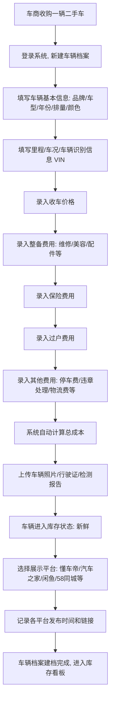
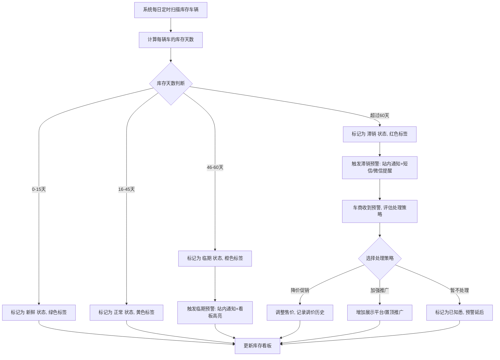
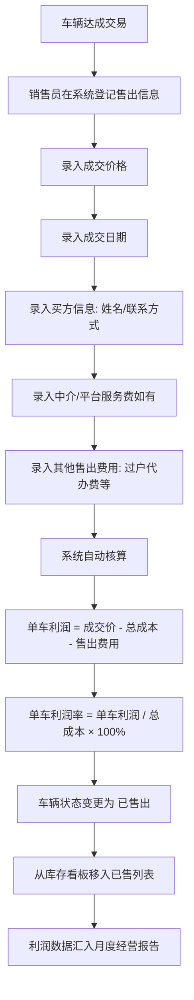
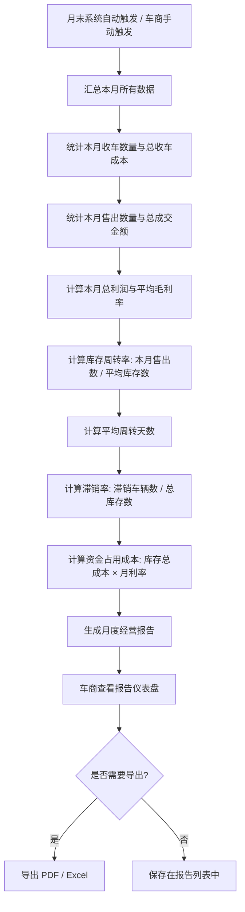
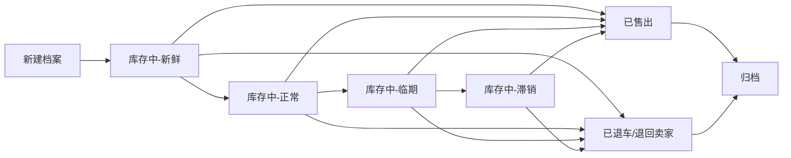
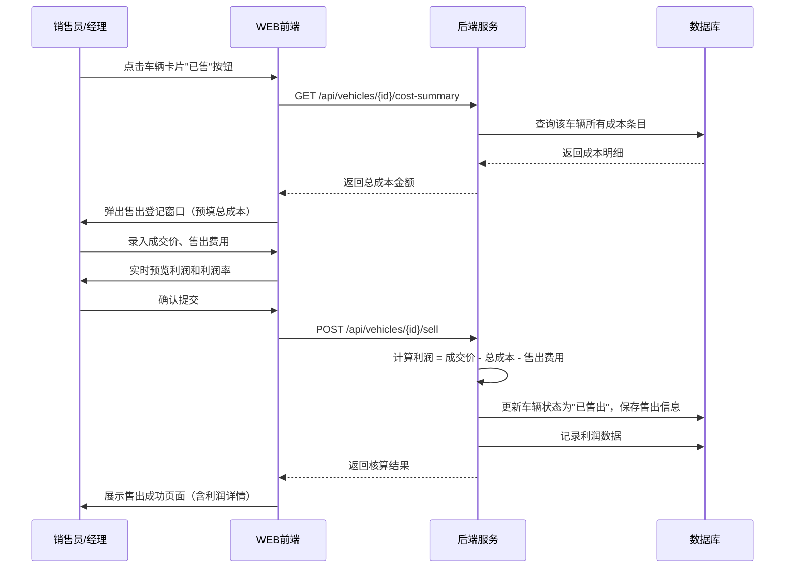
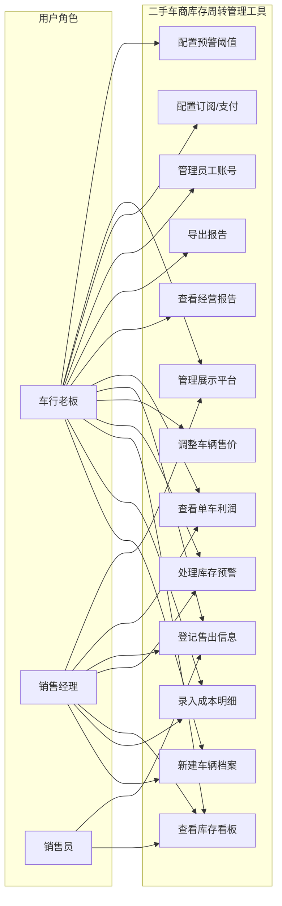
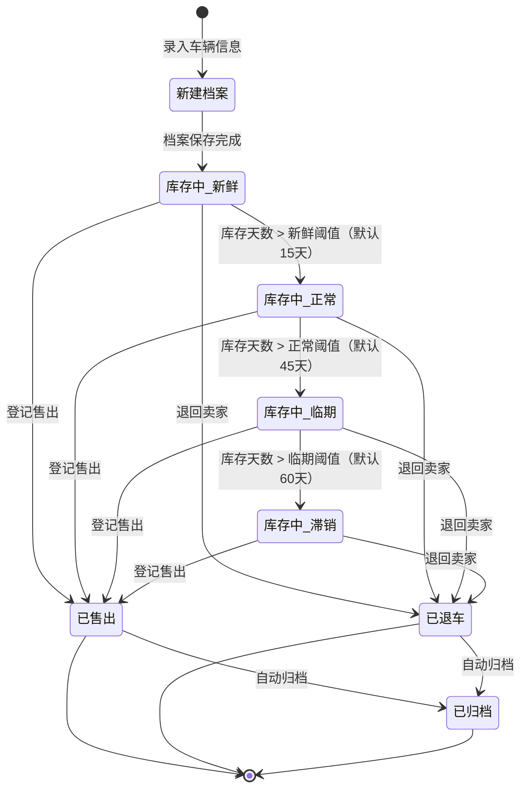

# 二手车商库存周转管理工具 — 用户需求说明书（URS）

> 版本：v1.0.0
> 创建日期：2026-06-29
> 文档状态：待审核

---

# 1. 需求概述

## 1.1 需求介绍

二手车商库存周转管理工具是一款面向独立二手车商（1-20 人中小型车商）的轻量级经营管理工具，聚焦"车辆建档→成本归集→库存周转监控→售出利润核算→经营报告"的全链路闭环场景。产品不做二手车交易/撮合平台（区别于瓜子、懂车帝），也不做重型企业 ERP 或 4S 店 DMS 系统，而是专注解决二手车商最核心的两个经营痛点：**"每台车赚了多少"** 和 **"资金压在哪些车上"**。

通过为每辆收购车建立完整档案（车型/年份/里程/收车价/整备费/过户费），自动汇总总成本；按库存天数自动标记车辆状态（新鲜/正常/滞销），超 60 天未售出自动提醒降价或调整推广策略；售出后自动计算单车利润和整体毛利率，并生成月度经营报告，让车商一目了然掌握"收车-售出-利润-库存周转"全貌。

### 1.1.1 所属领域

垂直行业工具 / 汽车行业 / 二手车经营管理 / 小微企业 SaaS

## 1.2 需求目标

1. **单车利润精算**：为每辆收购车建立完整成本档案（收车价+整备费+保险+过户费+其他费用），自动汇总总成本；售出后一键计算单车利润和利润率，告别纸笔/Excel 的粗放记账。
2. **库存周转可视化**：以看板形式实时展示所有库存车辆的库存天数、状态分布（新鲜/正常/滞销）、资金占用情况，让车商对"钱压在哪台车上"心中有数。
3. **超期自动预警**：库存超过设定阈值（默认 60 天）的车辆自动标记并推送预警通知，提醒车商及时降价或调整推广策略，减少资金占用损失。
4. **月度经营报告**：自动生成月度经营报告（本月收车数/售出数/总利润/毛利率/库存周转率/滞销率/资金占用成本），辅助车商复盘与决策。
5. **低成本快速上手**：MVP 约 7 天可交付，免费版支持 20 台库存管理，车商无需培训即可使用。

## 1.3 系统使用角色

| 角色 | 说明 |
|------|------|
| 车行老板（老板版/车商版） | 车行最高权限角色，可查看所有车辆档案、利润数据、经营报告；管理员工账号与权限；进行调价/降价决策；查看整体经营数据 |
| 销售经理 | 负责日常车辆管理，可新建/编辑车辆档案、登记售出信息、查看库存看板和预警列表；不能查看利润汇总等老板专属数据（可配置） |
| 销售员 | 仅可查看自己负责的车辆档案，更新跟进状态和展示平台发布情况；不能编辑价格等敏感字段 |
| 系统管理员 | 负责系统配置、订阅管理、用户数据统计的后台管理人员 |

## 1.4 业务流程图

### 1.4.1 收车建档与成本归集流程

### 1.4.2 库存监控与预警流程

### 1.4.3 售出登记与利润核算流程

### 1.4.4 月度经营报告生成流程

# 2. 功能原型

| 原型名称 | 原型链接 | 对应端 | 备注 |
| --- | --- | --- | --- |
| 二手车商库存周转管理工具-WEB端 | 见配套 HTML 原型文件 | WEB端 | 主要交互界面，支持车辆建档、库存看板、预警管理、利润核算、经营报告 |
| 二手车商库存周转管理工具-后台服务 | 无独立原型 | 后台服务 | 预警调度、报表统计、用户订阅管理、数据备份 |

# 3. 需求清单

## 3.1 二手车商库存周转管理工具-WEB端

### 3.1.1 车辆档案管理

| 模块 | 一级功能 | 二级功能 | 功能描述 | 备注 |
| --- | --- | --- | --- | --- |
| 车辆档案管理 | 新建车辆档案 | 基本信息录入 | 录入品牌、车型、年份、排量、颜色、变速箱类型、排放标准等车辆基础信息 | 品牌/车型支持级联选择，含常见品牌库 |
| 车辆档案管理 | 新建车辆档案 | 车况信息录入 | 录入表显里程、车况评级（优质/良好/一般/较差）、是否有事故/泡水记录 | |
| 车辆档案管理 | 新建车辆档案 | VIN码录入 | 录入 17 位车辆识别代号（VIN），支持手动输入或拍照识别 | VIN 用于车辆唯一标识，可校验合法性 |
| 车辆档案管理 | 新建车辆档案 | 照片上传 | 上传车辆外观/内饰/发动机舱/底盘等照片，支持多图上传（最多 20 张） | 支持 JPG/PNG，单张 ≤ 10MB |
| 车辆档案管理 | 新建车辆档案 | 证件附件上传 | 上传行驶证、登记证书、检测报告等扫描件或照片 | |
| 车辆档案管理 | 车辆列表 | 车辆浏览 | 以卡片或列表形式展示所有库存车辆，显示品牌车型、收车价、库存天数、当前状态标签 | 默认按库存天数倒序 |
| 车辆档案管理 | 车辆列表 | 车辆搜索 | 支持按车牌号、品牌车型、VIN 码、状态标签进行模糊搜索 | |
| 车辆档案管理 | 车辆列表 | 多条件筛选 | 支持按品牌、库存状态、库存天数区间、收车价格区间、展示平台等多条件组合筛选 | |
| 车辆档案管理 | 车辆详情 | 档案详情查看 | 点击车辆进入详情页，展示完整档案信息、成本构成、展示平台、跟进记录、调价历史 | |
| 车辆档案管理 | 车辆详情 | 编辑档案 | 修改车辆档案信息（价格类字段需老板权限），编辑记录留痕 | |
| 车辆档案管理 | 车辆详情 | 删除/归档 | 删除错误录入的车辆档案（需二次确认）；已售车辆自动归档到历史记录 | 删除需老板权限 |

### 3.1.2 成本记录与核算

| 模块 | 一级功能 | 二级功能 | 功能描述 | 备注 |
| --- | --- | --- | --- | --- |
| 成本记录与核算 | 收车成本 | 收车价录入 | 录入车辆收购价格，支持录入付款方式（全款/分期） | 必填字段，P0 |
| 成本记录与核算 | 整备费用 | 整备费明细录入 | 录入各项整备费用：维修费、美容费、配件费、轮胎更换等，支持多条目明细 | 每条目包含费用类型、金额、备注 |
| 成本记录与核算 | 过户费用 | 过户费录入 | 录入车辆过户相关费用：过户手续费、上牌费、验车费 | |
| 成本记录与核算 | 保险费用 | 保险费录入 | 录入车辆保险费用（交强险/商业险），支持录入保险到期日期 | |
| 成本记录与核算 | 其他费用 | 杂费录入 | 录入其他费用：停车费、违章处理费、物流运输费、仓储费等 | |
| 成本记录与核算 | 自动汇总 | 总成本自动计算 | 系统自动汇总：总成本 = 收车价 + 整备费 + 过户费 + 保险费 + 其他费用 | 核心功能，P0 |
| 成本记录与核算 | 自动汇总 | 成本构成饼图 | 在车辆详情页以饼图展示各项成本占比，直观呈现成本构成 | |
| 成本记录与核算 | 成本调整 | 追加费用 | 车辆在售期间可随时追加新的费用条目，总成本实时更新 | |
| 成本记录与核算 | 成本调整 | 费用修正 | 修改已录入的费用条目（需留痕，保留修改记录） | |

### 3.1.3 库存监控看板

| 模块 | 一级功能 | 二级功能 | 功能描述 | 备注 |
| --- | --- | --- | --- | --- |
| 库存监控看板 | 看板总览 | 数据面板 | 看板顶部展示关键指标：总库存数、本月新增、本月售出、库存总成本、平均库存天数、滞销率 | 核心功能，P0 |
| 库存监控看板 | 看板总览 | 库存状态分布图 | 以饼图/柱状图展示车辆状态分布：新鲜（绿）/正常（黄）/临期（橙）/滞销（红） | |
| 库存监控看板 | 看板总览 | 资金占用分析 | 展示库存总资金占用金额、各状态车辆的资金分布 | |
| 库存监控看板 | 车辆视图 | 卡片视图 | 以卡片形式展示库存车辆，每张卡片显示：车辆照片、品牌车型、收车价、库存天数、状态标签 | 核心功能，P0 |
| 库存监控看板 | 车辆视图 | 列表视图 | 以表格形式展示库存车辆，支持按列排序（库存天数/收车价/总成本等） | |
| 库存监控看板 | 车辆视图 | 状态标签颜色区分 | 不同库存状态使用不同颜色标签：新鲜（绿）/正常（黄）/临期（橙）/滞销（红） | |
| 库存监控看板 | 周转分析 | 月均周转天数 | 计算并展示近 3 个月/6 个月/12 个月的平均库存周转天数 | |
| 库存监控看板 | 周转分析 | 周转趋势图 | 以折线图展示月度库存周转天数的变化趋势 | |
| 库存监控看板 | 周转分析 | 滞销率趋势 | 以折线图展示月度滞销率的变化趋势 | |
| 库存监控看板 | 快速操作 | 快捷调价 | 在看板卡片上直接点击"调价"按钮，弹出快速调价窗口 | 需老板权限 |
| 库存监控看板 | 快速操作 | 快捷登记售出 | 在看板卡片上直接点击"已售"按钮，弹出快速售出登记窗口 | |

### 3.1.4 库存预警管理

| 模块 | 一级功能 | 二级功能 | 功能描述 | 备注 |
| --- | --- | --- | --- | --- |
| 库存预警管理 | 预警规则 | 阈值配置 | 车商可自定义各状态的天数阈值：新鲜天数上限（默认15天）、正常天数上限（默认45天）、临期天数上限（默认60天） | 车商版功能 |
| 库存预警管理 | 预警规则 | 预警方式配置 | 配置预警通知方式：站内消息（默认开启）、微信推送、短信通知 | 微信/短信为车商版功能 |
| 库存预警管理 | 预警触发 | 临期预警 | 库存天数达到临期阈值时，自动触发预警通知，提醒车商关注 | |
| 库存预警管理 | 预警触发 | 滞销预警 | 库存天数超过 60 天（默认阈值）时，触发滞销预警，建议降价或调整推广策略 | 核心功能，P0 |
| 库存预警管理 | 预警列表 | 预警车辆列表 | 单独页面展示所有触发预警的车辆，按预警严重程度排序 | |
| 库存预警管理 | 预警列表 | 标记已处理 | 车商可对预警车辆标记"已处理"，记录处理措施（降价/加强推广/暂不处理） | |
| 库存预警管理 | 预警历史 | 历史预警记录 | 展示已处理和已过期预警的历史记录，支持按时间、车辆、处理结果筛选 | |

### 3.1.5 展示平台管理

| 模块 | 一级功能 | 二级功能 | 功能描述 | 备注 |
| --- | --- | --- | --- | --- |
| 展示平台管理 | 平台登记 | 添加展示平台 | 为车辆添加展示的第三方平台：懂车帝、汽车之家、闲鱼、58 同城、瓜子等 | 支持自定义平台 |
| 展示平台管理 | 平台登记 | 发布链接记录 | 记录车辆在各平台的发布链接 | |
| 展示平台管理 | 平台登记 | 发布时间记录 | 记录车辆在各平台的发布时间 | |
| 展示平台管理 | 平台状态 | 展示状态标记 | 标记各平台的展示状态：已发布/已下架/待发布 | |
| 展示平台管理 | 推广跟踪 | 咨询量记录 | 记录各平台的客户咨询量（手动录入），辅助评估推广效果 | |

### 3.1.6 售出登记与利润核算

| 模块 | 一级功能 | 二级功能 | 功能描述 | 备注 |
| --- | --- | --- | --- | --- |
| 售出登记与利润核算 | 售出登记 | 成交价录入 | 登记车辆成交价格 | 必填，P0 |
| 售出登记与利润核算 | 售出登记 | 成交日期录入 | 登记成交日期，系统自动计算实际库存天数 | |
| 售出登记与利润核算 | 售出登记 | 买方信息录入 | 登记买方姓名、联系方式（可选） | |
| 售出登记与利润核算 | 售出登记 | 售出费用录入 | 录入售出相关费用：中介费、平台服务费、过户代办费等 | |
| 售出登记与利润核算 | 利润核算 | 单车利润自动计算 | 系统自动计算：单车利润 = 成交价 - 总成本 - 售出费用 | 核心功能，P0 |
| 售出登记与利润核算 | 利润核算 | 利润率计算 | 系统自动计算：利润率 = 单车利润 / 总成本 × 100% | |
| 售出登记与利润核算 | 利润核算 | 利润详情展示 | 在车辆详情页展示利润核算明细：各项成本汇总、售出费用、利润金额、利润率 | |
| 售出登记与利润核算 | 已售列表 | 已售车辆列表 | 展示所有已售出的车辆列表，含成交价、利润、利润率、库存天数 | |
| 售出登记与利润核算 | 已售列表 | 利润排行 | 按利润金额/利润率排序，快速查看最赚钱和最亏的车辆 | |
| 售出登记与利润核算 | 利润汇总 | 整体毛利率 | 计算所有已售车辆的整体毛利率 = 总利润 / 总成本 × 100% | 老板可见 |
| 售出登记与利润核算 | 利润汇总 | 分时段利润统计 | 按周/月/季度统计利润情况 | 老板可见 |

### 3.1.7 月度经营报告

| 模块 | 一级功能 | 二级功能 | 功能描述 | 备注 |
| --- | --- | --- | --- | --- |
| 月度经营报告 | 报告生成 | 自动生成 | 每月 1 号自动生成上月经营报告 | 车商版功能，P0 |
| 月度经营报告 | 报告生成 | 手动生成 | 车商可手动生成指定月份的经营报告 | |
| 月度经营报告 | 报告内容 | 收售概览 | 报告包含：本月收车数、售出数、净增减库存数 | |
| 月度经营报告 | 报告内容 | 利润概览 | 报告包含：本月总利润、平均单车利润、整体毛利率 | |
| 月度经营报告 | 报告内容 | 库存周转指标 | 报告包含：月均周转天数、滞销率、库存周转率 | |
| 月度经营报告 | 报告内容 | 资金占用分析 | 报告包含：期末库存总成本、资金占用成本估算（按月利率计算） | |
| 月度经营报告 | 报告内容 | 趋势对比 | 与上月/去年同期数据进行对比分析 | |
| 月度经营报告 | 报告查看 | 报告列表 | 展示所有历史报告列表，按月排列 | |
| 月度经营报告 | 报告查看 | 报告详情 | 以仪表盘形式展示报告数据：关键指标卡片 + 图表 | |
| 月度经营报告 | 报告导出 | 导出PDF | 将经营报告导出为 PDF 文件 | 车商版功能 |
| 月度经营报告 | 报告导出 | 导出Excel | 将经营报告数据导出为 Excel 文件 | 车商版功能 |

### 3.1.8 用户与订阅管理

| 模块 | 一级功能 | 二级功能 | 功能描述 | 备注 |
| --- | --- | --- | --- | --- |
| 用户与订阅管理 | 账号管理 | 注册与登录 | 支持手机号注册、微信快捷登录 | |
| 用户与订阅管理 | 账号管理 | 个人资料 | 修改头像、昵称、手机号、车行名称等 | |
| 用户与订阅管理 | 订阅管理 | 版本查看 | 展示当前订阅版本（免费版/车商版）、已用库存数/上限、到期时间 | |
| 用户与订阅管理 | 订阅管理 | 升级/续费 | 升级到车商版（¥49/月），支持微信/支付宝支付 | |
| 用户与订阅管理 | 员工管理 | 成员邀请 | 车商版用户可邀请员工加入（销售经理、销售员），设置角色权限 | 车商版功能 |
| 用户与订阅管理 | 员工管理 | 权限管理 | 老板可配置各角色的数据访问权限（如销售员是否可见价格信息） | 车商版功能 |
| 用户与订阅管理 | 员工管理 | 数据隔离 | 销售员仅可查看自己负责的车辆，经理可查看全部 | 车商版功能 |

## 3.2 二手车商库存周转管理工具-后台服务

### 3.2.1 预警调度服务

| 模块 | 一级功能 | 二级功能 | 功能描述 | 备注 |
| --- | --- | --- | --- | --- |
| 预警调度服务 | 定时扫描 | 库存天数计算 | 每日定时计算所有在售车辆的库存天数（当前日期 - 收车日期） | |
| 预警调度服务 | 定时扫描 | 状态自动更新 | 根据库存天数自动更新车辆状态标签（新鲜/正常/临期/滞销） | |
| 预警调度服务 | 定时扫描 | 预警触发判定 | 检测达到预警阈值的车辆，生成预警记录 | |
| 预警调度服务 | 通知投递 | 站内消息投递 | 将预警通知发送到用户的站内消息中心 | |
| 预警调度服务 | 通知投递 | 微信模板消息投递 | 通过微信模板消息推送预警通知到车商微信 | 车商版功能 |
| 预警调度服务 | 通知投递 | 短信通知投递 | 通过短信发送严重预警（如超 90 天滞销） | 车商版功能 |

### 3.2.2 报表统计服务

| 模块 | 一级功能 | 二级功能 | 功能描述 | 备注 |
| --- | --- | --- | --- | --- |
| 报表统计服务 | 月度报告生成 | 数据汇总 | 汇总指定月份的所有收车、售出、成本、收入数据 | |
| 报表统计服务 | 月度报告生成 | 指标计算 | 计算各项经营指标：利润、毛利率、周转率、滞销率、资金占用成本 | |
| 报表统计服务 | 月度报告生成 | 报告存储 | 将生成的报告存储到数据库，支持历史查询 | |
| 报表统计服务 | 报告导出 | PDF生成 | 将报告数据渲染为 PDF 格式文件 | |
| 报表统计服务 | 报告导出 | Excel生成 | 将报告数据导出为 Excel 表格 | |

### 3.2.3 用户订阅服务

| 模块 | 一级功能 | 二级功能 | 功能描述 | 备注 |
| --- | --- | --- | --- | --- |
| 用户订阅服务 | 订阅管理 | 版本权限校验 | 校验用户当前版本的权限范围（库存上限、功能开放范围） | |
| 用户订阅服务 | 订阅管理 | 免费版限制执行 | 免费版用户新建车辆超过 20 台时拦截并引导升级 | |
| 用户订阅服务 | 订阅管理 | 到期提醒 | 车商版到期前 7 天/3 天/1 天发送续费提醒 | |
| 用户订阅服务 | 支付对接 | 支付订单处理 | 对接微信/支付宝支付，处理订阅付款 | |
| 用户订阅服务 | 支付对接 | 支付回调处理 | 接收支付平台回调，更新用户订阅状态 | |

# 4. 非功能需求

## 4.1 使用界面需求

| 需求项 | 说明 |
|--------|------|
| 响应式布局 | WEB端需适配 1280px 及以上桌面分辨率，同时兼容平板（1024px）横屏浏览；不强制要求移动端适配 |
| 操作反馈 | 所有用户操作（保存、删除、调价等）需在 500ms 内给出加载状态或结果反馈 |
| 空状态设计 | 列表/看板无数据时展示引导性空状态（如"录入第一辆收车信息开始管理库存"） |
| 数据可视化 | 看板、报告页面需使用图表（饼图、柱状图、折线图）辅助展示，使用 ECharts 或同类图表库 |
| 快捷键支持 | 常用操作支持快捷键：N 新建车辆、S 搜索、Esc 关闭弹窗 |

## 4.2 软硬件环境需求

| 需求项 | 说明 |
|--------|------|
| 服务端 | 云端部署（推荐阿里云/腾讯云），需支持容器化部署 |
| 数据库 | 关系型数据库（MySQL 8.0+ / PostgreSQL 14+），存储车辆档案、成本、用户数据；可选 Redis 做缓存 |
| 对象存储 | 用于存储车辆照片、证件附件（推荐阿里云 OSS / 腾讯云 COS） |
| 客户端浏览器 | 支持 Chrome 90+、Firefox 90+、Edge 90+、Safari 15+ |
| 微信生态 | 车商版需对接微信公众号模板消息推送（需已认证服务号） |

## 4.3 性能需求

| 需求项 | 指标 |
|--------|------|
| 页面加载时间 | 库存看板页面（含 200 台车辆卡片）加载时间 ≤ 3 秒 |
| 数据保存响应 | 车辆档案保存响应时间 ≤ 1 秒 |
| 成本计算响应 | 总成本自动计算在数据保存时实时完成，无感知延迟 |
| 预警扫描时间 | 每日预警扫描任务（1000 台车辆以内）在 5 分钟内完成 |
| 报告生成时间 | 月度经营报告生成时间 ≤ 10 秒 |
| 并发支持 | MVP 阶段支持 200 并发用户，后续扩展到 1000 并发 |
| 图片上传 | 单张图片 ≤ 10MB，支持自动压缩；批量上传支持一次 20 张 |
| 数据存储 | 单车档案数据（含照片引用）不超过 50MB；单用户支持最大 500 台历史车辆 |

## 4.4 约束性需求

1. **不做交易平台**：系统不提供车辆展示/浏览功能给外部买家，不提供买卖撮合、在线支付购车等功能，仅作为车商内部经营管理工具。
2. **不对接第三方库存系统**：MVP 阶段不对接车商已有的 ERP/DMS 系统，独立运行。
3. **不做自动定价建议**：系统不基于市场数据自动给出车辆定价建议（避免承担定价责任），仅展示车商自己设定的售价和调价历史。
4. **必须内置二手车行业专属字段**：收车价、整备费、过户费、保险费、库存天数预警等字段是区别于通用库存工具的核心差异点，必须原生支持。
5. **免费版硬性限制**：免费版最多管理 20 台库存，超出后必须升级车商版；免费版不支持利润核算、预警通知、经营报告、多员工协作功能。
6. **系统需要后台服务支撑**：预警调度、报表统计、订阅管理均需后台服务持续运行。
7. **数据安全**：车辆成本与利润数据属于车商核心商业机密，传输需加密（HTTPS），存储需加密，不同车商之间的数据严格隔离。
8. **数据可导出**：所有核心数据（车辆档案、成本、利润、报告）必须支持导出，避免车商被平台锁定。

# 5. 接口需求

## 5.1 硬件接口需求

本系统为纯软件 Web 应用，不涉及硬件接口需求。

## 5.2 软件接口需求

| 模块 | 接口名称 | 输入 | 输出 | 功能描述 |
| --- | --- | --- | --- | --- |
| 车辆档案管理 | 对象存储API（OSS/COS） | 车辆照片/证件图片二进制数据 | 图片URL | 存储用户上传的车辆照片和证件附件 |
| 库存预警管理 | 微信公众号模板消息API | 用户OpenID + 预警消息模板数据 | 发送结果 | 向车商微信推送库存预警通知 |
| 库存预警管理 | 短信服务API（阿里云SMS/腾讯云SMS） | 手机号 + 短信模板 + 变量 | 发送结果 | 向车商发送严重滞销预警短信 |
| 用户与订阅管理 | 微信支付API | 订单信息 + 支付金额 | 支付结果回调 | 处理车商版订阅付款 |
| 用户与订阅管理 | 支付宝支付API | 订单信息 + 支付金额 | 支付结果回调 | 处理车商版订阅付款 |
| 用户与订阅管理 | 微信开放平台API（OAuth） | OAuth授权码 | 用户身份信息（OpenID/UnionID/昵称/头像） | 支持微信快捷登录 |
| 报表统计服务 | PDF生成库（Puppeteer/wkhtmltopdf） | 报告HTML模板 + 数据 | PDF文件二进制 | 生成经营报告PDF文件 |
| 报表统计服务 | Excel生成库（ExcelJS/Apache POI） | 报告数据 + 表格模板 | Excel文件二进制 | 生成经营报告Excel文件 |
| 车辆档案管理 | VIN码校验API（可选） | 17位VIN码 | 校验结果 + 车辆基础信息 | 校验VIN码合法性并自动填充车型信息 |

## 5.4 通讯接口需求

本系统为 Web 应用，所有通讯均通过 HTTPS 协议进行，不涉及硬件通讯接口需求。前后端采用 RESTful API 通讯。

# 6. 附录

## 流程图

### 车辆全生命周期状态流转

## 时序图

### 售出登记与利润核算交互时序

## （用户与系统交互）用例图

## （系统）状态图

### 车辆库存状态流转

