# 健身房私教课消课与续课提醒助手 - 产品需求文档（PRD）

## 变更历史

| 版本号 | 变更日期 | 变更内容 | 变更人 | 审核人 |
| --- | --- | --- | --- | --- |
| V1.0 | 2026-06-29 | 初始版本创建 | 产品文档结对写作专家 | - |

---

# 1 概述

## 1.1 需求背景

随着全民健身意识的提升，私教工作室在近几年快速增长。然而，绝大多数小型私教工作室（1-10名教练）仍依赖 Excel 表格或纸质记录管理会员课包信息，存在以下核心痛点：

1. **消课操作繁琐**：教练每次上课后需手动在表格中记录消课，耗时且易出错，导致课时统计不准确
2. **续课提醒不及时**：会员剩余课时不足时缺乏自动提醒机制，往往等会员主动询问才发现问题，续课转化率低于行业平均水平
3. **训练进度无法量化展示**：会员的身体数据和力量训练变化缺乏系统化记录，无法直观展示训练效果，影响会员满意度和粘性
4. **运营数据缺失**：工作室管理者无法实时了解消课情况、续课率、会员活跃度等核心运营指标

本系统定位于"轻量、专注、低价"的垂直SaaS工具，聚焦"私教课包消课 + 续课提醒 + 训练进度展示"核心业务闭环，为小型私教工作室提供简单易用、成本可控的数字化管理方案。

**预期目标**：
- 单次消课操作时间 ≤ 5秒
- 续课转化率较未使用系统前提升30%以上
- 会员活跃度提升20%以上
- MVP核心功能7-10天完成开发

## 1.2 名词解释

| **名词** | **说明** |
| --- | --- |
| 课包 | 会员购买的私教课程集合，包含课程类型、总课时、单价、有效期等信息 |
| 消课 | 教练在会员完成一次私教课后，在系统中扣减对应课时的操作 |
| 剩余课时 | 会员课包中尚未使用的课程次数，= 总课时 - 已消课时 |
| 续课提醒 | 当会员剩余课时低于设定阈值时，系统自动推送给会员的通知消息 |
| 课前提醒 | 系统在课程开始前指定时间推送给会员的上课提醒通知 |
| 阈值 | 触发续课提醒的剩余课时临界值，默认为5次 |
| 训练进度 | 会员在训练过程中各项身体数据和力量数据的变化记录 |
| 课包模板 | 预设的常用课包配置（如"10次增肌课包"），用于快速创建课包 |
| 补课 | 会员请假后另行安排的弥补课程，不影响课时扣减逻辑 |
| 工作室版 | 付费版本（¥99/月），不限教练和会员数量，含数据报表和品牌化功能 |
| 免费版 | 基础版本，限1名教练、20名会员，零成本使用 |

## 1.3 产品介绍

健身房私教课消课与续课提醒助手是一款面向小型健身工作室和独立私教教练的轻量级SaaS工具。产品通过教练工作台（WEB端）、会员端（微信小程序）和管理后台（WEB端）三个端协同，实现私教课包管理、一键消课、自动化续课提醒、训练进度追踪等核心功能。

**目标用户**：
- 小型健身工作室 / 私教工作室（1-10名教练）
- 独立私教教练
- 健身房运营 / 前台管理人员

**使用场景**：
- 教练上课后快速消课，系统自动通知会员剩余课时
- 会员课时不足时，自动收到续课提醒，联系教练续课
- 会员随时查看剩余课时、训练进度趋势
- 工作室管理者查看运营报表、管理教练团队

**核心价值**：
- 极简消课操作（5秒内完成），取代纸质/Excel记录
- 自动化续课提醒，提升续课转化率
- 训练进度可视化，增强会员粘性与满意度
- 免费版零成本入门，工作室版低价扩展

### 1.3.1 范围说明

| 项 | 内容 |
| --- | --- |
| 包含功能 | 私教课包管理、一键消课、续课/上课自动提醒、教练课表看板、训练进度记录与展示、会员小程序、运营管理后台、数据报表 |
| 不包含功能 | 线上支付（课包线下收款后手动录入）、门禁对接、团课排课、零售POS、App推送（仅微信/短信渠道）、多工作室/连锁管理 |

---

# 2 产品设计

## 2.1 系统架构图

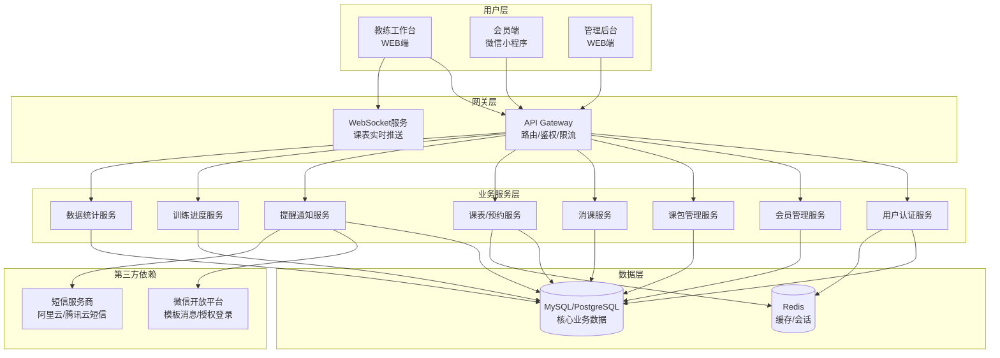
```mermaid
graph TD
    subgraph 用户层
        A1[教练工作台<br/>WEB端]
        A2[会员端<br/>微信小程序]
        A3[管理后台<br/>WEB端]
    end

    subgraph 网关层
        B1[API Gateway<br/>路由/鉴权/限流]
        B2[WebSocket服务<br/>课表实时推送]
    end

    subgraph 业务服务层
        C1[用户认证服务]
        C2[会员管理服务]
        C3[课包管理服务]
        C4[消课服务]
        C5[课表/预约服务]
        C6[提醒通知服务]
        C7[训练进度服务]
        C8[数据统计服务]
    end

    subgraph 数据层
        D1[(MySQL/PostgreSQL<br/>核心业务数据)]
        D2[(Redis<br/>缓存/会话)]
    end

    subgraph 第三方依赖
        E1[微信开放平台<br/>模板消息/授权登录]
        E2[短信服务商<br/>阿里云/腾讯云短信]
    end

    A1 --> B1
    A2 --> B1
    A3 --> B1
    A1 --> B2
    B1 --> C1
    B1 --> C2
    B1 --> C3
    B1 --> C4
    B1 --> C5
    B1 --> C6
    B1 --> C7
    B1 --> C8
    C1 --> D1
    C2 --> D1
    C3 --> D1
    C4 --> D1
    C5 --> D1
    C6 --> D1
    C7 --> D1
    C8 --> D1
    C1 --> D2
    C5 --> D2
    C6 --> E1
    C6 --> E2
```

## 2.2 业务模块图

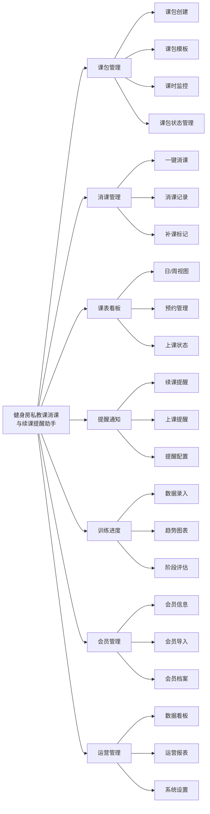
```mermaid
flowchart LR
    ROOT[健身房私教课消课<br/>与续课提醒助手]

    ROOT --> M1[课包管理]
    ROOT --> M2[消课管理]
    ROOT --> M3[课表看板]
    ROOT --> M4[提醒通知]
    ROOT --> M5[训练进度]
    ROOT --> M6[会员管理]
    ROOT --> M7[运营管理]

    M1 --> M1A[课包创建]
    M1 --> M1B[课包模板]
    M1 --> M1C[课时监控]
    M1 --> M1D[课包状态管理]

    M2 --> M2A[一键消课]
    M2 --> M2B[消课记录]
    M2 --> M2C[补课标记]

    M3 --> M3A[日/周视图]
    M3 --> M3B[预约管理]
    M3 --> M3C[上课状态]

    M4 --> M4A[续课提醒]
    M4 --> M4B[上课提醒]
    M4 --> M4C[提醒配置]

    M5 --> M5A[数据录入]
    M5 --> M5B[趋势图表]
    M5 --> M5C[阶段评估]

    M6 --> M6A[会员信息]
    M6 --> M6B[会员导入]
    M6 --> M6C[会员档案]

    M7 --> M7A[数据看板]
    M7 --> M7B[运营报表]
    M7 --> M7C[系统设置]
```

## 2.3 主业务流程

### 2.3.1 核心业务主流程 — 上课消课与续课闭环

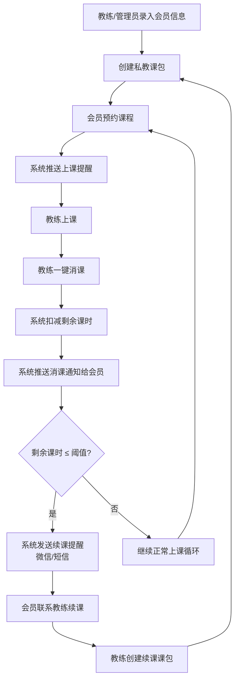
```mermaid
flowchart TD
    A[教练/管理员录入会员信息] --> B[创建私教课包]
    B --> C[会员预约课程]
    C --> D[系统推送上课提醒]
    D --> E[教练上课]
    E --> F[教练一键消课]
    F --> G[系统扣减剩余课时]
    G --> H[系统推送消课通知给会员]
    H --> I{剩余课时 ≤ 阈值?}
    I -->|是| J[系统发送续课提醒<br/>微信/短信]
    I -->|否| K[继续正常上课循环]
    J --> L[会员联系教练续课]
    L --> M[教练创建续课课包]
    M --> B
    K --> C
```

### 2.3.2 会员端主流程

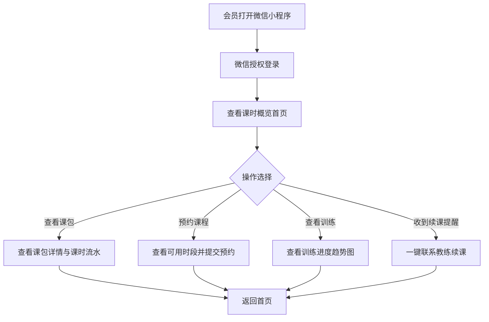
```mermaid
flowchart TD
    A[会员打开微信小程序] --> B[微信授权登录]
    B --> C[查看课时概览首页]
    C --> D{操作选择}
    D -->|查看课包| E[查看课包详情与课时流水]
    D -->|预约课程| F[查看可用时段并提交预约]
    D -->|查看训练| G[查看训练进度趋势图]
    D -->|收到续课提醒| H[一键联系教练续课]
    E --> I[返回首页]
    F --> I
    G --> I
    H --> I
```

## 2.4 功能列表

### 教练工作台（WEB端）

| 功能模块 | 功能名称 | 优先级 | 功能描述 |
| --- | --- | --- | --- |
| 课表看板 | 日视图/周视图 | P0 | 按日/周展示预约课程，支持快速定位待处理课程 |
| 课表看板 | 创建/修改/取消预约 | P0 | 选择会员、课程类型、时间创建预约，支持拖拽调整 |
| 课表看板 | 一键消课 | P0 | 核心功能，对已完成课程执行消课，自动扣减课时 |
| 课表看板 | 消课确认弹窗 | P0 | 消课前显示会员信息、课程类型、剩余课时的确认窗口 |
| 课表看板 | 消课记录查看 | P1 | 按时间/会员/课程类型查看消课历史，支持导出Excel |
| 会员管理 | 会员列表与档案 | P0 | 展示会员信息、课包、消课历史、训练数据一站式档案 |
| 会员管理 | 新增/编辑会员 | P0 | 录入会员基本信息（姓名、手机号、健身目标等） |
| 会员管理 | 批量导入 | P1 | Excel模板批量导入会员，支持字段映射和冲突处理 |
| 课包管理 | 新建课包 | P0 | 为会员创建课包，设置课程类型、课时、单价、有效期 |
| 课包管理 | 课包模板 | P2 | 预设常用课包模板，快速创建 |
| 课包管理 | 课时监控与预警 | P0 | 突出显示剩余课时，低于阈值自动预警 |
| 课包管理 | 课包续期/退款 | P1 | 延长有效期或冻结退款（退款需管理员权限） |
| 训练进度 | 数据录入 | P1 | 记录体重/体脂/力量/围度数据 |
| 训练进度 | 趋势图表 | P1 | 折线图/柱状图展示训练数据变化趋势 |
| 训练进度 | 课后备注 | P2 | 为每次上课添加训练备注 |
| 提醒设置 | 续课提醒配置 | P0 | 设置课时阈值、提醒方式（微信/短信）、提醒频率 |
| 提醒设置 | 上课提醒配置 | P1 | 设置课前提醒时间、上课确认/请假机制 |

### 会员端（微信小程序）

| 功能模块 | 功能名称 | 优先级 | 功能描述 |
| --- | --- | --- | --- |
| 首页 | 课时概览 | P0 | 展示剩余总课时、各课包明细，低课时红色高亮 |
| 首页 | 快捷入口 | P0 | 一键进入预约课程、查看课表 |
| 首页 | 通知列表 | P1 | 查看上课提醒、续课提醒、课包变动通知 |
| 课包详情 | 课包列表与详情 | P0 | 查看课包信息、课时流水变动记录 |
| 课包详情 | 联系续课 | P0 | 课时不足时一键联系教练发起续课沟通 |
| 课程预约 | 查看可用时段 | P1 | 展示教练可预约时间段，已约时段灰显 |
| 课程预约 | 提交/取消预约 | P1 | 选择日期、时间、课程类型提交预约 |
| 课程预约 | 上课确认/请假 | P1 | 收到提醒后确认出席或申请请假 |
| 训练进度 | 趋势图表查看 | P1 | 查看体重/体脂/力量/围度变化趋势图 |
| 训练进度 | 上课记录回顾 | P2 | 查看历史上课记录及教练课后备注 |

### 管理后台（WEB端）

| 功能模块 | 功能名称 | 优先级 | 功能描述 |
| --- | --- | --- | --- |
| 运营管理 | 今日概览看板 | P1 | 展示上课人数、消课次数、新预约、待续课会员数 |
| 运营管理 | 月度统计 | P1 | 消课总量、新购课包数、续课率、会员活跃度 |
| 运营管理 | 消课/续课/活跃报表 | P2 | 多维度运营报表，支持导出Excel |
| 系统设置 | 工作室信息 | P1 | 设置名称、联系方式、营业时间、品牌化元素 |
| 系统设置 | 课程类型管理 | P1 | 管理系统中的课程类型列表，支持自定义 |
| 系统设置 | 全局提醒模板 | P2 | 配置各类提醒消息文案模板 |
| 权限管理 | 教练管理 | P1 | 邀请/编辑教练，管理排班和擅长领域 |
| 权限管理 | 容量监控 | P1 | 展示当前会员数量和套餐上限 |

## 2.5 你的产品有哪些端

| 序号 | 端名称 | 端类型 | 目标用户 | 说明 |
| --- | --- | --- | --- | --- |
| 1 | 教练工作台 | WEB端 | 教练 | 教练日常管理主界面，含课表看板、消课操作、会员管理、课包管理、训练进度、提醒设置 |
| 2 | 会员端 | 小程序端 | 会员 | 微信小程序，会员查看课时、接收提醒、预约课程、查看训练进度 |
| 3 | 管理后台 | WEB端 | 工作室管理员 | 运营数据看板、报表、系统设置、教练权限管理 |

---

# 3 产品功能

## 3.1 教练工作台功能

### 3.1.1 课表看板

**功能描述**：
课表看板是教练每日工作的核心入口，以时间轴形式展示当天/本周的预约课程安排。教练可在课表中快速完成创建预约、修改预约、取消预约、一键消课等操作。

**优先级与依赖说明**：

| 项 | 内容 |
| --- | --- |
| 优先级 | P0 |
| 依赖需求 | 会员管理、课包管理 |
| 前置条件 | 教练已登录，至少有一个会员和可用课包 |

#### 3.1.1.1 详细流程

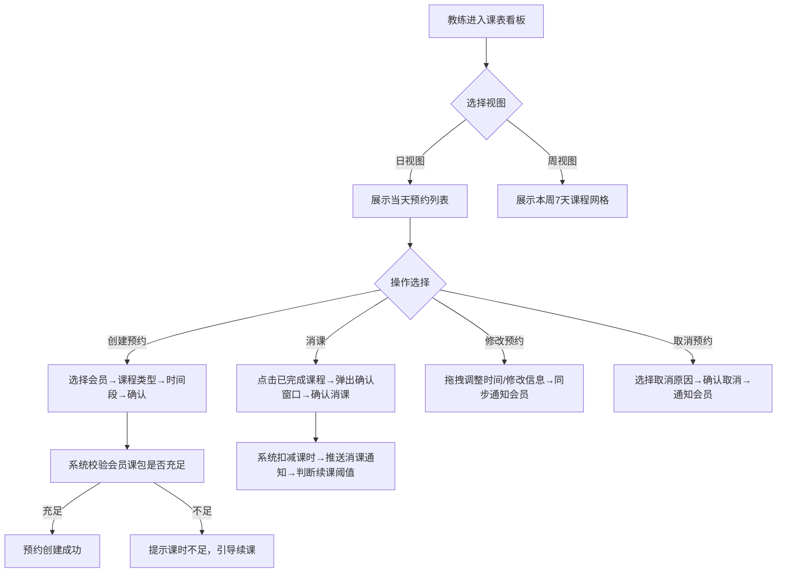
```mermaid
flowchart TD
    A[教练进入课表看板] --> B{选择视图}
    B -->|日视图| C[展示当天预约列表]
    B -->|周视图| D[展示本周7天课程网格]
    C --> E{操作选择}
    E -->|创建预约| F[选择会员→课程类型→时间段→确认]
    E -->|消课| G[点击已完成课程→弹出确认窗口→确认消课]
    E -->|修改预约| H[拖拽调整时间/修改信息→同步通知会员]
    E -->|取消预约| I[选择取消原因→确认取消→通知会员]
    F --> J[系统校验会员课包是否充足]
    J -->|充足| K[预约创建成功]
    J -->|不足| L[提示课时不足，引导续课]
    G --> M[系统扣减课时→推送消课通知→判断续课阈值]
```

#### 3.1.1.2 业务规则

1. 日视图按时间段（08:00-22:00，每30分钟一格）纵向排列，已约时段显示会员姓名+课程类型标签
2. 周视图以7列为横轴、时间段为纵轴，色块区分不同课程类型
3. 创建预约时系统自动校验会员是否有对应课程类型的可用课包（状态为"进行中"且剩余课时>0）
4. 消课操作仅对状态为"已确认"且课程时间已到的预约开放
5. 消课确认后5秒内必须完成课时扣减并推送通知给会员
6. 取消预约需选择原因（会员请假/教练调整/其他），用于后续统计
7. 拖拽修改预约时间时，系统实时校验目标时间段是否冲突

**验收标准**：
- [ ] 正常流程：教练可在日视图中看到当天所有预约，点击消课按钮后弹出确认窗口，确认后课时自动扣减
- [ ] 异常流程：会员课包不足时创建预约应提示课时不足并引导续课
- [ ] 性能要求：课表页面加载 ≤ 1秒，消课操作响应 ≤ 500ms

### 3.1.2 一键消课

**功能描述**：
一键消课是系统的核心功能，教练在课表中对已完成的课程执行消课操作。系统自动扣减会员剩余课时、记录消课明细、推送通知给会员，并在剩余课时低于阈值时自动触发续课提醒。

**优先级与依赖说明**：

| 项 | 内容 |
| --- | --- |
| 优先级 | P0 |
| 依赖需求 | 课包管理、提醒通知 |
| 前置条件 | 存在状态为"已确认"的预约记录，会员有可用课包 |

#### 3.1.2.1 详细流程

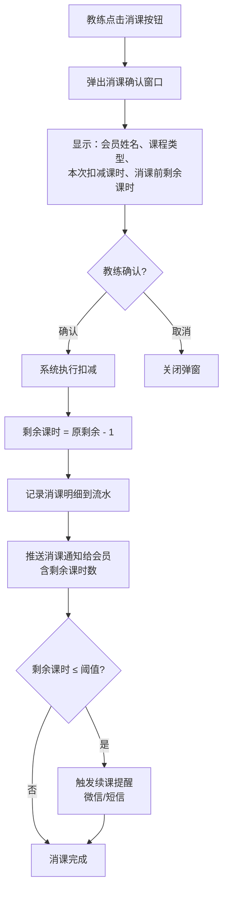
```mermaid
flowchart TD
    A[教练点击消课按钮] --> B[弹出消课确认窗口]
    B --> C[显示：会员姓名、课程类型、<br/>本次扣减课时、消课前剩余课时]
    C --> D{教练确认?}
    D -->|确认| E[系统执行扣减]
    D -->|取消| F[关闭弹窗]
    E --> G[剩余课时 = 原剩余 - 1]
    G --> H[记录消课明细到流水]
    H --> I[推送消课通知给会员<br/>含剩余课时数]
    I --> J{剩余课时 ≤ 阈值?}
    J -->|是| K[触发续课提醒<br/>微信/短信]
    J -->|否| L[消课完成]
    K --> L
```

#### 3.1.2.2 业务规则

1. 消课确认弹窗必须显示：会员姓名、课程类型、本次扣减课时数（默认1）、消课前剩余课时
2. 支持单次消课多课时（如补课2节连上），教练可在确认窗口修改扣减数量
3. 消课后会员课包中剩余课时实时更新，会员端可立即看到变化
4. 续课提醒触发逻辑：剩余课时 ≤ 教练设定的阈值（默认5次），且满足提醒频率设置
5. 消课操作不可撤销，如需修正需联系管理员在后台处理（记录修正日志）
6. 补课标记的课程同样执行课时扣减，但在流水中标记为"补课"

**验收标准**：
- [ ] 正常流程：教练点击消课→确认→课时扣减成功→会员收到通知，全流程 ≤ 5秒
- [ ] 异常流程：课包剩余课时为0时不允许消课，提示"课时已用完，请先续课"
- [ ] 性能要求：消课接口响应 ≤ 500ms，通知推送延迟 ≤ 5秒

### 3.1.3 会员管理

**功能描述**：
会员管理模块为教练提供工作室所有会员的信息管理功能，包括会员列表浏览、新增/编辑会员信息、批量导入、查看会员一站式档案（基本信息+所有课包+消课历史+训练数据）。

**优先级与依赖说明**：

| 项 | 内容 |
| --- | --- |
| 优先级 | P0 |
| 依赖需求 | 无 |
| 前置条件 | 教练已登录 |

#### 3.1.3.1 详细流程

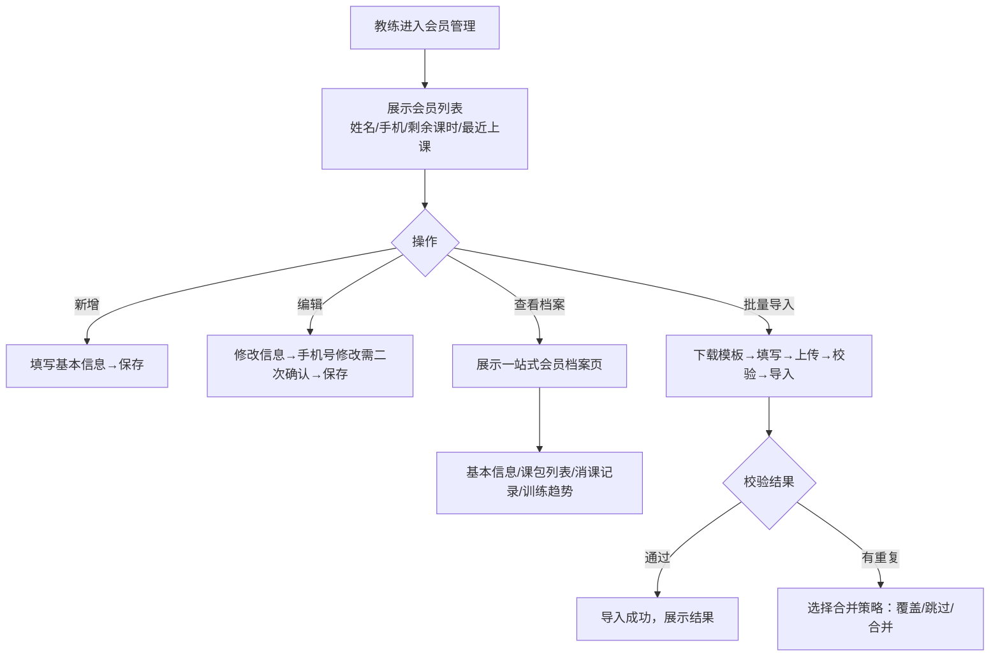
```mermaid
flowchart TD
    A[教练进入会员管理] --> B[展示会员列表<br/>姓名/手机/剩余课时/最近上课]
    B --> C{操作}
    C -->|新增| D[填写基本信息→保存]
    C -->|编辑| E[修改信息→手机号修改需二次确认→保存]
    C -->|查看档案| F[展示一站式会员档案页]
    C -->|批量导入| G[下载模板→填写→上传→校验→导入]
    F --> H[基本信息/课包列表/消课记录/训练趋势]
    G --> I{校验结果}
    I -->|通过| J[导入成功，展示结果]
    I -->|有重复| K[选择合并策略：覆盖/跳过/合并]
```

#### 3.1.3.2 业务规则

1. 会员手机号为必填项，新增时系统校验手机号格式（11位数字）和唯一性
2. 会员档案页整合展示：基本信息、所有课包（按状态分组）、消课历史（时间倒序）、训练数据趋势图
3. 批量导入支持Excel模板下载，导入时校验手机号格式和必填字段
4. 重复数据处理策略：覆盖（以导入数据为准）、跳过（保留原数据）、合并（合并字段）
5. 会员列表支持按课程类型、剩余课时、最近上课时间排序和筛选
6. 免费版限20名会员，超额时提示升级工作室版

**验收标准**：
- [ ] 正常流程：教练可新增会员、编辑信息、查看档案、批量导入
- [ ] 异常流程：手机号重复时提示已存在，导入格式错误时提示具体错误行
- [ ] 性能要求：100条会员列表加载 ≤ 1秒，批量导入100条 ≤ 10秒

### 3.1.4 课包管理

**功能描述**：
课包管理模块为教练提供会员私教课包的创建、管理、监控功能。支持按课程类型分类创建课包、使用课包模板快速创建、多课包课时叠加、课包状态跟踪（进行中/即将过期/已过期/已用完/已冻结）、课时预警等。

**优先级与依赖说明**：

| 项 | 内容 |
| --- | --- |
| 优先级 | P0 |
| 依赖需求 | 会员管理 |
| 前置条件 | 会员已创建 |

#### 3.1.4.1 详细流程

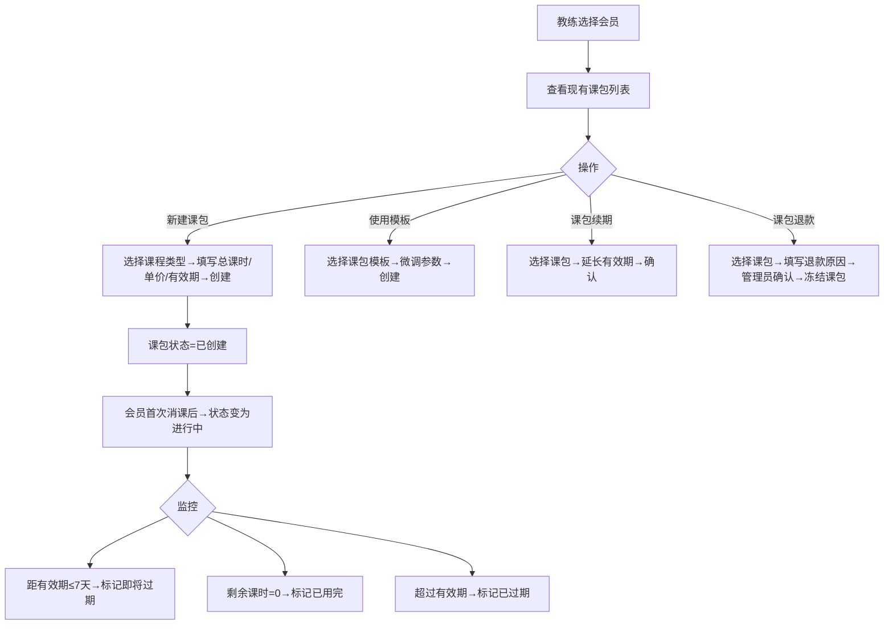
```mermaid
flowchart TD
    A[教练选择会员] --> B[查看现有课包列表]
    B --> C{操作}
    C -->|新建课包| D[选择课程类型→填写总课时/单价/有效期→创建]
    C -->|使用模板| E[选择课包模板→微调参数→创建]
    C -->|课包续期| F[选择课包→延长有效期→确认]
    C -->|课包退款| G[选择课包→填写退款原因→管理员确认→冻结课包]
    D --> H[课包状态=已创建]
    H --> I[会员首次消课后→状态变为进行中]
    I --> J{监控}
    J --> K[距有效期≤7天→标记即将过期]
    J --> L[剩余课时=0→标记已用完]
    J --> M[超过有效期→标记已过期]
```

#### 3.1.4.2 业务规则

1. 课程类型支持：增肌、减脂、瑜伽、康复、综合、自定义（工作室版）
2. 同一会员可拥有多个课包，新购课包课时追加到该课程类型的剩余总课时
3. 消课时优先扣减最早创建的进行中课包课时（先进先出）
4. 课包状态流转：已创建→进行中→即将过期（≤7天）→已过期/已用完→已冻结（退款）
5. 课包退款需管理员权限，退款后课包冻结，剩余课时不再可用
6. 课时预警：剩余课时 ≤ 设定阈值时，课包列表中标记预警状态，同时通知教练
7. 课时流水记录所有变动：购买增加、消课扣减、退款冻结、续期等

**验收标准**：
- [ ] 正常流程：教练可为会员创建课包、使用模板、续期、查看流水
- [ ] 异常流程：退款操作需管理员确认，普通教练无权操作
- [ ] 性能要求：课包列表加载 ≤ 500ms

### 3.1.5 训练进度

**功能描述**：
训练进度模块为教练提供会员训练数据的录入、趋势展示、阶段评估功能。教练可记录会员的体重、体脂率、力量数据（卧推/深蹲等）、围度数据，系统自动生成趋势图表辅助教练评估训练效果和调整计划。

**优先级与依赖说明**：

| 项 | 内容 |
| --- | --- |
| 优先级 | P1 |
| 依赖需求 | 会员管理 |
| 前置条件 | 会员已创建，至少有一次训练数据记录 |

#### 3.1.5.1 详细流程

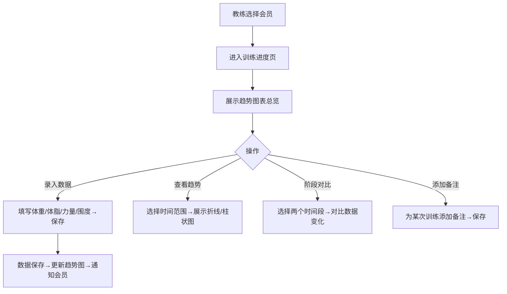
```mermaid
flowchart TD
    A[教练选择会员] --> B[进入训练进度页]
    B --> C[展示趋势图表总览]
    C --> D{操作}
    D -->|录入数据| E[填写体重/体脂/力量/围度→保存]
    D -->|查看趋势| F[选择时间范围→展示折线/柱状图]
    D -->|阶段对比| G[选择两个时间段→对比数据变化]
    D -->|添加备注| H[为某次训练添加备注→保存]
    E --> I[数据保存→更新趋势图→通知会员]
```

#### 3.1.5.2 业务规则

1. 数据录入项均为可选填，教练可按需记录部分数据
2. 力量数据支持自定义训练项目（如卧推、深蹲、硬拉等），每个项目独立记录重量和次数
3. 围度数据支持：胸围、腰围、臀围、臂围、大腿围等
4. 趋势图支持时间范围选择：近7天/近30天/近3月/全部
5. 阶段对比可选择任意两个时间点的数据进行变化量计算
6. 系统根据数据变化自动生成简单的训练评估摘要（达标/未达标/建议调整）

**验收标准**：
- [ ] 正常流程：教练可录入各类训练数据，趋势图实时更新
- [ ] 异常流程：录入数据超出合理范围（如体重<20kg或>300kg）时提示确认
- [ ] 性能要求：趋势图渲染 ≤ 1秒

### 3.1.6 提醒设置

**功能描述**：
提醒设置模块允许教练配置续课提醒和上课提醒的各项参数，包括课时阈值、提醒方式（微信/短信）、提醒频率、课前提醒时间、上课确认机制等。同时可查看提醒发送日志。

**优先级与依赖说明**：

| 项 | 内容 |
| --- | --- |
| 优先级 | P0（续课提醒配置）/ P1（上课提醒配置） |
| 依赖需求 | 无 |
| 前置条件 | 教练已登录 |

#### 3.1.6.1 详细流程

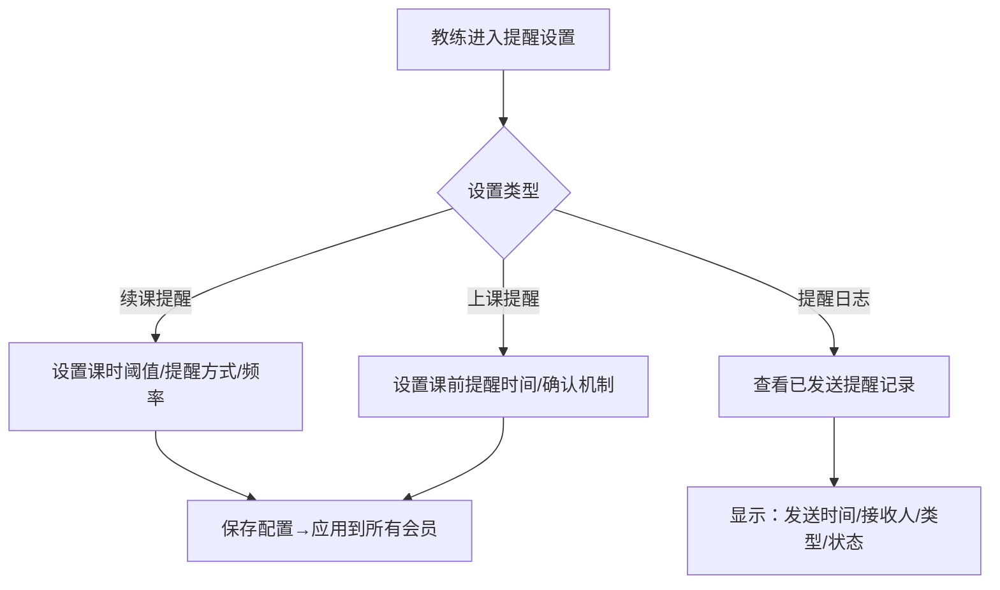
```mermaid
flowchart TD
    A[教练进入提醒设置] --> B{设置类型}
    B -->|续课提醒| C[设置课时阈值/提醒方式/频率]
    B -->|上课提醒| D[设置课前提醒时间/确认机制]
    B -->|提醒日志| E[查看已发送提醒记录]
    C --> F[保存配置→应用到所有会员]
    D --> F
    E --> G[显示：发送时间/接收人/类型/状态]
```

#### 3.1.6.2 业务规则

1. 续课提醒课时阈值默认5次，可按课程类型分别设置不同阈值
2. 提醒方式支持：仅微信、仅短信、微信+短信（默认）
3. 提醒频率支持：仅首次触发、每日提醒、间隔提醒（可设置间隔天数）
4. 课前提醒时间支持：15分钟/30分钟/1小时/2小时（默认2小时）
5. 上课确认机制：会员收到上课提醒后可确认出席或请假，请假自动释放时间段
6. 提醒日志记录所有已发送的提醒，包含发送时间、接收状态、失败原因

**验收标准**：
- [ ] 正常流程：教练可配置各类提醒参数，配置立即生效
- [ ] 异常流程：短信渠道配置异常时自动降级为仅微信推送
- [ ] 性能要求：配置保存后立即生效，无需重启

---

## 3.2 会员端功能（微信小程序）

### 3.2.1 首页 — 课时概览

**功能描述**：
会员打开小程序后的首页，顶部展示当前剩余总课时、各课包剩余明细和状态摘要，提供预约课程、查看课表等快捷入口，以及通知消息列表入口。

**优先级与依赖说明**：

| 项 | 内容 |
| --- | --- |
| 优先级 | P0 |
| 依赖需求 | 课包管理、提醒通知 |
| 前置条件 | 会员已通过微信授权登录 |

#### 3.2.1.1 详细流程

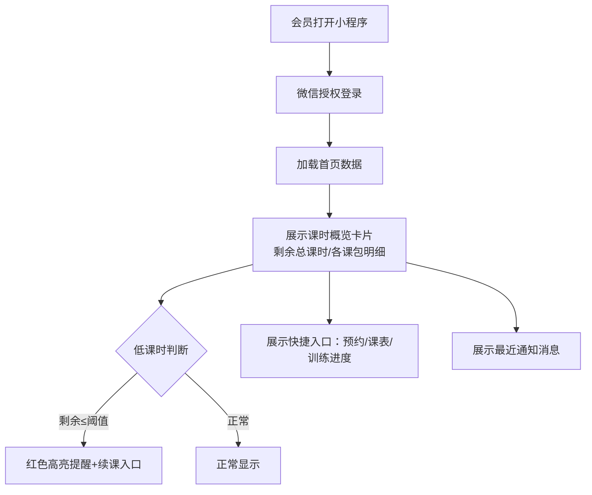
```mermaid
flowchart TD
    A[会员打开小程序] --> B[微信授权登录]
    B --> C[加载首页数据]
    C --> D[展示课时概览卡片<br/>剩余总课时/各课包明细]
    D --> E{低课时判断}
    E -->|剩余≤阈值| F[红色高亮提醒+续课入口]
    E -->|正常| G[正常显示]
    D --> H[展示快捷入口：预约/课表/训练进度]
    D --> I[展示最近通知消息]
```

#### 3.2.1.2 业务规则

1. 课时概览卡片显示：剩余总课时（大字号）、各课包按课程类型分组的剩余明细
2. 剩余课时 ≤ 阈值时，数字变红色并闪烁提示，旁边显示"立即续课"按钮
3. 已过期课包灰显，已用完课包显示"已用完"标签
4. 快捷入口固定在页面中部，包含：预约课程、我的课表、训练进度
5. 通知列表展示最近3条未读通知，点击"查看全部"进入通知列表页

**验收标准**：
- [ ] 正常流程：会员登录后首页正确展示课时概览、快捷入口、通知
- [ ] 异常流程：无课包时显示空状态引导"联系教练开通课包"
- [ ] 性能要求：首页加载 ≤ 2秒

### 3.2.2 课包详情

**功能描述**：
会员查看自己名下所有课包的详细信息，包括课程类型、总课时、已消课时、剩余课时、有效期，以及每个课包的课时流水变动记录。课时不足时可一键联系教练续课。

**优先级与依赖说明**：

| 项 | 内容 |
| --- | --- |
| 优先级 | P0 |
| 依赖需求 | 课包管理 |
| 前置条件 | 会员已登录，至少有一个课包 |

#### 3.2.2.1 详细流程

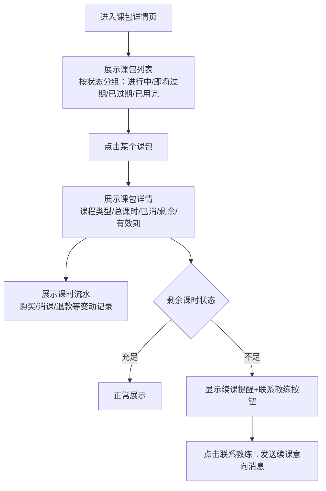
```mermaid
flowchart TD
    A[进入课包详情页] --> B[展示课包列表<br/>按状态分组：进行中/即将过期/已过期/已用完]
    B --> C[点击某个课包]
    C --> D[展示课包详情<br/>课程类型/总课时/已消/剩余/有效期]
    D --> E[展示课时流水<br/>购买/消课/退款等变动记录]
    D --> F{剩余课时状态}
    F -->|充足| G[正常展示]
    F -->|不足| H[显示续课提醒+联系教练按钮]
    H --> I[点击联系教练→发送续课意向消息]
```

#### 3.2.2.2 业务规则

1. 课包列表按状态分组展示：进行中（含即将过期子状态）、已过期、已用完
2. 每个课包卡片显示：课程类型图标、名称、剩余/总课时进度条、有效期
3. 课时流水按时间倒序展示，每条记录包含：变动时间、变动类型（购买/消课/退款/续期）、变动数量、变动后剩余
4. "联系教练"按钮发送续课意向消息，教练在课表中收到通知

**验收标准**：
- [ ] 正常流程：会员可查看课包详情和课时流水，课时不足时可联系教练
- [ ] 异常流程：无课包时显示空状态"暂无课包，请联系教练开通"
- [ ] 性能要求：课包详情加载 ≤ 1秒

### 3.2.3 课程预约

**功能描述**：
会员查看教练可预约的时间段，选择日期、时间、课程类型提交预约申请，也可取消已预约但未开始的课程。收到上课提醒后可确认出席或申请请假。

**优先级与依赖说明**：

| 项 | 内容 |
| --- | --- |
| 优先级 | P1 |
| 依赖需求 | 课表看板 |
| 前置条件 | 会员已登录，有可用课包 |

#### 3.2.3.1 详细流程

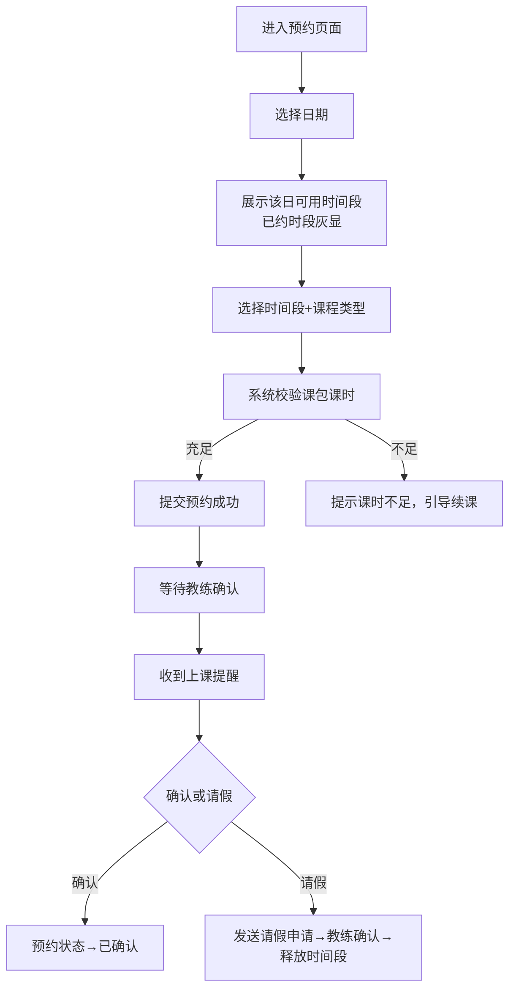
```mermaid
flowchart TD
    A[进入预约页面] --> B[选择日期]
    B --> C[展示该日可用时间段<br/>已约时段灰显]
    C --> D[选择时间段+课程类型]
    D --> E[系统校验课包课时]
    E -->|充足| F[提交预约成功]
    E -->|不足| G[提示课时不足，引导续课]
    F --> H[等待教练确认]
    H --> I[收到上课提醒]
    I --> J{确认或请假}
    J -->|确认| K[预约状态→已确认]
    J -->|请假| L[发送请假申请→教练确认→释放时间段]
```

#### 3.2.3.2 业务规则

1. 可用时间段按教练排班时间展示（默认08:00-22:00），已被预约的时段灰显不可选
2. 预约前系统自动校验会员是否有对应课程类型的可用课包且剩余课时>0
3. 预约状态流转：待确认→已确认→已完成（消课后）/已请假→待确认（改期）/已取消
4. 取消预约需在课程开始前至少2小时操作
5. 请假需教练确认，教练可选择同意改期或直接取消

**验收标准**：
- [ ] 正常流程：会员可选择时段预约，收到提醒后可确认或请假
- [ ] 异常流程：课时不足时无法预约，提示续课
- [ ] 性能要求：时段列表加载 ≤ 1秒

### 3.2.4 训练进度

**功能描述**：
会员查看自己的训练数据趋势图表（体重/体脂/力量/围度），以及历史上课记录和教练课后备注，直观了解训练效果。

**优先级与依赖说明**：

| 项 | 内容 |
| --- | --- |
| 优先级 | P1 |
| 依赖需求 | 教练端训练进度录入 |
| 前置条件 | 教练已为该会员录入至少一条训练数据 |

#### 3.2.4.1 详细流程

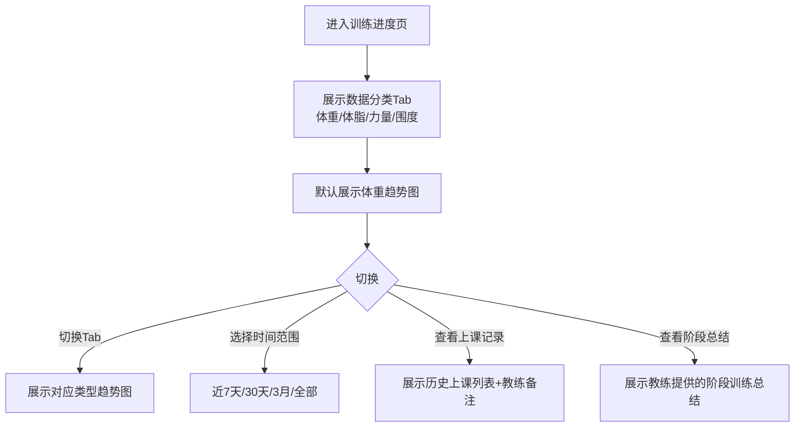
```mermaid
flowchart TD
    A[进入训练进度页] --> B[展示数据分类Tab<br/>体重/体脂/力量/围度]
    B --> C[默认展示体重趋势图]
    C --> D{切换}
    D -->|切换Tab| E[展示对应类型趋势图]
    D -->|选择时间范围| F[近7天/30天/3月/全部]
    D -->|查看上课记录| G[展示历史上课列表+教练备注]
    D -->|查看阶段总结| H[展示教练提供的阶段训练总结]
```

#### 3.2.4.2 业务规则

1. 趋势图支持4个分类Tab切换：体重、体脂率、力量（按训练项目分子Tab）、围度
2. 每个趋势图支持时间范围选择：近7天、近30天、近3月、全部
3. 上课记录列表按时间倒序，每条记录显示：上课时间、课程类型、教练备注
4. 阶段总结按月/季度由教练手动填写

**验收标准**：
- [ ] 正常流程：会员可切换查看各类训练数据趋势图和上课记录
- [ ] 异常流程：无训练数据时显示空状态"等待教练录入训练数据"
- [ ] 性能要求：趋势图渲染 ≤ 1秒

---

## 3.3 管理后台功能

### 3.3.1 运营管理 — 数据看板与报表

**功能描述**：
管理后台首页展示工作室运营数据看板，包括今日概览（上课人数、消课次数、新预约数、待续课会员数）和月度统计（消课总量、新购课包数、续课率、会员活跃度）。同时提供消课报表、续课报表、会员活跃报表等多维度报表，支持导出Excel。

**优先级与依赖说明**：

| 项 | 内容 |
| --- | --- |
| 优先级 | P1 |
| 依赖需求 | 教练端所有业务数据 |
| 前置条件 | 管理员已登录 |

#### 3.3.1.1 详细流程

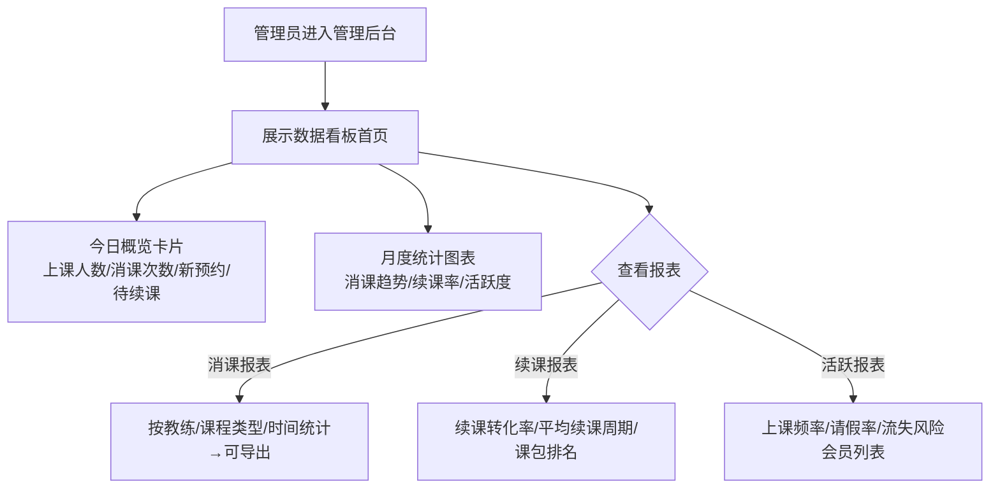
```mermaid
flowchart TD
    A[管理员进入管理后台] --> B[展示数据看板首页]
    B --> C[今日概览卡片<br/>上课人数/消课次数/新预约/待续课]
    B --> D[月度统计图表<br/>消课趋势/续课率/活跃度]
    B --> E{查看报表}
    E -->|消课报表| F[按教练/课程类型/时间统计→可导出]
    E -->|续课报表| G[续课转化率/平均续课周期/课包排名]
    E -->|活跃报表| H[上课频率/请假率/流失风险会员列表]
```

#### 3.3.1.2 业务规则

1. 今日概览数据每小时刷新一次，关键指标（消课次数）实时更新
2. 月度统计支持按周/月切换，展示同比/环比变化
3. 流失风险会员：连续14天未上课且剩余课时>0的会员
4. 所有报表支持导出为Excel文件
5. 数据看板仅管理员角色可见，教练无法访问管理后台

**验收标准**：
- [ ] 正常流程：管理员可查看实时数据看板和各维度报表，可导出Excel
- [ ] 异常流程：无数据时显示空状态引导
- [ ] 性能要求：数据看板加载 ≤ 2秒，报表导出 ≤ 10秒

### 3.3.2 系统设置

**功能描述**：
管理员配置工作室基本信息（名称、联系方式、营业时间、地址）、品牌化元素（Logo、主题色）、课程类型列表、全局提醒模板、推送渠道参数、默认阈值等系统级参数。

**优先级与依赖说明**：

| 项 | 内容 |
| --- | --- |
| 优先级 | P1 |
| 依赖需求 | 无 |
| 前置条件 | 管理员已登录 |

#### 3.3.2.1 业务规则

1. 工作室名称和Logo用于会员端品牌展示（工作室版功能）
2. 课程类型管理支持添加自定义类型，系统预置：增肌、减脂、瑜伽、康复、综合
3. 全局提醒模板支持变量插入（如 {会员姓名}、{剩余课时}、{课程时间}）
4. 推送渠道配置需填写微信开放平台AppID/Secret和短信服务商API参数
5. 默认阈值设置对全工作室生效，教练可针对个别会员单独覆盖

**验收标准**：
- [ ] 正常流程：管理员可配置所有系统参数，配置立即生效
- [ ] 异常流程：微信/短信渠道配置错误时提示具体错误原因
- [ ] 性能要求：配置保存后立即生效

### 3.3.3 权限管理

**功能描述**：
管理员管理工作室下的教练团队，包括邀请新教练加入（通过手机号邀请）、编辑教练信息（擅长领域、排班时间）、查看教练状态。同时监控会员容量使用情况。

**优先级与依赖说明**：

| 项 | 内容 |
| --- | --- |
| 优先级 | P1 |
| 依赖需求 | 无 |
| 前置条件 | 管理员已登录 |

#### 3.3.3.1 业务规则

1. 邀请教练通过手机号发送邀请链接，教练点击链接完成注册并加入工作室
2. 免费版限1名教练，超额需升级工作室版
3. 教练信息中的擅长领域用于会员端展示，帮助会员选择合适的教练
4. 容量监控展示当前会员数/套餐上限，达80%时预警提醒
5. 管理员可禁用教练账号，禁用后该教练无法登录工作台

**验收标准**：
- [ ] 正常流程：管理员可邀请/编辑/禁用教练，查看容量使用情况
- [ ] 异常流程：免费版添加第2名教练时提示升级
- [ ] 性能要求：教练列表加载 ≤ 1秒

---

# 4 产品原型

## 4.1 页面跳转逻辑图

### 教练工作台页面跳转

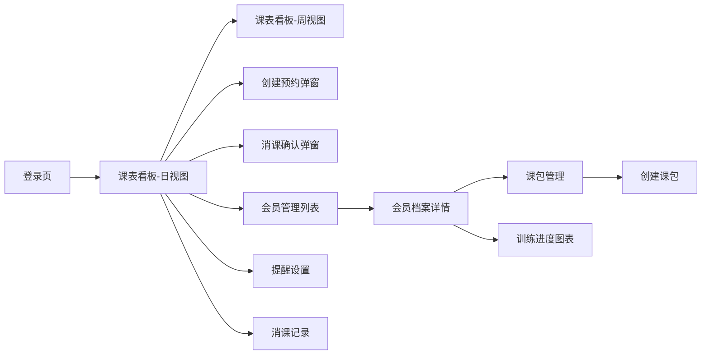
```mermaid
flowchart LR
    Login[登录页] --> Dashboard[课表看板-日视图]
    Dashboard --> WeekView[课表看板-周视图]
    Dashboard --> CreateAppt[创建预约弹窗]
    Dashboard --> ConsumeConfirm[消课确认弹窗]
    Dashboard --> MemberList[会员管理列表]
    MemberList --> MemberProfile[会员档案详情]
    MemberProfile --> PackageList[课包管理]
    PackageList --> CreatePackage[创建课包]
    MemberProfile --> TrainingProgress[训练进度图表]
    Dashboard --> ReminderSettings[提醒设置]
    Dashboard --> ConsumeHistory[消课记录]
```

### 会员端页面跳转

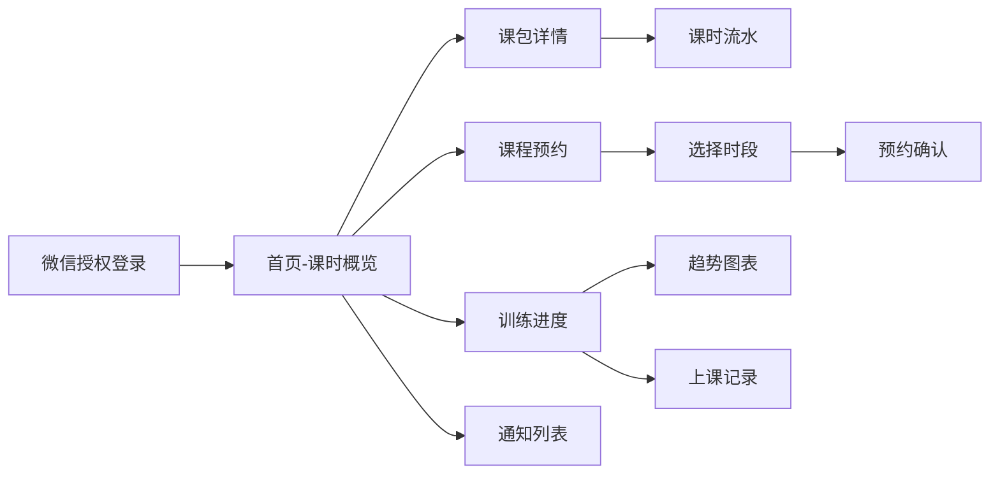
```mermaid
flowchart LR
    Auth[微信授权登录] --> Home[首页-课时概览]
    Home --> PackageDetail[课包详情]
    PackageDetail --> PackageFlow[课时流水]
    Home --> Booking[课程预约]
    Booking --> TimeSlots[选择时段]
    TimeSlots --> BookingConfirm[预约确认]
    Home --> TrainingView[训练进度]
    TrainingView --> TrendCharts[趋势图表]
    TrainingView --> HistoryList[上课记录]
    Home --> NotificationList[通知列表]
```

### 管理后台页面跳转

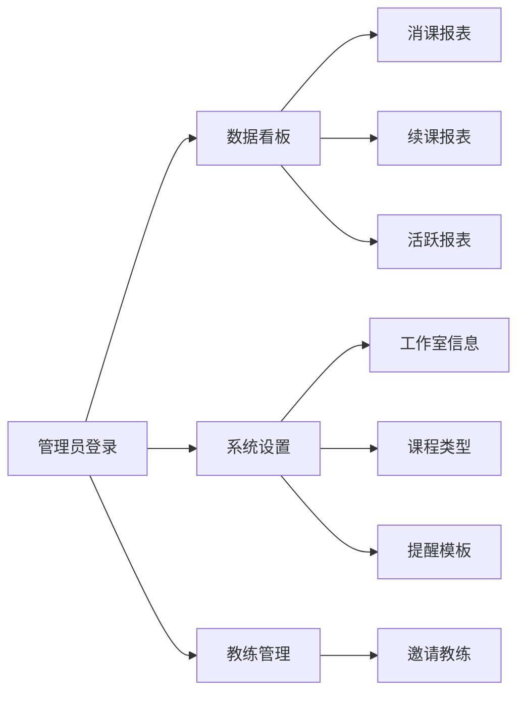
```mermaid
flowchart LR
    AdminLogin[管理员登录] --> DataBoard[数据看板]
    DataBoard --> ConsumeReport[消课报表]
    DataBoard --> RenewReport[续课报表]
    DataBoard --> ActiveReport[活跃报表]
    AdminLogin --> SysSettings[系统设置]
    SysSettings --> StudioInfo[工作室信息]
    SysSettings --> CourseTypes[课程类型]
    SysSettings --> ReminderTpl[提醒模板]
    AdminLogin --> CoachMgmt[教练管理]
    CoachMgmt --> AddCoach[邀请教练]
```

## 4.2 全站点原型设计

### 4.2.1 教练工作台（WEB端）

**页面清单：**

| 序号 | 页面名称 | 所属模块 | 页面描述 | 关键元素 |
| --- | --- | --- | --- | --- |
| 1 | 登录页 | 认证 | 教练手机号+验证码登录 | 手机号输入框、验证码输入框、获取验证码按钮、登录按钮 |
| 2 | 课表看板-日视图 | 课表看板 | 当天预约课程时间轴列表 | 时间轴、课程卡片（会员名+课程类型+状态）、消课按钮、创建预约按钮 |
| 3 | 课表看板-周视图 | 课表看板 | 一周7天课程网格 | 7列网格、色块课程、拖拽交互 |
| 4 | 创建预约弹窗 | 课表看板 | 选择会员、课程类型、时间创建预约 | 会员选择下拉、课程类型选择、日期时间选择器、确认按钮 |
| 5 | 消课确认弹窗 | 课表看板 | 消课前确认信息 | 会员姓名、课程类型、扣减课时、剩余课时、确认/取消按钮 |
| 6 | 会员管理列表 | 会员管理 | 所有会员列表 | 搜索框、筛选器、会员表格（姓名/手机/剩余课时/最近上课）、操作按钮 |
| 7 | 会员档案详情 | 会员管理 | 会员一站式档案页 | 基本信息卡、课包列表Tab、消课记录Tab、训练进度Tab |
| 8 | 课包管理 | 课包管理 | 会员课包列表和管理 | 课包卡片（类型/剩余/总数/有效期）、创建课包按钮、续期/退款操作 |
| 9 | 创建课包弹窗 | 课包管理 | 创建新课包表单 | 课程类型选择、总课时输入、单价输入、有效期选择、模板选择 |
| 10 | 训练进度 | 训练进度 | 会员训练数据趋势图表 | 数据分类Tab、时间范围选择、折线图/柱状图、数据录入按钮 |
| 11 | 消课记录 | 课表看板 | 消课历史记录列表 | 时间范围筛选、会员筛选、课程类型筛选、记录表格、导出按钮 |
| 12 | 提醒设置 | 提醒设置 | 配置续课和上课提醒参数 | 阈值设置、提醒方式选择、频率设置、课前时间设置、提醒日志Tab |

**交互说明：**

- 页面跳转关系：
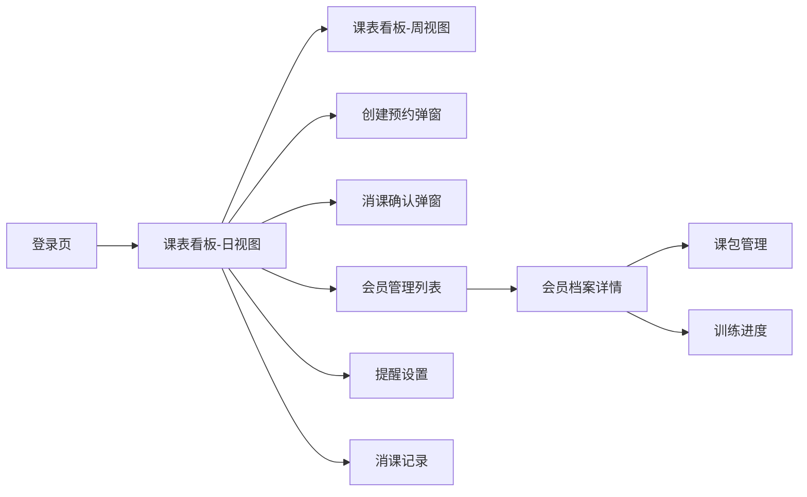
```mermaid
flowchart LR
    A[登录页] --> B[课表看板-日视图]
    B --> C[课表看板-周视图]
    B --> D[创建预约弹窗]
    B --> E[消课确认弹窗]
    B --> F[会员管理列表]
    F --> G[会员档案详情]
    G --> H[课包管理]
    G --> I[训练进度]
    B --> J[提醒设置]
    B --> K[消课记录]
```

- 特殊交互：
  1. 课表看板日视图中，点击课程卡片上的"消课"按钮弹出消课确认弹窗，确认后弹窗关闭并刷新列表
  2. 周视图支持拖拽调整预约时间，拖拽时目标时段高亮提示
  3. 会员档案页通过Tab切换课包/消课记录/训练进度三个维度
  4. 训练进度图表支持鼠标悬停显示数据点详情
  5. 空数据状态：无会员时显示"添加第一个会员"引导；无课包时显示"创建第一个课包"引导

**产品原型：**

[🖥️ 打开教练工作台全站点原型](assets/prototypes/coach-web-prototype.html)

### 4.2.2 会员端（微信小程序）

**页面清单：**

| 序号 | 页面名称 | 所属模块 | 页面描述 | 关键元素 |
| --- | --- | --- | --- | --- |
| 1 | 首页-课时概览 | 首页 | 剩余课时总览和快捷入口 | 课时卡片（大字号剩余数）、课包明细列表、快捷入口按钮组、通知摘要 |
| 2 | 课包详情 | 课包详情 | 课包信息和课时流水 | 课包卡片列表、进度条、课时流水时间轴、联系续课按钮 |
| 3 | 课程预约 | 课程预约 | 选择时段预约课程 | 日期选择器、时段网格（可用/已约）、课程类型选择、确认预约按钮 |
| 4 | 训练进度 | 训练进度 | 训练数据趋势图表 | 分类Tab（体重/体脂/力量/围度）、时间范围选择、趋势图 |
| 5 | 上课记录 | 训练进度 | 历史上课列表和教练备注 | 上课记录列表（时间+类型+备注） |
| 6 | 通知列表 | 首页 | 所有系统通知 | 通知列表（上课提醒/续课提醒/课包变动）、已读/未读标记 |

**交互说明：**

- 页面跳转关系：
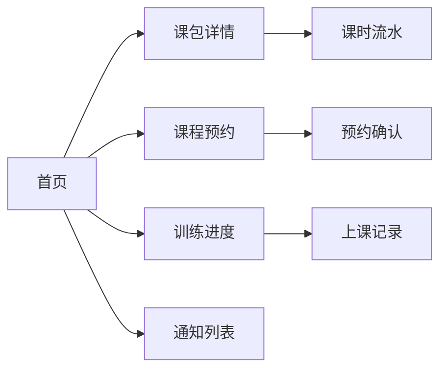
```mermaid
flowchart LR
    A[首页] --> B[课包详情]
    A --> C[课程预约]
    A --> D[训练进度]
    A --> E[通知列表]
    B --> F[课时流水]
    C --> G[预约确认]
    D --> H[上课记录]
```

- 特殊交互：
  1. 首页课时卡片：剩余课时 ≤ 阈值时数字变红色+脉动动画，旁边出现"立即续课"按钮
  2. 底部Tab导航：首页 / 课包 / 预约 / 训练 / 我的
  3. 课程预约页：已约时段灰显不可点击，可用时段点击后高亮选中
  4. 训练进度：折线图支持双指缩放查看细节
  5. 下拉刷新首页数据，上拉加载更多通知/记录

**产品原型：**

[📱 打开会员端小程序全站点原型](assets/prototypes/member-miniapp-prototype.html)

### 4.2.3 管理后台（WEB端）

**页面清单：**

| 序号 | 页面名称 | 所属模块 | 页面描述 | 关键元素 |
| --- | --- | --- | --- | --- |
| 1 | 登录页 | 认证 | 管理员手机号+验证码登录 | 手机号输入框、验证码输入框、登录按钮 |
| 2 | 数据看板 | 运营管理 | 今日概览和月度统计 | 概览卡片组（4个关键指标）、消课趋势折线图、续课率环形图 |
| 3 | 消课报表 | 运营管理 | 消课数据多维统计 | 教练筛选、课程类型筛选、时间范围、数据表格、导出按钮 |
| 4 | 续课报表 | 运营管理 | 续课转化统计 | 续课率、平均续课周期、课包类型排名、导出按钮 |
| 5 | 会员活跃报表 | 运营管理 | 会员活跃度分析 | 上课频率分布、请假率、流失风险会员列表 |
| 6 | 系统设置 | 系统设置 | 工作室信息和参数配置 | 工作室信息表单、品牌化配置、课程类型管理、提醒模板编辑 |
| 7 | 教练管理 | 权限管理 | 教练团队管理 | 教练列表、邀请教练按钮、编辑/禁用操作、容量监控条 |

**交互说明：**

- 页面跳转关系：
```mermaid
flowchart LR
    A[登录页] --> B[数据看板]
    B --> C[消课报表]
    B --> D[续课报表]
    B --> E[活跃报表]
    A --> F[系统设置]
    A --> G[教练管理]
```

- 特殊交互：
  1. 左侧固定菜单栏，包含：数据看板、运营报表（子菜单）、系统设置、教练管理
  2. 数据看板卡片支持点击下钻到对应报表详情页
  3. 报表页支持多条件组合筛选，筛选结果实时更新表格
  4. 导出Excel时显示进度条，完成后自动下载
  5. 教练邀请通过弹窗输入手机号，发送邀请链接

**产品原型：**

[🖥️ 打开管理后台全站点原型](assets/prototypes/admin-web-prototype.html)

---

# 5 数据需求

## 5.1 核心数据模型

### 会员表（member）

| **字段** | **是否必填** | **描述** | **数据类型** |
| --- | --- | --- | --- |
| id | 是 | 会员唯一标识 | UUID |
| studio_id | 是 | 所属工作室ID | UUID |
| name | 是 | 会员姓名 | 字符串 |
| phone | 是 | 手机号（唯一） | 字符串 |
| gender | 否 | 性别 | 枚举 |
| age | 否 | 年龄 | 数字 |
| fitness_goal | 否 | 健身目标 | 字符串 |
| wx_openid | 否 | 微信OpenID | 字符串 |
| status | 是 | 状态（正常/停用） | 枚举 |
| created_at | 是 | 创建时间 | 时间戳 |

### 课包表（package）

| **字段** | **是否必填** | **描述** | **数据类型** |
| --- | --- | --- | --- |
| id | 是 | 课包唯一标识 | UUID |
| member_id | 是 | 所属会员ID | UUID |
| coach_id | 是 | 负责教练ID | UUID |
| course_type | 是 | 课程类型 | 枚举 |
| total_sessions | 是 | 总课时 | 数字 |
| consumed_sessions | 是 | 已消课时 | 数字 |
| remaining_sessions | 是 | 剩余课时（计算字段） | 数字 |
| unit_price | 否 | 单价（元/课时） | 数字 |
| valid_from | 是 | 有效期开始 | 日期 |
| valid_until | 是 | 有效期截止 | 日期 |
| status | 是 | 状态（已创建/进行中/即将过期/已过期/已用完/已冻结） | 枚举 |
| created_at | 是 | 创建时间 | 时间戳 |

### 预约表（appointment）

| **字段** | **是否必填** | **描述** | **数据类型** |
| --- | --- | --- | --- |
| id | 是 | 预约唯一标识 | UUID |
| member_id | 是 | 会员ID | UUID |
| coach_id | 是 | 教练ID | UUID |
| package_id | 是 | 关联课包ID | UUID |
| course_type | 是 | 课程类型 | 枚举 |
| scheduled_at | 是 | 预约时间 | 时间戳 |
| duration | 是 | 课程时长（分钟） | 数字 |
| status | 是 | 状态（待确认/已确认/已完成/已请假/已取消） | 枚举 |
| cancel_reason | 否 | 取消原因 | 字符串 |
| is_makeup | 是 | 是否补课 | 布尔 |
| created_at | 是 | 创建时间 | 时间戳 |

### 消课记录表（consumption_log）

| **字段** | **是否必填** | **描述** | **数据类型** |
| --- | --- | --- | --- |
| id | 是 | 记录唯一标识 | UUID |
| appointment_id | 是 | 关联预约ID | UUID |
| member_id | 是 | 会员ID | UUID |
| package_id | 是 | 扣减课包ID | UUID |
| coach_id | 是 | 操作教练ID | UUID |
| consumed_count | 是 | 本次扣减课时数 | 数字 |
| remaining_before | 是 | 消课前剩余课时 | 数字 |
| remaining_after | 是 | 消课后剩余课时 | 数字 |
| course_type | 是 | 课程类型 | 枚举 |
| note | 否 | 训练备注 | 字符串 |
| created_at | 是 | 消课时间 | 时间戳 |

### 训练数据表（training_data）

| **字段** | **是否必填** | **描述** | **数据类型** |
| --- | --- | --- | --- |
| id | 是 | 记录唯一标识 | UUID |
| member_id | 是 | 会员ID | UUID |
| coach_id | 是 | 录入教练ID | UUID |
| record_date | 是 | 记录日期 | 日期 |
| weight | 否 | 体重（kg） | 数字 |
| body_fat | 否 | 体脂率（%） | 数字 |
| measurements | 否 | 围度数据（JSON） | JSON |
| strength_data | 否 | 力量数据（JSON） | JSON |
| note | 否 | 备注 | 字符串 |
| created_at | 是 | 创建时间 | 时间戳 |

### 提醒配置表（reminder_config）

| **字段** | **是否必填** | **描述** | **数据类型** |
| --- | --- | --- | --- |
| id | 是 | 配置唯一标识 | UUID |
| coach_id | 是 | 教练ID | UUID |
| course_type | 否 | 课程类型（空=全局） | 枚举 |
| renewal_threshold | 是 | 续课提醒课时阈值 | 数字 |
| renewal_channel | 是 | 提醒渠道（wechat/sms/both） | 枚举 |
| renewal_frequency | 是 | 提醒频率（first/daily/interval） | 枚举 |
| renewal_interval_days | 否 | 间隔提醒天数 | 数字 |
| class_reminder_minutes | 是 | 课前提醒分钟数 | 数字 |
| class_confirm_enabled | 是 | 是否开启上课确认 | 布尔 |

## 5.2 统计数据

1. 统计每日/每周/每月消课总量，按教练和课程类型维度（P1）
2. 统计续课转化率（续课会员数/收到续课提醒的会员数），按月统计（P1）
3. 统计会员活跃度（月上课次数分布），识别流失风险会员（P1）
4. 统计各课程类型课包销量排名（P2）
5. 统计平均续课周期（从收到提醒到完成续课的天数）（P2）

## 5.3 埋点需求

| 页面 | 事件 | 采集字段 | 说明 |
| --- | --- | --- | --- |
| 课表看板 | 消课操作 | 教练ID、会员ID、课程类型、操作耗时 | 统计消课频率和操作效率 |
| 课表看板 | 创建预约 | 教练ID、会员ID、课程类型、预约时间段 | 分析预约时间偏好 |
| 会员管理 | 新增会员 | 教练ID、导入方式（手动/批量） | 统计会员增长来源 |
| 课包管理 | 创建课包 | 教练ID、课程类型、课时数、是否使用模板 | 分析课包配置偏好 |
| 提醒通知 | 续课提醒发送 | 会员ID、提醒渠道、发送结果 | 统计提醒触达率 |
| 提醒通知 | 续课提醒转化 | 会员ID、从提醒到续课的时间间隔 | 衡量续课转化效果 |
| 会员端-首页 | 页面访问 | 会员ID、访问时间、停留时长 | 分析会员活跃度 |
| 会员端-预约 | 提交预约 | 会员ID、课程类型、预约时段 | 分析预约行为 |
| 会员端-续课 | 联系教练 | 会员ID、课包ID、来源页面 | 统计续课入口分布 |

---

# 6 非功能需求

## 6.1 性能需求

**6.1.1 延迟**

| 编号 | 项目 | 最大延迟 | 平均延迟 | 优先级 | 备注 |
| --- | --- | --- | --- | --- | --- |
| 0001 | 消课操作（含课时扣减+通知推送） | < 3 秒 | < 1 秒 | 高 | 核心操作 |
| 0002 | 课表看板页面加载 | < 2 秒 | < 1 秒 | 高 | |
| 0003 | 会员列表加载（100条以内） | < 1 秒 | < 0.5 秒 | 高 | |
| 0004 | 课时查询接口 | < 0.5 秒 | < 0.3 秒 | 高 | |
| 0005 | 训练进度趋势图渲染 | < 1 秒 | < 0.5 秒 | 中 | |
| 0006 | 报表导出（1000条数据） | < 10 秒 | < 5 秒 | 中 | |
| 0007 | 消息推送到达延迟 | < 5 秒 | < 2 秒 | 高 | 消课后通知会员 |

**6.1.2 吞吐量**

| 编号 | 项 | 吞吐量 | 备注 |
| --- | --- | --- | --- |
| 0001 | 消课操作 | 每分钟 200 次 | 高峰期（晚间6-9点） |
| 0002 | 课时查询 | 每分钟 1000 次 | 高频查询，Redis缓存 |
| 0003 | 消息推送 | 每分钟 500 条 | 微信+短信合计 |
| 0004 | 预约操作 | 每分钟 100 次 | |

**6.1.3 容量**

| 编号 | 项 | 容量 | 备注 |
| --- | --- | --- | --- |
| 0001 | 系统工作室数 | <= 10,000 | |
| 0002 | 单工作室教练数 | 免费版<=1，工作室版不限 | |
| 0003 | 单工作室会员数 | 免费版<=20，工作室版不限 | |
| 0004 | 同时在线用户 | 免费版<=50，工作室版<=500 | |

## 6.2 安全需求

| 编号 | 项（系统数据 / 处理过程） |
| --- | --- |
| 0001 | 所有客户端与服务端之间采用HTTPS加密通讯 |
| 0002 | 用户密码（管理员/教练）使用bcrypt加盐哈希存储，不可逆 |
| 0003 | 会员手机号等敏感信息脱敏展示（中间4位用*替代） |
| 0004 | 接口鉴权采用JWT Token，Token有效期2小时，支持刷新 |
| 0005 | 工作室数据严格隔离，任何接口不可跨工作室访问数据 |
| 0006 | 退款操作需管理员角色权限，普通教练无权限 |
| 0007 | 短信验证码60秒内不可重复发送，有效期5分钟 |

## 6.3 可靠性

| 编号 | 项 | 值 |
| --- | --- | --- |
| 0001 | 系统月可用率 | >= 99.5% |
| 0002 | 平均正常运行时间 | 约30天 |
| 0003 | 平均故障恢复时间 | <= 30分钟 |

## 6.4 可连续性

| 编号 | 项 |
| --- | --- |
| Conti.1 | 系统需要 7 × 24 式的全天候运行 |
| Conti.2 | 消息推送服务故障时，恢复后自动补发未送达的消息 |
| Conti.3 | 数据库主从架构，主库故障时自动切换到从库 |

## 6.5 可恢复性

| 编号 | 项 |
| --- | --- |
| Recov.1 | 每日自动全量备份数据库，保留90天 |
| Recov.2 | 每小时增量备份，保留7天 |
| Recov.3 | 重大故障需在1~3小时恢复服务可用性 |
| Recov.4 | 24~72小时内可恢复历史数据 |

## 6.6 兼容性

| 编号 | 要求 | 备注 |
| --- | --- | --- |
| 0001 | 教练工作台/管理后台兼容：Chrome >=90，Firefox >=88，Safari >=14，Edge >=90 | WEB端 |
| 0002 | 会员端微信小程序基础库 >= 2.20.0 | 小程序端 |
| 0003 | 移动端适配：iOS 12+，Android 8.0+ | 会员端 |
| 0004 | 教练工作台/管理后台支持分辨率：1280×720 及以上 | WEB端 |

## 6.7 易用性

| 编号 | 要求 | 备注 |
| --- | --- | --- |
| 0001 | 核心操作（消课、查看课时）不超过3次点击完成 | |
| 0002 | 新用户首次使用提供操作引导和空状态提示 | |
| 0003 | 所有界面使用简体中文 | |
| 0004 | 普通教练无需培训即可使用核心功能（消课、查看课表） | |

---

# 7 总结

## 7.1 上线计划

| 阶段 | 时间 | 内容 | 负责人 |
| --- | --- | --- | --- |
| MVP开发 | 第1-10天 | 会员课包管理 + 消课记录 + 剩余课时提醒 + 教练课表看板 | 开发团队 |
| 测试阶段 | 第11-14天 | 功能测试、兼容性测试、性能测试 | 测试团队 |
| 灰度阶段 | 第15-21天 | 邀请3-5家工作室试用，收集反馈 | 产品+运营 |
| 全量上线 | 第22天 | 正式版发布，开放免费注册 | 全员 |

## 7.2 后续迭代规划

- V1.1：线上支付功能（微信支付课包购买）、会员端评价教练功能
- V1.2：多工作室/连锁门店管理、教练端APP（替代WEB端）
- V1.3：AI训练计划推荐（基于训练数据自动生成训练方案）、智能排课优化
- V1.4：会员社区（训练打卡分享、排行榜）、营销工具（体验课、拼团）

## 7.3 参考文档

- 用户需求说明书（URS）：`./需求文档.md`
- 教练工作台全站点原型：`assets/prototypes/coach-web-prototype.html`
- 会员端小程序全站点原型：`assets/prototypes/member-miniapp-prototype.html`
- 管理后台全站点原型：`assets/prototypes/admin-web-prototype.html`
