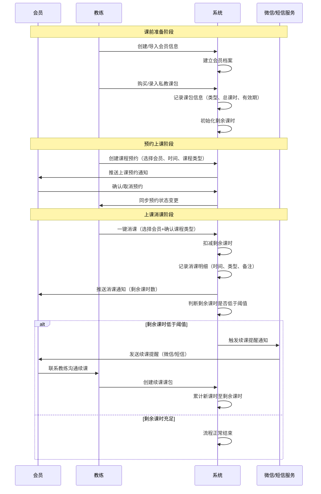
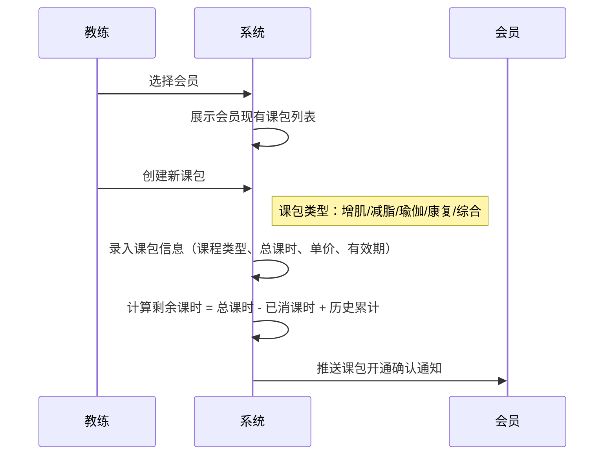
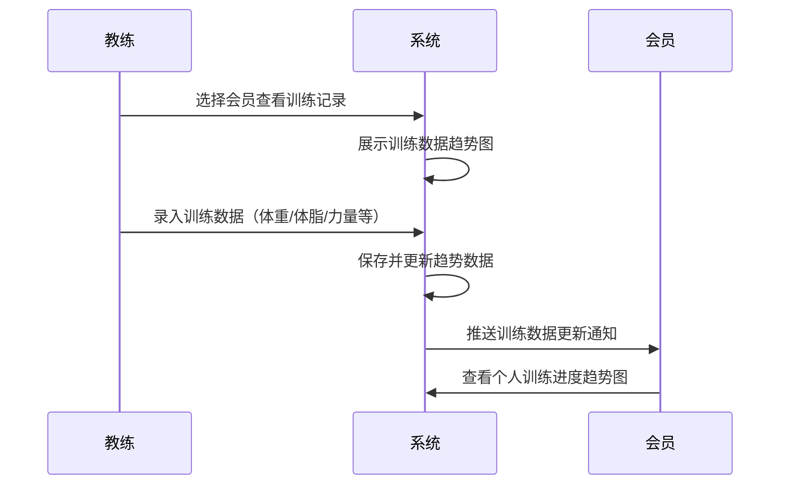
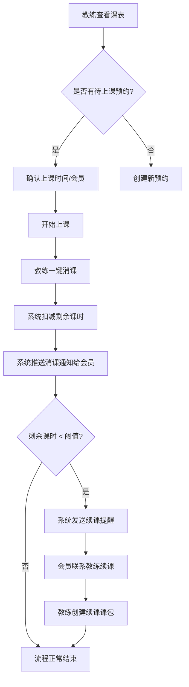
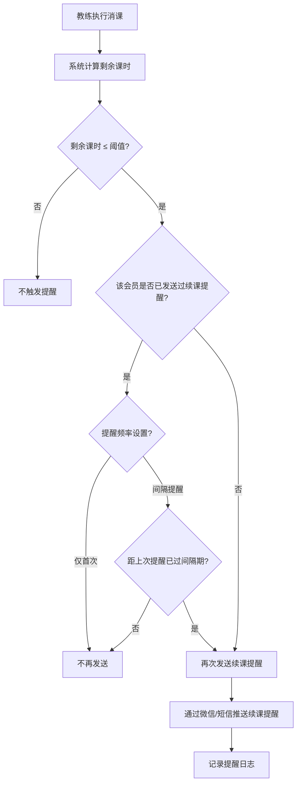
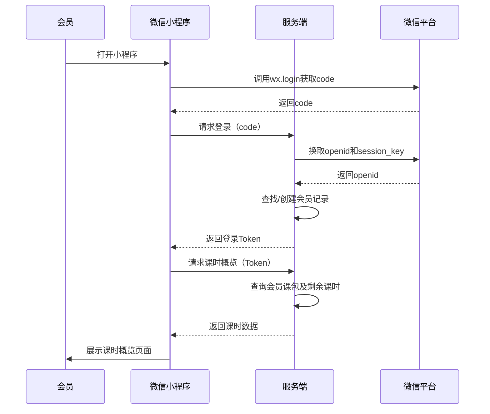
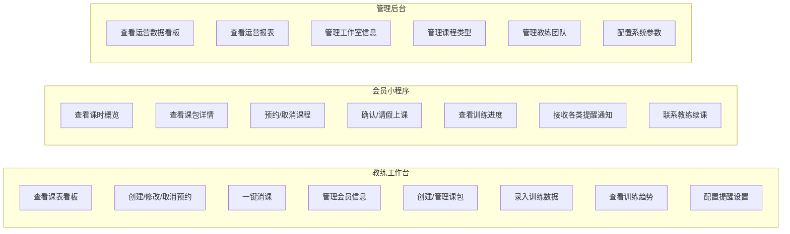
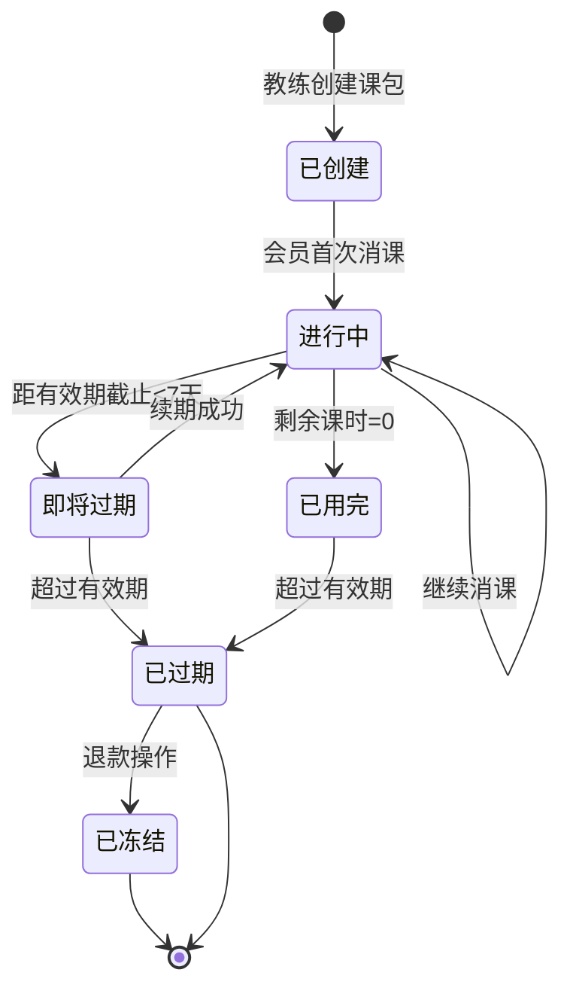
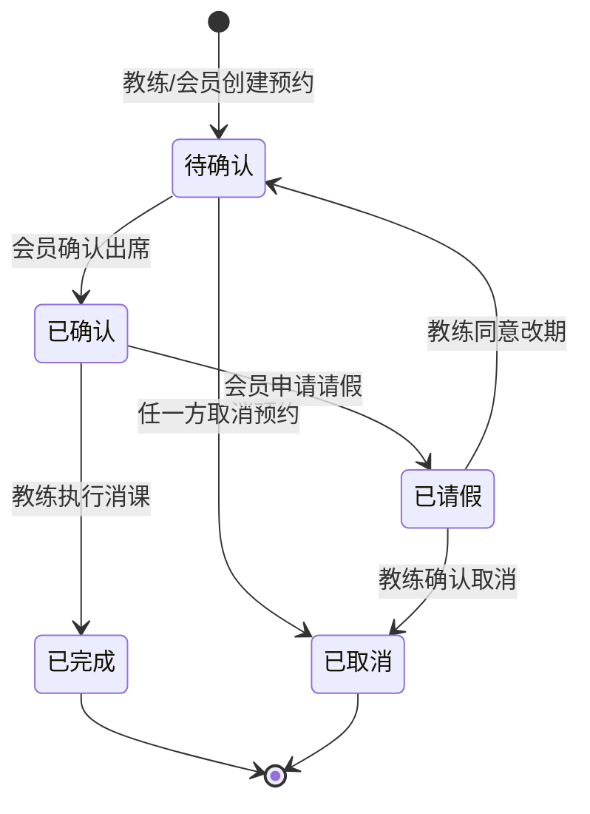

# 健身房私教课消课与续课提醒助手 - 用户需求说明书

## 版本信息

| 版本号 | 修订日期 | 修订人 | 修订内容 |
|--------|----------|--------|----------|
| v1.0.0 | 2026-06-29 | 需求文档结对写作专家 | 初稿 |

---

# 1. 需求概述

## 1.1 需求介绍

健身房私教课消课与续课提醒助手是一款面向小型健身工作室和独立私教教练的轻量级SaaS工具，旨在帮助教练团队高效管理会员私教课包、快速完成上课消课记录，并通过自动化提醒机制在会员剩余课时不足时及时触发续课通知，提升续课转化率和会员满意度。

当前市场上大多数健身工作室仍依赖Excel表格或纸质记录来管理会员课包信息，存在消课操作繁琐、续课提醒不及时、会员训练进度无法量化展示等痛点，导致会员流失率高、运营效率低下。

本系统定位于"轻量、专注、低价"，不做完整的大型健身房会员管理系统，而是聚焦于"私教课包消课 + 续课提醒 + 训练进度展示"这一核心业务闭环，为小型私教工作室提供简单易用、成本可控的数字化管理工具。

### 1.1.1 所属领域

垂直行业需求 / 健身健康行业 / 私教工作室运营管理

## 1.2 需求目标

| 目标维度 | 目标描述 | 衡量指标 |
|----------|----------|----------|
| 提升消课效率 | 教练每次上课后一键完成消课记录，无需手动维护纸质/电子表格 | 单次消课操作时间 ≤ 5秒 |
| 提高续课转化率 | 通过自动化的课时提醒机制，在会员课时不足时及时推送续课提醒 | 续课转化率较未使用系统前提升30%以上 |
| 增强会员粘性 | 会员可随时查看剩余课时、训练进度和教练评价 | 会员活跃度提升20%以上 |
| 降低运营成本 | 小型工作室以低成本替代传统SaaS方案 | 免费版支持1教练+20会员零成本使用 |
| 快速上线 | 核心功能7-10天完成MVP开发 | MVP覆盖课包管理+消课+提醒+课表 |

## 1.3 业务流程图

### 1.3.1 核心业务流程 — 私教课消课与续课提醒

### 1.3.2 课包管理业务流程

### 1.3.3 训练进度记录流程

## 1.4 系统使用角色

| 角色 | 描述 | 核心职责 |
|------|------|----------|
| 工作室管理员 | 工作室负责人或运营管理者 | 管理教练团队、查看运营报表、设置系统参数、管理会员信息 |
| 教练 | 持证私教或工作室教练 | 管理会员课包、上课消课、查看课表、录入训练数据、发起续课沟通 |
| 会员 | 购买私教课的用户 | 查看剩余课时、接收上课/续课提醒、查看训练进度、预约课程 |

# 2. 功能原型

| 原型名称 | 原型链接 | 对应端 | 备注 |
|----------|----------|--------|------|
| 教练工作台 | 待设计 | WEB端 | 教练日常管理主界面，含课表看板、消课操作、会员管理 |
| 会员端 | 待设计 | 小程序端 | 会员查看课时、接收提醒、预约课程、查看训练进度 |
| 管理后台 | 待设计 | WEB端 | 工作室管理员运营报表、系统设置、教练权限管理 |

# 3. 需求清单

## 3.1 教练工作台-WEB端

### 3.1.1 课表看板模块

| 模块 | 一级功能 | 二级功能 | 功能描述 | 备注 |
|------|----------|----------|----------|------|
| 课表看板 | 日程视图切换 | 日视图 | 按日展示当天的预约课程安排，显示时间段、会员姓名、课程类型、上课状态 | 支持快速定位当日待处理课程 |
| 课表看板 | 日程视图切换 | 周视图 | 按周展示一周的课程安排，支持横向滚动查看各天课程密度 | 便于教练规划一周工作 |
| 课表看板 | 预约管理 | 创建预约 | 选择会员、课程类型、日期时间创建课程预约，系统自动校验会员课包是否充足 | 创建时检查会员可用课包 |
| 课表看板 | 预约管理 | 修改预约 | 修改预约的时间、课程类型或会员信息，变更实时同步给会员 | 支持拖拽调整时间 |
| 课表看板 | 预约管理 | 取消预约 | 取消已创建的预约，释放时间段，同步通知会员 | 取消时询问原因以便统计 |
| 课表看板 | 上课状态管理 | 一键消课 | 在课表中对已完成课程执行消课操作，自动扣减会员剩余课时 | 核心功能，操作需极简 |
| 课表看板 | 上课状态管理 | 消课确认弹窗 | 消课前弹出确认窗口，显示会员姓名、课程类型、剩余课时，确认后执行 | 防止误操作 |
| 课表看板 | 上课状态管理 | 补课标记 | 对请假后补课的会员标记补课状态，不影响课时扣减逻辑 | 区分正常课和补课 |
| 课表看板 | 消课记录 | 查看消课历史 | 按时间范围查看消课记录列表，支持按会员、课程类型筛选 | 支持导出为Excel |
| 课表看板 | 消课记录 | 消课详情 | 查看单次消课的详细信息：时间、课程类型、课时扣减数量、剩余课时变化 | 支持查看修改历史 |

### 3.1.2 会员管理模块

| 模块 | 一级功能 | 二级功能 | 功能描述 | 备注 |
|------|----------|----------|----------|------|
| 会员管理 | 会员信息管理 | 会员列表 | 展示工作室所有会员列表，显示姓名、联系方式、剩余总课时、最近上课时间 | 支持按课程类型/剩余课时排序 |
| 会员管理 | 会员信息管理 | 新增会员 | 录入新会员基本信息（姓名、手机号、性别、年龄、健身目标） | 手机号为必填项 |
| 会员管理 | 会员信息管理 | 编辑会员 | 修改会员基本信息和联系方式 | 手机号修改需二次确认 |
| 会员管理 | 会员信息管理 | 会员档案 | 查看会员详细档案：基本信息、所有课包、消课历史、训练数据趋势 | 一站式了解会员全貌 |
| 会员管理 | 会员导入 | 批量导入 | 通过Excel模板批量导入会员信息，支持字段映射 | 提供导入模板下载 |
| 会员管理 | 会员导入 | 导入校验 | 导入时校验手机号格式、必填字段，重复数据提示合并策略 | 支持覆盖/跳过/合并 |

### 3.1.3 课包管理模块

| 模块 | 一级功能 | 二级功能 | 功能描述 | 备注 |
|------|----------|----------|----------|------|
| 课包管理 | 课包创建 | 新建课包 | 为会员创建私教课包，设置课程类型（增肌/减脂/瑜伽/康复/综合/自定义）、总课时、单价、有效期 | 支持按课程类型分类 |
| 课包管理 | 课包创建 | 课包模板 | 预设常用课包模板（如"10次增肌课包"、"20次减脂课包"），快速创建 | 减少重复录入 |
| 课包管理 | 课包创建 | 多课包叠加 | 同一会员可拥有多个课包，新购课包课时追加至现有剩余课时 | 课时可跨课包累计 |
| 课包管理 | 课包状态管理 | 课包列表 | 查看会员名下所有课包状态：进行中、已用完、已过期 | 按状态分类展示 |
| 课包管理 | 课包状态管理 | 课包续期 | 对即将过期或已过期的课包延长有效期 | 续期记录可追溯 |
| 课包管理 | 课包状态管理 | 课包退款 | 对未使用完的课包发起退款操作，冻结课包并记录退款原因 | 需管理员权限 |
| 课包管理 | 课时监控 | 剩余课时展示 | 在课包列表和会员档案中突出显示剩余课时数量及占比 | 低课时高亮提醒 |
| 课包管理 | 课时监控 | 课时预警 | 当会员剩余课时低于设定阈值时，自动标记预警状态并推送通知给教练 | 阈值可自定义设置 |
| 课包管理 | 课时监控 | 课时流水 | 查看会员所有课包的课时变动流水（购买增加、消课扣减、退款冻结等） | 完整追溯每笔变动 |

### 3.1.4 训练进度模块

| 模块 | 一级功能 | 二级功能 | 功能描述 | 备注 |
|------|----------|----------|----------|------|
| 训练进度 | 数据录入 | 体重记录 | 记录会员每次上课时的体重数据 | 可选填 |
| 训练进度 | 数据录入 | 体脂率记录 | 记录会员体脂率变化数据 | 可选填 |
| 训练进度 | 数据录入 | 力量数据记录 | 记录会员各项力量训练数据（如卧推重量、深蹲重量等） | 支持自定义训练项目 |
| 训练进度 | 数据录入 | 围度记录 | 记录会员身体各部位围度变化（胸围、腰围、臂围等） | 可选填 |
| 训练进度 | 数据展示 | 趋势图表 | 以折线图/柱状图展示会员各项训练数据的变化趋势 | 支持时间范围选择 |
| 训练进度 | 数据展示 | 阶段对比 | 对比会员在指定时间段内的训练数据变化 | 如月度/季度对比 |
| 训练进度 | 数据展示 | 进度评估 | 根据录入数据自动生成训练进度评估摘要（达标/未达标/建议调整） | 辅助教练调整训练计划 |
| 训练进度 | 训练备注 | 课后备注 | 教练为每次上课添加训练备注（训练内容、完成情况、下次建议） | 便于回顾训练历程 |

### 3.1.5 提醒设置模块

| 模块 | 一级功能 | 二级功能 | 功能描述 | 备注 |
|------|----------|----------|----------|------|
| 提醒设置 | 续课提醒配置 | 课时阈值设置 | 设置剩余课时触发续课提醒的阈值（默认建议5次） | 可按课程类型分别设置 |
| 提醒设置 | 续课提醒配置 | 提醒方式选择 | 选择续课提醒的推送渠道：微信、短信、两者都选 | 默认微信+短信 |
| 提醒设置 | 续课提醒配置 | 提醒频率设置 | 设置续课提醒的推送频率：仅首次触发、每日提醒、间隔提醒 | 避免过度打扰会员 |
| 提醒设置 | 上课提醒配置 | 课前提醒时间 | 设置上课前多长时间推送提醒给会员（默认课前2小时） | 可配置15分钟/30分钟/1小时/2小时 |
| 提醒设置 | 上课提醒配置 | 上课确认机制 | 会员收到上课提醒后可确认出席或请假 | 请假自动释放时间段 |
| 提醒设置 | 提醒记录 | 提醒日志 | 查看所有已发送的提醒记录，包括发送时间、接收状态、提醒类型 | 便于排查提醒送达问题 |

## 3.2 会员端-小程序端

### 3.2.1 首页模块

| 模块 | 一级功能 | 二级功能 | 功能描述 | 备注 |
|------|----------|----------|----------|------|
| 首页 | 课时概览 | 剩余课时展示 | 首页顶部展示当前剩余总课时、各课包剩余明细 | 低课时红色高亮提醒 |
| 首页 | 课时概览 | 课包状态摘要 | 展示各课包状态（进行中/即将过期/已过期） | 过期课包灰显 |
| 首页 | 快捷入口 | 预约课程 | 快速进入课程预约页面 | 一键操作 |
| 首页 | 快捷入口 | 查看课表 | 查看近期已预约课程安排 | 显示时间和状态 |
| 首页 | 消息通知 | 通知列表 | 查看系统推送的所有通知消息（上课提醒、续课提醒、课包变动通知） | 支持标记已读 |

### 3.2.2 课包详情模块

| 模块 | 一级功能 | 二级功能 | 功能描述 | 备注 |
|------|----------|----------|----------|------|
| 课包详情 | 课包信息 | 课包列表 | 查看自己名下所有课包信息：课程类型、总课时、已消课时、剩余课时、有效期 | 列表形式展示 |
| 课包详情 | 课包信息 | 课包详情 | 查看单个课包的详细信息和课时流水记录 | 每笔变动可追溯 |
| 课包详情 | 课时流水 | 变动记录 | 查看课包的所有课时变动记录：购买增加、上课扣减、退款冻结等 | 按时间倒序展示 |
| 课包详情 | 续课操作 | 联系续课 | 课时不足时一键联系教练发起续课沟通 | 支持发送续课意向消息 |

### 3.2.3 课程预约模块

| 模块 | 一级功能 | 二级功能 | 功能描述 | 备注 |
|------|----------|----------|----------|------|
| 课程预约 | 预约操作 | 查看可用时段 | 展示教练可预约时间段列表，已约时段灰显不可选 | 实时同步教练课表 |
| 课程预约 | 预约操作 | 提交预约 | 选择日期、时间段、课程类型提交预约申请 | 预约前校验课包课时 |
| 课程预约 | 预约操作 | 取消预约 | 取消已预约但未开始的课程 | 支持取消操作 |
| 课程预约 | 预约状态 | 预约列表 | 查看所有预约记录及状态（待确认/已确认/已完成/已取消） | 区分不同状态 |
| 课程预约 | 上课提醒 | 上课确认 | 收到上课提醒后确认出席或申请请假 | 请假需教练确认 |

### 3.2.4 训练进度模块

| 模块 | 一级功能 | 二级功能 | 功能描述 | 备注 |
|------|----------|----------|----------|------|
| 训练进度 | 数据查看 | 体重趋势图 | 以折线图展示体重变化趋势 | 直观展示训练效果 |
| 训练进度 | 数据查看 | 体脂趋势图 | 以折线图展示体脂率变化趋势 | 支持时间范围选择 |
| 训练进度 | 数据查看 | 力量趋势图 | 以柱状图展示各项力量训练数据变化 | 按训练项目分类 |
| 训练进度 | 数据查看 | 围度趋势图 | 以折线图展示各部位围度变化 | 直观展示身体变化 |
| 训练进度 | 训练回顾 | 上课记录 | 查看历史上课记录列表及教练课后备注 | 了解每次训练内容 |
| 训练进度 | 训练回顾 | 阶段总结 | 查看教练提供的阶段性训练总结和建议 | 按月/季度自动生成 |

## 3.3 管理后台-WEB端

### 3.3.1 运营管理模块

| 模块 | 一级功能 | 二级功能 | 功能描述 | 备注 |
|------|----------|----------|----------|------|
| 运营管理 | 数据看板 | 今日概览 | 展示今日数据：上课人数、消课次数、新预约数、待续课会员数 | 管理后台首页 |
| 运营管理 | 数据看板 | 月度统计 | 展示本月消课总量、新购课包数、续课率、会员活跃度等关键指标 | 支持按周/月切换 |
| 运营管理 | 数据报表 | 消课报表 | 按教练/课程类型/时间段统计消课数据 | 支持导出Excel |
| 运营管理 | 数据报表 | 续课报表 | 统计续课转化率、平均续课周期、课包类型续课排名 | 辅助运营决策 |
| 运营管理 | 数据报表 | 会员活跃报表 | 统计会员上课频率、请假率、流失风险会员列表 | 识别高风险会员 |

### 3.3.2 系统设置模块

| 模块 | 一级功能 | 二级功能 | 功能描述 | 备注 |
|------|----------|----------|----------|------|
| 系统设置 | 工作室信息 | 基本信息管理 | 设置工作室名称、联系方式、营业时间、地址等基本信息 | 用于会员端品牌展示 |
| 系统设置 | 工作室信息 | 品牌化配置 | 设置工作室Logo、主题色等品牌化元素 | 工作室版专属功能 |
| 系统设置 | 课程类型管理 | 课程类型配置 | 管理系统中的课程类型列表（增肌/减脂/瑜伽/康复等） | 支持自定义添加 |
| 系统设置 | 提醒配置 | 全局提醒模板 | 配置各类提醒消息的文案模板（上课提醒、续课提醒、课包变动通知等） | 支持变量插入 |
| 系统设置 | 提醒配置 | 推送渠道配置 | 配置微信推送和短信推送的渠道参数 | 需接入微信开放平台和短信服务商 |
| 系统设置 | 阈值配置 | 默认阈值设置 | 设置全工作室默认的续课提醒课时阈值和课前提醒时间 | 教练可针对会员单独覆盖 |

### 3.3.3 权限管理模块

| 模块 | 一级功能 | 二级功能 | 功能描述 | 备注 |
|------|----------|----------|----------|------|
| 权限管理 | 教练管理 | 教练列表 | 查看工作室下所有教练列表及状态 | 工作室版支持多教练 |
| 权限管理 | 教练管理 | 添加教练 | 邀请新教练加入工作室（通过手机号邀请） | 免费版限1名教练 |
| 权限管理 | 教练管理 | 教练信息编辑 | 编辑教练个人信息、擅长领域、排班时间 | 用于会员端展示 |
| 权限管理 | 会员容量管理 | 容量监控 | 展示当前会员数量和套餐上限，超额提醒 | 免费版限20名会员 |

# 4. 非功能需求

## 4.1 使用界面需求

| 需求项 | 需求描述 | 适用端 |
|--------|----------|--------|
| 操作简洁性 | 核心操作（消课、查看课时）不超过3次点击完成 | 教练端、会员端 |
| 移动端适配 | 会员端小程序需适配主流手机屏幕尺寸（iOS/Android） | 会员端 |
| 响应式设计 | 教练工作台和管理后台支持1280px及以上分辨率 | 教练端、管理后台 |
| 数据可视化 | 训练进度数据以图表形式展示，支持缩放和时间范围选择 | 教练端、会员端 |
| 空状态引导 | 新用户首次使用时提供操作引导和空状态提示 | 全部端 |
| 中文界面 | 系统所有界面使用简体中文 | 全部端 |

## 4.2 软硬件环境需求

| 需求项 | 需求描述 |
|--------|----------|
| 服务端部署 | 云端部署（推荐阿里云/腾讯云），支持弹性扩展 |
| 数据库 | 关系型数据库（MySQL/PostgreSQL），存储会员、课包、消课等核心业务数据 |
| 缓存服务 | Redis缓存，用于会话管理、验证码、高频查询缓存 |
| 消息推送 | 接入微信公众号/小程序模板消息推送能力 |
| 短信服务 | 接入第三方短信服务商（如阿里云短信、腾讯云短信） |
| 教练端浏览器 | 支持Chrome 90+、Firefox 88+、Safari 14+、Edge 90+ |
| 会员端 | 微信小程序基础库 2.20.0+，支持iOS 12+和Android 8.0+ |

## 4.3 性能需求

| 需求项 | 指标要求 |
|--------|----------|
| 页面加载时间 | 首屏加载 ≤ 2秒（4G网络环境下） |
| 接口响应时间 | 核心操作（消课、查询课时）响应时间 ≤ 500ms |
| 并发用户数 | 支持同时在线教练/会员数：免费版≤50，工作室版≤500 |
| 消息推送延迟 | 消课后会员通知到达延迟 ≤ 5秒 |
| 数据备份 | 每日自动备份，数据保留90天 |
| 系统可用性 | 月可用率 ≥ 99.5% |

## 4.4 约束性需求

| 需求编号 | 约束描述 |
|----------|----------|
| C-01 | 本系统不实现大型健身房完整会员管理功能（如门禁对接、团课排课、零售POS等），仅聚焦私教课包消课与续课提醒核心场景 |
| C-02 | 本系统不实现线上支付功能，课包购买为线下收款后由教练手动录入 |
| C-03 | 会员通知推送必须通过微信公众号/小程序模板消息或短信渠道，不支持App推送 |
| C-04 | 免费版限制为1名教练、20名会员；工作室版不限教练和会员数量 |
| C-05 | 系统需要后台服务支撑消息推送、定时提醒、数据统计等功能 |
| C-06 | MVP阶段暂不支持多工作室/连锁门店管理，后续版本可扩展 |

# 5. 接口需求

## 5.1 硬件接口需求

本系统不涉及硬件接口需求。

## 5.2 软件接口需求

| 模块 | 接口名称 | 输入 | 输出 | 功能描述 |
|------|----------|------|------|----------|
| 消息推送 | 微信模板消息接口 | 会员OpenID、消息模板ID、模板参数（会员姓名、剩余课时、课程时间等） | 发送结果（成功/失败） | 向会员推送上课提醒、续课提醒、课包变动通知等 |
| 消息推送 | 短信发送接口 | 会员手机号、短信模板ID、模板变量 | 发送结果（成功/失败） | 作为微信推送的补充渠道，发送上课提醒和续课提醒 |
| 数据导入 | Excel导入接口 | Excel文件（会员信息批量数据） | 导入结果（成功条数、失败条数、失败原因） | 支持批量导入会员基本信息 |
| 数据导出 | Excel导出接口 | 导出条件（时间范围、筛选条件、数据类型） | Excel文件下载链接 | 支持导出消课记录、会员列表、运营报表 |
| 用户认证 | 微信授权登录接口 | 微信授权code | 用户OpenID、会话Token | 会员通过微信小程序授权登录 |
| 用户认证 | 手机号验证码登录接口 | 手机号、短信验证码 | 登录Token | 教练和管理员通过手机号+验证码登录 |

## 5.4 通讯接口需求

| 需求项 | 描述 |
|--------|------|
| HTTPS通讯 | 所有客户端与服务端之间采用HTTPS加密通讯 |
| WebSocket | 教练工作台使用WebSocket实现课表实时同步和消息推送 |
| 小程序API | 会员端通过微信小程序原生API进行网络请求和数据交互 |

# 6. 附录

## 流程图

### 6.1 会员上课完整流程

### 6.2 续课提醒触发流程

## 时序图

### 6.3 会员小程序登录与课时查询时序

## （用户与系统交互）用例图

### 6.4 系统整体用例图

## （系统）状态图

### 6.5 课包状态流转图

### 6.6 预约状态流转图

