# 儿童兴趣班接送交接表 — 产品需求文档（PRD）

> **文档版本**：v1.0.0  
> **创建日期**：2026-06-26  
> **产品名称**：儿童兴趣班接送交接表  
> **文档状态**：初稿  

---

## 变更历史

| 版本号 | 变更日期 | 变更内容 | 变更人 | 审核人 |
| --- | --- | --- | --- | --- |
| V1.0 | 2026-06-26 | 初始版本创建 | 产品文档结对写作专家 | 阶段一产品落地页文档总编辑 |

---

# 1 概述

## 1.1 需求背景

随着社会对儿童安全问题的日益重视，社区小型儿童兴趣班、托管班、少儿培训机构（3～15人规模）在接送交接环节的安全管理需求愈发突出。当前，这类小型机构普遍采用微信群口头通知、纸质签到等传统方式进行接送管理，存在以下痛点：

1. **交接记录缺失**：纸质签到易丢失、难追溯，微信群通知无法形成有效记录
2. **授权管控薄弱**：非授权人员接送风险高，临时变更接送人缺乏确认机制
3. **异常预警滞后**：孩子未按时到校、非授权人接送等异常情况无法及时发现和处理
4. **管理效率低下**：人工统计接送记录耗时费力，难以满足家长查询需求

「儿童兴趣班接送交接表」产品聚焦"接送授权、交接留痕、异常提醒"三大核心场景，以轻量级、低成本的方式填补社区小机构在接送安全管理上的空白，帮助机构实现信息透明、责任可追溯。

## 1.2 名词解释

| **名词** | **说明** |
| --- | --- |
| 授权接送人 | 经家长授权、可在日常情况下接送孩子的指定人员，包括父母、祖辈、亲属等 |
| 临时授权 | 当非授权接送人需接送孩子时，由家长通过系统临时确认授权的机制 |
| 接送二维码 | 为每个学生生成的专属二维码，用于老师扫码记录到校/离校 |
| 到校签到 | 老师通过扫描学生二维码或手动操作，记录学生到校时间的行为 |
| 离校签退 | 老师通过扫描学生二维码并核对接送人身份，记录学生离校时间的行为 |
| 异常事件 | 包括未按时到校、非授权人接送、临时授权待确认等需要特殊处理的场景 |

## 1.3 产品介绍

### 1.3.1 范围说明

| 项 | 内容 |
| --- | --- |
| 包含功能 | 接送授权管理、到校/离校扫码确认、异常提醒、临时授权确认、请假管理、接送记录查询与导出、通知推送 |
| 不包含功能 | 教务管理（排课、消课、课时费管理）、在线支付、收费管理、课程资源管理 |

**产品定位**：面向社区小型儿童兴趣班、托管班、少儿培训机构（3～15人规模）的轻量级接送安全管理工具。

**目标用户**：
- **机构管理员**：机构负责人、前台主管，负责机构基础信息设置、学生档案管理、老师账号管理
- **老师**：前台老师、班主任、授课老师，负责每日接送确认、异常处理
- **家长**：孩子父母、法定监护人，查看接送记录、接收通知、管理授权接送人

**使用场景**：
- 每日学生到校/离校交接
- 临时变更接送人
- 学生请假
- 异常情况处理与确认

**核心价值**：
1. **安全留痕**：每次接送建立可追溯电子记录，明确交接双方
2. **授权管控**：维护授权接送人名单，杜绝非授权接送风险
3. **异常预警**：自动检测异常场景并推送通知，及时响应
4. **轻量易用**：3步完成核心操作，单手即可操作
5. **成本可控**：免费版支持30名学生，机构版¥49/月

---

# 2 产品设计

## 2.1 系统架构图

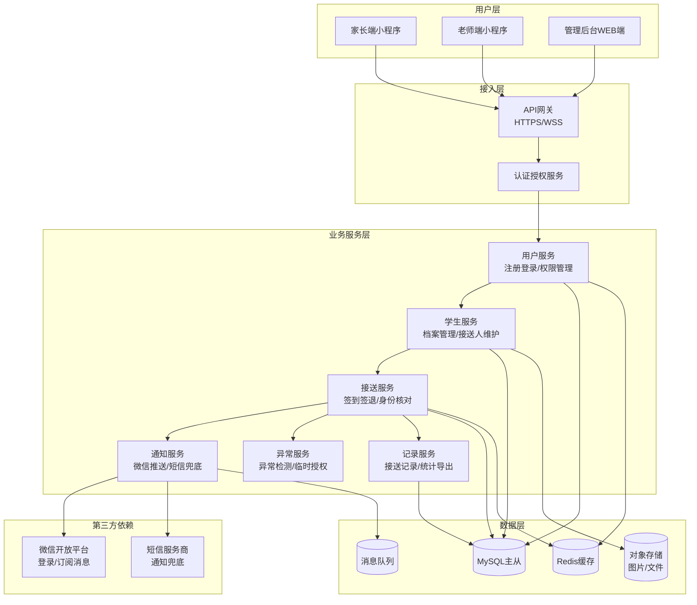

## 2.2 业务模块图

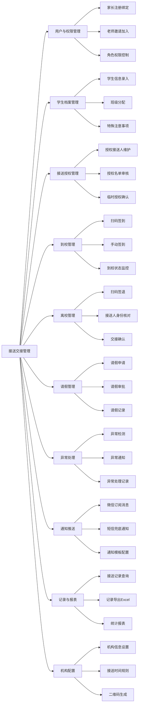

## 2.3 主业务流程

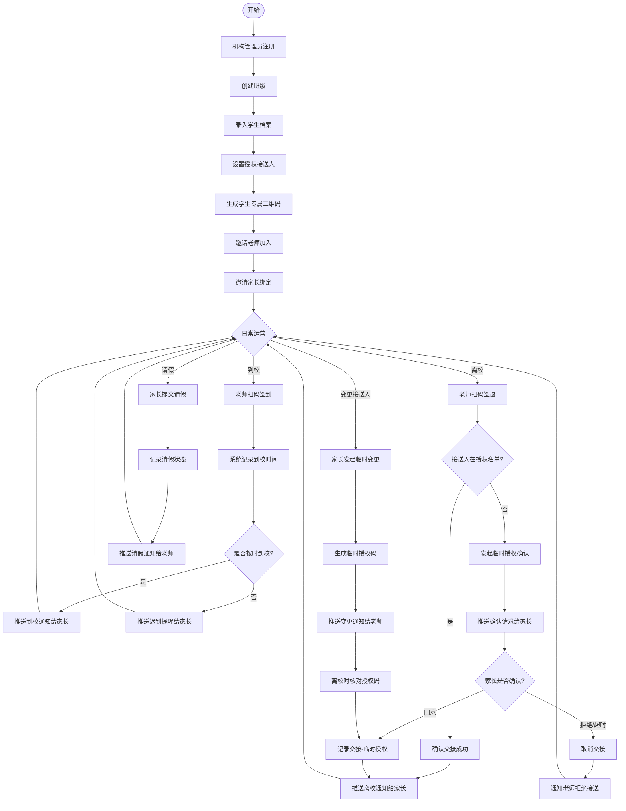

## 2.4 功能图/列表

| 功能模块 | 功能名称 | 优先级 | 功能描述 |
| --- | --- | --- | --- |
| 用户与权限 | 家长注册登录 | P0 | 微信授权手机号一键登录 |
| 用户与权限 | 孩子绑定 | P0 | 管理员生成邀请码，家长扫码绑定 |
| 用户与权限 | 老师邀请加入 | P0 | 通过邀请码或手机号邀请老师 |
| 学生管理 | 学生档案维护 | P0 | 录入学生基本信息、家长信息、特殊注意事项 |
| 学生管理 | 班级分配 | P0 | 将学生分配到对应班级 |
| 学生管理 | 批量导入 | P2 | 通过Excel模板批量导入学生信息（机构版） |
| 接送授权 | 授权接送人维护 | P0 | 为每个学生维护授权接送人名单 |
| 接送授权 | 临时授权确认 | P0 | 非授权人接送时，家长临时确认授权 |
| 到校管理 | 扫码签到 | P0 | 扫描学生二维码记录到校 |
| 到校管理 | 手动签到 | P0 | 二维码异常时手动签到 |
| 离校管理 | 扫码签退 | P0 | 扫描学生二维码进入离校流程 |
| 离校管理 | 接送人身份核对 | P0 | 核对实际接送人是否在授权名单 |
| 请假管理 | 请假申请 | P1 | 家长提交请假申请 |
| 异常处理 | 异常检测 | P0 | 自动检测未按时到校、非授权接送等异常 |
| 异常处理 | 异常通知 | P0 | 向家长和老师推送异常通知 |
| 通知推送 | 微信订阅消息 | P0 | 推送各类通知到家长微信 |
| 通知推送 | 短信兜底 | P1 | 微信通知失败时短信兜底 |
| 记录报表 | 接送记录查询 | P0 | 按学生、日期查询接送记录 |
| 记录报表 | 记录导出 | P1 | 导出接送记录为Excel（机构版） |
| 机构配置 | 机构信息设置 | P0 | 设置机构基本信息 |
| 机构配置 | 接送时间规则 | P0 | 配置到校/离校时间规则 |
| 机构配置 | 二维码生成 | P0 | 为学生生成专属二维码 |
| 订阅管理 | 套餐管理 | P1 | 查看和升级订阅套餐（机构版） |

## 2.5 你的产品有哪些端

| 序号 | 端名称 | 端类型 | 目标用户 | 说明 |
| --- | --- | --- | --- | --- |
| 1 | 家长端小程序 | 小程序端 | 家长 | 家长在微信中使用，查看通知、管理授权、请假等 |
| 2 | 老师端小程序 | 小程序端 | 老师 | 老师在微信中使用，扫码签到签退、处理异常等 |
| 3 | 管理后台 | WEB端 | 机构管理员 | 管理员在电脑或手机上管理平台配置、学生档案等 |

**说明**：
- **家长端**和**老师端**在MVP阶段采用微信小程序，同一小程序内通过角色切换
- **管理后台**采用WEB端，支持PC浏览器和移动端H5适配

---

# 3 产品功能

## 3.1 家长端小程序功能

### 3.1.1 注册登录

**功能描述**：家长通过微信授权获取手机号，一键注册登录小程序，并完成与孩子的绑定。

| 项 | 内容 |
| --- | --- |
| 优先级 | P0 |
| 依赖需求 | 管理员已创建学生档案并生成绑定邀请码 |
| 前置条件 | 家长已安装微信8.0及以上版本 |

**详细流程**：

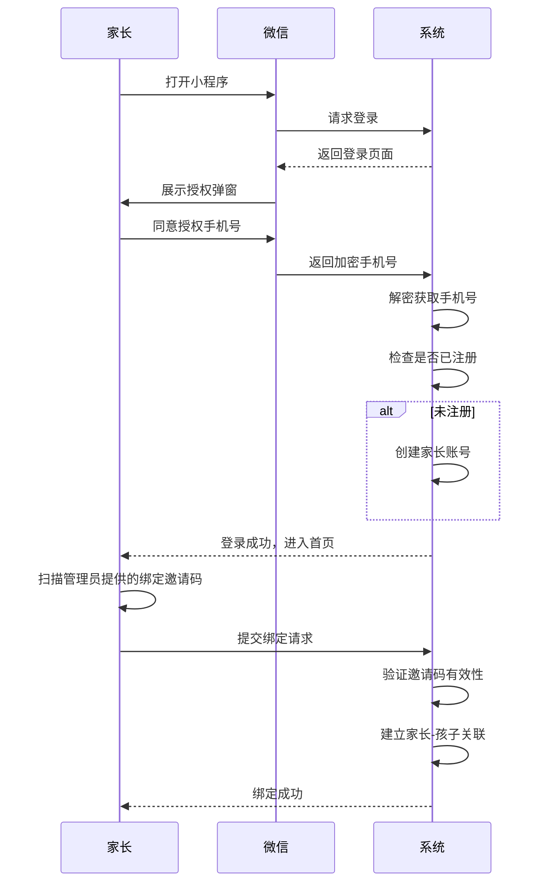

**业务规则**：
1. 一个家长账号可绑定多个孩子（如多个子女在同一机构）
2. 绑定邀请码由管理员生成，有效期24小时
3. 家长信息包括：姓名、手机号、与孩子的关系

**验收标准**：
- [ ] 正常流程：家长授权手机号后成功登录，扫码绑定后成功关联孩子
- [ ] 异常流程：邀请码无效或过期时，提示"邀请码已失效，请联系管理员"
- [ ] 性能要求：登录响应时间≤2秒

### 3.1.2 授权接送人管理

**功能描述**：家长可查看、新增、编辑、删除孩子的授权接送人名单。新增的接送人需经管理员审核后生效。

| 项 | 内容 |
| --- | --- |
| 优先级 | P0 |
| 依赖需求 | 已完成孩子绑定 |
| 前置条件 | 孩子已分配到班级 |

**详细流程**：

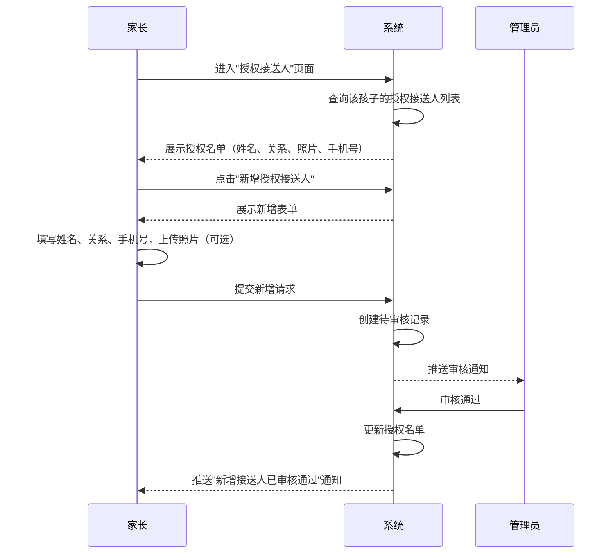

**业务规则**：
1. 每个孩子的授权接送人数量不限
2. 新增接送人必须包含：姓名、关系、手机号
3. 照片为可选项，建议上传以便老师核对
4. 删除接送人时，如该接送人当日有待执行接送任务，需二次确认
5. 审核超时（24小时）自动提醒管理员

**验收标准**：
- [ ] 正常流程：家长新增接送人后，管理员审核通过，名单更新
- [ ] 异常流程：管理员拒绝时，推送"新增接送人已拒绝"通知并说明原因
- [ ] 性能要求：名单查询响应时间≤1秒

### 3.1.3 接送通知接收

**功能描述**：家长接收孩子到校、离校的自动推送通知，以及异常通知（未按时到校、非授权接送等）。

| 项 | 内容 |
| --- | --- |
| 优先级 | P0 |
| 依赖需求 | 老师已完成签到/签退操作 |
| 前置条件 | 家长已授权微信订阅消息 |

**详细流程**：

```mermaid
flowchart TD
    A[老师完成签到/签退] --> B[系统生成通知]
    B --> C{通知类型}
    
    C -->|到校通知| D[推送"孩子已到校"]
    C -->|离校通知| E[推送"孩子已被XX接走"]
    C -->|异常通知| F{异常类型}
    
    F -->|未按时到校| G[推送"孩子未按时到校"]
    F -->|非授权接送| H[推送"非授权人员接送，请确认"]
    F -->|临时授权请求| I[推送"请确认临时授权"]
    
    D --> J[家长点击通知查看详情]
    E --> J
    G --> J
    H --> K{家长操作}
    I --> L{家长确认}
    
    K -->|同意| M[记录临时授权]
    K -->|拒绝| N[通知老师拒绝]
    
    L -->|同意| O[推送"已确认"给老师]
    L -->|拒绝| P[推送"已拒绝"给老师]
```

**业务规则**：
1. 到校通知包含：到校时间、签到老师
2. 离校通知包含：离校时间、接送人姓名、交接老师
3. 异常通知需在10秒内推送至家长微信
4. 临时授权确认请求需在5分钟内响应，超时自动拒绝
5. 微信通知失败时，通过短信兜底

**验收标准**：
- [ ] 正常流程：家长在10秒内收到微信通知
- [ ] 异常流程：微信推送失败时，30秒内收到短信通知
- [ ] 性能要求：通知推送延迟≤10秒

### 3.1.4 请假申请

**功能描述**：家长为孩子提交请假申请，支持单日和多日请假，系统自动通知老师。

| 项 | 内容 |
| --- | --- |
| 优先级 | P1 |
| 依赖需求 | 已完成孩子绑定 |
| 前置条件 | 孩子已分配到班级 |

**详细流程**：

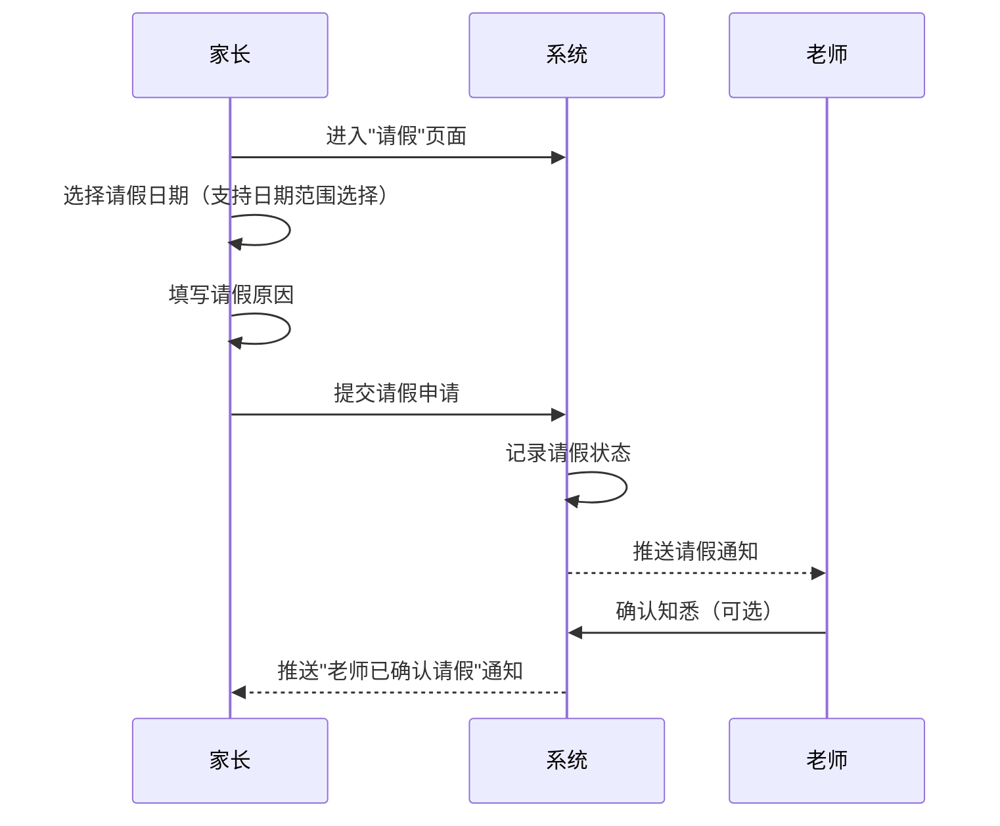

**业务规则**：
1. 请假申请需提前提交，不支持当日补请假
2. 请假期间系统不再触发"未按时到校"异常提醒
3. 请假记录可查询，包含请假日期、原因、审批状态
4. 多日请假需逐日记录

**验收标准**：
- [ ] 正常流程：家长提交请假后，老师收到通知
- [ ] 异常流程：请假日期包含过去日期时，提示"不能补请假"
- [ ] 性能要求：请假提交响应时间≤1秒

### 3.1.5 接送记录查询

**功能描述**：家长按日期查看孩子的到校/离校详细记录，包括时间、接送人、交接老师等信息。

| 项 | 内容 |
| --- | --- |
| 优先级 | P0 |
| 依赖需求 | 有历史接送记录 |
| 前置条件 | 已完成孩子绑定 |

**详细流程**：

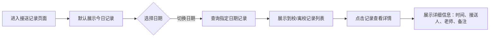

**业务规则**：
1. 记录按时间倒序展示，最新记录在前
2. 每条记录包含：类型（到校/离校）、时间、接送人（如有）、交接老师、备注
3. 支持按日期筛选，默认展示当日记录
4. 可查询最近1年的记录

**验收标准**：
- [ ] 正常流程：家长可查看当日及历史接送记录
- [ ] 异常流程：无记录时展示"暂无记录"空态
- [ ] 性能要求：记录查询响应时间≤3秒

---

## 3.2 老师端小程序功能

### 3.2.1 到校签到

**功能描述**：老师通过扫描学生专属二维码或手动选择学生，记录学生到校时间。系统自动展示学生特殊注意事项。

| 项 | 内容 |
| --- | --- |
| 优先级 | P0 |
| 依赖需求 | 管理员已生成学生二维码 |
| 前置条件 | 老师已加入机构并分配班级 |

**详细流程**：

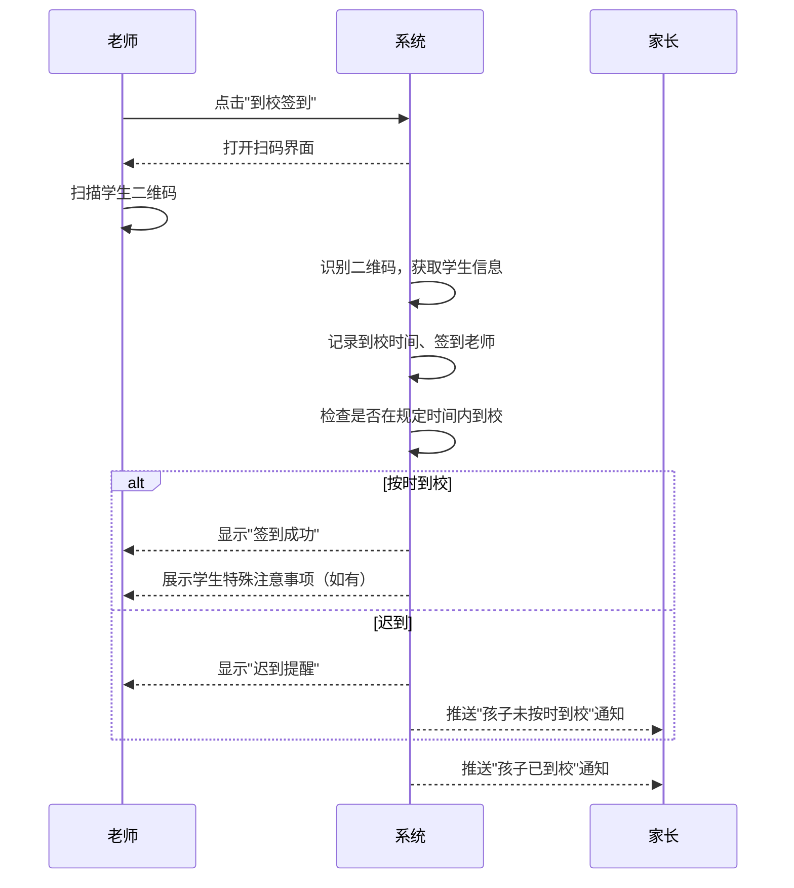

**业务规则**：
1. 扫码签到需在3步内完成（打开扫码→扫码→确认）
2. 支持单手操作，扫码界面默认开启
3. 二维码异常时，可切换到手动签到模式
4. 迟到判定基于机构设置的到校时间规则
5. 特殊注意事项（过敏、用药等）在签到后自动展示
6. 同一学生当日重复签到，提示"今日已签到"

**验收标准**：
- [ ] 正常流程：老师扫码后1秒内完成签到，家长收到通知
- [ ] 异常流程：二维码无效时，提示"二维码无效，请手动签到"
- [ ] 性能要求：签到响应时间≤2秒

### 3.2.2 离校签退

**功能描述**：老师扫描学生二维码进入离校流程，系统展示授权接送人名单，老师核对实际接送人身份后确认交接。

| 项 | 内容 |
| --- | --- |
| 优先级 | P0 |
| 依赖需求 | 学生已到校签到 |
| 前置条件 | 管理员已维护授权接送人名单 |

**详细流程**：

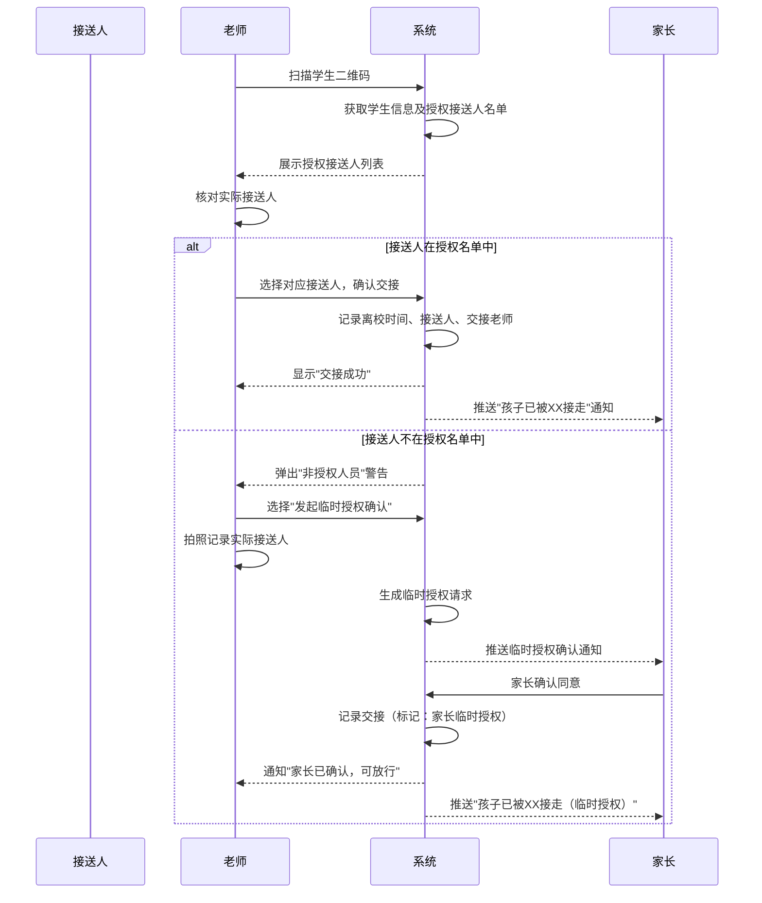

**业务规则**：
1. 离校签退必须核对接送人身份
2. 授权接送人列表按使用频率排序，常用接送人在前
3. 非授权人接送时，必须发起临时授权确认
4. 临时授权确认超时（5分钟）自动拒绝
5. 交接完成后，系统自动推送离校通知给家长
6. 支持拍照记录实际接送人（可选）

**验收标准**：
- [ ] 正常流程：授权接送人接送时，老师选择后1秒内完成交接
- [ ] 异常流程：非授权人接送时，系统弹出警告并引导发起临时授权
- [ ] 性能要求：签退响应时间≤2秒

### 3.2.3 异常处理

**功能描述**：老师查看当日所有异常事件（未按时到校、非授权接送、临时授权待确认等），并对异常事件进行处理。

| 项 | 内容 |
| --- | --- |
| 优先级 | P0 |
| 依赖需求 | 系统已检测到异常事件 |
| 前置条件 | 老师已分配班级 |

**详细流程**：

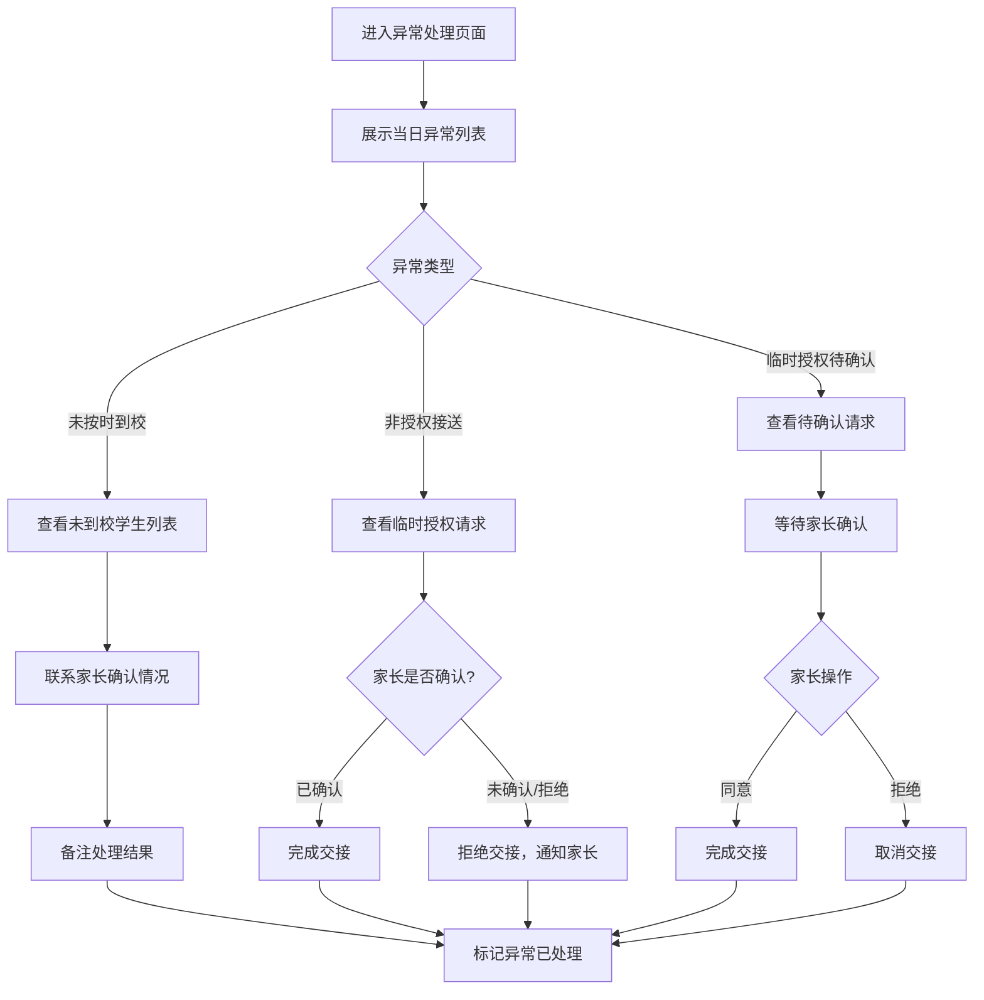

**业务规则**：
1. 异常事件按优先级排序：非授权接送 > 临时授权待确认 > 未按时到校
2. 每条异常必须处理（标记已处理、联系家长、备注说明）
3. 支持查看历史异常处理记录
4. 异常处理记录可导出（机构版功能）

**验收标准**：
- [ ] 正常流程：老师可查看并处理所有异常事件
- [ ] 异常流程：家长拒绝临时授权时，系统提示老师拒绝交接
- [ ] 性能要求：异常列表加载时间≤2秒

### 3.2.4 到校/离校状态监控

**功能描述**：老师实时查看当前班级学生的到校/离校状态，包括已到校、未到校、已离校、请假等状态。

| 项 | 内容 |
| --- | --- |
| 优先级 | P0 |
| 依赖需求 | 学生已分配到班级 |
| 前置条件 | 当日有课程安排 |

**详细流程**：

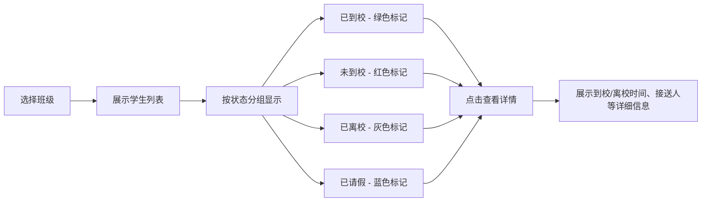

**业务规则**：
1. 默认展示当日状态，支持切换日期
2. 迟到学生标红提醒
3. 列表按状态分组，未到校学生排在最前
4. 支持下拉刷新实时更新状态

**验收标准**：
- [ ] 正常流程：老师可实时查看班级学生状态
- [ ] 异常流程：无学生数据时展示"暂无学生"空态
- [ ] 性能要求：状态列表加载时间≤2秒

---

## 3.3 管理后台功能

### 3.3.1 机构信息管理

**功能描述**：管理员设置和维护机构基本信息，包括机构名称、地址、营业时间、联系方式、Logo等，以及配置到校/离校时间规则。

| 项 | 内容 |
| --- | --- |
| 优先级 | P0 |
| 依赖需求 | 管理员已注册 |
| 前置条件 | 无 |

**详细流程**：

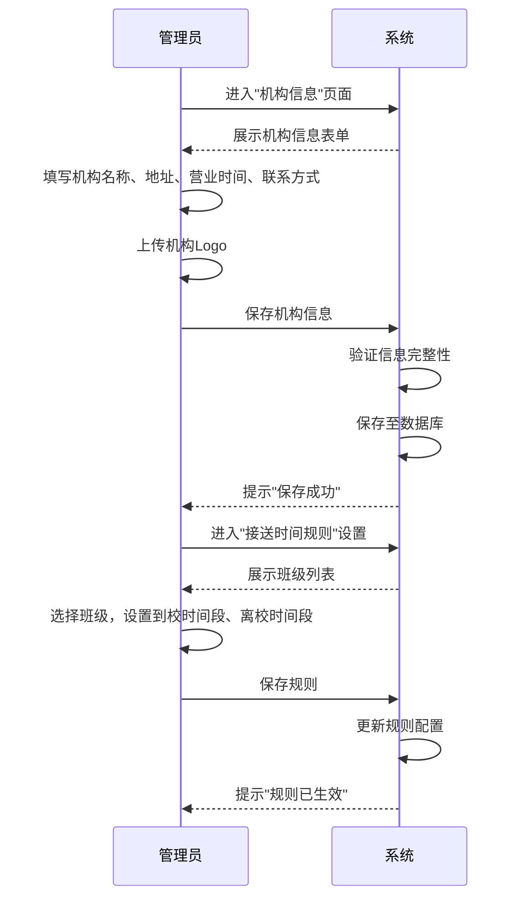

**业务规则**：
1. 机构信息为必填项，缺少时提示补充
2. 营业时间为时间段格式（如 08:00-18:00）
3. 到校/离校时间规则按班级配置，支持不同班级不同时间
4. 时间规则变更后立即生效，影响后续异常检测

**验收标准**：
- [ ] 正常流程：管理员保存机构信息和时间规则后，配置立即生效
- [ ] 异常流程：必填项缺失时，提示"请补充完整信息"
- [ ] 性能要求：保存响应时间≤2秒

### 3.3.2 学生档案管理

**功能描述**：管理员录入、编辑、删除学生档案，包括学生基本信息、家长信息、特殊注意事项，并将学生分配到班级。

| 项 | 内容 |
| --- | --- |
| 优先级 | P0 |
| 依赖需求 | 已创建班级 |
| 前置条件 | 机构信息已配置 |

**详细流程**：

```mermaid
flowchart TD
    A[进入学生管理页面] --> B[展示学生列表]
    B --> C{操作}
    
    C -->|新增| D[点击"新增学生"]
    D --> E[填写学生信息：姓名、性别、出生日期、照片]
    E --> F[填写家长信息：姓名、手机号、关系]
    F --> G[填写特殊注意事项]
    G --> H[选择所属班级]
    H --> I[保存学生档案]
    
    C -->|编辑| J[点击学生进入详情]
    J --> K[修改信息]
    K --> I
    
    C -->|删除| L[点击"删除"]
    L --> M[二次确认]
    M --> N[删除学生档案]
    
    C -->|批量导入| O[下载Excel模板]
    O --> P[填写模板]
    P --> Q[上传Excel文件]
    Q --> R[系统解析并导入]
    R --> S[展示导入结果]
```

**业务规则**：
1. 学生信息必填项：姓名、性别、出生日期、至少一位家长信息
2. 特殊注意事项为可选项，但建议填写（过敏、用药等）
3. 一个学生只能属于一个班级
4. 删除学生时，保留历史接送记录，仅标记为已删除
5. 批量导入支持Excel格式，单次最多导入100名学生（机构版功能）

**验收标准**：
- [ ] 正常流程：管理员成功新增学生并分配到班级
- [ ] 异常流程：必填项缺失时，提示"请补充完整信息"
- [ ] 性能要求：学生列表加载时间≤2秒，批量导入响应时间≤30秒

### 3.3.3 授权接送人管理

**功能描述**：管理员为每个学生维护授权接送人名单，审核家长提交的接送人变更申请。

| 项 | 内容 |
| --- | --- |
| 优先级 | P0 |
| 依赖需求 | 学生档案已创建 |
| 前置条件 | 无 |

**详细流程**：

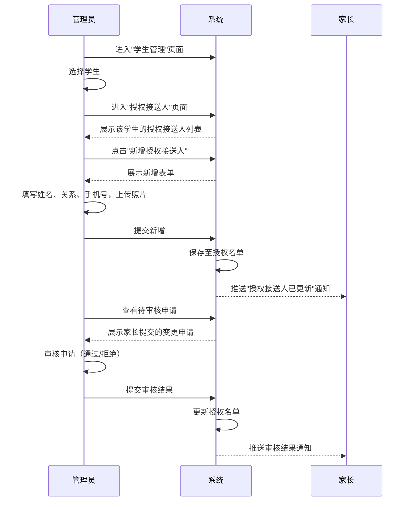

**业务规则**：
1. 管理员可直接新增、编辑、删除授权接送人
2. 家长提交的变更申请需管理员审核
3. 审核超时（24小时）自动提醒管理员
4. 授权接送人信息必填：姓名、关系、手机号
5. 照片为可选项，建议上传以便老师核对

**验收标准**：
- [ ] 正常流程：管理员成功维护授权接送人名单
- [ ] 异常流程：家长提交的申请信息不完整时，提示家长补充
- [ ] 性能要求：授权名单查询响应时间≤1秒

### 3.3.4 老师账号管理

**功能描述**：管理员邀请老师加入机构，管理老师账号（启用/禁用、权限设置、移除）。

| 项 | 内容 |
| --- | --- |
| 优先级 | P0 |
| 依赖需求 | 机构信息已配置 |
| 前置条件 | 无 |

**详细流程**：

```mermaid
flowchart TD
    A[进入老师管理页面] --> B[展示老师列表]
    B --> C{操作}
    
    C -->|邀请| D[点击"邀请老师"]
    D --> E{邀请方式}
    E -->|手机号| F[输入老师手机号]
    E -->|邀请码| G[生成邀请码]
    F --> H[发送邀请短信]
    G --> I[展示邀请码]
    I --> J[老师扫码加入]
    
    C -->|编辑| K[点击老师进入详情]
    K --> L[修改权限：分配管辖班级]
    L --> M[保存权限设置]
    
    C -->|禁用| N[点击"禁用"]
    N --> O[二次确认]
    O --> P[禁用账号]
    
    C -->|移除| Q[点击"移除"]
    Q --> R[二次确认]
    R --> S[移除老师]
```

**业务规则**：
1. 邀请方式：手机号邀请（发送短信）或邀请码邀请（老师扫码）
2. 老师权限包括：管辖班级范围、是否可签到签退、是否可查看报表
3. 禁用账号后，老师无法登录，但历史操作记录保留
4. 移除老师后，需重新分配其管辖班级的签到任务

**验收标准**：
- [ ] 正常流程：管理员成功邀请老师并设置权限
- [ ] 异常流程：手机号已存在时，提示"该老师已加入"
- [ ] 性能要求：老师列表加载时间≤2秒

### 3.3.5 接送记录查询与导出

**功能描述**：管理员按学生、班级、日期查询接送记录，支持导出为Excel文件（机构版功能）。

| 项 | 内容 |
| --- | --- |
| 优先级 | P0（查询）/ P1（导出） |
| 依赖需求 | 有历史接送记录 |
| 前置条件 | 无 |

**详细流程**：

```mermaid
flowchart LR
    A[进入记录查询页面] --> B[设置筛选条件]
    B --> C[选择学生/班级]
    C --> D[选择日期范围]
    D --> E[点击"查询"]
    E --> F[展示记录列表]
    F --> G{操作}
    
    G -->|查看详情| H[点击记录]
    H --> I[展示详细信息：时间、接送人、老师、备注]
    
    G -->|导出| J[点击"导出Excel"]
    J --> K[系统生成Excel文件]
    K --> L[下载文件]
```

**业务规则**：
1. 查询条件支持：学生、班级、日期范围、接送类型（到校/离校）
2. 记录按时间倒序展示，最新记录在前
3. 导出Excel包含：学生姓名、班级、接送类型、时间、接送人、交接老师、备注
4. 导出功能为机构版功能，免费版仅支持查询
5. 单次导出最多10000条记录

**验收标准**：
- [ ] 正常流程：管理员成功查询并导出接送记录
- [ ] 异常流程：无记录时展示"暂无记录"空态
- [ ] 性能要求：记录查询响应时间≤3秒，导出响应时间≤30秒

### 3.3.6 二维码管理

**功能描述**：管理员为学生生成专属接送二维码，支持批量生成和打印。

| 项 | 内容 |
| --- | --- |
| 优先级 | P0 |
| 依赖需求 | 学生档案已创建 |
| 前置条件 | 无 |

**详细流程**：

```mermaid
flowchart TD
    A[进入二维码管理页面] --> B[展示学生列表]
    B --> C{操作}
    
    C -->|单个生成| D[选择学生]
    D --> E[生成二维码]
    E --> F[预览二维码]
    F --> G[打印/保存]
    
    C -->|批量生成| H[选择多个学生或全选]
    H --> I[批量生成二维码]
    I --> J[展示二维码列表]
    J --> K[批量打印/导出PDF]
    
    C -->|重新生成| L[选择学生]
    L --> M[点击"重新生成"]
    M --> N[二次确认]
    N --> O[生成新二维码，旧码失效]
```

**业务规则**：
1. 每个学生的二维码唯一，包含学生ID加密信息
2. 二维码长期有效，除非手动重新生成
3. 重新生成后，旧二维码立即失效
4. 支持批量生成，单次最多100个
5. 二维码尺寸：5cm×5cm，包含学生姓名、班级信息

**验收标准**：
- [ ] 正常流程：管理员成功生成并打印二维码
- [ ] 异常流程：重新生成时，旧码立即失效
- [ ] 性能要求：单个二维码生成时间≤1秒，批量生成100个≤10秒

---

# 4 产品原型

## 4.1 页面跳转逻辑图

### 家长端小程序页面跳转

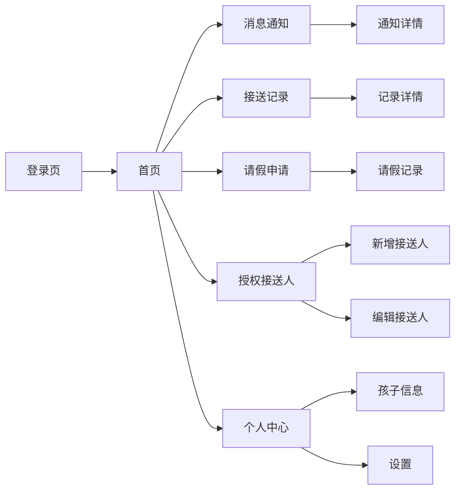

### 老师端小程序页面跳转

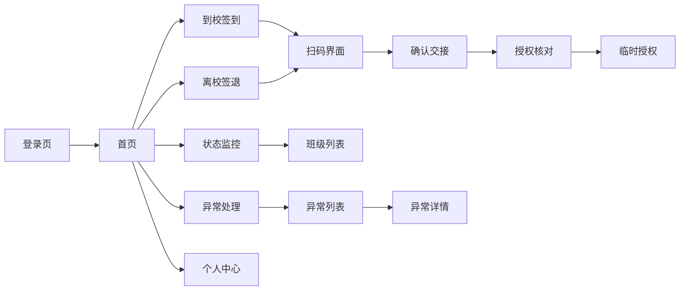

### 管理后台页面跳转

```mermaid
flowchart LR
    Login[登录页] --> Dashboard[工作台]
    Dashboard --> Org[机构管理]
    Dashboard --> Class[班级管理]
    Dashboard --> Student[学生管理]
    Dashboard --> Teacher[老师管理]
    Dashboard --> Record[记录查询]
    Dashboard --> Setting[系统设置]
    
    Student --> StudentList[学生列表]
    StudentList --> StudentDetail[学生详情]
    StudentDetail --> AuthManage[授权管理]
    
    Class --> ClassList[班级列表]
    ClassList --> ClassDetail[班级详情]
    
    Teacher --> TeacherList[老师列表]
    TeacherList --> TeacherDetail[老师详情]
    
    Record --> RecordQuery[记录查询]
    RecordQuery --> RecordExport[记录导出]
    
    Setting --> OrgInfo[机构信息]
    Setting --> TimeRule[时间规则]
    Setting --> QRCode[二维码管理]
```

## 4.2 全站点原型设计

### 4.2.1 家长端小程序

**页面清单：**

| 序号 | 页面名称 | 所属模块 | 页面描述 | 关键元素 |
| --- | --- | --- | --- | --- |
| 1 | 登录页 | 账号与绑定 | 微信授权手机号登录 | 微信授权按钮、隐私协议勾选 |
| 2 | 首页 | 日常接送 | 展示当日待办、快捷入口 | 孩子头像、到校/离校状态、快捷操作按钮 |
| 3 | 消息通知页 | 消息中心 | 展示所有通知消息 | 消息列表、消息类型标签、时间 |
| 4 | 通知详情页 | 消息中心 | 查看单条通知详情 | 通知标题、内容、时间、操作按钮 |
| 5 | 接送记录页 | 日常接送 | 按日期查看接送记录 | 日期选择器、记录列表、到校/离校标签 |
| 6 | 记录详情页 | 日常接送 | 查看单条记录详情 | 时间、接送人、交接老师、备注 |
| 7 | 授权接送人页 | 账号与绑定 | 查看和管理授权名单 | 接送人列表、新增按钮、编辑/删除操作 |
| 8 | 新增接送人页 | 账号与绑定 | 新增授权接送人表单 | 姓名、关系、手机号、照片上传、提交按钮 |
| 9 | 请假申请页 | 日常接送 | 提交请假申请 | 日期选择器、请假原因、提交按钮 |
| 10 | 请假记录页 | 日常接送 | 查看历史请假记录 | 请假列表、状态标签 |
| 11 | 个人中心页 | 个人中心 | 个人信息、孩子信息、设置 | 头像、姓名、孩子列表、设置入口 |
| 12 | 孩子信息页 | 个人中心 | 查看孩子详细信息 | 孩子头像、姓名、班级、特殊注意事项 |

**交互说明：**

- 页面跳转关系：
```mermaid
flowchart TD
    A[登录页] --> B[首页]
    B --> C[消息通知页]
    B --> D[接送记录页]
    B --> E[授权接送人页]
    B --> F[请假申请页]
    B --> G[个人中心页]
    
    C --> H[通知详情页]
    D --> I[记录详情页]
    E --> J[新增接送人页]
    F --> K[请假记录页]
    G --> L[孩子信息页]
```

- 特殊交互：
  1. 首页支持下拉刷新，实时更新孩子状态
  2. 消息通知页支持上拉加载更多
  3. 临时授权确认弹窗需在5分钟内响应，倒计时展示
  4. 空数据态展示友好提示图标和文案
  5. 表单提交失败时，Toast提示错误原因

**产品原型：**

[📱 打开家长端小程序全站点原型](assets/prototypes/parent-mini-program-prototype.html)

### 4.2.2 老师端小程序

**页面清单：**

| 序号 | 页面名称 | 所属模块 | 页面描述 | 关键元素 |
| --- | --- | --- | --- | --- |
| 1 | 登录页 | 账号与登录 | 手机号+邀请码登录 | 手机号输入、邀请码输入、登录按钮 |
| 2 | 首页 | 到校管理 | 今日工作概览、快捷操作 | 到校/离校统计、异常提醒、快捷操作按钮 |
| 3 | 到校签到页 | 到校管理 | 扫码签到界面 | 扫码框、手动签到按钮、学生列表 |
| 4 | 离校签退页 | 离校管理 | 扫码签退+接送人核对 | 扫码框、授权接送人列表、确认按钮 |
| 5 | 临时授权页 | 离校管理 | 发起临时授权确认 | 拍照按钮、接送人信息、提交按钮 |
| 6 | 状态监控页 | 到校管理 | 班级学生到校/离校状态 | 班级Tab、学生列表、状态标签 |
| 7 | 异常处理页 | 异常处理 | 当日异常事件列表 | 异常列表、异常类型标签、处理按钮 |
| 8 | 异常详情页 | 异常处理 | 查看异常详情并处理 | 异常信息、处理操作、备注输入 |
| 9 | 个人中心页 | 个人中心 | 个人信息、工作统计 | 头像、姓名、统计数据、设置入口 |

**交互说明：**

- 页面跳转关系：
```mermaid
flowchart TD
    A[登录页] --> B[首页]
    B --> C[到校签到页]
    B --> D[离校签退页]
    B --> E[状态监控页]
    B --> F[异常处理页]
    B --> G[个人中心页]
    
    C --> H[扫码界面]
    D --> H
    H --> I[授权核对]
    I --> J[临时授权页]
    
    F --> K[异常详情页]
```

- 特殊交互：
  1. 扫码界面默认开启，支持单手操作
  2. 非授权人接送时，弹出红色警告弹窗
  3. 临时授权确认需拍照记录，支持相册选择
  4. 异常事件按优先级排序，未处理异常标红
  5. 状态监控页支持下拉刷新实时更新

**产品原型：**

[📱 打开老师端小程序全站点原型](assets/prototypes/teacher-mini-program-prototype.html)

### 4.2.3 管理后台

**页面清单：**

| 序号 | 页面名称 | 所属模块 | 页面描述 | 关键元素 |
| --- | --- | --- | --- | --- |
| 1 | 登录页 | 账号管理 | 管理员登录 | 手机号、密码、登录按钮 |
| 2 | 工作台 | 全局 | 数据概览、快捷入口 | 统计卡片、待办事项、快捷操作 |
| 3 | 机构信息页 | 机构管理 | 维护机构基本信息 | 表单：名称、地址、营业时间、Logo |
| 4 | 时间规则页 | 机构管理 | 配置接送时间规则 | 班级列表、时间段设置 |
| 5 | 班级列表页 | 班级管理 | 查看所有班级 | 班级列表、新增按钮 |
| 6 | 班级详情页 | 班级管理 | 班级详情和学生列表 | 班级信息、学生列表、编辑按钮 |
| 7 | 学生列表页 | 学生管理 | 查看所有学生 | 学生列表、搜索框、筛选条件、批量导入按钮 |
| 8 | 学生详情页 | 学生管理 | 学生详细信息 | 学生信息、家长信息、授权接送人、特殊注意事项 |
| 9 | 授权管理页 | 学生管理 | 维护授权接送人 | 接送人列表、新增/编辑/删除操作 |
| 10 | 老师列表页 | 老师管理 | 查看所有老师 | 老师列表、邀请按钮 |
| 11 | 老师详情页 | 老师管理 | 老师信息和权限 | 老师信息、权限设置、管辖班级 |
| 12 | 记录查询页 | 记录报表 | 查询接送记录 | 筛选条件、记录列表、导出按钮 |
| 13 | 二维码管理页 | 学生管理 | 生成和打印二维码 | 学生列表、生成按钮、批量打印 |
| 14 | 系统设置页 | 系统设置 | 通知模板、订阅管理 | 通知模板列表、套餐信息 |

**交互说明：**

- 页面跳转关系：
```mermaid
flowchart TD
    A[登录页] --> B[工作台]
    B --> C[机构信息页]
    B --> D[时间规则页]
    B --> E[班级列表页]
    B --> F[学生列表页]
    B --> G[老师列表页]
    B --> H[记录查询页]
    B --> I[系统设置页]
    
    E --> J[班级详情页]
    F --> K[学生详情页]
    K --> L[授权管理页]
    G --> M[老师详情页]
    
    H --> N[二维码管理页]
```

- 特殊交互：
  1. 左侧导航栏固定，右侧内容区滚动
  2. 表格支持排序、筛选、分页
  3. 表单提交前进行前端校验
  4. 批量操作需二次确认
  5. 导出功能需展示进度条

**产品原型：**

[🖥️ 打开管理后台全站点原型](assets/prototypes/admin-web-prototype.html)

---

# 5 数据需求

## 5.1 数据使用规格

### 学生信息表

| **字段** | **是否必填** | **描述** | **数据类型** |
| --- | --- | --- | --- |
| student_id | 是 | 学生唯一标识 | UUID |
| name | 是 | 学生姓名 | 字符串 |
| gender | 是 | 性别 | 枚举（男/女） |
| birth_date | 是 | 出生日期 | 日期 |
| photo_url | 否 | 学生照片URL | 字符串 |
| class_id | 是 | 所属班级ID | UUID |
| special_notes | 否 | 特殊注意事项 | 文本 |
| created_at | 是 | 创建时间 | 时间戳 |
| updated_at | 是 | 更新时间 | 时间戳 |
| is_deleted | 是 | 是否删除 | 布尔 |

### 家长信息表

| **字段** | **是否必填** | **描述** | **数据类型** |
| --- | --- | --- | --- |
| parent_id | 是 | 家长唯一标识 | UUID |
| name | 是 | 家长姓名 | 字符串 |
| phone | 是 | 手机号 | 字符串 |
| openid | 是 | 微信openid | 字符串 |
| created_at | 是 | 创建时间 | 时间戳 |

### 学生-家长关联表

| **字段** | **是否必填** | **描述** | **数据类型** |
| --- | --- | --- | --- |
| student_id | 是 | 学生ID | UUID |
| parent_id | 是 | 家长ID | UUID |
| relationship | 是 | 与学生的关系 | 枚举（父亲/母亲/其他） |
| is_primary | 是 | 是否主要联系人 | 布尔 |

### 授权接送人表

| **字段** | **是否必填** | **描述** | **数据类型** |
| --- | --- | --- | --- |
| pickup_id | 是 | 接送人唯一标识 | UUID |
| student_id | 是 | 学生ID | UUID |
| name | 是 | 接送人姓名 | 字符串 |
| relationship | 是 | 与学生的关系 | 字符串 |
| phone | 是 | 手机号 | 字符串 |
| photo_url | 否 | 照片URL | 字符串 |
| status | 是 | 状态 | 枚举（待审核/已通过/已拒绝） |
| created_at | 是 | 创建时间 | 时间戳 |

### 接送记录表

| **字段** | **是否必填** | **描述** | **数据类型** |
| --- | --- | --- | --- |
| record_id | 是 | 记录唯一标识 | UUID |
| student_id | 是 | 学生ID | UUID |
| type | 是 | 接送类型 | 枚举（到校/离校） |
| time | 是 | 接送时间 | 时间戳 |
| teacher_id | 是 | 交接老师ID | UUID |
| pickup_person_id | 否 | 接送人ID | UUID |
| pickup_person_name | 否 | 接送人姓名 | 字符串 |
| is_temp_auth | 否 | 是否临时授权 | 布尔 |
| photo_url | 否 | 拍照URL | 字符串 |
| remarks | 否 | 备注 | 文本 |

### 请假记录表

| **字段** | **是否必填** | **描述** | **数据类型** |
| --- | --- | --- | --- |
| leave_id | 是 | 请假唯一标识 | UUID |
| student_id | 是 | 学生ID | UUID |
| parent_id | 是 | 家长ID | UUID |
| leave_date | 是 | 请假日期 | 日期 |
| reason | 是 | 请假原因 | 文本 |
| status | 是 | 状态 | 枚举（待确认/已确认） |
| created_at | 是 | 创建时间 | 时间戳 |

### 异常事件表

| **字段** | **是否必填** | **描述** | **数据类型** |
| --- | --- | --- | --- |
| exception_id | 是 | 异常唯一标识 | UUID |
| student_id | 是 | 学生ID | UUID |
| type | 是 | 异常类型 | 枚举（未按时到校/非授权接送/临时授权待确认） |
| status | 是 | 处理状态 | 枚举（待处理/已处理/已取消） |
| handler_id | 否 | 处理人ID | UUID |
| handle_time | 否 | 处理时间 | 时间戳 |
| handle_remarks | 否 | 处理备注 | 文本 |
| created_at | 是 | 创建时间 | 时间戳 |

### 通知消息表

| **字段** | **是否必填** | **描述** | **数据类型** |
| --- | --- | --- | --- |
| message_id | 是 | 消息唯一标识 | UUID |
| receiver_id | 是 | 接收人ID | UUID |
| receiver_type | 是 | 接收人类型 | 枚举（家长/老师） |
| type | 是 | 消息类型 | 枚举（到校通知/离校通知/异常通知等） |
| title | 是 | 消息标题 | 字符串 |
| content | 是 | 消息内容 | 文本 |
| is_read | 是 | 是否已读 | 布尔 |
| created_at | 是 | 创建时间 | 时间戳 |

## 5.2 统计数据

1. 统计每日到校/离校学生数、迟到学生数、请假学生数（P0）
2. 统计每周/每月异常事件数及处理情况（P1）
3. 统计各班级接送准时率（P2）
4. 统计老师工作工作量：签到次数、异常处理次数（P2）

## 5.3 埋点需求

| 页面 | 事件 | 采集字段 | 说明 |
| --- | --- | --- | --- |
| 登录页 | 登录成功 | 用户ID、登录时间、登录方式 | 统计登录转化率 |
| 首页 | 快捷操作点击 | 用户ID、操作类型、时间 | 分析用户常用功能 |
| 扫码页 | 扫码成功 | 用户ID、学生ID、时间 | 统计签到签退频率 |
| 通知页 | 通知点击 | 用户ID、通知类型、时间 | 分析通知阅读率 |
| 请假页 | 请假提交 | 用户ID、学生ID、请假天数 | 统计请假频率 |
| 异常页 | 异常处理 | 用户ID、异常类型、处理时长 | 分析异常处理效率 |

---

# 6 非功能需求

## 6.1 性能需求

### 6.1.1 延迟

| 编号 | 项目 | 最大延迟 | 平均延迟 | 优先级 | 备注 |
| --- | --- | --- | --- | --- | --- |
| 0001 | 登录响应 | <2秒 | <1秒 | 高 | 包含微信授权 |
| 0002 | 扫码签到 | <2秒 | <1秒 | 高 | 核心操作 |
| 0003 | 扫码签退 | <2秒 | <1秒 | 高 | 核心操作 |
| 0004 | 通知推送 | <10秒 | <5秒 | 高 | 从操作完成到家长接收 |
| 0005 | 记录查询 | <3秒 | <2秒 | 中 | 1年内记录 |
| 0006 | 学生列表加载 | <2秒 | <1秒 | 中 | 100名学生以内 |

### 6.1.2 吞吐量

| 编号 | 项 | 吞吐量 | 备注 |
| --- | --- | --- | --- |
| 0001 | 签到签退操作 | 每分钟200次 | 高峰期支持 |
| 0002 | 通知推送 | 每分钟500条 | 包含微信和短信 |
| 0003 | 记录查询 | 每分钟1000次 | 并发查询 |

### 6.1.3 容量

| 编号 | 项 | 容量 | 备注 |
| --- | --- | --- | --- |
| 0001 | 单机构学生数 | ≤200人 | 免费版30人，机构版200人 |
| 0002 | 单机构老师数 | ≤50人 | 包含管理员 |
| 0003 | 单机构家长数 | ≤500人 | 按学生数估算 |
| 0004 | 历史记录保留 | 2年 | 超过2年归档 |

## 6.2 安全需求

| 编号 | 项（系统数据 / 处理过程） |
| --- | --- |
| 0001 | 所有前后端通讯使用HTTPS加密传输 |
| 0002 | 用户密码使用bcrypt加密存储，不可逆 |
| 0003 | 敏感信息（手机号、身份证号）加密存储，访问时脱敏展示 |
| 0004 | 学生照片、接送人照片等隐私数据需获得家长授权同意后方可采集 |
| 0005 | 接口访问需进行身份认证和权限校验，防止越权访问 |
| 0006 | 防止SQL注入、XSS攻击、CSRF攻击等常见安全漏洞 |
| 0007 | 登录失败5次后锁定账号30分钟，防止暴力破解 |

## 6.3 可靠性

| 编号 | 项 | 值 |
| --- | --- | --- |
| 0001 | 系统可用性 | ≥99.5% |
| 0002 | 平均正常运行时间（MTTF） | 180天 |
| 0003 | 平均故障恢复时间（MTTR） | ≤2小时 |
| 0004 | 数据备份频率 | 每日全量备份，每小时增量备份 |
| 0005 | 数据备份保留时长 | 30天 |

## 6.4 可连续性

| 编号 | 项 |
| --- | --- |
| 0001 | 系统需支持7×24小时运行 |
| 0002 | 关键服务（签到签退、通知推送）需部署多实例，支持故障自动切换 |
| 0003 | 数据库采用主从架构，支持自动故障转移 |
| 0004 | 弱网环境下支持离线签到缓存，网络恢复后自动同步 |

## 6.5 可恢复性

| 编号 | 项 |
| --- | --- |
| 0001 | 系统可进行数据备份，每日全量备份，保留30天 |
| 0002 | 重大故障需在2小时内恢复服务可用性 |
| 0003 | 24-72小时内可恢复历史数据 |
| 0004 | 支持按时间点恢复数据，最大程度减少数据丢失 |

## 6.6 兼容性

| 编号 | 要求 | 备注 |
| --- | --- | --- |
| 0001 | 家长端/老师端：微信8.0及以上版本 | iOS 14+ / Android 8.0+ |
| 0002 | 管理后台：Chrome 90+、Edge 90+ | 分辨率1280×720及以上 |
| 0003 | 移动端适配主流分辨率：375×667，390×844，414×896 | 适配iPhone和主流Android机型 |
| 0004 | 管理后台支持移动端H5访问 | 响应式布局 |

## 6.7 易用性

| 编号 | 要求 | 备注 |
| --- | --- | --- |
| 0001 | 核心操作（签到签退）路径不超过3步 | 扫码→确认→完成 |
| 0002 | 普通用户无需培训即可使用核心功能 | 界面简洁直观 |
| 0003 | 老师端支持单手操作 | 扫码界面默认开启 |
| 0004 | 临时授权确认页面大字体、高对比度 | 适老化设计 |
| 0005 | 异常状态清晰标识 | 使用颜色、图标、文案多重提示 |

---

# 7 总结

## 7.1 上线计划

| 阶段 | 时间 | 内容 | 负责人 |
| --- | --- | --- | --- |
| 开发阶段 | 2026-06-27 ~ 2026-07-03 | 核心功能开发（签到签退、通知推送、授权管理） | 开发团队 |
| 测试阶段 | 2026-07-04 ~ 2026-07-06 | 功能测试、性能测试、安全测试 | 测试团队 |
| 灰度阶段 | 2026-07-07 ~ 2026-07-09 | 灰度3-5家机构，验证稳定性 | 产品经理 |
| 全量上线 | 2026-07-10 | 全量开放给所有目标用户 | 运营团队 |

## 7.2 后续迭代规划

- **V1.1**：增加批量导入学生、记录导出Excel功能（机构版）
- **V1.2**：增加通知模板自定义、工作统计报表功能（机构版）
- **V1.3**：增加多校区管理、跨校区学生调配功能（机构版）
- **V2.0**：增加家长端APP、老师端APP，支持更多平台

## 7.3 参考文档

- URS-儿童兴趣班接送交接表.md（用户需求说明书）
- 微信小程序开发文档
- 微信订阅消息接入指南
- 个人信息保护法
