# 儿童兴趣班接送交接表 — 用户需求说明书（URS）

> **文档版本**：v1.0.0  
> **创建日期**：2026-06-26  
> **产品名称**：儿童兴趣班接送交接表  
> **文档状态**：初稿  

---

# 1. 需求概述

## 1.1 需求介绍

「儿童兴趣班接送交接表」是一款面向社区小型儿童兴趣班、托管班、少儿培训机构（3～15人规模）的轻量级接送安全管理工具。产品聚焦于"接送授权、交接留痕、异常提醒"三大核心场景，帮助机构前台老师、班主任和家长在孩子到校/离校的交接环节中实现信息透明、责任可追溯，降低人工管理出错风险。

产品定位为独立工具，不涉足教务管理、排课消课等重功能，以低价（免费版 / 机构版 ¥49/月）轻量（MVP 5～7天开发周期）的方式，填补社区小机构在接送安全管理上的空白。

### 1.1.1 所属领域

教育培训行业 — 社区小型少儿培训机构 / 托管班细分领域。

## 1.2 需求目标

1. **安全留痕**：为每一次接送交接建立可追溯的电子记录，明确交接时间、交接双方（老师与授权接送人），替代纸质签到和微信群口头通知。
2. **授权管控**：为每个孩子在系统中维护授权接送人名单，杜绝非授权人员接走孩子的风险。
3. **异常预警**：在"未按时到校"、"非授权人接送"、"临时变更接送人"等异常场景下，自动向家长发出确认通知，向老师发出异常提醒。
4. **轻量易用**：面向 3～15 人规模的小型机构，操作流程不超过 3 步，老师单手即可完成日常接送操作。
5. **成本可控**：提供免费版（30 名学生、单校区），机构版按月订阅（¥49/月），面向小机构可承受的价格区间。

## 1.3 系统使用角色

| 角色 | 说明 | 典型用户 |
|------|------|----------|
| 机构管理员 | 负责机构基础信息设置、学生档案管理、老师账号管理、授权接送人维护、历史记录查看与导出 | 机构负责人、前台主管 |
| 老师 | 负责每日到校/离校扫码确认、接送人身份核对、异常情况处理与家长沟通 | 前台老师、班主任、授课老师 |
| 家长 | 查看孩子到校/离校记录、接收异常通知、临时变更接送人并确认、维护孩子授权接送人名单 | 孩子父母、法定监护人 |

## 1.4 业务流程图

### 1.4.1 学生到校流程

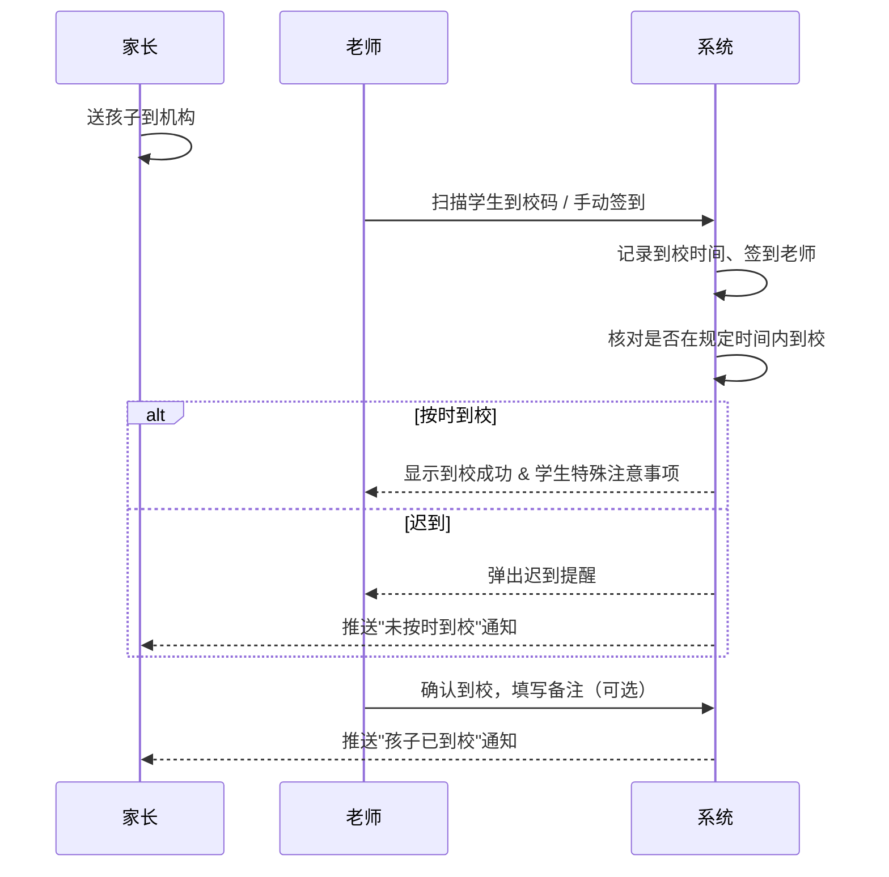

### 1.4.2 学生离校交接流程

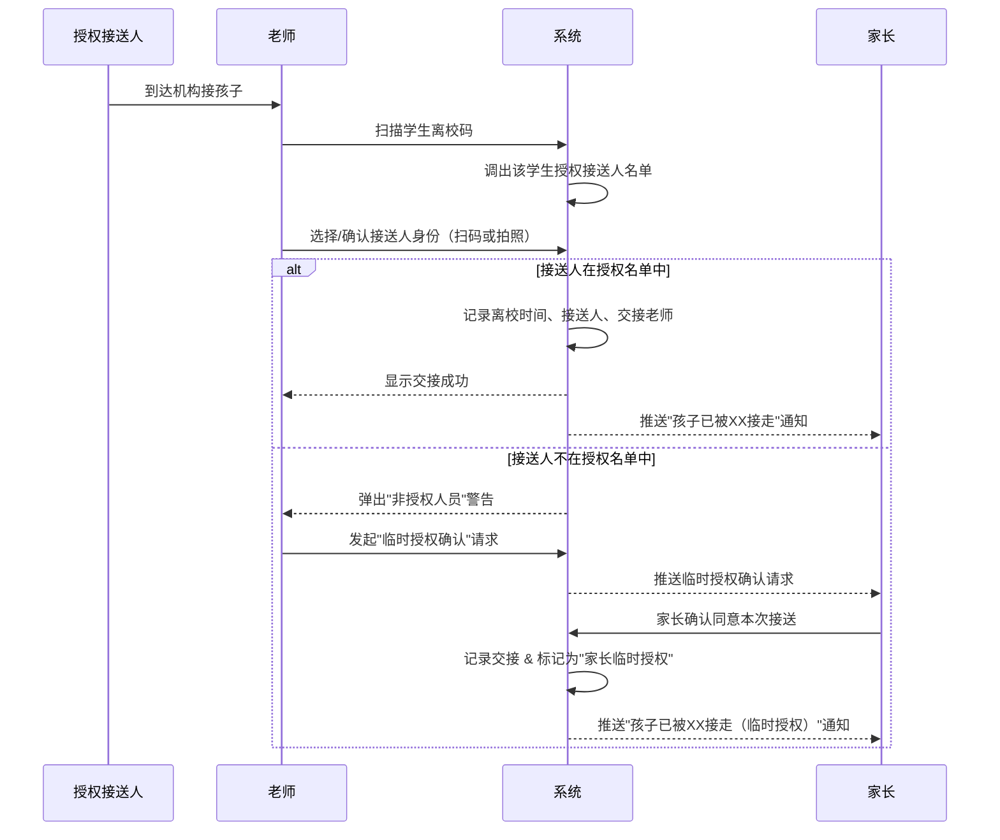

### 1.4.3 临时变更接送人流程

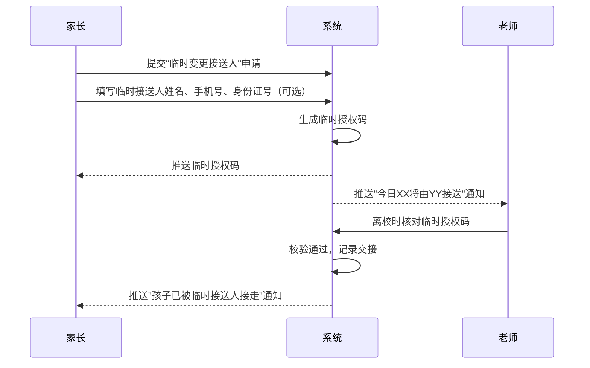

### 1.4.4 请假流程

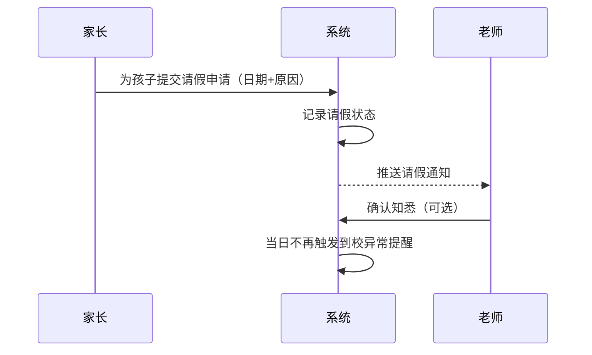

### 1.4.5 授权接送人管理流程

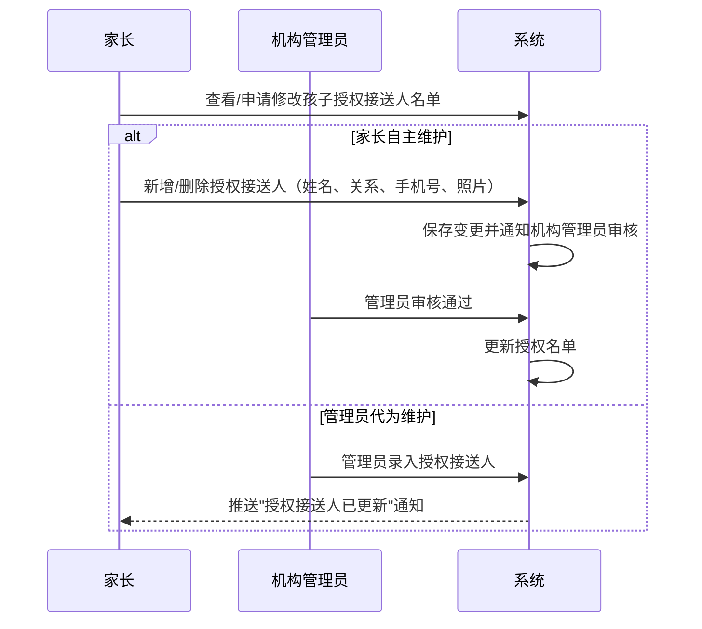

### 1.4.6 管理员初始化机构流程

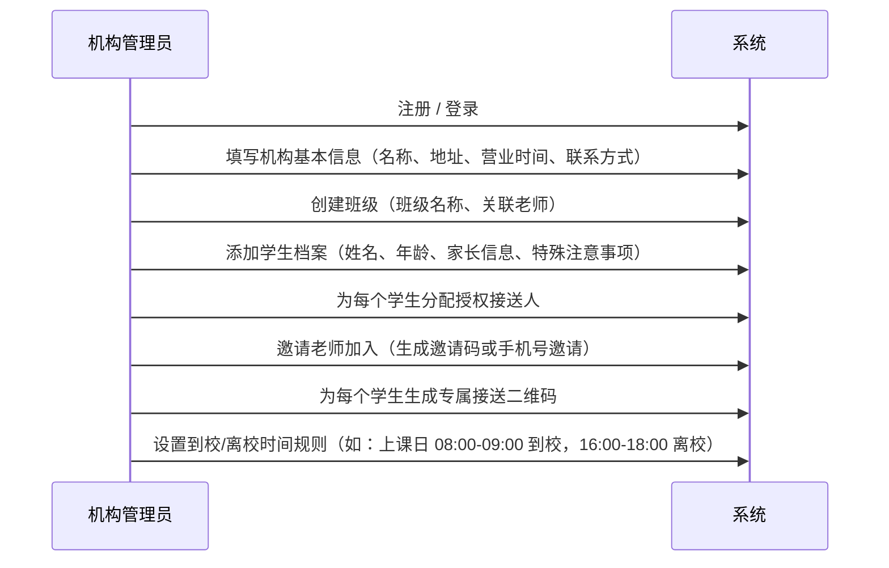

---

# 2. 功能原型

| 原型名称 | 原型链接 | 对应端 | 备注 |
| --- | --- | --- | --- |
| 家长端小程序 | 待提供 | 小程序端 | MVP 阶段采用微信小程序 |
| 老师端小程序 | 待提供 | 小程序端 | MVP 阶段与家長端同一小程序，角色切换 |
| 管理后台 | 待提供 | WEB端 | 机构管理员使用，H5 适配移动端 |

---

# 3. 需求清单

## 3.1 家长端 — 小程序端

| 模块 | 一级功能 | 二级功能 | 功能描述 | 备注 |
| --- | --- | --- | --- | --- |
| 账号与绑定 | 注册/登录 | 手机号快捷登录 | 家长通过微信授权获取手机号，一键注册登录 | MVP 阶段 |
| 账号与绑定 | 注册/登录 | 孩子绑定 | 管理员生成绑定邀请码，家长扫码绑定孩子，建立家长-孩子关联 | |
| 账号与绑定 | 授权接送人管理 | 查看授权名单 | 查看当前孩子的所有授权接送人列表（姓名、关系、照片、手机号） | |
| 账号与绑定 | 授权接送人管理 | 新增授权接送人 | 添加新的授权接送人，需填写姓名、关系、手机号，可选上传照片；提交后由管理员审核生效 | |
| 账号与绑定 | 授权接送人管理 | 删除授权接送人 | 移除已有授权接送人；如该接送人当日有待执行接送任务，系统需提示确认 | |
| 账号与绑定 | 授权接送人管理 | 编辑授权接送人 | 修改授权接送人的姓名、关系、手机号、照片等信息 | |
| 日常接送 | 到校通知 | 接收到校推送 | 孩子到校后，系统自动推送"孩子已到校"通知（含到校时间、签到老师） | |
| 日常接送 | 离校通知 | 接收离校推送 | 孩子离校后，系统自动推送"孩子已被XX接走"通知（含离校时间、接送人、交接老师） | |
| 日常接送 | 请假 | 提交请假申请 | 选择请假日期（支持单日/多日）、填写请假原因，提交后系统自动通知老师 | |
| 日常接送 | 请假 | 查看请假记录 | 查看历史请假记录及审批状态 | |
| 日常接送 | 临时变更接送人 | 发起临时变更申请 | 填写临时接送人姓名、手机号、身份证号（可选），系统生成临时授权码 | |
| 日常接送 | 临时变更接送人 | 临时授权确认 | 当系统检测到非授权人接送时，推送确认请求，家长点击"同意"或"拒绝" | |
| 日常接送 | 临时变更接送人 | 查看临时授权记录 | 查看历史临时变更记录及处理结果 | |
| 消息中心 | 异常通知 | 未按时到校提醒 | 孩子超过机构设定的到校时间未签到，系统自动推送提醒 | |
| 消息中心 | 异常通知 | 非授权接送预警 | 检测到非授权人员尝试接送，系统推送预警通知并要求家长确认 | |
| 消息中心 | 异常通知 | 临时授权确认请求 | 老师发起临时授权确认，家长收到后需在规定时间内确认 | |
| 消息中心 | 消息列表 | 查看历史消息 | 按时间倒序查看所有通知消息，支持按类型筛选 | |
| 个人中心 | 个人信息 | 查看/修改个人信息 | 查看和修改家长姓名、手机号等基本信息 | |
| 个人中心 | 孩子信息 | 查看孩子档案 | 查看孩子的班级、到校/离校记录、特殊注意事项等 | |
| 个人中心 | 孩子信息 | 查看接送记录 | 按日期查看孩子的到校/离校详细记录 | |

## 3.2 老师端 — 小程序端

| 模块 | 一级功能 | 二级功能 | 功能描述 | 备注 |
| --- | --- | --- | --- | --- |
| 账号与登录 | 登录 | 手机号+邀请码加入机构 | 老师通过管理员提供的邀请码加入机构，使用手机号登录 | |
| 到校管理 | 到校签到 | 扫码签到 | 扫描学生专属二维码，系统自动记录到校时间、签到老师 | 核心操作，需单手快速完成 |
| 到校管理 | 到校签到 | 手动签到 | 在班级学生列表中选择学生手动签到（二维码异常时的备用方式） | |
| 到校管理 | 到校签到 | 批量签到 | 选择班级后一键签到全班到校学生（适用于集体活动场景） | 可选，P2 |
| 到校管理 | 到校状态 | 查看当日到校状态 | 查看当前班级学生到校情况一览（已到校/未到校/请假），迟到学生标红 | |
| 到校管理 | 到校状态 | 查看学生特殊注意事项 | 签到后自动展示该学生的特殊注意事项（过敏、用药等） | |
| 离校管理 | 离校签退 | 扫码签退 | 扫描学生专属二维码进入离校流程 | |
| 离校管理 | 离校签退 | 接送人身份核对 | 系统展示该学生授权接送人列表，老师选择实际接送人或扫描接送人码/拍照确认 | 核心安全环节 |
| 离校管理 | 离校签退 | 非授权人处理 | 当接送人不在授权名单中，系统弹出警告，老师可选择"发起临时授权确认" | |
| 离校管理 | 离校签退 | 临时授权确认发起 | 老师拍照记录实际接送人，系统向家长推送临时授权确认请求 | |
| 离校管理 | 离校状态 | 查看当日离校状态 | 查看当前班级学生离校情况一览（已离校/未离校/等待家长确认） | |
| 异常处理 | 异常列表 | 查看当日异常 | 查看当日所有异常事件（未按时到校、非授权接送、临时授权待确认等） | |
| 异常处理 | 异常处理 | 处理异常事件 | 对每条异常事件执行操作：标记已处理、联系家长、备注说明 | |
| 异常处理 | 异常处理 | 查看异常历史 | 按日期查看历史异常处理记录 | |
| 消息与通知 | 请假通知 | 接收请假通知 | 收到家长提交的请假申请通知，查看请假日期和原因 | |
| 消息与通知 | 临时变更通知 | 接收临时变更通知 | 收到家长提交的临时接送人变更通知，查看临时接送人信息 | |
| 消息与通知 | 临时授权结果 | 接收家长确认结果 | 收到家长对临时授权的确认/拒绝结果通知 | |
| 个人中心 | 工作统计 | 查看个人工作统计 | 查看个人当周/当月的签到次数、异常处理次数等统计 | 可选，P2 |

## 3.3 管理后台 — WEB端

| 模块 | 一级功能 | 二级功能 | 功能描述 | 备注 |
| --- | --- | --- | --- | --- |
| 机构管理 | 机构信息 | 维护机构基本信息 | 设置机构名称、地址、营业时间、联系方式、Logo | |
| 机构管理 | 机构信息 | 设置到校/离校时间规则 | 配置各班级的到校时间段、离校时间段，超时自动触发异常提醒 | |
| 班级管理 | 班级管理 | 创建/编辑/删除班级 | 创建班级并关联授课老师，设置班级上课日历（周一至周五/自定义） | |
| 班级管理 | 班级管理 | 学生分班 | 将学生分配到对应班级，支持批量导入 | |
| 学生管理 | 学生档案 | 新增学生 | 录入学生基本信息（姓名、性别、出生日期、照片）、家长信息（姓名、手机号、关系）、特殊注意事项 | |
| 学生管理 | 学生档案 | 编辑学生 | 修改学生基本信息、家长信息、特殊注意事项 | |
| 学生管理 | 学生档案 | 删除/归档学生 | 学生结课或退学时，可将学生归档（保留历史记录）或删除 | |
| 学生管理 | 学生档案 | 批量导入学生 | 通过 Excel 模板批量导入学生信息 | 机构版功能 |
| 学生管理 | 授权接送人 | 维护授权接送人 | 为每个学生在系统中维护授权接送人名单（姓名、关系、手机号、照片），支持新增、编辑、删除 | |
| 学生管理 | 授权接送人 | 审核家长提交的接送人变更 | 审核家长自主提交的授权接送人新增/删除申请 | |
| 学生管理 | 接送二维码 | 生成/打印接送二维码 | 为每个学生生成专属二维码，支持批量导出打印 | |
| 老师管理 | 老师账号 | 邀请老师加入 | 通过手机号或邀请码邀请老师加入机构 | |
| 老师管理 | 老师账号 | 管理老师权限 | 设置老师的班级管辖范围，启用/禁用老师账号 | |
| 老师管理 | 老师账号 | 移除老师 | 将老师从机构中移除 | |
| 记录与报表 | 接送记录 | 查看接送记录 | 按学生、班级、日期查询到校/离校详细记录 | |
| 记录与报表 | 接送记录 | 导出接送记录 | 导出指定时间范围的接送记录为 Excel（机构版功能） | |
| 记录与报表 | 异常记录 | 查看异常记录 | 按类型、日期查看历史异常事件及处理情况 | |
| 记录与报表 | 异常记录 | 导出异常记录 | 导出异常记录为 Excel（机构版功能） | |
| 通知管理 | 通知模板 | 管理通知模板 | 配置各类通知的模板内容（到校通知、离校通知、异常通知等） | 机构版功能 |
| 通知管理 | 通知记录 | 查看通知发送记录 | 查看已发送通知的历史记录及送达状态 | |
| 订阅管理 | 套餐管理 | 查看当前套餐 | 查看当前订阅套餐（免费版/机构版）、到期时间、使用量 | |
| 订阅管理 | 套餐管理 | 升级/续费 | 在线升级至机构版或续费 | |

---

# 4. 非功能需求

## 4.1 使用界面需求

| 需求项 | 描述 |
|--------|------|
| 老师端操作效率 | 到校签到、离校签退的核心操作须在 3 步内完成，支持单手操作 |
| 家长端消息触达 | 关键通知（到校、离校、异常）须在 10 秒内推送至家长微信服务通知 |
| 界面简洁度 | 首页仅展示当日待办事项和核心操作入口，避免信息过载 |
| 适老化 | 授权接送人中可能包含祖辈，临时授权确认页面需大字体、高对比度 |
| 多端适配 | 管理后台 WEB 端需适配 PC 浏览器（Chrome、Edge）和移动端 H5 |

## 4.2 软硬件环境需求

| 需求项 | 描述 |
|--------|------|
| 家长端 | 微信 8.0 及以上版本，iOS 14+ / Android 8.0+ |
| 老师端 | 微信 8.0 及以上版本，iOS 14+ / Android 8.0+ |
| 管理后台 | Chrome 90+、Edge 90+，分辨率 1280×720 及以上 |
| 摄像头 | 老师端手机需具备摄像头（用于扫码和拍照确认） |
| 网络 | 系统需在 4G 及以上网络环境下正常运行，弱网环境支持离线签到缓存 |

## 4.3 性能需求

| 需求项 | 指标 |
|--------|------|
| 页面加载时间 | 核心页面（签到页、学生列表页）首屏加载 ≤ 2 秒 |
| 推送通知延迟 | 关键通知从操作完成到家长接收 ≤ 10 秒 |
| 并发支持 | 支持单机构 50 名学生 × 3 个角色同时在线（共 200 并发用户） |
| 数据可用性 | 系统可用性 ≥ 99.5%，数据每日自动备份 |
| 历史记录查询 | 查询 1 年内的接送记录响应时间 ≤ 3 秒 |

## 4.4 约束性需求

1. **不实现教务管理功能**：系统不涉足排课、消课、课时费管理等教务功能，仅聚焦接送交接场景。
2. **不实现支付功能**：系统不做在线支付、收费管理（订阅支付通过微信支付商户平台独立处理）。
3. **隐私合规**：学生信息、接送人照片等敏感数据须遵守《个人信息保护法》，采集前须获得家长明确授权同意。
4. **数据安全**：传输层使用 HTTPS 加密，敏感字段（手机号、身份证号）加密存储。
5. **后端服务需求**：系统需要后台服务支撑所有功能，包括用户管理、业务逻辑处理、消息推送、数据存储等。

---

# 5. 接口需求

## 5.1 硬件接口需求

| 需求项 | 描述 |
|--------|------|
| 摄像头 | 老师端通过手机摄像头进行二维码扫描和接送人拍照确认 |
| 本地存储 | 离线签到缓存需使用手机本地存储，网络恢复后自动同步 |

## 5.2 软件接口需求

| 模块 | 接口名称 | 输入 | 输出 | 功能描述 |
| --- | --- | --- | --- | --- |
| 账号与登录 | 微信登录接口 | 微信授权凭证（code） | 用户 openid、session_key | 支持微信小程序一键登录 |
| 消息推送 | 微信订阅消息接口 | 通知内容模板、目标用户 openid | 发送结果状态码 | 向家长/老师推送微信服务通知 |
| 消息推送 | 短信通知接口（备用） | 手机号、通知内容 | 发送结果状态 | 当微信通知送达失败时，通过短信兜底通知 |
| 文件存储 | 对象存储接口 | 图片文件（接送人照片、签到拍照） | 图片 URL | 存储接送人照片等图片资源 |
| 文件存储 | 文件导入导出接口 | Excel 文件（学生批量导入） | Excel 文件（记录导出） | 支持学生信息批量导入和记录批量导出 |

## 5.4 通讯接口需求

| 需求项 | 描述 |
|--------|------|
| HTTPS | 所有前后端通讯使用 HTTPS 加密传输 |
| WebSocket | 老师端异常提醒需实时推送，采用 WebSocket 长连接 |

---

# 6. 附录

## 流程图

### 整体业务流程

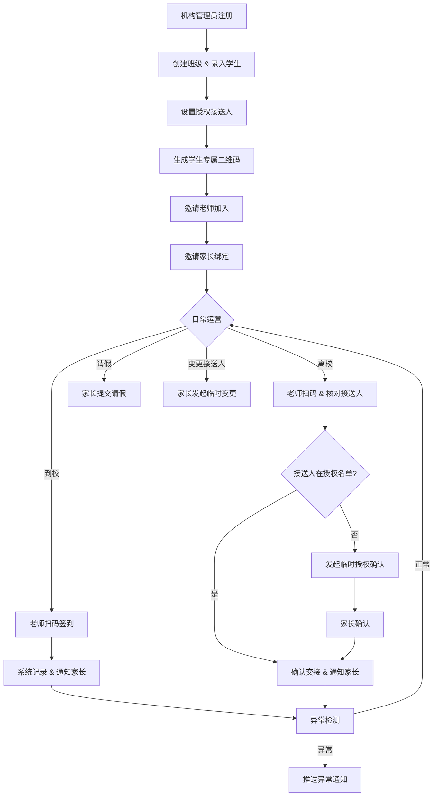

## 时序图

### 异常场景完整时序

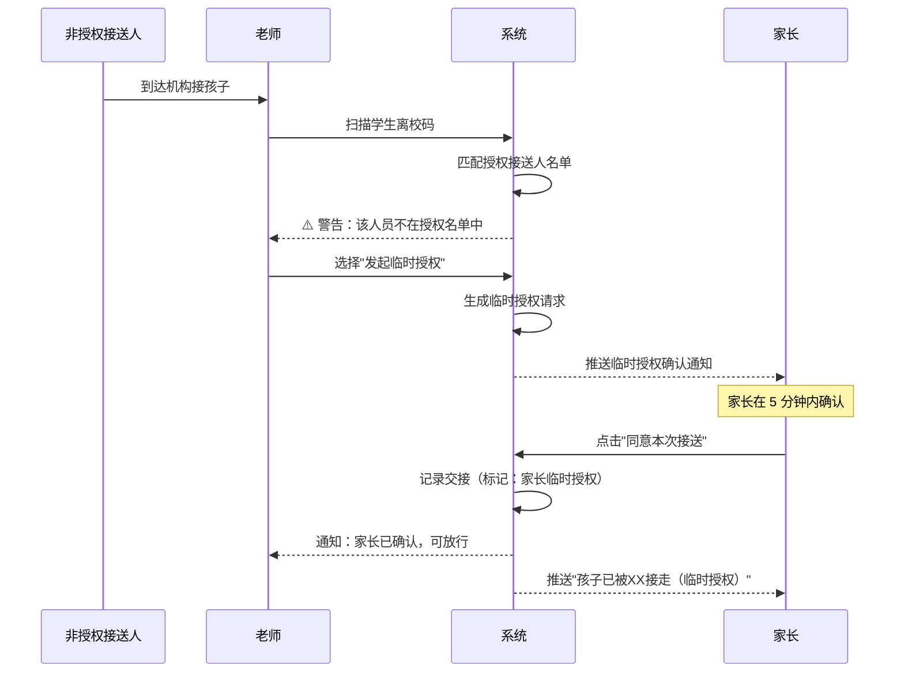

## （用户与系统交互）用例图

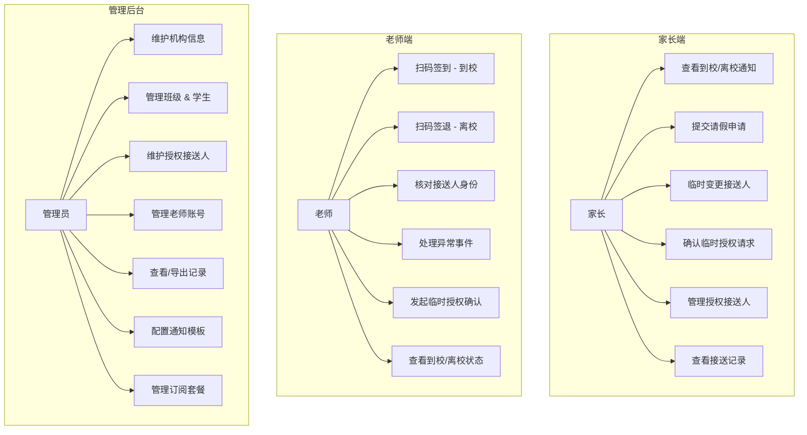

## （系统）状态图

### 学生当日接送状态流转

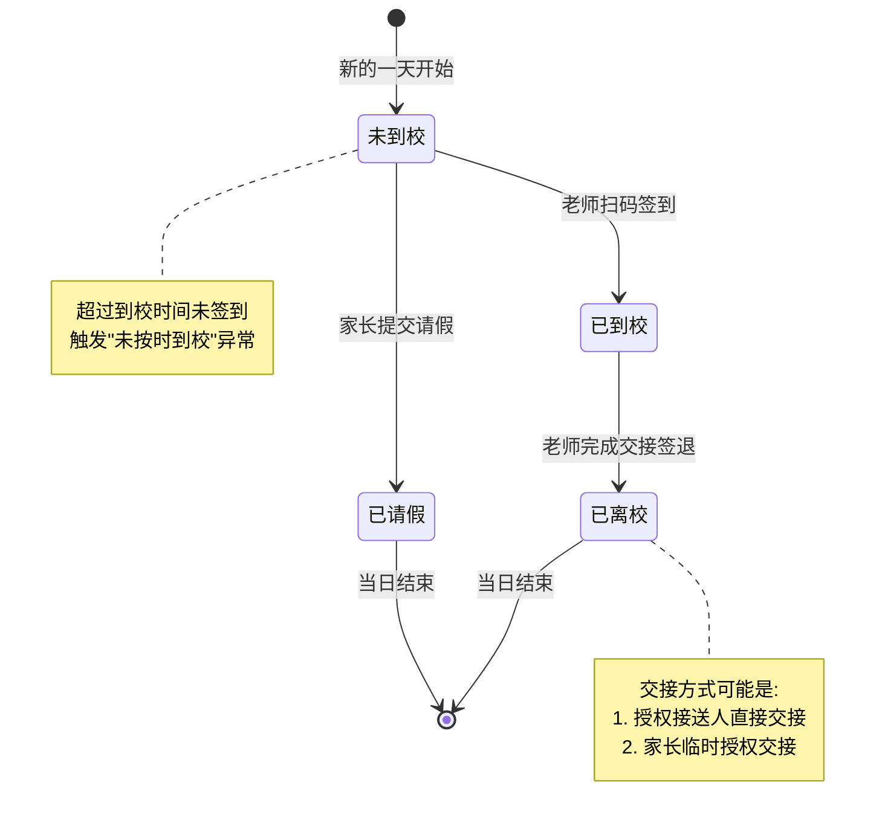

### 临时授权状态流转

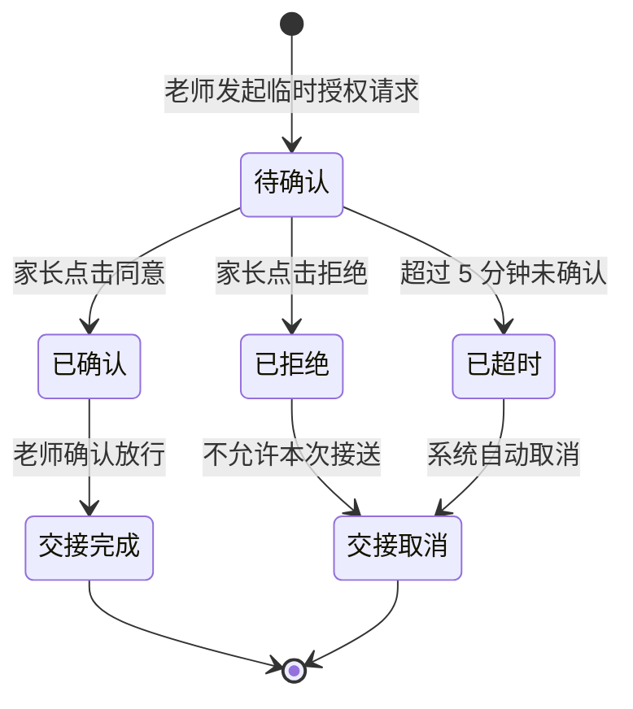
