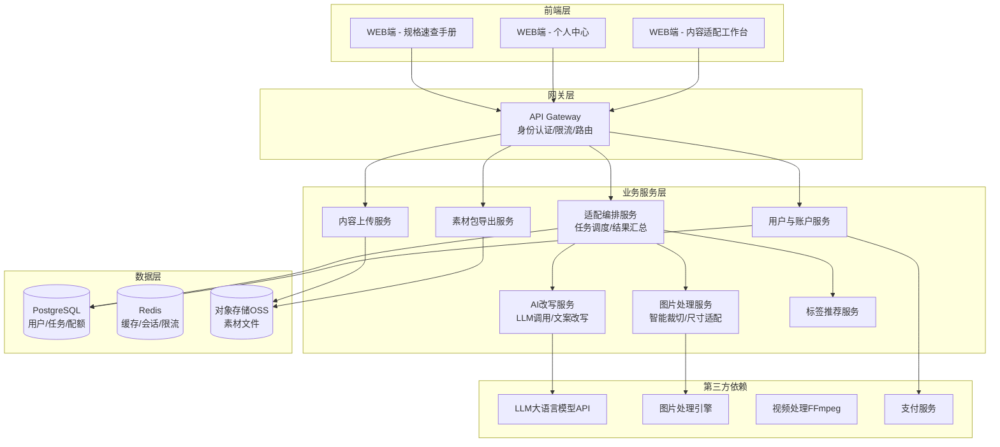
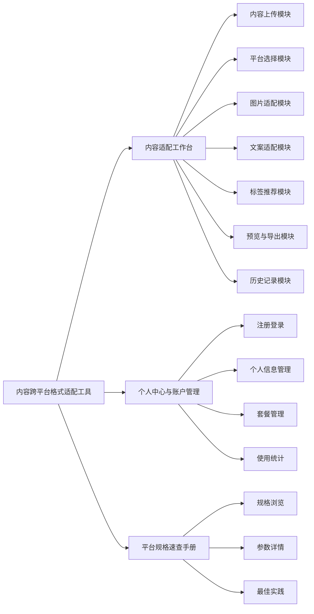
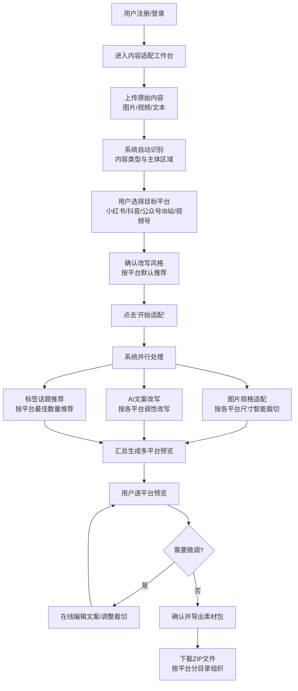
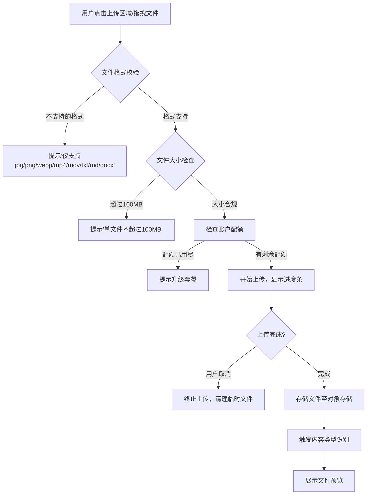
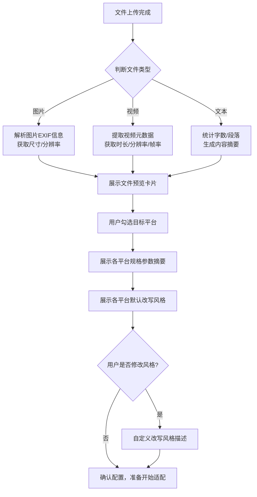
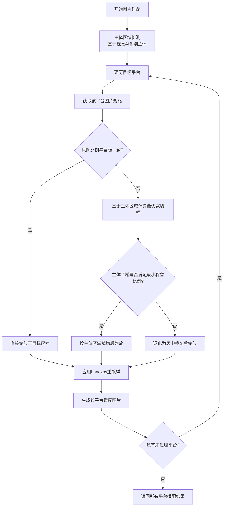
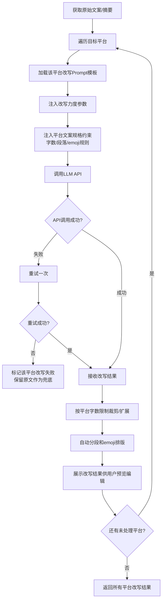
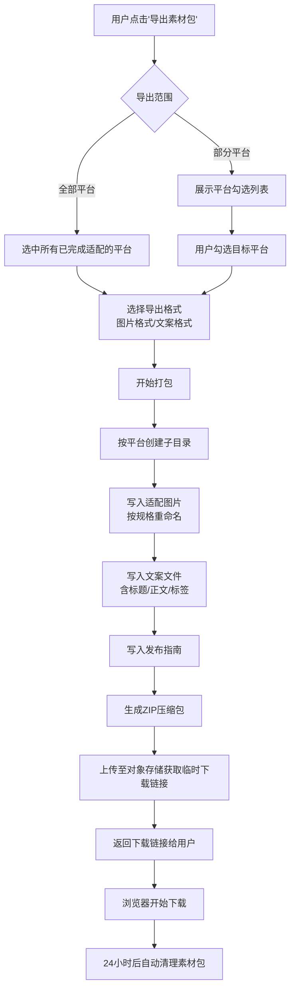
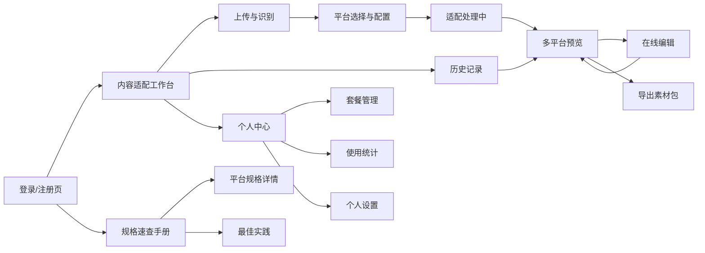
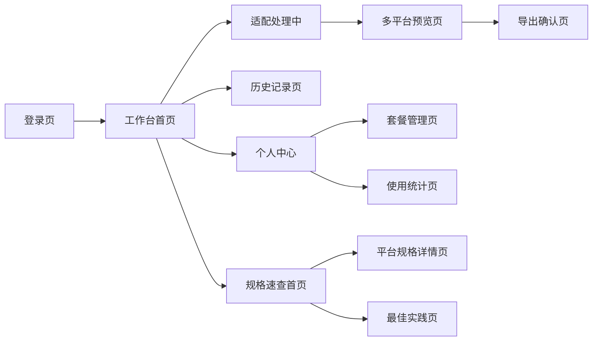

| 版本号 | 变更日期 | 变更内容 | 变更人 | 审核人 |
| --- | --- | --- | --- | --- |
| V1.0 | 2026-06-29 | 初始版本创建 | 产品文档结对写作专家 | 阶段一产品落地页文档总编辑 |

---
# 1 概述

## 1.1 需求背景

随着自媒体生态的蓬勃发展，内容创作者普遍面临"一次创作、多平台分发"的运营需求。同一内容需要针对小红书、抖音、公众号、B站、视频号等不同平台进行格式裁切、文案改写、标签适配等大量重复性工作，耗时且易出错。

当前市场痛点：
1. **格式适配繁琐**：各平台图片尺寸、视频比例、封面规格各异，手动逐一调整效率极低
2. **文案风格差异大**：小红书种草风、公众号深度风、知乎专业风、抖音短平快——人工改写耗时且难以保证质量
3. **平台规则多变**：发布规格频繁更新，运营者难以及时跟踪
4. **重复劳动密集**：一份优质内容需多次加工才能完成多平台分发

市场现有工具（Canva、创客贴、剪映等）聚焦通用设计或视频剪辑，缺乏"AI驱动的多平台格式+文案一键适配"的垂直解决方案。本产品聚焦这一高频执行环节，以MVP形态快速切入市场。

## 1.2 名词解释

| **名词** | **说明** |
| --- | --- |
| 适配任务 | 用户上传一份原始内容后，系统为其生成多平台适配结果的完整处理过程 |
| 素材包 | 适配完成后打包导出的ZIP文件，内含各平台的图片、文案、标签等发布素材 |
| 平台规格库 | 系统维护的各平台发布规格参数集合，包括尺寸、比例、字数限制、标签数量等 |
| AI改写 | 调用大语言模型根据各平台调性自动改写原始文案的功能 |
| 改写力度 | 用户对AI改写程度的控制选项，分为轻度润色、中度改写、深度重写三档 |
| 智能裁切 | 基于图片主体检测的自动裁切算法，确保各平台尺寸下保留核心内容区域 |
| 配额 | 用户账户每月可执行的适配任务次数上限，免费版10次/月，专业版不限 |

## 1.3 产品介绍

内容跨平台格式适配工具是一款面向多平台内容运营者的AI驱动效率工具。用户上传长文、横版视频或长图后，系统自动按照各主流平台的发布规格生成多版本适配结果，并利用大语言模型根据各平台调性自动改写文案、推荐话题标签，最终支持一键导出各平台专属素材包。

### 1.3.1 范围说明

| 项 | 内容 |
| --- | --- |
| 包含功能 | 内容上传与识别、多平台格式适配（图片裁切/尺寸适配）、AI文案改写、标签推荐、多平台预览、素材包导出、账户与套餐管理、平台规格速查手册 |
| 不包含功能 | 从0到1的内容创作、发布效果数据分析、一键发布到各平台、通用图片/视频编辑、移动端APP、小程序 |

**目标用户：**
- 个人创作者：在多个平台运营自媒体账号的个人博主、KOL
- 自媒体团队：拥有多名运营人员的小型内容团队
- MCN运营人员：负责旗下达人内容多平台分发的运营人员
- 品牌运营方：企业品牌新媒体运营人员

**使用场景：**
- 创作者完成一篇原创内容后，需快速适配到5个以上平台发布
- MCN运营需要将达人素材批量加工为各平台格式
- 品牌运营需统一调性同时适配多平台传播

**核心价值：**
- 将原本2-3小时的多平台适配工作压缩至10分钟内完成
- AI自动改写保证各平台文案调性一致且符合平台特色
- 一键导出素材包消除手动整理文件的繁琐环节

---
# 2 产品设计

## 2.1 系统架构图

## 2.2 业务模块图

## 2.3 主业务流程

## 2.4 功能图/列表

| 功能模块 | 功能名称 | 优先级 | 功能描述 |
| --- | --- | --- | --- |
| 内容适配工作台 | 素材上传 | P0 | 支持图片/视频/文本文件上传，单文件≤100MB |
| 内容适配工作台 | 批量上传 | P1 | 一次选择多个文件，最多20个 |
| 内容适配工作台 | 拖拽上传 | P1 | 拖拽文件或文件夹到指定区域上传 |
| 内容适配工作台 | 内容类型识别 | P0 | 自动识别文件类型并显示预览 |
| 内容适配工作台 | 主体区域检测 | P1 | 图片主体检测，为智能裁切提供依据 |
| 内容适配工作台 | 目标平台选择 | P0 | 勾选需要适配的平台（5大平台） |
| 内容适配工作台 | 平台规格预览 | P1 | 展示所选平台的关键规格参数 |
| 内容适配工作台 | 改写风格推荐 | P0 | 按平台特性推荐默认改写风格 |
| 内容适配工作台 | 智能裁切 | P0 | 按各平台尺寸自动裁切图片，保留主体区域 |
| 内容适配工作台 | 手动微调裁切 | P1 | 用户手动调整裁切区域 |
| 内容适配工作台 | 多尺寸生成 | P0 | 一次生成所有目标平台的图片尺寸版本 |
| 内容适配工作台 | 画质保持 | P1 | 高质量重采样算法保持清晰度 |
| 内容适配工作台 | AI文案改写 | P0 | 按各平台调性自动改写文案 |
| 内容适配工作台 | 改写程度调节 | P1 | 轻度润色/中度改写/深度重写三档 |
| 内容适配工作台 | 改写预览与编辑 | P0 | 查看AI改写结果并在线编辑微调 |
| 内容适配工作台 | 文案长度适配 | P0 | 按各平台字数限制自动调整文案长度 |
| 内容适配工作台 | 智能分段排版 | P1 | 按平台阅读习惯自动分段和添加emoji |
| 内容适配工作台 | 平台标签推荐 | P0 | 根据内容和平台推荐适配话题标签 |
| 内容适配工作台 | 标签数量适配 | P0 | 按各平台最佳实践控制标签数量 |
| 内容适配工作台 | 分平台预览 | P0 | 模拟各平台发布页面展示适配结果 |
| 内容适配工作台 | 一键导出素材包 | P0 | 打包所有平台适配素材为ZIP下载 |
| 内容适配工作台 | 分平台导出 | P1 | 可选择只导出部分平台素材 |
| 内容适配工作台 | 历史记录 | P1 | 查看和复用历史适配任务 |
| 个人中心 | 手机号注册登录 | P0 | 手机号+验证码注册和登录 |
| 个人中心 | 微信扫码登录 | P1 | 微信扫码快捷登录 |
| 个人中心 | 个人信息编辑 | P0 | 编辑昵称、头像、联系方式 |
| 个人中心 | 当前套餐查看 | P0 | 展示套餐类型、剩余配额、到期时间 |
| 个人中心 | 套餐升级 | P0 | 免费版升级专业版，在线支付 |
| 个人中心 | 月度用量统计 | P0 | 展示本月已用/剩余适配次数 |
| 规格速查手册 | 按平台浏览规格 | P0 | 按平台分类展示完整发布规格参数 |
| 规格速查手册 | 图片/视频/文案规格 | P0 | 展示各平台的详细规格参数 |
| 规格速查手册 | 最佳实践指南 | P1 | 各平台内容发布运营建议 |

## 2.5 你的产品有哪些端

| 序号 | 端名称 | 端类型 | 目标用户 | 说明 |
| --- | --- | --- | --- | --- |
| 1 | 内容适配工作台 | WEB端 | 所有用户 | 核心操作界面，完成上传→适配→预览→导出全流程 |
| 2 | 个人中心 | WEB端 | 所有用户 | 账户管理、套餐管理、使用统计 |
| 3 | 平台规格速查手册 | WEB端 | 所有用户 | 各平台发布规格参考和最佳实践指南 |

---
# 3 产品功能

## 3.1 内容适配工作台（WEB端）

### 3.1.1 素材上传

**功能描述：**
用户通过点击上传区域或拖拽文件的方式，将原始内容（图片、视频、文本文件）上传至系统。系统接收文件后进行格式校验、大小检查，并在上传完成后展示文件预览。

| 项 | 内容 |
| --- | --- |
| 优先级 | P0 |
| 依赖需求 | 无 |
| 前置条件 | 用户已登录，账户配额未用尽 |

**业务规则：**
1. 支持文件格式：图片（jpg/png/webp）、视频（mp4/mov）、文本（txt/md/docx）
2. 单文件大小限制：100MB
3. 批量上传上限：一次最多20个文件
4. 上传过程显示进度条，支持取消操作
5. 上传成功后自动触发内容类型识别

### 3.1.2 素材上传—详细流程

### 3.1.3 素材上传—主要原型

[素材上传组件原型](assets/prototypes/web/upload-widget.html)

**验收标准：**
- [ ] 正常流程：支持拖拽和点击两种上传方式，上传过程显示进度百分比，完成后展示文件预览缩略图
- [ ] 异常流程：不支持的格式弹出明确提示；超文件弹出大小提示；配额不足引导升级
- [ ] 性能要求：2MB图片上传完成时间不超过2秒，进度条实时更新

### 3.1.4 内容识别与平台选择

**功能描述：**
系统自动识别上传内容的类型（图片/视频/文本），展示预览信息（尺寸、时长、字数等），用户在此基础上选择需要适配的目标平台和改写风格。

| 项 | 内容 |
| --- | --- |
| 优先级 | P0 |
| 依赖需求 | 素材上传 |
| 前置条件 | 至少上传一个文件 |

**业务规则：**
1. 图片识别：展示尺寸、分辨率、文件大小预览
2. 视频识别：展示时长、分辨率、关键帧预览
3. 文本识别：展示字数、段落数、内容摘要
4. 平台选择支持多选，默认全选5个平台
5. 改写风格按平台自动匹配默认值（小红书→种草风、公众号→深度风、抖音→短平快、B站→年轻化、视频号→生活化）

### 3.1.5 内容识别与平台选择—详细流程

### 3.1.6 内容识别与平台选择—主要原型

[平台选择与配置组件原型](assets/prototypes/web/platform-select-widget.html)

**验收标准：**
- [ ] 正常流程：文件上传后自动展示预览信息和识别结果，5个平台checkbox可自由勾选，各平台规格参数正确展示
- [ ] 异常流程：未选择任何平台时"开始适配"按钮置灰不可点击
- [ ] 性能要求：内容识别在上传完成后1秒内完成展示

### 3.1.7 图片适配处理

**功能描述：**
系统根据各目标平台的尺寸规格，对上传图片执行智能裁切和尺寸适配。智能裁切算法基于图片主体检测结果，确保在各比例下保留核心内容区域。

| 项 | 内容 |
| --- | --- |
| 优先级 | P0 |
| 依赖需求 | 内容识别、平台选择 |
| 前置条件 | 已上传图片且选择了包含图片需求的平台 |

**业务规则：**
1. 各平台图片规格：小红书→3:4竖图(1080×1440)、抖音→9:16竖图(1080×1920)、公众号封面→2.35:1(900×383)、公众号正文→宽640px、B站封面→16:10(960×600)、视频号→多种尺寸
2. 裁切优先级：保留主体区域 > 居中裁切 > 边缘裁切
3. 缩放采用高质量重采样算法（Lanczos），确保画质
4. 用户可手动微调裁切框位置和大小

### 3.1.8 图片适配处理—详细流程

### 3.1.9 图片适配处理—主要原型

[图片适配处理组件原型](assets/prototypes/web/image-adapt-widget.html)

**验收标准：**
- [ ] 正常流程：单张图片完成5平台适配不超过30秒，各尺寸图片清晰无模糊
- [ ] 异常流程：原图尺寸过小时提示"原图分辨率不足，部分平台适配可能模糊"
- [ ] 性能要求：5平台并行适配总耗时不超过30秒

### 3.1.10 AI文案改写

**功能描述：**
调用大语言模型，根据各平台的内容调性和文案规格，自动将原始文案改写为适配各平台风格的版本。支持三档改写力度选择，用户可在线预览并编辑改写结果。

| 项 | 内容 |
| --- | --- |
| 优先级 | P0 |
| 依赖需求 | 内容识别、平台选择 |
| 前置条件 | 已上传文本内容或从图片/视频中提取了文本 |

**业务规则：**
1. 各平台改写风格Prompt预设：
   - 小红书：种草风，多用emoji，口语化，加入使用体验描述
   - 公众号：深度风，结构清晰，段落分明，有观点输出
   - 抖音：短平快，标题党，强钩子开头，控制在300字内
   - B站：年轻化，有梗，互动感强，适当用网络用语
   - 视频号：生活化，温暖正向，适合中年用户阅读习惯
2. 改写力度：轻度润色（仅调整语气）、中度改写（重构段落）、深度重写（完全重新表达）
3. 文案长度自动适配各平台限制
4. 改写结果支持在线编辑修改

### 3.1.11 AI文案改写—详细流程

### 3.1.12 AI文案改写—主要原型

[AI文案改写组件原型](assets/prototypes/web/copy-rewrite-widget.html)

**验收标准：**
- [ ] 正常流程：5平台文案改写20秒内完成，各平台文案风格差异明显且符合平台调性
- [ ] 异常流程：LLM调用失败时展示原文并提示"改写服务暂时不可用，已为您保留原文"
- [ ] 性能要求：单平台改写响应时间不超过8秒

### 3.1.13 标签与话题推荐

**功能描述：**
根据内容主题和各平台热门标签数据，为每个目标平台推荐适配的话题标签，标签数量按各平台最佳实践自动控制。

| 项 | 内容 |
| --- | --- |
| 优先级 | P0 |
| 依赖需求 | 内容识别、平台选择 |
| 前置条件 | 已上传内容 |

**业务规则：**
1. 各平台标签数量最佳实践：
   - 小红书：5-10个话题标签
   - 抖音：3-5个话题标签
   - 公众号：3-5个关键词标签
   - B站：5-8个标签
   - 视频号：3-5个话题标签
2. 标签来源：平台热门标签库 + LLM根据内容生成
3. 标签排序：按相关度+热度综合排序
4. 用户可编辑、删除或新增标签

### 3.1.14 标签与话题推荐—主要原型

[标签推荐组件原型](assets/prototypes/web/tag-recommend-widget.html)

**验收标准：**
- [ ] 正常流程：各平台标签数量符合最佳实践范围，标签与内容主题相关度高
- [ ] 异常流程：标签服务不可用时，仅展示LLM生成的基础标签
- [ ] 性能要求：标签推荐与文案改写并行完成，不额外增加等待时间

### 3.1.15 多平台预览

**功能描述：**
以各平台实际发布页面的视觉样式展示适配结果，用户可逐平台查看图片、文案、标签的组合效果，所见即所得。

| 项 | 内容 |
| --- | --- |
| 优先级 | P0 |
| 依赖需求 | 图片适配、文案改写、标签推荐 |
| 前置条件 | 适配任务处理完成 |

**业务规则：**
1. 各平台预览模板需模拟该平台实际发布页面的UI样式
2. 预览包含：适配后图片、改写后文案、推荐标签的完整组合
3. 用户可在预览界面直接点击进入编辑模式
4. 支持左右切换查看不同平台的预览效果

### 3.1.16 多平台预览—主要原型

[多平台预览组件原型](assets/prototypes/web/preview-widget.html)

**验收标准：**
- [ ] 正常流程：5个平台预览卡片完整展示，视觉样式区分明显，文案和图片正确对应
- [ ] 异常流程：某平台适配失败时展示错误提示并提供重试按钮
- [ ] 性能要求：预览页面加载时间不超过2秒

### 3.1.17 素材包导出

**功能描述：**
将所有平台的适配结果（图片+文案+标签）按平台分目录组织，打包为ZIP文件供用户下载。支持一键全量导出或选择部分平台导出。

| 项 | 内容 |
| --- | --- |
| 优先级 | P0 |
| 依赖需求 | 图片适配、文案改写、标签推荐、多平台预览 |
| 前置条件 | 至少一个平台适配完成 |

**业务规则：**
1. ZIP包目录结构：`/平台名称/图片/`、`/平台名称/文案.txt`、`/平台名称/发布指南.txt`
2. 图片按平台规格命名：`{平台}_{尺寸}.jpg`
3. 文案文件包含标题、正文、标签完整内容
4. 附加各平台发布指南（最佳发布时间、注意事项）
5. 支持选择导出格式：图片jpg/png/webp，文案txt/markdown
6. 素材包在服务器保留24小时后自动清理

### 3.1.18 素材包导出—详细流程

### 3.1.19 素材包导出—主要原型

[素材包导出组件原型](assets/prototypes/web/export-widget.html)

**验收标准：**
- [ ] 正常流程：包含10张图片+5篇文案的素材包60秒内完成打包和下载
- [ ] 异常流程：打包失败时提示错误原因并提供重试
- [ ] 性能要求：素材包导出耗时不超过60秒

### 3.1.20 历史记录

**功能描述：**
展示用户的历史适配任务列表，支持查看任务详情、加载历史结果重新编辑或重新导出。

| 项 | 内容 |
| --- | --- |
| 优先级 | P1 |
| 依赖需求 | 适配任务完成 |
| 前置条件 | 至少完成过一次适配任务 |

**业务规则：**
1. 记录内容：内容标题/缩略图、适配平台、创建时间、状态
2. 历史记录保留90天
3. 支持从历史记录加载适配结果到工作台继续编辑
4. 支持重新导出历史任务的素材包（需重新打包）

## 3.2 个人中心与账户管理（WEB端）

### 3.2.1 注册登录

**功能描述：**
支持手机号+验证码注册和登录，支持微信扫码快捷登录。

| 项 | 内容 |
| --- | --- |
| 优先级 | P0 |
| 依赖需求 | 无 |
| 前置条件 | 无 |

**业务规则：**
1. 手机号注册：输入手机号→获取验证码→输入验证码→完成注册
2. 验证码有效期5分钟，60秒内不可重复发送
3. 新用户注册自动分配免费版套餐（10次/月配额）
4. 微信扫码登录通过OAuth2.0协议对接

### 3.2.2 注册登录—主要原型

[注册登录组件原型](assets/prototypes/web/login-widget.html)

**验收标准：**
- [ ] 正常流程：手机号注册→验证码验证→登录成功跳转工作台，全流程不超过30秒
- [ ] 异常流程：验证码错误提示"验证码错误，请重新输入"；手机号已注册提示"该手机号已注册，请直接登录"
- [ ] 性能要求：验证码发送延迟不超过10秒

### 3.2.3 套餐管理与使用统计

**功能描述：**
展示用户当前套餐信息（类型、配额、到期时间），支持在线升级套餐。展示本月适配使用次数和剩余配额。

| 项 | 内容 |
| --- | --- |
| 优先级 | P0 |
| 依赖需求 | 注册登录 |
| 前置条件 | 用户已登录 |

**业务规则：**
1. 免费版：每月10次适配，最多3个平台/次
2. 专业版：¥39/月，不限次数和平台数
3. 配额每月1日0点重置
4. 配额用尽时引导升级/续费
5. 使用明细按时间倒序展示每次适配任务

### 3.2.4 套餐管理与使用统计—主要原型

[套餐管理组件原型](assets/prototypes/web/plan-widget.html)

**验收标准：**
- [ ] 正常流程：套餐信息正确展示，升级支付流程完整（选择套餐→确认订单→支付→升级成功）
- [ ] 异常流程：支付失败提示错误并引导重试
- [ ] 性能要求：配额信息实时更新，页面加载不超过1秒

## 3.3 平台规格速查手册（WEB端）

### 3.3.1 平台规格浏览

**功能描述：**
按平台分类展示各平台的完整发布规格参数，包括图片规格、视频规格、文案规格。支持按平台或按内容类型两种维度浏览。

| 项 | 内容 |
| --- | --- |
| 优先级 | P0 |
| 依赖需求 | 无 |
| 前置条件 | 无（游客可访问） |

**业务规则：**
1. 平台列表：小红书、抖音、公众号、B站、视频号
2. 规格参数包括：图片尺寸/比例/大小限制、视频时长/分辨率/比例、标题/正文字数限制、标签数量限制
3. 数据来源于平台官方规则，定期人工维护更新
4. 每个平台页面附带"最近更新"时间戳

### 3.3.2 平台规格浏览—主要原型

[规格速查组件原型](assets/prototypes/web/spec-widget.html)

**验收标准：**
- [ ] 正常流程：5个平台规格页面均可正常访问，参数信息完整准确
- [ ] 异常流程：无（静态内容页面）
- [ ] 性能要求：页面加载不超过1秒

### 3.3.3 最佳实践指南

**功能描述：**
提供各平台的内容发布最佳实践和运营建议，帮助用户提升内容分发效果。

| 项 | 内容 |
| --- | --- |
| 优先级 | P1 |
| 依赖需求 | 平台规格浏览 |
| 前置条件 | 无 |

**业务规则：**
1. 每个平台提供3-5条核心运营建议
2. 内容包括：最佳发布时间、内容形式偏好、标签使用技巧、封面设计建议
3. 内容由运营团队维护，每月更新

---
# 4 产品原型

## 4.1 页面跳转逻辑图

## 4.2 全站点原型设计

本产品的三个模块均为WEB端，以下生成WEB端全站点原型。

### 4.2.1 WEB端全站点原型

**页面清单：**

| 序号 | 页面名称 | 所属模块 | 页面描述 | 关键元素 |
| --- | --- | --- | --- | --- |
| 1 | 登录页 | 个人中心 | 手机号登录/注册入口 | 手机号输入框、验证码输入、登录按钮、微信扫码入口 |
| 2 | 工作台首页 | 内容适配 | 核心操作页面，上传→配置→适配→预览→导出 | 上传区域、平台选择面板、改写风格选择、适配进度、预览区、导出按钮 |
| 3 | 适配处理中 | 内容适配 | 展示适配进度和实时状态 | 进度条、各平台处理状态卡片、预计剩余时间 |
| 4 | 多平台预览页 | 内容适配 | 按平台卡片展示适配结果 | 平台切换Tab、图片预览、文案编辑区、标签展示 |
| 5 | 导出确认页 | 内容适配 | 确认导出范围并下载 | 平台勾选列表、格式选择、打包进度、下载按钮 |
| 6 | 历史记录页 | 内容适配 | 展示历史适配任务列表 | 任务列表卡片、缩略图、平台标签、时间、操作按钮 |
| 7 | 个人中心 | 个人中心 | 账户信息概览 | 头像昵称、套餐卡片、配额进度条、快捷入口 |
| 8 | 套餐管理页 | 个人中心 | 套餐详情与升级 | 当前套餐卡片、专业版介绍、升级按钮、支付入口 |
| 9 | 使用统计页 | 个人中心 | 月度用量明细 | 用量统计图表、使用明细列表 |
| 10 | 规格速查首页 | 规格手册 | 平台列表总览 | 平台卡片网格（5个平台）、快速导航 |
| 11 | 平台规格详情页 | 规格手册 | 单平台完整规格参数 | 参数表格、图片/视频/文案分类Tab |
| 12 | 最佳实践页 | 规格手册 | 运营建议指南 | 建议卡片列表、分类标签 |

**交互说明：**
- 页面跳转关系：

- 特殊交互：
  1. 工作台页面支持拖拽上传，拖入文件后上传区域高亮
  2. 适配处理中页面通过WebSocket实时推送各平台处理进度
  3. 多平台预览页支持左右键盘切换平台、Tab切换、文案区域可点击进入编辑模式
  4. 规格速查手册支持按平台分类切换，无需页面刷新
  5. 空数据态：历史记录为空时展示引导上传的空状态插图
  6. 加载态：适配处理中展示骨架屏+进度动画
  7. 错误态：适配失败展示重试按钮和错误原因

**产品原型：**

[🖥️ 打开WEB端全站点原型](assets/prototypes/web-prototype.html)

---
# 5 数据需求

## 5.1 数据使用规格

**用户表：**

| **字段** | **是否必填** | **描述** | **数据类型** |
| --- | --- | --- | --- |
| id | 是 | 用户唯一标识 | UUID |
| phone | 是 | 手机号（加密存储） | 字符串 |
| nickname | 否 | 用户昵称 | 字符串 |
| avatar_url | 否 | 头像URL | 字符串 |
| plan_type | 是 | 套餐类型（free/pro） | 枚举 |
| plan_expire_at | 否 | 套餐到期时间 | 时间戳 |
| monthly_quota | 是 | 当月剩余配额 | 整数 |
| created_at | 是 | 注册时间 | 时间戳 |

**适配任务表：**

| **字段** | **是否必填** | **描述** | **数据类型** |
| --- | --- | --- | --- |
| id | 是 | 任务唯一标识 | UUID |
| user_id | 是 | 所属用户ID | UUID |
| source_type | 是 | 原始内容类型（image/video/text） | 枚举 |
| source_file_url | 是 | 原始文件存储URL | 字符串 |
| target_platforms | 是 | 目标平台列表 | JSON数组 |
| rewrite_style | 是 | 改写风格配置 | JSON对象 |
| status | 是 | 任务状态 | 枚举 |
| result_data | 否 | 适配结果数据 | JSON对象 |
| export_url | 否 | 导出素材包临时URL | 字符串 |
| created_at | 是 | 创建时间 | 时间戳 |
| updated_at | 是 | 更新时间 | 时间戳 |

**平台规格表：**

| **字段** | **是否必填** | **描述** | **数据类型** |
| --- | --- | --- | --- |
| id | 是 | 规格记录ID | UUID |
| platform | 是 | 平台标识 | 枚举 |
| content_type | 是 | 内容类型（image/video/text） | 枚举 |
| spec_data | 是 | 规格参数详情 | JSON对象 |
| updated_at | 是 | 最近更新时间 | 时间戳 |

## 5.2 统计数据

1. 统计用户每月适配任务完成次数，用于配额扣减和展示
2. 统计各平台适配使用频次，用于运营分析
3. 统计素材包下载次数和文件大小分布

## 5.3 埋点需求

| 页面 | 事件 | 采集字段 | 说明 |
| --- | --- | --- | --- |
| 工作台 | upload_file | file_type, file_size, upload_method | 统计上传行为，区分拖拽/点击 |
| 工作台 | select_platform | platforms[], platform_count | 统计平台选择偏好 |
| 工作台 | start_adapt | platform_count, rewrite_level | 统计适配任务发起 |
| 预览页 | edit_copy | platform, edit_duration | 统计文案编辑行为 |
| 预览页 | export_pack | platforms[], file_format, pack_size | 统计导出行为 |
| 规格手册 | view_spec | platform, content_type | 统计规格查阅热度 |

---
# 6 非功能需求

## 6.1 性能需求

**6.1.1 延迟**

| 编号 | 项目 | 最大延迟 | 平均延迟 | 优先级 | 备注 |
| --- | --- | --- | --- | --- | --- |
| 0001 | 单张图片5平台适配 | <30秒 | <20秒 | 高 | 含裁切+文案改写 |
| 0002 | 单篇文案5平台改写 | <20秒 | <12秒 | 高 | 含标签推荐 |
| 0003 | 素材包打包导出 | <60秒 | <40秒 | 中 | 10图+5文案规模 |
| 0004 | 页面首屏加载 | <3秒 | <2秒 | 高 |  |
| 0005 | 操作响应（按钮点击等） | <500ms | <300ms | 高 |  |
| 0006 | 文件上传速度 | >=2MB/s | >=3MB/s | 中 | 正常网络条件下 |

**6.1.2 吞吐量**

| 编号 | 项 | 吞吐量 | 备注 |
| --- | --- | --- | --- |
| 0001 | 同时在线适配任务 | 100个并发 | 用户同时处理 |
| 0002 | 图片处理QPS | 50张/秒 | 峰值处理能力 |
| 0003 | LLM API调用 | 20次/秒 | 受限于第三方API配额 |

**6.1.3 容量**

| 编号 | 项 | 容量 | 备注 |
| --- | --- | --- | --- |
| 0001 | 系统注册用户数 | <=500,000 |  |
| 0002 | 日活跃用户数 | <=50,000 |  |
| 0003 | 单用户存储配额 | 5GB | 素材文件保留90天 |

## 6.2 安全需求

| 编号 | 项 |
| --- | --- |
| 0001 | 全站HTTPS传输加密 |
| 0002 | 用户密码bcrypt加盐哈希存储 |
| 0003 | 手机号等敏感信息AES加密存储 |
| 0004 | 用户素材文件隔离存储，不可跨用户访问 |
| 0005 | AI改写内容经过安全过滤，不生成违规内容 |
| 0006 | API接口JWT鉴权，Token有效期2小时 |
| 0007 | 文件上传白名单校验，防止恶意文件 |

## 6.3 可靠性

| 编号 | 项 | 值 |
| --- | --- | --- |
| 0001 | 系统月可用性 | >=99.5% |
| 0002 | 平均正常运行时间 | 180天 |
| 0003 | 平均故障恢复时间 | <30分钟 |
| 0004 | 适配任务失败自动重试 | 1次 |

## 6.4 可连续性

| 编号 | 项 |
| --- | --- |
| 0001 | 系统7×24小时全天候运行 |
| 0002 | 计划维护提前24小时通知用户 |
| 0003 | 第三方LLM API故障时降级为原文展示 |

## 6.5 可恢复性

| 编号 | 项 |
| --- | --- |
| 0001 | 数据库每日全量备份，保留30天 |
| 0002 | 业务数据每小时增量备份 |
| 0003 | 重大故障24小时内恢复服务 |

## 6.6 兼容性

| 编号 | 要求 | 备注 |
| --- | --- | --- |
| 0001 | Chrome >=90, Firefox >=88, Safari >=14, Edge >=90 | 桌面浏览器 |
| 0002 | 最小分辨率1280×720 | 响应式适配 |

## 6.7 易用性

| 编号 | 要求 | 备注 |
| --- | --- | --- |
| 0001 | 核心操作路径（上传→适配→导出）不超过5步 |  |
| 0002 | 新用户无需培训即可完成首次适配 |  |
| 0003 | 关键操作提供即时反馈（进度、结果、错误） |  |

---
# 7 总结

## 7.1 上线计划

| 阶段 | 时间 | 内容 | 负责人 |
| --- | --- | --- | --- |
| MVP开发 | 2026-07-01 ~ 2026-07-07 | 核心适配功能开发（5-7天） | 开发团队 |
| 测试阶段 | 2026-07-08 ~ 2026-07-10 | 功能测试、兼容性测试 | 测试团队 |
| 灰度阶段 | 2026-07-11 ~ 2026-07-14 | 灰度10%用户，验证稳定性 | 运营团队 |
| 全量上线 | 2026-07-15 | 全量开放给所有用户 | 全体 |

## 7.2 后续迭代规划

- V1.1：扩展至10+平台（快手、微博、知乎、今日头条），视频自动适配
- V1.2：自定义改写风格、批量导出、团队协作功能
- V1.3：对接各平台API实现一键发布
- V2.0：发布效果数据回收与分析，基于历史数据的智能推荐优化

## 7.3 参考文档

- 用户需求说明书（URS）：`./内容跨平台格式适配工具/需求文档.md`
- 各平台官方发布规格文档
- 大语言模型API接入文档
