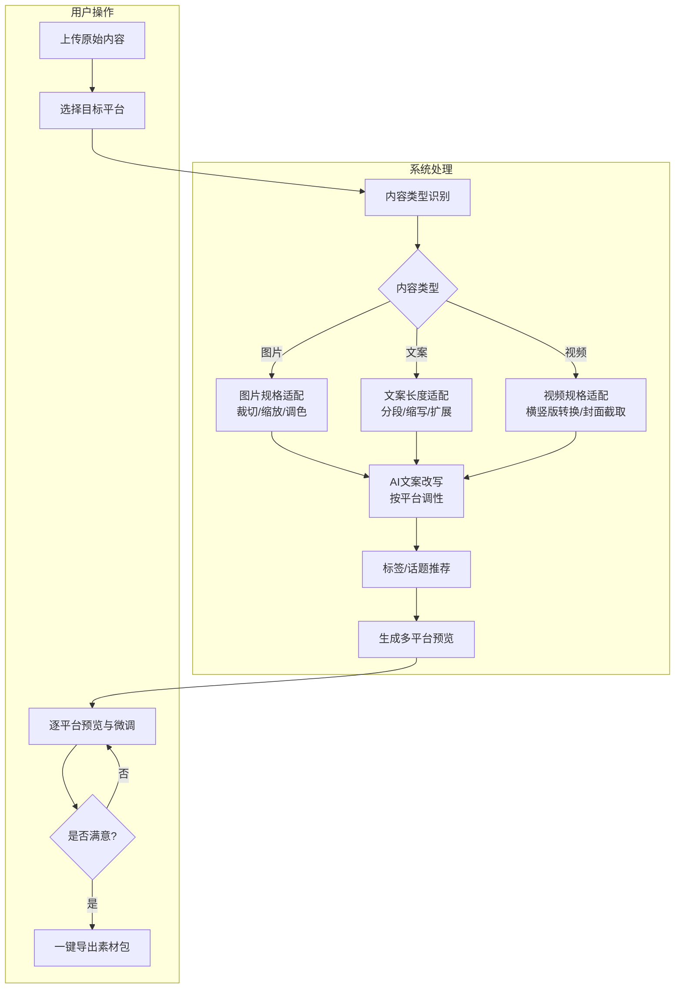
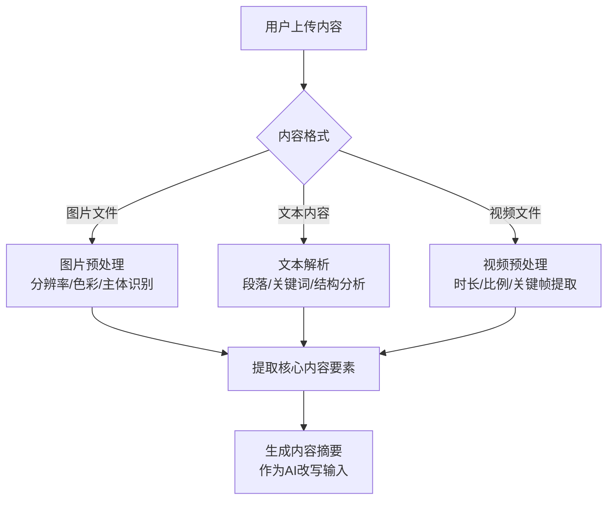
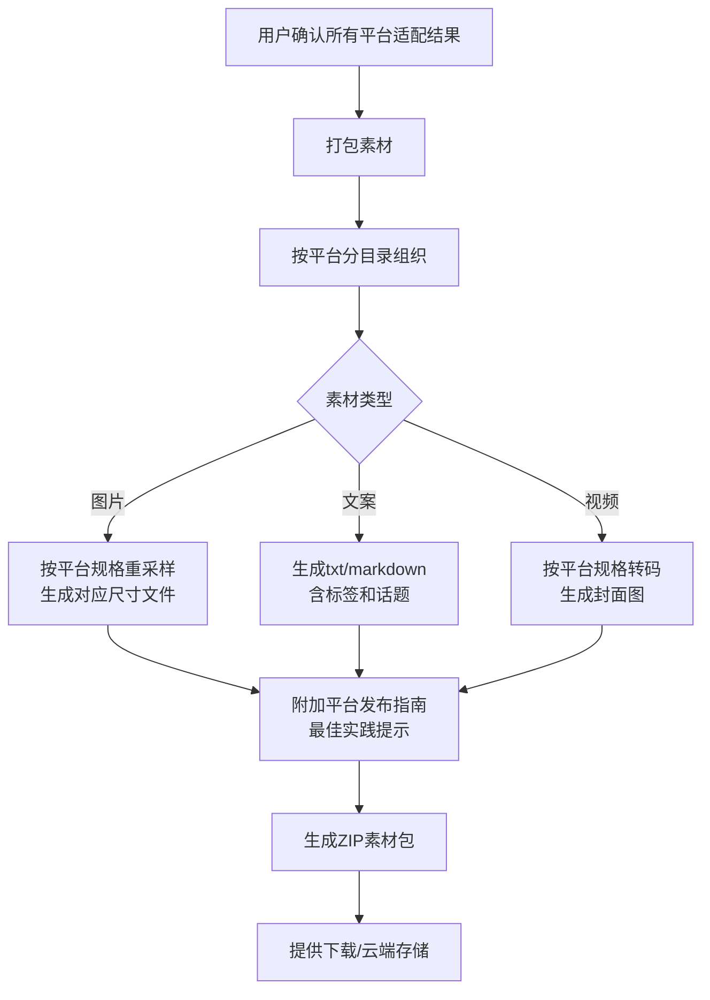
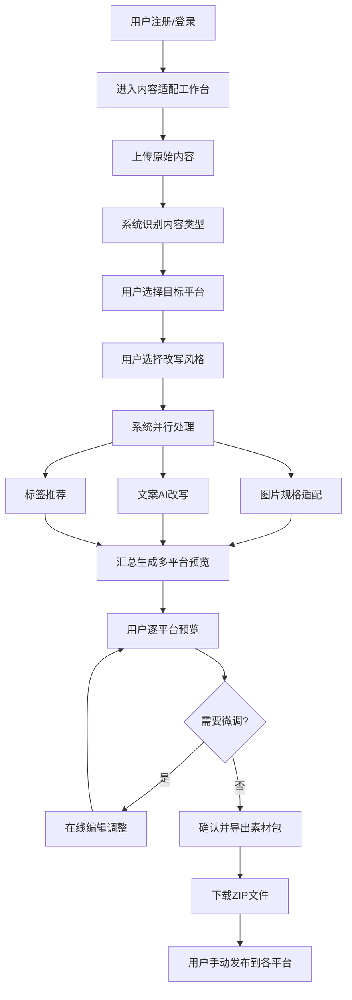
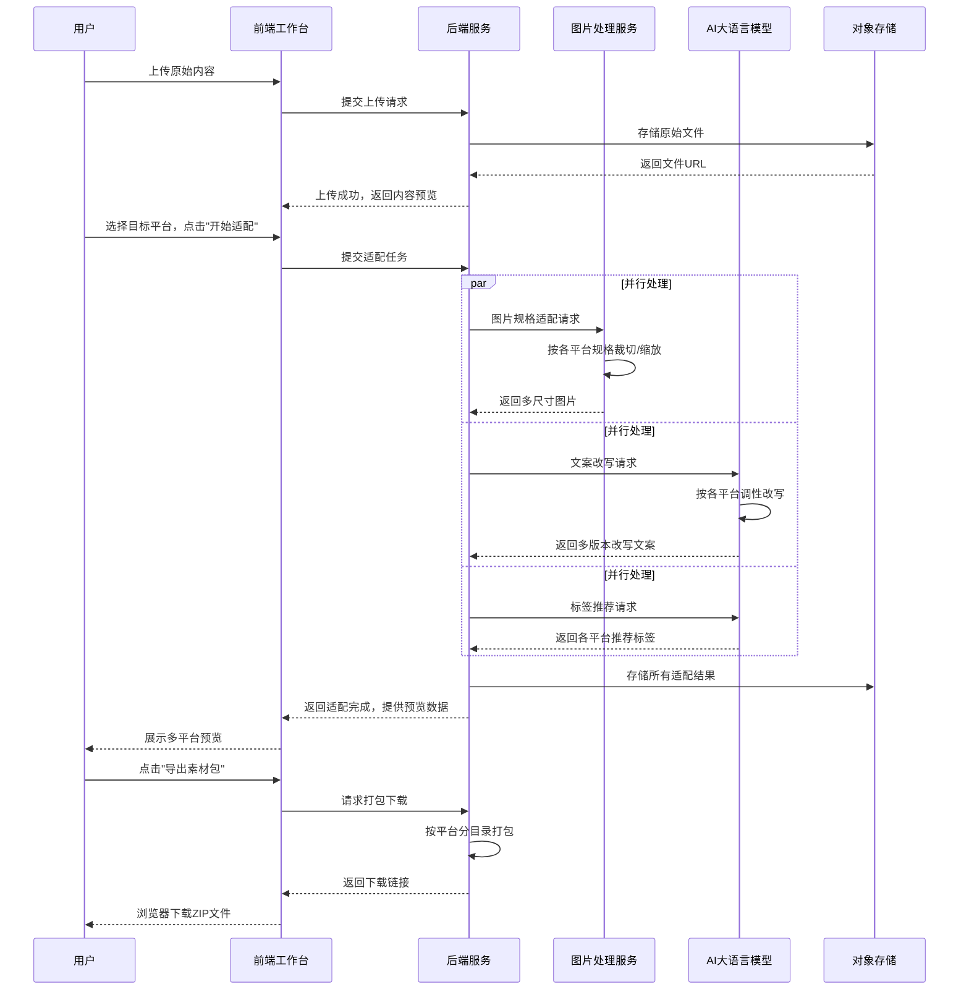
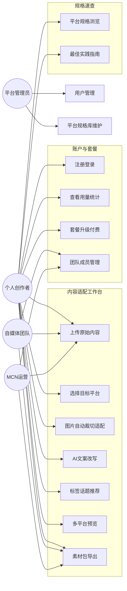
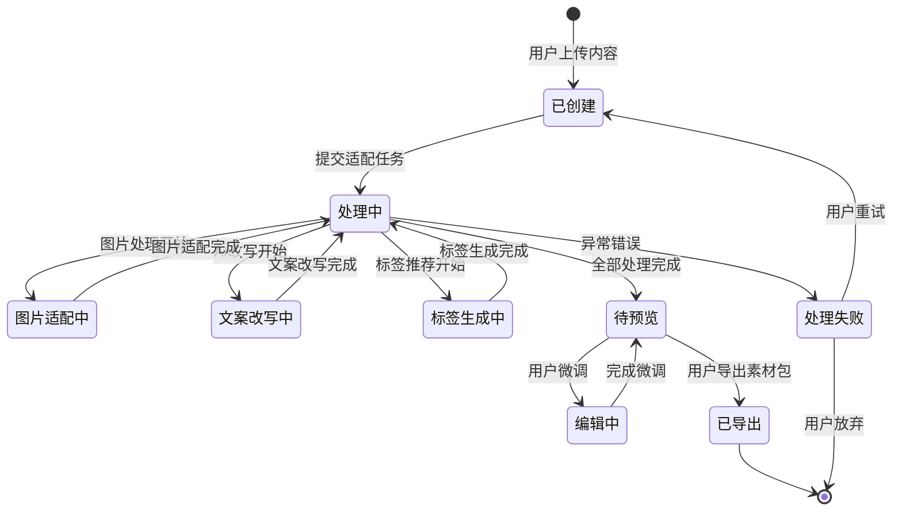

# 内容跨平台格式适配工具 - 用户需求说明书

# 1.需求概述

内容跨平台格式适配工具是一款面向多平台内容运营者的AI驱动效率工具，聚焦"一份原始内容→多平台适配素材一键生成"这一高频执行环节。用户上传长文、横版视频或长图后，系统自动按照小红书、抖音、公众号、B站、视频号等平台的发布规格（图片尺寸、封面裁切、文案字数、标签数量、视频时长等）生成多版本适配结果，并利用大语言模型根据各平台调性自动改写文案、推荐话题标签，最终支持一键导出各平台专属素材包，极大降低多平台分发的重复劳动。

## 1.1 需求介绍

内容跨平台格式适配工具旨在解决多平台内容运营中的核心效率痛点：

1. **格式适配繁琐**：同一内容需手动调整为多个平台的尺寸、比例、封面规格，耗时且易出错
2. **文案风格差异大**：不同平台有不同的调性偏好（小红书种草风、公众号深度风、知乎专业风、抖音短平快），人工改写效率低
3. **平台规则多变**：各平台发布规格经常更新，运营者难以及时跟踪最新的尺寸、标签、字数限制
4. **重复劳动多**：一份优质内容需多次重复加工才能分发到各平台，造成大量低价值劳动

### 1.1.1 所属领域

数字内容创作、自媒体运营工具、AI内容处理

## 1.2 需求目标

### 1.2.1 第一期目标（MVP）

完成核心适配功能：

- 支持5大主流平台（小红书、抖音、公众号、B站、视频号）的格式规格库
- 图片自动裁切与尺寸适配
- AI文案改写（按平台调性）
- 标签与话题推荐
- 素材包一键导出

### 1.2.2 第二期目标

扩展平台覆盖与高级功能：

- 扩展至10+平台（快手、微博、知乎、今日头条等）
- 视频自动适配（横版转竖版、封面截取）
- 自定义改写风格
- 团队协作功能

### 1.2.3 第三期目标

深度集成与智能化：

- 对接各平台API实现一键发布
- 发布效果数据回收与分析
- 基于历史数据的智能推荐优化

## 1.3 系统使用角色

1. **个人创作者**：在多个平台运营自媒体账号的个人博主、KOL，需要将一篇/一条内容快速适配到多个平台
2. **自媒体团队**：拥有多名运营人员的小型内容团队，需要批量处理内容并协作管理
3. **MCN运营人员**：负责将旗下达人内容素材加工为各平台适配格式，批量管理多账号内容分发
4. **品牌运营方**：企业品牌的新媒体运营人员，需要统一品牌调性同时适配多平台传播

## 1.4 业务流程图

### 1.4.1 核心适配流程

### 1.4.2 内容上传与识别流程

### 1.4.3 素材包导出流程

# 2.功能原型

| 原型名称 | 原型链接 | 对应端 | 备注 |
| --- | --- | --- | --- |
| 内容适配工作台 | 需求方提供 | WEB端 | V1.0 核心操作界面 |
| 个人中心与账户管理 | 需求方提供 | WEB端 | V1.0 账户、套餐、使用记录 |
| 平台规格速查手册 | 需求方提供 | WEB端 | V1.0 各平台发布规格参考 |

# 3.需求清单

## 3.1 内容适配工作台-WEB端

| 模块 | 一级功能 | 二级功能 | 功能描述 | 优先级 | 备注 |
| --- | --- | --- | --- | --- | --- |
| 内容上传 | 素材上传 | 单文件上传 | 支持上传图片（jpg/png/webp）、视频（mp4/mov）、文本（txt/md/docx）文件，单文件大小限制100MB | P0 | |
| | | 批量上传 | 支持一次选择多个文件批量上传，最多同时上传20个文件 | P1 | |
| | | 拖拽上传 | 支持通过拖拽文件或文件夹到指定区域完成上传 | P1 | |
| | 内容识别 | 内容类型识别 | 自动识别上传内容的类型（图片/视频/文本），并显示预览 | P0 | |
| | | 主体区域检测 | 对图片内容自动检测主体区域，为智能裁切提供依据 | P1 | |
| 平台选择 | 目标平台选择 | 平台多选 | 用户勾选需要适配的目标平台（小红书、抖音、公众号、B站、视频号） | P0 | |
| | | 平台规格预览 | 选择平台后展示该平台的关键规格参数（尺寸比例、文案字数、标签数量等） | P1 | |
| | 改写风格选择 | 风格推荐 | 根据各平台特性推荐默认改写风格（小红书种草风/公众号深度风/知乎专业风/抖音短平快） | P0 | |
| | | 自定义风格 | 支持用户自定义改写风格的描述词（如"轻松幽默"、"严谨学术"） | P2 | 第二期 |
| 图片适配 | 自动裁切 | 智能裁切 | 根据各平台尺寸规格自动裁切图片，保留主体区域（如小红书3:4竖图、公众号封面2.35:1） | P0 | |
| | | 手动微调 | 用户可手动调整裁切区域，拖动框选保留部分 | P1 | |
| | 尺寸适配 | 多尺寸生成 | 一次生成所有目标平台所需的图片尺寸版本 | P0 | |
| | | 画质保持 | 裁切和缩放后保持图片清晰度，采用高质量重采样算法 | P1 | |
| | 封面生成 | 自动封面 | 从视频素材中自动提取关键帧作为各平台封面图 | P1 | |
| 文案适配 | AI改写 | 平台调性改写 | AI根据各平台的内容调性自动改写原始文案，生成适配各平台风格的文案版本 | P0 | |
| | | 改写程度调节 | 提供"轻度润色"、"中度改写"、"深度重写"三档改写力度选择 | P1 | |
| | | 改写预览与编辑 | 用户可查看AI改写结果，并在线编辑微调文案内容 | P0 | |
| | 长度适配 | 自动长度调整 | 根据各平台文案字数限制自动调整文案长度（如小红书正文限制、抖音标题30字） | P0 | |
| | 分段排版 | 智能分段 | 自动按平台阅读习惯进行分段和emoji添加（如小红书每段加emoji） | P1 | |
| 标签推荐 | 话题标签生成 | 平台标签推荐 | 根据内容主题和各平台热门标签库，推荐适配的话题标签 | P0 | |
| | | 标签数量适配 | 按各平台最佳实践控制标签数量（如小红书5-10个、抖音3-5个） | P0 | |
| | | 标签热度展示 | 展示推荐标签的近期热度趋势，辅助用户决策 | P2 | |
| 预览与导出 | 多平台预览 | 分平台预览 | 以各平台发布页面的视觉样式展示适配结果，所见即所得 | P0 | |
| | | 逐页对比 | 支持左右对比查看各平台版本的差异 | P2 | |
| | 素材包导出 | 一键导出 | 将所有平台的适配素材（图片+文案+标签）打包为ZIP文件下载 | P0 | |
| | | 分平台导出 | 可选择只导出部分平台的素材包 | P1 | |
| | | 导出格式选择 | 图片支持jpg/png/webp格式选择，文案支持txt/markdown格式 | P2 | |
| 历史记录 | 适配记录 | 历史记录列表 | 查看历史适配任务，包含内容标题、适配平台、时间 | P1 | |
| | | 历史版本复用 | 支持从历史记录中加载之前的适配结果，重新编辑或重新导出 | P1 | |

## 3.2 个人中心与账户管理-WEB端

| 模块 | 一级功能 | 二级功能 | 功能描述 | 优先级 | 备注 |
| --- | --- | --- | --- | --- | --- |
| 账户管理 | 注册登录 | 手机号注册 | 支持手机号+验证码注册和登录 | P0 | |
| | | 微信扫码登录 | 支持微信扫码快捷登录 | P1 | |
| | 个人信息 | 资料编辑 | 编辑昵称、头像、联系方式等个人信息 | P0 | |
| | | 密码修改 | 支持修改登录密码 | P1 | |
| 套餐管理 | 套餐查看 | 当前套餐信息 | 展示当前套餐类型、剩余配额、到期时间 | P0 | |
| | | 套餐升级 | 支持从免费版升级到专业版，在线支付 | P0 | |
| | 使用统计 | 月度用量 | 展示本月已使用/剩余适配次数 | P0 | |
| | | 使用明细 | 按时间列出每次适配任务的详情 | P1 | |
| 团队协作 | 成员管理 | 邀请成员 | 通过链接或邮箱邀请团队成员加入 | P2 | 第二期 |
| | | 角色权限 | 设置团队成员的角色（管理员/编辑/查看） | P2 | 第二期 |

## 3.3 平台规格速查手册-WEB端

| 模块 | 一级功能 | 二级功能 | 功能描述 | 优先级 | 备注 |
| --- | --- | --- | --- | --- | --- |
| 规格查询 | 平台规格浏览 | 按平台浏览 | 按平台分类展示各平台的完整发布规格参数 | P0 | |
| | | 按类型浏览 | 按内容类型（图片/视频/文案）分类查看规格 | P1 | |
| 规格详情 | 参数展示 | 图片规格 | 展示各平台的图片尺寸、比例、大小限制、格式要求 | P0 | |
| | | 视频规格 | 展示各平台的视频时长、分辨率、比例、大小限制 | P0 | |
| | | 文案规格 | 展示各平台的标题/正文字数限制、标签数量限制 | P0 | |
| 最佳实践 | 运营指南 | 发布技巧 | 提供各平台的内容发布最佳实践和运营建议 | P1 | |
| | | 规则更新 | 展示各平台规则的最近更新记录 | P2 | |

# 4.非功能需求

## 4.1 使用界面需求

| 需求项 | 具体要求 |
|--------|----------|
| 响应式设计 | 工作台界面需适配主流桌面浏览器（Chrome/Firefox/Safari/Edge），最小分辨率1280×720 |
| 上传交互 | 上传过程需显示进度条，支持取消上传；大文件需支持断点续传 |
| 预览体验 | 平台预览需模拟各平台实际视觉效果，预览加载时间不超过2秒 |
| 操作反馈 | 关键操作（导出、改写、保存）需提供即时状态反馈和结果提示 |
| 国际化 | 初期仅支持中文界面，预留多语言扩展能力 |

## 4.2 软硬件环境需求

| 需求项 | 具体要求 |
|--------|----------|
| 服务端环境 | 云端部署（推荐阿里云/腾讯云），支持弹性扩缩容 |
| 客户端要求 | 现代浏览器（Chrome 80+/Firefox 75+/Safari 13+/Edge 80+），无需安装客户端 |
| AI模型 | 接入主流大语言模型API（如OpenAI GPT、文心一言、通义千问等） |
| 图片处理 | 服务端需集成高性能图片处理库（如Sharp/ImageMagick），支持并发处理 |
| 视频处理 | 服务端需集成视频处理工具（如FFmpeg），支持格式转换和关键帧提取 |
| 存储服务 | 对象存储服务（OSS/COS），用于存储用户上传的素材和生成的适配结果 |

## 4.3 性能需求

| 需求项 | 具体要求 |
|--------|----------|
| 图片适配耗时 | 单张图片完成5平台适配（含裁切+文案改写）不超过30秒 |
| 文案改写耗时 | 单篇文案完成5平台改写不超过20秒 |
| 素材包导出耗时 | 包含10张图片+5篇文案的素材包导出不超过60秒 |
| 并发处理 | 支持至少100个用户同时进行适配任务 |
| 页面加载 | 首屏加载时间不超过3秒，操作响应时间不超过500ms |
| 文件上传 | 单文件上传速度不低于2MB/s（在正常网络条件下） |
| 系统可用性 | 月可用性不低于99.5%，计划维护需提前通知 |

## 4.4 约束性需求

1. **不做内容生成**：系统不提供从0到1的内容创作功能，仅对已有内容进行格式适配和改写
2. **不做数据分析**：MVP阶段不提供发布效果数据分析功能，不接入各平台数据API
3. **不做直接发布**：MVP阶段不支持一键发布到各平台，仅提供素材包导出供用户手动发布
4. **不做通用设计**：系统不提供通用图片/视频编辑功能，聚焦于多平台格式适配场景
5. **合规性要求**：AI改写需遵守内容安全规范，不得生成违规内容；用户数据需加密存储
6. **需要后台服务**：本系统需要后台服务支撑AI调用、图片处理、文件存储、用户鉴权等功能

# 5.接口需求

## 5.1 硬件接口需求

本系统为纯软件云端服务，无特殊硬件接口需求。服务端GPU资源通过云厂商弹性计算实例获取。

## 5.2 软件接口需求

| 模块 | 接口名称 | 输入 | 输出 | 功能描述 |
| --- | --- | --- | --- | --- |
| AI改写 | LLM大语言模型API | 原始文案文本 + 目标平台标识 + 风格指令 | 改写后的平台适配文案 | 调用大语言模型进行文案改写、标签推荐、内容摘要生成 |
| 图片处理 | 图片处理服务 | 原始图片文件 + 目标尺寸/比例参数 | 裁切/缩放后的图片文件 | 执行图片智能裁切、尺寸适配、画质优化 |
| 视频处理 | 视频处理服务 | 原始视频文件 + 目标规格参数 | 转码/裁切后的视频 + 封面图 | 执行视频格式转换、关键帧提取、封面生成 |
| 文件存储 | 对象存储服务 | 用户素材文件和生成的适配结果 | 文件URL和元数据 | 存储上传素材和适配结果，提供临时下载链接 |
| 用户鉴权 | 身份认证服务 | 用户凭证（手机号/微信授权码） | 访问令牌和用户信息 | 处理用户注册、登录、权限验证 |
| 支付 | 支付服务 | 套餐订单信息和支付金额 | 支付结果和交易流水 | 处理专业版套餐的在线支付 |
| 标签数据 | 平台热门标签接口 | 平台标识和内容关键词 | 平台当前热门话题标签列表 | 获取各平台实时热门标签数据，辅助标签推荐 |

## 5.4 通讯接口需求

本系统为标准Web应用，通讯需求如下：

| 需求项 | 具体要求 |
|--------|----------|
| 传输协议 | 全站HTTPS，WebSocket用于长任务的实时进度推送 |
| 数据格式 | API交互使用JSON格式，文件上传使用multipart/form-data |
| 跨域策略 | 支持CORS，允许前端域名跨域访问API |

# 6. 附录

## 流程图

### 6.1 用户完整使用流程

## 时序图

### 6.2 内容适配处理时序

## （用户与系统交互）用例图

### 6.3 系统用例总览

## （系统）状态图

### 6.4 适配任务状态流转

