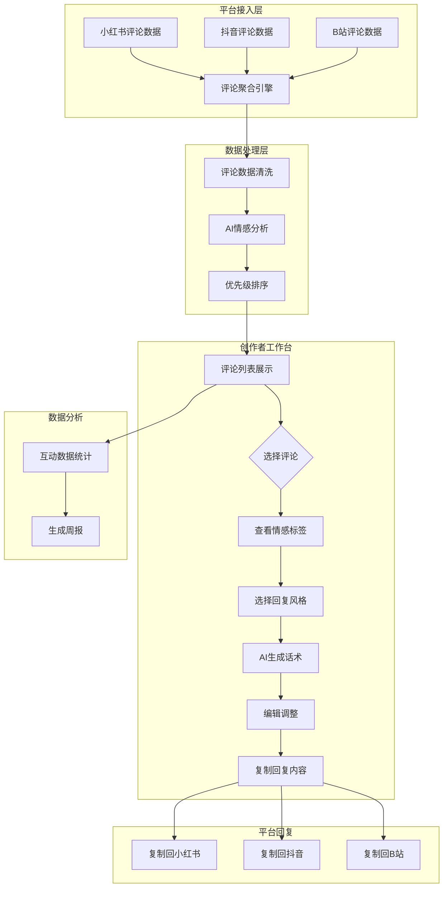
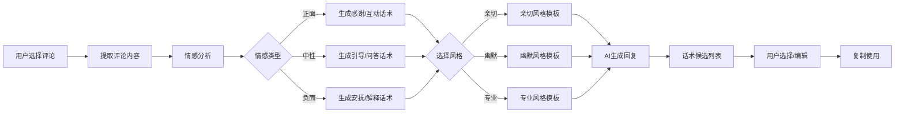
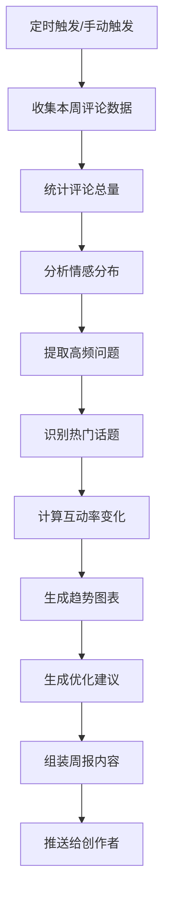
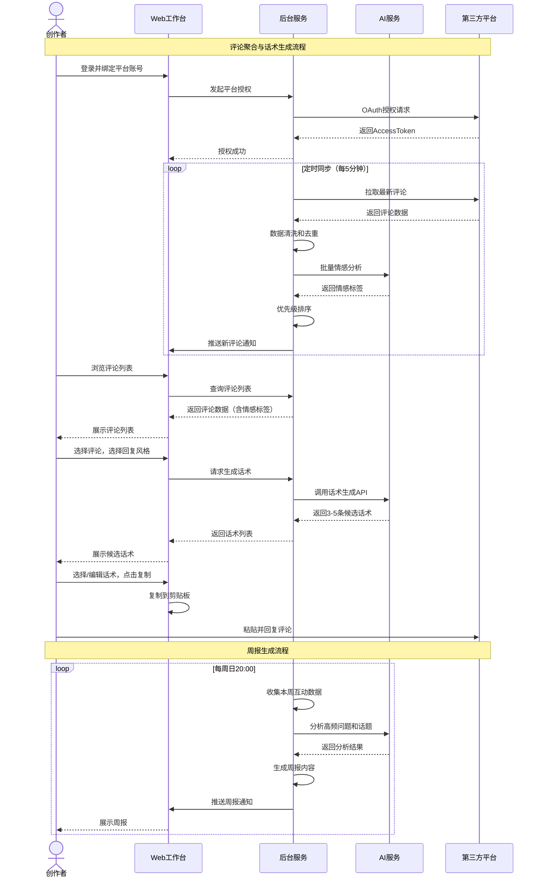
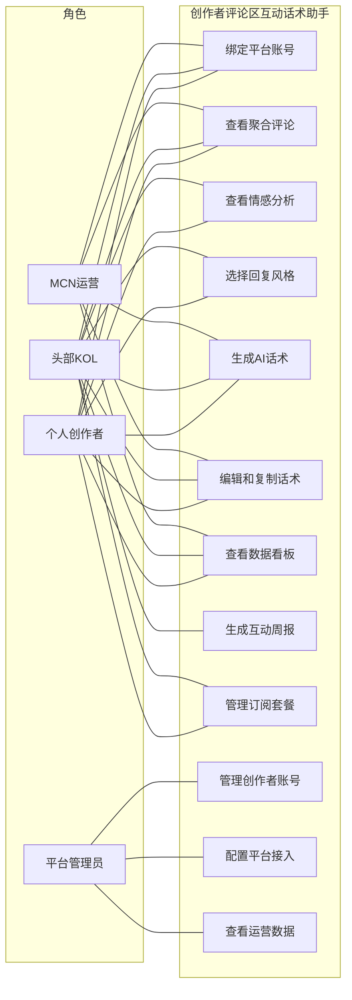
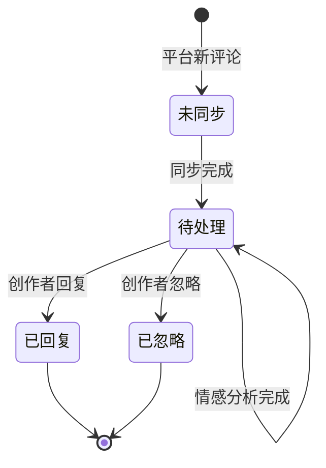
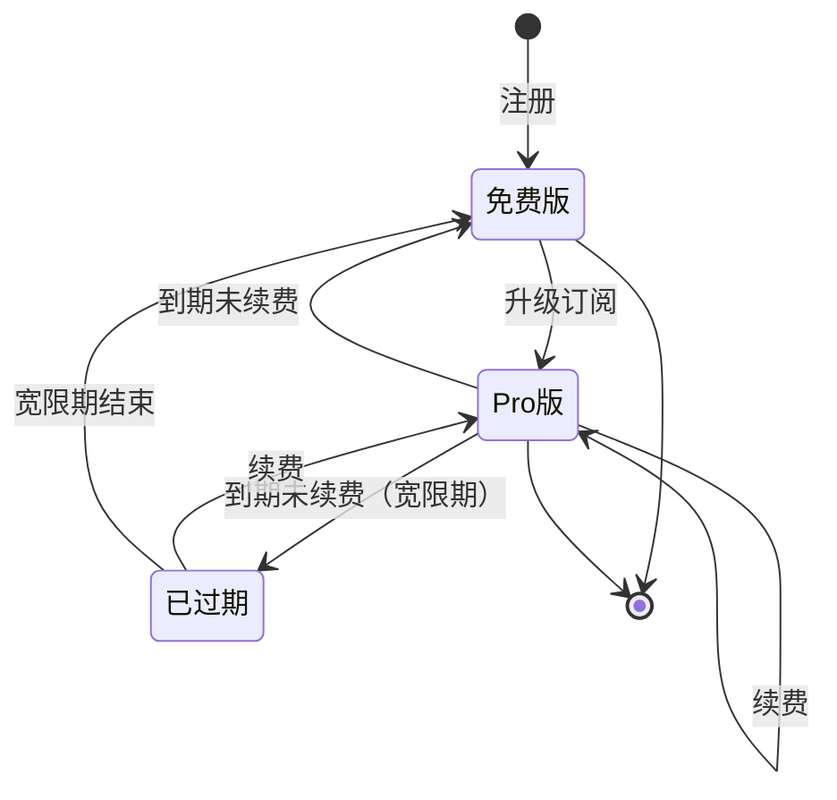
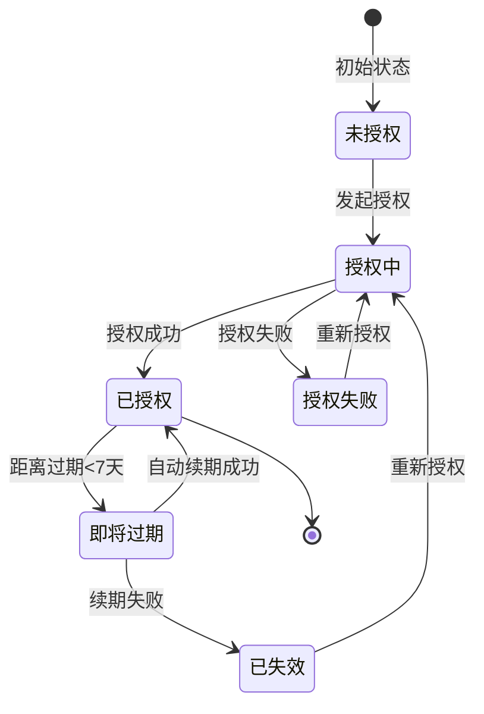

# 创作者评论区互动话术助手 - 用户需求说明书

# 1.需求概述

创作者评论区互动话术助手是面向多平台内容创作者的智能互动管理工具，通过AI技术实现跨平台评论聚合、情感分析、智能回复生成和互动数据分析，帮助创作者高效管理评论区互动，提升粉丝粘性和内容传播效果。

## 1.1 需求介绍

创作者评论区互动话术助手旨在解决多平台创作者面临的三大核心痛点：
1. 评论分散在多个平台，管理效率低下，容易遗漏重要互动
2. 缺乏专业的回复技巧，难以针对不同粉丝情感生成合适的话术
3. 无法系统化分析评论区数据，难以洞察粉丝需求和内容优化方向

### 1.1.1 所属领域

数字内容创作、社交媒体运营、AI辅助工具

### 1.1.2 核心价值

- **对创作者/KOL**：统一管理多平台评论，AI生成高质量回复话术，提升互动效率和质量
- **对MCN机构**：批量管理旗下创作者的评论区互动，降低运营成本，提升整体互动数据
- **对短视频创作者**：快速响应粉丝评论，增强粉丝粘性，促进内容二次传播
- **对图文创作者**：专业化的评论回复提升账号调性，建立品牌影响力

## 1.2 需求目标

### 1.2.1 第一期目标（MVP - 10天）

完成核心评论管理和AI话术生成功能：

- **多平台评论聚合模块**：支持小红书、抖音、B站三大主流平台
- **AI情感分析引擎**：自动识别评论情感倾向（正面/中性/负面）
- **智能话术生成系统**：提供亲切、幽默、专业三种风格回复模板
- **评论优先级排序**：基于情感强度、粉丝等级、互动潜力智能排序
- **互动数据看板**：基础的互动统计和趋势展示

### 1.2.2 第二期目标

扩展平台覆盖和高级分析功能：

- **新增平台支持**：快手、微博、知乎等平台接入
- **高级情感分析**：细分情感类型（兴奋、感动、疑问、吐槽等）
- **个性化话术定制**：基于创作者历史风格学习，生成个性化回复
- **粉丝画像分析**：评论区粉丝特征分析和行为洞察
- **互动周报自动生成**：每周自动生成互动数据报告和优化建议

### 1.2.3 第三期目标

智能化升级和商业化拓展：

- **智能回复推荐**：根据评论上下文自动推荐最佳回复策略
- **批量回复功能**：支持相似评论的批量处理和模板回复
- **评论危机预警**：负面评论激增时自动预警，提供应对建议
- **API开放平台**：为MCN机构提供数据接口和定制化服务
- **团队协作功能**：支持多账号管理和评论分配协作

## 1.3 系统使用角色

1. **个人创作者**：在小红书、抖音、B站等平台运营的独立创作者，粉丝量从几百到几十万不等，需要高效管理评论区互动
2. **头部KOL**：粉丝量百万级别的知名创作者，评论量大，需要AI辅助批量处理和优先级管理
3. **MCN运营人员**：负责管理多个创作者账号的运营团队，需要批量处理和分析多个账号的评论数据
4. **内容运营助理**：协助创作者处理日常评论区互动的助理人员，需要快速获取回复话术参考
5. **平台运营方**：负责系统运营、平台接入管理、用户服务和商业化运营

## 1.4 业务流程图

### 1.4.1 评论聚合与管理核心流程

### 1.4.2 AI话术生成流程

### 1.4.3 互动周报生成流程

# 2.功能原型

| 原型名称 | 原型链接 | 对应端 | 备注 |
| --- | --- | --- | --- |
| 创作者工作台-Web端 | 待提供 | WEB端 | MVP版本 |
| 移动端快捷版 | 待提供 | 小程序端 | 第二期 |
| 运营管理后台 | 待提供 | WEB端 | 第二期 |

# 3.需求清单

## 3.1 创作者工作台-WEB端

| 模块 | 一级功能 | 二级功能 | 功能描述 | 优先级 | 备注 |
| --- | --- | --- | --- | --- | --- |
| 平台接入 | 账号绑定 | 平台授权登录 | 支持小红书、抖音、B站账号OAuth授权绑定 | P0 | |
| | | 多账号管理 | 支持绑定同一平台的多个账号 | P0 | |
| | | 授权状态监控 | 实时监测授权有效性，失效时提醒重新授权 | P0 | |
| 评论聚合 | 评论同步 | 自动同步评论 | 定时自动同步各平台最新评论（每5分钟一次） | P0 | |
| | | 手动刷新 | 支持手动触发立即同步最新评论 | P0 | |
| | 评论列表 | 统一展示 | 按时间倒序展示所有平台评论，标注来源平台 | P0 | |
| | | 平台筛选 | 按平台（小红书/抖音/B站）筛选评论 | P0 | |
| | | 状态筛选 | 按处理状态（未处理/已回复/已忽略）筛选 | P1 | |
| | 评论详情 | 评论信息展示 | 展示评论内容、用户昵称、头像、评论时间、点赞数 | P0 | |
| | | 上下文查看 | 查看该评论所在视频/图文的标题和封面 | P0 | |
| | | 粉丝信息 | 查看评论者的粉丝数、历史互动次数等信息 | P1 | |
| AI分析 | 情感分析 | 自动情感标注 | 自动为每条评论标注情感倾向（正面/中性/负面） | P0 | |
| | | 情感强度评分 | 为情感标注提供强度评分（1-5分） | P1 | |
| | 优先级排序 | 智能排序 | 基于情感强度、粉丝等级、互动潜力综合排序 | P0 | |
| | | 优先级标签 | 为高优先级评论添加醒目颜色标签 | P1 | |
| | 关键词提取 | 自动提取 | 自动提取评论中的关键词和话题标签 | P1 | |
| 话术生成 | 风格选择 | 亲切风格 | 生成友好、温暖的回复话术，适合粉丝互动 | P0 | |
| | | 幽默风格 | 生成轻松、有趣的回复话术，适合活跃气氛 | P0 | |
| | | 专业风格 | 生成严谨、专业的回复话术，适合问题解答 | P0 | |
| | 话术生成 | 单条生成 | 为单条评论生成3-5条候选回复话术 | P0 | |
| | | 话术编辑 | 支持对生成的话术进行二次编辑和调整 | P0 | |
| | | 一键复制 | 一键复制话术内容到剪贴板 | P0 | |
| | 批量生成 | 相似评论合并 | 识别内容相似的评论，支持批量生成回复 | P2 | 第二期 |
| 数据看板 | 基础统计 | 评论总量统计 | 展示今日/本周/本月评论总数和趋势 | P0 | |
| | | 平台分布 | 展示各平台评论数量占比 | P0 | |
| | | 情感分布 | 展示正面/中性/负面评论比例 | P0 | |
| | 互动分析 | 回复率统计 | 统计已回复评论占比和平均回复时长 | P1 | |
| | | 高频词云 | 生成评论高频词云图 | P1 | |
| | 周报功能 | 周报生成 | 自动生成每周互动数据报告 | P1 | 第二期 |
| | | 周报推送 | 通过微信/邮件推送周报到创作者 | P2 | 第二期 |
| 个人中心 | 账号管理 | 基本信息 | 管理创作者基本信息和头像 | P0 | |
| | | 修改密码 | 支持修改登录密码 | P0 | |
| | 订阅管理 | 套餐查看 | 查看当前订阅套餐（免费版/Pro版）和使用量 | P0 | |
| | | 升级续费 | 支持升级到Pro版和续费操作 | P1 | |
| | 消息通知 | 系统通知 | 接收系统公告、功能更新等通知 | P1 | |
| | | 授权提醒 | 接收平台授权即将过期的提醒 | P0 | |

## 3.2 运营管理后台-WEB端

| 模块 | 一级功能 | 二级功能 | 功能描述 | 优先级 | 备注 |
| --- | --- | --- | --- | --- | --- |
| 用户管理 | 创作者管理 | 用户列表 | 查看所有注册创作者信息和账号状态 | P0 | 第二期 |
| | | 用户详情 | 查看创作者详细信息、使用数据和订阅状态 | P0 | 第二期 |
| | | 用户封禁 | 对违规用户进行封禁处理 | P1 | 第二期 |
| 平台接入管理 | 平台配置 | API密钥管理 | 管理各平台API接入密钥和配置 | P0 | 第二期 |
| | | 接入状态监控 | 监控各平台API接入状态和调用量 | P0 | 第二期 |
| 订阅管理 | 套餐管理 | 套餐配置 | 配置免费版和Pro版的权益和限制 | P0 | 第二期 |
| | | 订单管理 | 查看和管理用户订阅订单和支付记录 | P0 | 第二期 |
| | 使用量监控 | 评论额度监控 | 监控用户评论使用量，超限时提醒 | P0 | 第二期 |
| 数据统计 | 运营数据 | 用户增长 | 统计新增用户、活跃用户、付费用户数据 | P1 | 第二期 |
| | | 收入统计 | 统计订阅收入、续费率等财务数据 | P1 | 第二期 |
| 系统管理 | 系统配置 | AI模型配置 | 配置AI情感分析和话术生成模型参数 | P0 | 第二期 |
| | | 系统参数 | 配置系统运行参数和阈值 | P0 | 第二期 |

# 4.非功能需求

## 4.1 使用界面需求

| 需求项 | 详细描述 | 备注 |
| --- | --- | --- |
| 设计风格 | 现代简洁、专业友好，突出效率工具属性，主色调使用科技蓝#2563EB | P0 |
| 布局设计 | 采用左右分栏布局，左侧导航菜单，右侧工作区，信息密度适中 | P0 |
| 响应式设计 | 适配1920x1080、1440x900、1366x768等主流分辨率 | P0 |
| 交互体验 | 评论列表支持虚拟滚动，万条评论不卡顿；话术生成使用骨架屏加载 | P0 |
| 快捷操作 | 支持键盘快捷键（如：上/下选择评论，R生成回复，C复制话术） | P1 |
| 暗色模式 | 支持暗色主题切换，适合长时间使用 | P2 |

## 4.2 软硬件环境需求

| 需求项 | 详细描述 | 备注 |
| --- | --- | --- |
| 客户端环境 | 支持Chrome 90+、Safari 14+、Firefox 88+、Edge 90+等主流浏览器 | P0 |
| 移动端支持 | 第二期支持微信小程序，适配iOS 13+和Android 8+ | P1 |
| 后端环境 | 云服务部署（阿里云/腾讯云），支持容器化部署和自动扩缩容 | P0 |
| AI服务 | 接入大语言模型API（如文心一言、通义千问等），支持私有化部署 | P0 |

## 4.3 性能需求

| 需求项 | 详细描述 | 备注 |
| --- | --- | --- |
| 页面加载 | 首屏加载时间 < 2秒，评论列表加载 < 1秒 | P0 |
| 评论同步 | 单次评论同步（1000条以内）< 5秒 | P0 |
| 情感分析 | 单条评论情感分析响应 < 500ms | P0 |
| 话术生成 | 单条话术生成（3个候选）< 3秒 | P0 |
| 并发能力 | 支持1000用户同时在线操作，100并发评论同步 | P0 |
| 数据容量 | 单用户支持存储10万条评论记录，系统支持100万用户 | P0 |

## 4.4 约束性需求

| 需求项 | 详细描述 | 备注 |
| --- | --- | --- |
| 平台规则遵守 | 必须遵守各平台API调用规范和频率限制，不得违反平台服务条款 | P0 |
| 数据安全 | 用户账号信息加密存储，评论数据传输使用HTTPS加密 | P0 |
| 隐私保护 | 不存储评论者个人敏感信息，仅保存评论内容和必要标识 | P0 |
| 使用限制 | 免费版限制300条评论/月、最多绑定3个平台；Pro版不限评论数、支持全平台 | P0 |
| 内容审核 | AI生成的话术需经过内容安全审核，过滤敏感词和不当内容 | P0 |
| 后台服务 | 是，需要后台服务支撑评论同步、AI分析、数据存储等核心功能 | P0 |
| 第三方依赖 | 依赖小红书、抖音、B站等平台开放API，需处理API变更和限流 | P0 |

# 5.接口需求

## 5.2 软件接口需求

| 模块 | 接口名称 | 输入 | 输出 | 功能描述 |
| --- | --- | --- | --- | --- |
| 平台接入 | 小红书API | OAuth授权Token、评论查询参数 | 评论列表、用户信息 | 获取小红书账号评论数据 |
| | 抖音API | OAuth授权Token、视频ID | 评论列表、视频信息 | 获取抖音视频评论数据 |
| | B站API | OAuth授权Token、视频/专栏ID | 评论列表、内容信息 | 获取B站评论数据 |
| 用户认证 | 用户登录 | 手机号/邮箱、密码 | 用户信息、JWT Token | 用户身份认证和登录 |
| | 第三方登录 | 微信/QQ OAuth Code | 用户信息、Token | 支持微信、QQ快捷登录 |
| | 平台授权回调 | 平台授权Code | 平台AccessToken | 处理各平台OAuth授权回调 |
| 评论服务 | 评论列表查询 | 用户ID、平台、分页参数 | 评论列表、总数 | 查询用户评论列表 |
| | 评论详情查询 | 评论ID | 评论详情、上下文 | 查询单条评论详情 |
| | 评论状态更新 | 评论ID、状态 | 更新结果 | 更新评论处理状态 |
| AI服务 | 情感分析 | 评论内容 | 情感类型、强度评分 | 分析评论情感倾向 |
| | 话术生成 | 评论内容、风格参数 | 候选话术列表（3-5条） | 生成多风格回复话术 |
| | 关键词提取 | 评论内容 | 关键词列表、话题标签 | 提取评论关键词 |
| 数据服务 | 统计数据查询 | 用户ID、时间范围 | 统计数据、趋势数据 | 查询互动统计数据 |
| | 周报生成 | 用户ID、时间范围 | 周报数据、图表数据 | 生成互动周报 |
| 支付服务 | 订阅创建 | 用户ID、套餐类型 | 订单信息、支付参数 | 创建订阅订单 |
| | 支付回调 | 支付结果通知 | 确认响应 | 处理支付结果 |
| | 订阅状态查询 | 用户ID | 订阅信息、使用量 | 查询订阅状态和使用情况 |
| 通知服务 | 站内消息 | 用户ID、消息内容 | 发送结果 | 发送站内通知消息 |
| | 微信推送 | 用户OpenID、消息内容 | 推送结果 | 通过微信公众号推送消息 |
| | 邮件发送 | 邮箱地址、邮件内容 | 发送结果 | 发送邮件通知 |

## 5.4 通讯接口需求

| 模块 | 接口名称 | 输入 | 输出 | 功能描述 |
| --- | --- | --- | --- | --- |
| 平台同步 | 评论数据拉取 | 平台API请求 | 评论JSON数据 | 定时从各平台拉取最新评论数据 |
| | 授权刷新 | Refresh Token | 新AccessToken | 自动刷新平台授权Token |
| WebSocket | 实时通知 | 服务器推送消息 | 客户端确认 | 实时推送新评论到达、授权失效等通知 |
| | 状态同步 | 操作状态 | 同步结果 | 多端操作状态实时同步 |

# 6. 附录

## 流程图

详见1.4章节业务流程图

## 时序图

## （用户与系统交互）用例图

## （系统）状态图

### 评论处理状态图

### 用户订阅状态图

### 平台授权状态图

---
**文档说明**: 本需求说明书基于最新模板规范编写，涵盖所有必填章节和内容，可作为后续产品设计、开发、测试的依据。文档版本：V1.0，创建日期：2026-06-29。