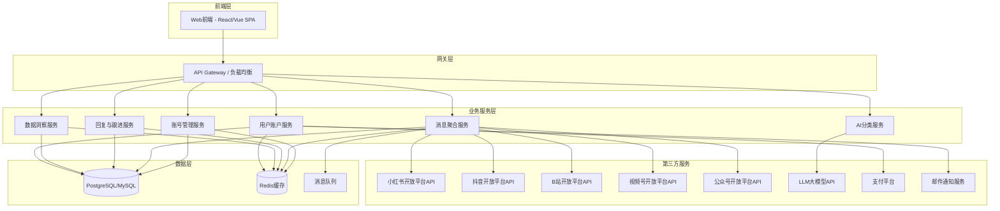
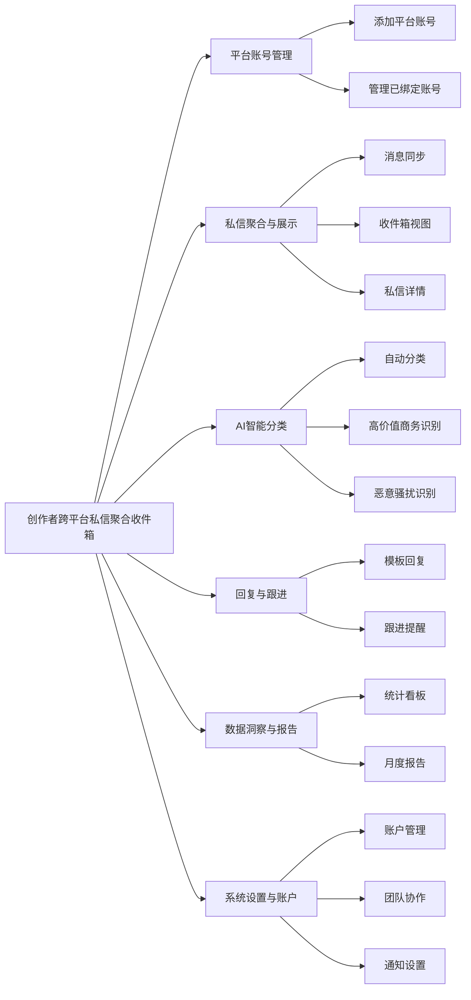
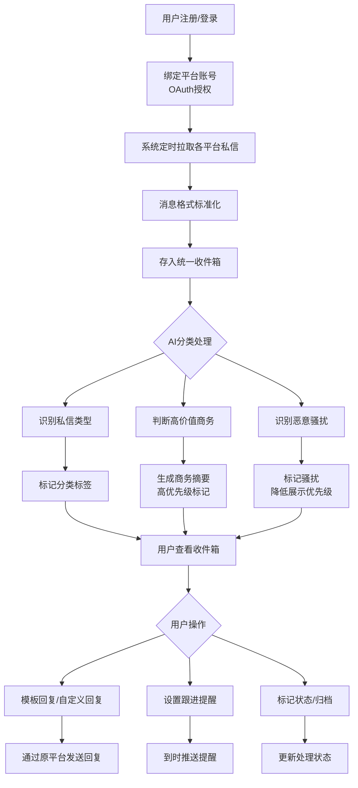
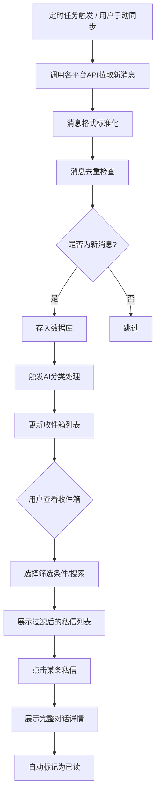
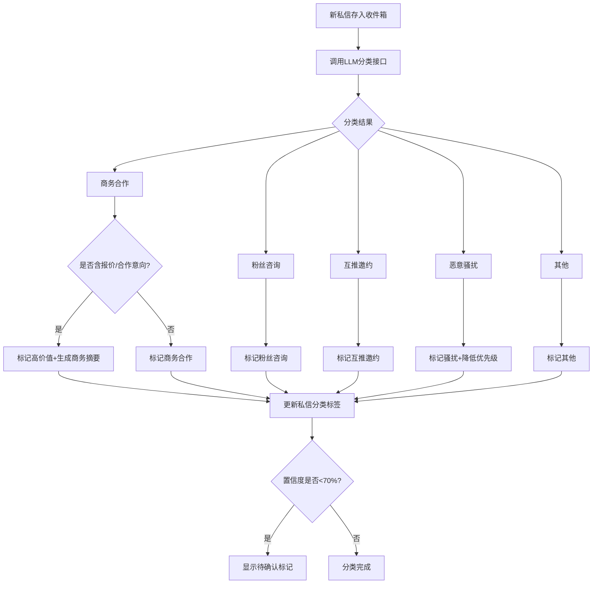
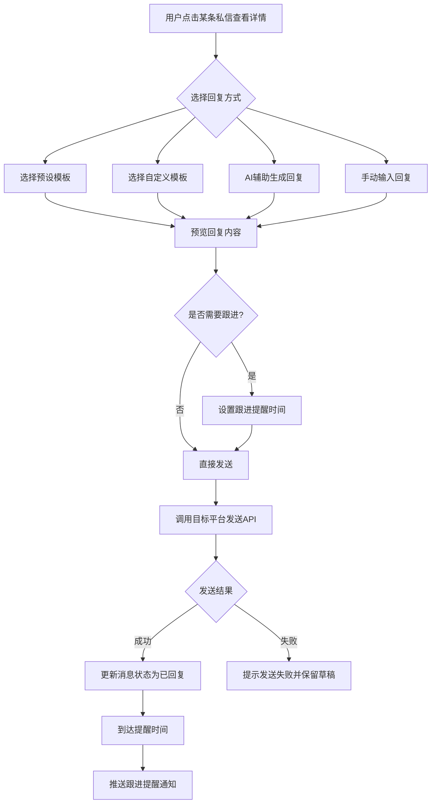
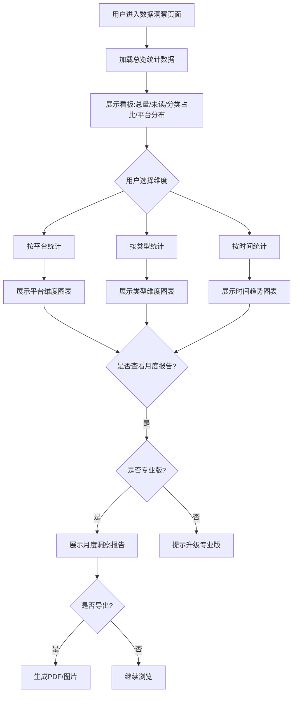
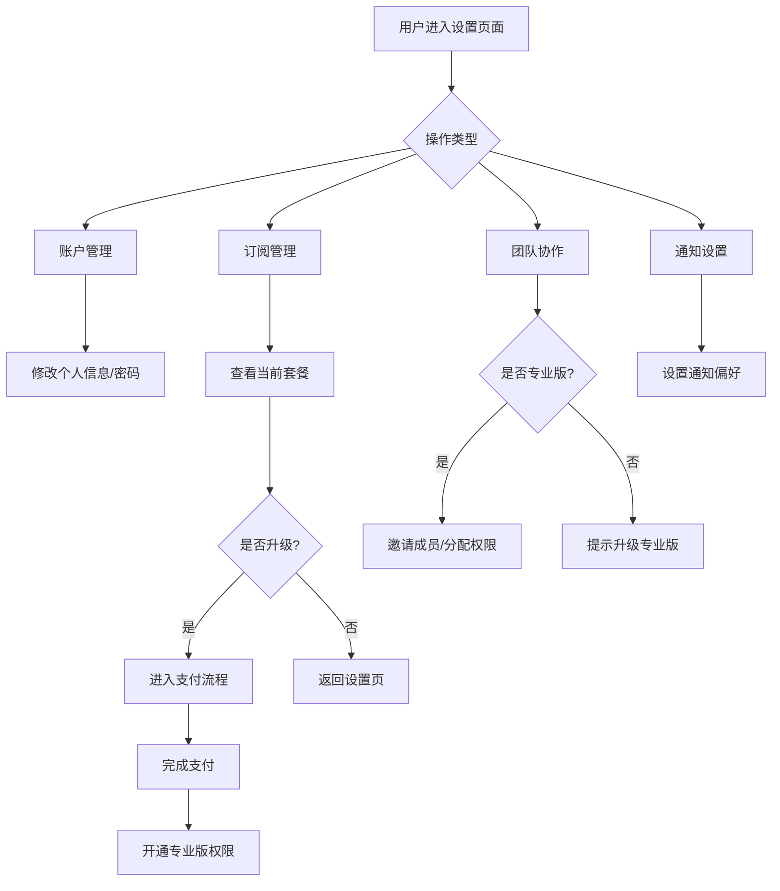
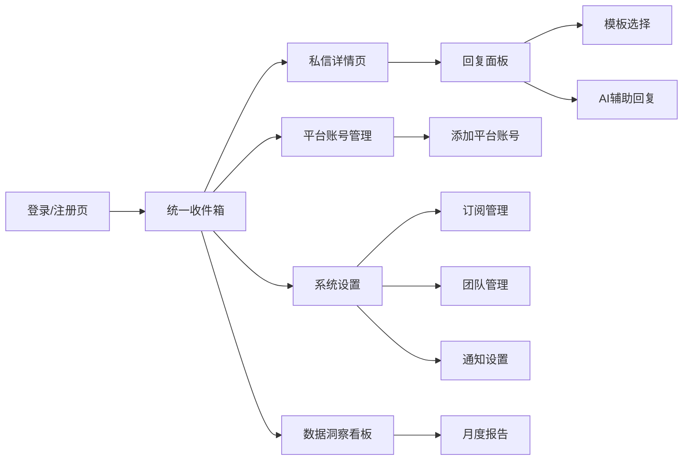
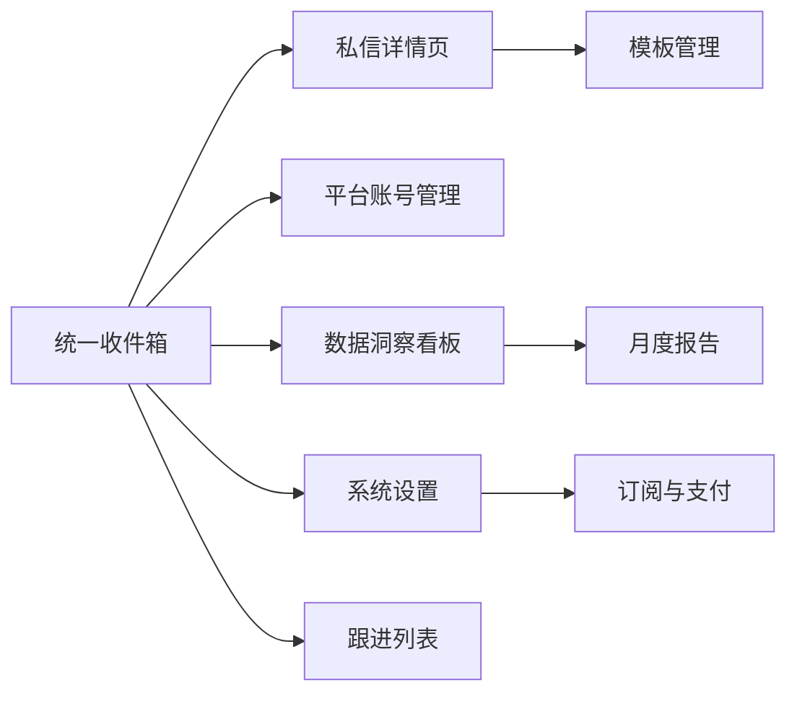

# 创作者跨平台私信聚合收件箱 - 产品需求文档（PRD）

| 版本号 | 变更日期 | 变更内容 | 变更人 | 审核人 |
| --- | --- | --- | --- | --- |
| V1.0 | 2026-06-29 | 初始版本创建 | 产品文档结对写作专家 | 阶段一产品落地页文档总编辑 |

---

# 1 概述

## 1.1 需求背景

随着创作者经济的蓬勃发展，越来越多的内容创作者/KOL同时在小红书、抖音、B站、视频号、公众号等多个主流平台运营。这些创作者每天会收到大量来自粉丝、品牌方、合作方发来的私信消息，其中包含大量商务合作邀约。然而，现有工具大多聚焦于"内容发布管理"和"数据分析"，缺少一款专门面向创作者的"跨平台私信统一管理"工具。

**业务痛点：**
- 创作者需要在多个平台间频繁切换查看私信，效率低下
- 商务合作私信容易被大量粉丝消息淹没，导致错过重要合作机会
- 无法快速识别高价值的商务合作信息，人工筛选成本高
- 缺乏统一的跟进管理机制，容易遗漏待回复的重要消息
- 没有数据维度的私信洞察，无法辅助内容运营决策

**业务价值：**
- 聚合多平台私信到统一收件箱，减少平台切换时间
- AI自动分类和高价值商务识别，帮助创作者快速抓住合作机会
- 模板回复和跟进提醒，提升私信处理效率
- 月度洞察报告，辅助创作者优化内容策略和商务决策

**预期达成目标：**
- MVP阶段在约10天内完成核心功能开发
- 支持至少5大主流内容平台的私信聚合
- AI分类准确率达到85%以上
- 帮助用户减少80%的私信管理时间

## 1.2 名词解释

| **名词** | **说明** |
| --- | --- |
| KOL | Key Opinion Leader，关键意见领袖，指在特定领域拥有大量粉丝和影响力的内容创作者 |
| MCN | Multi-Channel Network，多频道网络，指签约和管理多个创作者的机构 |
| OAuth | 开放授权协议，用于第三方应用安全获取用户在各平台的授权访问权限 |
| LLM | Large Language Model，大语言模型，用于AI私信分类、摘要生成等智能处理 |
| 商务私信 | 来自品牌方或合作方的包含合作意向、报价等内容的私信消息 |
| 高价值标记 | 系统自动识别并标记包含合作意向、报价等关键词的商务私信 |
| 私信洞察报告 | 按月生成的私信数据分析报告，包含高频问题、合作机会趋势等 |
| 平台适配器 | 对接各内容平台API的中间层组件，负责消息的拉取、标准化和发送 |

## 1.3 产品介绍

**创作者跨平台私信聚合收件箱**是一款面向多平台内容创作者、KOL及MCN运营人员的Web端私信管理工具。产品将小红书、抖音、B站、视频号、公众号等多个主流平台的私信统一聚合到一个收件箱中，通过AI自动分类识别私信类型，标记高价值商务私信并生成对接摘要，支持模板回复与跟进提醒，并提供月度"私信洞察报告"辅助运营决策。

### 1.3.1 范围说明

| 项 | 内容 |
| --- | --- |
| 包含功能 | 平台账号管理（OAuth授权绑定）、私信聚合与展示（统一收件箱）、AI智能分类（LLM分类/高价值商务识别/骚扰识别）、回复与跟进（模板回复/AI辅助回复/跟进提醒）、数据洞察与报告（统计看板/月度报告）、系统设置与账户（订阅管理/团队协作/通知设置） |
| 不包含功能 | 内容发布管理、粉丝数据分析、通用IM聚合（微信/QQ等）、短视频数据分析、直播管理、电商平台对接 |

---

# 2 产品设计

## 2.1 系统架构图



## 2.2 业务模块图



## 2.3 主业务流程



## 2.4 功能图/列表

| 功能模块 | 功能名称 | 优先级 | 功能描述 |
| --- | --- | --- | --- |
| 平台账号管理 | 添加平台账号 | P0 | 选择平台类型并通过OAuth授权绑定账号 |
| 平台账号管理 | 管理已绑定账号 | P0 | 查看账号列表、解绑账号、手动同步私信 |
| 私信聚合与展示 | 消息同步 | P0 | 自动拉取/标准化/去重合并各平台私信 |
| 私信聚合与展示 | 收件箱视图 | P0 | 全部私信列表、按分类/平台/时间筛选、搜索、未读标记 |
| 私信聚合与展示 | 私信详情 | P0 | 查看完整对话、平台来源标识、已读/未读管理 |
| AI智能分类 | 自动分类 | P0 | LLM识别私信类型、置信度展示、分类修正 |
| AI智能分类 | 高价值商务识别 | P0 | 商务私信标记、商务对接摘要生成 |
| AI智能分类 | 恶意骚扰识别 | P1 | 骚扰消息自动标记、可设置自动隐藏 |
| 回复与跟进 | 模板回复 | P0 | 预设模板管理、自定义模板、一键模板回复 |
| 回复与跟进 | AI辅助回复 | P1 | 基于上下文AI自动生成建议回复 |
| 回复与跟进 | 跟进提醒 | P1 | 设置提醒、通知推送、跟进状态管理 |
| 数据洞察与报告 | 统计看板 | P1 | 总览统计、按平台/类型/时间统计 |
| 数据洞察与报告 | 月度报告 | P2 | 自动生成月度洞察报告、高频问题提取、合作趋势分析 |
| 系统设置与账户 | 账户管理 | P0 | 注册登录、订阅套餐管理、用量查看 |
| 系统设置与账户 | 团队协作 | P2 | 邀请团队成员、私信分配 |
| 系统设置与账户 | 通知设置 | P1 | 通知偏好、重要消息即时提醒 |

## 2.5 你的产品有哪些端

| 序号 | 端名称 | 端类型 | 目标用户 | 说明 |
| --- | --- | --- | --- | --- |
| 1 | 创作者私信收件箱 Web端 | WEB端 | 个人创作者/KOL、MCN运营人员、个人IP运营者 | MVP阶段以Web端为主，用户在桌面浏览器中使用统一收件箱管理多平台私信 |

---

# 3 产品功能

## 3.1 WEB端功能

### 3.1.1 平台账号管理

**功能描述：** 用户通过OAuth授权将各内容平台（小红书、抖音、B站、视频号、公众号）的账号绑定到系统中，实现私信数据的读取和回复发送能力。用户可以查看已绑定账号列表及其授权状态，支持解绑和手动同步。

**优先级与依赖说明：**

| 项 | 内容 |
| --- | --- |
| 优先级 | P0 |
| 依赖需求 | 无（首屏基础功能） |
| 前置条件 | 用户已注册登录 |

**功能详情：**

| 一级功能 | 二级功能 | 功能描述 | 业务规则 |
| --- | --- | --- | --- |
| 添加平台账号 | 选择平台类型 | 用户从支持的平台列表中选择要绑定的平台 | 免费版最多绑定3个平台，专业版不限 |
| 添加平台账号 | 平台授权登录 | 引导用户通过OAuth或Cookie方式授权 | 各平台授权方式不同，需分别适配 |
| 添加平台账号 | 授权状态检测 | 实时检测各平台授权是否有效 | 授权过期时提醒用户重新授权 |
| 管理已绑定账号 | 查看账号列表 | 展示已绑定的所有平台账号及状态 | 状态分为：正常、过期、异常 |
| 管理已绑定账号 | 解绑平台账号 | 解除与某个平台账号的绑定 | 解绑后私信数据保留但不再同步新消息 |
| 管理已绑定账号 | 手动同步私信 | 手动触发从某个平台同步最新私信 | 作为自动同步间隔外的补充手段 |

### 3.1.2 平台账号管理—详细流程

```mermaid
flowchart TD
    A[用户点击"添加平台账号"] --> B[弹出平台选择面板]
    B --> C[选择目标平台]
    C --> D{检查免费版配额}
    D -->|未超出| E[跳转平台OAuth授权页]
    D -->|已超出| F[提示升级专业版]
    E --> G[用户完成授权]
    G --> H[系统获取Access Token]
    H --> I[保存账号绑定关系]
    I --> J[触发首次私信同步]
    J --> K[显示绑定成功提示]
    F --> L[返回账号列表]
    K --> L
```

**业务规则说明：**
1. 免费版用户最多绑定3个平台账号，达到上限时引导升级专业版
2. 各平台OAuth授权有效期不同（通常7-30天），系统需定时检测并提醒用户续期
3. 同一平台支持绑定多个账号（如多个小红书号），每个账号独立管理
4. 解绑账号后，历史私信数据保留但不再同步新消息

### 3.1.3 平台账号管理—主要原型

[🔗 平台账号管理原型](assets/prototypes/web/account-management-widget.html)

**验收标准说明：**
- [ ] 正常流程：用户可成功选择平台并完成OAuth授权绑定，绑定后账号出现在列表中且状态为"正常"
- [ ] 异常流程：授权过期时账号状态变为"过期"，显示重新授权按钮；免费版超出3个平台时显示升级提示
- [ ] 性能要求：平台选择面板打开时间 ≤ 500ms，OAuth回调处理时间 ≤ 2s

### 3.1.4 私信聚合与展示

**功能描述：** 系统定时从各已授权平台拉取新私信消息，将不同平台的消息统一为标准格式后存入收件箱。用户可以通过多种视图（全部列表、按分类/平台/时间筛选）浏览私信，支持关键词搜索和未读标记管理。

**优先级与依赖说明：**

| 项 | 内容 |
| --- | --- |
| 优先级 | P0 |
| 依赖需求 | 平台账号管理（3.1.1） |
| 前置条件 | 至少绑定一个平台账号 |

**功能详情：**

| 一级功能 | 二级功能 | 功能描述 | 业务规则 |
| --- | --- | --- | --- |
| 消息同步 | 自动拉取私信 | 系统定时从各已授权平台拉取新私信 | 拉取频率：每5-15分钟 |
| 消息同步 | 消息格式标准化 | 不同平台私信统一为标准格式 | 标准字段：发送者、内容、时间、平台来源 |
| 消息同步 | 消息去重与合并 | 同一发送者的连续消息合并展示 | 5分钟内同一发送者的多条消息合并 |
| 收件箱视图 | 全部私信列表 | 按时间倒序展示所有私信 | 显示头像、昵称、平台图标、摘要、时间 |
| 收件箱视图 | 按分类筛选 | 按AI分类结果筛选 | 商务合作/粉丝咨询/互推邀约/恶意骚扰/其他 |
| 收件箱视图 | 按平台筛选 | 按来源平台筛选 | 支持多平台组合筛选 |
| 收件箱视图 | 按时间筛选 | 按时间范围筛选 | 今天/近7天/近30天/自定义 |
| 收件箱视图 | 搜索私信 | 关键词搜索私信内容和发送者 | 支持模糊匹配 |
| 收件箱视图 | 未读标记 | 显示未读数量 | 按分类/平台分别显示未读数 |
| 私信详情 | 查看完整对话 | 展示与发送者的完整对话历史 | 时间线形式展示 |
| 私信详情 | 平台来源标识 | 标识每条消息的来源平台 | 每条消息旁显示平台图标 |
| 私信详情 | 已读/未读管理 | 标记私信已读/未读 | 支持批量标记 |

### 3.1.5 私信聚合与展示—详细流程



**业务规则说明：**
1. 自动同步频率默认10分钟一次，用户可手动触发即时同步
2. 同一发送者5分钟内的连续消息自动合并为一条展示，避免碎片化
3. 收件箱默认按时间倒序排列，未读消息置顶显示
4. 商务类高价值私信始终置顶展示，优先级最高
5. 搜索结果高亮匹配关键词

### 3.1.6 私信聚合与展示—主要原型

[🔗 统一收件箱原型](assets/prototypes/web/unified-inbox-widget.html)

**验收标准说明：**
- [ ] 正常流程：私信列表正确展示各平台消息，筛选/搜索功能正常，点击可查看完整对话
- [ ] 异常流程：无绑定平台时显示引导绑定提示；网络异常时显示同步失败状态
- [ ] 性能要求：收件箱首页加载时间 ≤ 2秒；列表滚动流畅，支持1000+条私信

### 3.1.7 AI智能分类

**功能描述：** 基于大语言模型（LLM）对每条新私信进行自动分类，识别私信类型（商务合作、粉丝咨询、互推邀约、恶意骚扰、其他），自动标记高价值商务私信并生成对接摘要，识别恶意骚扰消息降低干扰。

**优先级与依赖说明：**

| 项 | 内容 |
| --- | --- |
| 优先级 | P0 |
| 依赖需求 | 私信聚合与展示（3.1.4） |
| 前置条件 | 有新私信进入系统 |

**功能详情：**

| 一级功能 | 二级功能 | 功能描述 | 业务规则 |
| --- | --- | --- | --- |
| 自动分类 | 私信类型识别 | LLM识别私信分类 | 分类：商务合作/粉丝咨询/互推邀约/恶意骚扰/其他 |
| 自动分类 | 分类置信度展示 | 展示AI分类置信度 | 低置信度（<70%）提醒用户确认 |
| 自动分类 | 分类结果修正 | 用户可手动修正分类 | 修正结果反馈至模型优化 |
| 高价值商务识别 | 商务合作标记 | 自动标记含报价/合作意向的私信 | 标记为"高价值"并置顶展示 |
| 高价值商务识别 | 商务摘要生成 | 生成结构化商务摘要 | 摘要含：品牌、类型、报价、诉求、建议回复方向 |
| 恶意骚扰识别 | 骚扰消息标记 | 自动识别恶意骚扰/垃圾广告 | 可设置自动隐藏此类消息 |
| 恶意骚扰识别 | 批量分类处理 | 批量修改分类/标记状态 | 提升处理效率 |

### 3.1.8 AI智能分类—详细流程



**业务规则说明：**
1. 每条新私信在存入后3秒内完成AI分类处理
2. 商务类私信中包含品牌名称、报价数字、合作意向关键词的自动标记为"高价值"
3. 恶意骚扰类消息默认折叠显示，用户可设置自动隐藏
4. 低置信度分类（<70%）显示"待确认"标签，提醒用户手动确认
5. 用户修正分类后，修正数据定期反馈至模型进行优化

### 3.1.9 AI智能分类—主要原型

[🔗 AI智能分类原型](assets/prototypes/web/ai-classification-widget.html)

**验收标准说明：**
- [ ] 正常流程：新私信自动显示分类标签，高价值商务私信显示特殊标记和摘要
- [ ] 异常流程：LLM接口超时/失败时消息标记为"待分类"，支持手动重试
- [ ] 性能要求：单条私信AI分类处理时间 ≤ 3秒

### 3.1.10 回复与跟进

**功能描述：** 提供模板回复功能，支持系统预设模板和用户自定义模板，用户可一键选择模板回复或AI辅助生成回复。同时提供跟进提醒功能，用户可对需要后续处理的私信设置提醒时间和跟进状态。

**优先级与依赖说明：**

| 项 | 内容 |
| --- | --- |
| 优先级 | P0 |
| 依赖需求 | 私信聚合与展示（3.1.4） |
| 前置条件 | 有私信需要回复 |

**功能详情：**

| 一级功能 | 二级功能 | 功能描述 | 业务规则 |
| --- | --- | --- | --- |
| 模板回复 | 预设模板管理 | 系统预设常见场景回复模板 | 预设：商务合作感谢、报价咨询回复、合作婉拒、粉丝互动等 |
| 模板回复 | 自定义模板 | 用户创建/编辑/删除模板 | 专业版功能 |
| 模板回复 | AI辅助生成回复 | AI基于上下文生成建议回复 | 专业版功能 |
| 模板回复 | 一键模板回复 | 一键选择模板发送至原平台 | 发送后在原平台同步可见 |
| 跟进提醒 | 设置跟进提醒 | 对私信设置提醒时间和内容 | 支持自定义提醒时间 |
| 跟进提醒 | 提醒通知 | 到时推送提醒通知 | 通过站内通知/邮件/浏览器推送 |
| 跟进提醒 | 跟进状态管理 | 标记处理状态 | 状态：待处理/处理中/已回复/已关闭/已跟进 |
| 跟进提醒 | 跟进列表 | 展示待跟进和已设提醒的私信 | 按提醒时间排序 |

### 3.1.11 回复与跟进—详细流程



**业务规则说明：**
1. 预设模板对所有用户可用，自定义模板和AI辅助回复为专业版功能
2. 回复通过对应平台的API发送，发送后在原平台同步可见
3. 发送失败时自动保存草稿，用户可重试
4. 跟进提醒支持多种通知方式，高价值商务私信默认开启即时提醒
5. 跟进状态流转：待处理 → 处理中 → 已回复 → 已跟进 → 已归档

### 3.1.12 回复与跟进—主要原型

[🔗 回复与跟进原型](assets/prototypes/web/reply-followup-widget.html)

**验收标准说明：**
- [ ] 正常流程：可选择模板一键回复，AI生成回复可编辑后发送，跟进提醒按时触发
- [ ] 异常流程：平台API发送失败时显示失败提示并保留草稿
- [ ] 性能要求：模板选择到发送 ≤ 3次点击；AI生成回复等待时间 ≤ 5秒

### 3.1.13 数据洞察与报告

**功能描述：** 提供多维度的私信数据统计看板，包含总览统计、按平台/类型/时间统计。专业版用户可自动生成月度"私信洞察报告"，包含高频问题TOP10、合作机会趋势、各平台表现对比，支持导出PDF。

**优先级与依赖说明：**

| 项 | 内容 |
| --- | --- |
| 优先级 | P1（统计看板）/ P2（月度报告） |
| 依赖需求 | 私信聚合与展示（3.1.4）、AI智能分类（3.1.7） |
| 前置条件 | 系统已有私信数据 |

**功能详情：**

| 一级功能 | 二级功能 | 功能描述 | 业务规则 |
| --- | --- | --- | --- |
| 统计看板 | 总览统计 | 私信总量、未读数、分类占比、平台消息量 | 实时更新 |
| 统计看板 | 按平台统计 | 各平台私信数量、回复率、平均响应时间 | 饼图+列表展示 |
| 统计看板 | 按类型统计 | 各分类私信数量和趋势 | 柱状图+趋势线 |
| 统计看板 | 按时间统计 | 日/周/月私信量变化趋势 | 折线图展示 |
| 月度报告 | 自动生成 | 每月自动生成洞察报告 | 专业版功能 |
| 月度报告 | 高频问题提取 | AI提取粉丝/合作方最常问的问题 | TOP10列表 |
| 月度报告 | 合作机会趋势 | 商务私信数量变化和品牌分布 | 趋势图+品牌排名 |
| 月度报告 | 报告导出 | 导出PDF或图片格式 | 专业版功能 |

### 3.1.14 数据洞察与报告—详细流程



**业务规则说明：**
1. 统计看板数据对所有用户可用，月度报告为专业版功能
2. 统计数据每5分钟刷新一次，支持手动刷新
3. 月度报告在每月1日自动生成上月报告
4. 高频问题通过AI分析私信内容提取，展示TOP10
5. 报告导出支持PDF和图片两种格式

### 3.1.15 数据洞察与报告—主要原型

[🔗 数据洞察看板原型](assets/prototypes/web/data-insights-widget.html)

**验收标准说明：**
- [ ] 正常流程：看板正确展示各维度统计数据，图表可交互切换，月度报告可查看和导出
- [ ] 异常流程：无数据时显示空状态引导；免费版用户点击月度报告时显示升级提示
- [ ] 性能要求：看板数据加载时间 ≤ 2秒；图表渲染时间 ≤ 1秒

### 3.1.16 系统设置与账户

**功能描述：** 提供用户注册登录、订阅套餐管理、团队协作管理和通知偏好设置等基础功能。

**优先级与依赖说明：**

| 项 | 内容 |
| --- | --- |
| 优先级 | P0（账户管理）/ P1（通知设置）/ P2（团队协作） |
| 依赖需求 | 无（基础功能） |
| 前置条件 | 无 |

**功能详情：**

| 一级功能 | 二级功能 | 功能描述 | 业务规则 |
| --- | --- | --- | --- |
| 账户管理 | 用户注册/登录 | 邮箱/手机号注册登录 | 支持第三方登录 |
| 账户管理 | 订阅套餐管理 | 查看/升级/续费/降级套餐 | 免费版：3平台+50条/日；专业版：¥49/月不限 |
| 账户管理 | 用量查看 | 查看当前周期用量 | 免费版关注是否超限 |
| 团队协作 | 邀请团队成员 | 邀请成员分配权限 | 专业版功能 |
| 团队协作 | 私信分配 | 将私信分配给成员处理 | 专业版功能 |
| 通知设置 | 通知偏好 | 设置通知方式 | 站内通知/邮件/浏览器推送 |
| 通知设置 | 重要消息提醒 | 高价值商务私信即时推送 | 默认开启 |

### 3.1.17 系统设置与账户—详细流程



**业务规则说明：**
1. 新用户注册后自动开通免费版
2. 免费版升级为专业版需通过支付平台完成¥49/月订阅
3. 团队协作功能仅对专业版用户开放
4. 免费版用户达到用量上限时弹窗引导升级
5. 高价值商务私信的即时提醒默认开启，用户可关闭

### 3.1.18 系统设置与账户—主要原型

[🔗 系统设置原型](assets/prototypes/web/settings-widget.html)

**验收标准说明：**
- [ ] 正常流程：用户可完成注册登录、套餐管理、通知设置等基础操作
- [ ] 异常流程：免费版用户访问专业版功能时显示升级引导
- [ ] 性能要求：设置页面加载时间 ≤ 1秒

---

# 4 产品原型

## 4.1 页面跳转逻辑图



## 4.2 全站点原型设计

### 4.2.1 创作者私信收件箱 Web端

**页面清单：**

| 序号 | 页面名称 | 所属模块 | 页面描述 | 关键元素 |
| --- | --- | --- | --- | --- |
| 1 | 统一收件箱 | 私信聚合与展示 | 核心页面，展示所有平台聚合后的私信列表 | 左侧分类导航、中间私信列表、右侧预览面板、顶部搜索栏、筛选器 |
| 2 | 私信详情页 | 私信聚合与展示 | 展示与某发送者的完整对话历史 | 对话时间线、平台来源标识、AI分类标签、商务摘要卡片、回复输入框 |
| 3 | 平台账号管理 | 平台账号管理 | 管理已绑定的平台账号 | 账号列表卡片、授权状态指示器、添加账号按钮、同步状态 |
| 4 | 数据洞察看板 | 数据洞察与报告 | 多维度私信数据统计 | 总览指标卡片、平台分布饼图、类型分布柱状图、时间趋势折线图 |
| 5 | 月度报告 | 数据洞察与报告 | 月度私信洞察报告详情 | 高频问题TOP10、合作趋势图、品牌排名、导出按钮 |
| 6 | 模板管理 | 回复与跟进 | 管理回复模板 | 模板列表、预设/自定义分类、新建/编辑模板表单 |
| 7 | 跟进列表 | 回复与跟进 | 展示待跟进的私信 | 跟进列表、提醒时间、状态标签、快速操作按钮 |
| 8 | 系统设置 | 系统设置与账户 | 账户与偏好设置 | 订阅信息、用量统计、通知偏好、团队成员管理 |
| 9 | 订阅与支付 | 系统设置与账户 | 套餐升级与支付 | 套餐对比卡片、支付表单、支付结果 |

**交互说明：**
- 页面跳转关系：


- 特殊交互：
  1. 收件箱采用三栏布局：左侧分类导航栏（可折叠）、中间私信列表、右侧对话预览面板；点击列表项右侧面板实时更新
  2. 高价值商务私信在列表中以金色左边框+星标图标突出显示
  3. 分类标签采用彩色标签形式，不同分类对应不同颜色（商务=蓝色、粉丝=绿色、互推=紫色、骚扰=红色）
  4. AI分类置信度低于70%时，标签旁显示"待确认"图标，点击可手动修正
  5. 回复面板支持Tab切换：模板回复 / AI辅助回复 / 自定义输入
  6. 深色/浅色模式切换，跟随系统主题或手动选择
  7. 空数据态：无绑定时显示引导绑定动画；无私信时显示"一切处理完毕"的空状态插画
  8. 加载态：列表数据加载时显示骨架屏（Skeleton）
  9. 错误态：同步失败时顶部显示Toast提示，支持手动重试

**产品原型：**

[🖥️ 打开创作者私信收件箱Web端全站点原型](assets/prototypes/web-prototype.html)

---

# 5 数据需求

## 5.1 数据使用规格

| **字段** | **是否必填** | **描述** | **数据类型** |
| --- | --- | --- | --- |
| message_id | 是 | 消息唯一标识 | 字符串(UUID) |
| platform | 是 | 消息来源平台（xiaohongshu/douyin/bilibili/wechat_channel/wechat_mp） | 字符串(枚举) |
| platform_msg_id | 是 | 原平台消息ID | 字符串 |
| sender_id | 是 | 发送者在原平台的用户ID | 字符串 |
| sender_name | 是 | 发送者昵称 | 字符串 |
| sender_avatar | 否 | 发送者头像URL | 字符串(URL) |
| content | 是 | 消息文本内容 | 字符串 |
| content_type | 是 | 消息类型（text/image/video/link） | 字符串(枚举) |
| sent_at | 是 | 消息发送时间 | 时间戳(ISO8601) |
| synced_at | 是 | 系统同步时间 | 时间戳(ISO8601) |
| category | 是 | AI分类结果（business/fan/collab/harassment/other） | 字符串(枚举) |
| confidence | 否 | AI分类置信度 | 浮点数(0-1) |
| is_high_value | 是 | 是否为高价值商务私信 | 布尔 |
| business_summary | 否 | 商务对接摘要（JSON结构） | JSON |
| status | 是 | 消息状态（unread/read/replied/following/followed/archived） | 字符串(枚举) |
| account_id | 是 | 绑定的平台账号ID | 字符串(UUID) |
| user_id | 是 | 所属系统用户ID | 字符串(UUID) |

## 5.2 统计数据

1. 统计各平台每日/每周/每月私信数量，按平台维度分组（P0）
2. 统计各分类私信数量和占比，按类型维度分组（P0）
3. 统计各平台的回复率和平均响应时间（P1）
4. 统计高价值商务私信数量趋势和合作品牌分布（P1）
5. 统计用户私信处理效率（日均处理量、平均响应时间）（P2）

## 5.3 埋点需求

| 页面 | 事件 | 采集字段 | 说明 |
| --- | --- | --- | --- |
| 统一收件箱 | 筛选操作 | 筛选类型、筛选值、当前分类 | 分析用户常用筛选维度 |
| 统一收件箱 | 查看私信详情 | 私信ID、分类、平台来源 | 分析用户关注的私信类型 |
| 私信详情 | 使用模板回复 | 模板ID、模板类型（预设/自定义） | 分析模板使用频率 |
| 私信详情 | AI辅助回复 | 是否采纳、编辑量 | 优化AI回复质量 |
| 私信详情 | 设置跟进提醒 | 提醒时间、私信分类 | 分析跟进行为模式 |
| 数据看板 | 查看报告 | 报告月份、查看时长 | 分析报告使用情况 |
| 平台账号 | 添加/解绑账号 | 平台类型、操作类型 | 分析平台使用偏好 |

---

# 6 非功能需求

## 6.1 性能需求

**6.1.1 延迟**

| 编号 | 项目 | 最大延迟 | 平均延迟 | 优先级 | 备注 |
| --- | --- | --- | --- | --- | --- |
| 0001 | 收件箱首页加载 | <2秒 | <1秒 | 高 | 首屏加载 |
| 0002 | 私信详情页加载 | <1秒 | <0.5秒 | 高 | |
| 0003 | AI单条私信分类 | <3秒 | <1.5秒 | 高 | LLM处理时间 |
| 0004 | 模板回复发送 | <2秒 | <1秒 | 高 | 含平台API调用 |
| 0005 | 统计数据加载 | <2秒 | <1秒 | 中 | |
| 0006 | 搜索结果返回 | <1秒 | <0.5秒 | 中 | |

**6.1.2 吞吐量**

| 编号 | 项 | 吞吐量 | 备注 |
| --- | --- | --- | --- |
| 0001 | 私信同步拉取 | 每分钟500条 | 全平台合计 |
| 0002 | AI分类处理 | 每分钟200条 | 并发处理 |
| 0003 | 回复消息发送 | 每分钟100条 | 含平台API调用 |

**6.1.3 容量**

| 编号 | 项 | 容量 | 备注 |
| --- | --- | --- | --- |
| 0001 | 系统注册用户数 | ≤100,000 | MVP阶段 |
| 0002 | 同时在线用户数 | ≥500 | |
| 0003 | 单用户私信存储量 | 12个月 | 至少保留12个月 |
| 0004 | 单用户绑定平台数 | 免费版≤3，专业版不限 | |

## 6.2 安全需求

| 编号 | 项（系统数据 / 处理过程） |
| --- | --- |
| 0001 | 用户私信内容必须加密存储（AES-256），传输过程使用HTTPS/TLS 1.2+ |
| 0002 | 各平台OAuth Token加密存储，不得明文保存 |
| 0003 | 用户私信数据不得用于模型训练或第三方共享 |
| 0004 | 系统必须防止任何非授权用户访问其他用户的私信数据 |
| 0005 | 团队协作中成员只能查看被分配的私信内容 |
| 0006 | 用户注销后30天内彻底删除所有私信数据 |

## 6.3 可靠性

| 编号 | 项 | 值 |
| --- | --- | --- |
| 0001 | 系统月度可用性 | ≥99.5% |
| 0002 | 平均正常运行时间 | ≥180天 |
| 0003 | 平均故障恢复时间 | ≤30分钟 |

## 6.4 可连续性

| 编号 | 项 |
| --- | --- |
| Modi.1 | 系统需要7×24小时全天候运行 |
| Modi.2 | 平台API不可用时，系统应缓存待发送消息并在API恢复后自动重发 |
| Modi.3 | LLM服务不可用时，私信正常入库但标记为"待分类"，待服务恢复后补分类 |

## 6.5 可恢复性

| 编号 | 项 |
| --- | --- |
| Modi.1 | 数据库每日全量备份，保留30天；每小时增量备份 |
| Modi.2 | 重大故障需在1-3小时内恢复服务可用性 |
| Modi.3 | 24-72小时内恢复历史数据 |

## 6.6 兼容性

| 编号 | 要求 | 备注 |
| --- | --- | --- |
| 0001 | 兼容主流浏览器：Chrome ≥90, Firefox ≥88, Safari ≥14, Edge ≥90 | |
| 0002 | 最低支持分辨率：1280×720 | |
| 0003 | 推荐分辨率：1920×1080 | |

## 6.7 易用性

| 编号 | 要求 | 备注 |
| --- | --- | --- |
| 0001 | 核心操作（查看/回复/标记）在3次点击内完成 | |
| 0002 | 普通用户无需培训即可使用核心功能 | |
| 0003 | 支持深色/浅色模式切换 | |
| 0004 | 信息密度适中，类IM收件箱体验 | |

---

# 7 总结

## 7.1 上线计划

| 阶段 | 时间 | 内容 | 负责人 |
| --- | --- | --- | --- |
| 开发阶段 | 2026-07-01 ~ 2026-07-07 | 核心功能开发（消息聚合+AI分类+收件箱UI） | 开发团队 |
| 开发阶段 | 2026-07-08 ~ 2026-07-10 | 模板回复+统计看板+系统设置 | 开发团队 |
| 测试阶段 | 2026-07-11 ~ 2026-07-13 | 功能测试、性能测试、安全测试 | 测试团队 |
| 灰度阶段 | 2026-07-14 ~ 2026-07-16 | 灰度10%用户，验证稳定性 | 运营团队 |
| 全量上线 | 2026-07-17 | 全量开放给所有用户 | 全团队 |

## 7.2 后续迭代规划

- V1.1：支持更多平台（快手、微博等）；AI回复质量优化；移动端H5适配
- V1.2：私信自动回复规则引擎；粉丝画像分析；MCN多创作者管理增强
- V1.3：开放API接口，支持第三方工具集成；私信数据导出

## 7.3 参考文档

- [创作者跨平台私信聚合收件箱 - 需求文档](./需求文档.md)
- [创作者跨平台私信聚合收件箱 - Web端全站点原型](assets/prototypes/web-prototype.html)
- 各平台开放平台API文档（小红书/抖音/B站/视频号/公众号）
