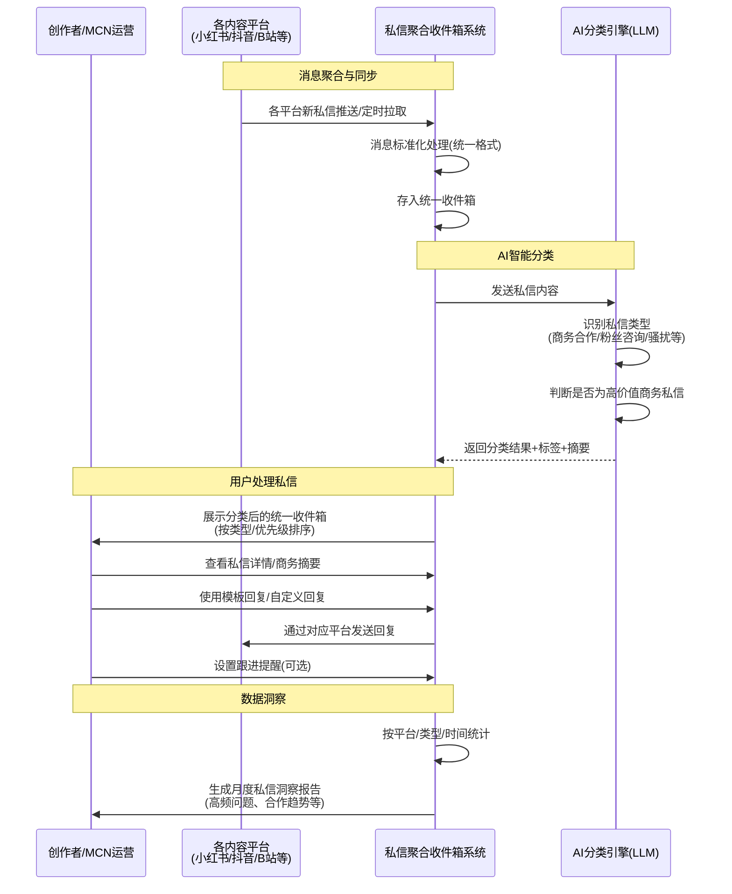
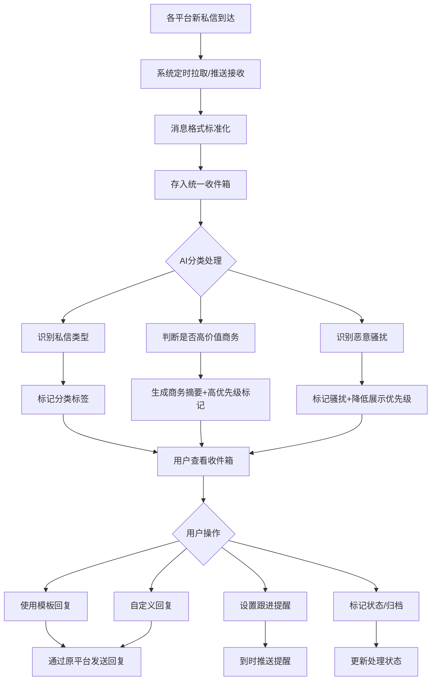
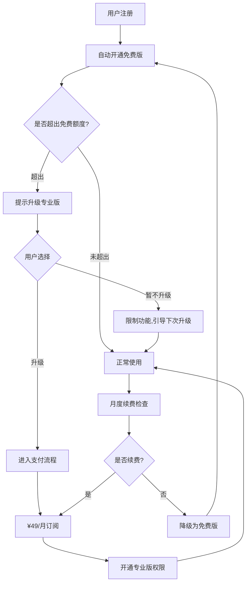
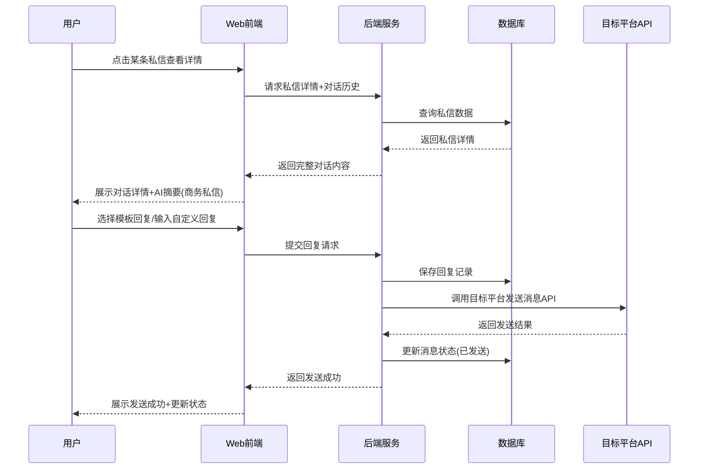
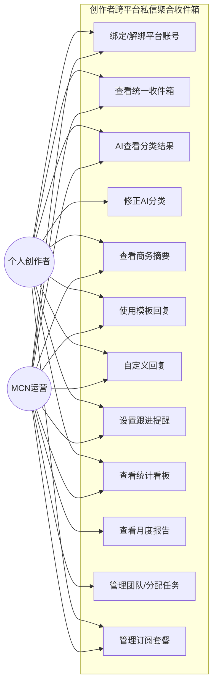
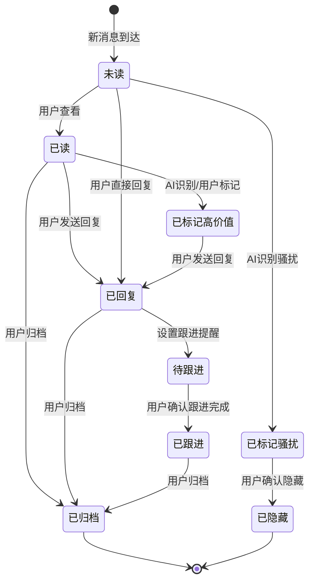

# 1.需求概述 

## 1.1 需求介绍 

**创作者跨平台私信聚合收件箱**是一款面向多平台内容创作者、KOL及MCN运营人员的私信管理工具。产品将小红书、抖音、B站、视频号、公众号等多个主流平台的私信消息统一聚合到一个收件箱中，通过AI自动分类识别私信类型（商务合作、粉丝咨询、恶意骚扰、互推邀约等），标记高价值商务私信并生成对接摘要，支持模板回复与跟进提醒，帮助创作者高效管理跨平台私信、不错过重要商务合作机会，并提供月度"私信洞察报告"辅助内容运营决策。

### 1.1.1 所属领域 

内容创作 / 创作者经济 / 多平台私信管理

## 1.2 需求目标 

1. **统一收件箱**：将小红书、抖音、B站、视频号、公众号等多平台私信聚合至一个统一界面，消除创作者在多平台间频繁切换查看私信的痛点
2. **AI智能分类**：基于大语言模型（LLM）自动识别并分类私信内容，将私信区分为商务合作、粉丝咨询、互推邀约、恶意骚扰等类型，降低人工筛选成本
3. **高价值商务识别**：自动标记包含报价、合作意向等关键词的高价值商务私信，生成商务对接摘要，帮助创作者快速抓住合作机会
4. **高效回复与跟进**：提供模板回复功能，支持快捷回复常见私信场景；设置跟进提醒，防止遗漏重要商务合作
5. **私信数据洞察**：按平台、类型、时间等维度统计私信数据，生成月度"私信洞察报告"（高频问题、合作机会趋势等），辅助创作者优化内容策略
6. **MVP快速交付**：在约10天的开发周期内完成核心功能（平台消息聚合+LLM分类+收件箱UI+模板回复+统计看板）

## 1.3 系统使用角色 

| 角色 | 说明 | 典型使用场景 |
| --- | --- | --- |
| 个人创作者/KOL | 同时在多平台运营的个人内容创作者，每天收到大量私信 | 统一管理多平台私信，快速识别商务合作机会，避免遗漏重要消息 |
| MCN运营人员 | 受雇于MCN机构，负责多个签约创作者的商务对接与日常运营 | 批量管理多位创作者的私信，分类处理商务合作，团队协作分配 |
| 个人IP运营者 | 以个人品牌为核心进行内容运营的自由职业者或小团队 | 聚焦高价值商务私信，使用模板回复提升效率，定期查看洞察报告 |

## 1.4 业务流程图 

# 2.功能原型 

| 原型名称 | 原型链接 | 对应端 | 备注 |
| --- | --- | --- | --- |
| 创作者跨平台私信聚合收件箱 | 配套UI原型HTML文件 | WEB端 | MVP阶段以Web端为主 |

# 3.需求清单 

## 3.1 统一收件箱-WEB端

### 3.1.1 平台账号管理模块

| 模块 | 一级功能 | 二级功能 | 功能描述 | 备注 |
| --- | --- | --- | --- | --- |
| 平台账号管理 | 添加平台账号 | 选择平台类型 | 用户选择要绑定的内容平台（小红书、抖音、B站、视频号、公众号等） | 免费版限3个平台，专业版不限 |
| 平台账号管理 | 添加平台账号 | 平台授权登录 | 引导用户通过OAuth或Cookie等方式授权平台账号访问权限 | 各平台授权方式不同，需适配 |
| 平台账号管理 | 添加平台账号 | 授权状态检测 | 实时检测各平台授权是否有效，过期时提醒用户重新授权 | |
| 平台账号管理 | 管理已绑定账号 | 查看账号列表 | 展示已绑定的所有平台账号及其状态（正常/过期/异常） | |
| 平台账号管理 | 管理已绑定账号 | 解绑平台账号 | 支持解除与某个平台账号的绑定关系 | 解绑后该平台的私信数据保留但不再同步新消息 |
| 平台账号管理 | 管理已绑定账号 | 手动同步私信 | 用户可手动触发从某个平台同步最新私信 | 自动同步间隔外的补充手段 |

### 3.1.2 私信聚合与展示模块

| 模块 | 一级功能 | 二级功能 | 功能描述 | 备注 |
| --- | --- | --- | --- | --- |
| 私信聚合与展示 | 消息同步 | 自动拉取私信 | 系统定时从各已授权平台拉取新私信消息 | 建议拉取频率：每5-15分钟 |
| 私信聚合与展示 | 消息同步 | 消息格式标准化 | 将不同平台的私信消息统一为标准格式（发送者、内容、时间、平台来源等） | |
| 私信聚合与展示 | 消息同步 | 消息去重与合并 | 对同一发送者的多条连续消息进行合并展示，避免信息碎片化 | |
| 私信聚合与展示 | 收件箱视图 | 全部私信列表 | 按时间倒序展示所有平台的私信消息，显示发送者头像、昵称、平台标识、消息摘要、时间 | 默认视图 |
| 私信聚合与展示 | 收件箱视图 | 按分类筛选 | 支持按AI分类结果筛选查看（商务合作、粉丝咨询、互推邀约、恶意骚扰、其他） | |
| 私信聚合与展示 | 收件箱视图 | 按平台筛选 | 支持按来源平台筛选查看私信 | |
| 私信聚合与展示 | 收件箱视图 | 按时间筛选 | 支持按时间范围筛选私信（今天、近7天、近30天、自定义） | |
| 私信聚合与展示 | 收件箱视图 | 搜索私信 | 支持关键词搜索私信内容、发送者昵称 | |
| 私信聚合与展示 | 收件箱视图 | 未读标记 | 显示未读私信数量，支持按分类/平台显示未读数 | |
| 私信聚合与展示 | 私信详情 | 查看完整对话 | 点击某条私信后展示与该发送者的完整对话历史 | |
| 私信聚合与展示 | 私信详情 | 平台来源标识 | 在对话中清晰标识每条消息来自哪个平台 | |
| 私信聚合与展示 | 私信详情 | 已读/未读状态管理 | 标记私信为已读/未读，支持批量标记 | |

### 3.1.3 AI智能分类模块

| 模块 | 一级功能 | 二级功能 | 功能描述 | 备注 |
| --- | --- | --- | --- | --- |
| AI智能分类 | 自动分类 | 私信类型识别 | 基于LLM对每条新私信进行类型分类：商务合作、粉丝咨询、互推邀约、恶意骚扰、其他 | 核心AI能力 |
| AI智能分类 | 自动分类 | 分类置信度展示 | 展示AI分类的置信度，低置信度时提醒用户确认或修正分类 | |
| AI智能分类 | 自动分类 | 分类结果修正 | 用户可手动修正AI的分类结果，修正结果反馈至AI模型优化 | 人工反馈闭环 |
| AI智能分类 | 高价值商务识别 | 商务合作标记 | 自动识别包含报价、合作意向、品牌名称等关键词的商务私信，标记为"高价值" | 高优先级展示 |
| AI智能分类 | 高价值商务识别 | 商务对接摘要生成 | 为高价值商务私信生成结构化摘要（合作品牌、合作类型、报价范围、关键诉求、建议回复方向） | 帮助快速了解合作要点 |
| AI智能分类 | 恶意骚扰识别 | 骚扰消息标记 | 自动识别并标记恶意骚扰、垃圾广告类私信，降低其对用户的干扰 | 可设置自动隐藏 |
| AI智能分类 | 批量分类处理 | 批量分类操作 | 支持用户批量选择私信后统一修改分类、标记状态 | 提升处理效率 |

### 3.1.4 回复与跟进模块

| 模块 | 一级功能 | 二级功能 | 功能描述 | 备注 |
| --- | --- | --- | --- | --- |
| 回复与跟进 | 模板回复 | 预设模板管理 | 系统预设常见场景的回复模板（商务合作感谢、报价咨询回复、合作婉拒、粉丝互动等） | |
| 回复与跟进 | 模板回复 | 自定义模板 | 用户可创建、编辑、删除自定义回复模板 | 专业版功能 |
| 回复与跟进 | 模板回复 | AI辅助生成回复 | 基于私信内容和上下文，AI自动生成建议回复内容，用户可编辑后发送 | 专业版功能 |
| 回复与跟进 | 模板回复 | 一键模板回复 | 在私信详情页一键选择模板并发送至对应平台 | 发送后在原平台同步可见 |
| 回复与跟进 | 跟进提醒 | 设置跟进提醒 | 对需要后续处理的私信设置跟进提醒（提醒时间、提醒内容） | |
| 回复与跟进 | 跟进提醒 | 提醒通知 | 到达提醒时间时通过系统通知/邮件等方式提醒用户处理 | |
| 回复与跟进 | 跟进提醒 | 跟进状态管理 | 标记私信处理状态（待处理、处理中、已回复、已关闭、已跟进） | |
| 回复与跟进 | 跟进提醒 | 跟进列表 | 展示所有待跟进和已设置提醒的私信列表 | |

### 3.1.5 数据洞察与报告模块

| 模块 | 一级功能 | 二级功能 | 功能描述 | 备注 |
| --- | --- | --- | --- | --- |
| 数据洞察与报告 | 统计看板 | 总览统计 | 展示私信总量、未读数、各分类占比、各平台消息量等核心指标 | |
| 数据洞察与报告 | 统计看板 | 按平台统计 | 按各内容平台维度统计私信数量、回复率、平均响应时间 | |
| 数据洞察与报告 | 统计看板 | 按类型统计 | 按私信分类维度统计各类私信的数量和趋势变化 | |
| 数据洞察与报告 | 统计看板 | 按时间统计 | 按日/周/月维度统计私信量的变化趋势 | |
| 数据洞察与报告 | 月度报告 | 自动生成月度报告 | 每月自动生成"私信洞察报告"，包含高频问题TOP10、合作机会趋势、各平台表现对比 | 专业版功能 |
| 数据洞察与报告 | 月度报告 | 高频问题提取 | AI分析私信内容，提取粉丝/合作方最常问的问题 | |
| 数据洞察与报告 | 月度报告 | 合作机会趋势 | 统计商务合作类私信的数量变化趋势、合作品牌/类型分布 | |
| 数据洞察与报告 | 月度报告 | 报告导出 | 支持将月度报告导出为PDF或图片格式 | 专业版功能 |

### 3.1.6 系统设置与账户模块

| 模块 | 一级功能 | 二级功能 | 功能描述 | 备注 |
| --- | --- | --- | --- | --- |
| 系统设置与账户 | 账户管理 | 用户注册/登录 | 支持邮箱/手机号注册登录 | |
| 系统设置与账户 | 账户管理 | 订阅套餐管理 | 查看当前套餐（免费版/专业版），支持升级/续费/降级 | 免费版：3平台+50条/日；专业版：¥49/月不限 |
| 系统设置与账户 | 账户管理 | 用量查看 | 查看当前周期内的平台使用数、私信处理量等 | 免费版用户关注是否超限 |
| 系统设置与账户 | 团队协作 | 邀请团队成员 | 专业版用户可邀请团队成员加入，分配管理权限 | 专业版功能 |
| 系统设置与账户 | 团队协作 | 私信分配 | 将某条/某类私信分配给团队成员处理 | 专业版功能 |
| 系统设置与账户 | 通知设置 | 通知偏好 | 设置新私信通知方式（站内通知、邮件、浏览器推送等） | |
| 系统设置与账户 | 通知设置 | 重要消息提醒 | 高价值商务私信到达时立即推送提醒 | |

# 4.非功能需求 

## 4.1 使用界面需求

| 需求项 | 说明 |
| --- | --- |
| 界面风格 | 简洁清爽，信息密度适中，类IM收件箱体验，支持深色/浅色模式 |
| 响应式布局 | Web端需适配主流桌面浏览器（Chrome/Firefox/Safari/Edge），最低分辨率1280×720 |
| 操作效率 | 核心操作（查看/回复/标记）应在3次点击内完成 |
| 消息展示 | 单条私信列表项需展示：发送者头像、昵称、平台图标、消息摘要、时间、分类标签、未读状态 |

## 4.2 软硬件环境需求

| 需求项 | 说明 |
| --- | --- |
| 客户端 | Web浏览器（Chrome 90+、Firefox 88+、Safari 14+、Edge 90+） |
| 服务端 | 云端部署，支持主流云平台（阿里云/腾讯云/AWS） |
| 数据库 | 关系型数据库（PostgreSQL/MySQL）+ 消息缓存（Redis） |
| AI服务 | 接入大语言模型API（如OpenAI/Claude/国产大模型）用于私信分类与摘要生成 |

## 4.3 性能需求

| 需求项 | 指标 |
| --- | --- |
| 消息同步延迟 | 新私信从平台到系统的同步延迟 ≤ 15分钟（定时拉取） |
| 页面加载时间 | 收件箱首页加载时间 ≤ 2秒（首屏） |
| AI分类延迟 | 单条私信AI分类处理时间 ≤ 3秒 |
| 系统可用性 | 99.5%以上月度可用性 |
| 并发支持 | 支持至少500用户同时在线使用 |
| 数据存储 | 私信数据至少保留12个月 |

## 4.4 约束性需求

1. **平台授权合规**：必须遵守各内容平台（小红书、抖音、B站、视频号、公众号）的开放平台协议和数据使用规范，不得采用非授权方式获取用户私信数据
2. **数据隐私保护**：用户的私信内容属于敏感数据，需加密存储和传输，不得将用户私信数据用于模型训练或第三方共享
3. **MVP范围约束**：首版MVP聚焦核心功能（平台消息聚合+LLM分类+收件箱UI+模板回复+统计看板），不包含内容发布管理、粉丝数据分析等非核心功能
4. **免费版限制**：免费版用户最多绑定3个平台、每日处理50条私信；超出限制时引导升级专业版
5. **不做通用IM聚合**：本系统定位为"创作者私信专属管理"，不对接微信、QQ等通用即时通讯工具
6. **需要后台服务**：是，需要后台服务支撑平台消息同步、AI分类处理、数据存储等核心功能

# 5.接口需求 

## 5.1 硬件接口需求 

不涉及硬件接口。

## 5.2 软件接口需求 

| 模块 | 接口名称 | 输入 | 输出 | 功能描述 |
| --- | --- | --- | --- | --- |
| 平台账号管理 | 小红书开放平台API | OAuth授权凭证 | 私信消息列表、用户信息 | 拉取小红书平台私信消息，发送回复消息 |
| 平台账号管理 | 抖音开放平台API | OAuth授权凭证 | 私信消息列表、用户信息 | 拉取抖音平台私信消息，发送回复消息 |
| 平台账号管理 | B站开放平台API | OAuth授权凭证 | 私信消息列表、用户信息 | 拉取B站平台私信消息，发送回复消息 |
| 平台账号管理 | 视频号开放平台API | OAuth授权凭证 | 私信消息列表、用户信息 | 拉取视频号平台私信消息，发送回复消息 |
| 平台账号管理 | 公众号开放平台API | OAuth授权凭证 | 私信消息列表、用户信息 | 拉取公众号平台私信消息，发送回复消息 |
| AI智能分类 | LLM分类接口 | 私信文本内容 | 分类标签、置信度、商务摘要 | 调用大语言模型进行私信分类和高价值识别 |
| AI智能分类 | AI回复生成接口 | 私信内容+上下文 | 建议回复文本 | 基于私信内容生成建议回复 |
| 数据洞察与报告 | 报告生成服务 | 统计数据+分析参数 | PDF/图片格式报告 | 生成月度私信洞察报告 |
| 系统设置与账户 | 邮件通知服务 | 通知内容+收件人 | 发送结果 | 发送跟进提醒邮件、重要消息通知 |
| 系统设置与账户 | 支付平台接口 | 订单信息 | 支付结果 | 处理专业版订阅支付 |

## 5.4 通讯接口需求 

不涉及设备端通讯接口。系统通过HTTPS协议与各内容平台API及AI服务接口通信。

# 6. 附录 

## 流程图 

### 私信处理完整流程

### 订阅与计费流程

## 时序图 

### 用户回复私信时序

## （用户与系统交互）用例图 

## （系统）状态图 

### 私信消息状态流转

