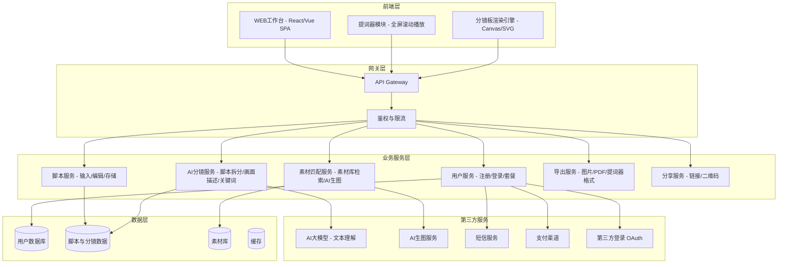
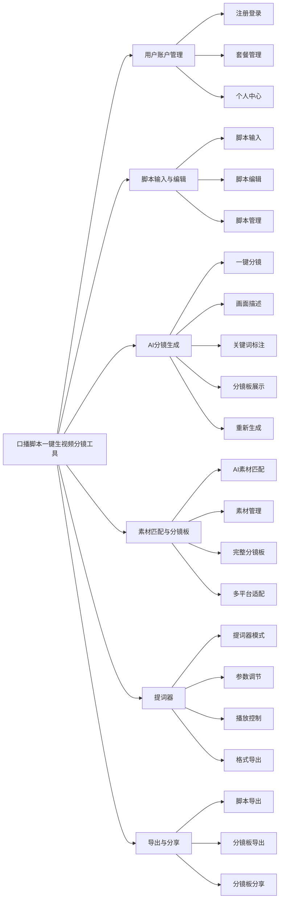
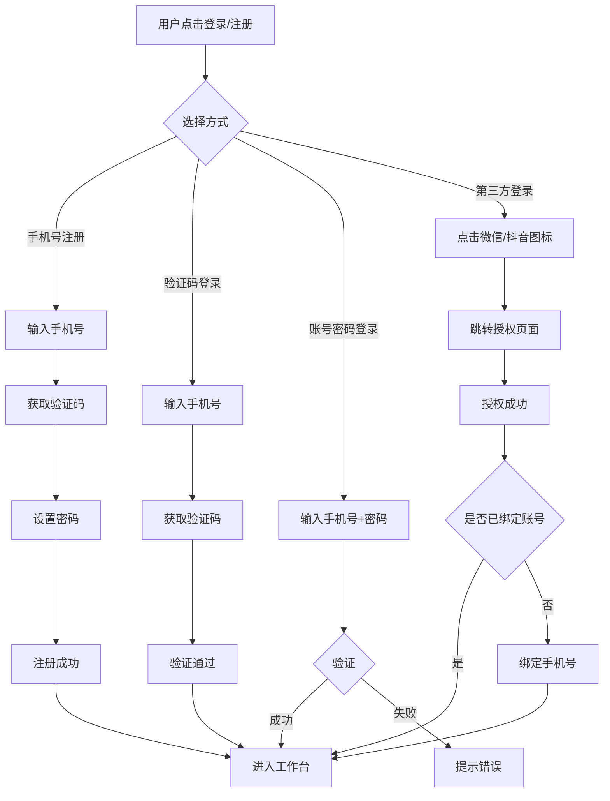
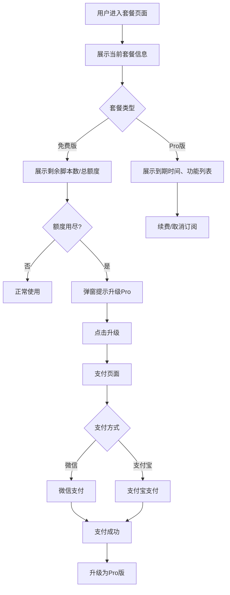
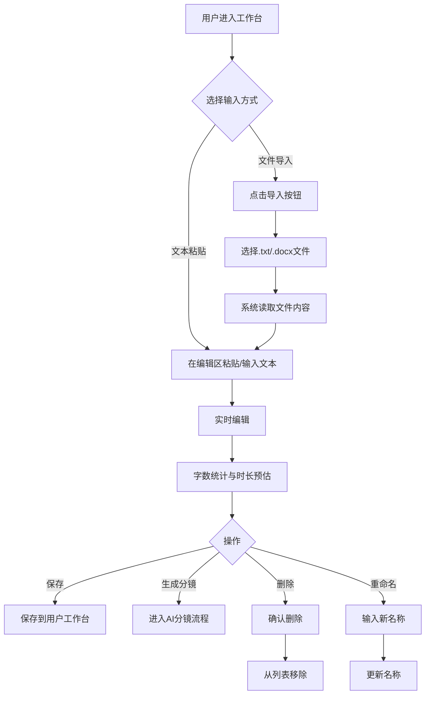
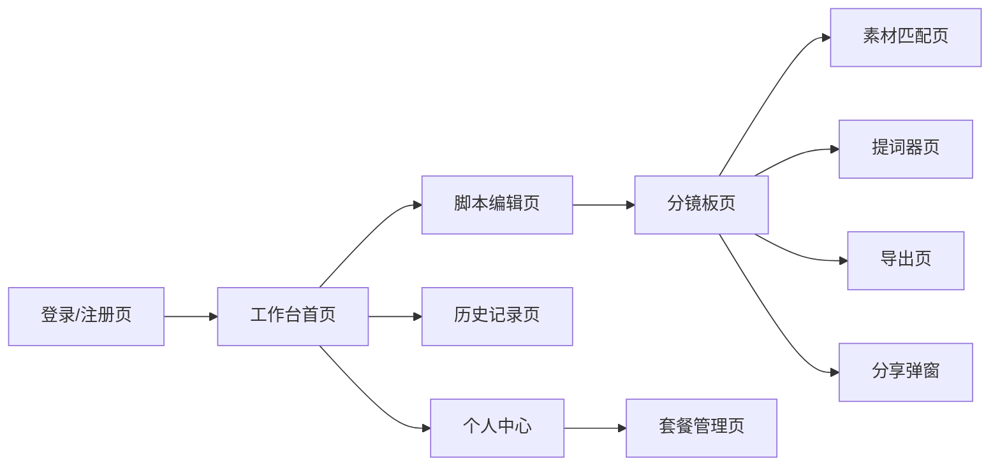
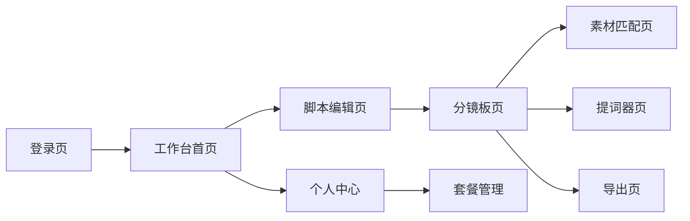

# 「口播脚本一键生视频分镜工具」产品需求规格说明书（PRD）

| 版本号 | 变更日期 | 变更内容 | 变更人 | 审核人 |
| --- | --- | --- | --- | --- |
| V1.0 | 2026-06-29 | 初始版本创建 | 产品文档结对写作专家 | 阶段一产品落地页文档总编辑 |

---

# 1 概述

## 1.1 需求背景

短视频已成为当下最主流的内容传播形式，口播类视频（真人面对镜头讲述）是短视频创作中最普遍的形态。然而，从"写完脚本"到"实际拍摄"之间，存在一个关键的"分镜规划"环节——创作者需要将口播脚本拆分为多个段落，规划每段的画面呈现方式、关键词高亮和拍摄建议。这一环节目前缺乏轻量、专业的数字化工具，创作者大多依赖脑中构思或纸质笔记，效率低下且容易遗漏。

现有AI视频工具（如Runway、Pika）主要聚焦于"视频生成"环节，而剪映、PR等工具聚焦于"视频剪辑"环节，两者均未覆盖"脚本→分镜→提词"的前期规划环节。市场存在明显的工具空白。

本产品定位为轻量级AI辅助工具，专注于口播视频制作的前置规划环节，帮助创作者将口播脚本一键转化为结构化分镜板，并提供内置提词器支持实际拍摄。通过"免费版+Pro版"的订阅模式实现商业化可持续运营。

## 1.2 名词解释

| **名词** | **说明** |
| --- | --- |
| 口播脚本 | 创作者撰写的口播文稿，用于面对镜头朗读或讲述 |
| 分镜 | 将脚本按照内容语义拆分为多个独立段落，每段对应一个拍摄场景或话题 |
| 分镜板 | 由多个分镜卡片组成的可视化面板，展示每个分镜的脚本文本、画面描述建议和参考素材 |
| 画面描述建议 | AI为每个分镜段落自动生成的配图/视频素材方向建议 |
| 关键词高亮 | AI从每个分镜段落中提取的字幕应重点标注的词语 |
| 提词器 | 一种文字滚动播放工具，帮助口播者在拍摄时朗读文稿而无需低头看稿 |
| Pro版 | 付费订阅套餐，解锁AI素材匹配、提词器、多平台尺寸适配导出等高级功能 |

## 1.3 产品介绍

### 1.3.1 范围说明

| 项 | 内容 |
| --- | --- |
| 包含功能 | 用户注册登录与套餐管理、脚本输入与编辑、AI一键分镜生成、分镜板展示与编辑、AI素材匹配与参考图生成（Pro）、内置提词器（Pro）、分镜板多格式导出（图片/PDF/提词器格式）、链接分享与二维码分享 |
| 不包含功能 | 视频剪辑功能、视频合成、特效添加、音频处理、视频后期编辑操作、AI模型自研训练 |

本产品面向短视频创作者（抖音/B站/小红书口播博主）、知识类/教育类视频UP主、需要高效制作口播视频的个人品牌运营者。核心价值是将传统需要数十分钟的人工分镜规划缩短至秒级完成，打通从脚本撰写到实际拍摄之间的规划环节。

---

# 2 产品设计

## 2.1 系统架构图



## 2.2 业务模块图



## 2.3 主业务流程

```mermaid
flowchart TD
    Start([用户进入]) --> Login{登录/注册}
    Login --> |未登录| Reg[完成注册/登录]
    Login --> |已登录| WS[进入工作台]
    Reg --> WS

    WS --> Input[粘贴/导入口播脚本]
    Input --> Edit[编辑脚本内容]
    Edit --> Gen[点击"生成分镜"]

    Gen --> AIProcess[AI处理中]
    AIProcess --> |进度提示| Result[分镜板结果展示]

    Result --> ViewCards[查看分镜卡片]
    ViewCards --> EditShot[编辑画面描述/关键词]
    ViewCards --> Reorder[拖拽调整顺序]
    ViewCards --> MergeSplit[合并/拆分分镜]

    Result --> ProCheck{Pro用户?}
    ProCheck --> |是| Material[AI素材匹配]
    ProCheck --> |否| Upgrade[提示升级Pro]
    Material --> FullBoard[完整分镜板]
    Upgrade --> FullBoard

    FullBoard --> Export{选择导出方式}
    Export --> |图片/PDF| FileExport[文件导出]
    Export --> |提词器格式| TCExport[提词器格式]
    Export --> |多平台适配| MultiExport[多平台批量导出]

    Result --> TeleCheck{使用提词器?}
    TeleCheck --> |Pro用户| Tele[进入提词器]
    TeleCheck --> |非Pro| Upgrade2[提示升级Pro]
    Tele --> Play[播放提词]

    FileExport --> Share[保存/分享]
    TCExport --> Share
    MultiExport --> Share
    Play --> Share
```

## 2.4 功能图/列表

| 功能模块 | 功能名称 | 优先级 | 功能描述 | 套餐要求 |
| --- | --- | --- | --- | --- |
| 用户账户管理 | 手机号注册 | P0 | 通过手机号+验证码完成注册 | 全部 |
| 用户账户管理 | 第三方登录 | P1 | 微信/抖音快捷登录 | 全部 |
| 用户账户管理 | 套餐查看与升级 | P0 | 查看当前套餐、剩余脚本数，升级Pro版 | 全部 |
| 用户账户管理 | 个人中心 | P1 | 基本信息修改、密码修改、历史记录 | 全部 |
| 脚本输入与编辑 | 文本粘贴输入 | P0 | 粘贴或手动输入口播脚本文本 | 全部 |
| 脚本输入与编辑 | 文件导入 | P2 | 导入.txt/.docx格式脚本文件 | 全部 |
| 脚本输入与编辑 | 实时文本编辑 | P0 | 自由编辑脚本内容，实时字数统计与时长预估 | 全部 |
| 脚本输入与编辑 | 脚本保存/删除/重命名 | P0 | 脚本管理操作 | 全部 |
| AI分镜生成 | AI一键分镜 | P0 | AI自动拆分脚本为分镜段落 | 全部 |
| AI分镜生成 | 画面描述建议 | P0 | 为每个分镜生成画面描述建议 | 全部 |
| AI分镜生成 | 关键词提取 | P0 | 提取字幕高亮关键词 | 全部 |
| AI分镜生成 | 分镜卡片视图 | P0 | 图文并排展示所有分镜卡片 | 全部 |
| AI分镜生成 | 分镜排序/合并/拆分 | P1 | 拖拽排序、手动合并或拆分分镜 | 全部 |
| AI分镜生成 | 单段/全部重新生成 | P1 | 局部或全部重新生成分镜内容 | 全部 |
| 素材匹配与分镜板 | AI素材匹配 | P1 | 从素材库匹配参考图/视频素材 | Pro |
| 素材匹配与分镜板 | AI生图 | P1 | 根据画面描述生成参考配图 | Pro |
| 素材匹配与分镜板 | 素材替换与预览 | P1 | 手动替换素材、上传自有素材 | Pro |
| 素材匹配与分镜板 | 完整分镜板合成 | P1 | 合成所有分镜为完整分镜板 | Pro |
| 素材匹配与分镜板 | 多平台尺寸适配导出 | P2 | 按抖音9:16/B站16:9/小红书3:4导出 | Pro |
| 提词器 | 提词器模式 | P1 | 全屏滚动播放脚本文本 | Pro |
| 提词器 | 语速/字号/颜色调节 | P1 | 自定义提词器显示参数 | Pro |
| 提词器 | 关键词高亮显示 | P1 | 播放时自动高亮关键词 | Pro |
| 提词器 | 分镜段落切换提示 | P2 | 段落切换时视觉/声音提示 | Pro |
| 提词器 | 提词器格式导出 | P2 | 导出为通用提词器格式文件 | Pro |
| 导出与分享 | 纯文本导出 | P0 | 导出脚本文本为.txt | 全部 |
| 导出与分享 | 图片/PDF导出 | P1 | 分镜板导出为图片或PDF | Pro |
| 导出与分享 | 链接分享 | P1 | 生成在线查看链接 | 全部 |
| 导出与分享 | 二维码分享 | P2 | 生成二维码便于手机端查看 | 全部 |

## 2.5 你的产品有哪些端

| 序号 | 端名称 | 端类型 | 目标用户 | 说明 |
| --- | --- | --- | --- | --- |
| 1 | 口播分镜工作台 | WEB端 | 短视频创作者、UP主、个人品牌运营者 | 核心工作台，在PC浏览器上使用，包含脚本编辑、分镜板、提词器、导出等全部功能 |

---

# 3 产品功能

## 3.1 WEB端 - 用户账户管理功能

### 3.1.1 用户注册与登录

功能描述：提供手机号注册、账号密码登录、验证码登录、第三方（微信/抖音）登录四种方式，支持用户快速进入工作台。

| 项 | 内容 |
| --- | --- |
| 优先级 | P0 |
| 依赖需求 | 短信验证码接口、微信/抖音OAuth接口 |
| 前置条件 | 无 |

### 3.1.2 用户注册与登录—详细流程



业务规则说明：
1. 手机号格式校验：11位中国大陆手机号
2. 验证码有效期5分钟，60秒内不可重复发送
3. 第三方登录首次使用需绑定手机号，后续可直接登录
4. 新用户默认注册为免费版用户

### 3.1.3 用户注册与登录—主要原型

[登录注册组件原型](assets/prototypes/web/login-widget.html)

验收标准：
- [ ] 正常流程：用户可通过四种方式完成注册/登录并进入工作台
- [ ] 异常流程：验证码错误、密码错误、手机号未注册等场景有明确提示
- [ ] 性能要求：登录响应时间<1秒

### 3.1.4 套餐管理

功能描述：展示用户当前套餐类型、剩余脚本数/月、到期时间；免费版用户额度用尽时提示升级；Pro版购买流程。

| 项 | 内容 |
| --- | --- |
| 优先级 | P0 |
| 依赖需求 | 支付接口 |
| 前置条件 | 用户已登录 |

### 3.1.5 套餐管理—详细流程



业务规则说明：
1. 免费版每月1日重置脚本额度（10个/月），未用完不累计
2. Pro版¥15/月，支持微信/支付宝支付
3. Pro版到期后降回免费版，已有脚本数据保留但不可新建
4. 额度用尽时，每次点击"生成分镜"弹出升级提示

### 3.1.6 套餐管理—主要原型

[套餐管理组件原型](assets/prototypes/web/subscription-widget.html)

验收标准：
- [ ] 正常流程：正确展示套餐信息，升级支付流程完整
- [ ] 异常流程：支付失败有重试机制，额度用尽提示准确

---

## 3.2 WEB端 - 脚本输入与编辑功能

### 3.2.1 脚本输入与编辑

功能描述：用户在工作台通过文本粘贴、文件导入方式输入口播脚本，支持实时编辑、字数统计和口播时长预估，可保存、删除和重命名脚本。

| 项 | 内容 |
| --- | --- |
| 优先级 | P0 |
| 依赖需求 | 无 |
| 前置条件 | 用户已登录且有可用脚本额度 |

### 3.2.2 脚本输入与编辑—详细流程



业务规则说明：
1. 脚本最大字数限制：10000字（约10分钟口播）
2. 口播时长预估公式：字数 / 250字/分钟（中文平均口播语速）
3. 支持自动保存（每30秒或内容变更时）
4. 脚本列表最多展示100条，按修改时间倒序排列
5. 删除操作需二次确认

### 3.2.3 脚本输入与编辑—主要原型

[脚本编辑区组件原型](assets/prototypes/web/script-editor-widget.html)

验收标准：
- [ ] 正常流程：支持粘贴、文件导入、实时编辑、字数统计、保存
- [ ] 异常流程：超字数限制提示、文件导入格式不支持提示
- [ ] 性能要求：编辑器输入响应延迟<50ms

---

## 3.3 WEB端 - AI分镜生成功能

### 3.3.1 AI一键分镜

功能描述：用户点击"生成分镜"按钮后，AI自动将口播脚本按语义拆分为多个分镜段落，为每段生成画面描述建议和字幕关键词。分镜数量由AI根据脚本内容智能判断。

| 项 | 内容 |
| --- | --- |
| 优先级 | P0 |
| 依赖需求 | AI文本理解接口 |
| 前置条件 | 脚本已输入且字数≥50字 |

### 3.3.2 AI一键分镜—详细流程

```mermaid
flowchart TD
    A[用户点击"生成分镜"] --> B{脚本校验}
    B --> |字数不足50字| C[提示脚本过短]
    B --> |额度检查| D{额度充足?}
    D --> |否| E[提示额度不足/升级Pro]
    D --> |是| F[提交脚本到AI服务]
    F --> G[展示AI处理进度]
    G --> H[AI语义分析与段落拆分]
    H --> I[AI生成画面描述建议]
    I --> J[AI提取关键词]
    J --> K[返回分镜结果]
    K --> L[渲染分镜卡片视图]
    L --> M[用户查看与编辑]
```

业务规则说明：
1. 每个脚本消耗1个额度（免费版10个/月）
2. AI处理超时上限30秒，超时后提示重试
3. 分镜数量通常为3-15个段落，由AI智能判断
4. 生成过程中展示进度条和预计等待时间
5. 生成结果支持实时预览，每完成一个分镜卡片即渲染展示

### 3.3.3 AI一键分镜—主要原型

[AI分镜生成组件原型](assets/prototypes/web/storyboard-gen-widget.html)

验收标准：
- [ ] 正常流程：1000字以内脚本15秒内完成分镜生成
- [ ] 异常流程：AI服务超时、脚本过短、额度不足等场景有明确提示
- [ ] 性能要求：1000字脚本分镜生成≤15秒

### 3.3.4 分镜板展示与编辑

功能描述：以卡片形式展示所有分镜段落，每张卡片左侧显示脚本文本，右侧显示画面描述建议和关键词标签。支持拖拽排序、合并相邻分镜、拆分单个分镜、单段重新生成。

| 项 | 内容 |
| --- | --- |
| 优先级 | P0 |
| 依赖需求 | AI分镜生成结果 |
| 前置条件 | 已完成AI分镜生成 |

### 3.3.5 分镜板展示与编辑—详细流程

```mermaid
flowchart TD
    A[分镜卡片列表展示] --> B{用户操作}
    B --> |编辑画面描述| C[点击画面描述区域]
    C --> D[进入编辑模式]
    D --> E[修改后保存]

    B --> |调整关键词| F[点击关键词标签]
    F --> G[添加/删除/修改关键词]
    G --> H[更新关键词列表]

    B --> |拖拽排序| I[拖拽卡片到目标位置]
    I --> J[更新分镜顺序]

    B --> |合并分镜| K[选中相邻两个分镜]
    K --> L[点击"合并"按钮]
    L --> M[合并为一个分镜]

    B --> |拆分分镜| N[选中一个分镜]
    N --> O[选择拆分点]
    O --> P[拆分为两个分镜]

    B --> |单段重新生成| Q[点击分镜卡片上的"重新生成"]
    Q --> R[仅重新生成该段画面描述和关键词]

    B --> |全部重新生成| S[点击"全部重新生成"]
    S --> T[使用新参数重新生成全部分镜]
```

业务规则说明：
1. 分镜卡片采用图文并排布局，左侧脚本文本占60%，右侧画面描述+关键词占40%
2. 拖拽排序使用HTML5 Drag & Drop API
3. 合并分镜时，脚本文本拼接，画面描述和关键词由AI重新生成
4. 拆分分镜时，用户在文本中选定拆分点，AI分别生成新分镜的画面描述和关键词
5. 单段重新生成不影响其他分镜段落

### 3.3.6 分镜板展示与编辑—主要原型

[分镜板卡片视图组件原型](assets/prototypes/web/storyboard-board-widget.html)

验收标准：
- [ ] 正常流程：卡片正确展示脚本、画面描述、关键词；拖拽/合并/拆分操作正常
- [ ] 异常流程：空分镜板状态、单分镜不可合并、合并后数据正确
- [ ] 性能要求：15个分镜卡片渲染时间<1秒

---

## 3.4 WEB端 - 素材匹配与分镜板功能（Pro）

### 3.4.1 AI素材匹配

功能描述：根据每个分镜的画面描述，自动从素材库匹配适合的参考图/视频素材，或调用AI生图生成参考配图，填充到分镜卡片中形成完整分镜板。

| 项 | 内容 |
| --- | --- |
| 优先级 | P1 |
| 依赖需求 | 素材库检索接口、AI图像生成接口 |
| 前置条件 | 用户为Pro版、已完成AI分镜生成 |

### 3.4.2 AI素材匹配—详细流程

```mermaid
flowchart TD
    A[用户点击"AI匹配素材"] --> B{Pro用户校验}
    B --> |否| C[提示升级Pro]
    B --> |是| D[提取各分镜画面描述关键词]
    D --> E{遍历每个分镜}
    E --> F[从素材库检索匹配素材]
    F --> G{素材库有满意结果?}
    G --> |是| H[选取最佳匹配素材]
    G --> |否| I[调用AI生成参考图]
    I --> J[等待AI生图返回]
    J --> H
    H --> K[填充到分镜卡片]
    K --> E
    E --> |所有分镜完成| L[展示完整分镜板]
    L --> M{用户操作}
    M --> |替换素材| N[上传自有素材或重新匹配]
    M --> |导出| O[进入导出流程]
```

业务规则说明：
1. 素材匹配按分镜逐个进行，每个分镜展示匹配进度
2. 单个分镜素材匹配超时上限10秒
3. 素材库无满意结果时自动调用AI生图
4. 用户可点击分镜卡片中的素材区域进行替换（上传自有素材或重新AI匹配）
5. 素材匹配消耗Pro版额度，具体额度规则后续确定

### 3.4.3 AI素材匹配—主要原型

[素材匹配组件原型](assets/prototypes/web/material-match-widget.html)

验收标准：
- [ ] 正常流程：每个分镜自动匹配/生成参考图并正确展示
- [ ] 异常流程：AI生图失败时提供重试，素材库无结果时降级到AI生图
- [ ] 性能要求：单分镜素材匹配≤10秒

### 3.4.4 多平台尺寸适配导出

功能描述：支持按抖音（9:16）、B站（16:9）、小红书（3:4）等主流平台尺寸比例导出分镜板，支持一次操作批量生成多平台尺寸。

| 项 | 内容 |
| --- | --- |
| 优先级 | P2 |
| 依赖需求 | 图片渲染接口、PDF生成接口 |
| 前置条件 | Pro用户、已完成分镜板（含素材匹配） |

### 3.4.5 多平台尺寸适配导出—详细流程

```mermaid
flowchart TD
    A[用户点击"导出分镜板"] --> B[选择导出格式]
    B --> C{图片/PDF}
    C --> |图片| D[选择平台尺寸]
    C --> |PDF| E[选择平台尺寸]
    D --> F[抖音9:16]
    D --> G[B站16:9]
    D --> H[小红书3:4]
    E --> F
    E --> G
    E --> H
    F --> I[可多选]
    G --> I
    H --> I
    I --> J[点击"生成"]
    J --> K[按选中尺寸渲染分镜板]
    K --> L[打包为ZIP下载]
```

业务规则说明：
1. 默认提供抖音9:16、B站16:9、小红书3:4三种尺寸
2. 支持多选批量导出，打包为ZIP文件
3. 分镜板按选中尺寸自动排版，卡片数量多时自动分页
4. 单次导出生成时间不超过5秒

### 3.4.6 多平台尺寸适配导出—主要原型

[多平台导出组件原型](assets/prototypes/web/export-widget.html)

验收标准：
- [ ] 正常流程：正确按平台尺寸渲染分镜板并下载
- [ ] 异常流程：导出失败时提示重试

---

## 3.5 WEB端 - 提词器功能（Pro）

### 3.5.1 提词器

功能描述：将脚本或选定分镜段落切换为全屏提词器播放模式，支持语速、字号、滚动速度、颜色等参数调节，播放时自动高亮关键词并在分镜段落切换点显示视觉提示。

| 项 | 内容 |
| --- | --- |
| 优先级 | P1 |
| 依赖需求 | 脚本与分镜数据 |
| 前置条件 | Pro用户、已有脚本或分镜数据 |

### 3.5.2 提词器—详细流程

```mermaid
flowchart TD
    A[用户点击"提词器"] --> B{Pro用户校验}
    B --> |否| C[提示升级Pro]
    B --> |是| D[加载脚本和关键词数据]
    D --> E[进入提词器全屏模式]
    E --> F[展示参数调节面板]
    F --> G{用户设置}
    G --> |语速| H[慢/正常/快/自定义]
    G --> |字号| I[滑动条调节]
    G --> |滚动速度| J[数值微调]
    G --> |颜色| K[文字色/背景色/高亮色]
    H --> L[参数生效]
    I --> L
    J --> L
    K --> L
    L --> M[用户点击"开始播放"]
    M --> N[文字按设定速度向上滚动]
    N --> O[关键词自动高亮]
    O --> P{到达分镜切换点?}
    P --> |是| Q[显示分隔线+提示音]
    P --> |否| N
    Q --> N
    N --> R{用户操作}
    R --> |暂停| S[暂停滚动]
    R --> |继续| N
    R --> |停止| T[退出提词器模式]
```

业务规则说明：
1. 提词器采用全屏暗色背景，减少拍摄现场光线干扰
2. 语速预设：慢（150字/分钟）、正常（250字/分钟）、快（350字/分钟）
3. 字号范围：24px-72px，默认36px
4. 滚动速度范围：1-10级，默认5级
5. 关键词高亮使用对比色（默认黄色）
6. 分镜段落切换点显示虚线分隔符，并播放提示音（可关闭）
7. 提词器模式支持ESC键退出

### 3.5.3 提词器—主要原型

[提词器组件原型](assets/prototypes/web/teleprompter-widget.html)

验收标准：
- [ ] 正常流程：文字流畅滚动≥30fps，关键词正确高亮，段落切换提示正常
- [ ] 异常流程：数据加载失败时提示，播放中断可恢复
- [ ] 性能要求：提词器滚动无卡顿，帧率≥30fps

---

## 3.6 WEB端 - 导出与分享功能

### 3.6.1 导出

功能描述：支持将脚本文本导出为.txt（全部用户）、分镜板导出为图片PNG/JPG或PDF（Pro）、提词器格式导出（Pro）。

| 项 | 内容 |
| --- | --- |
| 优先级 | P0（文本导出）/ P1（图片PDF） |
| 依赖需求 | PDF生成接口、图片渲染接口 |
| 前置条件 | 有可导出的脚本或分镜板数据 |

### 3.6.2 导出—详细流程

```mermaid
flowchart TD
    A[用户点击"导出"] --> B{导出类型}
    B --> |脚本文本| C[导出为.txt文件]
    B --> |分镜板图片| D{Pro校验}
    B --> |分镜板PDF| D
    B --> |提词器格式| D
    D --> |否| E[提示升级Pro]
    D --> |是| F[选择导出选项]
    F --> G[图片格式 - PNG/JPG]
    F --> H[PDF格式]
    F --> I[提词器格式 - .txt带时间轴]
    G --> J[渲染并下载]
    H --> J
    I --> J
    C --> J
```

业务规则说明：
1. 纯文本导出（.txt）对所有用户可用
2. 图片/PDF导出为Pro功能
3. 提词器格式导出包含时间轴标记，可被主流提词器软件识别
4. 单次导出处理时间不超过5秒

### 3.6.3 导出—主要原型

[导出功能组件原型](assets/prototypes/web/export-dialog-widget.html)

验收标准：
- [ ] 正常流程：各格式正确导出，文件可正常打开
- [ ] 异常流程：导出失败时提示重试

### 3.6.4 分享

功能描述：生成分镜板在线查看链接和二维码，便于团队协作和手机端查看。

| 项 | 内容 |
| --- | --- |
| 优先级 | P1 |
| 依赖需求 | 分享服务 |
| 前置条件 | 有分镜板数据 |

### 3.6.5 分享—详细流程

```mermaid
flowchart TD
    A[用户点击"分享"] --> B[生成分享链接]
    B --> C[展示链接和二维码]
    C --> D{用户操作}
    D --> |复制链接| E[复制到剪贴板]
    D --> |保存二维码| F[下载二维码图片]
    D --> |设置权限| G[公开/密码访问/指定人]
```

业务规则说明：
1. 分享链接有效期30天
2. 默认设置为公开访问
3. 二维码包含链接地址，扫码后可在移动端查看分镜板

### 3.6.6 分享—主要原型

[分享组件原型](assets/prototypes/web/share-widget.html)

验收标准：
- [ ] 正常流程：链接和二维码正确生成，可正常访问
- [ ] 异常流程：链接过期后提示

---

# 4 产品原型

## 4.1 页面跳转逻辑图



## 4.2 全站点原型设计

### 4.2.1 口播分镜工作台（WEB端）

**页面清单：**

| 序号 | 页面名称 | 所属模块 | 页面描述 | 关键元素 |
| --- | --- | --- | --- | --- |
| 1 | 登录/注册页 | 用户账户 | 用户登录与注册入口 | 登录表单、注册表单、第三方登录按钮、验证码输入 |
| 2 | 工作台首页 | 脚本管理 | 脚本列表与新建入口 | 脚本卡片列表、新建脚本按钮、搜索栏、额度展示 |
| 3 | 脚本编辑页 | 脚本输入 | 脚本内容编辑 | 富文本编辑区、字数统计、时长预估、保存/生成按钮 |
| 4 | 分镜板页 | AI分镜 | 分镜结果展示与编辑 | 分镜卡片列表、拖拽排序、合并/拆分按钮、重新生成按钮 |
| 5 | 素材匹配页 | 素材匹配 | 分镜参考图展示 | 分镜卡片含参考图、替换素材按钮、匹配进度 |
| 6 | 提词器页 | 提词器 | 全屏文字滚动播放 | 文字滚动区、参数调节面板、播放控制按钮 |
| 7 | 导出页 | 导出分享 | 选择导出格式和选项 | 格式选择、尺寸选择、下载按钮、分享链接/二维码 |
| 8 | 套餐管理页 | 用户账户 | 套餐信息与升级 | 当前套餐卡片、Pro版权益列表、支付按钮 |
| 9 | 个人中心页 | 用户账户 | 个人信息管理 | 头像/昵称编辑、密码修改、历史记录列表 |

**交互说明：**
- 页面跳转关系：

- 特殊交互：
  1. 工作台采用顶部导航栏+左侧功能菜单布局，右侧为内容区
  2. 分镜板页支持卡片拖拽排序（HTML5 Drag & Drop）
  3. AI分镜生成过程中展示进度条和预估时间
  4. 提词器为全屏覆盖模式，ESC或点击退出按钮返回
  5. 所有操作按钮在Pro功能上增加锁标识，非Pro用户点击弹出升级提示
  6. 空数据态：脚本列表为空时显示引导创建提示
  7. 加载态：AI处理时展示骨架屏+进度提示

**产品原型：**

[🖥️ 打开口播分镜工作台全站点原型](assets/prototypes/web/web-prototype.html)

---

# 5 数据需求

## 5.1 数据使用规格

**用户表 (users)：**
| 字段 | 是否必填 | 描述 | 数据类型 |
| --- | --- | --- | --- |
| id | 是 | 用户唯一标识 | UUID |
| phone | 是 | 手机号 | 字符串 |
| nickname | 否 | 昵称 | 字符串 |
| avatar_url | 否 | 头像URL | 字符串 |
| subscription_type | 是 | 套餐类型(free/pro) | 字符串 |
| monthly_script_count | 是 | 本月已用脚本数 | 数字 |
| subscription_expire_at | 否 | Pro到期时间 | 时间戳 |
| created_at | 是 | 注册时间 | 时间戳 |

**脚本表 (scripts)：**
| 字段 | 是否必填 | 描述 | 数据类型 |
| --- | --- | --- | --- |
| id | 是 | 脚本唯一标识 | UUID |
| user_id | 是 | 所属用户 | UUID |
| title | 是 | 脚本标题 | 字符串 |
| content | 是 | 脚本文本内容 | 文本 |
| word_count | 是 | 字数 | 数字 |
| estimated_duration | 否 | 预估口播时长(秒) | 数字 |
| created_at | 是 | 创建时间 | 时间戳 |
| updated_at | 是 | 更新时间 | 时间戳 |

**分镜表 (storyboard_shots)：**
| 字段 | 是否必填 | 描述 | 数据类型 |
| --- | --- | --- | --- |
| id | 是 | 分镜唯一标识 | UUID |
| script_id | 是 | 所属脚本 | UUID |
| sequence | 是 | 段落序号 | 数字 |
| text_content | 是 | 该段脚本文本 | 文本 |
| visual_description | 否 | 画面描述建议 | 文本 |
| keywords | 否 | 关键词列表 | JSON数组 |
| reference_image_url | 否 | 参考图URL | 字符串 |
| created_at | 是 | 创建时间 | 时间戳 |

## 5.2 统计数据

1. 统计用户每月脚本使用量、分镜生成次数（按用户、按月维度）
2. 统计Pro版订阅转化率、续费率（按月维度）
3. 统计各导出格式使用占比（按格式、按月维度）

## 5.3 埋点需求

| 页面 | 事件 | 采集字段 | 说明 |
| --- | --- | --- | --- |
| 脚本编辑页 | script_create | user_id, word_count, input_method | 记录新建脚本 |
| 分镜板页 | storyboard_generate | user_id, script_id, shot_count, duration | 记录分镜生成 |
| 分镜板页 | shot_edit | user_id, shot_id, edit_type | 记录分镜编辑 |
| 素材匹配页 | material_match | user_id, shot_id, match_source | 记录素材匹配 |
| 提词器页 | teleprompter_play | user_id, script_id, duration, speed | 记录提词器使用 |
| 导出页 | export | user_id, export_type, format, platform_size | 记录导出操作 |

---

# 6 非功能需求

## 6.1 性能需求

**6.1.1 延迟**

| 编号 | 项目 | 最大延迟 | 平均延迟 | 优先级 | 备注 |
| --- | --- | --- | --- | --- | --- |
| 0001 | AI分镜生成（1000字内） | <15秒 | <10秒 | 高 | 核心功能 |
| 0002 | 页面加载（首次） | <3秒 | <2秒 | 高 | |
| 0003 | 提词器滚动响应 | <16ms | <10ms | 高 | ≥60fps |
| 0004 | 素材匹配（单分镜） | <10秒 | <6秒 | 中 | |
| 0005 | 分镜板导出 | <5秒 | <3秒 | 中 | |
| 0006 | 编辑器输入响应 | <50ms | <30ms | 高 | |

**6.1.2 吞吐量**

| 编号 | 项 | 吞吐量 | 备注 |
| --- | --- | --- | --- |
| 0001 | AI分镜生成请求 | 每分钟100次 | 高峰期 |
| 0002 | 用户登录认证 | 每分钟1000次 | |
| 0003 | 素材匹配请求 | 每分钟200次 | |

**6.1.3 容量**

| 编号 | 项 | 容量 | 备注 |
| --- | --- | --- | --- |
| 0001 | 同时在线用户 | ≥1000 | AI分镜生成并发 |
| 0002 | 系统总注册用户 | ≤1,000,000 | |
| 0003 | 单用户脚本数 | ≤500 | |

## 6.2 安全需求

| 编号 | 项 |
| --- | --- |
| 0001 | 用户密码使用bcrypt加密存储 |
| 0002 | API请求需携带JWT Token鉴权 |
| 0003 | 用户脚本数据加密存储，不用于模型训练 |
| 0004 | 防止SQL注入、XSS攻击 |
| 0005 | 分享链接设置访问权限控制（公开/密码/指定人） |

## 6.3 可靠性

| 编号 | 项 | 值 |
| --- | --- | --- |
| 0001 | 系统可用性 | ≥99.9% |
| 0002 | 平均正常运行时间 | ≥365天 |
| 0003 | 平均故障恢复时间 | ≤30分钟 |

## 6.4 可连续性

| 编号 | 项 |
| --- | --- |
| 0001 | 系统需7×24小时运行 |
| 0002 | AI服务故障时降级为"仅展示已有分镜，暂停新建"模式 |

## 6.5 可恢复性

| 编号 | 项 |
| --- | --- |
| 0001 | 数据库每日全量备份，每小时增量备份 |
| 0002 | 重大故障1-3小时恢复服务，24-72小时恢复数据 |

## 6.6 兼容性

| 编号 | 要求 | 备注 |
| --- | --- | --- |
| 0001 | 兼容Chrome >=90, Firefox >=88, Safari >=14, Edge >=90 | |
| 0002 | 最低分辨率1280×720 | |
| 0003 | 提词器支持平板横屏使用 | |

## 6.7 易用性

| 编号 | 要求 | 备注 |
| --- | --- | --- |
| 0001 | 核心流程"粘贴脚本→生成分镜"不超过3步 | |
| 0002 | 普通用户无需培训即可使用核心功能 | |
| 0003 | AI处理过程展示进度提示，避免无响应感 | |

---

# 7 总结

## 7.1 上线计划

| 阶段 | 时间 | 内容 | 负责人 |
| --- | --- | --- | --- |
| MVP开发 | 第1-7天 | 脚本输入+AI分镜生成+分镜板展示+纯文本导出 | 开发团队 |
| Pro功能开发 | 第8-14天 | 素材匹配+提词器+多平台导出+分享 | 开发团队 |
| 测试阶段 | 第15-18天 | 功能测试、性能测试、兼容性测试 | 测试团队 |
| 灰度阶段 | 第19-21天 | 灰度10%用户，验证稳定性 | 运营团队 |
| 全量上线 | 第22天 | 全量开放 | 全团队 |

## 7.2 后续迭代规划

- V1.1：增加脚本模板库（不同类型口播脚本模板）、分镜板协作编辑
- V1.2：增加AI脚本润色/改写功能、分镜板评论功能
- V1.3：增加多语言支持、API开放平台

## 7.3 参考文档

- 用户需求说明书（URS）：urs_sk61.md
- 产品创意说明：口播脚本一键生视频分镜工具 - 内容创意说明
