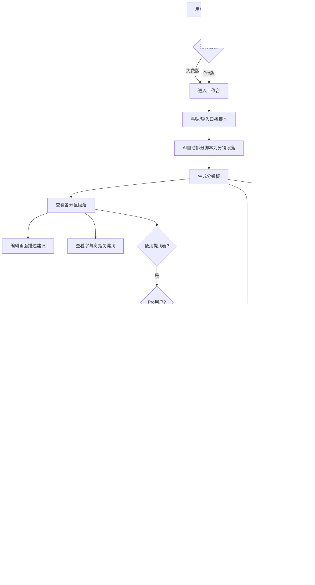
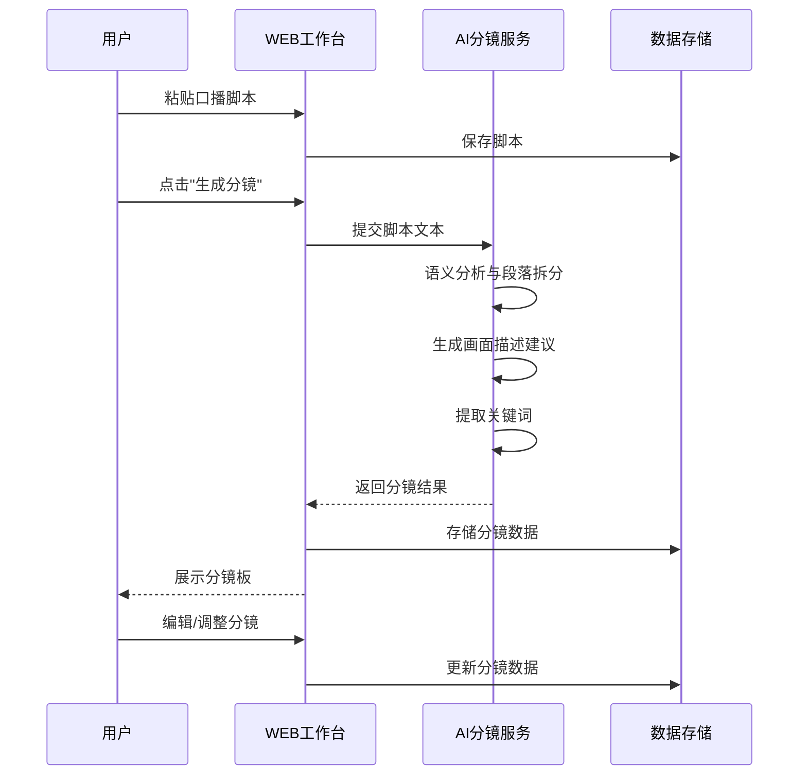
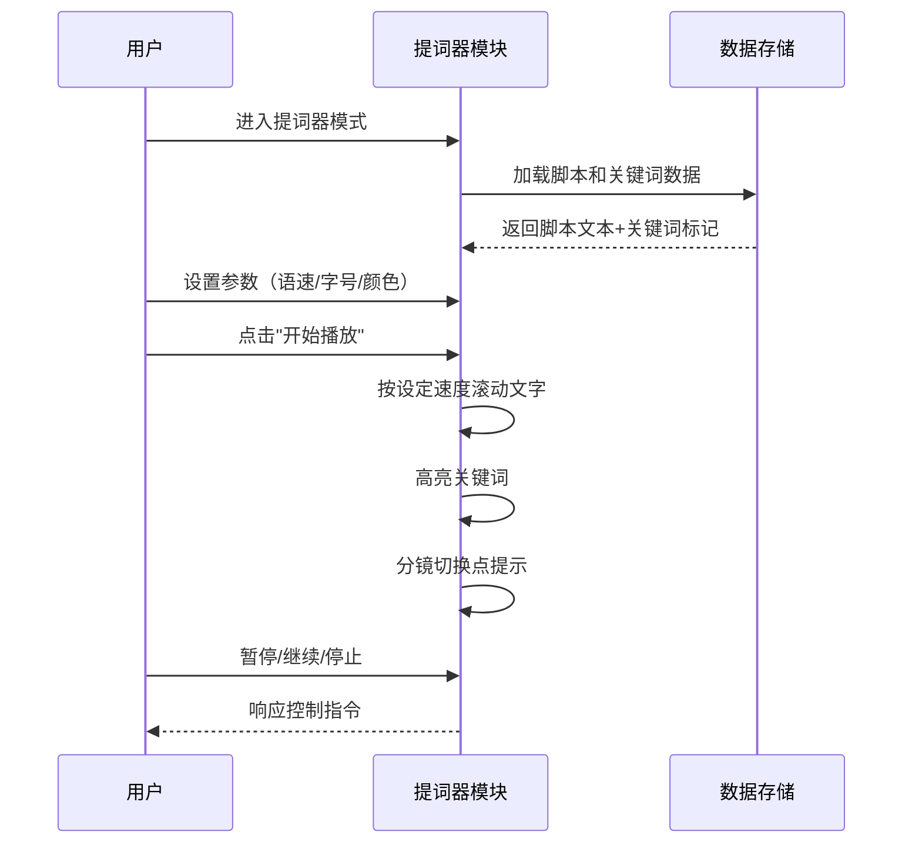
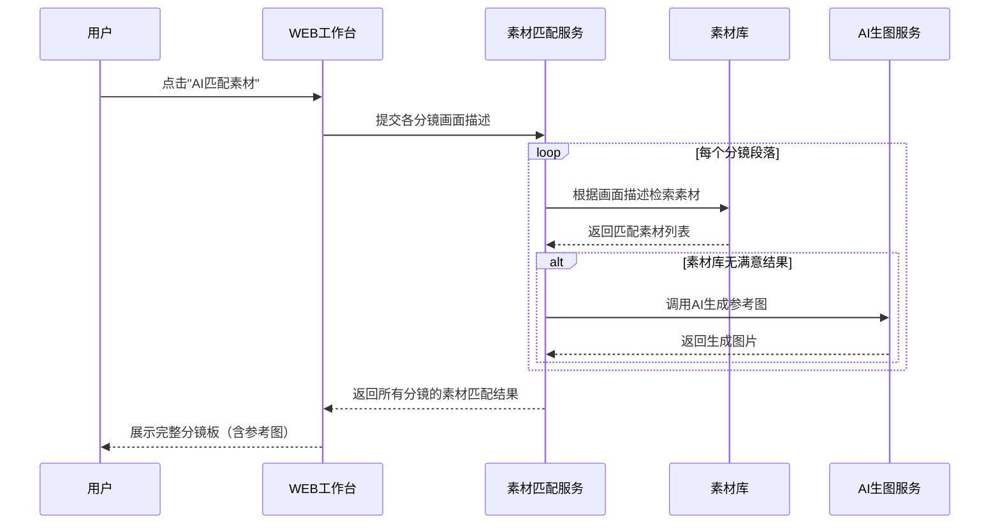
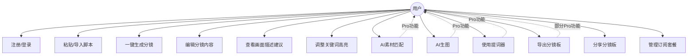

# 1.需求概述

## 1.1 需求介绍

口播脚本一键生视频分镜工具是一款面向短视频创作者的轻量级AI辅助工具，聚焦于口播视频制作流程中"脚本→分镜→提词"的前置规划环节。用户粘贴口播脚本文本后，系统通过AI自动将脚本拆分为多个分镜段落，为每段生成画面描述建议和字幕高亮关键词，并可进一步对接素材库或AI生图能力，形成完整分镜板。同时内置提词器功能，支持多种播放参数调节和多平台尺寸适配导出。

本工具定位为短视频创作前期规划工具，不涉及视频剪辑功能，填补口播视频从脚本撰写到实际拍摄之间缺少系统化分镜规划工具的市场空白。

### 1.1.1 所属领域

内容创作 / AI辅助创作工具 / 短视频制作

## 1.2 需求目标

1. **降低口播视频创作门槛**：让没有专业分镜经验的创作者也能快速生成结构化的分镜规划，减少从脚本到拍摄的规划时间。
2. **提升口播视频制作效率**：通过AI自动拆分脚本、生成画面建议和关键词标注，将传统需要数十分钟的人工分镜规划缩短至秒级完成。
3. **打通脚本到拍摄的最后一公里**：集成提词器功能和素材匹配，使创作者从脚本规划到实际拍摄准备一气呵成，无需在多个工具间切换。
4. **提供轻量化的专业体验**：不做重型视频剪辑，专注于口播视频的前置规划环节，保持工具的轻便和易用性。
5. **实现商业化可持续运营**：通过免费版+Pro版的订阅模式，满足不同层级创作者的需求。

## 1.3 系统使用角色

| 角色 | 说明 |
| --- | --- |
| 免费版用户 | 每月可使用10个脚本的基础分镜功能，体验核心"脚本→分镜"流程 |
| Pro版用户 | 无限脚本数量，享受AI素材匹配、提词器、多平台尺寸适配导出等高级功能 |
| 游客/未注册用户 | 可浏览产品介绍和示例，无法使用核心功能 |

## 1.4 业务流程图

# 2.功能原型

| 原型名称 | 原型链接 | 对应端 | 备注 |
| --- | --- | --- | --- |
| 口播脚本一键生视频分镜工具 | 待生成 | WEB端 | 主工作台，包含脚本编辑、分镜板、提词器、导出功能 |

# 3.需求清单

## 3.1 用户账户管理-WEB端

| 模块 | 一级功能 | 二级功能 | 功能描述 | 备注 |
| --- | --- | --- | --- | --- |
| 注册登录 | 用户注册 | 手机号注册 | 用户通过手机号+验证码完成注册 | 基础注册方式 |
| 注册登录 | 用户注册 | 第三方登录 | 支持微信/抖音等第三方账号快捷登录 | 降低注册门槛 |
| 注册登录 | 用户登录 | 账号密码登录 | 已注册用户通过手机号+密码登录 | |
| 注册登录 | 用户登录 | 验证码登录 | 通过手机号+短信验证码快捷登录 | |
| 注册登录 | 用户登录 | 第三方登录 | 已绑定第三方账号的用户快捷登录 | |
| 套餐管理 | 套餐查看 | 当前套餐信息展示 | 展示用户当前套餐类型、剩余脚本数、到期时间等信息 | |
| 套餐管理 | 套餐升级 | Pro版订阅购买 | 用户可购买Pro版订阅（¥15/月），升级后可使用全部高级功能 | |
| 套餐管理 | 套餐升级 | 免费版额度提示 | 免费版用户每月10个脚本额度用尽时，提示升级Pro版 | |
| 个人中心 | 账号设置 | 基本信息修改 | 修改昵称、头像等个人信息 | |
| 个人中心 | 账号设置 | 密码修改 | 修改登录密码 | |
| 个人中心 | 历史记录 | 脚本历史列表 | 查看历史创建的脚本列表，支持重新编辑和查看 | 免费版用户可查看已创建的脚本但受额度限制 |

## 3.2 脚本输入与编辑-WEB端

| 模块 | 一级功能 | 二级功能 | 功能描述 | 备注 |
| --- | --- | --- | --- | --- |
| 脚本输入 | 新建脚本 | 文本粘贴输入 | 用户在文本编辑区粘贴或手动输入口播脚本文本 | 支持富文本和纯文本 |
| 脚本输入 | 新建脚本 | 文件导入 | 支持导入.txt/.docx格式的脚本文件 | 便捷的文件导入方式 |
| 脚本输入 | 脚本编辑 | 实时文本编辑 | 用户可在输入区自由编辑、修改脚本文本内容 | |
| 脚本输入 | 脚本编辑 | 字数统计 | 实时展示脚本字数、预估口播时长 | 帮助用户把控脚本长度 |
| 脚本输入 | 脚本管理 | 脚本保存 | 将当前编辑的脚本保存至用户工作台，支持随时回看和修改 | |
| 脚本输入 | 脚本管理 | 脚本删除 | 删除不再需要的脚本记录 | |
| 脚本输入 | 脚本管理 | 脚本重命名 | 对已保存的脚本进行自定义命名 | |

## 3.3 AI分镜生成-WEB端

| 模块 | 一级功能 | 二级功能 | 功能描述 | 备注 |
| --- | --- | --- | --- | --- |
| 分镜生成 | 一键分镜 | AI脚本拆分 | 用户点击"生成分镜"按钮后，AI自动将口播脚本拆分为多个分镜段落，每段对应一个拍摄场景或话题段落 | 核心功能 |
| 分镜生成 | 一键分镜 | 分镜数量智能判断 | AI根据脚本内容结构和语义连贯性，智能决定最优的分镜段落数量 | |
| 分镜生成 | 画面描述 | 画面描述建议生成 | 为每个分镜段落自动生成画面描述建议，包括配图方向、视频素材方向、场景布置建议等 | 帮助用户理解每个分镜应配什么画面 |
| 分镜生成 | 画面描述 | 画面描述编辑 | 用户可对AI生成的画面描述建议进行手动编辑和调整 | |
| 分镜生成 | 关键词标注 | 字幕关键词提取 | AI为每个分镜段落提取字幕中应高亮显示的关键词 | 增强视频字幕表现力 |
| 分镜生成 | 关键词标注 | 关键词手动调整 | 用户可手动添加、删除或修改高亮关键词 | |
| 分镜生成 | 分镜板展示 | 分镜卡片视图 | 以卡片形式展示所有分镜段落，每张卡片包含脚本文本、画面描述、关键词 | 直观的分镜板展示 |
| 分镜生成 | 分镜板展示 | 分镜排序调整 | 用户可通过拖拽调整分镜段落的排列顺序 | |
| 分镜生成 | 分镜板展示 | 分镜合并/拆分 | 用户可手动合并相邻分镜或拆分单个分镜为多个 | 提供灵活的分镜结构调整能力 |
| 分镜生成 | 重新生成 | 单段重新生成 | 对单个分镜段落的画面描述或关键词进行重新生成 | 局部调整无需整体重做 |
| 分镜生成 | 重新生成 | 全部分镜重新生成 | 使用不同策略或参数重新生成全部分镜 | |

## 3.4 素材匹配与分镜板-WEB端（Pro功能）

| 模块 | 一级功能 | 二级功能 | 功能描述 | 备注 |
| --- | --- | --- | --- | --- |
| 素材匹配 | AI素材匹配 | 素材库匹配 | 根据每个分镜的画面描述，自动从素材库中匹配适合的配图或视频素材作为参考 | Pro功能 |
| 素材匹配 | AI素材匹配 | AI生图 | 调用AI生图能力，根据画面描述自动生成参考配图 | Pro功能 |
| 素材匹配 | 素材管理 | 素材替换 | 用户可手动替换AI匹配的素材，上传自有素材 | |
| 素材匹配 | 素材管理 | 素材预览 | 在分镜卡片中预览匹配/生成的参考图素材 | |
| 分镜板 | 完整分镜板 | 分镜板合成视图 | 将所有分镜段落（含画面描述和参考素材）合成为完整的分镜板视图 | 最终产出物 |
| 分镜板 | 完整分镜板 | 分镜板导出 | 将完整分镜板导出为图片或PDF格式 | Pro功能 |
| 分镜板 | 多平台适配 | 尺寸适配导出 | 支持按抖音（9:16）、B站（16:9）、小红书（3:4）等主流平台尺寸比例导出分镜板 | Pro功能 |
| 分镜板 | 多平台适配 | 多平台批量导出 | 一次操作同时生成多个平台尺寸的分镜板 | 提升效率 |

## 3.5 提词器-WEB端（Pro功能）

| 模块 | 一级功能 | 二级功能 | 功能描述 | 备注 |
| --- | --- | --- | --- | --- |
| 提词器 | 提词器模式 | 进入提词器 | 将当前脚本或选定分镜段落切换为提词器播放模式 | Pro功能 |
| 提词器 | 参数调节 | 语速调节 | 用户可调节提词器的文字滚动速度（慢/正常/快/自定义数值） | |
| 提词器 | 参数调节 | 字号调节 | 用户可调节提词器显示文字的大小 | 适配不同观看距离 |
| 提词器 | 参数调节 | 滚动速度调节 | 精细调节文字滚动速度，支持数值微调 | |
| 提词器 | 参数调节 | 显示颜色设置 | 支持设置文字颜色、背景颜色、高亮关键词颜色 | 满足不同光线环境 |
| 提词器 | 播放控制 | 开始/暂停 | 控制提词器文字的滚动播放与暂停 | |
| 提词器 | 播放控制 | 关键词高亮显示 | 在提词器滚动播放时，自动高亮显示已标注的关键词 | 帮助主播把握重点 |
| 提词器 | 播放控制 | 分镜段落切换提示 | 当滚动到分镜段落切换点时，显示视觉提示（如分隔线/提示音） | 提醒主播场景切换 |
| 提词器 | 格式导出 | 提词器格式导出 | 将脚本导出为通用提词器格式文件（如.txt带时间轴标记），可导入其他提词器软件使用 | Pro功能 |

## 3.6 导出与分享-WEB端

| 模块 | 一级功能 | 二级功能 | 功能描述 | 备注 |
| --- | --- | --- | --- | --- |
| 导出 | 脚本导出 | 纯文本导出 | 将脚本文本导出为.txt文件 | 免费版可用 |
| 导出 | 分镜板导出 | 图片导出 | 将分镜板导出为图片（PNG/JPG） | Pro功能 |
| 导出 | 分镜板导出 | PDF导出 | 将分镜板导出为PDF文档 | Pro功能 |
| 导出 | 分镜板导出 | 提词器格式导出 | 导出为可被其他提词器软件识别的格式文件 | Pro功能 |
| 分享 | 分镜板分享 | 链接分享 | 生成分镜板在线查看链接，方便团队协作或与摄影师沟通 | |
| 分享 | 分镜板分享 | 二维码分享 | 生成分镜板二维码，方便手机端查看 | |

# 4.非功能需求

## 4.1 使用界面需求

| 需求项 | 需求描述 |
| --- | --- |
| 响应式设计 | 工作台主体功能适配PC浏览器（最低分辨率1280×720），提词器功能支持平板横屏使用 |
| 操作简洁性 | 核心流程"粘贴脚本→生成分镜"操作步骤不超过3步 |
| 实时反馈 | AI生成过程中需展示进度提示（预计等待时间），避免用户产生无响应感 |
| 分镜板可视化 | 分镜卡片采用图文并排布局，左侧为脚本文本，右侧为画面描述和参考图 |
| 暗色模式 | 提词器模式支持暗色背景，减少拍摄现场光线干扰 |

## 4.2 软硬件环境需求

| 需求项 | 需求描述 |
| --- | --- |
| 运行环境 | WEB端，支持主流浏览器（Chrome 90+、Firefox 88+、Safari 14+、Edge 90+） |
| 网络要求 | 需要稳定互联网连接（AI分镜生成需调用云端AI服务） |
| 服务器环境 | 云端部署，需支持AI模型推理服务（GPU实例可选） |
| 客户端要求 | 无特殊硬件要求，标准PC/平板即可使用 |

## 4.3 性能需求

| 需求项 | 需求描述 |
| --- | --- |
| AI分镜生成时间 | 1000字以内的脚本，分镜生成响应时间不超过15秒 |
| 页面加载时间 | 工作台首页加载时间不超过3秒（首次访问） |
| 提词器流畅度 | 提词器滚动播放无卡顿，帧率不低于30fps |
| 并发支持 | 支持至少1000用户同时在线使用AI分镜生成功能 |
| 素材匹配时间 | 单个分镜的素材匹配/生成时间不超过10秒 |
| 导出时间 | 分镜板导出（图片/PDF）时间不超过5秒 |

## 4.4 约束性需求

1. **本系统不包含视频剪辑功能**，不做视频合成、特效添加、音频处理等视频后期编辑操作，仅聚焦于"脚本→分镜→提词"的前置规划环节。
2. **AI分镜生成依赖外部AI大模型服务**（如文本理解/生成模型），系统本身不训练AI模型，通过API调用方式接入。
3. **AI生图功能依赖外部图像生成服务**，系统不内建图像生成模型。
4. **免费版每月限制10个脚本**，超额需升级Pro版，不提供免费超额购买选项。
5. **本系统需要后台服务支撑**，包括用户认证、脚本存储、AI服务调用、套餐计费等功能。
6. **用户脚本数据存储在服务端**，需保证数据安全和隐私，不将用户脚本内容用于模型训练。

# 5.接口需求

## 5.1 硬件接口需求

本项目为标准WEB应用，无特殊硬件接口需求。

## 5.2 软件接口需求

| 模块 | 接口名称 | 输入 | 输出 | 功能描述 |
| --- | --- | --- | --- | --- |
| AI分镜生成 | AI文本理解接口 | 脚本文本内容 | 分镜段落划分结果、画面描述建议、关键词列表 | 调用外部AI大模型实现脚本拆分、画面描述生成和关键词提取 |
| 素材匹配 | 素材库检索接口 | 画面描述文本/关键词 | 匹配的素材列表（图片URL、缩略图） | 从素材库中检索与画面描述匹配的图片/视频素材 |
| AI生图 | AI图像生成接口 | 画面描述文本 | 生成的参考图片（URL/base64） | 调用AI图像生成模型，根据画面描述生成参考配图 |
| 用户认证 | 短信验证码接口 | 手机号 | 验证码发送结果 | 对接短信服务商，发送注册/登录验证码 |
| 第三方登录 | 微信OAuth接口 | 授权码 | 用户openid、昵称、头像 | 对接微信开放平台，实现微信快捷登录 |
| 第三方登录 | 抖音OAuth接口 | 授权码 | 用户openid、昵称、头像 | 对接抖音开放平台，实现抖音快捷登录 |
| 套餐计费 | 支付接口 | 订单信息 | 支付结果 | 对接支付渠道（微信/支付宝），处理Pro版订阅支付 |
| 文件导出 | PDF生成接口 | 分镜板数据 | PDF文件流 | 将分镜板内容渲染为PDF文件供用户下载 |
| 文件导出 | 图片渲染接口 | 分镜板数据、目标尺寸 | 图片文件流 | 将分镜板内容按指定尺寸渲染为图片文件 |

## 5.4 通讯接口需求

本项目为标准WEB应用，使用HTTPS协议进行前后端通讯，无特殊通讯接口需求。

# 6. 附录

## 流程图

### 核心用户流程：脚本到分镜

### 提词器播放流程

## 时序图

### 素材匹配流程

## （用户与系统交互）用例图

