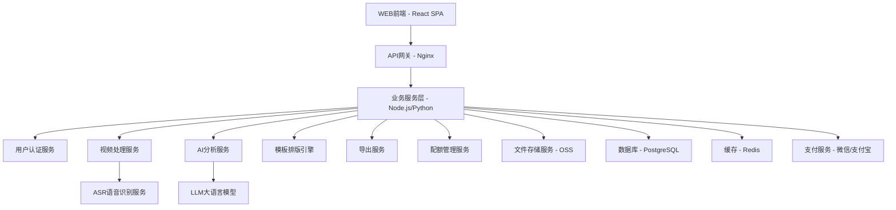
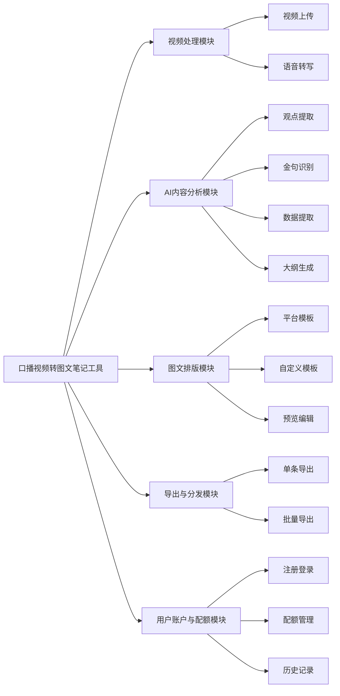
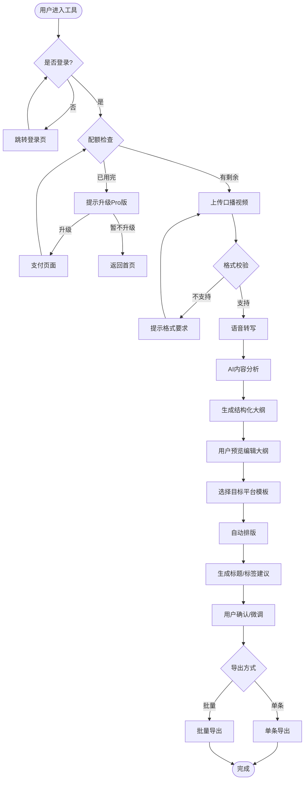
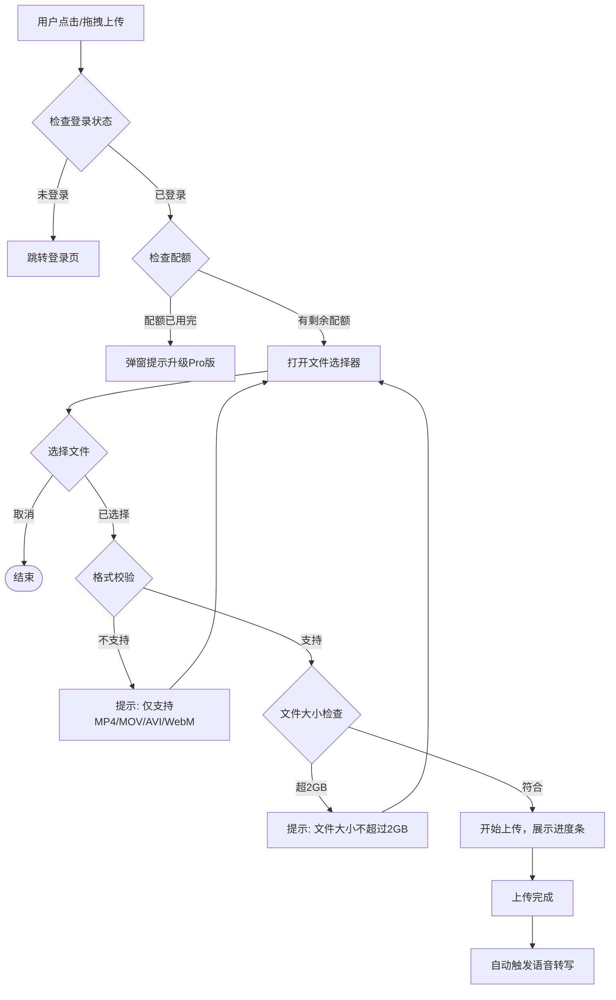
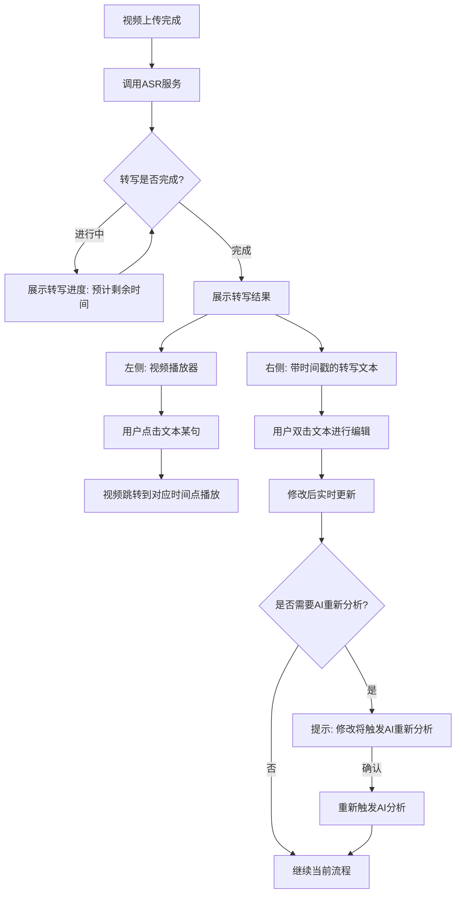
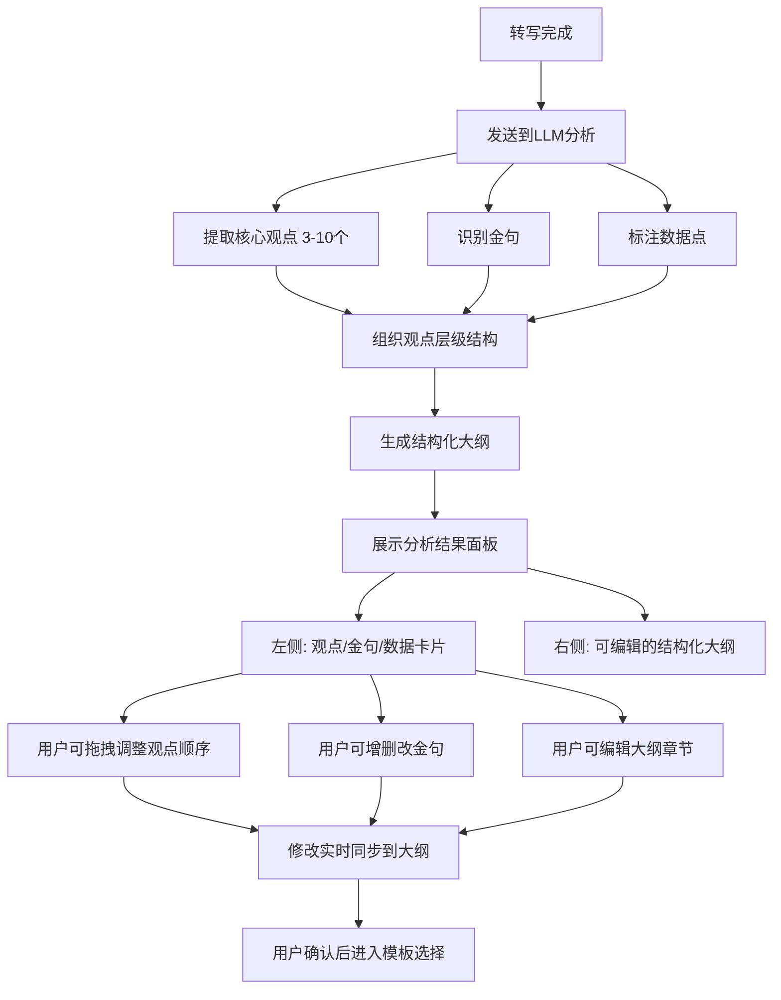
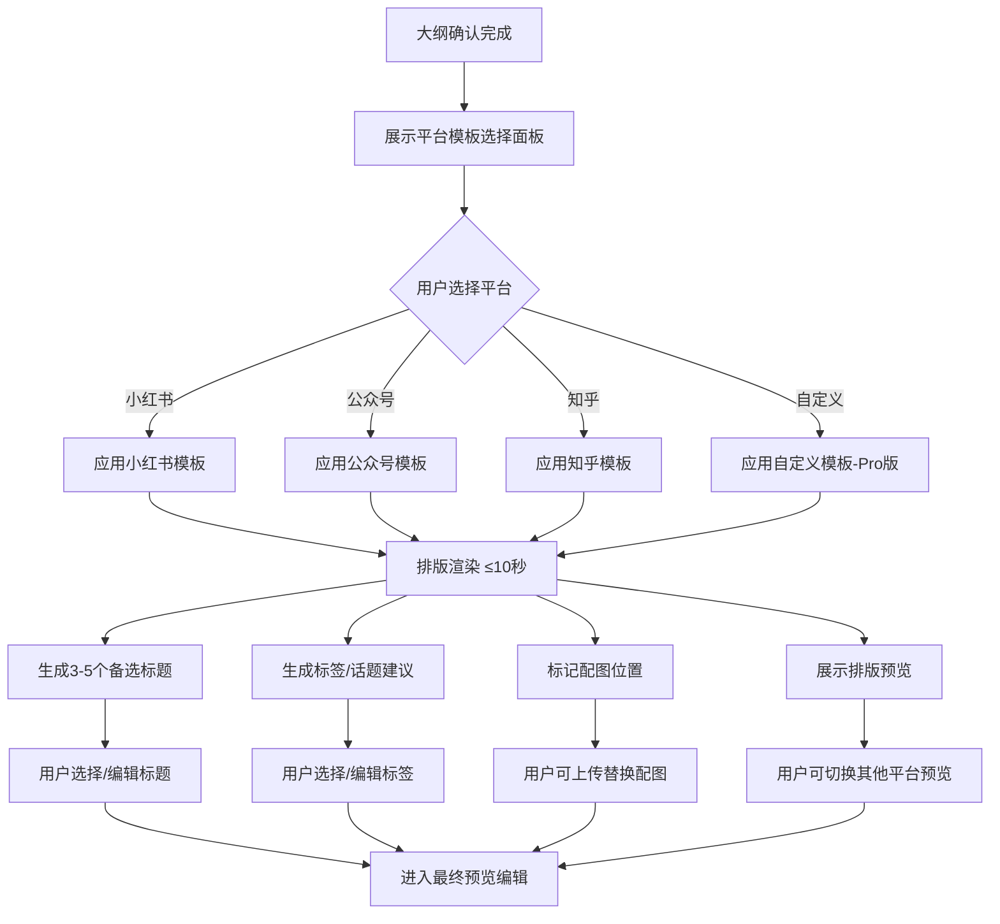
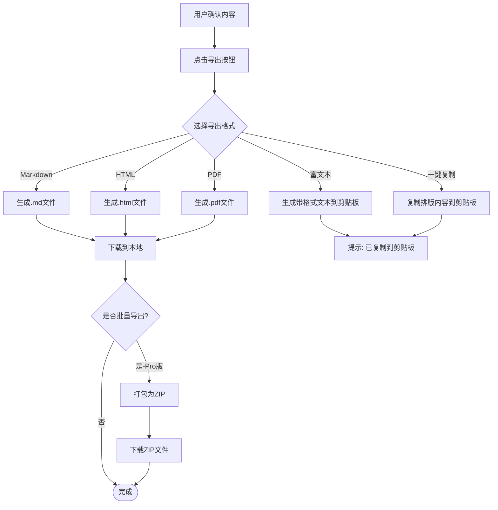
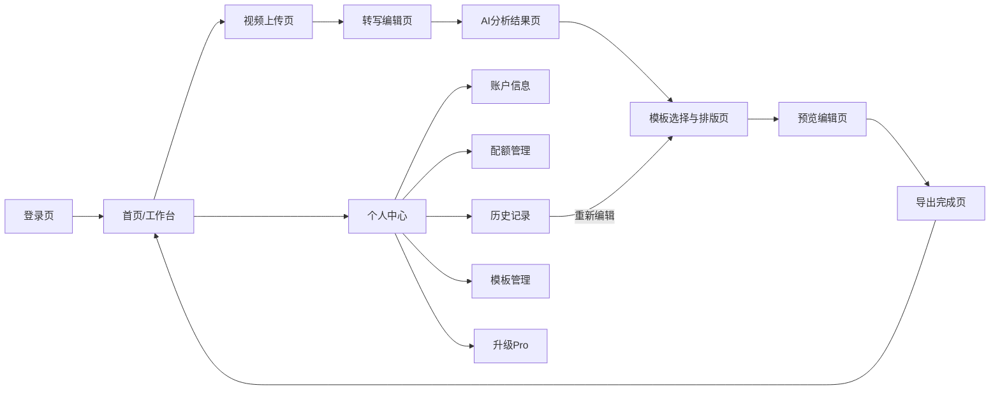
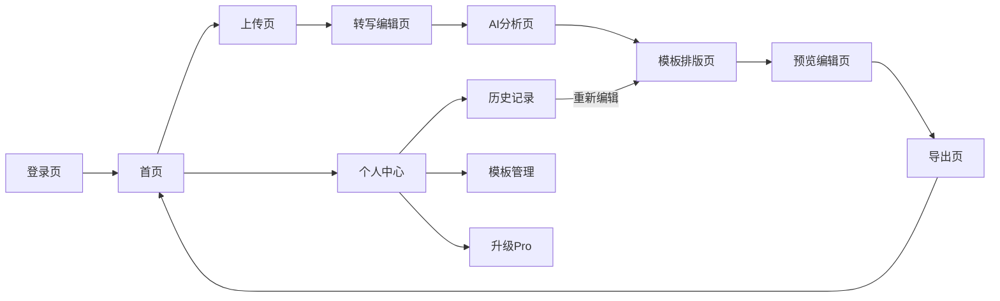

# 口播视频转图文笔记工具 - 产品需求文档（PRD）

| 版本号 | 变更日期 | 变更内容 | 变更人 | 审核人 |
| --- | --- | --- | --- | --- |
| V1.0 | 2026-06-28 | 初始版本创建 | 产品文档结对写作专家 | - |

---

# 1 概述

## 1.1 需求背景

知识类口播视频创作者在B站、抖音、视频号等平台发布视频后，普遍希望将同一内容同步分发至小红书、公众号、知乎等图文平台，以扩大受众覆盖面、实现"一鱼多吃"。然而，手动将视频内容改写为适配不同平台风格的图文笔记耗时耗力（通常需2-4小时/篇），且不同平台的排版风格、内容调性差异显著，导致跨平台分发效率极低。

**业务痛点：**
- 视频转图文手动改写耗时长，创作者难以持续产出
- 各图文平台排版规则不同，需逐一适配
- MCN机构需批量处理多位创作者内容，人力成本更高
- 知识讲师的课程视频难以高效转化为引流图文

**业务价值：**
- 将视频转图文时间从2-4小时缩短至5-10分钟，效率提升10倍以上
- AI自动适配多平台风格，降低创作者学习成本
- 批量处理能力满足MCN机构规模化需求
- 自定义模板保留品牌调性，增强用户粘性

**预期目标：**
- MVP上线后首月获取1000+注册用户
- 付费转化率目标5%（Pro版¥29/月）
- 用户平均转换时间≤10分钟
- AI观点提取准确率≥90%

## 1.2 名词解释

| **名词** | **说明** |
| --- | --- |
| ASR | Automatic Speech Recognition，自动语音识别，用于将视频中的语音转为文字 |
| LLM | Large Language Model，大语言模型，用于内容分析、观点提取、大纲生成 |
| 金句 | 视频中的精彩语句、核心结论、名言引用等值得突出的内容片段 |
| 数据点 | 视频中提到的数字、统计结果、关键指标等数据性内容 |
| 结构化大纲 | 由AI生成的、包含核心观点/金句/数据点的层级化图文内容框架 |
| 平台模板 | 针对特定图文平台（小红书/公众号/知乎）的排版风格预设 |
| 配额 | 用户使用额度，免费版每月5条视频转换，Pro版不限数量 |

## 1.3 产品介绍

口播视频转图文笔记工具是一款面向知识类内容创作者的AI辅助SaaS工具，专注于将口播视频内容自动转换为适配多个图文平台的结构化图文笔记。产品通过"上传视频→AI智能分析→模板排版→一键导出"的极简流程，帮助创作者高效实现跨平台内容分发。

### 1.3.1 范围说明

| 项 | 内容 |
| --- | --- |
| 包含功能 | 视频上传与转写、AI内容分析（观点提取/金句识别/数据标注）、结构化大纲生成、多平台模板排版（小红书/公众号/知乎）、自定义模板管理、多格式导出（Markdown/富文本/HTML/PDF）、批量处理、用户配额管理 |
| 不包含功能 | 视频剪辑编辑、直接发布到目标平台、移动端APP、暗色模式、说话人识别（MVP阶段） |

### 1.3.2 目标用户

| 角色 | 描述 | 典型使用场景 |
|------|------|-------------|
| 知识类口播视频创作者 | 在B站、抖音、视频号发布知识类口播视频的个人创作者 | 将已发布的口播视频转换为小红书笔记或公众号文章，扩大内容覆盖面 |
| MCN运营人员 | 负责管理多位创作者内容分发的MCN机构运营人员 | 批量处理多位创作者的视频内容，统一排版风格后分发至各图文平台 |
| 知识付费讲师 | 提供付费课程的知识类讲师 | 将课程视频中的精华内容提取为图文笔记，作为免费引流内容或课程补充材料 |

---

# 2 产品设计

## 2.1 系统架构图

## 2.2 业务模块图

## 2.3 主业务流程

## 2.4 功能列表

| 功能模块 | 功能名称 | 优先级 | 功能描述 |
| --- | --- | --- | --- |
| 视频处理 | 单文件上传 | P0 | 拖拽/点击上传口播视频，支持MP4/MOV/AVI/WebM，最大2GB |
| 视频处理 | 批量上传 | P1 | Pro版功能，一次上传多个视频（最多20个），进入批量队列 |
| 视频处理 | 格式校验 | P0 | 上传时自动校验格式，不支持的格式给出提示 |
| 视频处理 | 语音转写 | P0 | 视频语音自动转写为文字，准确率≥95% |
| 视频处理 | 时间戳对齐 | P1 | 转写文字与视频时间轴对齐，支持点击跳转 |
| 视频处理 | 转写结果编辑 | P0 | 用户可手动修正转写错误 |
| AI分析 | 核心观点提取 | P0 | AI自动识别3-10个核心观点，按重要程度排序 |
| AI分析 | 观点层级组织 | P0 | 将观点按逻辑关系组织为层级结构 |
| AI分析 | 金句识别标注 | P0 | AI识别金句/名言/核心结论并高亮展示 |
| AI分析 | 数据点识别 | P1 | AI识别数据/数字/统计结果并标注 |
| AI分析 | 结构化大纲生成 | P0 | 基于分析结果自动生成图文大纲 |
| AI分析 | 大纲编辑调整 | P0 | 用户可自由调整大纲结构和内容 |
| 图文排版 | 小红书模板 | P0 | 短段落、emoji点缀、标签前置的排版风格 |
| 图文排版 | 公众号模板 | P0 | 长段落、正式语气、结构化小标题的排版风格 |
| 图文排版 | 知乎模板 | P0 | 深度论述、数据引用、逻辑清晰的排版风格 |
| 图文排版 | 封面标题建议 | P0 | 根据平台风格生成3-5个备选标题 |
| 图文排版 | 标签/话题建议 | P0 | 根据平台生成标签或话题建议 |
| 图文排版 | 配图位置标记 | P1 | 在适当位置标记建议配图及内容描述 |
| 图文排版 | 自定义模板 | P1 | Pro版功能，创建/编辑/应用自定义排版模板 |
| 图文排版 | 多平台预览切换 | P0 | 切换预览不同平台排版效果 |
| 图文排版 | 移动端预览 | P2 | 模拟手机端查看排版效果 |
| 图文排版 | 内容微调 | P0 | 文本编辑、图片替换、样式微调 |
| 导出分发 | Markdown导出 | P0 | 导出为Markdown格式 |
| 导出分发 | 富文本导出 | P0 | 导出为带格式的富文本 |
| 导出分发 | HTML导出 | P1 | 导出为HTML文件 |
| 导出分发 | PDF导出 | P1 | 导出为PDF文件 |
| 导出分发 | 一键复制 | P0 | 一键复制排版内容到剪贴板 |
| 导出分发 | 批量转换导出 | P1 | Pro版功能，批量转换+打包导出ZIP |
| 用户账户 | 手机号注册登录 | P0 | 手机号+验证码注册登录 |
| 用户账户 | 微信登录 | P2 | 微信扫码登录 |
| 用户账户 | 配额查看管理 | P0 | 查看已用/剩余配额 |
| 用户账户 | Pro版订阅 | P0 | ¥29/月，不限转换数量 |
| 用户账户 | 转换历史记录 | P1 | 查看/重新编辑/导出历史记录 |

## 2.5 你的产品有哪些端

| 序号 | 端名称 | 端类型 | 目标用户 | 说明 |
| --- | --- | --- | --- | --- |
| 1 | 口播视频转图文笔记工具 WEB端 | WEB端 | 知识创作者/MCN运营/知识讲师 | 浏览器中使用，主要适配PC端（1280px+） |

---

# 3 产品功能

## 3.1 WEB端功能

### 3.1.1 视频上传

视频上传功能是用户使用工具的起点，支持通过拖拽或点击方式上传口播视频文件。系统自动校验视频格式，展示上传进度，上传完成后自动触发后续的语音转写流程。

**功能描述**

| 项 | 内容 |
| --- | --- |
| 优先级 | P0 |
| 依赖需求 | 无 |
| 前置条件 | 用户已登录且有剩余配额 |

**支持格式：** MP4、MOV、AVI、WebM
**文件大小限制：** 单文件最大2GB
**批量上传：** Pro版功能，单次最多20个文件

**业务规则：**
1. 上传前检查用户配额，免费版剩余0次时禁止上传并引导升级
2. 格式不支持时显示明确提示，列出支持的格式清单
3. 上传过程中展示进度条和预估剩余时间
4. 支持断点续传，上传速度不低于用户带宽的60%
5. 批量上传时展示队列进度，支持暂停/恢复

### 3.1.2 视频上传—详细流程

### 3.1.3 视频上传—主要原型

[视频上传组件原型](assets/prototypes/video-upload-widget.html)

**验收标准：**
- [ ] 正常流程：用户拖拽/点击上传符合格式要求的视频文件，进度条正常展示，上传完成后自动进入转写
- [ ] 异常流程：上传不支持格式时弹出提示；超大小文件被拦截；配额用完时引导升级
- [ ] 性能要求：上传速度不低于用户带宽的60%，支持断点续传

---

### 3.1.4 语音转写与编辑

视频上传完成后，系统自动调用ASR服务将视频中的语音转为文字。转写结果与视频时间轴对齐，用户可点击任意文字片段跳转到视频对应位置播放，也可直接编辑修正转写错误。

**功能描述**

| 项 | 内容 |
| --- | --- |
| 优先级 | P0 |
| 依赖需求 | 视频上传完成 |
| 前置条件 | 视频上传成功 |

**业务规则：**
1. 转写准确率需达到95%以上，支持普通话和常见口音
2. 10分钟以内的视频，转写时间不超过3分钟
3. 转写文字按句分段，每段带时间戳
4. 用户编辑转写文本后，标记"已手动修改"状态
5. 转写完成后自动触发AI内容分析

### 3.1.5 语音转写与编辑—详细流程

### 3.1.6 语音转写与编辑—主要原型

[语音转写编辑组件原型](assets/prototypes/transcription-widget.html)

**验收标准：**
- [ ] 正常流程：视频上传后自动开始转写，转写完成后展示带时间戳的文本，点击文本可跳转视频
- [ ] 异常流程：ASR服务异常时提示重试；视频无语音内容时提示用户
- [ ] 性能要求：10分钟视频转写时间≤3分钟

---

### 3.1.7 AI内容分析

转写完成后，系统自动调用LLM对文本内容进行深度分析，提取核心观点、识别金句、标注数据点，并生成结构化图文大纲。分析结果以可编辑的层级结构展示，用户可增删改任何内容。

**功能描述**

| 项 | 内容 |
| --- | --- |
| 优先级 | P0 |
| 依赖需求 | 语音转写完成 |
| 前置条件 | 转写文本可用 |

**AI分析维度：**
1. **核心观点提取**：识别3-10个核心观点，按重要程度排序，组织为层级结构（主题→子观点→论据）
2. **金句识别**：标注视频中的精彩语句、核心结论、名言引用
3. **数据点标注**：识别数字、统计结果、关键指标
4. **大纲生成**：基于以上分析结果自动生成结构化图文大纲

**业务规则：**
1. 转写完成后，AI分析+大纲生成总时间不超过2分钟
2. 核心观点提取准确率≥90%，金句识别准确率≥85%
3. 用户编辑观点/金句/大纲后，变更实时保存
4. 大纲结构根据目标平台自动调整风格（小红书偏短句/知乎偏深度）

### 3.1.8 AI内容分析—详细流程

### 3.1.9 AI内容分析—主要原型

[AI内容分析组件原型](assets/prototypes/ai-analysis-widget.html)

**验收标准：**
- [ ] 正常流程：转写完成后2分钟内展示分析结果；观点/金句/数据点分类清晰；大纲可编辑
- [ ] 异常流程：AI分析失败时提供重试按钮；内容为空或过短时给出提示
- [ ] 性能要求：分析延迟≤2分钟（10分钟视频）

---

### 3.1.10 平台模板排版

用户选择目标平台后，系统根据对应平台模板自动排版图文内容，同时生成封面标题建议、标签/话题建议、配图位置标记。支持一键切换不同平台模板预览效果。

**功能描述**

| 项 | 内容 |
| --- | --- |
| 优先级 | P0 |
| 依赖需求 | AI内容分析完成 |
| 前置条件 | 结构化大纲已确认 |

**平台模板特性：**

| 平台 | 排版风格 | 标题风格 | 特殊元素 |
| --- | --- | --- | --- |
| 小红书 | 短段落、emoji点缀、标签前置、适当分段 | 吸睛、口语化、带emoji | 配图位置标记、标签5-10个 |
| 公众号 | 长段落、正式语气、结构化小标题 | 深度、价值导向 | 文章摘要、配图位置标记 |
| 知乎 | 深度论述、数据引用、逻辑清晰 | 提问式、深度分析式 | 话题建议、配图位置标记 |

**业务规则：**
1. 每个平台生成3-5个备选标题
2. 小红书/公众号提供5-10个标签建议，知乎提供话题建议
3. 模板排版渲染时间≤10秒
4. 支持实时切换平台模板预览效果
5. 自定义模板为Pro版功能

### 3.1.11 平台模板排版—详细流程

### 3.1.12 平台模板排版—主要原型

[平台模板排版组件原型](assets/prototypes/template-layout-widget.html)

**验收标准：**
- [ ] 正常流程：选择平台后10秒内展示排版结果；标题/标签建议合理；配图位置标记清晰
- [ ] 异常流程：排版服务异常时提示重试；自定义模板格式错误时给出校验提示
- [ ] 性能要求：排版渲染≤10秒

---

### 3.1.13 预览与编辑

最终排版结果展示在预览区，用户可对文本内容进行最后修改，替换配图，微调样式参数（字号、颜色、间距），并可在多平台间切换预览。支持移动端预览模拟。

**功能描述**

| 项 | 内容 |
| --- | --- |
| 优先级 | P0 |
| 依赖需求 | 模板排版完成 |
| 前置条件 | 至少选择一个平台模板 |

**业务规则：**
1. 预览区实时反映所有编辑修改
2. 切换平台模板时保留用户已做的编辑内容
3. 移动端预览以手机模拟框展示
4. 支持一键撤销/重做编辑操作

### 3.1.14 预览与编辑—主要原型

[预览编辑组件原型](assets/prototypes/preview-edit-widget.html)

**验收标准：**
- [ ] 正常流程：编辑内容实时反映在预览区；多平台切换正常；移动端预览正确展示
- [ ] 异常流程：图片上传失败时保留原占位符
- [ ] 性能要求：编辑操作响应≤200ms

---

### 3.1.15 导出功能

用户确认排版内容后，可选择多种格式导出图文内容。支持单条导出和批量导出（Pro版），导出的内容保留排版格式。

**功能描述**

| 项 | 内容 |
| --- | --- |
| 优先级 | P0 |
| 依赖需求 | 预览编辑完成 |
| 前置条件 | 内容已确认 |

**导出格式：**
- Markdown（.md）：便于复制到各平台
- 富文本（RTF）：可直接粘贴到公众号编辑器
- HTML（.html）：便于自部署网站或个人博客
- PDF（.pdf）：便于归档和分享
- 一键复制到剪贴板：保留排版格式

**批量导出（Pro版）：**
- 将多个转换结果打包为ZIP下载
- 支持为批量任务统一应用同一模板

### 3.1.16 导出功能—详细流程

### 3.1.17 导出功能—主要原型

[导出功能组件原型](assets/prototypes/export-widget.html)

**验收标准：**
- [ ] 正常流程：各格式导出成功；复制功能保留格式；批量导出打包正确
- [ ] 异常流程：导出服务异常时提示重试；批量导出部分失败时提示具体失败项
- [ ] 性能要求：单条导出≤5秒；批量10条导出≤30秒

---

### 3.1.18 模板管理

Pro版用户可创建、编辑和管理自定义排版模板。自定义模板允许定义段落风格、标题样式、标注方式等，确保内容输出保持品牌调性一致。

**功能描述**

| 项 | 内容 |
| --- | --- |
| 优先级 | P1 |
| 依赖需求 | 用户为Pro版订阅者 |
| 前置条件 | Pro版订阅生效 |

**业务规则：**
1. 自定义模板仅Pro版用户可用，免费版用户查看时引导升级
2. 每个Pro用户最多创建10个自定义模板
3. 模板编辑支持实时预览
4. 模板可设置名称、描述、分类标签
5. 支持基于已有平台模板"另存为"自定义模板

### 3.1.19 模板管理—主要原型

[模板管理组件原型](assets/prototypes/template-manage-widget.html)

**验收标准：**
- [ ] 正常流程：Pro用户可创建/编辑/删除自定义模板；模板预览正确；应用模板后排版符合设定
- [ ] 异常流程：免费版用户点击创建时展示升级引导；超过10个模板时提示上限

---

### 3.1.20 个人中心

用户可查看和管理账户信息、套餐配额、转换历史记录。

**功能描述**

| 项 | 内容 |
| --- | --- |
| 优先级 | P0 |
| 依赖需求 | 用户已登录 |
| 前置条件 | 无 |

**功能包含：**
1. 个人信息管理（昵称、头像）
2. 套餐信息展示（当前套餐、到期时间）
3. 配额使用展示（已用/剩余/总量）
4. 升级Pro版入口
5. 转换历史记录列表（视频信息、转换时间、目标平台、操作按钮）
6. 历史记录支持重新编辑、重新导出、删除

### 3.1.21 个人中心—主要原型

[个人中心组件原型](assets/prototypes/user-center-widget.html)

**验收标准：**
- [ ] 正常流程：配额信息准确展示；历史记录可正常查看/编辑/导出/删除
- [ ] 异常流程：无历史记录时展示空态引导

---

# 4 产品原型

## 4.1 页面跳转逻辑图

## 4.2 全站点原型设计

### 4.2.1 口播视频转图文笔记工具 WEB端

**页面清单：**

| 序号 | 页面名称 | 所属模块 | 页面描述 | 关键元素 |
| --- | --- | --- | --- | --- |
| 1 | 登录页 | 用户账户 | 手机号+验证码登录 | Logo、手机号输入框、验证码输入框、登录按钮 |
| 2 | 首页/工作台 | 主功能区 | 用户主工作区，展示快速入口和最近任务 | 上传入口、最近转换列表、配额概览、快速操作 |
| 3 | 视频上传页 | 视频处理 | 视频上传与转写进度 | 拖拽上传区、格式说明、进度条、视频预览 |
| 4 | 转写编辑页 | 视频处理 | 转写结果与视频同步 | 视频播放器、转写文本区、时间戳、编辑功能 |
| 5 | AI分析结果页 | AI分析 | 核心观点/金句/数据展示 | 观点卡片、金句高亮、数据标注、大纲树 |
| 6 | 模板排版页 | 图文排版 | 平台选择与排版预览 | 平台Tab、排版预览区、标题建议、标签建议 |
| 7 | 预览编辑页 | 图文排版 | 最终预览与微调 | 富文本编辑器、手机预览框、样式面板、配图替换 |
| 8 | 导出页 | 导出分发 | 格式选择与下载 | 格式选项卡、导出按钮、批量导出面板 |
| 9 | 个人中心 | 用户账户 | 账户信息与配额 | 个人信息卡片、配额进度条、套餐信息 |
| 10 | 历史记录页 | 用户账户 | 转换历史列表 | 搜索框、筛选器、记录列表、操作按钮 |
| 11 | 模板管理页 | 图文排版 | 自定义模板管理 | 模板卡片网格、创建按钮、编辑/预览/删除 |
| 12 | 升级Pro页 | 用户账户 | Pro版订阅页 | 权益对比表、价格展示、支付入口 |

**交互说明：**
- 页面跳转关系：

- 特殊交互：
  1. 视频上传支持拖拽文件到上传区域，拖入时高亮边框
  2. 转写文本与视频播放同步高亮当前句
  3. AI分析过程中展示分步进度动画（转写→分析→生成）
  4. 平台模板切换时使用平滑过渡动画
  5. 导出完成后展示成功动画和导出文件卡片
  6. 配额不足时顶部出现橙色提示条
  7. 空数据状态：历史记录为空时展示引导上传的插画
  8. 加载状态：AI处理时展示骨架屏或步骤进度条

**产品原型：**

[🖥️ 打开口播视频转图文笔记工具 WEB端全站点原型](assets/prototypes/web-prototype.html)

---

# 5 数据需求

## 5.1 数据使用规格

**视频转换任务数据：**

| **字段** | **是否必填** | **描述** | **数据类型** |
| --- | --- | --- | --- |
| task_id | 是 | 任务唯一标识 | UUID |
| user_id | 是 | 所属用户ID | UUID |
| video_url | 是 | 视频文件存储URL | String |
| video_name | 是 | 视频文件名 | String |
| video_duration | 是 | 视频时长（秒） | Number |
| video_size | 是 | 文件大小（字节） | Number |
| transcription_text | 是 | 转写文本内容 | Text |
| outline_data | 是 | 结构化大纲JSON | JSON |
| template_id | 否 | 使用的模板ID | UUID |
| target_platform | 是 | 目标平台（xhs/gzh/zhihu/custom） | String |
| status | 是 | 任务状态 | Enum |
| created_at | 是 | 创建时间 | DateTime |
| updated_at | 是 | 更新时间 | DateTime |

**用户数据：**

| **字段** | **是否必填** | **描述** | **数据类型** |
| --- | --- | --- | --- |
| user_id | 是 | 用户唯一标识 | UUID |
| phone | 是 | 手机号 | String |
| nickname | 否 | 昵称 | String |
| avatar_url | 否 | 头像URL | String |
| plan_type | 是 | 套餐类型（free/pro） | Enum |
| plan_expire_at | 否 | Pro版到期时间 | DateTime |
| quota_total | 是 | 当月配额总量 | Number |
| quota_used | 是 | 已使用配额 | Number |
| created_at | 是 | 注册时间 | DateTime |

## 5.2 统计数据

1. 统计每日视频转换次数、成功/失败率（P0）
2. 统计各平台模板使用占比（P1）
3. 统计用户留存率（次日/7日/30日）（P1）
4. 统计Pro版转化率与续费率（P0）
5. 统计AI分析平均耗时与用户满意度（P1）

## 5.3 埋点需求

| 页面 | 事件 | 采集字段 | 说明 |
| --- | --- | --- | --- |
| 首页 | 点击上传 | user_id, timestamp | 统计上传转化率 |
| 上传页 | 上传完成 | task_id, video_duration, file_size | 统计上传成功率 |
| 转写页 | 编辑转写 | task_id, edit_count | 统计转写质量 |
| AI分析页 | 编辑观点 | task_id, action(add/delete/modify) | 统计AI准确度 |
| 模板页 | 切换平台 | task_id, platform | 统计平台偏好 |
| 模板页 | 选择标题 | task_id, title_index | 统计标题建议质量 |
| 导出页 | 导出 | task_id, format, platform | 统计导出偏好 |
| 个人中心 | 点击升级 | user_id, current_plan | 统计升级意向 |
| 升级页 | 完成支付 | user_id, plan_type, amount | 统计付费转化 |

---

# 6 非功能需求

## 6.1 性能需求

**6.1.1 延迟**

| 编号 | 项目 | 最大延迟 | 平均延迟 | 优先级 | 备注 |
| --- | --- | --- | --- | --- | --- |
| 0001 | 视频语音转写（10分钟内视频） | ≤3分钟 | ≤2分钟 | 高 | |
| 0002 | AI内容分析+大纲生成 | ≤2分钟 | ≤1.5分钟 | 高 | |
| 0003 | 模板排版渲染 | ≤10秒 | ≤5秒 | 高 | |
| 0004 | 页面加载时间 | ≤3秒 | ≤1.5秒 | 高 | 首屏加载 |
| 0005 | 用户编辑操作响应 | ≤200ms | ≤100ms | 中 | |
| 0006 | 导出单条文件 | ≤5秒 | ≤3秒 | 中 | |

**6.1.2 吞吐量**

| 编号 | 项 | 吞吐量 | 备注 |
| --- | --- | --- | --- |
| 0001 | 并发视频转写 | 每分钟100个 | |
| 0002 | 并发AI分析 | 每分钟200个 | |
| 0003 | 文件上传 | 每分钟500次 | |

**6.1.3 容量**

| 编号 | 项 | 容量 | 备注 |
| --- | --- | --- | --- |
| 0001 | 系统注册用户数 | ≤1,000,000 | |
| 0002 | 同时在线用户数 | ≥100 | MVP阶段 |
| 0003 | 日活跃用户数 | ≤10,000 | MVP阶段 |
| 0004 | 批量处理队列 | 每小时≥50个视频 | Pro版 |

## 6.2 安全需求

| 编号 | 项 |
| --- | --- |
| 0001 | 用户视频文件存储加密，传输使用HTTPS |
| 0002 | 用户视频文件最长保留7天，到期自动清理 |
| 0003 | 用户认证Token有效期24小时，支持刷新 |
| 0004 | 支付信息不存储在本地，通过第三方支付平台处理 |
| 0005 | AI生成内容标注"AI辅助生成"声明（合规要求） |
| 0006 | 防止非授权用户访问他人视频和转换结果 |

## 6.3 可靠性

| 编号 | 项 | 值 |
| --- | --- | --- |
| 0001 | 系统可用性 | 99.9% |
| 0002 | 平均正常运行时间 | 30天 |
| 0003 | 平均故障恢复时间 | 30分钟 |

## 6.4 可连续性

| 编号 | 项 |
| --- | --- |
| 0001 | 系统需要 7 × 24 式的全天候运行 |
| 0002 | ASR/LLM服务需有降级方案（服务不可用时提示用户稍后重试） |

## 6.5 可恢复性

| 编号 | 项 |
| --- | --- |
| 0001 | 每日凌晨进行数据库全量备份，保留30天 |
| 0002 | 每小时进行增量备份 |
| 0003 | 重大故障1-3小时内恢复服务 |

## 6.6 兼容性

| 编号 | 要求 | 备注 |
| --- | --- | --- |
| 0001 | 兼容Chrome >=90 | |
| 0002 | 兼容Firefox >=88 | |
| 0003 | 兼容Safari >=14 | |
| 0004 | 兼容Edge >=90 | |
| 0005 | 最低分辨率1280×720 | PC端为主 |

## 6.7 易用性

| 编号 | 要求 | 备注 |
| --- | --- | --- |
| 0001 | 核心操作路径不超过3步 | 上传→分析→导出 |
| 0002 | 普通用户无需培训即可使用核心功能 | |
| 0003 | 首次使用提供简洁操作引导 | 可跳过 |

---

# 7 总结

## 7.1 上线计划

| 阶段 | 时间 | 内容 | 负责人 |
| --- | --- | --- | --- |
| 开发阶段 | 2026-07-01 ~ 2026-07-05 | 核心功能开发（视频转写+AI分析+模板排版+导出） | 开发团队 |
| 测试阶段 | 2026-07-06 ~ 2026-07-07 | 功能测试、性能测试、兼容性测试 | 测试团队 |
| 灰度阶段 | 2026-07-08 | 灰度10%用户，验证稳定性 | 运营团队 |
| 全量上线 | 2026-07-10 | 全量开放 | 全团队 |

## 7.2 后续迭代规划

- V1.1：增加说话人识别功能；支持视频URL直接导入（无需上传文件）
- V1.2：增加暗色模式；移动端APP适配
- V1.3：接入更多图文平台（头条号、百家号等）；支持AI配图生成
- V1.4：团队协作功能；API开放平台
- V2.0：支持更多视频语言（英语、粤语等）；AI智能封面图生成

## 7.3 参考文档

- 需求文档：《口播视频转图文笔记工具 - 需求文档》（SKI-31）
- 小红书创作者运营规范
- 公众号图文排版最佳实践
- 知乎内容创作指南
