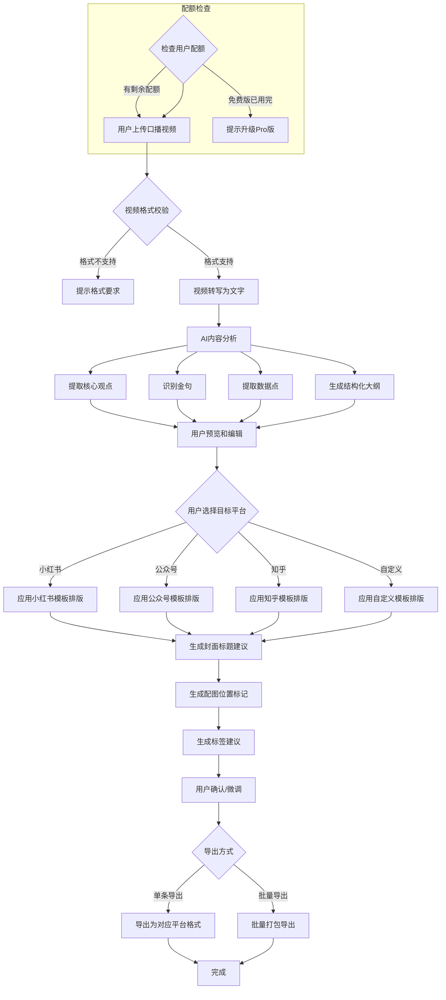
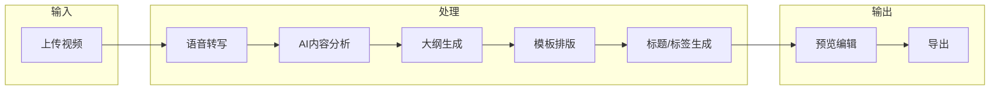
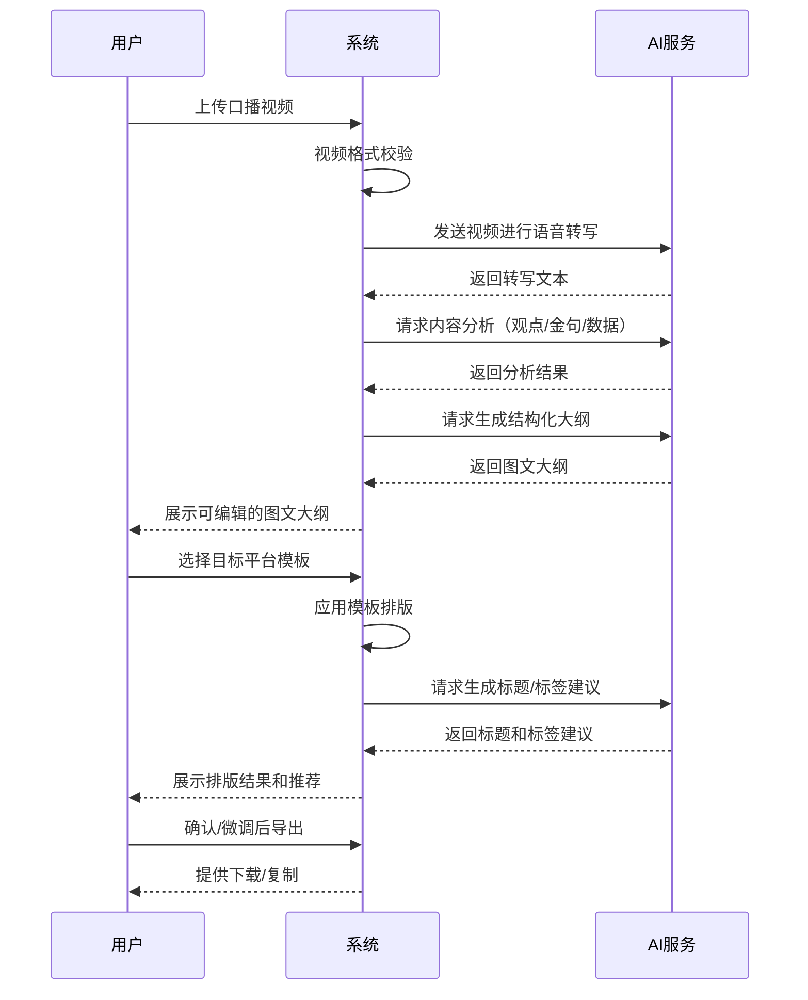
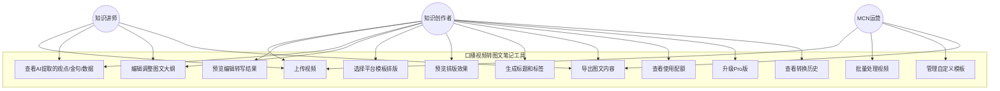
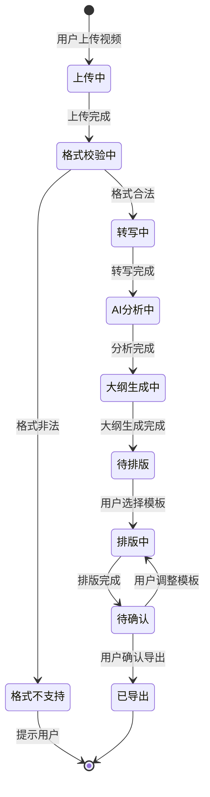

# 1. 需求概述

## 1.1 需求介绍

口播视频转图文笔记工具是一款面向知识类内容创作者的AI辅助工具，专注于将口播视频内容自动转换为适配多个图文平台（小红书、公众号、知乎）的结构化图文笔记。

该工具解决的核⼼痛点是：知识类口播视频创作者在B站、抖音、视频号等平台发布视频后，往往希望将同样的内容同步分发至图文平台以扩大受众覆盖面，但手动将视频内容改写为图文格式耗时耗力，且不同平台的排版风格、内容调性差异较大，导致"一鱼多吃"的效率极低。

工具通过AI技术自动完成视频转写、核心观点提取、金句识别、数据点标注，并生成结构化图文大纲，再按目标平台的模板自动排版，大幅降低跨平台内容分发的成本。

### 1.1.1 所属领域

内容创作 / 创作者经济 / AI辅助内容生产

## 1.2 需求目标

1. **降低跨平台分发成本**：将口播视频转换为图文笔记的时间从手动2-4小时缩短至5-10分钟
2. **保持内容质量**：AI提取的核心观点准确率达到90%以上，金句识别准确率85%以上
3. **多平台适配**：支持小红书、公众号、知乎三个主流图文平台的模板化排版
4. **批量化处理**：支持MCN等机构用户的批量视频转图文需求
5. **品牌调性保持**：支持自定义模板，保留创作者/品牌的独特风格

## 1.3 系统使用角色

| 角色 | 描述 | 典型使用场景 |
|------|------|-------------|
| 知识类口播视频创作者 | 在B站、抖音、视频号发布知识类口播视频的个人创作者 | 将已发布的口播视频转换为小红书笔记或公众号文章，扩大内容覆盖面 |
| MCN运营人员 | 负责管理多位创作者内容分发的MCN机构运营人员 | 批量处理多位创作者的视频内容，统一排版风格后分发至各图文平台 |
| 知识付费讲师 | 提供付费课程的知识类讲师 | 将课程视频中的精华内容提取为图文笔记，作为免费引流内容或课程补充材料 |

## 1.4 业务流程图

# 2. 功能原型

| 原型名称 | 原型链接 | 对应端 | 备注 |
| --- | --- | --- | --- |
| 口播视频转图文笔记工具 - 主界面 | 待设计 | WEB端 | 视频上传、内容预览、模板选择、导出操作的主工作区 |
| 口播视频转图文笔记工具 - 模板管理 | 待设计 | WEB端 | 平台模板选择和自定义模板编辑界面 |
| 口播视频转图文笔记工具 - 批量处理 | 待设计 | WEB端 | 批量上传和批量导出管理界面 |
| 口播视频转图文笔记工具 - 个人中心 | 待设计 | WEB端 | 配额查看、历史记录、账户管理界面 |

# 3. 需求清单

## 3.1 视频处理模块

| 模块 | 一级功能 | 二级功能 | 功能描述 | 备注 |
| --- | --- | --- | --- | --- |
| 视频上传 | 视频上传 | 单文件上传 | 支持用户通过拖拽或点击上传口播视频文件，支持MP4、MOV、AVI、WebM等常见格式 | 单文件最大2GB |
| 视频上传 | 视频上传 | 批量上传 | Pro版功能，支持一次上传多个视频文件，进入批量处理队列 | 单次最多20个文件 |
| 视频上传 | 视频上传 | 格式校验 | 上传时自动校验视频格式是否支持，不支持的格式给出明确提示 | |
| 视频上传 | 视频上传 | 上传进度展示 | 上传过程中展示进度条和预估剩余时间 | |
| 视频转写 | 语音转写 | 语音识别 | 将视频中的语音内容自动转写为文字，支持普通话和常见口音 | 转写准确率≥95% |
| 视频转写 | 语音转写 | 说话人识别 | 识别并区分视频中的不同说话人（如主讲人和互动者） | MVP阶段可暂不支持 |
| 视频转写 | 语音转写 | 时间戳对齐 | 转写文字与视频时间轴对齐，支持点击文字跳转到对应视频位置 | |
| 视频转写 | 语音转写 | 转写结果编辑 | 用户可手动修正转写错误，修改后AI分析结果实时更新 | |

## 3.2 AI内容分析模块

| 模块 | 一级功能 | 二级功能 | 功能描述 | 备注 |
| --- | --- | --- | --- | --- |
| 观点提取 | 核心观点提取 | 自动观点识别 | AI自动识别视频内容中的核心观点和论点，按重要程度排序 | 提取3-10个核心观点 |
| 观点提取 | 核心观点提取 | 观点层级组织 | 将核心观点按逻辑关系组织为层级结构（主题→子观点→论据） | |
| 观点提取 | 核心观点提取 | 观点编辑调整 | 用户可增删改提取的核心观点，调整后图文大纲实时更新 | |
| 金句识别 | 金句提取 | 自动金句标注 | AI识别视频中的金句、名言、核心结论等值得突出的内容 | |
| 金句识别 | 金句提取 | 金句高亮展示 | 在图文大纲中以特殊样式标注金句，便于排版时突出展示 | |
| 金句识别 | 金句提取 | 金句手动添加 | 用户可手动标记额外的金句内容 | |
| 数据提取 | 数据点识别 | 自动数据标注 | AI识别视频中提到的数据、数字、统计结果等关键数据点 | |
| 数据提取 | 数据点识别 | 数据可视化建议 | 针对提取的数据点，建议适合的可视化方式（图表、表格等） | |
| 大纲生成 | 结构化大纲 | 自动生成大纲 | 基于提取的观点、金句、数据，自动生成结构化图文大纲 | |
| 大纲生成 | 结构化大纲 | 大纲模板适配 | 根据不同平台的阅读习惯，生成不同风格的大纲结构 | 小红书偏短句、知乎偏深度 |
| 大纲生成 | 结构化大纲 | 大纲编辑调整 | 用户可自由调整大纲结构、增删章节、修改内容 | |

## 3.3 图文排版模块

| 模块 | 一级功能 | 二级功能 | 功能描述 | 备注 |
| --- | --- | --- | --- | --- |
| 平台模板 | 小红书模板 | 自动排版 | 按小红书的排版风格自动排版：短段落、emoji点缀、标签前置、适当分段 | |
| 平台模板 | 小红书模板 | 封面标题建议 | 基于内容生成适合小红书风格的封面标题（吸睛、口语化、带emoji） | 提供3-5个备选 |
| 平台模板 | 小红书模板 | 标签建议 | 基于内容生成小红书热门标签建议，提升曝光率 | 提供5-10个标签 |
| 平台模板 | 小红书模板 | 配图位置标记 | 在适当位置标记建议配图的位置和配图内容描述 | |
| 平台模板 | 公众号模板 | 自动排版 | 按公众号的排版风格自动排版：长段落、正式语气、结构化小标题 | |
| 平台模板 | 公众号模板 | 封面标题建议 | 基于内容生成适合公众号风格的标题（深度、价值导向） | 提供3-5个备选 |
| 平台模板 | 公众号模板 | 摘要生成 | 自动生成公众号文章摘要，用于文章列表展示 | |
| 平台模板 | 公众号模板 | 配图位置标记 | 在适当位置标记建议配图的位置和配图内容描述 | |
| 平台模板 | 知乎模板 | 自动排版 | 按知乎的排版风格自动排版：深度论述、数据引用、逻辑清晰 | |
| 平台模板 | 知乎模板 | 封面标题建议 | 基于内容生成适合知乎风格的标题（提问式、深度分析式） | 提供3-5个备选 |
| 平台模板 | 知乎模板 | 话题建议 | 基于内容建议适合关联的知乎话题 | |
| 平台模板 | 知乎模板 | 配图位置标记 | 在适当位置标记建议配图的位置和配图内容描述 | |
| 自定义模板 | 模板管理 | 创建自定义模板 | Pro版功能，用户可创建自定义排版模板，定义段落风格、标题样式、标注方式等 | |
| 自定义模板 | 模板管理 | 模板编辑 | 支持对已有自定义模板进行编辑和预览 | |
| 自定义模板 | 模板管理 | 模板应用 | 将自定义模板应用到图文内容，实时预览效果 | |
| 预览编辑 | 实时预览 | 多平台预览切换 | 用户可切换预览不同平台模板的排版效果 | |
| 预览编辑 | 实时预览 | 移动端预览 | 模拟手机端查看效果，确保排版在移动端显示正常 | |
| 预览编辑 | 内容微调 | 文本编辑 | 用户可对生成的图文内容进行最后的文字修改 | |
| 预览编辑 | 内容微调 | 图片替换 | 用户可上传替换AI标记位置的实际配图 | |
| 预览编辑 | 内容微调 | 样式微调 | 用户可微调字号、颜色、间距等样式参数 | |

## 3.4 导出与分发模块

| 模块 | 一级功能 | 二级功能 | 功能描述 | 备注 |
| --- | --- | --- | --- | --- |
| 单条导出 | 格式导出 | 导出为Markdown | 将图文内容导出为Markdown格式，便于复制到各平台 | |
| 单条导出 | 格式导出 | 导出为富文本 | 将图文内容导出为带格式的富文本，可直接粘贴到公众号编辑器等 | |
| 单条导出 | 格式导出 | 导出为HTML | 将图文内容导出为HTML文件，便于自部署网站或个人博客 | |
| 单条导出 | 格式导出 | 导出为PDF | 将图文内容导出为PDF文件，便于归档和分享 | |
| 单条导出 | 格式导出 | 一键复制到剪贴板 | 将排版好的内容一键复制到剪贴板，方便粘贴到目标平台 | |
| 批量导出 | 批量处理 | 批量转换 | Pro版功能，将队列中的多个视频一次性转换为图文 | |
| 批量导出 | 批量处理 | 批量导出 | Pro版功能，将多个转换结果打包导出（ZIP格式） | |
| 批量导出 | 批量处理 | 批量任务管理 | 查看批量任务的进度、状态，支持暂停/恢复/取消 | |
| 批量导出 | 批量处理 | 批量模板应用 | 为批量任务统一应用同一套模板 | |

## 3.5 用户账户与配额模块

| 模块 | 一级功能 | 二级功能 | 功能描述 | 备注 |
| --- | --- | --- | --- | --- |
| 用户注册登录 | 账户管理 | 手机号注册登录 | 支持手机号+验证码注册和登录 | |
| 用户注册登录 | 账户管理 | 微信登录 | 支持微信扫码登录（MVP阶段可选） | |
| 用户注册登录 | 账户管理 | 个人信息管理 | 用户可查看和修改昵称、头像等个人信息 | |
| 配额管理 | 使用配额 | 配额查看 | 用户可查看当前套餐的已用/剩余配额 | |
| 配额管理 | 使用配额 | 配额扣减 | 每成功转换一条视频扣减一次配额 | |
| 配额管理 | 使用配额 | 配额不足提醒 | 配额用完时提示升级Pro版 | |
| 配额管理 | 套餐管理 | 免费版限制 | 免费版每月5条视频转换额度 | 每月1日重置 |
| 配额管理 | 套餐管理 | Pro版订阅 | Pro版¥29/月，不限转换数量 | |
| 配额管理 | 套餐管理 | 升级/续费 | 支持免费版升级到Pro版，Pro版到期续费 | |
| 历史记录 | 转换历史 | 历史记录列表 | 查看过往所有转换记录，包括视频信息、转换时间、目标平台 | |
| 历史记录 | 转换历史 | 历史结果查看 | 可查看历史转换的图文结果，支持重新编辑和导出 | |
| 历史记录 | 转换历史 | 历史结果删除 | 可删除不需要的历史记录 | |

# 4. 非功能需求

## 4.1 使用界面需求

| 需求项 | 需求描述 |
|--------|----------|
| 界面风格 | 简洁、专业、符合创作者审美，以白色为主色调，搭配品牌色作为点缀 |
| 操作引导 | 首次使用时提供简洁的操作引导，帮助用户快速上手 |
| 响应式布局 | 主要适配PC端浏览器（1280px及以上），暂不考虑移动端适配 |
| 暗色模式 | MVP阶段暂不支持，后续版本可考虑 |

## 4.2 软硬件环境需求

| 需求项 | 需求描述 |
|--------|----------|
| 客户端 | 现代浏览器（Chrome 90+、Firefox 88+、Safari 14+、Edge 90+） |
| 服务端 | 云端部署，支持弹性扩缩容 |
| 存储 | 视频文件临时存储（转换完成后可选删除），用户数据持久化存储 |
| AI服务 | 语音识别服务（ASR）、大语言模型（LLM）用于内容分析和生成 |

## 4.3 性能需求

| 需求项 | 需求描述 |
|--------|----------|
| 视频转写延迟 | 10分钟以内的视频，转写时间不超过3分钟 |
| AI分析延迟 | 转写完成后，内容分析和大纲生成不超过2分钟 |
| 模板排版延迟 | 选择模板后，排版渲染不超过10秒 |
| 并发处理能力 | 支持至少100个用户同时在线使用 |
| 批量处理吞吐 | Pro版批量处理队列，每小时至少处理50个视频 |
| 文件上传速度 | 支持断点续传，上传速度不低于用户带宽的60% |

## 4.4 约束性需求

1. 本系统不涉及视频内容的剪辑和编辑，仅做内容提取和图文转换
2. 本系统不提供直接发布到目标平台的功能，仅生成可导出的图文内容
3. 本系统不存储用户视频超过7天（转换完成后可选保留或删除）
4. AI生成的内容需要标注"AI辅助生成"的声明（合规要求）
5. 系统需要后台服务支撑，包括用户管理、配额管理、AI任务调度、文件存储等功能

# 5. 接口需求

## 5.2 软件接口需求

| 模块 | 接口名称 | 输入 | 输出 | 功能描述 |
| --- | --- | --- | --- | --- |
| 视频处理 | 语音识别接口（ASR） | 视频/音频文件 | 带时间戳的转写文本 | 调用外部语音识别服务，将视频中的语音转为文字 |
| 视频处理 | 视频元信息提取接口 | 视频文件 | 视频时长、分辨率、帧率等元信息 | 提取视频基础信息，用于后续处理和界面展示 |
| AI分析 | 大语言模型接口（LLM） | 转写文本 | 核心观点、金句、数据点、结构化大纲 | 调用大语言模型进行内容分析、观点提取、大纲生成 |
| AI分析 | 标题生成接口 | 内容大纲+目标平台 | 多个候选标题 | 根据内容摘要和目标平台风格，生成适合的标题建议 |
| AI分析 | 标签生成接口 | 内容大纲+目标平台 | 标签列表 | 根据内容生成适合目标平台的标签/话题建议 |
| 用户管理 | 用户认证接口 | 手机号/验证码或第三方授权 | 用户Token | 处理用户注册、登录、身份验证 |
| 用户管理 | 配额管理接口 | 用户ID | 当前配额信息 | 查询和管理用户的使用配额 |
| 文件存储 | 文件上传接口 | 视频文件 | 文件存储URL | 接收用户上传的视频文件并存储 |
| 文件存储 | 文件下载接口 | 文件存储URL | 文件流 | 提供生成结果的下载服务 |
| 支付 | 支付接口 | 套餐信息+用户信息 | 支付结果 | 处理Pro版订阅支付（MVP阶段可接入微信支付/支付宝） |

# 6. 附录

## 流程图

### 视频转图文完整流程

### 用户操作主流程

## 用例图

## 状态图

### 视频转换任务状态

