# 合同条款风险扫描助手 产品需求规格说明书（PRD）

| 版本号 | 变更日期 | 变更内容 | 变更人 | 审核人 |
| --- | --- | --- | --- | --- |
| V1.0 | 2026-06-28 | 初始版本创建 | 产品文档结对写作专家 | 阶段一产品落地页文档总编辑 |
| V1.1 | 2026-06-28 | 根据领域专家A回复修订：①按份付费新增3份95折档位；②小程序端V1.0裁剪为最小可用版本（订阅/云同步/协作/分享推迟V1.1）；③明确MVP团队协作2角色最小权限模型；④新增团队协作功能章节与teams/team_members数据表 | 产品文档结对写作专家 | 阶段一产品落地页文档总编辑 |

---

# 1 概述

## 1.1 需求背景

小商户、个体工商户和自由职业者在日常经营中频繁签署供应商协议、合作协议、租赁合同、服务合同等商业合同，但普遍面临三大困境：**看不懂**（合同法律术语晦涩难懂）、**请不起**（律师审查动辄数百到数千元）、**怕被坑**（签约前无法快速识别高风险条款，签后才发现违约金过高、自动续约陷阱、竞业限制等问题）。

当前市场上的合同 AI 工具主要面向大企业或律所，定价高、功能重，不适合小商户"快速扫一遍"的轻量需求。本产品填补这一市场空白，聚焦"签约前合同风险快速自查"的细分场景，用 AI 提供低成本、高效率、易懂的合同风控服务。

**业务价值：**
- 为用户降低合同风险盲区，避免潜在经济损失
- 以 ¥19/份 或 ¥99/月的价格替代高昂的律师审查费用
- 通过"按份付费+订阅"双模式实现商业化变现

**预期达成目标：**
- MVP 上线 30 天内获取 1000+ 注册用户
- 合同风险识别准确率 ≥ 85%（覆盖 15+ 类常见高风险条款）
- 付费转化率 ≥ 5%（免费体验 → 付费用户）

## 1.2 名词解释

| **名词** | **说明** |
| --- | --- |
| 风险条款 | 合同中可能导致用户利益受损的条款，如违约金过高、自动续约、竞业限制等 |
| 风险评分 | 系统根据识别出的风险条款数量和严重程度计算出的百分制评分，分数越低风险越高 |
| 通俗解读 | 用日常语言对风险条款进行的解释说明，让非法律从业者也能理解 |
| 协商话术 | 用户与合同对方协商修改条款时可参考的沟通用语 |
| 修改建议 | 针对风险条款给出的具体替代文本，用户可直接复制使用 |
| 按份付费 | 按扫描合同份数计费，¥19/份，3份95折/5份9折/10份8折 |
| 订阅版 | 按月/年订阅，¥99/月，不限扫描份数 |
| 免费体验 | 新用户注册后赠送的 1 次免费扫描机会 |
| 团队 | 订阅用户创建的协作组，包含管理员和成员两种角色 |
| 团队管理员 | 团队创建者/付费者，拥有订阅管理、成员管理、全报告可见等权限 |
| 团队成员 | 被邀请加入团队的用户，可上传扫描并查看自己的报告 |
| OCR | 光学字符识别，用于从图片/扫描件中提取文字 |
| LLM | 大语言模型，用于合同风险条款的 AI 识别和解读 |

## 1.3 产品介绍

### 1.3.1 范围说明

| 项 | 内容 |
| --- | --- |
| 包含功能 | 合同文件上传（PDF/Word/图片）、AI 风险条款自动识别与标记、通俗化风险解读、修改建议与协商话术生成、风险评分报告、报告导出与分享、历史记录管理、按份付费与订阅支付、微信小程序端快速扫描、管理后台（用户管理/规则库管理/模板库管理/订单管理/数据统计） |
| 不包含功能 | 合同起草/生成、电子签名、公证/仲裁申请、法院/仲裁机构系统对接、通用法律咨询、律师对接服务 |

**产品定位：** "签约前的第一道风险防线"——轻量级 AI 合同风控工具，帮助非法律从业者在几分钟内知道"这份合同哪里有坑、坑有多深、怎么跟对方谈"。

**目标用户：**
- 个体工商户老板（租赁合同、供应商协议审查）
- 自由职业者（服务合同、合作协议审查）
- 小型创业团队负责人（各类商业合同审查）
- 频繁签约的小团队采购负责人

**使用场景：**
- 签约前 5-10 分钟快速自查合同风险
- 收到对方发来的合同后，先用 AI 扫一遍了解风险
- 与对方协商修改条款时，参考 AI 给出的话术和建议

**产品核心价值：**
1. **看得懂**：所有风险用通俗语言解读，初中生也能理解
2. **用得起**：¥19/份，比律师便宜 90%+
3. **出结果快**：60 秒内完成扫描出报告
4. **可操作**：不仅指出问题，还给修改建议和协商话术

---

# 2 产品设计

## 2.1 系统架构图

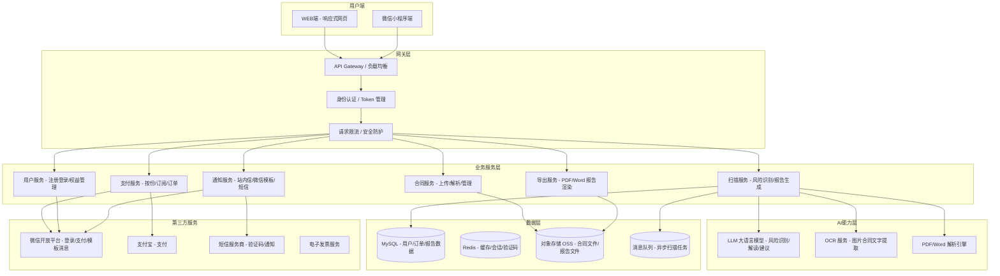

## 2.2 业务模块图

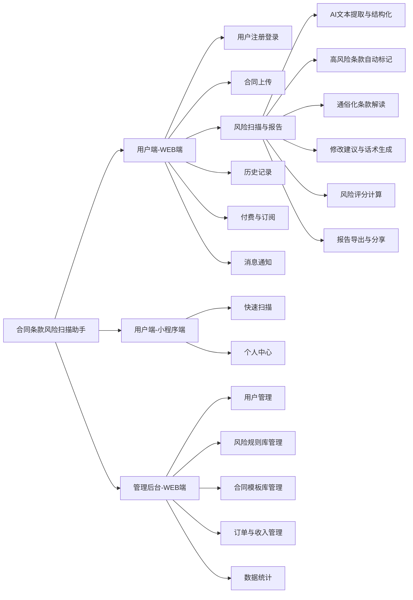

## 2.3 主业务流程

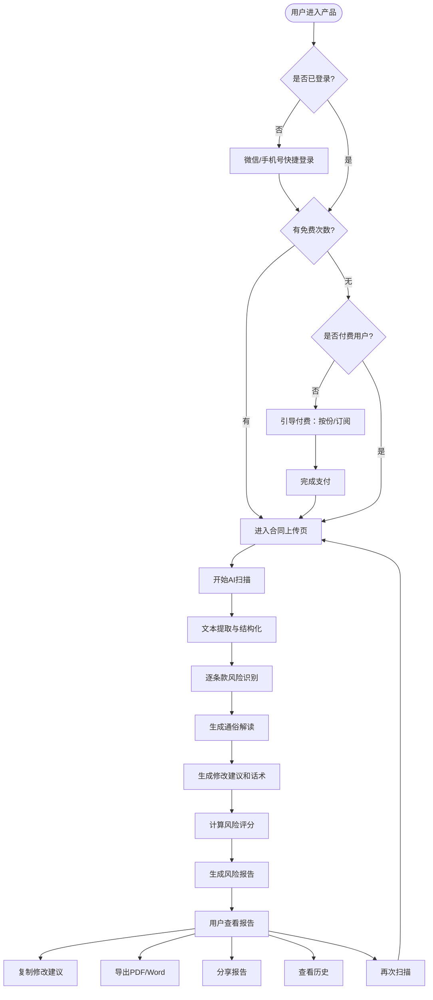

## 2.4 功能列表

### 用户端-WEB端

| 功能模块 | 功能名称 | 优先级 | 功能描述 |
| --- | --- | --- | --- |
| 用户注册登录 | 微信扫码登录 | P0 | 用户通过微信扫码一键登录，首次自动创建账号 |
| 用户注册登录 | 手机号验证码登录 | P0 | 手机号+验证码登录，作为备选方案 |
| 用户注册登录 | 个人信息管理 | P1 | 查看/编辑昵称、手机号、邮箱等基本信息 |
| 用户注册登录 | 账户权益查看 | P0 | 查看剩余免费次数、已购份数、订阅状态 |
| 合同上传 | 拖拽上传 | P0 | 支持 PDF/Word/图片拖拽上传 |
| 合同上传 | 点击选择上传 | P0 | 从文件管理器选择文件上传 |
| 合同上传 | 拍照上传 | P1 | 通过摄像头拍摄纸质合同上传 |
| 合同上传 | 文件格式与大小校验 | P0 | 自动校验格式和大小（≤20MB） |
| 合同上传 | 多页合同支持 | P0 | 支持最多100页合同完整解析 |
| 合同上传 | 文件预览确认 | P1 | 上传后预览首页，确认后开始扫描 |
| 合同上传 | 批量上传 | P2 | 订阅用户多份合同批量扫描 |
| 风险扫描与报告 | AI文本提取与结构化 | P0 | 自动提取合同全文并按条款结构化 |
| 风险扫描与报告 | 高风险条款自动标记 | P0 | 识别15+类风险条款并在原文高亮标记 |
| 风险扫描与报告 | 风险等级划分 | P0 | 高（红）/中（黄）/低（蓝）三级分类 |
| 风险扫描与报告 | 通俗化条款解读 | P0 | 用日常语言解读每条风险 |
| 风险扫描与报告 | 真实案例辅助说明 | P2 | 高风险条款提供类似场景真实案例参考 |
| 风险扫描与报告 | 具体修改建议文本 | P0 | 给出可复制的修改建议文本 |
| 风险扫描与报告 | 协商话术生成 | P0 | 生成与对方协商的沟通话术 |
| 风险扫描与报告 | 一键复制建议 | P0 | 单条或全部建议一键复制 |
| 风险扫描与报告 | 合同整体风险评分 | P0 | 百分制评分，直观展示风险水平 |
| 风险扫描与报告 | 风险等级标签 | P0 | 高风险0-40/中风险41-70/低风险71-100 |
| 风险扫描与报告 | 风险摘要概览 | P0 | 顶部展示总风险数、各等级数量、评分 |
| 风险扫描与报告 | 导出PDF报告 | P0 | 完整风险报告导出PDF |
| 风险扫描与报告 | 导出Word报告 | P1 | 完整风险报告导出Word |
| 风险扫描与报告 | 生成分享链接 | P2 | 生成7天有效分享链接 |
| 风险扫描与报告 | 修改后合同复扫对比 | P1 | 对比修改前后扫描结果 |
| 历史记录 | 扫描历史列表 | P0 | 按时间倒序展示所有扫描记录 |
| 历史记录 | 查看历史报告 | P0 | 点击查看完整风险报告 |
| 历史记录 | 重命名合同 | P1 | 对扫描记录重命名方便查找 |
| 历史记录 | 删除记录 | P1 | 删除不需要的扫描记录 |
| 历史记录 | 搜索/筛选记录 | P2 | 按名称搜索、按等级/时间筛选 |
| 历史记录 | 收藏重要报告 | P2 | 收藏报告优先展示 |
| 付费与订阅 | 新用户免费扫描 | P0 | 注册赠送1次免费扫描 |
| 付费与订阅 | 购买扫描份数 | P0 | ¥19/份，支持阶梯优惠（3份95折/5份9折/10份8折） |
| 付费与订阅 | 支付确认 | P0 | 微信/支付宝支付 |
| 付费与订阅 | 订阅方案展示 | P0 | 展示¥99/月订阅详情 |
| 付费与订阅 | 订阅开通 | P0 | 开通月度订阅 |
| 付费与订阅 | 自动续费管理 | P1 | 开启/关闭自动续费 |
| 付费与订阅 | 查看消费记录 | P1 | 查看所有付费记录 |
| 付费与订阅 | 申请电子发票 | P2 | 自动开具电子发票 |
| 消息通知 | 扫描完成通知 | P0 | 站内+微信模板消息通知 |
| 消息通知 | 扫描失败通知 | P0 | 通知失败原因并引导重试 |
| 消息通知 | 免费次数用完通知 | P0 | 推送付费引导 |
| 消息通知 | 订阅到期提醒 | P1 | 到期前3天推送续费提醒 |
| 消息通知 | 通知中心 | P1 | 查看所有历史通知 |

### 用户端-小程序端

> **V1.0 小程序为"最小可用版本"**：仅包含微信登录、合同上传+AI扫描、基础版风险报告、单次付费。订阅开通、历史记录云端同步、团队协作、报告分享推迟到 V1.1。
> ⚠️ 风险应对：若小程序审核影响发布，可先以 WEB H5 过渡，小程序 V1.0.1 一周内跟进。

| 功能模块 | 功能名称 | 优先级 | 版本 | 功能描述 |
| --- | --- | --- | --- | --- |
| 快速扫描 | 微信授权一键登录 | P0 | V1.0 | 微信授权登录，关联WEB端账号 |
| 快速扫描 | 相册选择上传 | P0 | V1.0 | 从手机相册选择合同上传 |
| 快速扫描 | 拍照上传 | P0 | V1.0 | 调用相机拍摄纸质合同 |
| 快速扫描 | 微信聊天记录文件选择 | P1 | V1.0 | 从微信聊天记录选择合同文件 |
| 快速扫描 | 风险报告查看（基础版） | P0 | V1.0 | 小程序内查看本次扫描的报告 |
| 快速扫描 | 修改建议复制 | P0 | V1.0 | 长按复制修改建议 |
| 快速扫描 | 分享报告到聊天 | P1 | **V1.1** | 以小程序卡片分享给好友/群 |
| 个人中心 | 查看权益余量 | P0 | V1.0 | 查看剩余次数 |
| 个人中心 | 小程序内单次付费 | P0 | V1.0 | 微信支付快速购买扫描份数 |
| 个人中心 | 订阅开通/管理 | P0 | **V1.1** | 小程序内开通订阅、续费、退订 |
| 个人中心 | 历史记录云端同步 | P1 | **V1.1** | 小程序端与WEB端历史记录同步 |
| 个人中心 | 查看扫描历史 | P1 | **V1.1** | 查看小程序端扫描历史（V1.0仅保留本次） |
| 团队协作 | 团队入口/邀请 | P1 | **V1.1** | 小程序端团队协作功能 |

### 管理后台-WEB端

| 功能模块 | 功能名称 | 优先级 | 功能描述 |
| --- | --- | --- | --- |
| 用户管理 | 查看所有用户 | P0 | 用户列表：昵称/手机号/类型/扫描统计 |
| 用户管理 | 搜索/筛选用户 | P0 | 多条件搜索筛选用户 |
| 用户管理 | 查看用户详情 | P1 | 用户详细信息与操作历史 |
| 用户管理 | 手动调整权益 | P1 | 客诉处理：增加次数/延长订阅 |
| 用户管理 | 封禁/解封用户 | P1 | 违规用户封禁管理 |
| 风险规则库管理 | 查看风险规则列表 | P0 | 所有风险识别规则查看 |
| 风险规则库管理 | 新增/编辑风险规则 | P0 | 定义风险类型/等级/匹配条件/模板 |
| 风险规则库管理 | 启用/禁用规则 | P0 | 单条规则启用/禁用 |
| 风险规则库管理 | 按行业管理规则 | P1 | 按行业分类管理规则组合 |
| 合同模板库管理 | 查看合同模板列表 | P1 | 按行业/场景分类查看模板 |
| 合同模板库管理 | 上传/编辑合同模板 | P2 | 上传新模板并标注类型 |
| 合同模板库管理 | 模板风险标注 | P2 | 预设已知风险点 |
| 订单与收入管理 | 查看所有订单 | P0 | 订单列表与详情 |
| 订单与收入管理 | 订单状态筛选 | P0 | 按状态/时间筛选订单 |
| 订单与收入管理 | 手动退款 | P1 | 客诉处理退款 |
| 订单与收入管理 | 查看收入概览 | P1 | 日/周/月收入统计 |
| 数据统计 | 核心指标看板 | P1 | 注册数/日活/扫描量/转化率/收入 |
| 数据统计 | 扫描量趋势 | P1 | 日/周/月扫描量变化趋势 |
| 数据统计 | 高频风险类型统计 | P2 | 各类风险识别频次排名 |
| 数据统计 | 用户留存与付费分析 | P2 | 留存曲线/转化漏斗/续费率 |

## 2.5 你的产品有哪些端

| 序号 | 端名称 | 端类型 | 目标用户 | 说明 |
| --- | --- | --- | --- | --- |
| 1 | 用户端-WEB端 | WEB端 | 个人用户/订阅用户 | 主要载体，包含完整功能：合同上传、风险扫描、报告查看、历史记录、付费管理等 |
| 2 | 用户端-小程序端 | 小程序端 | 个人用户 | 轻量入口，手机端快速上传拍照扫描，核心扫描+个人中心 |
| 3 | 管理后台-WEB端 | WEB端 | 系统管理员/运营团队 | 系统管理端：用户管理、规则库、模板库、订单、数据统计 |

---

# 3 产品功能

## 3.1 用户端-WEB端功能

### 3.1.1 用户注册与登录

功能描述：为用户提供快速、低门槛的注册登录方式，支持微信扫码一键登录和手机号验证码登录两种方式，首次登录自动创建账号并赠送 1 次免费扫描机会。

| 项 | 内容 |
| --- | --- |
| 优先级 | P0 |
| 依赖需求 | URS-3.1.1 |
| 前置条件 | 无 |

#### 详细流程

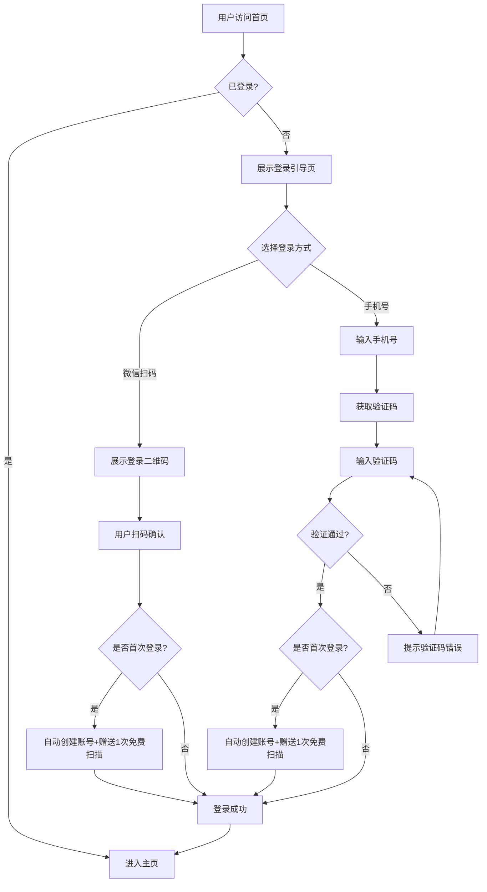

**业务规则说明：**
1. 微信扫码登录通过微信公众号网页授权实现，获取用户 openId/unionId 作为唯一标识
2. 手机号验证码 60 秒内不可重复发送，验证码有效期 5 分钟
3. 同一手机号绑定微信账号后，不可再用该手机号单独注册新账号
4. 新用户注册后自动获得 1 次免费扫描机会，有效期 30 天
5. 登录态有效期 7 天，过期需重新登录

### 3.1.2 合同上传

功能描述：用户通过拖拽、点击选择或拍照方式上传合同文件（PDF/Word/图片），系统自动校验格式和大小，支持多页合同（最多 100 页）的完整解析。

| 项 | 内容 |
| --- | --- |
| 优先级 | P0 |
| 依赖需求 | URS-3.1.2 |
| 前置条件 | 用户已登录且账户有可用扫描次数 |

#### 详细流程

```mermaid
flowchart TD
    A[用户进入上传页面] --> B[展示上传区域]
    B --> C{上传方式}
    C -->|拖拽| D[拖拽文件到上传区域]
    C -->|点击| E[点击按钮选择文件]
    C -->|拍照| F[调用摄像头拍摄]
    D --> G[文件格式校验]
    E --> G
    F --> G
    G --> H{格式是否支持?}
    H -->|否| I[提示格式不支持，引导转换]
    I --> B
    H -->|是| J{文件大小是否≤20MB?}
    J -->|否| K[提示文件过大]
    K --> B
    J -->|是| L[展示文件预览]
    L --> M{用户确认扫描?}
    M -->|否| N[重新选择文件]
    N --> B
    M -->|是| O{账户有扫描次数?}
    O -->|否| P[引导付费]
    O -->|是| Q[提交文件到服务端]
    Q --> R[扣除1次扫描次数]
    R --> S[进入扫描流程]
```

**业务规则说明：**
1. 支持的文件格式：PDF（.pdf）、Word（.doc/.docx）、图片（.jpg/.png/.jpeg）
2. 单文件大小限制：20MB
3. 单份合同最多 100 页
4. 订阅用户支持批量上传（最多 10 份同时上传）
5. 文件上传后服务端存储至 OSS，获取文件 URL 后触发扫描任务
6. 上传过程中展示实时进度条

### 3.1.3 风险扫描与报告

功能描述：系统自动提取合同全文文本，通过 AI 逐条款识别高风险条款（15+ 类），按高/中/低三级分类标记，为每条风险生成通俗解读、修改建议和协商话术，计算整体风险评分，生成完整风险报告。

| 项 | 内容 |
| --- | --- |
| 优先级 | P0 |
| 依赖需求 | URS-3.1.3 |
| 前置条件 | 合同文件已成功上传 |

#### 详细流程

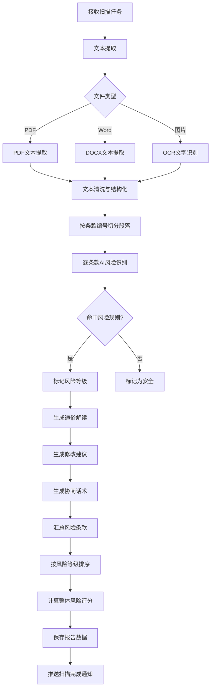

**业务规则说明：**
1. 10 页以内标准合同处理时间 ≤ 60 秒，50 页以内 ≤ 180 秒
2. 风险识别覆盖不少于 15 类常见风险：违约金过高、自动续约陷阱、竞业限制、单方解约权不对等、管辖权不利、知识产权归属模糊、付款条件苛刻、保密义务过宽、赔偿上限缺失、不可抗力条款缺失等
3. 风险等级颜色编码：高风险=红色(#E53E3E)、中风险=黄色(#DD9A1D)、低风险=蓝色(#3182CE)，同时辅以文字标签和图标
4. 风险评分规则：基础 100 分，每个高风险扣 8 分、中风险扣 3 分、低风险扣 1 分，最低 0 分
5. 风险等级标签：高风险(0-40分)、中风险(41-70分)、低风险(71-100分)
6. 扫描过程中通过 WebSocket/SSE 推送实时进度
7. 每条风险的通俗解读必须包含："这个条款写了什么"+"意味着什么"+"可能带来什么损失"
8. 修改建议必须给出可直接复制的替代条款文本
9. 协商话术应礼貌有理，适合直接发送给合同对方

### 3.1.4 历史记录

功能描述：用户可查看所有历史扫描记录，按时间倒序排列，支持查看报告详情、重命名、删除、搜索筛选和收藏。

| 项 | 内容 |
| --- | --- |
| 优先级 | P0 |
| 依赖需求 | URS-3.1.4 |
| 前置条件 | 用户已登录且至少完成过 1 次扫描 |

#### 详细流程

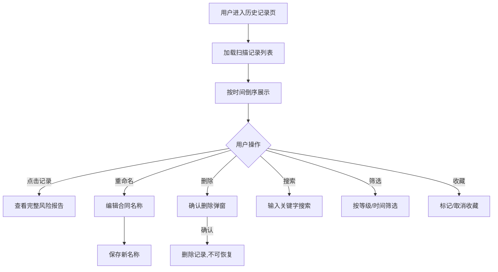

**业务规则说明：**
1. 免费用户扫描报告保留 1 年，订阅用户保留 3 年
2. 收藏的记录在列表中优先展示
3. 删除操作不可恢复，需二次确认
4. 列表默认每页 20 条，支持分页加载

### 3.1.5 付费与订阅

功能描述：提供按份付费（¥19/份）和订阅（¥99/月）两种付费方式，新用户享 1 次免费体验，支持微信支付和支付宝，可管理自动续费和查看消费记录。

| 项 | 内容 |
| --- | --- |
| 优先级 | P0 |
| 依赖需求 | URS-3.1.5 |
| 前置条件 | 用户已登录 |

#### 详细流程

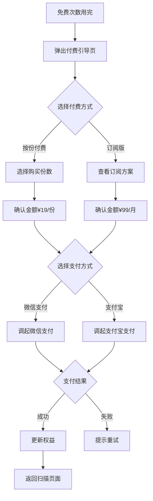

**业务规则说明：**
1. 按份付费的扫描份数有效期 1 年，过期自动作废（需在付费页面明确告知用户）
2. 订阅到期前 3 天推送续费提醒
3. 自动续费默认关闭，用户可手动开启
4. **阶梯优惠（按份付费）**：

| 档位 | 折扣 | 单份价格 | 总价 | 适用场景 |
| --- | --- | --- | --- | --- |
| 1 份 | 原价 | ¥19.0 | ¥19.0 | 偶尔需要审查合同的用户 |
| 3 份 | **95折**（主推档） | ¥18.05 | ¥54.15 | 小商户月度常用量 |
| 5 份 | 9 折 | ¥17.10 | ¥85.50 | 高频个体户/自由职业者 |
| 10 份 | 8 折 | ¥15.20 | ¥152.00 | 小团队集中签约期 |

5. 支付成功后即时到账，不可退款（特殊情况由管理员手动处理）
6. 付费引导页默认高亮"3份 ¥54.15"档位作为主推方案

### 3.1.6 消息通知

功能描述：通过站内消息、微信模板消息和短信（兜底）通知用户扫描状态、权益变动等重要信息。

| 项 | 内容 |
| --- | --- |
| 优先级 | P0 |
| 依赖需求 | URS-3.1.6 |
| 前置条件 | 用户已登录 |

**业务规则说明：**
1. 扫描完成/失败后即时推送通知
2. 免费次数为 0 时推送付费引导
3. 订阅到期前 3 天推送续费提醒
4. 通知中心保留最近 90 天通知
5. 微信模板消息优先，未关注公众号时降级为短信

### 3.1.7 团队协作（订阅用户专属，MVP）

功能描述：订阅用户可创建团队、邀请成员加入，在团队空间内共享合同扫描报告。MVP 阶段实现最小权限模型——管理员（团队创建者/付费者）和成员（被邀请者）两种角色。

| 项 | 内容 |
| --- | --- |
| 优先级 | P0（订阅用户核心功能） |
| 依赖需求 | URS-3.2（WEB 端优先）、V1.1 小程序端支持 |
| 前置条件 | 用户已开通订阅 |

#### MVP 团队协作权限模型

| 操作 | 管理员（创建者/付费者） | 成员（被邀请者） |
| --- | --- | --- |
| 订阅开通/续费/退订 | ✅ | ❌ |
| 邀请/移除成员 | ✅ | ❌ |
| 上传合同并扫描 | ✅ | ✅ |
| 查看自己上传的报告 | ✅ | ✅ |
| 查看团队内所有报告 | ✅ | ❌ |
| 删除自己的报告 | ✅ | ✅ |
| 删除他人报告 | ✅ | ❌ |
| 修改团队信息（名称/说明） | ✅ | ❌ |
| 导出报告 | ✅（全部） | ✅（仅自己上传的） |

> **推迟到 V1.1：** 自定义角色、审批流、审计日志、更细粒度的权限配置

#### 详细流程

```mermaid
flowchart TD
    A[订阅用户进入团队页面] --> B{是否已有团队?}
    B -->|否| C[创建团队并设为管理员]
    B -->|是| D[进入团队空间]
    C --> D
    D --> E{用户角色?}
    E -->|管理员| F[可访问：成员管理/全部报告/团队设置]
    E -->|成员| G[可访问：上传扫描/我的报告]
    F --> H[邀请成员加入]
    H --> I[生成邀请链接/二维码]
    I --> J[成员扫码/点击加入]
    J --> K[成员默认为"成员"角色]
    K --> G
```

**业务规则说明：**
1. 每个订阅用户最多创建 1 个团队
2. 每个团队最多邀请 10 名成员（含管理员共 11 人）
3. 成员必须已注册账号（未注册时引导先注册）
4. 成员上传扫描的合同，扫描次数从订阅账户（管理员）扣减
5. 管理员退订后：团队成员保留查看已有报告权限，但无法继续上传扫描，直到重新订阅
6. 成员被移除后：其上传的报告仍保留在团队空间中（管理员可见）
7. 团队内报告仅管理员可见全部，成员只能看到自己上传的
8. 所有成员上传的合同来源标记为 source=web，team_id 关联到所属团队

---

## 3.2 用户端-小程序端功能

> **V1.0 小程序定位为"最小可用版本"**，仅包含核心扫描闭环功能。订阅开通、历史记录云端同步、团队协作、报告分享等高级功能推迟到 V1.1。
> ⚠️ **发布风险应对**：若小程序审核影响发布节奏，可先以 WEB H5 过渡，小程序 V1.0.1 在 WEB 发布后一周内跟进上线。

### 3.2.1 V1.0 小程序范围（MVP）

**V1.0 包含功能：**
- 微信授权一键登录（关联 WEB 端账号）
- 合同上传（相册选择、拍照、微信聊天记录文件选择）
- AI 扫描 + 基础版风险报告查看
- 修改建议复制
- 查看本次扫描结果
- 查看权益余量（剩余次数）
- 单次付费购买扫描份数（微信支付）

**V1.0 明确不包含功能（推迟到 V1.1）：**
- ❌ 订阅开通/续费/退订
- ❌ 历史记录云端同步
- ❌ 团队协作功能
- ❌ 报告分享到聊天
- ❌ 多份历史报告浏览（V1.0 仅保留本次扫描结果）

### 3.2.2 快速扫描

功能描述：小程序端提供核心扫描功能，用户可通过微信授权一键登录，从相册选择、拍照或微信聊天记录中选择合同文件上传，扫描完成后在小程序内查看基础版报告和复制修改建议。

| 项 | 内容 |
| --- | --- |
| 优先级 | P0 |
| 依赖需求 | URS-3.2.1 |
| 前置条件 | 已安装微信 |
| 版本 | V1.0 |

**业务规则说明：**
1. 小程序端与 WEB 端账号通过 unionId 关联，权益（剩余次数、订阅状态）共享
2. V1.0 小程序端不支持团队协作功能
3. 核心操作路径不超过 3 步（上传→扫描→查看报告）
4. V1.0 报告查看仅展示本次扫描结果，不展示历史
5. 报告分享功能推迟到 V1.1

### 3.2.3 个人中心（V1.0）

功能描述：查看剩余扫描次数、通过微信支付快速购买扫描份数。

| 项 | 内容 |
| --- | --- |
| 优先级 | P0 |
| 依赖需求 | URS-3.2.2 |
| 前置条件 | 用户已登录 |
| 版本 | V1.0 |

**V1.0 个人中心仅包含：**
- 查看剩余扫描次数
- 单次付费购买扫描份数

**推迟到 V1.1：**
- 订阅开通/续费/退订
- 扫描历史云端同步
- 团队管理入口

### 3.2.4 团队协作（V1.1 推迟）

小程序端团队协作功能推迟到 V1.1 实现，WEB 端的团队协作功能在 V1.0 已支持（详见 3.1.7）。

---

## 3.3 管理后台-WEB端功能

### 3.3.1 用户管理

功能描述：管理员可查看平台所有用户信息，支持多条件搜索筛选，查看用户详情，手动调整用户权益（客诉处理），封禁/解封违规用户。

| 项 | 内容 |
| --- | --- |
| 优先级 | P0 |
| 依赖需求 | URS-3.3.1 |
| 前置条件 | 管理员已登录后台 |

### 3.3.2 风险规则库管理

功能描述：管理员可查看、新增、编辑、启用/禁用风险识别规则，定义风险类型、等级、识别关键词/模式、解读模板和建议模板，支持按行业分类管理规则组合。

| 项 | 内容 |
| --- | --- |
| 优先级 | P0 |
| 依赖需求 | URS-3.3.2 |
| 前置条件 | 管理员已登录后台 |

**业务规则说明：**
1. 每条规则包含：规则名称、风险类型、风险等级、匹配条件（关键词/正则模式）、解读模板、建议模板、启用状态
2. 规则修改后对后续新扫描生效，不影响已有报告
3. 按行业分类：租赁类、采购类、服务类、合作类等

### 3.3.3 合同模板库管理

功能描述：管理员可查看系统预置和用户上传的合同模板，按行业/场景分类，可上传新模板并标注类型和适用场景。

| 项 | 内容 |
| --- | --- |
| 优先级 | P1 |
| 依赖需求 | URS-3.3.3 |
| 前置条件 | 管理员已登录后台 |

### 3.3.4 订单与收入管理

功能描述：管理员可查看所有付费订单、按状态和时间筛选、手动退款（客诉处理）、查看收入概览统计。

| 项 | 内容 |
| --- | --- |
| 优先级 | P0 |
| 依赖需求 | URS-3.3.4 |
| 前置条件 | 管理员已登录后台 |

### 3.3.5 数据统计

功能描述：展示平台核心运营指标看板、扫描量趋势、高频风险类型统计、用户留存与付费转化分析。

| 项 | 内容 |
| --- | --- |
| 优先级 | P1 |
| 依赖需求 | URS-3.3.5 |
| 前置条件 | 管理员已登录后台 |

---

# 4 产品原型

## 4.1 页面跳转逻辑图

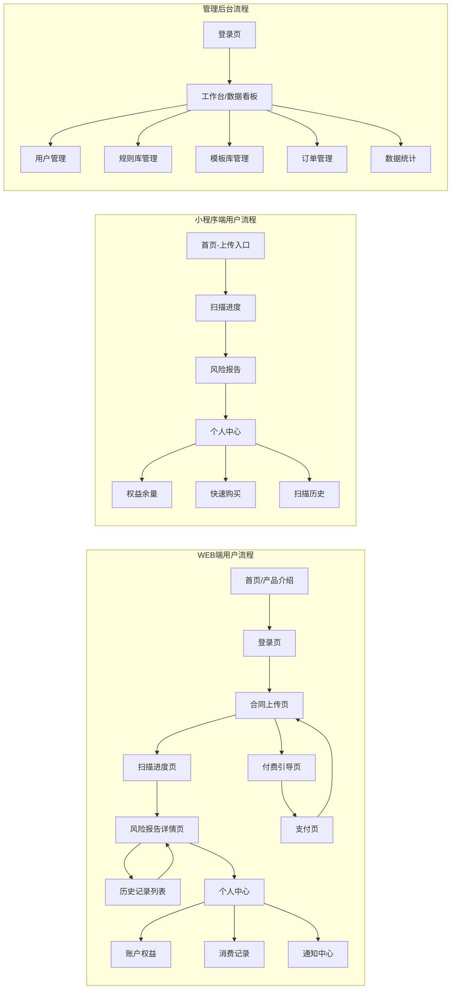

## 4.2 全站点原型设计

### 4.2.1 用户端-WEB端

**页面清单：**

| 序号 | 页面名称 | 所属模块 | 页面描述 | 关键元素 |
| --- | --- | --- | --- | --- |
| 1 | 首页/产品介绍 | 登录模块 | 产品功能介绍与登录引导 | 产品亮点、功能介绍、CTA按钮、登录入口 |
| 2 | 登录页 | 登录模块 | 微信扫码/手机号登录 | 二维码、手机号输入框、验证码输入框 |
| 3 | 合同上传页 | 合同上传 | 拖拽/点击上传合同文件 | 上传区域、格式提示、文件预览 |
| 4 | 扫描进度页 | 风险扫描 | 展示扫描实时进度 | 进度条、阶段状态、预估时间 |
| 5 | 风险报告详情页 | 风险扫描与报告 | 展示风险评分、风险条款列表、解读与建议 | 评分仪表盘、风险摘要、原文对照、建议复制按钮 |
| 6 | 历史记录列表 | 历史记录 | 扫描历史记录列表 | 搜索框、筛选器、记录卡片列表 |
| 7 | 付费引导页 | 付费与订阅 | 展示付费方案引导购买 | 方案对比卡片、价格、CTA按钮 |
| 8 | 支付页 | 付费与订阅 | 确认支付信息 | 订单详情、支付方式选择、确认按钮 |
| 9 | 个人中心 | 用户管理 | 个人信息与权益管理 | 用户信息、权益卡片、菜单列表 |
| 10 | 通知中心 | 消息通知 | 历史通知列表 | 通知列表、已读/未读标记 |

**交互说明：**
- 页面跳转关系：
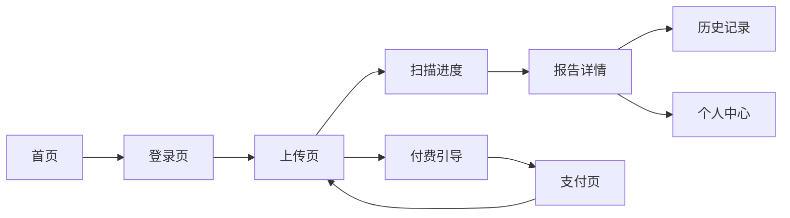
- 特殊交互：
  1. 上传页支持拖拽文件到指定区域，拖入时区域高亮
  2. 扫描进度页实时更新进度百分比和当前阶段文字
  3. 报告详情页左侧原文风险条款高亮可点击，右侧联动显示对应解读
  4. 复制按钮点击后显示"已复制"Toast 反馈（2秒自动消失）
  5. 风险评分仪表盘使用动态数字动画（0→最终分数）
  6. 空数据态：历史记录无数据时展示引导上传的插画

**产品原型：**

[🖥️ 打开用户端-WEB端全站点原型](assets/prototypes/web-user-prototype.html)

### 4.2.2 用户端-小程序端

> **V1.0 为最小可用版本**，仅包含 4 个核心页面：首页（上传入口）、扫描进度页、风险报告页、个人中心（仅显示剩余次数和单次付费入口）。V1.1 将补充订阅管理、历史同步、团队入口、分享等页面。

**V1.0 页面清单：**

| 序号 | 页面名称 | 所属模块 | 页面描述 | 关键元素 | 版本 |
| --- | --- | --- | --- | --- | --- |
| 1 | 首页 | 快速扫描 | 上传入口与功能引导 | 大按钮上传入口、拍照按钮 | V1.0 |
| 2 | 扫描进度页 | 快速扫描 | 展示扫描实时进度 | 进度条、阶段文字 | V1.0 |
| 3 | 风险报告页（基础版） | 快速扫描 | 查看本次扫描报告 | 评分、风险列表、建议复制 | V1.0 |
| 4 | 个人中心（极简版） | 个人中心 | 查看剩余次数、单次付费 | 剩余次数、购买入口 | V1.0 |
| 5 | 单次购买页 | 个人中心 | 微信支付购买扫描份数 | 份数选择、支付按钮 | V1.0 |
| 6 | 订阅管理页 | 个人中心 | 开通/续费/退订 | 订阅方案、续费按钮 | **V1.1** |
| 7 | 扫描历史页 | 个人中心 | 云端同步历史列表 | 记录列表、搜索筛选 | **V1.1** |
| 8 | 团队管理页 | 团队协作 | 团队入口与成员管理 | 成员列表、邀请入口 | **V1.1** |

**V1.0 交互说明：**
- 页面跳转关系：
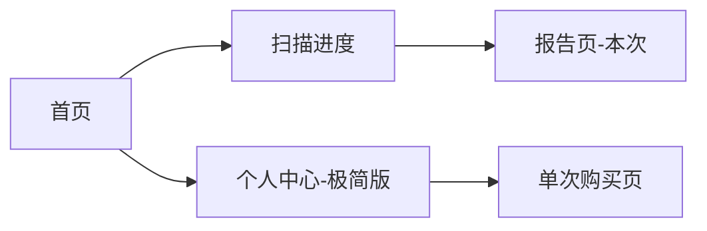
- 特殊交互：
  1. 首页大按钮一键上传，支持拍照和相册选择
  2. 报告页仅展示本次扫描结果，底部提示"查看完整历史请到 WEB 端"
  3. 长按修改建议文本可复制
  4. V1.0 不提供分享按钮（V1.1 补充）

**产品原型：**

[📱 打开用户端-小程序端全站点原型](assets/prototypes/miniapp-prototype.html)

### 4.2.3 管理后台-WEB端

**页面清单：**

| 序号 | 页面名称 | 所属模块 | 页面描述 | 关键元素 |
| --- | --- | --- | --- | --- |
| 1 | 登录页 | 登录 | 管理员登录 | 账号密码表单 |
| 2 | 数据看板 | 数据统计 | 核心运营指标 | 指标卡片、趋势图表、快捷入口 |
| 3 | 用户管理列表 | 用户管理 | 用户列表与搜索 | 搜索栏、筛选器、用户表格、操作按钮 |
| 4 | 用户详情 | 用户管理 | 单个用户详细信息 | 用户信息、权益状态、操作记录 |
| 5 | 风险规则库 | 规则库管理 | 风险规则列表与编辑 | 规则表格、新增按钮、启用/禁用开关 |
| 6 | 合同模板库 | 模板库管理 | 模板列表管理 | 模板卡片、分类筛选、上传按钮 |
| 7 | 订单管理 | 订单管理 | 订单列表 | 订单表格、状态筛选、退款按钮 |
| 8 | 数据统计详情 | 数据统计 | 详细数据分析 | 趋势图、饼图、数据表格 |

**交互说明：**
- 页面跳转关系：
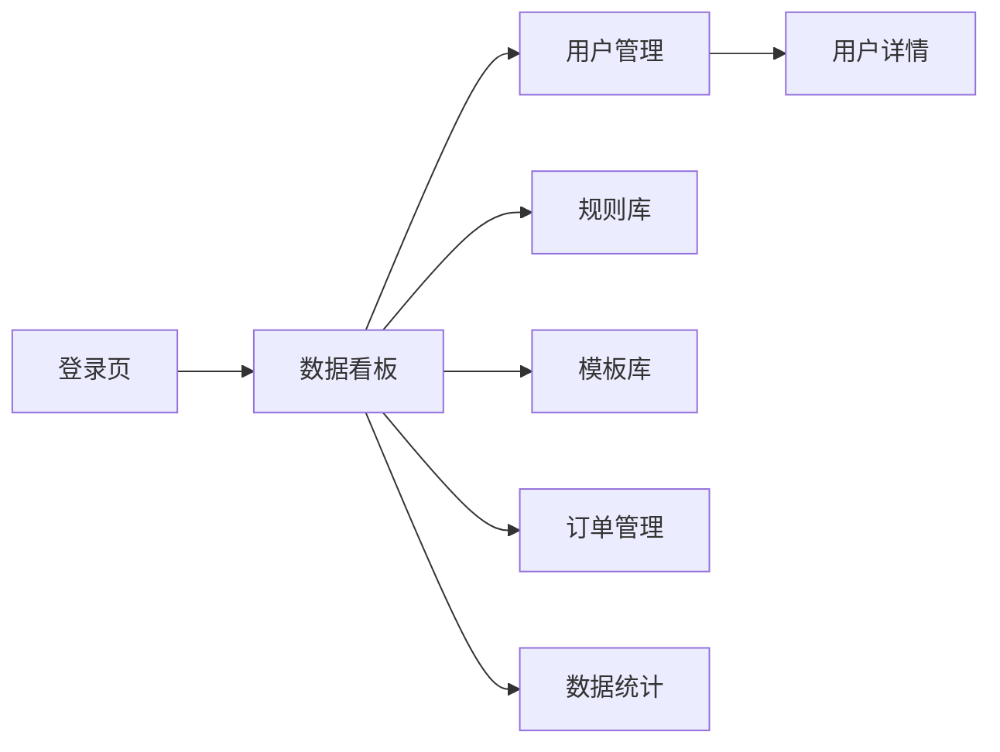
- 特殊交互：
  1. 侧边栏导航，点击切换主内容区
  2. 数据看板卡片展示核心指标，点击可跳转详情
  3. 表格支持分页、排序、多选
  4. 风险规则编辑使用弹窗表单
  5. 退款操作需二次确认

**产品原型：**

[🖥️ 打开管理后台全站点原型](assets/prototypes/admin-prototype.html)

---

# 5 数据需求

## 5.1 核心数据模型

### 用户表 (users)

| 字段 | 是否必填 | 描述 | 数据类型 |
| --- | --- | --- | --- |
| id | 是 | 用户唯一ID | UUID |
| nickname | 否 | 昵称 | 字符串 |
| phone | 否 | 手机号 | 字符串 |
| email | 否 | 邮箱 | 字符串 |
| wx_openid | 是 | 微信openId | 字符串 |
| wx_unionid | 是 | 微信unionId | 字符串 |
| avatar_url | 否 | 头像URL | 字符串 |
| account_type | 是 | 账户类型：free/paid/subscription | 枚举 |
| free_scan_count | 是 | 剩余免费扫描次数 | 整数 |
| paid_scan_count | 是 | 已购扫描份数 | 整数 |
| subscription_expire_at | 否 | 订阅到期时间 | 日期时间 |
| auto_renew | 是 | 是否自动续费 | 布尔 |
| status | 是 | 状态：active/banned | 枚举 |
| created_at | 是 | 注册时间 | 日期时间 |
| updated_at | 是 | 更新时间 | 日期时间 |

### 合同扫描记录表 (scan_records)

| 字段 | 是否必填 | 描述 | 数据类型 |
| --- | --- | --- | --- |
| id | 是 | 记录唯一ID | UUID |
| user_id | 是 | 用户ID | UUID |
| file_name | 是 | 合同文件名 | 字符串 |
| file_url | 是 | 文件存储URL | 字符串 |
| file_type | 是 | 文件类型：pdf/doc/docx/jpg/png | 枚举 |
| file_size | 是 | 文件大小(字节) | 整数 |
| page_count | 否 | 合同页数 | 整数 |
| contract_type | 否 | AI识别的合同类型 | 字符串 |
| status | 是 | 状态：pending/processing/completed/failed | 枚举 |
| risk_score | 否 | 风险评分(0-100) | 整数 |
| risk_level | 否 | 风险等级：high/medium/low | 枚举 |
| high_risk_count | 否 | 高风险条款数 | 整数 |
| medium_risk_count | 否 | 中风险条款数 | 整数 |
| low_risk_count | 否 | 低风险条款数 | 整数 |
| is_favorite | 是 | 是否收藏 | 布尔 |
| source | 是 | 来源：web/miniapp | 枚举 |
| created_at | 是 | 上传时间 | 日期时间 |
| completed_at | 否 | 扫描完成时间 | 日期时间 |
| expire_at | 是 | 报告过期时间 | 日期时间 |

### 风险条款详情表 (risk_items)

| 字段 | 是否必填 | 描述 | 数据类型 |
| --- | --- | --- | --- |
| id | 是 | 记录唯一ID | UUID |
| scan_record_id | 是 | 关联扫描记录ID | UUID |
| clause_text | 是 | 条款原文 | 文本 |
| clause_position | 是 | 条款位置（页码/段落号） | 字符串 |
| risk_type | 是 | 风险类型 | 字符串 |
| risk_level | 是 | 风险等级：high/medium/low | 枚举 |
| interpretation | 是 | 通俗解读 | 文本 |
| risk_analysis | 是 | 风险分析说明 | 文本 |
| modification_suggestion | 是 | 修改建议文本 | 文本 |
| negotiation_script | 是 | 协商话术 | 文本 |
| matched_rule_id | 否 | 匹配的规则ID | UUID |
| sort_order | 是 | 排序序号 | 整数 |

### 订单表 (orders)

| 字段 | 是否必填 | 描述 | 数据类型 |
| --- | --- | --- | --- |
| id | 是 | 订单唯一ID | UUID |
| order_no | 是 | 订单编号 | 字符串 |
| user_id | 是 | 用户ID | UUID |
| order_type | 是 | 订单类型：per_scan/subscription | 枚举 |
| amount | 是 | 订单金额(分) | 整数 |
| quantity | 是 | 购买数量 | 整数 |
| payment_method | 是 | 支付方式：wechat/alipay | 枚举 |
| payment_status | 是 | 支付状态：pending/paid/refunded/failed | 枚举 |
| paid_at | 否 | 支付时间 | 日期时间 |
| transaction_id | 否 | 第三方支付流水号 | 字符串 |
| created_at | 是 | 创建时间 | 日期时间 |

### 风险规则表 (risk_rules)

| 字段 | 是否必填 | 描述 | 数据类型 |
| --- | --- | --- | --- |
| id | 是 | 规则唯一ID | UUID |
| rule_name | 是 | 规则名称 | 字符串 |
| risk_type | 是 | 风险类型 | 字符串 |
| risk_level | 是 | 风险等级：high/medium/low | 枚举 |
| industry_category | 否 | 行业分类 | 字符串 |
| match_keywords | 是 | 匹配关键词/模式 | JSON |
| interpretation_template | 是 | 解读模板 | 文本 |
| suggestion_template | 是 | 建议模板 | 文本 |
| is_enabled | 是 | 是否启用 | 布尔 |
| created_at | 是 | 创建时间 | 日期时间 |
| updated_at | 是 | 更新时间 | 日期时间 |

### 通知表 (notifications)

| 字段 | 是否必填 | 描述 | 数据类型 |
| --- | --- | --- | --- |
| id | 是 | 通知唯一ID | UUID |
| user_id | 是 | 接收用户ID | UUID |
| title | 是 | 通知标题 | 字符串 |
| content | 是 | 通知内容 | 文本 |
| type | 是 | 通知类型：scan_complete/scan_failed/payment/subscription | 枚举 |
| channel | 是 | 推送渠道：in_app/wechat/sms | 枚举 |
| is_read | 是 | 是否已读 | 布尔 |
| related_id | 否 | 关联业务ID | UUID |
| created_at | 是 | 创建时间 | 日期时间 |

### 团队表 (teams) — V1.0 团队协作

| 字段 | 是否必填 | 描述 | 数据类型 |
| --- | --- | --- | --- |
| id | 是 | 团队唯一ID | UUID |
| name | 是 | 团队名称 | 字符串 |
| description | 否 | 团队说明 | 字符串 |
| owner_id | 是 | 管理员（创建者/付费者）用户ID | UUID |
| max_members | 是 | 最大成员数（默认 10） | 整数 |
| invite_code | 是 | 邀请码（用于生成邀请链接） | 字符串 |
| status | 是 | 状态：active/disbanded | 枚举 |
| created_at | 是 | 创建时间 | 日期时间 |
| updated_at | 是 | 更新时间 | 日期时间 |

### 团队成员表 (team_members)

| 字段 | 是否必填 | 描述 | 数据类型 |
| --- | --- | --- | --- |
| id | 是 | 记录唯一ID | UUID |
| team_id | 是 | 所属团队ID | UUID |
| user_id | 是 | 成员用户ID | UUID |
| role | 是 | 角色：admin（管理员）/ member（成员） | 枚举 |
| joined_at | 是 | 加入时间 | 日期时间 |
| invited_by | 是 | 邀请人用户ID | UUID |
| status | 是 | 状态：active/removed | 枚举 |

> **scan_records 表扩展字段**：新增 `team_id`（UUID，可空，关联所属团队）和 `uploaded_by`（UUID，实际上传人，团队成员代上传时使用）字段，用于支持团队内报告归属与权限控制。

## 5.2 统计数据需求

1. 统计每日/每周/每月扫描总量、活跃用户数、付费转化率
2. 统计各类风险条款被识别的频次排名（Top 10）
3. 统计用户留存曲线（7日/30日留存率）
4. 统计付费用户续费率
5. 统计日/周/月收入（按份收入+订阅收入分列）

## 5.3 埋点需求

| 页面 | 事件 | 采集字段 | 说明 |
| --- | --- | --- | --- |
| 首页 | page_view | user_id, source, timestamp | 首页访问 |
| 首页 | click_upload | user_id, timestamp | 点击上传按钮 |
| 上传页 | file_upload | user_id, file_type, file_size, timestamp | 文件上传 |
| 扫描进度 | scan_start | user_id, scan_id, timestamp | 扫描开始 |
| 扫描进度 | scan_complete | user_id, scan_id, duration, risk_score, timestamp | 扫描完成 |
| 扫描进度 | scan_fail | user_id, scan_id, error_type, timestamp | 扫描失败 |
| 报告详情 | view_report | user_id, scan_id, timestamp | 查看报告 |
| 报告详情 | copy_suggestion | user_id, scan_id, risk_item_id, timestamp | 复制修改建议 |
| 报告详情 | export_report | user_id, scan_id, export_type(pdf/word), timestamp | 导出报告 |
| 报告详情 | share_report | user_id, scan_id, timestamp | 分享报告 |
| 付费引导 | view_paywall | user_id, trigger_source, timestamp | 触发付费引导 |
| 付费引导 | click_purchase | user_id, plan_type, timestamp | 点击购买 |
| 支付页 | payment_success | user_id, order_id, amount, payment_method, timestamp | 支付成功 |
| 支付页 | payment_fail | user_id, order_id, error_type, timestamp | 支付失败 |

---

# 6 非功能需求

## 6.1 性能需求

### 6.1.1 延迟

| 编号 | 项目 | 最大延迟 | 平均延迟 | 优先级 | 备注 |
| --- | --- | --- | --- | --- | --- |
| P-001 | 10页以内合同扫描完成 | ≤60秒 | ≤40秒 | 高 | 从上传完成到报告生成 |
| P-002 | 50页以内合同扫描完成 | ≤180秒 | ≤120秒 | 高 | |
| P-003 | PDF/Word文本提取 | ≤10秒 | ≤5秒 | 高 | |
| P-004 | OCR单页识别 | ≤5秒 | ≤3秒 | 高 | |
| P-005 | WEB端首屏加载(4G) | ≤2秒 | ≤1.2秒 | 高 | |
| P-006 | 小程序首屏加载 | ≤1.5秒 | ≤1秒 | 高 | |
| P-007 | 页面间跳转 | ≤0.5秒 | ≤0.3秒 | 中 | |

### 6.1.2 吞吐量

| 编号 | 项 | 吞吐量 | 备注 |
| --- | --- | --- | --- |
| T-001 | 同时扫描合同数 | 100份/分钟 | 并发扫描能力 |
| T-002 | 登录认证 | 1000次/分钟 | |
| T-003 | 文件上传 | 200次/分钟 | |
| T-004 | 报告查询 | 5000次/分钟 | |

### 6.1.3 容量

| 编号 | 项 | 容量 | 备注 |
| --- | --- | --- | --- |
| C-001 | 注册用户数 | ≤1,000,000 | 设计容量 |
| C-002 | 日活用户数 | ≤100,000 | |
| C-003 | 日扫描量 | ≤50,000份 | |
| C-004 | 合同文件存储 | ≤10TB | OSS存储 |

## 6.2 安全需求

| 编号 | 项 |
| --- | --- |
| S-001 | 合同文件传输必须使用 TLS 1.2+ 加密 |
| S-002 | 合同文件存储必须使用 AES-256 加密 |
| S-003 | AI 模型调用的用户合同数据不用于模型训练 |
| S-004 | 用户合同数据不与第三方共享 |
| S-005 | 用户可随时要求删除所有个人数据（GDPR合规） |
| S-006 | 管理后台操作日志完整记录，保留 1 年 |
| S-007 | 支付信息不存储在自有系统，通过第三方支付平台处理 |
| S-008 | 系统必须防止未授权用户访问其他用户的合同数据 |

## 6.3 可靠性

| 编号 | 项 | 值 |
| --- | --- | --- |
| R-001 | 月度系统可用率 | ≥99.5% |
| R-002 | 平均故障恢复时间(MTTR) | ≤30分钟 |
| R-003 | 扫描任务失败自动重试 | 3次 |

## 6.4 可连续性

| 编号 | 项 |
| --- | --- |
| CON-001 | 系统需 7×24 全天候运行 |
| CON-002 | 核心扫描服务支持多实例部署，单实例故障自动切换 |
| CON-003 | 第三方支付/短信服务异常时，降级为可用渠道 |

## 6.5 可恢复性

| 编号 | 项 |
| --- | --- |
| REC-001 | 每日全量数据库备份，保留 30 天 |
| REC-002 | 每小时增量备份 |
| REC-003 | 重大故障 1-3 小时内恢复服务 |
| REC-004 | 扫描中断的任务恢复后可继续处理 |

## 6.6 兼容性

| 编号 | 要求 | 备注 |
| --- | --- | --- |
| COMP-001 | WEB端兼容 Chrome 90+、Firefox 88+、Safari 14+、Edge 90+ | 推荐Chrome |
| COMP-002 | WEB端响应式适配 1024px+ 桌面和 375px+ 移动端 | |
| COMP-003 | 小程序端兼容微信 7.0+ 的 iOS/Android | |
| COMP-004 | 移动端适配主流分辨率：375×667, 390×844, 414×896 | |

## 6.7 易用性

| 编号 | 要求 | 备注 |
| --- | --- | --- |
| UX-001 | 核心操作路径不超过 3 步（上传→扫描→查看报告） | |
| UX-002 | 普通用户无需培训即可使用核心功能 | |
| UX-003 | 风险等级同时使用颜色+文字标签+图标，兼顾色弱用户 | |
| UX-004 | 所有修改建议旁提供一键复制按钮 | |
| UX-005 | 界面风格专业可信赖（深蓝/白/灰主色调） | |

---

# 7 总结

## 7.1 上线计划

| 阶段 | 时间 | 内容 | 负责人 |
| --- | --- | --- | --- |
| 开发阶段 | 2026-07-01 ~ 2026-07-07 | 核心功能开发（上传/扫描/报告/支付） | 开发团队 |
| 测试阶段 | 2026-07-08 ~ 2026-07-09 | 功能测试、性能测试、安全测试 | 测试团队 |
| 灰度阶段 | 2026-07-10 | 灰度 10% 用户，验证稳定性 | 运营团队 |
| 全量上线 | 2026-07-11 | 全量开放 | 运营团队 |

## 7.2 后续迭代规划

- **V1.0.1**：小程序端 V1.0.1 跟进（若 V1.0 因审核延期，先以 WEB H5 过渡）
- **V1.1**（WEB 上线后 2-4 周）：
  - 小程序端补全：订阅开通/续费/退订、历史记录云端同步、报告分享到聊天、团队入口
  - 合同复扫对比功能
  - 真实案例辅助说明
  - 报告分享链接（WEB 端）
  - 团队权限增强：自定义角色、审批流、审计日志
- **V1.2**：批量扫描、合同模板库管理增强
- **V1.3**：电子发票、搜索筛选增强、用户留存分析看板
- **V2.0**：多语言合同支持（英文合同）、行业定制版（租赁/采购/服务）

## 7.3 参考文档

- [合同条款风险扫描助手 需求文档（URS）](需求文档_URS.md)
- [优特云PRD模板](../.claude/skills/jxh-tools-prd-assistant/assets/templates/utyun-prd-template.md)
