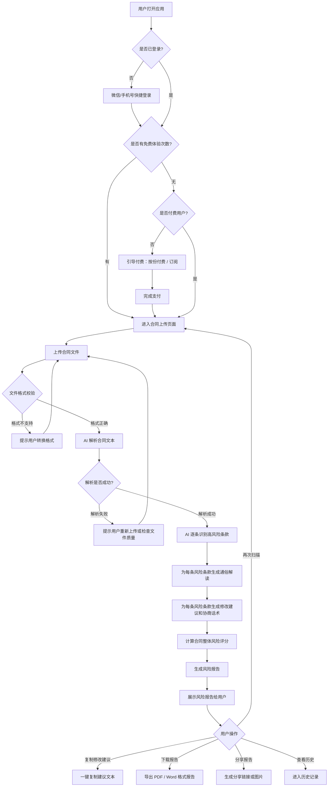
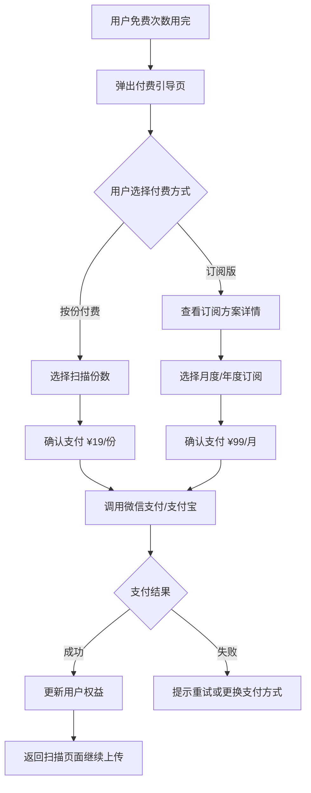
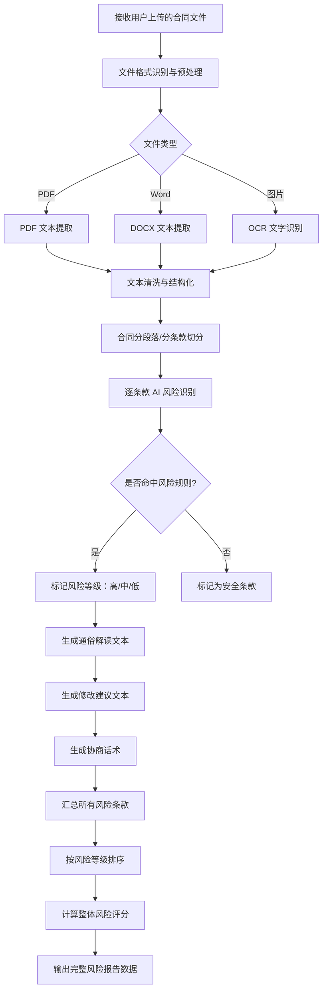
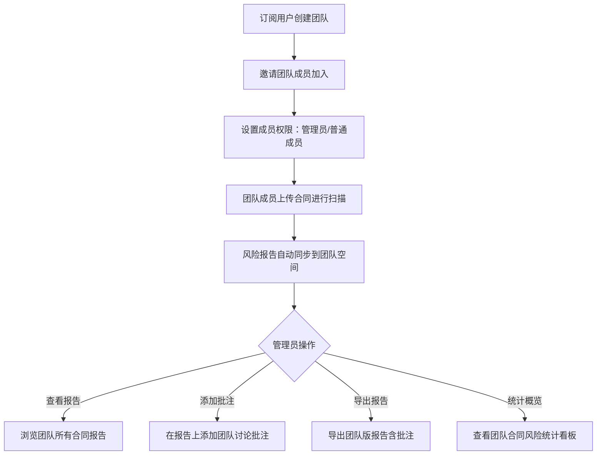
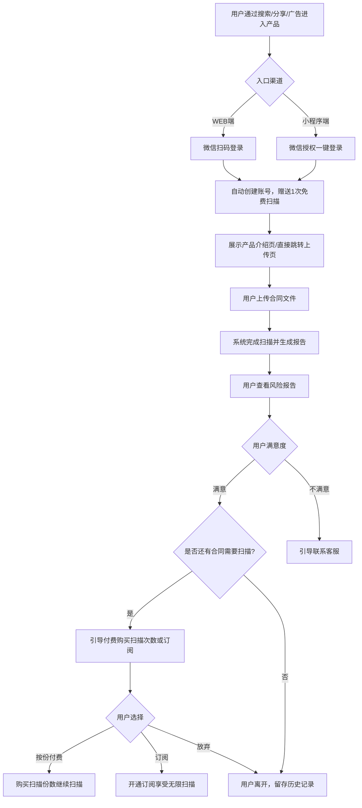
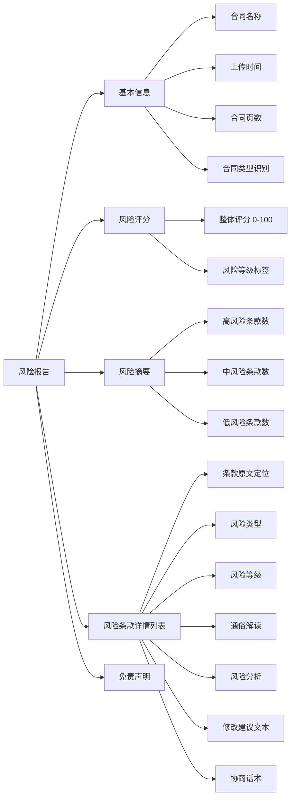
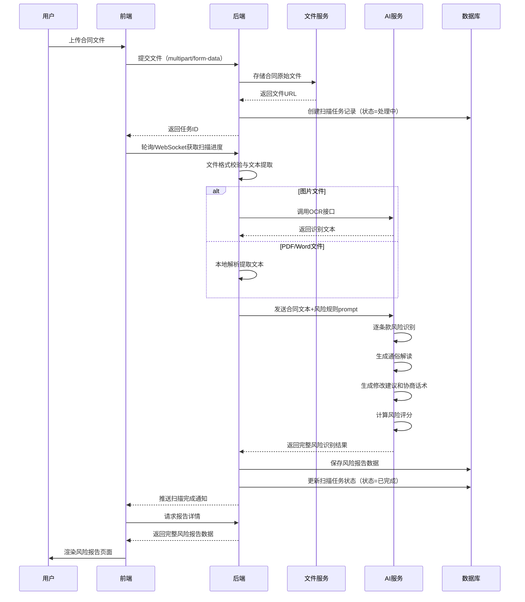
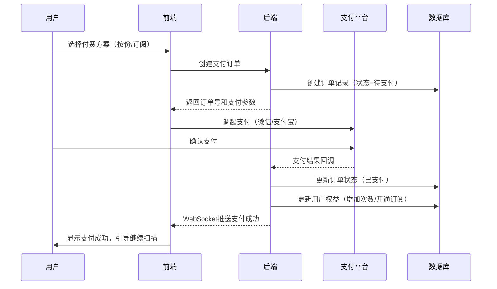
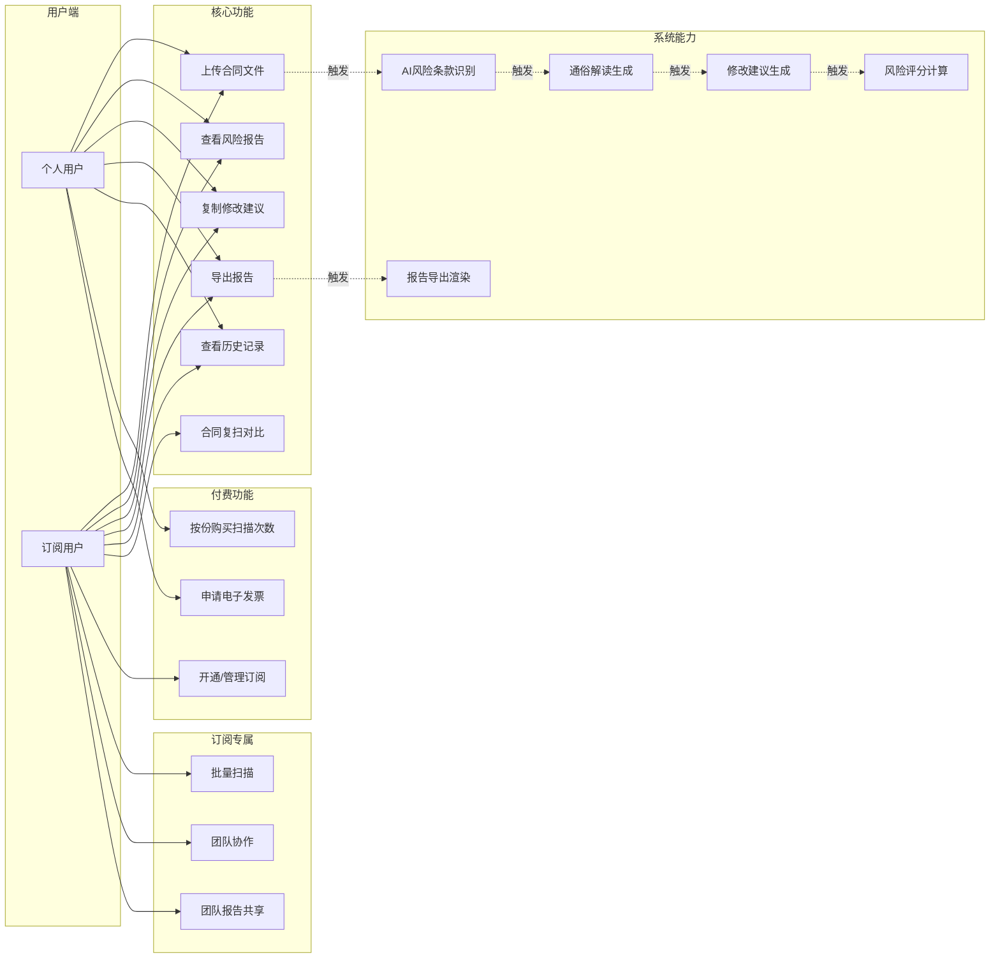
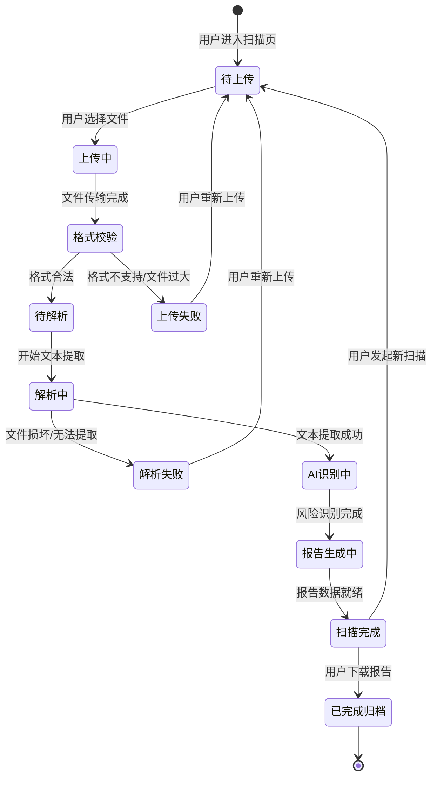

# 1.需求概述

## 1.1 需求介绍

合同条款风险扫描助手是一款面向小商户、个体工商户和自由职业者的轻量级 AI 合同风控工具。它聚焦于"签约前合同审查"这一关键场景——用户在签署供应商协议、合作协议、租赁合同、服务合同等日常商业合同之前，只需上传合同文件（PDF / Word / 图片），系统即可通过 AI 自动识别合同中的高风险条款（如违约金过高、自动续约陷阱、竞业限制、单方解约权不对等、管辖权不利等），并以通俗易懂的语言对每一条风险进行解读，同时给出可操作的修改建议和协商话术，帮助用户在"看不懂、请不起律师、又怕被坑"的困境下，快速、低成本地完成合同风险自查。

本产品不做通用法律 AI，也不替代律师的专业法律意见，而是定位于"签约前的第一道风险防线"——让非法律从业者也能在几分钟内知道"这份合同哪里有坑、坑有多深、怎么跟对方谈"。

### 1.1.1 所属领域

垂直行业 / 小微企业法律服务 / AI 应用 / 合同管理

## 1.2 需求目标

| 编号 | 目标 | 衡量标准 |
| --- | --- | --- |
| G-01 | 降低合同风险盲区 | 系统能识别不少于 15 类常见高风险条款类型，覆盖违约金、自动续约、竞业限制、单方解约、管辖权、知识产权归属、付款条件、保密义务、赔偿上限、不可抗力等核心风险点 |
| G-02 | 通俗化风险解读 | 每条风险条款的解读使用"初中生能看懂"的语言，避免法律术语堆砌，用户无需法律背景即可理解风险含义和影响 |
| G-03 | 可操作的修改建议 | 每条风险条款不仅指出问题，还给出具体的修改建议文本和协商话术，用户可直接复制使用 |
| G-04 | 快速出结果 | 从上传合同到生成完整风险报告，处理时间不超过 60 秒（10 页以内标准合同） |
| G-05 | 低使用门槛 | 用户无需注册即可体验 1 份免费扫描，按份付费流程不超过 3 步完成 |
| G-06 | 风险量化可比 | 输出合同风险评分（百分制），用户可直观了解合同整体风险水平，并可与历史合同进行对比 |

## 1.3 系统使用角色

| 角色 | 说明 | 典型用户 |
| --- | --- | --- |
| 个人用户（免费版/按份付费） | 偶尔需要审查合同的个人，单次上传合同进行风险扫描，查看风险报告并获取修改建议 | 个体工商户老板、自由职业者（设计师/程序员/咨询师）、需要签租赁合同的小店主 |
| 订阅用户（团队版） | 高频审查合同的团队用户，享受不限份数扫描、团队协作、历史记录管理、批量扫描等增值功能 | 小型采购团队负责人、频繁签约的 freelancers、小型创业团队 |
| 系统管理员 | 管理合同模板库、风险规则库、用户数据及系统运营的后台管理人员 | 产品运营团队 |

## 1.4 业务流程图

### 1.4.1 核心业务流程：合同风险扫描

### 1.4.2 付费与订阅流程

### 1.4.3 合同解析与风险识别流程

### 1.4.4 团队协作流程（订阅版）

# 2.功能原型

| 原型名称 | 原型链接 | 对应端 | 备注 |
| --- | --- | --- | --- |
| 用户端-WEB端 | 待产品文档结对写作专家输出 | WEB端 | 主要载体，包含合同上传、风险扫描、报告查看、历史记录、付费管理等完整功能 |
| 用户端-小程序端 | 待产品文档结对写作专家输出 | 小程序端 | 轻量入口，方便手机端快速上传合同拍照扫描，包含核心扫描和报告查看功能 |
| 管理后台-WEB端 | 待产品文档结对写作专家输出 | WEB端 | 系统管理端，包含用户管理、合同模板库管理、风险规则库管理、订单管理、数据统计 |

# 3.需求清单

## 3.1 用户端-WEB端

### 3.1.1 用户注册与登录模块

| 模块 | 一级功能 | 二级功能 | 功能描述 | 优先级 | 备注 |
| --- | --- | --- | --- | --- | --- |
| 用户注册与登录 | 快捷注册登录 | 微信扫码关注登录 | 用户通过微信扫码即可一键登录，无需手动填写注册信息，首次登录自动创建账号 | P0 | MVP核心 |
| 用户注册与登录 | 快捷注册登录 | 手机号验证码登录 | 用户输入手机号获取验证码完成登录，作为微信登录的备选方案 | P0 | |
| 用户注册与登录 | 个人信息管理 | 查看/编辑个人资料 | 用户可查看和修改昵称、手机号、邮箱等基本信息 | P1 | |
| 用户注册与登录 | 个人信息管理 | 查看账户权益 | 用户可查看当前账户的剩余免费次数、已购份数、订阅状态、到期时间等 | P0 | |

### 3.1.2 合同上传模块

| 模块 | 一级功能 | 二级功能 | 功能描述 | 优先级 | 备注 |
| --- | --- | --- | --- | --- | --- |
| 合同上传 | 文件上传 | 拖拽上传 | 用户可将合同文件拖拽到上传区域，支持 PDF、Word（.doc/.docx）、图片（.jpg/.png/.jpeg）格式 | P0 | MVP核心 |
| 合同上传 | 文件上传 | 点击选择上传 | 用户可点击上传按钮从文件管理器中选择合同文件上传 | P0 | |
| 合同上传 | 文件上传 | 拍照上传 | 用户可通过摄像头直接拍摄纸质合同照片上传（适配移动端浏览器） | P1 | |
| 合同上传 | 文件上传 | 文件格式与大小校验 | 系统自动校验上传文件格式是否在支持范围内，文件大小不超过 20MB，不符合要求时给出明确提示 | P0 | |
| 合同上传 | 文件上传 | 多页合同支持 | 系统支持多页合同文件的完整解析，单份合同最多支持 100 页 | P0 | |
| 合同上传 | 上传预览 | 文件预览确认 | 上传完成后展示文件预览（首页或前几页），用户确认后再开始扫描 | P1 | |
| 合同上传 | 批量上传 | 多份合同批量上传 | 订阅用户可一次上传多份合同进行批量扫描，每份合同独立生成报告 | P2 | 订阅版功能 |

### 3.1.3 风险扫描与报告模块

| 模块 | 一级功能 | 二级功能 | 功能描述 | 优先级 | 备注 |
| --- | --- | --- | --- | --- | --- |
| 风险扫描与报告 | 合同解析 | AI 文本提取与结构化 | 系统自动提取合同全文文本，按条款编号进行结构化切分，支持处理扫描件 OCR 文本 | P0 | MVP核心 |
| 风险扫描与报告 | 风险识别 | 高风险条款自动标记 | AI 自动识别合同中的高风险条款并在原文中高亮标记，风险类型包括但不限于：违约金过高、自动续约陷阱、竞业限制、单方解约权不对等、管辖权不利、知识产权归属模糊、付款条件苛刻、保密义务过宽、赔偿上限缺失、不可抗力条款缺失等 | P0 | MVP核心，不少于15类风险 |
| 风险扫描与报告 | 风险识别 | 风险等级划分 | 每条识别出的风险条款按严重程度分为"高风险"（红色）、"中风险"（黄色）、"低风险"（蓝色）三个等级 | P0 | |
| 风险扫描与报告 | 风险解读 | 通俗化条款解读 | 对每条风险条款用通俗易懂的日常语言进行解读，说明该条款"写了什么""意味着什么""可能带来什么损失"，避免法律术语堆砌 | P0 | MVP核心差异化 |
| 风险扫描与报告 | 风险解读 | 真实案例辅助说明 | 对高风险条款提供类似场景的真实案例参考（脱敏），帮助用户理解风险的实际影响 | P2 | |
| 风险扫描与报告 | 修改建议 | 具体修改建议文本 | 对每条风险条款给出具体的修改建议，包含建议替换的条款文本，用户可直接复制 | P0 | MVP核心 |
| 风险扫描与报告 | 修改建议 | 协商话术生成 | 对每条风险条款生成与对方协商时的沟通话术，帮助用户有理有据地提出修改要求 | P0 | 差异化功能 |
| 风险扫描与报告 | 修改建议 | 一键复制建议 | 用户可一键复制单条或全部修改建议文本，方便粘贴到聊天工具或邮件中与对方沟通 | P0 | |
| 风险扫描与报告 | 风险评分 | 合同整体风险评分 | 系统根据识别出的风险条款数量、等级分布计算合同整体风险评分（百分制），分数越低风险越高 | P0 | MVP核心 |
| 风险扫描与报告 | 风险评分 | 风险等级标签 | 根据评分给出整体风险等级标签：高风险（0-40分）、中风险（41-70分）、低风险（71-100分） | P0 | |
| 风险扫描与报告 | 风险评分 | 风险摘要概览 | 报告顶部展示风险摘要：总风险数、高风险数、中风险数、低风险数、整体评分，让用户一目了然 | P0 | |
| 风险扫描与报告 | 报告导出 | 导出 PDF 报告 | 用户可将完整风险报告导出为 PDF 文件，包含原文对照、风险标注、解读和建议 | P0 | |
| 风险扫描与报告 | 报告导出 | 导出 Word 报告 | 用户可将完整风险报告导出为 Word 文件，方便在此基础上进一步编辑修改 | P1 | |
| 风险扫描与报告 | 报告分享 | 生成分享链接 | 用户可生成报告分享链接，分享给合伙人、同事等查看（链接有效期 7 天） | P2 | |
| 风险扫描与报告 | 报告对比 | 修改后合同复扫 | 用户可将修改后的合同重新上传扫描，系统自动对比前后两次扫描结果，展示风险变化情况 | P1 | 差异化功能 |

### 3.1.4 历史记录模块

| 模块 | 一级功能 | 二级功能 | 功能描述 | 优先级 | 备注 |
| --- | --- | --- | --- | --- | --- |
| 历史记录 | 查看历史 | 扫描历史列表 | 用户可查看所有历史扫描记录，按时间倒序排列，显示合同名称、上传时间、风险评分、风险等级 | P0 | |
| 历史记录 | 查看历史 | 查看历史报告 | 用户可点击任意历史记录查看完整的风险报告详情 | P0 | |
| 历史记录 | 管理记录 | 重命名合同 | 用户可对扫描记录进行重命名，方便后续查找 | P1 | |
| 历史记录 | 管理记录 | 删除记录 | 用户可删除不需要的扫描记录，删除后报告不可恢复 | P1 | |
| 历史记录 | 管理记录 | 搜索/筛选记录 | 用户可按合同名称关键字搜索，或按风险等级、时间范围筛选历史记录 | P2 | |
| 历史记录 | 收藏管理 | 收藏重要报告 | 用户可收藏重要的扫描报告，在历史记录中优先展示 | P2 | |

### 3.1.5 付费与订阅模块

| 模块 | 一级功能 | 二级功能 | 功能描述 | 优先级 | 备注 |
| --- | --- | --- | --- | --- | --- |
| 付费与订阅 | 免费体验 | 新用户免费扫描 | 新用户注册后自动获得 1 次免费扫描机会，无需绑定支付方式 | P0 | MVP获客策略 |
| 付费与订阅 | 按份付费 | 购买扫描份数 | 用户可按份购买扫描次数（¥19/份），支持一次购买多份享受阶梯优惠 | P0 | |
| 付费与订阅 | 按份付费 | 支付确认 | 通过微信支付/支付宝完成支付，支付成功后自动增加账户扫描次数 | P0 | |
| 付费与订阅 | 订阅管理 | 订阅方案展示 | 展示订阅版方案详情：¥99/月，不限份数+团队协作+历史记录+优先处理 | P0 | |
| 付费与订阅 | 订阅管理 | 订阅开通 | 用户可开通月度订阅，支付成功后立即生效 | P0 | |
| 付费与订阅 | 订阅管理 | 自动续费管理 | 用户可开启/关闭自动续费，关闭后当前周期结束不再续费 | P1 | |
| 付费与订阅 | 订阅管理 | 查看消费记录 | 用户可查看所有付费和订阅的消费记录，包含时间、金额、购买内容 | P1 | |
| 付费与订阅 | 发票管理 | 申请电子发票 | 用户可申请开具电子发票，填写发票抬头和税号后系统自动开具 | P2 | |

### 3.1.6 消息通知模块

| 模块 | 一级功能 | 二级功能 | 功能描述 | 优先级 | 备注 |
| --- | --- | --- | --- | --- | --- |
| 消息通知 | 扫描状态通知 | 扫描完成通知 | 合同扫描完成后通过站内消息/微信模板消息通知用户查看报告 | P0 | |
| 消息通知 | 扫描状态通知 | 扫描失败通知 | 因文件格式问题或内容无法识别导致扫描失败时，通知用户原因并引导重新上传 | P0 | |
| 消息通知 | 权益变动通知 | 免费次数即将用完 | 当免费剩余次数为 0 时，推送引导付费通知 | P0 | |
| 消息通知 | 权益变动通知 | 订阅即将到期 | 订阅到期前 3 天推送续费提醒 | P1 | |
| 消息通知 | 查看通知 | 通知中心 | 用户可在通知中心查看所有历史通知消息 | P1 | |

## 3.2 用户端-小程序端

### 3.2.1 快速扫描模块

| 模块 | 一级功能 | 二级功能 | 功能描述 | 优先级 | 备注 |
| --- | --- | --- | --- | --- | --- |
| 快速扫描 | 微信授权登录 | 一键授权登录 | 用户通过微信授权一键登录小程序，自动关联 WEB 端账号 | P0 | |
| 快速扫描 | 快速上传 | 相册选择上传 | 用户可从手机相册选择合同照片或 PDF 文件上传 | P0 | |
| 快速扫描 | 快速上传 | 拍照上传 | 用户可直接调用手机相机拍摄纸质合同上传 | P0 | |
| 快速扫描 | 快速上传 | 微信聊天记录文件选择 | 用户可直接从微信聊天记录中选择收到的合同文件上传 | P1 | 差异化入口 |
| 快速扫描 | 结果查看 | 风险报告查看 | 扫描完成后在小程序内查看完整风险报告，支持滑动查看原文对照 | P0 | |
| 快速扫描 | 结果查看 | 修改建议复制 | 在小程序内长按复制修改建议文本 | P0 | |
| 快速扫描 | 结果分享 | 分享报告到聊天 | 用户可将风险报告以小程序卡片形式分享给微信好友或群聊 | P1 | 社交裂变 |

### 3.2.2 个人中心模块

| 模块 | 一级功能 | 二级功能 | 功能描述 | 优先级 | 备注 |
| --- | --- | --- | --- | --- | --- |
| 个人中心 | 账户信息 | 查看权益余量 | 查看剩余扫描次数或订阅到期时间 | P0 | |
| 个人中心 | 快速付费 | 小程序内购买扫描份数 | 通过微信支付快速购买扫描份数 | P0 | |
| 个人中心 | 历史记录 | 查看小程序扫描历史 | 查看通过小程序上传扫描的历史记录 | P1 | |

## 3.3 管理后台-WEB端

### 3.3.1 用户管理模块

| 模块 | 一级功能 | 二级功能 | 功能描述 | 优先级 | 备注 |
| --- | --- | --- | --- | --- | --- |
| 用户管理 | 用户列表 | 查看所有用户 | 管理员可查看平台所有注册用户列表，包含昵称、手机号、注册时间、账户类型（免费/付费/订阅）、扫描次数统计 | P0 | |
| 用户管理 | 用户列表 | 搜索/筛选用户 | 按手机号、昵称、账户类型、注册时间等条件搜索筛选用户 | P0 | |
| 用户管理 | 用户详情 | 查看用户详情 | 查看单个用户的详细信息，包含注册信息、付费记录、扫描历史、权益状态 | P1 | |
| 用户管理 | 用户操作 | 手动调整权益 | 管理员可手动为用户增加扫描次数或延长订阅有效期（用于客诉处理） | P1 | |
| 用户管理 | 用户操作 | 封禁/解封用户 | 管理员可封禁违规用户账号，封禁后用户无法登录和使用服务 | P1 | |

### 3.3.2 风险规则库管理模块

| 模块 | 一级功能 | 二级功能 | 功能描述 | 优先级 | 备注 |
| --- | --- | --- | --- | --- | --- |
| 风险规则库管理 | 规则查看 | 查看风险规则列表 | 查看当前系统所有风险识别规则，包含规则名称、风险类型、风险等级、匹配条件、启用状态 | P0 | |
| 风险规则库管理 | 规则编辑 | 新增/编辑风险规则 | 管理员可新增或编辑风险识别规则，定义风险类型、等级、识别关键词/模式、解读模板、建议模板 | P0 | |
| 风险规则库管理 | 规则编辑 | 启用/禁用规则 | 管理员可启用或禁用单条风险规则，禁用后该规则不再参与扫描识别 | P0 | |
| 风险规则库管理 | 规则分类 | 按行业管理规则 | 支持按行业分类管理风险规则（如租赁类、采购类、服务类、合作类），不同行业启用不同的规则组合 | P1 | |

### 3.3.3 合同模板库管理模块

| 模块 | 一级功能 | 二级功能 | 功能描述 | 优先级 | 备注 |
| --- | --- | --- | --- | --- | --- |
| 合同模板库管理 | 模板管理 | 查看合同模板列表 | 查看系统预置和用户上传的合同模板，按行业/场景分类 | P1 | |
| 合同模板库管理 | 模板管理 | 上传/编辑合同模板 | 管理员可上传新的合同模板文件，并标注模板类型和适用场景 | P2 | |
| 合同模板库管理 | 模板管理 | 模板风险标注 | 管理员可针对特定模板预设已知风险点，提高 AI 识别准确率 | P2 | |

### 3.3.4 订单与收入管理模块

| 模块 | 一级功能 | 二级功能 | 功能描述 | 优先级 | 备注 |
| --- | --- | --- | --- | --- | --- |
| 订单与收入管理 | 订单列表 | 查看所有订单 | 查看所有付费订单记录，包含订单号、用户、金额、支付方式、支付时间、订单状态 | P0 | |
| 订单与收入管理 | 订单列表 | 订单状态筛选 | 按订单状态（已支付/已退款/待支付）和时间范围筛选订单 | P0 | |
| 订单与收入管理 | 退款处理 | 手动退款 | 管理员可对指定订单执行退款操作（用于客诉处理） | P1 | |
| 订单与收入管理 | 收入统计 | 查看收入概览 | 查看日/周/月收入统计，包含总收入、付费用户数、订阅收入、按份收入 | P1 | |

### 3.3.5 数据统计模块

| 模块 | 一级功能 | 二级功能 | 功能描述 | 优先级 | 备注 |
| --- | --- | --- | --- | --- | --- |
| 数据统计 | 平台概览 | 核心指标看板 | 展示平台核心运营指标：注册用户数、日活用户数、总扫描次数、付费转化率、月收入 | P1 | |
| 数据统计 | 扫描统计 | 扫描量趋势 | 按日/周/月统计扫描量变化趋势，识别高峰期和低谷期 | P1 | |
| 数据统计 | 风险统计 | 高频风险类型统计 | 统计各类风险条款被识别的频次排名，为规则库优化提供数据支持 | P2 | |
| 数据统计 | 用户分析 | 用户留存与付费分析 | 分析用户留存曲线、付费转化漏斗、订阅续费率等关键指标 | P2 | |

# 4.非功能需求

## 4.1 使用界面需求

| 编号 | 需求描述 |
| --- | --- |
| UI-01 | WEB 端采用响应式设计，适配 1024px 及以上桌面浏览器和 375px 及以上移动端浏览器，核心操作流程一致 |
| UI-02 | 风险报告页面采用"原文对照"布局——左侧显示合同原文（风险条款高亮标记），右侧显示对应的通俗解读和修改建议，方便用户逐条对照 |
| UI-03 | 风险等级使用颜色编码：高风险=红色、中风险=黄色、低风险=蓝色；同时在颜色外辅以文字标签和图标，兼顾色弱用户 |
| UI-04 | 合同上传页面提供清晰的操作引导和状态反馈（上传中→解析中→识别中→生成报告中→完成），每个阶段展示预估剩余时间 |
| UI-05 | 扫描结果页顶部固定展示风险评分仪表盘和风险摘要（高/中/低风险数量），用户无需滚动即可获取关键信息 |
| UI-06 | 所有修改建议和协商话术旁提供"一键复制"按钮，点击后显示"已复制"toast 反馈 |
| UI-07 | 界面整体风格专业可信赖（深蓝/白/灰主色调），避免过度花哨的视觉设计，传递"法律专业性+AI科技感"的品牌印象 |
| UI-08 | 小程序端遵循微信小程序设计规范，核心操作路径不超过 3 步 |

## 4.2 软硬件环境需求

| 编号 | 需求描述 |
| --- | --- |
| ENV-01 | WEB 端支持主流浏览器：Chrome 90+、Firefox 88+、Safari 14+、Edge 90+，推荐使用 Chrome |
| ENV-02 | 小程序端运行环境：微信 7.0 及以上的 iOS / Android 系统 |
| ENV-03 | 服务端部署于云服务器（推荐腾讯云/阿里云），支持 HTTPS 访问 |
| ENV-04 | 系统需对接微信开放平台，使用微信公众号网页授权登录和微信小程序登录能力 |
| ENV-05 | 系统需对接微信支付和支付宝支付接口，支持按份付费和订阅支付 |
| ENV-06 | 系统需对接大语言模型 API（如 OpenAI / 文心一言 / 通义千问 / DeepSeek 等），用于合同风险条款识别与解读生成 |
| ENV-07 | 系统需对接 OCR 服务（如腾讯云 OCR / 百度 OCR），用于合同图片/扫描件的文本提取 |
| ENV-08 | 系统需对接 PDF 解析库（如 pdf-parse / PyPDF2）和 Word 解析库（如 mammoth / python-docx），用于合同文件的文本提取 |
| ENV-09 | 系统需对接短信服务商接口，用于手机号验证码登录和扫描完成通知的兜底通道 |
| ENV-10 | 系统需对接电子发票服务商接口（如百望云 / 航天信息），用于自动生成电子发票 |

## 4.3 性能需求

| 编号 | 需求描述 |
| --- | --- |
| PERF-01 | 合同扫描处理时间：10 页以内标准合同从上传完成到报告生成，不超过 60 秒 |
| PERF-02 | 合同扫描处理时间：50 页以内合同从上传完成到报告生成，不超过 180 秒 |
| PERF-03 | 合同文本提取时间（PDF/Word）：不超过 10 秒 |
| PERF-04 | OCR 文字识别时间（图片合同）：单页不超过 5 秒 |
| PERF-05 | WEB 端页面首屏加载时间：不超过 2 秒（4G 网络环境下） |
| PERF-06 | 小程序端首屏加载时间：不超过 1.5 秒 |
| PERF-07 | 系统并发能力：支持 100 份合同同时扫描，不出现超时或明显排队延迟 |
| PERF-08 | 系统可用性：月度可用率不低于 99.5% |
| PERF-09 | 风险报告数据持久化：用户扫描报告至少保留 1 年（免费用户）或 3 年（订阅用户） |

## 4.4 约束性需求

1. 本系统不提供法律咨询或法律意见输出，所有风险解读和修改建议均标注"AI 辅助分析结果，仅供参考，不构成法律意见"的免责声明。
2. 本系统不对接法院、仲裁机构等司法系统，不实现合同的电子签名、公证、仲裁申请等法律流程功能。
3. 系统不存储用户合同原文超过报告生成后 30 天（免费用户）或 90 天（订阅用户），到期后自动删除原文文件，仅保留风险报告数据。
4. 用户上传的合同文件在传输和存储过程中必须加密（传输层 TLS 1.2+，存储层 AES-256），确保合同内容的机密性。
5. AI 模型调用产生的用户合同数据不用于模型训练，不与第三方共享，用户可随时要求删除所有个人数据。
6. 按份付费用户购买的扫描份数有效期为 1 年，过期未使用的份数自动作废（需在付费页面明确告知用户）。
7. 小程序端不支持团队协作功能，团队协作功能仅在 WEB 端订阅版中提供。
8. 本系统需要后台服务支撑全部功能，包括合同解析、AI 风险识别、用户管理、支付处理、报告存储等。
9. 系统不应实现合同起草/生成合同的功能（区别于合同模板类产品），仅聚焦于已有合同的风险扫描分析。

# 5.接口需求

## 5.1 硬件接口需求

本系统为纯软件 WEB/小程序产品，无硬件接口需求。

## 5.2 软件接口需求

| 模块 | 接口名称 | 输入 | 输出 | 功能描述 |
| --- | --- | --- | --- | --- |
| 用户认证 | 微信公众号网页授权接口 | 授权回调 code | 用户 openId、unionId、昵称、头像 | WEB 端用户通过微信扫码授权登录 |
| 用户认证 | 微信小程序登录接口 | 小程序登录 code | 用户 openId、unionId | 小程序端用户通过微信授权一键登录 |
| 用户认证 | 手机验证码发送接口 | 手机号 | 验证码发送结果 | 向用户手机发送登录验证码 |
| 支付服务 | 微信支付统一下单接口 | 订单金额、商品信息、用户 openId | 支付参数 prepay_id | 处理按份付费和订阅支付的微信支付 |
| 支付服务 | 支付宝支付接口 | 订单金额、商品信息 | 支付链接/二维码 | 处理支付宝渠道的支付 |
| 支付服务 | 微信支付回调通知接口 | 支付结果通知 | 确认接收 | 接收微信支付结果回调，更新订单状态 |
| AI 服务 | 大语言模型 API 接口 | 合同文本、风险规则 prompt | AI 识别结果（风险条款、等级、解读、建议） | 调用大语言模型进行合同风险条款识别、通俗解读和修改建议生成 |
| AI 服务 | OCR 文字识别接口 | 合同图片文件 | 识别出的文字内容 | 对图片格式合同或扫描件进行文字提取 |
| 文件处理 | PDF 文本提取接口 | PDF 文件 | 提取的文本内容 | 解析 PDF 格式合同文件，提取纯文本 |
| 文件处理 | Word 文本提取接口 | Word 文件 | 提取的文本内容 | 解析 Word 格式合同文件，提取纯文本 |
| 文件存储 | 对象存储上传接口 | 合同文件 | 文件访问 URL | 将用户上传的合同文件存储到云端对象存储 |
| 文件存储 | 对象存储下载/删除接口 | 文件 URL / 文件 Key | 文件内容 / 删除结果 | 下载或删除已存储的合同文件 |
| 消息通知 | 微信模板消息/订阅消息接口 | 消息模板 ID、接收者 openId、消息内容 | 发送结果 | 向用户发送扫描完成通知、权益变动提醒等微信消息 |
| 消息通知 | 短信发送接口 | 手机号、短信模板、变量参数 | 发送结果 | 发送登录验证码和通知短信 |
| 发票服务 | 电子发票开具接口 | 发票抬头、税号、金额、商品明细 | 发票 PDF / 发票 URL | 为用户自动开具电子发票 |
| 报告导出 | PDF 报告生成接口 | 风险报告数据（JSON） | PDF 文件 | 将风险报告数据渲染为格式化的 PDF 文件供用户下载 |
| 报告导出 | Word 报告生成接口 | 风险报告数据（JSON） | Word 文件 | 将风险报告数据渲染为格式化的 Word 文件供用户下载 |

## 5.4 通讯接口需求

本系统基于标准 HTTPS 通讯机制，WEB 端与小程序端均使用 HTTPS 进行前后端通讯。合同扫描过程中使用 WebSocket 或 SSE（Server-Sent Events）推送扫描进度和实时状态，无特殊通讯接口需求。

# 6. 附录

## 流程图

### 6.1 用户首次使用流程

### 6.2 风险报告数据结构示例

## 时序图

### 6.3 合同扫描全链路时序

### 6.4 支付流程时序

## （用户与系统交互）用例图

## （系统）状态图

