# 多子女父母照护排班协作助手 - 产品需求规格说明书（PRD）

| 版本号 | 变更日期 | 变更内容 | 变更人 | 审核人 |
| --- | --- | --- | --- | --- |
| V1.0 | 2026-06-29 | 初始版本创建 | 产品文档结对写作专家 | 阶段一产品落地页文档总编辑 |

---

# 1 概述

## 1.1 需求背景

随着我国加速进入老龄化社会（60岁以上人口超2.8亿），"多子女共同照护年迈父母"成为越来越普遍的家庭场景。然而在实际生活中，家庭成员间的照护分工面临以下痛点：

1. **排班协调困难**：微信群手工协调排班效率低，信息分散，容易遗漏或重复
2. **贡献不透明**：谁照顾得多、谁照顾得少缺乏客观记录，长期积累易引发家庭矛盾
3. **信息不对称**：老人的用药情况、就医结论、身体状态等信息无法及时同步给所有家庭成员
4. **换班纠纷**：临时有事需要换班时，口头协商缺乏记录，事后容易产生分歧
5. **缺乏专业工具**：现有养老/护理工具多面向机构或专业护工，缺少"家庭内部协作"的轻量工具

本产品的目标是为多子女家庭提供一个简单易用的照护协作微信小程序，让家庭照护分工公平透明、信息同步高效、换班协作有序。MVP版本计划在7天内完成核心功能开发并上线。

## 1.2 名词解释

| **名词** | **说明** |
| --- | --- |
| 照护群组 | 由一个家庭成员创建的家庭照护协作空间，包含被照护人和所有参与照护的家庭成员 |
| 被照护人 | 需要照护的老人，由家庭成员代为登记信息，本身不操作系统 |
| 轮班表 | 系统根据成员可照护时间偏好自动生成的照护排班计划，按周或月为单位 |
| 换班 | 成员因临时有事，将自己的照护日期与另一位成员互换的行为 |
| 代班 | 成员因临时有事无法照护，请其他成员替自己完成当次照护的行为 |
| 照护日志 | 每次照护完成后记录的简要报告，包含用药情况、老人状态、就医结论、支出等 |
| 照护偏好 | 每位家庭成员设置的每周可照护时间段，是自动排班的核心输入 |
| 贡献统计 | 按月统计每位成员的照护天数、时长、支出等数据，用于公平透明地展示各自贡献 |

## 1.3 产品介绍

**多子女父母照护排班协作助手**是一款面向多子女家庭的轻量级照护协作微信小程序。产品的核心理念是"让照护分工公平透明，让家庭关系更和谐"。

**目标用户**：有多名子女需要共同照护年迈/患病父母的多子女家庭，主要是40-60岁的中年子女群体。

**使用场景**：
- 兄弟姐妹几人需要轮流照顾住院或居家的父母
- 父母一方或双方慢病需要长期陪护（如术后恢复、阿尔茨海默、糖尿病等）
- 需要轮班照顾失能/半失能老人的兄弟姐妹群组

**产品核心价值**：
- 自动排班减少协调成本
- 换班留痕避免纠纷
- 照护日志实现信息同步
- 贡献统计让付出看得见

### 1.3.1 范围说明

| 项 | 内容 |
| --- | --- |
| 包含功能 | 用户注册登录（微信授权）、家庭群组管理、被照护人档案、照护排班（自动生成+手动调整）、换班与代班、照护日志、月度贡献统计、消息通知、个人中心 |
| 不包含功能 | 养老机构SaaS、专业护工平台、通用社交聊天、健康设备数据接入、家庭相册、专业医疗诊断 |

---

# 2 产品设计

## 2.1 系统架构图

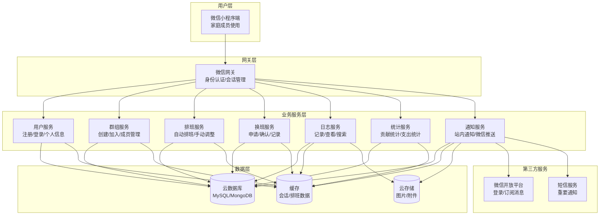

## 2.2 业务模块图

```mermaid
flowchart TD
    CORE[照护排班协作助手] --> M1[用户模块]
    CORE --> M2[群组模块]
    CORE --> M3[档案模块]
    CORE --> M4[排班模块]
    CORE --> M5[换班模块]
    CORE --> M6[日志模块]
    CORE --> M7[统计模块]
    CORE --> M8[通知模块]

    M1 --> M1A[微信登录]
    M1 --> M1B[个人信息]
    M1 --> M1C[照护偏好]

    M2 --> M2A[创建群组]
    M2 --> M2B[邀请成员]
    M2 --> M2C[成员管理]

    M3 --> M3A[基本信息]
    M3 --> M3B[健康档案]
    M3 --> M3C[照护需求]

    M4 --> M4A[自动排班]
    M4 --> M4B[日历视图]
    M4 --> M4C[手动调整]

    M5 --> M5A[发起换班]
    M5 --> M5B[处理换班]
    M5 --> M5C[换班记录]

    M6 --> M6A[记录日志]
    M6 --> M6B[浏览日志]
    M6 --> M6C[日志互动]

    M7 --> M7A[贡献统计]
    M7 --> M7B[支出统计]
    M7 --> M7C[月度报告]

    M8 --> M8A[系统通知]
    M8 --> M8B[消息中心]
```

## 2.3 主业务流程

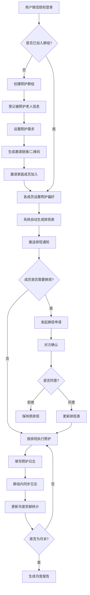

## 2.4 功能图/列表

| 功能模块 | 功能名称 | 优先级 | 功能描述 |
| --- | --- | --- | --- |
| 用户注册与登录 | 微信快捷登录 | P0 | 使用微信授权一键登录，自动获取昵称和头像 |
| 用户注册与登录 | 手机号绑定 | P0 | 首次登录绑定手机号，用于接收重要通知 |
| 用户注册与登录 | 照护偏好设置 | P0 | 设置每周可照护的时间段，作为排班依据 |
| 家庭群组管理 | 创建群组 | P0 | 输入群组名称、登记被照护人、设置照护需求 |
| 家庭群组管理 | 邀请成员 | P0 | 生成邀请链接/二维码，分享至微信群 |
| 家庭群组管理 | 成员管理 | P0 | 查看成员列表、审核加入申请 |
| 被照护人档案 | 基本信息管理 | P0 | 维护老人姓名、年龄、健康状况、用药清单 |
| 被照护人档案 | 照护需求登记 | P0 | 登记日常照护和医疗照护需求 |
| 照护排班 | 自动排班 | P0 | 根据成员偏好自动生成周/月轮班表 |
| 照护排班 | 日历视图 | P0 | 以日历形式展示排班，标注每日照护负责人 |
| 照护排班 | 手动调整排班 | P0 | 管理员可手动调整自动生成的排班表 |
| 换班与代班 | 发起换班申请 | P0 | 选择日期和对象，填写原因，提交换班申请 |
| 换班与代班 | 处理换班申请 | P0 | 查看申请详情，同意或拒绝 |
| 换班与代班 | 换班记录 | P0 | 查看历史换班记录，全程留痕 |
| 照护日志 | 记录日志 | P0 | 记录用药、身体状态、就医结论、支出 |
| 照护日志 | 浏览日志 | P0 | 按日期或按成员筛选查看日志 |
| 照护日志 | 日志通知 | P0 | 新日志提交后通知所有家庭成员 |
| 月度统计 | 照护贡献统计 | P0 | 统计每位成员当月照护天数和占比 |
| 月度统计 | 支出统计 | P0 | 统计当月总支出和各成员垫付金额 |
| 月度统计 | 月度报告 | P0 | 图表形式展示月度照护贡献和支出 |
| 消息通知 | 系统通知 | P0 | 排班、换班、日志等重要通知推送 |
| 消息通知 | 消息中心 | P0 | 查看所有历史通知，标记已读 |
| 个人中心 | 我的群组 | P0 | 查看和切换已加入的照护群组 |
| 个人中心 | 我的照护 | P0 | 查看我的排班、日志、换班记录 |

## 2.5 你的产品有哪些端

| 序号 | 端名称 | 端类型 | 目标用户 | 说明 |
| --- | --- | --- | --- | --- |
| 1 | 照护助手小程序 | 小程序端 | 家庭成员（子女/照护者） | 微信小程序，家庭成员在手机上使用，完成照护协作的全部操作 |

> 注：MVP版本仅包含小程序端。运营管理后台（WEB端）计划在第二期开发。

---

# 3 产品功能

## 3.1 照护助手小程序功能

### 3.1.1 微信快捷登录

**功能描述**：用户使用微信授权一键登录小程序，系统自动获取用户微信昵称和头像，完成账号创建或登录。首次登录时需绑定手机号，用于接收重要通知（如换班申请、排班变更等）。

**优先级与依赖说明**：

| 项 | 内容 |
| --- | --- |
| 优先级 | P0 |
| 依赖需求 | 无（入口功能） |
| 前置条件 | 用户已安装微信7.0及以上版本 |

### 3.1.2 微信快捷登录—详细流程

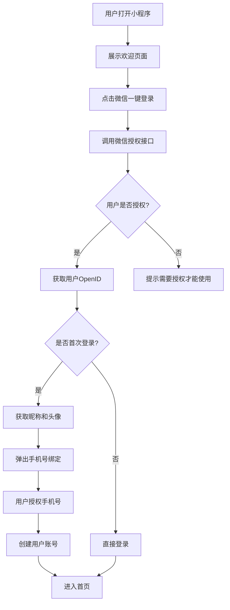

**业务规则说明**：
1. 微信授权为必须项，拒绝授权无法使用小程序
2. 手机号绑定为必须项，但可以在首次进入后通过弹窗再次引导
3. 用户信息（昵称、头像）每次登录时自动同步更新
4. 登录状态有效期为30天，过期后需重新授权

### 3.1.3 微信快捷登录—主要原型

[登录页原型](assets/prototypes/login-widget.html)

**验收标准说明**：
- [ ] 正常流程：用户点击"微信一键登录"按钮，授权后3秒内完成登录并进入首页
- [ ] 首次登录：授权后弹出手机号绑定弹窗，绑定成功后进入首页
- [ ] 异常流程：用户拒绝授权，展示友好提示"需要微信授权才能使用照护助手"
- [ ] 性能要求：登录流程（含授权）整体响应时间 < 2秒

### 3.1.4 家庭群组创建与管理

**功能描述**：群组创建者可以创建一个照护家庭群组，填写群组名称，登记被照护老人信息和照护需求。创建后生成邀请链接和二维码，可分享至微信群或直接添加成员。管理员可查看成员列表、审核加入申请、移除成员。

**优先级与依赖说明**：

| 项 | 内容 |
| --- | --- |
| 优先级 | P0 |
| 依赖需求 | 3.1.1 微信快捷登录 |
| 前置条件 | 用户已完成登录 |

### 3.1.5 家庭群组创建与管理—详细流程

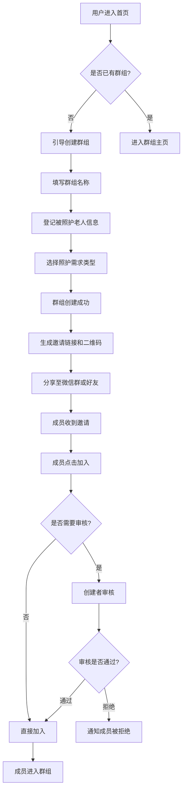

**业务规则说明**：
1. 一个用户可以创建多个群组（如照护父亲和母亲分别建群）
2. 群组名称最长20个字符，不可与同一用户创建的其他群组重名
3. 免费版群组最多3位家庭成员（不含被照护人），家庭版不限人数
4. 被照护人信息至少填写姓名和健康状况
5. 邀请链接有效期为7天，过期后需重新生成
6. 群组创建者默认为管理员，可指定其他成员为管理员
7. 创建者可移除成员，移除后该成员无法再次加入（除非重新邀请）

### 3.1.6 家庭群组创建与管理—主要原型

[群组管理原型](assets/prototypes/group-widget.html)

**验收标准说明**：
- [ ] 正常流程：用户填写群组名称→登记老人信息→选择照护需求→群组创建成功，全程不超过3分钟
- [ ] 邀请流程：生成邀请链接后，可一键分享至微信群；成员通过链接加入后，创建者收到审核通知
- [ ] 异常流程：群组名称为空时提示"请输入群组名称"；被照护人姓名未填时提示"请输入老人姓名"
- [ ] 成员管理：管理员可查看所有成员列表，包含成员昵称、角色、加入时间、照护统计

### 3.1.7 被照护人档案

**功能描述**：为被照护老人建立完整的档案，包括基本信息（姓名、年龄、照片、住址等）、健康档案（主要疾病、过敏史、用药清单等）、照护需求（日常照护项目和频率、医疗照护安排、特殊照护说明等）。

**优先级与依赖说明**：

| 项 | 内容 |
| --- | --- |
| 优先级 | P0 |
| 依赖需求 | 3.1.4 家庭群组创建与管理 |
| 前置条件 | 群组已创建 |

### 3.1.8 被照护人档案—详细流程

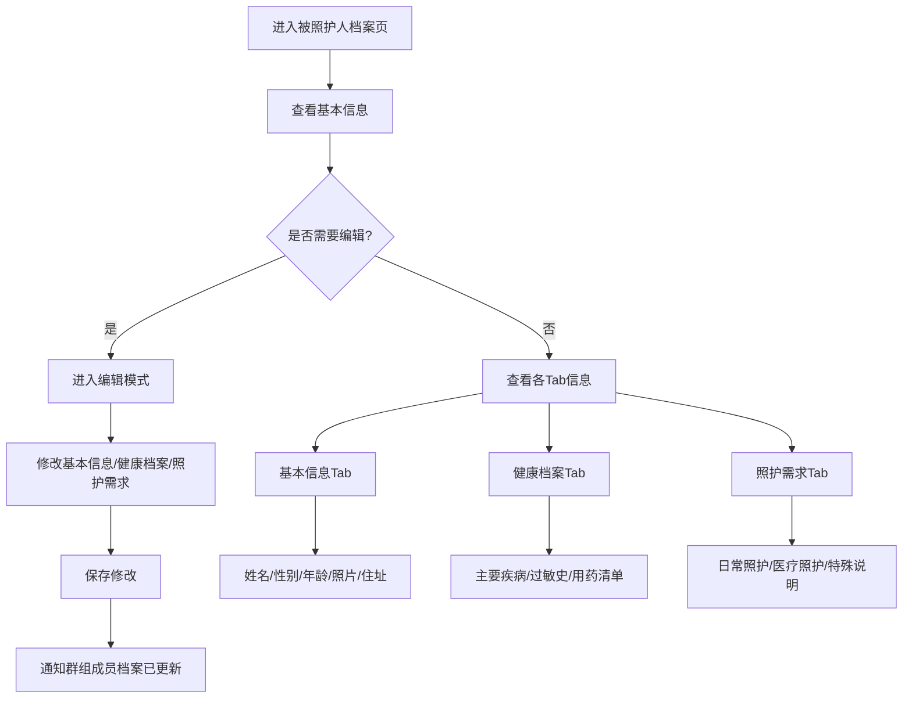

**业务规则说明**：
1. 每个群组至少有一个被照护人，创建群组时必须登记
2. 一个群组可以有多个被照护人（如同时照护父母两人）
3. 仅创建者和管理员可以编辑被照护人档案
4. 用药清单支持添加药品名称、用法用量、服药时间
5. 健康档案的修改会通知群组所有成员
6. 照片支持从相册选择或拍照上传，单张不超过10MB

### 3.1.9 被照护人档案—主要原型

[被照护人档案原型](assets/prototypes/care-profile-widget.html)

**验收标准说明**：
- [ ] 正常流程：展示被照护人基本信息、健康档案、照护需求三个Tab页，信息完整展示
- [ ] 编辑流程：管理员点击编辑按钮，可修改各Tab信息，保存后通知群组成员
- [ ] 异常流程：未上传照片时展示默认头像；用药清单为空时展示"暂无用药记录"
- [ ] 权限控制：普通成员仅可查看，编辑按钮不可见

### 3.1.10 照护排班

**功能描述**：系统根据所有成员的可照护时间偏好，自动生成按周或月的照护轮班表。提供日历视图和列表视图两种查看方式。管理员可手动调整自动生成的排班表。排班生成后自动推送通知给所有成员。

**优先级与依赖说明**：

| 项 | 内容 |
| --- | --- |
| 优先级 | P0 |
| 依赖需求 | 3.1.4 家庭群组创建, 3.1.1 照护偏好设置 |
| 前置条件 | 群组已创建且至少2位成员已设置照护偏好 |

### 3.1.11 照护排班—详细流程

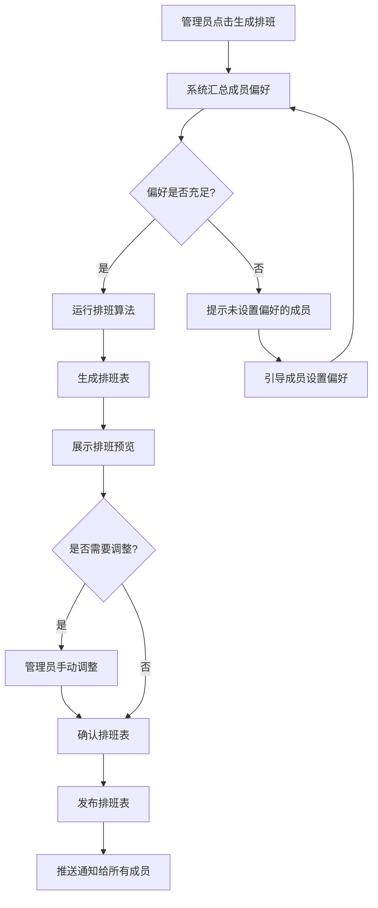

**业务规则说明**：
1. 排班算法核心规则：
   - 优先满足成员的可照护时间偏好
   - 尽量均匀分配照护天数
   - 避免同一人连续照护超过设定上限（默认3天）
   - 确保每天至少有1人照护
2. 排班周期可选：按周或按月
3. 日历视图：每天格子里展示照护负责人头像和姓名
4. 列表视图：按日期排序或按成员排序
5. 排班发布后，成员可查看自己未来的照护日期
6. 手动调整仅限管理员操作，调整后需重新通知所有成员
7. 排班表支持查看历史排班（过去3个月）和未来排班

### 3.1.12 照护排班—主要原型

[排班日历原型](assets/prototypes/schedule-widget.html)

**验收标准说明**：
- [ ] 正常流程：日历视图展示当月排班，每天标注照护负责人；可切换周/月视图
- [ ] 生成排班：点击"生成排班"按钮，系统3秒内自动生成排班表并展示预览
- [ ] 手动调整：管理员可点击某天修改照护人，保存后自动通知相关人员
- [ ] 异常流程：成员未设置偏好时，对应日期标记为"待分配"并高亮提示
- [ ] 性能要求：自动生成排班响应时间 < 3秒

### 3.1.13 换班与代班

**功能描述**：成员临时有事无法按排班照护时，可以发起换班申请（将自己的照护日期与另一位成员互换）或代班申请（请其他成员替自己完成当次照护）。对方需确认同意后方可生效。所有换班/代班记录全程留痕。

**优先级与依赖说明**：

| 项 | 内容 |
| --- | --- |
| 优先级 | P0 |
| 依赖需求 | 3.1.10 照护排班 |
| 前置条件 | 已有排班表 |

### 3.1.14 换班与代班—详细流程

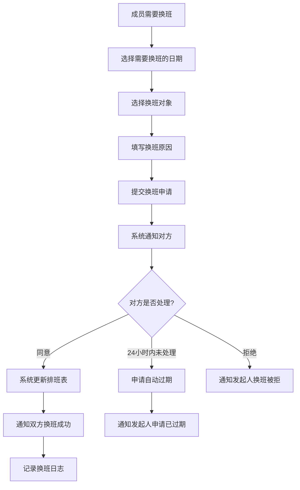

**业务规则说明**：
1. 换班申请需选择具体的照护日期和换班对象
2. 换班原因必填，支持选择预设原因（出差、生病、工作忙等）+ 自定义补充
3. 换班申请提交后，对方需在24小时内确认，超时自动过期
4. 换班成功后，双方排班互换，系统自动更新排班表
5. 代班流程与换班类似，但不涉及互换，仅为单次替代
6. 所有换班/代班记录永久保存，可在"换班记录"中查看
7. 已过期、已拒绝的申请也保留在记录中
8. 同一日期不可同时存在多个换班申请

### 3.1.15 换班与代班—主要原型

[换班申请原型](assets/prototypes/swap-widget.html)

**验收标准说明**：
- [ ] 正常流程：选择日期→选择对象→填写原因→提交申请→等待确认→结果通知
- [ ] 换班记录：列表展示所有历史换班记录，包含日期、换班人、原因、状态
- [ ] 异常流程：选择自己作为换班对象时提示"不能与自己换班"；同一日期已有申请时提示"该日期已有换班申请"
- [ ] 状态展示：待确认（橙色）、已同意（绿色）、已拒绝（红色）、已过期（灰色）

### 3.1.16 照护日志

**功能描述**：每次照护完成后，照护者填写简要日志，记录用药情况、老人身体状态、就医结论、特殊事项和照护支出。日志提交后自动通知群组所有成员，实现信息同步。

**优先级与依赖说明**：

| 项 | 内容 |
| --- | --- |
| 优先级 | P0 |
| 依赖需求 | 3.1.10 照护排班 |
| 前置条件 | 群组已创建 |

### 3.1.17 照护日志—详细流程

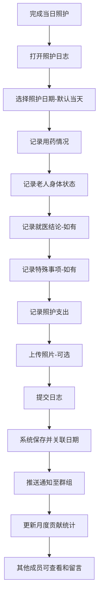

**业务规则说明**：
1. 日志字段说明：
   - 用药情况：必填，选择"正常/有异常"，可补充说明
   - 身体状态：必填，选择精神/食欲/睡眠/行动力评级（好/一般/差）
   - 就医记录：选填，填写就医结论和医嘱
   - 特殊事项：选填，如摔倒、情绪波动、访客等
   - 照护支出：选填，填写金额和类别（医药费/餐费/交通费/护理用品等）
   - 照片：选填，最多9张
2. 同一日期同一成员只能提交一条日志（可编辑已提交的日志）
3. 日志提交后，所有群组成员收到通知
4. 其他成员可以在日志下留言评论
5. 日志按时间倒序展示，支持按成员筛选
6. 免费版保留30天日志，家庭版永久保存

### 3.1.18 照护日志—主要原型

[照护日志原型](assets/prototypes/care-log-widget.html)

**验收标准说明**：
- [ ] 正常流程：选择日期→填写用药→填写状态→填写支出→提交，全程不超过2分钟
- [ ] 日志列表：按日期倒序展示，每条日志显示日期、照护人、关键信息摘要
- [ ] 留言互动：其他成员可在日志下留言，日志作者可回复
- [ ] 异常流程：必填项未填时提交按钮置灰并提示
- [ ] 性能要求：日志提交（含照片上传）响应时间 < 5秒

### 3.1.19 月度统计

**功能描述**：按月统计每位家庭成员的照护贡献，包括照护天数、照护时长、照护类型分布，以及照护支出统计（总支出、各成员垫付金额、支出类别分析）。以图表形式展示月度报告。

**优先级与依赖说明**：

| 项 | 内容 |
| --- | --- |
| 优先级 | P0 |
| 依赖需求 | 3.1.16 照护日志 |
| 前置条件 | 已有照护日志记录 |

### 3.1.20 月度统计—详细流程

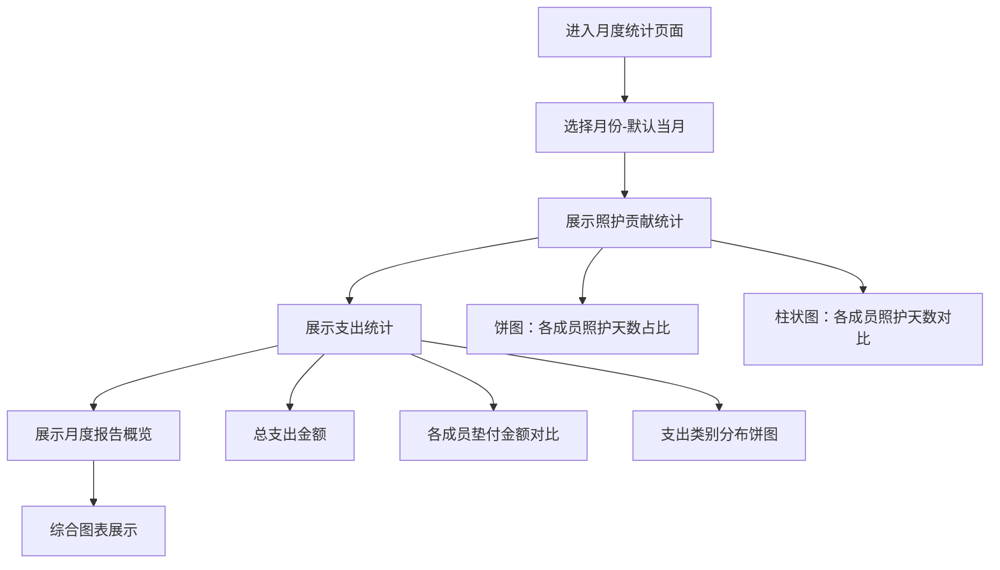

**业务规则说明**：
1. 照护贡献统计维度：
   - 照护天数：成员当月照护的总天数
   - 照护占比：该成员照护天数 / 全组照护总天数
   - 照护类型分布：各类照护活动（送药、就医、做饭等）次数
2. 支出统计维度：
   - 总支出：当月所有照护相关支出总额
   - 各成员垫付：每人为照护垫付的金额
   - 支出类别：医药费、餐费、交通费、护理用品
3. 月度报告以图表形式综合展示（饼图+柱状图）
4. 支持切换查看历史月份（最近6个月）
5. 数据实时更新，每次日志提交后自动更新统计

### 3.1.21 月度统计—主要原型

[月度统计原型](assets/prototypes/statistics-widget.html)

**验收标准说明**：
- [ ] 正常流程：进入统计页→展示当月照护贡献饼图和柱状图→展示支出统计→可切换月份
- [ ] 数据准确性：统计数据与日志记录一致，实时更新
- [ ] 异常流程：无日志记录时展示空状态"本月暂无照护记录"
- [ ] 图表展示：饼图各成员用不同颜色区分，柱状图支持横向对比

### 3.1.22 消息通知

**功能描述**：系统自动推送各类通知，包括排班通知（新排班发布、排班变更）、换班通知（收到换班申请、换班结果）、日志通知（新日志提交）、成员通知（新成员加入）。支持小程序内通知和微信订阅消息两种方式。

**优先级与依赖说明**：

| 项 | 内容 |
| --- | --- |
| 优先级 | P0 |
| 依赖需求 | 无（基础能力） |
| 前置条件 | 用户已登录 |

### 3.1.23 消息通知—详细流程

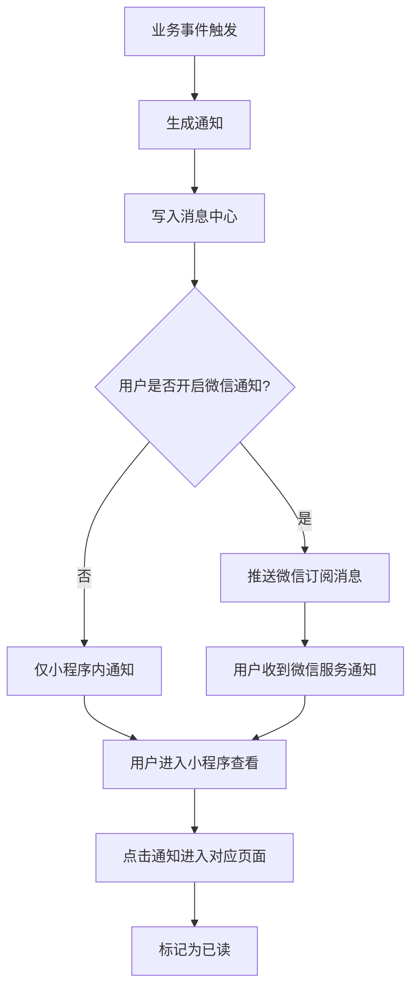

**业务规则说明**：
1. 通知类型：
   - 排班通知：新排班发布、排班被调整（P0）
   - 换班通知：收到换班申请、换班成功/失败（P0）
   - 日志通知：新日志提交（P0）
   - 成员通知：新成员加入、成员退出（P1）
2. 每条通知包含：标题、摘要、时间、跳转链接
3. 消息中心支持：查看全部通知、标记已读/未读、按类型筛选
4. 微信订阅消息需用户主动订阅授权
5. 重要通知（换班申请）同时推送微信服务和小程序内通知

### 3.1.24 个人中心

**功能描述**：展示用户的个人信息、已加入的群组、我的照护数据（排班、日志、换班记录），以及个人设置（信息修改、偏好调整、通知设置）。

**优先级与依赖说明**：

| 项 | 内容 |
| --- | --- |
| 优先级 | P0 |
| 依赖需求 | 3.1.1 微信快捷登录 |
| 前置条件 | 用户已登录 |

### 3.1.25 个人中心—详细流程

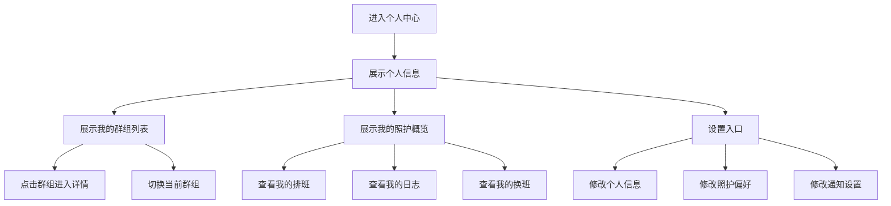

**业务规则说明**：
1. 个人信息展示：头像、昵称、手机号（脱敏显示）
2. 我的群组：列出所有已加入的群组，点击可切换当前群组
3. 我的照护概览：本月照护天数、累计照护天数、本月支出
4. 照护偏好设置：按周设置可照护时间段（支持多选周一到周日的上午/下午/晚上）
5. 通知设置：选择接收通知的方式和类型

---

# 4 产品原型

## 4.1 页面跳转逻辑图

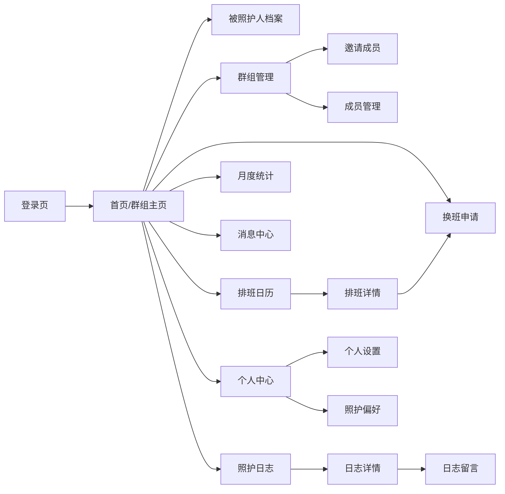

## 4.2 全站点原型设计

### 4.2.1 照护助手小程序

**页面清单：**

| 序号 | 页面名称 | 所属模块 | 页面描述 | 关键元素 |
| --- | --- | --- | --- | --- |
| 1 | 登录页 | 用户登录 | 微信一键登录入口 | Logo、授权按钮、手机号绑定 |
| 2 | 首页/群组主页 | 群组管理 | 展示群组概况、今日照护人、快捷入口 | 群组名称、今日照护人卡片、功能入口宫格 |
| 3 | 被照护人档案页 | 被照护人档案 | 展示老人详细信息 | 头像、基本信息、健康Tab、照护需求Tab |
| 4 | 排班日历页 | 照护排班 | 日历形式展示排班 | 日历组件、每日照护人标注、生成排班按钮 |
| 5 | 排班列表页 | 照护排班 | 列表形式展示排班 | 按日期/按成员列表、切换按钮 |
| 6 | 换班申请页 | 换班与代班 | 发起换班申请 | 日期选择、对象选择、原因填写 |
| 7 | 换班记录页 | 换班与代班 | 查看历史换班 | 换班列表、状态标签 |
| 8 | 照护日志列表页 | 照护日志 | 按时间浏览日志 | 日志卡片列表、成员筛选Tab |
| 9 | 照护日志编辑页 | 照护日志 | 填写并提交日志 | 表单（用药、状态、就医、支出、照片） |
| 10 | 月度统计页 | 月度统计 | 展示月度数据 | 贡献饼图、柱状图、支出统计、月份切换 |
| 11 | 消息中心页 | 消息通知 | 查看所有通知 | 通知列表、类型标签、已读/未读标记 |
| 12 | 个人中心页 | 个人中心 | 个人信息和设置 | 头像昵称、群组列表、照护概览、设置入口 |
| 13 | 群组管理页 | 群组管理 | 管理群组和成员 | 群组信息、成员列表、邀请按钮 |
| 14 | 邀请成员页 | 群组管理 | 生成邀请并分享 | 邀请二维码、邀请链接、分享按钮 |

**交互说明**：
- 页面跳转关系：
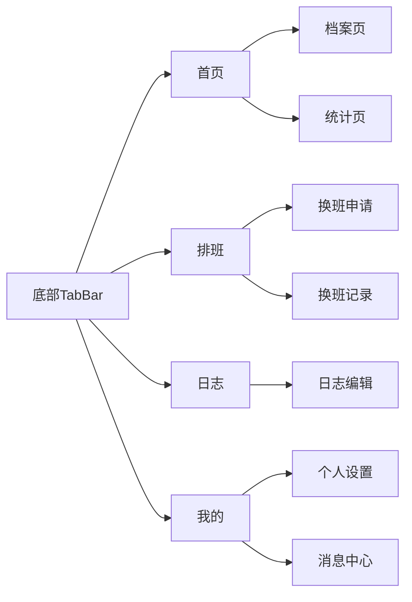

- 特殊交互：
  1. 底部TabBar包含4个Tab：首页、排班、日志、我的
  2. 日历组件支持左右滑动切换月份，点击某天可查看详情
  3. 日志列表支持下拉刷新和上拉加载更多
  4. 换班申请提交后展示Loading状态，成功后Toast提示
  5. 表单类页面（日志编辑、档案编辑）支持实时保存草稿
  6. 空数据态：各页面在无数据时展示友好空状态图和引导文案

**产品原型：**

[📱 打开照护助手小程序全站点原型](assets/prototypes/mini-program-prototype.html)

---

# 5 数据需求

## 5.1 数据使用规格

### 用户表 (users)
| **字段** | **是否必填** | **描述** | **数据类型** |
| --- | --- | --- | --- |
| id | 是 | 用户唯一标识 | 字符串(UUID) |
| openid | 是 | 微信OpenID | 字符串 |
| nickname | 是 | 用户昵称 | 字符串 |
| avatar_url | 否 | 头像URL | 字符串 |
| phone | 是 | 手机号 | 字符串 |
| created_at | 是 | 注册时间 | 时间戳 |

### 群组表 (groups)
| **字段** | **是否必填** | **描述** | **数据类型** |
| --- | --- | --- | --- |
| id | 是 | 群组唯一标识 | 字符串(UUID) |
| name | 是 | 群组名称 | 字符串 |
| creator_id | 是 | 创建者ID | 字符串 |
| invite_code | 是 | 邀请码 | 字符串 |
| plan_type | 是 | 套餐类型(free/family) | 字符串 |
| created_at | 是 | 创建时间 | 时间戳 |

### 群组成员表 (group_members)
| **字段** | **是否必填** | **描述** | **数据类型** |
| --- | --- | --- | --- |
| id | 是 | 记录ID | 字符串 |
| group_id | 是 | 群组ID | 字符串 |
| user_id | 是 | 用户ID | 字符串 |
| role | 是 | 角色(admin/member) | 字符串 |
| availability | 否 | 照护偏好JSON | JSON |
| joined_at | 是 | 加入时间 | 时间戳 |

### 被照护人表 (care_persons)
| **字段** | **是否必填** | **描述** | **数据类型** |
| --- | --- | --- | --- |
| id | 是 | 档案ID | 字符串 |
| group_id | 是 | 群组ID | 字符串 |
| name | 是 | 姓名 | 字符串 |
| gender | 是 | 性别 | 字符串 |
| birth_date | 否 | 出生日期 | 日期 |
| photo_url | 否 | 照片URL | 字符串 |
| address | 否 | 住址 | 字符串 |
| health_info | 否 | 健康信息JSON | JSON |
| care_needs | 否 | 照护需求JSON | JSON |
| created_at | 是 | 创建时间 | 时间戳 |

### 排班表 (schedules)
| **字段** | **是否必填** | **描述** | **数据类型** |
| --- | --- | --- | --- |
| id | 是 | 排班ID | 字符串 |
| group_id | 是 | 群组ID | 字符串 |
| care_date | 是 | 照护日期 | 日期 |
| assigned_user_id | 是 | 指派的照护人ID | 字符串 |
| period_type | 是 | 周期类型(week/month) | 字符串 |
| is_manual | 是 | 是否手动调整 | 布尔 |
| created_at | 是 | 创建时间 | 时间戳 |

### 换班申请表 (swap_requests)
| **字段** | **是否必填** | **描述** | **数据类型** |
| --- | --- | --- | --- |
| id | 是 | 申请ID | 字符串 |
| group_id | 是 | 群组ID | 字符串 |
| requester_id | 是 | 发起人ID | 字符串 |
| target_id | 是 | 目标人ID | 字符串 |
| swap_date | 是 | 换班日期 | 日期 |
| reason | 是 | 换班原因 | 字符串 |
| type | 是 | 类型(swap/substitute) | 字符串 |
| status | 是 | 状态(pending/approved/rejected/expired) | 字符串 |
| created_at | 是 | 创建时间 | 时间戳 |

### 照护日志表 (care_logs)
| **字段** | **是否必填** | **描述** | **数据类型** |
| --- | --- | --- | --- |
| id | 是 | 日志ID | 字符串 |
| group_id | 是 | 群组ID | 字符串 |
| care_person_id | 是 | 被照护人ID | 字符串 |
| author_id | 是 | 记录人ID | 字符串 |
| care_date | 是 | 照护日期 | 日期 |
| medication_status | 是 | 用药情况JSON | JSON |
| health_status | 是 | 身体状态JSON | JSON |
| medical_record | 否 | 就医记录JSON | JSON |
| special_notes | 否 | 特殊事项 | 字符串 |
| expense_amount | 否 | 支出金额 | 数字 |
| expense_category | 否 | 支出类别 | 字符串 |
| photos | 否 | 照片URL列表 | JSON数组 |
| created_at | 是 | 创建时间 | 时间戳 |

### 通知表 (notifications)
| **字段** | **是否必填** | **描述** | **数据类型** |
| --- | --- | --- | --- |
| id | 是 | 通知ID | 字符串 |
| user_id | 是 | 接收人ID | 字符串 |
| group_id | 是 | 群组ID | 字符串 |
| type | 是 | 通知类型 | 字符串 |
| title | 是 | 通知标题 | 字符串 |
| content | 是 | 通知内容 | 字符串 |
| is_read | 是 | 是否已读 | 布尔 |
| created_at | 是 | 创建时间 | 时间戳 |

## 5.2 统计数据

1. 统计每位成员每月的照护天数、照护占比（P0）
2. 统计每月的照护总支出、各成员垫付金额、支出类别分布（P0）
3. 统计各类照护活动的次数分布（P1）
4. 统计群组整体照护趋势（近6个月）（P2）

## 5.3 埋点需求

| 页面 | 事件 | 采集字段 | 说明 |
| --- | --- | --- | --- |
| 登录页 | click_login | user_id, timestamp | 统计登录转化率 |
| 首页 | view_home | group_id, user_id | 统计首页访问频次 |
| 排班页 | generate_schedule | group_id, period_type | 统计排班功能使用率 |
| 排班页 | adjust_schedule | group_id, adjustment_count | 统计手动调整频率 |
| 换班页 | submit_swap | group_id, swap_type, reason | 统计换班频率和原因 |
| 日志页 | submit_log | group_id, care_date, has_expense, has_photo | 统计日志提交率和内容完整度 |
| 统计页 | view_stats | group_id, month | 统计统计页使用率 |
| 群组页 | invite_member | group_id, invite_type(link/qr) | 统计邀请方式偏好 |

---

# 6 非功能需求

## 6.1 性能需求

| 编号 | 项目 | 最大延迟 | 平均延迟 | 优先级 | 备注 |
| --- | --- | --- | --- | --- | --- |
| 0001 | 95%的页面加载 | < 2秒 | < 1秒 | P0 | 含首屏渲染 |
| 0002 | 自动排班生成 | < 3秒 | < 2秒 | P0 | 含算法计算和数据返回 |
| 0003 | 日志提交（含照片） | < 5秒 | < 3秒 | P0 | 照片压缩后上传 |
| 0004 | 通知推送延迟 | < 30秒 | < 10秒 | P0 | 微信订阅消息推送 |
| 0005 | 列表页数据加载 | < 1.5秒 | < 1秒 | P0 | 含分页加载 |

| 编号 | 项 | 吞吐量 | 备注 |
| --- | --- | --- | --- |
| 0001 | 登录认证 | 每分钟500次 | 高峰期支持 |
| 0002 | 排班生成 | 每分钟100次 | 月末集中排班 |
| 0003 | 日志提交 | 每分钟200次 | 晚间集中提交 |

| 编号 | 项 | 容量 | 备注 |
| --- | --- | --- | --- |
| 0001 | 系统群组数 | <= 10,000 | 初期目标 |
| 0002 | 同时在线用户 | >= 500 | 并发处理 |
| 0003 | 单群组成员数 | <= 20 | 家庭规模 |

## 6.2 安全需求

| 编号 | 项 |
| --- | --- |
| 0001 | 用户敏感信息（手机号、健康数据）必须加密存储（AES-256） |
| 0002 | 数据传输全程使用HTTPS加密 |
| 0003 | 照护日志和健康数据仅对群组内成员可见，不可被外部访问 |
| 0004 | 用户认证使用微信OAuth2.0，不存储用户微信密码 |
| 0005 | 接口调用需要Token校验，Token有效期30天 |
| 0006 | 管理操作（编辑档案、调整排班、移除成员）需要管理员权限校验 |

## 6.3 可靠性

| 编号 | 项 | 值 |
| --- | --- | --- |
| 0001 | 系统可用性 | 99.9% |
| 0002 | 平均正常运行时间 | 720小时（30天） |
| 0003 | 平均故障恢复时间 | < 30分钟 |

## 6.4 可连续性

| 编号 | 项 |
| --- | --- |
| Modi.1 | 系统需要 7 × 24 式的全天候运行 |
| Modi.2 | 数据库采用主从架构，主库故障时自动切换到从库 |
| Modi.3 | 关键业务数据实时备份到异地存储 |

## 6.5 可恢复性

| 编号 | 项 |
| --- | --- |
| Modi.1 | 数据库每日全量备份，保留30天 |
| Modi.2 | 每小时增量备份 |
| Modi.3 | 重大故障需在1-3小时内恢复服务 |
| Modi.4 | 24-72小时内恢复历史数据 |

## 6.6 兼容性

| 编号 | 要求 | 备注 |
| --- | --- | --- |
| 0001 | 微信版本 >= 7.0 | P0 |
| 0002 | iOS >= 12.0 | P0 |
| 0003 | Android >= 6.0 | P0 |
| 0004 | 适配主流分辨率：375×667, 390×844, 414×896 | P0 |

## 6.7 易用性

| 编号 | 要求 | 备注 |
| --- | --- | --- |
| 0001 | 核心操作路径不超过3步 | P0 |
| 0002 | 普通用户无需培训即可使用核心功能 | P0 |
| 0003 | 按钮文案通俗易懂，避免技术术语 | P0 |
| 0004 | 支持字体大小调节 | P1 |
| 0005 | 友好空状态引导 | P1 |

---

# 7 总结

## 7.1 上线计划

| 阶段 | 时间 | 内容 | 负责人 |
| --- | --- | --- | --- |
| 开发阶段 | 第1-5天 | 核心功能开发（登录、群组、排班、换班、日志、统计） | 开发团队 |
| 测试阶段 | 第6天 | 功能测试、兼容性测试、性能测试 | 测试团队 |
| 灰度阶段 | 第7天 | 邀请10个家庭内测，收集反馈 | 产品团队 |
| 全量上线 | 第8天 | 全量开放，提交微信审核 | 产品团队 |

## 7.2 后续迭代规划

- V1.1（上线后2周）：支出分摊与结算功能、提醒通知系统优化
- V1.2（上线后1月）：照护日志时间线浏览和搜索、导出月度照护报告（PDF）
- V1.5（上线后2月）：智能排班推荐（基于历史数据优化排班算法）
- V2.0（上线后3月）：健康数据接入（血压、血糖等智能设备同步）、运营管理后台

## 7.3 参考文档

- 多子女父母照护排班协作助手 - 用户需求说明书（URS）V1.0
- 微信小程序开发文档
- 微信订阅消息接口文档

---
**文档版本**: V1.0
**编写日期**: 2026年6月29日
**适用范围**: 多子女父母照护排班协作助手 MVP版本
**文档说明**: 本PRD基于"优特云-用户语言"五层软件架构思想编写，基于需求文档（URS）进行产品设计，涵盖产品概述、产品设计、产品功能、产品原型、数据需求、非功能需求等核心章节，可作为后续开发、测试的依据。
