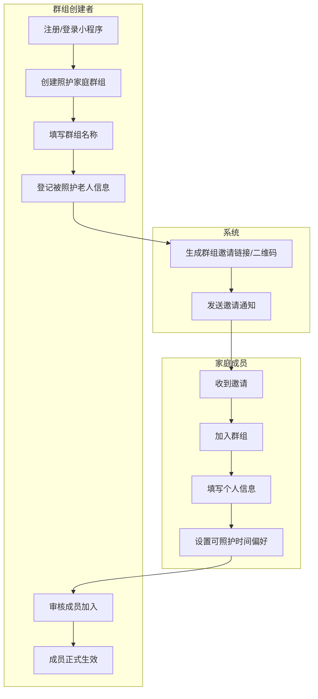
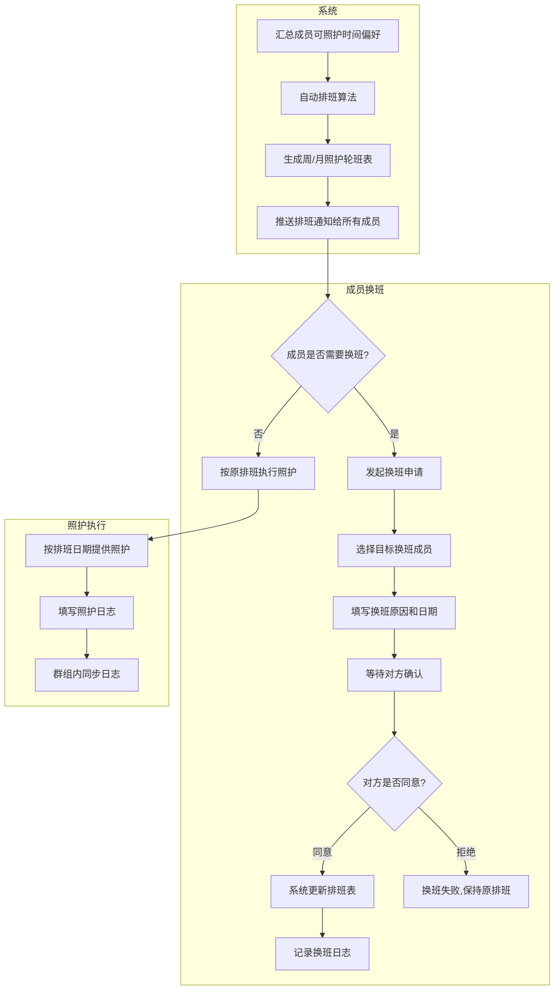
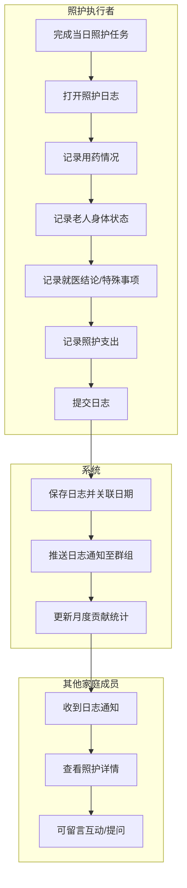
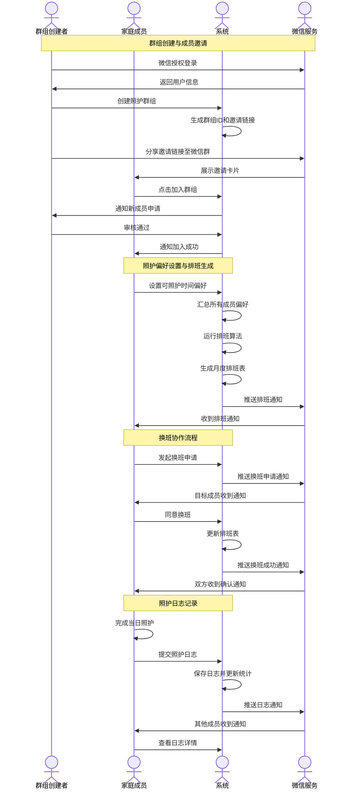
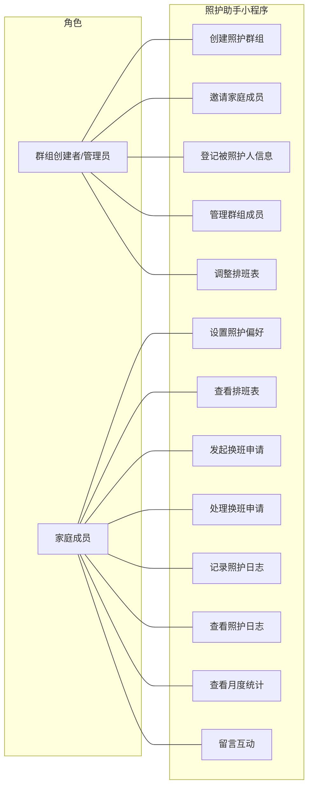
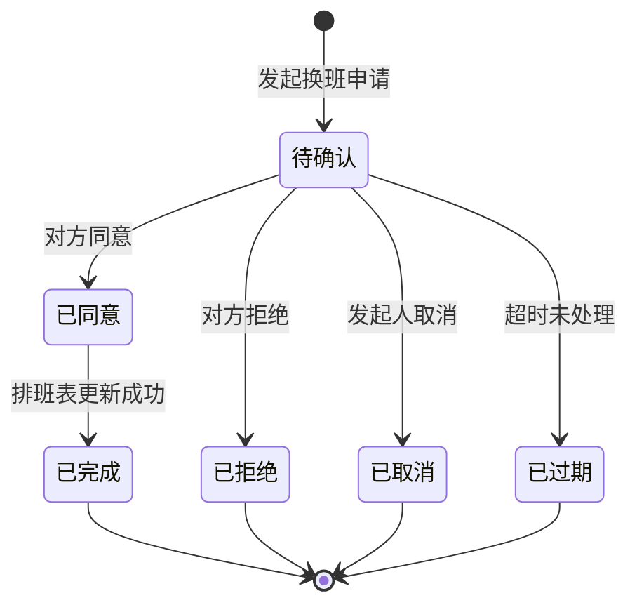
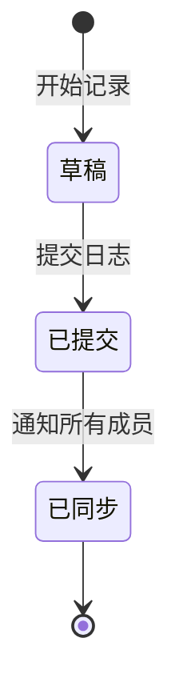

# 多子女父母照护排班协作助手 - 用户需求说明书

# 1.需求概述

多子女父母照护排班协作助手是一款面向多子女家庭的轻量级照护协作工具，帮助家庭成员共同分担年迈或患病父母的日常照护工作，通过智能排班、换班协作、照护日志和贡献统计等功能，解决"谁来照顾父母"这一普遍家庭痛点，减少家庭内部因照护分工不透明引发的矛盾。

## 1.1 需求介绍

随着我国加速进入老龄化社会，"多子女共同照护年迈父母"成为越来越普遍的家庭场景。然而在实际生活中，家庭成员间的照护分工往往面临以下痛点：

1. **排班协调困难**：微信群手工协调排班效率低，信息分散，容易遗漏或重复
2. **贡献不透明**：谁照顾得多、谁照顾得少缺乏客观记录，长期积累易引发家庭矛盾
3. **信息不对称**：老人的用药情况、就医结论、身体状态等信息无法及时同步给所有家庭成员
4. **换班纠纷**：临时有事需要换班时，口头协商缺乏记录，事后容易产生分歧
5. **缺乏专业工具**：现有养老/护理工具多面向机构或专业护工，缺少"家庭内部协作"的轻量工具

本系统旨在为多子女家庭提供一个简单易用的照护协作平台，让家庭照护分工公平透明、信息同步高效、换班协作有序。

### 1.1.1 所属领域

家庭健康管理、养老照护、家庭协作工具

### 1.1.2 核心价值

- **对家庭成员**：公平分担照护责任，减少因"谁照顾得多"引发的矛盾
- **对被照护老人**：获得更规律、更周全的照护服务
- **对家庭关系**：信息透明、贡献可量化，促进家庭和谐
- **对比现有方案**：比微信群协调更高效，比养老机构SaaS更轻量，填补"家庭内部照护协作"的工具空白

## 1.2 需求目标

### 1.2.1 第一期目标（MVP - 约7天）

完成核心照护协作功能：

- 家庭群组管理（创建/加入/成员管理）
- 被照护人档案（老人信息、照护需求登记）
- 照护轮班表自动生成（按周/月）
- 换班/代班流程（申请-确认-记录）
- 照护日志（用药、状态、就医、支出记录）
- 月度照护贡献统计

### 1.2.2 第二期目标

增强功能与体验优化：

- 支出分摊与结算功能
- 提醒通知系统（微信服务通知/短信）
- 照护日志的时间线浏览和搜索
- 导出月度照护报告（PDF）
- 多人协作编辑被照护人档案

### 1.2.3 第三期目标

智能化与生态扩展：

- 智能排班推荐（基于历史数据和偏好优化）
- 健康数据接入（血压、血糖等智能设备数据同步）
- 家庭相册/回忆录功能
- 专业护工/社区服务对接入口

## 1.3 系统使用角色

1. **群组创建者（管理员）**: 创建家庭照护群组的发起人，拥有群组管理权限，可邀请成员、编辑被照护人信息、设置排班规则
2. **家庭成员（子女/照护者）**: 加入群组后的普通成员，可查看排班表、参与换班、记录照护日志、查看统计数据
3. **被照护人（老人）**: 照护的对象，由家庭成员代为登记信息，本身不操作系统（非系统用户）

## 1.4 业务流程图

### 1.4.1 家庭群组创建与成员加入流程

### 1.4.2 照护轮班与换班流程

### 1.4.3 照护日志记录与信息同步流程

# 2.功能原型

| 原型名称 | 原型链接 | 对应端 | 备注 |
| --- | --- | --- | --- |
| 照护助手小程序（家庭成员端） | 见同目录HTML原型文件 | 小程序端 | V1.0 MVP |
| 运营管理后台 | 待规划 | WEB端 | 第二期 |

# 3.需求清单

## 3.1 照护助手-小程序端

### 3.1.1 用户注册与登录模块

| 模块 | 一级功能 | 二级功能 | 功能描述 | 优先级 | 备注 |
| --- | --- | --- | --- | --- | --- |
| 用户注册与登录 | 微信快捷登录 | 一键授权登录 | 使用微信授权快速登录，自动获取昵称和头像 | P0 | MVP必须 |
| | | 手机号绑定 | 首次登录绑定手机号，用于接收重要通知 | P0 | |
| | 个人信息管理 | 基本信息编辑 | 修改昵称、头像、联系方式 | P1 | |
| | | 照护偏好设置 | 设置每周可照护的时间段（如周一三五晚上、周末全天等） | P0 | 排班依据 |

### 3.1.2 家庭群组管理模块

| 模块 | 一级功能 | 二级功能 | 功能描述 | 优先级 | 备注 |
| --- | --- | --- | --- | --- | --- |
| 家庭群组管理 | 创建群组 | 填写群组信息 | 输入群组名称（如"张三家庭照护群"）、群组公告 | P0 | |
| | | 登记被照护人 | 填写老人姓名、年龄、健康状况、主要疾病、用药情况等 | P0 | |
| | | 设置照护需求 | 登记需要的照护类型：送药、陪同就医、做饭、洗澡、陪聊、购物等 | P0 | |
| | 邀请成员 | 生成邀请链接 | 生成专属邀请链接，可分享至微信群或好友 | P0 | |
| | | 生成邀请二维码 | 生成群组二维码，供线下扫码加入 | P1 | |
| | | 直接添加成员 | 通过手机号直接邀请家庭成员加入 | P1 | |
| | 成员管理 | 查看成员列表 | 展示所有成员及其角色、加入时间、照护统计 | P0 | |
| | | 审核加入申请 | 群组创建者审核新成员的加入申请 | P0 | |
| | | 移除成员 | 创建者可移除不活跃或无关成员 | P1 | |
| | | 设置管理员 | 创建者可指定其他成员为管理员，协助管理 | P1 | |
| | 群组信息 | 查看群组详情 | 展示群组名称、被照护人信息、照护需求、成员列表 | P0 | |
| | | 编辑群组信息 | 创建者/管理员可修改群组信息和照护需求 | P0 | |

### 3.1.3 被照护人档案模块

| 模块 | 一级功能 | 二级功能 | 功能描述 | 优先级 | 备注 |
| --- | --- | --- | --- | --- | --- |
| 被照护人档案 | 基本信息 | 个人信息维护 | 姓名、性别、出生日期、照片、住址、紧急联系人 | P0 | |
| | | 健康档案管理 | 主要疾病、过敏史、既往病史、当前用药清单 | P0 | |
| | 照护需求 | 日常照护需求 | 记录需要的日常照护项目（做饭、清洁、洗澡、陪聊等）及频率 | P0 | |
| | | 医疗照护需求 | 定期就医安排、复诊时间、需陪同的检查项目 | P0 | |
| | | 特殊照护说明 | 饮食禁忌、作息习惯、情绪偏好、注意事项等 | P1 | |
| | 档案管理 | 编辑更新档案 | 创建者/管理员可修改被照护人档案信息 | P0 | |
| | | 查看档案历史 | 查看档案的修改记录 | P2 | |

### 3.1.4 照护排班模块

| 模块 | 一级功能 | 二级功能 | 功能描述 | 优先级 | 备注 |
| --- | --- | --- | --- | --- | --- |
| 照护排班 | 排班生成 | 自动排班 | 系统根据成员的可照护时间偏好，自动生成周/月照护轮班表 | P0 | 核心功能 |
| | | 排班规则设置 | 设置排班周期（周/月）、每人最少照护天数、连续照护上限等 | P0 | |
| | | 手动调整排班 | 创建者/管理员可手动调整自动生成的排班表 | P0 | |
| | 排班查看 | 日历视图 | 以日历形式展示照护排班，每天标注照护负责人 | P0 | |
| | | 列表视图 | 以列表形式展示排班，按成员或按日期排序 | P0 | |
| | | 我的排班 | 快速查看自己未来需要照护的日期 | P0 | |
| | 排班提醒 | 排班发布通知 | 新排班表生成后，推送通知给所有成员 | P0 | |
| | | 照护前提醒 | 照护前一天/当天早上推送提醒 | P1 | |

### 3.1.5 换班与代班模块

| 模块 | 一级功能 | 二级功能 | 功能描述 | 优先级 | 备注 |
| --- | --- | --- | --- | --- | --- |
| 换班与代班 | 发起换班 | 选择换班日期 | 选择自己需要换班的日期 | P0 | |
| | | 选择换班对象 | 选择希望与之换班的家庭成员 | P0 | |
| | | 填写换班原因 | 简要说明换班原因（如出差、生病等） | P0 | |
| | | 提交换班申请 | 提交申请后等待对方确认 | P0 | |
| | 处理换班 | 查看换班申请 | 收到换班申请通知，查看申请详情 | P0 | |
| | | 同意/拒绝换班 | 对方可同意或拒绝换班申请 | P0 | |
| | | 换班结果通知 | 换班成功/失败后通知双方和群组 | P0 | |
| | 代班功能 | 发起代班请求 | 临时有事无法照护，请求其他成员代班 | P1 | |
| | | 代班确认 | 代班人确认后代班生效 | P1 | |
| | 换班记录 | 查看换班历史 | 查看所有历史换班记录，包括换班人、日期、原因 | P0 | 留痕透明 |

### 3.1.6 照护日志模块

| 模块 | 一级功能 | 二级功能 | 功能描述 | 优先级 | 备注 |
| --- | --- | --- | --- | --- | --- |
| 照护日志 | 记录日志 | 照护日期选择 | 选择照护日期（默认当天） | P0 | |
| | | 用药情况记录 | 记录老人当日用药情况（是否按时服药、有无异常反应） | P0 | |
| | | 身体状态记录 | 记录老人当日身体状况（精神状态、食欲、睡眠、行动能力等） | P0 | |
| | | 就医记录 | 如有就医，记录就医结论、医嘱、下次复诊时间 | P0 | |
| | | 特殊事项记录 | 记录当日发生的特殊情况（如摔倒、情绪波动、访客等） | P1 | |
| | | 照护支出记录 | 记录当日照护相关支出（医药费、餐费、交通费、护理用品等） | P0 | 含金额和类别 |
| | | 照片上传 | 上传照护过程中的照片（如用药照片、就医单据等） | P1 | |
| | 查看日志 | 按日期浏览 | 按日期顺序浏览所有照护日志 | P0 | |
| | | 按成员筛选 | 筛选特定成员的照护日志 | P0 | |
| | | 日志详情 | 查看单条日志的完整信息 | P0 | |
| | | 日志搜索 | 按关键词搜索日志内容 | P2 | |
| | 日志互动 | 留言评论 | 其他家庭成员可对日志留言提问或表达感谢 | P1 | |
| | | 日志通知 | 新日志提交后通知所有家庭成员 | P0 | |

### 3.1.7 月度统计模块

| 模块 | 一级功能 | 二级功能 | 功能描述 | 优先级 | 备注 |
| --- | --- | --- | --- | --- | --- |
| 月度统计 | 照护贡献统计 | 照护天数统计 | 统计每位成员当月照护天数和占比 | P0 | 核心透明功能 |
| | | 照护时长统计 | 统计每位成员当月照护时长（按日志估算） | P1 | |
| | | 照护类型分布 | 统计各类照护活动（送药、就医、做饭等）的次数分布 | P1 | |
| | 支出统计 | 总支出统计 | 统计当月照护总支出 | P0 | |
| | | 分成员支出 | 统计每位成员垫付的支出金额 | P0 | |
| | | 支出类别分析 | 按类别（医药、餐饮、交通、护理用品）分析支出 | P1 | |
| | 统计报告 | 月度报告概览 | 以图表形式展示月度照护贡献和支出情况 | P0 | |
| | | 历史趋势 | 查看近几个月的照护贡献趋势 | P2 | |
| | | 导出报告 | 导出月度照护报告（PDF/图片） | P2 | 第二期 |

### 3.1.8 消息通知模块

| 模块 | 一级功能 | 二级功能 | 功能描述 | 优先级 | 备注 |
| --- | --- | --- | --- | --- | --- |
| 消息通知 | 系统通知 | 排班通知 | 新排班表生成、排班变更通知 | P0 | |
| | | 换班通知 | 收到换班申请、换班结果通知 | P0 | |
| | | 日志通知 | 新照护日志提交通知 | P0 | |
| | | 成员通知 | 新成员加入、成员退出通知 | P1 | |
| | 通知设置 | 通知方式选择 | 选择接收通知的方式（小程序内/微信服务通知/短信） | P1 | |
| | | 免打扰设置 | 设置免打扰时段 | P2 | |
| | 消息中心 | 通知列表 | 查看所有历史通知 | P0 | |
| | | 通知标记已读 | 标记单条/全部通知为已读 | P0 | |

### 3.1.9 个人中心模块

| 模块 | 一级功能 | 二级功能 | 功能描述 | 优先级 | 备注 |
| --- | --- | --- | --- | --- | --- |
| 个人中心 | 我的群组 | 群组列表 | 查看已加入的所有照护群组 | P0 | |
| | | 切换群组 | 在不同照护群组间切换 | P0 | |
| | 我的照护 | 我的排班 | 查看自己未来的照护排班 | P0 | |
| | | 我的日志 | 查看自己提交的所有照护日志 | P0 | |
| | | 我的换班 | 查看自己发起和收到的换班记录 | P0 | |
| | 个人设置 | 个人信息 | 修改昵称、头像、手机号 | P0 | |
| | | 照护偏好 | 修改可照护时间偏好 | P0 | |
| | | 通知设置 | 修改通知接收偏好 | P1 | |
| | 关于 | 使用说明 | 查看产品使用帮助和常见问题 | P1 | |
| | | 意见反馈 | 提交使用反馈和建议 | P2 | |
| | | 版本信息 | 查看当前版本号 | P2 | |

# 4.非功能需求

## 4.1 使用界面需求

| 需求项 | 详细描述 | 备注 |
| --- | --- | --- |
| 设计风格 | 温馨、简洁、易用，符合家庭场景的情感化设计，照顾中老年用户的视觉习惯 | P0 |
| 主色调 | 使用温暖的色调（如暖橙色、暖绿色），传递关爱和温馨感 | P0 |
| 字体大小 | 支持字体大小调节，默认字号偏大，方便中老年用户查看 | P1 |
| 响应式设计 | 适配不同尺寸的手机屏幕，以小程序为主 | P0 |
| 操作便捷 | 核心操作不超过3步完成，按钮清晰、文案通俗易懂 | P0 |
| 空状态 | 主要页面设计友好的空状态引导，如"还没有排班记录，快去创建群组吧" | P1 |

## 4.2 软硬件环境需求

| 需求项 | 详细描述 | 备注 |
| --- | --- | --- |
| 客户端环境 | 微信小程序，支持iOS和Android | P0 |
| 微信版本 | 微信7.0及以上版本 | P0 |
| 后端环境 | 云服务部署（推荐微信云开发或主流云厂商） | P0 |
| 数据库 | 云数据库（如微信云数据库/MySQL/MongoDB） | P0 |
| 存储 | 云存储（用于照片、日志附件等） | P0 |

## 4.3 性能需求

| 需求项 | 详细描述 | 备注 |
| --- | --- | --- |
| 页面加载 | 95%的页面加载时间 < 2秒 | P0 |
| 排班生成 | 自动生成排班表响应时间 < 3秒 | P0 |
| 日志提交 | 日志提交（含照片上传）响应时间 < 5秒 | P0 |
| 通知推送 | 重要通知（换班申请等）推送延迟 < 30秒 | P0 |
| 系统容量 | 初期支持1万家庭群组，可扩展 | P1 |
| 并发处理 | 支持500用户同时在线操作 | P1 |

## 4.4 约束性需求

| 需求项 | 详细描述 | 备注 |
| --- | --- | --- |
| 数据安全 | 家庭成员信息、健康信息等敏感数据必须加密存储和传输 | P0 |
| 隐私保护 | 照护日志、健康数据等仅对群组内成员可见，不对外公开 | P0 |
| 微信生态 | 必须基于微信小程序开发，利用微信社交关系链 | P0 |
| 免费策略 | 免费版支持3位家庭成员、基础轮班和30天日志存储 | P0 |
| 付费策略 | 家庭版¥15/月，不限成员数、完整功能、日志永久存储 | P0 |
| 后台服务 | 是，需要后台服务来支撑相关功能 | P0 |
| 合规要求 | 不涉及医疗诊断，仅提供照护协作工具，无需医疗资质 | P0 |
| 不做功能 | 不做养老机构SaaS、不做专业护工平台、不做通用社交聊天 | P0 |

# 5.接口需求

## 5.1 硬件接口需求

本产品为纯软件小程序，不涉及硬件接口需求。

## 5.2 软件接口需求

| 模块 | 接口名称 | 输入 | 输出 | 功能描述 |
| --- | --- | --- | --- | --- |
| 用户认证 | 微信登录 | 微信Code | 用户OpenID、会话密钥 | 微信授权登录获取用户身份 |
| | 获取用户信息 | 用户授权 | 昵称、头像 | 获取微信用户基本信息 |
| | 手机号获取 | 用户授权 | 手机号 | 获取用户绑定的手机号 |
| 群组服务 | 创建群组 | 群组信息 | 群组ID | 创建新的照护家庭群组 |
| | 加入群组 | 邀请码/链接 | 加入结果 | 通过邀请加入群组 |
| | 成员列表 | 群组ID | 成员列表 | 获取群组成员列表 |
| | 群组详情 | 群组ID | 群组信息 | 获取群组详细信息 |
| 被照护人服务 | 创建档案 | 被照护人信息 | 档案ID | 创建被照护人档案 |
| | 更新档案 | 档案ID、更新信息 | 更新结果 | 更新被照护人档案 |
| | 档案详情 | 档案ID | 档案信息 | 获取被照护人档案详情 |
| 排班服务 | 生成排班 | 群组ID、排班规则 | 排班表 | 根据成员偏好自动生成交班表 |
| | 获取排班 | 群组ID、日期范围 | 排班列表 | 获取指定日期范围的排班表 |
| | 调整排班 | 排班ID、调整信息 | 调整结果 | 手动调整排班安排 |
| 换班服务 | 发起换班 | 换班申请信息 | 申请ID | 发起换班申请 |
| | 处理换班 | 申请ID、同意/拒绝 | 处理结果 | 处理换班申请 |
| | 换班记录 | 群组ID | 换班列表 | 获取换班历史记录 |
| 日志服务 | 创建日志 | 日志内容 | 日志ID | 创建照护日志 |
| | 日志列表 | 群组ID、筛选条件 | 日志列表 | 获取照护日志列表 |
| | 日志详情 | 日志ID | 日志详情 | 获取单条日志详情 |
| 统计服务 | 贡献统计 | 群组ID、月份 | 统计数据 | 获取月度照护贡献统计 |
| | 支出统计 | 群组ID、月份 | 支出数据 | 获取月度支出统计 |
| 文件服务 | 图片上传 | 图片文件 | 图片URL | 上传照片到云存储 |
| | 图片下载 | 图片URL | 图片数据 | 下载照片 |
| 通知服务 | 发送通知 | 通知内容、接收人 | 发送结果 | 发送小程序内通知 |
| | 微信服务通知 | 模板数据 | 发送结果 | 通过微信服务通知推送消息 |

## 5.4 通讯接口需求

| 模块 | 接口名称 | 输入 | 输出 | 功能描述 |
| --- | --- | --- | --- | --- |
| 消息推送 | 微信订阅消息 | 模板ID、数据 | 推送结果 | 通过微信订阅消息推送排班、换班、日志等通知 |
| | 短信通知 | 手机号、短信内容 | 发送结果 | 向用户发送重要通知（如换班申请等） |
| 数据同步 | 实时数据同步 | 群组数据变更 | 同步通知 | 群组数据变更后实时同步给在线成员 |

# 6. 附录

## 流程图

详见1.4章节业务流程图

## 时序图

## （用户与系统交互）用例图

## （系统）状态图

### 换班申请生命周期状态图

### 照护日志状态图

---
**文档版本**: V1.0
**编写日期**: 2026年6月29日
**适用范围**: 多子女父母照护排班协作助手 MVP版本
**文档说明**: 本需求说明书基于"优特云-用户语言"五层软件架构思想编写，涵盖需求概述、功能原型、需求清单、非功能需求、接口需求等核心章节，可作为后续产品设计、开发、测试的依据。
