---
## 🔖 模板使用说明
> ✅ **填写规范**：
> 1. 优先级标注规则：P0（最高，必须实现）、P1（高，应该实现）、P2（中，可以实现）、P3（低，暂不实现）
> 2. 所有mermaid图、表格、链接必须确保可正常渲染和访问
> 3. 各章节下斜体灰色文字为填写提示，编写完成后可删除提示内容
> 4. `[...]`为占位符，编写时请替换为实际内容
> ✅ **变更历史**
| 版本号 | 变更日期 | 变更内容 | 变更人 | 审核人 |
| --- | --- | --- | --- | --- |
| V1.0 | 2026-06-29 | 初始版本创建 | 产品文档结对写作专家 | 阶段一产品落地页文档总编辑 |

---
# 1 概述 
## 1.1 需求背景 

随着短视频和社交媒体平台的兴起，越来越多的内容创作者开始在多个平台同时运营。个人创作者通常需要在小红书、B站、抖音、公众号等3-5个平台同步发布内容，而MCN机构则需要管理多位达人的内容排期。目前，这些创作者普遍使用备忘录、微信群聊、Excel表格等零散工具来管理选题和排期，导致以下痛点：

1. **选题分散易丢失**：灵感记录在备忘录、聊天记录中，无法集中管理和沉淀
2. **排期混乱易遗漏**：多平台发布计划缺乏统一的可视化视图，经常忘记某平台该更新或出现撞期
3. **协作效率低下**：小团队成员之间选题讨论结果无法沉淀，发布计划缺乏透明度
4. **节奏难以把控**：无法直观感知各平台的发布频率和节奏，难以建立稳定的更新计划

本产品定位为轻量级Web SaaS工具，聚焦"选题管理 + 发布日历 + 排期协同"三大核心场景，帮助创作者将散落在各处的选题灵感集中管理，以可视化日历统筹多平台发布节奏。采用免费+付费的商业模式，免费版支持50个选题和3个平台，专业版¥29/月提供无限选题、无限平台和团队协作功能。

预期目标：上线30天内达到500注册用户，周活跃用户达到注册用户的30%，人均创建选题数≥5个，免费版转化率达到5%以上。

## 1.2 名词解释 
| **名词** | **说明** |
| --- | --- |
| 选题 | 创作者计划产出的内容主题，可关联多个平台的发布计划，是内容创作的基本单元 |
| 发布日历 | 以时间维度（月/周/列表）展示各平台内容发布计划的可视化视图，帮助用户统筹排期 |
| 选题看板 | 以状态维度（灵感→草稿→待发布→已发布）展示选题流转进度的可视化管理面板 |
| 平台 | 内容发布渠道，如小红书、B站、抖音、公众号、视频号、快手、微博、今日头条等 |
| MCN | Multi-Channel Network，多频道网络机构，负责签约和管理多位内容创作者 |
| 工作空间 | 用户的内容管理环境，分为个人空间和团队空间，包含选题库、日历、平台配置等 |
| 拖拽排期 | 通过拖拽操作将选题从选题库添加到日历，或在日历上调整发布日期的交互方式 |
| 发布时间推荐 | 基于行业经验数据或用户历史数据，为各平台推荐最佳发布时段的功能 |

## 1.3 产品介绍 

### 1.3.1 范围说明
| 项 | 内容 |
| --- | --- |
| 包含功能 | 邮箱注册登录、发布日历（月/周/列表视图）、拖拽排期、选题库（看板/列表视图）、选题状态流转、8个预置平台配置、通用发布时间推荐、发布状态汇总面板、个人空间管理 |
| 不包含功能 | 微信登录（P1）、自定义平台（P1）、平台内容模板（P1）、团队协作功能（P1）、个性化发布推荐（P1）、选题评分（P1）、视频附件上传（P2）、数据导出（P1）、移动端适配（V2.0）、自动发布到各平台API |

### 1.3.2 目标用户与使用场景

**目标用户：**
- 多平台个人创作者：同时在3-5个平台运营，每周发布5-15条内容
- MCN运营人员：管理5-20位达人，需要协调多位创作者的内容排期
- 自媒体小团队：2-5人的小团队，共同运营1-3个账号矩阵

**核心价值：**
1. 选题不丢失：将散落在备忘录、聊天记录中的选题集中到选题库统一管理
2. 排期不混乱：多平台发布计划在同一个日历上一目了然，避免撞期或遗漏
3. 节奏可感知：可视化展示各平台发布频率与节奏，帮助创作者建立稳定的更新计划

**核心使用场景：**
- 灵感捕捉：创作者快速记录选题到选题库，标记为"灵感"状态
- 选题规划：周末集中规划下周内容，从选题库挑选选题拖拽到日历安排发布日期
- 排期查看：打开日历视图，一眼看到本周各平台的发布安排
- 状态流转：内容制作完成后，将选题状态从"草稿"推进到"待发布"，发布后标记为"已发布"

---
# 2 产品设计 
## 2.1 系统架构图 

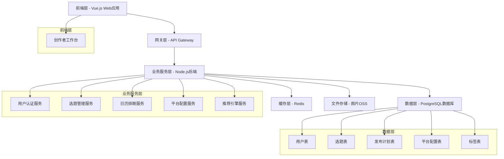
```mermaid
graph TD
    A[前端层 - Vue.js Web应用] --> B[网关层 - API Gateway]
    B --> C[业务服务层 - Node.js后端]
    C --> D[数据层 - PostgreSQL数据库]
    C --> E[缓存层 - Redis]
    C --> F[文件存储 - 图片OSS]
    
    subgraph 前端层
        A1[创作者工作台]
    end
    
    subgraph 业务服务层
        C1[用户认证服务]
        C2[选题管理服务]
        C3[日历排期服务]
        C4[平台配置服务]
        C5[推荐引擎服务]
    end
    
    subgraph 数据层
        D1[用户表]
        D2[选题表]
        D3[发布计划表]
        D4[平台配置表]
        D5[标签表]
    end
    
    A --> A1
    C --> C1 & C2 & C3 & C4 & C5
    D --> D1 & D2 & D3 & D4 & D5
```

## 2.2 业务模块图 

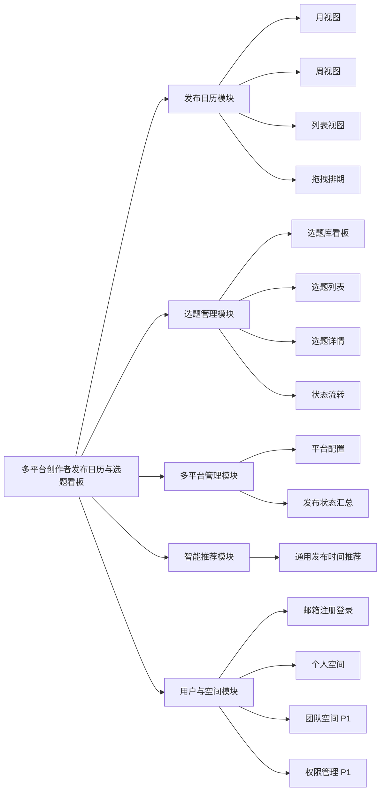
```mermaid
flowchart LR
    A[多平台创作者发布日历与选题看板] --> B[发布日历模块]
    A --> C[选题管理模块]
    A --> D[多平台管理模块]
    A --> E[智能推荐模块]
    A --> F[用户与空间模块]
    
    B --> B1[月视图]
    B --> B2[周视图]
    B --> B3[列表视图]
    B --> B4[拖拽排期]
    
    C --> C1[选题库看板]
    C --> C2[选题列表]
    C --> C3[选题详情]
    C --> C4[状态流转]
    
    D --> D1[平台配置]
    D --> D2[发布状态汇总]
    
    E --> E1[通用发布时间推荐]
    
    F --> F1[邮箱注册登录]
    F --> F2[个人空间]
    F --> F3[团队空间 P1]
    F --> F4[权限管理 P1]
```

## 2.3 主业务流程 

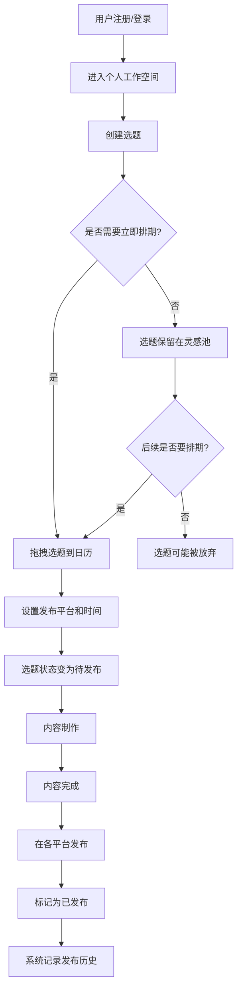
```mermaid
flowchart TD
    A[用户注册/登录] --> B[进入个人工作空间]
    B --> C[创建选题]
    C --> D{是否需要立即排期?}
    D -->|是| E[拖拽选题到日历]
    D -->|否| F[选题保留在灵感池]
    E --> G[设置发布平台和时间]
    G --> H[选题状态变为待发布]
    H --> I[内容制作]
    I --> J[内容完成]
    J --> K[在各平台发布]
    K --> L[标记为已发布]
    L --> M[系统记录发布历史]
    
    F --> N{后续是否要排期?}
    N -->|是| E
    N -->|否| O[选题可能被放弃]
```

## 2.4 功能图/列表 

| 功能模块 | 功能名称 | 优先级 | 功能描述 |
| --- | --- | --- | --- |
| 用户与空间 | 邮箱注册与登录 | P0 | 支持邮箱注册、JWT token认证、7天有效期 |
| 用户与空间 | 个人空间管理 | P0 | 每个用户拥有独立工作空间，包含选题库、日历、平台配置 |
| 发布日历 | 月视图 | P0 | 按月展示各平台发布计划，支持月份切换 |
| 发布日历 | 周视图 | P0 | 按周展示，横轴为星期，纵轴为平台 |
| 发布日历 | 列表视图 | P0 | 未来30天发布计划倒序排列，支持筛选 |
| 发布日历 | 拖拽排期 | P0 | 从选题库拖拽到日历创建计划，支持拖动调整日期 |
| 选题管理 | 选题库看板视图 | P0 | 四列看板：灵感→草稿→待发布→已发布，支持跨列拖拽 |
| 选题管理 | 选题库列表视图 | P0 | 表格形式展示所有选题，支持排序、搜索、筛选 |
| 选题管理 | 选题详情与编辑 | P0 | 名称、描述、灵感来源、关联平台、标签、图片附件、备注 |
| 选题管理 | 选题状态流转 | P0 | 定义5种状态及流转规则，自动记录变更历史 |
| 多平台管理 | 平台配置 | P0 | 预置8个主流平台，支持启用/禁用，免费版限3个平台 |
| 多平台管理 | 发布状态汇总 | P0 | 各平台本周/本月发布数量、待发布数量、最近发布时间 |
| 智能推荐 | 发布时间推荐 | P0 | 基于行业经验数据，为各平台提供通用推荐时段 |
| 智能推荐 | 个性化推荐 | P1 | 基于用户历史数据的个性化推荐（专业版） |
| 团队协作 | 团队空间 | P1 | 创建团队、邀请成员、共享选题库和日历（专业版） |
| 团队协作 | 权限管理 | P1 | 管理员、编辑者、查看者三种角色（专业版） |
| 增强功能 | 自定义平台 | P1 | 用户添加自定义平台 |
| 增强功能 | 平台内容模板 | P1 | 为各平台配置标题格式、正文模板等 |
| 增强功能 | 选题评分 | P1 | 规则化加权评分，5个维度（专业版） |
| 增强功能 | 批量操作 | P1 | 批量变更状态、打标签、删除 |
| 增强功能 | 数据导出 | P1 | CSV格式导出选题列表 |

## 2.5 你的产品有哪些端

| 序号 | 端名称 | 端类型 | 目标用户 | 说明 |
| --- | --- | --- | --- | --- |
| 1 | 创作者工作台 | WEB端 | 内容创作者/MCN运营/自媒体团队 | 浏览器端Web应用，MVP优先，支持Chrome 90+、Safari 15+、Edge 90+、Firefox 90+ |

---

# 3 产品功能 

## 3.1 创作者工作台 WEB端 功能

### 3.1.1 邮箱注册与登录

功能描述：提供用户身份认证入口，支持邮箱注册和登录，使用JWT token维持会话，有效期7天。MVP版本不支持微信登录，延至P1版本实现。

优先级与依赖说明：
| 项 | 内容 |
| --- | --- |
| 优先级 | P0 |
| 依赖需求 | 无 |
| 前置条件 | 用户需拥有有效邮箱地址 |

### 3.1.2 邮箱注册与登录—详细流程 

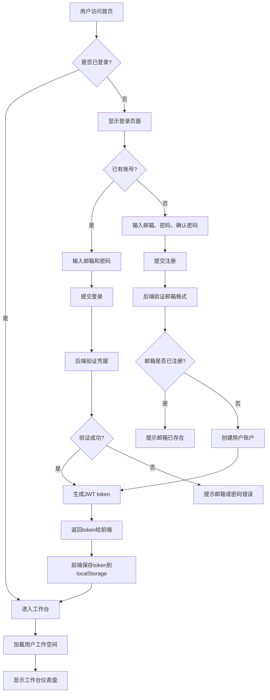
```mermaid
flowchart TD
    A[用户访问首页] --> B{是否已登录?}
    B -->|是| C[进入工作台]
    B -->|否| D[显示登录页面]
    D --> E{已有账号?}
    E -->|是| F[输入邮箱和密码]
    E -->|否| G[输入邮箱、密码、确认密码]
    G --> H[提交注册]
    H --> I[后端验证邮箱格式]
    I --> J{邮箱是否已注册?}
    J -->|是| K[提示邮箱已存在]
    J -->|否| L[创建用户账户]
    L --> M[生成JWT token]
    M --> N[返回token给前端]
    N --> O[前端保存token到localStorage]
    O --> C
    
    F --> P[提交登录]
    P --> Q[后端验证凭据]
    Q --> R{验证成功?}
    R -->|是| M
    R -->|否| S[提示邮箱或密码错误]
    
    C --> T[加载用户工作空间]
    T --> U[显示工作台仪表盘]
```

业务规则说明：
1. 邮箱格式必须符合标准邮箱格式（xxx@xxx.xxx）
2. 密码长度至少8位，包含字母和数字
3. JWT token有效期为7天，过期后需重新登录
4. 同一邮箱只能注册一次，重复注册时提示邮箱已存在
5. 登录失败时不明确提示是邮箱不存在还是密码错误，统一提示"邮箱或密码错误"
6. Token存储在浏览器localStorage中，每次请求携带在Authorization header

### 3.1.3 邮箱注册与登录—主要原型 

[📋 登录表单原型](assets/prototypes/web-prototype.html)

验收标准说明：
- [ ] 正常流程：用户使用正确邮箱密码注册成功后自动登录并跳转到工作台
- [ ] 异常流程：邮箱格式错误时前端即时提示；邮箱已注册时后端返回明确错误码
- [ ] 性能要求：登录接口响应时间≤500ms；注册接口响应时间≤800ms

### 3.1.4 工作台仪表盘

功能描述：用户登录后进入的主页面，提供整体数据概览、快捷操作入口和近期活动摘要。

优先级与依赖说明：
| 项 | 内容 |
| --- | --- |
| 优先级 | P0 |
| 依赖需求 | 依赖选题库、日历、平台配置等功能 |
| 前置条件 | 用户已完成登录 |

### 3.1.5 工作台仪表盘—详细流程 

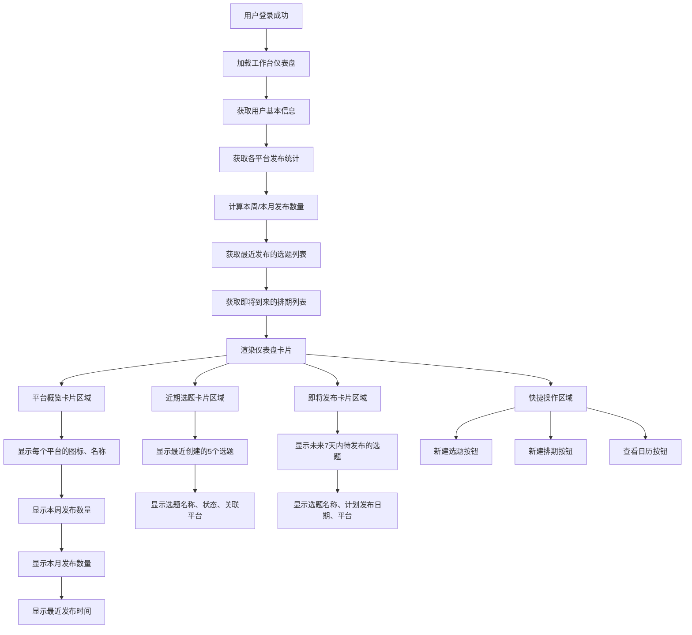
```mermaid
flowchart TD
    A[用户登录成功] --> B[加载工作台仪表盘]
    B --> C[获取用户基本信息]
    C --> D[获取各平台发布统计]
    D --> E[计算本周/本月发布数量]
    E --> F[获取最近发布的选题列表]
    F --> G[获取即将到来的排期列表]
    G --> H[渲染仪表盘卡片]
    
    H --> I[平台概览卡片区域]
    I --> J[显示每个平台的图标、名称]
    J --> K[显示本周发布数量]
    K --> L[显示本月发布数量]
    L --> M[显示最近发布时间]
    
    H --> N[近期选题卡片区域]
    N --> O[显示最近创建的5个选题]
    O --> P[显示选题名称、状态、关联平台]
    
    H --> Q[即将发布卡片区域]
    Q --> R[显示未来7天内待发布的选题]
    R --> S[显示选题名称、计划发布日期、平台]
    
    H --> T[快捷操作区域]
    T --> U[新建选题按钮]
    T --> V[新建排期按钮]
    T --> W[查看日历按钮]
```

业务规则说明：
1. 平台概览卡片按平台分组，每个平台一张卡片，显示该平台的关键指标
2. 近期选题按创建时间倒序排列，最多显示5条
3. 即将发布按发布日期升序排列，最多显示7条
4. 当某个平台超过7天未发布内容时，在该平台卡片上显示黄色警告标识
5. 若用户没有任何选题，显示空状态引导文案和"创建第一个选题"按钮

### 3.1.6 工作台仪表盘—主要原型 

[📋 工作台仪表盘原型](assets/prototypes/web-prototype.html)

验收标准说明：
- [ ] 正常流程：用户登录后能在2秒内看到完整的仪表盘数据
- [ ] 异常流程：接口超时时有友好的错误提示和重试按钮
- [ ] 性能要求：首屏加载≤2秒；平台卡片切换≤500ms

### 3.1.7 发布日历—月视图

功能描述：以月为单位展示发布计划，每个日期格子内显示当天各平台的发布计划，支持月份切换和点击查看详情。

优先级与依赖说明：
| 项 | 内容 |
| --- | --- |
| 优先级 | P0 |
| 依赖需求 | 依赖选题库和发布计划数据 |
| 前置条件 | 用户已创建至少一个选题并安排了发布日期 |

### 3.1.8 发布日历—月视图—详细流程 

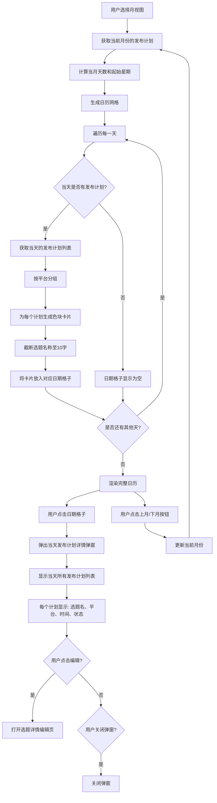
```mermaid
flowchart TD
    A[用户选择月视图] --> B[获取当前月份的发布计划]
    B --> C[计算当月天数和起始星期]
    C --> D[生成日历网格]
    D --> E[遍历每一天]
    E --> F{当天是否有发布计划?}
    F -->|是| G[获取当天的发布计划列表]
    G --> H[按平台分组]
    H --> I[为每个计划生成色块卡片]
    I --> J[截断选题名称至10字]
    J --> K[将卡片放入对应日期格子]
    F -->|否| L[日期格子显示为空]
    K --> M{是否还有其他天?}
    L --> M
    M -->|是| E
    M -->|否| N[渲染完整日历]
    
    N --> O[用户点击日期格子]
    O --> P[弹出当天发布计划详情弹窗]
    P --> Q[显示当天所有发布计划列表]
    Q --> R[每个计划显示: 选题名、平台、时间、状态]
    R --> S{用户点击编辑?}
    S -->|是| T[打开选题详情编辑页]
    S -->|否| U{用户关闭弹窗?}
    U -->|是| V[关闭弹窗]
    
    N --> W[用户点击上月/下月按钮]
    W --> X[更新当前月份]
    X --> B
```

业务规则说明：
1. 日历网格第一行显示星期一至星期日
2. 每个发布计划用平台主题色的色块标识
3. 选题名称超过10字时截断并显示省略号
4. 同一天同一平台的多个计划垂直堆叠显示
5. 点击日期格子弹出模态框展示当天所有计划
6. 月份切换时使用平滑动画过渡效果

### 3.1.9 发布日历—月视图—主要原型 

[📋 月视图原型](assets/prototypes/web-prototype.html)

验收标准说明：
- [ ] 正常流程：切换月份时日历在500ms内完成渲染
- [ ] 异常流程：无数据时显示空状态和"开始排期"引导
- [ ] 性能要求：日历切换≤500ms；单日最多显示5个计划，超出部分显示"+N更多"

### 3.1.10 发布日历—周视图

功能描述：以周为单位展示发布计划，横轴为周一至周日，纵轴为各平台，每个单元格显示当天的发布计划卡片。

优先级与依赖说明：
| 项 | 内容 |
| --- | --- |
| 优先级 | P0 |
| 依赖需求 | 依赖选题库和发布计划数据 |
| 前置条件 | 用户已创建至少一个选题并安排了发布日期 |

### 3.1.11 发布日历—周视图—详细流程 

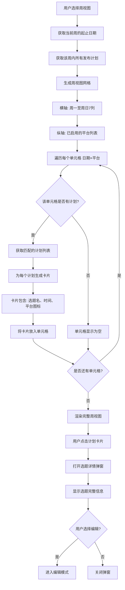
```mermaid
flowchart TD
    A[用户选择周视图] --> B[获取当前周的起止日期]
    B --> C[获取该周内所有发布计划]
    C --> D[生成周视图网格]
    D --> E[横轴: 周一至周日7列]
    E --> F[纵轴: 已启用的平台列表]
    F --> G[遍历每个单元格 日期×平台]
    G --> H{该单元格是否有计划?}
    H -->|是| I[获取匹配的计划列表]
    I --> J[为每个计划生成卡片]
    J --> K[卡片包含: 选题名、时间、平台图标]
    K --> L[将卡片放入单元格]
    H -->|否| M[单元格显示为空]
    L --> N{是否还有单元格?}
    M --> N
    N -->|是| G
    N -->|否| O[渲染完整周视图]
    
    O --> P[用户点击计划卡片]
    P --> Q[打开选题详情弹窗]
    Q --> R[显示选题完整信息]
    R --> S{用户选择编辑?}
    S -->|是| T[进入编辑模式]
    S -->|否| U[关闭弹窗]
```

业务规则说明：
1. 横轴固定为7列（周一至周日），纵轴动态显示已启用的平台
2. 每个计划卡片高度固定，同一单元格内多个卡片垂直排列
3. 卡片背景色使用平台主题色，文字颜色根据背景亮度自动适配（深色背景用白色文字）
4. 点击平台名称可筛选只显示该平台的计划
5. 支持鼠标悬停在卡片上显示简要信息tooltip

### 3.1.12 发布日历—周视图—主要原型 

[📋 周视图原型](assets/prototypes/web-prototype.html)

验收标准说明：
- [ ] 正常流程：切换到周视图时1秒内完成渲染
- [ ] 异常流程：无数据时显示空状态提示
- [ ] 性能要求：周视图渲染≤500ms；卡片悬停tooltip显示延迟≤100ms

### 3.1.13 发布日历—列表视图

功能描述：以时间倒序展示未来30天的发布计划，支持按平台和状态筛选。

优先级与依赖说明：
| 项 | 内容 |
| --- | --- |
| 优先级 | P0 |
| 依赖需求 | 依赖选题库和发布计划数据 |
| 前置条件 | 用户已创建至少一个选题并安排了发布日期 |

### 3.1.14 发布日历—列表视图—详细流程 

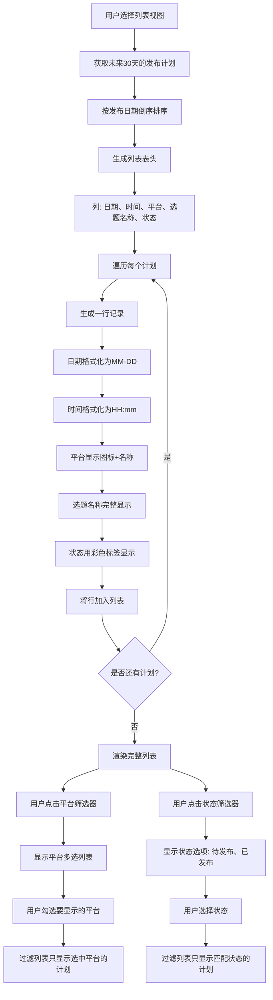
```mermaid
flowchart TD
    A[用户选择列表视图] --> B[获取未来30天的发布计划]
    B --> C[按发布日期倒序排序]
    C --> D[生成列表表头]
    D --> E[列: 日期、时间、平台、选题名称、状态]
    E --> F[遍历每个计划]
    F --> G[生成一行记录]
    G --> H[日期格式化为MM-DD]
    H --> I[时间格式化为HH:mm]
    I --> J[平台显示图标+名称]
    J --> K[选题名称完整显示]
    K --> L[状态用彩色标签显示]
    L --> M[将行加入列表]
    M --> N{是否还有计划?}
    N -->|是| F
    N -->|否| O[渲染完整列表]
    
    O --> P[用户点击平台筛选器]
    P --> Q[显示平台多选列表]
    Q --> R[用户勾选要显示的平台]
    R --> S[过滤列表只显示选中平台的计划]
    
    O --> T[用户点击状态筛选器]
    T --> U[显示状态选项: 待发布、已发布]
    U --> V[用户选择状态]
    V --> W[过滤列表只显示匹配状态的计划]
```

业务规则说明：
1. 默认显示未来30天内所有发布计划，按日期倒序排列
2. 日期格式为MM-DD，时间格式为HH:mm
3. 平台列显示平台图标和名称缩写
4. 状态列使用彩色标签：待发布=蓝色，已发布=绿色
5. 平台筛选支持多选，状态筛选为单选
6. 列表支持滚动加载，每次加载50条记录

### 3.1.15 发布日历—列表视图—主要原型 

[📋 列表视图原型](assets/prototypes/web-prototype.html)

验收标准说明：
- [ ] 正常流程：列表加载100条记录≤1秒
- [ ] 异常流程：无数据时显示"暂无排期"空状态
- [ ] 性能要求：列表加载≤1秒；筛选响应≤300ms

### 3.1.16 拖拽排期

功能描述：支持从选题库拖拽选题到日历创建发布计划，或在日历上拖动已有计划调整发布日期。

优先级与依赖说明：
| 项 | 内容 |
| --- | --- |
| 优先级 | P0 |
| 依赖需求 | 依赖选题库和日历视图 |
| 前置条件 | 用户已创建选题且处于非"已发布"状态 |

### 3.1.17 拖拽排期—详细流程 

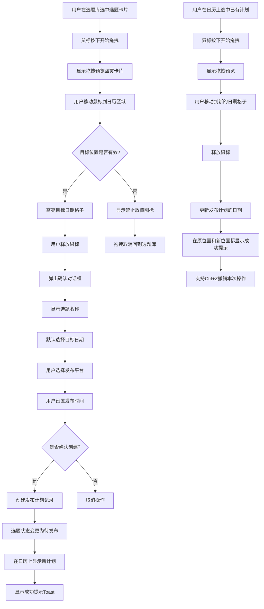
```mermaid
flowchart TD
    A[用户在选题库选中选题卡片] --> B[鼠标按下开始拖拽]
    B --> C[显示拖拽预览幽灵卡片]
    C --> D[用户移动鼠标到日历区域]
    D --> E{目标位置是否有效?}
    E -->|是| F[高亮目标日期格子]
    E -->|否| G[显示禁止放置图标]
    F --> H[用户释放鼠标]
    G --> I[拖拽取消回到选题库]
    H --> J[弹出确认对话框]
    J --> K[显示选题名称]
    K --> L[默认选择目标日期]
    L --> M[用户选择发布平台]
    M --> N[用户设置发布时间]
    N --> O{是否确认创建?}
    O -->|是| P[创建发布计划记录]
    O -->|否| Q[取消操作]
    P --> R[选题状态变更为待发布]
    R --> S[在日历上显示新计划]
    S --> T[显示成功提示Toast]
    
    U[用户在日历上选中已有计划] --> V[鼠标按下开始拖拽]
    V --> W[显示拖拽预览]
    W --> X[用户移动到新的日期格子]
    X --> Y[释放鼠标]
    Y --> Z[更新发布计划的日期]
    Z --> AA[在原位置和新位置都显示成功提示]
    AA --> AB[支持Ctrl+Z撤销本次操作]
```

业务规则说明：
1. 只有状态为"灵感"、"草稿"、"待发布"的选题可以拖拽排期
2. 拖拽过程中实时显示预览卡片，包含选题名称和平台图标
3. 目标日期格子在拖拽经过时显示淡入高亮效果
4. 确认弹窗中默认日期为拖拽目标日期，时间为12:00
5. 同一平台同一天安排超过2条发布时，显示黄色警告但允许创建
6. 支持Ctrl+Z撤销最近一次拖拽操作
7. 拖拽操作完成后自动保存到后端

### 3.1.18 拖拽排期—主要原型 

[📋 拖拽排期原型](assets/prototypes/web-prototype.html)

验收标准说明：
- [ ] 正常流程：从拖拽开始到新计划创建完成≤2秒
- [ ] 异常流程：拖拽到无效区域时显示禁止图标；网络失败时显示错误提示并恢复原状
- [ ] 性能要求：拖拽响应延迟≤100ms；保存操作≤500ms

### 3.1.19 选题库—看板视图

功能描述：以看板形式展示选题，按状态分为💡灵感、📝草稿、📋待发布、✅已发布四列，支持跨列拖拽变更状态。

优先级与依赖说明：
| 项 | 内容 |
| --- | --- |
| 优先级 | P0 |
| 依赖需求 | 依赖选题数据模型 |
| 前置条件 | 用户已创建至少一个选题 |

### 3.1.20 选题库—看板视图—详细流程 

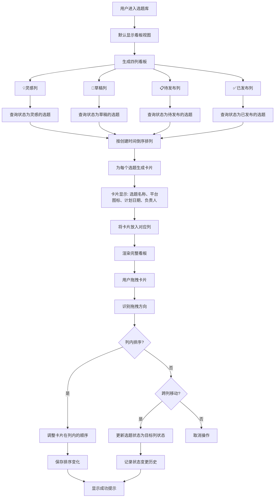
```mermaid
flowchart TD
    A[用户进入选题库] --> B[默认显示看板视图]
    B --> C[生成四列看板]
    C --> D[💡灵感列]
    C --> E[📝草稿列]
    C --> F[📋待发布列]
    C --> G[✅已发布列]
    
    D --> H[查询状态为灵感的选题]
    E --> I[查询状态为草稿的选题]
    F --> J[查询状态为待发布的选题]
    G --> K[查询状态为已发布的选题]
    
    H --> L[按创建时间倒序排列]
    I --> L
    J --> L
    K --> L
    
    L --> M[为每个选题生成卡片]
    M --> N[卡片显示: 选题名称、平台图标、计划日期、负责人]
    N --> O[将卡片放入对应列]
    O --> P[渲染完整看板]
    
    P --> Q[用户拖拽卡片]
    Q --> R[识别拖拽方向]
    R --> S{列内排序?}
    S -->|是| T[调整卡片在列内的顺序]
    S -->|否| U{跨列移动?}
    U -->|是| V[更新选题状态为目标列状态]
    U -->|否| W[取消操作]
    T --> X[保存排序变化]
    V --> Y[记录状态变更历史]
    X --> Z[显示成功提示]
    Y --> Z
```

业务规则说明：
1. 四列固定顺序不可更改：灵感→草稿→待发布→已发布
2. "❌已放弃"状态不在看板上显示为独立列，可通过右键菜单筛选显示
3. 每张卡片显示：选题名称（最多20字）、关联的平台图标（最多3个）、计划发布日期（如有）、负责人头像（团队空间）
4. 列内卡片按创建时间倒序排列，支持拖拽调整顺序
5. 跨列拖拽时，选题状态自动更新为目标列对应的状态
6. 已发布列的卡片不可再拖拽到其他列
7. 看板支持水平滚动查看所有列

### 3.1.21 选题库—看板视图—主要原型 

[📋 看板视图原型](assets/prototypes/web-prototype.html)

验收标准说明：
- [ ] 正常流程：拖拽卡片变更状态后立即更新UI并保存
- [ ] 异常流程：网络失败时回滚卡片位置并提示错误
- [ ] 性能要求：拖拽响应≤100ms；单列最多显示50张卡片，超出部分虚拟滚动

### 3.1.22 选题库—列表视图

功能描述：以表格形式展示所有选题，支持多列排序、关键词搜索和多条件筛选。

优先级与依赖说明：
| 项 | 内容 |
| --- | --- |
| 优先级 | P0 |
| 依赖需求 | 依赖选题数据模型 |
| 前置条件 | 用户已创建至少一个选题 |

### 3.1.23 选题库—列表视图—详细流程 

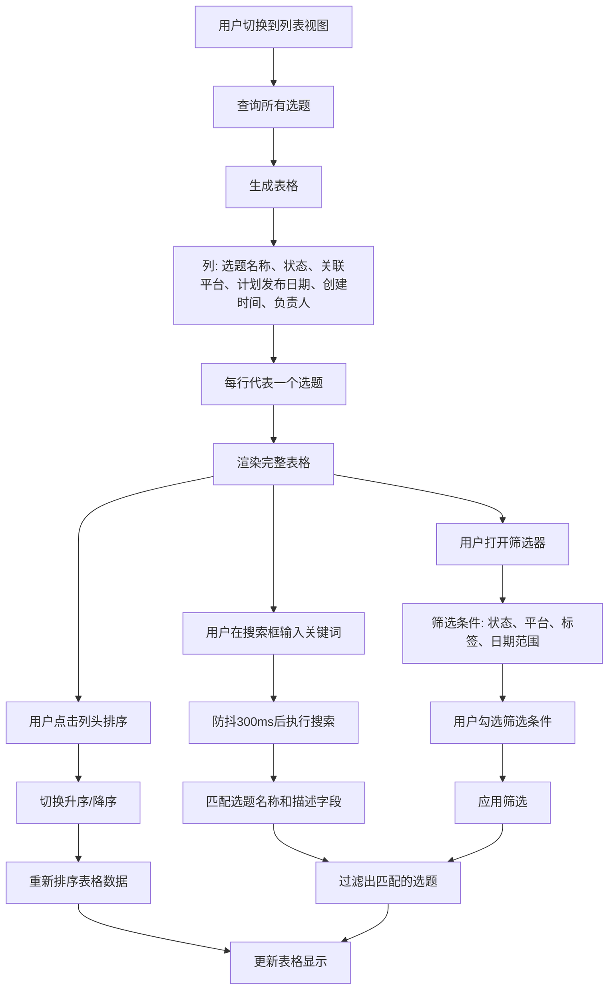
```mermaid
flowchart TD
    A[用户切换到列表视图] --> B[查询所有选题]
    B --> C[生成表格]
    C --> D[列: 选题名称、状态、关联平台、计划发布日期、创建时间、负责人]
    D --> E[每行代表一个选题]
    E --> F[渲染完整表格]
    
    F --> G[用户点击列头排序]
    G --> H[切换升序/降序]
    H --> I[重新排序表格数据]
    I --> J[更新表格显示]
    
    F --> K[用户在搜索框输入关键词]
    K --> L[防抖300ms后执行搜索]
    L --> M[匹配选题名称和描述字段]
    M --> N[过滤出匹配的选题]
    N --> J
    
    F --> O[用户打开筛选器]
    O --> P[筛选条件: 状态、平台、标签、日期范围]
    P --> Q[用户勾选筛选条件]
    Q --> R[应用筛选]
    R --> N
```

业务规则说明：
1. 默认按创建时间倒序排列
2. 选题名称列可点击进入详情页
3. 状态列使用彩色标签，点击可快速变更状态
4. 关联平台列显示平台图标，hover显示完整平台名称
5. 搜索支持模糊匹配，同时匹配选题名称和描述字段
6. 筛选条件可叠加，多个条件之间为AND关系
7. 表格支持分页，每页显示20条记录

### 3.1.24 选题库—列表视图—主要原型 

[📋 列表视图原型](assets/prototypes/web-prototype.html)

验收标准说明：
- [ ] 正常流程：加载100条记录≤1秒
- [ ] 异常流程：搜索无结果时显示"未找到匹配的选题"
- [ ] 性能要求：表格加载≤1秒；排序响应≤200ms；搜索响应≤500ms

### 3.1.25 选题详情与编辑

功能描述：展示选题的完整信息并支持编辑，包括名称、描述、灵感来源、关联平台、标签、图片附件、备注等。

优先级与依赖说明：
| 项 | 内容 |
| --- | --- |
| 优先级 | P0 |
| 依赖需求 | 依赖选题数据模型、图片上传服务 |
| 前置条件 | 选题已创建 |

### 3.1.26 选题详情与编辑—详细流程 

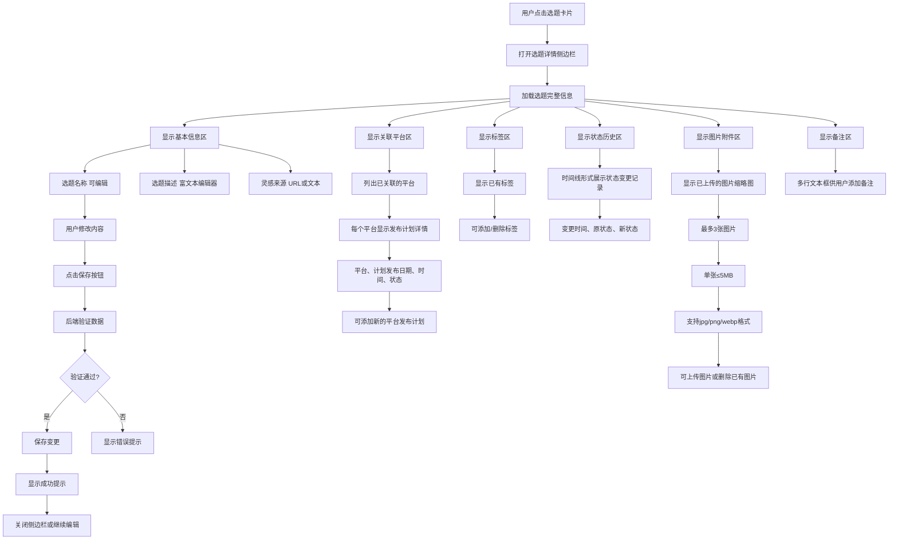
```mermaid
flowchart TD
    A[用户点击选题卡片] --> B[打开选题详情侧边栏]
    B --> C[加载选题完整信息]
    C --> D[显示基本信息区]
    D --> E[选题名称 可编辑]
    D --> F[选题描述 富文本编辑器]
    D --> G[灵感来源 URL或文本]
    
    C --> H[显示关联平台区]
    H --> I[列出已关联的平台]
    I --> J[每个平台显示发布计划详情]
    J --> K[平台、计划发布日期、时间、状态]
    K --> L[可添加新的平台发布计划]
    
    C --> M[显示标签区]
    M --> N[显示已有标签]
    N --> O[可添加/删除标签]
    
    C --> P[显示状态历史区]
    P --> Q[时间线形式展示状态变更记录]
    Q --> R[变更时间、原状态、新状态]
    
    C --> S[显示图片附件区]
    S --> T[显示已上传的图片缩略图]
    T --> U[最多3张图片]
    U --> V[单张≤5MB]
    V --> W[支持jpg/png/webp格式]
    W --> X[可上传图片或删除已有图片]
    
    C --> Y[显示备注区]
    Y --> Z[多行文本框供用户添加备注]
    
    E --> AA[用户修改内容]
    AA --> BB[点击保存按钮]
    BB --> CC[后端验证数据]
    CC --> DD{验证通过?}
    DD -->|是| EE[保存变更]
    DD -->|否| FF[显示错误提示]
    EE --> GG[显示成功提示]
    GG --> HH[关闭侧边栏或继续编辑]
```

业务规则说明：
1. 选题名称必填，长度限制1-100字符
2. 选题描述支持富文本编辑，包括加粗、斜体、列表、链接等基本格式
3. 灵感来源可以是URL链接或纯文本描述
4. 一个选题可关联多个平台的发布计划，每个平台只能关联一次
5. 标签最多添加5个，每个标签长度不超过20字符
6. 图片附件最多3张，单张大小≤5MB，仅支持jpg/png/webp格式
7. 状态历史自动记录，用户不可手动修改
8. 备注字数限制500字符以内
9. 保存时进行前端和后端双重验证

### 3.1.27 选题详情与编辑—主要原型 

[📋 选题详情原型](assets/prototypes/web-prototype.html)

验收标准说明：
- [ ] 正常流程：保存选题变更后500ms内完成持久化并显示成功提示
- [ ] 异常流程：图片超限或格式错误时前端即时拦截并提示；网络失败时保留用户输入内容并提示重试
- [ ] 性能要求：详情加载≤500ms；图片上传≤3秒/张；保存操作≤500ms

### 3.1.28 平台配置与管理

功能描述：管理系统支持的发布平台，预置8个主流平台，支持启用/禁用，免费版限制使用3个平台。

优先级与依赖说明：
| 项 | 内容 |
| --- | --- |
| 优先级 | P0 |
| 依赖需求 | 无 |
| 前置条件 | 用户已登录 |

### 3.1.29 平台配置与管理—详细流程 

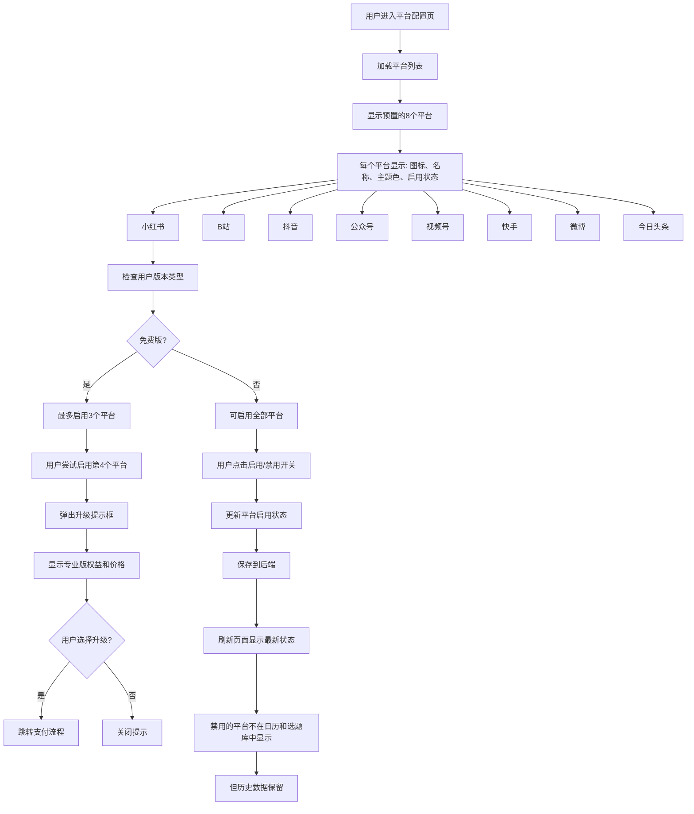
```mermaid
flowchart TD
    A[用户进入平台配置页] --> B[加载平台列表]
    B --> C[显示预置的8个平台]
    C --> D[每个平台显示: 图标、名称、主题色、启用状态]
    D --> E[小红书]
    D --> F[B站]
    D --> G[抖音]
    D --> H[公众号]
    D --> I[视频号]
    D --> J[快手]
    D --> K[微博]
    D --> L[今日头条]
    
    E --> M[检查用户版本类型]
    M --> N{免费版?}
    N -->|是| O[最多启用3个平台]
    N -->|否| P[可启用全部平台]
    
    O --> Q[用户尝试启用第4个平台]
    Q --> R[弹出升级提示框]
    R --> S[显示专业版权益和价格]
    S --> T{用户选择升级?}
    T -->|是| U[跳转支付流程]
    T -->|否| V[关闭提示]
    
    P --> W[用户点击启用/禁用开关]
    W --> X[更新平台启用状态]
    X --> Y[保存到后端]
    Y --> Z[刷新页面显示最新状态]
    
    Z --> AA[禁用的平台不在日历和选题库中显示]
    AA --> AB[但历史数据保留]
```

业务规则说明：
1. 预置8个平台及其图标、主题色，用户不可删除预置平台
2. 免费版最多启用3个平台，专业版无限制
3. 启用/禁用操作实时生效
4. 禁用平台后，该平台在日历和选题库中不再显示，但历史发布数据保留
5. 尝试超出免费版限制时，弹出升级提示而非直接阻止
6. 平台配置对所有设备同步

### 3.1.30 平台配置与管理—主要原型 

[📋 平台配置原型](assets/prototypes/web-prototype.html)

验收标准说明：
- [ ] 正常流程：切换平台启用状态后立即可见效果
- [ ] 异常流程：免费版尝试启用第4个平台时弹出升级提示
- [ ] 性能要求：平台列表加载≤500ms；状态切换≤300ms

### 3.1.31 平台内容模板

功能描述：为每个平台配置专属的内容模板，包含标题格式、正文模板、标签建议、封面尺寸参考、发布注意事项等。

优先级与依赖说明：
| 项 | 内容 |
| --- | --- |
| 优先级 | P1 |
| 依赖需求 | 依赖平台配置功能 |
| 前置条件 | 平台已启用 |

### 3.1.32 平台内容模板—详细流程 

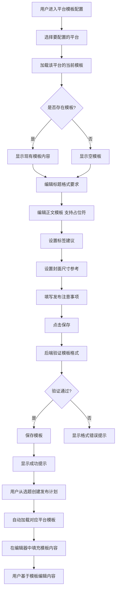
```mermaid
flowchart TD
    A[用户进入平台模板配置] --> B[选择要配置的平台]
    B --> C[加载该平台的当前模板]
    C --> D{是否存在模板?}
    D -->|是| E[显示现有模板内容]
    D -->|否| F[显示空模板]
    
    E --> G[编辑标题格式要求]
    F --> G
    G --> H[编辑正文模板 支持占位符]
    H --> I[设置标签建议]
    I --> J[设置封面尺寸参考]
    J --> K[填写发布注意事项]
    K --> L[点击保存]
    L --> M[后端验证模板格式]
    M --> N{验证通过?}
    N -->|是| O[保存模板]
    N -->|否| P[显示格式错误提示]
    O --> Q[显示成功提示]
    
    Q --> R[用户从选题创建发布计划]
    R --> S[自动加载对应平台模板]
    S --> T[在编辑器中填充模板内容]
    T --> U[用户基于模板编辑内容]
```

业务规则说明：
1. 每个平台可配置一套默认模板
2. 标题格式支持文本描述，如"不超过20字，包含emoji"
3. 正文模板支持占位符：{选题名称}、{标签}、{日期}等
4. 标签建议最多5个，用逗号分隔
5. 封面尺寸参考为文本提示，如"建议3:4比例，最小1080x1440"
6. 发布注意事项为多行文本
7. 从选题创建发布计划时自动加载对应平台模板到编辑器

### 3.1.33 平台内容模板—主要原型 

[📋 平台模板原型](assets/prototypes/web-prototype.html)

验收标准说明：
- [ ] 正常流程：保存模板后，新建发布计划时能正确加载模板内容
- [ ] 异常流程：模板格式错误时提示具体错误位置
- [ ] 性能要求：模板加载≤300ms；保存≤500ms

### 3.1.34 发布时间推荐

功能描述：基于行业公开经验数据，为各平台提供通用的最佳发布时间推荐，帮助用户选择合适的发布时段。

优先级与依赖说明：
| 项 | 内容 |
| --- | --- |
| 优先级 | P0 |
| 依赖需求 | 依赖平台配置 |
| 前置条件 | 平台已启用 |

### 3.1.35 发布时间推荐—详细流程 

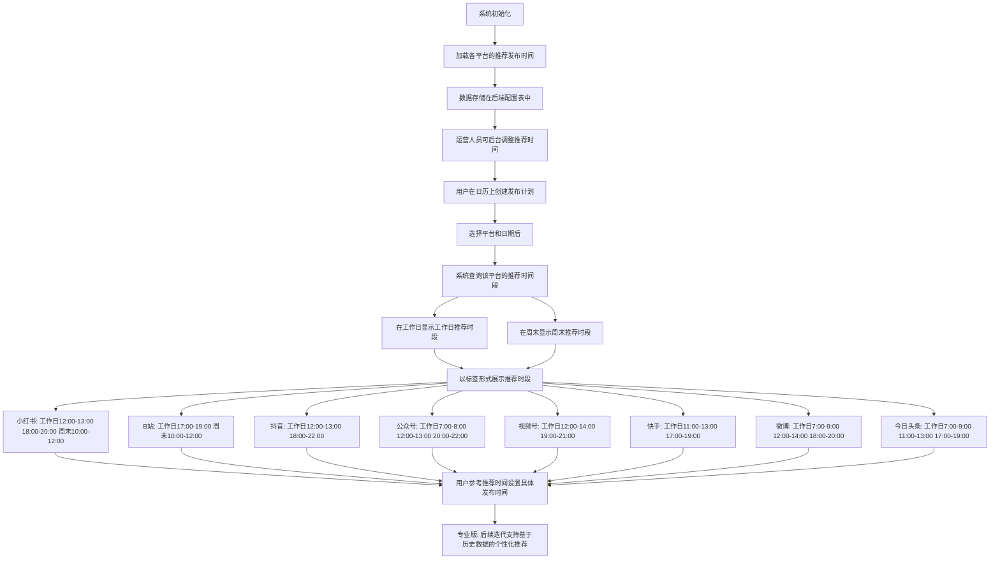
```mermaid
flowchart TD
    A[系统初始化] --> B[加载各平台的推荐发布时间]
    B --> C[数据存储在后端配置表中]
    C --> D[运营人员可后台调整推荐时间]
    
    D --> E[用户在日历上创建发布计划]
    E --> F[选择平台和日期后]
    F --> G[系统查询该平台的推荐时间段]
    G --> H[在工作日显示工作日推荐时段]
    G --> I[在周末显示周末推荐时段]
    H --> J[以标签形式展示推荐时段]
    I --> J
    
    J --> K[小红书: 工作日12:00-13:00 18:00-20:00 周末10:00-12:00]
    J --> L[B站: 工作日17:00-19:00 周末10:00-12:00]
    J --> M[抖音: 工作日12:00-13:00 18:00-22:00]
    J --> N[公众号: 工作日7:00-8:00 12:00-13:00 20:00-22:00]
    J --> O[视频号: 工作日12:00-14:00 19:00-21:00]
    J --> P[快手: 工作日11:00-13:00 17:00-19:00]
    J --> Q[微博: 工作日7:00-9:00 12:00-14:00 18:00-20:00]
    J --> R[今日头条: 工作日7:00-9:00 11:00-13:00 17:00-19:00]
    
    K --> S[用户参考推荐时间设置具体发布时间]
    L --> S
    M --> S
    N --> S
    O --> S
    P --> S
    Q --> S
    R --> S
    
    S --> T[专业版: 后续迭代支持基于历史数据的个性化推荐]
```

业务规则说明：
1. 推荐时间基于行业公开经验数据，不涉及第三方API对接
2. 数据在后端配置化存储，运营人员可根据需要调整
3. 区分工作日和周末的推荐时段
4. 在用户设置发布时间时以建议标签形式展示
5. 推荐时间为辅助参考，不强制用户遵守
6. MVP版本仅提供通用推荐，专业版后续迭代个性化推荐

### 3.1.36 发布时间推荐—主要原型 

[📋 发布时间推荐原型](assets/prototypes/web-prototype.html)

验收标准说明：
- [ ] 正常流程：选择平台后100ms内显示推荐时段标签
- [ ] 异常流程：平台无推荐数据时不显示推荐标签，不报错
- [ ] 性能要求：推荐数据加载≤200ms

### 3.1.37 发布状态汇总面板

功能描述：以卡片组形式展示各平台的发布概览，包括本周/本月发布数量、待发布数量、最近发布时间，以及30天发布频率折线图。

优先级与依赖说明：
| 项 | 内容 |
| --- | --- |
| 优先级 | P0 |
| 依赖需求 | 依赖发布计划数据 |
| 前置条件 | 用户已创建并发布过内容 |

### 3.1.38 发布状态汇总面板—详细流程 

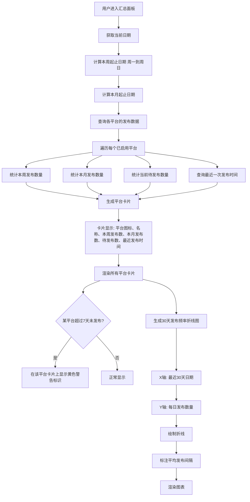
```mermaid
flowchart TD
    A[用户进入汇总面板] --> B[获取当前日期]
    B --> C[计算本周起止日期 周一到周日]
    C --> D[计算本月起止日期]
    D --> E[查询各平台的发布数据]
    
    E --> F[遍历每个已启用平台]
    F --> G[统计本周发布数量]
    F --> H[统计本月发布数量]
    F --> I[统计当前待发布数量]
    F --> J[查询最近一次发布时间]
    
    G --> K[生成平台卡片]
    H --> K
    I --> K
    J --> K
    
    K --> L[卡片显示: 平台图标、名称、本周发布数、本月发布数、待发布数、最近发布时间]
    L --> M[渲染所有平台卡片]
    
    M --> N{某平台超过7天未发布?}
    N -->|是| O[在该平台卡片上显示黄色警告标识]
    N -->|否| P[正常显示]
    
    M --> Q[生成30天发布频率折线图]
    Q --> R[X轴: 最近30天日期]
    R --> S[Y轴: 每日发布数量]
    S --> T[绘制折线]
    T --> U[标注平均发布间隔]
    U --> V[渲染图表]
```

业务规则说明：
1. 平台卡片按平台启用顺序排列
2. 本周指本周一到今天的发布数量
3. 本月指本月1日到今天的发布数量
4. 待发布数量指状态为"待发布"的计划数量
5. 超过7天未发布的平台在卡片右上角显示黄色感叹号图标
6. 折线图展示最近30天每天的发布数量
7. 平均发布间隔 = 30天 / 总发布次数

### 3.1.39 发布状态汇总面板—主要原型 

[📋 汇总面板原型](assets/prototypes/web-prototype.html)

验收标准说明：
- [ ] 正常流程：面板加载并在1秒内显示完整数据和图表
- [ ] 异常流程：无发布数据时显示空状态和引导文案
- [ ] 性能要求：数据统计≤500ms；图表渲染≤500ms

### 3.1.40 个人空间管理

功能描述：每位用户默认拥有一个个人工作空间，包含完整的选题库、日历、平台配置等功能。

优先级与依赖说明：
| 项 | 内容 |
| --- | --- |
| 优先级 | P0 |
| 依赖需求 | 依赖用户注册功能 |
| 前置条件 | 用户已完成注册 |

### 3.1.41 个人空间管理—详细流程 

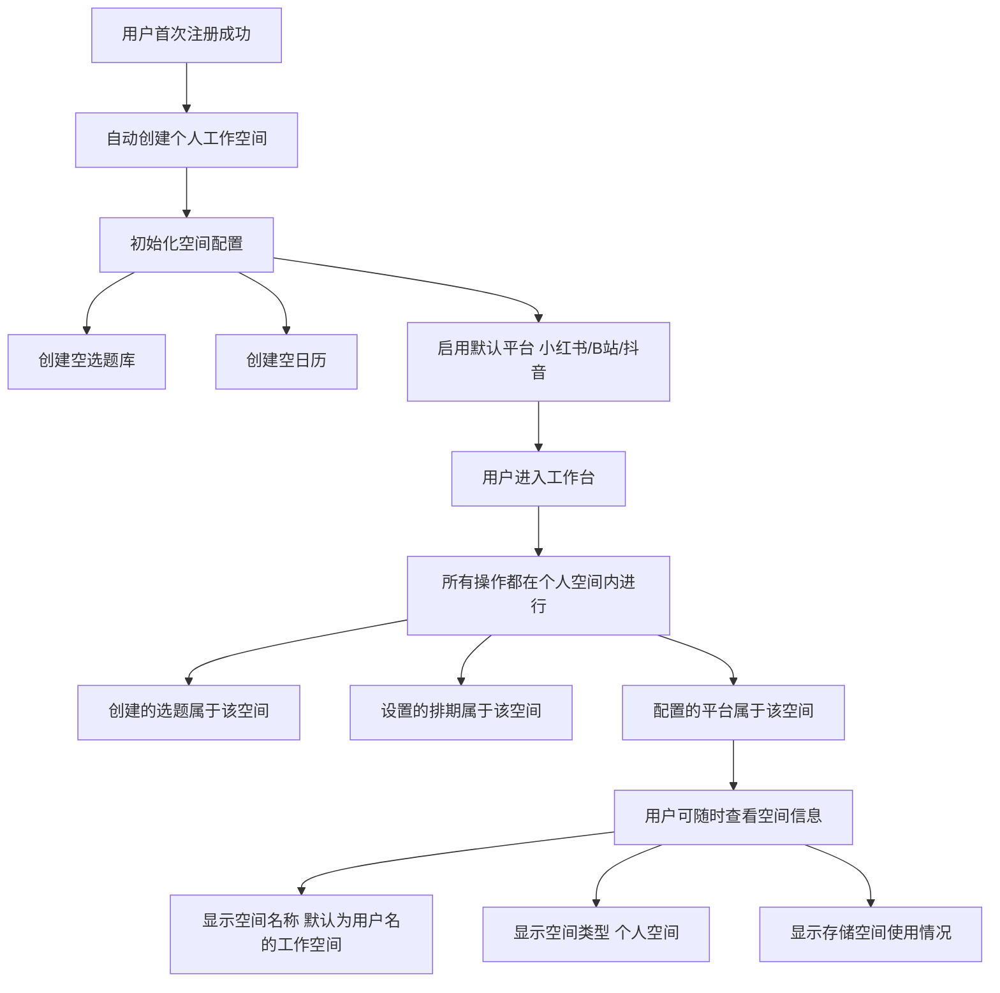
```mermaid
flowchart TD
    A[用户首次注册成功] --> B[自动创建个人工作空间]
    B --> C[初始化空间配置]
    C --> D[创建空选题库]
    C --> E[创建空日历]
    C --> F[启用默认平台 小红书/B站/抖音]
    
    F --> G[用户进入工作台]
    G --> H[所有操作都在个人空间内进行]
    H --> I[创建的选题属于该空间]
    H --> J[设置的排期属于该空间]
    H --> K[配置的平台属于该空间]
    
    K --> L[用户可随时查看空间信息]
    L --> M[显示空间名称 默认为用户名的工作空间]
    L --> N[显示空间类型 个人空间]
    L --> O[显示存储空间使用情况]
```

业务规则说明：
1. 用户注册成功后自动创建个人空间，无需手动操作
2. 个人空间默认启用3个平台（小红书、B站、抖音）
3. 个人空间内的数据完全隔离，其他用户不可见
4. 空间名称默认为"{用户名}的工作空间"，MVP版本暂不支持修改
5. 个人空间升级为团队空间属于P1功能

### 3.1.42 个人空间管理—主要原型 

[📋 个人空间原型](assets/prototypes/web-prototype.html)

验收标准说明：
- [ ] 正常流程：新用户注册后自动进入个人空间，能看到欢迎引导
- [ ] 异常流程：空间创建失败时提示用户重试
- [ ] 性能要求：空间初始化≤1秒

### 3.1.43 团队空间

功能描述：专业版用户可创建团队空间，邀请成员加入，共享选题库和日历，最多支持5人（含创建者）。

优先级与依赖说明：
| 项 | 内容 |
| --- | --- |
| 优先级 | P1 |
| 依赖需求 | 依赖个人空间、权限管理功能 |
| 前置条件 | 用户已订阅专业版 |

### 3.1.44 团队空间—详细流程 

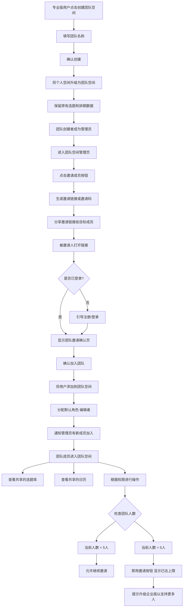
```mermaid
flowchart TD
    A[专业版用户点击创建团队空间] --> B[填写团队名称]
    B --> C[确认创建]
    C --> D[将个人空间升级为团队空间]
    D --> E[保留原有选题和排期数据]
    
    E --> F[团队创建者成为管理员]
    F --> G[进入团队空间管理页]
    G --> H[点击邀请成员按钮]
    H --> I[生成邀请链接或邀请码]
    I --> J[分享邀请链接给目标成员]
    
    J --> K[被邀请人打开链接]
    K --> L{是否已登录?}
    L -->|否| M[引导注册/登录]
    L -->|是| N[显示团队邀请确认页]
    M --> N
    N --> O[确认加入团队]
    O --> P[将用户添加到团队空间]
    P --> Q[分配默认角色 编辑者]
    Q --> R[通知管理员有新成员加入]
    
    R --> S[团队成员进入团队空间]
    S --> T[查看共享的选题库]
    S --> U[查看共享的日历]
    S --> V[根据权限进行操作]
    
    V --> W{检查团队人数}
    W --> X[当前人数 < 5人]
    X --> Y[允许继续邀请]
    W --> Z[当前人数 = 5人]
    Z --> AA[禁用邀请按钮 显示已达上限]
    AA --> BB[提示升级企业版以支持更多人]
```

业务规则说明：
1. 只有专业版用户可创建团队空间
2. 团队空间最多5人（含创建者）
3. 个人空间升级为团队空间后，原有数据保留
4. 创建者自动成为管理员，拥有全部权限
5. 新成员默认角色为编辑者
6. 达到人数上限时，邀请按钮置灰并提示升级企业版
7. 团队成员可共享查看和编辑选题库、日历
8. 离开团队后，该成员创建的数据归属团队

### 3.1.45 团队空间—主要原型 

[📋 团队空间原型](assets/prototypes/web-prototype.html)

验收标准说明：
- [ ] 正常流程：邀请成员加入后，新成员能立即看到共享的选题和日历
- [ ] 异常流程：达到5人上限时禁止继续邀请并给出升级提示
- [ ] 性能要求：成员加入后数据同步≤1秒

### 3.1.46 成员权限管理

功能描述：团队空间中支持三种角色权限管理，管理员拥有全部权限，编辑者可创建编辑选题，查看者仅可查看。

优先级与依赖说明：
| 项 | 内容 |
| --- | --- |
| 优先级 | P1 |
| 依赖需求 | 依赖团队空间功能 |
| 前置条件 | 团队空间已创建且有至少2名成员 |

### 3.1.47 成员权限管理—详细流程 

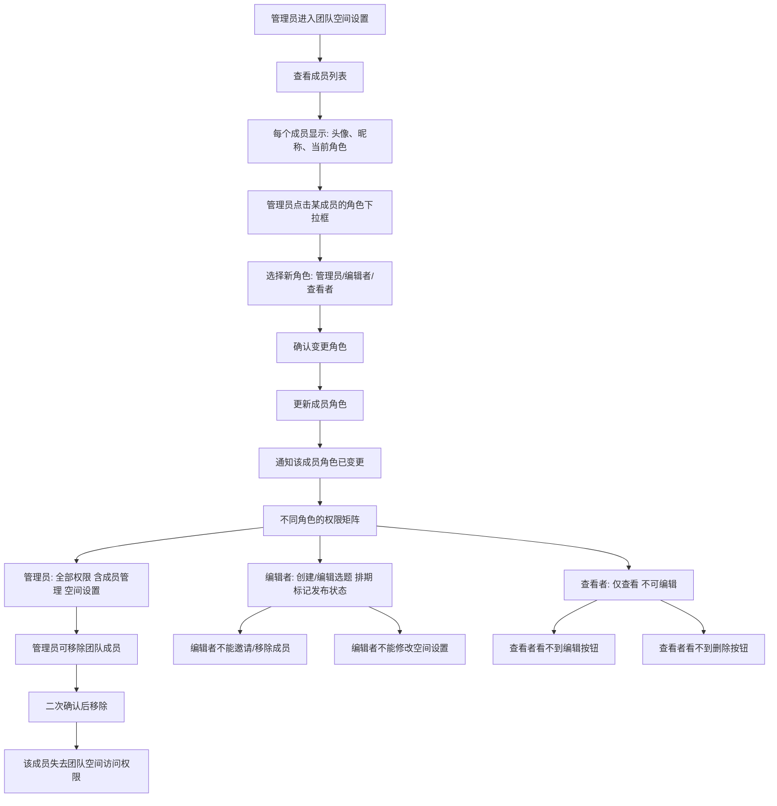
```mermaid
flowchart TD
    A[管理员进入团队空间设置] --> B[查看成员列表]
    B --> C[每个成员显示: 头像、昵称、当前角色]
    C --> D[管理员点击某成员的角色下拉框]
    D --> E[选择新角色: 管理员/编辑者/查看者]
    E --> F[确认变更角色]
    F --> G[更新成员角色]
    G --> H[通知该成员角色已变更]
    
    H --> I[不同角色的权限矩阵]
    I --> J[管理员: 全部权限 含成员管理 空间设置]
    I --> K[编辑者: 创建/编辑选题 排期 标记发布状态]
    I --> L[查看者: 仅查看 不可编辑]
    
    J --> M[管理员可移除团队成员]
    M --> N[二次确认后移除]
    N --> O[该成员失去团队空间访问权限]
    
    K --> P[编辑者不能邀请/移除成员]
    K --> Q[编辑者不能修改空间设置]
    
    L --> R[查看者看不到编辑按钮]
    L --> S[查看者看不到删除按钮]
```

业务规则说明：
1. 只有管理员可查看和修改成员角色
2. 管理员可拥有多个，不限于创建者
3. 编辑者可创建选题、编辑选题、安排排期、标记发布状态
4. 编辑者不可邀请/移除成员、不可修改空间设置
5. 查看者只读，所有编辑和删除按钮对其隐藏
6. 角色变更实时生效
7. 移除成员时需二次确认，并明确数据归属处理策略

### 3.1.48 成员权限管理—主要原型 

[📋 权限管理原型](assets/prototypes/web-prototype.html)

验收标准说明：
- [ ] 正常流程：管理员变更成员角色后立即生效
- [ ] 异常流程：查看者尝试编辑时被前端拦截，按钮不可见
- [ ] 性能要求：角色变更≤300ms生效

### 3.1.49 选题评分

功能描述：专业版用户可使用规则化加权评分功能，从5个维度评估选题质量，帮助用户优先处理高价值选题。

优先级与依赖说明：
| 项 | 内容 |
| --- | --- |
| 优先级 | P1 |
| 依赖需求 | 依赖选题数据模型 |
| 前置条件 | 用户已订阅专业版 |

### 3.1.50 选题评分—详细流程 

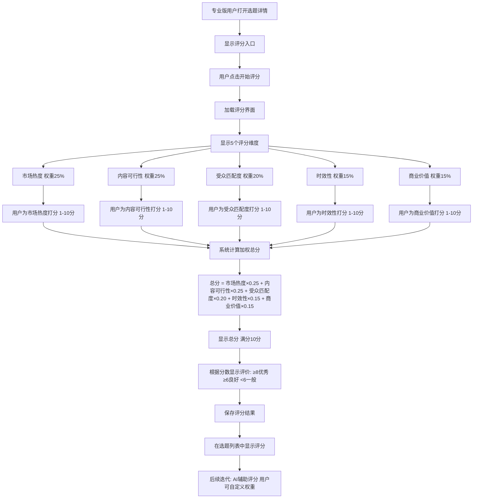
```mermaid
flowchart TD
    A[专业版用户打开选题详情] --> B[显示评分入口]
    B --> C[用户点击开始评分]
    C --> D[加载评分界面]
    D --> E[显示5个评分维度]
    
    E --> F[市场热度 权重25%]
    E --> G[内容可行性 权重25%]
    E --> H[受众匹配度 权重20%]
    E --> I[时效性 权重15%]
    E --> J[商业价值 权重15%]
    
    F --> K[用户为市场热度打分 1-10分]
    G --> L[用户为内容可行性打分 1-10分]
    H --> M[用户为受众匹配度打分 1-10分]
    I --> N[用户为时效性打分 1-10分]
    J --> O[用户为商业价值打分 1-10分]
    
    K --> P[系统计算加权总分]
    L --> P
    M --> P
    N --> P
    O --> P
    
    P --> Q[总分 = 市场热度×0.25 + 内容可行性×0.25 + 受众匹配度×0.20 + 时效性×0.15 + 商业价值×0.15]
    Q --> R[显示总分 满分10分]
    R --> S[根据分数显示评价: ≥8优秀 ≥6良好 <6一般]
    S --> T[保存评分结果]
    T --> U[在选题列表中显示评分]
    
    U --> V[后续迭代: AI辅助评分 用户可自定义权重]
```

业务规则说明：
1. 5个维度固定：市场热度25%、内容可行性25%、受众匹配度20%、时效性15%、商业价值15%
2. 每个维度1-10分，由用户主观打分
3. 总分按加权公式计算，保留一位小数
4. ≥8分为优秀，≥6分为良好，<6分为一般
5. 评分结果保存在选题元数据中
6. MVP版本不依赖AI，纯规则化计算
7. 后续迭代支持AI辅助评分和用户自定义权重

### 3.1.51 选题评分—主要原型 

[📋 选题评分原型](assets/prototypes/web-prototype.html)

验收标准说明：
- [ ] 正常流程：用户完成5个维度打分后，系统正确计算并显示加权总分
- [ ] 异常流程：用户未打完所有维度分时，提交按钮置灰
- [ ] 性能要求：分数计算即时完成；保存≤300ms

---

# 4 产品原型 
## 4.1 页面跳转逻辑图 

```mermaid
flowchart LR
    A[登录/注册页] --> B[工作台仪表盘]
    B --> C[发布日历页]
    B --> D[选题库页]
    B --> E[平台配置页]
    B --> F[汇总面板页]
    
    C --> G[月视图]
    C --> H[周视图]
    C --> I[列表视图]
    
    D --> J[看板视图]
    D --> K[列表视图]
    
    J --> L[选题详情页]
    K --> L
    G --> L
    H --> L
    I --> L
    
    L --> M[编辑选题]
    M --> J
    
    E --> N[平台列表]
    N --> O[平台模板配置]
    
    B --> P[团队空间设置 P1]
    P --> Q[成员管理 P1]
```

## 4.2 全站点原型设计 

### 4.2.1 创作者工作台 WEB端

**页面清单：**
| 序号 | 页面名称 | 所属模块 | 页面描述 | 关键元素 |
| --- | --- | --- | --- | --- |
| 1 | 登录/注册页 | 用户认证 | 用户身份验证入口 | 邮箱输入框、密码输入框、登录/注册按钮 |
| 2 | 工作台仪表盘 | 首页 | 数据概览和快捷操作入口 | 平台卡片、近期选题、即将发布、快捷按钮 |
| 3 | 发布日历-月视图 | 发布日历 | 按月展示发布计划 | 日历网格、平台色块、月份切换器 |
| 4 | 发布日历-周视图 | 发布日历 | 按周展示发布计划 | 周网格、平台行、计划卡片 |
| 5 | 发布日历-列表视图 | 发布日历 | 列表形式展示未来30天计划 | 表格、筛选器、排序功能 |
| 6 | 选题库-看板视图 | 选题管理 | 按状态分列展示选题 | 四列看板、选题卡片、拖拽功能 |
| 7 | 选题库-列表视图 | 选题管理 | 表格形式展示所有选题 | 表格、搜索框、筛选器、排序功能 |
| 8 | 选题详情页 | 选题管理 | 选题完整信息和编辑界面 | 名称、描述、平台关联、标签、图片、备注 |
| 9 | 平台配置页 | 多平台管理 | 管理平台启用/禁用 | 平台列表、启用开关、升级提示 |
| 10 | 发布状态汇总面板 | 多平台管理 | 各平台发布数据概览 | 平台卡片、折线图、警告标识 |
| 11 | 团队空间设置页 | 团队协作 | 团队管理和权限设置(P1) | 成员列表、邀请按钮、角色下拉框 |

**交互说明：**
- 页面跳转关系：
```mermaid
flowchart LR
    A[登录/注册页] --> B[工作台仪表盘]
    B --> C[发布日历]
    B --> D[选题库]
    B --> E[平台配置]
    B --> F[汇总面板]
    C --> G[月视图]
    C --> H[周视图]
    C --> I[列表视图]
    D --> J[看板视图]
    D --> K[列表视图]
    G & H & I & J & K --> L[选题详情]
    L --> M[编辑保存]
    M --> J
    E --> N[平台模板配置]
```
- 特殊交互：
  1. 拖拽排期：从选题库拖拽选题到日历，显示预览幽灵卡片，释放后弹出确认对话框
  2. 跨列拖拽：在看板视图中拖拽选题卡片跨列时，实时更新选题状态
  3. 日历切换：月份/周切换时使用淡入淡出动画，时长300ms
  4. 快捷筛选：在列表视图顶部提供快速筛选标签，点击即时过滤
  5. 空状态引导：无数据时显示插图和引导文案，提供"创建第一个"按钮
  6. 图片上传：支持拖拽上传和点击上传，上传过程显示进度条
  7. 富文本编辑：选题描述支持基本富文本格式，工具栏悬浮选中文本时出现

**产品原型：**

[🖥️ 打开创作者工作台全站点原型](assets/prototypes/web-prototype.html)

---
# 5 数据需求（如有） 
## 5.1 数据使用规格 

### 核心数据实体

**User（用户）**
| 字段 | 是否必填 | 描述 | 数据类型 |
| --- | --- | --- | --- |
| id | 是 | 用户唯一标识 | UUID |
| email | 是 | 邮箱地址，用于登录 | 字符串 |
| password_hash | 是 | 密码哈希值 | 字符串 |
| nickname | 是 | 用户昵称 | 字符串(1-50) |
| avatar_url | 否 | 头像URL | 字符串 |
| created_at | 是 | 注册时间 | 时间戳 |
| updated_at | 是 | 更新时间 | 时间戳 |

**Workspace（工作空间）**
| 字段 | 是否必填 | 描述 | 数据类型 |
| --- | --- | --- | --- |
| id | 是 | 空间唯一标识 | UUID |
| name | 是 | 空间名称 | 字符串(1-100) |
| owner_id | 是 | 空间所有者用户ID | UUID |
| type | 是 | 空间类型: personal/team | 枚举 |
| plan_type | 是 | 套餐类型: free/pro | 枚举 |
| max_platforms | 是 | 最大平台数 | 数字 |
| max_topics | 是 | 最大选题数(free=50 pro=无限) | 数字/null |
| max_members | 是 | 最大成员数(personal=1 team=5) | 数字 |
| created_at | 是 | 创建时间 | 时间戳 |
| updated_at | 是 | 更新时间 | 时间戳 |

**Topic（选题）**
| 字段 | 是否必填 | 描述 | 数据类型 |
| --- | --- | --- | --- |
| id | 是 | 选题唯一标识 | UUID |
| workspace_id | 是 | 所属空间ID | UUID |
| title | 是 | 选题名称 | 字符串(1-100) |
| description | 否 | 选题描述(富文本) | 文本 |
| inspiration_source | 否 | 灵感来源(URL或文本) | 文本 |
| status | 是 | 状态: inspiration/draft/pending/published/abandoned | 枚举 |
| creator_id | 是 | 创建者ID | UUID |
| assignee_id | 否 | 负责人ID(团队空间) | UUID |
| score | 否 | 选题评分(专业版) | 数字(0-10) |
| created_at | 是 | 创建时间 | 时间戳 |
| updated_at | 是 | 更新时间 | 时间戳 |
| published_at | 否 | 发布时间 | 时间戳 |

**PublishPlan（发布计划）**
| 字段 | 是否必填 | 描述 | 数据类型 |
| --- | --- | --- | --- |
| id | 是 | 发布计划唯一标识 | UUID |
| topic_id | 是 | 关联选题ID | UUID |
| platform_id | 是 | 平台ID | UUID |
| scheduled_date | 是 | 计划发布日期 | 日期 |
| scheduled_time | 是 | 计划发布时间 | 时间 |
| status | 是 | 发布状态: pending/published | 枚举 |
| actual_published_at | 否 | 实际发布时间 | 时间戳 |
| platform_specific_title | 否 | 平台特定标题 | 字符串 |
| created_at | 是 | 创建时间 | 时间戳 |
| updated_at | 是 | 更新时间 | 时间戳 |

**Platform（平台）**
| 字段 | 是否必填 | 描述 | 数据类型 |
| --- | --- | --- | --- |
| id | 是 | 平台唯一标识 | UUID |
| name | 是 | 平台名称 | 字符串 |
| icon_url | 是 | 平台图标URL | 字符串 |
| theme_color | 是 | 平台主题色 | 字符串(hex) |
| is_preset | 是 | 是否预置平台 | 布尔 |
| recommended_times_weekday | 否 | 工作日推荐时段 | JSON数组 |
| recommended_times_weekend | 否 | 周末推荐时段 | JSON数组 |
| created_at | 是 | 创建时间 | 时间戳 |

**Tag（标签）**
| 字段 | 是否必填 | 描述 | 数据类型 |
| --- | --- | --- | --- |
| id | 是 | 标签唯一标识 | UUID |
| workspace_id | 是 | 所属空间ID | UUID |
| name | 是 | 标签名称 | 字符串(1-20) |
| color | 否 | 标签颜色 | 字符串(hex) |
| created_at | 是 | 创建时间 | 时间戳 |

**TeamMember（团队成员）**
| 字段 | 是否必填 | 描述 | 数据类型 |
| --- | --- | --- | --- |
| id | 是 | 成员关系唯一标识 | UUID |
| workspace_id | 是 | 所属团队空间ID | UUID |
| user_id | 是 | 用户ID | UUID |
| role | 是 | 角色: admin/editor/viewer | 枚举 |
| joined_at | 是 | 加入时间 | 时间戳 |

**TopicImage（选题图片）**
| 字段 | 是否必填 | 描述 | 数据类型 |
| --- | --- | --- | --- |
| id | 是 | 图片唯一标识 | UUID |
| topic_id | 是 | 关联选题ID | UUID |
| url | 是 | 图片存储URL | 字符串 |
| file_name | 是 | 文件名 | 字符串 |
| file_size | 是 | 文件大小(字节) | 数字 |
| mime_type | 是 | 文件类型 | 字符串 |
| sort_order | 是 | 排序序号 | 数字(1-3) |
| uploaded_at | 是 | 上传时间 | 时间戳 |

## 5.2 统计数据 

1. 统计各平台本周/本月的发布数量，按平台维度统计（P0）
2. 统计各平台的平均发布间隔，标注发布频率异常的平台（P0）
3. 统计用户的选题总数、各状态选题数量分布（P1）
4. 统计团队空间内各成员的贡献选题数量（P1）

## 5.3 埋点需求
| 页面 | 事件 | 采集字段 | 说明 |
| --- | --- | --- | --- |
| 登录/注册页 | 用户注册 | 注册时间、邮箱前缀hash | 统计注册转化率 |
| 登录/注册页 | 用户登录 | 登录时间、登录方式 | 统计登录频次 |
| 选题库 | 创建选题 | 选题ID、创建时间、初始状态 | 统计选题创建活跃度 |
| 选题库 | 变更选题状态 | 选题ID、原状态、新状态、变更时间 | 分析选题流转漏斗 |
| 发布日历 | 创建发布计划 | 计划ID、平台、计划日期、创建时间 | 统计排期活跃度 |
| 发布日历 | 拖拽排期 | 选题ID、目标日期、平台 | 统计拖拽功能使用率 |
| 平台配置 | 启用/禁用平台 | 平台ID、操作类型 | 统计平台偏好 |
| 汇总面板 | 查看面板 | 停留时长、查看的平台数 | 统计功能使用深度 |

---
# 6 非功能需求 
## 6.1 性能需求 

**6.1.1 延迟**
| 编号 | 项目 | 最大延迟 | 平均延迟 | 优先级 | 备注 |
| --- | --- | --- | --- | --- | --- |
| 0001 | 页面首屏加载 | ≤2秒 | ≤1秒 | 高 | 4G网络环境下 |
| 0002 | 日历视图切换 | ≤500ms | ≤300ms | 高 | 月/周/列表切换 |
| 0003 | 选题拖拽响应 | ≤100ms | ≤50ms | 高 | 操作延迟 |
| 0004 | 列表视图加载(1000条) | ≤1秒 | ≤500ms | 中 | 含筛选排序 |
| 0005 | 数据保存 | ≤500ms | ≤300ms | 高 | 操作后持久化 |
| 0006 | 选题详情加载 | ≤500ms | ≤300ms | 中 | 含图片加载 |
| 0007 | 图片上传 | ≤3秒/张 | ≤2秒/张 | 中 | 单张≤5MB |

**6.1.2 吞吐量**
| 编号 | 项 | 吞吐量 | 备注 |
| --- | --- | --- | --- |
| 0001 | 并发用户登录 | 每分钟500次 | 峰值时段 |
| 0002 | 选题创建请求 | 每分钟1000次 | 日常负载 |
| 0003 | 发布计划查询 | 每分钟2000次 | 日历视图加载 |

**6.1.3 容量**
| 编号 | 项 | 容量 | 备注 |
| --- | --- | --- | --- |
| 0001 | 系统注册用户数 | ≤1,000,000 | MVP阶段目标500 |
| 0002 | 单用户选题数 | free≤50, pro=无限 | 免费版限制 |
| 0003 | 单团队空间成员数 | ≤5 | 含创建者 |
| 0004 | 单选题图片附件数 | ≤3 | 单张≤5MB |

## 6.2 安全需求 

| 编号 | 项（系统数据 / 处理过程） |
| --- | --- |
| 0001 | 用户密码必须加盐哈希后存储，禁止明文存储密码 |
| 0002 | JWT token有效期为7天，过期后需重新认证 |
| 0003 | 用户数据严格隔离，不可跨工作空间访问他人数据 |
| 0004 | 敏感操作（删除选题、移除团队成员）需二次确认 |
| 0005 | API接口实施速率限制，防止恶意刷请求（单IP每分钟不超过100次） |
| 0006 | 所有HTTPS传输，禁止HTTP明文传输敏感数据 |
| 0007 | 图片上传需校验文件类型和大小，防止恶意文件上传 |
| 0008 | SQL查询使用参数化语句，防止SQL注入攻击 |

## 6.3 可靠性 

| 编号 | 项 | 值 |
| --- | --- | --- |
| 0001 | 系统可用性 | ≥99.5% |
| 0002 | 数据备份频率 | 每日全量备份 |
| 0003 | 平均故障恢复时间 | ≤2小时 |

## 6.4 可连续性 
| 编号 | 项 |
| --- | --- |
| Modi.1 | 系统需要 7 × 24 小时全天候运行 |
| Modi.2 | 计划内维护需提前48小时公告，维护窗口选择在凌晨0:00-6:00 |

## 6.5 可恢复性 
| 编号 | 项 |
| --- | --- |
| Modi.1 | 每日凌晨3:00进行全量数据备份，保留最近30天备份 |
| Modi.2 | 每小时进行一次增量备份，保留最近7天增量备份 |
| Modi.3 | 重大故障需在2小时内恢复服务可用性，24小时内恢复数据完整性 |

## 6.6 兼容性
| 编号 | 要求 | 备注 |
| --- | --- | --- |
| 0001 | 兼容主流浏览器：Chrome ≥90，Firefox ≥90，Safari ≥15，Edge ≥90 | MVP阶段仅支持桌面浏览器 |
| 0002 | 最小屏幕分辨率支持1024×768 | 保证核心功能可用 |
| 0003 | 推荐屏幕分辨率1440×900及以上 | 最佳体验分辨率 |
| 0004 | 不支持IE浏览器 | 明确告知用户 |

## 6.7 易用性
| 编号 | 要求 | 备注 |
| --- | --- | --- |
| 0001 | 核心操作路径不超过3步 | 如创建选题→排期→发布 |
| 0002 | 普通用户无需培训即可使用核心功能 | 界面直观，有引导提示 |
| 0003 | 提供新手引导流程 | 首次登录时展示功能介绍 |
| 0004 | 错误提示清晰易懂 | 不使用技术术语，给出解决建议 |

---
# 7 总结 
## 7.1 上线计划
| 阶段 | 时间 | 内容 | 负责人 |
| --- | --- | --- | --- |
| 需求评审 | 2026-06-29 | 完成PRD评审，确认功能范围 | 产品经理 |
| UI原型设计 | 2026-06-30 | 完成全站点高保真原型设计 | UI设计师 |
| 基础框架开发 | 2026-07-01 ~ 2026-07-02 | 用户体系、空间初始化、平台配置 | 后端开发 |
| 日历模块开发 | 2026-07-03 ~ 2026-07-04 | 月/周/列表视图、拖拽排期 | 前端开发 |
| 选题模块开发 | 2026-07-05 | 选题库看板、状态流转、详情页 | 全栈开发 |
| 推荐与汇总开发 | 2026-07-06 | 发布时间推荐、平台概览面板 | 前端开发 |
| 联调与测试 | 2026-07-07 | 端到端测试、性能优化、Bug修复 | 测试工程师 |
| 灰度上线 | 2026-07-08 | 灰度10%用户，验证稳定性 | 运维工程师 |
| 全量上线 | 2026-07-10 | 全量开放给所有用户 | 运维工程师 |

## 7.2 后续迭代规划
- V1.1（P1功能）：微信登录、自定义平台、平台内容模板、团队协作功能（团队空间、成员权限管理）、数据导出（CSV格式）、批量操作（批量变更状态、批量打标签）
- V1.2（P2功能）：视频附件上传（仍限3个）、个性化发布推荐（基于用户历史数据）、AI辅助选题评分、Excel格式导出
- V2.0：移动端适配（H5响应式布局）、企业版（突破5人团队限制、更细粒度权限控制）、与各平台API对接实现半自动发布

## 7.3 参考文档
- [URS-多平台创作者发布日历与选题看板-需求文档](./需求文档.md)
