# 宠物保险对比助手 - 产品需求文档（PRD）

**文档版本**：V1.0  
**创建日期**：2026-06-26  
**产品名称**：宠物保险对比助手  
**文档状态**：初稿

---

## 变更历史

| 版本号 | 变更日期 | 变更内容 | 变更人 | 审核人 |
| --- | --- | --- | --- | --- |
| V1.0 | 2026-06-26 | 初始版本创建 | 产品文档结对写作专家 | - |

---

# 1 概述

## 1.1 需求背景

宠物经济持续高速增长，2025年中国宠物市场规模已突破3000亿元，其中宠物保险作为新兴细分赛道，年增长率超过40%。然而，宠物保险市场面临三大核心痛点：

1. **信息不对称**：保险产品条款复杂、差异大，宠物主人难以快速识别适合自身宠物情况的最优方案
2. **理赔门槛高**：理赔流程繁琐、材料要求多，宠物主人经常因材料不全、流程不清而放弃或延迟理赔
3. **数据断层**：宠物健康档案分散、难以结构化沉淀，无法为保险推荐和理赔提供连续、完整的健康数据支撑

宠物保险对比助手以"帮宠物主人选对保险、用好保险"为核心价值，通过AI智能推荐、多家产品横向对比、理赔流程全程指引、宠物健康档案管理等能力，为宠物主人提供一站式保险决策与服务平台。

## 1.2 名词解释

| **名词** | **说明** |
| --- | --- |
| 宠物档案 | 记录宠物基础信息（品种、年龄、性别、体重、绝育状态等）及健康记录的结构化数据 |
| AI推荐引擎 | 基于宠物画像（品种、年龄、健康状况）和用户偏好，通过规则匹配算法推荐适合保险方案的核心组件 |
| 产品对比 | 将2-5款保险产品的保障范围、免赔额、赔付比例、等待期、保费等核心维度进行横向对照展示 |
| 保费试算 | 根据宠物信息（品种、年龄、性别等）实时计算某款保险产品的预估保费 |
| 理赔指引 | 将理赔流程拆解为步骤（报案→提交材料→审核→赔付），逐步引导用户完成理赔申请 |
| 健康档案 | 记录宠物疫苗接种、就诊记录、体检报告等健康相关信息的数字化档案 |
| 付费会员 | 支付¥15/月订阅费用的用户，享受深度对比、专属顾问、理赔协助等增值服务 |
| 专属顾问 | 为付费会员提供1对1保险咨询与理赔协助的专业保险顾问 |
| MVP | 最小可行产品（Minimum Viable Product），第一期核心功能版本 |
| 免赔额 | 保险公司开始赔付前，被保险人需自行承担的费用额度 |
| 等待期 | 保险合同生效后，需等待一定时间才可申请理赔的期限 |
| 赔付比例 | 保险公司实际赔付金额占合理医疗费用的百分比 |

## 1.3 产品介绍

### 1.3.1 范围说明

| 项 | 内容 |
| --- | --- |
| 包含功能 | C端用户（宠物主人/准备养宠人群）：微信授权登录、宠物档案创建与管理、AI智能推荐保险方案、多家产品横向对比（2-5款）、保费试算、产品详情查看、理赔流程指引、理赔材料上传与校验、个人中心、会员开通（第二期）、健康档案管理（第二期）；运营后台：保险产品管理（录入/上下架/信息变更）、用户管理、数据统计；产品管理后台：保险产品信息维护 |
| 不包含功能 | 宠物救助组织批量管理入口（第三期）、保险机构合作后台（第三期）、AI健康风险预测（第三期）、社区化内容（用户评价/理赔经验分享）（第三期）、在线理赔款项发放（平台仅提供导流，不发理赔款）、保险产品销售（平台仅提供信息对比，投保跳转至保险机构官方页面） |

**产品核心价值：**

宠物保险对比助手是面向宠物经济赛道的数字化保险服务平台，以"帮宠物主人选对保险、用好保险"为核心价值，连接宠物主人、保险机构、宠物医院等多方角色，实现保险方案智能推荐、多家产品横向对比、理赔流程全程指引、宠物健康档案管理的全流程数字化闭环。

**目标用户：**
- **核心用户**：已养猫狗的宠物主人（25-45岁为主），有保险配置需求但缺乏专业判断能力
- **潜在用户**：准备养宠人群，在养宠前了解保险配置方案
- **扩展用户（第三期）**：宠物救助组织、宠物医院

**使用场景：**
- 场景1：宠物主人刚养了一只3个月大的金毛犬，想了解有哪些保险适合，通过AI推荐快速获取匹配方案
- 场景2：宠物主人为猫咪对比3款门诊险产品，通过横向对比表快速识别最优方案
- 场景3：宠物主人带狗狗做了手术，需要理赔，通过理赔指引逐步完成材料提交
- 场景4：宠物主人定期查看猫咪健康档案，管理疫苗和体检记录

---

# 2 产品设计

## 2.1 系统架构图

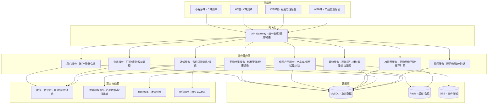

## 2.2 业务模块图

```mermaid
flowchart TD
    ROOT[宠物保险对比助手] --> MOD1[用户账户模块]
    ROOT --> MOD2[宠物档案模块]
    ROOT --> MOD3[保险对比模块]
    ROOT --> MOD4[理赔指引模块]
    ROOT --> MOD5[会员中心模块]
    ROOT --> MOD6[运营管理模块]
    ROOT --> MOD7[产品管理模块]
    
    MOD1 --> M1A[微信授权登录]
    MOD1 --> M1B[手机号绑定]
    MOD1 --> M1C[个人中心]
    
    MOD2 --> M2A[创建宠物档案]
    MOD2 --> M2B[健康记录管理]
    MOD2 --> M2C[提醒服务]
    
    MOD3 --> M3A[AI智能推荐]
    MOD3 --> M3B[产品横向对比]
    MOD3 --> M3C[产品详情]
    MOD3 --> M3D[保费试算]
    
    MOD4 --> M4A[理赔申请]
    MOD4 --> M4B[材料管理]
    MOD4 --> M4C[流程指引]
    MOD4 --> M4D[进度跟踪]
    
    MOD5 --> M5A[会员权益]
    MOD5 --> M5B[订阅支付]
    MOD5 --> M5C[专属顾问]
    
    MOD6 --> M6A[用户管理]
    MOD6 --> M6B[会员管理]
    MOD6 --> M6C[数据统计]
    
    MOD7 --> M7A[产品录入]
    MOD7 --> M7B[产品维护]
    MOD7 --> M7C[条款管理]
```

## 2.3 主业务流程

### 2.3.1 保险对比与推荐核心业务流程

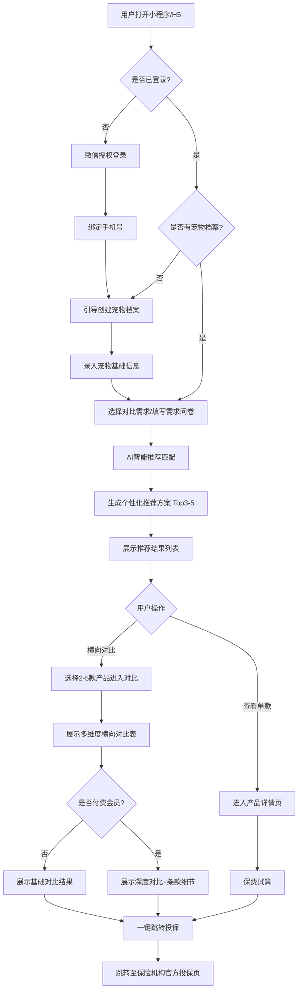

### 2.3.2 理赔流程指引业务流程

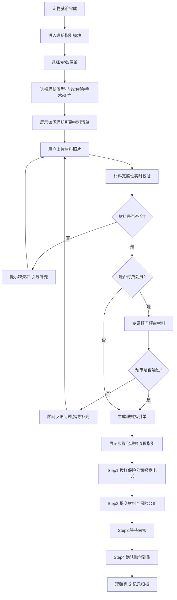

### 2.3.3 宠物健康档案管理业务流程

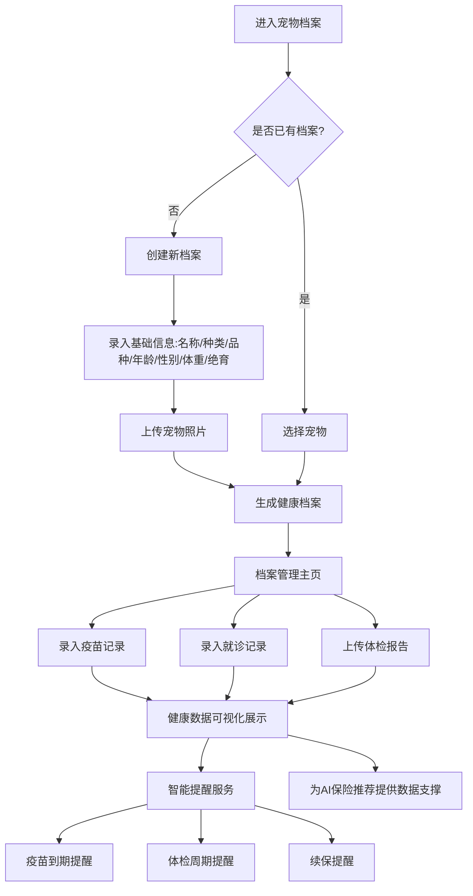

## 2.4 功能图/列表

### 2.4.1 C端用户（小程序端/H5端）功能列表

| 功能模块 | 功能名称 | 优先级 | 功能描述 |
| --- | --- | --- | --- |
| 用户账户 | 微信授权登录 | P0 | 支持微信一键授权登录，获取用户基本信息（头像、昵称、OpenID） |
| 用户账户 | 手机号绑定 | P0 | 绑定手机号用于接收理赔、续保等重要通知 |
| 用户账户 | 个人资料管理 | P0 | 管理用户基本信息、联系方式 |
| 宠物档案 | 创建宠物档案 | P0 | 录入宠物名称、种类、品种、年龄、性别、体重、是否绝育等基础信息 |
| 宠物档案 | 照片上传 | P0 | 上传宠物正面照、侧面照，用于档案展示 |
| 宠物档案 | 多宠物管理 | P0 | 支持一个账号管理多只宠物，可切换当前操作宠物 |
| 宠物档案 | 疫苗记录 | P1 | 记录疫苗接种时间、疫苗类型、接种机构（第二期） |
| 宠物档案 | 就诊记录 | P1 | 记录就诊时间、医院、诊断结果、治疗费用（第二期） |
| 宠物档案 | 体检报告 | P1 | 上传并管理宠物体检报告（第二期） |
| 宠物档案 | 提醒服务 | P1-P2 | 疫苗到期提醒、续保提醒、体检周期提醒（第二期） |
| 保险对比 | AI推荐入口 | P0 | 基于宠物档案智能推荐适合的保险方案 |
| 保险对比 | 需求问卷 | P0 | 通过3-5个问题快速了解用户保障需求偏好 |
| 保险对比 | 推荐结果展示 | P0 | 按匹配度排序展示Top 3-5款推荐产品 |
| 保险对比 | 多选对比 | P0 | 支持同时选择2-5款产品进行横向对比 |
| 保险对比 | 对比维度 | P0 | 保障范围、免赔额、赔付比例、等待期、保费、理赔次数限制等 |
| 保险对比 | 差异高亮 | P1 | 自动高亮对比产品间的关键差异项（第二期） |
| 保险对比 | 深度对比（付费） | P1 | 付费会员可查看更细致的条款对比、历史理赔数据对比（第二期） |
| 保险对比 | 保障详情 | P0 | 展示产品的完整保障范围、免责条款、赔付规则 |
| 保险对比 | 保费试算 | P0 | 根据宠物信息实时试算保费 |
| 保险对比 | 投保跳转 | P0 | 一键跳转至保险机构官方投保页面 |
| 理赔指引 | 理赔入口 | P0 | 从宠物档案或保单列表发起理赔申请 |
| 理赔指引 | 材料清单 | P0 | 根据理赔类型展示所需材料清单 |
| 理赔指引 | 材料拍照上传 | P0 | 支持拍照上传、相册选择 |
| 理赔指引 | 材料完整性校验 | P0 | 实时检查材料是否齐全，缺失项明确提示 |
| 理赔指引 | 步骤化指引 | P0 | 将理赔流程拆解为步骤，逐步引导 |
| 理赔指引 | 理赔指引单 | P1 | 生成可保存/分享的理赔指引单（第二期） |
| 理赔指引 | 进度跟踪 | P1 | 跟踪理赔各阶段状态，实时更新（第二期） |
| 理赔指引 | 专属顾问 | P1 | 付费会员可联系专属保险顾问1v1协助理赔（第二期） |
| 会员中心 | 会员权益展示 | P1 | 清晰展示免费vs付费会员权益对比（第二期） |
| 会员中心 | 订阅支付 | P1 | 支持微信支付按月订阅¥15/月（第二期） |
| 会员中心 | 自动续费管理 | P1 | 支持开启/关闭自动续费（第二期） |
| 会员中心 | 顾问分配 | P1 | 付费后分配专属保险顾问（第二期） |
| 会员中心 | 顾问沟通 | P1 | 通过IM或电话与顾问沟通（第二期） |

### 2.4.2 运营管理后台（WEB端）功能列表

| 功能模块 | 功能名称 | 优先级 | 功能描述 |
| --- | --- | --- | --- |
| 用户管理 | 用户查询 | P0 | 查看注册用户列表，支持按手机号、宠物信息检索 |
| 用户管理 | 用户详情 | P0 | 查看用户档案、宠物信息、使用记录 |
| 用户管理 | 用户封禁 | P1 | 对违规用户进行封禁处理（第二期） |
| 会员管理 | 会员状态查询 | P1 | 查看付费会员列表、订阅状态、到期时间（第二期） |
| 会员管理 | 续费记录 | P1 | 查看会员续费流水（第二期） |
| 顾问管理 | 顾问信息维护 | P1 | 管理专属保险顾问的基本信息、服务能力（第二期） |
| 顾问管理 | 顾问分配 | P1 | 为付费会员分配/更换专属顾问（第二期） |
| 数据统计 | 用户增长 | P1 | 统计注册用户、活跃用户、付费转化率（第二期） |
| 数据统计 | 对比数据 | P0 | 统计产品对比热度、点击投保转化率 |
| 数据统计 | 理赔数据 | P1 | 统计理赔申请数量、完成率、用户满意度（第二期） |
| 系统管理 | 推荐算法配置 | P1 | 配置AI推荐的权重参数、匹配规则（第二期） |
| 系统管理 | 通知模板 | P1 | 配置续保提醒、理赔进度等通知模板（第二期） |

### 2.4.3 产品管理后台（WEB端）功能列表

| 功能模块 | 功能名称 | 优先级 | 功能描述 |
| --- | --- | --- | --- |
| 产品管理 | 基础信息录入 | P0 | 录入保险产品名称、保险公司、产品类型 |
| 产品管理 | 保障信息录入 | P0 | 录入保障范围、免赔额、赔付比例、等待期、保额上限 |
| 产品管理 | 保费规则录入 | P0 | 录入保费计算规则（按品种/年龄/性别等维度） |
| 产品管理 | 条款文件上传 | P0 | 上传产品条款PDF原文 |
| 产品管理 | 产品上下架 | P0 | 控制产品在C端的展示状态 |
| 产品管理 | 信息变更 | P0 | 修改产品信息，保留变更历史 |
| 产品管理 | 对比维度配置 | P1 | 配置产品在对比表中展示的维度字段（第二期） |

## 2.5 你的产品有哪些端

| 序号 | 端名称 | 端类型 | 目标用户 | 说明 |
| --- | --- | --- | --- | --- |
| 1 | C端用户-小程序端 | 小程序端 | 宠物主人、准备养宠人群 | 微信小程序，MVP阶段优先上线，覆盖核心保险对比与理赔指引功能 |
| 2 | C端用户-H5端 | H5端 | 宠物主人、准备养宠人群 | H5网页版，作为小程序的补充渠道，支持非微信环境访问 |
| 3 | 运营管理后台 | WEB端 | 平台运营人员 | Web后台，管理用户、会员、顾问、数据统计、系统配置 |
| 4 | 产品管理后台 | WEB端 | 产品运营人员 | Web后台，维护保险产品信息（录入、上下架、信息变更、条款管理） |

---

# 3 产品功能

## 3.1 C端用户-小程序端功能

### 3.1.1 微信授权登录

**功能描述：**
支持用户通过微信一键授权快速登录，获取用户基本信息（头像、昵称、OpenID），降低注册门槛，提高用户转化率。

| 项 | 内容 |
| --- | --- |
| 优先级 | P0 |
| 依赖需求 | URS-001 |
| 前置条件 | 用户已安装微信客户端（微信7.0及以上版本） |

#### 3.1.1.1 详细流程

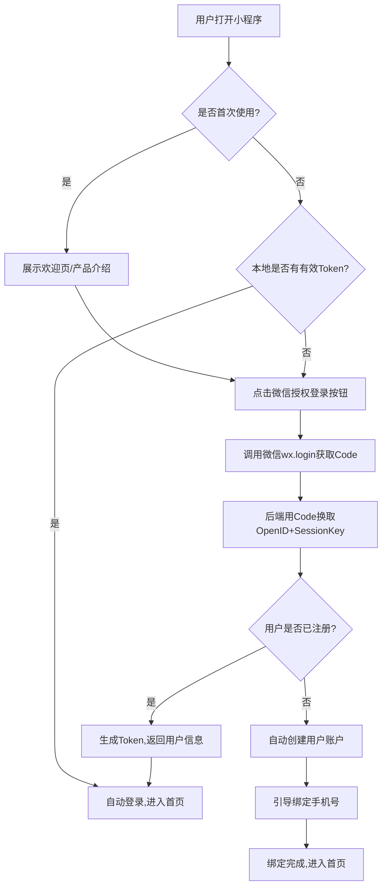

**业务规则说明：**
1. 用户首次登录需绑定手机号后方可使用核心功能（保险对比、理赔指引等）
2. Token有效期为7天，过期需重新授权
3. 用户拒绝授权后，允许浏览产品列表但不可使用个性化推荐、理赔等功能
4. 头像、昵称从微信获取，用户可在个人中心修改展示昵称

#### 3.1.1.2 主要原型

[微信授权登录原型](assets/prototypes/c-end-miniapp/login-widget.html)

**验收标准：**
- [ ] 正常流程：用户点击微信授权按钮后，1秒内完成登录并跳转首页
- [ ] 首次登录流程：登录后自动引导绑定手机号，绑定成功后进入首页
- [ ] 异常流程：用户拒绝授权时，展示友好提示并允许继续浏览产品列表
- [ ] Token过期：自动跳转登录页，登录后恢复用户之前的操作上下文
- [ ] 性能要求：登录接口响应时间 < 500ms

---

### 3.1.2 手机号绑定

**功能描述：**
用户通过微信手机号快速授权绑定手机号，用于接收理赔进度通知、续保提醒等重要消息。

| 项 | 内容 |
| --- | --- |
| 优先级 | P0 |
| 依赖需求 | URS-002 |
| 前置条件 | 用户已完成微信授权登录 |

#### 3.1.2.1 详细流程

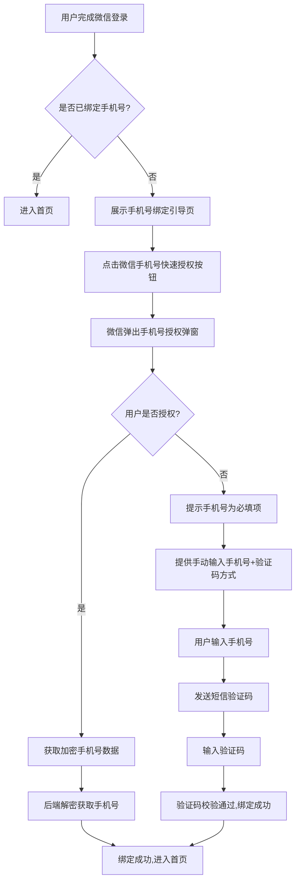

**业务规则说明：**
1. 优先使用微信手机号快速授权（一键授权），失败时降级为手动输入+短信验证码
2. 手机号格式校验：中国大陆11位手机号，1开头
3. 短信验证码6位数字，有效期5分钟，同一手机号60秒内不可重复发送
4. 一个手机号可绑定多个微信账户，但一个微信账户只能绑定一个手机号

#### 3.1.2.2 主要原型

[手机号绑定原型](assets/prototypes/c-end-miniapp/phone-bind-widget.html)

**验收标准：**
- [ ] 正常流程：微信一键授权手机号后绑定成功
- [ ] 降级流程：微信授权失败时，可通过手动输入+验证码完成绑定
- [ ] 异常流程：手机号格式错误时即时提示，验证码错误时提示重新输入
- [ ] 安全要求：验证码发送间隔60秒，错误次数超过5次锁定15分钟

---

### 3.1.3 创建宠物档案

**功能描述：**
用户可创建宠物档案，录入宠物基础信息（名称、种类、品种、年龄、性别、体重、是否绝育），并上传宠物照片。支持一个账号管理多只宠物。

| 项 | 内容 |
| --- | --- |
| 优先级 | P0 |
| 依赖需求 | URS-010 |
| 前置条件 | 用户已完成登录并绑定手机号 |

#### 3.1.3.1 详细流程

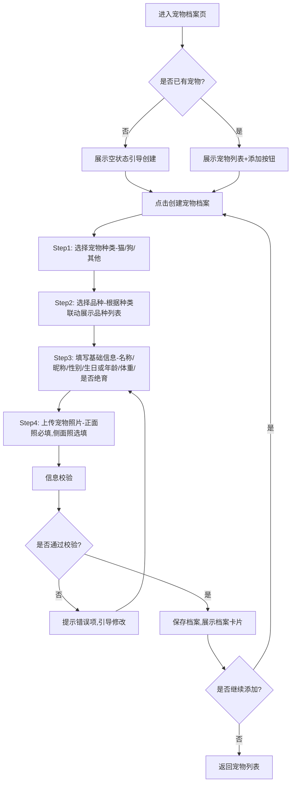

**业务规则说明：**
1. 宠物名称必填，最长20个字符
2. 种类选择：猫、狗、其他（其他种类在MVP阶段仅支持基础信息录入，AI推荐可能受限）
3. 品种选择联动：选择种类后展示对应品种列表，支持搜索和"其他"选项
4. 年龄支持两种输入方式：精确生日（日期选择器）或年龄段（幼年/成年/老年）
5. 体重单位为kg，支持小数点后1位
6. 宠物照片最多上传5张，每张不超过5MB，支持JPG/PNG格式
7. 单个账号最多创建10只宠物档案
8. 宠物档案可编辑、可归档（宠物离世或用户主动归档）、可恢复

#### 3.1.3.2 主要原型

[创建宠物档案原型](assets/prototypes/c-end-miniapp/create-pet-widget.html)

**验收标准：**
- [ ] 正常流程：完成所有必填项填写后成功创建档案，展示宠物卡片
- [ ] 多宠物管理：可在列表中切换当前操作宠物，切换后AI推荐结果同步更新
- [ ] 异常流程：必填项为空时提交按钮置灰，名称超长时实时截断提示
- [ ] 照片上传：支持拍照和相册选择，上传中展示进度，上传失败可重试
- [ ] 性能要求：档案保存响应 < 500ms，照片上传单张 < 3秒（4G网络）

---

### 3.1.4 AI智能推荐

**功能描述：**
基于宠物档案信息（品种、年龄、健康状况）和用户需求偏好，通过AI推荐引擎智能匹配并推荐适合的保险方案，按匹配度排序展示Top 3-5款产品。

| 项 | 内容 |
| --- | --- |
| 优先级 | P0 |
| 依赖需求 | URS-018 |
| 前置条件 | 用户已创建至少一只宠物档案 |

#### 3.1.4.1 详细流程

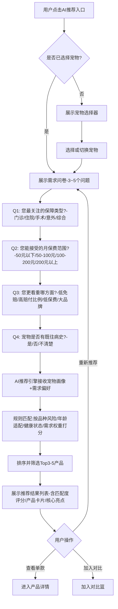

**业务规则说明：**
1. 推荐结果基于宠物画像（品种风险系数、年龄段适配、健康状态）和需求偏好（保障类型、保费预算、优先级）综合打分
2. 匹配度评分范围0-100分，按分数降序排列
3. 推荐结果最少展示3款，最多5款
4. 若宠物有既往病史，推荐结果中标注"可能影响理赔"的产品
5. 推荐引擎响应时间 < 2秒
6. 用户可重新填写问卷更新推荐结果
7. 推荐结果页展示"信息仅供参考"免责声明

#### 3.1.4.2 主要原型

[AI智能推荐原型](assets/prototypes/c-end-miniapp/ai-recommend-widget.html)

**验收标准：**
- [ ] 正常流程：填写问卷后2秒内返回推荐结果，结果按匹配度排序
- [ ] 个性化：不同宠物档案（如3岁猫 vs 7岁金毛犬）返回不同推荐结果
- [ ] 异常流程：网络超时时展示重试按钮，接口失败时降级为热门产品列表
- [ ] 性能要求：推荐接口响应 < 2秒，页面渲染 < 500ms

---

### 3.1.5 产品横向对比

**功能描述：**
支持用户选择2-5款保险产品进行多维度横向对比，对比维度包括保障范围、免赔额、赔付比例、等待期、保费、理赔次数限制等核心维度。

| 项 | 内容 |
| --- | --- |
| 优先级 | P0 |
| 依赖需求 | URS-020 |
| 前置条件 | 用户已浏览产品列表或AI推荐结果 |

#### 3.1.5.1 详细流程

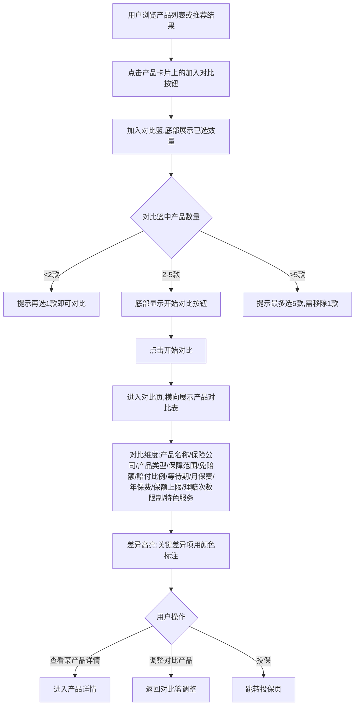

**业务规则说明：**
1. 最少选择2款产品，最多5款
2. 对比表支持横向滚动（移动端），对比维度固定在左侧
3. 差异高亮规则：保费差异>20%、免赔额差异>500元、赔付比例差异>10%时自动高亮
4. 对比表中的保费为基于当前宠物档案的试算保费
5. 对比页支持一键移除某产品并自动补充推荐列表中的下一款
6. 对比结果支持生成长图分享（第二期）

#### 3.1.5.2 主要原型

[产品横向对比原型](assets/prototypes/c-end-miniapp/product-compare-widget.html)

**验收标准：**
- [ ] 正常流程：选择2-5款产品后进入对比页，对比表正确展示所有维度数据
- [ ] 差异高亮：关键差异项（保费、免赔额、赔付比例）用颜色标注
- [ ] 异常流程：选择不足2款时对比按钮置灰，超过5款时提示移除
- [ ] 移动端适配：对比表支持横向滚动，首列固定
- [ ] 性能要求：对比结果生成 < 1秒

---

### 3.1.6 产品详情与保费试算

**功能描述：**
展示保险产品的完整信息，包括保障范围、免责条款、赔付规则等，并根据用户宠物信息实时试算保费。

| 项 | 内容 |
| --- | --- |
| 优先级 | P0 |
| 依赖需求 | URS-024 |
| 前置条件 | 用户已浏览产品列表或对比结果 |

#### 3.1.6.1 详细流程

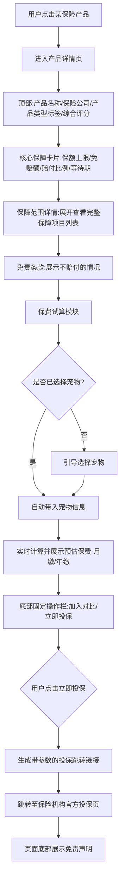

**业务规则说明：**
1. 保费试算基于宠物品种、年龄、性别自动计算，响应时间 < 0.5秒
2. 试算结果标注"预估保费，实际以投保页面为准"
3. 产品详情页底部必须展示"信息仅供参考，以保险机构官方条款为准"免责声明
4. 投保跳转链接包含用户Token和产品参数，跳转前提示"即将离开本平台"
5. 产品详情页展示该产品在其他用户中的投保热度和评分

#### 3.1.6.2 主要原型

[产品详情与保费试算原型](assets/prototypes/c-end-miniapp/product-detail-widget.html)

**验收标准：**
- [ ] 正常流程：选择宠物后0.5秒内展示试算保费，详情页信息完整
- [ ] 投保跳转：点击投保按钮后正确跳转至保险机构官方页面
- [ ] 免责声明：页面底部始终展示免责声明文案
- [ ] 性能要求：保费试算响应 < 0.5秒，页面加载 < 1.5秒

---

### 3.1.7 理赔流程指引

**功能描述：**
为用户提供理赔全流程指引，包括材料清单展示、材料拍照上传、材料完整性校验、步骤化理赔流程引导。

| 项 | 内容 |
| --- | --- |
| 优先级 | P0 |
| 依赖需求 | URS-028 |
| 前置条件 | 用户已创建宠物档案并持有有效保单 |

#### 3.1.7.1 详细流程

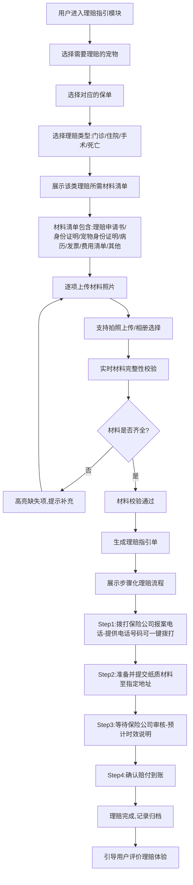

**业务规则说明：**
1. 不同理赔类型所需材料不同：门诊需病历+发票，住院需住院病历+费用清单+发票，手术需手术记录+发票，死亡需死亡证明+宠物身份证明
2. 材料照片支持自动裁剪和增强，单张不超过10MB
3. 材料完整性校验基于规则引擎，缺失项实时标红提示
4. 理赔指引单可保存为图片或PDF，包含所有步骤和所需材料信息
5. 报案电话支持一键拨打
6. 理赔进度跟踪（第二期）需用户手动更新状态

#### 3.1.7.2 主要原型

[理赔流程指引原型](assets/prototypes/c-end-miniapp/claim-guide-widget.html)

**验收标准：**
- [ ] 正常流程：材料齐全后成功生成理赔指引单，步骤清晰可执行
- [ ] 材料校验：缺失材料时实时高亮提示，校验响应 < 500ms
- [ ] 报案电话：点击电话号码可一键拨打
- [ ] 异常流程：照片上传失败可重试，网络中断时自动保存已上传材料

---

### 3.1.8 个人中心

**功能描述：**
用户管理个人信息、宠物档案列表、会员状态、设置等。

| 项 | 内容 |
| --- | --- |
| 优先级 | P0 |
| 依赖需求 | URS-005 |
| 前置条件 | 用户已登录 |

#### 3.1.8.1 详细流程

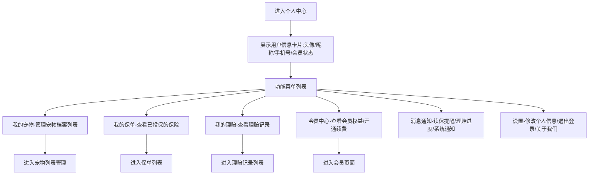

**业务规则说明：**
1. 个人中心展示当前登录用户的基本信息和会员状态
2. 宠物列表支持快速切换当前操作宠物
3. 会员状态展示：免费用户/付费会员（到期时间）
4. 消息通知支持红点提示未读数量
5. 退出登录后清除本地Token，跳转至登录页

#### 3.1.8.2 主要原型

[个人中心原型](assets/prototypes/c-end-miniapp/my-center-widget.html)

**验收标准：**
- [ ] 正常流程：个人信息正确展示，各菜单入口功能正常
- [ ] 宠物切换：切换宠物后首页推荐结果同步更新
- [ ] 消息通知：未读消息展示红点，点击进入消息列表

---

## 3.2 C端用户-H5端功能

H5端功能与小程序端基本一致，核心差异如下：

| 项 | 小程序端 | H5端 |
| --- | --- | --- |
| 登录方式 | 微信授权登录 | 手机号+验证码登录（或微信H5授权） |
| 分享能力 | 微信分享 | 链接分享（浏览器/社交媒体） |
| 支付能力 | 微信支付JSAPI | 微信H5支付/支付宝 |
| 推送能力 | 微信订阅消息 | 短信通知 |

其余功能模块（宠物档案、保险对比、理赔指引、个人中心）与小程序端功能描述一致，此处不再赘述。

---

## 3.3 运营管理后台功能

### 3.3.1 用户管理

**功能描述：**
运营人员可查看注册用户列表，支持按手机号、宠物信息检索，查看用户详情（档案、宠物信息、使用记录），对违规用户进行封禁处理。

| 项 | 内容 |
| --- | --- |
| 优先级 | P0（查询/详情）、P1（封禁） |
| 依赖需求 | URS-052 |
| 前置条件 | 运营人员已登录管理后台 |

#### 3.3.1.1 详细流程

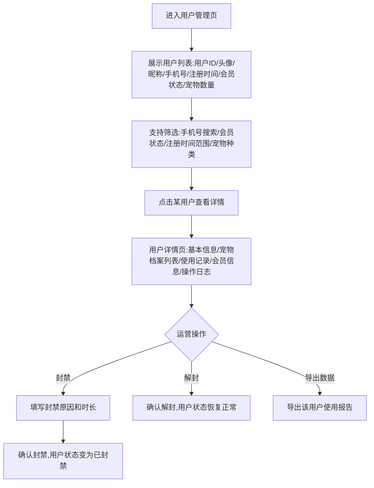

**业务规则说明：**
1. 用户列表默认按注册时间倒序排列，每页20条
2. 封禁用户后，该用户无法登录和使用任何功能
3. 封禁操作需填写原因和时长（1天/7天/30天/永久），操作记录留痕
4. 用户详情中的使用记录包括：登录记录、保险对比记录、理赔申请记录

#### 3.3.1.2 主要原型

[用户管理原型](assets/prototypes/admin-web/user-manage-widget.html)

**验收标准：**
- [ ] 正常流程：用户列表正确展示，搜索筛选功能正常
- [ ] 封禁流程：封禁后用户状态实时更新，操作日志记录完整
- [ ] 数据准确：用户详情中的宠物信息和使用记录与C端一致

---

### 3.3.2 数据统计

**功能描述：**
运营人员可查看平台核心运营数据，包括产品对比热度、点击投保转化率、用户增长（第二期）、理赔数据（第二期）等。

| 项 | 内容 |
| --- | --- |
| 优先级 | P0（对比数据）、P1（用户增长/理赔数据） |
| 依赖需求 | URS-060 |
| 前置条件 | 运营人员已登录管理后台 |

#### 3.3.2.1 详细流程

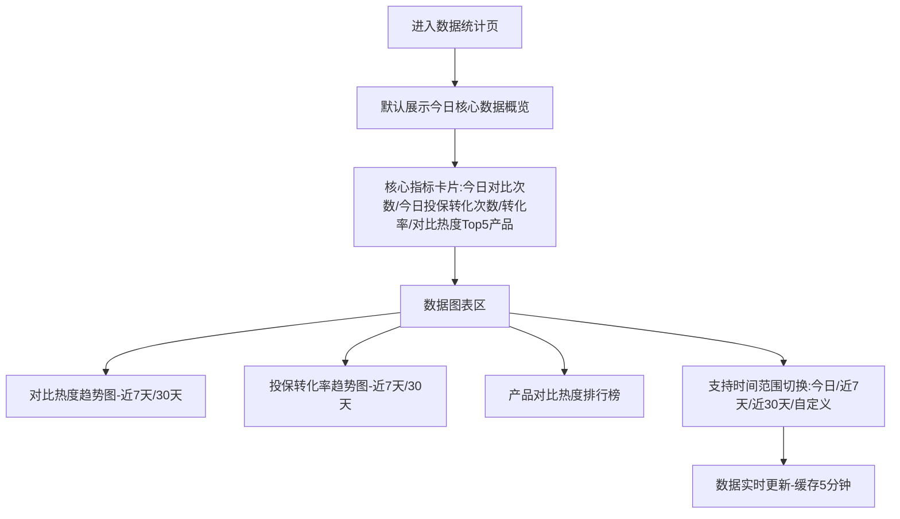

**业务规则说明：**
1. 对比热度 = 某产品被加入对比的次数，按热度降序排列
2. 投保转化率 = 点击投保次数 / 产品详情页访问次数 × 100%
3. 数据缓存5分钟，支持手动刷新
4. 数据导出支持Excel格式（第二期）

#### 3.3.2.2 主要原型

[数据统计原型](assets/prototypes/admin-web/data-stats-widget.html)

**验收标准：**
- [ ] 正常流程：数据指标正确计算，图表正常渲染
- [ ] 时间切换：切换时间范围后数据正确更新
- [ ] 性能要求：页面加载 < 2秒，图表渲染 < 1秒

---

## 3.4 产品管理后台功能

### 3.4.1 保险产品录入与维护

**功能描述：**
产品运营人员可录入保险产品信息，包括基础信息、保障信息、保费规则、条款文件，并管理产品上下架和信息变更。

| 项 | 内容 |
| --- | --- |
| 优先级 | P0 |
| 依赖需求 | URS-040 |
| 前置条件 | 产品运营人员已登录产品管理后台 |

#### 3.4.1.1 详细流程

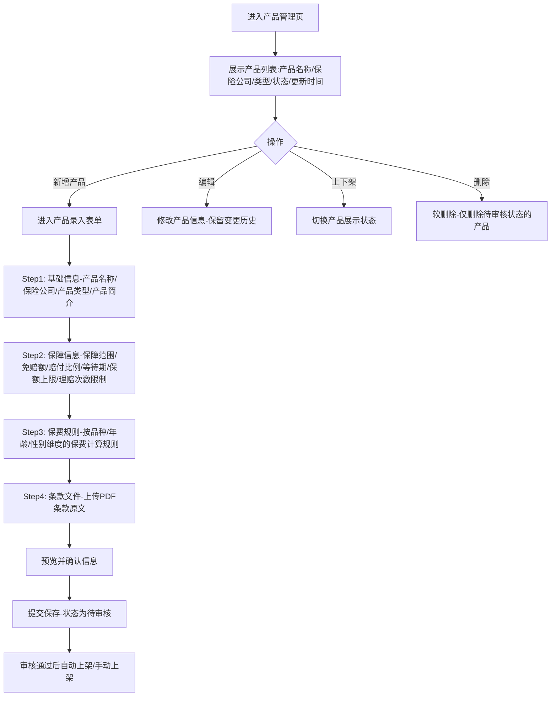

**业务规则说明：**
1. 产品信息必须经运营人工审核后上架，禁止自动抓取未经审核的第三方数据
2. 产品状态：待审核 → 已上架 → 已下架 → 已归档
3. 已上架产品修改信息后需重新审核
4. 条款文件仅支持PDF格式，大小不超过50MB
5. 保费规则支持按品种（猫/狗分表）、年龄段（幼年/成年/老年）、性别维度设置
6. 产品删除为软删除，已上架产品不可删除，仅可下架
7. 变更历史保留所有修改记录，含修改人、修改时间、修改前后值

#### 3.4.1.2 主要原型

[保险产品录入原型](assets/prototypes/product-admin-web/product-manage-widget.html)

**验收标准：**
- [ ] 正常流程：完成4个步骤信息录入后成功保存产品，状态为待审核
- [ ] 审核流程：审核通过后产品状态变为已上架，C端可见
- [ ] 变更历史：编辑已上架产品后保留完整变更历史
- [ ] 异常流程：必填项缺失时无法提交，条款文件格式错误时提示

---

# 4 产品原型

## 4.1 页面跳转逻辑图

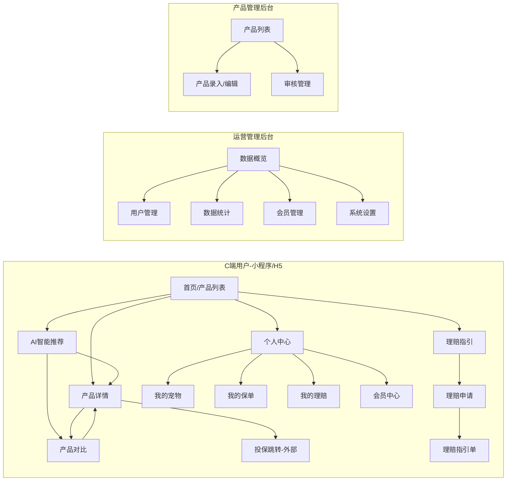

## 4.2 全站点原型设计

### 4.2.1 C端用户-小程序端

**页面清单：**

| 序号 | 页面名称 | 所属模块 | 页面描述 | 关键元素 |
| --- | --- | --- | --- | --- |
| 1 | 首页/产品推荐页 | 保险对比 | 展示AI推荐的保险产品列表，支持快速筛选和对比 | 推荐产品卡片列表、筛选栏、对比篮、底部Tab导航 |
| 2 | 需求问卷页 | 保险对比 | 3-5个问题的快速问卷，收集用户保障需求偏好 | 问题卡片、单选/多选按钮、进度条、提交按钮 |
| 3 | AI推荐结果页 | 保险对比 | 按匹配度排序展示Top 3-5款推荐产品 | 匹配度评分、产品卡片、加入对比按钮、重新推荐入口 |
| 4 | 产品详情页 | 保险对比 | 展示产品完整信息和保费试算结果 | 保障信息卡片、免责条款、保费试算模块、投保按钮 |
| 5 | 产品对比页 | 保险对比 | 横向对比2-5款产品的多维度数据 | 横向对比表、差异高亮、对比篮调整、投保按钮 |
| 6 | 宠物档案列表页 | 宠物档案 | 展示用户名下所有宠物档案 | 宠物卡片列表、添加按钮、切换当前宠物 |
| 7 | 创建/编辑宠物档案页 | 宠物档案 | 分步填写宠物基础信息和上传照片 | 种类选择、品种选择、基础信息表单、照片上传 |
| 8 | 理赔指引入口页 | 理赔指引 | 选择宠物和保单，选择理赔类型 | 宠物选择器、保单列表、理赔类型选择 |
| 9 | 理赔材料上传页 | 理赔指引 | 按材料清单逐项上传照片 | 材料清单列表、拍照/上传按钮、完整性校验状态 |
| 10 | 理赔指引单页 | 理赔指引 | 展示步骤化理赔流程和注意事项 | 步骤列表、报案电话、材料清单、保存/分享按钮 |
| 11 | 个人中心页 | 用户账户 | 展示用户信息、功能菜单入口 | 用户信息卡片、功能菜单列表、会员状态 |
| 12 | 登录/手机号绑定页 | 用户账户 | 微信授权登录和手机号绑定 | 微信授权按钮、手机号绑定引导、验证码输入 |

**交互说明：**
- 页面跳转关系：
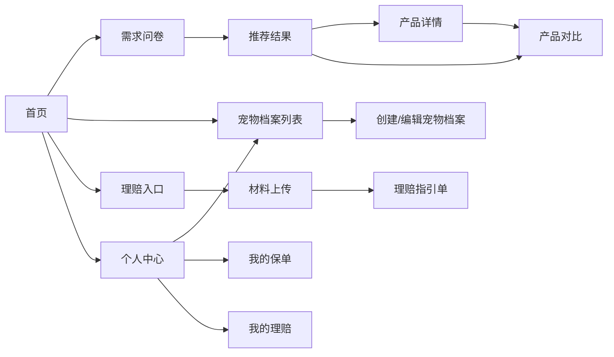
- 特殊交互：
  1. 首页下拉刷新：展示骨架屏加载效果
  2. 产品对比页：支持横向滚动对比，首列（维度名称）固定
  3. 照片上传：支持拍照和相册选择，上传中展示进度条，失败可重试
  4. 空状态：宠物档案为空时展示引导创建插画，无推荐结果时展示热门产品
  5. 加载态：页面加载使用骨架屏，接口请求使用Loading动画
  6. 错误态：接口失败展示重试按钮，网络断开展示离线提示

**产品原型：**

[📱 打开C端小程序端全站点原型](assets/prototypes/c-end-miniapp-prototype.html)

### 4.2.2 C端用户-H5端

H5端页面清单与小程序端基本一致，主要差异在登录页（手机号+验证码登录替代微信授权）。此处不重复列出。

**产品原型：**

[📱 打开C端H5端全站点原型](assets/prototypes/c-end-h5-prototype.html)

### 4.2.3 运营管理后台

**页面清单：**

| 序号 | 页面名称 | 所属模块 | 页面描述 | 关键元素 |
| --- | --- | --- | --- | --- |
| 1 | 数据概览页 | 数据统计 | 展示今日核心运营指标和趋势图 | 指标卡片、趋势图表、Top5排行榜 |
| 2 | 用户列表页 | 用户管理 | 展示注册用户列表，支持搜索筛选 | 用户表格、搜索框、筛选器、分页 |
| 3 | 用户详情页 | 用户管理 | 展示单个用户的完整信息和操作日志 | 基本信息、宠物列表、使用记录、操作日志 |
| 4 | 会员列表页 | 会员管理 | 展示付费会员列表和订阅状态 | 会员表格、状态筛选、续费记录 |
| 5 | 顾问列表页 | 顾问管理 | 管理专属保险顾问信息 | 顾问表格、服务能力标签、分配记录 |
| 6 | 系统设置页 | 系统管理 | 配置推荐算法参数和通知模板 | 参数表单、模板编辑器、预览 |

**交互说明：**
- 页面跳转关系：
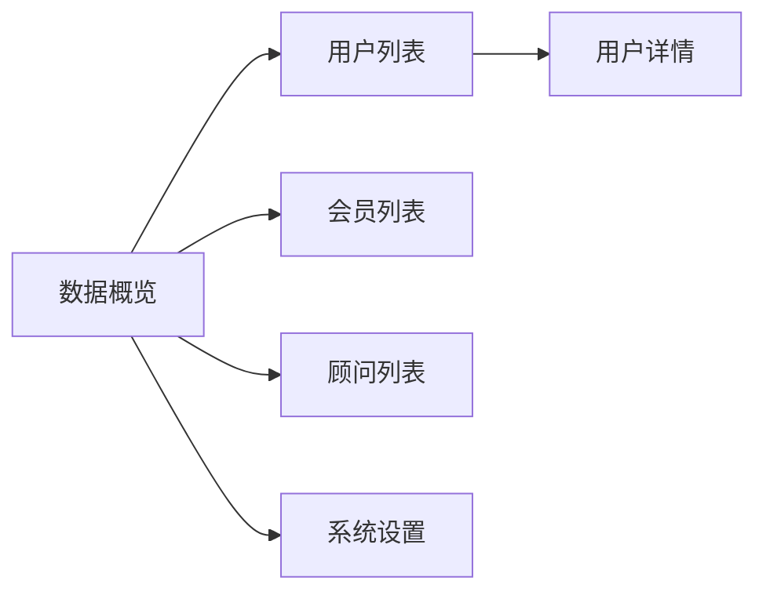
- 特殊交互：
  1. 表格支持列排序、筛选、分页
  2. 搜索框支持防抖（300ms）
  3. 数据图表支持时间范围切换
  4. 操作确认：封禁用户等敏感操作需二次确认弹窗

**产品原型：**

[🖥️ 打开运营管理后台全站点原型](assets/prototypes/admin-web-prototype.html)

### 4.2.4 产品管理后台

**页面清单：**

| 序号 | 页面名称 | 所属模块 | 页面描述 | 关键元素 |
| --- | --- | --- | --- | --- |
| 1 | 产品列表页 | 产品管理 | 展示所有保险产品，支持状态筛选 | 产品表格、状态标签、操作按钮 |
| 2 | 产品录入/编辑页 | 产品管理 | 分步录入产品基础信息、保障信息、保费规则、条款文件 | 步骤表单、富文本编辑器、文件上传 |
| 3 | 审核管理页 | 产品管理 | 审核待上架产品，查看变更历史 | 审核列表、对比视图、审核按钮 |

**交互说明：**
- 页面跳转关系：
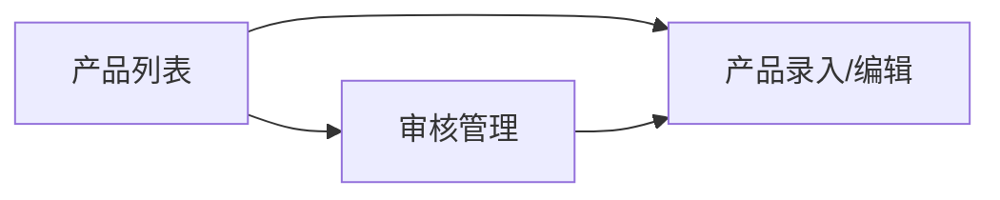
- 特殊交互：
  1. 产品录入为分步表单，支持暂存草稿
  2. 条款文件上传支持拖拽上传
  3. 审核视图支持新旧数据对比

**产品原型：**

[🖥️ 打开产品管理后台全站点原型](assets/prototypes/product-admin-web-prototype.html)

---

# 5 数据需求

## 5.1 数据使用规格

### 5.1.1 用户表（user）

| **字段** | **是否必填** | **描述** | **数据类型** |
| --- | --- | --- | --- |
| id | 是 | 用户唯一标识 | 字符串(UUID) |
| openid | 是 | 微信OpenID | 字符串 |
| unionid | 否 | 微信UnionID | 字符串 |
| nickname | 否 | 用户昵称 | 字符串 |
| avatar_url | 否 | 头像URL | 字符串 |
| phone | 否 | 手机号 | 字符串 |
| member_status | 是 | 会员状态：free/vip/expired | 字符串 |
| member_expire_at | 否 | 会员到期时间 | 日期时间 |
| status | 是 | 账户状态：active/banned | 字符串 |
| created_at | 是 | 注册时间 | 日期时间 |
| updated_at | 是 | 更新时间 | 日期时间 |

### 5.1.2 宠物档案表（pet）

| **字段** | **是否必填** | **描述** | **数据类型** |
| --- | --- | --- | --- |
| id | 是 | 宠物档案唯一标识 | 字符串(UUID) |
| user_id | 是 | 所属用户ID | 字符串(UUID) |
| name | 是 | 宠物名称 | 字符串 |
| species | 是 | 种类：cat/dog/other | 字符串 |
| breed | 是 | 品种 | 字符串 |
| gender | 是 | 性别：male/female/unknown | 字符串 |
| birthday | 否 | 精确生日 | 日期 |
| age_group | 是 | 年龄段：baby/adult/senior | 字符串 |
| weight | 否 | 体重(kg) | 数字 |
| is_neutered | 是 | 是否绝育 | 布尔 |
| photos | 否 | 照片URL列表 | JSON数组 |
| status | 是 | 状态：active/archived/deleted | 字符串 |
| created_at | 是 | 创建时间 | 日期时间 |
| updated_at | 是 | 更新时间 | 日期时间 |

### 5.1.3 保险产品表（insurance_product）

| **字段** | **是否必填** | **描述** | **数据类型** |
| --- | --- | --- | --- |
| id | 是 | 产品唯一标识 | 字符串(UUID) |
| name | 是 | 产品名称 | 字符串 |
| insurer_name | 是 | 保险公司名称 | 字符串 |
| product_type | 是 | 产品类型：outpatient/inpatient/surgery/accident/comprehensive | 字符串 |
| summary | 否 | 产品简介 | 字符串 |
| coverage_amount | 是 | 保额上限(元) | 数字 |
| deductible | 是 | 免赔额(元) | 数字 |
| reimbursement_ratio | 是 | 赔付比例(%) | 数字 |
| waiting_period | 是 | 等待期(天) | 数字 |
| claim_limit | 否 | 理赔次数限制 | 数字 |
| coverage_details | 是 | 保障范围详情 | JSON |
| exclusion_details | 是 | 免责条款详情 | JSON |
| premium_rules | 是 | 保费计算规则 | JSON |
| clause_file_url | 否 | 条款文件URL | 字符串 |
| status | 是 | 状态：pending_review/active/inactive/archived | 字符串 |
| created_at | 是 | 创建时间 | 日期时间 |
| updated_at | 是 | 更新时间 | 日期时间 |

### 5.1.4 理赔申请表（claim_application）

| **字段** | **是否必填** | **描述** | **数据类型** |
| --- | --- | --- | --- |
| id | 是 | 申请唯一标识 | 字符串(UUID) |
| user_id | 是 | 申请用户ID | 字符串(UUID) |
| pet_id | 是 | 宠物档案ID | 字符串(UUID) |
| product_id | 是 | 保险产品ID | 字符串(UUID) |
| claim_type | 是 | 理赔类型：outpatient/inpatient/surgery/death | 字符串 |
| status | 是 | 状态：draft/material_pending/material_incomplete/material_ready/advisor_reviewing/submitted/insurer_reviewing/success/rejected | 字符串 |
| materials | 是 | 上传材料列表 | JSON数组 |
| guide_sheet_url | 否 | 理赔指引单URL | 字符串 |
| created_at | 是 | 创建时间 | 日期时间 |
| updated_at | 是 | 更新时间 | 日期时间 |

## 5.2 统计数据

1. 统计每日产品对比次数、各产品被对比热度排名，按产品、按日维度统计（P0）
2. 统计每日产品详情页访问量、点击投保次数、投保转化率，按产品、按日维度统计（P0）
3. 统计注册用户数、日活用户数、付费会员数、付费转化率，按日维度统计（P1）
4. 统计理赔申请数量、完成率、平均处理时长，按理赔类型、按日维度统计（P1）

## 5.3 埋点需求

| 页面 | 事件 | 采集字段 | 说明 |
| --- | --- | --- | --- |
| 首页 | page_view | user_id, timestamp, source | 首页曝光，统计入口流量 |
| 首页 | product_card_click | user_id, product_id, position | 产品卡片点击，统计产品热度 |
| 需求问卷 | questionnaire_start | user_id, pet_id | 问卷开始填写 |
| 需求问卷 | questionnaire_submit | user_id, pet_id, answers, duration | 问卷提交，统计用户偏好分布 |
| AI推荐结果 | recommend_view | user_id, pet_id, recommend_list | 推荐结果页曝光 |
| AI推荐结果 | recommend_product_click | user_id, product_id, match_score | 推荐产品点击 |
| 产品对比 | compare_start | user_id, product_ids, pet_id | 对比发起，统计对比热度 |
| 产品对比 | compare_product_remove | user_id, product_id | 对比中移除产品 |
| 产品详情 | detail_view | user_id, product_id, pet_id | 详情页曝光 |
| 产品详情 | premium_calculate | user_id, product_id, pet_id, premium | 保费试算，统计试算转化率 |
| 产品详情 | insurance_click | user_id, product_id, pet_id | 点击投保，统计转化 |
| 理赔指引 | claim_start | user_id, pet_id, claim_type | 理赔申请发起 |
| 理赔指引 | material_upload | user_id, claim_id, material_type | 材料上传 |
| 理赔指引 | guide_sheet_view | user_id, claim_id | 理赔指引单查看 |
| 个人中心 | page_view | user_id, member_status | 个人中心曝光 |
| 全局 | share | user_id, page, share_target | 分享行为 |

---

# 6 非功能需求

## 6.1 性能需求

**6.1.1 延迟**

| 编号 | 项目 | 最大延迟 | 平均延迟 | 优先级 | 备注 |
| --- | --- | --- | --- | --- | --- |
| 0001 | 95%的页面首屏加载 | < 1.5秒 | < 1.0秒 | 高 | 含小程序和H5 |
| 0002 | 产品对比结果生成 | < 1.0秒 | < 0.5秒 | 高 |  |
| 0003 | AI推荐结果返回 | < 2.0秒 | < 1.5秒 | 高 |  |
| 0004 | 保费试算响应 | < 0.5秒 | < 0.3秒 | 高 |  |
| 0005 | 单张图片上传（4G网络） | < 3.0秒 | < 2.0秒 | 中 |  |
| 0006 | 材料完整性校验 | < 0.5秒 | < 0.3秒 | 中 |  |

**6.1.2 吞吐量**

| 编号 | 项 | 吞吐量 | 备注 |
| --- | --- | --- | --- |
| 0001 | 产品对比请求 | 每秒100次 |  |
| 0002 | AI推荐请求 | 每秒50次 |  |
| 0003 | 保费试算请求 | 每秒200次 |  |
| 0004 | 图片上传 | 每秒50次 |  |

**6.1.3 容量**

| 编号 | 项 | 容量 | 备注 |
| --- | --- | --- | --- |
| 0001 | 系统注册用户数 | <= 100,000 | MVP阶段 |
| 0002 | 日活用户数 | >= 10,000 | MVP阶段 |
| 0003 | 保险产品数量 | <= 500 |  |
| 0004 | 宠物档案数量 | <= 200,000 |  |

## 6.2 安全需求

| 编号 | 项（系统数据 / 处理过程） |
| --- | --- |
| 0001 | 宠物健康档案属于用户敏感信息，必须加密存储（AES-256），用户可随时删除自己的档案 |
| 0002 | 用户密码/Token等认证信息不得明文存储，使用bcrypt加密 |
| 0003 | API接口必须校验用户身份，防止越权访问 |
| 0004 | 用户上传的文件需进行病毒扫描和类型校验，防止恶意文件上传 |
| 0005 | 敏感操作（封禁用户、修改产品信息）需记录操作日志，支持审计 |
| 0006 | 会员订阅支付使用微信支付官方SDK，平台不保存用户支付敏感信息 |
| 0007 | 所有API通信使用HTTPS加密传输 |
| 0008 | 防止SQL注入、XSS攻击、CSRF攻击等常见Web安全威胁 |

## 6.3 可靠性

| 编号 | 项 | 值 |
| --- | --- | --- |
| 0001 | 核心服务（用户、产品、对比）正常运行可能性 | 99.9% |
| 0002 | 平均正常运行时间 | 约365天 |
| 0003 | 平均故障恢复时间 | < 30分钟 |

## 6.4 可连续性

| 编号 | 项 |
| --- | --- |
| Conti.1 | 系统需要 7 × 24 式的全天候运行 |
| Conti.2 | 计划内维护窗口：每月一次，凌晨2:00-4:00，提前24小时通知用户 |
| Conti.3 | 数据库采用主从架构，支持自动故障切换 |

## 6.5 可恢复性

| 编号 | 项 |
| --- | --- |
| Recov.1 | 数据库每日全量备份，保留30天；每小时增量备份 |
| Recov.2 | 用户上传文件（照片、条款）通过OSS存储，自动多副本冗余 |
| Recov.3 | 重大故障在1-3小时内恢复服务可用性，24-72小时内恢复历史数据 |

## 6.6 兼容性

| 编号 | 要求 | 备注 |
| --- | --- | --- |
| 0001 | 小程序：微信7.0及以上版本 |  |
| 0002 | H5：兼容Chrome、Safari、微信内置浏览器最近2个大版本 |  |
| 0003 | 管理后台：Chrome >= 90，Firefox >= 88，Edge >= 90 |  |
| 0004 | 移动端适配主流分辨率：375×667，390×844，414×896 |  |
| 0005 | 管理后台适配分辨率：1920×1080，1440×900 |  |

## 6.7 易用性

| 编号 | 要求 | 备注 |
| --- | --- | --- |
| 0001 | 核心操作路径（保险对比、理赔指引）不超过3步 |  |
| 0002 | 普通用户无需培训即可使用核心功能 |  |
| 0003 | 关键信息字号不小于14pt，适老化设计 |  |
| 0004 | 对比表支持横向滚动，首列固定 |  |
| 0005 | 空状态、加载态、错误态均有友好提示和引导操作 |  |
| 0006 | 产品名称展示必须标注"信息仅供参考，以保险机构官方条款为准"的免责声明 | 合规要求 |

---

# 7 总结

## 7.1 上线计划

| 阶段 | 时间 | 内容 | 负责人 |
| --- | --- | --- | --- |
| 开发阶段 | 2026-07-01 ~ 2026-07-10 | C端小程序/H5核心功能开发、运营后台开发 | 开发团队 |
| 测试阶段 | 2026-07-11 ~ 2026-07-15 | 功能测试、性能测试、安全测试、兼容性测试 | 测试团队 |
| 灰度阶段 | 2026-07-16 ~ 2026-07-20 | 灰度10%用户，验证稳定性和核心流程 | 运营团队 |
| 全量上线 | 2026-07-21 | 全量开放给所有用户 | 全团队 |

## 7.2 后续迭代规划

- **V1.1（第二期）**：宠物健康档案模块（疫苗/就诊/体检记录）、付费会员体系（¥15/月）、理赔协助服务（材料预审、进度跟踪）、消息通知（续保提醒、理赔进度）、差异高亮、深度对比
- **V1.2（第三期）**：宠物救助组织专属入口（批量管理）、AI健康风险预测、保险机构合作后台（数据看板、获客管理）、社区化内容（用户评价、理赔经验分享）
- **V1.3**：OCR识别服务（发票自动识别）、理赔指引单PDF导出、数据导出功能

## 7.3 参考文档

- [URS-宠物保险对比助手.md](../URS-宠物保险对比助手.md) - 用户需求说明书
- 微信开放平台文档：https://developers.weixin.qq.com/miniprogram/dev/framework/
- 微信支付文档：https://pay.weixin.qq.com/wiki/doc/apiv3/index.shtml

---

**文档说明**：本产品需求文档基于"优特云-用户语言"五层架构模板规范编写，以上游URS需求文档为依据，覆盖产品设计、功能描述、数据需求、非功能需求、上线计划等核心章节，可作为后续开发、测试、运营的依据。文档中所有原型文件均为独立HTML文件，可直接在浏览器中打开预览。
