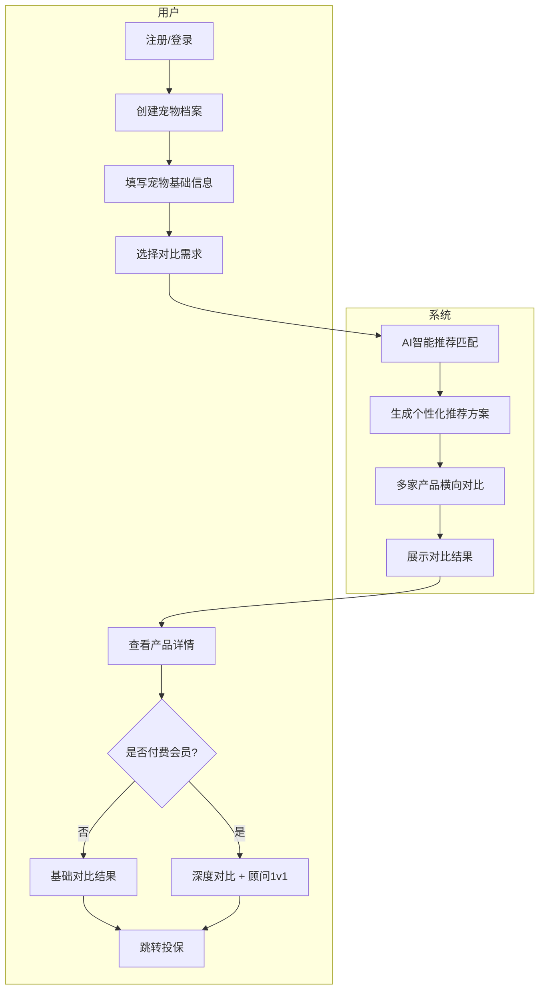
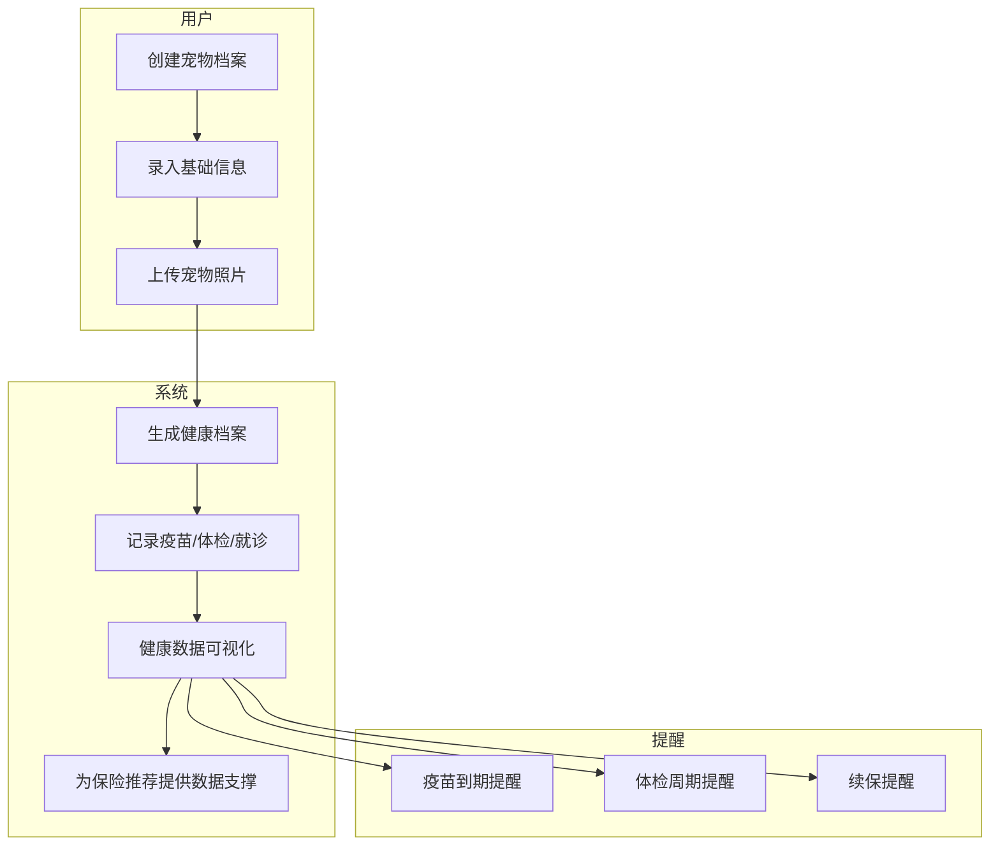
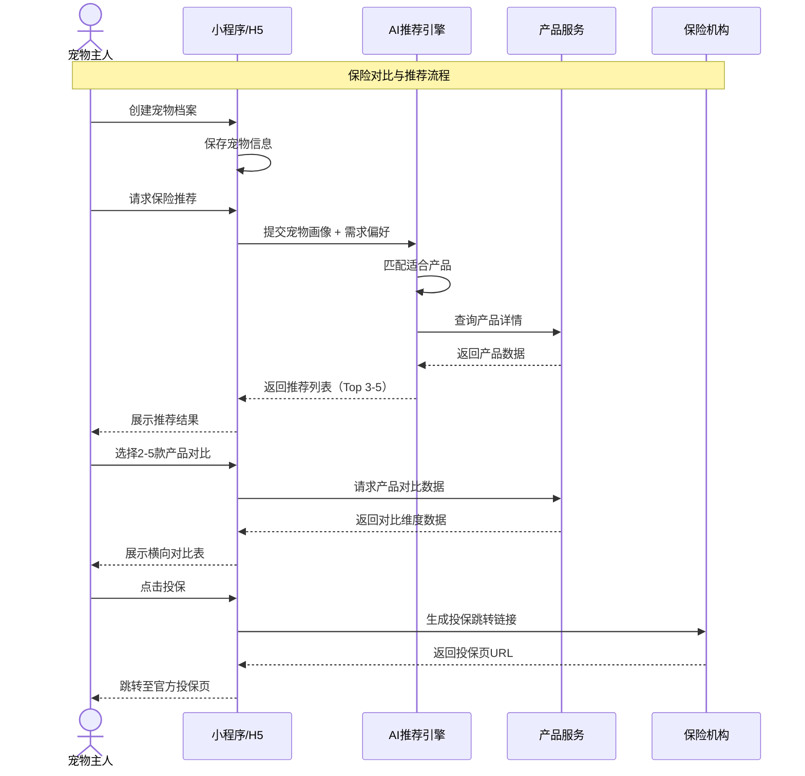
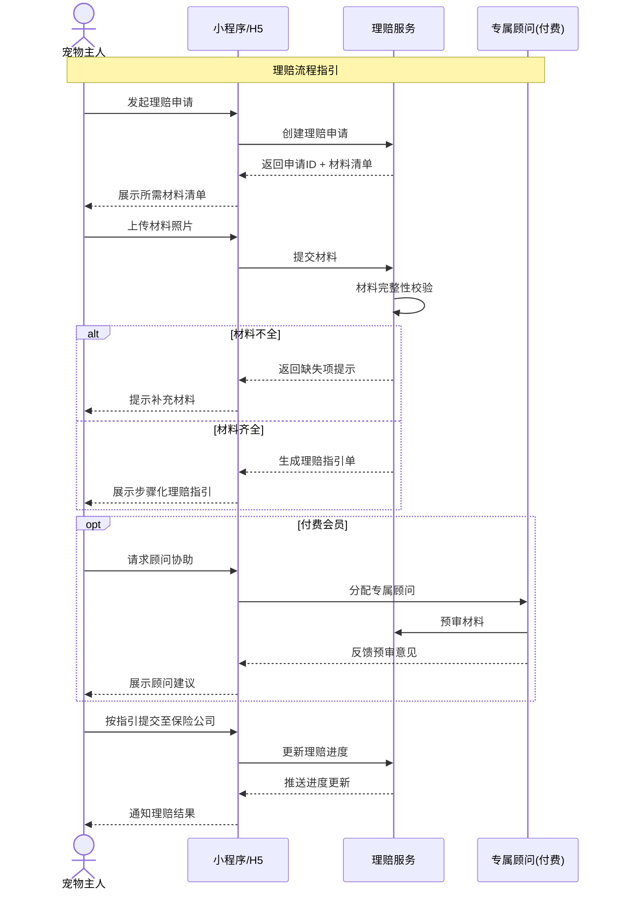
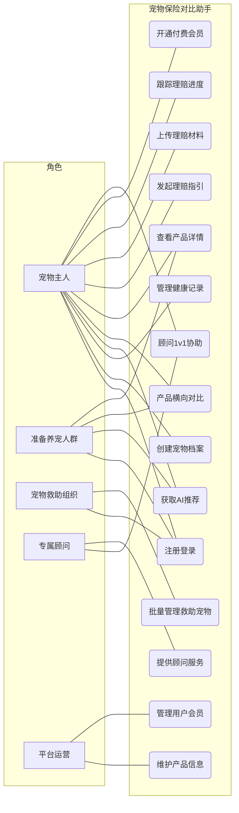
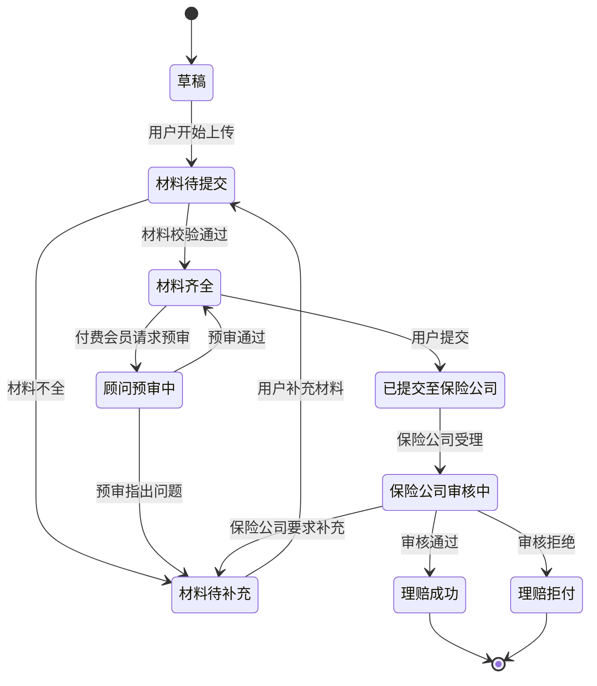
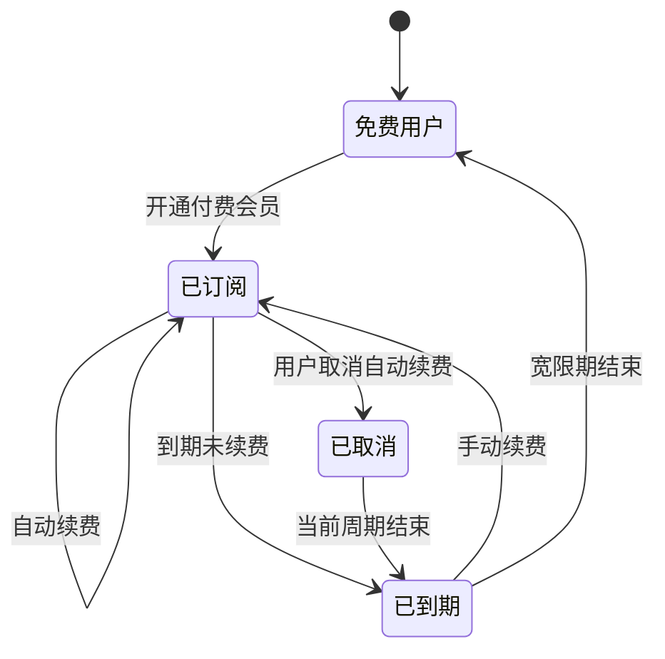
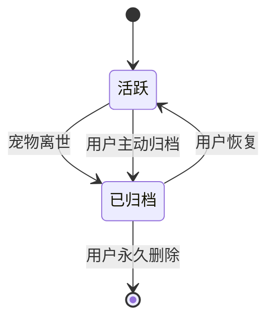

# 宠物保险对比助手 - 用户需求说明书

# 1.需求概述

宠物保险对比助手是面向宠物经济赛道的数字化保险服务平台，以"帮宠物主人选对保险、用好保险"为核心价值，连接宠物主人、保险机构、宠物医院、宠物救助组织等多方角色，实现保险方案智能推荐、多家产品横向对比、理赔流程全程指引、宠物健康档案管理的全流程数字化闭环。

## 1.1 需求介绍

宠物保险对比助手旨在解决宠物保险领域的三大痛点：
1. 宠物保险产品条款复杂、差异大，宠物主人难以快速识别适合自身宠物情况的最优方案
2. 理赔流程繁琐、材料要求多，宠物主人在理赔时经常因材料不全、流程不清而放弃或延迟理赔
3. 宠物健康档案分散、难以结构化沉淀，无法为保险推荐和理赔提供连续、完整的健康数据支撑

### 1.1.1 所属领域

宠物经济、保险科技、家庭消费服务

### 1.1.2 核心价值

- 对宠物主人：降低保险选择成本，提高理赔成功率，一站式管理宠物健康与保障
- 对准备养宠人群：在养宠前清晰了解保险配置方案，降低养宠意外风险
- 对宠物救助组织：批量管理被救助宠物的保险与医疗记录，提高救助效率
- 对保险机构：获得精准的获客渠道和用户画像，降低获客成本
- 对平台：通过"免费基础对比 + 付费深度服务"的商业模式获取订阅收入与增值服务收入

## 1.2 需求目标

### 1.2.1 第一期目标（MVP，5-7天）

完成核心对比与理赔辅助功能：

- 宠物保险对比助手 H5/小程序（C端用户）
- 保险产品信息录入与管理后台（WEB端）
- 基础AI推荐引擎（基于宠物画像的规则匹配）
- 多家保险产品的标准化对比
- 理赔流程指引（图文+步骤化）

### 1.2.2 第二期目标

扩展深度服务与档案能力：

- 宠物健康档案模块（疫苗、就诊、体检记录）
- 付费会员体系（¥15/月，深度对比 + 专属顾问）
- 理赔协助服务（材料预审、进度跟踪）
- 消息通知（续保提醒、理赔进度）

### 1.2.3 第三期目标

生态扩展与智能化：

- 宠物救助组织专属入口（批量管理）
- AI健康风险预测（基于档案的保险方案动态调整）
- 保险机构合作后台（数据看板、获客管理）
- 社区化内容（用户评价、理赔经验分享）

## 1.3 系统使用角色

1. **宠物主人（C端用户）**: 已养猫狗等宠物的个人用户，核心使用场景为保险对比、购买决策、理赔申请、健康档案管理
2. **准备养宠人群**: 尚未养宠但计划养宠的潜在用户，核心使用场景为养宠前的保险知识学习、基础保障规划
3. **宠物救助组织**: 从事宠物救助的公益组织或个人，核心使用场景为批量管理被救助宠物的保险与健康记录
4. **专属保险顾问（付费版）**: 平台付费会员的1对1服务人员，提供深度对比分析与理赔协助
5. **平台运营方**: 负责保险产品信息维护、用户管理、内容审核、会员体系运营
6. **保险机构合作方**: 提供保险产品数据、对接理赔接口的合作方（第三期）

## 1.4 业务流程图

### 1.4.1 保险对比与推荐核心业务流程



### 1.4.2 理赔流程指引业务流程

```mermaid
flowchart TD
    subgraph 用户
        A[宠物就诊] --> B[发起理赔申请]
        B --> C[填写理赔信息]
        C --> D[上传材料照片]
    end
    subgraph 系统
        D --> E[材料完整性校验]
        E --> F{材料是否齐全?}
        F -->|否| G[提示补充材料]
        G --> D
        F -->|是| H[生成理赔指引单]
        H --> I[步骤化理赔流程]
    end
    subgraph 用户
        I --> J[按指引提交至保险公司]
        J --> K[跟踪理赔进度]
        K --> L[理赔完成]
    end
    subgraph 付费服务
        I --> M{是否付费会员?}
        M -->|是| N[专属顾问协助预审]
        M -->|否| O[自助按指引提交]
        N --> J
        O --> J
```

### 1.4.3 宠物健康档案管理业务流程



# 2.功能原型

| 原型名称 | 原型链接 | 对应端 | 备注 |
| --- | --- | --- | --- |
| 宠物保险对比助手（C端用户） | 待设计 | 小程序端/H5端 | MVP阶段优先小程序 |
| 保险产品信息管理后台 | 待设计 | WEB端 | 运营维护保险产品库 |
| 运营管理后台 | 待设计 | WEB端 | 用户、会员、内容管理 |
| 宠物救助组织入口 | 待设计 | 小程序端/H5端 | 第三期 |
| 保险机构合作后台 | 待设计 | WEB端 | 第三期 |

# 3.需求清单

## 3.1 C端用户-小程序端/H5端

| 模块 | 一级功能 | 二级功能 | 功能描述 | 优先级 | 备注 |
| --- | --- | --- | --- | --- | --- |
| 用户账户 | 注册登录 | 微信授权登录 | 支持微信一键授权登录，获取用户基本信息 | P0 | MVP |
| | | 手机号绑定 | 绑定手机号用于接收理赔、续保等重要通知 | P0 | MVP |
| | 个人中心 | 个人资料管理 | 管理用户基本信息、收货地址、联系方式 | P0 | MVP |
| | | 会员状态 | 查看当前会员等级、到期时间、续费入口 | P1 | 第二期 |
| 宠物档案 | 创建宠物档案 | 基础信息录入 | 录入宠物名称、种类（猫/狗）、品种、年龄、性别、体重、是否绝育 | P0 | MVP |
| | | 照片上传 | 上传宠物正面照、侧面照，用于档案展示 | P0 | MVP |
| | | 多宠物管理 | 支持一个账号管理多只宠物 | P0 | MVP |
| | 健康记录 | 疫苗记录 | 记录疫苗接种时间、疫苗类型、接种机构 | P1 | 第二期 |
| | | 就诊记录 | 记录就诊时间、医院、诊断结果、治疗费用 | P1 | 第二期 |
| | | 体检报告 | 上传并管理宠物体检报告 | P1 | 第二期 |
| | 提醒服务 | 疫苗到期提醒 | 根据疫苗接种记录自动提醒下一次接种时间 | P2 | 第二期 |
| | | 续保提醒 | 保险到期前30/15/7天自动提醒续保 | P1 | 第二期 |
| | | 体检周期提醒 | 根据宠物年龄推荐体检周期并提醒 | P2 | 第二期 |
| 保险对比 | 智能推荐 | AI推荐入口 | 基于宠物档案（品种、年龄、健康状况）智能推荐适合的保险方案 | P0 | MVP |
| | | 需求问卷 | 通过3-5个问题快速了解用户保障需求偏好 | P0 | MVP |
| | | 推荐结果展示 | 按匹配度排序展示Top 3-5款推荐产品 | P0 | MVP |
| | 产品对比 | 多选对比 | 支持同时选择2-5款产品进行横向对比 | P0 | MVP |
| | | 对比维度 | 保障范围、免赔额、赔付比例、等待期、保费、理赔次数限制等核心维度 | P0 | MVP |
| | | 差异高亮 | 自动高亮对比产品间的关键差异项 | P1 | 第二期 |
| | | 深度对比（付费） | 付费会员可查看更细致的条款对比、历史理赔数据对比 | P1 | 第二期 |
| | 产品详情 | 保障详情 | 展示产品的完整保障范围、免责条款、赔付规则 | P0 | MVP |
| | | 保费试算 | 根据宠物信息实时试算保费 | P0 | MVP |
| | | 用户评价 | 查看其他宠物主人对该产品的评价与理赔体验 | P2 | 第三期 |
| | | 投保跳转 | 一键跳转至保险机构官方投保页面 | P0 | MVP |
| 理赔指引 | 理赔申请 | 理赔入口 | 从宠物档案或保单列表发起理赔申请 | P0 | MVP |
| | | 材料清单 | 根据理赔类型（门诊/住院/手术/死亡）展示所需材料清单 | P0 | MVP |
| | | 材料拍照上传 | 支持拍照上传、相册选择，自动OCR识别发票金额 | P1 | 第二期 |
| | | 材料完整性校验 | 实时检查材料是否齐全，缺失项明确提示 | P0 | MVP |
| | 理赔流程 | 步骤化指引 | 将理赔流程拆解为步骤（报案→提交材料→审核→赔付），逐步引导 | P0 | MVP |
| | | 理赔指引单 | 生成可保存/分享的理赔指引单（PDF/图片） | P1 | 第二期 |
| | | 进度跟踪 | 跟踪理赔各阶段状态，实时更新 | P1 | 第二期 |
| | 理赔协助（付费） | 专属顾问 | 付费会员可联系专属保险顾问1v1协助理赔 | P1 | 第二期 |
| | | 材料预审 | 顾问预审理赔材料，指出问题并指导补充 | P1 | 第二期 |
| 会员中心 | 会员开通 | 会员权益展示 | 清晰展示免费 vs 付费会员权益对比 | P1 | 第二期 |
| | | 订阅支付 | 支持微信支付按月订阅（¥15/月） | P1 | 第二期 |
| | | 自动续费管理 | 支持开启/关闭自动续费 | P1 | 第二期 |
| | 顾问服务 | 顾问分配 | 付费后分配专属保险顾问 | P1 | 第二期 |
| | | 顾问沟通 | 通过IM或电话与顾问沟通保险、理赔问题 | P1 | 第二期 |
| 宠物救助 | 批量管理 | 批量建档 | 救助组织可批量创建被救助宠物档案 | P2 | 第三期 |
| | | 保险统一管理 | 统一管理所有被救助宠物的保险状态 | P2 | 第三期 |

## 3.2 保险产品信息管理后台-WEB端

| 模块 | 一级功能 | 二级功能 | 功能描述 | 优先级 | 备注 |
| --- | --- | --- | --- | --- | --- |
| 产品管理 | 产品录入 | 基础信息录入 | 录入保险产品名称、保险公司、产品类型（门诊/住院/综合/意外） | P0 | MVP |
| | | 保障信息录入 | 录入保障范围、免赔额、赔付比例、等待期、保额上限 | P0 | MVP |
| | | 保费规则录入 | 录入保费计算规则（按品种/年龄/性别等维度） | P0 | MVP |
| | | 条款文件上传 | 上传产品条款PDF原文 | P0 | MVP |
| | 产品维护 | 产品上下架 | 控制产品在C端的展示状态 | P0 | MVP |
| | | 信息变更 | 修改产品信息，保留变更历史 | P0 | MVP |
| | | 对比维度配置 | 配置产品在对比表中展示的维度字段 | P1 | 第二期 |
| 内容管理 | 科普内容 | 保险知识文章 | 发布保险科普文章，帮助养宠人了解保险 | P2 | 第三期 |
| | | 理赔案例 | 发布典型理赔案例，辅助用户决策 | P2 | 第三期 |

## 3.3 运营管理后台-WEB端

| 模块 | 一级功能 | 二级功能 | 功能描述 | 优先级 | 备注 |
| --- | --- | --- | --- | --- | --- |
| 用户管理 | 用户列表 | 用户查询 | 查看注册用户列表，支持按手机号、宠物信息检索 | P0 | MVP |
| | | 用户详情 | 查看用户档案、宠物信息、使用记录 | P0 | MVP |
| | | 用户封禁 | 对违规用户进行封禁处理 | P1 | 第二期 |
| 会员管理 | 会员列表 | 会员状态查询 | 查看付费会员列表、订阅状态、到期时间 | P1 | 第二期 |
| | | 续费记录 | 查看会员续费流水 | P1 | 第二期 |
| 顾问管理 | 顾问列表 | 顾问信息维护 | 管理专属保险顾问的基本信息、服务能力 | P1 | 第二期 |
| | | 顾问分配 | 为付费会员分配/更换专属顾问 | P1 | 第二期 |
| | | 服务记录 | 查看顾问的服务记录与用户评价 | P2 | 第三期 |
| 数据统计 | 运营数据 | 用户增长 | 统计注册用户、活跃用户、付费转化率 | P1 | 第二期 |
| | | 对比数据 | 统计产品对比热度、点击投保转化率 | P0 | MVP |
| | | 理赔数据 | 统计理赔申请数量、完成率、用户满意度 | P1 | 第二期 |
| 系统管理 | 系统配置 | 推荐算法配置 | 配置AI推荐的权重参数、匹配规则 | P1 | 第二期 |
| | | 通知模板 | 配置续保提醒、理赔进度等通知模板 | P1 | 第二期 |

# 4.非功能需求

## 4.1 使用界面需求

| 需求项 | 详细描述 | 备注 |
| --- | --- | --- |
| 设计风格 | 温暖、专业、值得信赖，以宠物友好为设计基调，避免冷冰冰的金融感 | P0 |
| 主色调 | 建议使用温暖色系（如暖橙#FF8C42或清新绿#4CAF50），传递关怀与安心感 | P0 |
| 响应式设计 | 小程序/H5适配主流手机屏幕尺寸（iPhone SE ~ iPhone 15 Pro Max、主流Android机型） | P0 |
| 加载体验 | 对比结果页使用骨架屏，避免白屏等待 | P1 |
| 空状态 | 宠物档案为空、无对比记录、无理赔记录等场景需设计友好空状态，含引导操作 | P1 |
| 适老化 | 考虑中老年宠物主人的使用场景，关键信息字号不小于14pt，对比表支持横向滚动 | P2 |

## 4.2 软硬件环境需求

| 需求项 | 详细描述 | 备注 |
| --- | --- | --- |
| 客户端环境 | 微信小程序 + H5，支持iOS和Android | P0 |
| 微信版本 | 微信7.0及以上版本 | P0 |
| 浏览器兼容 | H5兼容Chrome、Safari、微信内置浏览器最近2个大版本 | P0 |
| 后端环境 | 云服务部署（推荐阿里云/腾讯云），支持弹性扩缩容 | P0 |
| 数据库 | MySQL + Redis，支持高可用 | P0 |

## 4.3 性能需求

| 需求项 | 详细描述 | 备注 |
| --- | --- | --- |
| 页面加载 | 95%的页面首屏加载 < 1.5秒 | P0 |
| 对比计算 | 产品对比结果生成 < 1.0秒 | P0 |
| AI推荐 | 推荐结果返回 < 2.0秒 | P0 |
| 保费试算 | 保费试算响应 < 0.5秒 | P0 |
| 图片上传 | 单张图片上传 < 3.0秒（4G网络环境） | P1 |
| 系统容量 | MVP阶段支持10万注册用户，1万日活 | P0 |
| 并发能力 | 支持每秒100次产品对比请求 | P0 |

## 4.4 约束性需求

| 需求项 | 详细描述 | 备注 |
| --- | --- | --- |
| 合规性 | 平台不得直接销售保险，仅作为信息对比与导流平台，投保必须跳转至保险机构官方页面 | P0 |
| 数据合规 | 宠物健康档案属于用户敏感信息，必须加密存储，用户可随时删除自己的档案 | P0 |
| 内容合规 | 产品信息展示必须标注"信息仅供参考，以保险机构官方条款为准"的免责声明 | P0 |
| 支付合规 | 会员订阅必须使用微信支付官方SDK，平台不保存用户支付敏感信息 | P0 |
| 数据准确性 | 保险产品信息必须经运营人工审核后上架，禁止自动抓取未经审核的第三方数据 | P0 |
| 后台服务 | 是，需要后台服务来支撑相关功能（产品信息管理、AI推荐、用户管理、会员体系） | P0 |
| 平台边界 | 平台不提供在线理赔款项发放功能，理赔款项由保险机构直接支付给用户 | P0 |
| 技术选型 | 小程序使用Taro/uni-app跨端框架，H5使用Vue3/React；后端使用Node.js/Go云原生架构 | P0 |

# 5.接口需求

## 5.1 硬件接口需求

本项目不涉及硬件接口需求。

## 5.2 软件接口需求

| 模块 | 接口名称 | 输入 | 输出 | 功能描述 |
| --- | --- | --- | --- | --- |
| 用户认证 | 微信登录 | 微信Code | 用户OpenID、UnionID、头像昵称 | 通过微信授权获取用户基本信息并登录 |
| | 手机号绑定 | 微信手机号授权数据 | 绑定结果 | 绑定用户手机号 |
| 宠物档案服务 | 创建宠物档案 | 宠物基础信息 | 档案ID | 创建宠物健康档案 |
| | 更新宠物档案 | 档案ID、更新字段 | 更新结果 | 更新宠物档案信息 |
| | 宠物档案列表 | 用户ID、分页 | 宠物列表 | 获取用户名下所有宠物档案 |
| | 健康记录录入 | 档案ID、记录类型、记录内容 | 录入结果 | 录入疫苗/就诊/体检记录 |
| | 健康记录查询 | 档案ID、记录类型、时间范围 | 记录列表 | 查询宠物健康记录 |
| 保险产品服务 | 产品列表 | 筛选条件、分页 | 产品列表 | 获取在售保险产品列表 |
| | 产品详情 | 产品ID | 产品详情 | 获取产品完整信息（保障、条款、保费规则） |
| | 保费试算 | 产品ID、宠物信息 | 保费金额 | 根据宠物信息实时计算保费 |
| | 产品对比 | 产品ID列表（2-5个）、宠物信息 | 对比结果 | 横向对比多款产品的核心维度 |
| AI推荐服务 | 智能推荐 | 宠物档案、用户需求偏好 | 推荐产品列表 | 基于宠物画像匹配推荐适合的保险方案 |
| | 需求问卷提交 | 问卷答案 | 推荐参数 | 通过问卷快速生成推荐参数 |
| 理赔指引服务 | 理赔申请创建 | 宠物档案ID、保单信息、理赔类型 | 申请ID | 创建理赔指引申请 |
| | 理赔材料清单 | 理赔类型、产品ID | 材料清单 | 获取该类理赔所需的材料清单 |
| | 材料上传 | 申请ID、材料类型、图片文件 | 上传结果 | 上传理赔材料照片 |
| | 材料完整性校验 | 申请ID | 校验结果 | 校验材料是否齐全并提示缺失项 |
| | 理赔进度查询 | 申请ID | 进度状态 | 查询理赔当前所处阶段 |
| 会员服务 | 会员状态查询 | 用户ID | 会员等级、到期时间 | 查询用户会员状态 |
| | 会员订阅 | 用户ID、订阅套餐 | 订阅结果 | 开通/续费付费会员 |
| | 自动续费管理 | 用户ID、开关状态 | 设置结果 | 开启/关闭自动续费 |
| 顾问服务 | 顾问分配 | 用户ID | 顾问信息 | 为付费会员分配专属顾问 |
| | 顾问沟通记录 | 会话ID、消息内容 | 发送结果 | 记录顾问与用户的沟通内容 |
| 通知服务 | 微信订阅消息 | 用户OpenID、模板ID、数据 | 推送结果 | 发送续保提醒、理赔进度等微信订阅消息 |
| | 短信通知 | 手机号、短信内容 | 发送结果 | 发送验证码、重要通知短信 |

## 5.4 通讯接口需求

| 模块 | 接口名称 | 输入 | 输出 | 功能描述 |
| --- | --- | --- | --- | --- |
| 第三方对接 | 保险机构产品数据同步 | 产品数据JSON | 同步结果 | 与合作保险机构同步产品数据（第二期） |
| | 保险机构投保跳转 | 产品ID、用户信息Token | 投保页面URL | 生成带参数的投保跳转链接 |
| | OCR识别服务 | 发票/单据图片 | 识别结果（金额、日期、项目） | 对上传的理赔材料进行OCR识别（第二期） |
| 消息推送 | 微信服务通知 | 消息模板、接收人、数据 | 推送结果 | 通过微信服务通知推送续保、理赔进度 |
| | 短信网关 | 手机号、短信模板、变量 | 发送结果 | 对接短信网关发送验证码和重要通知 |

# 6. 附录

## 流程图

详见1.4章节业务流程图

## 时序图

### 保险对比与推荐时序



### 理赔指引时序



## （用户与系统交互）用例图



## （系统）状态图

### 理赔申请生命周期状态图



### 会员订阅状态图



### 宠物档案状态图



---
**文档说明**: 本需求说明书基于"优特云-用户语言"五层架构模板规范编写，覆盖业务目标、用户画像、用户故事、功能需求、非功能需求、约束与假设、接口需求等核心章节，可作为后续产品设计（PRD）、UI原型、开发、测试的依据。
