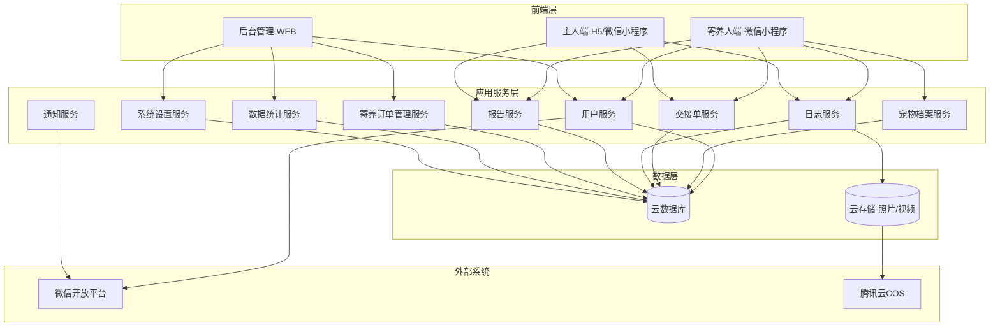
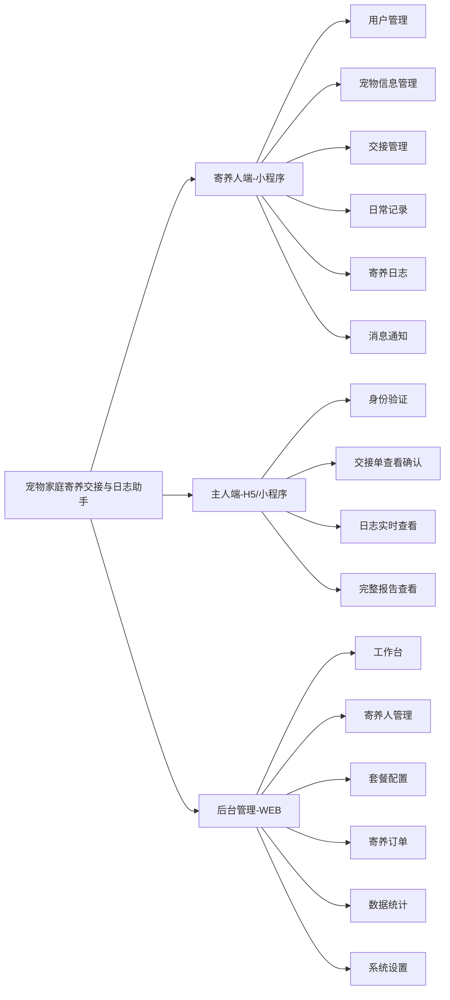
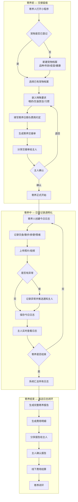
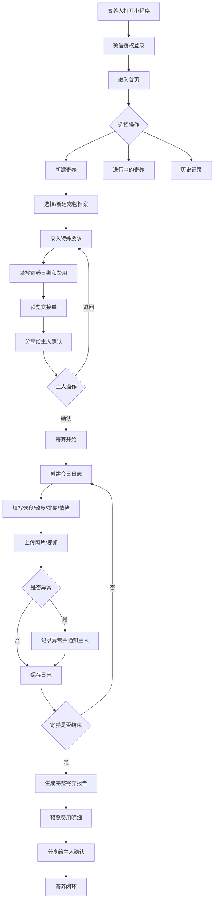
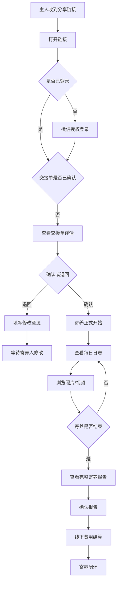
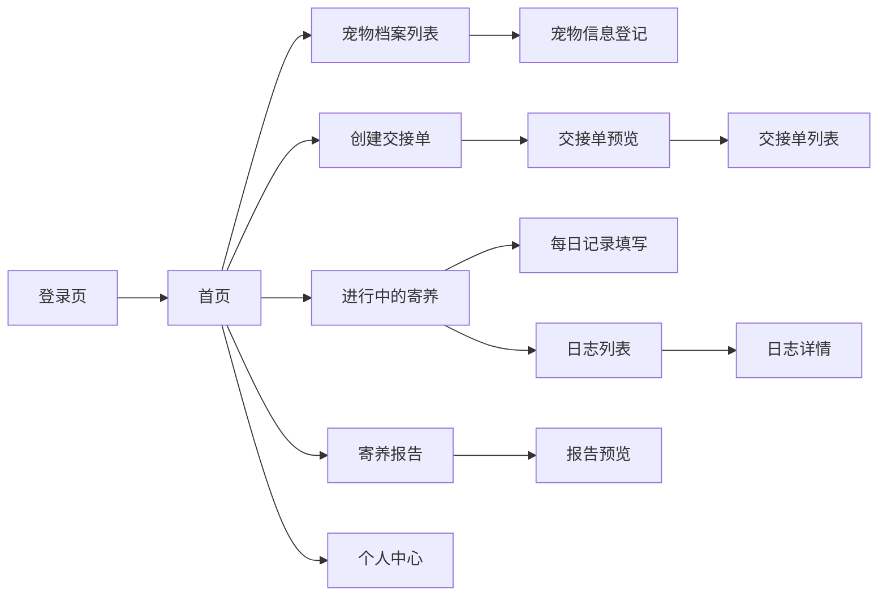
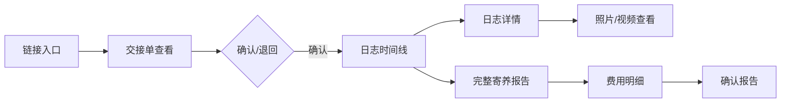

# 宠物家庭寄养交接与日志助手 V1.0 — 产品需求规格说明书（PRD）

---

## 变更历史

| 版本号 | 变更日期 | 变更内容 | 变更人 | 审核人 |
| --- | --- | --- | --- | --- |
| V1.0 | 2026-06-29 | 初始版本创建（基于已通过的需求文档 V1.0） | 产品文档结对写作专家 | 阶段一产品落地页文档总编辑 |
| V1.1 | 2026-06-29 | 根据用户反馈补齐后台管理范围：寄养订单、数据统计、系统设置，并将后台原型调整为真正单页后台应用 | 产品文档结对写作专家 | 阶段一产品落地页文档总编辑 |

---

# 1 概述

## 1.1 需求背景

家庭式宠物寄养（区别于门店寄养）近年来需求旺盛，尤其在节假日高峰期，大量兼职个人在自家承接宠物寄养服务。然而，当前家庭寄养普遍依赖微信口头沟通，宠物健康状况、饮食用药、日常表现等关键信息缺乏结构化记录和交接凭证，容易产生纠纷。

**核心痛点：**
- **交接无留痕**：宠物品种、疫苗、喂药、饮食禁忌等关键信息依赖口头传达，易遗漏引发事故
- **过程不透明**：主人无法实时了解宠物在寄养人家的饮食、情绪、健康状况，焦虑感强
- **离店无闭环**：寄养结束后缺乏完整记录，费用纠纷、宠物健康争议难以回溯

**业务价值：**
- 为家庭寄养人提供专业化工具，提升服务质量与信任度，形成差异化竞争力
- 为宠物主人提供透明化查看能力，降低焦虑，提升复购率
- 填补"家庭寄养"这一细分场景的市场空白，避开与宠物门店 SaaS 正面竞争

**预期目标：**
- MVP 7天上线核心链路：宠物信息登记 → 交接单生成确认 → 每日记录 → 主人端实时查看 → 完整寄养日志
- 首版支持 500 并发用户，覆盖寄养人端小程序 + 主人端 H5 + 后台管理 WEB 三端
- 免费版支持 3 只宠物，付费版（¥19/月）支持无限宠物 + 照片视频日志

## 1.2 名词解释

| **名词** | **说明** |
| --- | --- |
| 寄养人（Host） | 在自家提供宠物寄养服务的个人或家庭，通过小程序管理宠物信息、填写日志、生成报告 |
| 宠物主人（Owner） | 将宠物送养的用户，通过 H5/小程序查看寄养日志、确认交接单和最终报告 |
| 寄养交接单 | 宠物送养时由寄养人生成的结构化文档，包含宠物信息、健康状况、特殊要求、费用约定等，需主人确认后寄养正式开始 |
| 寄养日志 | 寄养期间寄养人每日记录宠物饮食、散步、排便、情绪、照片等内容的日志，主人可实时查看 |
| 寄养报告 | 寄养结束时系统自动汇总所有日志、照片、费用生成的完整报告，供主人回顾确认 |
| 宠物档案 | 宠物的结构化信息库，包含品种、年龄、疫苗、过敏史、生活习惯等，可跨寄养复用 |
| 特殊要求 | 主人对宠物的特别照护说明，如喂药、饮食禁忌、忌讳事项等 |
| MVP | Minimum Viable Product，最小可行产品，本系统 MVP 约束为 7 天开发周期 |

## 1.3 产品介绍

宠物家庭寄养交接与日志助手是一款面向家庭式宠物寄养场景的轻量级工具，聚焦"交接留痕 + 日常记录透明化 + 主人端实时查看"三大核心价值。

**目标用户：**
- 寄养人：在自家提供宠物寄养服务的个人或家庭（多为兼职个人）
- 宠物主人：将宠物送养的用户，希望透明了解宠物寄养状况

**核心使用场景：**
1. 宠物送养时，寄养人登记宠物信息并生成结构化交接单，主人确认后寄养正式开始
2. 寄养期间，寄养人每日记录宠物饮食、散步、排便、情绪及照片，主人实时查看
3. 寄养结束时，系统自动生成完整寄养报告（含照片、日志汇总、费用明细），供主人回顾确认

**产品核心价值：**
- 交接有凭证：结构化交接单替代口头沟通，关键信息零遗漏
- 过程可追溯：每日日志 + 照片视频，主人随时了解宠物近况
- 离店有闭环：完整寄养报告 + 费用明细，服务有始有终

### 1.3.1 范围说明

| 项 | 内容 |
| --- | --- |
| 包含功能 | 宠物信息登记、寄养交接单生成与确认、每日记录（饮食/散步/排便/情绪/照片）、主人端实时日志查看、完整寄养日志报告生成、后台管理（工作台、寄养人管理、套餐配置、寄养订单、数据统计、系统设置） |
| 不包含功能 | 宠物门店管理（收银、会员、多员工管理）、在线支付（仅做费用记录，线下结算）、宠物在线问诊/医疗健康监测、多语言支持、宠物商品电商 |

---

# 2 产品设计

## 2.1 系统架构图

## 2.2 业务模块图

## 2.3 主业务流程

## 2.4 功能图/列表

### 2.4.1 寄养人端-小程序功能列表

| 功能模块 | 功能名称 | 优先级 | 功能描述 |
| --- | --- | --- | --- |
| 用户管理 | 微信授权登录 | P0 | 寄养人通过微信授权快速登录 |
| 用户管理 | 寄养人信息维护 | P0 | 维护姓名、联系方式、寄养地址、家庭环境照片 |
| 宠物信息管理 | 宠物基本信息登记 | P0 | 登记品种、名字、年龄、性别、体重、毛色 |
| 宠物信息管理 | 健康状况登记 | P0 | 疫苗情况、绝育状态、过敏史、既往病史 |
| 宠物信息管理 | 主人特殊要求录入 | P0 | 喂药说明、饮食禁忌、生活习惯、忌讳事项 |
| 宠物信息管理 | 宠物照片上传 | P0 | 上传宠物照片作为识别依据 |
| 宠物信息管理 | 历史宠物列表 | P0 | 查看已登记宠物列表，支持复用 |
| 交接管理 | 创建寄养交接单 | P0 | 选择宠物档案，填写寄养日期、费用约定，生成交接单 |
| 交接管理 | 交接单内容预览 | P0 | 发送前预览交接单完整内容 |
| 交接管理 | 交接单状态跟踪 | P0 | 查看待确认/已确认/已退回状态 |
| 交接管理 | 交接单修改重发 | P0 | 退回后可修改并重新发送 |
| 日常记录 | 创建今日记录 | P0 | 每日创建宠物日志记录 |
| 日常记录 | 饮食记录 | P0 | 记录喂食时间、食物种类、食量、饮水量 |
| 日常记录 | 散步记录 | P0 | 记录散步时间、时长、散步表现 |
| 日常记录 | 排便记录 | P0 | 记录排便次数、便便状态 |
| 日常记录 | 情绪状态记录 | P0 | 记录开心/正常/紧张/低落等情绪 |
| 日常记录 | 照片/视频上传 | P0 | 上传当日宠物照片或短视频 |
| 日常记录 | 异常情况记录 | P0 | 记录异常表现，自动推送通知主人 |
| 日常记录 | 历史记录查看 | P0 | 按日期浏览本次寄养所有历史记录 |
| 日常记录 | 日志编辑修改 | P1 | 对已提交日志进行补充修改 |
| 寄养日志 | 完整寄养日志生成 | P0 | 寄养结束自动汇总生成完整报告 |
| 寄养日志 | 费用明细生成 | P0 | 根据约定生成费用明细 |
| 寄养日志 | 日志报告分享 | P0 | 通过微信分享给主人确认 |
| 寄养日志 | 历史寄养日志查看 | P0 | 查看已完成的所有寄养记录 |
| 消息通知 | 交接单状态通知 | P0 | 接收交接单确认/退回通知 |

### 2.4.2 主人端-H5/小程序功能列表

| 功能模块 | 功能名称 | 优先级 | 功能描述 |
| --- | --- | --- | --- |
| 用户访问 | 链接/二维码访问 | P0 | 通过分享链接或二维码进入查看页面 |
| 用户访问 | 微信授权登录 | P0 | 授权登录后绑定关联的寄养记录 |
| 交接单 | 交接单详情查看 | P0 | 查看宠物信息、健康状况、特殊要求、费用约定 |
| 交接单 | 交接单确认 | P0 | 确认交接单内容无误 |
| 交接单 | 交接单退回 | P0 | 退回并备注修改意见 |
| 日志查看 | 每日日志浏览 | P0 | 实时查看每日日志（饮食/散步/排便/情绪） |
| 日志查看 | 照片/视频查看 | P0 | 查看寄养人上传的照片和视频 |
| 日志查看 | 异常情况查看 | P0 | 查看异常记录，及时沟通 |
| 日志查看 | 寄养结束日志查看 | P0 | 查看完整寄养报告 |
| 日志查看 | 费用明细查看 | P0 | 查看本次寄养费用明细 |
| 日志查看 | 日志确认与评价 | P1 | 确认日志并评价服务 |

### 2.4.3 后台管理-WEB功能列表

| 功能模块 | 功能名称 | 优先级 | 功能描述 |
| --- | --- | --- | --- |
| 后台工作台 | 运营概览 | P0 | 展示注册寄养人、寄养订单、进行中寄养、活跃寄养人等核心指标 |
| 用户管理 | 寄养人列表查看 | P0 | 查看已注册寄养人列表及基本信息，支持搜索、筛选、禁用/启用 |
| 用户管理 | 寄养人详情查看 | P0 | 查看寄养人资料、历史寄养订单、评分、套餐状态 |
| 套餐管理 | 套餐配置 | P0 | 配置免费版/家庭寄养版权益、价格与生效规则 |
| 寄养订单 | 订单列表查询 | P0 | 按状态、时间、寄养人、宠物主人检索寄养订单 |
| 寄养订单 | 订单详情查看 | P0 | 查看交接单、每日记录、费用明细、状态流转与异常记录 |
| 寄养订单 | 异常订单标记 | P0 | 对异常记录、纠纷备注、用户投诉进行运营标记与跟进 |
| 数据统计 | 运营数据看板 | P0 | 统计订单量、活跃寄养人、日志提交率、套餐转化等指标 |
| 数据统计 | 数据筛选导出 | P1 | 支持按时间范围、套餐、订单状态筛选并导出运营数据 |
| 系统设置 | 基础参数配置 | P0 | 配置订单状态、异常类型、费用项、文件上传限制等基础参数 |
| 系统设置 | 消息模板配置 | P0 | 配置交接单确认、异常提醒、日志更新等通知模板 |
| 系统设置 | 管理员与权限 | P1 | 管理后台账号、角色权限与操作日志 |

## 2.5 你的产品有哪些端

| 序号 | 端名称 | 端类型 | 目标用户 | 说明 |
| --- | --- | --- | --- | --- |
| 1 | 寄养人端 | 小程序端 | 家庭寄养人 | 寄养人在微信中使用，负责宠物登记、日常记录、日志生成 |
| 2 | 主人端 | 小程序端 | 宠物主人 | 主人通过微信分享链接进入 H5 或小程序，查看日志、确认交接单 |
| 3 | 后台管理 | WEB端 | 平台运营人员 | 运营在浏览器中管理平台，负责工作台概览、寄养人管理、套餐配置、寄养订单、数据统计与系统设置 |

---

# 3 产品功能

> 本章节按端划分功能需求。共 3 个端：寄养人端（小程序）、主人端（H5/小程序）、后台管理（WEB）。

## 3.1 寄养人端-小程序功能

### 3.1.1 功能描述

寄养人端是家庭寄养人的核心工作工具，覆盖从宠物信息登记、交接单生成、每日记录填写到完整日志报告生成的全链路。设计原则：操作极简、大按钮、高对比度，支持单手操作场景（寄养人可能一边照顾宠物一边操作）。

### 3.1.2 功能详细

#### 3.1.2.1 微信授权登录

**功能描述：** 寄养人通过微信授权快速登录小程序，无需注册流程，首次登录自动创建账户并引导完善基本信息。

| 项 | 内容 |
| --- | --- |
| 优先级 | P0 |
| 依赖需求 | 微信开放平台登录接口 |
| 前置条件 | 用户已安装微信 |

**业务规则：**
1. 首次授权自动创建账户，进入资料完善引导页
2. 非首次授权直接进入首页
3. 授权失败提示用户重试，不阻塞浏览

**验收标准：**
- [ ] 点击"微信登录"按钮后 2 秒内完成授权跳转
- [ ] 首次登录自动跳转资料完善页
- [ ] 登录态有效期 30 天，过期后需重新授权

#### 3.1.2.2 宠物信息登记

**功能描述：** 寄养人为本次寄养的宠物建立完整档案，包括基本信息（品种、名字、年龄、性别、体重、毛色）、健康状况（疫苗、绝育、过敏史、既往病史）、主人特殊要求（喂药、饮食禁忌、习惯）和宠物照片。

| 项 | 内容 |
| --- | --- |
| 优先级 | P0 |
| 依赖需求 | 无 |
| 前置条件 | 寄养人已登录 |

**业务规则：**
1. 品种、名字、年龄、性别为必填项
2. 健康状况中"过敏史"和"既往病史"若无则填"无"，不允许留空
3. 特殊要求为本次寄养的核心差异化内容，填写区域需突出展示
4. 照片至少上传 1 张，最多 9 张，单张不超过 10MB
5. 可从历史宠物档案中选择复用，复用后仍可修改本次特有信息
6. 信息保存支持"暂存"（弱网环境下本地缓存，联网后自动同步）

**验收标准：**
- [ ] 填写完整宠物信息后保存成功，所有字段持久化
- [ ] 从历史档案选择复用时，自动填充已有信息
- [ ] 弱网环境下可暂存，恢复网络后自动同步
- [ ] 照片上传支持压缩，上传后缩略图可预览

**主要原型：**
[宠物信息登记原型](assets/prototypes/host-app/pet-info-register-widget.html)

#### 3.1.2.3 寄养交接单生成与确认

**功能描述：** 寄养人选择已登记的宠物档案，填写本次寄养的预计起止日期和费用约定，系统自动生成结构化交接单。寄养人预览确认后将交接单分享给主人，主人确认后寄养正式开始。

| 项 | 内容 |
| --- | --- |
| 优先级 | P0 |
| 依赖需求 | 宠物信息登记 |
| 前置条件 | 至少有一个宠物档案 |

**业务规则：**
1. 交接单自动生成，内容包括：宠物信息摘要 + 健康状况 + 特殊要求 + 寄养日期 + 费用约定
2. 寄养人发送前可预览完整内容，确认无误后再发送
3. 交接单状态流转：草稿 → 待确认 → 已确认/已退回 → （已退回可修改重发）
4. 主人退回时附备注修改意见，寄养人可查看并修改后重发
5. 主人确认后，寄养人收到微信订阅消息通知
6. 交接单确认后不可修改（如需变更须创建新交接单）

**验收标准：**
- [ ] 选择宠物档案后自动填充信息，30 秒内完成交接单生成
- [ ] 预览页展示内容与最终交接单一致
- [ ] 分享链接在微信中可正常打开
- [ ] 主人确认后寄养人 30 秒内收到通知

**主要原型：**
[交接单生成原型](assets/prototypes/host-app/handover-form-widget.html)

#### 3.1.2.4 每日记录填写

**功能描述：** 寄养期间每日为寄养宠物填写日志，涵盖饮食（喂食时间、食物种类、食量、饮水量）、散步（时间、时长、表现）、排便（次数、状态）、情绪（开心/正常/紧张/低落）、照片/视频上传，以及异常情况记录。

| 项 | 内容 |
| --- | --- |
| 优先级 | P0 |
| 依赖需求 | 交接单已确认 |
| 前置条件 | 有进行中的寄养记录 |

**业务规则：**
1. 每日可创建多条记录（建议至少 1 条），每条记录对应一个时间段
2. 饮食、散步、排便、情绪为核心必填维度
3. 照片/视频至少上传 1 张，支持多张（最多 20 张）和短视频（最长 60 秒）
4. 异常情况为选填，但一旦标记为异常，系统自动推送通知给主人
5. 已提交的日志可在 24 小时内编辑修改
6. 支持本地暂存，弱网环境下不丢失数据
7. 系统每日 20:00 提醒未填写日志的寄养人

**验收标准：**
- [ ] 填写完整日志后保存成功，主人端 30 秒内可查看
- [ ] 异常记录触发通知推送，主人端实时收到
- [ ] 照片/视频上传显示进度，支持断点续传
- [ ] 历史日志按日期倒序展示，可点击查看详情

**主要原型：**
[每日记录填写原型](assets/prototypes/host-app/daily-log-widget.html)

#### 3.1.2.5 完整寄养日志报告生成

**功能描述：** 寄养结束时，系统自动汇总所有每日记录、照片、费用明细，生成完整的寄养日志报告。寄养人预览后可通过微信分享给主人确认。

| 项 | 内容 |
| --- | --- |
| 优先级 | P0 |
| 依赖需求 | 每日记录 |
| 前置条件 | 寄养日期已到或寄养人手动结束寄养 |

**业务规则：**
1. 报告自动生成，内容包括：寄养概览（起止日期、总天数）、每日记录汇总（饮食/散步/排便/情绪统计）、精选照片集、费用明细（寄养费、加餐费、其他费用）、寄养人寄语
2. 费用明细根据交接单中的费用约定自动计算，寄养人可手动调整
3. 寄养人可预览报告内容，确认无误后分享
4. 分享后主人收到通知，可查看并确认报告
5. 主人确认后，寄养记录状态变为"已完成"

**验收标准：**
- [ ] 报告在寄养结束后 10 秒内自动生成
- [ ] 报告内容完整，包含所有每日记录和照片
- [ ] 费用明细自动计算准确
- [ ] 分享链接在微信中可正常打开，主人可查看

**主要原型：**
[寄养报告原型](assets/prototypes/host-app/boarding-report-widget.html)

#### 3.1.2.6 交接单状态跟踪

**功能描述：** 寄养人可查看已发送交接单的状态（待确认/已确认/已退回），退回的交接单可查看主人的修改意见并修改重发。

| 项 | 内容 |
| --- | --- |
| 优先级 | P0 |
| 依赖需求 | 交接单生成 |
| 前置条件 | 已创建并发送交接单 |

**业务规则：**
1. 交接单列表按时间倒序展示，显示宠物名、状态、创建时间
2. 待确认状态：显示"等待主人确认中"
3. 已退回状态：显示退回原因，提供"修改重发"入口
4. 已确认状态：显示"寄养已开始"，提供"开始填写日志"入口

#### 3.1.2.7 消息通知

**功能描述：** 通过微信订阅消息向寄养人推送关键事件通知，包括交接单状态变更（确认/退回）、主人发来的消息等。

| 项 | 内容 |
| --- | --- |
| 优先级 | P0（交接单通知）/ P1（主人消息） |
| 依赖需求 | 微信订阅消息接口 |
| 前置条件 | 用户已授权订阅消息 |

**业务规则：**
1. 交接单状态变更通知为 P0，必须实时推送
2. 主人消息通知为 P1，可延后实现
3. 通知内容包含事件类型、宠物名称、简要描述
4. 点击通知可直接跳转到对应页面

### 3.1.3 功能详细流程

---

## 3.2 主人端-H5/小程序功能

### 3.2.1 功能描述

主人端是宠物主人查看寄养情况的核心入口，通过寄养人分享的链接或二维码进入。设计原则：温馨亲切，突出照片展示，日志时间线清晰，便于快速浏览宠物近况。

### 3.2.2 功能详细

#### 3.2.2.1 交接单查看与确认

**功能描述：** 主人通过寄养人分享的链接进入交接单页面，查看宠物信息、健康状况、特殊要求、费用约定等完整内容，可确认或退回并备注修改意见。

| 项 | 内容 |
| --- | --- |
| 优先级 | P0 |
| 依赖需求 | 寄养人已生成交接单 |
| 前置条件 | 收到寄养人分享的链接 |

**业务规则：**
1. 链接包含唯一标识，打开后自动定位到对应交接单
2. 未登录用户可查看交接单内容，但确认/退回操作需微信授权登录
3. 确认操作不可撤销，需二次确认弹窗
4. 退回时必须填写修改意见（不少于 10 字）
5. 页面底部展示寄养人信息（姓名、联系方式、寄养地址）

**验收标准：**
- [ ] 链接打开后 2 秒内加载完成
- [ ] 交接单内容展示完整，与寄养人预览一致
- [ ] 确认操作需二次确认，防止误操作
- [ ] 退回后寄养人实时收到通知

**主要原型：**
[主人端交接单查看原型](assets/prototypes/owner-h5/handover-view-widget.html)

#### 3.2.2.2 每日日志实时查看

**功能描述：** 主人实时查看寄养人记录的每日日志，以时间线形式展示饮食、散步、排便、情绪等维度信息，以及照片/视频。

| 项 | 内容 |
| --- | --- |
| 优先级 | P0 |
| 依赖需求 | 寄养人已填写日志 |
| 前置条件 | 交接单已确认 |

**业务规则：**
1. 日志按日期倒序展示，最新日志在最上方
2. 每条日志以时间线卡片形式呈现，包含日期、各维度记录、照片/视频
3. 照片支持点击放大查看，视频支持在线播放
4. 异常记录以红色高亮展示，置顶提醒
5. 支持下拉刷新获取最新日志

**验收标准：**
- [ ] 寄养人保存日志后 30 秒内主人端可查看
- [ ] 照片点击后 1 秒内放大展示
- [ ] 异常记录醒目提示
- [ ] 时间线展示清晰，可快速定位某日记录

**主要原型：**
[主人端日志查看原型](assets/prototypes/owner-h5/daily-log-view-widget.html)

#### 3.2.2.3 完整寄养报告查看

**功能描述：** 寄养结束后，主人查看系统生成的完整寄养报告，包含寄养概览、每日记录汇总、精选照片集、费用明细，可确认报告并对服务评价。

| 项 | 内容 |
| --- | --- |
| 优先级 | P0 |
| 依赖需求 | 寄养人已生成报告 |
| 前置条件 | 寄养已结束 |

**业务规则：**
1. 报告以长页面形式展示，可上下滚动浏览
2. 顶部展示寄养概览（起止日期、总天数、寄养人寄语）
3. 中部展示每日记录汇总统计（图表+文字）
4. 照片集以瀑布流形式展示
5. 底部展示费用明细
6. 确认操作不可撤销，需二次确认
7. 评价功能为 P1，可延后实现

**验收标准：**
- [ ] 报告加载后内容完整展示
- [ ] 费用明细与交接单约定一致
- [ ] 照片集加载流畅，支持缩略图+点击放大
- [ ] 确认后寄养人实时收到通知

### 3.2.3 功能详细流程

---

## 3.3 后台管理-WEB功能

### 3.3.1 功能描述

后台管理为平台运营人员提供平台运营与配置管理能力。MVP 阶段需覆盖工作台概览、寄养人管理、套餐配置、寄养订单、数据统计、系统设置六个模块，支持运营人员在一个单页后台应用内完成查询、筛选、配置、跟进与导出。设计原则：简洁高效、信息密度适中、左侧导航切换内容区、重要数据一屏可见。

### 3.3.2 功能详细

#### 3.3.2.1 寄养人管理

**功能描述：** 查看已注册的寄养人列表，了解寄养人基本信息、寄养订单数量、账户状态等。

| 项 | 内容 |
| --- | --- |
| 优先级 | P0 |
| 依赖需求 | 用户服务 |
| 前置条件 | 管理员已登录 |

**业务规则：**
1. 列表展示寄养人姓名、联系方式、注册时间、寄养订单数、账户状态
2. 支持按注册时间、订单数排序
3. 支持按姓名、手机号搜索
4. 可查看寄养人详情（基本信息、历史寄养记录、评价）
5. 可禁用/启用寄养人账户

#### 3.3.2.2 套餐配置

**功能描述：** 配置免费版和家庭寄养版的权益，包括宠物数量上限、功能权限、价格、续费规则等。

| 项 | 内容 |
| --- | --- |
| 优先级 | P0 |
| 依赖需求 | 用户服务、套餐权益校验 |
| 前置条件 | 管理员已登录 |

**业务规则：**
1. 默认两套套餐：免费版（3 只宠物上限、基础日志）、家庭寄养版（¥19/月，不限宠物、照片视频日志、主人端小程序、自动费用结算）
2. 可编辑套餐名称、价格、权益项、启用状态
3. 套餐变更实时生效，已订阅用户不受影响（下次续费时适用新套餐）
4. 权益项变更需记录操作人、操作时间和变更前后内容

#### 3.3.2.3 寄养订单管理

**功能描述：** 平台运营人员查看和跟进全部寄养订单，支持按订单状态、时间范围、寄养人、宠物主人、异常标记进行筛选，查看订单详情、交接单、每日记录、费用明细和状态流转。

| 项 | 内容 |
| --- | --- |
| 优先级 | P0 |
| 依赖需求 | 交接单服务、日志服务、报告服务 |
| 前置条件 | 管理员已登录 |

**业务规则：**
1. 订单状态包括：待确认、寄养中、待确认报告、已完成、已取消、异常跟进
2. 列表字段包括：订单号、宠物、寄养人、宠物主人、寄养日期、订单状态、费用、异常标记、最近更新时间
3. 订单详情需展示交接单内容、每日记录概览、费用明细、状态流转时间线
4. 出现异常日志、主人退回、投诉备注时，订单自动带有异常标记
5. 运营人员可添加内部跟进备注，备注仅后台可见

**验收标准：**
- [ ] 后台订单列表可按状态、时间范围、关键词筛选
- [ ] 点击订单可查看完整详情与状态时间线
- [ ] 异常订单有明显标识，支持运营备注

#### 3.3.2.4 数据统计

**功能描述：** 提供平台运营数据看板，帮助运营人员掌握用户增长、订单转化、日志提交、套餐转化等关键指标。

| 项 | 内容 |
| --- | --- |
| 优先级 | P0（核心看板）/ P1（导出） |
| 依赖需求 | 订单数据、用户数据、日志数据、套餐数据 |
| 前置条件 | 管理员已登录 |

**业务规则：**
1. 核心指标包括：注册寄养人、活跃寄养人、寄养订单数、进行中订单数、日志提交率、异常订单数、家庭寄养版转化率
2. 默认展示近 30 天数据，支持切换近 7 天、近 30 天、近 90 天、自定义时间范围
3. 图表包含订单趋势、订单状态分布、套餐转化漏斗、日志提交率趋势
4. 数据导出为 P1，支持导出 CSV

**验收标准：**
- [ ] 进入数据统计页后核心指标一屏可见
- [ ] 时间范围切换后图表和指标联动刷新
- [ ] 图表有明确标题、图例和数值说明

#### 3.3.2.5 系统设置

**功能描述：** 管理平台基础参数、消息模板、文件上传限制、管理员账号权限和操作日志。

| 项 | 内容 |
| --- | --- |
| 优先级 | P0（基础参数/消息模板/文件限制）/ P1（权限细分/操作日志） |
| 依赖需求 | 通知服务、文件存储服务、后台账号服务 |
| 前置条件 | 管理员已登录 |

**业务规则：**
1. 基础参数包括：订单状态枚举、异常类型、费用项、评价标签
2. 消息模板包括：交接单待确认、交接单退回、每日记录更新、异常提醒、报告待确认
3. 文件上传限制包括：图片最大 10MB、视频最大 100MB、短视频最长 60 秒、允许格式
4. 管理员账号支持启用/禁用，权限至少区分：超级管理员、运营管理员、只读观察员
5. 所有关键配置变更记录操作日志

**验收标准：**
- [ ] 基础参数保存后立即在后台配置中生效
- [ ] 消息模板可预览变量替换后的效果
- [ ] 文件上传限制与前端提示保持一致
- [ ] 关键配置变更可在操作日志中追溯

---

# 4 产品原型

## 4.1 页面跳转逻辑图

### 寄养人端页面跳转

### 主人端页面跳转

## 4.2 全站点原型设计

### 4.2.1 寄养人端-小程序

**页面清单：**

| 序号 | 页面名称 | 所属模块 | 页面描述 | 关键元素 |
| --- | --- | --- | --- | --- |
| 1 | 登录页 | 用户管理 | 微信授权登录 | 微信登录按钮、用户协议勾选 |
| 2 | 首页 | 全局 | 寄养人工作台，展示进行中的寄养、快捷入口 | 快捷入口（新建寄养、宠物档案）、进行中的寄养卡片、底部 Tab 栏 |
| 3 | 宠物档案列表 | 宠物信息管理 | 已登记宠物列表 | 宠物卡片（照片、名字、品种）、新增按钮 |
| 4 | 宠物信息登记 | 宠物信息管理 | 新建/编辑宠物档案 | 基本信息表单、健康状况表单、特殊要求表单、照片上传区 |
| 5 | 创建交接单 | 交接管理 | 填写寄养日期和费用 | 宠物信息摘要、日期选择器、费用输入、生成按钮 |
| 6 | 交接单预览 | 交接管理 | 预览交接单内容 | 交接单完整内容预览、分享按钮、修改按钮 |
| 7 | 交接单列表 | 交接管理 | 查看所有交接单 | 交接单卡片（宠物名、状态、时间）、状态筛选 |
| 8 | 每日记录填写 | 日常记录 | 填写今日日志 | 饮食表单、散步表单、排便表单、情绪选择、照片上传、异常标记 |
| 9 | 日志列表 | 日常记录 | 本次寄养的历史日志 | 日志卡片（日期、情绪标签、照片缩略图）、日期筛选 |
| 10 | 寄养报告预览 | 寄养日志 | 预览完整寄养报告 | 报告概览、每日汇总、照片集、费用明细、分享按钮 |
| 11 | 历史寄养列表 | 寄养日志 | 已完成的所有寄养 | 寄养卡片（宠物名、日期、状态） |
| 12 | 个人中心 | 用户管理 | 个人资料和设置 | 头像、昵称、联系方式、寄养地址、套餐信息 |

**交互说明：**
- 页面跳转关系：首页为核心枢纽，底部 Tab 栏切换"首页/宠物/日志/我的"四个主模块
- 特殊交互：
  1. 照片上传支持拍照和相册两种入口，上传过程显示进度条
  2. 情绪选择采用表情图标（开心😊/正常😐/紧张😰/低落😢），点击选中
  3. 异常记录采用红色标记，填写异常描述后自动触发主人通知
  4. 下拉刷新日志列表，上拉加载更多历史记录
  5. 交接单分享调用微信分享能力，生成小程序卡片

**产品原型：**

[📱 打开寄养人端小程序全站点原型](assets/prototypes/host-app-prototype.html)

### 4.2.2 主人端-H5

**页面清单：**

| 序号 | 页面名称 | 所属模块 | 页面描述 | 关键元素 |
| --- | --- | --- | --- | --- |
| 1 | 交接单查看页 | 交接单 | 查看交接单完整内容 | 宠物信息卡片、健康状况、特殊要求、费用约定、寄养人信息、确认/退回按钮 |
| 2 | 交接单确认结果页 | 交接单 | 确认/退回后的反馈 | 状态图标、操作结果文案、后续指引 |
| 3 | 日志时间线页 | 日志查看 | 实时查看每日日志 | 日期选择器、时间线日志卡片、异常高亮、照片缩略图 |
| 4 | 日志详情页 | 日志查看 | 查看单条日志详情 | 饮食详情、散步详情、排便详情、情绪状态、照片/视频大图 |
| 5 | 照片/视频查看页 | 日志查看 | 全屏查看照片视频 | 照片大图轮播、视频播放器、左右滑动切换 |
| 6 | 完整寄养报告页 | 完整日志 | 寄养结束后的完整报告 | 寄养概览、每日汇总图表、照片瀑布流、费用明细、确认按钮 |
| 7 | 费用明细页 | 完整日志 | 查看费用明细 | 费用项列表（寄养费、加餐费、其他）、合计金额 |

**交互说明：**
- 页面跳转关系：交接单查看页为核心入口，确认后进入日志时间线，寄养结束后出现报告入口
- 特殊交互：
  1. 照片缩略图点击后全屏查看，支持左右滑动切换
  2. 视频点击后弹出播放器，支持全屏播放
  3. 异常记录卡片红色边框高亮，置顶展示
  4. 日志时间线支持左右滑动切换日期
  5. 确认操作弹出二次确认对话框

**产品原型：**

[📱 打开主人端H5全站点原型](assets/prototypes/owner-h5-prototype.html)

### 4.2.3 后台管理-WEB

**页面清单：**

| 序号 | 页面名称 | 所属模块 | 页面描述 | 关键元素 |
| --- | --- | --- | --- | --- |
| 1 | 登录页 | 用户管理 | 管理员登录 | 账号密码输入、登录按钮 |
| 2 | 工作台首页 | 全局 | 数据概览 | 统计卡片（寄养人数、订单数、活跃数）、快捷入口 |
| 3 | 寄养人列表 | 用户管理 | 已注册寄养人管理 | 搜索框、列表表格（姓名、手机、注册时间、订单数、状态）、操作按钮 |
| 4 | 寄养人详情 | 用户管理 | 查看寄养人详细信息 | 基本信息、历史寄养记录、评价统计 |
| 5 | 套餐配置页 | 套餐管理 | 配置版本套餐权益 | 套餐卡片、权益编辑表单、启用状态、保存按钮 |
| 6 | 寄养订单页 | 寄养订单 | 管理全部寄养订单 | 筛选区、订单表格、状态标签、异常标记、详情抽屉 |
| 7 | 数据统计页 | 数据统计 | 查看运营数据看板 | KPI 卡片、趋势图、状态分布、套餐转化、时间筛选 |
| 8 | 系统设置页 | 系统设置 | 管理基础配置与消息模板 | 设置分组、参数表单、消息模板、管理员权限、操作日志 |

**交互说明：**
- 页面组织方式：后台管理 WEB 为真正单页应用（Single Page Admin），仅保留一个应用外壳；左侧导航点击后在右侧内容区切换对应模块，不将多个页面纵向平铺。
- 页面跳转关系：左侧导航切换工作台、寄养人管理、套餐配置、寄养订单、数据统计、系统设置；列表页点击行在同页右侧抽屉/详情区展示详情，不打开新页面。
- 特殊交互：
  1. 表格支持排序、分页、搜索和状态筛选
  2. 操作按钮（禁用/启用、异常跟进、配置保存）需二次确认
  3. 套餐编辑实时预览变更内容
  4. 寄养订单详情以抽屉形式展示交接单、日志概览、费用和状态流转
  5. 数据统计支持时间范围切换，KPI 与图表联动刷新
  6. 系统设置按基础参数、消息模板、文件限制、权限与日志分组管理

**产品原型：**

[🖥️ 打开后台管理全站点原型](assets/prototypes/admin-web-prototype.html)

---

# 5 数据需求

## 5.1 数据使用规格

### 宠物档案

| **字段** | **是否必填** | **描述** | **数据类型** |
| --- | --- | --- | --- |
| pet_name | 是 | 宠物名字 | 字符串 |
| species | 是 | 物种（狗/猫/其他） | 字符串 |
| breed | 是 | 品种 | 字符串 |
| age | 是 | 年龄 | 字符串 |
| gender | 是 | 性别（公/母/已绝育） | 字符串 |
| weight | 否 | 体重（kg） | 数字 |
| color | 否 | 毛色 | 字符串 |
| vaccine_status | 是 | 疫苗接种情况 | 字符串 |
| neuter_status | 是 | 绝育状态 | 字符串 |
| allergy_history | 是 | 过敏史（无则填"无"） | 字符串 |
| medical_history | 是 | 既往病史（无则填"无"） | 字符串 |
| special_requirements | 是 | 主人特殊要求（喂药/饮食禁忌/习惯） | 字符串 |
| photos | 是 | 宠物照片（1-9张） | 文件数组 |

### 寄养交接单

| **字段** | **是否必填** | **描述** | **数据类型** |
| --- | --- | --- | --- |
| pet_id | 是 | 关联宠物档案 ID | 字符串 |
| start_date | 是 | 寄养开始日期 | 日期 |
| end_date | 是 | 寄养预计结束日期 | 日期 |
| boarding_fee | 是 | 寄养费用（元/天） | 数字 |
| extra_fee | 否 | 加餐费等其他费用说明 | 字符串 |
| status | 是 | 状态（草稿/待确认/已确认/已退回） | 字符串 |
| owner_remark | 否 | 主人退回备注 | 字符串 |

### 每日日志

| **字段** | **是否必填** | **描述** | **数据类型** |
| --- | --- | --- | --- |
| boarding_id | 是 | 关联寄养记录 ID | 字符串 |
| log_date | 是 | 日志日期 | 日期 |
| feed_time | 是 | 喂食时间 | 字符串 |
| feed_type | 是 | 食物种类 | 字符串 |
| feed_amount | 是 | 食量描述 | 字符串 |
| water_amount | 否 | 饮水量描述 | 字符串 |
| walk_time | 否 | 散步时间 | 字符串 |
| walk_duration | 否 | 散步时长（分钟） | 数字 |
| walk_performance | 否 | 散步表现描述 | 字符串 |
| poop_count | 是 | 排便次数 | 数字 |
| poop_status | 是 | 便便状态（正常/软便/腹泻） | 字符串 |
| mood | 是 | 情绪状态（开心/正常/紧张/低落） | 字符串 |
| photos | 是 | 照片/视频（至少1张） | 文件数组 |
| is_abnormal | 是 | 是否有异常 | 布尔 |
| abnormal_desc | 否 | 异常描述 | 字符串 |

## 5.2 统计数据

1. 寄养订单总数、进行中订单数、待确认订单数、异常订单数（后台工作台与寄养订单模块）
2. 注册寄养人总数、活跃寄养人数、家庭寄养版订阅人数（后台工作台与数据统计模块）
3. 日志提交率、异常记录数、报告确认率（数据统计模块）
4. 套餐转化率、免费版到家庭寄养版升级率、近 30 天收入估算（数据统计模块）
5. 各寄养人的历史寄养次数、平均评分、异常订单数（寄养人详情模块）

---

# 6 非功能需求

## 6.1 性能需求

**6.1.1 延迟**

| 编号 | 项目 | 最大延迟 | 平均延迟 | 优先级 | 备注 |
| --- | --- | --- | --- | --- | --- |
| 0001 | 首页及日志列表页加载 | <2秒 | <1秒 | 高 | 4G 网络环境 |
| 0002 | 日志保存后主人端可见 | <30秒 | <10秒 | 高 | 数据同步延迟 |
| 0003 | 照片上传（单张10MB） | <10秒 | <5秒 | 中 | 含压缩时间 |
| 0004 | 交接单生成 | <2秒 | <1秒 | 高 | |

**6.1.2 吞吐量**

| 编号 | 项 | 吞吐量 | 备注 |
| --- | --- | --- | --- |
| 0001 | 日志保存 | 每分钟 500 次 | 高峰期（晚间） |
| 0002 | 照片上传 | 每分钟 200 次 | |

**6.1.3 容量**

| 编号 | 项 | 容量 | 备注 |
| --- | --- | --- | --- |
| 0001 | MVP 阶段并发用户 | <=500 | 寄养人+主人 |
| 0002 | 单用户宠物档案数 | 免费版 <=3 | 付费版不限 |
| 0003 | 单次寄养日志照片数 | <=200张 | 按30天寄养期估算 |

## 6.2 安全需求

| 编号 | 项（系统数据 / 处理过程） |
| --- | --- |
| 0001 | 主人端查看链接需包含唯一令牌，防止越权查看他人寄养记录 |
| 0002 | 照片/视频上传需校验文件类型和大小，防止恶意文件上传 |
| 0003 | 用户数据传输采用 HTTPS 加密 |
| 0004 | 微信登录 token 需校验签名，防止伪造登录 |

## 6.3 可靠性

| 编号 | 项 | 值 |
| --- | --- | --- |
| 0001 | 系统可用性 | 99.9% |
| 0002 | 数据持久性 | 99.99% |
| 0003 | 弱网暂存支持 | 寄养人端在断网时可本地暂存日志，联网后自动同步 |

## 6.4 可连续性

| 编号 | 项 |
| --- | --- |
| Modi.1 | 系统 7×24 小时运行 |
| Modi.2 | 照片/视频存储采用云存储，自动备份 |

## 6.5 可恢复性

| 编号 | 项 |
| --- | --- |
| Modi.1 | 数据库每日全量备份，保留 30 天 |
| Modi.2 | 重大故障 1 小时内恢复服务 |

## 6.6 兼容性

| 编号 | 要求 | 备注 |
| --- | --- | --- |
| 0001 | 寄养人端：微信 iOS/Android 最新版及前两个大版本 | |
| 0002 | 主人端：微信内置浏览器、Safari、Chrome 移动端 | |
| 0003 | 后台管理：Chrome >=90, Firefox >=88, Edge >=90 | |
| 0004 | 移动端适配主流分辨率：375×667, 390×844, 414×896 | |

## 6.7 易用性

| 编号 | 要求 | 备注 |
| --- | --- | --- |
| 0001 | 寄养人端核心操作路径不超过 3 步 | 新建寄养：首页→选宠物→填信息 |
| 0002 | 大按钮、高对比度设计，支持单手操作 | 寄养人可能一边照顾宠物一边操作 |
| 0003 | 主人端照片支持缩略图+点击放大，节省流量 | |
| 0004 | 普通用户无需培训即可使用核心功能 | |

---

# 7 总结

## 7.1 上线计划

| 阶段 | 时间 | 内容 | 负责人 |
| --- | --- | --- | --- |
| MVP 开发 | T+0 ~ T+7 | 核心链路开发（宠物登记+交接单+每日记录+日志查看+报告生成） | 开发团队 |
| 测试阶段 | T+8 ~ T+9 | 功能测试、兼容性测试 | 测试团队 |
| 灰度阶段 | T+10 ~ T+12 | 邀请 10 个寄养人试用，收集反馈 | 产品团队 |
| 全量上线 | T+13 | 全量开放 | 运营团队 |

## 7.2 后续迭代规划

- V1.1：主人端评价功能、寄养人消息通知增强、历史寄养记录导出
- V1.2：系统公告管理、后台数据导出增强、更多运营报表维度
- V1.3：在线支付集成（微信支付）、智能推荐（匹配附近寄养人）
- V2.0：宠物健康数据趋势分析、多语言支持

## 7.3 参考文档

- 需求文档 V1.0（已通过审阅）
- 微信开放平台小程序开发文档
- 腾讯云 COS 对象存储文档
