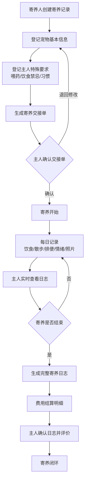
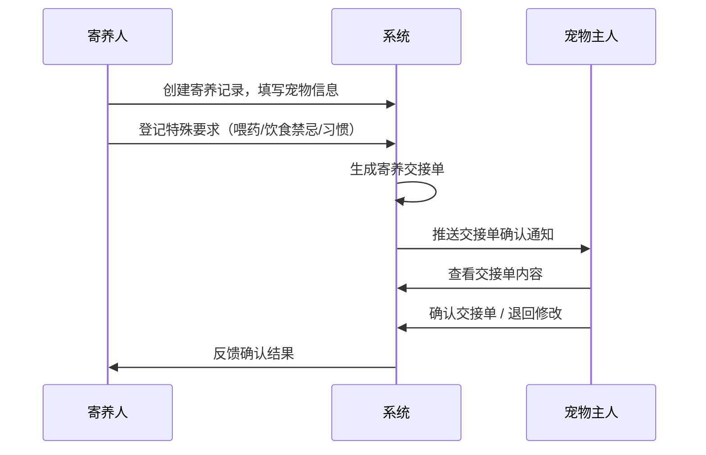
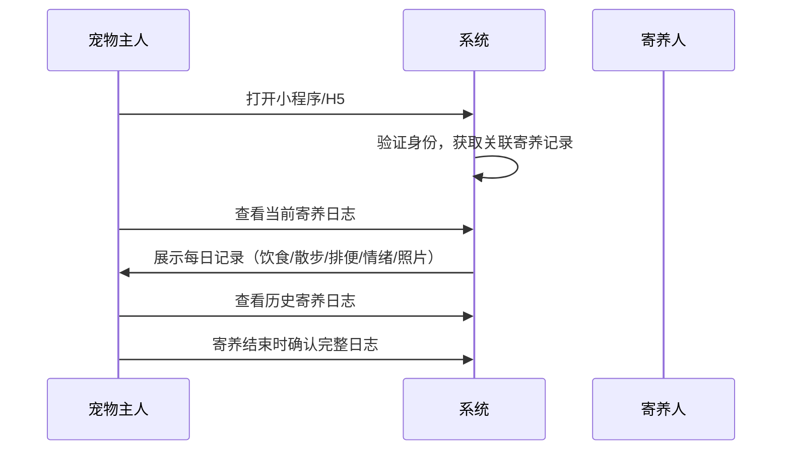
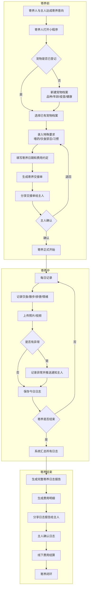
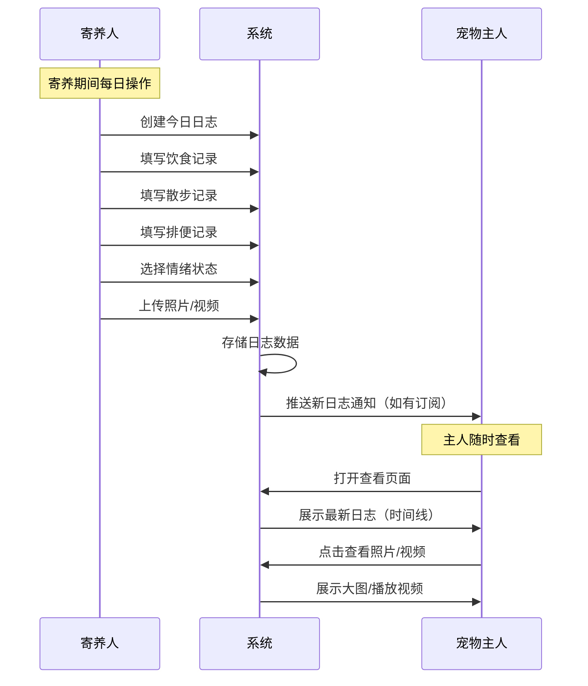
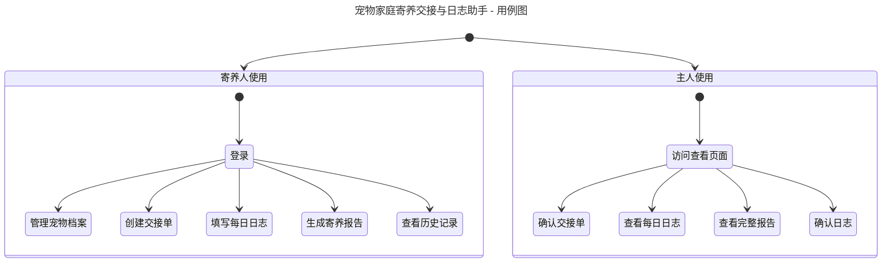
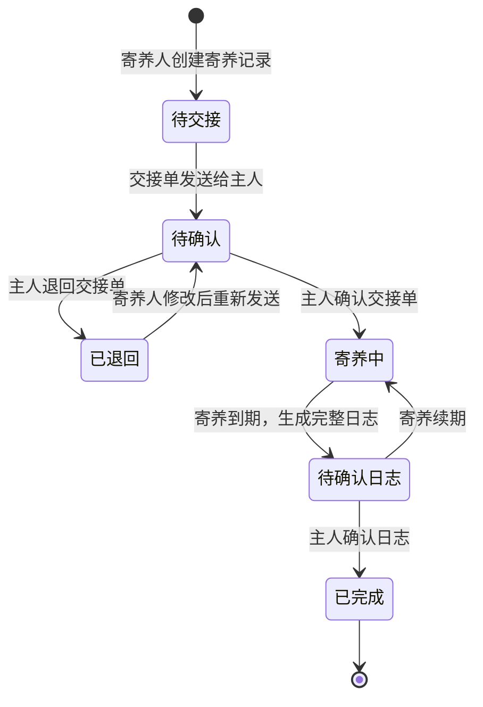
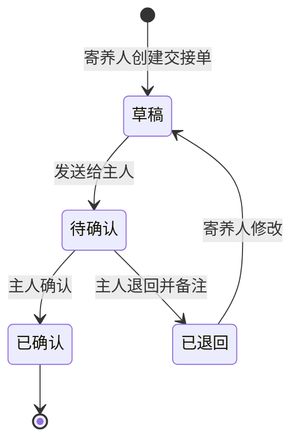

# 1.需求概述

## 1.1 需求介绍

宠物家庭寄养交接与日志助手是一款面向家庭式宠物寄养场景的轻量级工具，旨在解决家庭寄养人与宠物主人之间信息不透明、交接无留痕、日常记录缺失等痛点。

家庭式宠物寄养（区别于门店寄养）近年来需求旺盛，尤其在节假日高峰期，大量兼职个人在自家承接宠物寄养服务。然而，当前家庭寄养普遍依赖微信口头沟通，宠物健康状况、饮食用药、日常表现等关键信息缺乏结构化记录和交接凭证，容易产生纠纷。本系统聚焦"交接留痕 + 日常记录透明化 + 主人端实时查看"三大核心价值，为家庭寄养人提供专业化、可追溯的寄养管理工具。

### 1.1.1 所属领域

垂直行业需求 — 宠物服务行业（家庭寄养细分场景）

## 1.2 需求目标

1. **交接留痕**：宠物送养时完成结构化信息登记，生成双方确认的寄养交接单，避免口头交接导致的信息遗漏和纠纷。
2. **日常记录透明化**：寄养期间每日记录饮食、散步、排便、情绪状态及照片/短视频，主人可实时查看，减少焦虑和不信任。
3. **离店日志闭环**：寄养结束时生成完整寄养日志（含照片、日常记录、费用明细），供主人回顾确认，形成服务闭环。
4. **轻量易用**：面向非专业用户（家庭寄养人多为兼职个人），操作流程极简，7天MVP可上线核心链路。
5. **差异化定位**：不做宠物门店管理系统，专注家庭寄养场景，避开现有门店SaaS竞争。

## 1.3 系统使用角色

| 角色 | 说明 |
| --- | --- |
| 寄养人（Host） | 在自家提供宠物寄养服务的个人或家庭，负责宠物信息登记、日常记录、费用结算 |
| 宠物主人（Owner） | 将宠物送养的用户，通过小程序/H5查看寄养日志、确认交接单和最终日志 |
| 系统管理员 | 平台运营方，负责用户管理、版本套餐管理、数据运维（MVP阶段可简化） |

## 1.4 业务流程图

### 1.4.1 核心业务流程：寄养全链路

### 1.4.2 交接单确认时序

### 1.4.3 主人端查看时序

# 2.功能原型

| 原型名称 | 原型链接 | 对应端 | 备注 |
| --- | --- | --- | --- |
| 寄养人端-小程序 | 待产品文档阶段设计 | 小程序端 | 寄养人日常使用，宠物登记、日常记录、日志生成 |
| 宠物主人端-H5 | 待产品文档阶段设计 | 小程序端 | 主人查看日志、确认交接单、查看完整寄养报告 |
| 后台管理服务 | 待产品文档阶段设计 | WEB端 | MVP阶段可简化，用于用户管理和套餐管理 |

# 3.需求清单

## 3.1 寄养人端-小程序端

| 模块 | 一级功能 | 二级功能 | 功能描述 | 备注 |
| --- | --- | --- | --- | --- |
| 用户管理 | 注册与登录 | 微信授权登录 | 寄养人通过微信授权快速登录，无需注册流程 | MVP |
| 用户管理 | 个人资料 | 寄养人信息维护 | 维护寄养人基本信息：姓名、联系方式、寄养地址、家庭环境照片（可选） | MVP |
| 宠物信息管理 | 宠物档案创建 | 宠物基本信息登记 | 登记宠物品种、名字、年龄、性别、体重、毛色等基本信息 | MVP |
| 宠物信息管理 | 宠物档案创建 | 健康状况登记 | 登记疫苗接种情况、绝育状态、过敏史、既往病史 | MVP |
| 宠物信息管理 | 宠物档案创建 | 主人特殊要求录入 | 记录主人对宠物的特殊要求：喂药说明、饮食禁忌、生活习惯、忌讳事项 | MVP，核心差异化功能 |
| 宠物信息管理 | 宠物档案创建 | 宠物照片上传 | 上传宠物照片作为识别依据 | MVP |
| 宠物信息管理 | 宠物档案库 | 历史宠物列表 | 查看已登记过的宠物列表，支持复用上次的宠物信息 | MVP |
| 交接管理 | 交接单生成 | 创建寄养交接单 | 选择宠物档案，填写本次寄养预计起止日期、费用约定，系统自动生成结构化交接单 | MVP，核心功能 |
| 交接管理 | 交接单生成 | 交接单内容预览 | 寄养人可在发送前预览交接单完整内容 | MVP |
| 交接管理 | 交接单管理 | 交接单状态跟踪 | 查看交接单状态：待确认/已确认/已退回 | MVP |
| 交接管理 | 交接单管理 | 交接单修改重发 | 主人退回后可修改并重新发送交接单 | MVP |
| 交接管理 | 交接确认 | 寄养人确认交接 | 主人确认后，寄养人收到通知，正式开启寄养 | MVP |
| 日常记录 | 每日日志创建 | 创建今日记录 | 每日创建宠物日志记录，包含饮食、散步、排便、情绪等维度 | MVP，核心功能 |
| 日常记录 | 每日日志创建 | 饮食记录 | 记录喂食时间、食物种类、食量、饮水量 | MVP |
| 日常记录 | 每日日志创建 | 散步记录 | 记录散步时间、时长、散步表现 | MVP |
| 日常记录 | 每日日志创建 | 排便记录 | 记录排便次数、便便状态（正常/软便/腹泻等） | MVP |
| 日常记录 | 每日日志创建 | 情绪状态记录 | 记录宠物当日情绪：开心/正常/紧张/低落等 | MVP |
| 日常记录 | 每日日志创建 | 照片/视频上传 | 上传当日宠物照片或短视频（支持多张/多条） | MVP，核心体验 |
| 日常记录 | 每日日志创建 | 异常情况记录 | 记录宠物异常表现（呕吐、受伤、拒食等），自动推送通知主人 | MVP |
| 日常记录 | 日志管理 | 历史记录查看 | 查看本次寄养期间所有历史记录，支持按日期浏览 | MVP |
| 日常记录 | 日志管理 | 日志编辑修改 | 对已提交的日志进行补充修改 | MVP |
| 寄养日志 | 日志报告生成 | 完整寄养日志生成 | 寄养结束时，系统自动汇总所有每日记录、照片、费用，生成完整寄养日志报告 | MVP，核心功能 |
| 寄养日志 | 日志报告生成 | 费用明细生成 | 根据约定生成费用明细：寄养费、加餐费、其他费用 | MVP |
| 寄养日志 | 日志报告管理 | 日志报告分享 | 将完整日志报告通过微信分享给主人确认 | MVP |
| 寄养日志 | 日志报告管理 | 历史寄养日志查看 | 查看已完成的所有寄养记录及日志 | MVP |
| 消息通知 | 通知接收 | 交接单状态通知 | 接收交接单确认/退回通知 | MVP |
| 消息通知 | 通知接收 | 主人消息通知 | 接收主人发来的消息或反馈 | 可延后 |

## 3.2 宠物主人端-H5/小程序端

| 模块 | 一级功能 | 二级功能 | 功能描述 | 备注 |
| --- | --- | --- | --- | --- |
| 用户访问 | 身份验证 | 链接/二维码访问 | 主人通过寄养人分享的链接或二维码进入专属查看页面 | MVP |
| 用户访问 | 身份验证 | 微信授权登录 | 主人通过微信授权登录后绑定关联的寄养记录 | MVP |
| 交接单 | 交接单查看 | 交接单详情查看 | 查看宠物信息、健康状况、特殊要求、费用约定等交接单完整内容 | MVP |
| 交接单 | 交接单操作 | 交接单确认 | 确认交接单内容无误，寄养正式开始 | MVP |
| 交接单 | 交接单操作 | 交接单退回 | 对交接单内容有疑问时退回并备注修改意见 | MVP |
| 日志查看 | 实时日志查看 | 每日日志浏览 | 实时查看寄养人记录的每日日志（饮食/散步/排便/情绪） | MVP，核心功能 |
| 日志查看 | 实时日志查看 | 照片/视频查看 | 查看寄养人上传的宠物照片和视频 | MVP，核心体验 |
| 日志查看 | 实时日志查看 | 异常情况查看 | 查看寄养人标记的异常记录，及时沟通 | MVP |
| 日志查看 | 完整日志查看 | 寄养结束日志查看 | 寄养结束后查看完整的寄养日志报告（含照片、日常记录汇总） | MVP |
| 日志查看 | 完整日志查看 | 费用明细查看 | 查看本次寄养的费用明细 | MVP |
| 日志查看 | 完整日志查看 | 日志确认与评价 | 确认日志无误并对本次寄养服务进行评价 | 评价功能可延后 |
| 历史记录 | 寄养历史 | 历史寄养记录列表 | 查看过往所有寄养记录 | 可延后 |

## 3.3 后台管理-WEB端

| 模块 | 一级功能 | 二级功能 | 功能描述 | 备注 |
| --- | --- | --- | --- | --- |
| 用户管理 | 寄养人管理 | 寄养人列表查看 | 查看已注册的寄养人列表及基本信息 | MVP简化 |
| 用户管理 | 版本套餐管理 | 套餐配置 | 配置免费版/家庭寄养版的权益（宠物数量上限、功能权限等） | MVP简化 |
| 数据统计 | 基础统计 | 寄养订单统计 | 统计寄养订单数量、活跃寄养人数等基础数据 | 可延后 |
| 系统管理 | 内容管理 | 系统公告管理 | 发布系统公告或通知 | 可延后 |

# 4.非功能需求

## 4.1 使用界面需求

| 需求项 | 描述 |
| --- | --- |
| 寄养人端界面风格 | 简洁友好、操作极简，适合非专业用户；大按钮、高对比度，支持单手操作场景（寄养人可能一边照顾宠物一边操作） |
| 主人端界面风格 | 温馨亲切，突出照片展示；日志时间线清晰，便于快速浏览宠物近况 |
| 照片展示 | 支持瀑布流或时间线布局，照片加载采用缩略图+点击放大策略，节省流量 |
| 离线可用 | 寄养人端在弱网环境下（如家庭WiFi信号差）应支持本地暂存，联网后自动同步 |

## 4.2 软硬件环境需求

| 需求项 | 描述 |
| --- | --- |
| 寄养人端 | 微信小程序（iOS/Android），无需安装APP |
| 主人端 | 微信小程序 或 H5页面（通过微信分享链接直接访问），无需安装 |
| 后台管理 | 现代浏览器（Chrome/Firefox/Edge），WEB端访问 |
| 后端服务 | 云服务器部署，支持微信开放平台接口调用 |
| 存储 | 照片/视频存储使用云存储（如腾讯云COS），需支持图片压缩和CDN加速 |

## 4.3 性能需求

| 需求项 | 描述 |
| --- | --- |
| 页面加载时间 | 首页及日志列表页加载时间不超过2秒（4G网络环境） |
| 照片上传 | 支持单张最大10MB照片上传，上传过程显示进度，支持压缩后上传 |
| 视频上传 | 支持最大60秒短视频上传（单条最大100MB），后台自动压缩 |
| 并发用户 | MVP阶段支持500并发用户（寄养人+主人） |
| 数据同步 | 日志记录保存后，主人端应在30秒内可查看到最新内容 |

## 4.4 约束性需求

1. **MVP周期约束**：首版MVP开发周期不超过7天，需严格控制功能范围，核心链路为：宠物信息登记 → 交接单生成确认 → 每日记录 → 主人端查看 → 完整日志生成。
2. **不做门店管理**：本系统明确不做宠物门店管理功能（如门店收银、门店会员管理、门店多员工管理），与宠物门店SaaS形成差异化。
3. **不做在线支付**：MVP阶段不支持在线支付，费用通过线下结算，系统仅做费用记录和明细展示。
4. **不做宠物医疗**：不提供宠物在线问诊、健康监测等医疗功能，仅做信息记录。
5. **微信平台约束**：依赖微信开放平台能力（登录、分享、消息推送），需遵循微信小程序/H5开发规范。
6. **需要后台服务**：是，需要后端服务支撑用户管理、数据存取、文件存储、消息推送等功能。

# 5.接口需求

## 5.1 硬件接口需求

本系统不涉及特殊硬件接口需求。

## 5.2 软件接口需求

| 模块 | 接口名称 | 输入 | 输出 | 功能描述 |
| --- | --- | --- | --- | --- |
| 用户管理 | 微信登录接口 | 微信授权code | openid、用户昵称、头像 | 通过微信开放平台实现用户授权登录 |
| 消息通知 | 微信模板消息/订阅消息接口 | 消息模板ID、接收者openid、消息内容 | 发送结果状态 | 向寄养人/主人推送交接单状态、异常提醒等通知 |
| 文件存储 | 云存储上传接口 | 图片/视频文件 | 文件访问URL | 照片视频的上传和存储 |
| 文件存储 | 图片压缩接口 | 原始图片 | 压缩后图片 | 上传前自动压缩图片，节省存储和流量 |
| 分享功能 | 微信小程序分享接口 | 分享标题、图片、路径 | 分享卡片 | 寄养人将查看链接分享给主人 |
| 分享功能 | 微信H5分享接口 | 分享标题、描述、图片、链接 | 分享内容 | 主人端H5页面的微信分享 |

## 5.4 通讯接口需求

本系统主要通过微信生态（小程序/H5）与用户交互，无特殊硬件通讯需求。数据通讯采用HTTPS协议，保证数据传输安全。

# 6. 附录

## 流程图

### 寄养交接完整流程

## 时序图

### 每日记录与主人查看时序

## （用户与系统交互）用例图

## （系统）状态图

### 寄养订单状态流转

### 交接单状态流转

