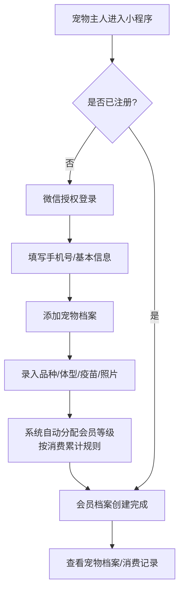
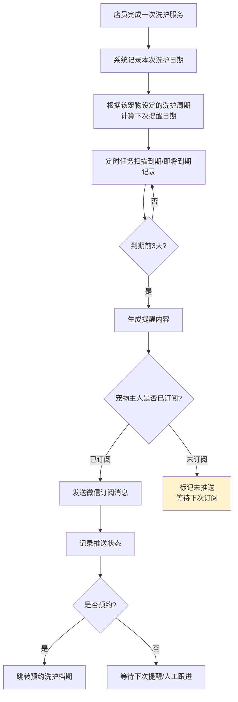
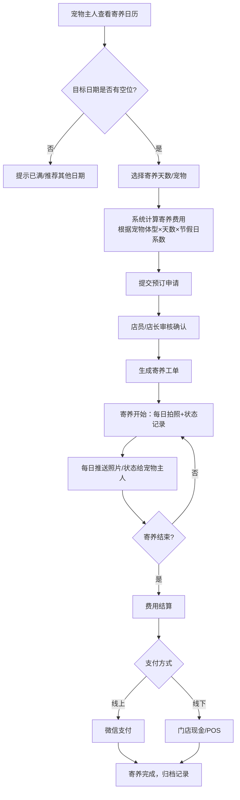
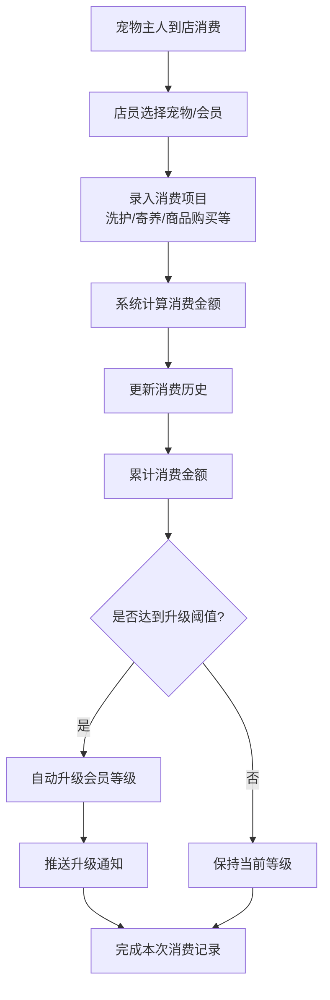
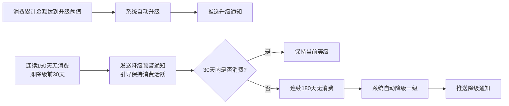
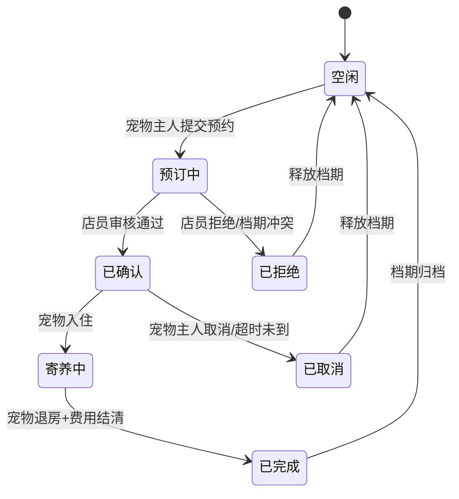
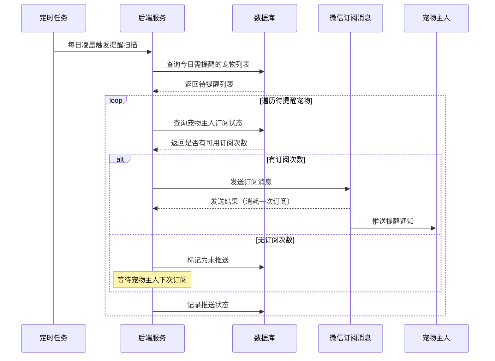
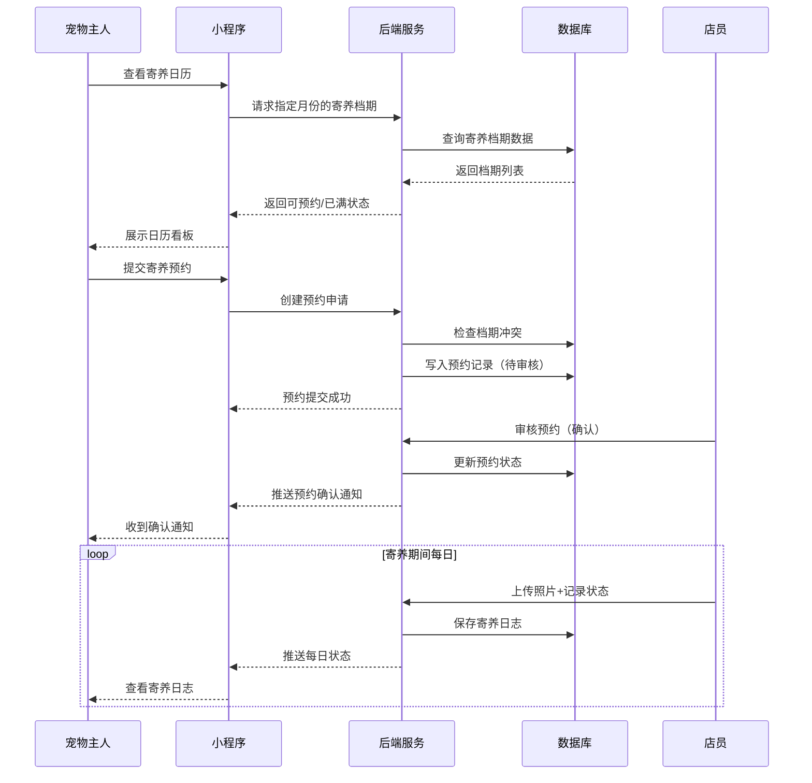

# 宠物店会员与寄养周期管理助手 — 用户需求说明书（URS）

> 版本：v1.1 | 编写日期：2026-06-28 | 编写人：需求文档结对写作专家
> 状态：根据领域专家A反馈更新，待产品负责人最终审核

**变更记录：**
- v1.0（2026-06-28）：初稿
- v1.1（2026-06-28）：根据领域专家A反馈更新：(1) 会员降级纳入30天预警通知为MVP必须；(2) 寄养节假日加价系数三级区分（普通日/周末/法定假日）纳入MVP必须；(3) 短信通道延后至V1.1，MVP仅支持微信订阅消息，并增加一次性订阅强引导设计需求

---

# 1. 需求概述

## 1.1 需求介绍

宠物店会员与寄养周期管理助手是一款面向独立宠物店、宠物美容店及宠物寄养家庭的轻量级 SaaS 工具。该系统聚焦"会员消费 + 洗护周期 + 寄养排期"三大核心场景，帮助小店实现宠物与主人档案数字化管理、洗护周期自动提醒、寄养档期可视化排期与费用结算，解决通用 SaaS 过重、行业 HIS 不适配的痛点。

### 1.1.1 所属领域

宠物生活服务行业（宠物零售 + 宠物美容洗护 + 宠物寄养）

## 1.2 需求目标

1. **档案数字化**：为每位宠物及其主人建立完整电子档案，涵盖品种、体型、疫苗记录、消费历史、会员等级等关键信息，取代纸质记录与零散电子表格。
2. **洗护周期智能化**：根据每只宠物的洗护周期（默认 45 天，可由门店自定义），在到期前自动通过**微信订阅消息**推送提醒，提升客户回流率。（短信通道作为 V1.1 迭代功能）
3. **寄养排期可视化**：提供日历看板视图，直观展示寄养档期占用情况，支持档期预订、冲突检测、费用结算、寄养期间每日照片/状态推送，解决节假日高峰期排期混乱问题。
4. **小店经营闭环**：以 MVP 7-10 天可交付为目标，聚焦单店核心业务闭环，不做宠物医院 HIS、不做电商，确保产品轻量、垂直、易用。

## 1.3 系统使用角色

| 角色 | 说明 | 典型用户 |
| --- | --- | --- |
| 会员/宠物主人（C端） | 注册并维护宠物档案、接收洗护提醒、查看寄养状态、预约寄养档期 | 宠物店的顾客，通过微信小程序使用 |
| 店员（B端-操作角色） | 日常接待、录入消费、管理洗护排期、更新寄养日志、发送每日照片/状态 | 宠物店前台或美容师 |
| 店长（B端-管理角色） | 查看门店经营数据、管理会员等级与价格策略、管理多门店（多店版）、审核财务结算 | 宠物店老板或区域经理 |

## 1.4 业务流程图

### 1.4.1 会员注册与档案管理主流程

### 1.4.2 洗护周期自动提醒流程

> **MVP 说明**：MVP 阶段仅支持微信订阅消息推送，短信通道作为 V1.1 迭代。由于微信订阅消息为一次性订阅机制，需在每次洗护完成时引导宠物主人再次订阅下次提醒。

### 1.4.3 寄养预订与履约流程

### 1.4.4 消费记录与会员等级流程

---

# 2. 功能原型

| 原型名称 | 原型链接 | 对应端 | 备注 |
| --- | --- | --- | --- |
| 宠物主人小程序 | 见配套 UI 原型文件 | 小程序端 | 宠物档案查看、洗护提醒接收、寄养预约与状态查看 |
| 门店工作台（Web） | 见配套 UI 原型文件 | WEB端 | 店员日常操作 + 店长管理功能 |
| 寄养日历看板 | 见配套 UI 原型文件 | WEB端 | 寄养档期可视化排期，支持拖拽调整 |

---

# 3. 需求清单

## 3.1 会员/宠物主人端 — 小程序端

| 模块 | 一级功能 | 二级功能 | 功能描述 | 备注 |
| --- | --- | --- | --- | --- |
| 账户与登录 | 用户注册与登录 | 微信授权登录 | 通过微信小程序一键授权登录，获取微信昵称/头像 | MVP 必须 |
| 账户与登录 | 用户注册与登录 | 手机号绑定 | 首次登录后绑定手机号，用于短信提醒接收 | MVP 必须 |
| 账户与登录 | 用户注册与登录 | 个人信息维护 | 修改昵称、头像、手机号、收货地址（可选） | |
| 宠物档案管理 | 宠物信息维护 | 添加宠物 | 录入宠物昵称、品种（下拉选择）、体型（小型/中型/大型）、性别、生日、照片 | MVP 必须 |
| 宠物档案管理 | 宠物信息维护 | 编辑宠物信息 | 修改宠物各项信息，支持多张照片管理 | MVP 必须 |
| 宠物档案管理 | 宠物信息维护 | 删除宠物 | 软删除宠物档案，保留历史消费记录 | |
| 宠物档案管理 | 疫苗记录 | 录入疫苗信息 | 记录疫苗名称、接种日期、下次接种提醒日期 | MVP 必须 |
| 宠物档案管理 | 疫苗记录 | 疫苗到期提醒 | 疫苗到期前推送提醒（与洗护提醒复用通道） | |
| 宠物档案管理 | 消费历史查看 | 消费记录列表 | 按时间倒序展示该宠物在本店的所有消费记录（项目、金额、日期、门店） | MVP 必须 |
| 宠物档案管理 | 消费历史查看 | 消费记录详情 | 查看单笔消费的详细信息（含服务项目、操作店员、备注） | |
| 会员等级 | 等级查看 | 当前等级展示 | 展示当前会员等级、累计消费金额、距下一等级差额 | MVP 必须 |
| 会员等级 | 等级查看 | 等级权益说明 | 展示各等级对应的折扣/权益说明 | |
| 会员等级 | 降级预警 | 接收降级预警通知 | 在即将触发降级前（降级前 30 天）收到预警通知，提醒保持消费活跃以维持等级 | MVP 必须 |
| 洗护提醒 | 提醒订阅 | 订阅微信提醒（一次性订阅） | 授权接收微信订阅消息提醒；由于微信订阅消息为一次性订阅机制，需在每次洗护完成时弹出订阅引导弹窗，强引导宠物主人订阅下次提醒 | MVP 必须 |
| 洗护提醒 | 提醒订阅 | 订阅短信提醒 | 填写手机号并确认接收短信提醒 | **V1.1 迭代** |
| 洗护提醒 | 提醒接收 | 洗护到期提醒通知 | 收到洗护到期提醒（微信订阅消息），点击进入小程序查看并预约 | MVP 必须 |
| 洗护提醒 | 提醒接收 | 疫苗到期提醒通知 | 收到疫苗到期提醒 | |
| 洗护提醒 | 快捷预约 | 从提醒直接预约洗护 | 在提醒消息中点击可直接进入洗护预约流程 | |
| 寄养服务 | 寄养预约 | 查看寄养日历 | 查看门店寄养日历，了解可预约日期 | MVP 必须 |
| 寄养服务 | 寄养预约 | 提交寄养申请 | 选择宠物、寄养起止日期，查看预估费用，提交预约 | MVP 必须 |
| 寄养服务 | 寄养预约 | 预约状态跟踪 | 查看预约状态（待审核/已确认/已取消/已完成） | MVP 必须 |
| 寄养服务 | 寄养状态查看 | 寄养日志查看 | 查看寄养期间每日照片和状态记录 | MVP 必须 |
| 寄养服务 | 寄养状态查看 | 实时状态推送 | 接收每日寄养状态推送通知 | |
| 寄养服务 | 寄养费用 | 费用明细查看 | 查看寄养费用明细（基础费、节假日加价、其他费用） | MVP 必须 |
| 寄养服务 | 寄养费用 | 在线支付 | 通过微信支付完成寄养费用结算 | |

## 3.2 门店工作台 — WEB端（店员视角）

| 模块 | 一级功能 | 二级功能 | 功能描述 | 备注 |
| --- | --- | --- | --- | --- |
| 工作台首页 | 今日概览 | 数据看板 | 展示今日预约数、待寄养数、今日洗护到期数、待处理提醒 | MVP 必须 |
| 工作台首页 | 快捷操作 | 快速录入消费 | 一键选择宠物→选择服务项目→确认金额→完成录入 | MVP 必须 |
| 会员管理 | 会员列表 | 会员搜索与筛选 | 按姓名/手机号/宠物名/会员等级搜索与筛选 | MVP 必须 |
| 会员管理 | 会员列表 | 会员详情查看 | 查看会员基本信息、宠物列表、消费汇总、等级信息 | MVP 必须 |
| 会员管理 | 会员管理 | 手动调整会员等级 | 店长可手动升级/降级会员（特殊情况处理） | |
| 会员管理 | 会员管理 | 会员标签管理 | 为会员添加自定义标签（如"VIP"、"需要上门接送"等） | |
| 宠物档案管理 | 宠物档案 | 新建/编辑宠物档案 | 店员代客录入宠物信息（到店场景） | MVP 必须 |
| 宠物档案管理 | 宠物档案 | 宠物健康备注 | 记录宠物特殊健康注意事项（如皮肤病、过敏等） | |
| 宠物档案管理 | 疫苗记录管理 | 录入/编辑疫苗记录 | 店员代为录入疫苗接种信息 | MVP 必须 |
| 消费管理 | 消费录入 | 新增消费记录 | 选择宠物→选择服务类型（洗护/寄养/商品）→填写金额→保存 | MVP 必须 |
| 消费管理 | 消费录入 | 消费项目快捷选择 | 预设常用服务项目及价格，一键选择 | |
| 消费管理 | 消费记录 | 消费记录查询 | 按日期范围/宠物/服务类型查询消费记录 | MVP 必须 |
| 消费管理 | 消费记录 | 消费记录修改/作废 | 修改或作废错误的消费记录（需店长权限） | |
| 洗护排期管理 | 洗护排期 | 洗护排期日历 | 日历视图展示每日洗护预约安排 | MVP 必须 |
| 洗护排期管理 | 洗护排期 | 手动安排洗护 | 为宠物安排洗护时间，自动检测时段冲突 | MVP 必须 |
| 洗护排期管理 | 提醒管理 | 提醒发送记录 | 查看已发送的提醒列表及发送状态 | MVP 必须 |
| 洗护排期管理 | 提醒管理 | 手动发送提醒 | 对未自动覆盖的会员手动触发提醒 | |
| 洗护排期管理 | 提醒管理 | 提醒模板配置 | 配置提醒文案模板、提醒提前天数 | |
| 寄养管理 | 寄养排期 | 寄养日历看板 | 日历视图展示寄养档期占用情况，支持按宠物笼位/房间维度查看 | MVP 必须 |
| 寄养管理 | 寄养排期 | 预订审核 | 审核宠物主人提交的寄养预约申请（确认/拒绝） | MVP 必须 |
| 寄养管理 | 寄养排期 | 冲突检测 | 当笼位已满时自动提示冲突，不允许重复预订 | MVP 必须 |
| 寄养管理 | 寄养排期 | 手动新增寄养 | 店员代客录入寄养预订（到店/电话场景） | MVP 必须 |
| 寄养管理 | 寄养执行 | 每日寄养日志 | 为每个在寄宠物记录每日状态（饮食/精神/排便）并上传照片 | MVP 必须 |
| 寄养管理 | 寄养执行 | 照片推送 | 将每日照片/状态一键推送给宠物主人 | MVP 必须 |
| 寄养管理 | 寄养执行 | 寄养入住/退房 | 标记寄养开始和结束，触发费用结算 | MVP 必须 |
| 寄养管理 | 费用结算 | 费用自动计算 | 根据宠物体型、天数、**三级日期系数**自动计算费用（普通日 1.0x / 周末 1.2x / 法定假日 1.5x），系数可由店长自定义 | MVP 必须 |
| 寄养管理 | 费用结算 | 手动调整费用 | 添加额外费用项（如特殊饮食加餐、用药等） | |
| 寄养管理 | 费用结算 | 结算收款 | 生成账单，支持标记收款方式（微信/现金/POS） | MVP 必须 |

## 3.3 门店工作台 — WEB端（店长视角）

| 模块 | 一级功能 | 二级功能 | 功能描述 | 备注 |
| --- | --- | --- | --- | --- |
| 经营数据 | 数据看板 | 营收统计 | 按日/周/月统计门店营收，含洗护收入、寄养收入、商品收入分类 | MVP 必须 |
| 经营数据 | 数据看板 | 会员增长趋势 | 展示新增会员数、活跃会员数、流失会员数趋势 | |
| 经营数据 | 数据看板 | 寄养利用率 | 展示寄养笼位利用率、节假日峰值统计 | |
| 经营数据 | 数据看板 | 洗护回流率 | 展示洗护提醒后的回流预约率 | |
| 门店设置 | 基础配置 | 门店信息管理 | 编辑门店名称、地址、联系电话、营业时间 | MVP 必须 |
| 门店设置 | 基础配置 | 服务项目与价格 | 配置洗护/寄养/商品等服务项目及默认价格 | MVP 必须 |
| 门店设置 | 基础配置 | 洗护周期默认值 | 设置各类宠物默认洗护周期天数（如狗45天、猫60天） | MVP 必须 |
| 门店设置 | 基础配置 | 寄养价格策略 | 配置按体型/天数的寄养基础价格表 | MVP 必须 |
| 门店设置 | 节假日配置 | 节假日日历 | 配置法定节假日及自定义节假日；**必须支持每年更新**（因国务院每年公布的法定假日安排不同）；系统预置三级日期类型：普通日 / 周末 / 法定假日 | MVP 必须 |
| 门店设置 | 节假日配置 | 寄养加价系数配置 | 配置三级日期类型的加价系数（默认：普通日 1.0x / 周末 1.2x / 法定假日 1.5x），店长可自定义调整各系数值 | MVP 必须 |
| 门店设置 | 节假日配置 | 寄养容量配置 | 配置各类笼位/房间数量，用于排期容量控制 | MVP 必须 |
| 门店设置 | 提醒渠道配置 | 微信订阅消息配置 | 对接微信订阅消息，配置消息模板ID | MVP 必须 |
| 门店设置 | 提醒渠道配置 | 短信通道配置 | 配置短信服务商账号、签名、模板 | **V1.1 迭代** |
| 会员等级管理 | 等级规则 | 等级体系配置 | 配置会员等级名称、升级阈值（累计消费金额）、各等级折扣比例 | MVP 必须 |
| 会员等级管理 | 等级规则 | 等级权益配置 | 配置各等级享受的权益（如寄养折扣、免费接送等） | |
| 会员等级管理 | 降级规则 | 降级周期配置 | 配置会员降级条件：默认连续 180 天无消费自动降级一级（MVP 固定值）；V1.1 支持按等级分级设置降级容忍期（如金卡→钻石卡 120 天） | MVP 必须 |
| 会员等级管理 | 降级规则 | 降级预警配置 | 配置降级前预警通知的天数（默认 30 天），预警通过微信订阅消息发送给宠物主人 | MVP 必须 |
| 员工管理 | 员工账号 | 添加/删除员工 | 创建员工账号，分配角色（店员/店长） | MVP 必须 |
| 员工管理 | 员工账号 | 操作权限分配 | 按角色分配功能权限 | |
| 多店管理（多店版） | 门店切换 | 门店列表管理 | 查看和管理所有连锁门店 | 多店版功能 |
| 多店管理（多店版） | 门店切换 | 跨门店数据汇总 | 汇总所有门店经营数据 | 多店版功能 |
| 多店管理（多店版） | 统一配置 | 全局价格策略同步 | 将价格策略批量同步到各门店 | 多店版功能 |
| 多店管理（多店版） | 统一配置 | 跨门店会员互通 | 会员可在任意连锁店消费，积分/等级共享 | 多店版功能 |

---

# 4. 非功能需求

## 4.1 使用界面需求

| 需求项 | 说明 |
| --- | --- |
| 小程序端界面风格 | 温馨、简洁，以宠物元素为点缀，主色调建议采用暖色系（如浅橙/浅绿），避免冰冷的商务感 |
| Web端界面风格 | 清爽专业，操作效率优先，支持快捷键操作（如快速录入消费） |
| 日历看板交互 | 支持拖拽调整寄养档期、颜色区分不同宠物/状态、点击查看详情 |
| 响应式设计 | Web端适配 1280px 及以上桌面屏幕；小程序端适配主流手机尺寸 |
| 照片上传 | 支持拍照和相册选择，自动压缩至合理大小，单张不超过 2MB |
| 操作反馈 | 所有关键操作（提交、删除、确认）需有明确的成功/失败提示 |
| 订阅引导交互 | 因微信订阅消息为一次性订阅机制，**必须在关键触点设计强引导**：(1) 每次洗护完成时弹出订阅弹窗引导订阅下次提醒；(2) 会员首页显著位置展示订阅状态；(3) 降级预警前再次引导订阅 |

## 4.2 软硬件环境需求

| 需求项 | 说明 |
| --- | --- |
| 小程序端运行环境 | 微信客户端 7.0 及以上版本 |
| Web端浏览器 | Chrome 90+、Edge 90+、Safari 14+、Firefox 90+ |
| 后端部署环境 | 云服务器（建议 2核4G 起步），MySQL 5.7+ / PostgreSQL 12+，Redis 缓存 |
| 短信服务 | 对接主流短信服务商（如阿里云短信、腾讯云短信） | **V1.1 迭代，MVP 不纳入** |
| 微信订阅消息 | 需要已认证的微信小程序账号，开通订阅消息权限；需配置消息模板并经微信审核 | MVP 必须 |
| 图片存储 | 对象存储服务（如阿里云 OSS、腾讯云 COS），用于存储宠物照片和寄养日志照片 |

## 4.3 性能需求

| 需求项 | 指标 |
| --- | --- |
| 页面加载时间 | 小程序首屏加载 ≤ 2 秒，Web端页面加载 ≤ 1.5 秒 |
| 接口响应时间 | 常规查询类接口 ≤ 500ms，写入类接口 ≤ 1 秒 |
| 日历看板渲染 | 月视图渲染 ≤ 1 秒（100 条寄养记录以内） |
| 并发支持 | 单店支持 ≤ 5 个店员同时操作，≤ 500 会员并发访问 |
| 定时任务 | 提醒推送任务在设定时间 ±5 分钟内完成发送 |
| 照片上传 | 单张照片上传 ≤ 3 秒（4G网络环境） |

## 4.4 约束性需求

1. **不做宠物医院 HIS**：不提供宠物诊疗、处方、病历管理等医疗功能，明确定位为"会员消费 + 洗护周期 + 寄养排期"小店闭环。
2. **不做电商**：不提供商品在线商城、购物车、物流配送等电商功能（商品消费仅作为线下消费记录）。
3. **不做社区/社交**：不提供宠物主人社区、朋友圈、点赞评论等社交功能。
4. **微信生态优先**：C端优先基于微信小程序，不做独立 APP；MVP 阶段提醒仅支持微信订阅消息，短信作为 V1.1 备选通道。
5. **需要后台服务**：需要后端服务支撑，包括数据持久化、定时任务（提醒扫描）、消息推送、文件存储等。
6. **数据安全**：会员个人信息（手机号等）需加密存储；寄养照片等文件需设置访问权限，防止未授权访问。
7. **数据隔离**：多店版需实现门店间数据严格隔离，各门店仅能访问本店数据（除非店长授权跨店查看）。

---

# 5. 接口需求

## 5.1 硬件接口需求

本项目不涉及硬件接口需求。

## 5.2 软件接口需求

| 模块 | 接口名称 | 输入 | 输出 | 功能描述 |
| --- | --- | --- | --- | --- |
| 用户认证 | 微信小程序登录接口 | 微信授权 code | openid、session_key | 用于小程序端用户身份认证 |
| 消息推送 | 微信订阅消息发送接口 | 消息模板ID、接收者openid、模板数据 | 发送结果（成功/失败） | 发送洗护提醒、寄养状态推送、会员等级变更通知、降级预警通知（MVP 唯一消息通道） |
| 消息推送 | 短信发送接口 | 手机号、短信模板ID、模板参数 | 发送结果（成功/失败） | 发送洗护提醒、疫苗提醒（**V1.1 迭代，MVP 不纳入**） |
| 文件存储 | 图片上传接口 | 图片文件（base64 或 multipart） | 图片 URL | 上传宠物照片、寄养日志照片 |
| 支付（MVP可延后） | 微信支付接口 | 订单信息（金额、描述） | 支付结果 | 寄养费用在线支付 |
| 基础数据 | 宠物品种数据接口 | 品种类别（狗/猫/其他） | 品种列表 | 提供宠物品种下拉选择的数据源 |

## 5.4 通讯接口需求

本项目不涉及硬件通讯接口需求。所有通讯基于 HTTPS 协议。

---

# 6. 附录

## 流程图

### 会员等级升降级流程

> **MVP 规则**：固定 180 天无消费自动降级一级 + 降级前 30 天预警通知。V1.1 将支持按等级分级设置降级容忍期。

### 寄养档期状态流转

## 时序图

### 洗护提醒推送时序

> **MVP 说明**：仅通过微信订阅消息推送，短信通道 V1.1 迭代。

### 寄养预订与日志推送时序

## （用户与系统交互）用例图

```mermaid
flowchart TB
    subgraph 宠物主人
        U1[注册/登录]
        U2[管理宠物档案]
        U3[查看消费记录]
        U4[订阅洗护提醒]
        U5[预约寄养]
        U6[查看寄养日志]
        U7[在线支付]
    end

    subgraph 店员
        S1[录入消费]
        S2[管理宠物档案]
        S3[安排洗护排期]
        S4[发送提醒]
        S5[审核寄养预约]
        S6[记录寄养日志]
        S7[费用结算]
    end

    subgraph 店长
        M1[查看经营数据]
        M2[配置门店设置]
        M3[管理会员等级]
        M4[管理员工账号]
        M5[管理多门店]
    end

    subgraph 系统
        SYS1[会员管理]
        SYS2[宠物档案管理]
        SYS3[消费管理]
        SYS4[洗护排期与提醒]
        SYS5[寄养管理]
        SYS6[数据统计]
    end

    U1 --> SYS1
    U2 --> SYS2
    U3 --> SYS3
    U4 --> SYS4
    U5 --> SYS5
    U6 --> SYS5
    U7 --> SYS5

    S1 --> SYS3
    S2 --> SYS2
    S3 --> SYS4
    S4 --> SYS4
    S5 --> SYS5
    S6 --> SYS5
    S7 --> SYS5

    M1 --> SYS6
    M2 --> SYS2
    M3 --> SYS1
    M4 --> SYS1
    M5 --> SYS1
```

---

> **文档审核提示**：本文档为 v1.1 版，已根据领域专家A反馈完成更新。请产品负责人重点审核以下方面：
> 1. 降级预警通知的文案和触发时机（默认降级前30天）是否合适
> 2. 寄养三级加价系数默认值（1.0x / 1.2x / 1.5x）是否合理
> 3. 节假日日历每年更新的操作流程是否需进一步简化
> 4. 微信订阅消息强引导的 UI 交互细节（将在 PRD/UI 原型阶段细化）
>
> **V1.1 迭代清单**（已明确排除出 MVP）：
> - 短信提醒通道
> - 分级降级周期（按等级设置不同容忍期）
> - 其他非 MVP 标注的功能
>
> **后续流程**：需求文档定稿后，将由产品文档结对写作专家开始 PRD 和 UI 原型设计。
