# 宠物短期家庭寄养匹配助手 V1.0 — 产品需求规格说明书（PRD）

---

## 变更历史

| 版本号 | 变更日期 | 变更内容 | 变更人 | 审核人 |
| --- | --- | --- | --- | --- |
| V1.0 | 2026-06-29 | 初始版本创建（基于已通过的需求文档 V1.0） | 产品文档结对写作专家 | 阶段一产品落地页文档总编辑 |

---

# 1 概述

## 1.1 需求背景

中国宠物数量已超 1 亿只，宠物主人出差/旅行时的寄养需求巨大且高频。传统宠物店寄养普遍存在以下问题：

**核心痛点：**
- **价格高昂**：宠物店寄养 80-200 元/天，且多数采用笼养方式，空间局促
- **环境不透明**：主人无法实时了解宠物在门店的生活状态，焦虑感强
- **应激风险**：笼养环境下宠物易产生应激反应，尤其对性格敏感的猫/狗
- **供给真空**：早期宠物寄养平台（如"小狗在家"）已停运或萎缩，美团/58 等平台信息杂乱且无保障

**业务价值：**
- 聚焦"短期家庭寄养"细分场景，提供比宠物店更温馨、性价比更高（30-80 元/天）的寄养选择
- 通过平台认证审核、寄养日志、宠物意外险等机制构建信任闭环
- 为有养宠经验的个人提供共享经济下的服务变现渠道

**预期目标：**
- MVP 10-14 天上线核心链路：寄养家庭入驻认证 → 搜索匹配 → 预约支付 → 寄养日志 → 评价结算
- 首版支持 1000 并发用户在线，覆盖宠物主人端小程序 + 寄养家庭端小程序 + 平台管理后台 WEB 三端
- 平台每笔订单抽佣 15%，附加宠物意外险（¥10-30/次）与推广置顶（¥20/月）增值服务

## 1.2 名词解释

| **名词** | **说明** |
| --- | --- |
| 寄养家庭（Host Family） | 经平台认证、在自家提供宠物寄养服务的个人/家庭，可发布寄养服务并接单 |
| 宠物主人（Pet Owner） | 有短期寄养需求的宠物（猫/狗）主人，通过平台搜索、匹配寄养家庭并下单 |
| 寄养订单 | 宠物主人与寄养家庭之间的寄养服务合同，包含寄养日期、宠物信息、费用明细 |
| 寄养日志 | 寄养家庭每日发送的宠物状态记录，含照片/短视频、饮食/精神/排便等描述 |
| 宠物意外险 | 覆盖寄养期间宠物意外医疗的保险产品，由平台与保险公司合作提供，¥10-30/次 |
| 平台服务费 | 平台从每笔寄养订单中抽取的佣金，默认比例 15% |
| 推广置顶 | 寄养家庭购买的增值服务（¥20/月），提升其在搜索结果中的排名 |
| 认证标识 | 平台对寄养家庭的身份认证、环境认证等资质标签 |
| MVP | Minimum Viable Product，最小可行产品，本系统 MVP 约束为 10-14 天开发周期 |

## 1.3 产品介绍

宠物短期家庭寄养匹配助手是一款面向经常出差/旅行宠物主人的服务平台，连接经过认证的寄养家庭与有短期寄养需求的宠物主人，差异化于传统宠物店笼养模式，让宠物在主人外出期间获得家庭式的悉心照料。

**目标用户：**
- 经常出差/旅行的宠物主人（猫/狗为主）
- 有养宠经验且愿意提供家庭寄养服务的个人
- 对宠物店笼养不放心、希望给宠物找"家庭式"寄养环境的主人

**核心使用场景：**
1. 宠物主人出差/旅行前，通过平台按位置、宠物类型、价格筛选附近寄养家庭，查看评价后在线预约并支付
2. 寄养期间，寄养家庭每日发送宠物状态日志（照片/短视频），宠物主人随时查看并通过平台在线沟通
3. 寄养到期后，宠物主人接宠并对寄养家庭进行评价，平台结算费用至寄养家庭（扣除 15% 服务费）

**产品核心价值：**
- **安心匹配**：认证审核 + 评价浏览 + 环境实拍，选得放心
- **透明寄养**：每日日志 + 在线沟通，随时了解宠物近况
- **高性价比**：家庭寄养 30-80 元/天，比宠物店节省 50%+
- **安全保障**：宠物意外险覆盖寄养期间，平台协调纠纷

### 1.3.1 范围说明

| 项 | 内容 |
| --- | --- |
| 包含功能 | 寄养家庭入驻与认证、宠物主人搜索匹配与预约、在线支付（微信支付）、寄养日志（照片/短视频）、在线即时沟通、宠物意外险购买、订单管理（取消/退款/延期）、评价系统、推广置顶服务、平台管理后台（审核/运营/数据监控/财务管理） |
| 不包含功能 | 宠物社交、宠物电商、宠物医疗/在线问诊、异宠寄养（仓鼠/爬行动物等，MVP 仅支持猫和狗）、宠物门店 SaaS 管理、自行建设支付通道（仅对接微信支付）、全自动审核（需人工审核） |

---

# 2 产品设计

## 2.1 系统架构图

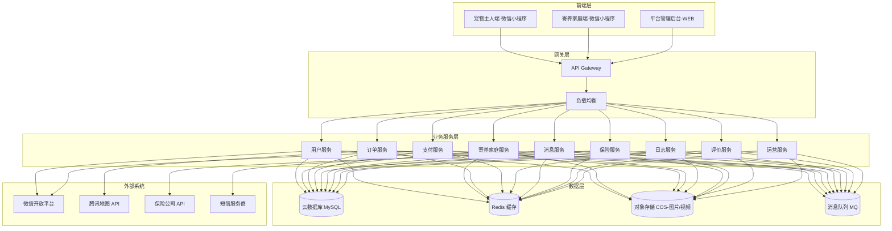
```mermaid
graph TB
    subgraph "前端层"
        A[宠物主人端-微信小程序]
        B[寄养家庭端-微信小程序]
        C[平台管理后台-WEB]
    end

    subgraph "网关层"
        D[API Gateway]
        E[负载均衡]
    end

    subgraph "业务服务层"
        F[用户服务]
        G[寄养家庭服务]
        H[订单服务]
        I[支付服务]
        J[日志服务]
        K[消息服务]
        L[保险服务]
        M[评价服务]
        N[运营服务]
    end

    subgraph "数据层"
        O[(云数据库 MySQL)]
        P[(Redis 缓存)]
        Q[(对象存储 COS-图片/视频)]
        R[(消息队列 MQ)]
    end

    subgraph "外部系统"
        S[微信开放平台]
        T[腾讯地图 API]
        U[保险公司 API]
        V[短信服务商]
    end

    A --> D
    B --> D
    C --> D
    D --> E
    E --> F & G & H & I & J & K & L & M & N
    F & G & H & I & J & K & L & M & N --> O & P & Q & R
    F --> S
    H --> T
    I --> S
    L --> U
    K --> V
```

## 2.2 业务模块图

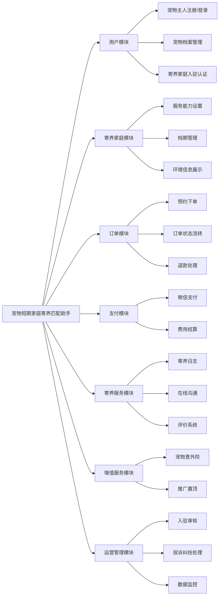
```mermaid
flowchart LR
    A[宠物短期家庭寄养匹配助手] --> B[用户模块]
    A --> C[寄养家庭模块]
    A --> D[订单模块]
    A --> E[支付模块]
    A --> F[寄养服务模块]
    A --> G[增值服务模块]
    A --> H[运营管理模块]

    B --> B1[宠物主人注册/登录]
    B --> B2[宠物档案管理]
    B --> B3[寄养家庭入驻认证]

    C --> C1[服务能力设置]
    C --> C2[档期管理]
    C --> C3[环境信息展示]

    D --> D1[预约下单]
    D --> D2[订单状态流转]
    D --> D3[退款处理]

    E --> E1[微信支付]
    E --> E2[费用结算]

    F --> F1[寄养日志]
    F --> F2[在线沟通]
    F --> F3[评价系统]

    G --> G1[宠物意外险]
    G --> G2[推广置顶]

    H --> H1[入驻审核]
    H --> H2[投诉纠纷处理]
    H --> H3[数据监控]
```

## 2.3 主业务流程

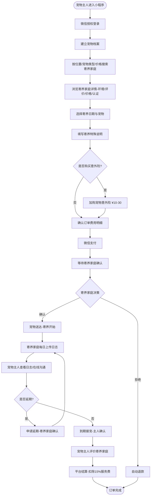
```mermaid
flowchart TD
    Start([宠物主人进入小程序]) --> Login[微信授权登录]
    Login --> CreatePet[建立宠物档案]
    CreatePet --> Search[按位置/宠物类型/价格搜索寄养家庭]
    Search --> Browse[浏览寄养家庭详情-环境/评价/价格/认证]
    Browse --> SelectDate[选择寄养日期与宠物]
    SelectDate --> FillNote[填写寄养特殊说明]
    FillNote --> Insurance{是否购买意外险?}
    Insurance -->|是| BuyInsurance[加购宠物意外险 ¥10-30]
    Insurance -->|否| ConfirmOrder[确认订单费用明细]
    BuyInsurance --> ConfirmOrder
    ConfirmOrder --> Pay[微信支付]
    Pay --> WaitConfirm[等待寄养家庭确认]
    WaitConfirm --> FHDecision{寄养家庭决策}
    FHDecision -->|确认| ServiceStart[宠物送达-寄养开始]
    FHDecision -->|拒绝| Refund[自动退款]
    ServiceStart --> DailyLog[寄养家庭每日上传日志]
    DailyLog --> OwnerView[宠物主人查看日志/在线沟通]
    OwnerView --> Extend{是否延期?}
    Extend -->|是| ExtConfirm[申请延期-寄养家庭确认]
    ExtConfirm --> DailyLog
    Extend -->|否| Pickup[到期接宠-主人确认]
    Pickup --> Review[宠物主人评价寄养家庭]
    Review --> Settle[平台结算-扣除15%服务费]
    Settle --> End([订单完成])
    Refund --> End
```

## 2.4 功能图/列表

| 功能模块 | 功能名称 | 优先级 | 功能描述 |
| --- | --- | --- | --- |
| 宠物主人端-账号管理 | 微信授权登录 | P0 | 微信小程序授权快速登录 |
| 宠物主人端-账号管理 | 手机号注册 | P0 | 手机号+验证码注册登录 |
| 宠物主人端-账号管理 | 宠物档案管理 | P0 | 添加/编辑/删除宠物信息（类型/品种/体重/年龄/性格/疫苗等） |
| 宠物主人端-搜索匹配 | 条件筛选搜索 | P0 | 按地理位置、宠物类型、可接待尺寸、价格区间筛选寄养家庭 |
| 宠物主人端-搜索匹配 | 地图模式搜索 | P2 | 在地图上查看附近寄养家庭分布 |
| 宠物主人端-搜索匹配 | 寄养家庭详情 | P0 | 查看环境照片/视频、服务信息、评价、认证标识 |
| 宠物主人端-预约下单 | 提交预约 | P0 | 选择日期与宠物、补充寄养说明 |
| 宠物主人端-预约下单 | 在线支付 | P0 | 微信支付寄养费用 |
| 宠物主人端-预约下单 | 订单管理 | P0 | 查看订单列表、取消/退款、申请延期 |
| 宠物主人端-寄养跟踪 | 寄养日志浏览 | P0 | 查看寄养家庭每日发送的宠物状态照片/短视频 |
| 宠物主人端-寄养跟踪 | 在线沟通 | P1 | 通过平台与寄养家庭即时消息沟通 |
| 宠物主人端-寄养跟踪 | 确认接宠 | P0 | 寄养到期后确认接宠时间 |
| 宠物主人端-评价系统 | 寄养评价 | P1 | 对寄养家庭评分（1-5星）+ 文字/图片评价 |
| 宠物主人端-增值服务 | 宠物意外险 | P1 | 下单时可选购买意外险（¥10-30/次） |
| 宠物主人端-个人中心 | 个人资料管理 | P1 | 管理基本信息、联系方式、默认地址 |
| 宠物主人端-个人中心 | 消息中心 | P1 | 接收预约状态变更、寄养日志更新等系统通知 |
| 宠物主人端-个人中心 | 帮助与反馈 | P2 | 常见问题解答、意见反馈 |
| 寄养家庭端-账号管理 | 注册入驻 | P0 | 填写基本信息、上传资质材料、设置服务能力 |
| 寄养家庭端-账号管理 | 入驻状态查询 | P0 | 查看审核状态及驳回原因 |
| 寄养家庭端-服务管理 | 服务信息编辑 | P0 | 更新环境照片、价格、档期 |
| 寄养家庭端-订单管理 | 预约处理 | P0 | 确认/拒绝预约请求、处理延期申请 |
| 寄养家庭端-订单管理 | 订单列表 | P0 | 查看所有订单状态 |
| 寄养家庭端-寄养服务 | 每日日志上传 | P0 | 上传宠物状态照片/短视频、填写状态描述 |
| 寄养家庭端-寄养服务 | 在线沟通 | P1 | 与宠物主人即时消息沟通 |
| 寄养家庭端-寄养服务 | 完成确认 | P0 | 寄养到期确认宠物被接走 |
| 寄养家庭端-收入管理 | 收入明细 | P0 | 查看每笔订单收入（寄养费-15%服务费） |
| 寄养家庭端-收入管理 | 提现 | P1 | 将收入提现至银行卡/微信零钱 |
| 寄养家庭端-个人中心 | 资料管理 | P1 | 更新个人信息、查看认证状态 |
| 寄养家庭端-个人中心 | 推广置顶 | P2 | 购买推广置顶服务（¥20/月） |
| 寄养家庭端-个人中心 | 评价查看 | P1 | 查看宠物主人评价、综合评分 |
| 平台管理后台-用户管理 | 入驻审核 | P0 | 审核寄养家庭入驻申请（通过/驳回） |
| 平台管理后台-用户管理 | 寄养家庭管理 | P0 | 查看/编辑/冻结寄养家庭账号、管理认证状态 |
| 平台管理后台-用户管理 | 宠物主人管理 | P1 | 查看用户列表、冻结/解封账号 |
| 平台管理后台-订单管理 | 订单监控 | P0 | 查看所有订单信息/状态/详情 |
| 平台管理后台-订单管理 | 退款处理 | P0 | 处理用户退款申请 |
| 平台管理后台-订单管理 | 纠纷处理 | P1 | 处理投诉与纠纷 |
| 平台管理后台-财务管理 | 交易流水 | P0 | 查看平台交易流水（订单金额/服务费/保险收入） |
| 平台管理后台-财务管理 | 结算管理 | P0 | 管理寄养家庭收入结算与提现 |
| 平台管理后台-财务管理 | 置顶管理 | P2 | 管理推广置顶服务（开通/到期/续费） |
| 平台管理后台-内容管理 | 保险产品配置 | P1 | 配置宠物意外险产品（保费/保额/保障范围） |
| 平台管理后台-内容管理 | 帮助中心 | P2 | 编辑常见问题、使用指南 |
| 平台管理后台-数据中心 | 运营仪表盘 | P1 | 展示核心运营指标（DAU/新增订单/交易额/寄养家庭数） |
| 平台管理后台-数据中心 | 报表导出 | P2 | 导出运营数据报表 |
| 平台管理后台-系统管理 | 平台参数 | P0 | 设置服务费比例（默认15%）、退款规则 |
| 平台管理后台-系统管理 | 管理员账号 | P0 | 管理后台管理员账号及权限 |

## 2.5 你的产品有哪些端

| 序号 | 端名称 | 端类型 | 目标用户 | 说明 |
| --- | --- | --- | --- | --- |
| 1 | 宠物主人端 | 小程序端 | 有短期寄养需求的宠物主人 | 宠物主人在微信中搜索寄养家庭、预约下单、支付、查看寄养日志、在线沟通 |
| 2 | 寄养家庭端 | 小程序端 | 提供家庭寄养服务的个人/家庭 | 寄养家庭入驻申请、接单管理、上传寄养日志、查看收入、提现 |
| 3 | 平台管理后台 | WEB端 | 平台运营管理人员 | 入驻审核、订单监控、纠纷处理、财务管理、数据监控、系统配置 |

---

# 3 产品功能

## 3.1 宠物主人端（小程序端）功能

### 3.1.1 微信授权登录
功能描述：支持用户通过微信小程序授权快速登录，一键获取微信头像、昵称等信息完成注册/登录。同时支持手机号+验证码注册登录作为备选方式。

*优先级与依赖说明：*
| 项 | 内容 |
| --- | --- |
| 优先级 | P0 |
| 依赖需求 | 无 |
| 前置条件 | 用户已安装微信客户端（版本≥7.0） |

### 3.1.2 微信授权登录—详细流程

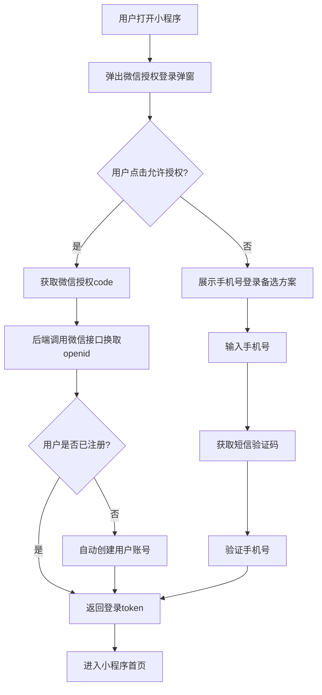
```mermaid
flowchart TD
    A[用户打开小程序] --> B[弹出微信授权登录弹窗]
    B --> C{用户点击允许授权?}
    C -->|是| D[获取微信授权code]
    C -->|否| E[展示手机号登录备选方案]
    D --> F[后端调用微信接口换取openid]
    F --> G{用户是否已注册?}
    G -->|是| H[返回登录token]
    G -->|否| I[自动创建用户账号]
    I --> H
    H --> J[进入小程序首页]
    E --> K[输入手机号]
    K --> L[获取短信验证码]
    L --> M[验证手机号]
    M --> H
```

*业务规则说明：*
1. 微信授权失败时自动降级到手机号登录方式
2. 首次登录自动创建用户，引导完善宠物档案
3. 登录 token 有效期 7 天，过期自动刷新

### 3.1.3 微信授权登录—主要原型

[登录授权原型](assets/prototypes/pet-owner-miniapp/login-widget.html)

*验收标准说明：*
- [ ] 正常流程：点击微信授权按钮→弹出授权弹窗→点击允许→成功登录进入首页
- [ ] 异常流程：拒绝授权→展示手机号登录备选方案→输入手机号+验证码→登录成功
- [ ] 性能要求：登录接口响应时间 ≤ 500ms

### 3.1.4 宠物档案管理
功能描述：用户可添加、编辑、删除自己的宠物信息。每只宠物需填写类型（猫/狗）、品种、体重、年龄、性格特点、特殊需求（如需喂药）、疫苗证明等。支持添加多只宠物。

*优先级与依赖说明：*
| 项 | 内容 |
| --- | --- |
| 优先级 | P0 |
| 依赖需求 | 用户登录 |
| 前置条件 | 用户已完成登录 |

### 3.1.5 宠物档案管理—详细流程

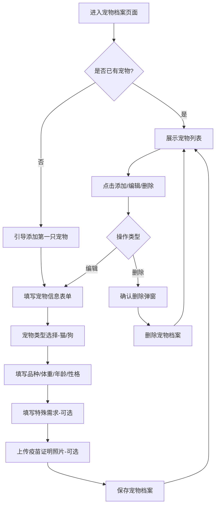
```mermaid
flowchart TD
    A[进入宠物档案页面] --> B{是否已有宠物?}
    B -->|是| C[展示宠物列表]
    B -->|否| D[引导添加第一只宠物]
    C --> E[点击添加/编辑/删除]
    D --> F[填写宠物信息表单]
    F --> G[宠物类型选择-猫/狗]
    G --> H[填写品种/体重/年龄/性格]
    H --> I[填写特殊需求-可选]
    I --> J[上传疫苗证明照片-可选]
    J --> K[保存宠物档案]
    K --> C
    E --> L{操作类型}
    L -->|编辑| F
    L -->|删除| M[确认删除弹窗]
    M --> N[删除宠物档案]
    N --> C
```

*业务规则说明：*
1. 宠物类型仅支持猫和狗，MVP 阶段不支持异宠
2. 每只宠物必须填写类型和品种，其他字段可选
3. 疫苗证明照片支持 JPG/PNG 格式，单张 ≤ 5MB
4. 删除宠物前需确认该宠物无进行中的寄养订单

### 3.1.6 宠物档案管理—主要原型

[宠物档案管理原型](assets/prototypes/pet-owner-miniapp/pet-profile-widget.html)

*验收标准说明：*
- [ ] 正常流程：点击添加宠物→填写必填字段→保存成功→宠物出现在列表中
- [ ] 异常流程：未填必填项→提示红色星号标记→阻止保存
- [ ] 性能要求：宠物列表加载时间 ≤ 300ms

### 3.1.7 寄养家庭搜索与筛选
功能描述：宠物主人可按地理位置（距离）、宠物类型、可接待尺寸、价格区间等条件筛选寄养家庭。支持列表模式和地图模式两种展示方式。

*优先级与依赖说明：*
| 项 | 内容 |
| --- | --- |
| 优先级 | P0 |
| 依赖需求 | 用户登录、宠物档案 |
| 前置条件 | 用户已登录并添加至少一只宠物 |

### 3.1.8 寄养家庭搜索与筛选—详细流程

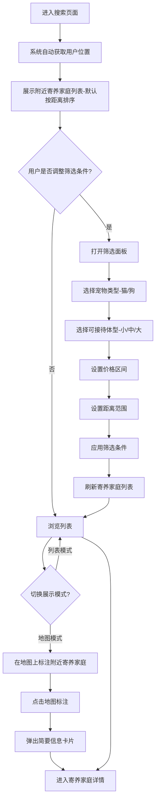
```mermaid
flowchart TD
    A[进入搜索页面] --> B[系统自动获取用户位置]
    B --> C[展示附近寄养家庭列表-默认按距离排序]
    C --> D{用户是否调整筛选条件?}
    D -->|是| E[打开筛选面板]
    E --> F[选择宠物类型-猫/狗]
    F --> G[选择可接待体型-小/中/大]
    G --> H[设置价格区间]
    H --> I[设置距离范围]
    I --> J[应用筛选条件]
    J --> K[刷新寄养家庭列表]
    D -->|否| L[浏览列表]
    K --> L
    L --> M{切换展示模式?}
    M -->|地图模式| N[在地图上标注附近寄养家庭]
    M -->|列表模式| L
    N --> O[点击地图标注]
    O --> P[弹出简要信息卡片]
    P --> Q[进入寄养家庭详情]
    L --> Q
```

*业务规则说明：*
1. 默认展示 5km 范围内的寄养家庭，可按距离筛选（1/3/5/10/全城）
2. 搜索结果按综合评分排序（距离40%+评分30%+订单量20%+响应速度10%）
3. 仅展示已通过平台认证且当前可接单的寄养家庭
4. 地图模式需用户授权位置权限

### 3.1.9 寄养家庭搜索与筛选—主要原型

[搜索筛选原型](assets/prototypes/pet-owner-miniapp/search-filter-widget.html)

*验收标准说明：*
- [ ] 正常流程：进入搜索页→自动加载附近寄养家庭→调整筛选条件→列表刷新
- [ ] 异常流程：无匹配结果→展示空状态页+建议扩大筛选范围
- [ ] 性能要求：搜索响应时间 ≤ 1 秒

### 3.1.10 寄养家庭详情
功能描述：展示寄养家庭的完整信息，包括居家环境照片/视频轮播、房屋面积、是否有院子、可接待宠物类型/尺寸、日单价、服务范围、寄养规则、平台认证状态、其他宠物主人的评价和评分。

*优先级与依赖说明：*
| 项 | 内容 |
| --- | --- |
| 优先级 | P0 |
| 依赖需求 | 寄养家庭搜索 |
| 前置条件 | 用户已登录 |

### 3.1.11 寄养家庭详情—详细流程

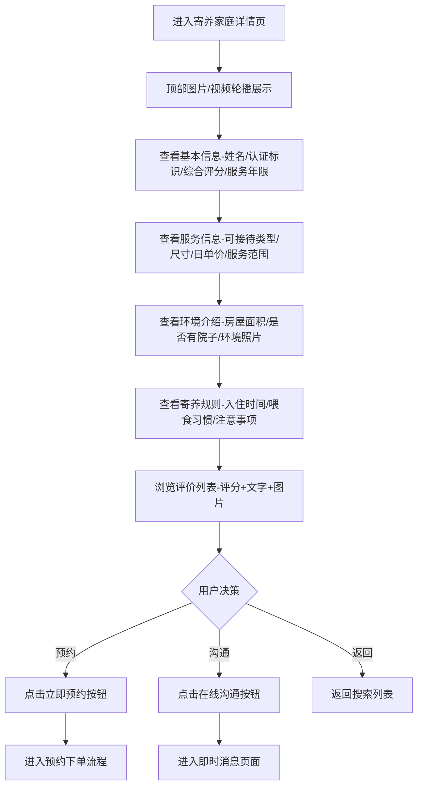
```mermaid
flowchart TD
    A[进入寄养家庭详情页] --> B[顶部图片/视频轮播展示]
    B --> C[查看基本信息-姓名/认证标识/综合评分/服务年限]
    C --> D[查看服务信息-可接待类型/尺寸/日单价/服务范围]
    D --> E[查看环境介绍-房屋面积/是否有院子/环境照片]
    E --> F[查看寄养规则-入住时间/喂食习惯/注意事项]
    F --> G[浏览评价列表-评分+文字+图片]
    G --> H{用户决策}
    H -->|预约| I[点击立即预约按钮]
    I --> J[进入预约下单流程]
    H -->|沟通| K[点击在线沟通按钮]
    K --> L[进入即时消息页面]
    H -->|返回| M[返回搜索列表]
```

*业务规则说明：*
1. 图片轮播支持左右滑动，最多展示 20 张环境照片 + 3 个视频
2. 认证标识包括：身份认证（已核实身份证）、环境认证（已核实居家环境）、经验认证（养宠经验≥2年）
3. 评价按时间倒序展示，支持查看全部评价和带图评价筛选
4. 详情页底部固定"立即预约"和"在线沟通"两个操作按钮

### 3.1.12 寄养家庭详情—主要原型

[寄养家庭详情原型](assets/prototypes/pet-owner-miniapp/family-detail-widget.html)

*验收标准说明：*
- [ ] 正常流程：进入详情页→图片轮播可滑动→各信息区域完整展示→可点击预约/沟通
- [ ] 异常流程：寄养家庭暂无评价→展示"暂无评价"占位
- [ ] 性能要求：详情页加载时间 ≤ 1 秒（含图片懒加载）

### 3.1.13 预约下单与支付
功能描述：宠物主人选择寄养日期与宠物、补充寄养说明后提交预约，系统计算费用（天数×日单价+可选保险）后通过微信支付完成付款。

*优先级与依赖说明：*
| 项 | 内容 |
| --- | --- |
| 优先级 | P0 |
| 依赖需求 | 寄养家庭详情、宠物档案、微信支付 |
| 前置条件 | 用户已登录并添加宠物 |

### 3.1.14 预约下单与支付—详细流程

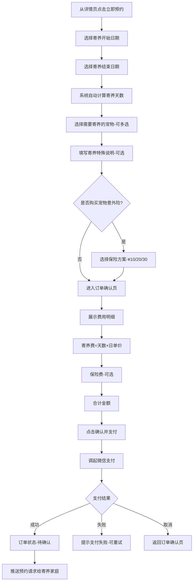
```mermaid
flowchart TD
    A[从详情页点击立即预约] --> B[选择寄养开始日期]
    B --> C[选择寄养结束日期]
    C --> D[系统自动计算寄养天数]
    D --> E[选择需要寄养的宠物-可多选]
    E --> F[填写寄养特殊说明-可选]
    F --> G{是否购买宠物意外险?}
    G -->|是| H[选择保险方案-¥10/20/30]
    G -->|否| I[进入订单确认页]
    H --> I
    I --> J[展示费用明细]
    J --> K[寄养费=天数×日单价]
    K --> L[保险费-可选]
    L --> M[合计金额]
    M --> N[点击确认并支付]
    N --> O[调起微信支付]
    O --> P{支付结果}
    P -->|成功| Q[订单状态-待确认]
    Q --> R[推送预约请求给寄养家庭]
    P -->|失败| S[提示支付失败-可重试]
    P -->|取消| T[返回订单确认页]
```

*业务规则说明：*
1. 寄养天数 = 结束日期 - 开始日期（最少 1 天）
2. 寄养家庭的档期需覆盖所选日期，若有冲突则提示"该日期已被预约"
3. 多只宠物同时寄养时，每只宠物独立计算费用
4. 宠物意外险为可选服务，不强制购买
5. 支付成功后订单状态变为"待确认"，等待寄养家庭在 24 小时内确认

### 3.1.15 预约下单与支付—主要原型

[预约下单原型](assets/prototypes/pet-owner-miniapp/booking-widget.html)

*验收标准说明：*
- [ ] 正常流程：选日期→选宠物→确认费用→微信支付→订单创建成功
- [ ] 异常流程：日期冲突→提示不可预约→引导选择其他日期
- [ ] 性能要求：支付接口响应时间 ≤ 2 秒

### 3.1.16 订单管理
功能描述：宠物主人可查看所有寄养订单（待确认、已确认/寄养中、已完成、已取消），支持取消/退款、申请延期等操作。

*优先级与依赖说明：*
| 项 | 内容 |
| --- | --- |
| 优先级 | P0 |
| 依赖需求 | 预约下单 |
| 前置条件 | 用户已下单 |

### 3.1.17 订单管理—详细流程

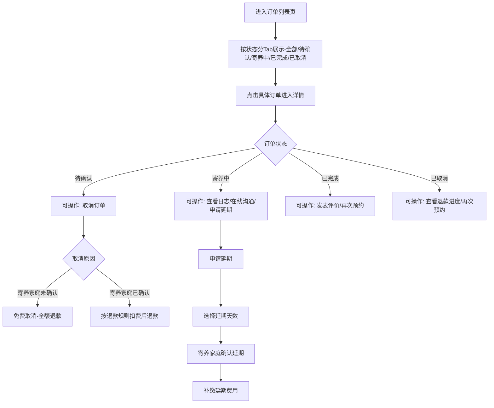
```mermaid
flowchart TD
    A[进入订单列表页] --> B[按状态分Tab展示-全部/待确认/寄养中/已完成/已取消]
    B --> C[点击具体订单进入详情]
    C --> D{订单状态}
    D -->|待确认| E[可操作: 取消订单]
    D -->|寄养中| F[可操作: 查看日志/在线沟通/申请延期]
    D -->|已完成| G[可操作: 发表评价/再次预约]
    D -->|已取消| H[可操作: 查看退款进度/再次预约]
    E --> I{取消原因}
    I -->|寄养家庭未确认| J[免费取消-全额退款]
    I -->|寄养家庭已确认| K[按退款规则扣费后退款]
    F --> L[申请延期]
    L --> M[选择延期天数]
    M --> N[寄养家庭确认延期]
    N --> O[补缴延期费用]
```

*业务规则说明：*
1. 寄养家庭确认前可免费取消，全额退款
2. 寄养家庭确认后取消：寄养开始前 48 小时取消退 80%；24-48 小时内取消退 50%；24 小时内不退款
3. 申请延期需寄养家庭确认，延期费用按原日单价计算
4. 订单完成后 7 天内可发表评价，超时系统默认好评

### 3.1.18 订单管理—主要原型

[订单管理原型](assets/prototypes/pet-owner-miniapp/order-manage-widget.html)

*验收标准说明：*
- [ ] 正常流程：查看订单列表→按状态筛选→点击订单→执行对应操作
- [ ] 异常流程：取消已确认订单→弹出退款规则说明→确认后按规则退款
- [ ] 性能要求：订单列表加载时间 ≤ 500ms

### 3.1.19 寄养日志查看
功能描述：宠物主人可查看寄养家庭每日发送的宠物状态日志，包括照片/短视频、饮食/精神状态/排便等描述。日志以时间线形式展示。

*优先级与依赖说明：*
| 项 | 内容 |
| --- | --- |
| 优先级 | P0 |
| 依赖需求 | 寄养服务进行中 |
| 前置条件 | 订单状态为"寄养中" |

### 3.1.20 寄养日志查看—详细流程

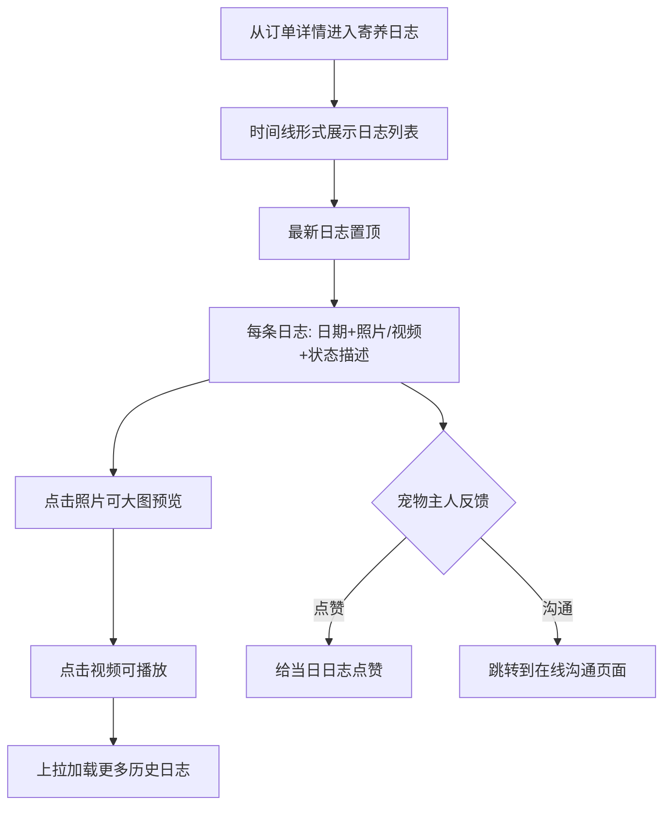
```mermaid
flowchart TD
    A[从订单详情进入寄养日志] --> B[时间线形式展示日志列表]
    B --> C[最新日志置顶]
    C --> D[每条日志: 日期+照片/视频+状态描述]
    D --> E[点击照片可大图预览]
    E --> F[点击视频可播放]
    F --> G[上拉加载更多历史日志]
    D --> H{宠物主人反馈}
    H -->|点赞| I[给当日日志点赞]
    H -->|沟通| J[跳转到在线沟通页面]
```

*业务规则说明：*
1. 日志按日期倒序排列，最新日志在最上方
2. 每条日志包含：日期、照片（最多 9 张）/视频（最多 3 个）、饮食状态、精神状态、排便情况、其他备注
3. 寄养家庭每日 20:00 前需提交当日日志，未提交系统自动提醒
4. 照片支持大图预览（双指缩放），视频支持在线播放

### 3.1.21 寄养日志查看—主要原型

[寄养日志原型](assets/prototypes/pet-owner-miniapp/foster-log-widget.html)

*验收标准说明：*
- [ ] 正常流程：进入日志页→时间线展示→点击照片大图预览→上拉加载历史
- [ ] 异常流程：暂无日志→展示"寄养家庭尚未提交今日日志"占位
- [ ] 性能要求：日志列表加载时间 ≤ 500ms，图片懒加载

### 3.1.22 在线即时沟通
功能描述：宠物主人可通过平台与寄养家庭进行文字/图片/语音即时消息沟通。

*优先级与依赖说明：*
| 项 | 内容 |
| --- | --- |
| 优先级 | P1 |
| 依赖需求 | 订单已创建 |
| 前置条件 | 用户已登录 |

### 3.1.23 在线即时沟通—详细流程

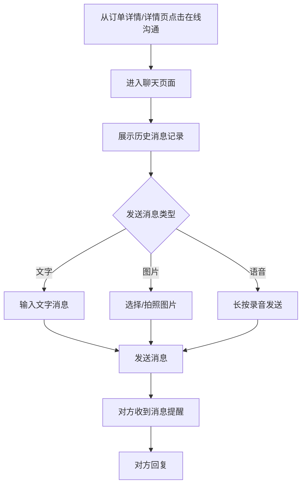
```mermaid
flowchart TD
    A[从订单详情/详情页点击在线沟通] --> B[进入聊天页面]
    B --> C[展示历史消息记录]
    C --> D{发送消息类型}
    D -->|文字| E[输入文字消息]
    D -->|图片| F[选择/拍照图片]
    D -->|语音| G[长按录音发送]
    E --> H[发送消息]
    F --> H
    G --> H
    H --> I[对方收到消息提醒]
    I --> J[对方回复]
```

*业务规则说明：*
1. 消息类型支持文字、图片（≤9张/次）、语音（≤60秒/条）
2. 消息实时推送，对方在线时即时送达，离线时推送微信订阅消息提醒
3. 聊天记录保留至订单完成后 30 天
4. 消息内容需经过敏感词过滤

### 3.1.24 在线即时沟通—主要原型

[在线沟通原型](assets/prototypes/pet-owner-miniapp/chat-widget.html)

*验收标准说明：*
- [ ] 正常流程：进入聊天→发送文字/图片/语音→对方实时收到→收到回复
- [ ] 异常流程：网络断开→消息发送失败→提示重试
- [ ] 性能要求：消息送达延迟 ≤ 500ms（双方在线时）

### 3.1.25 寄养评价
功能描述：寄养结束后，宠物主人可对寄养家庭进行评分（1-5星）和文字/图片评价。

*优先级与依赖说明：*
| 项 | 内容 |
| --- | --- |
| 优先级 | P1 |
| 依赖需求 | 订单已完成 |
| 前置条件 | 订单状态为"已完成"且在评价期内（7天） |

### 3.1.26 寄养评价—详细流程

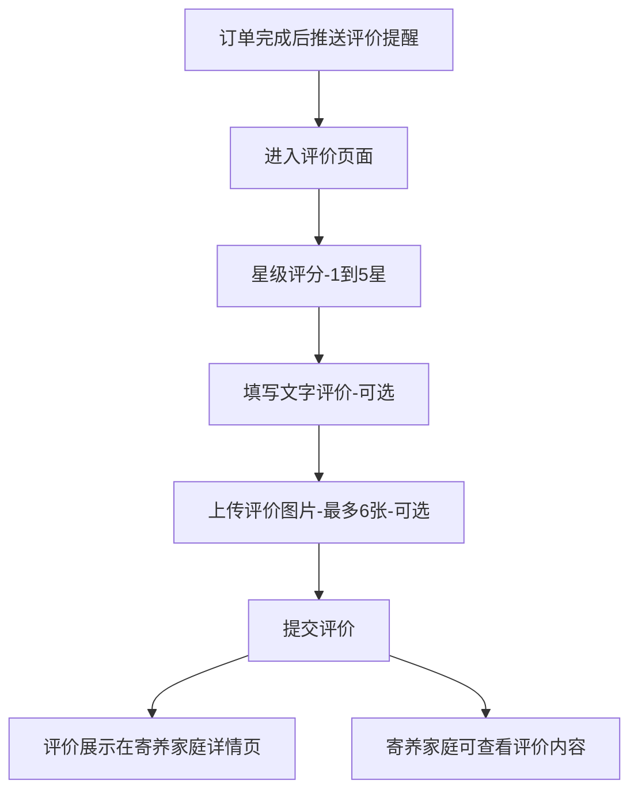
```mermaid
flowchart TD
    A[订单完成后推送评价提醒] --> B[进入评价页面]
    B --> C[星级评分-1到5星]
    C --> D[填写文字评价-可选]
    D --> E[上传评价图片-最多6张-可选]
    E --> F[提交评价]
    F --> G[评价展示在寄养家庭详情页]
    F --> H[寄养家庭可查看评价内容]
```

*业务规则说明：*
1. 星级评分为必填（1-5星），文字评价和图片为可选
2. 评价提交后不可修改，但可追加评价（仅 1 次）
3. 订单完成后 7 天内未评价，系统默认 5 星好评
4. 评价内容需经过敏感词过滤

### 3.1.27 寄养评价—主要原型

[寄养评价原型](assets/prototypes/pet-owner-miniapp/review-widget.html)

*验收标准说明：*
- [ ] 正常流程：进入评价页→选择星级→填写文字/上传图片→提交成功
- [ ] 异常流程：未选星级→阻止提交→提示"请先评分"
- [ ] 性能要求：评价提交响应时间 ≤ 500ms

### 3.1.28 宠物意外险购买
功能描述：在预约下单时可选购买宠物意外险，覆盖寄养期间宠物意外医疗费用。

*优先级与依赖说明：*
| 项 | 内容 |
| --- | --- |
| 优先级 | P1 |
| 依赖需求 | 预约下单、保险公司API |
| 前置条件 | 用户正在下单 |

### 3.1.29 宠物意外险购买—详细流程

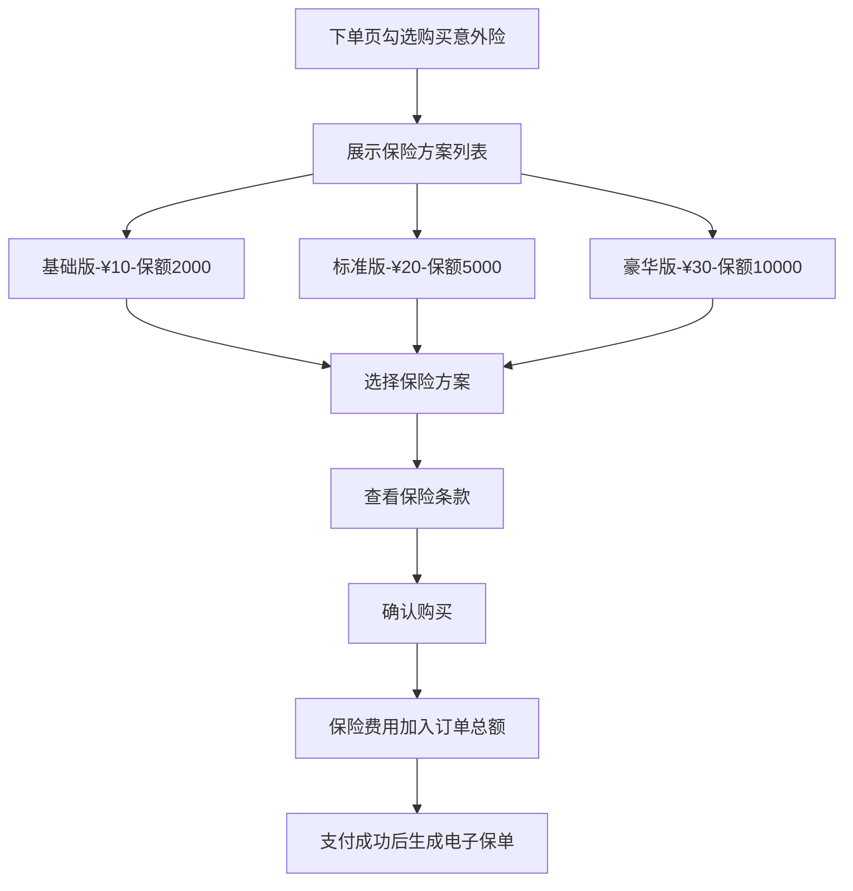
```mermaid
flowchart TD
    A[下单页勾选购买意外险] --> B[展示保险方案列表]
    B --> C[基础版-¥10-保额2000]
    B --> D[标准版-¥20-保额5000]
    B --> E[豪华版-¥30-保额10000]
    C --> F[选择保险方案]
    D --> F
    E --> F
    F --> G[查看保险条款]
    G --> H[确认购买]
    H --> I[保险费用加入订单总额]
    I --> J[支付成功后生成电子保单]
```

*业务规则说明：*
1. 三份保险方案，保费分别为 ¥10/20/30，保额分别为 2000/5000/10000 元
2. 保险覆盖寄养期间的宠物意外医疗，不含既往症
3. 电子保单在支付成功后自动生成，可在订单详情中查看
4. 理赔需联系平台客服发起

### 3.1.30 宠物意外险购买—主要原型

[宠物意外险原型](assets/prototypes/pet-owner-miniapp/insurance-widget.html)

*验收标准说明：*
- [ ] 正常流程：勾选保险→选择方案→确认购买→保费加入订单总额
- [ ] 异常流程：未选择方案→提示"请选择保险方案"
- [ ] 性能要求：保险方案加载时间 ≤ 300ms

### 3.1.31 消息中心
功能描述：接收预约状态变更、寄养日志更新、系统公告等通知消息。

*优先级与依赖说明：*
| 项 | 内容 |
| --- | --- |
| 优先级 | P1 |
| 依赖需求 | 无 |
| 前置条件 | 用户已登录 |

### 3.1.32 消息中心—详细流程

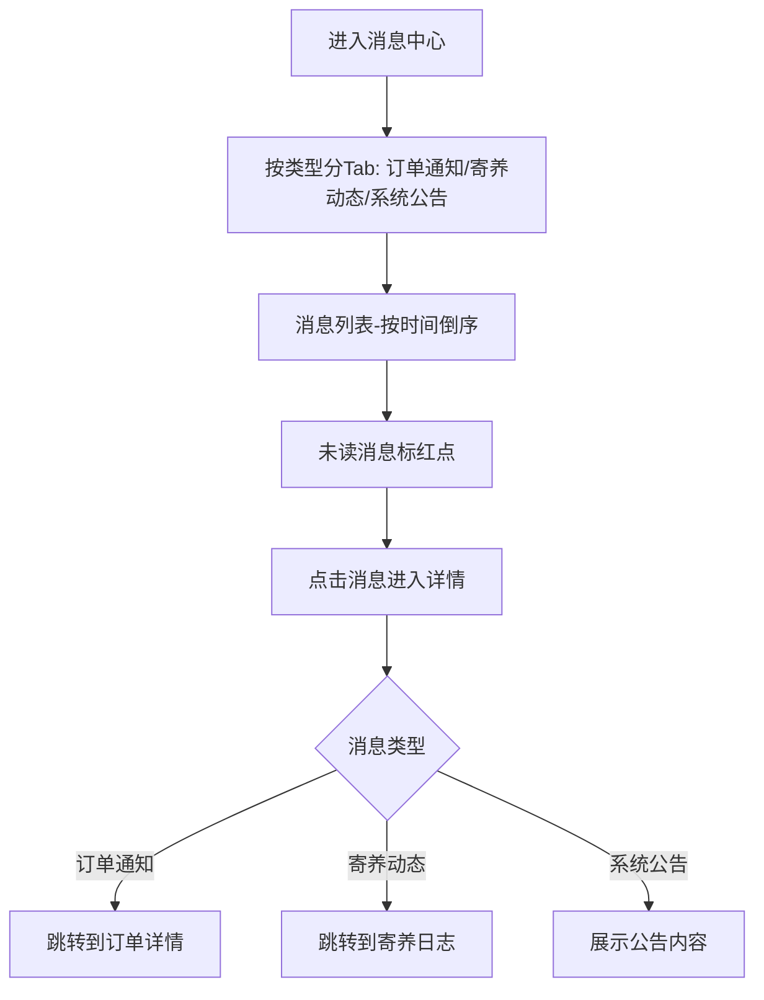
```mermaid
flowchart TD
    A[进入消息中心] --> B[按类型分Tab: 订单通知/寄养动态/系统公告]
    B --> C[消息列表-按时间倒序]
    C --> D[未读消息标红点]
    D --> E[点击消息进入详情]
    E --> F{消息类型}
    F -->|订单通知| G[跳转到订单详情]
    F -->|寄养动态| H[跳转到寄养日志]
    F -->|系统公告| I[展示公告内容]
```

*业务规则说明：*
1. 消息类型：订单状态变更、寄养日志更新、预约请求回复、系统公告
2. 未读消息显示红点标记，点击后标记已读
3. 消息保留 90 天，超过 90 天自动清理

### 3.1.33 消息中心—主要原型

[消息中心原型](assets/prototypes/pet-owner-miniapp/message-center-widget.html)

*验收标准说明：*
- [ ] 正常流程：进入消息中心→查看各类通知→点击跳转对应详情
- [ ] 异常流程：无消息→展示空状态"暂无新消息"
- [ ] 性能要求：消息列表加载时间 ≤ 300ms

---

## 3.2 寄养家庭端（小程序端）功能

### 3.2.1 注册入驻
功能描述：寄养家庭填写姓名、联系方式、身份证号、居住地址等基本信息，上传身份证照片、居家环境照片（客厅/卧室/阳台/卫生间等）、养宠经验说明，设置可接待宠物类型/体型/数量上限/日单价。

*优先级与依赖说明：*
| 项 | 内容 |
| --- | --- |
| 优先级 | P0 |
| 依赖需求 | 微信登录 |
| 前置条件 | 用户已微信登录 |

### 3.2.2 注册入驻—详细流程

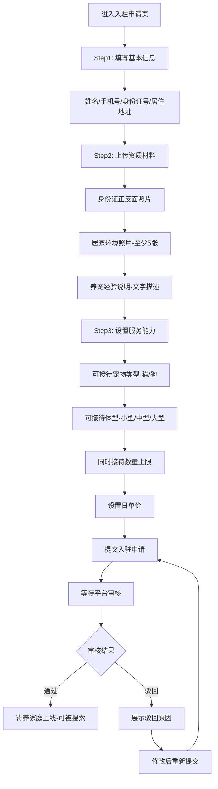
```mermaid
flowchart TD
    A[进入入驻申请页] --> B[Step1: 填写基本信息]
    B --> B1[姓名/手机号/身份证号/居住地址]
    B1 --> C[Step2: 上传资质材料]
    C --> C1[身份证正反面照片]
    C1 --> C2[居家环境照片-至少5张]
    C2 --> C3[养宠经验说明-文字描述]
    C3 --> D[Step3: 设置服务能力]
    D --> D1[可接待宠物类型-猫/狗]
    D1 --> D2[可接待体型-小型/中型/大型]
    D2 --> D3[同时接待数量上限]
    D3 --> D4[设置日单价]
    D4 --> E[提交入驻申请]
    E --> F[等待平台审核]
    F --> G{审核结果}
    G -->|通过| H[寄养家庭上线-可被搜索]
    G -->|驳回| I[展示驳回原因]
    I --> J[修改后重新提交]
    J --> E
```

*业务规则说明：*
1. 身份证照片需清晰可辨认，系统自动 OCR 识别姓名和身份证号
2. 居家环境照片至少 5 张，需覆盖客厅、阳台/院子、宠物休息区、卫生间等
3. 养宠经验说明至少 50 字，描述养宠经历和照护能力
4. 日单价范围 30-150 元/天，平台可设置指导价
5. 审核周期 1-3 个工作日，驳回需附具体原因

### 3.2.3 注册入驻—主要原型

[注册入驻原型](assets/prototypes/foster-family-miniapp/registration-widget.html)

*验收标准说明：*
- [ ] 正常流程：填写3步信息→提交申请→等待审核→审核通过上线
- [ ] 异常流程：照片不清晰→提示重新上传→驳回后展示原因→修改后重新提交
- [ ] 性能要求：图片上传压缩时间 ≤ 2 秒/张

### 3.2.4 服务信息管理
功能描述：寄养家庭可更新居家环境照片和服务说明、修改日单价、管理档期（设置可接单日期范围，标记不可接单的日期）。

*优先级与依赖说明：*
| 项 | 内容 |
| --- | --- |
| 优先级 | P0 |
| 依赖需求 | 入驻审核通过 |
| 前置条件 | 寄养家庭已上线 |

### 3.2.5 服务信息管理—详细流程

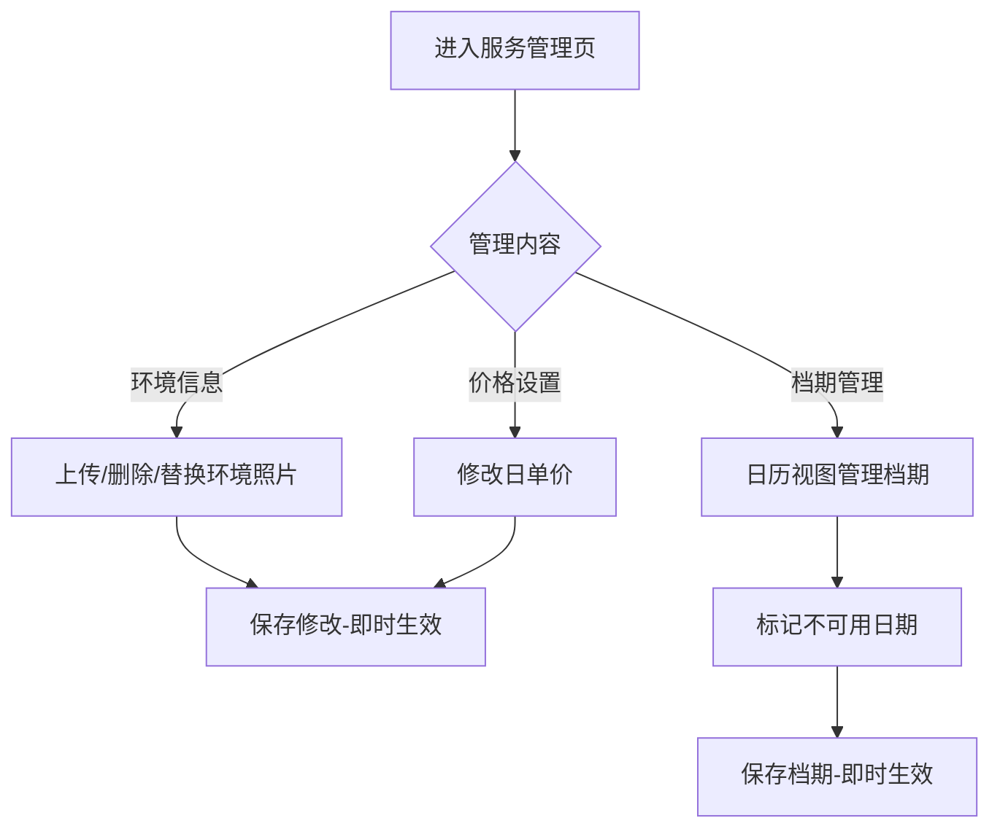
```mermaid
flowchart TD
    A[进入服务管理页] --> B{管理内容}
    B -->|环境信息| C[上传/删除/替换环境照片]
    B -->|价格设置| D[修改日单价]
    B -->|档期管理| E[日历视图管理档期]
    C --> F[保存修改-即时生效]
    D --> F
    E --> G[标记不可用日期]
    G --> H[保存档期-即时生效]
```

*业务规则说明：*
1. 环境照片修改后无需重新审核，即时生效
2. 日单价修改对已确认订单不生效，仅影响新订单
3. 档期管理中，已有预约的日期自动标记为不可用
4. 提前 1 天内的日期不可标记为不可用（防止恶意拒单）

### 3.2.6 服务信息管理—主要原型

[服务信息管理原型](assets/prototypes/foster-family-miniapp/service-manage-widget.html)

*验收标准说明：*
- [ ] 正常流程：进入管理页→修改环境/价格/档期→保存即时生效
- [ ] 异常流程：修改日单价超出范围→提示"日单价需在30-150元之间"
- [ ] 性能要求：日历加载时间 ≤ 300ms

### 3.2.7 预约处理
功能描述：寄养家庭查看新预约请求，确认或拒绝（附原因），处理宠物主人的延期申请。

*优先级与依赖说明：*
| 项 | 内容 |
| --- | --- |
| 优先级 | P0 |
| 依赖需求 | 寄养家庭已上线 |
| 前置条件 | 有新的预约请求 |

### 3.2.8 预约处理—详细流程

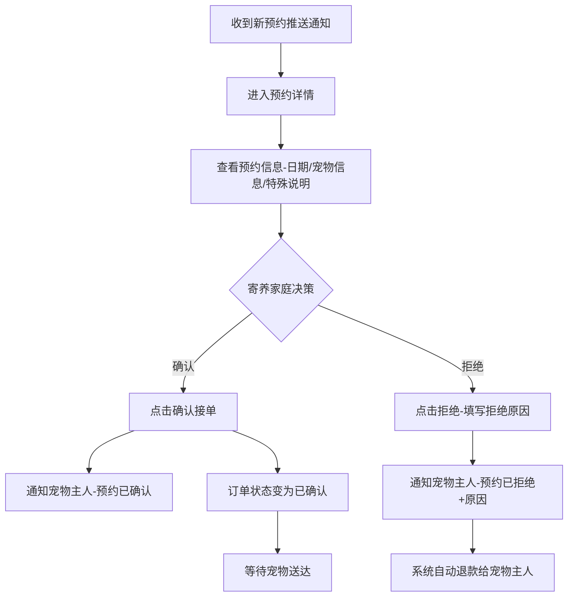
```mermaid
flowchart TD
    A[收到新预约推送通知] --> B[进入预约详情]
    B --> C[查看预约信息-日期/宠物信息/特殊说明]
    C --> D{寄养家庭决策}
    D -->|确认| E[点击确认接单]
    D -->|拒绝| F[点击拒绝-填写拒绝原因]
    E --> G[通知宠物主人-预约已确认]
    F --> H[通知宠物主人-预约已拒绝+原因]
    H --> I[系统自动退款给宠物主人]
    E --> J[订单状态变为已确认]
    J --> K[等待宠物送达]
```

*业务规则说明：*
1. 寄养家庭需在 24 小时内处理预约，超时系统自动提醒
2. 48 小时未处理，系统自动取消订单并退款
3. 拒绝预约需选择原因（档期冲突/宠物类型不匹配/其他）
4. 每月拒绝率超过 30% 将影响搜索排名

### 3.2.9 预约处理—主要原型

[预约处理原型](assets/prototypes/foster-family-miniapp/booking-handle-widget.html)

*验收标准说明：*
- [ ] 正常流程：收到预约→查看详情→确认/拒绝→通知宠物主人
- [ ] 异常流程：超时未处理→系统自动取消→扣减信用分
- [ ] 性能要求：预约推送延迟 ≤ 3 秒

### 3.2.10 寄养日志上传
功能描述：寄养家庭每日上传宠物状态照片/短视频，填写宠物当日状态描述（饮食、精神状态、排便等）。

*优先级与依赖说明：*
| 项 | 内容 |
| --- | --- |
| 优先级 | P0 |
| 依赖需求 | 订单状态为寄养中 |
| 前置条件 | 寄养已开始 |

### 3.2.11 寄养日志上传—详细流程

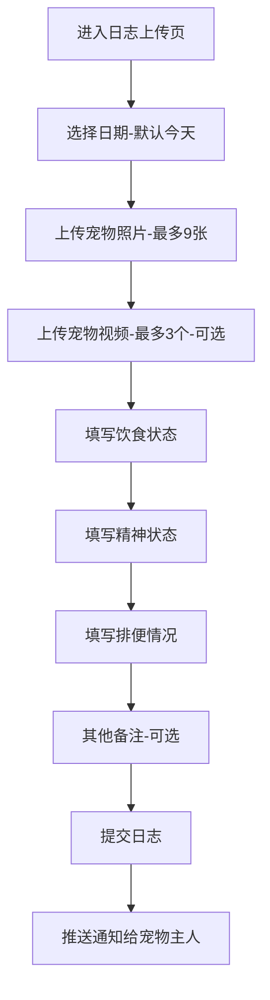
```mermaid
flowchart TD
    A[进入日志上传页] --> B[选择日期-默认今天]
    B --> C[上传宠物照片-最多9张]
    C --> D[上传宠物视频-最多3个-可选]
    D --> E[填写饮食状态]
    E --> F[填写精神状态]
    F --> G[填写排便情况]
    G --> H[其他备注-可选]
    H --> I[提交日志]
    I --> J[推送通知给宠物主人]
```

*业务规则说明：*
1. 每日 20:00 前需提交当日日志，未提交系统自动提醒
2. 照片至少 1 张，视频可选
3. 饮食/精神/排便状态为必填，可快捷选择（好/一般/差）
4. 日志提交后可补充修改（当天内）

### 3.2.12 寄养日志上传—主要原型

[寄养日志上传原型](assets/prototypes/foster-family-miniapp/log-upload-widget.html)

*验收标准说明：*
- [ ] 正常流程：进入上传页→选照片/视频→填写状态→提交→通知主人
- [ ] 异常流程：未填必填项→提示补全→阻止提交
- [ ] 性能要求：日志提交响应时间 ≤ 1 秒

### 3.2.13 收入管理
功能描述：寄养家庭查看每笔订单的收入明细（寄养费-平台服务费=实际收入），将收入提现至银行卡/微信零钱。

*优先级与依赖说明：*
| 项 | 内容 |
| --- | --- |
| 优先级 | P0 |
| 依赖需求 | 订单已完成 |
| 前置条件 | 有可提现收入 |

### 3.2.14 收入管理—详细流程

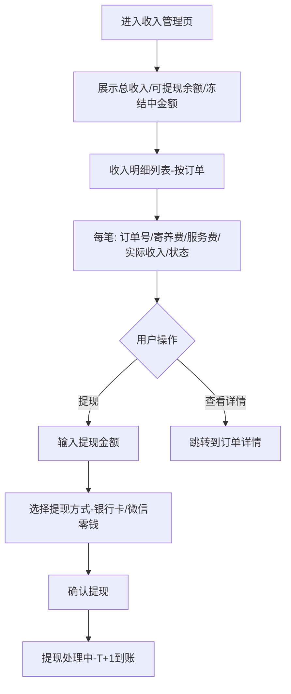
```mermaid
flowchart TD
    A[进入收入管理页] --> B[展示总收入/可提现余额/冻结中金额]
    B --> C[收入明细列表-按订单]
    C --> D[每笔: 订单号/寄养费/服务费/实际收入/状态]
    D --> E{用户操作}
    E -->|提现| F[输入提现金额]
    F --> G[选择提现方式-银行卡/微信零钱]
    G --> H[确认提现]
    H --> I[提现处理中-T+1到账]
    E -->|查看详情| J[跳转到订单详情]
```

*业务规则说明：*
1. 订单完成后 T+1 日收入变为可提现状态
2. 单笔提现最低 10 元，每日最多提现 3 次
3. 提现到银行卡 T+1 到账，微信零钱实时到账
4. 收入明细 = 寄养费 × (1 - 15%平台服务费)

### 3.2.15 收入管理—主要原型

[收入管理原型](assets/prototypes/foster-family-miniapp/income-widget.html)

*验收标准说明：*
- [ ] 正常流程：查看收入→选择提现→输入金额→确认→到账
- [ ] 异常流程：余额不足→提示"可提现余额不足"
- [ ] 性能要求：收入列表加载时间 ≤ 500ms

---

## 3.3 平台管理后台（WEB端）功能

### 3.3.1 入驻审核
功能描述：平台管理员审核寄养家庭提交的入驻申请，查看资料后通过或驳回并填写原因。

*优先级与依赖说明：*
| 项 | 内容 |
| --- | --- |
| 优先级 | P0 |
| 依赖需求 | 寄养家庭入驻申请 |
| 前置条件 | 管理员已登录 |

### 3.3.2 入驻审核—详细流程

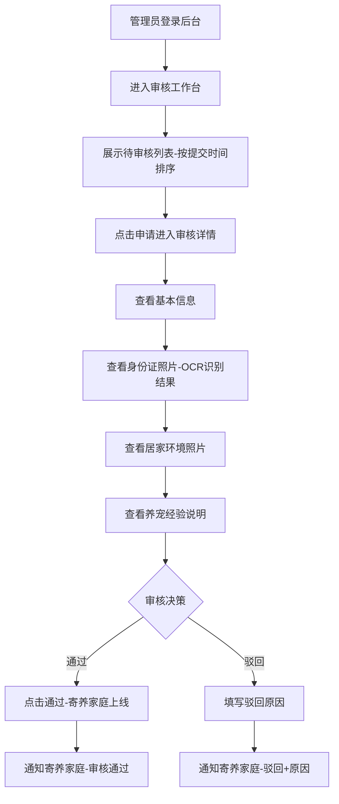
```mermaid
flowchart TD
    A[管理员登录后台] --> B[进入审核工作台]
    B --> C[展示待审核列表-按提交时间排序]
    C --> D[点击申请进入审核详情]
    D --> E[查看基本信息]
    E --> F[查看身份证照片-OCR识别结果]
    F --> G[查看居家环境照片]
    G --> H[查看养宠经验说明]
    H --> I{审核决策}
    I -->|通过| J[点击通过-寄养家庭上线]
    I -->|驳回| K[填写驳回原因]
    K --> L[通知寄养家庭-驳回+原因]
    J --> M[通知寄养家庭-审核通过]
```

*业务规则说明：*
1. 审核需人工操作，暂不支持全自动审核
2. 驳回原因需具体明确（如"环境照片不清晰，请重新拍摄客厅照片"）
3. 审核结果即时通知寄养家庭（微信订阅消息+站内消息）
4. 审核记录保留，可追溯

### 3.3.3 入驻审核—主要原型

[入驻审核原型](assets/prototypes/admin-web/audit-widget.html)

*验收标准说明：*
- [ ] 正常流程：进入审核台→查看申请详情→通过/驳回→通知寄养家庭
- [ ] 异常流程：驳回未填原因→阻止提交→提示"请填写驳回原因"
- [ ] 性能要求：审核详情页加载时间 ≤ 1 秒

### 3.3.4 订单监控
功能描述：平台管理员查看所有寄养订单信息、状态、详情（寄养家庭、宠物、金额、日志、评价）。

*优先级与依赖说明：*
| 项 | 内容 |
| --- | --- |
| 优先级 | P0 |
| 依赖需求 | 订单数据 |
| 前置条件 | 管理员已登录 |

### 3.3.5 订单监控—详细流程

```mermaid
flowchart TD
    A[进入订单管理页] --> B[订单列表-支持多条件筛选]
    B --> C[筛选: 状态/日期范围/寄养家庭/宠物主人]
    C --> D[列表展示: 订单号/主人/宠物/寄养家庭/金额/状态/时间]
    D --> E[点击订单进入详情]
    E --> F[查看完整订单信息]
    F --> G[寄养家庭信息/宠物信息/费用明细]
    G --> H[寄养日志记录/评价内容]
    H --> I{管理员操作}
    I -->|查看| J[仅查看-不改变状态]
    I -->|介入| K[标记为纠纷处理中]
```

*业务规则说明：*
1. 订单列表支持分页，每页 20 条
2. 支持按订单号、寄养家庭、宠物主人、状态、日期范围筛选
3. 订单详情包含完整的订单生命周期信息
4. 管理员可查看所有寄养日志和评价内容

### 3.3.6 订单监控—主要原型

[订单监控原型](assets/prototypes/admin-web/order-monitor-widget.html)

*验收标准说明：*
- [ ] 正常流程：进入订单管理→筛选条件→查看列表→点击详情
- [ ] 异常流程：无匹配订单→展示空状态
- [ ] 性能要求：订单列表加载时间 ≤ 1 秒

### 3.3.7 退款处理
功能描述：处理用户发起的退款申请，根据退款规则审核退款金额。

*优先级与依赖说明：*
| 项 | 内容 |
| --- | --- |
| 优先级 | P0 |
| 依赖需求 | 订单取消/退款申请 |
| 前置条件 | 有退款申请待处理 |

### 3.3.8 退款处理—详细流程

```mermaid
flowchart TD
    A[收到退款申请] --> B[进入退款审核页]
    B --> C[查看订单信息-寄养费/保险费/服务费]
    C --> D[查看退款原因]
    D --> E[系统按规则计算退款金额]
    E --> F{管理员决策}
    F -->|同意| G[确认退款金额]
    G --> H[原路退回-微信支付]
    H --> I[通知用户退款成功]
    F -->|拒绝| J[填写拒绝原因]
    J --> K[通知用户退款被拒绝]
```

*业务规则说明：*
1. 退款规则：寄养家庭确认前全额退款；确认后按时间梯度退款（48h前80%/24-48h50%/24h内不退）
2. 退款原路返回（微信支付），1-3 个工作日到账
3. 退款审核需在 24 小时内完成

### 3.3.9 退款处理—主要原型

[退款处理原型](assets/prototypes/admin-web/refund-widget.html)

*验收标准说明：*
- [ ] 正常流程：查看退款申请→系统计算金额→确认退款→原路退回
- [ ] 异常流程：拒绝退款→填写原因→通知用户
- [ ] 性能要求：退款处理响应时间 ≤ 1 秒

### 3.3.10 运营仪表盘
功能描述：展示平台核心运营指标，包括日活跃用户、新增订单、交易额、寄养家庭数量等，支持报表导出。

*优先级与依赖说明：*
| 项 | 内容 |
| --- | --- |
| 优先级 | P1 |
| 依赖需求 | 各业务模块数据 |
| 前置条件 | 管理员已登录 |

### 3.3.11 运营仪表盘—详细流程

```mermaid
flowchart TD
    A[进入数据中心] --> B[运营仪表盘首页]
    B --> C[核心指标卡片-DAU/新增订单/交易额/寄养家庭数]
    C --> D[趋势图表-7天/30天/自定义]
    D --> E[订单状态分布饼图]
    E --> F[地域分布热力图]
    F --> G{用户操作}
    G -->|导出报表| H[选择时间范围]
    H --> I[导出Excel报表]
    G -->|切换时间| J[更新图表数据]
```

*业务规则说明：*
1. 核心指标实时刷新，每 5 分钟更新一次
2. 趋势图表支持 7 天、30 天、自定义时间范围
3. 报表导出格式为 Excel，包含所有核心指标数据
4. 仪表盘数据权限按管理员角色控制

### 3.3.12 运营仪表盘—主要原型

[运营仪表盘原型](assets/prototypes/admin-web/dashboard-widget.html)

*验收标准说明：*
- [ ] 正常流程：进入数据中心→查看核心指标→查看趋势图→导出报表
- [ ] 异常流程：无数据→展示"暂无数据"占位
- [ ] 性能要求：仪表盘加载时间 ≤ 2 秒

### 3.3.13 纠纷处理
功能描述：处理宠物主人与寄养家庭之间的投诉与纠纷。

*优先级与依赖说明：*
| 项 | 内容 |
| --- | --- |
| 优先级 | P1 |
| 依赖需求 | 投诉/纠纷提交 |
| 前置条件 | 有纠纷待处理 |

### 3.3.14 纠纷处理—详细流程

```mermaid
flowchart TD
    A[收到投诉/纠纷] --> B[进入纠纷管理列表]
    B --> C[查看纠纷详情-订单信息/投诉内容/双方沟通记录]
    C --> D[联系双方了解情况]
    D --> E{协调结果}
    E -->|协商成功| F[双方达成一致]
    F --> G[记录处理结果]
    E -->|协商失败| H[平台介入裁决]
    H --> I[根据证据做出裁决]
    I --> G
    G --> J[通知双方处理结果]
```

*业务规则说明：*
1. 纠纷需在 48 小时内响应处理
2. 处理过程需记录完整的沟通记录和证据
3. 处理结果对双方有约束力
4. 纠纷处理记录纳入寄养家庭信用评价

### 3.3.15 纠纷处理—主要原型

[纠纷处理原型](assets/prototypes/admin-web/dispute-widget.html)

*验收标准说明：*
- [ ] 正常流程：查看纠纷→联系双方→协调/裁决→通知结果
- [ ] 异常流程：双方拒绝协商→平台强制裁决
- [ ] 性能要求：纠纷详情页加载时间 ≤ 1 秒

---

# 4 产品原型

## 4.1 页面跳转逻辑图

```mermaid
flowchart LR
    subgraph "宠物主人端"
        PO1[首页-搜索] --> PO2[寄养家庭详情]
        PO2 --> PO3[预约下单]
        PO3 --> PO4[订单确认]
        PO4 --> PO5[支付]
        PO5 --> PO6[订单列表]
        PO6 --> PO7[订单详情]
        PO7 --> PO8[寄养日志]
        PO7 --> PO9[在线沟通]
        PO7 --> PO10[评价]
        PO1 --> PO11[宠物档案管理]
        PO1 --> PO12[消息中心]
        PO1 --> PO13[个人中心]
    end

    subgraph "寄养家庭端"
        FF1[首页-待办] --> FF2[入驻申请]
        FF1 --> FF3[服务管理]
        FF1 --> FF4[订单管理]
        FF4 --> FF5[预约处理]
        FF4 --> FF6[订单详情]
        FF6 --> FF7[日志上传]
        FF6 --> FF8[在线沟通]
        FF1 --> FF9[收入管理]
        FF1 --> FF10[个人中心]
    end

    subgraph "平台管理后台"
        AD1[登录] --> AD2[工作台首页]
        AD2 --> AD3[入驻审核]
        AD2 --> AD4[订单管理]
        AD2 --> AD5[用户管理]
        AD2 --> AD6[财务管理]
        AD2 --> AD7[数据中心]
        AD2 --> AD8[系统设置]
    end
```

## 4.2 全站点原型设计

### 4.2.1 宠物主人端（小程序端）

**页面清单：**

| 序号 | 页面名称 | 所属模块 | 页面描述 | 关键元素 |
| --- | --- | --- | --- | --- |
| 1 | 首页-搜索 | 搜索匹配 | 搜索寄养家庭、条件筛选、列表/地图展示 | 搜索框、筛选按钮、寄养家庭卡片列表、地图切换 |
| 2 | 寄养家庭详情 | 搜索匹配 | 展示寄养家庭完整信息 | 图片轮播、基本信息、服务信息、评价列表、认证标识、预约/沟通按钮 |
| 3 | 预约下单 | 预约下单 | 选择日期与宠物、补充说明、购买保险 | 日期选择器、宠物选择、说明输入、保险选项、费用明细、支付按钮 |
| 4 | 订单列表 | 订单管理 | 按状态分Tab展示订单 | 状态Tab、订单卡片列表（状态/日期/寄养家庭/金额） |
| 5 | 订单详情 | 订单管理 | 展示订单完整信息 | 订单状态、寄养家庭信息、宠物信息、费用明细、日志入口、操作按钮 |
| 6 | 寄养日志 | 寄养跟踪 | 时间线展示寄养日志 | 时间线、照片/视频、状态描述、点赞按钮 |
| 7 | 在线沟通 | 寄养跟踪 | 即时消息聊天 | 消息列表、输入框、发送按钮、图片/语音按钮 |
| 8 | 评价页面 | 评价系统 | 对寄养家庭评价 | 星级评分、文字输入、图片上传、提交按钮 |
| 9 | 宠物档案 | 账号管理 | 管理宠物信息 | 宠物列表、添加按钮、宠物信息卡片 |
| 10 | 消息中心 | 个人中心 | 接收各类通知 | 消息分类Tab、消息列表、未读标记 |
| 11 | 个人中心 | 个人中心 | 个人信息管理 | 头像昵称、功能入口（宠物档案/订单/消息/帮助/设置） |

**交互说明：**
- 页面跳转关系：
```mermaid
flowchart LR
    A[首页] --> B[详情页]
    B --> C[预约下单]
    C --> D[支付]
    D --> E[订单详情]
    E --> F[寄养日志]
    E --> G[在线沟通]
    E --> H[评价]
    A --> I[宠物档案]
    A --> J[消息中心]
    A --> K[个人中心]
```
- 特殊交互：
  1. 首页支持列表/地图两种模式切换，地图模式展示附近寄养家庭标注
  2. 寄养家庭详情页图片轮播支持左右滑动、大图预览
  3. 寄养日志采用时间线形式展示，上拉加载更多历史日志
  4. 在线沟通支持文字/图片/语音消息，实时推送
  5. 订单列表Tab切换时保持滚动位置

**产品原型：**

[📱 打开宠物主人端小程序全站点原型](assets/prototypes/pet-owner-miniapp-prototype.html)

### 4.2.2 寄养家庭端（小程序端）

**页面清单：**

| 序号 | 页面名称 | 所属模块 | 页面描述 | 关键元素 |
| --- | --- | --- | --- | --- |
| 1 | 首页-待办 | 工作台 | 展示待处理事项 | 待处理预约数、进行中订单数、今日待提交日志、收入概览 |
| 2 | 入驻申请 | 账号管理 | 提交入驻申请 | 3步表单（基本信息/资质材料/服务能力）、提交按钮 |
| 3 | 服务管理 | 服务管理 | 管理服务信息 | 环境照片管理、价格设置、档期日历 |
| 4 | 订单列表 | 订单管理 | 按状态展示订单 | 状态Tab、订单卡片列表 |
| 5 | 预约处理 | 订单管理 | 处理新预约 | 预约详情、宠物信息、确认/拒绝按钮 |
| 6 | 订单详情 | 订单管理 | 展示订单完整信息 | 订单状态、宠物信息、寄养日期、操作按钮 |
| 7 | 日志上传 | 寄养服务 | 上传每日日志 | 照片/视频上传、状态描述（饮食/精神/排便）、提交按钮 |
| 8 | 在线沟通 | 寄养服务 | 即时消息聊天 | 消息列表、输入框、发送按钮 |
| 9 | 收入管理 | 收入管理 | 查看收入与提现 | 收入概览、收入明细列表、提现按钮 |
| 10 | 个人中心 | 个人中心 | 个人信息管理 | 头像昵称、功能入口（服务管理/订单/收入/评价/设置） |

**交互说明：**
- 页面跳转关系：
```mermaid
flowchart LR
    A[首页] --> B[入驻申请]
    A --> C[服务管理]
    A --> D[订单列表]
    D --> E[预约处理]
    D --> F[订单详情]
    F --> G[日志上传]
    F --> H[在线沟通]
    A --> I[收入管理]
    A --> J[个人中心]
```
- 特殊交互：
  1. 首页待办事项卡片可点击快速跳转到对应功能
  2. 入驻申请采用3步表单，每步完成后自动进入下一步
  3. 档期管理采用日历视图，可标记不可用日期
  4. 日志上传支持快捷选择状态（好/一般/差）
  5. 收入明细支持按日期筛选

**产品原型：**

[📱 打开寄养家庭端小程序全站点原型](assets/prototypes/foster-family-miniapp-prototype.html)

### 4.2.3 平台管理后台（WEB端）

**页面清单：**

| 序号 | 页面名称 | 所属模块 | 页面描述 | 关键元素 |
| --- | --- | --- | --- | --- |
| 1 | 登录页 | 系统管理 | 管理员登录 | 账号密码输入、登录按钮 |
| 2 | 工作台首页 | 数据中心 | 运营仪表盘 | 核心指标卡片、趋势图表、订单状态分布 |
| 3 | 入驻审核 | 用户管理 | 审核寄养家庭入驻 | 待审核列表、审核详情、通过/驳回按钮 |
| 4 | 寄养家庭管理 | 用户管理 | 管理寄养家庭 | 列表、搜索、详情、冻结/解冻 |
| 5 | 宠物主人管理 | 用户管理 | 管理宠物主人 | 用户列表、搜索、冻结/解封 |
| 6 | 订单管理 | 订单管理 | 查看所有订单 | 订单列表、多条件筛选、订单详情 |
| 7 | 退款处理 | 订单管理 | 处理退款申请 | 退款列表、退款详情、同意/拒绝 |
| 8 | 纠纷处理 | 订单管理 | 处理投诉纠纷 | 纠纷列表、纠纷详情、处理记录 |
| 9 | 交易流水 | 财务管理 | 查看交易流水 | 流水列表、筛选、导出 |
| 10 | 结算管理 | 财务管理 | 管理寄养家庭结算 | 结算列表、提现审核 |
| 11 | 保险配置 | 内容管理 | 配置保险产品 | 保险方案列表、编辑保费保额 |
| 12 | 数据中心 | 数据中心 | 运营数据报表 | 图表、报表导出 |
| 13 | 系统设置 | 系统管理 | 平台参数配置 | 服务费比例、退款规则、管理员账号 |

**交互说明：**
- 页面跳转关系：
```mermaid
flowchart LR
    A[登录] --> B[工作台]
    B --> C[入驻审核]
    B --> D[订单管理]
    B --> E[用户管理]
    B --> F[财务管理]
    B --> G[数据中心]
    B --> H[系统设置]
    D --> D1[退款处理]
    D --> D2[纠纷处理]
```
- 特殊交互：
  1. 左侧导航栏固定，支持折叠/展开
  2. 工作台核心指标每 5 分钟自动刷新
  3. 表格支持排序、筛选、分页
  4. 审核详情页支持图片放大预览
  5. 报表导出支持 Excel 格式

**产品原型：**

[🖥️ 打开平台管理后台全站点原型](assets/prototypes/admin-web-prototype.html)

---

# 5 数据需求

## 5.1 数据使用规格

**宠物档案数据：**
| 字段 | 是否必填 | 描述 | 数据类型 |
| --- | --- | --- | --- |
| pet_id | 是 | 宠物唯一标识 | UUID |
| owner_id | 是 | 宠物主人ID | UUID |
| pet_type | 是 | 宠物类型（cat/dog） | 字符串 |
| breed | 是 | 品种 | 字符串 |
| weight | 否 | 体重（kg） | 数字 |
| age | 否 | 年龄（岁） | 数字 |
| personality | 否 | 性格特点 | 字符串 |
| special_needs | 否 | 特殊需求（如需喂药） | 字符串 |
| vaccine_cert_url | 否 | 疫苗证明照片URL | 字符串 |

**寄养家庭数据：**
| 字段 | 是否必填 | 描述 | 数据类型 |
| --- | --- | --- | --- |
| host_id | 是 | 寄养家庭唯一标识 | UUID |
| user_id | 是 | 关联用户ID | UUID |
| name | 是 | 姓名 | 字符串 |
| id_card | 是 | 身份证号（加密存储） | 字符串 |
| address | 是 | 居住地址 | 字符串 |
| location | 是 | 经纬度坐标 | JSON |
| environment_photos | 是 | 环境照片URL列表 | JSON数组 |
| pet_experience | 是 | 养宠经验说明 | 字符串 |
| acceptable_pet_types | 是 | 可接待宠物类型 | JSON数组 |
| acceptable_sizes | 是 | 可接待体型 | JSON数组 |
| max_capacity | 是 | 同时接待数量上限 | 数字 |
| daily_price | 是 | 日单价（元） | 数字 |
| certification_status | 是 | 认证状态（pending/approved/rejected） | 字符串 |
| overall_rating | 否 | 综合评分 | 数字 |

**寄养订单数据：**
| 字段 | 是否必填 | 描述 | 数据类型 |
| --- | --- | --- | --- |
| order_id | 是 | 订单唯一标识 | UUID |
| owner_id | 是 | 宠物主人ID | UUID |
| host_id | 是 | 寄养家庭ID | UUID |
| pet_ids | 是 | 寄养宠物ID列表 | JSON数组 |
| start_date | 是 | 寄养开始日期 | 日期 |
| end_date | 是 | 寄养结束日期 | 日期 |
| daily_price | 是 | 日单价 | 数字 |
| total_days | 是 | 寄养天数 | 数字 |
| foster_fee | 是 | 寄养费用 | 数字 |
| insurance_fee | 否 | 保险费用 | 数字 |
| platform_fee | 是 | 平台服务费（15%） | 数字 |
| total_amount | 是 | 订单总额 | 数字 |
| status | 是 | 订单状态 | 字符串 |
| special_notes | 否 | 寄养特殊说明 | 字符串 |
| created_at | 是 | 创建时间 | 时间戳 |

**寄养日志数据：**
| 字段 | 是否必填 | 描述 | 数据类型 |
| --- | --- | --- | --- |
| log_id | 是 | 日志唯一标识 | UUID |
| order_id | 是 | 关联订单ID | UUID |
| host_id | 是 | 寄养家庭ID | UUID |
| log_date | 是 | 日志日期 | 日期 |
| photos | 是 | 照片URL列表 | JSON数组 |
| videos | 否 | 视频URL列表 | JSON数组 |
| diet_status | 是 | 饮食状态（good/normal/poor） | 字符串 |
| mental_status | 是 | 精神状态 | 字符串 |
| excretion_status | 是 | 排便情况 | 字符串 |
| notes | 否 | 其他备注 | 字符串 |
| created_at | 是 | 创建时间 | 时间戳 |

## 5.2 统计数据

1. 统计每日新增订单数、完成订单数、取消订单数，按日/周/月维度统计（P0）
2. 统计平台交易总额、服务费收入、保险收入，按日/周/月维度统计（P0）
3. 统计寄养家庭平均评分、接单率、响应时长，按寄养家庭维度统计（P1）
4. 统计宠物主人复购率、平均客单价，按用户维度统计（P1）
5. 统计各城市/区域寄养家庭数量、订单量，按地域维度统计（P2）

## 5.3 埋点需求

| 页面 | 事件 | 采集字段 | 说明 |
| --- | --- | --- | --- |
| 首页 | page_view | user_id, timestamp, location | 首页访问 |
| 首页 | search_action | user_id, filters, result_count | 搜索行为 |
| 详情页 | page_view | user_id, host_id, timestamp | 详情页访问 |
| 详情页 | click_booking | user_id, host_id | 点击预约按钮 |
| 详情页 | click_chat | user_id, host_id | 点击沟通按钮 |
| 预约页 | submit_order | user_id, host_id, amount, pet_count | 提交订单 |
| 支付页 | pay_success | user_id, order_id, amount | 支付成功 |
| 支付页 | pay_fail | user_id, order_id, error_msg | 支付失败 |
| 日志页 | view_log | user_id, order_id, log_date | 查看日志 |
| 聊天页 | send_message | user_id, order_id, msg_type | 发送消息 |
| 评价页 | submit_review | user_id, order_id, rating | 提交评价 |
| 入驻页 | submit_application | user_id, timestamp | 提交入驻申请 |
| 收入页 | withdraw_request | user_id, amount, method | 提现申请 |

---

# 6 非功能需求

## 6.1 性能需求

**6.1.1 延迟**

| 编号 | 项目 | 最大延迟 | 平均延迟 | 优先级 | 备注 |
| --- | --- | --- | --- | --- | --- |
| 0001 | 小程序首屏加载 | ≤2秒 | ≤1.5秒 | 高 | 4G网络环境 |
| 0002 | 寄养家庭搜索 | ≤1秒 | ≤0.5秒 | 高 | 含地图模式 |
| 0003 | 图片加载（单张） | ≤500ms | ≤300ms | 高 | 压缩+CDN加速 |
| 0004 | 订单列表加载 | ≤500ms | ≤300ms | 高 | 分页加载 |
| 0005 | 支付接口响应 | ≤2秒 | ≤1秒 | 高 | 含微信支付调起 |
| 0006 | 消息送达延迟 | ≤500ms | ≤200ms | 中 | 双方在线时 |

**6.1.2 吞吐量**

| 编号 | 项 | 吞吐量 | 备注 |
| --- | --- | --- | --- |
| 0001 | 用户搜索请求 | 每分钟 1000 次 | 高峰期 |
| 0002 | 订单创建请求 | 每分钟 200 次 | 高峰期 |
| 0003 | 支付回调处理 | 每分钟 500 次 | 高峰期 |
| 0004 | 日志上传请求 | 每分钟 300 次 | 每日20:00前高峰 |

**6.1.3 容量**

| 编号 | 项 | 容量 | 备注 |
| --- | --- | --- | --- |
| 0001 | 并发用户数 | ≥1000 | 同时在线 |
| 0002 | 注册用户数 | ≤1,000,000 | 首年目标 |
| 0003 | 寄养家庭数 | ≤50,000 | 首年目标 |
| 0004 | 日订单量 | ≤10,000 | 首年目标 |

## 6.2 安全需求

| 编号 | 项（系统数据 / 处理过程） |
| --- | --- |
| 0001 | 用户身份证号、支付信息等敏感数据必须加密存储（AES-256） |
| 0002 | 所有API接口必须验证用户身份（JWT Token），防止越权访问 |
| 0003 | 用户上传的图片/视频需经过安全扫描，防止恶意文件 |
| 0004 | 敏感操作（支付、提现、删除）需二次验证（短信验证码） |
| 0005 | 防止SQL注入、XSS攻击、CSRF攻击 |
| 0006 | 日志记录所有敏感操作（登录、支付、提现），保留180天 |

## 6.3 可靠性

| 编号 | 项 | 值 |
| --- | --- | --- |
| 0001 | 系统可用性 | ≥99.5%（月度） |
| 0002 | 平均正常运行时间 | 30天 |
| 0003 | 平均故障恢复时间 | ≤30分钟 |

## 6.4 可连续性

| 编号 | 项 |
| --- | --- |
| Conti.1 | 系统需要 7 × 24 式的全天候运行 |
| Conti.2 | 支付相关服务中断时，已发起的支付需保证最终一致性 |
| Conti.3 | 消息服务中断时，消息需在恢复后补发 |

## 6.5 可恢复性

| 编号 | 项 |
| --- | --- |
| Recov.1 | 核心数据（订单、用户）每日自动全量备份，保留30天 |
| Recov.2 | 业务数据每小时增量备份 |
| Recov.3 | 重大故障需在 1-3 小时恢复服务可用性，24-72 小时内恢复历史数据 |

## 6.6 兼容性

| 编号 | 要求 | 备注 |
| --- | --- | --- |
| 0001 | 小程序端：微信版本≥7.0；iOS 12.0+ / Android 6.0+ | |
| 0002 | 管理后台：Chrome、Edge、Firefox最新两个主版本 | |
| 0003 | 小程序适配主流手机屏幕：375×667、390×844、414×896 | |
| 0004 | 管理后台适配分辨率：1280px及以上 | |

## 6.7 易用性

| 编号 | 要求 | 备注 |
| --- | --- | --- |
| 0001 | 核心流程（搜索→预约→支付）不超过5步完成 | |
| 0002 | 寄养家庭上传日志3步内完成 | |
| 0003 | 文字对比度满足WCAG 2.1 AA标准 | |
| 0004 | 按钮/操作区域不小于44×44pt | |
| 0005 | 普通用户无需培训即可使用核心功能 | |

---

# 7 总结

## 7.1 上线计划

| 阶段 | 时间 | 内容 | 负责人 |
| --- | --- | --- | --- |
| 开发阶段 | 2026-07-01 ~ 2026-07-10 | 核心功能开发（入驻/搜索/预约/支付/日志） | 开发团队 |
| 测试阶段 | 2026-07-11 ~ 2026-07-13 | 功能测试、性能测试、安全测试 | 测试团队 |
| 灰度阶段 | 2026-07-14 ~ 2026-07-16 | 灰度10%用户，验证稳定性 | 运营团队 |
| 全量上线 | 2026-07-17 | 全量开放给所有用户 | 全团队 |

## 7.2 后续迭代规划

- V1.1（上线后1个月）：增加地图模式搜索、宠物主人端增加寄养家庭收藏功能、寄养家庭端增加档期批量设置
- V1.2（上线后2个月）：增加宠物主人端"常去寄养家庭"快捷下单、寄养家庭端增加多宠物同时寄养优惠设置
- V1.3（上线后3个月）：增加宠物健康档案（疫苗记录、过敏史）、平台管理后台增加智能推荐算法（根据宠物特征推荐寄养家庭）
- V2.0（上线后6个月）：增加宠物主人端"寄养社区"（分享寄养经验）、增加宠物电商入口（寄养家庭推荐宠物用品）

## 7.3 参考文档

- 宠物短期家庭寄养匹配助手 - 用户需求说明书（URS）V1.0
- 微信小程序开发文档：https://developers.weixin.qq.com/miniprogram/dev/framework/
- 微信支付接入文档：https://pay.weixin.qq.com/wiki/doc/apiv3/index.shtml
- 腾讯地图API文档：https://lbs.qq.com/
