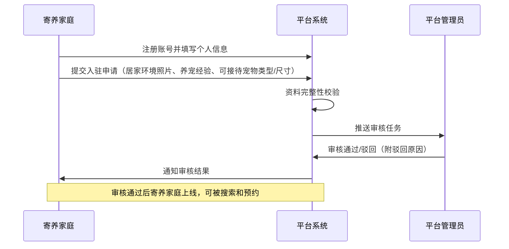
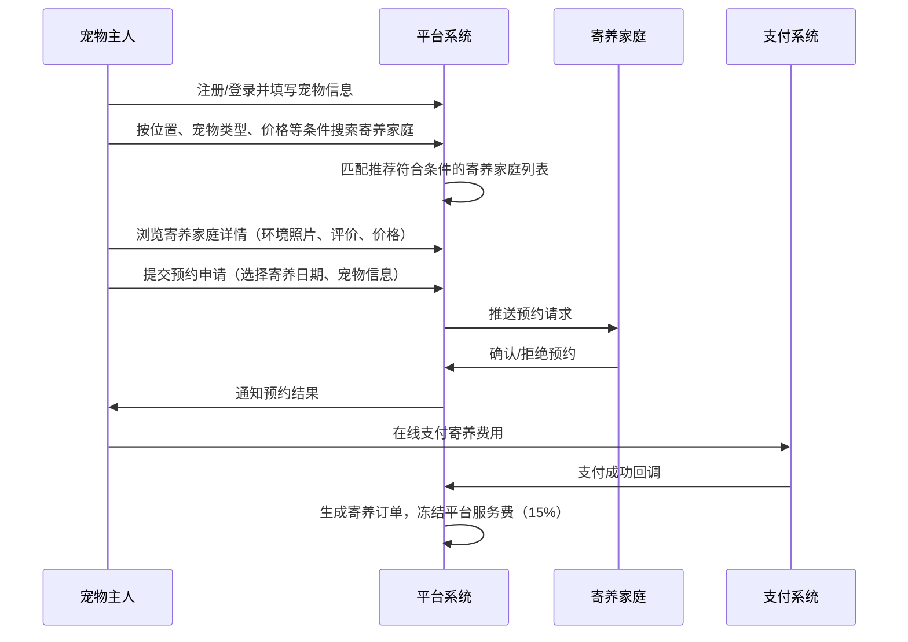
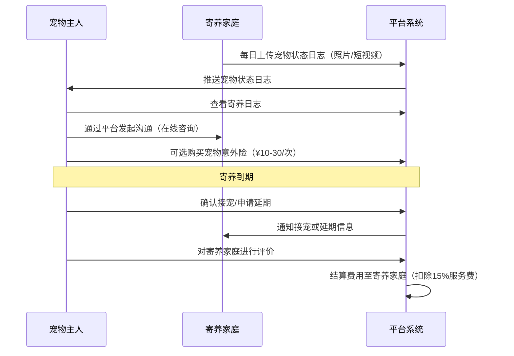
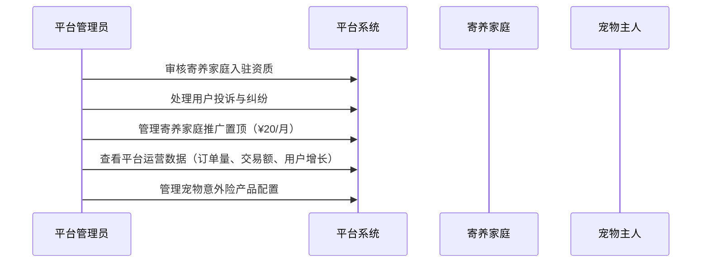
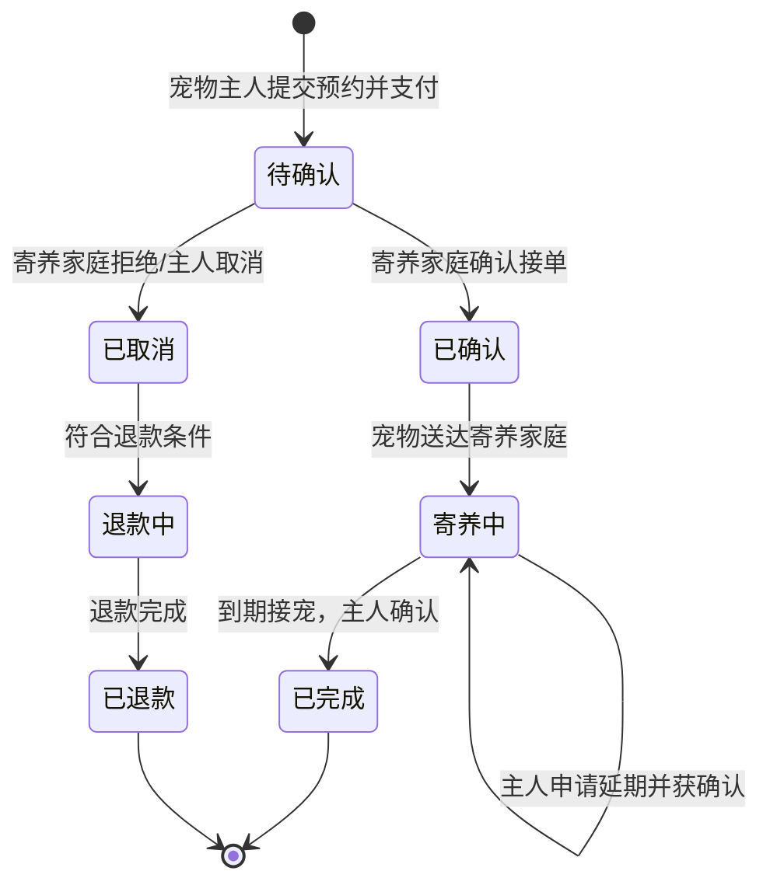
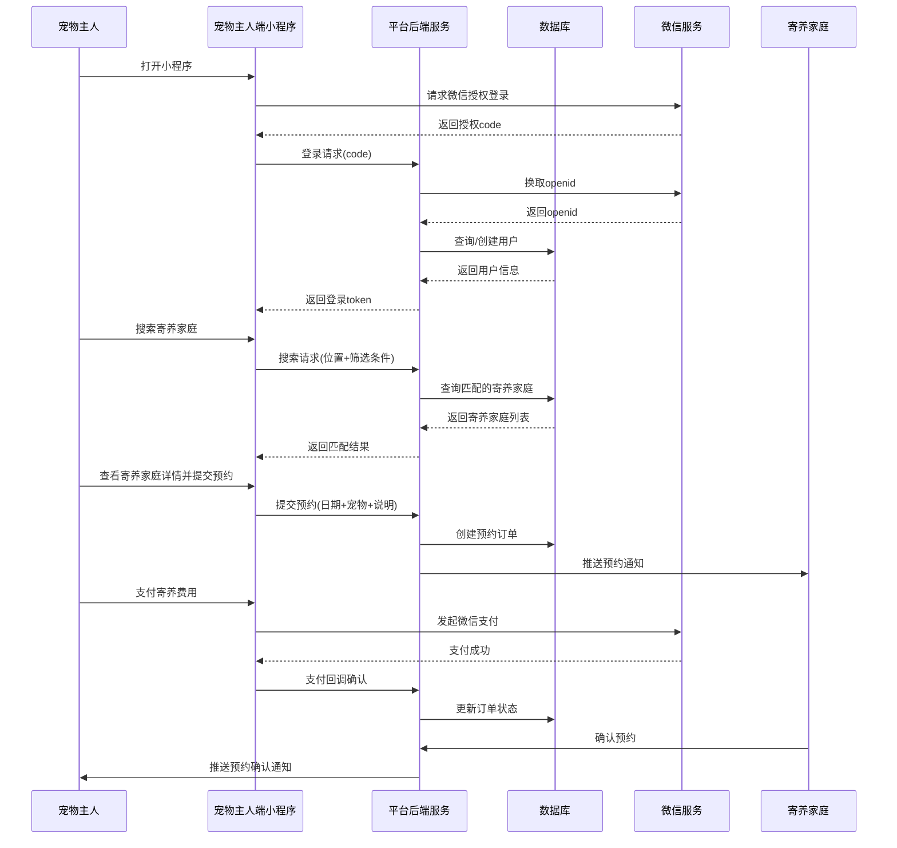
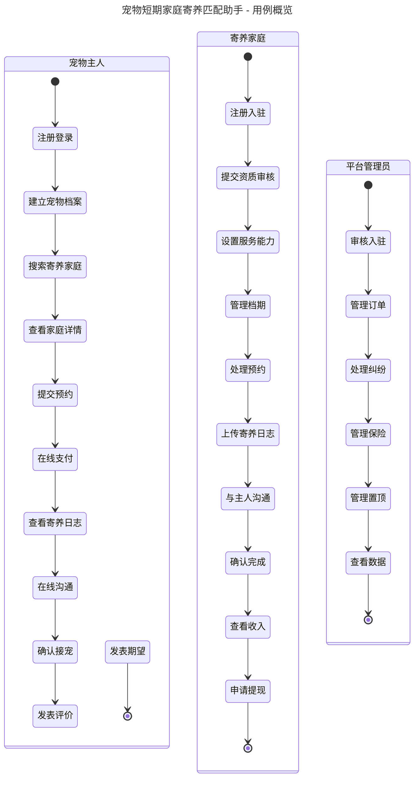

# 宠物短期家庭寄养匹配助手 - 用户需求说明书（URS）

> 文档版本：v1.0.0
> 创建日期：2026-06-29
> 产品负责人：待定
> 文档状态：初稿

---

# 1. 需求概述

## 1.1 需求介绍

宠物短期家庭寄养匹配助手是一款面向经常出差或旅行的宠物主人的服务平台，旨在为宠物主人提供安全、温馨、高性价比的家庭式寄养匹配与预约服务。平台连接经过认证的寄养家庭与有短期寄养需求的宠物主人，差异化于传统宠物店的笼养模式，让宠物在主人外出期间获得家庭式的悉心照料。

### 1.1.1 所属领域

宠物生活服务 / 宠物寄养垂直平台

## 1.2 需求目标

1. 为经常出差/旅行的宠物主人提供便捷的家庭式寄养匹配服务，解决传统宠物店笼养价格高（80-200元/天）、环境不透明、宠物应激等问题
2. 为有养宠经验且有意愿的个人提供寄养服务变现渠道，构建共享经济模式下的宠物寄养生态
3. 通过平台认证审核、寄养日志、宠物意外险等机制，保障寄养双方的权益与信任
4. 打造"短期家庭寄养"细分场景的垂直平台，聚焦猫/狗两大核心宠物品类

## 1.3 系统使用角色

| 角色 | 说明 |
| --- | --- |
| 宠物主人 | 有短期寄养需求的宠物（猫/狗）主人，通过平台搜索、匹配寄养家庭并下单预约 |
| 寄养家庭 | 有养宠经验、愿意提供家庭寄养服务的个人，经平台认证后发布寄养服务 |
| 平台管理员 | 负责寄养家庭资质审核、平台运营管理、投诉纠纷处理、数据监控等 |

## 1.4 业务流程图

### 1.4.1 寄养家庭入驻与认证流程

### 1.4.2 宠物主人搜索与预约流程

### 1.4.3 寄养期间服务流程

### 1.4.4 平台运营与管理流程

# 2. 功能原型

| 原型名称 | 原型链接 | 对应端 | 备注 |
| --- | --- | --- | --- |
| 宠物主人端 | 待产品设计完成 | 小程序端 | 宠物主人搜索、预约、支付、查看寄养日志 |
| 寄养家庭端 | 待产品设计完成 | 小程序端 | 寄养家庭入驻、接单、上传寄养日志 |
| 平台管理后台 | 待产品设计完成 | WEB端 | 审核、运营管理、数据监控 |

# 3. 需求清单

## 3.1 宠物主人端（小程序端）

| 模块 | 一级功能 | 二级功能 | 功能描述 | 备注 |
| --- | --- | --- | --- | --- |
| 账号管理 | 用户注册 | 手机号注册 | 支持手机号+验证码注册登录 | |
| 账号管理 | 用户注册 | 微信授权登录 | 支持微信小程序授权快速登录 | |
| 账号管理 | 宠物档案 | 添加宠物信息 | 填写宠物类型（猫/狗）、品种、体重、年龄、性格特点、特殊需求（如需喂药）、疫苗证明 | 可添加多只宠物 |
| 账号管理 | 宠物档案 | 编辑/删除宠物 | 修改或删除已有的宠物信息 | |
| 搜索匹配 | 寄养家庭搜索 | 条件筛选 | 按地理位置（距离）、宠物类型、可接待尺寸、价格区间等条件筛选寄养家庭 | |
| 搜索匹配 | 寄养家庭搜索 | 地图模式 | 在地图上查看附近可用的寄养家庭分布 | 可选功能 |
| 搜索匹配 | 寄养家庭详情 | 环境展示 | 查看寄养家庭的居家环境照片/视频、房屋面积、是否有院子等 | |
| 搜索匹配 | 寄养家庭详情 | 服务信息 | 查看可接待宠物类型/尺寸、价格、服务范围、寄养规则 | |
| 搜索匹配 | 寄养家庭详情 | 评价浏览 | 查看其他宠物主人对该寄养家庭的评价和评分 | |
| 搜索匹配 | 寄养家庭详情 | 认证标识 | 查看寄养家庭的平台认证状态（身份认证、环境认证等） | |
| 预约下单 | 提交预约 | 选择日期与宠物 | 选择寄养开始/结束日期，选择需要寄养的宠物 | |
| 预约下单 | 提交预约 | 补充寄养说明 | 填写宠物寄养期间的特殊注意事项（如饮食习惯、过敏信息等） | |
| 预约下单 | 订单确认 | 费用明细 | 显示寄养费用（按天数×日单价）、可选保险费用、合计金额 | |
| 预约下单 | 订单确认 | 在线支付 | 支持微信支付完成寄养费用支付 | |
| 预约下单 | 订单管理 | 订单列表 | 查看所有寄养订单（待确认、进行中、已完成、已取消） | |
| 预约下单 | 订单管理 | 取消/退款 | 在寄养家庭确认前可免费取消；确认后按规则退款 | 退款规则待定义 |
| 预约下单 | 订单管理 | 申请延期 | 在寄养期间可申请延长寄养时间，需寄养家庭确认 | |
| 寄养跟踪 | 寄养日志 | 日志浏览 | 查看寄养家庭每日发送的宠物状态照片/短视频 | |
| 寄养跟踪 | 在线沟通 | 即时消息 | 通过平台与寄养家庭进行文字/图片/语音沟通 | |
| 寄养跟踪 | 确认接宠 | 到期确认 | 寄养到期后确认接宠时间 | |
| 评价系统 | 寄养评价 | 文字+图片评价 | 寄养结束后对寄养家庭进行评分（1-5星）和文字/图片评价 | |
| 增值服务 | 宠物意外险 | 在线购买 | 在下单时可选购买宠物意外险（¥10-30/次），覆盖寄养期间意外医疗 | |
| 个人中心 | 基本信息 | 个人资料管理 | 管理个人基本信息、联系方式、默认地址 | |
| 个人中心 | 消息中心 | 系统通知 | 接收预约状态变更、寄养日志更新等系统通知 | |
| 个人中心 | 帮助反馈 | 常见问题 | 查看常见问题解答 | |
| 个人中心 | 帮助反馈 | 意见反馈 | 提交使用反馈或投诉建议 | |

## 3.2 寄养家庭端（小程序端）

| 模块 | 一级功能 | 二级功能 | 功能描述 | 备注 |
| --- | --- | --- | --- | --- |
| 账号管理 | 注册入驻 | 基本信息填写 | 填写姓名、联系方式、身份证号、居住地址 | |
| 账号管理 | 注册入驻 | 资质材料上传 | 上传身份证照片、居家环境照片（客厅/卧室/阳台/卫生间等）、养宠经验说明 | |
| 账号管理 | 注册入驻 | 服务能力设置 | 设置可接待宠物类型（猫/狗）、可接待体型（小型/中型/大型）、同时接待数量上限、日单价 | |
| 账号管理 | 入驻状态 | 审核进度查询 | 查看入驻审核状态及驳回原因 | |
| 服务管理 | 服务信息编辑 | 环境信息更新 | 更新居家环境照片和服务说明 | |
| 服务管理 | 服务信息编辑 | 价格设置 | 设置/修改日单价 | |
| 服务管理 | 服务信息编辑 | 档期管理 | 设置可接单日期范围，标记不可接单的日期 | |
| 订单管理 | 预约处理 | 预约确认/拒绝 | 查看新预约请求，确认或拒绝（附原因） | |
| 订单管理 | 预约处理 | 延期处理 | 处理宠物主人的延期申请 | |
| 订单管理 | 订单列表 | 订单管理 | 查看所有订单（待处理、进行中、已完成、已取消） | |
| 寄养服务 | 寄养日志 | 每日日志上传 | 每日上传宠物状态照片/短视频，填写宠物当日状态描述（饮食、精神状态、排便等） | |
| 寄养服务 | 在线沟通 | 即时消息 | 与宠物主人进行文字/图片/语音沟通 | |
| 寄养服务 | 寄养完成 | 完成确认 | 寄养到期确认宠物被接走 | |
| 收入管理 | 收入明细 | 收入账单 | 查看每笔订单的收入明细（寄养费-平台服务费=实际收入） | |
| 收入管理 | 收入明细 | 提现 | 将收入提现至银行卡/微信零钱 | |
| 个人中心 | 资料管理 | 个人信息维护 | 更新个人信息、联系方式 | |
| 个人中心 | 资料管理 | 认证状态 | 查看认证状态，补充认证材料 | |
| 个人中心 | 消息中心 | 通知管理 | 接收新预约、平台公告等通知 | |
| 个人中心 | 增值服务 | 推广置顶 | 购买推广置顶服务（¥20/月），提升搜索排名 | 可选 |
| 个人中心 | 评价查看 | 评价管理 | 查看宠物主人的评价，查看综合评分 | |

## 3.3 平台管理后台（WEB端）

| 模块 | 一级功能 | 二级功能 | 功能描述 | 备注 |
| --- | --- | --- | --- | --- |
| 用户管理 | 寄养家庭管理 | 入驻审核 | 审核寄养家庭提交的入驻申请（查看资料、通过/驳回并填写原因） | |
| 用户管理 | 寄养家庭管理 | 信息查看/编辑 | 查看寄养家庭详细信息，必要时编辑或冻结账号 | |
| 用户管理 | 寄养家庭管理 | 认证管理 | 管理寄养家庭的认证状态（身份认证、环境认证标签） | |
| 用户管理 | 宠物主人管理 | 用户列表 | 查看注册用户列表及基本信息 | |
| 用户管理 | 宠物主人管理 | 账号管理 | 冻结/解封用户账号 | |
| 订单管理 | 订单监控 | 订单列表 | 查看所有寄养订单信息、状态 | |
| 订单管理 | 订单监控 | 订单详情 | 查看单笔订单的完整信息（寄养家庭、宠物、金额、日志、评价） | |
| 订单管理 | 退款处理 | 退款审核 | 处理用户发起的退款申请 | |
| 订单管理 | 纠纷处理 | 投诉管理 | 处理宠物主人与寄养家庭之间的投诉与纠纷 | |
| 财务管理 | 收入管理 | 交易流水 | 查看平台交易流水（订单金额、服务费收入、保险收入） | |
| 财务管理 | 收入管理 | 结算管理 | 管理寄养家庭的收入结算与提现 | |
| 财务管理 | 增值服务 | 置顶管理 | 管理寄养家庭的推广置顶服务（开通/到期/续费） | |
| 内容管理 | 保险管理 | 保险产品配置 | 配置宠物意外险产品（保费、保额、保障范围） | |
| 内容管理 | 内容管理 | 帮助中心 | 编辑常见问题、使用指南等帮助内容 | |
| 数据中心 | 数据概览 | 运营仪表盘 | 展示核心运营指标（日活跃用户、新增订单、交易额、寄养家庭数量） | |
| 数据中心 | 数据概览 | 报表导出 | 导出运营数据报表 | |
| 系统管理 | 基础配置 | 平台参数 | 设置平台服务费比例（默认15%）、退款规则等 | |
| 系统管理 | 管理员管理 | 账号管理 | 管理后台管理员账号及权限 | |

# 4. 非功能需求

## 4.1 使用界面需求

| 需求项 | 需求描述 |
| --- | --- |
| 界面风格 | 温馨、亲和、信任感强；以暖色调为主，突出"家"的氛围 |
| 操作简便性 | 核心流程（搜索→预约→支付）不超过5步完成；寄养家庭上传日志操作简单，3步内完成 |
| 响应式适配 | 小程序端适配主流手机屏幕尺寸（iOS/Android）；管理后台适配1280px及以上分辨率 |
| 信息展示 | 寄养家庭详情页需支持图片轮播、大图预览；寄养日志采用时间线形式展示 |
| 无障碍 | 文字对比度满足WCAG 2.1 AA标准；按钮/操作区域不小于44×44pt |

## 4.2 软硬件环境需求

| 需求项 | 需求描述 |
| --- | --- |
| 用户端（小程序） | 微信版本≥7.0；iOS 12.0+ / Android 6.0+ |
| 管理后台 | 支持Chrome、Edge、Firefox最新两个主版本 |
| 服务端 | 云服务器部署；支持弹性扩缩容 |
| 存储 | 对象存储服务（图片/视频存储）；关系型数据库（订单、用户等核心数据） |
| 地图服务 | 接入地图API（腾讯地图/高德地图）提供位置搜索和地图展示 |

## 4.3 性能需求

| 需求项 | 需求描述 |
| --- | --- |
| 页面加载 | 首屏加载时间≤2秒（4G网络环境） |
| 搜索响应 | 寄养家庭搜索响应时间≤1秒 |
| 图片加载 | 单张图片加载时间≤500ms（压缩+CDN加速） |
| 并发支持 | 支持至少1000并发用户在线 |
| 可用性 | 系统可用性≥99.5%（月度） |
| 数据备份 | 核心数据（订单、用户）每日自动备份，保留30天 |

## 4.4 约束性需求

1. 本系统不包含宠物社交、宠物电商、宠物医疗等功能，聚焦于"短期家庭寄养匹配"这一核心场景
2. 平台不直接参与寄养服务提供，仅提供信息匹配、交易撮合和纠纷协调
3. 支付功能通过微信支付完成，不自行建设支付通道
4. 宠物意外险由平台与保险公司合作提供，平台作为代销渠道
5. 系统需要后台服务支撑，包括小程序后端API服务和管理后台服务
6. 寄养家庭审核需人工审核，暂不支持全自动审核
7. 不支持宠物类型以外的寄养（如异宠：仓鼠、爬行动物等，MVP阶段仅支持猫和狗）

# 5. 接口需求

## 5.1 硬件接口需求

本系统为纯软件服务平台，无硬件接口需求。

## 5.2 软件接口需求

| 模块 | 接口名称 | 输入 | 输出 | 功能描述 |
| --- | --- | --- | --- | --- |
| 账号管理 | 微信登录接口 | 微信授权code | 用户openid、unionid、头像、昵称 | 对接微信小程序登录能力，实现快速注册登录 |
| 预约下单 | 微信支付接口 | 订单金额、订单号 | 支付结果、交易流水号 | 对接微信支付完成寄养费用在线支付与退款 |
| 搜索匹配 | 地图服务接口 | 用户位置坐标、搜索半径 | 附近寄养家庭列表、距离信息 | 对接腾讯地图/高德地图API实现位置搜索和地图展示 |
| 搜索匹配 | 图片处理接口 | 原始图片文件 | 压缩/裁剪后的图片URL | 对接图片处理服务，实现图片压缩、缩略图生成 |
| 寄养跟踪 | 消息推送接口 | 日志内容、通知类型 | 推送结果 | 对接微信模板消息/订阅消息，推送寄养日志更新、预约状态变更等通知 |
| 寄养跟踪 | 即时通讯接口 | 消息内容 | 消息投递状态 | 对接IM服务实现宠物主人与寄养家庭的在线沟通 |
| 增值服务 | 保险对接接口 | 保单信息、宠物信息 | 电子保单、理赔入口 | 对接合作保险公司API，实现意外险在线购买与理赔 |
| 平台管理 | 短信通知接口 | 手机号、短信内容 | 发送结果 | 对接短信服务商API，发送验证码和重要通知 |
| 存储服务 | 对象存储接口 | 文件（图片/视频） | 文件访问URL | 对接云对象存储服务（如腾讯云COS），存储用户上传的图片和视频 |

## 5.4 通讯接口需求

本系统主要通过HTTPS进行前后端通讯，无特殊硬件通讯协议需求。小程序端与后端服务通过HTTPS通信；即时通讯功能采用WebSocket长连接。

# 6. 附录

## 流程图

### 寄养订单全生命周期状态流转

## 时序图

### 宠物主人完整使用流程

## （用户与系统交互）用例图

