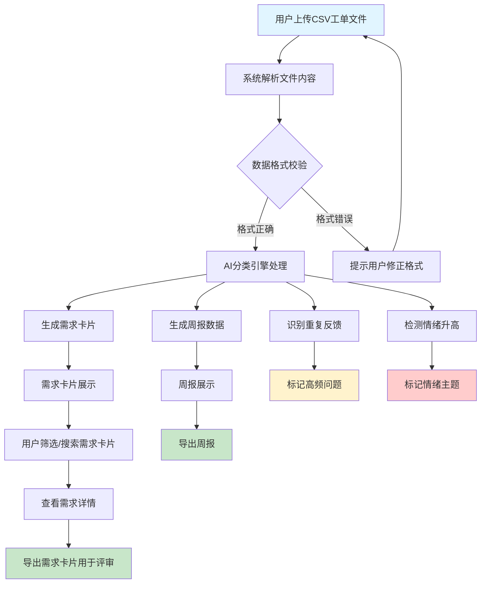
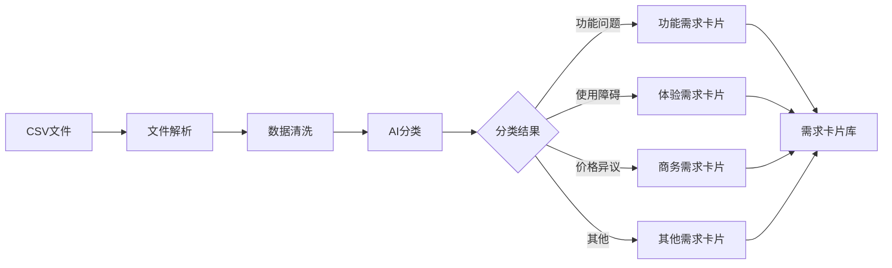
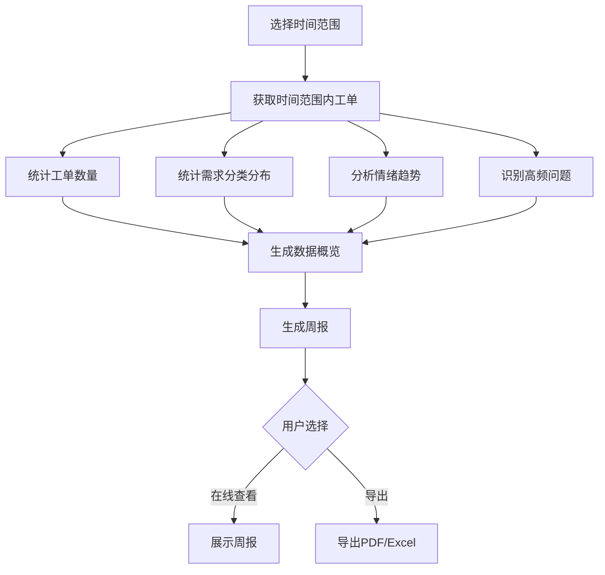
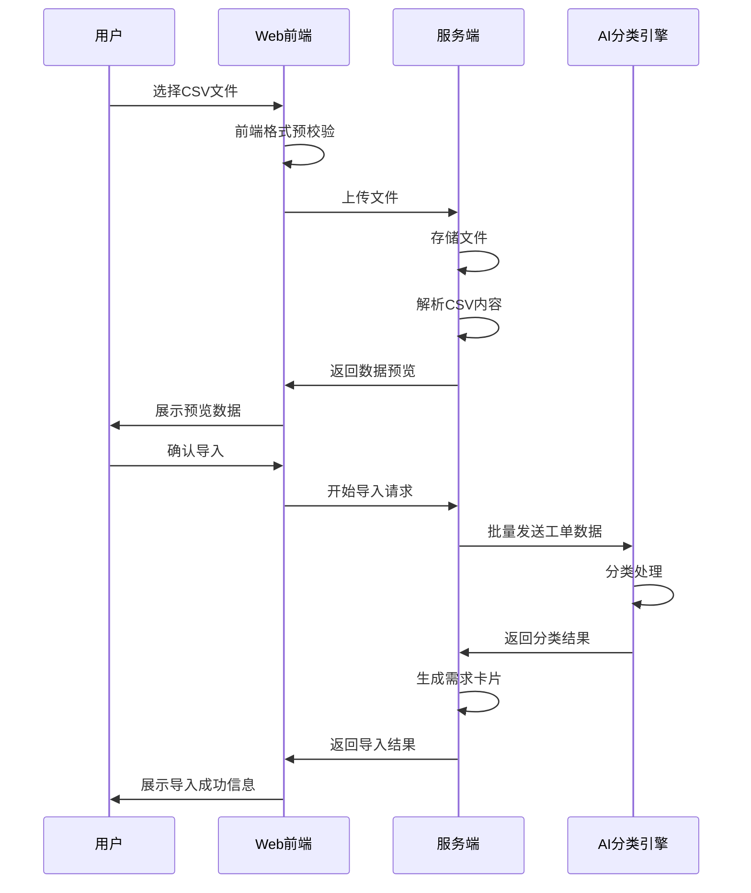
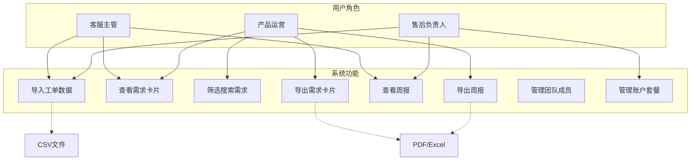
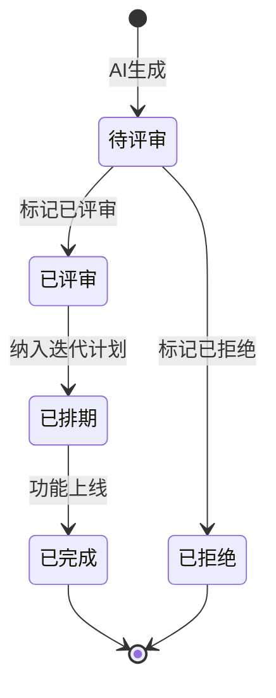

# 客服反馈转产品需求卡AI - 用户需求说明书（URS）

# 1.需求概述

## 1.1 需求介绍

客服反馈转产品需求卡AI是一款面向SaaS客服主管、产品运营和售后团队负责人的AI应用工具。该产品通过分析客服对话记录和工单数据，自动将客户反馈归类为功能问题、使用障碍、价格异议等类别，并生成可进入产品评审的需求卡片，帮助小团队将客服噪音转化为产品决策输入。

### 1.1.1 所属领域

SaaS产品运营 / AI应用 / 客户服务管理

## 1.2 需求目标

1. **降低需求收集成本**：将客服反馈中隐含的产品需求自动提取并结构化，减少人工整理时间
2. **提升需求质量**：通过AI分类和场景分析，确保需求卡片包含用户场景、频次、影响面等关键信息
3. **识别高频问题**：自动发现重复反馈和情绪升高主题，帮助产品团队优先处理关键问题
4. **支撑产品决策**：输出可进入评审流程的需求卡片和周报，为产品迭代提供数据支撑

## 1.3 系统使用角色

| 角色 | 描述 | 主要操作 |
|------|------|----------|
| 客服主管 | 负责客服团队管理，关注客户反馈质量 | 导入工单数据、查看需求卡片、导出周报 |
| 产品运营 | 负责产品迭代规划，关注用户需求 | 查看需求卡片、筛选高优先级需求、生成评审材料 |
| 售后团队负责人 | 负责售后服务质量，关注问题闭环 | 导入反馈数据、查看情绪分析报告、跟踪问题趋势 |

## 1.4 业务流程图

# 2.功能原型

| 原型名称 | 原型链接 | 对应端 | 备注 |
| --- | --- | --- | --- |
| 首页/仪表盘 | ./客服反馈转产品需求卡AI/index.html | WEB端 | 数据概览、快捷入口 |
| 数据导入页 | ./客服反馈转产品需求卡AI/import.html | WEB端 | CSV文件上传、数据校验 |
| 需求卡片页 | ./客服反馈转产品需求卡AI/cards.html | WEB端 | 需求卡片列表、筛选、详情 |
| 周报页 | ./客服反馈转产品需求卡AI/report.html | WEB端 | 周报展示、导出 |

# 3.需求清单

## 3.1 数据导入模块

| 模块 | 一级功能 | 二级功能 | 功能描述 | 备注 |
| --- | --- | --- | --- | --- |
| 数据导入 | CSV文件上传 | 文件选择 | 支持用户选择本地CSV文件进行上传 | 支持.csv格式 |
| 数据导入 | CSV文件上传 | 拖拽上传 | 支持用户拖拽文件到上传区域 | 提升交互体验 |
| 数据导入 | 数据校验 | 格式检查 | 检查CSV文件格式是否符合要求（列名、数据类型） | 提供格式说明模板 |
| 数据导入 | 数据校验 | 数据预览 | 上传后展示前几行数据供用户确认 | 帮助用户确认数据正确性 |
| 数据导入 | 导入确认 | 开始导入 | 用户确认数据无误后开始导入处理 | 显示导入进度 |
| 数据导入 | 导入确认 | 导入结果 | 显示导入成功/失败数量及原因 | 支持查看失败记录 |

## 3.2 AI分类引擎模块

| 模块 | 一级功能 | 二级功能 | 功能描述 | 备注 |
| --- | --- | --- | --- | --- |
| AI分类 | 问题分类 | 功能问题识别 | 识别用户反馈的功能缺陷或改进建议 | 如"功能报错"、"希望增加..." |
| AI分类 | 问题分类 | 使用障碍识别 | 识别用户在使用过程中遇到的困难 | 如"不会操作"、"找不到入口" |
| AI分类 | 问题分类 | 价格异议识别 | 识别用户对价格、计费方式的异议 | 如"太贵了"、"计费不合理" |
| AI分类 | 问题分类 | 其他问题分类 | 识别其他类型的问题或反馈 | 如咨询、建议、投诉等 |
| AI分类 | 场景提取 | 用户场景描述 | 从反馈中提取用户的使用场景 | 自动生成场景描述文本 |
| AI分类 | 场景提取 | 频次统计 | 统计同类反馈出现的次数 | 用于判断需求优先级 |
| AI分类 | 场景提取 | 影响面评估 | 评估问题影响的用户范围 | 基于反馈内容推断 |
| AI分类 | 情绪分析 | 情绪识别 | 识别反馈中的情绪倾向（正面/中性/负面） | 辅助判断紧急程度 |
| AI分类 | 情绪分析 | 情绪升高检测 | 检测同一主题下情绪逐渐升高的趋势 | 预警潜在风险 |

## 3.3 需求卡片模块

| 模块 | 一级功能 | 二级功能 | 功能描述 | 备注 |
| --- | --- | --- | --- | --- |
| 需求卡片 | 卡片展示 | 卡片列表 | 以卡片形式展示所有识别出的需求 | 支持分页或无限滚动 |
| 需求卡片 | 卡片展示 | 卡片详情 | 展示单个需求的完整信息（场景、频次、影响面、原始反馈） | 点击卡片查看详情 |
| 需求卡片 | 筛选搜索 | 分类筛选 | 按问题类型筛选（功能问题/使用障碍/价格异议等） | 快速定位特定类型需求 |
| 需求卡片 | 筛选搜索 | 优先级筛选 | 按优先级筛选（基于频次、情绪、影响面） | 聚焦关键需求 |
| 需求卡片 | 筛选搜索 | 关键词搜索 | 支持关键词搜索需求卡片 | 快速查找特定需求 |
| 需求卡片 | 卡片操作 | 标记状态 | 标记需求状态（待评审/已评审/已拒绝/已排期） | 跟踪需求处理进度 |
| 需求卡片 | 卡片操作 | 导出卡片 | 导出单个或批量导出需求卡片 | 支持PDF/Excel格式 |
| 需求卡片 | 卡片操作 | 添加备注 | 为需求卡片添加评审备注 | 记录评审意见 |

## 3.4 周报模块

| 模块 | 一级功能 | 二级功能 | 功能描述 | 备注 |
| --- | --- | --- | --- | --- |
| 周报 | 周报生成 | 自动汇总 | 按时间周期自动汇总本周数据 | 支持自定义周期 |
| 周报 | 周报生成 | 高频问题统计 | 统计本周出现频次最高的问题TOP10 | 图表展示 |
| 周报 | 周报生成 | 情绪趋势分析 | 展示本周情绪变化趋势 | 折线图展示 |
| 周报 | 周报生成 | 新增需求统计 | 统计本周新增需求数量及分类分布 | 饼图展示 |
| 周报 | 周报展示 | 数据概览 | 展示本周关键指标（工单数、需求数、情绪分布） | 仪表盘形式 |
| 周报 | 周报展示 | 详细报告 | 展示周报详细内容（各类问题明细） | 支持展开查看 |
| 周报 | 周报导出 | 导出周报 | 导出周报为PDF或Excel格式 | 支持自定义导出内容 |

## 3.5 首页/仪表盘模块

| 模块 | 一级功能 | 二级功能 | 功能描述 | 备注 |
| --- | --- | --- | --- | --- |
| 首页 | 数据概览 | 工单统计 | 展示已导入工单总数、本周新增数 | 数字卡片形式 |
| 首页 | 数据概览 | 需求统计 | 展示识别出的需求总数、待评审数 | 数字卡片形式 |
| 首页 | 数据概览 | 情绪分布 | 展示反馈情绪分布情况 | 饼图展示 |
| 首页 | 快捷入口 | 快速导入 | 提供快速导入入口 | 一键进入导入页 |
| 首页 | 快捷入口 | 查看需求 | 提供查看需求卡片入口 | 一键进入需求页 |
| 首页 | 快捷入口 | 生成周报 | 提供生成周报入口 | 一键进入周报页 |

## 3.6 账户与计费模块

| 模块 | 一级功能 | 二级功能 | 功能描述 | 备注 |
| --- | --- | --- | --- | --- |
| 账户 | 用户注册登录 | 注册 | 支持用户注册账号 | 邮箱/手机号注册 |
| 账户 | 用户注册登录 | 登录 | 支持用户登录系统 | 支持记住登录状态 |
| 账户 | 套餐管理 | 查看套餐 | 展示当前套餐信息及用量 | 显示剩余额度 |
| 账户 | 套餐管理 | 升级套餐 | 支持升级到团队版（多账号协作） | 基础版¥59/月 |
| 账户 | 套餐管理 | 用量统计 | 展示本月工单处理量 | 按工单量计费 |
| 账户 | 团队协作 | 成员管理 | 团队版支持添加/移除团队成员 | 仅团队版可用 |
| 账户 | 团队协作 | 权限管理 | 设置成员角色和权限 | 仅团队版可用 |

# 4. 用户场景与优先级排序

## 4.1 核心用户场景

### 场景1：客服主管导入工单并查看需求卡片

**角色**：客服主管  
**前置条件**：已注册账号，有CSV格式工单文件  
**操作流程**：
1. 登录系统，进入首页
2. 点击"快速导入"，上传CSV工单文件
3. 系统校验格式并展示数据预览
4. 确认导入，等待AI分类处理完成
5. 跳转到需求卡片页，查看自动生成的需求卡片
6. 按分类筛选，查看功能问题类需求
7. 标记高优需求为"待评审"

**预期结果**：工单数据被成功导入，AI自动分类生成需求卡片，用户可快速定位高优需求。

### 场景2：产品运营筛选高优先级需求并导出评审材料

**角色**：产品运营  
**前置条件**：已有导入的工单数据和生成的需求卡片  
**操作流程**：
1. 进入需求卡片页
2. 使用"优先级筛选"查看P0级需求
3. 逐个查看需求详情（用户场景、频次、影响面、原始反馈）
4. 为需求添加评审备注
5. 批量选中需要评审的需求卡片
6. 导出为PDF格式用于评审会议

**预期结果**：快速聚焦最关键的产品需求，生成可直接用于评审的材料。

### 场景3：售后负责人查看周报识别问题趋势

**角色**：售后团队负责人  
**前置条件**：系统已有近一周的工单数据  
**操作流程**：
1. 进入周报页
2. 查看本周数据概览（工单数、需求数、情绪分布）
3. 查看高频问题TOP10统计
4. 查看情绪趋势分析，发现情绪升高主题
5. 查看新增需求分类分布
6. 导出周报PDF发送给团队

**预期结果**：清晰了解本周客服反馈全貌，识别需要重点关注的趋势和问题。

### 场景4：团队成员协作处理需求卡片

**角色**：产品运营（团队版）  
**前置条件**：团队版账号，已邀请团队成员  
**操作流程**：
1. 进入需求卡片页
2. 将某需求卡片标记为"已评审"
3. 添加评审备注："建议在Q3迭代中实现"
4. 其他团队成员看到状态更新
5. 产品运营将需求标记为"已排期"
6. 团队在周报中查看排期进展

**预期结果**：团队成员协同处理需求，状态变更实时同步，避免重复工作。

## 4.2 功能优先级排序

### P0 - 核心必备功能（MVP必须）

| 功能 | 所属模块 | 优先级理由 |
|------|----------|------------|
| CSV文件上传（文件选择+拖拽） | 数据导入 | 数据入口，无此功能系统无法使用 |
| 数据格式校验与预览 | 数据导入 | 确保数据质量，防止错误导入 |
| 功能问题识别 | AI分类 | 最核心的分类能力 |
| 使用障碍识别 | AI分类 | 高频反馈类型 |
| 用户场景描述提取 | AI分类 | 需求卡片核心信息 |
| 频次统计 | AI分类 | 优先级判断的关键依据 |
| 卡片列表展示 | 需求卡片 | 核心查看方式 |
| 卡片详情查看 | 需求卡片 | 了解需求全貌 |
| 分类筛选 | 需求卡片 | 快速定位需求类型 |
| 注册/登录 | 账户 | 基础用户体系 |

### P1 - 重要功能（MVP后首版迭代）

| 功能 | 所属模块 | 优先级理由 |
|------|----------|------------|
| 导入结果展示与失败记录 | 数据导入 | 提升导入体验，帮助排错 |
| 价格异议识别 | AI分类 | 商务决策重要输入 |
| 其他问题分类 | AI分类 | 覆盖更多反馈类型 |
| 影响面评估 | AI分类 | 辅助优先级判断 |
| 情绪识别 | AI分类 | 辅助紧急程度判断 |
| 优先级筛选 | 需求卡片 | 聚焦关键需求 |
| 关键词搜索 | 需求卡片 | 提升查找效率 |
| 标记状态（待评审/已评审/已拒绝/已排期） | 需求卡片 | 需求流转管理 |
| 首页数据概览 | 首页 | 快速了解整体状况 |
| 自动汇总与高频问题统计 | 周报 | 定期回顾核心功能 |
| 周报导出 | 周报 | 团队信息共享 |
| 套餐管理与用量统计 | 账户 | 商业化基础 |

### P2 - 增值功能（后续版本）

| 功能 | 所属模块 | 优先级理由 |
|------|----------|------------|
| 情绪升高检测 | AI分类 | 预警功能，需要数据积累 |
| 导出需求卡片（PDF/Excel） | 需求卡片 | 提升协作效率，但非核心 |
| 添加评审备注 | 需求卡片 | 协作增强功能 |
| 情绪趋势分析 | 周报 | 需要时间维度数据积累 |
| 新增需求统计 | 周报 | 统计分析增强 |
| 周报详细报告 | 周报 | 深度分析需求 |
| 快捷入口 | 首页 | 体验优化 |
| 团队协作（成员管理+权限管理） | 账户 | 团队版增值功能 |
| 升级套餐 | 账户 | 商业化进阶 |

## 4.3 优先级排序依据

优先级排序综合考虑以下因素：

1. **用户价值**：是否直接支撑核心用户场景（导入→分类→查看→决策）
2. **业务必要性**：是否为实现产品最小可用功能所必需
3. **技术依赖**：是否为其他功能的前置依赖
4. **差异化贡献**：是否体现产品"客服噪音→产品决策"的核心差异化

# 5.非功能需求

## 5.1 使用界面需求

| 需求项 | 描述 |
|--------|------|
| 响应式设计 | 支持主流浏览器（Chrome、Firefox、Edge），适配1920x1080及以上分辨率 |
| 交互简洁 | 操作步骤不超过3步完成核心任务（导入→查看→导出） |
| 数据可视化 | 使用图表展示统计数据，提升信息理解效率 |
| 中文界面 | 系统界面及提示文案均为中文 |

## 5.2 软硬件环境需求

| 需求项 | 描述 |
|--------|------|
| 客户端 | 现代浏览器（Chrome 90+、Firefox 88+、Edge 90+） |
| 服务端 | 云端部署，支持HTTPS访问 |
| 网络 | 支持在正常网络环境下使用 |

## 5.3 性能需求

| 需求项 | 指标 |
|--------|------|
| 文件上传 | 单个CSV文件（<10MB）上传时间<30秒 |
| AI分类处理 | 1000条工单分类处理时间<5分钟 |
| 页面加载 | 首屏加载时间<3秒 |
| 并发支持 | 支持50个用户同时在线操作 |

## 5.4 约束性需求

1. 本系统不实现通用客服质检功能，专注客服反馈到产品需求的转化
2. 本系统不提供实时聊天或客服接待功能，仅处理已有的工单数据
3. 系统需要后台服务支撑AI分类引擎、数据存储、用户认证等功能
4. MVP版本仅支持CSV格式导入，暂不支持API对接其他客服系统

# 6.接口需求

## 6.1 硬件接口需求

不涉及硬件接口需求。

## 6.2 软件接口需求

| 模块 | 接口名称 | 输入 | 输出 | 功能描述 |
| --- | --- | --- | --- | --- |
| 数据导入 | 文件上传接口 | CSV文件 | 上传结果（成功/失败） | 接收用户上传的CSV文件 |
| AI分类 | AI分类接口 | 工单文本数据 | 分类结果、场景描述、情绪标签 | 调用AI模型进行问题分类和场景提取 |
| 需求卡片 | 数据查询接口 | 筛选条件 | 需求卡片列表 | 根据条件查询需求卡片数据 |
| 周报 | 周报生成接口 | 时间范围 | 周报数据 | 根据时间范围生成周报统计数据 |
| 账户 | 用户认证接口 | 账号密码/Token | 认证结果/用户信息 | 处理用户登录认证 |
| 导出 | 文件导出接口 | 导出数据、格式 | 文件下载链接 | 生成并导出PDF/Excel文件 |

## 6.3 通讯接口需求

不涉及硬件通讯接口需求。系统通过HTTPS协议与AI服务进行通讯。

# 7. 附录

## 流程图

### 需求卡片生成流程

### 周报生成流程

## 时序图

### 数据导入时序

## （用户与系统交互）用例图

## （系统）状态图

### 需求卡片状态

