# 客服知识库缺口捕捉器（KB-Gap Catcher）产品需求文档（PRD）

> **文档编号**：KBGC-PRD-001  
> **产品代号**：KB-Gap Catcher  
> **版本**：V1.0（MVP）  
> **日期**：2026-06-26  
> **作者**：产品文档结对写作专家  
> **输入文档**：客服知识库缺口捕捉器 · 用户需求说明书（URS）v1.0

---

## 变更历史

| 版本号 | 变更日期 | 变更内容 | 变更人 | 审核人 |
| --- | --- | --- | --- | --- |
| V1.0 | 2026-06-26 | 初始版本创建（MVP 范围） | 产品文档结对写作专家 | 阶段一产品落地页文档总编辑 |

---

## 目录

1. [概述](#1-概述)
2. [产品设计](#2-产品设计)
3. [产品功能](#3-产品功能)
4. [产品原型](#4-产品原型)
5. [数据需求](#5-数据需求)
6. [非功能需求](#6-非功能需求)
7. [总结](#7-总结)

---

# 1 概述

## 1.1 需求背景

随着 SaaS、电商、在线教育行业的快速发展，5-50 人规模的中小客服团队面临一个共同困境：**知识库维护永远是"重要但排不上优先级"的事**。具体表现为：

1. **被动修补模式**：知识库更新依赖用户投诉或客服主动反馈，往往是问题爆发后才开始"还债"。大促期间新增 20+ SKU、政策变更等场景下，知识库滞后尤为严重。
2. **隐性高频问题被忽视**：大量"客服已经口头回答、但从未写进 FAQ"的问题在持续消耗客服精力，新客服不知晓口头答案，每次都要问老客服。
3. **无法量化缺口**：帮助中心有 200+ 篇 FAQ，但客服反映"搜不到"或"搜到的不对"，运营无法知道哪些 FAQ 已过时、哪些高频问题根本没写。
4. **冷启动无方向**：新系统上线或系统迁移时（如从邮件工单迁移到 Intercom），缺乏数据驱动的知识库建设路径。

**业务价值**：通过 AI 技术从真实客服对话中自动发现知识库缺口，生成可执行的 FAQ 草稿，将知识库维护从"被动修补"转变为"持续生长"。

**预期目标**（MVP 阶段）：
- 验证"从对话→缺口→FAQ 草稿"的核心路径价值
- 免费版月活 500 团队，付费转化率 ≥5%
- MVP 5-7 天内上线，首月获取 100 个有效反馈

## 1.2 名词解释

| **名词** | **说明** |
| --- | --- |
| 知识库缺口 | 客服在实际对话中遇到的、现有知识库未覆盖或覆盖不足的问题 |
| FAQ 草稿 | 系统基于对话上下文自动生成的 FAQ 初稿，需人工审核后发布 |
| 语义聚类 | 将语义相似的问题归为同一类别的技术（如"怎么退款"和"钱什么时候退"归为一类） |
| 对话证据 | 支持某个缺口存在的原始对话片段，用于佐证缺口的真实性 |
| 影响用户数 | 在分析周期内，遇到同一缺口的不同用户数量 |
| 缺口优先级 | 综合频次、影响用户数、时间衰减等因素计算的排序分值 |
| PII | Personally Identifiable Information，个人可识别信息（姓名、手机号、地址等） |
| LLM | Large Language Model，大语言模型 |
| CSV | Comma-Separated Values，逗号分隔值文件 |
| Kanban | 看板，一种任务管理方法，通过可视化卡片在列之间移动来管理工作流 |

## 1.3 产品介绍

KB-Gap Catcher 是一款**轻量级客服运营外挂工具**，定位为"客服知识库的缺口发现与补全助手"。它不替代 Zendesk、Intercom、飞书客服台等现有客服平台，而是读取这些平台上的对话/工单数据，通过 LLM 聚类与语义分析，自动识别"知识库没覆盖、客服在反复口头解释、用户反复被转人工"的问题，输出一份可直接执行的知识库补全任务清单。

**核心价值主张**：

| # | 价值 | 说明 |
|---|------|------|
| 1 | 从被动到主动 | 不再等用户投诉或客服反馈才补文档，而是系统性地从每一次对话中挖掘缺失 |
| 2 | 从经验到数据 | 用频次 + 影响用户数说话，而非凭"感觉哪里不对" |
| 3 | 从发现到行动 | 不只给报告，直接生成 FAQ 草稿和待审核任务，缩短闭环 |
| 4 | 从重型到轻量 | 不替换现有客服系统，5 分钟接入，即插即用 |

### 1.3.1 范围说明

| 项 | 内容 |
| --- | --- |
| **包含功能** | CSV/文本文件批量导入、LLM 语义聚类分析、知识库缺口识别与排序、FAQ 草稿自动生成、标准回复生成、简易任务看板（待处理/进行中/完成）、工作台概览、免费额度管理 |
| **不包含功能**（MVP 阶段） | 多渠道 API 同步（飞书/企微/Intercom/Zendesk）、知识库版本历史与回滚、审核协作流程、团队成员管理与角色权限、报告导出（Markdown/飞书/Notion）、趋势分析与预警、评论与批注、通知系统 |

---

# 2 产品设计

## 2.1 系统架构图

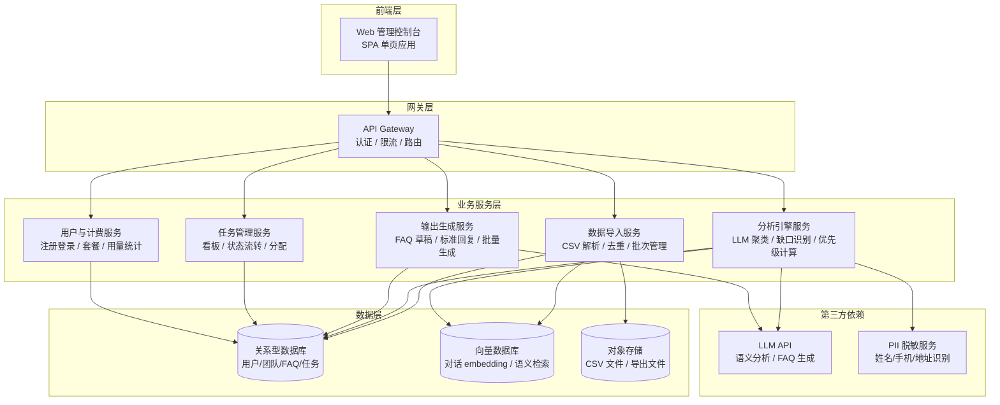

## 2.2 业务模块图

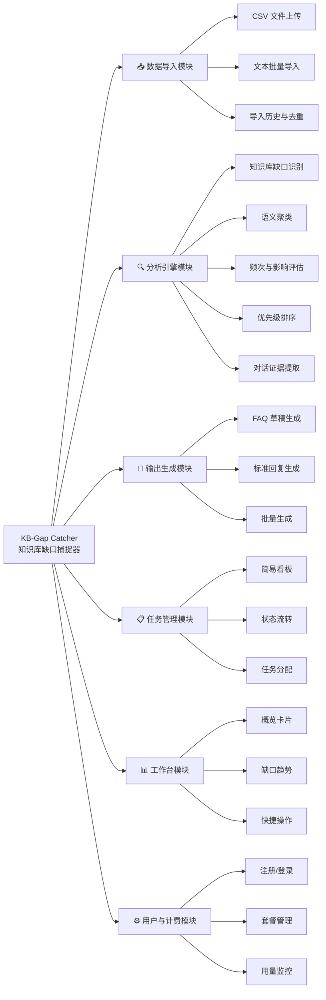

## 2.3 主业务流程

### 流程 1：核心路径 — 从导入到生成 FAQ

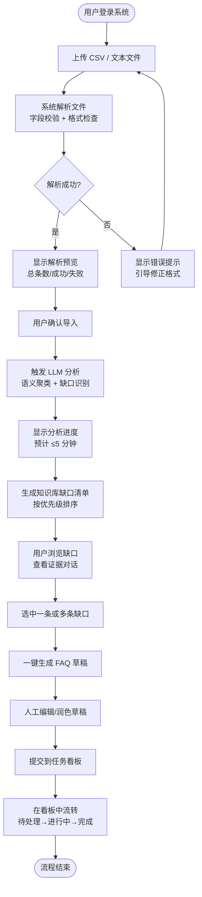

### 流程 2：缺口识别引擎流程

```mermaid
flowchart TD
    Input[导入的对话数据] --> PII[PII 脱敏处理<br/>隐藏姓名/手机/地址]
    PII --> Segment[对话分段<br/>按会话切分]
    Segment --> Detect[缺口信号检测]
    
    Detect --> S1[信号1：客服回复模糊<br/>"不太确定/我帮你问问"]
    Detect --> S2[信号2：用户追问 ≥3 次<br/>同一话题反复追问]
    Detect --> S3[信号3：转人工标记<br/>机器人→人工坐席]
    Detect --> S4[信号4：临时口头解释<br/>无知识库引用记录]
    
    S1 & S2 & S3 & S4 --> Cluster[语义聚类<br/>相似问题归并]
    Cluster --> Stats[统计频次 + 影响用户数]
    Stats --> Score[计算优先级得分<br/>频次 × 影响用户数 × 时间衰减]
    Score --> Evidence[提取 ≥2 条代表性对话作为证据]
    Evidence --> Output[输出缺口清单]
```

### 流程 3：任务看板状态流转

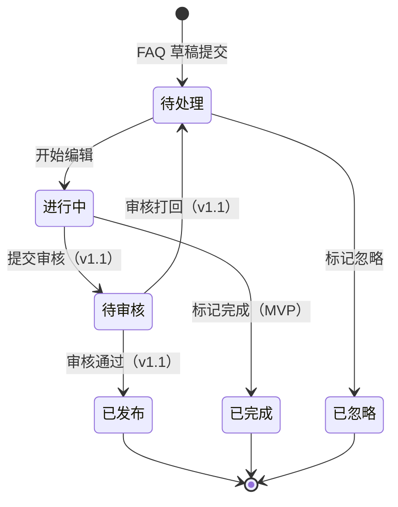

> **注**：MVP 阶段使用简化状态（待处理 → 进行中 → 已完成），v1.1 引入完整审核流程。

## 2.4 功能列表

### 全量功能列表（含 MVP 标注）

| 功能模块 | 功能名称 | 编号 | 优先级 | MVP | 功能描述 |
| --- | --- | --- | --- | --- | --- |
| **工作台** | 概览卡片 | F-05.1 | P0 | ✅ | 展示本月新增缺口数、已解决数、待处理数 |
| **工作台** | 缺口趋势图 | F-05.2 | P1 | ❌ | 按周展示缺口数量变化趋势 |
| **工作台** | 快捷操作入口 | F-05.3 | P0 | ✅ | "立即导入"和"查看缺口"CTA 按钮 |
| **工作台** | TOP 5 缺口 | F-05.4 | P1 | ❌ | 展示优先级最高的 5 个缺口快捷入口 |
| **数据导入** | CSV 文件上传 | F-01.1 | P0 | ✅ | 支持标准格式 CSV，含对话 ID、用户 ID、消息内容等字段，提供模板下载 |
| **数据导入** | 文本批量导入 | F-01.2 | P0 | ✅ | 支持 .txt 文件，一行一条对话或 JSON Lines 格式 |
| **数据导入** | 导入历史与去重 | F-01.7 | P0 | ✅ | 同一对话不重复分析，支持查看导入批次 |
| **数据导入** | 字段映射配置 | F-01.8 | P1 | ❌ | 用户上传的 CSV 字段名不一致时手动映射 |
| **数据导入** | 飞书 API 同步 | F-01.3 | P1 | ❌ | OAuth 授权后自动拉取对话记录 |
| **数据导入** | 企微 API 同步 | F-01.4 | P1 | ❌ | 适配企微接口 |
| **数据导入** | Intercom API 同步 | F-01.5 | P1 | ❌ | 适配 Intercom API |
| **数据导入** | Zendesk API 同步 | F-01.6 | P1 | ❌ | 适配 Zendesk API |
| **分析引擎** | 知识库缺口识别 | F-02.1 | P0 | ✅ | LLM 识别"未解决问题"——客服回复模糊、转人工、用户追问 ≥3 次等信号 |
| **分析引擎** | 语义聚类 | F-02.2 | P0 | ✅ | 将相似问题归为同一缺口（如"怎么退款"和"钱什么时候退"） |
| **分析引擎** | 频次统计 | F-02.3 | P0 | ✅ | 统计每个缺口在分析周期内的出现次数 |
| **分析引擎** | 影响用户数统计 | F-02.4 | P0 | ✅ | 统计每个缺口影响的不同用户数 |
| **分析引擎** | 综合优先级评分 | F-02.5 | P0 | ✅ | 频次 × 影响用户数 × 时间衰减，生成排序分值 |
| **分析引擎** | 对话证据提取 | F-02.6 | P0 | ✅ | 每个缺口附带 ≥2 条代表性原始对话 |
| **分析引擎** | 趋势分析 | F-02.7 | P2 | ❌ | 缺口频次随时间变化趋势 |
| **输出生成** | FAQ 草稿生成 | F-03.1 | P0 | ✅ | 基于对话上下文生成 FAQ 草稿（标题+答案+标签），支持编辑 |
| **输出生成** | 标准回复生成 | F-03.2 | P0 | ✅ | 针对缺口生成可直接使用的标准回复话术 |
| **输出生成** | 批量生成 | F-03.3 | P1 | ❌ | 选中多条缺口一键批量生成草稿 |
| **输出生成** | 导出 | F-03.4 | P2 | ❌ | 导出为 Markdown/飞书文档/Notion 格式 |
| **输出生成** | 数据报告 | F-03.5 | P1 | ❌ | 生成本期分析报告 |
| **任务管理** | 简易看板 | F-04.1 | P0 | ✅ | 看板视图（待处理→进行中→已完成），支持拖拽 |
| **任务管理** | 审核流程 | F-04.2 | P0 | ❌ | 草稿→审核→通过/打回→发布（v1.1） |
| **任务管理** | 团队成员管理 | F-04.3 | P1 | ❌ | 邀请成员、分配角色 |
| **任务管理** | 版本历史 | F-04.4 | P1 | ❌ | FAQ 条目完整版本历史 |
| **任务管理** | 评论与批注 | F-04.5 | P2 | ❌ | 在草稿上添加评论 |
| **任务管理** | 通知 | F-04.6 | P1 | ❌ | 站内信/邮件通知 |
| **用户与计费** | 注册/登录 | F-06.1 | P0 | ✅ | 邮箱注册、密码登录 |
| **用户与计费** | 套餐与用量 | F-06.2 | P0 | ✅ | 免费版/团队版展示，本月用量显示 |
| **用户与计费** | 免费额度管理 | F-06.3 | P0 | ✅ | 达 80% 提醒，达上限引导升级 |

## 2.5 你的产品有哪些端

| 序号 | 端名称 | 端类型 | 目标用户 | 说明 |
| --- | --- | --- | --- | --- |
| 1 | KB-Gap Catcher 管理控制台 | WEB端 | 客服运营、客服主管 | 客服运营/主管在电脑浏览器上使用，完成数据导入、缺口分析、FAQ 编辑、任务管理全流程 |

> **说明**：MVP 阶段仅 Web 端，最小支持分辨率 1280×720，推荐 1920×1080。移动端查看为远期规划。

---

# 3 产品功能

> 以下按 2.5 节定义的 WEB 端，逐模块列出其功能规格。每个功能包含描述、详细流程和主要原型。

## 3.1 工作台模块

### 3.1.1 工作台概览

**功能描述**

工作台是用户登录系统后的首屏页面，用于快速了解知识库健康状态和快捷入口。核心价值在于让用户"一眼看到全局"——本月发现了多少缺口、处理了多少、还有多少待办。

| 项 | 内容 |
| --- | --- |
| 优先级 | P0 |
| 依赖需求 | US-02, US-03 |
| 前置条件 | 用户已登录 |

**功能规格**

1. **概览卡片区域**（3 张数字卡片并排）：
   - 📊 本月新增缺口数：统计当前自然月内分析发现的缺口总数，与上月同期对比（↑/↓百分比）
   - ✅ 已解决数：本月已标记为"已完成"的缺口/FAQ 数量
   - ⏳ 待处理数：当前处于"待处理"状态的任务数量
2. **快捷操作区域**：
   - 「立即导入」按钮：点击跳转至数据导入页
   - 「查看缺口」按钮：点击跳转至缺口清单页
3. **空状态处理**：
   - 未导入任何数据时，展示引导卡片："还没有导入对话数据，立即导入开始分析"

**业务规则**：
1. 数字卡片的数据每 5 分钟自动刷新一次
2. 对比百分比基于上月同天数计算（如今日是 26 号，对比上月 1-26 号）
3. 待处理数包含所有状态为"待处理"和"进行中"的任务

### 3.1.2 工作台概览—详细流程

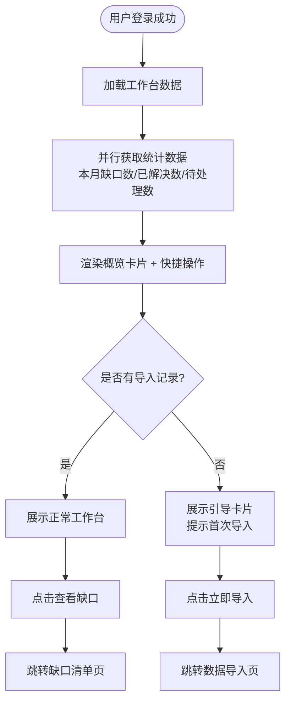

### 3.1.3 工作台概览—主要原型

[工作台概览原型](assets/prototypes/web/dashboard-widget.html)

**验收标准**：
- [ ] 正常流程：已导入数据的用户登录后，3 张数字卡片正确显示本月统计数据，快捷操作按钮可正常跳转
- [ ] 空状态：未导入数据的用户看到引导卡片，点击"立即导入"跳转至导入页
- [ ] 性能要求：工作台首屏加载时间 ≤2 秒

---

## 3.2 数据导入模块

### 3.2.1 CSV 文件上传

**功能描述**

CSV 文件上传是 MVP 阶段的核心数据入口。用户上传包含客服对话记录的 CSV 文件，系统解析后展示预览统计，用户确认后进入分析流程。

| 项 | 内容 |
| --- | --- |
| 优先级 | P0 |
| 依赖需求 | US-01 |
| 前置条件 | 用户已登录，且本月剩余配额 ≥ 文件中的对话条数 |

**功能规格**

1. **模板下载**：提供标准 CSV 模板下载，包含字段：
   - `conversation_id`（对话 ID，必填）
   - `user_id`（用户 ID，必填）
   - `agent_id`（客服 ID，选填）
   - `message_content`（消息内容，必填）
   - `message_role`（消息角色：user/agent，必填）
   - `timestamp`（时间戳，ISO 8601 格式，必填）
   - `channel`（渠道来源，选填）
2. **文件上传**：
   - 支持拖拽上传和点击选择
   - 文件大小限制：≤10MB
   - 文件编码：UTF-8
   - 对话条数限制：免费版 ≤500 条，团队版 ≤10,000 条
3. **解析预览**：
   - 解析完成后展示统计：总条数、成功条数、失败条数
   - 失败行提供行号和错误原因预览（最多展示前 10 条失败记录）
   - 字段自动识别：如字段名与模板不完全一致，尝试智能匹配（MVP 仅精确匹配）
4. **确认导入**：
   - 用户确认后，对话数据入库，触发分析引擎
   - 导入记录写入"导入历史"

**业务规则**：
1. 同一 `conversation_id` 不重复导入（去重）
2. 免费用户每月最多导入 500 条对话（按成功导入条数计）
3. CSV 文件必须包含表头行，系统通过表头识别字段
4. `message_content` 为空或长度 < 2 字符的行自动跳过
5. 上传过程中显示进度条，支持取消上传

### 3.2.2 CSV 文件上传—详细流程

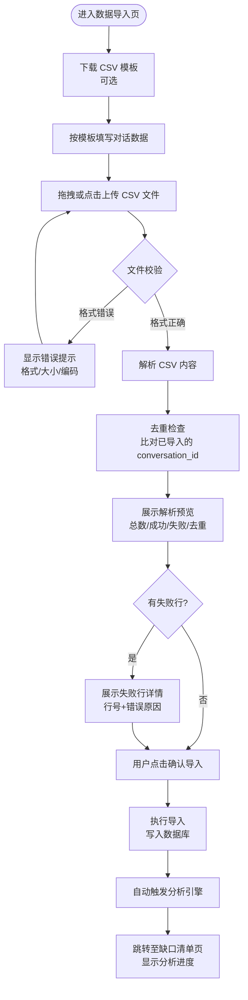

### 3.2.3 CSV 文件上传—主要原型

[CSV 文件上传原型](assets/prototypes/web/csv-upload-widget.html)

**验收标准**：
- [ ] 正常流程：上传符合模板的 CSV（≤500 条），解析成功，显示统计信息，确认导入后自动触发分析
- [ ] 异常流程：上传超大文件（>10MB）提示文件过大；上传格式错误的文件提示格式不正确；上传含重复 conversation_id 的文件自动去重并提示去重条数
- [ ] 性能要求：500 条对话的 CSV 解析时间 ≤5 秒
- [ ] 免费额度：免费版用户导入第 501 条时提示额度已满，引导升级

### 3.2.4 文本批量导入

**功能描述**

支持 .txt 文件导入对话数据，适应不同数据来源的格式。支持两种格式：纯文本（一行一条对话）和 JSON Lines（每行一个 JSON 对象）。

| 项 | 内容 |
| --- | --- |
| 优先级 | P0 |
| 依赖需求 | US-01 |
| 前置条件 | 用户已登录，且本月剩余配额充足 |

**功能规格**

1. **纯文本格式**：
   - 每行代表一条对话消息
   - 以 `---` 分隔不同对话
   - 行首 `[用户]` / `[客服]` 标识角色
   - 示例：
     ```
     [用户] 你好，我想问一下退款怎么操作
     [客服] 您好，请问您的订单号是多少？
     [用户] 订单号是 20260626001
     ---
     [用户] 请问能导出 PDF 报告吗
     [客服] 暂不支持 PDF 导出，您可以截图保存
     ```
2. **JSON Lines 格式**：
   - 每行一个 JSON 对象
   - 必填字段：`conversation_id`, `content`, `role`, `timestamp`
3. **格式自动识别**：系统根据文件内容自动判断格式类型

**业务规则**：
1. 文件大小限制同 CSV（≤10MB）
2. 对话条数计入月度配额
3. 自动识别格式失败时，提示用户手动选择格式

### 3.2.5 导入历史与去重

**功能描述**

展示用户的所有导入批次记录，支持查看每批次的详情，并确保同一对话不会被重复分析。

| 项 | 内容 |
| --- | --- |
| 优先级 | P0 |
| 依赖需求 | US-01 |
| 前置条件 | 用户已至少完成一次导入 |

**功能规格**

1. **导入历史列表**：
   - 展示字段：批次号、导入时间、文件名、对话条数、成功/失败条数、分析状态
   - 按时间倒序排列
   - 支持分页（每页 20 条）
2. **去重机制**：
   - 以 `conversation_id` 为唯一标识
   - 重复导入时自动跳过已有对话，并在预览中显示"去重 X 条"
   - 用户可在预览中选择"强制覆盖"（仅团队版）

**业务规则**：
1. 导入历史保留最近 90 天的记录
2. 分析状态：待分析 → 分析中 → 分析完成 / 分析失败
3. 分析失败的批次可手动重试

---

## 3.3 分析引擎模块

### 3.3.1 知识库缺口识别

**功能描述**

分析引擎的核心能力——通过 LLM 识别对话中的"未解决问题"信号，包括客服回复模糊、用户反复追问、转人工、临时口头解释等场景。

| 项 | 内容 |
| --- | --- |
| 优先级 | P0 |
| 依赖需求 | US-02 |
| 前置条件 | 已成功导入对话数据 |

**功能规格**

1. **缺口信号检测**（4 类信号）：
   - **信号 A — 客服回复模糊**：客服使用"我不太确定""我帮你问一下""请稍等我确认"等话术，表示知识库中无现成答案
   - **信号 B — 用户追问 ≥3 次**：同一对话中用户就同一话题追问 3 次以上，表示客服未能一次性解答
   - **信号 C — 转人工**：对话从机器人/自动回复转至人工客服，且人工客服的回复中无标准话术引用
   - **信号 D — 临时口头解释**：客服给出了较长的解释性回复（>100 字），但未引用任何知识库条目
2. **PII 脱敏**：分析前自动对用户姓名、手机号、地址、邮箱等 PII 信息进行脱敏处理
3. **分析进度展示**：
   - 显示分析进度条（百分比）
   - 显示预计剩余时间
   - 分析过程中用户可继续操作其他功能

**业务规则**：
1. 每条对话至少命中 1 类信号才被标记为"疑似缺口"
2. 命中信号的对话片段会被提取为"对话证据"
3. PII 脱敏在发送到 LLM API 之前完成
4. 分析过程异步执行，不阻塞用户操作

### 3.3.2 语义聚类

**功能描述**

将命中缺口信号的对话通过语义相似度聚类，把"问法不同但本质相同"的问题归为同一个缺口（如"怎么退款"和"钱什么时候退"归为一类），避免重复。

| 项 | 内容 |
| --- | --- |
| 优先级 | P0 |
| 依赖需求 | US-02, US-03 |
| 前置条件 | 缺口信号检测完成 |

**功能规格**

1. **聚类算法**：
   - 使用 LLM Embedding + 余弦相似度进行语义聚类
   - 相似度阈值 ≥0.85 的对话归为同一缺口
   - 聚类结果由 LLM 生成每个缺口簇的"问题摘要"
2. **聚类结果**：
   - 每个缺口簇包含：问题摘要（LLM 生成）、包含的对话条数、涉及的不同用户数
   - 支持手动合并/拆分缺口（MVP 暂不实现，v1.1）

**业务规则**：
1. 聚类结果中，每个缺口簇至少包含 2 条对话
2. 仅包含 1 条对话的"缺口"不进入清单（视为个例）
3. 聚类完成后自动计算优先级评分

### 3.3.3 频次统计与影响用户数

**功能描述**

统计每个缺口在分析周期内的出现频次和影响的不同用户数量，作为优先级排序的核心依据。

| 项 | 内容 |
| --- | --- |
| 优先级 | P0 |
| 依赖需求 | US-03 |
| 前置条件 | 语义聚类完成 |

**功能规格**

1. **频次统计**：统计每个缺口簇中包含的对话条数
2. **影响用户数**：统计每个缺口簇中涉及的不同 `user_id` 数量
3. **时间范围**：统计基于当前分析批次的对话时间范围（由 CSV 中的 timestamp 字段确定）

### 3.3.4 综合优先级评分

**功能描述**

基于频次、影响用户数和时间衰减计算每个缺口的综合优先级分值，用于缺口清单的默认排序。

| 项 | 内容 |
| --- | --- |
| 优先级 | P0 |
| 依赖需求 | US-03 |
| 前置条件 | 频次和影响用户数统计完成 |

**功能规格**

1. **评分公式**：
   ```
   priority_score = frequency × unique_users × time_decay_factor
   ```
   - `frequency`：缺口出现频次
   - `unique_users`：影响的不同用户数
   - `time_decay_factor`：时间衰减因子，越近出现的缺口权重越高
     - 最近 7 天内：1.0
     - 8-14 天：0.8
     - 15-30 天：0.6
     - 30 天以上：0.4
2. **排序**：默认按 `priority_score` 降序排列

### 3.3.5 对话证据提取

**功能描述**

为每个缺口提取至少 2 条代表性原始对话作为证据，让用户可以"眼见为实"地确认缺口真实性。

| 项 | 内容 |
| --- | --- |
| 优先级 | P0 |
| 依赖需求 | US-02 |
| 前置条件 | 语义聚类完成 |

**功能规格**

1. **证据选择策略**：
   - 优先选择信号最明显的对话（如追问次数最多、客服回复最模糊的）
   - 每个缺口展示 2-5 条代表性对话
   - 对话内容中 PII 信息已脱敏
2. **证据展示**：
   - 在缺口卡片中以折叠形式预览
   - 点击可展开查看完整对话
   - 支持跳转到原始对话上下文

---

## 3.4 输出生成模块

### 3.4.1 FAQ 草稿生成

**功能描述**

基于缺口的对话上下文，由 LLM 自动生成 FAQ 草稿（含问题标题、答案正文、标签），用户可在编辑器中修改润色后确认。

| 项 | 内容 |
| --- | --- |
| 优先级 | P0 |
| 依赖需求 | US-04 |
| 前置条件 | 缺口清单已生成 |

**功能规格**

1. **生成输入**：
   - 缺口的问题摘要
   - 关联的 2-5 条代表性对话
   - 缺口的频次和影响用户数
2. **生成输出**：
   - **问题标题**：一句话概括用户问题（如"如何申请退款？"）
   - **答案正文**：基于对话上下文总结的标准答案（Markdown 格式，200-500 字）
   - **标签**：3-5 个关键词标签（如"退款"、"订单"、"售后"）
3. **编辑器**：
   - 富文本编辑器，支持 Markdown / 可视化双模式切换
   - 左侧编辑、右侧预览
   - 关联缺口引用（点击可跳转查看原始证据）
   - 标签管理（可增删改标签）
4. **操作**：
   - 「保存草稿」：保存当前编辑内容
   - 「提交到看板」：保存到草稿并提交到任务看板
   - 「重新生成」：对当前缺口重新调用 LLM 生成

**业务规则**：
1. 每条 FAQ 草稿必须关联至少 1 个缺口
2. 免费版每月最多生成 10 条 FAQ 草稿
3. 重新生成会覆盖当前编辑内容（操作前弹出确认提示）
4. 草稿自动保存（每 30 秒或内容变更时）

### 3.4.2 FAQ 草稿生成—详细流程

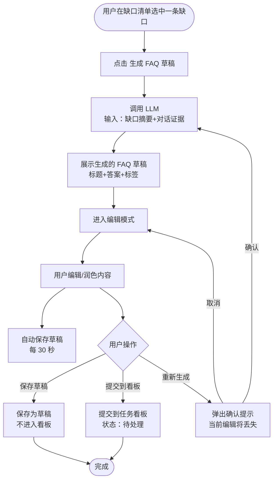

### 3.4.3 FAQ 草稿生成—主要原型

[FAQ 草稿生成原型](assets/prototypes/web/faq-editor-widget.html)

**验收标准**：
- [ ] 正常流程：选中一条缺口后点击"生成 FAQ 草稿"，系统在 10 秒内生成草稿（含标题、答案、标签），用户可在编辑器中修改
- [ ] 编辑功能：支持 Markdown/可视化切换，支持标签增删，支持关联缺口跳转
- [ ] 重新生成：点击"重新生成"弹出确认提示，确认后重新调用 LLM
- [ ] 免费额度：免费版第 11 次生成时提示额度已满

### 3.4.4 标准回复生成

**功能描述**

针对缺口生成可直接使用的标准回复话术，与 FAQ 草稿的区别在于：标准回复更短（50-150 字），语气更像客服对话，可直接复制粘贴到客服聊天窗口。

| 项 | 内容 |
| --- | --- |
| 优先级 | P0 |
| 依赖需求 | US-04 |
| 前置条件 | 缺口清单已生成 |

**功能规格**

1. **生成内容**：
   - 一段标准回复话术（50-150 字）
   - 语气亲切、专业，适合直接发送给客户
   - 包含必要的话术模板变量（如 `{用户姓名}`、`{订单号}`）
2. **操作**：
   - 「复制」：一键复制到剪贴板
   - 「编辑」：修改话术内容
   - 「转为 FAQ」：将标准回复扩展为完整 FAQ 草稿

**业务规则**：
1. 标准回复不计入 FAQ 草稿月度配额
2. 每条缺口可生成多个版本的标准回复

---

## 3.5 任务管理模块

### 3.5.1 简易任务看板

**功能描述**

MVP 阶段提供简易看板视图（待处理 → 进行中 → 已完成），用于管理 FAQ 草稿的生产流程。用户可通过拖拽卡片在看板列之间移动，改变任务状态。

| 项 | 内容 |
| --- | --- |
| 优先级 | P0 |
| 依赖需求 | US-05 |
| 前置条件 | 已生成至少 1 条 FAQ 草稿 |

**功能规格**

1. **看板列**：
   - **待处理**：已提交但未开始编辑的 FAQ 草稿
   - **进行中**：正在编辑或审核中的 FAQ
   - **已完成**：编辑完成、确认发布的 FAQ
2. **卡片信息**：
   - FAQ 标题
   - 关联缺口优先级标签（P0 红 / P1 橙 / P2 蓝）
   - 责任人（MVP 默认为当前用户）
   - 创建时间
   - 最后编辑时间
3. **交互**：
   - 拖拽卡片到目标列 → 自动更新状态
   - 点击卡片 → 打开 FAQ 编辑视图
   - 列头显示该列任务计数
4. **筛选**：
   - 按优先级筛选
   - 按创建时间排序

**业务规则**：
1. 每张卡片只能处于一个状态列中
2. 拖拽操作实时保存
3. 已完成的 FAQ 可在知识库模块中查看

### 3.5.2 简易任务看板—详细流程

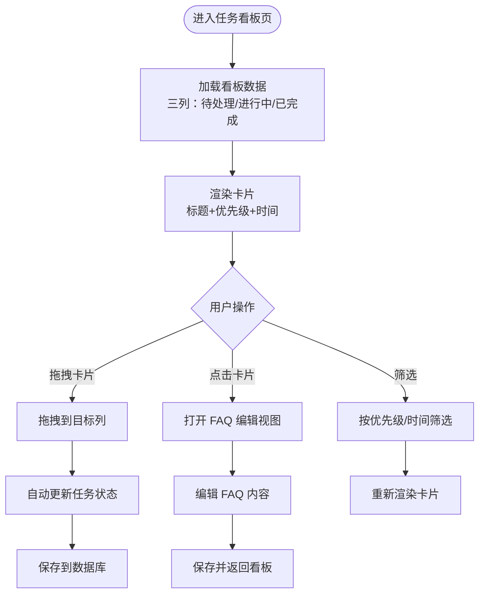

### 3.5.3 简易任务看板—主要原型

[任务看板原型](assets/prototypes/web/task-board-widget.html)

**验收标准**：
- [ ] 正常流程：看板正确展示三列（待处理/进行中/已完成），卡片可拖拽切换状态，状态变更即时保存
- [ ] 卡片信息：显示标题、优先级标签、责任人、时间
- [ ] 点击交互：点击卡片打开编辑视图，编辑完成返回看板
- [ ] 空状态：某列为空时显示"暂无任务"提示

---

## 3.6 缺口清单模块

### 3.6.1 缺口清单列表

**功能描述**

缺口清单是用户查看和管理所有知识库缺口的核心页面。以列表/卡片形式展示所有识别出的缺口，支持排序、筛选、搜索，以及批量操作。

| 项 | 内容 |
| --- | --- |
| 优先级 | P0 |
| 依赖需求 | US-02, US-03 |
| 前置条件 | 至少完成一次分析 |

**功能规格**

1. **展示模式**：
   - **列表视图**（默认）：紧凑表格形式，展示缺口摘要、频次、影响用户数、优先级分值、状态
   - **卡片视图**：卡片形式，每个缺口一张卡片，展示更多信息
2. **排序**：
   - 默认按综合优先级降序
   - 可切换为按频次、影响用户数、最近出现时间排序
3. **筛选**：
   - 按来源批次筛选
   - 按处理状态筛选（未处理/已生成草稿/已忽略）
4. **搜索**：按缺口摘要关键词搜索
5. **批量操作**：
   - 勾选多条缺口 → 「批量生成 FAQ 草稿」
   - 勾选多条缺口 → 「批量标记忽略」
6. **每条缺口卡片信息**：
   - 问题摘要（LLM 生成）
   - 频次数字（如"出现 23 次"）
   - 影响用户数（如"影响 18 人"）
   - 优先级标签（P0/P1/P2）
   - 证据预览（折叠展示前 2 条对话片段）
   - 操作按钮：「生成 FAQ 草稿」「标记忽略」

### 3.6.2 缺口清单列表—详细流程

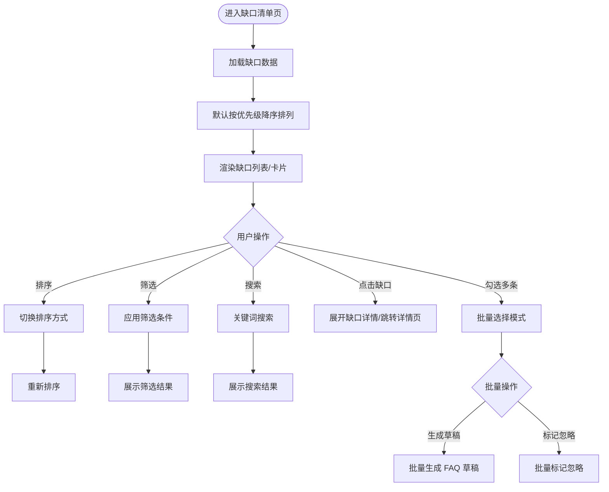

### 3.6.3 缺口清单列表—主要原型

[缺口清单原型](assets/prototypes/web/gap-list-widget.html)

**验收标准**：
- [ ] 正常流程：缺口清单正确展示所有缺口，默认按优先级排序，支持列表/卡片视图切换
- [ ] 排序功能：可按优先级、频次、影响用户数、时间排序
- [ ] 筛选功能：可按批次、状态筛选，支持关键词搜索
- [ ] 批量操作：可勾选多条缺口批量生成草稿或标记忽略
- [ ] 证据预览：每条缺口折叠展示前 2 条对话证据

---

## 3.7 用户与计费模块

### 3.7.1 注册与登录

**功能描述**

提供邮箱注册和密码登录功能，支持"记住我"和"忘记密码"。

| 项 | 内容 |
| --- | --- |
| 优先级 | P0 |
| 依赖需求 | 无 |
| 前置条件 | 无 |

**功能规格**

1. **注册**：
   - 输入：邮箱、密码（≥8 位，含大小写+数字）、确认密码
   - 发送验证邮件，点击链接激活
   - 注册成功自动登录并进入工作台
2. **登录**：
   - 输入：邮箱、密码
   - 支持"记住我"（30 天免登录）
   - 支持"忘记密码"（邮件重置）
3. **安全**：
   - 连续 5 次密码错误锁定账号 15 分钟
   - 登录态 Token 有效期 7 天

### 3.7.2 套餐与用量管理

**功能描述**

展示当前套餐信息、本月用量统计，以及套餐升级入口。

| 项 | 内容 |
| --- | --- |
| 优先级 | P0 |
| 依赖需求 | US-01, US-04 |
| 前置条件 | 用户已登录 |

**功能规格**

1. **用量展示**：
   - 本月已导入对话条数 / 上限（如 "320 / 500 条"）
   - 本月已生成 FAQ 草稿数 / 上限（如 "7 / 10 条"）
   - 进度条可视化
2. **用量提醒**：
   - 达 80% 时页面顶部显示黄色提醒条
   - 达 100% 时显示红色提醒条，相关操作按钮引导升级
3. **套餐对比**：
   - 展示免费版 vs 团队版权益对比表
   - 「升级到团队版」按钮（¥79/月）

**业务规则**：
1. 用量每月初 1 日 00:00 重置
2. 升级后立即生效，当月用量不重置
3. 降级在当月结束后生效

---

# 4 产品原型

## 4.1 页面跳转逻辑图

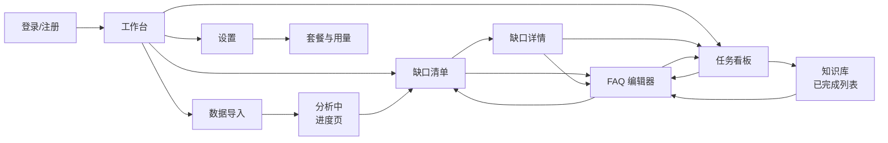

## 4.2 全站点原型设计

### 4.2.1 KB-Gap Catcher 管理控制台（WEB端）

**页面清单：**

| 序号 | 页面名称 | 所属模块 | 页面描述 | 关键元素 |
| --- | --- | --- | --- | --- |
| 1 | 登录页 | 用户与计费 | 邮箱密码登录，支持注册入口 | 登录表单、记住我、忘记密码、注册链接 |
| 2 | 注册页 | 用户与计费 | 新用户注册 | 注册表单、邮箱验证提示 |
| 3 | 工作台 | 工作台 | 首屏概览，展示关键数字和快捷操作 | 3 张数字卡片、缺口趋势图、TOP 5 缺口、CTA 按钮 |
| 4 | 数据导入页 | 数据导入 | 上传 CSV/文本文件，查看导入历史 | 上传区域、模板下载、格式选择、导入历史表格 |
| 5 | 分析进度页 | 分析引擎 | 展示分析进度和预计时间 | 进度条、百分比、预计剩余时间、当前处理步骤 |
| 6 | 缺口清单页 | 缺口清单 | 查看所有缺口，排序/筛选/批量操作 | 列表/卡片切换、排序下拉、筛选面板、缺口卡片、批量操作栏 |
| 7 | 缺口详情页 | 缺口清单 | 单个缺口的详细信息和证据 | 问题摘要、统计数据、对话证据列表、操作按钮 |
| 8 | FAQ 编辑页 | 输出生成 | 编辑 FAQ 草稿 | Markdown 编辑器、预览面板、标签管理、关联缺口、操作按钮 |
| 9 | 任务看板页 | 任务管理 | Kanban 看板管理 FAQ 任务 | 三列看板、可拖拽卡片、筛选、计数 |
| 10 | 知识库页 | 任务管理 | 已完成 FAQ 列表 | FAQ 列表、搜索、导出按钮 |
| 11 | 设置页 | 用户与计费 | 套餐信息、用量统计、账户设置 | 套餐对比表、用量进度条、升级按钮 |

**交互说明：**

- 页面跳转关系：
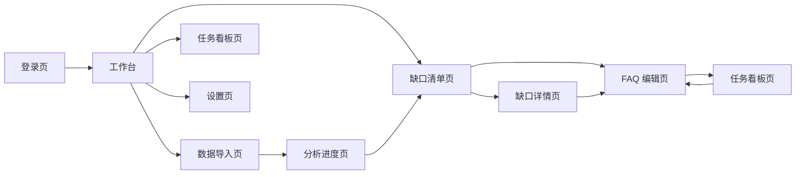

- 特殊交互：
  1. 全局侧边栏导航：左侧固定侧边栏，包含工作台/数据导入/缺口清单/任务看板/知识库/设置入口，当前页面高亮
  2. 拖拽交互：任务看板支持卡片拖拽到不同列，拖拽时卡片半透明，目标列高亮
  3. 分析进度：分析进度页显示实时进度条和步骤指示器（PII脱敏→语义分析→聚类→评分→证据提取）
  4. 空状态：各页面在空数据时展示引导性空状态（插画+文案+CTA 按钮）
  5. Toast 提示：操作成功/失败时右上角弹出 Toast 通知，3 秒自动消失
  6. 确认对话框：删除、重新生成等不可逆操作前弹出确认对话框
  7. 响应式布局：最小支持 1280×720，侧边栏在窄屏时可折叠为图标模式

**产品原型：**

[🖥️ 打开 KB-Gap Catcher 管理控制台全站点原型](assets/prototypes/kb-gap-catcher-prototype.html)

---

# 5 数据需求

## 5.1 数据使用规格

### CSV 导入模板字段

| **字段** | **是否必填** | **描述** | **数据类型** |
| --- | --- | --- | --- |
| conversation_id | 是 | 对话唯一标识，用于去重 | 字符串 |
| user_id | 是 | 发起咨询的用户标识 | 字符串 |
| agent_id | 否 | 接待客服的标识 | 字符串 |
| message_content | 是 | 消息内容，长度 2-5000 字符 | 字符串 |
| message_role | 是 | 消息角色：user（用户）/ agent（客服） | 枚举 |
| timestamp | 是 | 消息时间戳，ISO 8601 格式 | 日期时间 |
| channel | 否 | 渠道来源标识（如 webchat、email、phone） | 字符串 |

### 缺口数据模型

| **字段** | **是否必填** | **描述** | **数据类型** |
| --- | --- | --- | --- |
| gap_id | 是 | 缺口唯一标识 | UUID |
| summary | 是 | LLM 生成的问题摘要 | 字符串 |
| frequency | 是 | 出现频次 | 整数 |
| unique_users | 是 | 影响用户数 | 整数 |
| priority_score | 是 | 综合优先级评分 | 浮点数 |
| status | 是 | 状态：unprocessed / draft_generated / ignored | 枚举 |
| batch_id | 是 | 关联的导入批次 ID | UUID |
| evidence_ids | 是 | 关联的对话证据 ID 列表 | UUID 数组 |
| created_at | 是 | 创建时间 | 日期时间 |
| updated_at | 是 | 更新时间 | 日期时间 |

### FAQ 草稿数据模型

| **字段** | **是否必填** | **描述** | **数据类型** |
| --- | --- | --- | --- |
| faq_id | 是 | FAQ 唯一标识 | UUID |
| title | 是 | FAQ 问题标题 | 字符串 |
| content | 是 | FAQ 答案正文（Markdown） | 字符串 |
| tags | 否 | 标签列表 | 字符串数组 |
| gap_id | 是 | 关联的缺口 ID | UUID |
| status | 是 | 状态：draft / in_progress / done | 枚举 |
| assignee_id | 否 | 责任人 ID（MVP 默认为创建者） | UUID |
| created_at | 是 | 创建时间 | 日期时间 |
| updated_at | 是 | 更新时间 | 日期时间 |

## 5.2 统计数据

1. 工作台概览卡片统计（P0）：
   - 本月新增缺口数：`COUNT(gaps) WHERE created_at IN current_month`
   - 已解决数：`COUNT(faqs) WHERE status='done' AND updated_at IN current_month`
   - 待处理数：`COUNT(faqs) WHERE status IN ('draft', 'in_progress')`
2. 用量统计（P0）：
   - 本月导入对话条数：`SUM(messages) WHERE batch.created_at IN current_month`
   - 本月生成 FAQ 草稿数：`COUNT(faqs) WHERE created_at IN current_month`
3. 缺口优先级分布（P1）：按 P0/P1/P2 分桶统计缺口数量

## 5.3 埋点需求

| 页面 | 事件 | 采集字段 | 说明 |
| --- | --- | --- | --- |
| 数据导入页 | csv_upload | file_size, row_count, parse_time | 追踪导入行为 |
| 缺口清单页 | gap_view | gap_id, view_duration | 追踪缺口关注度 |
| 缺口清单页 | batch_generate | gap_count | 追踪批量操作频率 |
| FAQ 编辑页 | faq_save | faq_id, edit_duration, content_length | 追踪编辑行为 |
| FAQ 编辑页 | faq_regenerate | faq_id, gap_id | 追踪重新生成频率 |
| 任务看板页 | card_drag | faq_id, from_status, to_status | 追踪状态流转 |
| 工作台 | quick_action_click | action_type（import/view_gap） | 追踪快捷操作使用率 |
| 设置页 | upgrade_click | current_plan | 追踪升级意愿 |

---

# 6 非功能需求

## 6.1 性能需求

**6.1.1 延迟**

| 编号 | 项目 | 最大延迟 | 平均延迟 | 优先级 | 备注 |
| --- | --- | --- | --- | --- | --- |
| 0001 | 工作台首屏加载 | <2 秒 | <1 秒 | 高 | 国内网络环境 |
| 0002 | 缺口清单页加载 | <2 秒 | <1 秒 | 高 | 含 100 条缺口数据 |
| 0003 | CSV 解析（500 条） | <5 秒 | <3 秒 | 高 | 10MB 以内文件 |
| 0004 | 缺口分析（500 条对话） | <5 分钟 | <3 分钟 | 高 | 异步执行 |
| 0005 | FAQ 草稿生成 | <10 秒 | <5 秒 | 高 | 单条生成 |
| 0006 | 看板拖拽状态更新 | <0.5 秒 | <0.3 秒 | 高 | 实时反馈 |

**6.1.2 吞吐量**

| 编号 | 项 | 吞吐量 | 备注 |
| --- | --- | --- | --- |
| 0001 | 并发分析任务 | 50 个团队同时 | 团队版上限 |
| 0002 | CSV 上传 | 每分钟 20 次 | 单实例 |
| 0003 | API 请求 | 每分钟 1000 次 | 全接口合计 |

**6.1.3 容量**

| 编号 | 项 | 容量 | 备注 |
| --- | --- | --- | --- |
| 0001 | 注册团队数 | ≤10,000 | MVP 阶段 |
| 0002 | 单团队对话存储 | ≤100,000 条 | 滚动保留 90 天 |
| 0003 | 单团队 FAQ 数 | ≤5,000 条 | 无上限限制 |

## 6.2 安全需求

| 编号 | 项 |
| --- | --- |
| 0001 | 全链路 HTTPS/TLS 1.2+ 加密传输 |
| 0002 | 对话数据 AES-256 加密存储 |
| 0003 | 多租户数据严格隔离，团队间不可互访 |
| 0004 | 发送到 LLM API 的对话数据必须经过 PII 脱敏处理 |
| 0005 | 用户密码 bcrypt 哈希存储，不可逆 |
| 0006 | API 接口基于 JWT Token 认证，Token 有效期 7 天 |
| 0007 | 用户可随时删除自己的数据，30 天内彻底清除 |
| 0008 | 防止 SQL 注入、XSS、CSRF 等常见 Web 攻击 |

## 6.3 可靠性

| 编号 | 项 | 值 |
| --- | --- | --- |
| 0001 | 团队版服务可用性 SLA | 99.5% |
| 0002 | 平均正常运行时间 | 约 180 天（基于 99.5% SLA） |
| 0003 | 平均故障恢复时间 | <30 分钟 |

## 6.4 可连续性

| 编号 | 项 |
| --- | --- |
| 0001 | 系统 7×24 全天候运行 |
| 0002 | 分析任务支持断点续传，服务重启后自动恢复未完成的分析 |
| 0003 | LLM API 不可用时，分析任务排队等待，不丢失数据 |

## 6.5 可恢复性

| 编号 | 项 |
| --- | --- |
| 0001 | 每日自动全量备份数据库，保留 30 天 |
| 0002 | 每小时增量备份 |
| 0003 | 重大故障在 1-3 小时恢复服务可用性 |
| 0004 | 24-72 小时内恢复历史数据 |

## 6.6 兼容性

| 编号 | 要求 | 备注 |
| --- | --- | --- |
| 0001 | Chrome >=90 | 主要支持 |
| 0002 | Firefox >=88 | 主要支持 |
| 0003 | Safari >=14 | 主要支持 |
| 0004 | Edge >=90 | 主要支持 |
| 0005 | 最小分辨率 1280×720 | |
| 0006 | 推荐分辨率 1920×1080 | |

## 6.7 易用性

| 编号 | 要求 | 备注 |
| --- | --- | --- |
| 0001 | 核心操作路径不超过 3 步 | 导入→分析→查看缺口 共 3 步 |
| 0002 | 普通用户无需培训即可使用核心功能 | 非技术背景用户友好 |
| 0003 | 首次使用引导 | 新用户首次登录展示 3 步引导流程 |
| 0004 | 错误提示友好 | 所有错误提示包含原因和解决建议 |

---

# 7 总结

## 7.1 上线计划

| 阶段 | 时间 | 内容 | 负责人 |
| --- | --- | --- | --- |
| 开发阶段 | 2026-06-26 ~ 2026-07-01 | MVP 核心功能开发（CSV 导入+LLM 分析+FAQ 生成+看板） | 开发团队 |
| 测试阶段 | 2026-07-02 ~ 2026-07-03 | 功能测试、性能测试、安全测试 | QA 团队 |
| 灰度阶段 | 2026-07-04 ~ 2026-07-05 | 邀请 20 个种子用户试用，收集反馈 | 产品/运营 |
| 全量上线 | 2026-07-06 | 公开发布 MVP 版本 | 全团队 |

## 7.2 后续迭代规划

- **v1.1**（第 3-4 周）：飞书/企微 API 同步、审核协作流程（待审核→通过/打回→发布）、知识库版本历史、团队成员管理与角色权限、通知系统
- **v1.2**（第 6-8 周）：Intercom/Zendesk API 同步、分析报告导出、FAQ 导出为 Markdown/飞书文档/Notion 格式
- **v2.0**（第 12 周）：趋势预警（"正在恶化"的缺口自动高亮）、与知识库平台双向同步（写入飞书文档/Notion）、API 开放、移动端适配

## 7.3 参考文档

- 客服知识库缺口捕捉器 · 用户需求说明书（URS）v1.0
- KB-Gap Catcher 全站点原型：[assets/prototypes/kb-gap-catcher-prototype.html](assets/prototypes/kb-gap-catcher-prototype.html)

---

> **文档结束**
