# 小作坊生产订单排期助手 — 产品需求规格说明书 (PRD)

> 文档版本：v1.0
> 编写日期：2026-06-29
> 文档状态：初稿
> 适用阶段：MVP（7 天开发周期）
> 上游文档：《小作坊生产订单排期助手 — 用户需求说明书 (URS)》v1.0

| 版本号 | 变更日期 | 变更内容 | 变更人 | 审核人 |
| --- | --- | --- | --- | --- |
| V1.0 | 2026-06-29 | 初始版本创建 | 产品文档结对写作专家 | 阶段一产品落地页文档总编辑 |

---

# 1 概述

## 1.1 需求背景

全国有数百万家 3-20 人的小型加工厂 / 作坊（五金加工、服装代工、包装印刷、食品加工等），其订单排期管理仍高度依赖 Excel、纸笔或微信群接龙。这种方式存在三个核心痛点：

1. **漏单 / 忘单**：纸质台账或微信群消息容易遗漏，导致客户投诉。
2. **排期冲突**：多订单并行时，老板凭经验排期容易出现产能超载，交期延误率居高不下。
3. **进度不透明**：老板不在车间时就不知道每个订单做到什么程度，工人也不知道当日任务优先级。

现有企业级 ERP（用友 U8、金蝶 K/3 等）年费数千至数万元，功能臃肿、操作复杂，小作坊"用不起也用不会"。市场缺少一款 **极简操作 + 低价 + 小作坊专属** 的轻量排期工具。

**预期达成目标**：

- 老板 3 步内完成一个订单的录入与排期
- 交期延误率降低 50% 以上
- 免费版覆盖 10 个活跃订单，专业版 ¥39/月解锁全部能力
- 7 天完成 MVP 上线验证

## 1.2 名词解释

| 名词 | 说明 |
| --- | --- |
| 订单 | 客户下达的生产任务，包含客户名称、产品、数量、交期、工艺步骤等 |
| 工艺步骤 | 一个订单需按顺序完成的加工环节（如"下料→冲压→表面处理→包装"） |
| 排期 | 给订单分配具体的开工日期和完工日期 |
| 产能 | 某设备 / 工人在单位时间内可完成的加工量 |
| 甘特图 | 横轴为时间、纵轴为任务的条形图，用于可视化排期 |
| 看板 | 按状态分栏展示任务卡片的工作台 |
| 外协 | 将部分加工任务委托给外部工厂完成 |
| 活跃订单 | 状态为"待排产 / 已排产 / 生产中 / 已暂停"的订单 |

## 1.3 产品介绍

### 1.3.1 范围说明

| 项 | 内容 |
| --- | --- |
| 包含功能 | 订单录入与管理、自动排期 + 甘特图、产能冲突预警、生产进度看板、工人端任务看板（v1.1）、多员工协作（v1.2）、历史订单分析（v1.2）、账户订阅支付（v1.2） |
| 不包含功能 | 财务核算、采购管理、库存管理、MRP 物料需求计划、成本核算、MES 级秒级报工、设备 PLC 数据采集、WMS 仓储管理 |
| 目标用户 | 3-20 人小型加工厂 / 作坊的老板、生产主管、车间工人 |
| 核心价值 | 极简操作（3 步录单 + 排期）、低价（¥39/月）、小作坊专属、消灭漏单和交期延误 |

---

# 2 产品设计

## 2.1 系统架构图

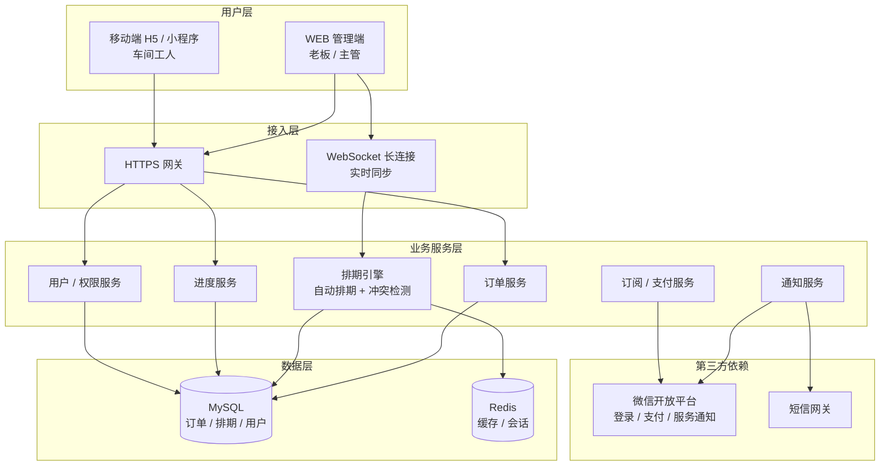

## 2.2 业务模块图

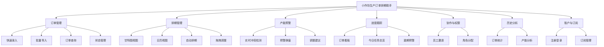

## 2.3 主业务流程

```mermaid
flowchart TD
    A[老板 / 主管登录 WEB 管理端] --> B[录入新订单<br/>填写客户、产品、数量、交期、工艺]
    B --> C{系统自动计算<br/>交期紧急度 + 产能匹配}
    C -->|产能充足| D[生成推荐排期方案<br/>更新甘特图]
    C -->|产能冲突| E[触发产能冲突预警<br/>标红冲突日期与工序]
    E --> F{老板选择调整方案}
    F -->|提前开工| D
    F -->|外协加工| G[标记外协标签<br/>调整排期]
    G --> D
    F -->|协商延期| H[修改交期]
    H --> D
    F -->|手动调整| I[甘特图拖拽重排]
    I --> D

    D --> J[订单进入排期队列<br/>状态：已排产]
    J --> K[工人打开移动端<br/>查看当日任务]
    K --> L[工人点击"开始生产"]
    L --> M[订单状态 → 生产中]
    M --> N[逐工序点击"完工"]
    N --> O{全部工序完成?}
    O -->|否| N
    O -->|是| P[订单状态 → 已完成]
    P --> Q[老板确认发货<br/>状态 → 已发货]
    Q --> R[订单归档<br/>进入历史分析]
```

## 2.4 功能图/列表

### MVP（v1.0）WEB 管理端

| 功能模块 | 功能名称 | 优先级 | 功能描述 |
| --- | --- | --- | --- |
| 订单管理 | 快速录入 | P0 | 填写 ≤5 个必填项，3 步内完成订单录入 |
| 订单管理 | 订单列表查询 | P0 | 按客户、产品、状态、交期范围筛选 |
| 订单管理 | 订单详情 | P0 | 查看订单完整信息、工艺进度、状态流转历史 |
| 订单管理 | 订单编辑 / 取消 | P0 | 修改未发货订单信息或取消订单 |
| 排期管理 | 甘特图视图 | P0 | 横轴日期 + 纵轴订单，按工艺步骤分段展示 |
| 排期管理 | 日历视图 | P1 | 日历形式展示每日待产订单及产能占用 |
| 排期管理 | 自动排期（一键推荐） | P0 | 按交期紧急度 + 产能匹配自动推荐排期 |
| 排期管理 | 拖拽调整排期 | P0 | 甘特图上拖拽订单条调整开工日期 |
| 排期管理 | 产能配置 | P0 | 设置设备 / 人员日产能、工作日历 |
| 产能预警 | 实时冲突检测 | P0 | 新增 / 修改订单时实时检测产能超载 |
| 产能预警 | 预警弹窗 + 调整建议 | P0 | 弹窗列出冲突点，提供 3-4 种调整建议 |
| 产能预警 | 预警中心 | P1 | 汇总所有未处理冲突，按紧急度排序 |
| 进度跟踪 | 订单看板 | P0 | 按状态分栏展示所有订单 |
| 进度跟踪 | 今日任务总览 | P0 | 显示今日应开始、应完成、已逾期订单 |
| 进度跟踪 | 逾期预警 | P1 | 排期已过但未完工的订单自动标红 |
| 账户 | 手机号注册 / 登录 | P0 | 手机号 + 验证码注册登录 |
| 账户 | 微信登录 | P1 | 微信扫码登录 |

### v1.1 工人端移动端

| 功能模块 | 功能名称 | 优先级 | 功能描述 |
| --- | --- | --- | --- |
| 工人任务 | 当日任务列表 | P0 | 显示今日应做订单及工艺步骤 |
| 工人任务 | 开工标记 | P0 | 一键"开始生产"推进订单状态 |
| 工人任务 | 工序完工 | P0 | 逐工序点击"完工"更新进度 |
| 工人任务 | 异常上报 | P1 | 上报缺料 / 设备故障 / 质量问题 |
| 消息通知 | 任务推送 | P0 | 新任务、变更、反馈推送至微信 |

### v1.2 扩展功能

| 功能模块 | 功能名称 | 优先级 | 功能描述 |
| --- | --- | --- | --- |
| 协作权限 | 邀请员工 | P1 | 手机号 / 微信邀请员工加入 |
| 协作权限 | 角色分配 | P1 | 分配生产主管 / 车间工人角色 |
| 历史分析 | 订单统计 + 产能分析 | P2 | 订单趋势、客户排行、设备利用率、交期达成率 |
| 账户 | 订阅支付 | P1 | 专业版 ¥39/月在线升级 |

## 2.5 你的产品有哪些端

| 序号 | 端名称 | 端类型 | 目标用户 | 说明 |
| --- | --- | --- | --- | --- |
| 1 | WEB 管理端 | WEB端 | 老板 / 生产主管 | 电脑浏览器访问，承担订单录入、排期、预警、进度跟踪等全部管理功能。MVP 核心端。 |
| 2 | 工人端 | 小程序端 | 车间工人 | 微信 H5 / 小程序，车间手机操作，仅承担查看当日任务 + 更新完工状态的极简功能。v1.1 上线。 |

---

# 3 产品功能

## 3.1 WEB 管理端功能

### 3.1.1 订单快速录入

**功能描述**：老板 / 主管通过极简表单（≤5 个必填项）在 3 步内完成一个生产订单的录入。支持客户名称自动联想历史客户、工艺模板一键套用，大幅降低录入门槛。

| 项 | 内容 |
| --- | --- |
| 优先级 | P0 |
| 依赖需求 | — |
| 前置条件 | 用户已登录 WEB 管理端 |

**详细流程**

```mermaid
flowchart TD
    A[点击"新建订单"] --> B[Step 1: 填写基础信息<br/>客户名称 / 产品名称 / 数量 / 交期]
    B --> C[客户名称自动联想<br/>选中后带出历史联系信息]
    C --> D[Step 2: 选择工艺步骤<br/>从预设模板选择 或 自定义添加]
    D --> E[Step 3: 确认提交]
    E --> F{系统自动触发<br/>排期计算 + 冲突检测}
    F -->|无冲突| G[订单录入成功<br/>自动进入"待排产"]
    F -->|有冲突| H[弹出产能冲突预警<br/>见 3.1.3]
    H --> I{老板选择方案}
    I -->|确认排期| G
    I -->|调整后再提交| B
```

**业务规则说明**：

1. 必填项：客户名称、产品名称、数量、交期、至少一道工艺步骤。共 5 个必填项。
2. 客户名称输入 2 个字后触发联想，展示匹配的历史客户列表（最多 10 条）。
3. 工艺模板按行业预设（五金加工：下料→冲压→表面处理→包装；服装代工：裁剪→缝制→整烫→包装 等），用户可自定义。
4. 交期不得早于今日。
5. 数量必须为正整数。
6. 提交后系统自动调用排期引擎计算推荐排期，同时检测产能冲突。

**验收标准**：

- [ ] 正常流程：填写 5 个必填项后点击提交，≤1 秒返回结果，订单出现在列表中
- [ ] 客户联想：输入 2 个字后 500ms 内展示联想列表
- [ ] 异常流程：交期为空时提交，输入框标红并提示"请选择交期"
- [ ] 异常流程：数量为 0 或负数时，输入框标红并提示"数量必须大于 0"

### 3.1.2 订单列表查询与详情

**功能描述**：以列表形式展示所有订单，支持按客户、产品、状态、交期范围多条件筛选。默认展示活跃订单（待排产 / 已排产 / 生产中 / 已暂停）。点击订单行可进入详情页查看完整信息、工艺进度、排期时间和状态流转历史。

| 项 | 内容 |
| --- | --- |
| 优先级 | P0 |
| 依赖需求 | 3.1.1 订单快速录入 |
| 前置条件 | 用户已登录 WEB 管理端 |

**详细流程**

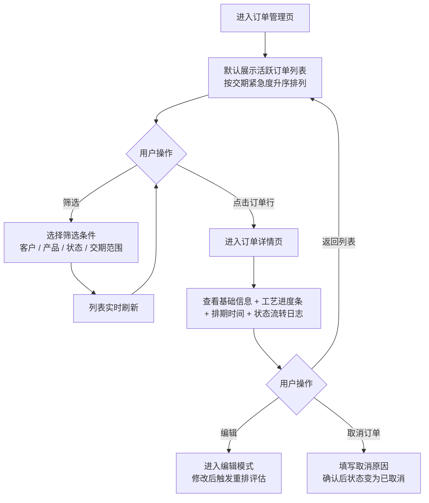

**业务规则说明**：

1. 默认筛选：状态 = 待排产 / 已排产 / 生产中 / 已暂停。
2. 默认排序：按交期升序（最紧急的排最前）。
3. 列表字段：订单编号、客户名称、产品名称、数量、交期、状态（彩色标签）、进度百分比。
4. 已发货 / 已取消的订单默认不显示，需切换筛选条件查看。
5. 取消订单时，若订单已处于"生产中"，需二次确认："该订单正在生产，确认取消？"
6. 订单详情页的状态流转日志按时间倒序展示，记录每次状态变更的操作人和时间。

**验收标准**：

- [ ] 正常流程：页面加载 ≤2 秒展示订单列表
- [ ] 筛选功能：多条件组合筛选后列表实时刷新，结果正确
- [ ] 详情页：所有字段完整展示，状态流转日志按时间倒序
- [ ] 异常流程：无匹配结果时展示空态插画 + "暂无匹配订单"

### 3.1.3 排期甘特图与自动排期

**功能描述**：以甘特图形式可视化展示所有订单的排期计划。横轴为日期（日/周视图可切换），纵轴为订单列表，每个订单按工艺步骤分段着色展示。支持一键自动排期（系统按交期紧急度 + 产能匹配计算推荐方案）和拖拽调整排期。

| 项 | 内容 |
| --- | --- |
| 优先级 | P0 |
| 依赖需求 | 3.1.1 订单录入、产能配置 |
| 前置条件 | 已配置设备 / 人员产能数据 |

**详细流程**

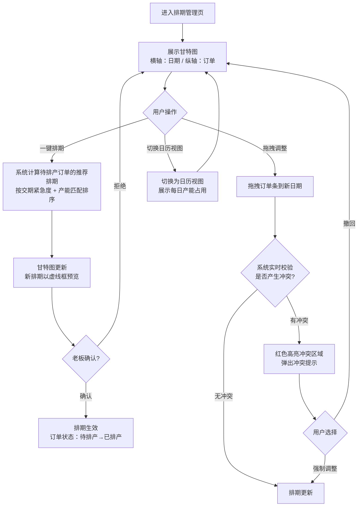

**业务规则说明**：

1. 甘特图默认展示未来 14 天，可切换为 7 天 / 30 天。
2. 订单条按工艺步骤分段着色，颜色对应状态：待排产（灰）、已排产（蓝）、生产中（深蓝）、已完成（绿）、逾期（红）。
3. 自动排期算法：按交期紧急度（距交期天数）降序排优先级，依次在产能时间线上寻找最早可插入的空位。
4. 拖拽调整时实时校验产能冲突，冲突区域红色高亮 + 右侧弹出冲突详情。
5. 排期需跳过休息日（根据工作日历配置）。
6. 锁定的订单排期不会被自动排期算法改动（锁定状态用 🔒 图标标识）。

**验收标准**：

- [ ] 正常流程：甘特图渲染 ≤2 秒（50 个订单规模）
- [ ] 一键排期：计算 ≤2 秒（100 个订单规模），结果合理（无产能超载）
- [ ] 拖拽调整：拖拽过程流畅，松手后 500ms 内完成冲突检测
- [ ] 异常流程：拖拽到产能超载区域时，红色高亮冲突并弹出提示

### 3.1.4 产能冲突预警

**功能描述**：新增 / 修改订单时，系统实时计算产能是否超载。若检测到冲突，弹出预警弹窗，列出冲突点（日期、工序、超出量）并给出 3-4 种调整建议（提前开工 / 外协加工 / 协商延期 / 手动调整）。

| 项 | 内容 |
| --- | --- |
| 优先级 | P0 |
| 依赖需求 | 3.1.3 排期甘特图、产能配置 |
| 前置条件 | 已配置设备 / 人员产能数据 |

**详细流程**

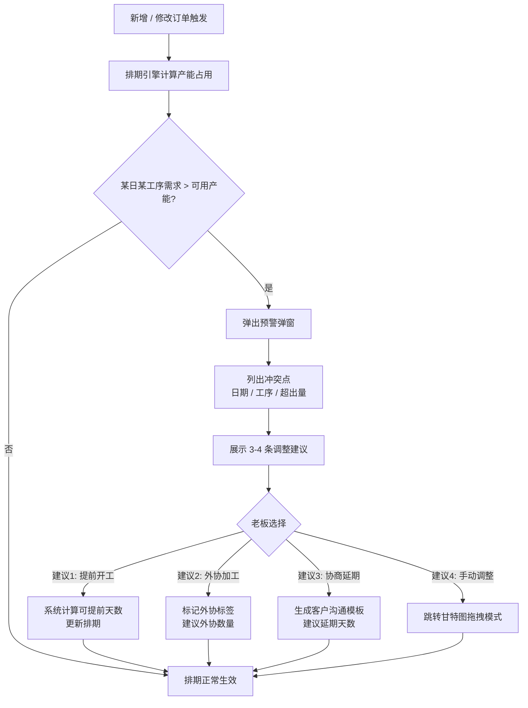

**业务规则说明**：

1. 冲突检测在订单提交后 500ms 内完成。
2. 冲突判定：某日某工序的需求产能 > 该工序当日可用产能（设备产能 + 人员产能之和）。
3. 预警弹窗为模态弹窗，必须老板做出选择后才能关闭（强制决策）。
4. 调整建议由系统自动计算：
   - 提前开工：向前寻找最早可插入的空位
   - 外协加工：计算需外协的数量 = 超出量 × 1.2（留 20% 余量）
   - 协商延期：计算需延后的天数 = 超出量 / 日产能
   - 手动调整：直接跳转甘特图
5. 预警中心汇总所有未处理冲突，按紧急度排序，支持一键批量处理。

**验收标准**：

- [ ] 正常流程：冲突检测 ≤500ms，弹窗正确展示冲突点和建议
- [ ] 建议合理性：提前开工方案不会引入新冲突
- [ ] 异常流程：产能数据未配置时，提示"请先配置产能数据"

### 3.1.5 生产进度看板

**功能描述**：以看板形式按状态分栏（待排产 / 已排产 / 生产中 / 已完成 / 已发货）展示所有订单。每栏显示该状态的订单卡片，卡片包含客户、产品、数量、交期、进度百分比。同时提供"今日任务总览"模块，展示今日应开始、应完成、已逾期的订单数量与列表。

| 项 | 内容 |
| --- | --- |
| 优先级 | P0 |
| 依赖需求 | 3.1.1 订单录入、3.1.3 排期甘特图 |
| 前置条件 | 有订单数据 |

**详细流程**

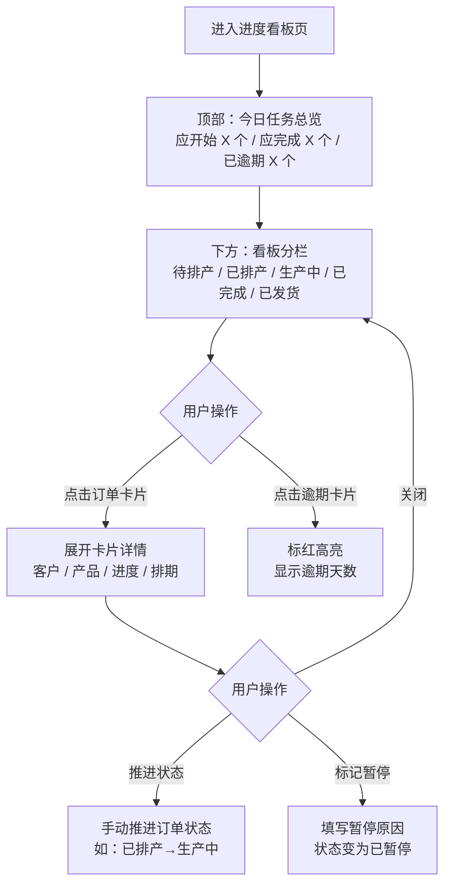

**业务规则说明**：

1. 看板分 5 栏 + 1 额外栏（已暂停），每栏最多展示 20 张卡片，超出折叠显示"+N 更多"。
2. 卡片颜色：待排产（灰）、已排产（蓝）、生产中（深蓝+进度条）、已完成（绿）、已发货（浅绿）、已暂停（橙）、已逾期（红+逾期天数标签）。
3. 今日任务总览模块位于看板上方，实时统计今日应开始、应完成、已逾期订单数量。
4. 逾期判定：当前日期 > 排期完工日期 且 状态 ≠ 已完成 / 已发货。
5. 暂停的订单不计入产能占用，排期甘特图中以虚线显示。

**验收标准**：

- [ ] 正常流程：看板加载 ≤2 秒，卡片状态颜色正确
- [ ] 状态推进：手动推进状态后卡片实时移动到对应栏
- [ ] 逾期预警：逾期卡片红色高亮，逾期天数正确

### 3.1.6 产能配置

**功能描述**：老板 / 主管配置作坊的设备 / 工位日产能、工人擅长工艺及日产能、工作日历（工作日 / 休息日 / 节假日），作为自动排期和冲突检测的基础数据。

| 项 | 内容 |
| --- | --- |
| 优先级 | P0 |
| 依赖需求 | — |
| 前置条件 | 用户已注册并登录 |

**详细流程**

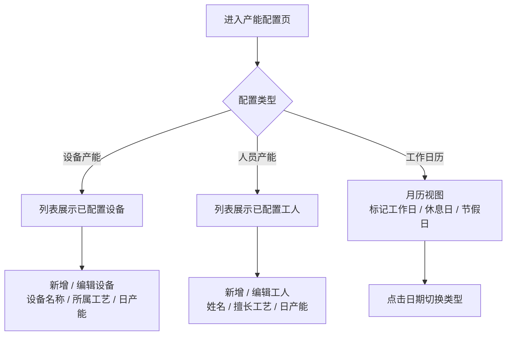

**业务规则说明**：

1. 首次登录引导用户完成产能初始化配置（至少配置 1 个设备或 1 个工人）。
2. 设备产能：设备名称 + 所属工艺步骤 + 日产能（件/天）。
3. 人员产能：工人姓名 + 擅长工艺步骤（可多选）+ 日产能（件/天）。
4. 工序总日产能 = 该工序所有设备日产能之和 + 该工序所有擅长工人日产能之和。
5. 工作日历默认周一至周五为工作日，周六日为休息日，支持手动标记节假日。
6. 排期计算自动跳过休息日和节假日。

**验收标准**：

- [ ] 正常流程：配置完成后立即生效，影响后续排期计算
- [ ] 异常流程：日产能为 0 或负数时提示"请输入有效产能"

### 3.1.7 账户注册与登录

**功能描述**：支持手机号 + 验证码注册 / 登录，以及微信扫码登录。注册时自动创建作坊空间（多租户隔离）。

| 项 | 内容 |
| --- | --- |
| 优先级 | P0 |
| 依赖需求 | — |
| 前置条件 | 无 |

**详细流程**

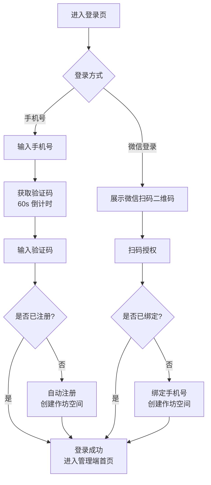

**业务规则说明**：

1. 注册成功后自动创建作坊空间，该用户默认为"老板 / 管理员"角色。
2. 验证码 6 位数字，有效期 5 分钟，60 秒内不可重发。
3. 微信扫码登录首次使用需绑定手机号（用于接收通知和找回账号）。
4. 登录态有效期 7 天，过期需重新登录。

**验收标准**：

- [ ] 正常流程：手机号注册 → 登录 → 进入首页，全流程 ≤10 秒
- [ ] 微信登录：扫码 → 授权 → 绑定手机号 → 进入首页
- [ ] 异常流程：验证码错误时提示"验证码错误，请重新输入"

## 3.2 工人端功能（v1.1）

### 3.2.1 当日任务列表

**功能描述**：工人打开移动端后，默认展示当日任务列表。列表按优先级排序，每个任务显示客户名称、产品名称、工艺步骤、数量、交期。工人可点击任务进入详情页查看完整信息。

| 项 | 内容 |
| --- | --- |
| 优先级 | P0 |
| 依赖需求 | WEB 端订单排期 |
| 前置条件 | 老板已分配任务，工人已登录 |

**详细流程**

```mermaid
flowchart TD
    A[工人打开小程序 / H5] --> B[展示当日任务列表<br/>按优先级排序]
    B --> C{工人操作}
    C -->|点击任务| D[进入任务详情<br/>客户 / 产品 / 数量 / 工艺要求 / 交期]
    D --> E[返回]
    E --> B
    C -->|点击"开始生产"| F[任务状态变为"生产中"]
    C -->|点击"完工"| G{是否最后一道工序?}
    G -->|是| H[订单该工序完工<br/>进度 100%]
    G -->|否| I[当前工序完工<br/>显示下一工序]
```

**业务规则说明**：

1. 任务列表默认只展示"已排产"和"生产中"状态的任务。
2. 排序规则：逾期任务置顶 → 按交期升序 → 按排期开工日期升序。
3. 字体 ≥ 16px，关键按钮 ≥ 44×44px，适配年龄较大工人。
4. 弱网环境下支持本地缓存，网络恢复后自动同步。

**验收标准**：

- [ ] 正常流程：页面加载 ≤1.5 秒（4G 网络）
- [ ] 状态同步：工人端操作后 WEB 端看板实时更新
- [ ] 离线模式：弱网下可查看已缓存的任务列表

### 3.2.2 异常上报

**功能描述**：工人在生产过程中遇到异常（缺料、设备故障、质量问题），可通过异常上报功能快速反馈，系统自动通知主管。

| 项 | 内容 |
| --- | --- |
| 优先级 | P1 |
| 依赖需求 | 3.2.1 当日任务列表 |
| 前置条件 | 有正在生产的任务 |

**详细流程**

```mermaid
flowchart TD
    A[点击"异常上报"] --> B[选择异常类型<br/>缺料 / 设备故障 / 质量问题]
    B --> C[简要描述<br/>可选，≤100 字]
    C --> D[提交]
    D --> E[系统通知主管<br/>站内 + 微信服务通知]
    E --> F[订单标记为"已暂停"<br/>附带异常原因]
```

**验收标准**：

- [ ] 正常流程：上报后主管 ≤5 秒收到通知
- [ ] 异常流程：无进行中任务时提示"当前没有进行中的任务"

---

# 4 产品原型

## 4.1 页面跳转逻辑图

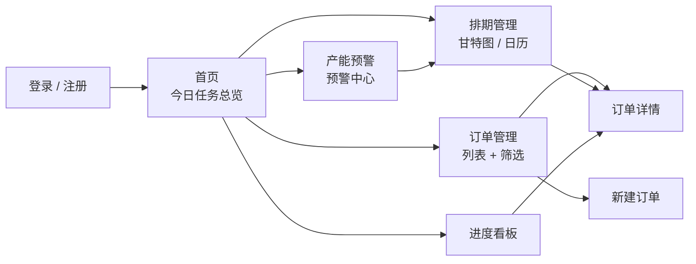

## 4.2 全站点原型设计

### 4.2.1 WEB 管理端

**页面清单：**

| 序号 | 页面名称 | 所属模块 | 页面描述 | 关键元素 |
| --- | --- | --- | --- | --- |
| 1 | 登录 / 注册页 | 账户 | 手机号验证码登录 + 微信扫码登录 | 登录表单、二维码区域 |
| 2 | 首页（仪表盘） | 全局 | 今日任务总览 + 快速入口 | 统计卡片、快捷操作按钮、订单趋势图 |
| 3 | 订单管理页 | 订单管理 | 订单列表 + 多条件筛选 + 新建按钮 | 搜索栏、筛选器、订单表格、分页、状态标签 |
| 4 | 新建 / 编辑订单弹窗 | 订单管理 | 3 步表单录入订单 | 步骤条、客户联想输入、工艺选择器、日期选择 |
| 5 | 订单详情页 | 订单管理 | 订单完整信息 + 工艺进度 + 状态日志 | 信息卡片、进度时间线、操作按钮 |
| 6 | 排期管理页（甘特图） | 排期管理 | 甘特图 + 一键排期 + 拖拽调整 | 甘特图、日期范围选择器、操作工具栏 |
| 7 | 排期管理页（日历视图） | 排期管理 | 日历形式展示每日产能占用 | 月历网格、产能占用色块 |
| 8 | 产能预警弹窗 | 产能预警 | 冲突详情 + 调整建议 | 冲突列表、建议方案卡片、操作按钮 |
| 9 | 产能预警中心 | 产能预警 | 所有未处理冲突汇总 | 冲突列表、紧急度标签、批量处理按钮 |
| 10 | 生产进度看板 | 进度跟踪 | 按状态分栏的订单卡片看板 | 看板分栏、订单卡片、今日任务总览 |
| 11 | 产能配置页 | 排期管理 | 设备 / 人员产能 + 工作日历设置 | 设备列表、人员列表、月历配置 |

**交互说明：**

- 页面跳转关系：
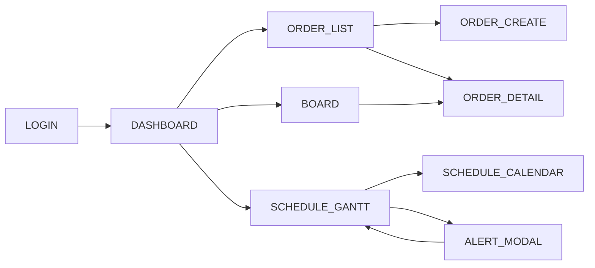

- 特殊交互：
  1. 甘特图支持拖拽调整：鼠标按住订单条拖动，松手后实时冲突检测，冲突区域红色高亮。
  2. 产能预警弹窗为模态弹窗，必须做出选择后才能关闭。
  3. 订单卡片在看板中支持拖拽跨栏推进状态。
  4. 空数据态：每个列表页面无数据时展示引导插画 + "创建第一个订单"按钮。
  5. 加载态：页面加载时展示骨架屏（Skeleton），避免白屏。

**产品原型：**

[🖥️ 打开 WEB 管理端全站点原型](assets/prototypes/web-admin-prototype.html)

### 4.2.2 工人端（v1.1）

**页面清单：**

| 序号 | 页面名称 | 所属模块 | 页面描述 | 关键元素 |
| --- | --- | --- | --- | --- |
| 1 | 当日任务列表 | 工人任务 | 今日应做任务按优先级排序 | 任务卡片列表、状态标签、操作按钮 |
| 2 | 任务详情 | 工人任务 | 单个任务的完整信息 | 客户、产品、数量、工艺要求、进度 |
| 3 | 异常上报 | 工人任务 | 选择异常类型 + 描述 | 3 类异常选项、文本输入、提交按钮 |
| 4 | 我的任务（历史） | 工人任务 | 最近 30 天已完成任务 | 任务列表、完成时间 |

**交互说明：**

- 页面跳转关系：
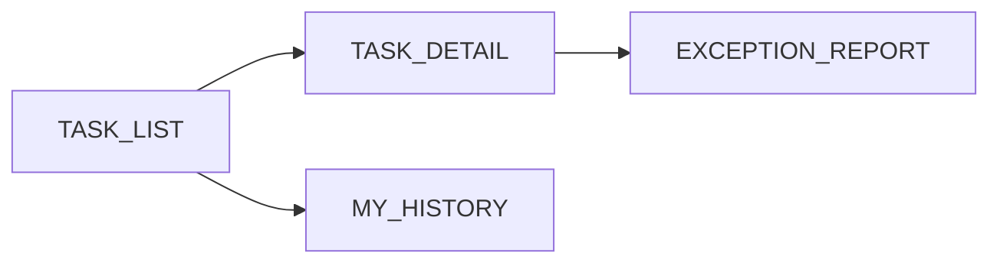

- 特殊交互：
  1. 任务卡片大按钮设计："开始生产" / "完工" 按钮 ≥ 44×44px。
  2. 工序完工时，进度条实时更新，最后一道工序完工时展示 ✅ 动画。
  3. 弱网态：展示缓存数据 + 顶部"离线模式"提示条。

**产品原型：**

[📱 打开工人端全站点原型](assets/prototypes/worker-mobile-prototype.html)

---

# 5 数据需求

## 5.1 数据使用规格

### 订单表 (orders)

| 字段 | 是否必填 | 描述 | 数据类型 |
| --- | --- | --- | --- |
| id | 是 | 订单唯一标识 | UUID |
| workspace_id | 是 | 所属作坊空间 | UUID |
| order_no | 是 | 订单编号（自动生成） | 字符串 |
| customer_name | 是 | 客户名称 | 字符串 |
| product_name | 是 | 产品名称 | 字符串 |
| quantity | 是 | 数量 | 整数 |
| due_date | 是 | 交期 | 日期 |
| status | 是 | 状态（待排产/已排产/生产中/已完成/已发货/已暂停/已取消） | 枚举 |
| process_steps | 是 | 工艺步骤列表（有序） | JSON 数组 |
| schedule_start | 否 | 排期开始日期 | 日期 |
| schedule_end | 否 | 排期结束日期 | 日期 |
| is_outsourced | 否 | 是否外协 | 布尔 |
| cancel_reason | 否 | 取消 / 暂停原因 | 字符串 |
| locked | 否 | 排期是否锁定 | 布尔 |
| created_at | 是 | 创建时间 | 时间戳 |
| updated_at | 是 | 更新时间 | 时间戳 |

### 产能配置表 (capacity)

| 字段 | 是否必填 | 描述 | 数据类型 |
| --- | --- | --- | --- |
| id | 是 | 配置唯一标识 | UUID |
| workspace_id | 是 | 所属作坊空间 | UUID |
| resource_type | 是 | 资源类型（设备/人员） | 枚举 |
| name | 是 | 名称 | 字符串 |
| process_step | 是 | 所属工艺步骤 | 字符串 |
| daily_capacity | 是 | 日产能（件/天） | 整数 |

### 工作日历表 (work_calendar)

| 字段 | 是否必填 | 描述 | 数据类型 |
| --- | --- | --- | --- |
| id | 是 | 记录唯一标识 | UUID |
| workspace_id | 是 | 所属作坊空间 | UUID |
| date | 是 | 日期 | 日期 |
| day_type | 是 | 类型（工作日/休息日/节假日） | 枚举 |

## 5.2 统计数据

1. MVP 阶段：订单数量（按状态）、活跃订单数（用于免费版限制计数）、今日应开始 / 应完成 / 已逾期订单数。
2. v1.2 阶段：月度订单趋势、客户排行（按订单数 / 金额）、设备利用率、交期达成率。

## 5.3 埋点需求

| 页面 | 事件 | 采集字段 | 说明 |
| --- | --- | --- | --- |
| 登录页 | login_submit | login_type (手机号/微信), result (成功/失败) | 登录转化分析 |
| 订单管理 | order_create | process_step_count, has_conflict | 录单行为分析 |
| 排期管理 | auto_schedule | order_count, compute_time_ms | 排期算法效果 |
| 排期管理 | gantt_drag | from_date, to_date, has_conflict | 拖拽调整频率 |
| 产能预警 | alert_action | alert_type, chosen_solution | 预警处理偏好 |
| 进度看板 | status_change | order_id, from_status, to_status | 状态流转分析 |
| 工人端 | task_complete | task_id, process_step | 完工行为追踪 |
| 工人端 | exception_report | exception_type | 异常类型分布 |

---

# 6 非功能需求

## 6.1 性能需求

### 6.1.1 延迟

| 编号 | 项目 | 最大延迟 | 平均延迟 | 优先级 | 备注 |
| --- | --- | --- | --- | --- | --- |
| P-LAT-001 | WEB 管理端页面首屏加载 | ≤2 秒 | ≤1 秒 | 高 | 4G 网络 |
| P-LAT-002 | 工人端页面首屏加载 | ≤1.5 秒 | ≤1 秒 | 高 | 4G 网络 |
| P-LAT-003 | 订单录入提交响应 | ≤1 秒 | ≤0.5 秒 | 高 | |
| P-LAT-004 | 排期计算（100 订单） | ≤2 秒 | ≤1 秒 | 高 | |
| P-LAT-005 | 冲突检测 | ≤500ms | ≤200ms | 高 | |
| P-LAT-006 | 客户联想响应 | ≤500ms | ≤200ms | 中 | |

### 6.1.2 吞吐量

| 编号 | 项 | 吞吐量 | 备注 |
| --- | --- | --- | --- |
| P-TP-001 | 单作坊空间内并发操作 | 20 人同时操作不出现数据错乱 | |
| P-TP-002 | 排期计算 | 每分钟 100 次 | |

### 6.1.3 容量

| 编号 | 项 | 容量 | 备注 |
| --- | --- | --- | --- |
| P-CAP-001 | 系统总作坊空间数 | ≤100,000 | |
| P-CAP-002 | 单空间历史订单 | ≤5,000 条（约 3 年） | 流畅查询 |
| P-CAP-003 | 单空间员工数 | ≤20 人 | |

## 6.2 安全需求

| 编号 | 项 |
| --- | --- |
| SEC-001 | 所有 API 调用必须走 HTTPS |
| SEC-002 | 不同作坊空间数据严格隔离，任何场景下不得越权访问 |
| SEC-003 | 用户密码（如有）使用 bcrypt 加盐哈希存储 |
| SEC-004 | 验证码 5 分钟过期，60 秒限频，单号每日限发 10 条 |
| SEC-005 | 登录态 Token 使用 JWT，有效期 7 天，支持主动注销 |
| SEC-006 | 敏感操作（删除订单、取消订单）需二次确认 |

## 6.3 可靠性

| 编号 | 项 | 值 |
| --- | --- | --- |
| REL-001 | 系统可用性 | ≥99.9% |
| REL-002 | 平均无故障时间（MTTF） | ≥30 天 |
| REL-003 | 平均故障恢复时间（MTTR） | ≤30 分钟 |

## 6.4 可连续性

| 编号 | 项 |
| --- | --- |
| CONT-001 | 系统 7×24 小时运行 |
| CONT-002 | 工人端支持弱网离线缓存，网络恢复后自动同步 |

## 6.5 可恢复性

| 编号 | 项 |
| --- | --- |
| RECV-001 | 数据库每日全量备份，保留 30 天 |
| RECV-002 | 每小时增量备份 |
| RECV-003 | 重大故障 1-3 小时内恢复服务，24-72 小时内恢复数据 |

## 6.6 兼容性

| 编号 | 要求 | 备注 |
| --- | --- | --- |
| COMPAT-001 | WEB 管理端：Chrome ≥80, Edge ≥80, Firefox ≥75, Safari ≥13 | |
| COMPAT-002 | 工人端 H5：iOS Safari ≥13, Android Chrome ≥80 | |
| COMPAT-003 | 工人端小程序：微信基础库 ≥2.15 | |
| COMPAT-004 | WEB 管理端适配 ≥1280px 宽度 | |
| COMPAT-005 | 工人端适配主流手机尺寸（375×667 ~ 428×926） | |

## 6.7 易用性

| 编号 | 要求 | 备注 |
| --- | --- | --- |
| UX-001 | 核心操作路径 ≤3 步（录单、查看看板、标记完工） | |
| UX-002 | 普通用户无需培训即可使用核心功能 | |
| UX-003 | 工人端字体 ≥16px，关键按钮 ≥44×44px | 适配年龄较大用户 |
| UX-004 | 状态颜色统一语义：灰=待排产，蓝=生产中，绿=已完成，红=逾期/冲突 | |
| UX-005 | 首次登录提供 3 步引导：录单 → 排期 → 邀请员工 | |
| UX-006 | 全部界面使用通俗中文，避免"工单""MES""BOM"等专业术语 | |

---

# 7 总结

## 7.1 上线计划

| 阶段 | 时间 | 内容 | 负责人 |
| --- | --- | --- | --- |
| MVP 开发 | D+0 ~ D+7 | WEB 端核心闭环（订单录入 + 自动排期 + 甘特图 + 冲突预警 + 进度看板） | 开发团队 |
| 内测 | D+8 ~ D+10 | 邀请 3-5 家小作坊试用，收集反馈 | 产品经理 |
| 修复迭代 | D+11 ~ D+14 | 修复 Bug，优化体验 | 开发团队 |
| 公测上线 | D+15 | 正式上线，开放注册 | 全团队 |

## 7.2 后续迭代规划

| 版本 | 时间 | 主要功能 |
| --- | --- | --- |
| v1.1 | MVP +14 天 | 工人端小程序上线 + 消息通知 + 异常上报 |
| v1.2 | MVP +30 天 | 订阅支付（¥39/月）+ 多员工协作 + 历史订单分析 |
| v2.0 | MVP +90 天 | 智能报价（基于历史数据）、客户对账单、多作坊空间 |

## 7.3 参考文档

- 《小作坊生产订单排期助手 — 用户需求说明书 (URS)》v1.0
- [WEB 管理端全站点原型](assets/prototypes/web-admin-prototype.html)
- [工人端全站点原型](assets/prototypes/worker-mobile-prototype.html)
