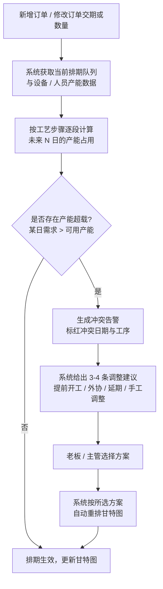
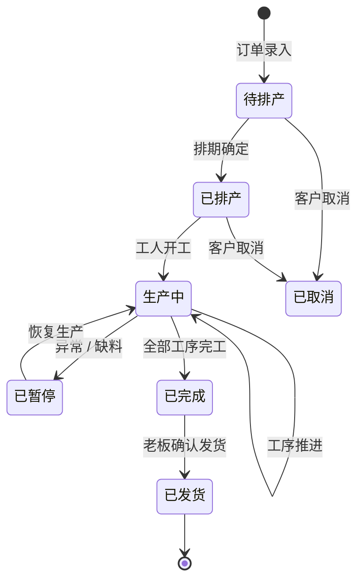
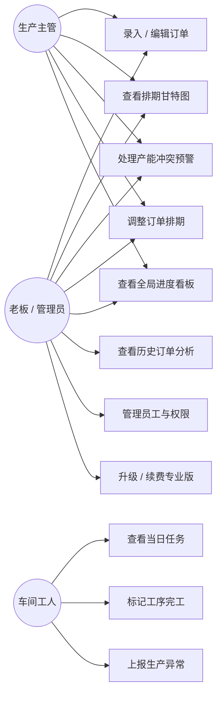

# 小作坊生产订单排期助手 — 用户需求说明书 (URS)

> 文档版本：v1.0
> 编写日期：2026-06-29
> 文档状态：初稿（待产品负责人审核）
> 适用阶段：MVP（7 天开发周期）

---

# 1. 需求概述

## 1.1 需求介绍

"小作坊生产订单排期助手"是一款面向 3-20 人小型加工厂 / 作坊的轻量级生产订单排期管理工具。产品聚焦小微型制造场景下"订单录入 → 排期 → 产能冲突预警 → 进度跟踪"的核心闭环，帮助作坊老板、生产主管和车间工人以极简的操作方式完成原本依赖 Excel / 纸笔的排期管理工作，避免因漏单、排期冲突导致的交期延误与客户投诉。

本产品不走企业级 ERP / MES 的重型路线，不追求大而全，而是通过"极简操作 + 低价 + 小作坊专属"的差异化定位切入数百万家小微工厂的空白市场。

### 1.1.1 所属领域

- **制造业信息化 — 小微企业生产管理 SaaS**
- 垂直行业：五金加工、服装代工、包装印刷、食品加工、手工作坊等劳动密集型小型加工业
- 产品形态：Web 端（老板 / 管理端）+ 移动端 H5 / 小程序（车间工人端）

> 备注：本产品明确避开用友 U8、金蝶 K/3、管家婆等中大型企业 ERP，亦不涉及 MES、WMS 等重型制造执行系统。

## 1.2 需求目标

1. **降低排期门槛**：让不会使用复杂 ERP、甚至不熟练使用 Excel 的作坊老板，能在 3 步之内完成一个订单的录入与排期。
2. **消灭漏单和交期延误**：通过系统化的订单台账 + 可视化排期日历 + 产能冲突自动预警，替代纸笔 / 微信群接龙式排期，将交期延误率降低 50% 以上。
3. **透明化生产进度**：让老板随时掌握每个订单处于什么阶段、每个工人今日在做什么；让工人无需口头询问即可获知当日任务。
4. **以极低价格覆盖小微客户**：免费版可管理 10 个活跃订单；专业版 ¥39/月即可解锁不限订单、产能预警、多员工协作、历史订单分析等完整能力，显著低于千元 / 万元级的企业 ERP。
5. **MVP 快速交付**：核心功能（订单管理 + 排期算法 + 甘特图 + 预警 + 进度看板）可在 7 天内完成 MVP 上线。

## 1.3 系统使用角色

| 角色 | 描述 | 主要诉求 |
| --- | --- | --- |
| 老板 / 管理员 | 作坊的实际负责人，通常 1 人，拥有所有权限 | 全局掌握订单和产能，快速做排期决策，避免交期延误 |
| 生产主管 | 负责车间生产调度的管理人员（中型作坊才有，可能由老板兼任） | 管理每日排产任务、处理产能冲突、跟踪生产进度 |
| 车间工人 | 一线生产人员，3-20 人不等 | 查看自己的当日任务、标记完工状态，无需与主管反复确认 |
| 外部协作者（可选） | 外协加工方，不纳入系统账号，仅通过订单备注中的"外协"标签体现 | 不直接使用系统 |

## 1.4 业务流程图

### 1.4.1 订单从录入到发货的主流程

```mermaid
flowchart TD
    A[老板 / 主管录入新订单] --> B{系统自动计算<br/>交期紧急度 + 产能匹配}
    B -->|产能充足| C[生成推荐排期方案]
    B -->|产能冲突| D[触发产能冲突预警<br/>标红提醒]
    D --> E{老板 / 主管选择调整方案}
    E -->|方案1| F[提前开工]
    E -->|方案2| G[标记外协加工]
    E -->|方案3| H[协商交期延期]
    E -->|方案4| I[手动调整排期]
    F --> C
    G --> C
    H --> C
    I --> C
    C --> J[订单进入排期队列<br/>甘特图 / 日历展示]
    J --> K[车间工人查看当日任务看板]
    K --> L[工人开始生产<br/>标记"生产中"]
    L --> M{工艺步骤是否完成?}
    M -->|未完成| N[逐工序标记完工]
    N --> M
    M -->|全部完成| O[标记"已完成"]
    O --> P[老板 / 主管确认<br/>标记"已发货"]
    P --> Q[订单归档<br/>进入历史订单分析]
```

### 1.4.2 产能冲突预警流程



### 1.4.3 订单状态流转



---

# 2. 功能原型

> 本章节由产品文档结对写作专家（PRD + UI 阶段）补充，URS 阶段仅预留链接位。

| 原型名称 | 原型链接 | 对应端 | 备注 |
| --- | --- | --- | --- |
| 订单录入与管理 | 待 PRD/UI 阶段补充 | WEB端 | 老板 / 管理端主入口 |
| 排期甘特图（日历视图） | 待 PRD/UI 阶段补充 | WEB端 | 核心排期工作台 |
| 产能冲突预警弹窗 | 待 PRD/UI 阶段补充 | WEB端 | 新增 / 编辑订单时触发 |
| 生产进度看板 | 待 PRD/UI 阶段补充 | WEB端 | 老板 / 主管视角 |
| 工人任务看板 | 待 PRD/UI 阶段补充 | 移动端（H5/小程序） | 工人视角，极简任务列表 |
| 历史订单分析 | 待 PRD/UI 阶段补充 | WEB端 | 专业版功能 |

---

# 3. 需求清单

> 本系统按"管理端（WEB 端）"和"工人端（移动端）"两个使用端拆分需求清单。

## 3.1 管理端 — WEB 端

面向老板 / 生产主管，承担订单录入、排期、预警、全局进度跟踪、协作设置、历史分析等核心管理职能。

### 3.1.1 订单管理模块

| 模块 | 一级功能 | 二级功能 | 功能描述 | 备注 |
| --- | --- | --- | --- | --- |
| 订单管理 | 订单录入 | 快速录入 | 填写客户名称、产品名称、数量、交期、工艺步骤（可多选预设工艺），一键提交 | 必填项 ≤ 5 个，3 步内完成 |
| 订单管理 | 订单录入 | 批量录入 | 支持 Excel 模板导入订单（客户、产品、数量、交期、工艺） | 提供模板下载 |
| 订单管理 | 订单录入 | 客户信息复用 | 录入时输入客户名称自动联想历史客户，选中后自动带出 | 减少重复录入 |
| 订单管理 | 订单录入 | 工艺模板 | 预设常用工艺步骤模板（如"下料→冲压→表面处理→包装"），一键套用 | 按行业预设 |
| 订单管理 | 订单编辑 | 订单修改 | 修改未发货订单的客户、数量、交期、工艺步骤 | 修改后触发重排评估 |
| 订单管理 | 订单编辑 | 订单删除 / 取消 | 删除未开始生产的订单；已生产订单只能"取消"并保留记录 | 取消原因必填 |
| 订单管理 | 订单查询 | 列表查询 | 按客户、产品、状态、交期范围筛选订单 | 默认展示活跃订单 |
| 订单管理 | 订单查询 | 订单详情 | 查看单个订单的全部信息、工艺进度、排期时间、状态流转历史 | 含操作日志 |
| 订单管理 | 订单状态管理 | 状态流转 | 手动推进订单状态：待排产 → 已排产 → 生产中 → 已完成 → 已发货 | 可被工人端同步触发 |
| 订单管理 | 订单状态管理 | 异常标记 | 将订单标记为"已暂停"并填写原因（缺料、设备故障、客户原因等） | 暂停订单不计入产能占用 |

### 3.1.2 排期管理模块

| 模块 | 一级功能 | 二级功能 | 功能描述 | 备注 |
| --- | --- | --- | --- | --- |
| 排期管理 | 排期视图 | 甘特图视图 | 横轴为日期、纵轴为订单，每个订单按工艺步骤分段展示，颜色区分状态 | 核心视图 |
| 排期管理 | 排期视图 | 日历视图 | 以日历形式展示每日待生产订单及产能占用情况 | 与甘特图可切换 |
| 排期管理 | 自动排期 | 紧急度排序 | 系统按交期紧急度（距交期天数）+ 产能匹配度自动给订单排优先级 | 默认算法 |
| 排期管理 | 自动排期 | 一键推荐排期 | 基于当前产能数据，系统为"待排产"订单生成推荐开始 / 结束日期 | 老板一键确认即可 |
| 排期管理 | 排期调整 | 拖拽调整 | 在甘特图上拖拽订单条调整开工日期，系统实时校验产能冲突 | 核心交互 |
| 排期管理 | 排期调整 | 手动锁定 | 将某个订单的排期锁定，避免被自动排期算法改动 | 紧急订单使用 |
| 排期管理 | 产能配置 | 设备产能设置 | 设置每个设备 / 工位的日产能（按工艺步骤） | 初始化时配置 |
| 排期管理 | 产能配置 | 人员产能设置 | 设置每个工人擅长工艺及日产能（或小组日产能） | 多技能工人可多工艺 |
| 排期管理 | 产能配置 | 工作日历设置 | 设置作坊的工作日、休息日、节假日 | 影响排期计算 |

### 3.1.3 产能冲突预警模块

| 模块 | 一级功能 | 二级功能 | 功能描述 | 备注 |
| --- | --- | --- | --- | --- |
| 产能预警 | 冲突检测 | 实时检测 | 新增 / 修改订单时实时计算是否出现产能超载 | 触发阈值：需求 > 可用产能 |
| 产能预警 | 冲突检测 | 冲突标红 | 在甘特图上用红色高亮冲突日期与冲突工序 | 视觉强提醒 |
| 产能预警 | 预警提醒 | 弹窗告警 | 检测到冲突时弹窗提示，列出冲突点（日期、工序、超出量） | 强制老板决策 |
| 产能预警 | 调整建议 | 提前开工建议 | 建议将订单提前 N 天开工以避开产能峰值 | 系统自动计算 |
| 产能预警 | 调整建议 | 外协加工建议 | 建议将部分数量或某工序外协，给出外协数量参考 | 标记"外协"标签 |
| 产能预警 | 调整建议 | 协商延期建议 | 建议与客户协商将交期延后 N 天 | 生成客户沟通模板 |
| 产能预警 | 调整建议 | 手动调整入口 | 老板直接进入甘特图拖拽调整 | 自由度高 |
| 产能预警 | 预警列表 | 预警中心 | 汇总当前所有未处理的产能冲突，按紧急度排序 | 可一键批量处理 |

### 3.1.4 生产进度跟踪模块

| 模块 | 一级功能 | 二级功能 | 功能描述 | 备注 |
| --- | --- | --- | --- | --- |
| 进度跟踪 | 全局看板 | 订单看板 | 按状态（待排产 / 已排产 / 生产中 / 已完成 / 已发货）分栏展示所有订单 | 老板主视图 |
| 进度跟踪 | 全局看板 | 今日任务总览 | 显示今日应开始、应完成、已逾期的订单数量与列表 | 老板 / 主管每日必看 |
| 进度跟踪 | 进度监控 | 订单进度百分比 | 每个订单按工艺步骤完成度计算总体进度百分比 | 工人完工自动更新 |
| 进度跟踪 | 进度监控 | 逾期预警 | 排期已过但未完工的订单自动标红提醒 | 推送通知老板 |
| 进度跟踪 | 进度监控 | 工序级进度 | 查看订单每个工艺步骤的开工 / 完工时间、操作人 | 追溯用 |
| 进度跟踪 | 消息通知 | 节点通知 | 订单状态变更、逾期、冲突等关键节点推送通知给老板 / 主管 | 站内 + 微信（可选） |

### 3.1.5 协作与权限模块

| 模块 | 一级功能 | 二级功能 | 功能描述 | 备注 |
| --- | --- | --- | --- | --- |
| 协作权限 | 员工管理 | 邀请员工 | 通过手机号 / 微信邀请员工加入作坊空间 | 专业版功能 |
| 协作权限 | 员工管理 | 角色分配 | 给员工分配角色：生产主管 / 车间工人 | 角色决定功能权限 |
| 协作权限 | 权限控制 | 功能权限 | 老板可看到全部功能；主管可排期、改状态；工人仅能查看任务、更新进度 | 默认最小权限 |
| 协作权限 | 数据隔离 | 作坊空间隔离 | 每个作坊的数据独立，员工只能看到本作坊数据 | 多租户隔离 |

### 3.1.6 历史订单分析模块（专业版）

| 模块 | 一级功能 | 二级功能 | 功能描述 | 备注 |
| --- | --- | --- | --- | --- |
| 历史分析 | 订单统计 | 订单数量趋势 | 按月 / 周统计订单数量、金额趋势 | 折线图 |
| 历史分析 | 订单统计 | 客户排行 | 按订单数量 / 金额统计 Top 客户 | 二八定律分析 |
| 历史分析 | 产能分析 | 设备利用率 | 统计各设备 / 工艺的产能利用率 | 识别瓶颈 |
| 历史分析 | 产能分析 | 交期达成率 | 统计按期交货的订单占比 | 关键经营指标 |
| 历史分析 | 报表导出 | 导出 Excel | 将分析结果导出为 Excel | 老板对外汇报用 |

### 3.1.7 账户与订阅模块

| 模块 | 一级功能 | 二级功能 | 功能描述 | 备注 |
| --- | --- | --- | --- | --- |
| 账户订阅 | 账户注册 | 手机号注册 | 通过手机号 + 验证码注册作坊空间 | 主账号即老板 |
| 账户订阅 | 账户注册 | 微信登录 | 支持微信扫码登录 | 降低门槛 |
| 账户订阅 | 订阅管理 | 版本查看 | 查看当前版本（免费版 / 专业版）及剩余权益 | 活跃订单计数 |
| 账户订阅 | 订阅管理 | 升级专业版 | 在线升级为专业版（¥39/月） | 微信 / 支付宝支付 |
| 账户订阅 | 订阅管理 | 续费 / 降级 | 专业版到期续费或降级回免费版 | 降级时不删除数据 |

## 3.2 工人端 — 移动端（H5 / 小程序）

面向车间工人，只承担"查看当日任务 + 更新完工状态"两项极简功能，保证年龄较大、不擅长使用智能手机的工人也能在 1 分钟内上手。

| 模块 | 一级功能 | 二级功能 | 功能描述 | 备注 |
| --- | --- | --- | --- | --- |
| 工人任务 | 当日任务 | 任务列表 | 显示今日应做的订单及工艺步骤，按优先级排序 | 默认视图 |
| 工人任务 | 当日任务 | 任务详情 | 查看单个任务的客户、产品、数量、工艺要求、交期 | 只读信息 |
| 工人任务 | 进度更新 | 开工标记 | 点击"开始生产"将订单状态推进到"生产中" | 一键操作 |
| 工人任务 | 进度更新 | 工序完工 | 完成一道工艺后点击"完工"，系统自动更新进度 | 按工艺步骤逐一点击 |
| 工人任务 | 进度更新 | 异常上报 | 上报生产异常（缺料、设备故障、质量问题），自动通知主管 | 简化为 3 类选项 |
| 工人任务 | 我的任务 | 历史任务 | 查看自己最近 30 天完成的任务列表 | 个人绩效参考 |
| 工人端通用 | 消息接收 | 任务推送 | 新任务分配、任务变更、异常反馈等推送通知 | 微信服务通知 |

---

# 4. 非功能需求

## 4.1 使用界面需求

| 编号 | 需求项 | 说明 |
| --- | --- | --- |
| UI-1 | 极简操作 | 核心流程（录入订单、查看看板、标记完工）均应在 3 次点击内完成 |
| UI-2 | 大字清晰 | 工人端默认字体 ≥ 16px，关键按钮 ≥ 44×44px，适配年龄较大用户 |
| UI-3 | 颜色语义 | 状态颜色统一语义：待排产（灰）、生产中（蓝）、已完成（绿）、已逾期 / 冲突（红） |
| UI-4 | 新手引导 | 首次登录提供 3 步引导：录入第一个订单 → 查看排期 → 邀请员工 |
| UI-5 | 响应式 | 管理端 WEB 适配 1280px 及以上宽度；工人端 H5 适配主流手机尺寸 |
| UI-6 | 中文友好 | 全部界面使用通俗中文，避免"工单""MES""BOM"等专业术语，改用"订单""生产任务""材料清单" |

## 4.2 软硬件环境需求

| 编号 | 需求项 | 说明 |
| --- | --- | --- |
| ENV-1 | 管理端浏览器 | 支持 Chrome 80+、Edge 80+、Firefox 75+、Safari 13+ |
| ENV-2 | 工人端 | 微信小程序基础库 ≥ 2.15；H5 支持 iOS Safari 13+、Android Chrome 80+ |
| ENV-3 | 网络环境 | 作坊现场可能为弱网（2G/3G），需保证核心操作（查看任务、标记完工）可在低带宽下完成 |
| ENV-4 | 服务端 | 云端 SaaS 部署，无需作坊本地部署服务器 |

## 4.3 性能需求

| 编号 | 需求项 | 指标 |
| --- | --- | --- |
| P-1 | 页面首屏加载 | 管理端 ≤ 2 秒，工人端 ≤ 1.5 秒（4G 网络） |
| P-2 | 订单录入响应 | 提交后 ≤ 1 秒返回结果 |
| P-3 | 排期计算 | 100 个订单的自动排期计算 ≤ 2 秒 |
| P-4 | 冲突检测 | 新增订单触发冲突检测 ≤ 500ms |
| P-5 | 并发支持 | 单作坊空间内 20 个工人同时操作不出现数据错乱 |
| P-6 | 数据容量 | 单作坊空间支持 3 年历史订单（约 5000 条）流畅查询 |

## 4.4 约束性需求

1. **不做重型 ERP**：不实现财务、采购、库存、MRP、成本核算等企业级 ERP 模块，只做"订单排期 + 进度 + 预警"核心闭环。
2. **不做 MES 级精细控制**：不采集设备 PLC 数据、不实现工序级秒级报工，工序进度以工人手动点击"完工"为主。
3. **不替代客户沟通**：订单协商延期、外协加工的价格与合同等，由用户线下完成，系统仅提供建议与模板。
4. **必须支持移动端**：工人端必须以移动端（H5 / 小程序）形式提供，不能只有 WEB 端。
5. **必须提供免费版**：免费版至少支持 10 个活跃订单 + 基础排期，不得做成功能试用版。
6. **必须多租户隔离**：不同作坊的数据严格隔离，任何场景下不得越权访问。
7. **必须以云端 SaaS 形式提供**：不提供本地部署版本，降低运维成本。
8. **后台服务依赖**：本系统需要后台服务支撑，包括用户认证、订单存储、排期算法、消息推送、支付订阅等核心能力。

---

# 5. 接口需求

## 5.1 硬件接口需求

本产品为纯软件 SaaS 应用，不涉及硬件接口。

## 5.2 软件接口需求

| 模块 | 接口名称 | 输入 | 输出 | 功能描述 |
| --- | --- | --- | --- | --- |
| 账户订阅 | 微信登录接口 | 微信授权码 | 用户 openid、昵称、头像 | 微信扫码 / 微信一键登录 |
| 账户订阅 | 短信验证码接口 | 手机号 | 验证码下发结果 | 手机号注册、登录验证 |
| 账户订阅 | 支付接口（微信 / 支付宝） | 订单金额、订单号 | 支付结果回调 | 专业版订阅收费 |
| 进度跟踪 | 微信服务通知接口 | 通知事件、接收人 openid | 推送结果 | 任务分配、逾期、异常等推送至工人微信 |
| 订单管理 | Excel 导入导出接口 | Excel 文件 | 解析后的订单数据 / 导出数据 | 批量录入与报表导出 |

## 5.4 通讯接口需求

本产品基于标准 HTTP/HTTPS + WebSocket 进行前后端通讯，无特殊通讯协议需求：

| 编号 | 需求项 | 说明 |
| --- | --- | --- |
| COM-1 | HTTPS | 所有 API 调用必须走 HTTPS |
| COM-2 | WebSocket | 管理端甘特图、看板使用 WebSocket 推送实时变更（多端协作同步） |
| COM-3 | 离线重试 | 工人端在弱网下操作，需本地缓存并在网络恢复后自动同步 |

---

# 6. 附录

## 6.1 术语表

| 术语 | 说明 |
| --- | --- |
| 订单 | 客户下达的生产任务，包含产品、数量、交期等信息 |
| 工艺步骤 | 一个订单需要按顺序完成的加工环节（如"下料→冲压→表面处理→包装"） |
| 排期 | 给订单分配具体的开工日期、完工日期 |
| 产能 | 某设备 / 工人在单位时间内可完成的加工量 |
| 甘特图 | 横轴为时间、纵轴为任务的条形图，用于可视化排期 |
| 看板 | 按状态分栏展示任务卡片的工作台 |
| 外协 | 将部分加工任务委托给外部工厂完成 |
| 活跃订单 | 状态为"待排产 / 已排产 / 生产中 / 已暂停"的订单（免费版计入 10 个上限） |

## 6.2 用例图（核心场景）



## 6.3 版本规划（参考）

| 版本 | 目标 | 主要功能 |
| --- | --- | --- |
| MVP（v1.0，7 天） | 验证核心价值 | 订单录入 + 自动排期 + 甘特图 + 冲突预警 + 进度看板（WEB 端） |
| v1.1（+14 天） | 补齐移动端 | 工人端小程序上线 + 消息通知 + 异常上报 |
| v1.2（+30 天） | 商业化 | 订阅支付 + 多员工协作 + 历史订单分析 |
| v2.0（+90 天） | 深化 | 智能报价（基于历史数据）、客户对账单、多作坊空间 |

---

> 📌 **文档已完成，请产品负责人进行最终审核。** 审核重点建议：
> 1. 所属领域与目标用户定义是否准确；
> 2. 核心业务流程与状态流转是否符合实际小作坊场景；
> 3. 功能清单的粒度与 MVP 范围是否匹配 7 天开发周期；
> 4. 约束性需求中"不做重型 ERP/MES"的边界是否清晰；
> 5. 免费版 / 专业版的权益切分是否合理。
