| 版本号 | 变更日期 | 变更内容 | 变更人 | 审核人 |
| --- | --- | --- | --- | --- |
| V1.0 | 2026-06-26 | 初始版本创建 | 产品文档结对写作专家 | 阶段一产品落地页文档总编辑 |

---
# 1 概述

## 1.1 需求背景

随着小微企业和品牌方频繁参与行业展会、市集、招聘会等线下活动，"展前物料准备不完整、现场交接混乱、撤展后无法复盘"已成为影响品牌形象和现场转化的普遍痛点。行业调研显示，小团队参加线下活动时物料遗漏率平均高达 30%，每次遗漏直接导致现场推广效果打折、品牌专业形象受损。

当前小团队普遍依赖记忆、微信群消息、纸质清单进行物料管理，存在以下核心问题：

1. **展前准备靠记忆**：缺少标准化清单，每次活动从零准备，容易遗漏关键物品（如充电器、名片、二维码等）
2. **现场交接靠口头**：物料责任人不明确，到场后才发现缺失，但已无法补救
3. **撤展复盘靠感觉**：没有数据积累，下次活动重复犯同样的错误
4. **工具缺位**：市面上缺少针对小团队、轻量、聚焦物料闭环的专业工具

本产品的业务价值在于：聚焦"展前准备—现场交接—撤展复盘"三段式物料闭环，通过标准化清单 + 扫码确认 + 历史模板复用，将物料遗漏率从 30% 降低至 5% 以下，同时为小团队沉淀可复用的物料准备经验资产。

预期达成目标：
- 物料遗漏率降低至 5% 以下
- 展前准备时间缩短 50%（模板复用）
- 5-7 天完成 MVP 上线验证
- 免费版获客 → 专业版 ¥29/月 转化的商业闭环

## 1.2 名词解释

| **名词** | **说明** |
| --- | --- |
| 物料 | 展会/市集/招聘会等线下活动中使用的各类物品，包括展架、易拉宝、样品、充电器、名片、二维码、赠品等 |
| 活动 | 一次线下参展事件的完整生命周期，从创建清单到撤展复盘 |
| 模板 | 保存下来的物料清单样本，可复用到下一次活动中，避免重复配置 |
| 扫码确认 | 通过扫描物料上的唯一二维码，快速记录物料状态（正常/缺失/损坏）的操作方式 |
| 复盘报告 | 活动结束后系统自动生成的物料完整率、缺失清单、损坏清单等数据汇总 |
| 负责人 | 被分配负责一项或多项物料准备工作的团队成员 |
| 补采需求 | 现场发现物料缺失或损坏后，需要紧急采购的物料清单 |
| 会员 | 产品的付费用户，分为免费版和专业版（¥29/月）两个等级 |

## 1.3 产品介绍

"小型展会摊位物料清单"是一款面向小微企业和品牌方的轻量级展会物料管理工具。产品专注于线下参展活动中物料遗漏、交接混乱、复盘缺失等痛点，帮助用户在展前准备、现场交接、撤展复盘三个阶段实现物料的闭环管理。

目标用户：
- 经常参加行业展会、市集、招聘会的小微企业和品牌方
- 负责线下活动执行的市场运营、行政和创始人
- 需要共享展具、宣传册、样品和扫码物料的小团队

核心价值：
- **防遗漏**：标准化清单 + 扫码确认，从源头杜绝物料遗漏
- **易交接**：每项物料有明确负责人，现场扫码即可交接
- **可复用**：每次活动经验沉淀为模板，下次一键复用
- **轻量化**：5-7 天 MVP，聚焦核心痛点，不做大而全

### 1.3.1 范围说明

| 项 | 内容 |
| --- | --- |
| 包含功能 | 活动创建与管理、物料清单管理、扫码确认、现场清点、补采需求、团队协作、模板管理、复盘报告、会员体系 |
| 不包含功能 | 活动管理大系统、展位预订、观众管理、票务系统、展位设计、展品物流、活动营销 |

---
# 2 产品设计

## 2.1 系统架构图

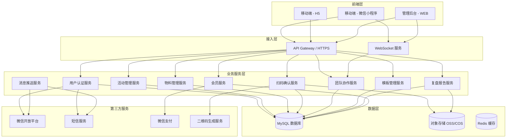

## 2.2 业务模块图

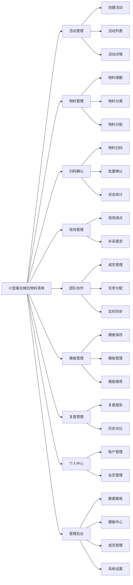

## 2.3 主业务流程

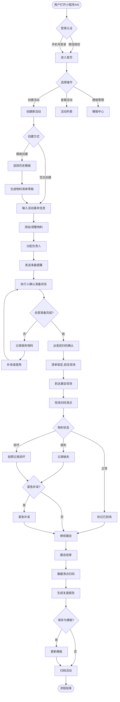

## 2.4 功能图/列表

| 功能模块 | 功能名称 | 优先级 | 功能描述 |
| --- | --- | --- | --- |
| 活动管理 | 新建空白活动 | P0 | 用户输入活动名称、时间、地点，创建空白物料清单 |
| 活动管理 | 基于模板创建 | P0 | 选择历史活动模板，自动生成物料清单草稿 |
| 活动管理 | 活动列表 | P0 | 展示活动列表，包含状态、时间、物料完成率 |
| 活动管理 | 活动详情 | P0 | 展示活动基本信息、物料清单、状态汇总 |
| 物料管理 | 添加物料 | P0 | 输入物料名称、分类、数量、负责人 |
| 物料管理 | 批量导入物料 | P1 | 从模板或历史活动批量导入物料 |
| 物料管理 | 物料分类管理 | P1 | 预设分类 + 自定义分类 |
| 物料管理 | 分配负责人 | P0 | 为每个物料指定负责人 |
| 物料管理 | 负责人提醒 | P1 | 系统向负责人发送物料准备提醒 |
| 扫码确认 | 生成物料二维码 | P0 | 为每个物料生成唯一二维码 |
| 扫码确认 | 扫码确认状态 | P0 | 扫描二维码，确认物料状态 |
| 扫码确认 | 拍照记录 | P1 | 扫码后可拍照记录物料现状 |
| 扫码确认 | 批量勾选确认 | P0 | 手动勾选多个物料，批量确认状态 |
| 现场管理 | 出发前清点 | P0 | 出发前扫码确认物料齐全 |
| 现场管理 | 到场清点 | P0 | 到达现场后扫码确认物料到场情况 |
| 现场管理 | 撤展清点 | P0 | 撤展时扫码确认物料回收情况 |
| 现场管理 | 记录补采需求 | P1 | 记录缺失/损坏物料的补采需求 |
| 现场管理 | 补采清单导出 | P1 | 导出补采清单 |
| 团队协作 | 邀请团队成员 | P1 | 通过微信/手机号邀请成员加入 |
| 团队协作 | 角色权限 | P1 | 设置成员角色和权限 |
| 团队协作 | 实时同步 | P1 | 多人操作时实时同步物料状态 |
| 模板管理 | 保存为模板 | P0 | 将当前活动物料清单保存为模板 |
| 模板管理 | 模板列表 | P0 | 查看已保存的模板列表 |
| 模板管理 | 编辑模板 | P0 | 修改模板内容 |
| 复盘管理 | 自动生成报告 | P1 | 系统自动生成物料复盘报告 |
| 复盘管理 | 历史活动对比 | P2 | 对比不同活动的物料准备情况 |
| 个人中心 | 微信授权登录 | P0 | 通过微信授权登录 |
| 个人中心 | 手机号登录 | P0 | 通过手机号验证码登录 |
| 个人中心 | 会员升级 | P1 | 升级到专业版 |
| 管理后台 | 数据看板 | P1 | 展示核心指标统计 |
| 管理后台 | 系统模板库 | P2 | 管理系统预置的物料模板 |
| 管理后台 | 成员管理 | P1 | 团队成增删改查 |

## 2.5 你的产品有哪些端

| 序号 | 端名称 | 端类型 | 目标用户 | 说明 |
| --- | --- | --- | --- | --- |
| 1 | 移动端 - 微信小程序 | 小程序端 | 活动负责人、物料执行人、现场协调人 | MVP 阶段优先实现，便于现场扫码使用 |
| 2 | 移动端 - H5 | H5端 | 非微信环境下的用户 | 覆盖 Android/iOS 浏览器、企业微信等场景 |
| 3 | 管理后台 | WEB端 | 活动负责人、复盘管理员 | 用于数据查看、模板管理和团队协作（专业版功能） |

---
# 3 产品功能

## 3.1 移动端（微信小程序/H5）功能

### 3.1.1 活动创建

**功能描述**

活动创建是用户进入产品的第一个核心操作。用户可以通过两种方式创建新活动：空白创建（从零开始配置物料清单）或基于模板创建（选择历史活动模板一键生成草稿）。创建完成后进入物料清单编辑流程。

**优先级与依赖说明：**

| 项 | 内容 |
| --- | --- |
| 优先级 | P0 |
| 依赖需求 | 无 |
| 前置条件 | 用户已完成登录认证 |

### 3.1.2 活动创建—详细流程

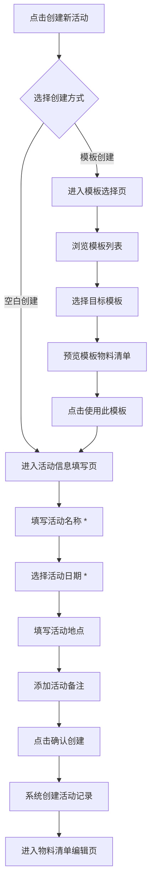

**业务规则说明：**

1. 活动名称为必填项，长度 2-50 个字符，不允许为空或纯空格
2. 活动日期为必填项，结束日期不能早于开始日期
3. 免费版用户最多创建 3 个活动模板，超出时提示升级专业版
4. 基于模板创建时，模板中的所有物料项自动带入清单草稿，用户可编辑修改
5. 活动创建后默认状态为"待准备"，可编辑物料清单

### 3.1.3 活动创建—主要原型

[活动创建表单原型](assets/prototypes/mobile/activity-create-widget.html)

**验收标准说明：**

- [ ] 正常流程：用户选择空白创建，填写完整活动信息后成功创建活动并进入物料清单页
- [ ] 正常流程：用户选择模板创建，选择模板后成功生成清单草稿并可编辑
- [ ] 异常流程：活动名称为空时提示"请输入活动名称"
- [ ] 异常流程：免费版超出 3 个模板限制时提示升级
- [ ] 性能要求：活动创建接口响应时间 < 500ms

### 3.1.4 活动列表

**功能描述**

活动列表是用户进入产品后的首页视图，展示所有活动的卡片式列表。每个卡片展示活动名称、时间、状态标签、物料完成率进度条和负责人头像。支持按状态（待准备/进行中/已完成）筛选，支持下拉刷新和上拉加载。

**优先级与依赖说明：**

| 项 | 内容 |
| --- | --- |
| 优先级 | P0 |
| 依赖需求 | 活动创建（3.1.1） |
| 前置条件 | 用户已完成登录认证 |

### 3.1.5 活动列表—详细流程

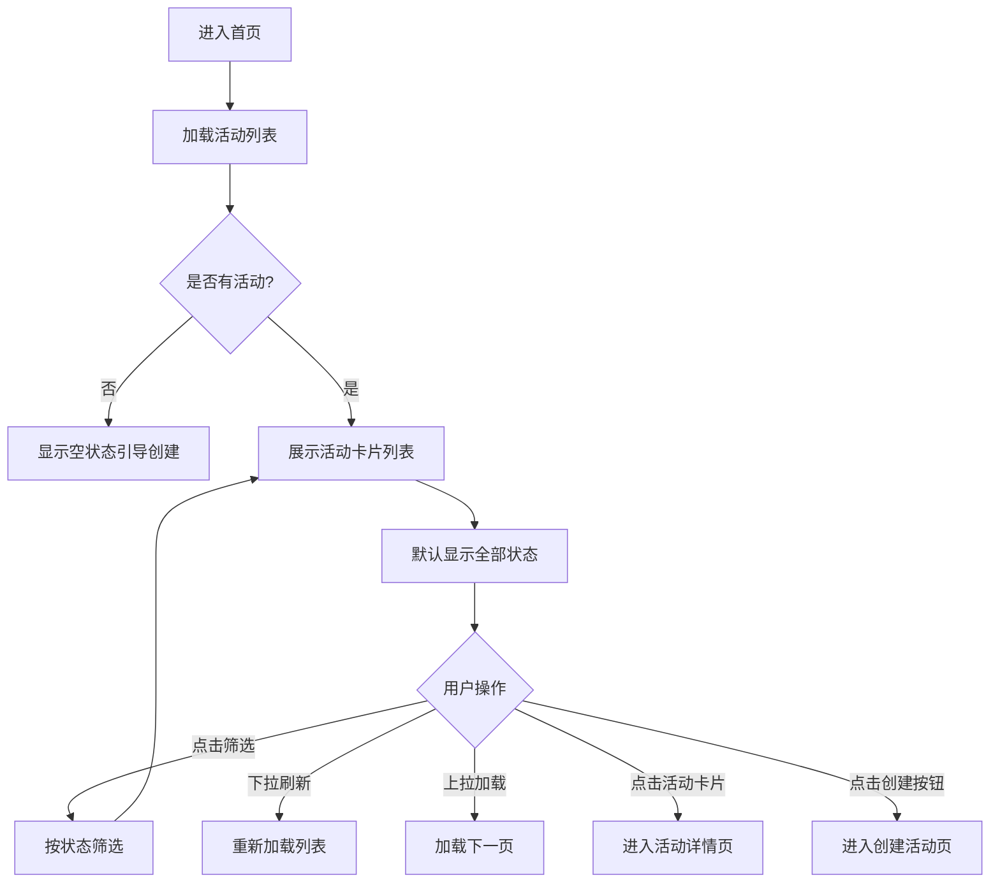

**业务规则说明：**

1. 活动卡片按开始日期倒序排列，最近的活动在最上方
2. 活动状态标签颜色：待准备（灰色）、进行中（蓝色）、已完成（绿色）、已取消（红色）
3. 物料完成率 = 已确认物料数 / 总物料数 × 100%
4. 已完成的活动默认折叠，可展开查看复盘报告
5. 列表每页加载 20 条，支持上拉加载更多

### 3.1.6 活动列表—主要原型

[活动列表原型](assets/prototypes/mobile/activity-list-widget.html)

**验收标准说明：**

- [ ] 正常流程：活动列表正确展示所有活动，状态标签和完成率准确
- [ ] 正常流程：筛选功能正常工作，下拉刷新和上拉加载流畅
- [ ] 异常流程：无活动时显示空状态引导
- [ ] 性能要求：列表加载时间 < 1 秒

### 3.1.7 物料清单管理

**功能描述**

物料清单是活动的核心内容，用户在此页面进行物料的增删改查、分类筛选、负责人分配和状态确认。清单以分组列表形式展示，按物料分类分组（展架/易拉宝/样品/充电器/名片/二维码/赠品/其他），每项物料显示名称、负责人头像、状态标签和操作按钮。

**优先级与依赖说明：**

| 项 | 内容 |
| --- | --- |
| 优先级 | P0 |
| 依赖需求 | 活动创建（3.1.1） |
| 前置条件 | 活动已创建 |

### 3.1.8 物料清单管理—详细流程

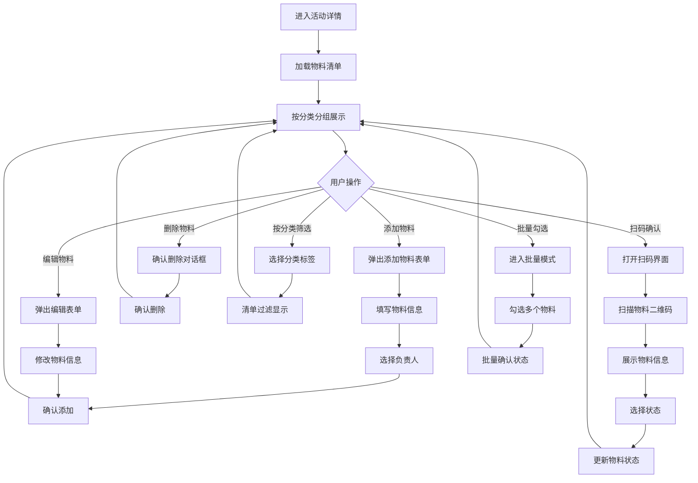

**业务规则说明：**

1. 物料名称为必填项，长度 1-100 个字符
2. 物料分类默认 8 类（展架/易拉宝/样品/充电器/名片/二维码/赠品/其他），专业版支持自定义分类
3. 每个物料可分配 1 名负责人，负责人必须是团队成员
4. 物料状态：待准备 → 已准备 → 已到场 → 已回收（可流转为：缺失/损坏/已报废/待维修）
5. 活动处于"进行中"状态时，清单锁定，只能确认状态不能编辑物料
6. 免费版最多 50 项物料，超出时提示升级专业版

### 3.1.9 物料清单管理—主要原型

[物料清单管理原型](assets/prototypes/mobile/material-list-widget.html)

**验收标准说明：**

- [ ] 正常流程：物料清单按分类正确分组展示，状态标签准确
- [ ] 正常流程：添加、编辑、删除物料功能正常
- [ ] 正常流程：扫码确认和批量勾选确认功能正常
- [ ] 异常流程：免费版超出 50 项物料限制时提示升级
- [ ] 性能要求：清单加载时间 < 1 秒，状态更新实时同步

### 3.1.10 扫码确认

**功能描述**

扫码确认是产品的核心差异化功能。用户通过扫描物料上的唯一二维码，快速确认物料状态（正常/缺失/损坏），并可拍照记录、输入备注。系统自动记录操作日志（时间、操作人、状态变化）。支持单个扫码和批量勾选两种确认方式。

**优先级与依赖说明：**

| 项 | 内容 |
| --- | --- |
| 优先级 | P0 |
| 依赖需求 | 物料清单管理（3.1.7）、物料二维码生成 |
| 前置条件 | 活动已创建，物料已生成二维码 |

### 3.1.11 扫码确认—详细流程

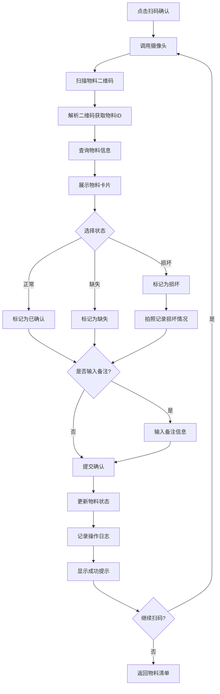

**业务规则说明：**

1. 二维码包含物料唯一 ID，解析失败时提示"无法识别此二维码"
2. 已确认的物料可重复扫码修改状态，系统记录最新状态和历史日志
3. 损坏状态下强制要求拍照，照片大小限制 5MB，自动压缩
4. 操作日志记录：操作时间、操作人、原状态、新状态、备注内容
5. 离线环境下支持扫码确认，联网后自动同步状态

### 3.1.12 扫码确认—主要原型

[扫码确认原型](assets/prototypes/mobile/scan-confirm-widget.html)

**验收标准说明：**

- [ ] 正常流程：扫码后正确展示物料信息，选择状态后成功更新
- [ ] 正常流程：损坏状态下拍照功能正常，照片成功上传
- [ ] 异常流程：二维码无法识别时提示重试
- [ ] 异常流程：离线状态下扫码确认成功，联网后自动同步
- [ ] 性能要求：扫码到展示物料信息 < 1 秒

### 3.1.13 模板管理

**功能描述**

模板管理允许用户将当前活动的物料清单保存为可复用的模板，下次创建活动时一键使用。用户可查看模板列表、编辑模板内容（增删物料、调整分类）、删除不再使用的模板。系统还提供智能推荐功能，根据活动类型推荐常用物料（专业版功能）。

**优先级与依赖说明：**

| 项 | 内容 |
| --- | --- |
| 优先级 | P0（基础模板功能）、P2（智能推荐） |
| 依赖需求 | 物料清单管理（3.1.7） |
| 前置条件 | 活动已创建，物料清单已配置 |

### 3.1.14 模板管理—详细流程

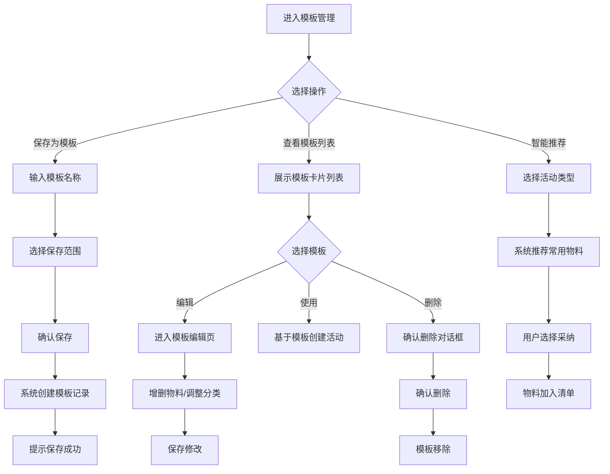

**业务规则说明：**

1. 模板名称为必填项，长度 2-50 个字符
2. 免费版最多保存 3 个模板，超出时提示升级专业版
3. 模板保存时包含：物料名称、分类、默认数量、默认负责人角色（不保存具体负责人）
4. 删除模板前需二次确认，删除后不可恢复
5. 基于模板创建活动时，模板物料自动带入清单草稿

### 3.1.15 模板管理—主要原型

[模板管理原型](assets/prototypes/mobile/template-manage-widget.html)

**验收标准说明：**

- [ ] 正常流程：保存模板成功，模板列表正确展示
- [ ] 正常流程：编辑模板内容后保存生效
- [ ] 正常流程：基于模板创建活动功能正常
- [ ] 异常流程：免费版超出 3 个模板限制时提示升级
- [ ] 性能要求：模板列表加载时间 < 1 秒

### 3.1.16 复盘报告

**功能描述**

撤展后系统自动生成物料复盘报告，包含：物料完整率统计、缺失清单、损坏清单、各负责人完成情况、与历史活动的对比（专业版）。用户可查看报告详情、导出 PDF 报告、将本次经验保存为模板供下次活动复用。

**优先级与依赖说明：**

| 项 | 内容 |
| --- | --- |
| 优先级 | P1 |
| 依赖需求 | 活动管理、扫码确认、物料清单管理 |
| 前置条件 | 活动已完成撤展清点 |

### 3.1.17 复盘报告—详细流程

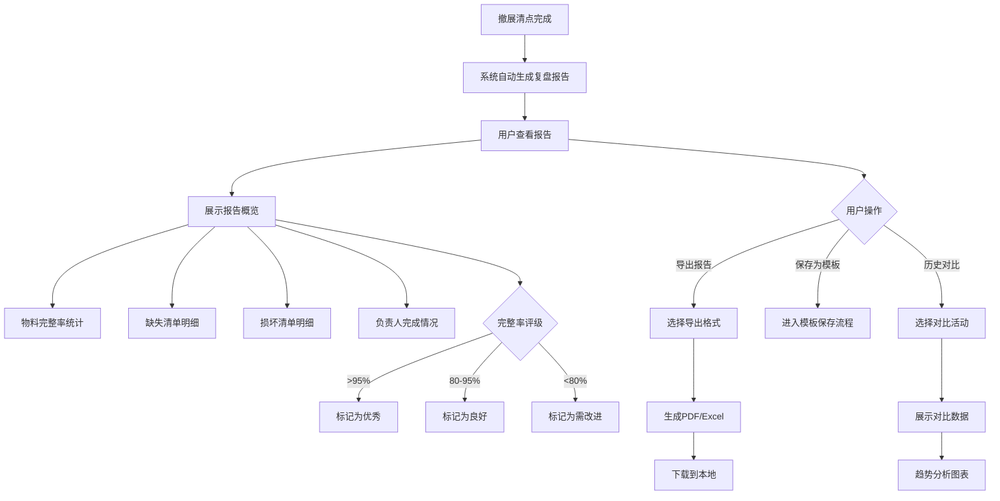

**业务规则说明：**

1. 物料完整率 = 已回收物料数 / 总物料数 × 100%
2. 完整率评级：>95% 优秀（绿色）、80-95% 良好（黄色）、<80% 需改进（红色）
3. 历史对比功能仅专业版可用，免费版仅展示本次报告
4. 报告导出支持 PDF 和 Excel 两种格式
5. 复盘报告在 activity 状态变为"已完成"后自动生成，不可手动触发

### 3.1.18 复盘报告—主要原型

[复盘报告原型](assets/prototypes/mobile/review-report-widget.html)

**验收标准说明：**

- [ ] 正常流程：撤展后自动生成复盘报告，数据准确
- [ ] 正常流程：报告导出功能正常，PDF/Excel 文件可打开
- [ ] 正常流程：专业版历史对比功能正常
- [ ] 异常流程：免费版点击历史对比时提示升级
- [ ] 性能要求：报告生成时间 < 3 秒

## 3.2 管理后台（WEB端）功能

### 3.2.1 数据看板

**功能描述**

数据看板是管理后台的首页，展示团队物料管理的核心指标：活动统计（总活动数、进行中活动数、已完成活动数）、物料统计（总物料数、缺失率、损坏率、各分类占比）、团队统计（成员任务完成情况、按时完成率）。支持时间范围筛选和数据导出。

**优先级与依赖说明：**

| 项 | 内容 |
| --- | --- |
| 优先级 | P1 |
| 依赖需求 | 活动管理、物料管理、团队协作 |
| 前置条件 | 用户已登录管理后台，具有管理员权限 |

### 3.2.2 数据看板—详细流程

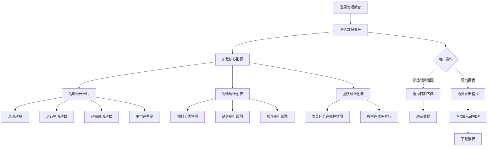

**业务规则说明：**

1. 数据看板仅专业版可用，免费版展示简化版（仅活动数统计）
2. 默认展示最近 30 天的数据，支持自定义时间范围
3. 图表数据每 5 分钟自动刷新一次
4. 导出的报表包含图表数据和明细数据

### 3.2.3 数据看板—主要原型

[数据看板原型](assets/prototypes/web/dashboard-widget.html)

**验收标准说明：**

- [ ] 正常流程：数据看板正确展示所有核心指标，图表渲染正常
- [ ] 正常流程：时间筛选和数据导出功能正常
- [ ] 异常流程：免费版展示简化版看板
- [ ] 性能要求：看板加载时间 < 2 秒

### 3.2.4 团队成员管理

**功能描述**

团队成员管理允许管理员邀请新成员加入团队、设置成员角色（负责人/执行人/观察员）、查看成员列表和联系方式、调整成员权限。支持通过微信或手机号邀请成员。

**优先级与依赖说明：**

| 项 | 内容 |
| --- | --- |
| 优先级 | P1 |
| 依赖需求 | 用户认证服务 |
| 前置条件 | 用户已登录管理后台，具有管理员权限 |

### 3.2.5 团队成员管理—详细流程

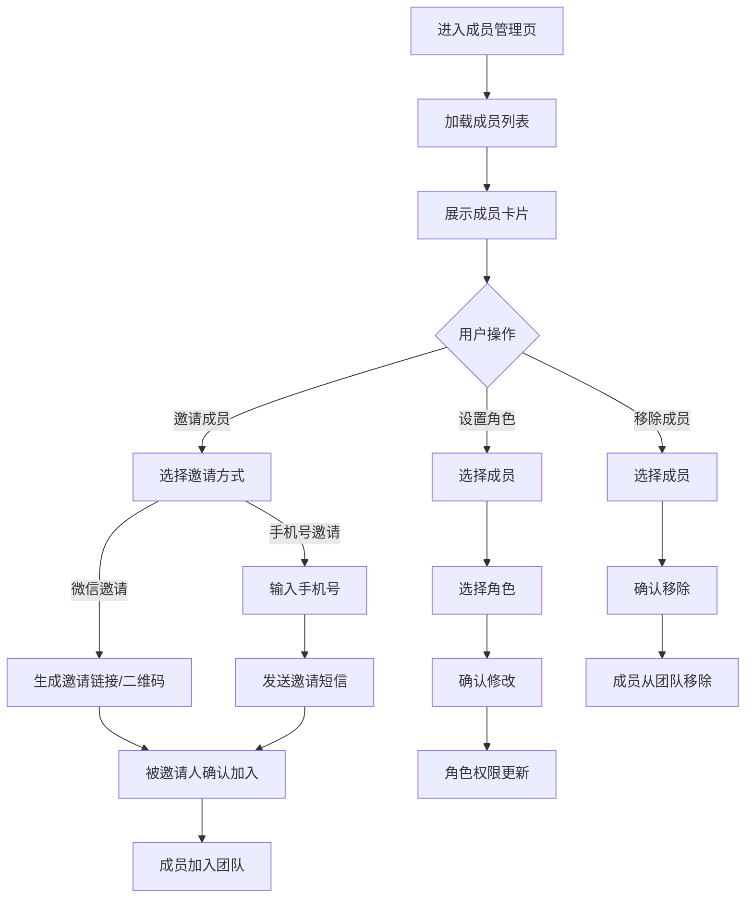

**业务规则说明：**

1. 团队成员角色：负责人（可创建活动、管理物料、查看报告）、执行人（可确认物料状态、执行任务）、观察员（仅可查看，不可操作）
2. 仅管理员可邀请成员、设置角色、移除成员
3. 邀请链接有效期 7 天，过期需重新生成
4. 移除成员时，该成员负责的所有物料自动解绑，需重新分配

### 3.2.6 团队成员管理—主要原型

[团队成员管理原型](assets/prototypes/web/team-manage-widget.html)

**验收标准说明：**

- [ ] 正常流程：邀请成员功能正常，被邀请人成功加入团队
- [ ] 正常流程：角色设置和权限控制正常
- [ ] 异常流程：非管理员尝试邀请成员时提示权限不足
- [ ] 性能要求：成员列表加载时间 < 1 秒

---
# 4 产品原型

## 4.1 页面跳转逻辑图

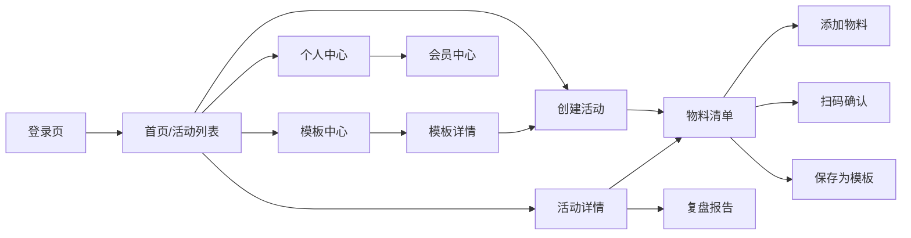

## 4.2 全站点原型设计

### 4.2.1 移动端 - 微信小程序

**页面清单：**

| 序号 | 页面名称 | 所属模块 | 页面描述 | 关键元素 |
| --- | --- | --- | --- | --- |
| 1 | 登录页 | 个人中心 | 微信授权登录页面 | 微信授权按钮、用户协议勾选 |
| 2 | 首页/活动列表 | 活动管理 | 展示所有活动卡片列表 | 活动卡片、状态标签、完成率进度条、筛选Tab、创建按钮 |
| 3 | 创建活动页 | 活动管理 | 填写活动基本信息 | 活动名称输入框、日期选择器、地点输入框、备注输入框、创建方式选择 |
| 4 | 模板选择页 | 模板管理 | 浏览和选择历史模板 | 模板卡片列表、模板预览、使用按钮 |
| 5 | 活动详情页 | 活动管理 | 展示活动完整信息 | 活动基本信息、物料清单、状态统计、操作按钮 |
| 6 | 物料清单页 | 物料管理 | 展示和编辑物料清单 | 分组列表、物料卡片、添加按钮、筛选标签、批量操作 |
| 7 | 添加/编辑物料弹窗 | 物料管理 | 添加或编辑单个物料 | 物料名称、分类选择、数量输入、负责人选择、备注 |
| 8 | 扫码确认页 | 扫码确认 | 扫描物料二维码确认状态 | 摄像头取景框、物料信息卡片、状态选择按钮、拍照按钮、备注输入 |
| 9 | 模板中心页 | 模板管理 | 浏览和管理模板 | 模板列表、创建模板按钮、编辑/删除操作 |
| 10 | 复盘报告页 | 复盘管理 | 查看活动复盘报告 | 完整率统计、缺失清单、损坏清单、导出按钮 |
| 11 | 个人中心页 | 个人中心 | 用户信息和设置 | 用户头像、昵称、会员状态、功能入口 |
| 12 | 会员中心页 | 个人中心 | 会员升级和权益说明 | 当前会员状态、升级按钮、权益对比表 |

**交互说明：**

- 页面跳转关系：
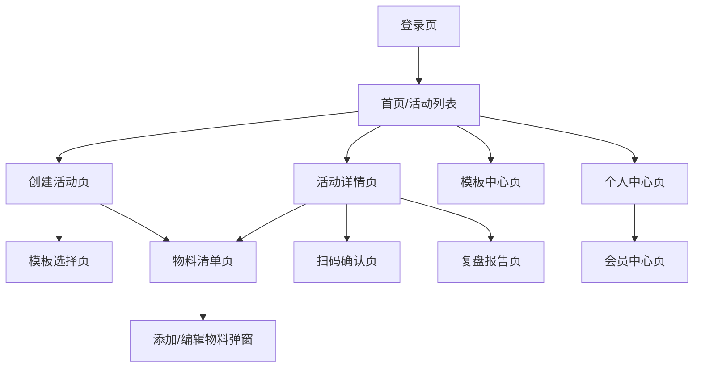

- 特殊交互：
  1. 下拉刷新：活动列表、物料清单支持下拉刷新
  2. 上拉加载：活动列表支持上拉加载更多（每页 20 条）
  3. Tab 切换：首页顶部 Tab 切换活动状态（全部/待准备/进行中/已完成）
  4. 弹窗交互：添加/编辑物料采用底部弹窗形式
  5. Toast 提示：操作成功/失败时使用 Toast 轻提示
  6. 确认对话框：删除操作前弹出确认对话框
  7. 空数据态：无数据时显示空状态插图和引导文案
  8. 加载态：数据加载时显示骨架屏

**产品原型：**

[📱 打开移动端小程序全站点原型](assets/prototypes/mobile-mini-program-prototype.html)

### 4.2.2 移动端 - H5

**页面清单：**

| 序号 | 页面名称 | 所属模块 | 页面描述 | 关键元素 |
| --- | --- | --- | --- | --- |
| 1 | 登录页 | 个人中心 | 手机号验证码登录 | 手机号输入框、验证码输入框、获取验证码按钮、登录按钮 |
| 2 | 首页/活动列表 | 活动管理 | 同小程序端 | 活动卡片列表、筛选Tab、创建按钮 |
| 3-12 | 其他页面 | 各模块 | 同小程序端 | 同小程序端 |

**交互说明：**

- 页面跳转关系：与小程序端一致
- 特殊交互：
  1. 响应式设计：适配 375×667 至 414×896 主流分辨率
  2. 浏览器兼容：支持 Chrome、Safari、微信内置浏览器
  3. 其他交互与小程序端一致

**产品原型：**

[📱 打开移动端H5全站点原型](assets/prototypes/mobile-h5-prototype.html)

### 4.2.3 管理后台

**页面清单：**

| 序号 | 页面名称 | 所属模块 | 页面描述 | 关键元素 |
| --- | --- | --- | --- | --- |
| 1 | 登录页 | 系统 | 管理员登录 | 用户名/密码输入框、登录按钮 |
| 2 | 数据看板 | 数据看板 | 核心指标统计 | 统计卡片、折线图、饼图、柱状图、时间筛选、导出按钮 |
| 3 | 活动管理 | 活动管理 | 查看所有活动列表 | 活动表格、筛选条件、搜索框、操作按钮 |
| 4 | 活动详情 | 活动管理 | 查看活动完整信息 | 活动信息、物料清单、状态统计、操作按钮 |
| 5 | 团队成员 | 成员管理 | 团队成员列表 | 成员表格、邀请按钮、角色设置、操作按钮 |
| 6 | 模板中心 | 模板中心 | 系统模板库 | 模板列表、分类筛选、推荐标签 |
| 7 | 系统设置 | 系统设置 | 基础配置 | 公司信息、通知设置 |

**交互说明：**

- 页面跳转关系：
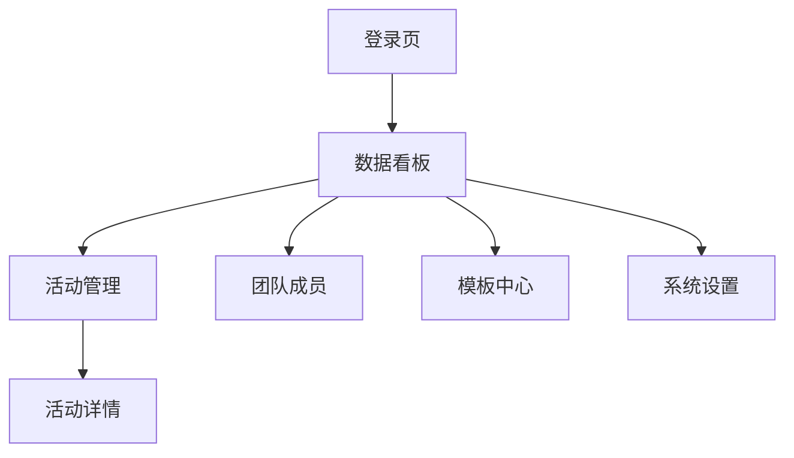

- 特殊交互：
  1. 侧边栏导航：左侧固定导航栏，支持页面切换
  2. 面包屑导航：顶部面包屑显示当前路径
  3. 表格操作：支持排序、筛选、分页
  4. 弹窗表单：新增/编辑操作采用弹窗表单
  5. 图表交互：支持图表数据点悬停查看详情

**产品原型：**

[🖥️ 打开管理后台全站点原型](assets/prototypes/admin-web-prototype.html)

---
# 5 数据需求

## 5.1 数据使用规格

### 活动表（activity）

| **字段** | **是否必填** | **描述** | **数据类型** |
| --- | --- | --- | --- |
| id | 是 | 活动唯一标识 | UUID |
| name | 是 | 活动名称，2-50字符 | 字符串 |
| start_date | 是 | 活动开始日期 | 日期 |
| end_date | 是 | 活动结束日期 | 日期 |
| location | 否 | 活动地点 | 字符串 |
| description | 否 | 活动备注 | 文本 |
| status | 是 | 活动状态：待准备/进行中/待复盘/已完成/已取消 | 枚举 |
| owner_id | 是 | 创建人ID | UUID |
| template_id | 否 | 使用的模板ID | UUID |
| created_at | 是 | 创建时间 | 时间戳 |
| updated_at | 是 | 更新时间 | 时间戳 |

### 物料表（material）

| **字段** | **是否必填** | **描述** | **数据类型** |
| --- | --- | --- | --- |
| id | 是 | 物料唯一标识 | UUID |
| activity_id | 是 | 所属活动ID | UUID |
| name | 是 | 物料名称，1-100字符 | 字符串 |
| category | 是 | 物料分类 | 枚举 |
| quantity | 是 | 数量，默认1 | 整数 |
| owner_id | 否 | 负责人ID | UUID |
| status | 是 | 物料状态 | 枚举 |
| qr_code | 是 | 物料二维码内容 | 字符串 |
| remark | 否 | 备注 | 文本 |
| created_at | 是 | 创建时间 | 时间戳 |
| updated_at | 是 | 更新时间 | 时间戳 |

### 物料状态确认记录表（material_status_log）

| **字段** | **是否必填** | **描述** | **数据类型** |
| --- | --- | --- | --- |
| id | 是 | 记录唯一标识 | UUID |
| material_id | 是 | 物料ID | UUID |
| operator_id | 是 | 操作人ID | UUID |
| old_status | 是 | 原状态 | 枚举 |
| new_status | 是 | 新状态 | 枚举 |
| photo_url | 否 | 照片URL | 字符串 |
| remark | 否 | 备注 | 文本 |
| created_at | 是 | 操作时间 | 时间戳 |

### 模板表（template）

| **字段** | **是否必填** | **描述** | **数据类型** |
| --- | --- | --- | --- |
| id | 是 | 模板唯一标识 | UUID |
| name | 是 | 模板名称，2-50字符 | 字符串 |
| owner_id | 是 | 创建人ID | UUID |
| activity_type | 否 | 活动类型（用于智能推荐） | 枚举 |
| item_count | 是 | 物料项数量 | 整数 |
| created_at | 是 | 创建时间 | 时间戳 |
| updated_at | 是 | 更新时间 | 时间戳 |

## 5.2 统计数据

1. 活动统计：总活动数、进行中活动数、已完成活动数、平均完整率（P1）
2. 物料统计：总物料数、缺失率、损坏率、各分类物料占比（P1）
3. 团队统计：成员任务完成数、按时完成率、个人负责物料完整率（P1）
4. 趋势统计：按月统计物料完整率变化趋势（P2）

## 5.3 埋点需求

| 页面 | 事件 | 采集字段 | 说明 |
| --- | --- | --- | --- |
| 首页 | 进入页面 | user_id, timestamp | 统计日活 |
| 首页 | 创建活动 | user_id, create_type, timestamp | 统计创建方式偏好 |
| 物料清单 | 添加物料 | user_id, activity_id, category, timestamp | 统计物料分类使用情况 |
| 扫码确认 | 扫码成功 | user_id, material_id, status, timestamp | 统计扫码使用频率 |
| 模板中心 | 使用模板 | user_id, template_id, timestamp | 统计模板复用率 |
| 复盘报告 | 导出报告 | user_id, activity_id, export_format, timestamp | 统计报告导出情况 |
| 会员中心 | 升级会员 | user_id, plan_type, timestamp | 统计付费转化率 |

---
# 6 非功能需求

## 6.1 性能需求

**6.1.1 延迟**

| 编号 | 项目 | 最大延迟 | 平均延迟 | 优先级 | 备注 |
| --- | --- | --- | --- | --- | --- |
| 0001 | 页面首屏加载 | <2 秒 | <1 秒 | 高 | 4G 网络环境 |
| 0002 | 核心接口响应（活动/物料 CRUD） | <500ms | <300ms | 高 |  |
| 0003 | 扫码解析到展示物料信息 | <1 秒 | <500ms | 高 |  |
| 0004 | 图片上传（自动压缩） | <3 秒 | <2 秒 | 中 | 单张图片 <5MB |
| 0005 | 批量生成 100 个二维码 | <5 秒 | <3 秒 | 中 |  |

**6.1.2 吞吐量**

| 编号 | 项 | 吞吐量 | 备注 |
| --- | --- | --- | --- |
| 0001 | 用户登录认证 | 每分钟 1000 次 |  |
| 0002 | 扫码确认接口 | 每分钟 500 次 |  |
| 0003 | 图片上传接口 | 每分钟 200 次 |  |

**6.1.3 容量**

| 编号 | 项 | 容量 | 备注 |
| --- | --- | --- | --- |
| 0001 | 系统用户数 | <=100,000 | 初期目标 |
| 0002 | 并发用户数 | <=1,000 | 初期目标 |
| 0003 | 单用户活动数 | <=100 个 |  |
| 0004 | 单用户物料记录数 | <=5,000 条 |  |

## 6.2 安全需求

| 编号 | 项（系统数据 / 处理过程） |
| --- | --- |
| 0001 | 所有接口通过 HTTPS 加密传输 |
| 0002 | 用户密码采用 bcrypt 加密存储 |
| 0003 | 用户敏感信息（手机号、身份证号）脱敏存储 |
| 0004 | API 接口采用 JWT Token 认证，Token 有效期 7 天 |
| 0005 | 防止 SQL 注入、XSS 攻击、CSRF 攻击 |
| 0006 | 用户数据隔离，A 用户不能访问 B 用户的数据 |
| 0007 | 符合《个人信息保护法》，不收集非必要个人信息 |

## 6.3 可靠性

| 编号 | 项 | 值 |
| --- | --- | --- |
| 0001 | 系统可用性 | 99.9% |
| 0002 | 平均正常运行时间 | 30 天 |
| 0003 | 平均故障恢复时间 | <30 分钟 |

## 6.4 可连续性

| 编号 | 项 |
| --- | --- |
| 0001 | 系统需要 7 × 24 式的全天候运行 |
| 0002 | 支持离线扫码确认，联网后自动同步 |
| 0003 | 数据库主从备份，故障自动切换 |

## 6.5 可恢复性

| 编号 | 项 |
| --- | --- |
| 0001 | 数据库每日全量备份，保留 30 天 |
| 0002 | 每小时增量备份 |
| 0003 | 重大故障 1-3 小时内恢复服务可用性 |
| 0004 | 24-72 小时内恢复历史数据 |

## 6.6 兼容性

| 编号 | 要求 | 备注 |
| --- | --- | --- |
| 0001 | 微信小程序基础库 >= 2.10.0 |  |
| 0002 | H5 兼容主流浏览器：Chrome >=90，Safari >=14，微信内置浏览器 |  |
| 0003 | 移动端适配主流分辨率：375×667，390×844，414×896 |  |
| 0004 | 管理后台兼容主流浏览器：Chrome >=90，Firefox >=88，Edge >=90 |  |

## 6.7 易用性

| 编号 | 要求 | 备注 |
| --- | --- | --- |
| 0001 | 核心操作路径不超过 3 步 | 扫码确认：打开→扫码→选择状态 |
| 0002 | 普通用户无需培训即可使用核心功能 |  |
| 0003 | 支持大字体模式，方便现场快速阅读 | P2 |
| 0004 | 界面简洁直观，避免复杂操作 |  |

---
# 7 总结

## 7.1 上线计划

| 阶段 | 时间 | 内容 | 负责人 |
| --- | --- | --- | --- |
| 开发阶段 | 2026-06-27 至 2026-07-02 | MVP 核心功能开发（5-7天） | 开发团队 |
| 测试阶段 | 2026-07-03 至 2026-07-05 | 功能测试、性能测试、兼容性测试 | 测试团队 |
| 灰度阶段 | 2026-07-06 至 2026-07-08 | 灰度 10% 用户，验证稳定性 | 运营团队 |
| 全量上线 | 2026-07-09 | 全量开放给所有用户 | 全体团队 |

## 7.2 后续迭代规划

- V1.1（上线后 2 周）：
  - 优化扫码识别速度
  - 增加物料照片水印功能
  - 支持物料借用/归还记录

- V1.2（上线后 1 个月）：
  - 智能推荐物料清单（基于活动类型和历史数据）
  - 支持物料采购清单与电商平台对接
  - 增加多语言支持（英文）

- V2.0（上线后 3 个月）：
  - 支持展位布局设计和物料摆放规划
  - 增加物料 RFID 识别（替代二维码）
  - 开放 API 接口，支持第三方系统集成

## 7.3 参考文档

- URS-小型展会摊位物料清单.md（用户需求说明书）
- 微信小程序开发文档：https://developers.weixin.qq.com/miniprogram/dev/framework/
- 微信支付接入指南：https://pay.weixin.qq.com/wiki/doc/apiv3/index.shtml
- 阿里云 OSS 文档：https://help.aliyun.com/product/31815.html

---
**文档结束**
