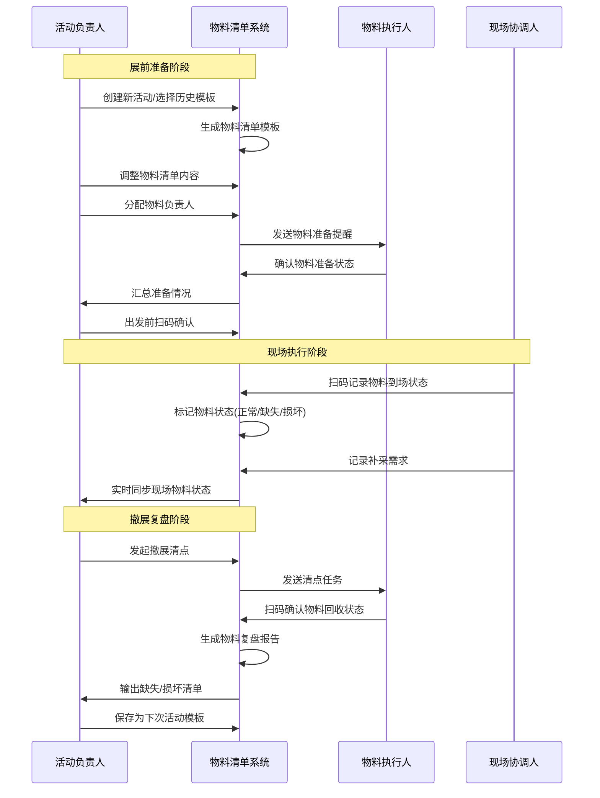
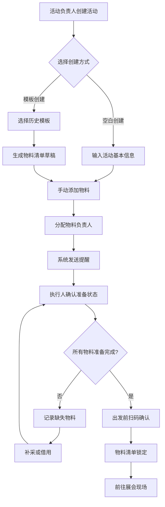
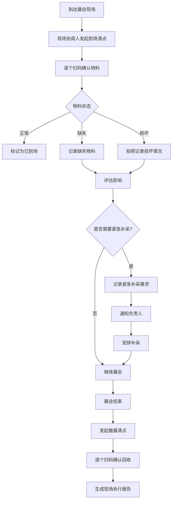
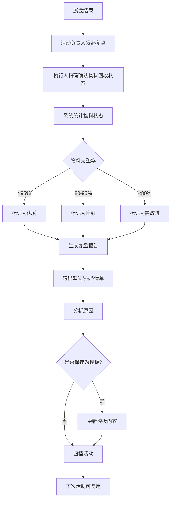
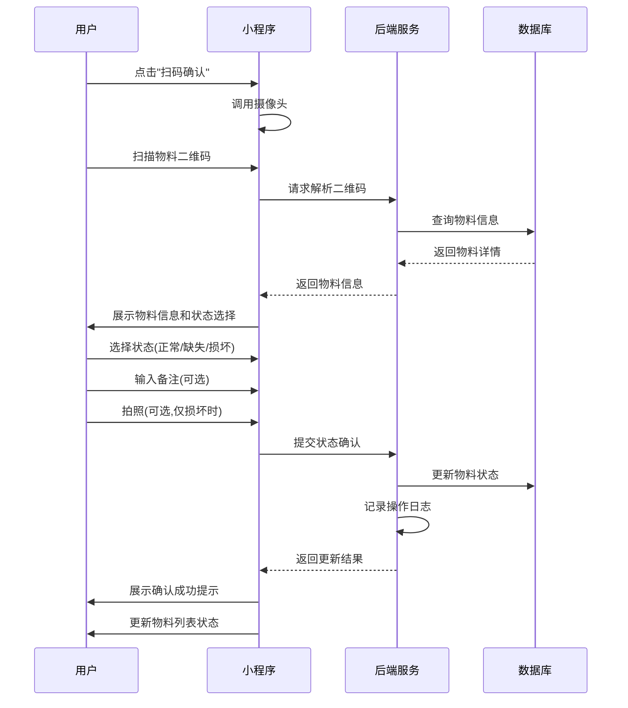
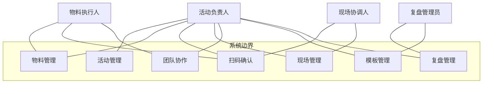
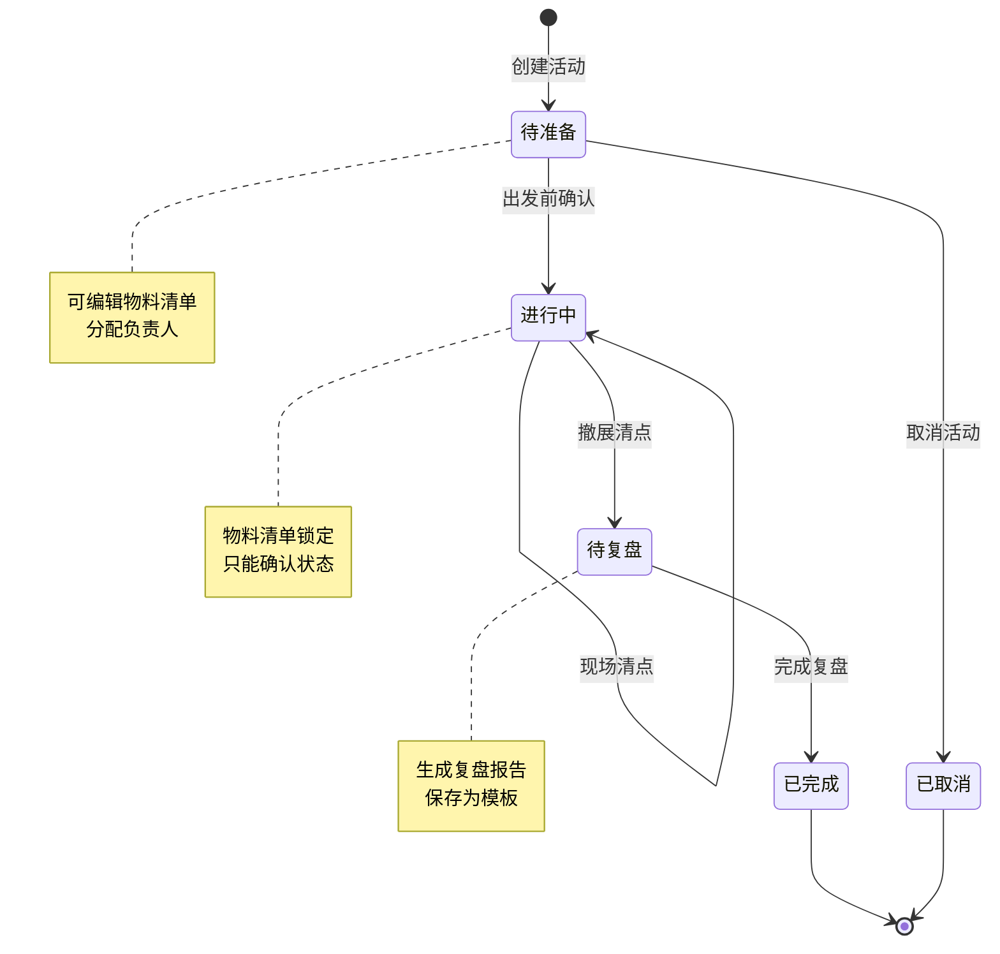
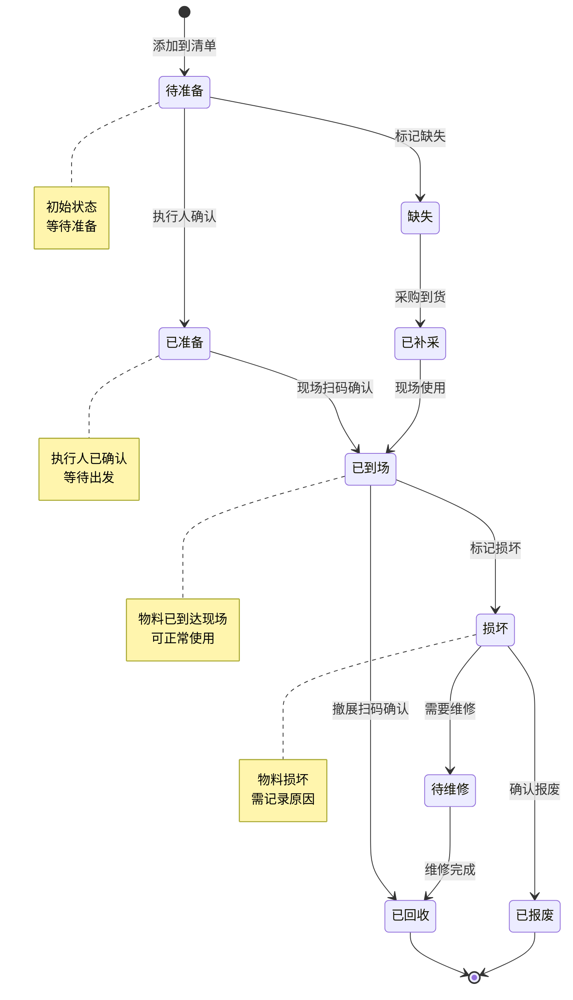

# 小型展会摊位物料清单 - 用户需求说明书 (URS)

**产品名称：** 小型展会摊位物料清单  
**版本号：** v1.0.0  
**文档状态：** 初稿  

---

# 1. 需求概述

## 1.1 需求介绍

小型展会摊位物料清单是一款面向小微企业和品牌方的轻量级展会物料管理工具。该产品专注于解决线下参展活动中物料遗漏、交接混乱、复盘缺失等痛点，帮助用户在展前准备、现场交接、撤展复盘三个阶段实现物料的闭环管理。

### 1.1.1 所属领域

所属行业：企业服务 / 活动管理 / 运营管理工具

目标市场：小型展会、市集、招聘会等线下活动场景

## 1.2 需求目标

1. **降低物料遗漏率**：通过标准化清单和扫码确认机制，将物料遗漏率从行业平均的 30% 降低至 5% 以下
2. **提升协作效率**：支持多人协作，明确物料负责人，减少现场沟通成本
3. **积累运营资产**：通过历史模板和复盘数据，形成可复用的物料准备经验
4. **轻量易用**：5-7 天 MVP 开发周期，快速上线验证市场需求

核心解决的问题：
- 展前准备时物料清单不完整，容易遗漏关键物品
- 现场交接时物料状态不清晰，责任人不明确
- 撤展后无法有效复盘，下次活动重复犯错
- 小团队缺乏专业的物料管理工具，依赖记忆和纸质清单

## 1.3 系统使用角色

| 角色 | 描述 | 典型用户 |
|------|------|----------|
| 活动负责人 | 创建和管理活动物料清单，分配负责人，审核物料准备情况 | 市场运营经理、行政主管、创始人 |
| 物料执行人 | 负责具体物料的prepare、携带、现场管理 | 市场专员、销售人员、志愿者 |
| 现场协调人 | 在展会现场协调物料使用，记录物料状态变化 | 现场负责人、摊位值班人员 |
| 复盘管理员 | 撤展后整理物料状态，生成复盘报告，更新模板 | 活动负责人、运营分析师 |

## 1.4 业务流程图

**流程说明：**

1. **展前准备阶段**：活动负责人基于历史模板或空白清单创建活动，分配负责人并发送提醒，执行人确认准备情况，出发前扫码确认物料完整性
2. **现场执行阶段**：现场协调人扫码记录物料到场状态，标记缺失或损坏情况，记录补采需求，系统实时同步状态给负责人
3. **撤展复盘阶段**：活动负责人发起撤展清点，执行人扫码确认物料回收状态，系统生成复盘报告，输出缺失和损坏清单，负责人将本次经验保存为模板供下次使用

---

# 2. 功能原型

| 原型名称 | 原型链接 | 对应端 | 备注 |
|----------|----------|--------|------|
| 小型展会摊位物料清单 - 移动端 | 待设计 | 小程序端/H5端 | MVP 阶段优先实现移动端，便于现场扫码使用 |
| 小型展会摊位物料清单 - 管理后台 | 待设计 | WEB端 | 用于数据查看、模板管理和团队协作（专业版功能） |

---

# 3. 需求清单

## 3.1 移动端 - 小程序端/H5端

| 模块 | 一级功能 | 二级功能 | 功能描述 | 备注 |
|------|----------|----------|----------|------|
| 活动管理 | 创建活动 | 新建空白活动 | 用户输入活动名称、时间、地点，创建空白物料清单 | P0 |
| 活动管理 | 创建活动 | 基于模板创建 | 用户选择历史活动模板，自动生成物料清单草稿 | P0 |
| 活动管理 | 创建活动 | 模板库浏览 | 展示用户保存的历史模板和系统推荐模板 | P1 |
| 活动管理 | 活动列表 | 活动状态展示 | 展示活动列表，包含状态(待准备/进行中/已完成)、时间、物料完成率 | P0 |
| 活动管理 | 活动列表 | 活动筛选 | 按状态、时间范围筛选活动 | P2 |
| 活动管理 | 活动详情 | 活动基本信息 | 展示活动名称、时间、地点、负责人、物料统计 | P0 |
| 活动管理 | 活动详情 | 物料清单查看 | 展示物料清单，支持按分类/负责人筛选 | P0 |
| 活动管理 | 活动详情 | 物料状态汇总 | 展示物料状态统计(已准备/缺失/损坏/待确认) | P0 |
| 物料管理 | 物料增删 | 添加物料 | 用户输入物料名称、分类、数量、负责人，添加物料到清单 | P0 |
| 物料管理 | 物料增删 | 批量导入物料 | 从模板或历史活动批量导入物料 | P1 |
| 物料管理 | 物料增删 | 编辑物料信息 | 修改物料名称、数量、负责人、备注 | P0 |
| 物料管理 | 物料增删 | 删除物料 | 从清单中删除物料 | P0 |
| 物料管理 | 物料分类 | 物料分类管理 | 预设分类：展架/易拉宝/样品/充电器/名片/二维码/赠品/其他 | P1 |
| 物料管理 | 物料分类 | 自定义分类 | 用户可自定义物料分类 | P2 |
| 物料管理 | 物料分类 | 按分类筛选 | 在清单中按分类筛选物料 | P1 |
| 物料管理 | 物料分配 | 分配负责人 | 为每个物料指定负责人(团队成员) | P0 |
| 物料管理 | 物料分配 | 批量分配 | 批量为多个物料分配负责人 | P2 |
| 物料管理 | 物料分配 | 负责人提醒 | 系统向负责人发送物料准备提醒(微信通知/短信) | P1 |
| 物料管理 | 物料分配 | 负责人查看 | 负责人查看自己负责的物料清单 | P0 |
| 扫码确认 | 物料扫码 | 生成物料二维码 | 为每个物料生成唯一二维码，支持批量生成和打印 | P0 |
| 扫码确认 | 物料扫码 | 扫码确认状态 | 用户扫描物料二维码，确认物料状态(正常/缺失/损坏) | P0 |
| 扫码确认 | 物料扫码 | 拍照记录 | 扫码后可拍照记录物料现状(损坏情况/现场摆放) | P1 |
| 扫码确认 | 物料扫码 | 扫码备注 | 扫码时可输入备注信息(如：缺少配件、需要补采) | P1 |
| 扫码确认 | 批量确认 | 批量勾选确认 | 用户手动勾选多个物料，批量确认状态 | P0 |
| 扫码确认 | 批量确认 | 一键全部确认 | 一键确认所有物料状态为"正常" | P2 |
| 扫码确认 | 状态统计 | 实时状态统计 | 展示物料状态统计(已确认/待确认/缺失/损坏) | P0 |
| 扫码确认 | 状态统计 | 状态变化日志 | 记录每次状态变化的时间、操作人、备注 | P1 |
| 现场管理 | 现场清点 | 出发前清点 | 出发前扫码确认所有物料齐全 | P0 |
| 现场管理 | 现场清点 | 到场清点 | 到达现场后扫码确认物料到场情况 | P0 |
| 现场管理 | 现场清点 | 撤展清点 | 撤展时扫码确认物料回收情况 | P0 |
| 现场管理 | 补采需求 | 记录补采需求 | 记录缺失/损坏物料的补采需求(物料名称、数量、紧急程度) | P1 |
| 现场管理 | 补采需求 | 补采清单导出 | 导出补采清单(Excel/PDF) | P1 |
| 现场管理 | 补采需求 | 补采状态跟踪 | 跟踪补采需求的处理状态(待处理/已采购/已到货) | P2 |
| 团队协作 | 成员管理 | 邀请团队成员 | 通过微信/手机号邀请团队成员加入活动 | P1 |
| 团队协作 | 成员管理 | 角色权限 | 设置成员角色(负责人/执行人/观察员)和权限 | P1 |
| 团队协作 | 成员管理 | 成员列表 | 查看团队成员列表和联系方式 | P1 |
| 团队协作 | 任务分配 | 分配准备任务 | 为成员分配物料准备任务 | P1 |
| 团队协作 | 任务分配 | 任务进度查看 | 查看成员任务完成进度 | P1 |
| 团队协作 | 实时同步 | 物料状态同步 | 多人操作时实时同步物料状态 | P1 |
| 团队协作 | 实时同步 | 操作日志 | 记录所有操作日志(谁在什么时间做了什么) | P1 |
| 模板管理 | 模板保存 | 保存为模板 | 将当前活动物料清单保存为模板，供下次使用 | P0 |
| 模板管理 | 模板保存 | 模板命名 | 为模板命名(如：春季招聘会标准清单) | P0 |
| 模板管理 | 模板管理 | 模板列表 | 查看已保存的模板列表 | P0 |
| 模板管理 | 模板管理 | 编辑模板 | 修改模板内容(增删物料、调整分类) | P0 |
| 模板管理 | 模板管理 | 删除模板 | 删除不再使用的模板 | P1 |
| 模板管理 | 模板推荐 | 智能推荐 | 根据活动类型推荐常用物料 | P2 |
| 复盘管理 | 复盘报告 | 自动生成报告 | 系统自动生成物料复盘报告(完整率、缺失清单、损坏清单) | P1 |
| 复盘管理 | 复盘报告 | 报告查看 | 查看复盘报告详情 | P1 |
| 复盘管理 | 复盘报告 | 报告导出 | 导出复盘报告(PDF) | P1 |
| 复盘管理 | 历史对比 | 历史活动对比 | 对比不同活动的物料准备情况 | P2 |
| 复盘管理 | 历史对比 | 趋势分析 | 分析物料完整率的变化趋势 | P2 |
| 个人中心 | 账户管理 | 微信授权登录 | 通过微信授权登录(小程序) | P0 |
| 个人中心 | 账户管理 | 手机号登录 | 通过手机号验证码登录(H5) | P0 |
| 个人中心 | 账户管理 | 个人信息 | 查看和编辑个人信息(昵称、手机号、公司) | P1 |
| 个人中心 | 会员管理 | 会员状态 | 查看当前会员状态(免费版/专业版)和到期时间 | P1 |
| 个人中心 | 会员管理 | 会员升级 | 升级到专业版(¥29/月) | P1 |
| 个人中心 | 会员管理 | 功能权限说明 | 查看免费版和专业版的功能对比 | P1 |

## 3.2 管理后台 - WEB端

| 模块 | 一级功能 | 二级功能 | 功能描述 | 备注 |
|------|----------|----------|----------|------|
| 数据看板 | 数据统计 | 活动统计 | 展示活动数量、完成率、物料完整率等核心指标 | P1 |
| 数据看板 | 数据统计 | 物料统计 | 展示物料分类统计、缺失率、损坏率 | P1 |
| 数据看板 | 数据统计 | 团队统计 | 展示团队成员任务完成情况 | P1 |
| 数据看板 | 报表导出 | 导出统计报表 | 导出统计报表(Excel/PDF) | P2 |
| 模板中心 | 系统模板 | 系统模板库 | 管理系统预置的物料模板(招聘会/展会/市集等) | P2 |
| 模板中心 | 系统模板 | 模板推荐 | 根据用户行业推荐模板 | P2 |
| 成员管理 | 团队成员 | 成员列表 | 查看所有团队成员信息 | P1 |
| 成员管理 | 团队成员 | 邀请成员 | 邀请新成员加入团队 | P1 |
| 成员管理 | 团队成员 | 角色管理 | 设置成员角色和权限 | P1 |
| 系统设置 | 基础设置 | 公司信息 | 设置公司基本信息 | P2 |
| 系统设置 | 基础设置 | 通知设置 | 设置通知方式(微信/短信/邮件) | P2 |

---

# 4. 非功能需求

## 4.1 使用界面需求

| 需求项 | 需求描述 | 优先级 |
|--------|----------|--------|
| 响应式设计 | 移动端界面适配主流手机屏幕尺寸(iPhone/Android) | P0 |
| 简洁直观 | 核心操作(扫码确认、查看清单)在 3 步内完成 | P0 |
| 离线支持 | 在网络不稳定的展馆环境下，支持离线查看清单和扫码确认 | P1 |
| 大字体模式 | 支持大字体模式，方便现场快速阅读 | P2 |
| 主题色 | 支持自定义主题色(企业品牌色) | P2 |

## 4.2 软硬件环境需求

| 需求项 | 需求描述 | 优先级 |
|--------|----------|--------|
| 移动端支持 | 微信小程序(基础库 2.10.0+)、H5(主流浏览器：Chrome/Safari/微信内置浏览器) | P0 |
| 摄像头调用 | 支持调用手机摄像头扫描二维码 | P0 |
| 相册访问 | 支持访问手机相册上传照片 | P1 |
| 网络环境 | 支持 4G/5G/WiFi 网络环境 | P0 |
| 后端服务 | 云服务器部署(阿里云/腾讯云)，支持 HTTPS | P0 |
| 数据库 | MySQL 8.0+ 或 PostgreSQL 12+ | P0 |
| 对象存储 | 支持图片上传和存储(阿里云 OSS/腾讯云 COS) | P1 |

## 4.3 性能需求

| 需求项 | 需求描述 | 优先级 |
|--------|----------|--------|
| 页面加载时间 | 首屏加载时间 < 2 秒 | P0 |
| 接口响应时间 | 核心接口响应时间 < 500ms | P0 |
| 并发支持 | 支持 1000 并发用户(初期) | P1 |
| 数据存储 | 单用户支持最多 100 个活动、5000 条物料记录 | P1 |
| 图片上传 | 支持单张图片 < 5MB，自动压缩 | P1 |
| 二维码生成 | 批量生成 100 个二维码 < 5 秒 | P1 |

## 4.4 约束性需求

| 需求项 | 需求描述 | 优先级 |
|--------|----------|--------|
| 免费版限制 | 免费版支持 3 个活动模板、50 项物料 | P0 |
| 专业版功能 | 专业版(¥29/月)支持多人协作、照片记录、历史复盘、采购清单导出 | P0 |
| 数据安全 | 用户数据加密存储，支持数据备份和恢复 | P0 |
| 隐私保护 | 不收集用户敏感信息，符合《个人信息保护法》 | P0 |
| 不做功能 | 不做活动管理大系统，不做展位预订、观众管理等功能 | P0 |
| 后台服务 | 需要后台服务支撑用户认证、数据存储、消息推送、支付等功能 | P0 |

---

# 5. 接口需求

## 5.1 硬件接口需求

| 需求项 | 需求描述 | 优先级 |
|--------|----------|--------|
| 摄像头 | 调用手机摄像头扫描二维码 | P0 |
| 相册 | 访问手机相册上传图片 | P1 |

## 5.2 软件接口需求

| 模块 | 接口名称 | 输入 | 输出 | 功能描述 |
|------|----------|------|------|----------|
| 用户认证 | 微信登录接口 | 微信授权 code | access_token、用户信息 | 小程序微信授权登录 |
| 用户认证 | 短信验证码接口 | 手机号 | 验证码 | H5 手机号登录 |
| 消息推送 | 微信模板消息接口 | 消息模板、用户 openid | 推送结果 | 向用户发送物料准备提醒 |
| 消息推送 | 短信发送接口 | 手机号、短信内容 | 发送结果 | 向用户发送短信提醒 |
| 二维码生成 | 二维码生成接口 | 物料 ID、尺寸参数 | 二维码图片 URL | 生成物料二维码 |
| 二维码识别 | 二维码解析接口 | 二维码图片 | 物料 ID | 解析二维码获取物料信息 |
| 图片存储 | 图片上传接口 | 图片文件 | 图片 URL | 上传物料照片到对象存储 |
| 支付接口 | 微信支付接口 | 订单信息、金额 | 支付结果 | 专业版会员支付 |
| 数据导出 | Excel 导出接口 | 数据列表 | Excel 文件 | 导出物料清单、补采清单、复盘报告 |
| 数据导出 | PDF 导出接口 | 报告模板、数据 | PDF 文件 | 导出复盘报告 |

## 5.4 通讯接口需求

| 需求项 | 需求描述 | 优先级 |
|--------|----------|--------|
| HTTPS | 所有接口通过 HTTPS 加密传输 | P0 |
| WebSocket | 支持多人协作时实时同步物料状态 | P1 |

---

# 6. 附录

## 流程图

### 展前准备流程

### 现场执行流程

### 撤展复盘流程

## 时序图

### 扫码确认物料状态时序图

## （用户与系统交互）用例图

## （系统）状态图

### 活动状态流转图

### 物料状态流转图

---

**文档结束**
