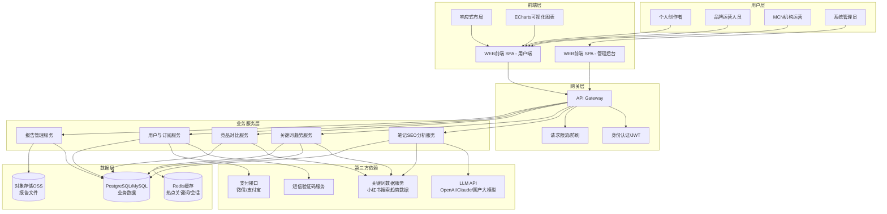
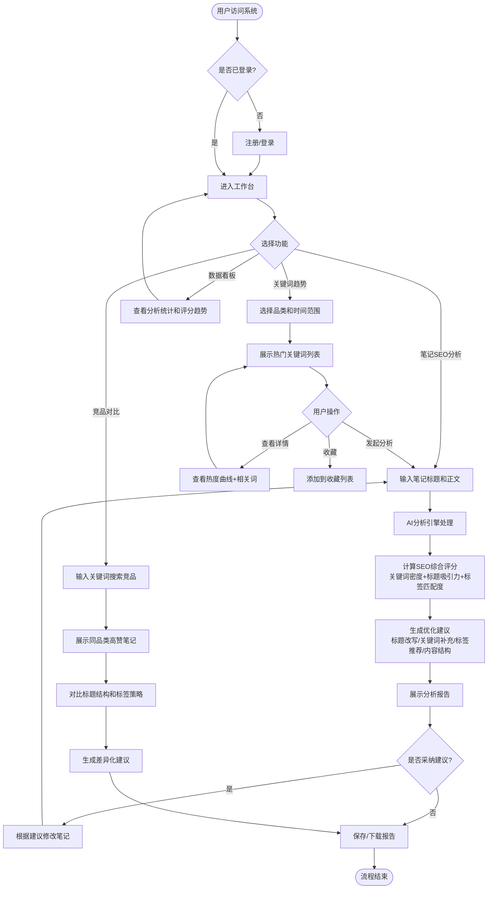
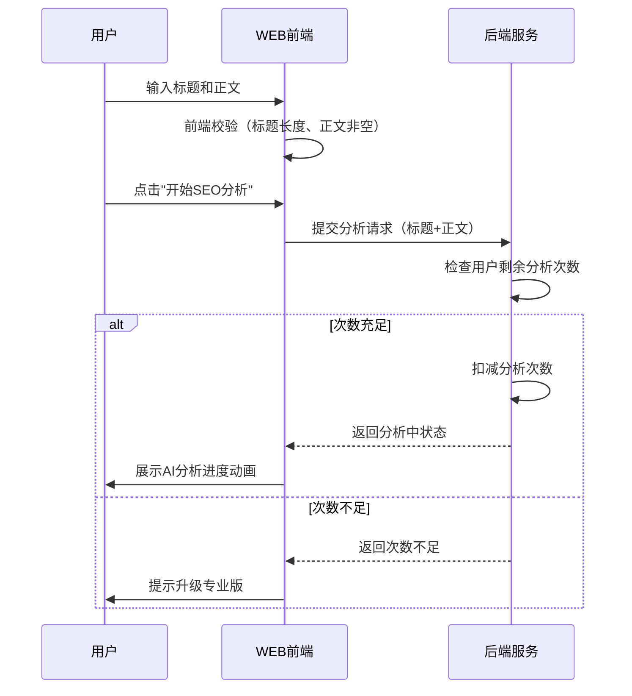
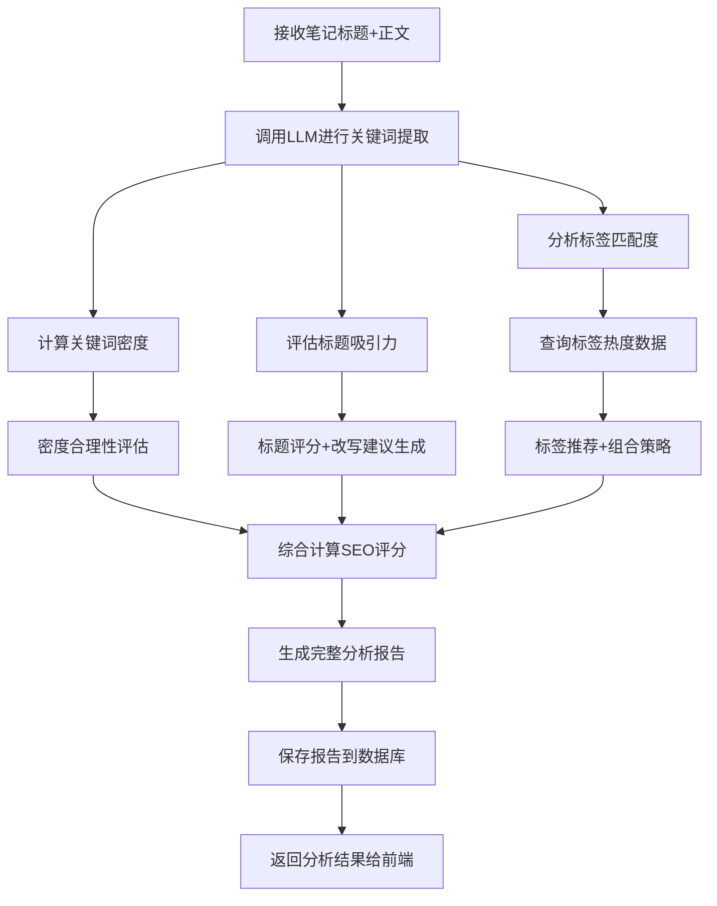
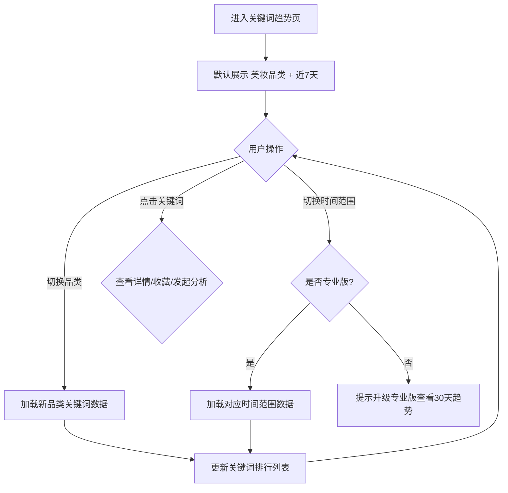
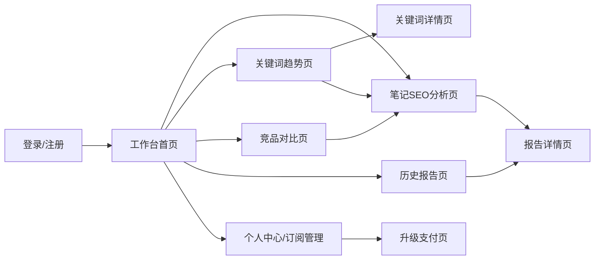
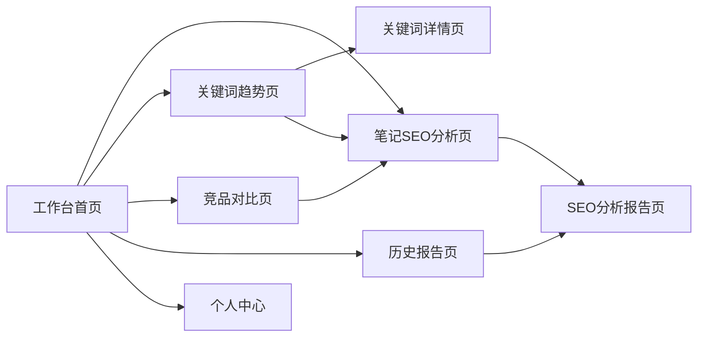

# 小红书笔记SEO优化工具 - 产品需求规格说明书（PRD）

> 文档版本：V1.0  
> 创建日期：2026-06-29  
> 产品负责人：阶段一产品落地页文档总编辑  
> 文档编写：产品文档结对写作专家

---

| 版本号 | 变更日期 | 变更内容 | 变更人 | 审核人 |
| --- | --- | --- | --- | --- |
| V1.0 | 2026-06-29 | 初始版本创建 | 产品文档结对写作专家 | 阶段一产品落地页文档总编辑 |

---

# 1 概述

## 1.1 需求背景

小红书已逐步成为年轻用户的重要搜索入口，平台搜索流量占比持续提升。然而，多数内容创作者缺乏SEO优化知识，笔记的关键词选取、标题撰写、标签配置等往往依赖个人经验，导致优质内容难以获得应有的搜索曝光。

**业务痛点：**
1. **SEO知识门槛高**：大多数小红书创作者不了解关键词密度、标题优化技巧、标签策略等SEO概念，写笔记全凭感觉
2. **关键词选择盲目**：创作者不知道当前哪些关键词搜索热度高、竞争度低，难以制定有效的关键词策略
3. **竞品分析困难**：无法快速了解同品类高赞笔记的标题结构和标签策略，难以找到差异化突破口
4. **优化效果不可量化**：笔记发布前无法预估SEO表现，缺乏数据化的优化依据

**业务价值：**
- 通过AI分析引擎，将专业SEO优化知识转化为"一键分析+具体建议"，让不懂SEO的创作者也能获得专业级优化指导
- 基于关键词趋势数据和竞品对比，让创作者从"凭感觉写"转变为"有数据支撑地写"
- 发布前优化远比发布后补救高效，帮助用户在内容发布环节就抢占搜索流量优势

**预期达成目标：**
- MVP阶段（7-10天）：上线笔记SEO分析+AI优化建议+关键词趋势查询功能，支撑免费版每月10次分析
- 专业版上线：新增竞品对比、批量优化、多账号管理等功能，实现付费转化（¥29/月）

## 1.2 名词解释

| **名词** | **说明** |
| --- | --- |
| SEO | 搜索引擎优化（Search Engine Optimization），通过优化内容提升在平台搜索结果中的排名 |
| 关键词密度 | 某个关键词在全文中出现的频率占比，过高（堆砌）或过低都不利于搜索排名 |
| 标题吸引力 | AI综合评估标题是否包含关键词、是否有情感触发词、是否有数字/疑问等吸引点击的元素 |
| 标签匹配度 | 笔记所用标签与内容主题的相关性，以及标签本身的搜索热度 |
| LLM | 大语言模型（Large Language Model），如OpenAI GPT-4、Claude等，用于AI分析引擎 |
| SEO综合评分 | 系统综合关键词密度、标题吸引力、标签匹配度三个维度给出的0-100分评分 |
| 搜索热度 | 关键词在小红书平台的搜索频次指标，反映用户的搜索需求强度 |
| 竞争度 | 使用某关键词的笔记数量，反映该关键词下内容竞争的激烈程度 |
| 长尾词 | 由核心关键词延伸出的更具体、更长的搜索词组，通常竞争度低但转化精准 |
| KOC | 关键意见消费者（Key Opinion Consumer），粉丝量较小但有真实影响力的内容创作者 |
| KOL | 关键意见领袖（Key Opinion Leader），粉丝量大、影响力强的内容创作者 |
| MCN | 多频道网络（Multi-Channel Network），管理和运营多个内容创作者账号的机构 |

## 1.3 产品介绍

小红书笔记SEO优化工具是一款面向小红书内容创作者和品牌运营人员的AI驱动SEO优化辅助工具。产品聚焦"笔记发布前的SEO优化+关键词策略"这一核心场景，通过输入笔记标题和正文，AI自动分析关键词密度、标题吸引力、标签匹配度，给出SEO综合评分和具体优化建议。同时提供热门关键词趋势查询和同品类高赞笔记竞品对比功能，帮助用户制定更科学的关键词策略。

### 1.3.1 范围说明

| 项 | 内容 |
| --- | --- |
| 包含功能 | 笔记SEO分析（关键词密度/标题吸引力/标签匹配度/综合评分）、AI优化建议（标题改写/关键词补充/标签推荐/内容结构）、关键词趋势查询（分品类/分时段的热门关键词）、竞品对比分析（标题结构/标签策略/内容结构对比）、分析报告管理、批量笔记优化、多账号管理、订阅管理 |
| 不包含功能 | 笔记发布后数据监控、粉丝管理、内容自动生成（代写）、通用数据分析平台、社交平台账号代运营 |

**目标用户：**
- **个人创作者（免费版）**：小红书个人博主、KOC、新手用户，每月分析需求较少（≤10次），希望通过SEO优化提升笔记曝光
- **个人创作者（专业版）**：成熟博主、KOL、自媒体从业者，有高频分析和深度优化需求，愿意为专业功能付费
- **品牌运营人员**：品牌方市场部运营人员，负责品牌小红书账号日常运营，需要竞品对比和批量优化能力
- **MCN机构运营人员**：MCN机构运营团队，负责多个小红书账号的矩阵运营管理，需要多账号管理和批量分析功能

**核心价值：**
1. **降低SEO门槛**：AI分析+具体建议，让不懂SEO的创作者也能专业优化
2. **数据化决策**：SEO评分+关键词趋势+竞品对比，从"凭感觉"到"看数据"
3. **提升效率**：AI自动分析推荐，减少关键词调研和标题优化时间
4. **轻量专注**：专注"发布前SEO优化"，不做通用数据平台，MVP快速交付

## 1.4 产品差异化

| 维度 | 现有工具（千瓜/灰豚等） | 本产品方案 |
| --- | --- | --- |
| 定位 | 通用数据分析/监控平台 | 专注发布前SEO优化 |
| 核心场景 | 发布后的数据追踪 | 发布前的内容优化 |
| 优化方式 | 提供数据，用户自行判断 | AI直接给出优化建议 |
| 关键词策略 | 基础关键词查看 | 趋势分析+竞争度+长尾词推荐 |
| 竞品分析 | 账号/笔记数据对比 | 标题结构+标签策略+差异化建议 |
| 使用门槛 | 需一定数据分析能力 | 零门槛，一键分析获得建议 |

---

# 2 产品设计

## 2.1 系统架构图

## 2.2 业务模块图

```mermaid
flowchart TD
    CORE[小红书笔记SEO优化工具]

    CORE --> M1[笔记SEO分析模块]
    CORE --> M2[关键词趋势模块]
    CORE --> M3[竞品对比模块]
    CORE --> M4[工作台与数据看板模块]
    CORE --> M5[账户与订阅管理模块]
    CORE --> M6[管理后台模块]

    M1 --> M1A[笔记内容录入]
    M1 --> M1B[AI SEO分析引擎]
    M1 --> M1C[SEO综合评分]
    M1 --> M1D[优化建议生成]
    M1 --> M1E[分析报告管理]

    M2 --> M2A[品类筛选]
    M2 --> M2B[趋势查询<br/>7天/30天]
    M2 --> M2C[关键词详情]
    M2 --> M2D[关键词收藏]

    M3 --> M3A[竞品检索]
    M3 --> M3B[标题对比分析]
    M3 --> M3C[标签策略对比]
    M3 --> M3D[差异化建议]

    M4 --> M4A[快捷入口]
    M4 --> M4B[数据看板]
    M4 --> M4C[批量优化<br/>专业版]
    M4 --> M4D[多账号管理<br/>专业版]

    M5 --> M5A[注册/登录]
    M5 --> M5B[订阅计划管理]
    M5 --> M5C[用量统计]

    M6 --> M6A[用户管理]
    M6 --> M6B[订阅与收入管理]
    M6 --> M6C[系统监控]
```

## 2.3 主业务流程

## 2.4 功能图/列表

| 功能模块 | 功能名称 | 优先级 | 功能描述 |
| --- | --- | --- | --- |
| 笔记SEO分析 | 笔记内容录入 | P0 | 输入笔记标题（≤20字）和正文，支持文本粘贴 |
| 笔记SEO分析 | 关键词密度分析 | P0 | AI自动提取关键词，计算密度并评估合理性 |
| 笔记SEO分析 | 标题吸引力分析 | P0 | AI评估标题吸引力，提供1-3个优化标题方案 |
| 笔记SEO分析 | 标签匹配度分析 | P0 | 评估标签相关性，推荐5-10个高热度标签 |
| 笔记SEO分析 | SEO综合评分 | P0 | 0-100分综合评分，含各维度分项得分和等级标识 |
| 笔记SEO分析 | 优化建议生成 | P0 | 标题改写、关键词补充、标签优化、内容结构建议 |
| 笔记SEO分析 | 分析报告管理 | P1 | 查看历史报告、报告详情、删除报告 |
| 关键词趋势 | 品类筛选 | P0 | 按品类（美妆/穿搭/美食/旅行等）浏览关键词 |
| 关键词趋势 | 热度排行查询 | P0 | 近7天搜索热度排行，含上升趋势标识和竞争度 |
| 关键词趋势 | 30天趋势查询 | P1 | 近30天趋势数据（专业版功能） |
| 关键词趋势 | 关键词详情 | P0 | 热度变化曲线+相关长尾词推荐 |
| 关键词趋势 | 关键词收藏 | P1 | 收藏感兴趣的关键词，快速发起分析 |
| 竞品对比 | 竞品检索 | P1 | 按关键词/品类检索高赞笔记 |
| 竞品对比 | 标题对比分析 | P1 | 拆解竞品标题结构特点，对比关键词重叠度 |
| 竞品对比 | 标签策略对比 | P1 | 分析竞品标签策略，给出差异化标签建议 |
| 竞品对比 | 差异化优化建议 | P1 | 综合对比结果给出差异化优化方案（专业版） |
| 工作台 | 数据看板 | P0 | 本月分析次数、平均SEO评分、评分趋势图 |
| 工作台 | 快捷入口 | P0 | 功能导航+最近分析记录 |
| 工作台 | 批量优化 | P2 | 批量导入笔记分析（专业版功能） |
| 工作台 | 多账号管理 | P2 | 添加子账号、切换账号、数据汇总（专业版） |
| 账户管理 | 注册/登录 | P0 | 手机号注册登录，微信授权（可选） |
| 账户管理 | 订阅管理 | P0 | 免费版/专业版订阅管理、用量统计、升级支付 |
| 管理后台 | 用户管理 | P1 | 用户搜索、信息查看、封禁/解封、手动调订阅 |
| 管理后台 | 订阅与收入管理 | P1 | 订阅统计、收入统计、计划参数配置 |
| 管理后台 | 系统监控 | P1 | DAU/MAU、功能使用统计、AI服务状态监控 |

## 2.5 你的产品有哪些端

| 序号 | 端名称 | 端类型 | 目标用户 | 说明 |
| --- | --- | --- | --- | --- |
| 1 | 小红书SEO优化工具 WEB端 | WEB端 | 个人创作者/品牌运营/MCN运营 | 用户在电脑浏览器上使用全部功能：笔记分析、关键词趋势、竞品对比、工作台、订阅管理 |
| 2 | 小红书SEO优化工具 管理后台 | WEB端 | 系统管理员 | 管理后台：用户管理、订阅收入统计、系统监控 |

---

# 3 产品功能

## 3.1 WEB端 - 笔记SEO分析功能

### 3.1.1 笔记内容录入
用户输入笔记标题（限20字以内）和正文内容，作为SEO分析的输入数据。

| 项 | 内容 |
| --- | --- |
| 优先级 | P0 |
| 依赖需求 | 用户登录 |
| 前置条件 | 用户已登录且本月分析次数未耗尽 |

**功能要点：**
- 标题输入框：限制20字以内（小红书标题字数限制），实时显示字数统计
- 正文输入框：支持大文本输入和粘贴，建议字数100-1000字
- 图片OCR识别（MVP后）：上传图片识别文字，纳入分析范围
- 输入校验：标题为空或超长时提示，正文过短时提示"内容过少，建议补充"
- 分析按钮：提交内容进行AI分析，展示loading状态

### 3.1.2 笔记内容录入—详细流程

**业务规则说明：**
1. 标题长度限制为20字以内（含），超过无法提交
2. 正文最低10字，低于此长度提示"内容过少，分析结果可能不准确"
3. 每次分析消耗1次月度分析额度（免费版每月10次，专业版不限）
4. 分析过程中用户可取消，但已消耗的额度不退还
5. 支持从关键词趋势页"一键带入"，自动预填关键词到标题/正文

### 3.1.3 笔记内容录入—主要原型

[笔记内容录入组件原型](assets/prototypes/note-input-widget.html)

**验收标准：**
- [ ] 正常流程：输入标题（≤20字）和正文（≥10字）后，点击"开始分析"成功提交
- [ ] 正常流程：实时显示标题字数统计，达到20字时标红
- [ ] 异常流程：标题为空时提示"请输入笔记标题"
- [ ] 异常流程：正文少于10字时提示"内容过少，建议补充至100字以上"
- [ ] 异常流程：免费版权限用完时提示"本月分析次数已用完，升级专业版不限次数"

### 3.1.4 AI SEO分析引擎
系统调用LLM对笔记内容进行多维度SEO分析，输出关键词密度、标题吸引力、标签匹配度等分析结果。

| 项 | 内容 |
| --- | --- |
| 优先级 | P0 |
| 依赖需求 | 笔记内容录入 |
| 前置条件 | 笔记内容已提交 |

**功能要点：**
- **关键词密度分析**：
  - AI自动提取笔记中的3-8个核心关键词
  - 计算每个关键词的出现频次和密度百分比
  - 评估密度合理性：过低（<1%）提示"关键词密度不足，建议适当补充"；合理（1%-3%）标绿；过高（>5%）提示"关键词堆砌风险，建议降低频率"
- **标题吸引力分析**：
  - AI评估标题是否包含核心关键词
  - 评估是否使用情感触发词（如"绝了"、"必看"、"安利"等小红书高频词）
  - 评估是否包含数字（如"5个技巧"）、疑问句式等吸引点击的元素
  - 给出标题评分（0-100分）
- **标签匹配度分析**：
  - 评估当前标签与笔记内容的相关性
  - 查询标签搜索热度数据
  - 基于笔记内容推荐5-10个高搜索热度标签
  - 建议最佳标签数量（通常5-8个）和组合策略

### 3.1.5 AI SEO分析引擎—详细流程

**业务规则说明：**
1. LLM分析超时阈值为10秒，超时后返回降级提示"AI分析繁忙，请稍后重试"
2. LLM调用失败时自动重试2次，仍失败则标记本次分析为"分析失败"，不消耗额度
3. 关键词密度计算基于全文文本，标题中的关键词权重×1.5
4. 标签推荐需同时考虑相关性和搜索热度，优先推荐"高相关+高热度"标签

### 3.1.6 SEO综合评分与分析结果展示

| 项 | 内容 |
| --- | --- |
| 优先级 | P0 |
| 依赖需求 | AI SEO分析引擎 |
| 前置条件 | 分析完成 |

**功能要点：**
- **SEO综合评分**：0-100分，综合三个维度得分
  - 关键词密度得分（权重30%）
  - 标题吸引力得分（权重35%）
  - 标签匹配度得分（权重35%）
- **评分等级**：
  - 85-100分：优秀（绿色）——SEO表现优秀，保持当前策略
  - 70-84分：良好（蓝色）——整体不错，仍有优化空间
  - 50-69分：一般（黄色）——建议参考优化建议进行改进
  - 50分以下：需优化（红色）——建议重点参考优化建议
- **分项得分展示**：以雷达图或分项进度条展示各维度得分
- **优化建议区**：按优先级排列具体可执行的建议

### 3.1.7 SEO综合评分—主要原型

[SEO分析报告组件原型](assets/prototypes/seo-analysis-widget.html)

**验收标准：**
- [ ] 正常流程：分析完成后正确展示SEO综合评分，分数与三维度加权计算结果一致
- [ ] 正常流程：评分等级颜色与分数区间匹配（优秀绿/良好蓝/一般黄/需优化红）
- [ ] 正常流程：各维度分项得分正确展示，进度条/雷达图渲染正常
- [ ] 正常流程：优化建议按优先级排列，建议内容具体可执行
- [ ] 异常流程：LLM超时/失败时展示友好错误提示，不消耗额度

### 3.1.8 优化建议生成
基于AI分析结果，生成标题改写、关键词补充、标签推荐、内容结构等具体优化建议。

| 项 | 内容 |
| --- | --- |
| 优先级 | P0 |
| 依赖需求 | AI SEO分析引擎 |
| 前置条件 | 分析完成 |

**功能要点：**
- **标题优化建议**：提供1-3个改写标题方案，用户可一键复制
- **关键词补充建议**：建议需在正文中补充的关键词及建议出现次数
- **标签优化建议**：推荐替换或新增的标签列表，含标签热度参考
- **内容结构建议**：建议正文结构优化（如关键信息前置、分段优化、重点加粗等）
- 每条建议标注影响程度（高/中/低），帮助用户判断优先级

### 3.1.9 分析报告管理
管理历史分析报告，支持查看、删除操作。

| 项 | 内容 |
| --- | --- |
| 优先级 | P1 |
| 依赖需求 | SEO分析完成 |
| 前置条件 | 存在历史分析报告 |

**功能要点：**
- 报告列表：展示笔记标题、分析时间、SEO评分、评分等级
- 筛选排序：按时间、评分排序，按评分等级筛选
- 报告详情：查看完整分析结果和优化建议
- 报告删除：删除不需要的报告（需二次确认）
- 报告对比（专业版）：选择两篇报告进行对比，查看优化前后变化

---

## 3.2 WEB端 - 关键词趋势功能

### 3.2.1 品类筛选与趋势查询
用户按品类和时间范围查询搜索热度上升的关键词。

| 项 | 内容 |
| --- | --- |
| 优先级 | P0 |
| 依赖需求 | 无 |
| 前置条件 | 用户已登录 |

**功能要点：**
- **品类选择**：展示品类分类标签（美妆/穿搭/美食/旅行/家居/母婴/健身/数码等），支持切换
- **时间范围**：
  - 近7天趋势（默认，免费/专业版均可用）
  - 近30天趋势（专业版功能）
- **热度排行列表**：
  - 关键词 + 搜索热度值 + 热度变化趋势（↑上升/↓下降/→持平）
  - 竞争度参考（高/中/低），以标签颜色区分
  - 上升趋势最明显的关键词特殊标识（如"🔥热"标签）
- **关键词操作**：查看详情、收藏、从关键词发起笔记分析

### 3.2.2 品类筛选与趋势查询—详细流程

### 3.2.3 品类筛选与趋势查询—主要原型

[关键词趋势组件原型](assets/prototypes/keyword-trend-widget.html)

**验收标准：**
- [ ] 正常流程：切换品类后关键词列表正确更新
- [ ] 正常流程：近7天关键词热度排行正确展示，含热度值和竞争度
- [ ] 正常流程：上升趋势关键词正确标识"🔥热"标签
- [ ] 异常流程：免费版用户点击30天趋势时提示升级
- [ ] 性能要求：关键词列表加载时间不超过3秒

### 3.2.4 关键词详情与收藏
查看单个关键词的热度变化曲线和相关词推荐，支持收藏管理。

| 项 | 内容 |
| --- | --- |
| 优先级 | P0 |
| 依赖需求 | 关键词趋势查询 |
| 前置条件 | 关键词已选择 |

**功能要点：**
- **关键词热度曲线**：以折线图展示关键词在所选时间范围内的搜索热度变化
- **相关词推荐**：展示与目标关键词相关的长尾词和关联词列表
- **关键词收藏**：添加到个人收藏列表，方便后续快速查看
- **发起分析**：基于选中关键词直接跳转到笔记分析页，预填关键词

---

## 3.3 WEB端 - 竞品对比功能

### 3.3.1 竞品检索与分析
用户输入关键词或按品类浏览，系统检索同品类高赞笔记并进行对比分析。

| 项 | 内容 |
| --- | --- |
| 优先级 | P1（专业版功能） |
| 依赖需求 | 无 |
| 前置条件 | 用户为专业版套餐 |

**功能要点：**
- **关键词搜索竞品**：输入关键词，系统检索该关键词下的高赞笔记（按点赞数排序）
- **品类浏览竞品**：按品类浏览当前热门高赞笔记
- **展示竞品列表**：竞品标题、标签、点赞数、互动数据概览

### 3.3.2 标题与标签对比分析
将自身笔记与竞品笔记进行标题结构、标签策略和内容结构的对比。

| 项 | 内容 |
| --- | --- |
| 优先级 | P1（专业版功能） |
| 依赖需求 | 竞品检索 |
| 前置条件 | 已选择竞品笔记 |

**功能要点：**
- **标题结构拆解**：分析竞品标题的结构特点（疑问句/数字/情感词/悬念句式等）
- **标题关键词对比**：对比自身笔记与竞品标题的关键词重叠度和差异
- **标签策略分析**：分析竞品的标签使用策略和热门标签
- **标签差异建议**：基于竞品标签策略给出差异化标签建议
- **内容结构对比**：对比自身笔记与竞品在内容结构上的差异
- **综合差异化建议**：综合以上分析给出差异化优化方案

### 3.3.3 竞品对比—主要原型

[竞品对比组件原型](assets/prototypes/competitor-compare-widget.html)

**验收标准：**
- [ ] 正常流程：输入关键词后正确检索并展示高赞竞品笔记列表
- [ ] 正常流程：标题结构拆解正确识别疑问句/数字/情感词等元素
- [ ] 正常流程：标签对比正确展示竞品标签和差异化建议
- [ ] 异常流程：免费版用户访问时提示升级专业版
- [ ] 性能要求：单次竞品对比分析在30秒内完成

---

## 3.4 WEB端 - 工作台与数据看板功能

### 3.4.1 工作台
提供功能快捷入口、最近分析记录和基础数据统计。

| 项 | 内容 |
| --- | --- |
| 优先级 | P0 |
| 依赖需求 | 无 |
| 前置条件 | 用户已登录 |

**功能要点：**
- **快捷入口卡片**：笔记SEO分析、关键词趋势、竞品对比的快捷入口
- **最近分析**：展示最近5条分析记录，支持快速查看和继续优化
- **数据看板**：
  - 本月分析次数/剩余次数
  - 平均SEO评分
  - 评分趋势折线图（近10次分析的评分变化）
  - 品类分析分布饼图（各品类分析次数占比）

### 3.4.2 工作台—主要原型

[工作台组件原型](assets/prototypes/dashboard-widget.html)

**验收标准：**
- [ ] 正常流程：快捷入口点击后正确跳转到对应功能页
- [ ] 正常流程：最近分析列表展示最近5条记录，点击可查看详情
- [ ] 正常流程：数据看板各图表正确渲染，数据与实际使用情况一致
- [ ] 正常流程：免费版用户正确显示剩余分析次数

### 3.4.3 批量优化（专业版）
支持批量导入多篇笔记进行分析，生成汇总报告。

| 项 | 内容 |
| --- | --- |
| 优先级 | P2（专业版功能） |
| 依赖需求 | 笔记SEO分析 |
| 前置条件 | 用户为专业版套餐 |

**功能要点：**
- 批量笔记录入：支持逐条添加或CSV文件导入
- 批量分析结果：列表展示各笔记SEO评分和关键建议
- 汇总报告：生成批量分析的汇总统计和优化建议

### 3.4.4 多账号管理（专业版）
管理多个小红书账号，切换查看各账号数据。

| 项 | 内容 |
| --- | --- |
| 优先级 | P2（专业版功能） |
| 依赖需求 | 无 |
| 前置条件 | 用户为专业版套餐 |

**功能要点：**
- 添加子账号：输入小红书账号信息添加
- 切换账号：在不同管理账号间切换
- 各账号数据汇总：汇总展示各账号的分析数据

---

## 3.5 WEB端 - 账户与订阅管理功能

### 3.5.1 用户注册与登录
用户通过手机号+验证码完成注册和登录。

| 项 | 内容 |
| --- | --- |
| 优先级 | P0 |
| 依赖需求 | 无 |
| 前置条件 | 无 |

**功能要点：**
- 手机号注册：输入手机号 → 获取验证码 → 设置密码 → 注册成功
- 手机号登录：手机号 + 验证码/密码登录
- 微信授权登录（MVP后）：微信扫码授权快速登录
- 注册成功默认免费版，每月10次分析额度

### 3.5.2 订阅计划管理
查看当前订阅信息，管理升级/降级。

| 项 | 内容 |
| --- | --- |
| 优先级 | P0 |
| 依赖需求 | 用户注册 |
| 前置条件 | 用户已登录 |

**功能要点：**
- **当前计划展示**：订阅类型（免费版/专业版）、到期时间、剩余分析次数
- **计划对比**：免费版 vs 专业版功能对比表
- **升级支付**：在线支付升级专业版（¥29/月），支持微信/支付宝
- **用量统计**：本月已用分析次数、剩余额度
- **用量超限提示**：免费版权限用完时弹窗提示升级

**订阅计划对比：**

| 功能 | 免费版 | 专业版（¥29/月） |
| --- | --- | --- |
| 每月分析次数 | 10次 | 不限 |
| 关键词趋势 | 近7天基础查询 | 近7天+30天完整查询 |
| 竞品对比分析 | ❌ | ✅ |
| 批量笔记优化 | ❌ | ✅ |
| 多账号管理 | ❌ | ✅ |
| 分析报告历史 | 近30天 | 全部历史 |

### 3.5.3 订阅计划管理—主要原型

[订阅管理组件原型](assets/prototypes/subscription-widget.html)

**验收标准：**
- [ ] 正常流程：正确展示当前订阅计划、剩余次数、到期时间
- [ ] 正常流程：免费版用尽次数时弹窗提示升级
- [ ] 正常流程：升级支付成功后立即生效，额度更新
- [ ] 正常流程：计划对比表正确展示免费版与专业版差异

---

## 3.6 WEB端（管理后台）- 系统管理功能

### 3.6.1 用户管理
管理员搜索、查看、管理用户信息。

| 项 | 内容 |
| --- | --- |
| 优先级 | P1 |
| 依赖需求 | 无 |
| 前置条件 | 管理员已登录 |

**功能要点：**
- 用户列表：按注册时间排序展示用户信息
- 用户搜索：按手机号/昵称搜索
- 用户详情：查看基本信息、订阅状态、使用情况
- 用户操作：封禁/解封、手动调整订阅计划

### 3.6.2 订阅与收入管理
统计订阅用户数和收入数据，配置订阅计划参数。

| 项 | 内容 |
| --- | --- |
| 优先级 | P1 |
| 依赖需求 | 无 |
| 前置条件 | 管理员已登录 |

**功能要点：**
- 订阅统计：各计划用户数、转化率、续费率
- 收入统计：月度/季度/年度收入数据和趋势
- 计划配置：修改价格、功能权限、分析次数限制等

### 3.6.3 系统监控
监控核心运营指标和系统健康状态。

| 项 | 内容 |
| --- | --- |
| 优先级 | P1 |
| 依赖需求 | 无 |
| 前置条件 | 管理员已登录 |

**功能要点：**
- 运营数据：DAU/MAU、功能使用频次统计
- AI服务状态：监控LLM API可用性和响应时间
- 关键词数据更新状态：监控关键词趋势数据的更新时效

---

# 4 产品原型

## 4.1 页面跳转逻辑图

## 4.2 全站点原型设计

### 4.2.1 小红书SEO优化工具 WEB端（用户端）

**页面清单：**

| 序号 | 页面名称 | 所属模块 | 页面描述 | 关键元素 |
| --- | --- | --- | --- | --- |
| 1 | 工作台首页 | 工作台 | 数据看板+快捷入口+最近分析 | 指标卡片、评分趋势图、品类分布饼图、快捷入口卡片、最近分析列表 |
| 2 | 笔记SEO分析页 | 笔记SEO分析 | 输入笔记内容并进行SEO分析 | 标题输入框、正文输入框、分析按钮、AI分析进度动画 |
| 3 | SEO分析报告页 | 笔记SEO分析 | 展示分析结果和优化建议 | 综合评分环形图、分项得分、关键词密度表、标题评分、标签推荐、优化建议列表 |
| 4 | 关键词趋势页 | 关键词趋势 | 分品类查询热门关键词 | 品类标签栏、时间范围切换、关键词排行表、热度趋势标识 |
| 5 | 关键词详情页 | 关键词趋势 | 查看单关键词热度和相关词 | 热度折线图、相关词列表、收藏按钮、发起分析按钮 |
| 6 | 竞品对比页 | 竞品对比 | 检索并对比竞品笔记 | 搜索输入框、竞品列表、标题结构对比、标签对比、差异化建议 |
| 7 | 历史报告页 | 笔记SEO分析 | 查看管理历史分析报告 | 报告列表、筛选排序、评分标签、删除操作 |
| 8 | 个人中心/订阅管理页 | 账户管理 | 个人信息和订阅管理 | 个人信息表单、订阅计划卡片、用量进度条、升级按钮 |

**交互说明：**
- 页面跳转关系：

- 特殊交互：
  1. 全局顶部导航栏：Logo + 功能Tab（工作台 / 笔记分析 / 关键词趋势 / 竞品对比 / 历史报告）+ 用户头像（含用量提示）
  2. 笔记分析页：AI分析过程中展示动态进度动画（关键词提取中→标题评估中→标签匹配中→生成建议中），预计总耗时5-10秒
  3. 分析报告页：SEO综合评分以大号环形进度图展示，分项得分以雷达图展示，优化建议可一键复制
  4. 关键词趋势页：品类标签横向滚动，排行表支持点击排序，热度上升用绿色箭头+百分比标注
  5. 竞品对比页：免费版用户访问时弹出升级引导遮罩
  6. 异常状态处理：空数据态（引导用户开始第一次分析）、加载态（骨架屏+loading动画）、错误态（错误提示+重试按钮）、额度不足态（升级引导弹窗）

**产品原型：**

[🖥️ 打开小红书SEO优化工具 WEB端全站点原型](assets/prototypes/web-prototype.html)

---

# 5 数据需求

## 5.1 数据使用规格

### 分析报告表

| **字段** | **是否必填** | **描述** | **数据类型** |
| --- | --- | --- | --- |
| id | 是 | 分析报告唯一标识 | UUID |
| user_id | 是 | 用户ID | UUID |
| note_title | 是 | 笔记标题 | 字符串（≤20字） |
| note_content | 是 | 笔记正文 | 文本 |
| overall_score | 是 | SEO综合评分（0-100） | 整数 |
| score_level | 是 | 评分等级（excellent/good/fair/poor） | 字符串 |
| keyword_score | 是 | 关键词密度得分 | 整数 |
| title_score | 是 | 标题吸引力得分 | 整数 |
| tag_score | 是 | 标签匹配度得分 | 整数 |
| keywords_extracted | 是 | AI提取的关键词列表 | JSON数组 |
| keyword_density | 是 | 关键词密度详情 | JSON对象 |
| title_suggestions | 否 | 标题改写建议 | JSON数组 |
| tag_recommendations | 否 | 推荐标签列表 | JSON数组 |
| optimization_suggestions | 否 | 优化建议详情 | JSON对象 |
| created_at | 是 | 分析时间 | 日期时间 |

### 关键词趋势表

| **字段** | **是否必填** | **描述** | **数据类型** |
| --- | --- | --- | --- |
| id | 是 | 记录唯一标识 | UUID |
| category | 是 | 品类分类 | 字符串 |
| keyword | 是 | 关键词 | 字符串 |
| search_volume | 是 | 搜索热度值 | 整数 |
| trend_direction | 是 | 趋势方向（up/down/stable） | 字符串 |
| trend_percent | 是 | 趋势变化百分比 | 浮点数 |
| competition_level | 是 | 竞争度（high/medium/low） | 字符串 |
| related_keywords | 否 | 相关词列表 | JSON数组 |
| date | 是 | 数据日期 | 日期 |

### 用户表

| **字段** | **是否必填** | **描述** | **数据类型** |
| --- | --- | --- | --- |
| id | 是 | 用户唯一标识 | UUID |
| phone | 是 | 手机号 | 字符串 |
| nickname | 否 | 昵称 | 字符串 |
| avatar | 否 | 头像URL | 字符串 |
| subscription_plan | 是 | 订阅计划（free/pro） | 字符串 |
| subscription_expire | 否 | 订阅到期时间 | 日期时间 |
| monthly_analysis_used | 是 | 本月已用分析次数 | 整数 |
| monthly_analysis_limit | 是 | 本月分析次数限制 | 整数 |
| created_at | 是 | 注册时间 | 日期时间 |

## 5.2 统计数据

1. 统计用户本月分析次数和剩余额度，按用户维度统计（P0）
2. 统计SEO综合评分的分布情况，按评分等级统计（P0）
3. 统计各品类关键词热度排行，按品类+时间维度统计（P0）
4. 统计用户近期分析评分趋势，按时间维度展示（P0）
5. 统计各品类分析次数占比，按品类维度统计（P1）
6. 统计订阅用户转化率和收入，按时间维度统计（P1）

## 5.3 埋点需求

| 页面 | 事件 | 采集字段 | 说明 |
| --- | --- | --- | --- |
| 工作台 | dashboard_view | user_plan, analysis_count | 记录工作台访问情况 |
| 笔记分析页 | start_analysis | title_length, content_length | 记录分析触发行为 |
| 笔记分析页 | analysis_complete | score, score_level, duration | 记录分析完成结果 |
| 笔记分析页 | suggestion_copy | suggestion_type | 记录建议复制行为 |
| 关键词趋势 | category_switch | from_category, to_category | 记录品类切换行为 |
| 关键词趋势 | keyword_click | keyword, category | 记录关键词查看行为 |
| 关键词趋势 | keyword_favorite | keyword, action(add/remove) | 记录收藏行为 |
| 竞品对比 | competitor_search | keyword, result_count | 记录竞品搜索行为 |
| 订阅管理 | upgrade_click | current_plan | 记录升级点击，分析转化 |
| 订阅管理 | upgrade_complete | plan_type, amount | 记录升级完成 |

---

# 6 非功能需求

## 6.1 性能需求

**6.1.1 延迟**

| 编号 | 项目 | 最大延迟 | 平均延迟 | 优先级 | 备注 |
| --- | --- | --- | --- | --- | --- |
| 0001 | 页面首屏加载 | <3秒 | <1.5秒 | 高 | 良好网络环境 |
| 0002 | 单篇笔记SEO分析 | <10秒 | <6秒 | 高 | 含LLM调用 |
| 0003 | 关键词趋势列表加载 | <3秒 | <1.5秒 | 高 |  |
| 0004 | 关键词详情加载 | <2秒 | <1秒 | 中 |  |
| 0005 | 竞品对比分析 | <30秒 | <15秒 | 中 | 含数据检索+分析 |
| 0006 | 列表页数据加载 | <2秒 | <1秒 | 高 |  |

**6.1.2 吞吐量**

| 编号 | 项 | 吞吐量 | 备注 |
| --- | --- | --- | --- |
| 0001 | 同时进行SEO分析的用户 | 100个 |  |
| 0002 | 并发关键词查询 | 200个 |  |
| 0003 | API接口QPS | 500次/秒 |  |

**6.1.3 容量**

| 编号 | 项 | 容量 | 备注 |
| --- | --- | --- | --- |
| 0001 | 单用户分析报告存储量 | >=1,000份 |  |
| 0002 | 系统总注册用户数 | <=500,000 | MVP阶段 |
| 0003 | 日活跃用户数 | <=50,000 | MVP阶段 |

## 6.2 安全需求

| 编号 | 项（系统数据 / 处理过程） |
| --- | --- |
| 0001 | 系统必须对所有API请求进行身份认证（JWT Token），未认证请求一律拒绝 |
| 0002 | 用户笔记数据和报告必须严格隔离，不同用户之间不可互访 |
| 0003 | 所有数据传输必须使用HTTPS加密 |
| 0004 | 用户密码存储使用bcrypt哈希，不可逆加密 |
| 0005 | 系统必须防止SQL注入、XSS、CSRF等常见Web攻击 |
| 0006 | 竞品对比功能获取的笔记数据需遵守小红书平台使用条款和数据合规要求 |
| 0007 | 短信验证码需有频率限制（同一手机号60秒内仅发1次，每日上限10次） |

## 6.3 可靠性

| 编号 | 项 | 值 |
| --- | --- | --- |
| 0001 | 系统正常运行时间（月度） | >=99.5% |
| 0002 | 平均故障恢复时间（MTTR） | <=30分钟 |

## 6.4 可连续性

| 编号 | 项 |
| --- | --- |
| Modi.1 | 系统需要7×24小时全天候运行 |
| Modi.2 | LLM API服务异常时，系统应降级为"分析暂停"状态，提示用户稍后重试，不影响其他功能使用 |
| Modi.3 | 关键词数据服务异常时，展示缓存数据并标注"数据更新中" |

## 6.5 可恢复性

| 编号 | 项 |
| --- | --- |
| Modi.1 | 数据库每日全量备份，保留30天 |
| Modi.2 | 分析报告数据永久保存（专业版）或保存近30天（免费版） |
| Modi.3 | 重大故障需在1-3小时内恢复服务 |

## 6.6 兼容性

| 编号 | 要求 | 备注 |
| --- | --- | --- |
| 0001 | 兼容主流浏览器：Chrome >=90，Safari >=14，Edge >=90，Firefox >=90 |  |
| 0002 | 最小支持分辨率：1024×768 |  |
| 0003 | 推荐分辨率：1920×1080 |  |

## 6.7 易用性

| 编号 | 要求 | 备注 |
| --- | --- | --- |
| 0001 | 核心操作路径（输入笔记→获取分析结果）不超过3步 |  |
| 0002 | 首次使用提供功能引导，帮助用户快速了解核心功能 |  |
| 0003 | AI分析过程展示进度和预估时间，减少用户焦虑 |  |
| 0004 | SEO评分和分析结果以图表、进度条等可视化方式呈现 |  |
| 0005 | 优化建议支持一键复制，方便用户直接使用 |  |

---

# 7 总结

## 7.1 上线计划

| 阶段 | 时间 | 内容 | 负责人 |
| --- | --- | --- | --- |
| 开发阶段 | 2026-07-01 ~ 2026-07-07 | 核心功能开发（笔记SEO分析+AI建议+关键词趋势） | 开发团队 |
| 测试阶段 | 2026-07-08 ~ 2026-07-10 | 功能测试、性能测试、安全测试 | QA团队 |
| 全量上线 | 2026-07-11 | 全量开放MVP功能 | 产品+运营 |

## 7.2 后续迭代规划

- V1.1（上线后2周）：微信授权登录、图片OCR识别、深色模式
- V1.2（上线后1月）：竞品对比功能、30天趋势数据、批量优化
- V1.3（上线后2月）：多账号管理、报告对比功能、API开放接口
- V2.0（上线后3月）：移动端H5适配、笔记发布后数据追踪（与发布前SEO打通）

## 7.3 参考文档

- 需求文档（URS）：需求文档.md（本issue附件）
- UI全站点原型：assets/prototypes/web-prototype.html
