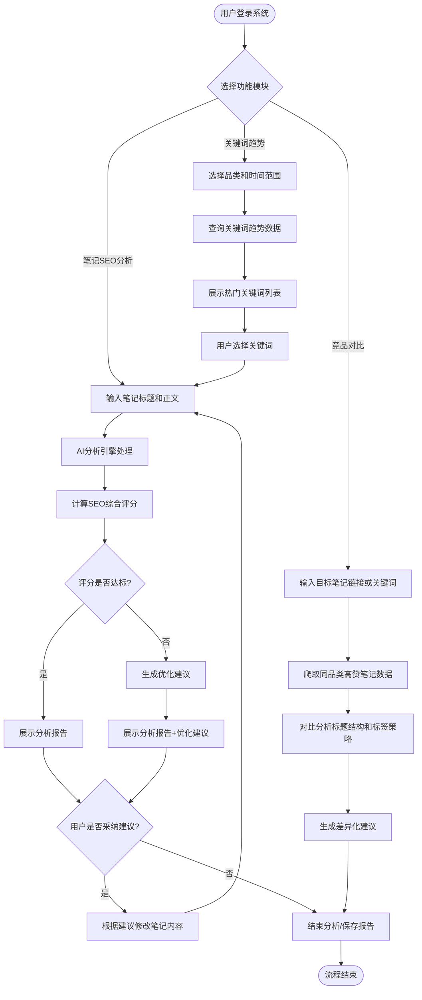
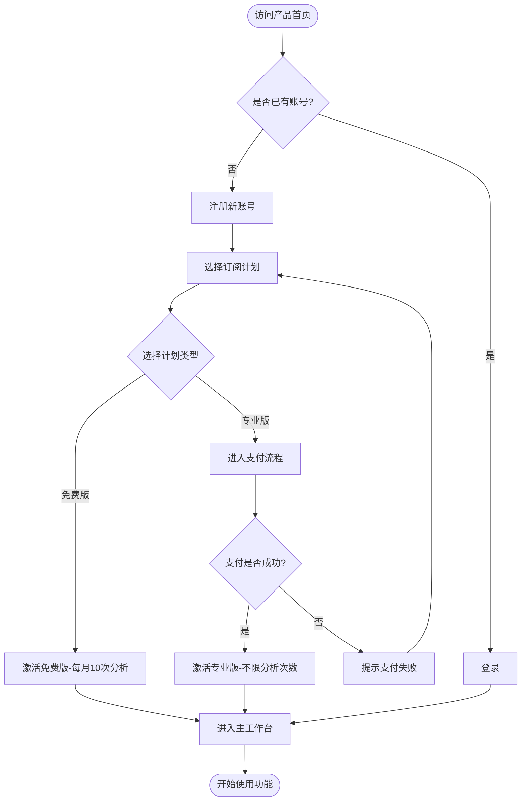
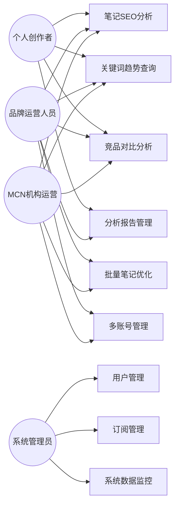
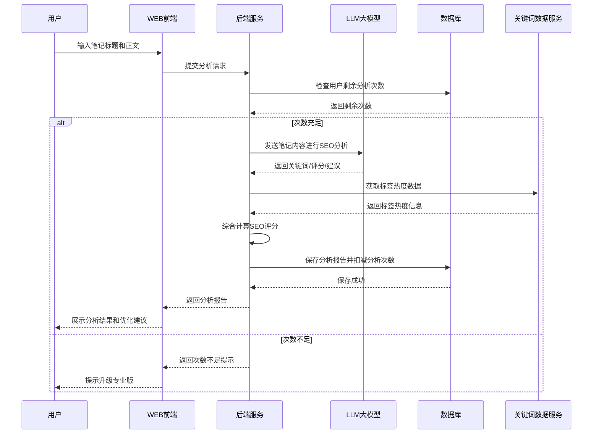
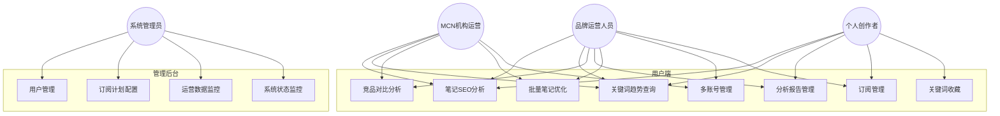
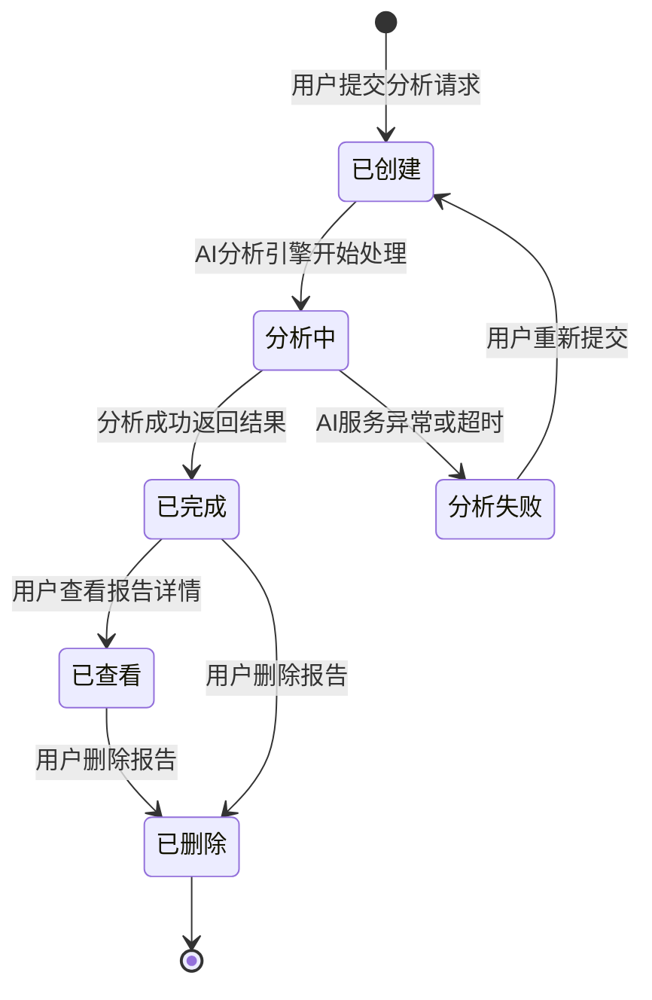
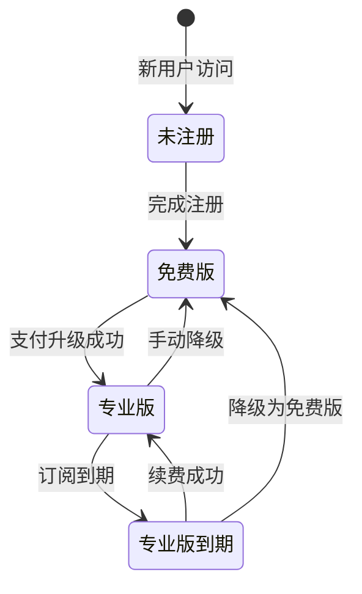

# 1. 需求概述

## 1.1 需求介绍

小红书笔记SEO优化工具是一款面向小红书内容创作者和品牌运营人员的AI驱动SEO优化辅助工具。该产品基于"优特云-用户语言"五层软件架构思想设计，专注于笔记发布前的SEO优化分析环节，帮助用户通过科学的关键词策略和内容优化提升笔记在小红书平台搜索结果中的排名和曝光量。

随着小红书逐步成为年轻用户的重要搜索入口，平台搜索流量占比持续提升。然而，多数内容创作者缺乏SEO优化知识，笔记的关键词选取、标题撰写、标签配置等往往依赖个人经验，导致优质内容难以获得应有的搜索曝光。市场上现有的小红书工具（如千瓜、灰豚等）主要聚焦于数据分析和监控，缺少专注于"发布前SEO优化"的轻量级工具。本产品正是针对这一市场空白而设计。

### 1.1.1 所属领域

社交媒体运营工具 / 内容创作辅助工具 / AI应用

## 1.2 需求目标

1. **降低SEO优化门槛**：让不懂SEO的小红书创作者也能通过AI分析获得专业的优化建议，提升笔记搜索曝光
2. **提供数据化决策依据**：通过SEO评分、关键词趋势、竞品对比等功能，让创作者从"凭感觉写"转变为"有数据支撑地写"
3. **提升内容创作效率**：通过AI自动分析和推荐，减少创作者在关键词调研、标题优化等环节的时间投入
4. **实现轻量化MVP**：在7-10天内完成核心功能上线，快速验证市场需求

## 1.3 系统使用角色

| 角色 | 描述 | 典型用户 |
|------|------|----------|
| 个人创作者（免费版） | 小红书内容创作者，每月分析需求较少 | 个人博主、KOC、小红书新手用户 |
| 个人创作者（专业版） | 小红书内容创作者，有高频分析和深度优化需求 | 成熟博主、KOL、自媒体从业者 |
| 品牌运营人员 | 负责品牌小红书账号的日常运营 | 品牌方市场部运营人员 |
| MCN机构运营人员 | 负责多个小红书账号的矩阵运营管理 | MCN机构运营团队、账号矩阵管理者 |
| 系统管理员 | 负责系统后台管理、用户管理、数据分析 | 平台运营团队 |

## 1.4 业务流程图

### 1.4.1 笔记SEO分析主流程

### 1.4.2 用户注册与订阅流程

### 1.4.3 系统角色用例图

# 2. 功能原型

| 原型名称 | 原型链接 | 对应端 | 备注 |
| --- | --- | --- | --- |
| 小红书笔记SEO优化工具 - 用户端 | 待UI原型设计完成后补充 | WEB端 | 主产品界面，包含笔记分析、关键词趋势、竞品对比等核心功能 |
| 小红书笔记SEO优化工具 - 管理后台 | 待UI原型设计完成后补充 | WEB端 | 系统管理后台，包含用户管理、订阅管理、数据监控等功能 |

# 3. 需求清单

## 3.1 用户端 - WEB端

### 3.1.1 账户与订阅管理模块

| 模块 | 一级功能 | 二级功能 | 功能描述 | 备注 |
| --- | --- | --- | --- | --- |
| 账户管理 | 用户注册 | 手机号注册 | 用户通过手机号和验证码完成注册 | 支持短信验证码 |
| 账户管理 | 用户注册 | 微信授权注册 | 用户通过微信扫码授权快速注册 | MVP阶段可选 |
| 账户管理 | 用户登录 | 手机号登录 | 用户通过手机号和验证码登录系统 | |
| 账户管理 | 用户登录 | 微信授权登录 | 用户通过微信扫码授权快速登录 | MVP阶段可选 |
| 账户管理 | 个人中心 | 基本信息管理 | 查看和修改个人昵称、头像等基本信息 | |
| 账户管理 | 个人中心 | 修改密码 | 用户修改登录密码 | |
| 订阅管理 | 订阅计划查看 | 当前计划信息 | 展示用户当前订阅计划类型、剩余分析次数、到期时间等 | |
| 订阅管理 | 订阅计划查看 | 计划对比 | 展示免费版与专业版的功能对比 | |
| 订阅管理 | 订阅升级 | 在线支付升级 | 用户在线支付升级为专业版（¥29/月） | 需对接支付接口 |
| 订阅管理 | 订阅升级 | 支付结果确认 | 支付完成后确认订阅状态变更 | |
| 订阅管理 | 用量统计 | 本月分析次数 | 展示本月已使用分析次数和剩余额度 | 免费版每月10次限制 |
| 订阅管理 | 用量统计 | 用量超限提示 | 免费版用户分析次数用尽时提示升级 | |

### 3.1.2 笔记SEO分析模块

| 模块 | 一级功能 | 二级功能 | 功能描述 | 备注 |
| --- | --- | --- | --- | --- |
| 笔记输入 | 内容录入 | 标题输入 | 用户输入笔记标题（限20字以内） | 小红书标题字数限制 |
| 笔记输入 | 内容录入 | 正文输入 | 用户输入或粘贴笔记正文内容 | 支持文本粘贴 |
| 笔记输入 | 内容录入 | 图片OCR识别 | 用户上传图片，系统识别图片中的文字纳入分析 | MVP阶段可选 |
| SEO分析 | 关键词密度分析 | 关键词提取 | AI自动提取笔记中的核心关键词 | |
| SEO分析 | 关键词密度分析 | 密度计算 | 计算各关键词在全文中的出现频率和密度 | |
| SEO分析 | 关键词密度分析 | 密度评估 | 评估关键词密度是否合理（过高或过低均有提示） | |
| SEO分析 | 标题吸引力分析 | 标题评分 | AI评估标题的吸引力、是否包含关键词、是否有情感触发词 | |
| SEO分析 | 标题吸引力分析 | 标题改写建议 | 基于分析结果提供1-3个优化标题方案 | |
| SEO分析 | 标签匹配度分析 | 标签评估 | 评估笔记当前标签与内容的相关性和搜索热度 | |
| SEO分析 | 标签匹配度分析 | 标签推荐 | 基于笔记内容推荐5-10个高搜索热度标签 | |
| SEO分析 | 标签匹配度分析 | 标签数量建议 | 建议最佳标签数量和组合策略 | |
| SEO分析 | 综合评分 | SEO综合评分 | 综合关键词密度、标题吸引力、标签匹配度给出0-100分评分 | |
| SEO分析 | 综合评分 | 各维度分项得分 | 展示关键词、标题、标签各维度的分项得分 | |
| SEO分析 | 综合评分 | 评分等级标识 | 按评分划分为优秀/良好/一般/需优化四个等级 | |
| 优化建议 | 建议生成 | 标题优化建议 | 针对标题提供具体的改写方案 | |
| 优化建议 | 建议生成 | 关键词补充建议 | 建议需要在正文中补充的关键词及建议出现次数 | |
| 优化建议 | 建议生成 | 标签优化建议 | 推荐替换或新增的标签列表 | |
| 优化建议 | 建议生成 | 内容结构建议 | 建议正文的结构优化（如分段、重点前置等） | |
| 优化建议 | 报告管理 | 查看历史报告 | 查看过往分析的历史报告列表 | |
| 优化建议 | 报告管理 | 报告详情查看 | 查看单次分析的完整报告内容 | |
| 优化建议 | 报告管理 | 报告删除 | 删除不需要的历史分析报告 | |

### 3.1.3 关键词趋势模块

| 模块 | 一级功能 | 二级功能 | 功能描述 | 备注 |
| --- | --- | --- | --- | --- |
| 品类筛选 | 品类选择 | 品类列表展示 | 展示所有支持的品类分类（美妆/穿搭/美食/旅行/家居/母婴/健身/数码等） | |
| 品类筛选 | 品类选择 | 品类切换 | 用户切换不同品类查看对应的关键词趋势 | |
| 趋势查询 | 时间范围选择 | 近7天趋势 | 查询近7天内搜索热度上升的关键词 | 默认时间范围 |
| 趋势查询 | 时间范围选择 | 近30天趋势 | 查询近30天内搜索热度上升的关键词 | 专业版功能 |
| 趋势查询 | 关键词列表 | 热度排行 | 按搜索热度展示关键词排行列表 | |
| 趋势查询 | 关键词列表 | 上升趋势标识 | 标识搜索热度上升趋势最明显的关键词 | |
| 趋势查询 | 关键词列表 | 竞争度参考 | 展示关键词对应的笔记竞争程度（高/中/低） | |
| 趋势查询 | 关键词详情 | 关键词热度曲线 | 展示单个关键词在所选时间范围内的搜索热度变化曲线 | |
| 趋势查询 | 关键词详情 | 相关词推荐 | 展示与目标关键词相关的长尾词和关联词 | |
| 趋势应用 | 关键词收藏 | 添加收藏 | 将感兴趣的关键词添加到个人收藏列表 | |
| 趋势应用 | 关键词收藏 | 收藏管理 | 查看和管理已收藏的关键词列表 | |
| 趋势应用 | 快速分析 | 从关键词发起分析 | 基于选中的关键词直接跳转到笔记分析页面，预填关键词 | |

### 3.1.4 竞品对比模块

| 模块 | 一级功能 | 二级功能 | 功能描述 | 备注 |
| --- | --- | --- | --- | --- |
| 竞品输入 | 目标设定 | 关键词搜索竞品 | 用户输入关键词，系统检索该关键词下的高赞笔记 | |
| 竞品输入 | 目标设定 | 品类浏览竞品 | 按品类浏览当前热门的高赞笔记 | |
| 竞品分析 | 标题对比 | 标题结构拆解 | 分析竞品笔记标题的结构特点（疑问句、数字、情感词等） | |
| 竞品分析 | 标题对比 | 标题关键词对比 | 对比自身笔记与竞品标题的关键词重叠度和差异 | |
| 竞品分析 | 标签对比 | 标签策略分析 | 分析竞品笔记的标签使用策略和热门标签 | |
| 竞品分析 | 标签对比 | 标签差异建议 | 基于竞品标签策略给出差异化标签建议 | |
| 竞品分析 | 内容对比 | 内容结构对比 | 对比自身笔记与竞品在内容结构上的差异 | |
| 竞品分析 | 综合建议 | 差异化优化建议 | 综合标题、标签、内容对比结果给出差异化优化方案 | 专业版功能 |

### 3.1.5 工作台与数据看板模块

| 模块 | 一级功能 | 二级功能 | 功能描述 | 备注 |
| --- | --- | --- | --- | --- |
| 工作台 | 快捷入口 | 功能导航 | 提供笔记分析、关键词趋势、竞品对比等功能的快捷入口 | |
| 工作台 | 快捷入口 | 最近分析 | 展示最近的分析记录，支持快速查看和继续优化 | |
| 工作台 | 数据看板 | 分析统计概览 | 展示本月分析次数、平均SEO评分、评分趋势等数据 | |
| 工作台 | 数据看板 | 评分趋势图 | 以折线图展示近期笔记SEO评分的变化趋势 | |
| 工作台 | 数据看板 | 品类分析分布 | 以饼图展示各品类分析次数占比 | |
| 批量优化 | 批量导入 | 批量笔记录入 | 支持批量导入多篇笔记内容进行分析 | 专业版功能 |
| 批量优化 | 批量导入 | CSV文件导入 | 通过上传CSV文件批量导入笔记数据 | 专业版功能 |
| 批量优化 | 批量结果 | 批量分析报告 | 批量分析完成后生成汇总报告 | 专业版功能 |
| 多账号管理 | 账号列表 | 添加子账号 | 添加需要管理的子账号 | 专业版功能 |
| 多账号管理 | 账号列表 | 切换账号 | 在不同管理账号间切换查看数据 | 专业版功能 |
| 多账号管理 | 数据统计 | 各账号数据汇总 | 汇总展示各管理账号的分析数据 | 专业版功能 |

## 3.2 管理后台 - WEB端

### 3.2.1 用户管理模块

| 模块 | 一级功能 | 二级功能 | 功能描述 | 备注 |
| --- | --- | --- | --- | --- |
| 用户管理 | 用户列表 | 用户搜索 | 按手机号/昵称搜索用户 | |
| 用户管理 | 用户列表 | 用户信息查看 | 查看用户基本信息、订阅状态、使用情况 | |
| 用户管理 | 用户操作 | 用户封禁/解封 | 对违规用户进行封禁或解封操作 | |
| 用户管理 | 用户操作 | 手动调整订阅 | 管理员手动为用户调整订阅计划 | |

### 3.2.2 订阅与收入管理模块

| 模块 | 一级功能 | 二级功能 | 功能描述 | 备注 |
| --- | --- | --- | --- | --- |
| 订阅管理 | 订阅统计 | 订阅用户统计 | 展示各订阅计划的用户数量和转化率 | |
| 订阅管理 | 订阅统计 | 收入统计 | 展示月度/季度/年度收入数据 | |
| 订阅管理 | 订阅计划配置 | 计划参数配置 | 配置各订阅计划的价格、功能权限、分析次数限制等 | |

### 3.2.3 系统监控模块

| 模块 | 一级功能 | 二级功能 | 功能描述 | 备注 |
| --- | --- | --- | --- | --- |
| 系统监控 | 运营数据 | 日活跃用户数 | 展示DAU、MAU等核心运营指标 | |
| 系统监控 | 运营数据 | 功能使用统计 | 各功能模块的使用次数和频率统计 | |
| 系统监控 | 异常监控 | AI服务状态 | 监控AI分析服务的可用性和响应状态 | |
| 系统监控 | 异常监控 | 关键词数据更新状态 | 监控关键词趋势数据的更新时效性 | |

# 4. 非功能需求

## 4.1 使用界面需求

| 需求项 | 需求描述 | 优先级 |
|--------|----------|--------|
| 响应式布局 | 用户端WEB页面需支持主流浏览器（Chrome、Safari、Edge）的响应式展示，最小支持宽度1024px | P0 |
| 深色模式 | 支持浅色/深色两种主题模式切换 | P2 |
| 操作引导 | 新用户首次使用时提供功能引导，帮助用户快速了解核心功能 | P1 |
| 分析报告可视化 | SEO评分和各项分析结果以图表、进度条等可视化方式呈现 | P0 |
| 加载状态反馈 | 所有AI分析操作需展示加载进度和预估时间 | P1 |

## 4.2 软硬件环境需求

| 需求项 | 需求描述 | 优先级 |
|--------|----------|--------|
| 浏览器兼容性 | 支持Chrome 90+、Safari 14+、Edge 90+、Firefox 90+ | P0 |
| 网络环境 | 需稳定的互联网连接，建议带宽≥2Mbps | P1 |
| 部署环境 | 云端部署（支持主流云服务如阿里云/腾讯云） | P0 |

## 4.3 性能需求

| 需求项 | 需求描述 | 优先级 |
|--------|----------|--------|
| SEO分析响应时间 | 单篇笔记SEO分析应在10秒内返回结果 | P0 |
| 关键词趋势查询 | 关键词趋势列表加载时间不超过3秒 | P0 |
| 竞品对比分析 | 单次竞品对比分析应在30秒内完成 | P1 |
| 系统并发支持 | 支持至少100个用户同时进行SEO分析操作 | P1 |
| 系统可用性 | 系统可用性≥99.5%（月度） | P0 |
| 数据更新频率 | 关键词趋势数据每日更新一次 | P1 |

## 4.4 约束性需求

| 需求项 | 需求描述 | 优先级 |
|--------|----------|--------|
| 平台数据合规 | 竞品对比功能获取的笔记数据需遵守小红书平台的使用条款和数据合规要求 | P0 |
| AI服务依赖 | SEO分析和优化建议功能依赖外部大语言模型（LLM）服务，需考虑服务降级策略 | P0 |
| 分析次数限制 | 免费版用户每月限10次分析，达到上限后不再提供分析服务直到次月重置 | P0 |
| 不做通用数据平台 | 产品定位为轻量SEO优化工具，不应演变为通用的内容生成平台或数据分析平台 | P0 |
| 后台服务支撑 | 本系统需要后台服务支撑，包括用户认证、AI分析调度、关键词数据存储等 | P0 |
| 付费功能隔离 | 专业版功能（竞品对比、批量优化、多账号管理、30天趋势）需与免费版功能严格隔离 | P0 |

# 5. 接口需求

## 5.2 软件接口需求

| 模块 | 接口名称 | 输入 | 输出 | 功能描述 |
| --- | --- | --- | --- | --- |
| 笔记SEO分析 | LLM分析接口 | 笔记标题、正文文本 | 关键词列表、关键词密度、SEO评分、优化建议文本 | 调用大语言模型进行笔记内容的SEO分析，返回分析结果 |
| 笔记SEO分析 | 标签数据接口 | 品类分类、标签关键词 | 标签热度排名、相关标签列表 | 获取小红书标签的热度数据，用于标签推荐和评估 |
| 关键词趋势 | 关键词数据接口 | 品类分类、时间范围 | 关键词列表、搜索热度值、趋势数据 | 获取各品类下的搜索关键词趋势数据 |
| 关键词趋势 | 关键词详情接口 | 关键词名称、时间范围 | 热度曲线数据、相关词列表 | 获取单个关键词的详细热度趋势和关联词 |
| 竞品对比 | 笔记检索接口 | 关键词或品类 | 高赞笔记列表（标题、标签、点赞数等） | 检索指定关键词或品类下的高赞笔记数据 |
| 竞品对比 | 笔记详情接口 | 笔记ID | 笔记完整标题、正文、标签列表 | 获取单篇笔记的详细内容用于对比分析 |
| 用户认证 | 短信验证码接口 | 手机号 | 验证码发送结果 | 调用短信服务向用户手机发送验证码 |
| 用户认证 | 微信OAuth接口 | 微信授权码 | 用户OpenID、昵称、头像 | 通过微信开放平台获取用户授权信息 |
| 订阅支付 | 支付接口 | 订阅计划信息、支付金额 | 支付结果、交易流水号 | 对接第三方支付平台完成专业版订阅支付 |
| 订阅支付 | 订阅状态查询接口 | 用户ID | 当前订阅计划、到期时间、剩余次数 | 查询用户当前的订阅状态和用量信息 |

# 6. 附录

## 流程图

### 6.1 笔记SEO分析详细流程

## 用例图

### 6.2 核心功能用例

## 状态图

### 6.3 分析报告状态

### 6.4 用户订阅状态

