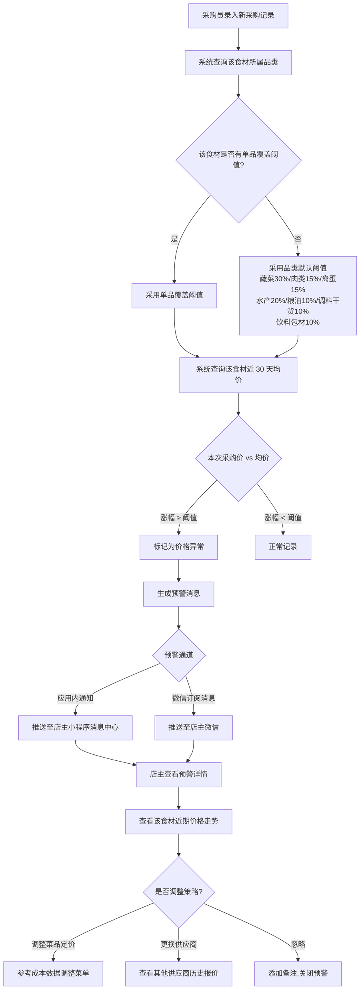
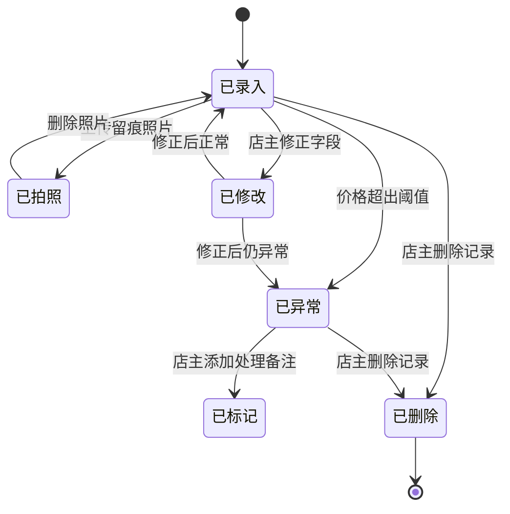
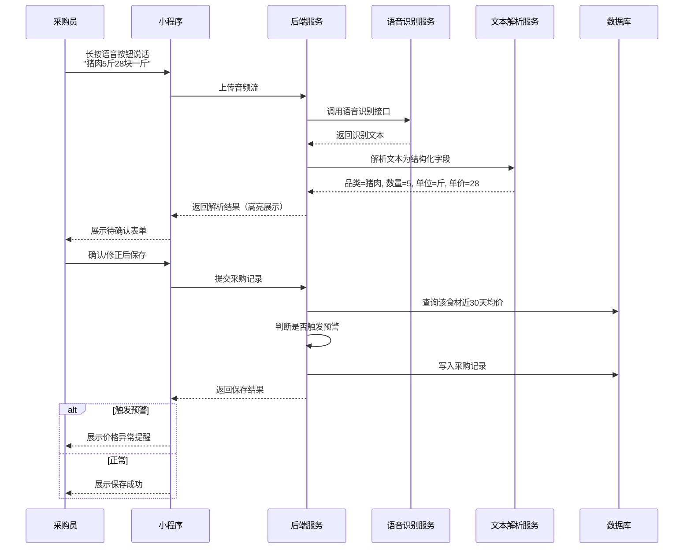
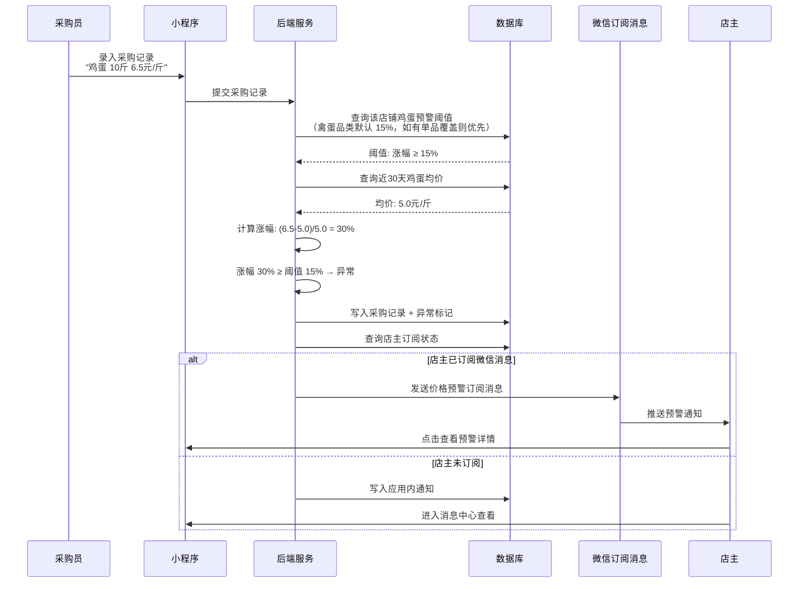
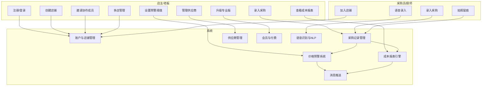

# 小餐馆食材采购记录本 — 用户需求说明书（URS）

> 版本：v1.1（定稿版） | 编写日期：2026-06-28 | 编写人：需求文档结对写作专家
> 状态：已根据领域专家A反馈完成更新，可交付产品文档结对写作专家开始 PRD 与 UI 原型设计

**变更记录：**
- v1.0（2026-06-28）：初稿
- v1.1（2026-06-28）：根据领域专家A反馈定稿：(1) 免费版数据保留策略维持 30 天，新增第 25/29 天临界提醒机制，归档后保留条数可见但详情不可查看；(2) 专业版定价调整为月付 ¥29 / 季付 ¥69（约 79 折）/ 年付 ¥268（约 77 折，折合 ¥22.3/月），升级引导页增加"每天不到 1 块钱"心理锚点；(3) 语音录入 MVP 采用"识别 → 确认 → 保存"两步模式，关键字段高亮 + 极大确认按钮（湿手可按）+ 高置信度（>95%）5 秒自动保存，支持用户设置项关闭/切换直接保存；(4) 价格预警阈值改为按品类差异化默认值（蔬菜 30% / 肉类 15% / 禽蛋 15% / 水产 20% / 粮油 10% / 调料干货 10% / 饮料包材 10%），MVP 支持单品覆盖，V1.1 引入智能推荐；(5) 离线同步策略改为"全量保留 + 智能检测疑似重复 + 消息中心推送用户选择"，明确"离线期间的所有录入均视为独立记录，联网后全量同步，不自动覆盖或合并"。

---

# 1. 需求概述

## 1.1 需求介绍

小餐馆食材采购记录本是一款面向 1-5 人规模小餐馆、快餐店、面馆、奶茶店的轻量级移动端记录工具。该系统聚焦"每日采购记录 + 成本分析"核心场景，帮助不会用 Excel、不依赖复杂 ERP 的小餐饮经营者，用手机快速完成每日食材采购记账，自动生成成本日报/周报/月报，并在常用食材价格异常波动时给出及时提醒。产品定位为纯记录工具，不绑定任何供应商，避开美团快驴等供应链平台的"采购+配送"路线，以中立、轻量、易上手为差异化切入点。

### 1.1.1 所属领域

小餐饮经营服务行业（小型餐馆、快餐店、面馆、粉店、奶茶店、早餐店等小微餐饮主体）

## 1.2 需求目标

1. **采购记录极简**：让店主/厨师在采购现场 30 秒内完成一条采购记录（品类、数量、单价、供应商），支持拍照留痕（小票/食材照片）和语音录入（腾出手的采购场景），取代纸笔与零散微信聊天记录。
2. **成本分析傻瓜化**：自动生成食材成本日报、周报、月报，以图表方式展示成本趋势、品类占比、异常波动，让不会用 Excel 的店主也能"看懂账、算清账"。
3. **价格异常及时提醒**：支持为常用食材（如猪肉、青菜、鸡蛋）按品类设置差异化价格波动阈值（蔬菜 30%、肉类 15%、粮油 10% 等，用户可单品覆盖），当采购价显著高于近期均价时自动推送提醒，帮助店主及时发现异常、调整采购策略或菜品定价。
4. **小店经营闭环**：以 MVP 7 天可交付为目标，聚焦单店核心业务闭环，不做餐饮 ERP、不做供应链平台、不做外卖对接，确保产品轻量、垂直、零学习成本。

## 1.3 系统使用角色

| 角色 | 说明 | 典型用户 |
| --- | --- | --- |
| 店主/老板（主账户） | 店铺的拥有者，负责采购记账、查看成本报表、设置价格预警阈值、管理店铺信息 | 小餐馆老板、夫妻店老板、奶茶店店长 |
| 采购员/厨师（协作角色） | 被店主授权录入采购记录，但无法查看成本报表与店铺设置 | 店内厨师、采购帮工 |
| 多店老板（专业版） | 拥有多家门店的连锁小餐饮老板，可跨店查看汇总数据 | 开 2-3 家面馆/奶茶店的区域小老板 |

## 1.4 业务流程图

### 1.4.1 采购记录主流程

```mermaid
flowchart TD
    A[店主/采购员打开小程序] --> B[进入首页"今日采购"]
    B --> C{选择录入方式}
    C -- 手工录入 --> D[选择食材品类<br/>可从常用库选择]
    C -- 语音录入 --> E[按住说话<br/>"猪肉5斤28块一斤"]
    C -- 拍照识别 --> F[拍摄小票/食材]
    D --> G[填写数量、单价、供应商<br/>系统自动计算金额]
    E --> H[系统语音识别自动填入<br/>品类/数量/单价<br/>关键字段高亮]
    F --> I[OCR识别小票信息<br/>或仅作为留痕照片]
    H --> J{识别置信度}
    J -- 高置信度 >95%<br/>且未关闭自动保存 --> K[5 秒倒计时自动保存<br/>用户可手动修正]
    J -- 低置信度 ≤95%<br/>或已关闭自动保存 --> L[展示待确认表单<br/>极大确认按钮<br/>湿手可按]
    I --> J
    K --> M[保存采购记录]
    L --> M
    G --> M
    M --> N{是否需要拍照留痕?}
    N -- 是 --> O[拍照上传小票/食材照]
    N -- 否 --> P[最终保存]
    O --> P
    P --> Q{价格是否超出该品类的阈值?}
    Q -- 是 --> R[系统弹出价格异常提醒<br/>并记录异常标记]
    Q -- 否 --> S[记录正常保存<br/>计入当日成本]
    R --> S
```

### 1.4.2 成本报表生成与查看流程

```mermaid
flowchart TD
    A[店主进入"成本报表"] --> B{选择报表类型}
    B -- 日报 --> C[展示今日食材成本汇总<br/>总成本、品类占比、对比昨日]
    B -- 周报 --> D[展示本周成本趋势<br/>日均成本、环比变化、异常天数标记]
    B -- 月报 --> E[展示本月成本趋势<br/>月度总额、品类占比、同比/环比]
    C --> F{是否发现异常?}
    D --> F
    E --> F
    F -- 是 --> G[点击异常数据<br/>下钻查看明细]
    F -- 否 --> H[关闭报表]
    G --> I[查看具体采购记录<br/>定位价格异常项]
    I --> J{是否需要处理?}
    J -- 调整阈值 --> K[进入预警设置]
    J -- 联系供应商 --> L[查看供应商联系方式]
    J -- 标记原因 --> M[添加异常备注<br/>如"春节涨价"]
```

### 1.4.3 价格异常预警流程



### 1.4.4 供应商对账流程（专业版）

```mermaid
flowchart TD
    A[店主进入"供应商对账"] --> B[选择供应商]
    B --> C[系统汇总该供应商本期所有采购记录]
    C --> D[生成对账单<br/>含品类、数量、单价、金额]
    D --> E{对账方式}
    E -- 系统对账 --> F[系统自动匹配<br/>标记差异项]
    E -- 人工对账 --> G[店主逐项核对]
    F --> H[差异项高亮展示]
    G --> H
    H --> I[店主确认对账结果]
    I --> J[生成本期应付金额]
    J --> K{支付标记}
    K -- 已结清 --> L[标记为已付款]
    K -- 未结清 --> M[标记为待付款<br/>记录欠款金额]
```

---

# 2. 功能原型

| 原型名称 | 原型链接 | 对应端 | 备注 |
| --- | --- | --- | --- |
| 采购记录小程序 | 见配套 UI 原型文件 | 小程序端 | 日常采购录入、报表查看、预警接收 |
| 店铺管理后台（轻量Web） | 见配套 UI 原型文件 | WEB端 | 店铺设置、阈值配置、多店管理（仅专业版） |

---

# 3. 需求清单

## 3.1 店主/采购员端 — 小程序端

| 模块 | 一级功能 | 二级功能 | 功能描述 | 备注 |
| --- | --- | --- | --- | --- |
| 账户与登录 | 用户注册与登录 | 微信授权登录 | 通过微信小程序一键授权登录，获取微信昵称/头像 | MVP 必须 |
| 账户与登录 | 用户注册与登录 | 手机号绑定 | 首次登录后绑定手机号，用于接收微信订阅消息及账号找回 | MVP 必须 |
| 账户与登录 | 用户注册与登录 | 短信验证码登录 | 支持手机号+短信验证码登录（无微信场景备用） | |
| 账户与登录 | 店铺绑定 | 创建店铺 | 首次登录引导创建店铺（店名、品类、地址、经营类型） | MVP 必须 |
| 账户与登录 | 店铺绑定 | 加入店铺 | 通过店铺邀请码加入他人创建的店铺，作为协作角色 | MVP 必须 |
| 账户与登录 | 协作成员管理 | 邀请采购员/厨师 | 生成邀请码或小程序码，邀请他人加入店铺，分配"采购员"角色 | MVP 必须 |
| 账户与登录 | 协作成员管理 | 成员列表与权限 | 查看店内成员，店主可移除成员、调整角色 | MVP 必须 |
| 采购记录 | 快速录入 | 手工录入 | 选择食材品类（从常用库选择或手动输入）→填写数量、单价、供应商（可选）→系统自动计算金额→保存 | MVP 必须 |
| 采购记录 | 快速录入 | 语音录入 | 按住说话（如"猪肉5斤28块一斤"）→系统语音识别自动解析品类/数量/单价并高亮关键字段→进入"识别→确认→保存"两步模式：识别置信度 >95% 时 5 秒倒计时自动保存（用户可手动修正），置信度 ≤95% 时弹出待确认表单，确认按钮极大极醒目（适配湿手场景）→保存 | MVP 必须 |
| 采购记录 | 快速录入 | 语音录入设置 | 用户可在设置中关闭"高置信度自动保存"，或切换为"直接保存"模式（跳过确认步骤，依赖用户后续修正） | MVP 必须 |
| 采购记录 | 快速录入 | 拍照识别（小票OCR） | 拍摄采购小票→OCR识别金额、品类、数量→自动填充表单→用户确认后保存 | |
| 采购记录 | 快速录入 | 拍照留痕 | 为任意采购记录拍照（食材照片/小票照片）作为凭证，支持多张 | MVP 必须 |
| 采购记录 | 快速录入 | 常用食材快捷选择 | 常用食材库置顶显示，点击即用，减少输入 | MVP 必须 |
| 采购记录 | 快速录入 | 供应商快捷选择 | 常用供应商下拉选择，支持"记一下"临时供应商 | MVP 必须 |
| 采购记录 | 采购历史 | 今日采购列表 | 按时间倒序展示今日所有采购记录，含品类、数量、金额、供应商、是否异常 | MVP 必须 |
| 采购记录 | 采购历史 | 历史采购查询 | 按日期范围、食材品类、供应商筛选历史采购记录 | MVP 必须 |
| 采购记录 | 采购历史 | 采购记录详情 | 查看单条采购记录的完整信息（含照片、备注、异常标记） | MVP 必须 |
| 采购记录 | 采购历史 | 修改/删除采购记录 | 修改或删除错误的采购记录（店主权限，协作角色仅可修改自己录入的） | MVP 必须 |
| 采购记录 | 采购模板 | 常用采购清单 | 保存常用采购组合（如"周一固定采购清单"），一键复制为今日采购 | |
| 成本报表 | 日报 | 今日成本汇总 | 展示今日食材总成本、各品类占比、与昨日对比 | MVP 必须 |
| 成本报表 | 周报 | 本周成本趋势 | 展示本周每日成本趋势图、日均成本、环比上周变化、异常天数标记 | MVP 必须 |
| 成本报表 | 月报 | 本月成本分析 | 展示本月成本趋势、月度总额、品类占比饼图、同比/环比分析 | MVP 必须 |
| 成本报表 | 报表下钻 | 异常数据下钻 | 点击异常数据项（如某日猪肉成本突增），跳转查看具体采购明细 | MVP 必须 |
| 成本报表 | 报表下钻 | 品类趋势查看 | 查看单一食材（如猪肉）在近 7/30/90 天的价格走势曲线 | |
| 成本报表 | 报表导出 | 导出PDF/图片 | 将报表导出为PDF或长图，方便转发给合伙人或打印 | |
| 成本报表 | 经营参考 | 食材成本率 | 结合店主录入的日营业额，自动计算食材成本率（成本/营收），展示健康区间参考 | |
| 价格预警 | 阈值设置 | 品类默认阈值 | 系统按食材品类预置差异化默认预警阈值：蔬菜 30% / 肉类 15% / 禽蛋 15% / 水产 20% / 粮油 10% / 调料干货 10% / 饮料包材 10%，用户无需逐个配置即可开箱即用 | MVP 必须 |
| 价格预警 | 阈值设置 | 单品阈值覆盖 | 针对特定食材单独设置阈值（如鸡蛋对价格敏感，阈值可覆盖为 8%），覆盖值优先于品类默认值 | MVP 必须 |
| 价格预警 | 阈值设置 | 添加食材预警 | 为常用食材启用价格预警（默认启用并采用品类默认阈值），支持按绝对值或百分比设置 | MVP 必须 |
| 价格预警 | 阈值设置 | 预警通道选择 | 选择预警接收方式：应用内通知 / 微信订阅消息 | MVP 必须 |
| 价格预警 | 阈值设置 | 订阅微信提醒（一次性） | 授权接收微信订阅消息；因一次性订阅机制，需在关键触点引导再次订阅 | MVP 必须 |
| 价格预警 | 预警接收 | 价格异常通知 | 收到采购价超出阈值的提醒通知，点击查看预警详情 | MVP 必须 |
| 价格预警 | 预警接收 | 预警详情查看 | 查看预警食材的本次价格、近期均价、涨幅、历史价格走势 | MVP 必须 |
| 价格预警 | 预警处理 | 预警标记处理 | 对预警进行处理（已调整价格/已更换供应商/正常波动忽略），添加备注 | |
| 价格预警 | 预警记录 | 预警历史列表 | 查看历史所有价格预警记录及处理状态 | |
| 供应商管理 | 供应商库 | 添加/编辑供应商 | 录入供应商名称、联系人、电话、主营品类、备注 | MVP 必须 |
| 供应商管理 | 供应商库 | 供应商列表 | 查看所有供应商，按主营品类筛选 | MVP 必须 |
| 供应商管理 | 供应商对账（专业版） | 对账单生成 | 选择供应商+账期→系统自动汇总该供应商本期采购记录→生成对账单 | 专业版功能 |
| 供应商管理 | 供应商对账（专业版） | 差异项标记 | 自动标记与供应商对账时的差异项，支持人工调整 | 专业版功能 |
| 供应商管理 | 供应商对账（专业版） | 对账状态跟踪 | 标记对账状态（待对账/已确认/已结清） | 专业版功能 |
| 常用食材库 | 食材管理 | 系统预置食材库 | 系统按品类（蔬菜/肉类/水产/粮油/调料/干货/饮料）预置常用食材，用户一键启用 | MVP 必须 |
| 常用食材库 | 食材管理 | 自定义食材 | 用户添加系统预置库没有的食材，设置名称、单位、品类 | MVP 必须 |
| 常用食材库 | 食材管理 | 常用食材排序 | 拖拽调整常用食材顺序，高频采购的置顶 | |
| 常用食材库 | 食材管理 | 食材单位设置 | 设置每种食材的默认计量单位（斤/公斤/个/包/箱等），支持换算 | |
| 我的 | 店铺设置 | 店铺信息编辑 | 修改店名、地址、联系电话、经营类型、营业时间 | MVP 必须 |
| 我的 | 店铺设置 | 店铺类型选择 | 选择店铺类型（快餐/面馆/奶茶/早餐/正餐等），影响系统预置食材推荐 | |
| 我的 | 订阅管理 | 店铺邀请码 | 查看并复制店铺邀请码，用于邀请采购员/厨师加入 | MVP 必须 |
| 我的 | 订阅管理 | 微信订阅消息管理 | 查看订阅状态、重新授权订阅 | MVP 必须 |
| 我的 | 会员服务 | 会员版本查看 | 查看当前版本（免费版/专业版）、到期时间、升级入口 | MVP 必须 |
| 我的 | 会员服务 | 升级专业版 | 微信支付开通专业版，支持三档付费周期：月付 ¥29（每天不到 1 块钱心理锚点）/ 季付 ¥69（约 79 折，折合 ¥23/月）/ 年付 ¥268（约 77 折，折合 ¥22.3/月），升级引导页显著标注"每天不到 1 块钱"，解锁全部功能 | |
| 我的 | 数据备份 | 数据导出 | 将所有采购记录导出为 Excel/CSV 文件（专业版功能） | 专业版功能 |
| 我的 | 数据备份 | 云端同步 | 数据自动同步至云端，换设备登录数据不丢失 | MVP 必须 |
| 我的 | 免费版数据归档 | 临界提醒（第 25 天） | 免费版用户进入第 25 天时，应用内推送提醒"您有 XX 条记录将在 5 天后归档"，引导升级专业版 | MVP 必须 |
| 我的 | 免费版数据归档 | 最后提醒（第 29 天） | 免费版用户进入第 29 天时，最后一次推送提醒"您有 XX 条记录明天将归档" | MVP 必须 |
| 我的 | 免费版数据归档 | 归档后查看 | 超过 30 天的记录自动归档，归档后保留记录条数可见但详情不可查看（"看得见、摸不着"的升级动力），专业版用户可查看全部归档详情 | MVP 必须 |
| 我的 | 离线同步 | 离线录入 | 弱网/无网络环境（后厨、菜市场信号差）下支持本地缓存录入，联网后自动同步 | MVP 必须 |
| 我的 | 离线同步 | 全量同步不覆盖 | 离线期间的所有录入均视为独立记录，联网后全量同步，不自动覆盖或合并任何已有记录 | MVP 必须 |
| 我的 | 离线同步 | 冲突检测与标记 | 系统智能检测联网后疑似重复录入（相同食材+相同时间+相同金额），标记为"疑似重复"，但不自动删除 | MVP 必须 |
| 我的 | 离线同步 | 冲突处理推送 | 冲突标记以消息形式推送至消息中心（不弹窗打断），用户可在消息中心查看并逐条选择：保留全部 / 删除重复项 / 合并为一条 | MVP 必须 |

## 3.2 店铺管理后台 — WEB端（店主视角，专业版增强）

| 模块 | 一级功能 | 二级功能 | 功能描述 | 备注 |
| --- | --- | --- | --- | --- |
| 数据看板 | 成本概览 | 今日成本 | 展示今日食材总成本、与昨日对比、异常项数量 | MVP 必须 |
| 数据看板 | 成本概览 | 本周趋势 | 展示本周成本趋势折线图 | MVP 必须 |
| 数据看板 | 成本概览 | 品类占比 | 展示本月各品类成本占比饼图 | |
| 数据看板 | 预警看板 | 待处理预警 | 展示未处理的价格预警数量及列表 | |
| 预警设置 | 品类阈值配置 | 品类默认阈值管理 | 查看并调整 7 大品类的默认预警阈值（蔬菜/肉类/禽蛋/水产/粮油/调料干货/饮料包材），支持批量修改 | MVP 必须 |
| 预警设置 | 单品阈值配置 | 单品阈值覆盖 | 针对特定食材单独设置阈值（如鸡蛋对价格敏感，阈值设为 8%），覆盖值优先于品类默认值 | MVP 必须 |
| 预警设置 | 智能阈值推荐 | 历史数据智能推荐 | 基于该店铺历史采购数据，智能推荐各食材的最优阈值（如"鸡蛋建议 8%，您近 30 天波动多在 5%-12%"） | V1.1 迭代 |
| 店铺设置 | 基础信息 | 店铺信息维护 | 编辑店铺名称、类型、地址、营业时间、主营品类 | MVP 必须 |
| 店铺设置 | 食材库管理 | 食材库批量管理 | 启用/禁用系统预置食材、批量添加自定义食材 | MVP 必须 |
| 店铺设置 | 供应商管理 | 供应商列表管理 | 查看、编辑、删除供应商信息 | MVP 必须 |
| 店铺设置 | 协作成员 | 成员角色管理 | 管理店内成员、调整角色权限 | MVP 必须 |
| 多店管理（专业版） | 门店切换 | 门店列表 | 查看和管理所有连锁门店 | 专业版功能 |
| 多店管理（专业版） | 门店切换 | 跨店数据汇总 | 汇总所有门店的成本数据、预警信息 | 专业版功能 |
| 多店管理（专业版） | 统一配置 | 全局阈值同步 | 将预警阈值批量同步到各门店 | 专业版功能 |
| 多店管理（专业版） | 统一配置 | 供应商库共享 | 跨门店共享供应商库 | 专业版功能 |

---

# 4. 非功能需求

## 4.1 使用界面需求

| 需求项 | 说明 |
| --- | --- |
| 小程序端界面风格 | 清爽、朴实、贴近"记账本"质感，主色调建议采用暖色系（如米黄+草绿），避免冰冷的商务感，符合小餐馆店主审美 |
| Web端界面风格 | 简洁数据看板风格，以图表为主，操作按钮大而明显 |
| 录入页交互 | 大按钮、大字体、高对比度，适配厨房湿手、忙碌环境下的快速操作；关键操作（保存、删除）需明确二次确认 |
| 语音录入交互 | 按住说话、松开识别，识别结果关键字段（品类/数量/单价）以高亮方式展示；进入"识别→确认→保存"两步模式：识别置信度 >95% 时显示 5 秒倒计时自动保存（用户可中途手动修正），置信度 ≤95% 时弹出待确认表单；**确认按钮必须极大极醒目**（适配厨房湿手场景），支持在设置中关闭自动保存或切换为"直接保存"模式 |
| 响应式设计 | Web端适配 1280px 及以上桌面屏幕；小程序端适配主流手机尺寸（含小屏 iPhone SE） |
| 照片上传 | 支持拍照和相册选择，自动压缩至合理大小，单张不超过 2MB；录入页支持边录入边预览 |
| 操作反馈 | 所有关键操作（保存、删除、确认、订阅授权）需有明确的成功/失败提示 |
| 订阅引导交互 | 因微信订阅消息为一次性订阅机制，**必须在关键触点设计强引导**：(1) 首次开启预警时引导订阅；(2) 每次预警推送后引导再次订阅；(3) "我的"页面显著位置展示订阅状态 |
| 离线容错 | 弱网环境（后厨、菜市场信号差）下支持本地缓存录入，联网后**全量同步、不自动覆盖或合并**；疑似重复记录由系统智能标记并推送至消息中心，由用户逐条选择处理方式（保留全部/删除/合并），不在录入时弹窗打断 |

## 4.2 软硬件环境需求

| 需求项 | 说明 |
| --- | --- |
| 小程序端运行环境 | 微信客户端 7.0 及以上版本 |
| Web端浏览器 | Chrome 90+、Edge 90+、Safari 14+、Firefox 90+ |
| 后端部署环境 | 云服务器（建议 2核4G 起步），MySQL 5.7+ / PostgreSQL 12+，Redis 缓存 |
| 微信订阅消息 | 需要已认证的微信小程序账号，开通订阅消息权限；需配置消息模板并经微信审核 | MVP 必须 |
| 语音识别服务 | 对接主流语音识别服务商（如腾讯云语音识别、阿里云智能语音），用于语音录入转文字 | MVP 必须 |
| OCR服务（可选） | 对接 OCR 服务商（如腾讯云 OCR、百度云 OCR），用于小票识别 | V1.1 迭代，MVP 不纳入 |
| 图片存储 | 对象存储服务（如阿里云 OSS、腾讯云 COS），用于存储采购照片 |
| 支付服务 | 微信支付（用于专业版订阅付费） | |

## 4.3 性能需求

| 需求项 | 指标 |
| --- | --- |
| 页面加载时间 | 小程序首屏加载 ≤ 2 秒，Web端页面加载 ≤ 1.5 秒 |
| 接口响应时间 | 常规查询类接口 ≤ 500ms，写入类接口 ≤ 1 秒 |
| 语音识别响应 | 语音转文字识别延迟 ≤ 2 秒（4G 网络环境） |
| 报表渲染 | 月报图表渲染 ≤ 1 秒（30 天数据量） |
| 并发支持 | 单店支持 ≤ 5 个协作角色同时操作，≤ 1000 个店主账号并发访问 |
| 照片上传 | 单张照片上传 ≤ 3 秒（4G网络环境） |
| 数据同步 | 离线缓存数据联网后 ≤ 10 秒内完成同步 |
| 预警推送 | 价格异常触发后 ≤ 1 分钟内推送至店主 |

## 4.4 约束性需求

1. **不做餐饮 ERP**：不提供完整的进销存、库存管理、菜品配方管理、后厨打印等重型餐饮 ERP 功能，明确定位为"采购记录 + 成本分析"轻量工具。
2. **不做供应链平台**：不接入任何供应商供货、不绑定采购渠道、不做 B2B 交易撮合，保持工具的中立性，避开美团快驴等平台的竞争。
3. **不做外卖/收银对接**：不接入美团/饿了么外卖订单，不对接收银系统，专注采购记录场景。
4. **不做多角色权限体系**：MVP 阶段仅区分"店主"和"采购员/厨师"两种角色，不做复杂的 RBAC 权限体系。
5. **微信小程序优先**：C 端优先基于微信小程序，不做独立 APP；降低小餐馆店主的使用门槛。
6. **需要后台服务**：需要后端服务支撑，包括数据持久化、语音识别、消息推送、文件存储、定时任务（报表生成、预警扫描）等。
7. **数据安全**：店主手机号等个人信息需加密存储；采购数据属于商业敏感信息，需按店铺严格隔离，协作角色间也需按权限隔离。
8. **免费版限制**：免费版仅保留最近 30 天数据（覆盖完整月结周期，符合小餐馆老板月结思维），超过 30 天的数据自动归档。**归档采用"看得见、摸不着"策略**：归档后保留记录条数可见但详情不可查看，以形成升级专业版的动力。系统在第 25 天推送"XX 条记录将在 5 天后归档"、第 29 天推送最后提醒。报表仅提供基础日报；不支持多店、对账、高级预警、数据导出。
9. **专业版价值明确**：专业版（月付 ¥29 / 季付 ¥69 / 年付 ¥268，升级引导页需标注"每天不到 1 块钱"心理锚点）的核心卖点必须明确：不限历史数据 + 归档数据完整查看 + 多店管理 + 供应商对账 + 高级成本预警 + 数据导出，让店主感知"每天不到 1 块钱换来清晰成本账"。

---

# 5. 接口需求

## 5.1 硬件接口需求

本项目不涉及硬件接口需求。

## 5.2 软件接口需求

| 模块 | 接口名称 | 输入 | 输出 | 功能描述 |
| --- | --- | --- | --- | --- |
| 用户认证 | 微信小程序登录接口 | 微信授权 code | openid、session_key | 用于小程序端用户身份认证 |
| 消息推送 | 微信订阅消息发送接口 | 消息模板ID、接收者openid、模板数据 | 发送结果（成功/失败） | 发送价格异常预警、订阅授权引导等通知（MVP 唯一消息通道） |
| 语音识别 | 语音转文字接口 | 音频文件（base64 或流式） | 识别文本 | 将用户语音录入转为文字，供系统解析为采购字段 |
| 自然语言处理 | 文本解析接口（内部） | 语音识别后的文本 | 结构化字段（品类/数量/单价） | 将"猪肉5斤28块一斤"类自然语言解析为采购记录字段 |
| OCR（V1.1） | 小票识别接口 | 图片文件 | 结构化字段（金额/品类/数量/商户） | 识别采购小票内容，**V1.1 迭代，MVP 不纳入** |
| 文件存储 | 图片上传接口 | 图片文件（multipart） | 图片 URL | 上传采购留痕照片 |
| 支付 | 微信支付接口 | 订单信息（金额、商品描述） | 支付结果 | 专业版订阅付费 |
| 基础数据 | 系统预置食材库接口 | 店铺类型 | 食材列表（按品类分组） | 提供系统预置食材数据源 |

## 5.3 内部接口需求

| 模块 | 接口名称 | 输入 | 输出 | 功能描述 |
| --- | --- | --- | --- | --- |
| 成本计算 | 成本汇总接口 | 店铺ID、日期范围 | 总成本、品类明细、同比/环比 | 计算指定时间段的成本数据，供报表使用 |
| 预警判断 | 价格异常判断接口 | 食材ID、本次单价 | 是否异常、涨幅、近期均价 | 判断本次采购价是否触发预警阈值 |
| 报表生成 | 定时报表生成任务 | 店铺ID、日期 | 报表数据 | 每日凌晨自动生成昨日日报，每周一生成上周周报，每月1号生成上月月报 |

## 5.4 通讯接口需求

本项目不涉及硬件通讯接口需求。所有通讯基于 HTTPS 协议。

---

# 6. 附录

## 流程图

### 免费版数据归档流程

> **设计原则**：30 天覆盖完整月结周期，符合小餐馆老板月结思维；"看得见、摸不着"的归档策略为升级专业版提供持续动力。

```mermaid
flowchart TD
    A[每日凌晨定时任务] --> B[扫描所有免费版店铺]
    B --> C{当前日期 - 最早记录日期}
    C -- 满 25 天 --> D[推送临界提醒<br/>"您有 XX 条记录将在 5 天后归档"]
    C -- 满 29 天 --> E[推送最后提醒<br/>"您有 XX 条记录明天将归档"]
    C -- 满 30 天 --> F[将最早一天的记录标记为"已归档"]
    D --> G[用户在应用内/微信收到提醒]
    E --> G
    F --> H[归档记录保留条数可见]
    H --> I[用户点击归档记录]
    I --> J[提示"该记录详情仅专业版可查看"]
    J --> K{是否升级?}
    K -- 是 --> L[跳转升级专业版页]
    K -- 否 --> M[保留归档状态]
    L --> N[升级后所有归档记录<br/>详情恢复查看]
```

### 离线同步冲突处理流程

> **核心原则**：采购记录 = 钱的流水，绝对不能丢数据。离线期间的所有录入均视为独立记录，联网后全量同步，不自动覆盖或合并。

```mermaid
flowchart TD
    A[用户在无网络环境录入采购] --> B[记录保存至本地缓存]
    B --> C[联网恢复]
    C --> D[本地缓存记录全量上传]
    D --> E[后端接收离线记录]
    E --> F{是否与已有记录疑似重复?<br/>相同食材+相同时间+相同金额}
    F -- 否 --> G[直接写入数据库<br/>作为独立记录]
    F -- 是 --> H[写入数据库<br/>标记为"疑似重复"]
    G --> I[同步完成]
    H --> J[生成冲突处理消息<br/>推送至消息中心<br/>不弹窗打断]
    J --> K[用户进入消息中心]
    K --> L[查看疑似重复记录对比]
    L --> M{用户选择处理}
    M -- 保留全部 --> N[取消重复标记<br/>视为两条独立记录]
    M -- 删除重复项 --> O[删除其中一条]
    M -- 合并为一条 --> P[合并字段<br/>保留更完整信息]
    N --> Q[冲突处理完成]
    O --> Q
    P --> Q
```

### 会员版本升级流程

```mermaid
flowchart LR
    A[免费版用户] --> B{触发升级提示}
    B -- 查看30天以上数据 --> C[弹出升级引导<br/>标注"每天不到1块钱"]
    B -- 使用多店功能 --> C
    B -- 使用对账功能 --> C
    B -- 第25天归档提醒 --> C
    B -- 第29天最后提醒 --> C
    C --> D[点击升级专业版]
    D --> E[选择付费周期<br/>月付¥29/季付¥69/年付¥268]
    E --> F[微信支付]
    F --> G{支付成功?}
    G -- 是 --> H[立即升级为专业版<br/>解锁全部功能+归档数据]
    G -- 否 --> I[提示支付失败<br/>引导重试]
    H --> J[专业版到期前7天提醒续费]
```

### 采购记录状态流转



## 时序图

### 语音录入采购时序



### 价格预警推送时序



## （用户与系统交互）用例图



---

> **文档定稿说明**：本文档为 v1.1 定稿版，已根据领域专家A反馈完成全部 5 项关键决策的更新：
> 1. ✅ 免费版 30 天数据保留 + 第 25/29 天临界提醒 + 归档"看得见、摸不着"策略
> 2. ✅ 专业版三档定价：月付 ¥29 / 季付 ¥69（79 折）/ 年付 ¥268（77 折，¥22.3/月），含"每天不到 1 块钱"心理锚点
> 3. ✅ 语音录入"识别→确认→保存"两步模式 + 高置信度自动保存 + 湿手大按钮 + 用户设置项
> 4. ✅ 价格预警按品类差异化默认阈值（蔬菜 30% / 肉类 15% / 禽蛋 15% / 水产 20% / 粮油 10% / 调料干货 10% / 饮料包材 10%）+ 单品覆盖 + V1.1 智能推荐
> 5. ✅ 离线同步"全量保留 + 智能检测疑似重复 + 消息中心推送用户选择"，明确"离线期间的所有录入均视为独立记录，联网后全量同步，不自动覆盖或合并"
>
> **V1.1 迭代清单**（已明确排除出 MVP）：
> - 小票 OCR 识别
> - 报表导出 PDF/图片
> - 经营参考（食材成本率计算，需店主录入营业额）
> - 常用采购清单模板
> - 价格预警智能阈值推荐（基于历史数据）
>
> **后续流程**：需求文档已定稿，交由产品文档结对写作专家开始 PRD 和 UI 原型设计。
